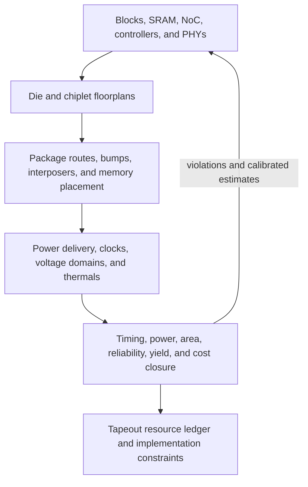
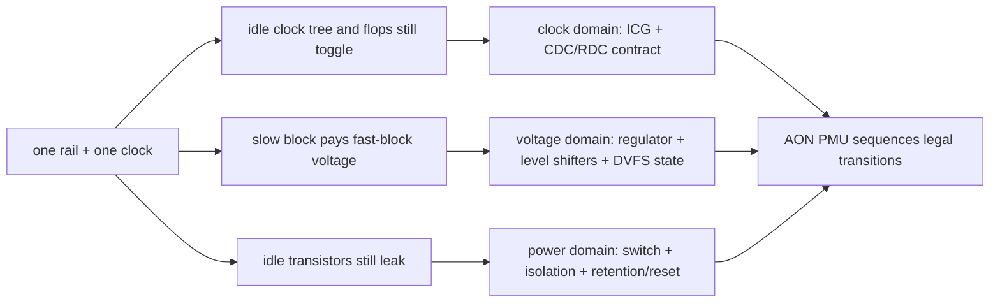
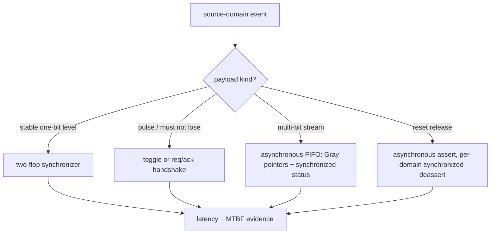
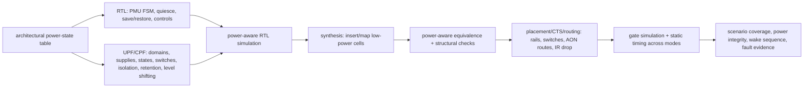

# SoC and Chiplet Power, Performance, Area, and Physical Implementation

> **First-time reader orientation:** SoC and chiplet architecture is physical composition. Shared SRAM/DRAM, NoC wires, protocol buffers, clock/power domains, DDR/HBM/CXL/die-to-die PHYs, package routes, thermals, repair, and test can dominate the cost that a logical block diagram omits.

> **Abbreviation key — skim now and return as needed:** system on chip (SoC); static/dynamic random-access memory (SRAM/DRAM); one-transistor one-capacitor (1T1C); network on chip (NoC); input/output (I/O); physical interface (PHY); high-bandwidth memory (HBM); double data rate (DDR); compute express link (CXL); error-correcting code (ECC); power, performance, and area (PPA); process, voltage, and temperature (PVT); dynamic voltage and frequency scaling (DVFS); mean time between failures (MTBF); always-on (AON); clock-domain crossing (CDC); reset-domain crossing (RDC); integrated clock-gating cell (ICG); power-management unit (PMU); Unified Power Format (UPF); Common Power Format (CPF).

---



The physical hierarchy is coupled: package reach changes PHY power, floorplan distance changes NoC timing, and the resulting power density changes clock and thermal feasibility.

## 0. Build a chip-and-package resource ledger

Inventory:

- compute blocks and local SRAM/cache;
- shared LLC/SRAM/directory/system cache;
- NoC routers, links, buffers, bridges, firewalls, monitors;
- DDR/HBM controllers and PHYs;
- PCIe/CXL/USB/storage/network/display/camera and die-to-die PHYs;
- clock/reset, voltage islands, regulators, isolation/retention, power gates;
- security, safety, reliability, debug, trace, test, repair, fuses;
- pads/microbumps/TSVs/interposer/bridges/package substrate;
- power delivery, heat spreading, keepouts, routing channels, and margin.

Each architecture choice must name its effect on state bits, ports, wires, clock load, power states, verification, and package resources.

## 1. Chip-level PPA equations

$$
P_{dyn}=\sum_j\alpha_jC_jV_j^2f_j,\qquad
P_{leak}=\sum_jV_jI_{leak,j}(T_j,V_j),
$$

$$
A_{die}=\sum_jA_j+A_{NoC/wire}+A_{clock/power/test}+A_{routing\ margin}.
$$

Package/system energy adds off-die links, memory stacks, regulators, and cooling. Average power is not enough: peak current, droop, hotspot temperature, and transient mode changes constrain sustainable performance.

## 2. Shared SRAM and system-cache implementation

A 6T SRAM array stores bits but requires decoder, wordline/bitline, sense/write, banking, ECC/parity, repair, arbitration, and routing. Shared caches additionally store tags, coherence/directory state, replacement, dirty/valid, sharer/owner information, and miss/fill queues.

Large system caches are sliced/distributed because wire delay dominates. Physical address hashing chooses a home slice and shapes NoC traffic. More capacity can reduce DRAM traffic but adds leakage, hit latency, lookup energy, directory area, and die footprint.

ECC parity bits $r$ for $k$ data bits satisfy

$$
2^r\ge k+r+1
$$

for single-error correction; overall parity enables double-error detection. Include correction latency, scrub bandwidth, poison/error reporting, redundancy, and repair.

### 2.1 Choose the memory technology by SoC role

Six-transistor SRAM is fast and logic-process compatible, but its bit-cell area and leakage make very large on-die capacity expensive. **Embedded DRAM (eDRAM)** uses a capacitor-style cell integrated on the logic die, offering higher density and often lower leakage per bit, but it needs sense/restore and refresh machinery, additional process steps, and longer/less uniform access. It has been used for large last-level caches where density and bandwidth outweigh the refresh/process cost. An eDRAM cache model must include refresh interference, row/bank organization, controller/periphery area, and the possibility that its latency differs from SRAM across operating points.

Boot and security state use different memories:

- **mask read-only memory (mask ROM):** dense, low-leakage, and immutable after fabrication; suitable for fixed boot code or tables but any bug requires a new mask;
- **one-time-programmable (OTP) memory/eFuses:** small identity, trim, key, repair, and lifecycle fields programmed after fabrication; include programming circuits, redundancy, sensing margin, access control, and irreversible update rules;
- **embedded flash or non-volatile memory (NVM):** field-updatable firmware/configuration where the process supports it; write voltage/time, endurance, retention, and security dominate rather than read bandwidth;
- **retention SRAM:** preserves selected state while a larger power domain is off; it pays larger cells or an always-on supply, save/restore sequencing, isolation, and retention-voltage verification.

These capacities are usually small compared with shared cache, but they are architecturally critical: the SoC cannot boot, repair lanes, identify itself, or enforce lifecycle security if they fail. Treat visibility, write authority, redundancy, error reporting, and field-update recovery as part of the system contract.

## 3. DRAM 1T1C, sensing, and refresh

A DRAM cell stores charge on a capacitor accessed by one transistor. Reads disturb the stored charge and require sense-amplifier restoration. Cells share long bitlines and sense amplifiers, which creates row activation/precharge behavior and high density.

Architecture consequences:

- an activated row resides in a row buffer;
- row hits avoid another activate/precharge and are faster/more efficient;
- banks allow parallel open rows;
- charge leakage requires refresh;
- timing constraints protect sensing, restoration, power, and disturbance limits.

Refresh consumes command/bank time and energy, with stronger effects at high temperature/density. RowHammer mitigation, ECC, sparing/repair, and patrol/scrub policies add traffic/state. The SoC memory model must include the device organization and controller policy that produce delivered service.

### 3.1 From capacitor charge to a controller-visible access

A stored one is only a small charge $Q=C_{cell}V$. When the access transistor connects the cell capacitor to a much larger precharged bitline capacitance $C_{BL}$, charge sharing produces a small voltage deviation:

$$
\Delta V_{BL}\approx\frac{C_{cell}}{C_{cell}+C_{BL}}\left(V_{cell}-V_{pre}\right).
$$

The sense amplifier detects and amplifies that small difference to full logic levels while restoring the destructive read. Long bitlines improve density because many cells share a sense amplifier, but they increase $C_{BL}$, reduce the initial signal, and slow sensing. DRAM organization is therefore a density/latency trade, not simply “a slow SRAM.”

At the command level, **ACTIVATE** raises a row into the bank's sense-amplifier row buffer; **READ** or **WRITE** selects columns; **PRECHARGE** closes the row. Timing names describe minimum separations: $t_{RCD}$ from activate to column access, column-access latency before read data, $t_{RAS}$ for minimum active time, and $t_{RP}$ to precharge. A row hit can issue a column command without another activation, whereas a conflict must precharge and activate a different row. Bank groups, data-bus turnaround, power limits on closely spaced activations, and refresh constrain parallelism even when different addresses appear independent.

Refresh overhead has a simple lower-bound intuition. If a rank requires $N_{ref}$ refresh operations per retention interval $T_{ret}$ and each blocks relevant resources for $t_{RFC}$, the blocked-time fraction is approximately

$$
\eta_{refresh}\approx\frac{N_{ref}t_{RFC}}{T_{ret}},
$$

before counting request reordering disruption. Higher temperature can shorten retention requirements; denser devices tend to have longer refresh commands. Per-bank refresh reduces the scope of each interruption but adds scheduling constraints. Fine-grained and temperature-compensated policies change both availability and worst-case latency.

### 3.2 Device reliability changes SoC traffic and state

RowHammer is repeated activation-induced disturbance of nearby rows. Mitigations may count activations, refresh neighbors, throttle suspect rows, remap addresses, or rely on device-managed tracking. Every option consumes counters, table storage, commands, bandwidth, power, or latency and must be included in worst-case quality-of-service analysis. On-die ECC can repair internal defects without exposing correction detail to the controller, but it does not replace end-to-end ECC across the controller, PHY, package, and memory device. The error contract must state what is corrected, detected, retried, poisoned, logged, or surfaced to software.

Capacity also includes yield mechanisms. Redundant rows/columns, post-package repair, lane repair, ECC bits, and bad-region retirement make usable capacity smaller than raw manufactured bits. These are SoC concerns because firmware-visible capacity, boot-time training, telemetry, retirement policy, and serviceability cross the device/controller/software boundary.

## 4. NoC physical cost

A router contains input buffers, virtual-channel state, route/allocator logic, crossbar, output/credit state, clocking, and link interfaces. Approximate area/power scales with ports $P$, virtual channels $V_c$, buffer depth $D$, link width $W$, and frequency:

$$
A_{router}\sim A_{buffers}(PV_cDW)+A_{crossbar}(P^2W)+A_{alloc}(P,V_c),
$$

with technology/topology-dependent constants. Wider links reduce serialization but increase wires, crossbar, register, clock, and repeater load. Long links may require pipeline stages, altering credit round-trip and latency.

Floorplan determines physical hop length; a topology drawn as uniform one-cycle links may not be implementable across a large die.

## 5. Protocol and bridge state is real silicon

AXI/CHI/CXL/coherence bridges store transaction IDs, ordering domains, outstanding requests, write data, snoop state, retry, credits, error/security attributes, and clock-domain crossings. Supporting more outstanding work expands buffers and comparison/order logic. Width conversion and asynchronous crossings add FIFOs and latency.

Protocol correctness can force resources that a bandwidth spreadsheet omits: separate response channels, deadlock-breaking buffers, snoop filters/directories, barriers, and retry queues.

## 6. PHY, package, and chiplet costs

Off-die bandwidth needs serializers/deserializers, clock-data recovery or forwarded clocks, equalization, training, calibration, termination, electrostatic-discharge protection, bumps/pads, package routes, and protocol controllers. Energy per transferred bit is

$$
E_{link}=M_{wire}e_{bit}+E_{fixed/training/retry}.
$$

Chiplet partitioning can improve yield and mix process nodes, but adds die-to-die PHY area/power/latency, package/interposer cost, coherency/protocol overhead, test/known-good-die requirements, power-delivery complexity, and thermal coupling.

Yield intuition for defect density $D_0$ and die area $A$ begins with

$$
Y\approx e^{-D_0A},
$$

though real models include clustering and redundancy. Smaller chiplets may improve per-die yield while package assembly yield/cost becomes important.

## 7. Clock, voltage, and power-state architecture

Multiple domains require clock/reset crossings, synchronizers/FIFOs, isolation, retention, level shifters, and sequencing. DVFS saves power only if workload slack and transition latency support it. Power-gating saves leakage but costs wake energy/time and state retention/reinitialization.

### 7.1 Derive domains from independent requirements

A **clock domain** is logic whose sequential state is timed by one clock relationship. A **voltage domain** is logic supplied at one operating voltage. A **power domain** is logic that can be switched on, retained, or off as a unit. They are different partitions: two blocks may share a clock but use different voltage rails, or share a rail while one clock is stopped. Treating the three boundaries as one diagram either adds unnecessary crossings or hides unsafe ones.

Start with the minimum baseline: one rail, one clock, no power gating. It has almost no crossing logic, but an idle accelerator still leaks, a low-speed peripheral pays the compute voltage, and changing the single clock or rail disturbs every block. Those failures derive three separate requirements:

1. independent activity control derives a clock domain and ICG;
2. independent performance/energy operating points derive a voltage domain and level shifters;
3. independent leakage shutdown derives a switchable power domain, isolation, retention or reinitialization, and an AON controller.



Partition by a workload and dependency ledger, not by RTL hierarchy. Keep blocks together when they wake together, exchange high-bandwidth single-cycle traffic, share state that would be expensive to retain, or cannot tolerate added level-shifter/isolation delay. Split them when their utilization, required voltage/frequency, retention need, or safety/security authority differs enough to repay the crossings. A very fine partition can lose: every boundary adds control, verification states, placement keepouts, rail routing, wake energy, and timing arcs.

### 7.2 One accelerator shutdown, with the state that makes it safe

Assume an NPU domain has an ingress queue, DMA engine, scratchpad, compute array, and completion queue. The naive action—drop its supply when software requests idle—can lose a DMA write, strand a coherent request, or drive an unknown value into an AON interrupt controller. A safe implementation adds this explicit state:

- `admit_enable`, which prevents new commands;
- accepted/outstanding counters for DMA, fabric, and completion writes;
- a `quiesce_req/quiesce_ack` handshake;
- retained context bits or a declared reinitialization image;
- isolation controls with a specified clamp value;
- clock-gate, reset, power-switch, and power-good controls;
- a transition state machine and timeout/error record in the AON PMU.

```mermaid
stateDiagram-v2
    [*] --> ON
    ON --> DRAIN: idle_request / admit_enable=0
    DRAIN --> SAVE: queues_empty && outstanding=0
    SAVE --> ISOLATE: retention_save_ack
    ISOLATE --> OFF: outputs_clamped; clock_off; switch_off
    OFF --> POWERING: wake_request / switch_on
    POWERING --> RESTORE: power_good && clocks_stable
    RESTORE --> ON: reset_released; restore_done; isolate=0; admit_enable=1
    DRAIN --> ON: abort_before_isolation
    SAVE --> FAULT: save_timeout
    POWERING --> FAULT: power_good_timeout
```



```wavedrom
{ "signal": [
  { "name": "idle_req",       "wave": "0.1......0" },
  { "name": "admit_enable",   "wave": "1..0.....1" },
  { "name": "outstanding",    "wave": "=.=.=0....", "data": ["3", "2", "1"] },
  { "name": "retention_save", "wave": "0....10..0" },
  { "name": "isolate",        "wave": "0.....1.0." },
  { "name": "clock_enable",   "wave": "1......0.1" },
  { "name": "power_good",     "wave": "1.......01" },
  { "name": "wake_req",       "wave": "0.......10" }
] }
```

The ordering is the mechanism: stop admission, drain accepted effects to their promised ordering point, save retained state, clamp outputs, stop the clock, and only then remove power. Wake reverses physical dependencies: establish the rail, wait for `power_good`, stabilize clock/reset, restore or reinitialize, re-establish protocol credits and identities, then remove isolation and reopen admission. If a save or power-good timeout occurs, the controller enters a diagnosable fault state; it must not guess that state was retained.

### 7.3 Clock-domain and reset-domain crossings are protocols

A single-bit level that changes slowly can cross through a two-flop synchronizer, accepting latency and a nonzero metastability probability. A pulse needs pulse stretching, a toggle protocol, or request/acknowledge so it cannot disappear between destination edges. Multi-bit data needs a bundled-data handshake or an asynchronous FIFO; synchronizing each data bit independently can assemble a word that never existed. A reset crossing has a related rule: asynchronous assertion may force a safe state immediately, but deassertion is synchronized separately in every receiving clock domain so flops do not leave reset on different edges.



The PPA trade is concrete. More synchronizer stages improve MTBF but add latency. Deeper asynchronous FIFOs absorb clock-ratio bursts but cost SRAM/flops and increase backpressure delay. A generated clock with a known phase relation may use a constrained synchronous crossing; an unrelated or stoppable clock must not inherit that assumption.

### 7.4 Voltage transitions need a closed-loop protocol

For a DVFS change, frequency and voltage cannot move in arbitrary order. When increasing performance, raise voltage and wait for regulator/clock qualification before increasing frequency. When decreasing performance, lower frequency first, then reduce voltage. During the transition, block or tolerate work according to the clock/rail specification. The PMU needs requested and actual operating points, transition-in-progress state, acknowledgements from regulator and clock generator, timeout handling, and thermal/current limit overrides.

Break-even for entering a lower-power state is not its advertised leakage alone. If transition energy is $E_{tr}$, active-state power is $P_{on}$, sleep power is $P_{sleep}$, and transition latency is acceptable, the energy break-even idle time is approximately

$$
t_{BE}=\frac{E_{tr}}{P_{on}-P_{sleep}}.
$$

Predicting an idle interval shorter than $t_{BE}$ wastes energy; a longer interval may still lose if wake latency violates a service-level objective. Retaining more state shortens wake but adds retention-cell area, an AON rail load, save/restore verification, and leakage.

### 7.5 UPF/CPF is executable power intent, not the architecture itself

UPF and CPF describe power domains, supply networks and states, power switches, isolation, retention, level shifting, and related control intent so tools can insert/check implementation cells and power-aware behavior. They do not invent quiescence, completion semantics, safe clamp values, or the software-visible state machine. Those must exist in the architecture before power intent is written.

Use one traceable flow:



The architecture-to-intent handoff must name, for every crossing and state: source/destination domain, legal supply states, signal direction, clamp value and when it becomes active, level-shifter direction, retained registers and retention supply, save/restore protocol, reset behavior, and ownership of each control. Tools can then detect an unisolated crossing or missing level shifter. They cannot decide whether a response channel must clamp to `VALID=0` or whether the fabric must synthesize an error response instead; that is a protocol decision.

Power-aware verification injects supply-off corruption and replays the shutdown/wake trace. Check that no request is accepted after admission closes; every earlier accepted request completes or is explicitly aborted; isolation precedes corruption; retained state survives allowed states; non-retained state returns to reset; no clock toggles an unpowered domain; wake does not release output before state and protocol credits are valid; and every timeout reaches a bounded, observable recovery. Structural UPF/CPF checks and a clean CDC report are necessary, but neither proves the transaction-level drain invariant.

A mode table should name:

- allowed domain clocks/voltages;
- active/retained/off blocks;
- isolation and reset state;
- memory retention/flush/coherence actions;
- wake triggers and maximum latency;
- inrush/current and thermal restrictions.

These are architecture-visible because they affect latency, correctness, and software policy.

## 8. Thermal and power delivery

For block power $P_i$ and thermal resistance/coupling matrix $R_{\theta}$,

$$
\Delta\mathbf{T}=R_{\theta}\mathbf{P}
$$

is a useful linear first approximation. Chiplets/3D stacks require vertical and lateral coupling; HBM and PHY hotspots can heat compute or memory. Temperature feeds leakage and timing, closing a performance-power-thermal loop.

Power delivery must sustain average and transient current with acceptable droop. Wide simultaneous switching in NoC/compute/PHY can constrain boost. Include regulator efficiency, package/board loss, decoupling, bump/current density, and power-grid area.

## 9. Reliability, repair, and observability

Architectural resources include ECC/parity, retries, watchdogs, error containment, fault isolation, spare links/rows, cache/SM/core disable, thermal sensors, performance monitors, and trace buffers. Recovery changes traffic/timing and must be included in safety/availability use cases.

For synchronizer metastability, MTBF grows exponentially with resolution time and degrades with source/destination event rates. Clock-domain crossings need explicit structures and verification, not assumed zero-time connections.

## 10. Early uncertainty and calibration

Use ranges for macro availability, link/PHY estimates, routing utilization, clock tree, activity, package cost, and thermal conditions. Report both parametric and model-form uncertainty. Sensitivity

$$
S_x=\frac{\partial\ln Y}{\partial\ln x}
$$

identifies what to refine. Calibrate block estimates against memory compilers, synthesized fabrics/bridges, prior silicon, PHY vendor data, and package/thermal models.

## 11. Worked chiplet trade

A 600 mm² monolithic compute die is partitioned into four 140 mm² compute chiplets plus a 90 mm² I/O die. Compute-die yield may improve, but evaluate:

- four die-to-die PHY/control blocks and package routes;
- added remote-cache/memory latency and wire bytes;
- package/interposer area, assembly and known-good-die test;
- I/O-die bottleneck and power delivery;
- thermal distribution and process-node costs.

If the workload keeps most traffic local, partitioning can win cost/yield. If coherence and shared-memory traffic repeatedly cross the package, PHY energy/latency and I/O-die contention can erase it. The traffic-placement model and physical package estimate must be solved together.

## 12. SoC/chiplet PPA checklist

- Include shared cache/directory, NoC, protocol buffers, PHYs, clocks/power/test, and routing margin.
- Use physical distances and achievable link/cache latencies.
- Price DRAM refresh/RAS and memory-controller/PHY/package resources.
- Model sustained temperature, leakage, power delivery, and transitions.
- Include chiplet assembly/yield/test and cross-die traffic.
- Define reliability/recovery and observability overhead.
- Carry calibrated ranges; do not present early area/power as signoff precision.

## Cross-references

- [Full-Chip Modeling](../01_System_Modeling/01_Full_Chip_Modeling.md).
- [DDR Controller](../02_Shared_Memory/01_DDR_Controller.md).
- [Routing, Flow Control, and Deadlock](../04_On_Chip_Networks/02_Routing_Flow_Control_and_Deadlock.md).
- [Chiplets, CXL, and Die-to-Die](../05_IO_and_Chiplets/02_Chiplets_CXL_and_Die_to_Die.md).
- [Low-Power Architecture and Domain Partitioning](../../../02_Power_and_Low_Power/03_Low_Power_Architecture_and_Domain_Partitioning.md).
- [UPF and CPF Power Intent](../../../02_Power_and_Low_Power/05_UPF_and_CPF_Power_Intent.md).

## References

1. N. Weste and D. Harris, *CMOS VLSI Design*.
2. W. Dally and B. Towles, *Principles and Practices of Interconnection Networks*.
3. JEDEC DDR/HBM standards and memory reliability literature.
4. UCIe/CXL/PCIe specifications and contemporary chiplet/package literature.

---

← [SoC/Chiplet Workloads and DSE](01_SoC_Chiplet_Workloads_Performance_and_DSE.md) · next → [SoC/Chiplet Simulation Methodology and Evidence](03_SoC_Chiplet_Simulation_Methodology_and_Evidence.md)
