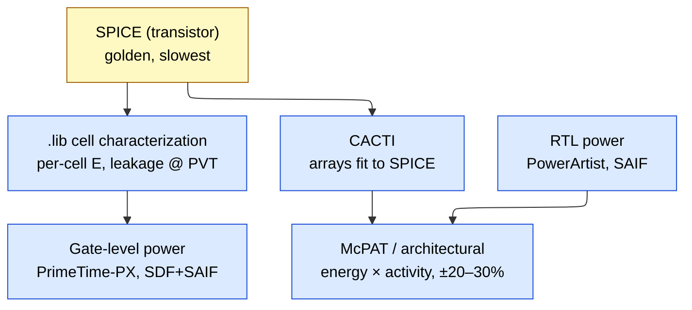
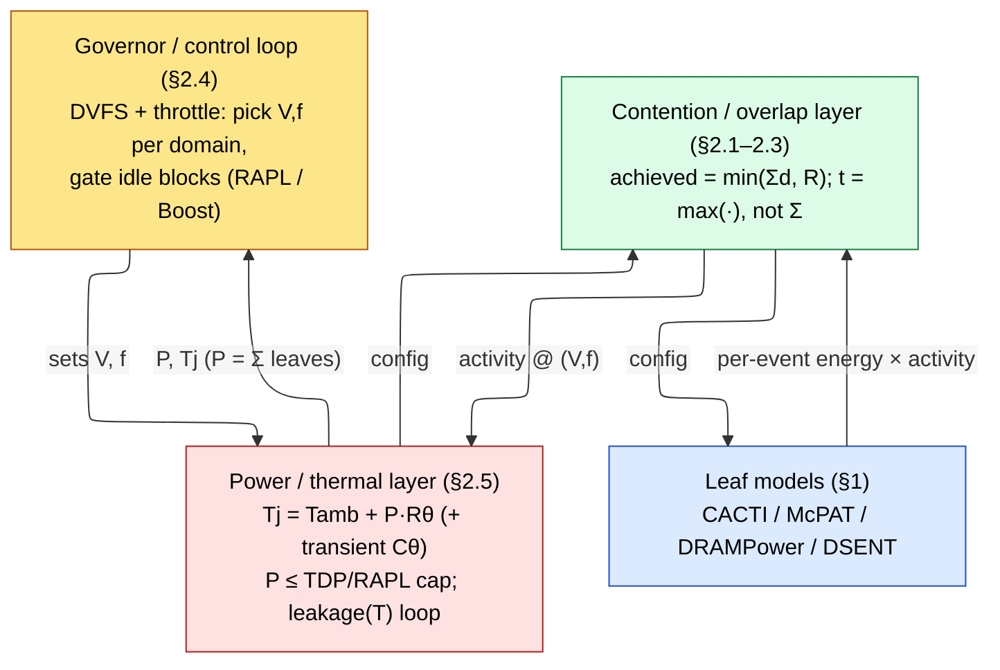
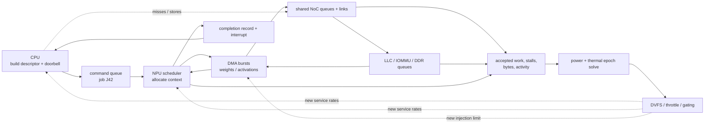
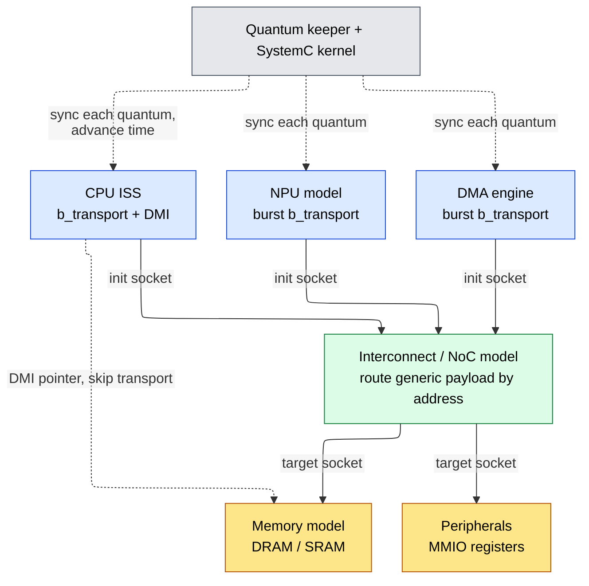
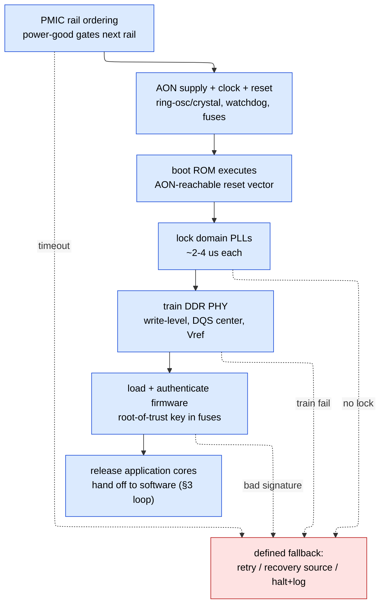
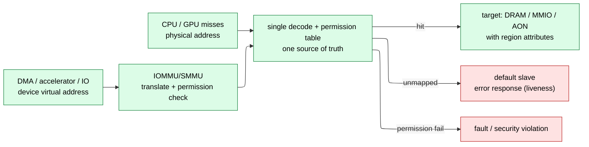

# Full-Chip Power and Performance Modeling

> **First-time reader orientation:** A system on chip (SoC) combines processors, accelerators, memories, interconnect, and devices that share power, bandwidth, area, and temperature limits. Power, performance, and area (PPA) cannot be predicted by adding isolated peak numbers: contention and feedback change block behavior. This chapter builds a hierarchy of calibrated block models and coupling equations.

> **Abbreviation key — skim now and return as needed:** central processing unit (CPU); graphics processing unit (GPU); neural processing unit (NPU); system on chip (SoC); register-transfer level (RTL);
> power, performance, and area (PPA); instructions per cycle (IPC); cycles per instruction (CPI); thread-level parallelism (TLP); misses per thousand instructions (MPKI);
> design-space exploration (DSE); out-of-order (OoO); reorder buffer (ROB); miss status holding register (MSHR); arithmetic logic unit (ALU);
> register file (RF); single instruction, multiple threads (SIMT); static random-access memory (SRAM); dynamic random-access memory (DRAM); high-bandwidth memory (HBM);
> double data rate (DDR); level-one cache (L1); level-two cache (L2); last-level cache (LLC); network on chip (NoC);
> quality of service (QoS); direct memory access (DMA); AXI Coherency Extensions (ACE); Coherent Hub Interface (CHI); Modified, Exclusive, Shared, Invalid (MESI);
> Modified, Owned, Exclusive, Shared, Invalid (MOESI); first come, first served (FCFS); dynamic voltage and frequency scaling (DVFS); processing element (PE); multiply-accumulate (MAC);
> general matrix multiplication (GEMM); general-purpose computing on graphics processing units (GPGPU); Peripheral Component Interconnect Express (PCIe); streaming multiprocessor (SM); thermal design power (TDP);
> artificial intelligence (AI); tensor processing unit (TPU); tera floating-point operations per second (TFLOP); 8-bit integer (INT8); physical-layer interface (PHY);
> kilobyte (KB); megabyte (MB); gigabyte (GB); terabyte (TB); gigahertz (GHz).

> **Stage:** 01 · Architecture & PPA (Performance, Power, Area) — the *systematic, hierarchical* model that composes leaf blocks into a **full chip** and answers SoC-level power+performance questions **before RTL (register-transfer level) exists**.
> **Prerequisites:** [SoC/chiplet workload and performance methods](../00_Design_Methodology/01_SoC_Chiplet_Workloads_Performance_and_DSE.md) (fidelity ladder, CPI (cycles per instruction) stack, roofline), [Block_Activity_and_Power](../../../02_Power_and_Low_Power/02_Block_Activity_and_Power.md) (per-block $P=\alpha C V^2 f + P_{leak}$, McPAT/CACTI bottom-up, DPM), [CPU_Architecture](../../01_CPU_Architecture/01_Core_Foundations/01_CPU_Architecture.md), [Memory](../00_Design_Methodology/02_SoC_Chiplet_PPA_and_Physical_Implementation.md).
> **Hands off to:** [GPU_Architecture](../../02_GPU_Architecture/01_Core_Architecture/01_GPU_Architecture.md) and [NPU_Accelerators](../../03_NPU_Architecture/01_Compute_Dataflows/01_NPU_Accelerators.md) (the µarch behind §4), [06_Simulators](00_Index.md) (how every tool named here actually models compute, memory, and time), [Power_Analysis_and_Signoff](../../../02_Power_and_Low_Power/06_Power_Analysis_and_Signoff.md) (the budgeting/governor mechanics at silicon).

---

## 0. Why this page exists

The shallow instinct is: model the CPU core, model the cache, model the DRAM (dynamic random-access memory), add the Watts, and declare the chip understood. That is wrong, and an auditor will catch it in one question, because **a chip is a system, not a bag of blocks.** The number a leaf model gives you is real; what it cannot give you is what happens when you *put the leaves together and run them at once*.

Write the honest full-chip model as a first term plus a correction:

$$
X_{chip} \;=\; \underbrace{\bigoplus_i X_{\text{leaf},i}}_{\text{what a leaf model gives you}} \;+\; \underbrace{X_{\text{coupling}}}_{\text{the whole art of this page}}
$$

The first term is cheap and the sibling pages already produce it — per-block energy and per-block latency from characterized cells and CACTI-fit arrays. The second term is everything this page is about, and it is *not* a small correction. It routinely moves throughput by $1.5\text{–}2\times$ and turns a benchmark's first second into a different machine from its tenth. A model that keeps only the first term does not under-report the chip by a few percent; it answers a different question than the one asked.

Two things go wrong when you keep only $\bigoplus X_{\text{leaf}}$:

1. **The composition operator is wrong for performance.** Power is *extensive* — Watts genuinely sum. Performance is not: throughput is set by the **slowest shared resource** and latencies compose through **overlap and queueing**, never by addition. Summing per-block latencies is a category error, not an approximation.
2. **The operating point is wrong for every block.** Each leaf's energy and delay are functions of $(V, f, T, \text{activity})$. On a real chip those are *not* datasheet constants: a shared power budget sets $f$, a thermal cap sets the sustainable $f$, and contention sets the true activity. A standalone leaf is evaluated at an operating point the assembled chip never actually runs at.

So the full-chip model has three parts, not one — the leaf models, a **contention/overlap layer** that fixes the composition and the contended activity, and a **power/thermal budget layer** that fixes the operating point — and the two upper layers are solved *together* in a control loop (§3). The rest of this page builds those two layers on top of the leaves the sibling pages give you.

**A full-chip model is defined by the questions it must answer** — none of which a leaf model can:

- What is SoC (system-on-chip) power at TDP (thermal design power), delivery losses included?
- What *sustained* clock survives the thermal cap, as opposed to the burst clock the datasheet quotes?
- What memory bandwidth is *actually achieved* once $N$ cores contend for one channel?

If your model cannot answer these, it is a pile of leaf models, not a chip model. That gap — between $\bigoplus X_{\text{leaf}}$ and the truth — is the coupling layer, and closing it is the job.

---

## 1. Composition: push the physics down, keep the composition cheap

Before the coupling, the scaffolding it hangs on: *how* leaves become a chip when nothing is contending yet. The discipline has one governing idea — **compute the physics once, at the bottom, and never again above it.** A per-access SRAM energy or a per-op ALU energy is expensive to derive (it is a circuit-simulation question) but cheap to *reuse*; the architectural model earns its speed by composing pre-computed energies against activity counts, not by re-deriving physics at every level.

### 1.1 The hierarchy and the roll-up rule

You compose strictly bottom-up through named levels, and the rule at every level is the same: **sum of children, plus the glue that only exists at this level.**

| Level | Contents | New cost that first appears here |
|---|---|---|
| **Leaf** | one array/unit (SRAM bank, ALU, FPU, register file, router) | energy/access × access rate; leakage |
| **Block** | a core, a cache slice, one memory controller | pipeline glue, local clock tree |
| **Cluster** | $N$ cores + shared LLC (last-level cache) + local NoC (network-on-chip) | coherence, interconnect, LLC sharing |
| **Chip** | clusters + full uncore (NoC, MC, PHY, PCIe, PMU) | global clock/NoC, uncore floor |
| **Package** | chip + VRM + PDN + board | VRM loss, PDN/IR drop, on-package DRAM/HBM |

The identity every roll-up must satisfy at chip level:

$$
P_{chip} \;=\; \sum_i P_{block,i} \;+\; P_{uncore} \;+\; P_{PDN/VRM}
$$

where $P_{uncore}$ (NoC + MC (memory controller) + PHY (physical-layer interface) + PMU (power-management unit) + I/O) is **not an idle floor you may neglect** — on server parts it is 20–40% of socket power and it *scales with activity* (the PHY and MC burn more under high bandwidth), and $P_{PDN/VRM}$ is the delivery loss $P_{VRM,loss}=P_{load}(1/\eta-1)$ at regulator efficiency $\eta\approx0.85\text{–}0.92$, plus PDN (power-delivery network) $I^2R$ drop ([Signal_Integrity_Reliability](../../../05_Backend_Physical_Design/02_Signal_Integrity_Reliability.md)). These sit *outside* the die-power sum and are exactly what shallow models forget.

The one rule you cannot violate: **power rolls up additively; performance does not.** Watts sum because dissipation is extensive. Latency and bandwidth compose through the bottleneck — the slowest shared resource caps throughput (roofline), and delays overlap or queue rather than add. Never sum latencies across blocks; route them through the coupling layer of §2.

**Why the composition operator differs by quantity — a derivation.** The abstract $\bigoplus_i$ of §0 is not one operator; it is *three*, and which one applies follows from what the quantity physically **is**.

- **Power / energy — additive ($\bigoplus=\sum$).** Energy is *extensive*. The charge drawn from the rail in a cycle is the sum over every switching node, $E_{cyc}=\sum_i E_i$, because charge is conserved and the nodes draw independently from a common supply; dividing by the period gives $P=\sum_i P_i$ **exactly**, with no interaction term. That is why the roll-up is a plain sum and the only subtlety is *remembering* the uncore and delivery terms, not choosing the operator.
- **Throughput — bottleneck ($\bigoplus=\min$).** A chain of resources passing a stream forwards at the rate of its slowest stage, $\Theta=\min_i \Theta_i$. *Proof:* in steady state every stage must process the same number of items per unit time — otherwise a queue between two stages grows without bound, violating stability (Little's law, §2.3, with $\bar N\!\to\!\infty$) — so the common rate cannot exceed the smallest stage capacity, and a work-conserving schedule attains it. This is the roofline $\min(\pi,\beta I)$ generalized from two roofs to a chain.
- **Latency — max-or-sum ($\bigoplus\in[\max,\ \sum]$).** Two operations on the critical path add their times *if serial* and take the $\max$ *if overlapped*; the true value lies between and is fixed by the overlap fraction (§2.3). This is the one operator the naive model gets wrong in **both** directions — it sums when it should $\max$ (missing overlap) and $\max$es when it should sum (missing a serialized dependence).

So "the chip is the sum of its blocks" is true for *exactly one* of the three quantities and false for the other two. The two corrections that make performance compose correctly are therefore named in advance: **overlap** (§2.3, which selects $\max$ vs $\sum$) and **contention** (§2.1–2.2, which inflates each $\Theta_i$ and each latency toward the queue). Up the hierarchy the same three operators recurse — a cluster's memory latency is $t_{\text{core}}+\max(t_{\text{LLC}},\ldots)+t_{\text{queue}}(\rho)$ (sum where serial, $\max$ where overlapped, plus the queue term §2.2 adds at *this* level's shared resource); a pod's step time is $\max(t_{\text{chip}},\,t_{\text{collective}})$ (§4.4) — while power stays a clean $\sum$-plus-glue at every level. **Naive summation fails precisely because it applies the power operator ($\sum$) to throughput and latency.**

Concretely, the leaf→block step is what an architectural power model like **McPAT** does: it maps the µarch onto a few primitive circuit structures (arrays, wires, logic, clocking), pulls each array's per-access energy from an internal CACTI (its cache/array energy model), and composes

$$
P_{core} \;=\; \sum_{u\in\text{units}} E_u\,A_u\,f \;+\; P_{clock} \;+\; \sum_u P_{leak,u}
$$

where $E_u$ = per-event energy (from CACTI-fit arrays / characterized cells), $A_u$ = events per cycle (from the [CPI stack](../00_Design_Methodology/01_SoC_Chiplet_Workloads_Performance_and_DSE.md) counters), $f$ = clock. There is **no new physics at the core level** — the clock tree ($P_{clock}$, typically 30–40% of core dynamic) and leakage ($V\cdot I_{leak}$, scaled by area and temperature) are added, and the array/op energies are *looked up, not recomputed*. That is the whole game restated: push the physics down, keep the composition cheap.

Each per-event energy is itself the $\alpha C V^2$ of a structure (§2.4), so the roll-up is literally *activity × per-event-energy*, and it is worth carrying one to a number. *Worked number — McPAT-style rollup.* Take three structures on a core at $f=3$ GHz: an integer ALU at $E_{\text{ALU}}=3$ pJ/op, a 32 KB L1 at $E_{\text{L1}}=15$ pJ/access, and a register-file read port at $E_{\text{RF}}=1$ pJ/read. Suppose the per-cycle activity counts (from the CPI stack) are $A_{\text{ALU}}=1.0$ op, $A_{\text{L1}}=0.6$ access, $A_{\text{RF}}=2.4$ reads (two source operands + writeback per instruction at IPC $\approx1.5$). Then

$$
\textstyle\sum_u E_u A_u f=(3{\cdot}1.0+15{\cdot}0.6+1{\cdot}2.4)\ \text{pJ/cyc}\times 3\times10^{9}\ \text{cyc/s}=14.4\ \text{pJ/cyc}\times3\times10^{9}=43\ \text{mW}
$$

from just those three units. Add $P_{clock}\approx35\%$ of core dynamic and per-unit leakage and the core power emerges — and *every* term is one (energy × activity) product, characterized **once** (slow, circuit-level) and multiplied **forever** (fast, per-config). The composed number's error is the §1.3 propagation of the inherited $E_u$, not new physics — which is exactly why the architectural rung is instant yet trustworthy to ±20–30%.

### 1.2 Where the numbers come from: the calibration chain

The architectural model is fast enough to sweep hundreds of design points *because* it does not re-derive physics — but that only makes it trustworthy if its inherited per-event energies are anchored to something golden. They are, through a calibration chain in which each level calibrates the one above it:

| Level | Tool | Accuracy vs silicon | Speed |
|---|---|---|---|
| Transistor | SPICE | golden (≈1–2%) | slowest |
| Cell library | Liberty `.lib` characterization | ~2–3% | one-time |
| Gate + parasitics | PrimeTime-PX (SDF+SAIF) | ~5–10% | slow |
| RTL | PowerArtist / Joules (SAIF/FSDB) | ~10–20% | medium |
| Architectural | McPAT / Accelergy | ~20–30% *calibrated* (≫ un-cal) | instant |

The ladder is used in **two directions** at opposite ends of a project. **Bottom-up** (pre-silicon) composes energy × activity analytically — this page's mode — for design-space exploration and budgeting before RTL exists. **Top-down** (post-silicon) does the inverse: it takes a *measured* chip power number from RAPL (Running Average Power Limit) / on-die telemetry and decomposes it to blocks via **power proxies** — regressions of block power onto activity counters, fitted to silicon (accuracy ~3–5% per block, far better than bottom-up because it is trained on the real thing). Mature flows run both and reconcile: the proxy is *trained* against the bottom-up model and *validated* against silicon. The mechanics of each tool live in [06_Simulators](00_Index.md); here they are just rungs on the ladder.

### 1.3 What survives summation: the validation theory

Whether a roll-up can be trusted turns on how per-block error behaves under summation, and two error classes behave *oppositely*:

- **Random (uncorrelated) error cancels.** If $N$ blocks each carry independent relative error $\sigma$, the chip-total relative error scales as $\sim\sigma/\sqrt{N}$ — a fleet of $\pm25\%$ blocks can roll up to a $\pm8\text{–}10\%$ chip total. Summation is a variance-averaging operation.
- **Systematic (correlated) error accumulates.** A consistent 15% activity-overestimate in *every* block (e.g. from a continuously-toggling testbench SAIF (Switching Activity Interchange Format)) stays 15% at the chip — it does not wash out. These are the dangerous ones.

*Derivation of the $\sqrt N$.* Write each block as $P_i(1+\varepsilon_i)$ with $\mathbb{E}[\varepsilon_i]=0$, $\operatorname{Var}(\varepsilon_i)=\sigma^2$, the $\varepsilon_i$ independent. The estimated total is $\hat P=\sum_i P_i(1+\varepsilon_i)$, so its absolute error $\sum_i P_i\varepsilon_i$ has variance $\sum_i P_i^2\sigma^2$. For $N$ equal blocks ($P_i=P/N$) the error standard deviation is $\sigma(P/N)\sqrt N=\sigma P/\sqrt N$ — relative error $\sigma/\sqrt N$, the central-limit averaging (e.g. $N=9$ blocks at $\sigma=25\%$ → $25\%/3\approx8\%$). A *correlated* bias $\varepsilon_i=\beta$ (same sign every block) instead gives error $\sum_i P_i\beta=\beta P$, relative error $\beta$ **flat in $N$**: no averaging, because $N$ identical biases grow exactly as fast as the total they inflate. That contrast — $\sigma/\sqrt N$ shrinking vs $\beta$ constant — *is* why relative comparisons are trustworthy and absolute totals are not.

The practical corollary is the single most useful fact about trusting a model: **it is most accurate for *relative* comparisons and least accurate for *absolute* Watts.** Comparing design A to design B in the same model, the systematic error is common-mode and cancels almost entirely; quoting an absolute socket-power number exposes the full systematic bias. So:

| Validation target | Typical acceptance band |
|---|---|
| Per-block, calibrated | ±10–20% |
| Full-chip total, calibrated | ±10–15% |
| Full-chip *un*-calibrated | ±30% or worse |
| Relative (A vs B, same model) | tightest — errors are common-mode |

**Rule:** use the model freely to *rank* design points; validate any absolute total against at least one silicon or gate-level anchor before quoting it to a thermal team.

---

## 2. Why a chip is not the sum of its blocks: five coupling terms

This is the heart of the page — the $X_{\text{coupling}}$ term of §0 made explicit. Five phenomena make the assembled chip deviate from $\bigoplus X_{\text{leaf}}$, each in a specific direction, each with its own theory, and each with an **auditor's red flag** — the tell-tale wrong number a model that omits it will report. Two of the five (contention, queueing) fix the *performance composition operator*; one (overlap) decides whether it is $\max$ or $\Sigma$; two (DVFS, thermal) fix the *operating point* every leaf is evaluated at. The governor of §3 makes them mutually consistent.

### 2.1 Contention — the throughput face of a shared resource

Every shared resource — a DRAM/HBM channel, an LLC, a NoC link, an inter-chip link — has a finite **capacity** $R$ and serves $N$ clients each with **demand** $d_i$. There is one saturation knee, at $\sum_i d_i = R$, and achieved throughput is

$$
\text{achieved} \;=\; \min\!\Big(\textstyle\sum_i d_i,\; R\Big)
$$

- **Below the knee** ($\sum d_i < R$): every client gets its full demand; the resource is not the bottleneck.
- **Above the knee** ($\sum d_i > R$): aggregate throughput clamps at $R$, and each client's share collapses toward $R/N$ under fair arbitration. A core that measured 20 GB/s standalone sees 5 GB/s under an 8-way contended channel — the *same* leaf, a quarter of the bandwidth, purely from company.

*Arbitration decides who loses.* Round-robin / age-based arbiters split near-equally ($R/N$); priority or QoS (quality-of-service) arbiters protect one client at others' expense. The arbitration policy is therefore *part of the contention model* — the same saturated resource yields very different per-client outcomes under round-robin versus strict priority, which is why an MC that favours a latency-critical core, or a NoC with virtual-channel priorities, must be modeled as such and not as a fair split.

*Why $\min()$ is exact, and the share formula.* Work-conservation pins both regimes. A work-conserving server never idles while requests wait, so its output rate is exactly $\min(\text{offered},\text{capacity})=\min(\sum_i d_i,\,R)$ — offered load when it fits, capacity when it does not, with nothing in between (any "achieved" above $R$ would violate the capacity bound; anything below offered-and-under-$R$ would mean the server idled with work pending). Above the knee the capacity is partitioned by the arbiter's weights $w_i$: client $i$ gets $R\,w_i/\sum_j w_j$. Equal weights give the $R/N$ fair split; demand-proportional weights ($w_i=d_i$) give $R\,d_i/\sum_j d_j$ (each keeps its *fraction* of the jam); strict priority gives the top client its full $d_i$ and starves the rest with the remainder. *Worked number.* Eight cores each demanding $d=8$ GB/s share an $R=25.6$ GB/s channel: $\sum d=64>25.6$, so aggregate clamps at $25.6$ and equal arbitration delivers $25.6/8=3.2$ GB/s per core — a core that measured $8$ GB/s standalone keeps just **40%** of it. Give one core strict priority and it holds its full $8$ GB/s, dropping the other seven to $(25.6-8)/7=2.5$ GB/s each: the *same* saturated $R$, a $3.2\times$ per-client spread from arbitration policy alone.

Because a leaf measured alone always runs below its own private knee, **standalone leaf numbers overstate throughput the moment they are composed** — this is the mechanical reason full-chip $\ne \Sigma$ leaves for performance. The contended demand $\sum d_i$ must be evaluated with *every* client present; a per-core number measured in isolation is the wrong input.

> **Auditor's red flag:** a cluster model that reports $N\times$ throughput and feeds each core its *standalone* memory-CPI has no contention layer and is wrong by the queueing gap of §2.2.

### 2.2 Queueing — the latency face of the same resource

The $\min()$ of §2.1 captures throughput and *hides* the latency penalty, which is where naive models lie most. Model the shared resource as a queue with utilization $\rho = \sum_i d_i / R$. Even for the simplest (M/M/1-like) server, mean latency diverges as

$$
L \;\approx\; \frac{L_{\text{service}}}{1-\rho}, \qquad \rho \to 1 \Rightarrow L \to \infty
$$

where $L_{\text{service}}$ = unloaded service time. Latency blows up **super-linearly well before throughput flatlines**: a channel at $\rho = 0.9$ already carries roughly $10\times$ its unloaded service latency while still delivering "90% of peak bandwidth." So "achieved BW = 90% of peak" and "latency is fine" are not the same statement — the last 10% of bandwidth is bought with a latency cliff, and for a latency-sensitive core (one whose ROB cannot cover the stall) that cliff is the real cost. This is why contention and queueing are two faces of one resource: §2.1 is what the resource delivers, §2.2 is what it charges to deliver it, and both are governed by the same $\rho$.

**Deriving the $1/(1-\rho)$ blow-up (M/M/1).** Model the shared resource as a single server with Poisson arrivals at rate $\lambda$ and exponential service at rate $\mu$, so $\rho=\lambda/\mu$ is the utilization and $T_0=1/\mu$ the unloaded service time. Let $p_n$ be the steady-state probability of $n$ requests in the system. In steady state the probability flux across the boundary between states $n$ and $n{+}1$ must balance (a birth–death chain), giving detailed balance $\lambda p_n=\mu p_{n+1}$, hence $p_{n+1}=\rho\,p_n$ and, normalized by $\sum_{n\ge0}p_n=1$, the geometric law $p_n=(1-\rho)\rho^n$. The mean occupancy is

$$
\bar N=\sum_{n\ge0} n\,p_n=(1-\rho)\sum_{n\ge0} n\rho^n=(1-\rho)\frac{\rho}{(1-\rho)^2}=\frac{\rho}{1-\rho}.
$$

Little's law (§2.3), $\bar N=\lambda\bar T$, converts that *population* into a *latency*:

$$
\bar T=\frac{\bar N}{\lambda}=\frac{\rho/(1-\rho)}{\rho\mu}=\frac{1}{\mu(1-\rho)}=\frac{T_0}{1-\rho}=\frac{1}{\mu-\lambda},
$$

where $\bar T$ = mean response time (queue wait + service), $T_0=1/\mu$ = unloaded service time, $\rho=\lambda/\mu$ = utilization. This is the promised $T_0/(1-\rho)$: the service time is unchanged, but the *wait* to reach the server, $\bar T-T_0=\frac{\rho}{1-\rho}T_0$, diverges as $\rho\to1$ — because draining a backlog needs a run of below-average inter-arrival gaps, and such runs get exponentially rarer as arrivals approach capacity.

**The variance correction (M/D/1, Pollaczek–Khinchine).** Exponential service is pessimistic — a DRAM burst or a NoC flit has *nearly deterministic* duration. For any service distribution (M/G/1) the Pollaczek–Khinchine formula gives the mean wait

$$
W_q=\frac{\rho}{1-\rho}\cdot\frac{1+C_v^2}{2}\,T_0,\qquad C_v=\frac{\sigma_S}{T_0},
$$

where $C_v$ = coefficient of variation of the service time (std ÷ mean) and $\sigma_S$ = service-time standard deviation. Exponential service has $C_v=1$, recovering M/M/1's $W_q=\frac{\rho}{1-\rho}T_0$; **deterministic** service (M/D/1) has $C_v=0$, halving it to $W_q=\frac{\rho}{2(1-\rho)}T_0$ — the *half-variance form*. Real memory/NoC service sits between and closer to deterministic, so M/M/1 is an *upper* bound on the queue and M/D/1 a *lower* one; the truth is bracketed by the two.

*Worked number — DRAM/NoC latency at 60% vs 90% load.* Take unloaded service $T_0=80$ ns (a loaded-DRAM read, or a few-hop NoC traversal), response time $\bar T=T_0\big(1+\tfrac{\rho}{1-\rho}\cdot\tfrac{1+C_v^2}{2}\big)$:

| $\rho$ | M/M/1 ($C_v{=}1$): $\bar T=T_0/(1-\rho)$ | M/D/1 ($C_v{=}0$): $\bar T=T_0\big(1+\tfrac{\rho}{2(1-\rho)}\big)$ |
|---|---|---|
| 0.60 | $80/0.40=200$ ns ($2.5\times$) | $80(1+0.75)=140$ ns ($1.75\times$) |
| 0.90 | $80/0.10=800$ ns ($10\times$) | $80(1+4.5)=440$ ns ($5.5\times$) |

Pushing utilization from 60% to 90% — a mere $1.5\times$ more offered load — inflates M/M/1 latency **4×** ($200\to800$ ns) while aggregate bandwidth climbed only from 60% to 90% of peak. That asymmetry is the whole lesson: **the last third of a resource's bandwidth is bought with a 4× latency cliff.** For a core whose ROB (reorder buffer) hides ~300 ns of memory latency, the channel is *invisible* at $\rho=0.6$ (200 ns, covered) and a *stall machine* at $\rho=0.9$ (800 ns, uncovered) — the same channel, the same leaf model, flipped by load alone. The M/D/1 column shows the payoff of a first-ready, first-come, first-served (FR-FCFS) controller that *regularizes* service (turning conflicts into near-deterministic row-hits, lowering $C_v$): it roughly halves the queue term at every $\rho$.

The M/M/1 form is illustrative — real memory controllers are FR-FCFS (first-ready, first-come-first-served) with finite queues — but the $1/(1-\rho)$ blow-up is qualitatively universal, and it is the reason the memory-CPI in a cluster model must be driven by the *contended* channel at its true $\rho$, never the standalone one.

> **Auditor's red flag:** a model that reports achieved bandwidth near peak and unloaded latency in the same breath has priced the throughput but not the queue.

### 2.3 Overlap — max, not sum

A chip does compute, memory movement, and (at pod scale) communication *concurrently* when the hardware and the schedule allow it. The step time is then the **max**, not the sum, of the phase times:

$$
t_{step} = \max\big(t_{comp},\, t_{mem},\, t_{comm}\big)\ \text{(overlapped)} \qquad\text{vs}\qquad t_{step} = t_{comp}+t_{mem}+t_{comm}\ \text{(serial)}
$$

Overlap is what makes the *bottleneck resource — and only it —* set performance: if $t_{mem}$ is hidden under $t_{comp}$ you are compute-bound and memory is free; if the overlap fails, the times add and everything is slower. Real designs live between these bounds, and the **degree of overlap is a first-class model parameter, not a given.**

**Deriving $\max$ vs $\sum$ from the pipeline.** Stream $n$ tiles, each needing compute $c$ and memory-move $m$, through a double-buffered engine (two SRAM tiles: while the array consumes tile $k$, the DMA fills tile $k{+}1$). Serially (one buffer), tile $k$ costs $c+m$ and the run is $n(c+m)$. Double-buffered, after a one-tile prologue fill of $m$ the two resources run *concurrently*: in each slot the array is busy for $c$ and the DMA for $m$, and the slot advances only when **both** finish, so the slot length is $\max(c,m)$ and the run is $m+n\max(c,m)$. Amortized over large $n$,

$$
t_{\text{tile}}\ \xrightarrow{\ n\to\infty\ }\ \max(c,m)\qquad\text{vs.}\qquad c+m\ \ (\text{serial}),
$$

so overlap replaces the *sum* by the *max* — the hidden resource is free up to the point where it *equals* the exposed one. The double-buffering speedup is $\frac{c+m}{\max(c,m)}\in[1,2]$, maximal ($2\times$) exactly when $c=m$ (perfectly balanced) and vanishing when one term dominates (nothing left to hide). This is the chip-scale restatement of the roofline $\max$ of [SoC/chiplet workload and performance methods](../00_Design_Methodology/01_SoC_Chiplet_Workloads_Performance_and_DSE.md): an operator's time is the critical path through concurrent resources, never their sum.

**Partial overlap — the realistic interpolation.** Perfect $\max$ needs the *entire* hidden term to fit under the exposed one; real schedules hide only a fraction $\phi\in[0,1]$ of the smaller phase (finite buffering, imperfect prefetch distance, dependence stalls). With phase times $t_a\ge t_b$, the step interpolates linearly between the two bounds:

$$
t_{\text{step}}(\phi)=t_a+(1-\phi)\,t_b=\underbrace{t_a+t_b}_{\phi=0,\ \text{serial}\ (\sum)}\ \longrightarrow\ \underbrace{t_a}_{\phi=1,\ \text{overlapped}\ (\max)},
$$

where $\phi$ = overlap fraction (0 = none, 1 = smaller phase fully hidden), $t_a$ = larger phase time, $t_b$ = smaller. The sting is that $\phi$ **degrades under contention**: §2.1–2.2 inflate $t_b$ (the memory/comm phase) toward and past $t_a$, at which point even $\phi=1$ can no longer hide it and the step re-expands. Overlap and contention are thus coupled — contention is exactly what turns a hidden term back into an exposed one. *Worked number.* A training microstep has $t_{\text{comp}}=5.0$ ms and $t_{\text{comm}}=3.0$ ms (an AllReduce). Serial: $8.0$ ms. Perfect overlap: $\max(5,3)=5.0$ ms — the comm is free, a $1.6\times$ speedup. At $\phi=0.6$: $5.0+(1-0.6)\cdot3.0=6.2$ ms ($1.29\times$). Now let pod contention (§2.1) inflate the comm to $t_{\text{comm}}=6.0$ ms: even at $\phi=1$ the step is $\max(5,6)=6.0$ ms — the collective has become the *exposed* term, adding compute overlap buys nothing, and the fix is now bandwidth (a better torus embedding, §4.4), not scheduling. One knob — the contended comm time — moved the bottleneck across the $\max$.

Overlap is *conditional* — the $\max()$ holds only when movement is decoupled from consumption:

- **Double-buffering** (NPU §4.4): DMA fills buffer B while the array computes on A. Needs SRAM for *two* tiles; with one, DMA and compute serialize back to the sum and throughput halves.
- **Async DMA / prefetch** (CPU, GPU): loads issued far enough ahead hide memory latency behind compute — *provided* the prefetch distance covers the latency and the MSHRs (miss-status handling registers) do not fill.
- **Comm/compute overlap** (pod §4.4): AllReduce layer $L$ while computing layer $L{-}1$; needs an interleaved schedule and spare link bandwidth.

When a precondition fails, $t_{step}$ slides from $\max$ toward $\Sigma$. So the model must ask two questions, not one: *is it overlapped?* and *is the hidden term still smaller after §2.1–2.2 inflate it?*

**Little's law is the unifying principle.** How much concurrency does hiding latency require? To keep a resource of latency $L$ and bandwidth $B$ busy you need

$$
\text{in-flight work} \;=\; B \times L \quad\text{(the bandwidth–delay product)}
$$

Too few outstanding requests — too few MSHRs, too little prefetch distance, too low GPU occupancy — and the pipe runs dry: you are latency-bound *even below the §2.1 knee*. CPU memory-level parallelism, GPU thread-level parallelism, and NPU double-buffer depth are three names for one mechanism — hold enough in-flight work to keep the bottleneck saturated and thus keep the $\max()$ in force. This also sets up a tension with §2.1–2.2: more in-flight work raises the offered load $\sum d_i$, pushing $\rho \to 1$ where $L$ itself grows and *demands even more* in-flight work. The sweet spot is enough concurrency to hide latency but not so much that the queue explodes.

> **Auditor's red flag:** a model that assumes free overlap (always $\max$) overstates scaling; one that always sums understates it. The overlap fraction is the parameter, and it degrades under contention.

### 2.4 DVFS and turbo — frequency is allocated, not fixed

The sum of every block at its peak $(V,f)$ *exceeds* what the package can dissipate: $\sum P_{block,max} \gg \text{TDP}$. Therefore the per-domain operating point $(V,f)$ is **not a datasheet constant — it is continuously allocated** by a power manager so that $\sum P \le \text{budget}$. Frequency is an *output* of the budget solve, not an input, and this is what §0 meant by "the operating point is wrong for every block": a leaf evaluated at nominal $f$ is evaluated at a frequency the chip may never sustain.

Why the allocation matters so much is the shape of the cost curve. Dynamic power is $P_{dyn} = \alpha C V^2 f$, and along the voltage–frequency curve a higher $f$ needs a higher $V$ (roughly $V \propto f$ in the usable range), so

$$
P_{dyn} \;\propto\; V^2 f \;\propto\; f^3
$$

Dynamic power grows **cubically** with frequency. A small $f$ cut buys a large power cut, and conversely raising the budget buys only a *cube-root* frequency gain — which is exactly why turbo hands the budget to *few* cores (a large $f$ on one core costs what a modest $f$ costs on three) and why sustained all-core clock sits well below single-core burst.

**Deriving $P_{dyn}=\alpha C V^2 f$.** A switching node is a capacitor $C$ charged to $V$ and discharged once per transition. Charging draws $Q=CV$ from the rail at voltage $V$, delivering energy $QV=CV^2$, of which exactly half lands on the capacitor ($\tfrac12CV^2$) and half is burned in the pull-up resistance regardless of its value; the discharge dumps the stored half through the pull-down. So a full charge/discharge cycle dissipates $CV^2$, and a node switching with probability $\alpha$ (the **activity factor**) each clock dissipates $\alpha CV^2$ per cycle, i.e. $P_{dyn}=\alpha CV^2 f$, where $\alpha$ = switching probability/cycle, $C$ = switched capacitance, $V$ = supply, $f$ = clock. Summed over the chip this is precisely the $\sum_u E_u A_u f$ of §1.1 with $E_u=\alpha_u C_u V^2$.

**Why $V$ tracks $f$: the delay law.** A gate's output slews as its drive current charges the next stage: $t_{\text{gate}}\approx C V/I_{\text{on}}$. In the alpha-power (Sakurai) model $I_{\text{on}}\propto(V-V_t)^{\alpha_v}$ with $\alpha_v\in[1,2]$ ($2$ = long-channel square law, $\approx1.3$ modern short-channel), so

$$
f_{\max}\propto\frac{1}{t_{\text{gate}}}\propto\frac{(V-V_t)^{\alpha_v}}{V}\ \xrightarrow[\ V\gg V_t\ ]{}\ V,
$$

where $V_t$ = threshold voltage. Well above threshold the curve is close to *linear* in $V$ (the "$V\propto f$" used above); but as $V\to V_t$ the overdrive $(V-V_t)$ collapses and frequency dies, so the linear approximation — and the cube below — hold only inside the usable DVFS window and **fail at the low-voltage floor**.

**Energy/op $\propto V^2$, power $\propto V^3$.** Divide by throughput. Energy *per cycle* is $P_{dyn}/f=\alpha CV^2$, **frequency-independent**, so the energy to do a fixed amount of work scales as

$$
E_{\text{op}}\propto V^2,\qquad\text{while}\qquad P_{dyn}=\alpha CV^2 f\propto V^3\ \ (\text{since }f\propto V).
$$

That asymmetry is the pivot of DVFS: **slowing down cuts power cubically but energy-per-op only quadratically**, because the work simply takes longer ($t\propto1/f$) and the $f$ in $P=E_{\text{op}}f$ cancels one power of the saving. Lowering $V$ is *always* good for dynamic energy; only the *time* it costs creates a trade.

**The energy–frequency Pareto and race-to-idle.** Total energy to finish a fixed $W$-cycle job is dynamic + leakage over the active window $t=W/f$ (treating $P_{\text{leak}}$ as set mainly by $V_t,T$, hence roughly $V$-independent):

$$
E_{\text{total}}(V)=\underbrace{k\,W\,V^2}_{\text{dynamic},\ \downarrow\text{ with }V}+\underbrace{P_{\text{leak}}\,\frac{W}{f}}_{\text{leakage},\ \propto 1/V,\ \uparrow\text{ as you slow}},
$$

where $k$ absorbs $\alpha C$ per cycle and $f\propto V$. The terms pull opposite ways; setting $dE_{\text{total}}/dV=2kWV-P_{\text{leak}}W/(aV^2)=0$ (with $f=aV$) gives an interior **energy-optimal voltage** $V^\star=(P_{\text{leak}}/2ka)^{1/3}\propto P_{\text{leak}}^{1/3}$: below it, slowing further *costs* energy. This is the quantitative **race-to-idle vs pace-to-deadline** split — above $V^\star$ (leakage small) energy keeps dropping as you slow, so *pace-to-deadline* wins; below it (leaky node) the minimum is behind you and *race-to-idle* (run fast, finish, power-gate so leakage stops) wins. *Worked number.* A kernel runs at $(V,f)=(1.0\text{ V},3.0\text{ GHz})$ drawing $P_{dyn}=10$ W, finishing in $1.0$ s. Slow it to $2.4$ GHz ($0.8\times$), so $V\approx0.8$ V and $P_{dyn}=10\cdot0.8^3=5.12$ W — a **20% $f$-cut nearly halves dynamic power** — but it now takes $1.25$ s, and its *dynamic* energy drops $10\to5.12\cdot1.25=6.4$ J (a $3.6$ J saving, the $V^2=0.64$ energy/op ratio). Whether that wins depends on leakage over the deadline $D=1.25$ s: the fast run finishes early and power-gates for the spare $0.25$ s, so it leaks only for $1.0$ s while the paced run leaks the whole $1.25$ s. Race-to-idle wins when the paced run's extra leakage $P_{\text{leak}}\cdot0.25$ exceeds the $3.6$ J dynamic saving — i.e. $P_{\text{leak}}>14.4$ W. So at $P_{\text{leak}}=4$ W pacing wins (fast+gate $(10{+}4)\cdot1.0=14$ J vs paced $(5.12{+}4)\cdot1.25=11.4$ J), while at $P_{\text{leak}}=20$ W race-to-idle wins (fast+gate $(10{+}20)\cdot1.0=30$ J vs paced $(5.12{+}20)\cdot1.25=31.4$ J). The crossover is $V^\star$ in disguise, and it slides toward race-to-idle as the node gets leakier — exactly the advanced-node trend.

Every vendor mechanism is the same idea — measure power, compare to a cap, actuate $(V,f)$ — under different names:

| Mechanism | Vendor | What it does |
|---|---|---|
| Turbo Boost | Intel | raises few-core $f$ above base while others idle, until $\sum P =$ budget |
| Precision Boost / PBO | AMD | opportunistic $f$ up to power/thermal/current limits |
| GPU Boost | NVIDIA | highest clock s.t. $P\le$ cap *and* $T\le T_{limit}$ (`nvidia-smi -pl`) |
| RAPL | Intel | HW enforces PL1 (sustained, $\tau\sim$ tens of s) and PL2 (burst, $\tau\sim$ ms); throttles $f$ when the running-average power exceeds the limit |

The two-timescale RAPL model (PL2 above PL1 for a window $\tau$) is not an implementation quirk — it is the chip *spending thermal capacitance* (§2.5), and it is why burst clock exceeds sustained clock.

A second consequence is the classic **race-to-idle vs pace-to-deadline** split, two opposite ways to spend a budget:

- **Race-to-idle:** run at max $f$, finish fast, drop to a deep idle state. Wins when idle (leakage-dominated) power is very low and there is a long idle tail to amortize — you pay the high active power only briefly.
- **Pace-to-deadline:** run at the *lowest* $f$ that still meets the deadline, exploiting $P\sim f^3$ so that stretching the work cuts energy super-linearly. Wins when there is a hard deadline and idle power is *not* negligible (leakage would burn during the idle tail anyway).

Which wins is the dynamic-power-management break-even of [Block_Activity_and_Power](../../../02_Power_and_Low_Power/02_Block_Activity_and_Power.md): race-to-idle pays only when $E_{\text{saved by idling}} > E_{\text{extra to run fast}} + E_{\text{transition}}$. On leaky advanced nodes (high static power) race-to-idle is increasingly favored; on low-leakage or deadline-bound work, pace-to-deadline.

> **Auditor's red flag:** quoting throughput at peak $f$ across all cores at once ignores that the budget cannot fund it — the all-core sustained $f$ is the frequency at which $\sum P = \text{TDP}$, always lower.

### 2.5 Thermal — power is temperature, and temperature is throttle

The steady-state thermal model is Ohm's law for heat — power is the "current," temperature rise the "voltage," thermal resistance the "resistance":

$$
T_j \;=\; T_{amb} + P\cdot R_{\theta ja}
$$

where $T_j$ = junction temperature, $T_{amb}$ = ambient, $P$ = dissipated power, $R_{\theta ja}$ = junction-to-ambient thermal resistance (°C/W), the *series* sum of die→case, the TIM (thermal interface material), and heatsink→air. $R_{\theta ja}$ ranges from ~0.1–0.5 °C/W for a big server part under a large heatsink to >10 °C/W for a small package with poor cooling — and note it is the *cooling solution's* number, not the die's. This single equation says: at fixed cooling, $T_j$ rises *linearly* with power, so **power is temperature.**

The transient model adds thermal capacitance $C_\theta$ (the mass that must be heated), giving a first-order RC approach to steady state:

$$
T_j(t) = T_\infty + (T_0 - T_\infty)\,e^{-t/\tau_\theta}, \qquad \tau_\theta = R_\theta C_\theta
$$

The **thermal time constant** $\tau_\theta$ spans orders of magnitude within one package: the tiny die heats in **~ms** (small $C_\theta$), while the heatsink/package has $\tau_\theta$ of **~seconds to tens of seconds** (large $C_\theta$). That span *is* why burst beats sustained: for a few ms the die can dissipate above steady-state TDP because the heatsink has not warmed yet — precisely the headroom RAPL PL2 and Turbo (§2.4) exploit. When $T_j$ reaches $T_{j,max}$ (commonly ~95–105 °C for logic), the governor cuts $(V,f)$ to force $P$ down, so the **sustained clock is the frequency at which $T_j$ settles *at* $T_{j,max}$** — necessarily below the burst clock the die hits before the package warms.

**Deriving the transient from an energy balance.** The RC form is not analogy-by-assertion; it is the heat-balance ODE. Power $P$ flows in; heat leaves to ambient through $R_\theta$ at rate $(T_j-T_{amb})/R_\theta$; the surplus heats the mass $C_\theta$ (J/°C):

$$
C_\theta\frac{dT_j}{dt}=P-\frac{T_j-T_{amb}}{R_\theta}.
$$

Setting $dT_j/dt=0$ returns the algebraic law $T_j=T_{amb}+PR_\theta$; for constant $P$ the linear ODE solves to $T_j(t)=T_\infty+(T_0-T_\infty)e^{-t/\tau_\theta}$ with $T_\infty=T_{amb}+PR_\theta$ and $\tau_\theta=R_\theta C_\theta$ — the quoted transient, now with $\tau_\theta$ *derived* as the product that makes the exponent dimensionless ($[\text{°C/W}]\cdot[\text{J/°C}]=[\text{s}]$).

**The turbo-duration formula.** Start at $T_0$ and apply a burst power whose steady target $T_\infty=T_{amb}+P_{\text{burst}}R_\theta$ *exceeds* the limit $T_{j,max}$. The die climbs the exponential and trips when $T_j(t)=T_{j,max}$; solving for $t$,

$$
t_{\text{turbo}}=\tau_\theta\,\ln\!\frac{T_\infty-T_0}{T_\infty-T_{j,max}},
$$

where $T_0$ = temperature at burst onset, $T_\infty$ = the (unreachable) steady target of the burst, $T_{j,max}$ = throttle temperature. The burst lasts *longer* the larger the thermal mass ($\tau_\theta$) and the more headroom $T_{j,max}-T_0$ — which is exactly why the governor spends the die's small-$\tau$ capacitance first and the heatsink's large-$\tau$ capacitance second, and why PL2/Turbo windows are set to the package $\tau_\theta$ rather than chosen arbitrarily. *Worked number — how long can it boost?* (illustrative) In-case ambient $T_{amb}=45$ °C, cooling $R_\theta=0.30$ °C/W, limit $T_{j,max}=100$ °C. At a baseline $P_0=150$ W the junction settles at $T_0=45+150\cdot0.30=90$ °C (10 °C of headroom). Burst to $P_{\text{burst}}=250$ W: its steady target would be $T_\infty=45+250\cdot0.30=120$ °C — above the limit, so the burst is *thermally unsustainable* and runs only until the die hits 100 °C. With heatsink/package $C_\theta=100$ J/°C, $\tau_\theta=0.30\cdot100=30$ s, so

$$
t_{\text{turbo}}=30\,\ln\!\frac{120-90}{120-100}=30\,\ln\frac{30}{20}=30\cdot0.405=12.2\text{ s}.
$$

The part holds 250 W for ~12 s before throttling — the concrete meaning of "PL2 for $\tau\sim$ tens of seconds, then PL1." Halve the thermal mass and the boost halves to ~6 s; start hotter ($T_0=95$ °C) and it collapses to $30\ln(25/20)=6.7$ s. The **sustained** ceiling is then the fixed point of the throttle loop — the $P(f)$ at which $T_{amb}+P(f)R_\theta=T_{j,max}$: solving $45+0.30\,P=100$ gives $P_{\text{sust}}=183$ W, and the governor lowers $f$ until draw sits at that 183 W ceiling.

The deepest coupling is a positive feedback. Subthreshold leakage rises *exponentially* with temperature — roughly **doubling every ~10 °C** — closing a loop:

$$
T_j\uparrow \;\Rightarrow\; P_{leak}\uparrow \;\Rightarrow\; P_{total}\uparrow \;\Rightarrow\; T_j\uparrow
$$

Usually the loop gain is below 1 — cooling removes heat faster than leakage adds it — so it merely inflates steady-state $T_j$ and leakage, which is already reason enough that **leakage must be modeled at the operating temperature, not at 25 °C.** But if the gain exceeds 1 (weak cooling, high $R_\theta$, a leaky node, high $V$) it becomes **thermal runaway**: $T$ and leakage diverge until the part hard-throttles or trips protection. This makes the thermal and leakage models *mutually coupled* — you cannot solve one without the other — and it is the deepest reason perf, power, and thermal are a single co-model (§3).

> **Auditor's red flag:** reporting peak/burst clock as if it were sustained — the same error as ignoring the power budget (§2.4), because thermal *is* a budget, expressed in °C over $\tau_\theta$.

---

## 3. The system loop: one fixed point, not two models

The five terms of §2 do not act in sequence; they close a loop. Trace the dependencies: a performance number depends on the clock $f$; $f$ is set by the power budget (§2.4) and the thermal cap (§2.5); the power drawn depends on activity, which depends on the *achieved* performance after contention (§2.1–2.2) and overlap (§2.3); and leakage — a power term — depends on temperature, which depends on power (§2.5). **Every arrow points at every other.** There is no "compute performance first, then estimate power" — it is one **fixed-point solve** for a self-consistent operating point.

The full-chip model is therefore four parts wired in a loop:

Control flows *down* (the governor sets $(V,f)$ and gating); computed quantities flow *back up* (leaf energies become achieved throughput and true activity, which become $P$ and $T_j$). The solve iterates: pick $(V,f)$ → leaves emit activity → contention/overlap turn activity into achieved performance *and* the true (contended) activity counts → those give $P$ → $P$ gives $T_j$ (with the leakage–$T$ loop) → the governor checks $P\le\text{budget}$ and $T_j\le T_{j,max}$, adjusts $(V,f)$, and repeats until nothing moves. Only at that self-consistent point is a perf *or* power number meaningful — quoting either before the loop closes is quoting a transient the chip passes through, not a state it sits in.

On real silicon this loop *is* the governor, running in hardware/firmware at millisecond granularity: measure (RAPL counters, on-die current and thermal sensors) → compare to budget/limit → actuate $(V,f)$ and gating → repeat. In a model it is a solver iterating the four boxes to convergence. Either way, **this loop is the precise reason a leaf-only model is not a chip model** — it has the bottom box and none of the three above it.

### 3.1 Follow one composed CPU → accelerator → DMA job through the fixed point

The loop becomes concrete when one unit of application work crosses block boundaries. Suppose a CPU thread prepares an inference descriptor, rings an NPU doorbell, and later consumes the result. The NPU's direct-memory-access engine (DMA) shares the NoC, last-level cache, and DDR channel with unrelated CPU misses. A baseline spreadsheet would add a CPU setup time, an isolated NPU time, and an isolated DMA time. It fails twice: setup can overlap DMA/compute, while DDR contention can stretch both CPU and accelerator service and change their power. The model must instead advance one **causal job graph** against shared resource state.

The procedural trace is:

1. **Create causality, not just demand.** At simulated time $t_0$, the CPU retires stores that build descriptor `J42`, executes the required release/doorbell ordering, and emits a command-queue event. The model records `{job ID, dependency predecessors, bytes by buffer, deadline, CPU cycles consumed, security/address context}`. Until the doorbell event exists, the NPU cannot start; this preserves software overhead and synchronization.
2. **Admit only against finite state.** The NPU scheduler allocates a context/command slot. The DMA allocates outstanding read/write descriptors and translation entries before injecting requests. If a queue is full, the upstream event is rescheduled or backpressured; it is not allowed to disappear into an infinite buffer. Queue occupancy is what converts demand into queueing delay.
3. **Break the job into traffic and compute events.** Tiling produces weight/activation reads, output writes, and compute tiles with explicit dependencies. Double buffering allows tile $k$ compute to overlap tile $k{+}1$ DMA, so job time is governed by the longer stream after fill/drain—not the sum of every transfer and multiply.
4. **Compete at the resources actually shared.** Each DMA burst and CPU cache miss carries source/class/address into the NoC and memory models. Per-link arbitration, LLC misses, address mapping, bank state, refresh, and DDR scheduling determine service. A CPU row hit may pass an older NPU row conflict; a display deadline may preempt both. The completion timestamp is therefore an output of the current mixed queue, not the isolated block latency.
5. **Return completions through the dependency graph.** A memory response releases its DMA entry and may mark a tile ready; the tile schedules compute using the NPU service rate at that time. The final output write must become visible under the declared completion semantics before `J42` posts its completion and interrupt. The CPU wakeup then schedules the dependent software work. Transaction IDs and job/tile IDs let out-of-order events update the correct predecessor count.
6. **Accumulate activity in an epoch.** Every accepted flit, cache access, DDR command, DMA byte, CPU instruction, and NPU operation increments a named counter. At epoch end, per-event energies plus leakage produce a spatial power map. Crucially, stalled units contribute clock/leakage and perhaps retry activity, not their isolated peak operation count.
7. **Feed the operating point back.** The thermal/power layer advances temperature and checks rail, package, and thermal limits. A governor may lower NPU frequency, cap DMA injection, or reduce CPU turbo. Those actions modify the *future* event service rates; the model then continues or iterates the epoch until activity, power, temperature, and frequency agree. If the NPU slows, its buffers remain occupied longer, which can increase contention and move the fixed point again.
8. **Reduce only after the causal chain closes.** Job latency is `CPU descriptor start → architecturally valid completion`, CPU interference is the counterfactual or paired change in CPU progress, energy/job is the integral of chip/package power over the same interval, and throughput is completions per steady-state wall time. The result is not `CPU time + NPU time + DMA time`; it is the elapsed time of the dependency graph under the converged resource schedule.

The state required to enable this is a compact system ledger: live jobs and predecessor counts; finite queue/credit/outstanding occupancy at each boundary; shared-resource calendars or event queues; per-domain $(V,f,\text{power state})$; per-block activity and leakage; thermal-node temperatures; and governor integrator/hysteresis state. This is more expensive than isolated algebra—runtime grows with dynamic events and queues, thermal epochs add iteration, and storing every transaction can dominate trace volume. Fidelity should therefore be spent on shared bottlenecks and feedback edges; compute tiles that never contend may remain analytical.

**Losing cases reveal missing composition.** An infinite DMA queue hides backpressure; independent CPU/NPU traces hold injection fixed even after one side throttles; summing phase times destroys overlap; averaging power over the whole run misses short rail/thermal excursions; assigning every request a fixed DDR delay removes the contention path that couples the agents. A sensitivity run should remove each coupling deliberately: if “no contention,” “no overlap,” or “fixed frequency” produces the same answer, either that mechanism truly is irrelevant for this workload or the model never connected it.

**Replay and verification contract.** A reproducible job result needs workload/phase and random-seed hashes, contract/config version, address map, initial cache/memory state, queue depths, arbitration policies, per-domain clock/power tables, thermal initial state and epoch, plus the ordered external event stream. Preserve milestone timestamps `{doorbell, first DMA issue, first/last data, first compute, output visible, interrupt, CPU consume}` and resource stall/activity counters. Assert conservation from admitted job → one completion/error, DMA request → one response, bytes injected → delivered/dropped-by-declared-fault, and energy total → sum of block/uncore/delivery terms. Validate the isolated leaves first, then a single-agent composed trace, then the CPU+NPU contention trace, and finally the governor/thermal transient; a final throughput number without this evidence chain cannot identify which layer created it.

### 3.2 The virtual platform: TLM levels and temporal decoupling

§3.1 traced a job through the model as though the model simply *exists*. It does not — someone builds it as a program you can boot real firmware on, fast enough to be useful. That program is the **virtual platform (VP)**: the whole SoC — cores, accelerators, NoC, memory, peripherals — rendered as software modules wired together so that *unmodified* target binaries (boot ROM, drivers, OS, application) execute on it *before any RTL or silicon exists*. It is the executable embodiment of everything above.

**What it is — a flight simulator for the chip.** Each block is a model object: a CPU is an instruction-set simulator (ISS) that fetches and runs the real binary; a memory is an array with an access latency; the NoC is a router that forwards *transactions*. The software inside cannot tell it is not silicon — same registers, same memory map (§8), same interrupts — yet the whole platform runs on a laptop, pauses on any event, and exposes every internal to a debugger. That is what makes it the vehicle for **hardware/software co-design**: firmware and driver teams develop and debug against the VP — including the entire §7 boot chain — often a year or more before parts return, so software bring-up *overlaps* silicon design instead of serializing after it. The "before RTL exists" promise of §0 is cashed here.

**Why not just simulate the RTL? — speed.** Cycle-accurate RTL of a full chip runs at roughly $1$–$10^3$ target-Hz; booting an OS is billions of instructions, which would take weeks to years, so RTL can *never* run real software. A VP must reach **MHz to hundreds of MHz** of simulated clock, and the only way there is to stop modeling *wires* and start modeling *transactions*: rather than toggle RAS/CAS/DQ across dozens of cycles to move a cache line, one function call moves 64 bytes with a single latency annotation. Trading per-signal, per-cycle detail for per-transaction detail is exactly **transaction-level modeling (TLM)** — the timing/functional sibling of the *power* calibration ladder of §1.2, the same speed-vs-accuracy trade applied to time instead of energy.

**How — TLM-2.0 constructs and the abstraction ladder.** The Accellera SystemC TLM-2.0 standard fixes the interfaces so any modeler's master can drive any modeler's slave:

- **Generic payload** — one standard transaction object (command, address, data pointer, length, byte-enables, response status) that every block speaks.
- **Sockets** — an *initiator* socket on a master binds to a *target* socket on a slave; the NoC/bus is itself a module, targets on one face and initiators on the other, routing each payload by address (the decode of §8).
- **Blocking vs non-blocking transport** — `b_transport` carries a whole transaction with one delay (fast); `nb_transport` splits it into phases (`BEGIN_REQ -> END_REQ -> BEGIN_RESP -> END_RESP`) that expose pipelining and arbitration (accurate).

Those two transport styles anchor a **fidelity ladder**, and choosing where to sit on it is the single most consequential VP decision:

| Level | Transport / timing | Sim speed | What it is for |
|---|---|---|---|
| Untimed / programmer's view (PV) | functional, no time | fastest | golden functional reference |
| **Loosely-timed (LT)** | `b_transport`, one delay + temporal decoupling + DMI | MHz–100s MHz | boot software, HW/SW co-design, coarse perf |
| **Approximately-timed (AT)** | `nb_transport`, four phases | ~100 kHz–MHz | contention/queueing (§2) — performance work |
| Cycle-accurate (CA) | per-cycle | slowest | signoff-grade timing |

Two tricks buy the LT row its orders of magnitude. **Direct memory interface (DMI):** for a plain RAM region the target hands the initiator a raw pointer plus an access latency, so subsequent fetches and loads bypass the whole transport call chain and hit host memory at native speed. **Temporal decoupling** (the big one): in a discrete-event kernel an initiator that yields to the scheduler after *every* instruction pays the context-switch cost every instruction, and that overhead dwarfs the work — so instead each initiator runs *ahead* of global simulated time by up to a **time quantum** $Q$, executing a whole batch locally and synchronizing with the kernel only when its accumulated local time reaches $Q$. One sync is then amortized over an entire quantum of work.

*Worked number — the temporal-decoupling speedup (illustrative host-time costs).* Let the host spend $t_{\text{insn}}=5$ ns simulating one instruction's function and $t_{\text{sync}}=500$ ns on one kernel synchronization (yield → schedule → resume). At a $1$ GHz target with IPC $1$, one instruction advances *simulated* time by $1$ ns, so a quantum $Q=1\ \mu s$ holds $n=Q/(1\ \text{ns})=1000$ instructions between syncs.

- **No decoupling** ($n=1$): every instruction pays a sync — $t_{\text{insn}}+t_{\text{sync}}=505$ ns of host time each, i.e. $\approx 2.0$ MIPS.
- **$Q=1\ \mu s$** ($n=1000$): the sync is shared over $1000$ instructions — $t_{\text{insn}}+t_{\text{sync}}/n=5+0.5=5.5$ ns each, i.e. $\approx 182$ MIPS.

The speedup is $505/5.5\approx 92\times$; the ceiling as $Q\to\infty$ is $(t_{\text{insn}}+t_{\text{sync}})/t_{\text{insn}}=505/5=101\times$, so a $1\ \mu s$ quantum already banks $91\%$ of everything available and doubling it to $2\ \mu s$ creeps only to $96\times$. That is sharply diminishing return against a *linearly* growing cost: inside a quantum the initiators do not see each other's writes in time order, so any two masters can be skewed by up to $Q$. A CPU polling a flag an NPU sets may observe it as much as $Q$ late — invisible to functional bring-up, poison to a §2 contention measurement. **So LT with a large quantum boots the OS; a §2 performance number demands a small quantum or AT** — the same fidelity dial as §1.2, set per question.

> **Auditor's red flag:** quoting cycle-level latency or a contention curve off a loosely-timed, temporally-decoupled VP — the quantum has already blurred inter-master timing by up to $Q$, so those numbers require AT (or CA), never raw LT.

---

## 4. One equation, three architectures

Everything above is architecture-independent, which is the point: CPU, GPU, and NPU are the *same* composition and the *same* five coupling terms with different labels. This section is deliberately compact — it carries the load-bearing numbers and vendor data, not a re-derivation. For the microarchitecture behind each, see [GPU_Architecture](../../02_GPU_Architecture/01_Core_Architecture/01_GPU_Architecture.md) and [NPU_Accelerators](../../03_NPU_Architecture/01_Compute_Dataflows/01_NPU_Accelerators.md); for how each is *simulated*, [06_Simulators](00_Index.md).

### 4.1 The hierarchies line up

| CPU | GPU | NPU | Shared glue that appears at this level |
|---|---|---|---|
| core | SM (streaming multiprocessor) | systolic array + vector unit | pipeline/warp/dataflow control, local clock |
| cluster (N cores + LLC) | GPC (SM cluster) | NPU core (array + SRAM + DMA) | intra-cluster crossbar, regional clock domain |
| SoC (+ DDR) | full GPU (+ L2, HBM) | chip (multi-core + HBM + ICI) | shared memory pool, uncore, chip-wide power cap |
| — | — | pod (multi-chip torus) | inter-chip network, collectives |

The roll-up rule (§1.1), the calibration chain (§1.2), and the loop (§3) are identical at every row. What differs is *which* coupling term dominates: the CPU foregrounds contention on one DRAM channel, the GPU foregrounds the HBM-bandwidth knee under a power cap, and the NPU foregrounds overlap — on-chip (double-buffering) and across the pod (collectives).

### 4.2 CPU: the DRAM channel is the textbook contention instance

Climb core → cluster → SoC and the coupling appears exactly on schedule. At the **cluster**, a shared LLC means co-runners evict each other's lines, so *effective* per-core miss rate (MPKI, misses per kilo-instruction) rises as capacity splits $N$ ways, and coherence traffic (snoops, invalidations, writebacks under MESI/MOESI, or point-to-point messages under a directory protocol like CHI, [ACE_and_CHI](../../01_CPU_Architecture/06_Coherence_and_Consistency/03_ACE_and_CHI.md)) adds NoC energy that scales with the miss rate. Sub-linear scaling follows directly — Amdahl *and* contention:

$$
\text{Speedup}(N) \;=\; \frac{1}{(1-p) + p/N + C(N)}
$$

where $C(N)$ is the contention term that *grows* with $N$ (LLC eviction, NoC and channel queueing, §2.1–2.2). This is why 8 memory-heavy cores deliver ~4–5× rather than 8×, while a cache-fitting compute phase approaches Amdahl's ceiling.

**From Amdahl to the Universal Scalability Law.** Amdahl caps speedup with a *serial* fraction but predicts monotone gains; real machines get *worse* past a point, which needs a second penalty. The **USL** (Gunther) writes the $N$-way speedup as

$$
S(N)=\frac{N}{1+\sigma(N-1)+\kappa N(N-1)},
$$

where $\sigma$ = **contention** coefficient (the serialized/queued fraction a growing crowd must take turns on, §2.1–2.2) and $\kappa$ = **coherency** coefficient (the cost of keeping $N$ workers mutually consistent: snoops, invalidations, barriers). The growth orders differ: $\sigma(N-1)$ is *linear* (a shared queue serves one at a time, so the wait grows with the number waiting), while $\kappa N(N-1)$ is *quadratic* — it counts the $\binom{N}{2}$ **pairs** that must be kept coherent, since point-to-point consistency traffic is all-pairs. Setting $\kappa=0$ recovers Amdahl with $\sigma\leftrightarrow(1-p)$ (as $N\to\infty$, $S\to1/\sigma$, the serial ceiling); the heuristic $C(N)$ above *is* $\sigma(N-1)+\kappa N(N-1)$ made explicit.

**Why there is a peak — and it retrogrades.** The quadratic term makes adding cores eventually *lose*. Maximize $S(N)$: with $D(N)=1+\sigma(N-1)+\kappa N(N-1)$, $\frac{dS}{dN}=\frac{D-ND'}{D^2}$, and $D-ND'=(1-\sigma)-\kappa N^2$ (the linear and constant pieces cancel), zero at

$$
N^\star=\sqrt{\frac{1-\sigma}{\kappa}}.
$$

Below $N^\star$ the numerator's $N$ outruns the denominator; above it the $\kappa N^2$ coherency cost dominates and **throughput falls as cores are added** — the *retrograde* regime, the quantitative reason a chip has an optimal core count rather than an unbounded one. (Amdahl, $\kappa=0$, has $N^\star\to\infty$: it saturates but never retrogrades, so it cannot even express the observed peak.) *Worked number.* Take $\sigma=0.08$ (8% contention), $\kappa=0.001$ (0.1% coherency). Peak at $N^\star=\sqrt{(1-0.08)/0.001}=\sqrt{920}\approx30$ cores, where $S(30)=\frac{30}{1+0.08\cdot29+0.001\cdot30\cdot29}=\frac{30}{1+2.32+0.87}=\frac{30}{4.19}=7.2\times$. Doubling to $N=64$ *regresses* to $S(64)=\frac{64}{1+0.08\cdot63+0.001\cdot64\cdot63}=\frac{64}{1+5.04+4.03}=\frac{64}{10.07}=6.4\times$ — **more than double the cores, less speedup**, the excess eaten by the $O(N^2)$ coherency term. The "~4–5× on 8 cores" above is the same curve at $N=8$: $S(8)=\frac{8}{1+0.08\cdot7+0.001\cdot8\cdot7}=\frac{8}{1.62}=4.9\times$. Past $N^\star$ the only fixes are lowering $\kappa$ (larger private caches, NUCA, relaxed consistency) or $\sigma$ (less sharing) — attacking the *coefficients*, never $N$.

At the **SoC**, the DRAM channel is the canonical shared resource. Its *performance* and its *energy* are modeled by different tools — a distinction an auditor watches for: performance (achieved BW, latency, scheduling) from a cycle-level channel model (Ramulator / DRAMSim3), energy from a state-integrator (DRAMPower), which computes $\sum_{\text{states}}(\text{time in state}\times \text{IDD}\times V_{DD})$. Two device facts survive from the parameter detail (which lives in [DDR_Controller](../02_Shared_Memory/01_DDR_Controller.md) and [Memory](../00_Design_Methodology/02_SoC_Chiplet_PPA_and_Physical_Implementation.md)):

- **Achieved BW is access-pattern-bound, not just peak.** A row-buffer **hit** costs only $t_{CAS}$; a **miss** adds an activate; a **conflict** adds a precharge *and* an activate. FR-FCFS scheduling reorders to favour row-hits, so a streaming, well-interleaved stream reaches ~80–90% of peak while a conflict-heavy random stream falls to ~40–50% — the *same* channel, half the bandwidth, from access pattern alone.
- **Refresh is an unavoidable off-the-top tax:** $\approx t_{RFC}/t_{REFI}$, so **~4–5% on DDR4** (~350 ns / 7.8 µs) but **~8–10% on DDR5** ($t_{REFI}$ halved to ~3.9 µs while $t_{RFC}$ held), worsening at higher density.

The **interaction** is §2.1–2.2 in the flesh: the channel is shared across all cores, so as they contend the MC queue saturates, aggregate BW stays near peak (FR-FCFS) but *per-core* BW divides toward $R/N$ and *per-request latency* balloons via queueing. A core that saw 20 GB/s standalone may see 5 GB/s under 8-core load — which is why the cluster model's memory-CPI *must* be driven by the contended channel, never the standalone one.

### 4.3 GPU: the HBM roofline knee, under a power cap

The GPU re-runs the hierarchy with a *throughput* philosophy — thousands of threads, wide SIMT (single-instruction, multiple-thread) lanes, memory bandwidth as the first-class shared resource — and hides latency not with OoO speculation but with **thread-level parallelism**: many resident warps, and on a stall the scheduler switches to a ready warp for free. **Occupancy** (resident warps ÷ hardware max) quantifies the available TLP, but it is a *ceiling on activity, not activity itself* — a 100%-occupant kernel can still be issue-starved if every warp is blocked on the same saturated memory system. That is Little's law (§2.3): occupancy only helps if enough warps are *eligible* to keep $B\times L$ bytes in flight.

The dominant coupling is HBM (high-bandwidth memory) bandwidth shared across all SMs — the §2.1 knee, at GPU scale:

$$
B_{achieved} = \min\!\Big(\textstyle\sum_i \text{demand}_i,\; B_{HBM}\Big), \qquad N^\star = \frac{B_{HBM}}{\text{demand per SM}}
$$

($N^\star$ is just the §2.1 knee in units of SMs: set $\sum_i\text{demand}_i=N\,d=B_{HBM}$ and solve. Past it, $\partial B_{achieved}/\partial N=0$ — the marginal SM adds compute *demand* but zero delivered *bytes*, so it buys only queueing and power.) At per-SM demand 30 GB/s and $B_{HBM}=3$ TB/s the knee is $N^\star = 100$ active SMs; on a ~130-SM die, all-SM streaming pushes $\sum\text{demand}=3.9$ TB/s past $B_{HBM}$, so achieved saturates at 3 TB/s and per-SM effective BW collapses from 30 → ~23 GB/s while every SM's memory-CPI rises together. Past the knee, *adding SMs adds no throughput* — only contention and power. Data-movement energy is a real uncore line, not a floor: **HBM3 ≈ 0.29 pJ/bit** at the interface, **NVLink ≈ 1.3 pJ/bit** (~5× more efficient than **PCIe Gen5 ≈ 6–7 pJ/bit**), so a multi-GPU AllReduce over NVLink is a quantifiable energy term.

The GPU is where **both** coupling families bite at once: the *contention* layer collapses per-SM BW (above), and the *budget* layer (§2.4–2.5) runs GPU Boost — the highest clock with $P\le\text{cap}$ and $T\le T_{limit}$. These interact perversely: a memory-bound phase draws *less* core power, so Boost may *raise* the clock — which buys nothing, because the bottleneck is HBM, not compute; conversely a compute-bound tensor-core phase hits the power cap and throttles the very compute rate that defined it. A correct model co-solves BW-sharing and the power-capped clock in one loop (§3).

> **Auditor's red flag:** reporting peak TFLOPs × peak clock × all SMs ignores *both* layers — the HBM knee and the power cap.

### 4.4 NPU: overlap on-chip, collectives across the pod

The NPU (neural processing unit; TPU-class dataflow accelerator) climbs one level higher — PE/MAC → systolic array → core → chip → **pod** — because AI systems are multi-chip, and its philosophy inverts the GPU's: instead of many latency-hiding threads, a **deterministic dataflow** streams operands through a fixed array, and the whole game is *overlap* — keep the array fed.

**On-chip, overlap is §2.3 as the single most important modeling fact.** An NPU core wraps the array with a large on-chip SRAM (static RAM) and DMA (direct-memory-access) engines; with the SRAM double-buffered, DMA fills buffer B while the array computes on A, so

$$
t_{tile} = \max\big(t_{compute},\ t_{DMA}\big)\ \text{(overlapped)} \qquad\text{NOT}\qquad t_{compute}+t_{DMA}\ \text{(serial)}
$$

Which term dominates classifies the tile — SA-bound (compute-limited), VU-bound (too much elementwise vs GEMM), or HBM-bound (DMA-limited, low arithmetic intensity) — and *arithmetic intensity decides the flip*, exactly the roofline. A concrete tile: a $128\times128$ INT8 weight sub-tile is 16 KB, streaming in $t_{DMA}\approx 16\text{ KB}/1.2\text{ TB/s}\approx 13$ ns; if $t_{compute}\approx 90$ ns ($K{=}128$ at ~1.4 GHz) then DMA is fully hidden and the tile is SA-bound. But the overlap is *conditional* (§2.3): the buffer must hold *two* tiles (single-buffered, DMA and compute serialize back to the sum and throughput halves) *and* HBM BW must satisfy $t_{DMA}\le t_{compute}$. When sibling cores contend for HBM (§2.1), the per-core $t_{DMA}$ grows and tiles that were SA-bound standalone flip HBM-bound — the NPU's contended-vs-standalone regime change. A leakage note peculiar to this class: because the dataflow schedule is *known ahead of time*, fine-grained gating can follow the compute wavefront with near-zero mis-wake cost (unlike speculative CPU gating), which matters because **30–72% of NPU energy is static** on weakly-managed designs (ReGate, MICRO 2025).

**Across the pod, overlap becomes collectives, and the network is the bottleneck.** Hundreds–thousands of chips wire into a torus (2D = 4 neighbours, TPU v2/v3-class; 3D = 6 neighbours, e.g. $4\times4\times4$ cubes on TPU v4+), and the dominant operation is **AllReduce** for gradient/activation sync. Ring-AllReduce runtime (bandwidth-optimal, Patarasuk & Yuan 2009):

$$
t_{AllReduce} \approx \underbrace{\frac{2(N-1)}{N}\cdot\frac{S}{B_{link}}}_{\text{bandwidth term}} + \underbrace{2(N-1)\,\ell}_{\text{latency term}}
$$

where $N$ = chips in the ring, $S$ = payload bytes, $B_{link}$ = per-link ICI (inter-chip interconnect) bandwidth, $\ell$ = per-hop latency. *Why $2(N-1)/N$* (sketch; full derivation in [SoC/chiplet workload and performance methods](../00_Design_Methodology/01_SoC_Chiplet_Workloads_Performance_and_DSE.md)): split the payload into $N$ chunks of $S/N$. Reduce-scatter runs $N-1$ steps, each chip sending one chunk per step until each owns one fully-reduced chunk — $(N-1)\tfrac{S}{N}$ bytes/chip; all-gather circulates those finished chunks in another $N-1$ steps — another $(N-1)\tfrac{S}{N}$; each chip sends and receives simultaneously, so wall-time is $\frac{2(N-1)}{N}\frac{S}{B_{link}}$. As $N\to\infty$ the bandwidth term $\to 2S/B_{link}$ — *independent of $N$*, the whole point of ring-AllReduce, since bigger rings use proportionally smaller chunks — while the latency term grows linearly, so at large $N$ or small $S$ latency dominates and hierarchical/tree collectives win. Worked: $N=256$, $S=256$ MB (bf16 shard), $B_{link}=1.2$ TB/s gives $t_{AllReduce}\approx 425\ \mu s$; against a ~5 ms per-step compute this is easily hidden — *compute-bound*, good scaling. The saving grace is again §2.3 overlap: AllReduce layer $L$ while the backward pass still computes layer $L{-}1$, so the effective step is $\max(t_{compute}, t_{comm})$ — but *only if* the schedule interleaves independent comm and compute *and* the ICI links are not already saturated by other tensor/pipeline-parallel traffic (the pod-scale contention layer). A model assuming free overlap overstates scaling.

> **Auditor's red flag:** classifying a tile's regime (or a pod's scaling) from *standalone* bandwidth — the regime is set by how many siblings contend *right now*, and by whether the overlap preconditions actually hold.

---

## 5. Numbers to remember

Order-of-magnitude anchors for back-of-envelope full-chip sanity checks. **State the basis; these are public-literature ballparks, not any specific silicon — use vendor/tool numbers for a real quote.**

| Quantity | Value | Basis / note |
|---|---|---|
| Uncore share of socket power | **~20–40%** | server RAPL package/uncore split; scales with BW, not a floor (§1.1, §4.2) |
| VRM efficiency $\eta$ | **~0.85–0.92** | delivery loss $P(1/\eta-1)$ ⇒ ~9–18% lost in regulator (§1.1) |
| DRAM refresh BW loss | **~4–5% DDR4, ~8–10% DDR5** | $t_{RFC}/t_{REFI}$ (~350 ns / 7.8 µs; ~295–410 ns / 3.9 µs); worse at high density (§4.2) |
| Clock-tree share of core dynamic | **~30–40%** | McPAT / [Block_Activity](../../../02_Power_and_Low_Power/02_Block_Activity_and_Power.md) (§1.1) |
| Calibrated arch-model accuracy | **±20–30%** abs, tighter relative | inherits CACTI/cell energies; relative error is common-mode (§1.2–1.3) |
| Random vs systematic block error | **$\sigma/\sqrt{N}$ cancels; systematic stays** | why relative $\gg$ absolute trust (§1.3) |
| HBM3 interface energy | **~0.29 pJ/bit** | NVIDIA/WikiChip class; order-of-mag (§4.3) |
| NVLink / PCIe Gen5 energy | **~1.3 / ~6–7 pJ/bit** | NVLink ~5× more efficient; comm baseline (§4.3) |
| NoC energy | **~a few pJ/flit-hop** | DSENT/Orion, node-dependent (§4.2) |
| NPU static (leakage) fraction | **~30–72%** | ReGate, MICRO 2025 (arXiv:2508.02536) (§4.4) |
| Dynamic power vs frequency | **$P\sim f^3$** over the DVFS range | $V\propto f$ ⇒ small $f$ cut, large power cut (§2.4) |
| Energy/op vs voltage | **$E_{op}\propto V^2$** (energy/cycle $=\alpha CV^2$, $f$-indep.) | slow-down cuts power cubically, energy quadratically (§2.4) |
| Energy-optimal voltage | **$V^\star\propto P_{leak}^{1/3}$**; leakier ⇒ race-to-idle | pace-to-deadline above $V^\star$, race below (§2.4) |
| RAPL windows | **PL1 $\tau\sim$ tens of s, PL2 $\tau\sim$ ms** | burst > sustained via thermal $C_\theta$ (§2.4–2.5) |
| Junction-to-ambient $R_{\theta ja}$ | **~0.1–0.5 °C/W** (server+heatsink) to **>10 °C/W** (small pkg) | it's the cooling's number, not the die's (§2.5) |
| Leakage vs temperature | **~2× per +10 °C** | subthreshold $T$-dependence; drives runaway loop (§2.5) |
| Die vs package thermal time constant | **~ms (die) vs ~s (heatsink)** | $\tau_\theta=R_\theta C_\theta$; enables burst > sustained (§2.5) |
| Turbo/boost duration | **$\tau_\theta\ln\frac{T_\infty-T_0}{T_\infty-T_{j,max}}$** | thermal mass + headroom set the window (§2.5) |
| $T_{j,max}$ (logic throttle point) | **~95–105 °C** | sustained clock settles here (§2.5) |
| Queueing blow-up, $\rho=0.6\to0.9$ | **~2.5× → ~10×** unloaded (M/M/1); M/D/1 halves the queue | $\bar T=T_0/(1-\rho)$; det. service $C_v{=}0$ (§2.2) |
| Ring-AllReduce bandwidth factor | **$2(N-1)/N \to 2$** | Patarasuk 2009; per-link cost $\to 2S/B_{link}$ (§4.4) |
| Multicore speedup (mem-heavy) | **~4–5× on 8 cores** | Amdahl + contention $C(N)$, not 8× (§4.2) |
| USL scalability peak | **$N^\star=\sqrt{(1-\sigma)/\kappa}$**, retrograde beyond | coherency $O(N^2)$ caps core count (§4.2) |
| Double-buffer speedup | **$\le 2\times$**, max at $t_{comp}=t_{mem}$ | $(c{+}m)/\max(c,m)$; overlap replaces $\sum$ by $\max$ (§2.3) |
| Cold-boot budget, DDR-training share | **~40–80%** of boot | full PHY training dominates; cache coefficients for fast resume (§7) |
| DDR PHY training time | **~10–200 ms** | per-lane analog sweep; the one un-shortcuttable boot step (§7) |
| Per-domain PLL lock | **~2–4 µs** | $\sim$few$/f_{bw}$, $f_{bw}\lesssim f_{ref}/10$; a boot-release milestone (§7) |
| Physical address space | **40-bit = 1 TB** (example) | partitioned DRAM / MMIO / AON-boot / chiplet windows (§8) |
| Hierarchical decode depth | **~3 levels, ~1–2 fabric cycles** | vs flat 1-of-thousands; + default slave for liveness (§8) |

---

## 6. The tool map

A full-chip model is a *pipeline of tools*: a performance/timing tool emits activity, a power tool turns activity into a per-block power map, and a thermal tool turns the power map + floorplan into temperatures — which feed the governor (§3). Read a row as "at this layer, use these three." The **mechanics of each tool** — how it models compute, memory, and time, and where its error comes from — live in [06_Simulators](00_Index.md); this table is only the *which-tool-where* index.

| Modeling layer | Performance / timing | Power / energy | Thermal |
|---|---|---|---|
| **Leaf (arrays, cells)** | — (analytical) | **CACTI** (array E), Accelergy | (feeds up) |
| **Block / core (CPU)** | **gem5** (cycle/CPI), Sniper | **McPAT** (energy × activity) | HotSpot (per-block map) |
| **DRAM channel** | **Ramulator**, DRAMSim3 | **DRAMPower** (IDD × time) | HotSpot (DRAM layer) |
| **NoC / interconnect** | gem5-Ruby (latency-under-load) | **DSENT**, Orion (pJ/flit-hop) | HotSpot |
| **GPU (SM→chip)** | **GPGPU-Sim / Accel-Sim** | **GPUWattch / AccelWattch** | HotSpot |
| **NPU (PE→chip)** | **SCALE-Sim**, ONNXim | Accelergy/Timeloop, NeuSim | HotSpot |
| **NPU pod (multi-chip)** | **NeuSim** (ICI, collectives) | NeuSim / composed per-chip | system-level |
| **Thermal (all)** | (consumes power map) | (consumes power map) | **HotSpot** (RC grid); HotSniper, CoMeT (2.5D/3D) |
| **DSE / orchestration** | roofline + fidelity ladder ([SoC/chiplet workload and performance methods](../00_Design_Methodology/01_SoC_Chiplet_Workloads_Performance_and_DSE.md)) | budget solve (§2.4) | budget solve (§2.5) |

The columns are *different tools on purpose* — the auditor's distinction of §4.2: Ramulator gives bandwidth, DRAMPower gives energy; never conflate a timing tool with a power tool. The thermal column is what §2.5 adds; HotSpot is the standard, consuming the power column's output plus a floorplan → per-block $T_j(t)$. For a full co-modeled DSE loop, an orchestration layer drives the perf→power→thermal→governor fixed point of §3 across a design space.

---

## 7. Full-chip boot and power-on sequencing

The loop of §3 assumes a *running* chip — clocks locked, memory valid, software resident. Reaching that state from a cold rail is a separate problem, and it is where the "operating point" question of §0 has its literal first answer: at power-on there is **no** operating point — no clock, no valid DRAM, no authenticated software — and the chip must **manufacture one deterministically or hang.**

**Why this section exists.** When power is first applied, only an **always-on (AON)** island can be assumed alive; every PLL (phase-locked loop) is unlocked, external DRAM is untrained and returns garbage, and no authenticated software exists in a runnable location. The shallow model — "apply power, the CPU runs" — skips every dependency that makes that sentence true. The SoC must bootstrap itself: order the rails, wake the AON island, execute immutable code from a region reachable *before* DRAM, lock the clocks, train the memory PHY, authenticate and load firmware, and only then release the application cores — with a **defined fallback on every step**, because a boot that hangs on the first failure yields a dead chip with no diagnosis.

**The milestone chain.** Boot is a *dependency graph*, not a linear script; each milestone has an entry condition, an action, success evidence, a watchdog timeout, and a fallback.

1. **PMIC rail ordering.** A **power-management IC (PMIC)** sequences the supply rails in a fixed order — AON/IO before core before memory/PHY — respecting each regulator's dependencies and inrush limit; a rail that rises out of order can forward-bias isolation diodes or provoke latch-up. Each rail's *power-good* gates the next.
2. **AON supply, clock, reset.** With the AON rail good, an AON clock (a ring oscillator or the raw crystal — no PLL yet) starts and AON reset releases under the async-assert/sync-deassert discipline of [the clock/reset page §7.8](../00_Design_Methodology/02_SoC_Chiplet_PPA_and_Physical_Implementation.md). The AON island owns reset control, boot straps, fuses/identity, and the watchdog.
3. **Boot ROM from an AON-reachable region.** The boot CPU leaves reset fetching from a mask **read-only memory (ROM)** — immutable, so the root of the trust chain cannot be altered — at a reset vector that must decode to an always-on target *without* DRAM or a trained fabric (a hard constraint on the address map, §8). The ROM reads straps and lifecycle/fuse state to select the boot path.
4. **Lock the PLLs.** The ROM programs and locks the domain PLLs (~2–4 µs each, §7.6 of the clock page); PLL-lock is the release milestone for every domain that depends on that clock.
5. **Train the DDR PHY.** The ROM or a first-stage loader runs DDR PHY training — write leveling, read-gate/DQS centering, per-bit deskew, $V_{ref}$ calibration — because cold-start interface timing is unknown and untrained reads return garbage. **This step dominates the boot budget.**
6. **Load and authenticate firmware.** With DRAM usable, the loader copies the next firmware stage from non-volatile storage into DRAM and *authenticates* it — signature/hash verified against a root-of-trust key in fuses — **before** executing it. This is secure boot; the policy/security sidebands and identity that carry it are [AHB/AXI/APB §9](../03_Transaction_Protocols/01_AHB_AXI_APB.md).
7. **Release the application cores.** Only after authenticated firmware is resident and the memory/interrupt/interconnect state is initialized are the application cores released from reset, handing control to software deterministically — the point at which the §3 loop takes over.

**Watchdog and fallback.** Every step arms a watchdog; a missed milestone — PLL never locks, DDR training fails, a signature check fails — must reach a *defined* state: retry with relaxed parameters, fall back to a safe boot source (recovery ROM, alternate image, UART/USB download), or halt with a readable reset-cause and boot-milestone register. Never an undiagnosable hang. The [bring-up blueprint](../08_Implementation_Blueprints/03_Full_Chip_Integration_Verification_and_Bringup_Blueprint.md) models exactly this as a boot dependency graph with per-node entry/action/evidence/timeout/fallback.

*Worked number — the boot budget, and why DDR training dominates.* A representative cold boot to OS handoff:

| Step | Budget | Why |
|---|---|---|
| PMIC rail sequencing + power-good | ~1–5 ms | regulator soft-start |
| AON clock/reset + ROM start | ~tens of µs | small, local |
| PLL locks (parallel) | ~a few µs | $\sim$few$/f_{bw}$ (§7.6, clock page) |
| **DDR PHY training** | **~10–200 ms** | per-lane analog sweep across every data bit |
| Firmware copy + authenticate | ~few–tens of ms | storage BW + hash throughput |
| Core release + OS handoff | ~ms | — |

Of a ~250 ms cold boot, **DDR training alone is often 40–80%** — the one step that must sweep analog timing across every lane and cannot be shortcut. When boot latency matters (automotive freshness, fast resume), the lever is to *cache* trained coefficients in non-volatile storage and reload-and-verify them (fast path, a few ms) instead of full retraining (cold path, ~100 ms) — trading storage and a coefficient-invalidation policy across PVT (process, voltage, temperature) drift for ~100× on that step.

**Trade-off — when the simpler option wins.** A chip with no external DRAM (all on-die SRAM, e.g. a microcontroller) skips step 5 entirely and boots in ~ms; a security-first system spends time on authentication depth; a fast-resume system pays storage and complexity to cache DDR coefficients. The full chain above is the price of *external DRAM plus secure boot* — implement only the steps your system actually has, but keep the watchdog/fallback on every step you do.

---

## 8. The global system address map and memory protection

Every mechanism in this page resolves to an *address* presented to the fabric — a DMA burst in §3.1, a boot fetch in §7, a core miss in §4.2. What that address *means* is not given by physics; it is a decision, and it must be made exactly once, consistently, for every master, or the composition breaks in ways no performance number reveals.

**Why this section exists.** A bus master — CPU, GPU, NPU, DMA, or I/O — issues a physical address and expects it to reach exactly one target with well-defined attributes and permissions. If two masters or two decoders disagree about which target an address reaches, or with what attributes (cacheable? secure? device-ordered?), the result is silent corruption (aliasing), a misrouted write (overlap), or a security hole (a non-secure master reaching a secure region). The chip therefore needs **one coherent view** — a single decode-and-permission source of truth — from which every master's view is *derived*. This is a correctness and security requirement, not an optimization.

**Mechanism — hierarchical decode, region attributes, per-master views.**

- **Hierarchical decode.** The fabric routes by decoding the address in levels — coarse (which top-level region/target), then fine (which slave/bank within it) — a small tree of comparators rather than one flat 1-of-thousands match. An access to an *unmapped* region must be steered to a **default slave** that returns an error, because the alternative — no target responds, the handshake never completes — hangs the master forever. "Someone must always answer, even to say no" is the decode-liveness requirement the [protocols page](../03_Transaction_Protocols/01_AHB_AXI_APB.md) derives.
- **Region attributes.** Each region carries type — **device** (memory-mapped I/O: non-cacheable, non-speculatable, strongly ordered) versus **normal** memory (cacheable, bufferable, reorderable) — plus security (secure/non-secure), shareability, executability, and privilege. These attributes are part of the *map*, not the data; they travel as sideband with every transaction and decide which reorderings and coherence actions are legal.
- **MMIO windows, aliasing, AON/boot regions.** Memory-mapped I/O (MMIO) occupies device windows; an **alias** (two addresses → one location) must be *declared* coherent or it exposes stale data (a cached alias layered over an uncached one); the AON/boot region must be reachable before most domains start — the reset vector of §7 decodes here.
- **Per-master views.** Not every master sees the same map. A DMA engine or accelerator sees a *virtualized, permission-checked* view through a system memory-management unit — an **input/output memory-management unit (IOMMU/SMMU)** — that translates and checks each device access against a region/page table *before* it enters the fabric, so a buggy or compromised device cannot reach memory it was never granted.

**Structural argument — one source of truth makes the invariants decidable.** Model the map as regions $\{(base_i,\,size_i,\,target_i,\,attr_i)\}$. Three invariants must hold, and each maps to a failure if broken: (1) **no overlap** — for $i\ne j$, $[base_i,\,base_i{+}size_i)\cap[base_j,\,base_j{+}size_j)=\varnothing$, else an address decodes to two targets (nondeterministic routing); (2) **completeness** — every address hits a region *or* the default slave, else an unmapped access hangs (liveness); (3) **permission monotonicity** — each master's reachable set is a subset of what its security level and attributes allow, checked at one point, else a security hole. These are *set-cover* properties, decidable only against a **single** table: $M$ independent per-master decoders with $M$ private copies cannot be proven mutually consistent. The single source of truth is exactly what makes the three invariants checkable, and each master's view is a *derived restriction* of it — never an independent definition.

*Worked number — address partition and decode depth.* A 40-bit physical space is $2^{40}=1$ TB. A representative partition: DRAM at 0–512 GB (normal, cacheable, hashed across channels/home nodes, §4.2); a 4 GB MMIO/device window for peripherals and per-block config; a 64 MB AON/boot region (ROM + AON SRAM + fuses, reachable at reset); and chiplet/peer windows for remote memory. Decode is hierarchical: a coarse level selects among ~8–16 top-level regions (a 4-bit compare), a mid level selects the target, a fine level selects rank/bank — ~3 levels, each a small comparator, adding ~1–2 fabric cycles rather than a flat thousand-way match. On the device path the IOMMU adds, on an I/O translation-lookaside-buffer (IOTLB) miss, a page walk of several dependent memory accesses (tens–hundreds of ns) — which is why IOTLB miss queues are a shared bottleneck to partition, not a free lookup.

**Trade-off — static vs programmable decode.** A **static** (hardwired) decode is fast, tiny, and trivially verifiable, but fixes the map at tapeout — every product variant or security-region resize needs silicon. A **programmable** decode (region-table registers written at boot) supports multiple products, secure/non-secure repartitioning, and firmware-defined windows, at the cost of registers, a configure-then-**lock** protocol (the map must be locked before untrusted software runs, or it *is* the security hole), and a larger verification surface. **When the simpler option wins:** a fixed-function SoC with one configuration and no runtime repartitioning should hardwire the decode and spend nothing on programmability; reach for programmable decode only when product variants, virtualization, or dynamic security regions require it. Even in a programmable map, keep the **boot/AON regions and the default slave** static — the reset path and the "someone always answers" liveness guarantee must not depend on software that has not run yet. The full per-region table and its checks are the [Address Map, Protocols, and Memory Integration Blueprint](../08_Implementation_Blueprints/01_Address_Map_Protocols_and_Memory_Integration_Blueprint.md); the home/address-hashing that spreads the decoded DRAM region across slices is [Network on Chip §7](../04_On_Chip_Networks/01_Network_on_Chip.md); the IOMMU/SMMU per-master path is [QoS, Ordering, and IO Coherence §7](../05_IO_and_Chiplets/01_QoS_Ordering_and_IO_Coherence.md).

---

## Cross-references

- **Down the stack (what this composes):** [Block_Activity_and_Power](../../../02_Power_and_Low_Power/02_Block_Activity_and_Power.md) (the leaf energies, McPAT/CACTI bottom-up, DPM/gating, clock-tree share), [Power_Fundamentals](../../../02_Power_and_Low_Power/01_Power_Fundamentals.md) (the $\alpha CV^2f$ charge-accounting, the alpha-power delay law, and the DVFS energy/op $\propto V^2$ derivation behind §2.4), [SoC/chiplet workload and performance methods](../00_Design_Methodology/01_SoC_Chiplet_Workloads_Performance_and_DSE.md) (the CPI stack and roofline that supply activity and the bottleneck), [06_Simulators](00_Index.md) (how every tool in §6 actually models time, memory, and energy — [SoC/chiplet analytical models](../00_Design_Methodology/01_SoC_Chiplet_Workloads_Performance_and_DSE.md) for the M/M/1–M/D/1 queueing, Little's-law, roofline, and USL duals of §2 and §4.2), [Signal_Integrity_Reliability](../../../05_Backend_Physical_Design/02_Signal_Integrity_Reliability.md) (the PDN/IR-drop delivery loss of §1.1).
- **Up the stack (what builds on this):** [GPU_Architecture](../../02_GPU_Architecture/01_Core_Architecture/01_GPU_Architecture.md) and [NPU_Accelerators](../../03_NPU_Architecture/01_Compute_Dataflows/01_NPU_Accelerators.md) (the µarch behind §4's power/perf roll-ups), [Power_Analysis_and_Signoff](../../../02_Power_and_Low_Power/06_Power_Analysis_and_Signoff.md) and [Power_Reduction_Techniques](../../../02_Power_and_Low_Power/04_Power_Reduction_Techniques.md) (the budgeting/DVFS/gating mechanics at silicon).
- **Adjacent / device detail:** [Memory](../00_Design_Methodology/02_SoC_Chiplet_PPA_and_Physical_Implementation.md) & [DDR_Controller](../02_Shared_Memory/01_DDR_Controller.md) (the DRAM timing/IDD parameters §4.2 abstracts), [Network_on_Chip](../04_On_Chip_Networks/01_Network_on_Chip.md) & [ACE_and_CHI](../../01_CPU_Architecture/06_Coherence_and_Consistency/03_ACE_and_CHI.md) (the NoC/coherence fabric of §4.2), [Cache_Microarchitecture](../../01_CPU_Architecture/04_Cache_Hierarchy/01_Cache_Microarchitecture.md) (the LLC whose sharing drives cluster contention), [Cache_Coherence](../../01_CPU_Architecture/06_Coherence_and_Consistency/01_Cache_Coherence.md) (the invalidation, ownership-transfer, directory, and false-sharing costs behind that contention).
- **Boot, address map & protection (§7–§8):** [Clock, reset & power-state architecture](../00_Design_Methodology/02_SoC_Chiplet_PPA_and_Physical_Implementation.md) (the PLL lock and async-assert/sync-deassert reset release the boot sequence drives — §7.6–§7.8), [Full-Chip Integration, Verification, and Bring-up Blueprint](../08_Implementation_Blueprints/03_Full_Chip_Integration_Verification_and_Bringup_Blueprint.md) (the boot dependency graph and first-silicon gates), [Address Map, Protocols, and Memory Integration Blueprint](../08_Implementation_Blueprints/01_Address_Map_Protocols_and_Memory_Integration_Blueprint.md) (the per-region table and its checks), [AHB/AXI/APB](../03_Transaction_Protocols/01_AHB_AXI_APB.md) (secure/QoS policy sidebands and the default-slave/decode liveness of §8), [QoS, Ordering, and IO Coherence](../05_IO_and_Chiplets/01_QoS_Ordering_and_IO_Coherence.md) & [Page Walkers, IOMMUs, and Virtualization](../../01_CPU_Architecture/05_Virtual_Memory/02_Page_Walkers_IOMMUs_and_Virtualization.md) (the IOMMU/SMMU per-master view of §8).

---

## References

1. Li, S. et al., "McPAT: An Integrated Power, Area, and Timing Modeling Framework for Multicore and Manycore Architectures," *MICRO*, 2009. The architectural energy×activity roll-up of §1.1.
2. Muralimanohar, N., Balasubramonian, R., and Jouppi, N.P., "CACTI 6.0: A Tool to Model Large Caches," HP Labs, 2009. The array energies §1 pushes down.
3. Williams, S., Waterman, A., and Patterson, D., "Roofline: An Insightful Visual Performance Model for Multicore Architectures," *CACM*, 52(4), 2009. The bottleneck/overlap model of §2.3.
4. Gunther, N.J., *Guerrilla Capacity Planning*, Springer, 2007. The Universal Scalability Law — Amdahl's serial term plus the $\sigma$-contention and $\kappa$-coherency terms, and the retrograde peak $N^\star=\sqrt{(1-\sigma)/\kappa}$ of §4.2.
5. Chandrasekar, K. et al., "DRAMPower: Open-Source DRAM Power & Energy Estimation Tool," 2012. The IDD × time-in-state integral of §4.2.
6. Skadron, K. et al., "Temperature-Aware Microarchitecture" (HotSpot), *ISCA*, 2003. The RC thermal model of §2.5.
7. Patarasuk, P. and Yuan, X., "Bandwidth Optimal All-reduce Algorithms for Clusters of Workstations," *JPDC*, 69(2), 2009. The ring-AllReduce runtime of §4.4.
8. Zhang, Y. et al., "ReGate: Fine-Grained Power Gating for NPUs," *MICRO*, 2025 (arXiv:2508.02536). The 30–72% static-energy finding of §4.4.
9. Intel, *Running Average Power Limit (RAPL)* and *Turbo Boost* documentation; NVIDIA GPU Boost / `nvidia-smi` power-cap docs; AMD Precision Boost. The governor mechanisms of §2.4.
10. Kleinrock, L., *Queueing Systems, Volume 1: Theory*, Wiley, 1975. The M/M/1 birth–death response time $T_0/(1-\rho)$ and the Pollaczek–Khinchine mean-wait formula (M/D/1 half-variance) behind the §2.2 queueing derivation.
11. Sakurai, T. and Newton, A.R., "Alpha-power law MOSFET model and its applications to CMOS inverter delay," *IEEE JSSC*, 25(2), 1990. The $f\propto(V-V_t)^{\alpha_v}/V$ delay law behind the §2.4 DVFS cube.
