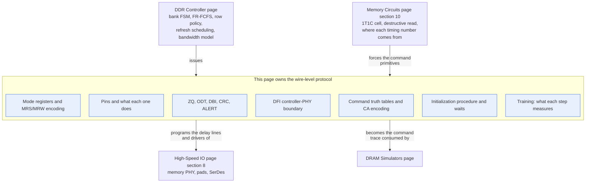
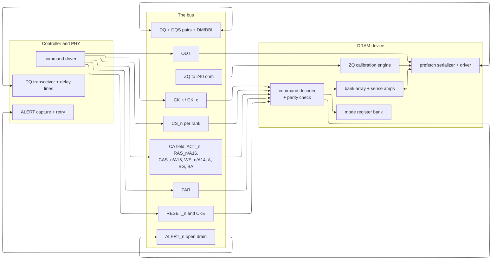
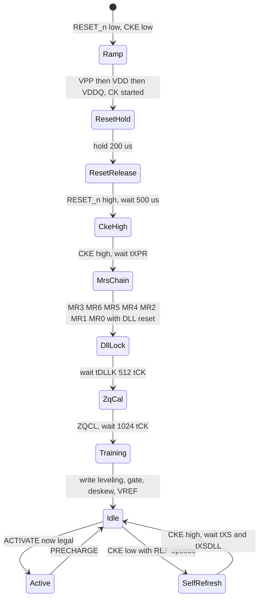
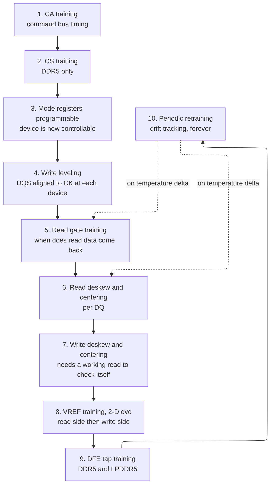
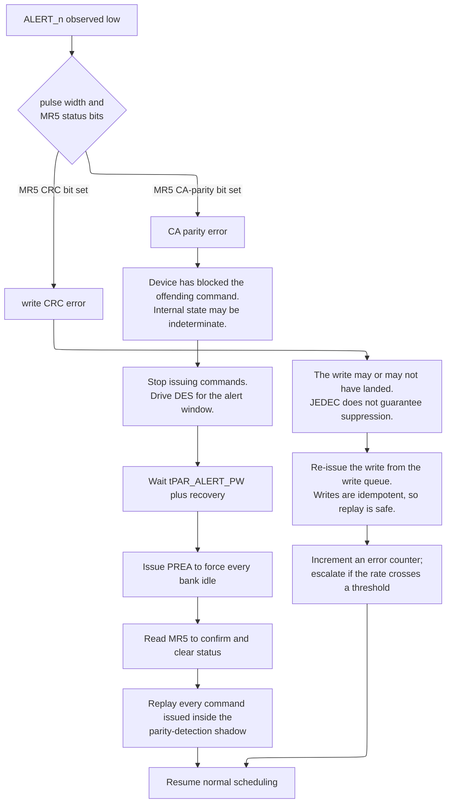

# The DRAM Device Protocol — Commands, Mode Registers, Training, and the DFI Boundary

> **First-time reader orientation:** A dynamic random-access memory (DRAM) device is not a memory you address; it is a small machine you *operate* over a wire protocol. This page is the protocol: which pins exist, what bit pattern on those pins means "open a row," how the device is configured through mode registers, the exact procedure that brings it from cold silicon to a state where a read is legal, the measurement campaign ("training") that makes multi-gigabit signaling possible at all, and the standardized digital boundary (DFI) where the controller stops and the physical-layer interface (PHY) begins.

> **Abbreviation key — skim now and return as needed:** dynamic random-access memory (DRAM); double data rate (DDR); low-power DDR (LPDDR); high-bandwidth memory (HBM); Joint Electron Device Engineering Council (JEDEC); command/address (CA); chip select (CS); clock enable (CKE); on-die termination (ODT); data (DQ); data strobe (DQS); data mask (DM); data bus inversion (DBI); cyclic redundancy check (CRC); error-correcting code (ECC); single-error correction (SEC); single-error correction, double-error detection (SEC-DED); mode register (MR); mode register set (MRS); mode register write/read (MRW/MRR); multi-purpose command (MPC); multi-purpose register (MPR); unit interval (UI); megatransfers per second (MT/s); DDR PHY interface (DFI); physical-layer interface (PHY); delay-locked loop (DLL); phase-locked loop (PLL); decision feedback equalization (DFE); pseudo-open drain (POD); low-voltage swing terminated logic (LVSTL); registering clock driver (RCD); data buffer (DB); power management integrated circuit (PMIC); serial presence detect (SPD); process-voltage-temperature (PVT); signal integrity (SI); simultaneous switching output (SSO); inter-symbol interference (ISI); refresh management (RFM); rolling accumulated activate (RAA); error check and scrub (ECS); register-transfer level (RTL); SystemVerilog assertion (SVA); silent data corruption (SDC); dual in-line memory module (DIMM); registered DIMM (RDIMM); load-reduced DIMM (LRDIMM); bank group (BG); write leveling (WL); fine-granularity refresh (FGR); partial-array self-refresh (PASR).

> **Prerequisites:** [01_DDR_Controller](01_DDR_Controller.md) (the bank state machine, the JEDEC timing parameters read as physics, row-buffer policy, first-ready first-come-first-served scheduling, refresh *scheduling*, and the achieved-bandwidth model — this page assumes all of it and supplies the wire-level commands those policies emit), [06_Memory_Circuits_and_Technologies §10](../../../00_Fundamentals/06_Memory_Circuits_and_Technologies.md) (the one-transistor one-capacitor cell, charge-sharing, the destructive read, and the sense amplifier that makes ACT/RD/PRE the only possible command primitives).
> **Hands off to:** [03_High_Speed_IO_and_Peripheral_Protocols §8](../05_IO_and_Chiplets/03_High_Speed_IO_and_Peripheral_Protocols.md) (the memory PHY as one member of the high-speed-I/O family, and the pad/SerDes machinery this page's training campaign programs), [01_DRAM_Simulators](../06_Simulation/01_DRAM_Simulators.md) (the executable command-level model — a simulator's command trace is exactly the pin activity derived here).

---

## 0. Why this page exists

The [DDR controller page](01_DDR_Controller.md) answers *which* command to issue next: it owns the per-bank state machine, the timing guards read as device physics, open-versus-closed page policy, the scheduler, and the bandwidth-under-load model. The [memory-circuits page](../../../00_Fundamentals/06_Memory_Circuits_and_Technologies.md) answers *why those commands exist at all*: one capacitor, one destructive read, one sense-amplifier latch. Between "which command" and "why commands" there is a layer neither page owns, and it is the layer an engineer actually implements: **what the command looks like on the wires, how the device is configured to accept it, and what has to happen before any of it works.**

That layer is where memory bring-up lives, and it is unforgiving. A controller with a flawless scheduler talks to nothing if the mode-register programming order is wrong, if `RESET_n` was released 40 µs early, if the DFI read-latency parameter is off by one cycle, or if nobody ran ZQ calibration and the output driver is sitting at 60 Ω into a 40 Ω channel. Worse, most of these failures do not present as "the memory is broken." They present as *training step 3 fails on rank 1 only*, or *the system passes memtest at 3200 MT/s and corrupts data at 4800*, or *it is stable until the chassis reaches 70 °C*. Diagnosing those requires knowing what each protocol step measures and what its absence looks like.

There is also a conceptual payoff. Three of the most confusing facts about modern DRAM — why bank groups exist, why DDR5 doubled the prefetch instead of the core speed, and why a memory interface needs tens of milliseconds of calibration when a PCIe link trains in microseconds — are all consequences of one arithmetic relationship between the DRAM core's cycle time and the pin data rate. Section 3 and Section 4 derive that relationship, and once you have it, the entire shape of DDR4, DDR5, and LPDDR5 stops being a list of features and becomes a forced sequence of engineering responses.

After this page you should be able to: read a JEDEC command truth table and hand-decode a bus trace; write the mode-register programming sequence for a given speed bin, including the CAS-latency encoding; write or review an initialization state machine with the correct waits; explain each training step's measurement, adjustment, and failure signature; size the timing budget that proves training is mandatory; specify the DFI signals and timing parameters between a controller and a PHY; and take a lab symptom on a failing memory interface to a short list of causes.



The contract of this map: an arrow means "supplies an input to," not "is a part of." Trace one concrete thing through it. The controller decides "activate row 0x1A3C in bank group 2, bank 1" — that decision is the controller page's. This page converts it into `CS_n=0, ACT_n=0, BG=10, BA=01, A[17:0]=0x1A3C` presented at the device's pins on one rising clock edge, and into the DFI transaction `dfi_address_p0 / dfi_cs_p0 / dfi_act_n_p0` that the controller drives one DFI cycle earlier. The failure this map illustrates: if you try to derive the pin encoding from the scheduler, or the scheduler from the pin encoding, you get neither — they are separate specifications that meet only at a command name.

---

## 1. What a DRAM device presents at its pins

A DRAM device is a slave with no ability to initiate anything. Every pin is therefore either a clock, a qualifier that says "this cycle is for you," a field of a command, a data path, or an escape hatch for the two things the device *must* be able to say back to the host (an error, and a calibration reference).

### 1.1 The pin table

Signals are named as in DDR4 (JESD79-4); DDR5 differences are called out in the last column and derived in §1.3.

| Pin / group | Dir | What it does | What breaks without it |
|---|---|---|---|
| `CK_t` / `CK_c` | in | Differential command clock. Every command is sampled on the rising edge of `CK_t` (the crossing point of the pair). Differential because the receiver's threshold is the *other* wire, which cancels common-mode noise and supply shift. | A single-ended clock's threshold moves with $V_{DD}$ noise; at 1.6 GHz the resulting jitter alone consumes the command setup window. Stop `CK` outside self-refresh or power-down and the device's internal DLL loses lock. |
| `CS_n` | in | Chip select — qualifies the command. Low means "the pattern on the CA pins this cycle is a command addressed to me." Each **rank** gets its own `CS_n`; ranks share every other pin. | Without a per-rank qualifier, two ranks on one bus both decode every command. `CS_n` is what makes multi-rank DIMMs possible, and mis-timed `CS_n` is why DDR5 added an explicit CS training step (§7.3). |
| `ACT_n` (DDR4) | in | When low with `CS_n` low, the command is ACTIVATE and the three former control pins carry row-address bits. When high, those three pins are `RAS_n`/`CAS_n`/`WE_n` again. | This one pin is how DDR4 found three extra row-address bits without adding three pins (§1.3). Removed in DDR5, which multiplexes everything. |
| `RAS_n`/`A16`, `CAS_n`/`A15`, `WE_n`/`A14` | in | With `ACT_n` high, a 3-bit command opcode (§2.1). With `ACT_n` low, the top three row-address bits. | These three bits *are* the DDR4 command set. Get their polarity wrong in the PHY and the device silently performs a different command — a PRECHARGE decoded as a REFRESH looks like data that vanishes. |
| `A[13:0]` (+ `A17`) | in | Row address on ACTIVATE, column address on READ/WRITE, opcode payload on MRS. `A10` doubles as the **auto-precharge** flag on column commands and **all-banks** on PRECHARGE. `A12` doubles as **burst chop** select. | Overloading is not decoration: `A10` is the only way to say "close this row when the burst finishes" without spending a command slot, and the controller's closed-page policy depends on it (§2.3). |
| `BG[1:0]`, `BA[1:0]` | in | Bank group and bank within group. Four groups × four banks = 16 banks on a DDR4 x8. | Bank groups are not a naming convention; they change the *legal spacing* between column commands (§3). A controller that ignores BG in its address map loses half its bandwidth. |
| `DQ[n-1:0]` | i/o | The data bus. Width defines the device: x4, x8, x16. Bidirectional, source-synchronous, and terminated. | Bidirectionality is the origin of read/write turnaround cost and of the requirement that exactly one side drive at a time — a rule an assertion must check (§14.1). |
| `DQS_t` / `DQS_c` | i/o | Differential data strobe, one pair per byte lane. Travels *with* the data and is used to capture it; there is no common clock in the data path. | This is what "source-synchronous" means. Without a forwarded strobe you would have to close timing against `CK` across the whole board — impossible past ~1 Gb/s per pin. It also means the strobe *floats* between bursts, which is why read-gate training exists (§7.4). |
| `DM_n` / `DBI_n` / `TDQS` | i/o | One shared pin per byte lane: data mask on writes, or data bus inversion, or a termination-matching strobe — **one function at a time**, selected by mode register. | Enable write DBI on a DDR4 x8 and you lose byte masking; the controller must then perform read-modify-write for sub-burst writes (§9.1). DDR5 x4 devices have no DM at all. |
| `ODT` | in | Enables the on-die termination resistor network for the DQ/DQS receivers of this rank. | Terminate nothing and reflections close the eye; terminate the wrong rank and you load the bus. The value is a mode-register choice; *when* it is on is this pin's job (§8.4). In DDR5 the discrete pin is gone and termination is applied by internal logic keyed off `CS_n` and the decoded command. |
| `CKE` (DDR4) | in | Clock enable. Low puts the device into power-down or, combined with a REFRESH command, into self-refresh. | It is the only asynchronous-ish power control. DDR5 removes it: power-down and self-refresh became *commands*, because a 32-bit subchannel could not afford a dedicated pin for a function the CA bus can encode. |
| `RESET_n` | in | Asynchronous reset. Must be held low through the entire power ramp. | Release it too early and the device latches an undefined internal state; the symptom is a device that answers nothing and cannot be recovered without a power cycle (§6). |
| `ALERT_n` | out (open drain) | The device's only outbound signal other than data: pulled low to report a CA-parity error or a write-CRC error. Open drain so all devices on a rank can share one wire. | Without it, a corrupted command is executed silently. With it, a controller can retry (§9.3). It is also the fastest way to find a marginal CA bus in the lab. |
| `PAR` (DDR4) | in | Even parity over the CA pins, checked by the device. | The CA bus has no CRC and no retry; parity converts a silent wrong-command into a reported one. |
| `ZQ` | analog | Connects to an external 240 Ω ±1% resistor to `VSSQ`. The device servos its output-driver and termination legs against it. | Uncalibrated drivers vary 30–40% over PVT. A 34 Ω target that lands at 50 Ω mismatches the channel and reflects (§8). |
| `TEN` (DDR4) | in | Connectivity test mode: drives an internal boundary-scan-like path so a board can be tested for opens/shorts before the device is trained. | Without it there is no way to distinguish "solder open on DQ5" from "training failed" — and those have completely different fixes. |
| `VDD`, `VDDQ`, `VPP`, `VREFCA`, `VSS`, `VSSQ` | power | Core, I/O, wordline-boost (2.5 V, made external in DDR4 so the charge pump left the die), CA reference, grounds. | `VPP` missing means wordlines cannot be boosted above $V_{DD}$, so the access transistor cannot pass a full high: the device appears to work for a while and then loses data. This is a classic bring-up failure that looks like a retention bug. |

### 1.2 The pin groups as a picture



The contract: everything on the left of the wires is yours to design, everything on the right is a JEDEC-specified black box, and the wires carry no negotiation — there is no handshake, no acknowledgment, no flow control anywhere in this picture except the single-bit `ALERT_n` error path. Trace one read: the driver presents a command pattern, the decoder accepts it if `CS_n` is low and parity checks, the array activates, the serializer drives DQ some fixed number of clocks later, and your delay lines had better already be positioned to catch it. The trade-off this illustrates is the entire reason the page exists: a protocol with no handshake is cheap (no return path, no buffering, no latency for acknowledgments) and it buys that cheapness by demanding that *both sides already agree on every timing number*, which is what mode registers (§5), initialization (§6), and training (§7) establish.

### 1.3 How DDR4's dedicated control pins became DDR5's multiplexed CA bus

**Baseline.** Through DDR3, the command was a 3-bit code on three dedicated pins (`RAS_n`, `CAS_n`, `WE_n`) plus a wide address bus. Clean, one command per clock, trivially decoded.

**Trace.** Count the pins on a DDR3 x8: 3 control + 15 address + 3 bank + `CS_n` + `CKE` + `ODT` + `CK` pair ≈ 25 command-side pins for 8 data pins.

**Failure.** Two pressures broke it. First, density: a 16 Gb x8 device needs 18 row-address bits, so the address bus must grow. Second, and much worse, DDR5 splits a DIMM into two independent 32-bit subchannels, each of which needs its *own complete command bus*. Duplicating 25 command pins per subchannel is not affordable at any package size, and a 25-bit-wide bus routed to every device on a DIMM at 3.2 GHz is not routable.

**Derived repair, in two steps.** DDR4 took the cheap step: add one pin, `ACT_n`, and *multiplex*. When `ACT_n` is low the command is ACTIVATE and the now-unneeded `RAS_n`/`CAS_n`/`WE_n` pins carry `A16`/`A15`/`A14`. One added pin buys three address bits, and it costs nothing because ACTIVATE is precisely the command that needs the most address bits and the fewest opcode bits. DDR5 took the structural step: delete the dedicated control pins entirely, define a single 14-bit `CA[13:0]` bus, and let a command occupy **one or two clock cycles**, with `CS_n` low on the first cycle and high on the second. Two cycles × 14 bits = 28 bits of command, which comfortably holds an opcode plus 18 row bits plus bank and bank-group fields.

**Cost.** Multi-cycle commands consume command-bus *bandwidth*: a stream of ACTIVATEs and column commands now competes for CA slots, and the controller's scheduler must model CA-bus occupancy as a resource, not just per-bank timing. `CS_n` becomes timing-critical in its own right and needs its own training step. And every command decode is now two flops deep, adding latency inside the device.

**Selection boundary.** When pins are cheap, do not multiplex. [HBM](../../02_GPU_Architecture/02_Memory_System/02_HBM_and_Advanced_Memory_Systems.md) sits on a silicon interposer where a thousand wires cost almost nothing, so it goes the opposite way — separate *row* and *column* command buses per channel, meaning an ACTIVATE and a column command can issue in the same cycle, which no DDR device can do. LPDDR5 goes further than DDR5 in the same direction as DDR5 (a 7-bit CA bus with multi-cycle commands) because a mobile package's pin budget is tighter still.

---

## 2. The command truth table, and how a command is decoded

### 2.1 DDR4: the signal-level truth table

A command is the state of five signals at one rising edge of `CK_t`, plus the address and bank fields those signals qualify. `H` = high, `L` = low, `V` = valid but don't-care, `X` = don't care. `CKE` is shown as (previous cycle / this cycle) because power-state commands are defined by a *transition*, not a level.

```text
                        CKE     CS_n  ACT_n  RAS_n  CAS_n   WE_n   BG    BA   A17..A14   A13..A11  A10/AP  A9..A0
 command                n-1/n                 /A16   /A15   /A14
 ---------------------------------------------------------------------------------------------------------------
 DESELECT       DES      H/H     H     X      X      X       X      X     X    X          X         X       X
 NO OPERATION   NOP      H/H     L     H      H      H       H      V     V    V          V         V       V
 ACTIVATE       ACT      H/H     L     L      RA16   RA15    RA14   BG    BA   RA17..RA14 RA13..11  RA10    RA9..0
 READ           RD       H/H     L     H      H      L       H      BG    BA   V   V   V  V  V  V   L       CA9..0
 READ + AP      RDA      H/H     L     H      H      L       H      BG    BA   V   V   V  V  V  V   H       CA9..0
 WRITE          WR       H/H     L     H      H      L       L      BG    BA   V   V   V  V  V  V   L       CA9..0
 WRITE + AP     WRA      H/H     L     H      H      L       L      BG    BA   V   V   V  V  V  V   H       CA9..0
 PRECHARGE      PRE      H/H     L     H      L      H       L      BG    BA   V   V   V  V  V  V   L       V
 PRECHARGE ALL  PREA     H/H     L     H      L      H       L      V     V    V   V   V  V  V  V   H       V
 REFRESH        REF      H/H     L     H      L      L       H      V     V    V   V   V  V  V  V   V       V
 MODE REG SET   MRS      H/H     L     H      L      L       L      MR[2] MR[1:0]  <---------- opcode ----------->
 ZQ CAL SHORT   ZQCS     H/H     L     H      H      H       L      V     V    V   V   V  V  V  V   L       V
 ZQ CAL LONG    ZQCL     H/H     L     H      H      H       L      V     V    V   V   V  V  V  V   H       V
 SELF-REF ENTRY SRE      H/L     L     H      L      L       H      V     V    V   V   V  V  V  V   V       V
 SELF-REF EXIT  SRX      L/H     H     X      X      X       X      X     X    X          X         X       X
 POWER-DOWN ENT PDE      H/L     H     X      X      X       X      X     X    X          X         X       X
 POWER-DOWN EXT PDX      L/H     H     X      X      X       X      X     X    X          X         X       X
```

Read the table as three nested decisions and it stops being a table to memorize.

1. **`CS_n` decides whether this cycle is yours at all.** High means DESELECT — the device ignores everything else and does not even check parity. This is why an idle bus costs nothing and why `DES` is the filler the controller drives between real commands.
2. **`ACT_n` decides between "the one command that needs 18 address bits" and "everything else."** Low = ACTIVATE, and the three opcode pins become `A16`/`A15`/`A14`.
3. **With `ACT_n` high, `{RAS_n, CAS_n, WE_n}` is a 3-bit opcode** with exactly the historically inherited assignment: `HLH`=READ, `HLL`=WRITE, `LHL`=PRECHARGE, `LLH`=REFRESH, `LLL`=MRS, `HHL`=ZQ calibration, `HHH`=NOP. Note the mnemonic: `CAS_n` low means "column operation," `WE_n` low means "the operation writes," and `RAS_n` low means "the operation touches the row/array as a whole."

Then two address bits carry sub-commands rather than addresses: **`A10` is the modifier bit.** On a column command it means auto-precharge (RDA/WRA — close the row automatically when the burst's timing allows, saving a command slot); on PRECHARGE it means all banks (PREA); on ZQ calibration it selects long versus short. **`A12`/`BC_n` selects burst chop** when the mode register has enabled on-the-fly burst length. This overloading is the reason a DDR4 controller's command encoder is not a simple lookup: the same physical pin means three different things depending on the opcode above it.

Two entries are transitions rather than patterns. **Self-refresh entry** is "the REFRESH opcode issued at the exact edge where `CKE` falls" — the same three-bit code that means REFRESH when `CKE` stays high. **Power-down entry** is simply `CKE` falling with a DESELECT; whether it becomes *precharge* power-down or *active* power-down depends on whether any bank was open. This economy is why DDR4 needs no dedicated power-state opcodes, and it is also why `CKE` timing is fussy: the device is inferring your intent from a level change relative to a command.

### 2.2 DDR5: the same information, differently packaged

DDR5 abandons the dedicated-pin encoding. A command is one or two rising edges of `CK_t` on `CA[13:0]`, with `CS_n` **low on the first cycle and high on the second** — that pattern is itself the "this is a two-cycle command" marker, so no separate length field is needed.

```wavedrom
{ "signal": [
  { "name": "CK_t",     "wave": "p......." },
  { "name": "CS_n",     "wave": "1.01...." },
  { "name": "CA[13:0]", "wave": "x.==x...", "data": ["UI0: opcode + low fields", "UI1: address continuation"] },
  { "name": "decoded",  "wave": "x..=.x..", "data": ["one command"] }
 ],
 "head": {"text": "DDR5 two-cycle command frame: CS_n low on the first edge, high on the second"}
}
```

The contract of this frame: the device latches `CA[13:0]` on both edges and only assembles a command if `CS_n` was low on the first and high on the second. Trace a DDR5 ACTIVATE: the first cycle carries the opcode bits that identify ACT plus the bank group, bank, and the low row-address bits; the second carries the remaining row bits. The failure it illustrates: because `CS_n` must be *high* on the second cycle, a controller cannot start a new command on the cycle immediately following the start of a two-cycle command. Command-bus occupancy is now a scheduling resource, and a burst of ACTIVATEs to many banks can be CA-bus-limited before it is $t_{RRD}$-limited. (Exact `CA` bit assignments per command are in JESD79-5's command truth table; the field *structure* above is what determines controller design.)

DDR5's command set also changes in three ways that matter beyond encoding:

- **MRS becomes MRW and MRR.** DDR5 defines a large mode-register space of 8-bit registers addressed by an 8-bit register number, written with MRW (mode register write) and — new — **readable with MRR** (mode register read). DDR4's MRS was write-only, so a controller could never confirm what it had programmed; DDR5 lets you read back CAS latency, driver strength, temperature, and error counters. This single change transforms bring-up debug (§14.3).
- **MPC (multi-purpose command)** carries an opcode field for operations that are not memory accesses: start and latch ZQ calibration, enter and exit training modes, reset the DLL, start the internal read-training pattern generator. Instead of overloading address bits as DDR4 did, DDR5 gives housekeeping its own command.
- **Refresh and precharge gain granularity fields.** `REFab` / `REFsb` (all-bank / same-bank) and `PREab` / `PREpb` / `PREsb` (all / per-bank / same-bank) are distinct encodings with a bank field, not an address-bit modifier (§10.3).

### 2.3 A sequence at the pins

Here is `ACT` → `RD` → `PRE` to one bank, as it appears on a DDR4 x8's pins. CAS latency is compressed for legibility; at DDR4-3200 with CL=22 the burst would appear 22 clocks after the READ, not 5.

```wavedrom
{ "signal": [
  { "name": "CK_t",       "wave": "p........................." },
  { "name": "CS_n",       "wave": "101.......01.......01....." },
  { "name": "ACT_n",      "wave": "101......................." },
  { "name": "RAS_n/A16",  "wave": "x3x.......4x.......5x.....", "data": ["RA16","H","L"] },
  { "name": "CAS_n/A15",  "wave": "x3x.......4x.......5x.....", "data": ["RA15","L","H"] },
  { "name": "WE_n/A14",   "wave": "x3x.......4x.......5x.....", "data": ["RA14","H","L"] },
  { "name": "BG / BA",    "wave": "x3x.......4x.......5x.....", "data": ["bg,ba","bg,ba","bg,ba"] },
  { "name": "A10/AP",     "wave": "x3x.......4x.......5x.....", "data": ["row bit","AP=0","L = one bank"] },
  { "name": "A[9:0]",     "wave": "x3x.......4x.......5x.....", "data": ["row addr","col addr","V"] },
  { "name": "decoded",    "wave": "x3x.......4x.......5x.....", "data": ["ACT","RD","PRE"], "node": ".a........b........c......" },
  { "name": "DQS_t",      "wave": "z.............0nnnn0zzzzzz" },
  { "name": "DQ[7:0]",    "wave": "z.............====z.......", "data": ["d0 d1","d2 d3","d4 d5","d6 d7"] }
 ],
 "edge": ["a-|>b tRCD", "b-|>c tRTP", "a-|>c tRAS"],
 "head": {"text": "DDR4 x8 at the pins: ACT, then RD, then PRE, with the guards between them"}
}
```

**Contract.** Every gap in this trace is a JEDEC minimum, not idle time the controller chose. `a→b` must be at least $t_{RCD}$; `b→c` at least $t_{RTP}$ (read-to-precharge, so the column path drains before the sense amps are reset); `a→c` at least $t_{RAS}$, the restore deadline. The [controller page §3](01_DDR_Controller.md) derives what physical event each one protects; here they are simply the spacing rules the command encoder must obey.

**Trace.** Note three things the waveform makes concrete that a timing table does not. First, `DQS_t` is high-impedance before and after the burst and only toggles during it, preceded by a **preamble** (one or two clocks of a defined low level) and followed by a **postamble**. The preamble exists so the receiver has a clean edge to start from after the line has been floating — and finding *when* that preamble arrives is exactly what read-gate training solves (§7.4). Second, the eight data beats occupy four clock cycles, because DDR transfers on both edges: BL8 = 4 $t_{CK}$. Third, `A10` is low on the READ, meaning no auto-precharge, which is why an explicit `PRE` command is needed at all; setting `A10` high on the READ would have issued RDA and saved that command slot at the cost of committing to close the row.

**Failure it illustrates.** If the controller issues the `PRE` one cycle early — violating $t_{RTP}$ — the sense amplifiers are reset while the column path is still draining. The read returns partially correct data and the row's restore is truncated, so the *cells* are left at an intermediate charge. The corruption appears later, on an unrelated access to the same row, as a retention failure. This is the general shape of DRAM protocol bugs: the violation and the symptom are separated in time and in address.

---

## 3. Address mapping at the device, and why bank groups are a protocol obligation

### 3.1 The address fields

The controller receives a flat physical address and must split it into fields the device understands. For a DDR4 8 Gb x8 device, the arithmetic is fixed by the die:

$$
8\ \text{Gb} = \underbrace{16}_{\text{banks}} \times \underbrace{2^{16}}_{\text{rows}} \times \underbrace{2^{10}}_{\text{columns}} \times \underbrace{8}_{\text{bits per column}}
$$

Check it: $16 \times 65536 \times 1024 \times 8 = 8.59\times10^9$ bits = 8 Gb. One row of one device holds $1024 \times 8 = 8192$ bits = **1 KB**; a x64 rank built from eight such devices activates all eight in lockstep, so the rank's "row" — the thing the row buffer holds — is **8 KB**, matching the number the controller page uses.

The 16 banks are organized as **4 bank groups × 4 banks**, addressed by `BG[1:0]` and `BA[1:0]`. A column command carries a 10-bit column address, but the low three bits are consumed by the burst: a BL8 burst delivers 8 consecutive column locations, so `CA[2:0]` selects the *starting* location within the burst and the device generates the rest in sequential or interleaved order (mode-register selectable). Effectively the controller chooses `CA[9:3]` and the burst covers the rest.

```text
physical address from the controller (one common DDR4 mapping, 1 rank, 8 KB row)
  63                        33 32   30 29        14 13  12 11        6 5     3 2   0
  +----------------------------+-------+-----------+-----+------------+-------+-----+
  |          unused            |  row  |    row    | BG  |    column  |  BG   | byte|
  |                            | high  |           | high|   CA[9:3]  | low   |  in |
  +----------------------------+-------+-----------+-----+------------+-------+-----+
                                                                  ^
   the placement of the BG bits is the single highest-leverage address-map decision
```

### 3.2 The protocol consequence: $t_{CCD\_S}$ versus $t_{CCD\_L}$

Two column commands to **different** bank groups may be spaced by $t_{CCD\_S}$ (short). Two column commands to the **same** bank group must be spaced by $t_{CCD\_L}$ (long). At DDR4-3200:

$$
t_{CCD\_S} = 4\ t_{CK} = 4 \times 0.625 = 2.5\ \text{ns}, \qquad
t_{CCD\_L} = 8\ t_{CK} = 8 \times 0.625 = 5.0\ \text{ns}
$$

A BL8 burst on a x64 rank moves 64 B and occupies the DQ bus for exactly $4\ t_{CK} = 2.5$ ns. So $t_{CCD\_S}$ equals the burst duration: back-to-back column commands across bank groups keep the data bus 100% busy. And $t_{CCD\_L}$ is exactly twice the burst duration: back-to-back column commands *within* one bank group leave the bus idle half the time.

$$
\text{BW}_{\text{same BG}} = \frac{64\ \text{B}}{5.0\ \text{ns}} = 12.8\ \text{GB/s}
\qquad\text{versus}\qquad
\text{BW}_{\text{alternating BG}} = \frac{64\ \text{B}}{2.5\ \text{ns}} = 25.6\ \text{GB/s}
$$

**Half the channel, decided entirely by which address bits you assigned to `BG`.** That is why bank-group interleaving is an obligation, not an optimization: there is no scheduler cleverness that recovers the lost half if the address map funnels a sequential stream into one bank group.

Generalize it. Let $f$ be the fraction of consecutive column-command pairs that land in the same bank group. Mean spacing is $f\,t_{CCD\_L} + (1-f)\,t_{CCD\_S} = (4 + 4f)\,t_{CK}$, so

$$
\eta_{BG} = \frac{t_{CCD\_S}}{f\,t_{CCD\_L}+(1-f)\,t_{CCD\_S}} = \frac{1}{1+f}
$$

With four bank groups and *randomly* distributed addresses, $f = 1/4$ and $\eta_{BG} = 0.8$ — even random traffic gives up 20%. With the `BG` bits placed just above the burst boundary so consecutive 64 B lines rotate through groups, $f \to 0$ and $\eta_{BG} \to 1$. With the `BG` bits placed high in the address, a sequential stream has $f \to 1$ and $\eta_{BG} = 0.5$. The [address-map blueprint](../08_Implementation_Blueprints/01_Address_Map_Protocols_and_Memory_Integration_Blueprint.md) is where this decision is made concrete for a real SoC.

### 3.3 Why bank groups exist at all

**Baseline.** Through DDR3, one column access per burst period was enough: the device's internal column datapath fetched a prefetch-width chunk and the I/O serialized it while the core prepared the next chunk.

**Trace.** DDR3-1600 with 8n prefetch: the pins move 1600 MT/s, the core must supply one 8-bit-per-DQ chunk per burst, so the core's column rate is $1600/8 = 200$ million column operations per second — a 5 ns internal cycle. That is comfortable for a DRAM array's column decode, sense-amp multiplexer, and global I/O line.

**Failure.** DDR4 doubles the pin rate to 3200 MT/s. Keeping 8n prefetch means the core column rate must double to $3200/8 = 400$ M/s, a **2.5 ns internal cycle**. The DRAM core cannot do that. The column path — global I/O lines spanning millimeters of array with no repeaters, driven by small sense-amp-adjacent devices on a process optimized for capacitor density and leakage, not speed — did not get faster. This is the same lag that makes $t_{RCD}$ stuck near 14 ns for a decade.

**Derived repair.** If one column datapath cannot run at 2.5 ns, use *two*, and alternate. Split the banks into groups, give each group its own column datapath and prefetch buffer, and let each group run at its native 5 ns while the pins see a command every 2.5 ns. The two constraints are then exactly $t_{CCD\_L} = 5$ ns (the real core limit, within a group) and $t_{CCD\_S} = 2.5$ ns (the bus limit, across groups). Bank groups are not extra banks for parallelism; they are **replicated column datapaths to hide a core that stopped scaling.**

**Cost.** Area, for the duplicated column datapath and prefetch registers. A more complex address map. And a hard obligation on the controller: it now must know, schedule around, and interleave a structure that has no analog in any other memory. Also new companion constraints — $t_{RRD\_S}$/$t_{RRD\_L}$ for activate-to-activate and $t_{WTR\_S}$/$t_{WTR\_L}$ for write-to-read — each with the same short/long split for the same reason.

**Selection boundary.** If the pin rate is low enough that the core keeps up, bank groups are pure cost. DDR3 has none. HBM, whose per-pin rate is modest and whose channel count is enormous, gets its parallelism from 16 independent channels rather than from bank groups within a channel — a different answer to the same arithmetic, available only because an interposer makes wires nearly free.

---

## 4. Prefetch, burst length, and the arithmetic that explains every DDR generation

### 4.1 The one equation

An "$n$-bit prefetch" device fetches $n$ bits per DQ pin from the array on each internal column operation and serializes them onto the pin. The pin runs at the data rate $r$ (in transfers per second); the core runs at the column-operation rate $f_{core}$. Conservation of bits requires:

$$
\boxed{\;f_{core} = \frac{r}{n}\;}
$$

That is the whole story, and it explains the generations:

| Generation | Data rate $r$ | Prefetch $n$ | $f_{core} = r/n$ | Core column period | Burst BL | Burst duration |
|---|---|---|---|---|---|---|
| DDR-400 | 400 MT/s | 2n | 200 M/s | 5.0 ns | BL2/BL4 | 1–2 $t_{CK}$ |
| DDR2-800 | 800 MT/s | 4n | 200 M/s | 5.0 ns | BL4/BL8 | 2–4 $t_{CK}$ |
| DDR3-1600 | 1600 MT/s | 8n | 200 M/s | 5.0 ns | BL8 | 4 $t_{CK}$ |
| DDR4-3200 | 3200 MT/s | 8n | 400 M/s | 2.5 ns | BL8 | 4 $t_{CK}$ |
| DDR5-6400 | 6400 MT/s | 16n | 400 M/s | 2.5 ns | BL16 | 8 $t_{CK}$ |

Read the $f_{core}$ column. From DDR through DDR3, **the DRAM core never got faster** — 200 million column operations per second, a 5 ns cycle, for four generations and an 8× increase in pin rate. Every one of those 8× came from doubling the prefetch. DDR4 broke the pattern by pushing $f_{core}$ to 400 M/s, and the core could not actually deliver it, which is precisely why bank groups had to be invented: with two interleaved groups each running at 200 M/s, the *device* presents 400 M/s to the pins while no single column datapath exceeds its 5 ns native cycle.

DDR5's move is now obvious rather than mysterious. Doubling the pin rate again to 6400 MT/s with 8n prefetch would demand $f_{core} = 800$ M/s — hopeless. Doubling the prefetch to 16n puts $f_{core}$ back at 400 M/s, exactly where DDR4-3200 left it, and the same bank-group trick keeps each datapath at 200 M/s. **DDR5-6400's core runs at the same speed as DDR4-3200's core.** All of the generational gain is prefetch width and channel splitting.

### 4.2 What prefetch costs, and why it forced the DDR5 subchannel

Prefetch is not free, and its cost is **access granularity**. The minimum amount of data a burst can move is

$$
G = n \times W
$$

where $W$ is the channel width in bits. Work the two cases:

- **DDR4:** $n=8$, $W=64$ bits $\Rightarrow G = 512$ bits $= 64$ B. Exactly one cache line. Perfect.
- **DDR5 with a 64-bit channel:** $n=16$, $W=64 \Rightarrow G = 1024$ bits $= 128$ B. **Two** cache lines per unavoidable burst.

For a workload with a 64 B line and poor spatial locality, that second line is fetched and thrown away: half the bus, half the DRAM energy, wasted. The efficiency loss is a clean 50% on random 64 B access. The repair is to halve $W$ while keeping $n$: **two independent 32-bit subchannels**, each with $G = 16 \times 32 = 512$ bits $= 64$ B. The DDR5 subchannel split is therefore not primarily about parallelism (though it doubles the independent bank count, which the controller page's §7.2 shows is valuable); it is the mandatory correction for the granularity that 16n prefetch would otherwise impose.

Same reasoning gives LPDDR5's shape. A 16-bit channel with BL16 gives $G = 256$ bits $= 32$ B — matched to mobile cache lines and to the fine-grained, scattered access patterns of a mobile SoC. And HBM's 32-bit pseudo-channel with BL8 gives the same 32 B. Every modern memory is converging on 32–64 B of access granularity from different directions, because that is what the cache line demands.

### 4.3 Burst chop, and why it does not buy what it looks like it buys

DDR4 mode register 0 selects BL8 fixed, BC4 (burst chop, 4 beats) fixed, or **BC4/BL8 on the fly**, in which case `A12` on each column command chooses. DDR5 offers BL16, BC8 on the fly, and BL32/BC32 modes for x4 devices.

**The trap.** BC4 looks like it should double column throughput: half the data, so half the bus time, so twice the commands. It does not. The device's internal prefetch still fetched all 8 bits per DQ — the array does not know about chop — and $t_{CCD}$ is unchanged. What BC4 does is **mask** the unwanted half: the device drives no data (or the controller ignores it) for the last 2 $t_{CK}$. So a stream of BC4 accesses runs at *half* the bus efficiency of a stream of BL8 accesses, not the same.

**So why does it exist?** Two real reasons. First, I/O energy: not driving 32 unwanted bits across a terminated bus saves the POD termination current for those beats (§9.1 quantifies what a driven bit costs). Second, it lets a controller service a 32 B critical-word-first request without a read-modify-write and without occupying the bus with data nobody wants. The selection boundary: use BC4 for a scattered-access workload where the second half of the burst is genuinely dead, and BL8 for anything with spatial locality.

### 4.4 Relating the two clock domains

It is worth writing the three frequencies of a DDR5-6400 system side by side, because engineers routinely conflate them:

$$
\underbrace{400\ \text{M column-ops/s}}_{\text{array, } f_{core}} \;\ll\;
\underbrace{3200\ \text{MHz}}_{CK,\ f_{CK}=r/2} \;<\;
\underbrace{6400\ \text{MT/s}}_{\text{pin data rate } r}
$$

and, on the controller side, a fourth: the DFI clock, typically $f_{CK}/2$ or $f_{CK}/4$ (§13.4), so a 6400 MT/s interface is often driven by a controller running at **800 MHz** and issuing up to four DRAM commands per cycle. Four clock domains, three of them derived by fixed integer ratios from one PLL, and every one of them appears in some timing parameter. When a datasheet says "$t_{RCD}$ = 22", ask *in which clock* — it is $CK$ cycles, so at DDR4-3200 ($t_{CK}=0.625$ ns) that is $22 \times 0.625 = 13.75 \approx 14$ ns, the physical sense-and-latch time. The nanosecond value is the physics; the cycle count is the physics divided by the bin's $t_{CK}$ and rounded up. That is why the *same* ~14 ns at DDR5-6400 ($t_{CK}=0.3125$ ns) is programmed as $\lceil 14/0.3125 \rceil = 45$ cycles, not 22 — a count of 22 at DDR5-6400 would mean 6.9 ns, which no DRAM core can do and which contradicts the $t_{RCD}\approx14$ ns floor of §3.3. **Read a bare cycle count as meaningless until multiplied by its bin's $t_{CK}$**, and note the corollary: speed bins carry *larger* CL and $t_{RCD}$ numbers at higher data rates for the same real latency.

---

## 5. Mode registers: how a device is configured

### 5.1 What a mode register is and why the device needs one

The device has no idea what board it is on, what data rate the controller intends, how strongly it should drive, or how long the controller expects to wait for read data. All of that is *system* information, and it is delivered by writing mode registers before any access occurs. A mode register is a small write-only (DDR4) or read/write (DDR5) latch array inside the device whose bits directly gate hardware: a CAS-latency field is a load value for a shift-register pipeline, a drive-strength field is a leg-enable mask for the output driver, an ODT field selects taps on a resistor ladder.

The consequence, which bites every bring-up: **a mode register value the controller believes and a mode register value the device holds are two different things, and DDR4 gives you no way to compare them.** If the controller's CL register says 22 and the device was programmed with 20, read data arrives two cycles early and every read is garbage — with no error indication anywhere. DDR5's MRR fixes this.

### 5.2 DDR4: MR0–MR6

DDR4 has seven mode registers, selected by the `BG0`, `BA1`, `BA0` pins during an MRS command (so `{BG0,BA1,BA0} = 3'b000` selects MR0, `3'b110` selects MR6; `3'b111` is reserved), with the payload on `A[17:0]`.

| Register | What it configures | Why it must be programmable |
|---|---|---|
| **MR0** | Burst length and burst type; **CAS latency**; write recovery / read-to-precharge; DLL reset; test mode | CL and WR are speed-bin properties: the same die runs at several bins with different cycle counts for the same nanoseconds. |
| **MR1** | DLL enable; **output driver impedance** (RZQ/7 = 34 Ω, RZQ/5 = 48 Ω); `RTT_NOM`; **write leveling enable**; additive latency; output buffer disable (`Qoff`); TDQS enable | Drive strength and termination depend on the board topology, which the die cannot know. Write-leveling enable puts the device into a training mode (§7.3). |
| **MR2** | `RTT_WR` (dynamic ODT value); **CAS write latency (CWL)**; auto self-refresh / low-power ASR; **write CRC enable** | CWL tracks the bin like CL. Dynamic ODT needs a second termination value applied only during writes (§8.4). |
| **MR3** | MPR (multi-purpose register) enable and page select; **gear-down mode**; per-DRAM addressability; temperature-sensor readout; **fine-granularity refresh mode**; write command latency when CRC/DM are enabled; read/write preamble controls | MPR is the source of the known pattern that read training uses. Gear-down halves the CA capture rate (§5.4). FGR trades refresh chunk size for stall length (§10.4). |
| **MR4** | Max power-down mode; temperature-controlled refresh enable and range; internal VREF monitor; **CS-to-command latency (CAL)**; self-refresh abort; **read/write preamble length**; read preamble training mode | Preamble length (1 or 2 $t_{CK}$) must match what the PHY's read gate expects — a mismatch here is one of the most common "gate training fails" root causes. |
| **MR5** | CA parity latency; **CRC error status**; **CA parity error status**; ODT input buffer behavior in power-down; `RTT_PARK`; **data mask enable**; **write DBI enable**; **read DBI enable** | The two status bits are how the controller distinguishes a CRC error from a parity error after `ALERT_n` fires (§9.3). DM/DBI are mutually exclusive on the shared pin. |
| **MR6** | $t_{CCD\_L}$ setting; **VrefDQ training enable, range, and value** | VrefDQ training is a *protocol* operation: the controller drives the device's internal DQ receiver reference through this register while sweeping (§7.7). |

### 5.3 A worked MRS: programming CAS latency

CAS latency in DDR4 MR0 is not a contiguous field. It is five bits scattered as `{A12, A6, A5, A4, A2}`, and the mapping from code to latency is not monotonic:

```text
 A12 A6 A5 A4 A2 -> CL      A12 A6 A5 A4 A2 -> CL      A12 A6 A5 A4 A2 -> CL
  0   0  0  0  0  ->  9      0   1  0  0  0  -> 18      1   0  0  0  0  -> 25
  0   0  0  0  1  -> 10      0   1  0  0  1  -> 20      1   0  0  0  1  -> 26
  0   0  0  1  0  -> 11      0   1  0  1  0  -> 22      1   0  0  1  0  -> 27
  0   0  0  1  1  -> 12      0   1  0  1  1  -> 24      1   0  0  1  1  -> 28
  0   0  1  0  0  -> 13      0   1  1  0  0  -> 23      1   0  1  0  0  -> 29
  0   0  1  0  1  -> 14      0   1  1  0  1  -> 17      1   0  1  0  1  -> 30
  0   0  1  1  0  -> 15      0   1  1  1  0  -> 19      1   0  1  1  0  -> 31
  0   0  1  1  1  -> 16      0   1  1  1  1  -> 21      1   0  1  1  1  -> 32
```

Look at the middle column: 18, 20, 22, 24, then **23, 17, 19, 21**. That is not a design; it is archaeology. The original DDR4 spec defined only even CAS latencies above 16, and when the odd values were later needed for intermediate speed bins, they were dropped into whichever codes were still free. Encodings in long-lived standards accumulate this kind of sediment, and the practical lesson is that you never compute a mode-register field — you look it up in a table generated from the current spec revision.

**Program CL = 22 on a DDR4-3200 device.** From the table, the code is `{A12,A6,A5,A4,A2} = {0,1,0,1,0}`. Suppose we also want BL8 fixed (`A[1:0]` = `2'b00`), sequential burst type (`A3` = 0), write recovery WR = 24 with read-to-precharge RTP = 12 (`A[13,11:9]` per the WR/RTP table), no test mode (`A7` = 0), and DLL reset asserted (`A8` = 1, self-clearing, used once at initialization).

```text
MRS to MR0:  {BG0,BA1,BA0} = 000

 bit   A13  A12  A11 A10 A9   A8    A7   A6   A5   A4   A3   A2   A1   A0
 field WR/  CL    <-- WR/RTP -->  DLL  test  CL   CL   CL  burst CL   <- BL ->
       RTP  msb                   rst  mode                    type
 value  0    0     0   1   1    1     0    1    0    1    0    0    0    0
                   \_______/                                    \_______/
                   WR/RTP code                                  burst length
```

Two properties of this encoding are worth internalizing. First, **the fields interleave**, so a controller's MR0 register in RTL is not a simple concatenation of software-visible fields — there is a bit-scatter function between the architectural register and the wire. Register-automation tooling ([IP reuse and register automation](../../../08_Cross_Cutting_Engineering/04_IP_Reuse_Integration_and_Register_Automation.md)) exists partly to generate that function from a spec rather than hand-code it. Second, **`A8` (DLL reset) is why MR0 is programmed last** in the initialization order (§6.3): resetting the DLL is the act that commits the device to the new clock configuration, so everything else must already be in place.

### 5.4 Gear-down mode, a mode register that changes the protocol itself

Most mode-register bits configure hardware. `MR3[A3]`, gear-down mode, changes the *command protocol*, and it is worth its own treatment because it is the clearest example of the core-versus-pin lag showing up on the command bus rather than the data bus.

**Baseline.** The device latches `CA` on every rising edge of `CK`. The setup-and-hold window available to that internal latch is roughly one $CK$ period minus the CA bus's own uncertainty.

**Trace.** At DDR4-2133, $t_{CK} = 938$ ps. Subtract CA bus skew, `VREFCA` uncertainty, and the internal clock-distribution spread inside the device, and a few hundred picoseconds of window remain. Workable.

**Failure.** At DDR4-3200, $t_{CK} = 625$ ps. The *uncertainty terms did not shrink* — they are set by the CA bus's fly-by routing to many devices, by `VREFCA` accuracy, and by the device's internal clock tree, none of which improved. The internal capture window closes.

**Derived repair.** Halve the internal capture rate. In gear-down mode the device latches `CA` only on every *other* `CK` rising edge, doubling the internal capture window to $2\,t_{CK}$. The controller must hold each command's CA pattern stable for two clocks and must align commands to the correct (even) edge.

**Cost, and the subtle part.** The device and the controller must *agree on which edge is even*. There is no way to infer it, so JEDEC defines a **sync-pulse sequence** at initialization: the controller issues a defined pattern that establishes the phase, after which both sides count from the same edge. Get the sync wrong and every command lands on the wrong edge — the device decodes garbage, and the failure looks exactly like a broken CA bus. The other cost is command-bus bandwidth: at 1/4-rate capture the controller can issue at most one command per two $CK$, which for activate-heavy traffic can become the binding constraint before $t_{RRD}$ does.

**Selection boundary and successor.** Gear-down is required only at DDR4-2666 and above. DDR5 does not need a mode bit for it because it made the same choice structurally: the CA bus is single-data-rate relative to `CK` and commands take two cycles, so the CA capture window is inherently generous relative to the DQ bus's unit interval. That is the same trade, made once in the architecture instead of as a runtime option.

### 5.5 DDR5's mode-register space

DDR5 replaces seven wide registers with a large space of **8-bit registers addressed by an 8-bit register number**, written by MRW and read by MRR. The organization matters more than the numbering:

| Functional group | What lives there | Why it needed to grow |
|---|---|---|
| Core timing | CAS latency, write recovery, $t_{CCD\_L}$, read/write preamble | More speed bins and more per-bin parameters than DDR4 had room for. |
| Data-bus features | Read DBI, write DBI, data mask enable, write CRC, **read CRC** | Read CRC is new in DDR5 and needs its own enable and status. |
| Driver and termination | Pull-up/pull-down drive strength, `RTT_PARK`, `RTT_NOM_RD`, `RTT_NOM_WR`, `RTT_WR`, and separate `CK`/`CA`/`CS` termination values | DDR5 terminates the command bus too, and each terminated net needs its own value. |
| Training | VrefDQ, VrefCA, VrefCS values and ranges; DFE tap coefficients; internal write-leveling and pattern-generator controls | DDR5 trains three separate reference voltages and a multi-tap equalizer per DQ, none of which DDR4 had. |
| Refresh and RAS | Refresh rate, temperature status, refresh management (RFM) thresholds, **ECS (error check and scrub) controls and error counters** | On-die ECC created a need for on-die error *reporting* (§11.3). |
| Device identity | Manufacturer ID, density, revision, x4/x8/x16 | Readable via MRR, so firmware can identify a part without SPD. |

The design lesson: DDR4 packed unrelated functions into wide registers because each MRS command was expensive and the register selector was only three bits wide. DDR5 has a cheap, wide register address, so it uses one register per concern. That is the same evolution any control-register interface goes through as address space stops being scarce — and it is why DDR5 mode-register programming is *longer* (many more MRW commands) but far easier to get right and to debug.

---

## 6. Initialization: from cold silicon to a legal READ

This section is a procedure, not a discussion, because bring-up engineers execute exactly this and every wait in it exists to protect a specific internal event. The sequence below follows JESD79-4 (DDR4); §6.5 gives the DDR5 deltas.

### 6.1 Voltage sequencing

| Step | Action | Constraint | What breaks if you get it wrong |
|---|---|---|---|
| 1 | Hold `RESET_n` low and `CKE` low (both below ~0.2 × $V_{DD}$) *before and throughout* the ramp | asserted before any rail rises | A floating `RESET_n` during ramp lets internal state machines start in random states; the device may latch a configuration that no command can clear. |
| 2 | Ramp $V_{PP}$, then $V_{DD}$, then $V_{DDQ}$, maintaining $V_{PP} \ge V_{DD} \ge V_{DDQ}$ at all times | ordering is a *rule*, not a preference | Ramping $V_{DDQ}$ above $V_{DD}$ forward-biases the ESD and well diodes between the I/O and core domains. The device can be permanently damaged, or latch up. |
| 3 | Ramp `VREFCA` to $0.5 \times V_{DD}$; it must track $V_{DD}$ | after $V_{DD}$ is stable | The CA receiver's threshold is `VREFCA`. Wrong reference means every command bit is decoded against the wrong level. |
| 4 | Start `CK` and keep it stable; drive `ODT` and all CA pins to a defined level | `CK` stable before `RESET_n` release window ends | The internal DLL cannot begin acquiring without a clock. |

The ordering rule is the one that destroys hardware, so it belongs in the board's power-sequencing controller, not in firmware. Note that DDR4 moved the wordline-boost supply $V_{PP}$ (2.5 V) off-die: the charge pump that generated it internally through DDR3 was a large, inefficient block, and moving it to the board saved die area and power at the cost of one more rail to sequence.

### 6.2 Reset and clock-enable release

| Step | Action | Minimum wait | Why the wait exists |
|---|---|---|---|
| 5 | With power stable, keep `RESET_n` low | **≥ 200 µs** | The device's internal analog blocks (reference generators, the $V_{PP}$-derived wordline supply, temperature sensor) must settle. 200 µs is an eternity in digital terms and it is entirely analog settling. |
| 6 | Release `RESET_n` high; keep `CKE` low | **≥ 500 µs** before `CKE` may rise | Internal initialization state machines run: array bias, sense-amp offset trim, mode-register defaults. There is no status pin to poll — the wait *is* the handshake. |
| 7 | Drive `CKE` high with a DESELECT on the CA bus | `CKE` must have been low ≥ 10 ns ($t_{IS}$) before rising | This is the point where the device begins accepting commands. |
| 8 | Wait $t_{XPR} = \max(t_{RFC}(\text{min}) + 10\ \text{ns},\ 5\,t_{CK})$ before the first MRS | ~360–560 ns depending on density | "Exit reset to a valid command" — the device performs an internal refresh-like initialization of the array. |

Steps 5 and 6 together mean **a DDR4 device is not addressable for at least 700 µs after power is stable**. On a system with many DIMMs, this is a meaningful part of boot time and it cannot be shortened.

### 6.3 Mode-register programming, in the mandated order

| Step | Action | Wait after | Why this order |
|---|---|---|---|
| 9 | MRS to **MR3** | $t_{MRD}$ = 8 $t_{CK}$ | MPR and gear-down configuration must exist before anything depends on the CA capture rate. |
| 10 | MRS to **MR6** | $t_{MRD}$ | $t_{CCD\_L}$ and the VrefDQ training controls. |
| 11 | MRS to **MR5** | $t_{MRD}$ | Parity latency, `RTT_PARK`, DBI/DM. `RTT_PARK` must be set before any bus activity, or the idle bus is unterminated. |
| 12 | MRS to **MR4** | $t_{MRD}$ | Preamble lengths, CAL, refresh behavior. |
| 13 | MRS to **MR2** | $t_{MRD}$ | CWL, `RTT_WR`, CRC enable. |
| 14 | MRS to **MR1** | $t_{MRD}$ | DLL enable, driver impedance, `RTT_NOM`. **DLL enable happens here**, before the reset that follows. |
| 15 | MRS to **MR0** with `A8` = 1 (DLL reset) | $t_{MOD} = \max(24\,t_{CK},\ 15\ \text{ns})$ | CL, WR, burst length — and the DLL reset that commits everything above. MR0 is last precisely because `A8` is the commit action. |
| 16 | Wait $t_{DLLK}$ | **512 $t_{CK}$** | The DLL must acquire lock against the now-stable `CK`. Issue a READ before this and the output timing is undefined. |

The order is `MR3 → MR6 → MR5 → MR4 → MR2 → MR1 → MR0`. It is descending except for MR6 jumping ahead of MR5, and the reason for the shape is dependency: registers that configure *how the device interprets subsequent configuration* (CA capture rate, parity latency, termination) come first; the register that *activates* the configuration (MR0's DLL reset) comes last. Two distinct waits appear here: $t_{MRD}$ (mode register set command delay, 8 $t_{CK}$) is how long the device needs before it can accept another MRS, while $t_{MOD}$ (mode register set update delay) is how long before a *non-MRS* command is legal, because the new settings must propagate into the datapath.

### 6.4 Calibration, training, and first access

| Step | Action | Wait | Why |
|---|---|---|---|
| 17 | Issue **ZQCL** (ZQ calibration long) | $t_{ZQinit}$ = **1024 $t_{CK}$** | A full search of the driver and termination leg codes against the external 240 Ω reference (§8.2). Until this completes, output impedance is whatever the process happened to give. |
| 18 | Run **write leveling**: MRS to MR1 with `A7` = 1, sweep, then MRS to MR1 with `A7` = 0 | per-step, PHY-dependent | Aligns each byte lane's DQS to that device's `CK` (§7.3). |
| 19 | Run read gate, read deskew, write deskew, and VrefDQ training | tens of ms total | §7. VrefDQ training uses MR6 writes inside the loop. |
| 20 | Issue **PREA** (precharge all banks) | $t_{RP}$ | Puts every bank into the idle state from whatever the training left them in. |
| 21 | Optionally re-issue MRS to set the final operating values (e.g. clear training modes) | $t_{MOD}$ | Training modes must not be left enabled. |
| 22 | **First legal ACTIVATE.** | — | The device is now in the "all banks idle" state the controller page's bank FSM starts from. |

Notice where the time goes: ~700 µs of mandated waits, ~0.5 µs of mode-register programming, ~0.3 µs of ZQ, and then **tens of milliseconds of training**. Training dominates memory bring-up by three orders of magnitude, which is why §7 is the longest section on this page and why "the memory takes 30 ms to come up" is a normal, correct answer rather than a bug.



**Contract.** Every transition is gated by a wait, and none of the waits is observable from outside — there is no "ready" pin. Trace a failure: a firmware author shortens the 500 µs wait to 100 µs because "it seems to work on the bench." The device's internal initialization has not finished, so the first MRS lands on a register file that is still being reset to defaults. The result is a device with, say, the correct CL but a default `RTT_PARK`, which works fine at room temperature on a lightly loaded board and fails on a two-DIMM system at temperature. The trade-off this illustrates: a protocol with no handshakes is cheap in pins and latency, and it pays for that by making every timing constant a correctness requirement that you cannot verify at runtime.

### 6.5 What DDR5 changes

- **No `CKE`.** Power-down entry and exit are commands, and self-refresh entry is a command. The initialization sequence therefore has no "raise CKE" step; it has "issue the first command."
- **Boot at a low data rate, then switch.** DDR5 devices come out of reset expecting a low-frequency clock, complete CA and CS training at that low rate where the timing budget is comfortable, and only then switch the PLL to the target rate and re-run the training suite. This removes the chicken-and-egg problem where you need working commands to train the command bus.
- **MPC replaces address-bit overloading** for ZQ (`ZQCAL Start` and `ZQCAL Latch` are MPC opcodes, with separate $t_{ZQCAL}$ and $t_{ZQLAT}$) and for entering each training mode.
- **The module is now a device too.** On an RDIMM the RCD (registering clock driver) must be configured over its own sideband before the DRAMs are reachable, and the DDR5 **PMIC** on the module must be programmed over I3C through the SPD hub to bring up $V_{DD}$/$V_{DDQ}$/$V_{PP}$ at all. A DDR5 memory init sequence therefore starts with an I3C transaction, not a DRAM command — and a PMIC misconfiguration presents to the engineer as "training fails," which is a diagnostic trap worth knowing about in advance.
- **MRR makes each step verifiable.** After programming, read the registers back. DDR4 bring-up had to infer; DDR5 bring-up can confirm.

---

## 7. Training: the measurement campaign that makes the bus possible

### 7.1 Why training is mandatory, derived from the budget

The [high-speed I/O page §8.1](../05_IO_and_Chiplets/03_High_Speed_IO_and_Peripheral_Protocols.md) establishes the framing: a parallel source-synchronous bus should die between 1 and 2 Gb/s per pin, and DDR5 runs at 6.4 Gb/s on exactly such a bus. Here is the budget that shows *why* the only escape is measurement, and — more usefully — *which* terms training removes and which it cannot.

At DDR5-6400 the unit interval is

$$
UI = \frac{1}{6400\times10^{6}} = 156.25\ \text{ps}
$$

and the receiver must sample somewhere inside it with enough margin on both sides. Enumerate the uncertainty, with each term labeled by whether it is **static** (fixed once the board and part exist, therefore measurable and removable), **drifting** (changes with voltage and temperature during operation), or **random** (jitter and noise, irreducible):

| Term | Magnitude | Class | Note |
|---|---|---|---|
| Receiver setup + hold at the DRAM's DQ latch | 40 ps | irreducible | Pure loss; this is the width the eye must exceed. |
| DRAM internal DQS-to-DQ skew, $t_{DQSQ}$ | 25 ps | static per bit | Different for every DQ of the device; removable only by *per-bit* deskew. |
| Package flight-time mismatch, controller die and DRAM die | 30 ps | static | Set by substrate routing; unknown at RTL time, fixed once built. See [IC packaging](../../../07_Manufacturing_and_Bringup/02_IC_Packaging.md). |
| PCB byte-lane mismatch after length matching | 10 ps | static | At ~170 ps/inch, 60 mil of mismatch. |
| PHY driver and delay-line spread over PVT | 120 ps | static at a given corner | The single largest term, and entirely a calibration problem. |
| DRAM $t_{DQSCK}$ drift over voltage and temperature | 30 ps | drifting | The same part behaves differently after ten minutes of operation. |
| Crosstalk, ISI, and random jitter at the target bit error rate | 25 ps | random | Reduced by equalization, never eliminated. |
| **Total** | **280 ps** | | versus a 156.25 ps UI |

**The static-timing verdict.** 280 ps of uncertainty inside a 156.25 ps window is not a difficult design; it is an impossible one. No amount of careful [STA](../../../06_Signoff/01_STA.md) closes a window that is negative by 124 ps.

**The trained verdict.** Now separate the classes. Training measures and cancels the static terms: 30 + 10 + 120 = **160 ps removed**, plus most of the 25 ps of $t_{DQSQ}$ if the PHY has per-bit delay lines. What remains is 40 (setup/hold) + 30 (drift) + 25 (random) ≈ **95 ps**, leaving

$$
\text{margin} = 156.25 - 95 \approx 61\ \text{ps} \approx 0.39\ UI
$$

Thin, but closable — and the arithmetic tells you three things immediately. First, **training is not an optimization; the interface does not function without it.** Second, **the 30 ps of drift is why training must repeat during operation**: leave it uncorrected across a 60 °C temperature swing and it grows past the remaining margin. Third, **per-bit deskew is not optional at these rates**, because $t_{DQSQ}$ is a per-DQ property and a single per-byte delay cannot cancel it.

### 7.2 The order is forced, not conventional



**Contract.** Each arrow is a *dependency*, not a preference. Trace why: you cannot write a mode register until commands decode, so CA training is first. You cannot check a write until you can read, so read training precedes write training — this is a **bisection** structure, where each step is validated using only the machinery already proven. You cannot sweep VREF meaningfully until the delay is roughly centered, because a 2-D search from a random starting point may find no passing point at all and report "no eye" when the eye exists 200 ps away.

**The failure this illustrates.** A firmware author reorders the steps to "save time" by doing write training before read training, using a scope to verify writes. It works on the bench with one board. On the fleet, boards whose read path happens to be marginal now report *write* failures, because the read-back used to validate the write is itself untrained. Symptom and cause are permanently decoupled. Order is correctness.

### 7.3 Write leveling

**What it measures.** The arrival time of `CK` at each DRAM device, relative to the DQS the controller sends.

**Why it is needed.** A DIMM routes `CK` and `CA` in a **fly-by** topology — the clock passes each device in turn rather than being routed as a balanced tree — because a balanced tree at 3.2 GHz to nine devices would have unacceptable stub reflections. Fly-by deliberately staggers `CK` arrival by hundreds of picoseconds across the DIMM. Each device therefore needs its *own* DQS phase.

**The mechanism.** MR1 `A7` = 1 puts the device into write-leveling mode, where it does something unusual: it uses the incoming DQS as a *clock* to sample `CK_t`, and drives the sampled value onto all DQ of that byte lane. The PHY sweeps its per-byte-lane DQS delay and watches DQ.

```wavedrom
{ "signal": [
  { "name": "CK_t at this device", "wave": "0.1.0.1.0.1.0.1.0." },
  {},
  { "name": "DQS, delay code k-1", "wave": "0.1.0............." },
  { "name": "DQ returned",         "wave": "0................." },
  {},
  { "name": "DQS, delay code k",   "wave": "0..1.0............" },
  { "name": "DQ returned",         "wave": "0................." },
  {},
  { "name": "DQS, delay code k+1", "wave": "0...1.0..........." },
  { "name": "DQ returned",         "wave": "0.1..............." }
 ],
 "head": {"text": "Write leveling: sweep DQS until the sampled CK flips 0 to 1; that code is the alignment point"}
}
```

**Contract.** The device is a one-bit phase detector and the PHY is the search algorithm. **Trace:** at code $k-1$ the DQS rising edge lands while `CK_t` is still low, so DQ returns 0. At code $k+1$ the DQS edge has moved past the `CK_t` rising edge, so DQ returns 1. The transition code is the alignment point; the PHY then adds the specified $t_{DQSS}$ offset from there. **Failure if skipped:** writes to the devices nearest the connector pass and writes to the far devices fail, so a 64-bit write returns correct data in some byte lanes and garbage in others — a signature that immediately points at write leveling rather than at anything else.

**Cost.** A dedicated device mode, a per-byte-lane delay line with fine resolution, and the requirement that the PHY be able to send DQS without sending a real write command.

### 7.4 Read gate (DQS gate) training

**What it measures.** The full round-trip delay from the moment the controller issues a READ to the moment the read DQS preamble arrives back at the PHY's pins — including CA flight time, the device's internal CL pipeline, and DQ flight time back.

**Why it is needed.** `DQS` is bidirectional and **floats** (high-impedance) whenever neither side drives it. A floating differential pair drifts toward its termination level and picks up crosstalk from the switching DQ lines beside it. If the PHY's DQS receiver is enabled while the line floats, noise produces phantom edges that clock garbage into the read FIFO. So the PHY must enable — "gate" — its DQS receiver only over the window `[preamble start, postamble end]`, and that window's position is a board-and-temperature-dependent number nobody knows at design time.

**The mechanism.** Issue reads of a known pattern (DDR4: the MPR, whose page 0 default pattern is a defined alternating sequence readable without ever having written anything; DDR5: an on-device LFSR pattern generator started by MPC). Sweep the gate open/close position coarsely in whole clock cycles and finely in delay-line steps. The passing region is where the returned data matches the known pattern.

**Failure if skipped or mis-set.** This is the loudest failure in memory bring-up. Gate too early and you sample the floating line: random data, different every read. Gate too late and you miss the preamble, so the first beats are lost and everything shifts. Gate off by a whole clock and you read the *previous* burst. It is also the step most sensitive to a mismatch between the programmed preamble length (MR4 in DDR4, the preamble register in DDR5) and what the PHY expects — a 1 $t_{CK}$ versus 2 $t_{CK}$ preamble disagreement makes gate training fail on every board, every time, and the fix is a mode-register value, not a delay.

### 7.5 Read deskew and centering

**What it measures.** For each DQ bit independently, the width and position of the interval of DQS delay values over which that bit is captured correctly.

**The mechanism.** Read the known pattern repeatedly while stepping the delay line in 5–10 ps increments; record pass/fail per bit; the run of consecutive passes is that bit's **eye width** in the time dimension.

```text
 read eye scan, one byte lane, DDR5-6400, 5 ps per delay step, one column per code
 code   0    5    10   15   20   25   30   35   40
        |....|....|....|....|....|....|....|....|
 DQ0    ...............PPPPPPPPPPPPP.............   codes 15-27, centre 21
 DQ1    ...........PPPPPPPPPPPPP.................   codes 11-23, centre 17
 DQ2    ..................PPPPPPPPPPPPP..........   codes 18-30, centre 24
 DQ3    ..............PPPPPPPPPPPPP..............   codes 14-26, centre 20
 DQ4    ....................PPPPPPPPPPPPP........   codes 20-32, centre 26
 DQ5    ..........PPPPPPPPPPPPP..................   codes 10-22, centre 16
 DQ6    ...............PPPPPPPPPPPPP.............   codes 15-27, centre 21
 DQ7    ................PPPPPPPPPPPPP............   codes 16-28, centre 22
        ------------------------------------------
 each individual window        : 13 codes  = 65 ps
 spread of the eight centres   : 16..26    = 50 ps
 common window (intersection)  : codes 20..22 = 3 codes = 15 ps
 after per-bit deskew          : 65 ps -- the narrowest single window
```

**Contract.** Each row is one physical wire's answer to "when is your data valid." **Trace the arithmetic:** without per-bit deskew the PHY must place one strobe inside the *intersection* of all eight windows, and an intersection can never be wider than its narrowest member. Each bit is open for 13 codes (65 ps), but their centres are scattered over 10 codes (50 ps), so the intersection is only $65 - 50 = 15$ ps — codes 20 through 22, bounded below by DQ4 (the latest bit) and above by DQ5 (the earliest). Against a 156.25 ps UI and the 95 ps of irreducible-plus-drifting uncertainty §7.1 leaves behind, a 15 ps common window does not close. With per-bit deskew each bit is individually shifted so its own window is centred on the common strobe, the centre spread is cancelled, and the effective window becomes the *narrowest individual* window — the full **65 ps**, which is exactly the $\approx61$ ps §7.1 predicts. **Per-bit deskew recovers 50 ps, a third of the UI, and it is the difference between a working interface and no interface.** That is why per-bit delay lines — eight to sixteen extra calibrated delay elements per byte lane, each with its own control register — are worth their area.

**Failure if skipped.** The interface works at low data rate (where the intersection window is a small fraction of a large UI) and fails at the target rate. This is the canonical "trains but fails at speed" symptom in §14.4.

### 7.6 Write deskew and centering

Identical in structure, opposite in direction, and dependent on the read path. The PHY writes a known pattern with a candidate per-DQ write delay, reads it back through the already-trained read path, and compares. The extra subtlety is that a write failure and a read failure are indistinguishable if the read path is not trusted — which is the whole reason for the ordering in §7.2.

One additional adjustment lives here in DDR5: **write leveling is refined per-bit** rather than only per-byte-lane, because at 6400 MT/s the intra-lane skew inside the DRAM's own write path is a measurable fraction of the UI.

### 7.7 VREF training and the two-dimensional eye

Everything above searches in *time*. VREF training searches in *voltage*, and the two searches are not independent.

**Why a reference voltage needs training at all.** DDR4 and DDR5 use POD (pseudo-open-drain) signaling terminated to $V_{DDQ}$: driving a 1 leaves the pin at $V_{DDQ}$ through the termination, driving a 0 pulls it down through a divider formed by the driver's on-resistance and the termination resistor. The resulting eye is **not symmetric about $V_{DDQ}/2$** — its low level is set by a resistor ratio, and its high level is a rail. The optimal decision threshold therefore depends on driver strength, termination value, channel loss, and the data pattern, none of which the device can know. So the threshold becomes a trained parameter: `VrefDQ` inside the DRAM for the write direction (programmed through DDR4's MR6 or DDR5's VREF registers), and a PHY-internal reference for the read direction.

**The 2-D search.** For each candidate VREF, sweep delay and record the passing window. The passing region in (delay, VREF) space is the eye:

```text
 write eye: VrefDQ (DDR4 MR6, range 2, 0.65% VDDQ per code) vs write delay (5 ps per code)
                         delay code ->
 VrefDQ (% VDDQ)   0    4    8   12   16   20   24   28   32   36   40
   75.4  |         .    .    .    .    P    P    P    .    .    .    .
   72.8  |         .    .    .    P    P    P    P    P    P    .    .
   70.2  |         .    .    P    P    P    P    P    P    P    P    .
   67.6  |         .    P    P    P    P    P    P    P    P    P    P
   65.0  |         P    P    P    P    P    P    P    P    P    P    P    <- widest
   62.4  |         .    P    P    P    P    P    P    P    P    P    P
   59.8  |         .    .    P    P    P    P    P    P    P    P    .
   57.2  |         .    .    .    P    P    P    P    P    P    .    .
   54.6  |         .    .    .    .    P    P    P    .    .    .    .
```

**Contract.** The passing region is a rhombus, not a rectangle, because timing margin and voltage margin trade against each other: closer to the eye's top or bottom, the signal crosses the threshold later and earlier respectively, narrowing the time window. **Trace:** the widest row is `VrefDQ` = 65.0% of $V_{DDQ}$, passing at every delay code from 0 to 40 — a 200 ps window. At the center delay (code 20), the passing VREF range spans 54.6% to 75.4%, i.e. 20.8% of $V_{DDQ}$ = 20.8% × 1.2 V ≈ **250 mV of vertical opening**. The correct placement is the **centroid** of the region, not the center of the widest row and not the center of the tallest column, because a corner-case shift moves the eye diagonally.

**Failure if skipped.** Leaving VREF at its nominal midpoint costs the asymmetry: on a POD bus the nominal midpoint can sit several percent of $V_{DDQ}$ away from the true optimum, which in the map above corresponds to giving up 40–60 ps of the 200 ps window. The system passes at room temperature and nominal voltage and fails at a corner — the hardest class of failure to reproduce.

**Cost.** Time. A 2-D sweep of 40 delay codes × 30 VREF codes × several patterns × every byte lane × every rank is the single largest contributor to the tens of milliseconds of DDR bring-up. Real PHYs cut it with a coarse-then-fine search and by exploiting the region's convexity, at the risk of finding a local optimum when the channel has a secondary eye from reflections.

### 7.8 CA and CS training

The command bus needs the same treatment as the data bus, with one complication: **you cannot use commands to train the command bus.** The escape is a device mode entered by a means that does not require a working CA bus — in DDR4, a specific low-speed sequence and the MPR; in DDR5, a dedicated CA training mode entered at the low boot frequency where the timing budget is comfortable, in which the device *loops the captured CA bits back out on the DQ pins*. The PHY sweeps each CA bit's delay, reads what the device thinks it received, and centers.

DDR5 adds **CS training** as a separate step because `CS_n` carries the command-framing information (§2.2): a `CS_n` that is early or late by more than half a UI causes the device to frame a two-cycle command wrongly, which decodes as an entirely different command. And DDR5 trains `VrefCA` and `VrefCS` as separate reference voltages from `VrefDQ`, because the CA bus's loading and termination differ from the DQ bus's.

**Failure if skipped.** Total silence. The device responds to nothing, MRR returns garbage, and there is no way to distinguish it from a dead part, a missing clock, or a power fault. That is why CA training is first and why the DDR5 low-frequency boot mode exists: it makes the first step the one most likely to succeed.

### 7.9 DFE training, and why DDR5 needed it

At 6400 MT/s the DQ channel — even a short one — has enough loss and reflection that a bit's residual energy corrupts its successors. This is ISI, and the [high-speed I/O page §3](../05_IO_and_Chiplets/03_High_Speed_IO_and_Peripheral_Protocols.md) derives the equalization family that fights it. DDR5 puts a **decision feedback equalizer** with a small number of taps inside the DRAM's DQ receiver: having decided the previous bit, the receiver subtracts that bit's known residual contribution from the current sample. Tap coefficients are mode-register values, and training them means sweeping each tap while measuring eye opening — a search nested inside the VREF search.

The cost is real: DFE adds a feedback path that must settle within one UI, adds power, and — because it feeds *decisions* back — propagates a wrong decision into the next bit. The selection boundary is data rate: below roughly 4800 MT/s the eye is open enough that DFE is not worth its power, which is exactly why DDR4 does not have it.

### 7.10 Periodic retraining, because the answer expires

Training measures the system at one voltage and one temperature. The 30 ps of drift in the §7.1 budget is not a worst case you can design out; it is a continuous process. So parts of the campaign must repeat:

- **ZQ short calibration (ZQCS)** roughly every 128 ms, to re-servo driver and termination impedance against thermal drift (§8.3).
- **Read gate and DQS re-centering** on a temperature-delta trigger, because $t_{DQSCK}$ moves.
- **VREF re-centering** on long timescales or on error-count triggers.

The mechanism that makes this possible without stopping the system is the **DFI update handshake** (§13.3): either side can request a window in which traffic pauses and delays are adjusted. `dfi_ctrlupd_req` is the controller saying "I have a gap, do your maintenance now"; `dfi_phyupd_req` is the PHY saying "my drift detector tripped, give me the bus." A controller that never grants these requests will run fine for minutes and fail after the chassis warms up.

LPDDR4 and LPDDR5 add a clever alternative that avoids stopping traffic at all: the **DQS interval oscillator**. The device contains a ring oscillator whose frequency tracks the same process, voltage, and temperature that set the internal DQS path delay. The controller starts it via a mode register, stops it after a known interval, and reads the accumulated count from two more mode registers. A change in the count since the last reading is a direct proxy for how far the internal delay has drifted, letting the controller apply a computed correction to its delay lines *without* a retraining pause. This is a small, elegant piece of protocol design: the device exports a measurement of its own analog drift as a digital number.

---

## 8. ZQ calibration and on-die termination

### 8.1 The problem: a CMOS driver is a bad resistor

An output driver is a stack of transistors in their linear region. Its on-resistance is set by mobility, threshold voltage, oxide thickness, supply, and temperature — every one of which varies. Across a full [PVT corner](../../../06_Signoff/01_STA.md) spread, an uncalibrated driver designed for 34 Ω lands anywhere from roughly 24 Ω to 48 Ω. On-die termination resistors, built the same way, vary the same way.

Why that matters: the channel is a transmission line with a characteristic impedance $Z_0$ set by board geometry (typically 40–50 Ω single-ended for a DDR bus). A driver or terminator mismatched to $Z_0$ reflects. The reflection coefficient at a termination of value $Z_L$ is

$$
\Gamma = \frac{Z_L - Z_0}{Z_L + Z_0}
$$

**Trace it.** Target $Z_L = 40\ \Omega$ into $Z_0 = 40\ \Omega$: $\Gamma = 0$, no reflection. Let process push the terminator to 60 Ω: $\Gamma = 20/100 = 0.2$. A 600 mV edge launches a 120 mV reflection that returns after twice the flight time and lands on some later bit as ISI. Against a trained eye whose vertical opening was 250 mV (§7.7), a 120 mV intruder removes half of it. That is the entire justification for calibration: **an uncalibrated impedance does not degrade the eye gracefully, it removes a specific large fraction of it.**

### 8.2 The mechanism: servo against an external precision resistor

The device cannot measure ohms. It can compare voltages. So JEDEC gives it one thing it can trust — an external 240 Ω ±1% resistor on the `ZQ` pin — and the device builds a servo loop around it.

```tikz
\usepackage{circuitikz}
\begin{document}
\begin{circuitikz}[american,thick,scale=1.0]
  \draw (0,3.2) node[above]{$V_{DDQ}$} -- (0,2.6);
  \draw (0,2.6) to[vR=$R_{ON}$] (0,1.0);
  \draw (0,1.0) -- (0,0.4);
  \node[right] at (0.15,0.75) {\small ZQ pad};
  \draw (0,0.4) to[R={$R_{ZQ}=240\,\Omega$}] (0,-1.2);
  \draw (0,-1.2) node[ground]{};
  \draw (0,1.0) -- (1.7,1.0);
  \node[draw,minimum width=1.4cm,minimum height=1.4cm] (C) at (2.6,0.4) {\small cmp};
  \draw (1.7,1.0) -- (C.north west);
  \draw (6.0,3.2) node[above]{$V_{DDQ}$} -- (6.0,2.6);
  \draw (6.0,2.6) to[R=$R$] (6.0,1.0);
  \draw (6.0,1.0) to[R=$R$] (6.0,-0.6);
  \draw (6.0,-0.6) node[ground]{};
  \draw (6.0,1.0) -- (4.4,1.0) -- (4.4,-0.2) -- (C.south east);
  \node[above] at (5.2,1.05) {\small $V_{DDQ}/2$};
  \node[draw,minimum width=2.6cm,minimum height=0.9cm] (N) at (2.6,-2.2) {\small up/down counter};
  \draw (C.south) -- (2.6,-1.75);
  \draw[->] (N.west) -- (-1.5,-2.2) -- (-1.5,1.8) -- (-0.25,1.8);
  \node[left] at (-1.55,0.2) {\small leg code};
\end{circuitikz}
\end{document}
```

**Contract.** The calibrated pull-up leg array $R_{ON}$ and the external $R_{ZQ}$ form a divider; if $R_{ON}$ equals $R_{ZQ}$ the `ZQ` node sits at exactly $V_{DDQ}/2$, which the comparator can check against a resistor-ratio reference that is process-independent. **Trace:** suppose process leaves $R_{ON}$ at 300 Ω. The `ZQ` node sits at $240/(300+240) \times V_{DDQ} = 0.44\,V_{DDQ}$, below the reference; the comparator drives the counter to enable more parallel legs, lowering $R_{ON}$; the loop iterates until the node crosses $V_{DDQ}/2$. The final leg code is then *scaled* by fixed ratios to produce every other required value: RZQ/7 = 34 Ω, RZQ/6 = 40 Ω, RZQ/5 = 48 Ω, RZQ/4 = 60 Ω, RZQ/3 = 80 Ω, RZQ/2 = 120 Ω, RZQ/1 = 240 Ω. This is why every DDR4 and DDR5 impedance option is 240 divided by a small integer — they are all the same calibrated leg, replicated a different number of times.

**Trade-off illustrated.** One analog comparator, one counter, and one external resistor replace what would otherwise be an untrimmable process dependency. The cost is a board component with a 1% tolerance requirement, a dedicated pin, and a calibration *time* that must be scheduled into the protocol.

### 8.3 ZQCL versus ZQCS: two cadences for two rates of change

| Operation | Duration | When | What it does |
|---|---|---|---|
| **ZQCL** (long), initialization | $t_{ZQinit}$ = 1024 $t_{CK}$ | once, at step 17 of §6.4 | Full search over the leg-code space from an unknown starting point. |
| **ZQCL** (long), operational | $t_{ZQoper}$ = 512 $t_{CK}$ | after a large environmental change, e.g. a DVFS voltage step or self-refresh exit | Full re-search; the previous code may be far off. |
| **ZQCS** (short) | $t_{ZQCS}$ = 128 $t_{CK}$ | periodically, ~every 128 ms in typical practice | Incremental update of ±1 code, tracking slow thermal drift. |

The cadence follows the physics. Process variation is fixed and needs one full search. Voltage steps are large and infrequent, so they need a full re-search. Temperature drifts slowly and continuously, so a single incremental step every ~128 ms tracks it — the JEDEC guidance is framed as "issue ZQCS often enough that impedance error stays within tolerance given a bounded temperature slew rate," and 128 ms is what that works out to for a normal chassis. On a multi-rank system, only one rank may calibrate at a time (they share the `ZQ` resistor's reference conditions and the supply), which the controller must serialize.

DDR5 splits the operation into two MPC commands, **ZQCAL Start** and **ZQCAL Latch**, separated by $t_{ZQCAL}$, with the new code taking effect $t_{ZQLAT}$ after the latch. The split exists so the calibration *search* can overlap with normal traffic and only the brief *apply* step needs a quiet window — a direct throughput win over DDR4's monolithic blocking calibration.

### 8.4 On-die termination: three values, because there are three situations

A rank's DQ receivers need termination, but the right value depends on what the bus is doing. DDR4 defines three, all selected from the calibrated ladder:

- **`RTT_NOM`** (MR1): applied when `ODT` is asserted and the rank is *not* the target of a write — i.e. when this rank is acting as a passive terminator for another rank's traffic.
- **`RTT_WR`** (MR2): **dynamic ODT.** Applied automatically, with no command, during a write burst *to this rank*. The device switches from `RTT_NOM` (or `RTT_PARK`) to `RTT_WR` for the burst and back afterward.
- **`RTT_PARK`** (MR5): applied when `ODT` is deasserted. Introduced in DDR4 because leaving an idle rank completely unterminated let the bus ring between bursts, and that ringing had not settled by the time the next burst started.

**Why dynamic ODT has to exist.** Consider a two-rank DIMM. When rank 0 is written, the driver is the controller, at one end of the line; rank 0 sits mid-line and rank 1 sits at the far end. The far-end rank should terminate at a value that matches the line. The *written* rank, sitting mid-line, should terminate at a higher value or it loads the line twice. But when rank 0 is *read*, rank 0 is the driver and must not terminate itself at all, while rank 1 should terminate. The correct termination map therefore changes per transaction and per direction, and it changes faster than a mode-register write could. Dynamic ODT makes the switch a side effect of the decoded command, which is the only way to get it right at burst granularity.

**What breaks.** Termination too low: the signal is attenuated, the eye's vertical opening shrinks, VREF margin evaporates, and the terminator burns static current. Termination too high: reflections as computed in §8.1. Termination applied to the wrong rank at the wrong time: two terminators in parallel halve the effective value, which is the same failure as "too low" but appears only in multi-rank configurations — a classic "works with one DIMM, fails with two" symptom. The transmission-line reasoning behind all of this is developed on the [signal integrity page](../../../05_Backend_Physical_Design/02_Signal_Integrity_Reliability.md).

DDR5 extends the same idea to the command bus: `CK`, `CA`, and `CS` each get their own termination registers, because at 3.2 GHz the CA bus is a transmission line too, and the CA training of §7.8 is measuring a terminated channel whose termination value is itself a trained parameter.

---

## 9. Data-bus integrity: DBI, CRC, and the ALERT path

### 9.1 Data bus inversion, and the current it saves

**Baseline.** Drive the data. On a POD-terminated bus, driving a 1 leaves the pin at $V_{DDQ}$ and draws essentially no current through the termination; driving a 0 pulls the pin down through the driver's on-resistance in series with the termination resistor to $V_{DDQ}$.

**Trace the current.** Take $V_{DDQ}$ = 1.2 V, driver $R_{ON}$ = 34 Ω, termination $R_{TT}$ = 60 Ω. Driving one bit low:

$$
I_{\text{low}} = \frac{V_{DDQ}}{R_{ON}+R_{TT}} = \frac{1.2}{94} = 12.8\ \text{mA},
\qquad
V_{\text{low}} = 1.2 \times \frac{34}{94} = 0.434\ \text{V}
$$

**Failure.** A byte lane driving `0x00` sinks $8 \times 12.8 = 102$ mA — from the $V_{DDQ}$ rail, through eight terminators, into eight drivers, simultaneously. Two things break. First, static I/O power on a device with many byte lanes becomes a first-order term. Second and worse, all eight edges switching in the same direction at once is the **simultaneous switching output** problem: the return current has to flow through the package's ground inductance, and $V = L\,di/dt$ lifts the local ground reference — which shifts the receiver's threshold on *every* pin including the ones that were supposed to be quiet. All-zeros is not a contrived pattern; zero-filled pages and sparse tensors produce it constantly.

**Derived repair.** Add one extra wire per byte lane, `DBI_n`. Before transmitting, count the zeros in the byte. If more than four, invert all eight bits and assert `DBI_n` low; the receiver un-inverts. The invariant is now **at most four of eight data bits are ever low.**

$$
I_{\text{worst}} : 8 \times 12.8 = 102\ \text{mA} \;\longrightarrow\; 5 \times 12.8 = 64\ \text{mA}
$$

(five, not four, because `DBI_n` itself is driven low when the byte is inverted). A 37% cut in worst-case rail current and, more importantly, a cut in the worst-case simultaneous-edge count from 8 to 5.

**The average case, which is often misstated.** For uniformly random data, the number of zeros $k \sim \text{Binomial}(8, 0.5)$, and DBI transmits $\min(k, 8-k)$ low data bits plus the `DBI_n` pin when $k > 4$:

$$
\mathbb{E}[\min(k,8-k)] = \frac{0\cdot1 + 1\cdot8 + 2\cdot28 + 3\cdot56 + 4\cdot70 + 3\cdot56 + 2\cdot28 + 1\cdot8 + 0\cdot1}{256} = \frac{744}{256} = 2.91
$$

$$
P(k>4) = \frac{56+28+8+1}{256} = 0.363 \quad\Longrightarrow\quad \mathbb{E}[\text{low pins}] = 2.91 + 0.36 = 3.27
$$

versus 4.0 without DBI — an **18% average reduction** on random data, but a **37% worst-case reduction**, and up to a 37% reduction on the all-zeros traffic that dominates in practice. DBI is sized for the worst case because SSO budgets and rail droop budgets are sized for the worst case.

**Cost.** One pin per byte lane — and on DDR4 that pin is shared with `DM_n`, so **enabling write DBI disables byte masking**. The controller must then convert every sub-burst write into a read-modify-write: read the 64 B line, merge, write it back. That is roughly a 3× cost in DRAM operations for a masked write, so the choice between write DBI and data mask is a real workload-dependent decision, and it is why DDR5 x8 devices keep `DM_n` while x4 devices — which have too few pins to spare — have neither. Also note DDR4/DDR5 use **DC-based** DBI (bound the number of zeros); GDDR uses **AC-based** DBI (bound the number of *transitions*), because GDDR's signaling makes transitions rather than static levels the dominant cost. Same mechanism, different objective function.

### 9.2 Write CRC and read CRC

**Why the DQ bus needs a check that the CA bus solves with parity.** The CA bus can use simple parity because a command is a single event on a mostly-static bus. The DQ bus carries a high-rate burst where errors are bursty (a single ISI event corrupts adjacent bits on one lane) and where a one-bit parity would be useless. So JEDEC specifies a **CRC-8** using the ATM header-checksum polynomial

$$
g(x) = x^8 + x^2 + x + 1
$$

computed over a 72-bit frame per byte lane per burst (the 64 data bits of a BL8 x8 burst, padded to 72), with the eight CRC bits transmitted in two additional UI appended to the burst.

**Detection strength.** A CRC-8 detects all single-bit errors, all double-bit errors, every odd number of bit errors, and every burst error up to 8 bits long. What it cannot do is guarantee detection of arbitrary multi-bit patterns: a random error pattern escapes with probability $2^{-8} = 0.39\%$. That residual is acceptable because the CRC is not the last line of defense — it is a *link* check on top of whatever ECC the system carries.

**What it costs.** The burst grows by 2 UI, so write-to-write spacing lengthens and effective write bandwidth drops by roughly $2/(BL+2) = 20\%$ for BL8. DDR4 accounts for this with a mode-register field for "write command latency when CRC and DM are enabled." That is a steep price, which is why write CRC is typically enabled on servers and left off on consumer platforms.

DDR5 adds **read CRC** as well. The asymmetry in DDR4 was deliberate: a corrupted write silently poisons memory forever, while a corrupted read is at least *transient*. By DDR5's data rates the read direction needed protection too, and — critically — read CRC gives the controller a way to detect a marginal read path *without* relying on system ECC, which matters because on-die ECC does not cover the link (§11.3).

### 9.3 The ALERT_n path and how a controller retries

`ALERT_n` is a single open-drain wire shared by every device on a rank, and it carries two distinguishable events.



**Contract.** `ALERT_n` reports; it does not correct, and it does not identify *which* command or *which* write failed. The controller has to reconstruct that from its own state. **Trace a CRC error:** the controller issued write W at cycle $t$; the device captured the burst, computed the CRC, found a mismatch, and pulled `ALERT_n` low some tens of cycles later. By then the controller may have issued several more writes. It cannot know which one failed from the wire alone, so it must either replay a window of writes or maintain enough state to identify the burst by timing.

**The design consequence people miss:** the write-queue entry for W **cannot be freed** when the burst leaves the PHY. It must be retained until the alert window for that write has passed with no assertion. That is real storage — a queue depth's worth of 64 B payloads held for the CRC round-trip — and it must be sized from the alert latency, not from the scheduling depth. A controller that frees write data at burst completion has no way to retry and must escalate every CRC error to a fatal machine check, which converts a recoverable transient into a system crash.

**Trace a parity error:** the device detected bad parity on the CA bus and **blocked** the command. Blocking is the right choice — executing a corrupt command could ACTIVATE the wrong row or, worse, PRECHARGE a bank mid-restore — but it leaves the controller and device disagreeing about bank state. The recovery is therefore heavier: quiesce, `PREA` everything to a known state, confirm through MR5, and replay. That is a multi-microsecond stall, which is acceptable for a rare event and unacceptable if the CA bus is marginal — so a rising parity-error rate is a *signal-integrity* alarm, not an error-handling problem, and the correct response is to look at CA training margin and termination.

The reliability framing for how these errors feed system-level fault handling is on the [functional safety page](../../../08_Cross_Cutting_Engineering/02_Functional_Safety_and_Reliability_Engineering.md).

---

## 10. Refresh at the command level

The [controller page §6](01_DDR_Controller.md) owns refresh *scheduling* — the deadline logic, the conservation identity that shows overhead is a density tax, and where refresh sits in the arbiter's priority. This section owns the rules that make a given refresh command legal.

### 10.1 The REFRESH command itself

`REF` carries **no address**. The device maintains an internal row counter, and each `REF` advances it. This is a deliberate protocol choice with two consequences: the controller cannot choose which rows are refreshed (so retention-aware schemes that skip strong rows are not expressible in standard DDR), and the controller must issue exactly the right *number* of refreshes rather than the right *set*.

Legality rules:

1. **All banks must be precharged** before an all-bank `REF`. The device is going to activate rows internally; it cannot do that while a user row is open. A controller that issues `REF` with a bank open is a protocol violation an assertion must catch (§14.1).
2. **No command is legal for $t_{RFC}$ afterward.** The device is busy. $t_{RFC}$ is the whole cost.
3. **`REF` must not be issued during $t_{RFC}$ of a previous `REF`**, and self-refresh entry must not occur inside a refresh.

$t_{RFC}$ scales with density because a `REF` refreshes a fixed *fraction* of the array and the array grew:

| Density | DDR4 $t_{RFC1}$ | DDR5 $t_{RFC}$ (all-bank) |
|---|---|---|
| 4 Gb | 260 ns | — |
| 8 Gb | 350 ns | ~195 ns |
| 16 Gb | 550 ns | ~295 ns |
| 24 Gb | — | ~410 ns |
| 32 Gb | — | ~455 ns |

### 10.2 The ±8 window: postponing and pulling in

JEDEC does not require a `REF` exactly every $t_{REFI}$. It permits the controller to run a **refresh debt** of up to 8 commands in either direction:

- **Postpone** up to 8: skip a refresh opportunity when the request queue is hot, accumulating debt, then repay it. Maximum deferral is $8 \times t_{REFI}$ = 62.4 µs at DDR4's 7.8 µs, or 31.2 µs at DDR5's 3.9 µs.
- **Pull in** up to 8: issue refreshes early during an idle window, building credit so that a later burst runs refresh-free for up to $8\,t_{REFI}$.

The rule that binds them: the device must never be more than 8 refreshes behind, and the controller must not issue more than 16 refreshes in any 2 × $t_{REFI}$ window while repaying. Both directions are worth using, and they solve different problems: pulling in is a *latency* optimization (move the tax to a moment when nobody is waiting), while postponing is a *burst-tolerance* optimization (survive a 30 µs traffic spike without a mid-burst 550 ns stall).

The risk is the **refresh storm**: postpone all 8, then be forced to issue 9 refreshes back to back. At DDR4 16 Gb that is $9 \times 550 = 4.95\ \mu$s of a completely dark channel — long enough to stall every core in the system and to blow a real-time deadline. A controller that uses the full postponement budget must therefore also bound the burst it creates, which usually means repaying the debt gradually rather than all at once.

### 10.3 All-bank versus same-bank refresh

DDR5 adds `REFsb` (same-bank refresh), which carries a **bank address**: it refreshes that bank in every bank group simultaneously, leaving the other banks available. A full refresh pass takes several `REFsb` commands instead of one `REFab`, and $t_{RFCsb}$ is far shorter than $t_{RFCab}$ — roughly 40–45% of it at the same density.

The aggregate array-time is unchanged (the controller page derives why: total refresh work is $R\,\tau_{\text{row}}$ regardless of chunking). What changes is the **system-visible** cost. Under `REFab`, the channel is 100% dark for $t_{RFC}$. Under `REFsb`, some fraction of banks is unavailable while the rest keep serving — and because the controller only needs enough open banks to keep the data bus saturated (the controller page's $N \gtrsim t_{RC}/t_{\text{burst}} \approx 19$ criterion), losing a quarter of 32 banks may cost nearly nothing in bandwidth. Worked problem 4 does this arithmetic.

`REFsb` also has a stricter obligation: the controller must track *per-bank* refresh deadlines rather than one device-wide deadline, and it must make sure every bank address gets its share. That is more state and more scheduling logic — the cost of the finer granularity.

### 10.4 Fine-granularity refresh, and why it makes overhead worse

DDR4's MR3 offers 1× (the normal $t_{REFI}$ = 7.8 µs), 2× (3.9 µs), and 4× (1.95 µs) refresh modes, with correspondingly shorter $t_{RFC}$. It looks like a free choice. It is not:

| Mode | $t_{REFI}$ | $t_{RFC}$ at 8 Gb | Overhead $t_{RFC}/t_{REFI}$ |
|---|---|---|---|
| 1× (FGR off) | 7.8 µs | 350 ns | **4.5%** |
| 2× | 3.9 µs | 260 ns | **6.7%** |
| 4× | 1.95 µs | 160 ns | **8.2%** |

The idealized conservation identity says chunking should leave overhead unchanged. Reality says overhead *rises*, because $t_{RFC}$ does not halve when the chunk halves — every refresh pays a fixed setup cost (the internal row counter update, bias settling, and the wordline/sense-amp sequencing that does not scale with the number of rows in the chunk), and halving the chunk halves only the variable part. So FGR buys a **shorter maximum stall** (160 ns instead of 350 ns, which matters enormously for a real-time or latency-sensitive workload) and pays for it with **more total bandwidth**. That is the trade, and it is the protocol-level refinement of the controller page's idealized model.

### 10.5 Self-refresh, power-down, and their exits

**Self-refresh** hands the refresh obligation to the device: it runs its own oscillator, refreshes on its own schedule, and — with auto self-refresh or the low-power ASR option — adjusts its own rate against its internal temperature sensor. The controller may then stop the clock entirely, which is what makes self-refresh the deep idle state.

| Transition | DDR4 encoding | Required wait | What the wait protects |
|---|---|---|---|
| Self-refresh entry (SRE) | REF opcode at the edge `CKE` falls | $t_{CKSRE}$ before `CK` may stop | The device must capture the command before the clock disappears. |
| Minimum residency | — | $t_{CKESR}$ | The internal oscillator and bias must reach steady state; a shorter visit is worse than none. |
| Self-refresh exit (SRX) | `CKE` rises with DESELECT | $t_{CKSRX}$ after `CK` restarts, then $t_{XS} = t_{RFC}(\text{min}) + 10$ ns before any valid command | An internal refresh may be in flight at the moment of exit; $t_{XS}$ covers it. |
| SRX before a READ | — | $t_{XSDLL}$ = **512 $t_{CK}$** | The DLL was off; it must relock before output timing is defined. |

That $t_{XSDLL}$ = 512 $t_{CK}$ is the number that shapes power management. At DDR4-3200 it is 160 ns, and it applies to the *first read* after every self-refresh exit. Combined with $t_{XS}$ ≈ 560 ns at 16 Gb, a self-refresh round trip costs well over half a microsecond of added latency — so entering self-refresh is only profitable if the idle window is long enough to amortize it, which is exactly the break-even calculation a memory power-management state machine performs. DDR4's **self-refresh abort** option (MR4) exists to shorten $t_{XS}$ when a request arrives early, trading a guaranteed-complete refresh for a faster exit.

**Power-down** is the shallower state: `CKE` low with all banks precharged (precharge power-down) or with a row open (active power-down). Exit is $t_{XP}$, a handful of clocks, because the DLL stays locked and the array keeps its state. The choice among active power-down, precharge power-down, and self-refresh is a three-way latency-versus-power ladder, and the protocol's job is only to make each rung's cost explicit. DDR5 replaces the `CKE`-based encoding with explicit commands, and adds `MPSM`-style deep states with correspondingly long exits.

### 10.6 Refresh management: RFM and the RowHammer obligation

DDR5 adds a command class the older generations lack. Repeatedly activating one row disturbs its physical neighbors (the RowHammer effect, which the controller page introduces under RAS). The protocol response is **RFM (refresh management)**: the controller maintains a **rolling accumulated activate (RAA)** counter per bank, and when it crosses a mode-register-programmed threshold it must issue an `RFMab` or `RFMsb` command, which gives the device a window to internally refresh the victims of the hottest rows.

This is a genuinely unusual piece of protocol design, and it is worth naming why: it moves a *physical reliability* obligation onto the *command scheduler*. The controller now has to count activates per bank, compare against two thresholds (an initial management threshold at which RFM becomes advisable and a maximum at which further activates are illegal), and treat RFM as a mandatory command with its own timing. A controller that ignores RAA counting is not merely slower — it is out of spec, and the device's disturbance guarantees no longer hold.

---

## 11. DDR5 in the depth it deserves

### 11.1 Two independent 32-bit subchannels

A DDR5 DIMM presents **two independent 32-bit subchannels** (40 bits each with ECC), each with its own `CS_n`, its own 14-bit CA bus, its own clock, and its own command stream. They share only the module and the power delivery.

§4.2 derived the primary reason: with 16n prefetch, a 64-bit channel would have a 128 B minimum access granularity, and a 32-bit subchannel restores the 64 B granularity a cache line wants. Three further consequences follow, and they are the ones that show up in a controller design:

1. **The bank count doubles per DIMM** (two subchannels × 32 banks each on a DDR5 device versus DDR4's 16). The controller page's §7.2 argument — that saturating the bus on random traffic needs roughly $t_{RC}/t_{\text{burst}} \approx 19$ independent banks — was marginal on DDR4's 16 and is comfortable on DDR5's per-subchannel 32.
2. **Two independent schedulers.** Each subchannel needs its own bank-state table, timing checker, refresh engine, and arbiter. A DDR5 controller is not a DDR4 controller with a wider bus; it is two narrower controllers plus an address-map layer that decides which subchannel a request lands on. That decision is itself load-balancing, and a poor one (say, subchannel selected by a high address bit) puts a streaming workload entirely on one subchannel and halves throughput.
3. **ECC is per subchannel.** Each 32-bit subchannel carries 8 ECC bits, giving a 40-bit-wide code word — a different geometry from DDR4's 64+8, with different chipkill implications.

### 11.2 The module became a system: PMIC, RCD, SPD hub

DDR4 modules were passive except for the RCD on registered variants. DDR5 modules are small systems:

- The **PMIC** takes 12 V from the slot and generates $V_{DD}$, $V_{DDQ}$, and $V_{PP}$ on the module. The motivation is power-delivery-network impedance: at DDR5 currents, delivering 1.1 V across a motherboard to a socket costs unacceptable droop, and regulating on-module puts the decoupling millimeters from the load. It also lets each module run a slightly different voltage, which matters for binning.
- The **RCD** re-drives `CK` and `CA` to the DRAMs on an RDIMM, cutting the host's CA load from eighteen devices to one. On DDR5 the RCD drives both subchannels and is itself a trained, configured device.
- The **SPD hub** is now an **I3C** device rather than I2C, and it fronts both the SPD EEPROM and the PMIC.

**The bring-up consequence, stated plainly:** on a DDR5 platform, the memory initialization sequence begins with sideband bus transactions to configure a power management chip, before a single DRAM command is possible. A PMIC that is misprogrammed, or an I3C bus that is not working, presents to the engineer as "memory training fails at step 1" — indistinguishable from a broken CA bus unless you know to check the rails first. This is exactly the kind of ordering knowledge that separates an hour of debug from a week.

### 11.3 On-die ECC: what it does, and the widely misunderstood part

**What it is.** Each DDR5 device contains an internal single-error-correcting code — a Hamming-style SEC code over an internal word on the order of 128 bits with roughly 8 check bits. Parity is computed when data is written into the array and checked when data is read out of the array, entirely inside the device. The controller sees corrected data and, by default, no indication that a correction occurred.

**Why it exists.** It is a **manufacturing and retention** tool. As the cell shrinks, the raw per-cell error rate from retention variation, variable retention time, and particle-induced upset rises to a level where the die would not meet its specified retention window at an acceptable yield. On-die ECC hides that: it lets the vendor ship a die whose raw error rate would otherwise be unacceptable. DDR5 could not exist at its density and refresh interval without it.

**What it does not protect, precisely.** This is the part that gets misstated, so enumerate it.

| Not covered | Why | Consequence |
|---|---|---|
| The path from array to pin | The code is checked *before* the internal read datapath, serializer, and output driver | A bit corrupted by the DQ path, the socket, the PCB, or the PHY receiver is invisible to on-die ECC. |
| The controller-side path | Entirely outside the device | Buffer, queue, and interconnect errors are unaffected. |
| Double-bit errors within one word | The code is SEC, not SEC-DED — no overall parity bit | A 2-bit error produces a syndrome that **aliases** to some innocent third bit, which the device then flips. A 2-bit error becomes a **3-bit error, emitted with no error signal.** |
| Whole-device failure | A code inside one device cannot survive that device | Chipkill / single-device data correction requires a code spanning the rank. |
| Address-path faults | The code protects data, not the decoder | A wordline driver fault or an address decode error delivers *correct data from the wrong place*. |
| Reporting | Corrections are silent | You lose the operational signal — a rising correctable-error count on one DIMM — that predicts failures and drives replacement. |

**The counterintuitive result.** On-die ECC reduces the *correctable* error rate by orders of magnitude, and for the residual multi-bit population it can **increase** the silent-data-corruption rate. Follow the chain: a 2-bit array error, in a system with no on-die ECC and with system SEC-DED, is *detected* — SEC-DED's whole purpose is to catch exactly that and raise a machine check. With on-die ECC, the same 2-bit event is miscorrected into a 3-bit error before it leaves the device; system SEC-DED sees an odd-weight error, which its syndrome maps to a *correctable single-bit* pattern, so it "corrects" a fourth innocent bit and passes the result up as clean data. A detectable fault has become undetected corruption. Worked problem 5 develops this.

**The correct conclusion.** On-die ECC and system ECC protect different domains for different reasons and neither substitutes for the other. DDR5's answer to the link gap is CRC (§9.2); its answer to the reporting gap is **ECS (error check and scrub)** — the device autonomously scrubs and maintains per-region error counters that the controller can read through mode registers. ECS is a real improvement over "nothing," and it is still aggregate, polled, and address-free where system ECC is per-access, immediate, and addressed.

### 11.4 The rest of the DDR5 delta

- **Same-bank refresh** (§10.3) is the density response.
- **DFE in the DRAM receiver** (§7.9) is the data-rate response.
- **Duty-cycle adjustment.** At 6400 MT/s, `CK` and `DQS` duty-cycle error steals directly from one of the two half-UIs. A 5% duty error at $t_{CK}$ = 312.5 ps moves each edge by ~16 ps, which is 10% of a 156 ps UI removed from one polarity and added to the other. DDR5 devices include a **duty cycle adjuster** with an on-die **duty cycle monitor**, trained like everything else. DDR4 had no such thing because at 625 ps the same 5% error cost half as large a fraction of a twice-as-large UI.
- **Internal pattern generation for training.** DDR5 can generate its own read-training pattern via MPC-controlled LFSR, removing the dependence on writing a pattern first. This is what breaks the read-write chicken-and-egg of §7.2 and makes read training self-contained.
- **MRR everywhere.** Being able to read back every mode register turns bring-up from inference into observation.
- **Loopback modes.** DDR5 defines loopback paths that let the controller drive a pattern and receive it back through defined points in the device, which is the bisection ladder the [high-speed I/O page §12.3](../05_IO_and_Chiplets/03_High_Speed_IO_and_Peripheral_Protocols.md) describes, applied to a memory bus.

---

## 12. LPDDR5 and LPDDR5X: a different objective produces a different protocol

LPDDR optimizes **energy per bit** rather than latency or peak bandwidth, because a mobile system's memory traffic is bursty — long idle stretches punctuated by short high-rate bursts — so idle power and I/O power dominate the integral. Every protocol difference below is a corollary of that objective.

### 12.1 WCK: separating the command clock from the data clock

DDR5 has one clock, `CK`, and derives everything from it; `DQS` is forwarded with data but `CK` runs continuously. Running a 3.2 GHz differential clock to every device continuously costs real power even when no data moves.

LPDDR5 splits it. **`CK`** is the command clock, running at a modest rate (800 MHz at LPDDR5-6400) and clocking a 7-bit CA bus with multi-cycle commands. **`WCK`** is a separate, faster data clock (3.2 GHz at LPDDR5-6400, a 4:1 ratio to `CK`) that is **only started when data is about to move.** The controller issues a WCK-start sequence ahead of a burst, the device performs a **WCK2CK synchronization** to establish the phase relationship, the burst happens, and `WCK` can stop again.

$$
r = 2 \times f_{WCK} = 2 \times 3.2\ \text{GHz} = 6400\ \text{MT/s}, \qquad \frac{f_{WCK}}{f_{CK}} = 4
$$

**What this buys.** The DQ path's clock distribution — the largest continuously-toggling capacitance in the interface — is gated off in idle. **What it costs.** A start-up latency before every burst (or a "free-running WCK" mode that gives the latency back at the cost of the power), a WCK2CK training step that DDR does not have, and a controller that must model two clock domains with a programmable ratio.

### 12.2 The narrow channel

An LPDDR5 channel is **16 bits wide**; a x32 device presents two independent channels, and a package typically presents four or more. With BL16 that gives $16 \times 16 = 256$ bits $= 32$ B of access granularity — half of DDR5's, and matched to mobile cache lines and to scattered access. The parallelism argument runs the same way as §11.1: many narrow independent channels give more independent bank sets and more scheduling freedom per byte of bus than one wide one.

### 12.3 Link ECC: fixing exactly the gap on-die ECC leaves

LPDDR5 adds an optional **link ECC**: the controller computes a code over the write burst which the DRAM checks and corrects; the DRAM computes a code over the read burst which the controller checks and corrects. Note the difference from DDR5's CRC — CRC *detects* and forces a retry, link ECC *corrects* in place.

The reason for the different choice is the objective function again. A retry costs a round trip and burns energy; in a battery-powered system with a short, soldered, point-to-point channel, correcting a rare single-bit link error in place is cheaper than detecting and replaying it. And a mobile SoC often has no system ECC at all, so link ECC plus on-die ECC is the entire protection stack — which is precisely why it must *correct* rather than merely detect.

### 12.4 Idle states, and why LPDDR has more of them

LPDDR defines a deeper ladder than DDR: clock stop, several power-down depths, self-refresh with **partial-array self-refresh (PASR)** so only the rows the OS declares in-use are refreshed, and a **deep sleep mode** that abandons memory contents entirely for the lowest possible leakage. Combined with per-bank refresh and temperature-compensated self-refresh, the device spends most of its life in a state where it is doing nothing at the lowest power that state permits.

The protocol cost is a large state space with entry and exit latencies spanning four orders of magnitude, and a controller that must choose among them from a demand predictor. The [power fundamentals page](../../../02_Power_and_Low_Power/01_Power_Fundamentals.md) frames the general break-even; the protocol's contribution is simply that each state's exit latency is a specified, non-negotiable number.

### 12.5 Signaling: LVSTL instead of POD

DDR uses POD12 — terminated to $V_{DDQ}$, with a full-rail high. LPDDR5 uses **LVSTL (low-voltage swing terminated logic)** referenced to ground with $V_{DDQ}$ = 0.5 V and a small swing. Lower swing cuts both the $CV^2f$ dynamic energy and the static termination current, which is most of the I/O energy advantage.

The cost lands squarely in this page's subject matter: **a smaller swing means a smaller eye, so training becomes more critical, not less.** VREF training is mandatory, DFE appears at LPDDR5X rates, and the drift-tracking oscillator of §7.10 exists because there is no margin to absorb uncorrected drift. LPDDR gets away with it because its channel is short, soldered or package-on-package, point-to-point, and has no socket — the exact opposite of a DDR5 server DIMM's multi-drop, socketed, fly-by channel.

### 12.6 The three-way comparison

| Property | DDR5 | LPDDR5X | HBM3 |
|---|---|---|---|
| Objective | bandwidth and capacity per socket | energy per bit | bandwidth per mm² and per watt |
| Channel geometry | 2 × 32-bit subchannels per DIMM | 16-bit channels, many per package | 16 channels / 32 pseudo-channels per stack, 32 bits each |
| Data rate | 4800–8800 MT/s | 8533–10700 MT/s | ~6.4–9.2 Gb/s per pin |
| Command bus | 14-bit CA, 1–2 cycle commands, shared with data clock domain | 7-bit CA on `CK`, separate `WCK` for data | separate row and column command buses per channel — ACT and column command in the same cycle |
| Prefetch / burst | 16n, BL16 (BC8 OTF) | 16n, BL16/BL32 | BL8 per 32-bit pseudo-channel |
| Access granularity | 64 B | 32 B | 32 B |
| Topology | socketed DIMM, fly-by CA, multi-rank, RCD/DB on registered modules | soldered or package-on-package, point-to-point | TSV stack on a base die, on an interposer |
| I/O standard | POD12, terminated to $V_{DDQ}$ | LVSTL, $V_{DDQ}$ = 0.5 V, ground-referenced | very short unterminated links, low swing |
| Termination | `RTT_NOM` / `RTT_WR` / `RTT_PARK` plus CK/CA/CS termination | lower values, often minimal | largely unnecessary |
| Link protection | write CRC + read CRC, CA parity, `ALERT_n` | link ECC (corrects), CA parity | vendor-defined parity/ECC, RAS registers |
| Array protection | on-die ECC + ECS | on-die ECC | on-die ECC in recent generations |
| Training | CA, CS, WL, gate, per-bit deskew, VrefDQ/CA/CS, DFE, duty cycle | all of the above plus WCK2CK, plus oscillator-based drift tracking | in-stack, via the IEEE 1500 test port; far less board variation to cancel |
| Approximate energy per bit | ~5–8 pJ/b | ~2–4 pJ/b | ~3–4 pJ/b at much higher aggregate bandwidth |

Read the table by column and each protocol's shape follows from its row-1 objective. DDR5 accepts a socketed, multi-drop channel and pays for it with the most elaborate termination and training regime of the three. LPDDR5X gives up the socket, the capacity, and the channel length, and buys back more than half the energy per bit. HBM gives up everything about being a separable component — it must be integrated on an interposer — and in exchange gets a pin budget so large that it can afford separate row and column command buses and needs almost no equalization. The details of the third column belong to the [HBM page](../../02_GPU_Architecture/02_Memory_System/02_HBM_and_Advanced_Memory_Systems.md).

(Energy-per-bit figures are order-of-magnitude and vary substantially with data rate, capacity, and how much of the controller and PHY is counted; use them for comparison, not for a budget.)

---

## 13. The DFI interface: where the controller stops and the PHY begins

### 13.1 Why a standard boundary exists at all

A memory subsystem has two halves with almost nothing in common. The **controller** is pure synchronous digital logic: queues, arbiters, timing counters, address decode, ECC. It is written in RTL, verified with simulation and formal methods, and portable across processes. The **PHY** is mixed-signal: delay lines, DLLs or PLLs, calibrated drivers, receivers with programmable references, per-bit deskew elements, and serializers. It is process-specific, characterized in the lab, and cannot be meaningfully simulated at RTL.

Left alone, every controller would be co-designed with one PHY and neither would be reusable. The **DFI (DDR PHY Interface)** specification defines a purely digital, synchronous boundary between them so a controller from one vendor can drive a PHY from another, and so a controller can be ported to a new process by swapping only the PHY. This is the classic [IP reuse](../../../08_Cross_Cutting_Engineering/04_IP_Reuse_Integration_and_Register_Automation.md) argument, applied at the single most valuable place to apply it: the boundary between the part of the design that is portable and the part that never is.

The [high-speed I/O page §8.3](../05_IO_and_Chiplets/03_High_Speed_IO_and_Peripheral_Protocols.md) introduces DFI as the physical boundary of the memory PHY; this section goes to the level of detail you need to integrate one.

### 13.2 The signal groups

| Group | Representative signals | What it carries | Who drives |
|---|---|---|---|
| **Control / command** | `dfi_cs`, `dfi_address`, `dfi_act_n`, `dfi_cke`, `dfi_odt`, `dfi_reset_n`, `dfi_parity_in` | The DRAM command, one set per *phase* when the frequency ratio is greater than 1:1 (`dfi_address_p0..p3`) | controller |
| **Write data** | `dfi_wrdata`, `dfi_wrdata_en`, `dfi_wrdata_mask`, `dfi_wrdata_cs` | Write payload, presented a fixed number of cycles after the write command | controller |
| **Read data** | `dfi_rddata_en`, `dfi_rddata`, `dfi_rddata_valid`, `dfi_rddata_dbi`, `dfi_rddata_cs` | The controller *enables* the read path; the PHY returns data with a valid strobe | mixed |
| **Update** | `dfi_ctrlupd_req` / `_ack`, `dfi_phyupd_req` / `_ack` / `_type` | The retraining handshake: either side asks for a pause so delays can be re-centered (§7.10) | both |
| **Status / initialization** | `dfi_init_start`, `dfi_init_complete`, `dfi_freq_ratio`, `dfi_frequency`, `dfi_dram_clk_disable` | Bring-up sequencing, the clock-ratio contract, frequency-change coordination | both |
| **Training** | `dfi_wrlvl_en` / `_req` / `_strobe` / `_resp`, `dfi_rdlvl_en` / `_req` / `_resp` / `_gate`, `dfi_lvl_pattern`, `dfi_lvl_periodic` | The leveling handshake: which training step, when, and the pass/fail response | both |
| **Low power** | `dfi_lp_ctrl_req` / `_ack`, `dfi_lp_data_req` / `_ack`, `dfi_lp_wakeup` | Coordinated entry into and exit from PHY low-power states | both |
| **Error** | `dfi_error`, `dfi_error_info` | PHY-detected problems reported upward | PHY |
| **PHY master** | `dfi_phymstr_req` / `_ack` / `_type` | The PHY takes ownership of the interface to run its own sequences autonomously | PHY |

The last group deserves a comment. In older designs the controller drove everything and the PHY was passive. Modern PHYs often contain their own sequencer — sometimes a small embedded processor executing a training firmware image — and the **PHY master** interface exists so that sequencer can request the bus, issue its own DRAM commands, run a retraining pass, and hand control back. This changes the verification problem substantially: the controller is no longer the only agent issuing commands, so protocol assertions must be bound to the *pin* level, not to the controller's output.

### 13.3 The timing parameters that cross the boundary

These four numbers are where DFI integrations fail, and the failure mode is uniquely nasty: data appears in the wrong burst slot, so the symptom is *data corruption* rather than a timing violation, and nothing in the RTL flags it.

| Parameter | Meaning | Who sets it | Failure if wrong |
|---|---|---|---|
| `tphy_wrlat` | DFI cycles from the write command on the control interface to the assertion of `dfi_wrdata_en` | PHY spec; controller register | Write data reaches the pins early or late relative to the DRAM's CWL. Writes land in the wrong beats — corruption, not an error. |
| `tphy_wrdata` | DFI cycles from `dfi_wrdata_en` to valid `dfi_wrdata` (usually 0 or 1) | PHY | Same class, one cycle finer. |
| `trddata_en` | DFI cycles from the read command to the assertion of `dfi_rddata_en` | PHY spec; controller register | The PHY's read gate opens at the wrong time. This is the *digital* twin of gate training failure — same symptom, different cause. |
| `tphy_rdlat` | Maximum DFI cycles from `dfi_rddata_en` to `dfi_rddata_valid` | PHY | The controller's return-path pipeline is sized wrong; read data overruns or is dropped. |

Note the division of labor these parameters encode. The **controller** knows the DRAM's CL and CWL, because those are JEDEC protocol values it programmed into mode registers. The **PHY** knows its own internal pipeline depth, because that is a property of its serializers and delay lines. Neither knows the other's number, so DFI makes them explicit configuration values, and the integrator's job is to make sure the controller's register matches the PHY's datasheet. This is exactly the kind of cross-IP contract that register-automation tooling should generate rather than a human transcribe.

### 13.4 The frequency ratio, and what it does to the scheduler

`dfi_freq_ratio` declares how many DRAM clock cycles occur per DFI clock cycle: **1:1, 1:2, or 1:4**. The reason a ratio greater than 1:1 exists is that the controller cannot close timing at the DRAM clock rate — a DDR5-6400 interface has a 3200 MHz `CK`, and no synthesized queue-and-arbiter block runs at 3200 MHz in a mainstream process. So the controller runs at 1600 MHz (1:2) or 800 MHz (1:4), and the command interface is replicated per **phase**: `dfi_address_p0`, `_p1`, `_p2`, `_p3`, each corresponding to one DRAM clock within the DFI cycle.

The architectural consequence is significant and often underestimated. Under a 1:4 ratio the arbiter must, **in a single cycle**, select up to four commands *and verify their mutual legality*. Two column commands placed in phases p0 and p1 of the same DFI cycle are one DRAM clock apart, which violates $t_{CCD}$ regardless of bank group. Two activates in p0 and p2 are two DRAM clocks apart, which likely violates $t_{RRD}$. So the timing checker cannot simply be a set of down-counters sampled once per cycle: it must also contain **combinational cross-checks among the phases chosen in the same cycle.** That logic is on the critical path of the widest, most-fanned-out block in the controller, and it is the single most common reason a DDR5 controller fails timing closure.

The compensating benefit: the controller gets four DRAM clocks of settling time per decision, and its queues, CAM lookups, and ECC logic all run at a quarter rate.

### 13.5 One read, crossing the boundary

```wavedrom
{ "signal": [
  { "name": "dfi_clk",              "wave": "p............." },
  { "name": "dfi_cs / dfi_address", "wave": "x=x...........", "data": ["RD"], "node": ".a............" },
  { "name": "dfi_rddata_en",        "wave": "0..1.0........", "node": "...b.........." },
  {},
  { "name": "CK at the DRAM pins",  "wave": "p............." },
  { "name": "CA at the DRAM pins",  "wave": "x.=x..........", "data": ["RD"] },
  { "name": "DQS at the pins",      "wave": "z.....0nn0z...", "node": "......c......." },
  { "name": "DQ at the pins",       "wave": "z......==z....", "data": ["b0..b3","b4..b7"] },
  {},
  { "name": "dfi_rddata_valid",     "wave": "0........1.0..", "node": ".........d...." },
  { "name": "dfi_rddata",           "wave": "x........=.x..", "data": ["one burst, all beats in parallel"] }
 ],
 "edge": ["a-|>b trddata_en", "a-|>c tctrl_delay + CL", "b-|>d tphy_rdlat"],
 "head": {"text": "A read crossing DFI: the controller enables the path, the PHY returns data with a valid strobe"}
}
```

**Contract.** The controller presents a command and, `trddata_en` cycles later, asserts `dfi_rddata_en` to tell the PHY "open the read path now." The PHY translates the command to pins after `tctrl_delay`, the DRAM responds after CL, and the PHY deserializes and returns the burst on `dfi_rddata` with `dfi_rddata_valid` no later than `tphy_rdlat` after the enable. Note the **width change**: on the DFI side, an entire BL16 burst of a 32-bit subchannel arrives as one 512-bit word in one or two DFI cycles, because the PHY has already deserialized it. The DFI bus is wide and slow; the pins are narrow and fast. That transformation is the PHY's central job.

**Trace one integration bug.** Suppose the PHY's datasheet says `trddata_en` = 4 and the controller's register is left at its reset value of 3. The controller asserts `dfi_rddata_en` one cycle early. In a 1:2 ratio that is two DRAM clocks early, so the PHY's gate opens two clocks before the preamble — on a floating `DQS`. Every read returns data that is *sometimes* right (when noise happens not to produce a phantom edge) and sometimes shifted. The system boots, runs, and corrupts data under load. No assertion in the controller fires, because the controller is behaving exactly as configured. The only way to catch this is a pin-level protocol monitor that checks read data against the command it answers — which is §14.1's argument for binding checkers at the pins.

**The trade-off illustrated.** DFI's value is that it makes the controller portable. Its cost is that it converts several timing relationships from *structural* facts (guaranteed by co-design) into *configuration* values (guaranteed by an engineer reading two datasheets). Every reuse boundary makes this trade; DFI's is unusually consequential because the failure is silent.

### 13.6 Who owns what

| Responsibility | PHY-independent (controller) | PHY-dependent (PHY) |
|---|---|---|
| Bank state, timing legality, refresh deadlines | ✔ | |
| Address mapping, scheduling, QoS | ✔ | |
| Mode-register content and programming order | ✔ | |
| System ECC generation and correction | ✔ | |
| Serialization and deserialization | | ✔ |
| Delay lines, per-bit deskew, DQS gating | | ✔ |
| DLL/PLL, clock generation and distribution | | ✔ |
| Driver strength and ODT hardware, ZQ engine | | ✔ |
| VREF generation on the receive side | | ✔ |
| **Training sequencing** | contested | contested |

The contested row is where real designs differ. Some PHYs ship with an autonomous training engine and firmware, own the sequence end to end via `dfi_phymstr`, and expose only "start training / training done / here are the results." Others expose the primitives and expect the controller or boot firmware to sequence them through the DFI training interface. The first is easier to integrate and harder to debug (the sequence is opaque); the second is the reverse. Ask which one you have *before* the board arrives, because it determines whether your bring-up instrumentation lives in RTL or in firmware.

---

## 14. Verification and bring-up

### 14.1 What a DRAM protocol checker asserts

A protocol checker is a monitor bound to the DRAM pins (or to the DFI interface, or ideally both) that decodes commands and flags any violation of legality or timing. It is not a scoreboard — it does not check data — and that separation is deliberate: legality bugs and data bugs have different causes and should fail differently.

```systemverilog
// Bound to the pin-level command decode. `cmd_i`, `bank_i` come from a decoder
// that implements the truth table of section 2.1; timing parameters are in
// DRAM clocks for the configured speed bin.

// 1. tRCD: no column command to a bank within tRCD of that bank's ACTIVATE.
property p_trcd (int unsigned b);
  @(posedge ck) disable iff (!rst_n)
    (act_i && bank_i == b) |=> (!(col_i && bank_i == b))[*TRCD-1];
endproperty

// 2. A column command may only target a bank with an open row.
a_col_needs_row : assert property (@(posedge ck) disable iff (!rst_n)
    col_i |-> row_open[bank_i]);

// 3. No ACTIVATE to a bank that already has a row open.
a_no_double_act : assert property (@(posedge ck) disable iff (!rst_n)
    act_i |-> !row_open[bank_i]);

// 4. tFAW: no more than four ACTIVATEs in any rolling tFAW window.
a_tfaw : assert property (@(posedge ck) disable iff (!rst_n)
    act_i |-> ($countones(act_hist_q[TFAW-2:0]) <= 3));

// 5. All banks must be idle before an all-bank REFRESH.
a_ref_needs_idle : assert property (@(posedge ck) disable iff (!rst_n)
    ref_ab_i |-> (row_open == '0));

// 6. The device is unavailable for tRFC after a REFRESH.
a_trfc : assert property (@(posedge ck) disable iff (!rst_n)
    ref_ab_i |=> (cmd_i == CMD_DES)[*TRFC-1]);

// 7. Never two drivers on DQ at once.
a_dq_contention : assert property (@(posedge ck) disable iff (!rst_n)
    !(phy_dq_drive && dram_dq_drive));

// 8. CA parity must be correct whenever parity mode is enabled.
a_ca_parity : assert property (@(posedge ck) disable iff (!rst_n)
    (par_en && !cs_n) |-> (^{ca_i, par_i} == 1'b0));

// 9. Refresh debt never exceeds the JEDEC postponement allowance.
a_ref_debt : assert property (@(posedge ck) disable iff (!rst_n)
    (ref_debt_q <= 8));
```

The corresponding *controller-side* obligation is a per-bank guard that makes those violations unreachable by construction. The RTL below is the synthesizable form of the truth table's timing column — one instance per bank, with its `*_ok` outputs feeding the arbiter's grant logic.

```systemverilog
// Per-bank command legality guard. One instance per bank. All parameters in
// DRAM clocks for the configured speed bin.
module dram_bank_guard #(
  parameter int unsigned TRCD = 22,  // ACTIVATE -> column command
  parameter int unsigned TRAS = 52,  // ACTIVATE -> PRECHARGE
  parameter int unsigned TRP  = 22,  // PRECHARGE -> ACTIVATE
  parameter int unsigned TRTP = 12,  // READ -> PRECHARGE
  parameter int unsigned TWR  = 24,  // end of write burst -> PRECHARGE
  parameter int unsigned CW   = 8    // counter width
) (
  input  logic clk,
  input  logic rst_n,
  input  logic act_issue,   // ACTIVATE granted to this bank this cycle
  input  logic rd_issue,    // READ granted to this bank this cycle
  input  logic wr_done,     // final beat of a write burst left the PHY
  input  logic pre_issue,   // PRECHARGE granted to this bank this cycle
  output logic act_ok,      // ACTIVATE is legal now
  output logic col_ok,      // READ or WRITE is legal now
  output logic pre_ok       // PRECHARGE is legal now
);

  logic [CW-1:0] rcd_cnt, ras_cnt, rp_cnt, rtp_cnt, wr_cnt;
  logic          row_open;

  function automatic logic [CW-1:0] tick (input logic          load,
                                          input logic [CW-1:0] init_val,
                                          input logic [CW-1:0] cur);
    if (load)            tick = init_val;
    else if (cur != '0)  tick = cur - 1'b1;
    else                 tick = '0;
  endfunction

  always_ff @(posedge clk or negedge rst_n) begin
    if (!rst_n) begin
      rcd_cnt  <= '0;
      ras_cnt  <= '0;
      rp_cnt   <= '0;
      rtp_cnt  <= '0;
      wr_cnt   <= '0;
      row_open <= 1'b0;
    end else begin
      rcd_cnt  <= tick(act_issue, CW'(TRCD), rcd_cnt);
      ras_cnt  <= tick(act_issue, CW'(TRAS), ras_cnt);
      rp_cnt   <= tick(pre_issue, CW'(TRP ), rp_cnt );
      rtp_cnt  <= tick(rd_issue,  CW'(TRTP), rtp_cnt);
      wr_cnt   <= tick(wr_done,   CW'(TWR ), wr_cnt );
      if      (act_issue) row_open <= 1'b1;
      else if (pre_issue) row_open <= 1'b0;
    end
  end

  always_comb begin
    act_ok = !row_open && (rp_cnt  == '0);
    col_ok =  row_open && (rcd_cnt == '0);
    pre_ok =  row_open && (ras_cnt == '0) && (rtp_cnt == '0) && (wr_cnt == '0);
  end

endmodule
```

Two properties of this module are the point. First, **every output is a conjunction of "the bank is in the right state" and "every relevant counter has expired"** — that is the entire content of a JEDEC timing table, mechanized. Second, the counters are loaded on *issue*, not on completion, because the protocol's constraints are all expressed as minimum spacings between command *events*. The channel-wide constraints ($t_{FAW}$, $t_{CCD\_S/L}$, $t_{RRD\_S/L}$, bus turnaround) do not live here; they live in a per-rank and per-bank-group companion, because they are not per-bank properties.

Coverage matters as much as the assertions. The interesting bugs live at *exactly minimum* spacing, so a directed "tight timing" stimulus mode that issues every command at its legal minimum is worth more than a hundred random tests. Cross-cover (command, prior command, same-bank / same-bank-group / different-group, bank state, refresh pending) and require the diagonal — every command pair at its minimum legal separation. The [assertions and coverage page](../../../03_Frontend_RTL_and_Verification/09_Assertions_and_Coverage.md) covers the methodology; the [UVM page](../../../03_Frontend_RTL_and_Verification/10_UVM_Methodology.md) covers how the monitor and scoreboard are structured.

### 14.2 The memory model in simulation

The DRAM device in your testbench is a **vendor-supplied behavioral model** — a Verilog module distributed by the memory manufacturer that implements the command decode, bank state, array storage, and a built-in timing checker using `$setuphold` and `$width` primitives plus explicit protocol checks that print violations. It is the closest thing to a golden reference the industry has, and using anything else for protocol signoff is a mistake.

Three practical facts about it:

1. **It is the protocol checker.** Its violation messages are more trustworthy than your own assertions, because they were written from the spec by the people who implemented the device. Run with them enabled and treat any message as a failure, including "warnings."
2. **It is slow.** A full functional array model with per-command timing checks is orders of magnitude slower than a transaction-level model. So the testbench needs two configurations: the vendor model for protocol correctness on short directed tests, and an abstract model for long performance runs. The performance side of that split belongs to the [DRAM simulators page](../06_Simulation/01_DRAM_Simulators.md).
3. **It models a perfect device.** Zero board skew, nominal timing, no drift, no errors. That is exactly the wrong environment for training, which is the subject of the next subsection.

### 14.3 Training in simulation versus on silicon

**The problem.** Training is a measurement campaign against physical uncertainty. A simulation has no physical uncertainty. Worse, a full training run takes tens of milliseconds of simulated time; at RTL speeds that is days, and at gate level it is not finishable. So the first time a training sequence executes end-to-end against real skew is on silicon, on a board, with an oscilloscope — the worst possible place to find a logic bug.

**The four-part answer, in the order it should be built.**

1. **Verify the sequencer against an instrumented model.** Wrap the vendor model in a shim that injects *programmable* per-bit delays, a per-device `CK` offset, and a VREF-dependent pass/fail region. Now training has something to find. Run it with several injected profiles, including deliberately hostile ones (a bit whose window is at the edge of the search range, two devices at opposite ends of a fly-by chain).
2. **Shorten the sequence for simulation.** Reduce the sweep range and step count via a simulation-only configuration, so the algorithm is exercised without the full sweep's cycle count. This catches sequencing and handshake bugs, which are the majority.
3. **Provide a skip-training back door.** A mechanism that jams known-good delay values directly into the PHY's registers, so functional tests that are not *about* training do not pay for it. This is also what a post-silicon "fast boot" path uses, replaying values saved from a previous full training.
4. **Run the real thing on emulation.** Thirty milliseconds is minutes on an emulator and weeks in simulation. The [gate-level simulation and emulation page](../../../03_Frontend_RTL_and_Verification/13_Gate_Level_Sim_and_Emulation.md) covers the platform; the point here is that memory training is one of the strongest justifications for owning one.

**And instrument the silicon run.** Before tape-out, make sure the design can report, through a debug register interface: per-step pass/fail, the final delay code for every bit, the measured window width for every bit, the chosen VREF and the sampled 2-D map, and the trained values per rank. Without those, a training failure on the bench gives you one bit of information ("it failed"). With them, it gives you a picture. This is the same argument the [post-silicon bring-up page](../../../07_Manufacturing_and_Bringup/03_Tapeout_and_Post_Silicon_Bringup.md) makes generally, and the memory interface is where it pays off first.

### 14.4 The lab table: symptom to cause

Accept nothing on "it passes." A memory interface that passes with 10 ps of margin and one that passes with 60 ps look identical to a memory test and behave completely differently in a warm chassis. The acceptance criterion is a **margin**, measured as the trained eye's width and height, not a pass.

| Symptom | Most likely causes, in the order to check them | First measurement |
|---|---|---|
| No response at all; the first training step fails; MRR returns garbage | PMIC or rails not up (DDR5); `RESET_n` / `CKE` sequencing wrong; `CK` not reaching the device; address mirroring on the module not accounted for; wrong `CS_n` mapping; $V_{PP}$ missing | Scope `CK` at the device. Check all four rails and their order. Read SPD over the sideband — if that fails, it is not a DRAM problem. |
| CA training passes, read gate training fails on every board | Preamble length mismatch between the mode register and the PHY's expectation; CL programmed differently from what the PHY assumes; `trddata_en` wrong; gate search range too narrow for the board's round trip | Compare the programmed CL and preamble against the PHY's configuration registers, then scope `DQS` at the PHY during a read. |
| Read gate fails only on the far rank or the far DIMM | Per-rank trained values not being applied; round-trip delay outside the search range for the longer path; `RTT_PARK` wrong on the idle rank so `DQS` floats differently | Compare the trained delay sets rank by rank; widen the gate search range. |
| Trains and passes at a low data rate, fails at the target rate | Insufficient VREF or DFE training; ODT or driver strength mismatched to the channel; gear-down or 2N mode needed on the CA bus; rail droop under burst load | Run the 2-D eye sweep at both rates and compare eye *area*. Measure $V_{DDQ}$ with a worst-case switching pattern. |
| Trains and runs, fails only when hot | Periodic retraining never granted (`dfi_phyupd_req` ignored); ZQCS cadence too long; refresh rate not doubling above 85 °C; temperature-controlled refresh misconfigured | Read the device temperature through its mode register. Log eye margin against temperature. Check that update requests are being acknowledged. |
| Works with one DIMM, fails with two | ODT map wrong for the multi-rank case; two terminators active at once; `RTT_PARK` on the non-target rank; per-rank training not run for both | Check the ODT truth table for every rank/direction combination against the actual `ODT` pin behavior on a scope. |
| `ALERT_n` pulses under load | CA-bus signal integrity (parity errors) or DQ signal integrity (CRC errors) | Read MR5 to separate parity from CRC. Correlate with traffic pattern, temperature, and which rank. Then go back to CA training margin. |
| Rare correctable single-bit errors, always the same DQ | That bit's per-bit deskew landed on a marginal window; or a genuinely weak cell now being masked by on-die ECC until it is not | Re-run per-bit margining and compare that bit's window width against its neighbors. Read the DDR5 ECS counters. |
| Passes every memory test, fails one application pattern | Address-map bug producing same-bank-group back-to-back streams; $t_{CCD\_L}$ or $t_{WTR}$ programmed too short; RowHammer / RFM thresholds not honored | Run a directed pattern that forces same-bank-group column commands and compare achieved bandwidth against the §3.2 prediction. |

The general shape worth internalizing: **failures that appear at step 1 are configuration or power; failures that appear at speed are margin; failures that appear when hot are drift; failures that appear only with more DIMMs are termination; failures that appear only for one workload are address mapping.** That five-way split gets you to the right instrument faster than any amount of staring at a waveform.

---

## Numbers to memorize

| Quantity | Value | Why it matters |
|---|---|---|
| DDR4 command opcode | 3 bits on `RAS_n`/`CAS_n`/`WE_n`, qualified by `CS_n` and `ACT_n` | The entire DDR4 command set is eight codes; `ACT_n` low reassigns those pins to `A16`/`A15`/`A14` (§2.1) |
| DDR5 CA bus | 14 bits, commands of 1 or 2 cycles, `CS_n` low then high | Command-bus occupancy becomes a scheduling resource (§2.2) |
| $t_{CCD\_S}$ / $t_{CCD\_L}$ at DDR4-3200 | 4 / 8 $t_{CK}$ = 2.5 / 5.0 ns | Same-bank-group back-to-back column commands cost exactly half the bus (§3.2) |
| Bank-group efficiency | $\eta_{BG} = 1/(1+f)$, $f$ = same-group fraction | Random addressing over 4 groups still gives up 20% (§3.2) |
| Prefetch relation | $f_{core} = r/n$ | DDR4-3200 and DDR5-6400 both put the core at 400 M column-ops/s (§4.1) |
| Access granularity | $G = n \times W$ | 16n × 64 b = 128 B is why DDR5 needed 32-bit subchannels (§4.2) |
| Burst duration | BL8 = 4 $t_{CK}$; BL16 = 8 $t_{CK}$ | Both are 2.5 ns at their generation's rate; the bus-occupancy unit (§4.1) |
| Row size | 1 KB per x8 device, 8 KB per x64 rank | Sets how many column hits one ACTIVATE buys (§3.1) |
| DDR4 mode registers | MR0–MR6, selected by `{BG0,BA1,BA0}` | Seven wide registers with interleaved fields; MR0 last because `A8` is the DLL-reset commit (§5.2, §6.3) |
| DDR4 CL field | `{A12,A6,A5,A4,A2}`, non-contiguous and non-monotonic | Never compute a mode-register field; look it up (§5.3) |
| Initialization waits | `RESET_n` low ≥ 200 µs; +500 µs before `CKE`; $t_{DLLK}$ = 512 $t_{CK}$; $t_{ZQinit}$ = 1024 $t_{CK}$ | ~700 µs before the first MRS is legal, and none of it is observable (§6.2–§6.4) |
| MRS spacing | $t_{MRD}$ = 8 $t_{CK}$; $t_{MOD}$ = max(24 $t_{CK}$, 15 ns) | Between MRS commands, and before any non-MRS command (§6.3) |
| UI at DDR5-6400 | 156.25 ps | Every training decision is measured against this (§7.1) |
| Untrained uncertainty at DDR5-6400 | ~280 ps versus a 156 ps UI | Static timing is impossible by 124 ps; training removes ~160 ps of it (§7.1) |
| Delay-line and VREF resolution | 5–10 ps per code; 0.65% of $V_{DDQ}$ per VREF code | The granularity of the 2-D eye search (§7.5, §7.7) |
| $R_{ZQ}$ and driver options | 240 Ω ±1% external; RZQ/7 = 34 Ω, RZQ/5 = 48 Ω, RZQ/4 = 60 Ω | Every impedance option is 240 divided by a small integer (§8.2) |
| ZQ cadence | ZQCL 1024 $t_{CK}$ at init, 512 $t_{CK}$ operational; ZQCS 128 $t_{CK}$ every ~128 ms | Process needs one search; temperature needs a continuous trickle (§8.3) |
| Reflection from mismatch | $\Gamma=(Z_L-Z_0)/(Z_L+Z_0)$; 60 Ω into 40 Ω gives $\Gamma$ = 0.2 | 120 mV of reflection against a 250 mV eye (§8.1) |
| DBI worst case | 8 → 5 low pins per byte lane; 102 → 64 mA at $R_{ON}$ = 34 Ω, $R_{TT}$ = 60 Ω | Sized for the worst case because SSO budgets are (§9.1) |
| CRC-8 | $x^8+x^2+x+1$ over 72 bits, +2 UI per burst | Detects all bursts ≤ 8 bits; misses random multi-bit at $2^{-8}$ = 0.39%; costs ~20% write bandwidth (§9.2) |
| $t_{RFC}$ | DDR4 16 Gb = 550 ns; DDR5 REFab 16 Gb ≈ 295 ns; REFsb ≈ 40–45% of REFab | Refresh occupancy, and why same-bank refresh exists (§10.1, §10.3) |
| Refresh slack | ±8 × $t_{REFI}$ | 62.4 µs at DDR4; a full postponement burst is 9 × 550 ns = 4.95 µs of dark channel (§10.2) |
| FGR at DDR4 8 Gb | 350 / 260 / 160 ns for 1× / 2× / 4× → 4.5% / 6.7% / 8.2% overhead | Finer chunks shorten the worst stall and cost more total bandwidth (§10.4) |
| Self-refresh exit | $t_{XS} \approx t_{RFC}$ + 10 ns; $t_{XSDLL}$ = 512 $t_{CK}$ before a READ | Over half a microsecond, which sets the idle-window break-even (§10.5) |
| DDR5 on-die ECC | SEC over ~128 bits, no DED, array-only, silent | Reduces correctable errors hugely; can convert a detectable 2-bit error into undetected corruption (§11.3) |
| LPDDR5 clocking | `CK` 800 MHz, `WCK` 3.2 GHz (4:1), 6400 MT/s; 7-bit CA; 16-bit channel | Gating the data clock is the core energy-per-bit mechanism (§12.1) |
| DFI frequency ratio | 1:1, 1:2, 1:4 | At 1:4 the arbiter must cross-check four commands combinationally in one cycle (§13.4) |
| DFI timing parameters | `tphy_wrlat`, `tphy_wrdata`, `trddata_en`, `tphy_rdlat` | Off by one cycle means silent data corruption, not a timing violation (§13.3) |

---

## Worked problems

**1 — Derive the prefetch and core-frequency relationship for a DDR5-6400 device, and use it to explain the generation.**

*Problem.* A DDR5-6400 x8 device has a 16n prefetch and 8 bank groups. (a) What column-operation rate must the array sustain? (b) What rate must a single bank group's column datapath sustain, given that consecutive column commands to different groups are spaced $t_{CCD\_S}$ and to the same group $t_{CCD\_L}$? (c) Compare to DDR4-3200 with 8n prefetch and 4 bank groups. (d) What would 8n prefetch have required at 6400 MT/s?

*Solution.* (a) Conservation of bits gives $f_{core} = r/n$. Each column operation supplies $n = 16$ bits per DQ, and the pin consumes $r = 6400$ million bits per second per DQ:

$$
f_{core} = \frac{6400\times10^{6}}{16} = 400\times10^{6}\ \text{column operations/s} \;\Rightarrow\; 2.5\ \text{ns per operation}
$$

(b) That 2.5 ns is the *device-level* rate, achieved by interleaving groups. Within one bank group the spacing is $t_{CCD\_L}$, which at DDR5 rates is on the order of 5 ns, so a single group's column datapath runs at roughly $1/5\ \text{ns} = 200$ M operations/s. The device presents 400 M/s to the pins while no datapath exceeds 200 M/s — the two-group interleave doing exactly the work it was invented for.

(c) DDR4-3200 with 8n: $f_{core} = 3200/8 = 400$ M/s, identically 2.5 ns, with the same ~200 M/s per bank group. **The DDR5-6400 array runs at precisely the same speed as the DDR4-3200 array.** The 2× data-rate gain came entirely from doubling the prefetch, and the granularity cost of that doubling was paid by halving the channel width (§4.2). Nothing in the DRAM core got faster.

(d) 8n prefetch at 6400 MT/s would need $6400/8 = 800$ M column operations/s, a 1.25 ns core cycle — roughly 4× faster than any DRAM column datapath has ever run. Achieving it with bank-group interleaving alone would require the interleave to hide a 5 ns native cycle behind a 1.25 ns command spacing, i.e. **four** groups rotating perfectly with zero same-group accesses, which no address map can guarantee. Prefetch doubling was not a preference; it was the only available move.

---

**2 — Compute the timing margin at DDR5-6400 and show that training is mandatory.**

*Problem.* Using the budget of §7.1, (a) show that a statically timed interface cannot close. (b) Compute the margin after training removes the static terms. (c) A design team proposes skipping periodic retraining to simplify the controller, arguing that a one-time training at boot captures everything. Evaluate quantitatively. (d) The same team proposes a single per-byte-lane delay instead of per-bit delay lines. Evaluate.

*Solution.* (a) $UI = 1/6400\ \text{MT/s} = 156.25$ ps. Summing the budget: 40 (setup+hold) + 25 ($t_{DQSQ}$) + 30 (package) + 10 (PCB) + 120 (PHY PVT) + 30 (drift) + 25 (random) = **280 ps**. Required window minus available window:

$$
156.25 - 280 = -123.75\ \text{ps}
$$

Negative by nearly a full UI. No static-timing methodology closes this, because five of the seven terms are not knowable at design time.

(b) Training measures and cancels the static terms — package (30), PCB (10), PHY PVT spread (120), and, with per-bit delay lines, most of $t_{DQSQ}$ (25). Removing 160 ps of unambiguous static skew leaves 40 + 30 + 25 = 95 ps of irreducible plus drifting uncertainty:

$$
\text{margin} = 156.25 - 95 = 61.25\ \text{ps} = 0.39\ UI
$$

Positive, but only 39% of a UI. The interface exists in that 61 ps.

(c) Skipping periodic retraining leaves the 30 ps drift term uncorrected — but 30 ps was a *snapshot* figure. Drift accumulates with the temperature excursion. Suppose the interface trains at a 30 °C die temperature and the chassis warms to 90 °C: a 60 °C swing. If $t_{DQSCK}$ and the PHY's own delay lines drift at even 1 ps/°C combined, that is 60 ps of accumulated shift — **essentially the entire 61 ps margin**, consumed by temperature alone. The design fails at exactly the moment a customer runs a sustained workload, which is the worst possible failure signature. Periodic retraining is not simplification-optional.

(d) With one delay per byte lane, the strobe must sit in the *intersection* of all eight bits' windows. Take the scan in §7.5: each individual window is 13 codes (65 ps) wide but their centres span codes 16 to 26, a 10-code (50 ps) spread. The intersection is roughly $65 - 50 = 15$ ps wide once the spread is subtracted from a typical window — comparable to or smaller than the 40 ps of receiver setup and hold, so the intersection may be *empty*. Per-bit deskew removes the 50 ps of center spread and restores the full ~65 ps window. At a 156 ps UI, per-bit delay lines are the difference between a working interface and no interface.

---

**3 — A bank-group interleaving bandwidth calculation.**

*Problem.* A DDR4-3200 x64 rank ($t_{CK}$ = 0.625 ns, $t_{CCD\_S}$ = 4 $t_{CK}$, $t_{CCD\_L}$ = 8 $t_{CK}$, BL8, 4 bank groups, 8 KB row) streams sequentially through a 32 KB buffer of 64 B lines, all row hits. Compute the achieved bandwidth for three address maps: (a) bank-group bits placed immediately above the column-burst boundary, (b) bank-group bits placed above the row bits, (c) bank-group bits chosen so that each group is visited for four consecutive lines before rotating. Then (d) state the general rule.

*Solution.* One BL8 burst on a x64 rank moves $64\ \text{b} \times 8 = 512$ bits = 64 B and occupies the DQ bus for $4\,t_{CK} = 2.5$ ns. Peak is $64\ \text{B}/2.5\ \text{ns} = 25.6$ GB/s.

(a) **BG bits low.** Consecutive 64 B lines rotate through groups 0,1,2,3,0,1,2,3… so *no* consecutive pair is in the same group. Every column command is spaced $t_{CCD\_S} = 2.5$ ns:

$$
BW = \frac{64\ \text{B}}{2.5\ \text{ns}} = 25.6\ \text{GB/s} \quad (100\%\ \text{of peak}, \; f = 0,\; \eta_{BG}=1)
$$

The 32 KB buffer is 512 lines, taking $512 \times 2.5 = 1.28\ \mu$s.

(b) **BG bits high.** The entire 32 KB stream lives in one bank group. Every consecutive pair is same-group, spaced $t_{CCD\_L} = 5$ ns:

$$
BW = \frac{64\ \text{B}}{5.0\ \text{ns}} = 12.8\ \text{GB/s} \quad (50\%,\; f=1,\; \eta_{BG}=1/2)
$$

The same stream takes $512 \times 5 = 2.56\ \mu$s. **Twice as long, from address-bit placement alone**, with an identical scheduler and identical device.

(c) **Four lines per group before rotating.** Of every four consecutive pairs, three are same-group and one crosses, so $f = 3/4$:

$$
\bar{t} = (4 + 4f)\,t_{CK} = (4+3)\times0.625 = 4.375\ \text{ns}
\;\Rightarrow\; BW = \frac{64}{4.375} = 14.6\ \text{GB/s}\quad(57\%)
$$

Check with the formula: $\eta_{BG} = 1/(1+0.75) = 0.571$, and $0.571 \times 25.6 = 14.6$ GB/s. ✓

(d) **The rule.** Efficiency is $\eta_{BG} = 1/(1+f)$ where $f$ is the same-group fraction of consecutive column commands. Since a sequential stream's group sequence is determined entirely by which address bits feed `BG`, and since $f=0$ is achievable by placing those bits just above the burst boundary, **any $f > 0$ on streaming traffic is a self-inflicted loss.** Note also the sobering corollary: with four bank groups and *random* addressing, $f = 1/4$ and $\eta_{BG} = 0.8$ — even a perfect scheduler on random traffic gives up 20% to bank groups, which is part of why the controller page's achieved-efficiency figures land near 45%.

---

**4 — Refresh overhead at high density and temperature, from the command-level rules.**

*Problem.* A DDR5-6400 channel uses 32 Gb devices ($t_{RFC}$(REFab) ≈ 455 ns, $t_{REFI}$ = 3.9 µs at ≤ 85 °C, halving above it; $t_{RC}$ ≈ 46 ns; BL16 burst = 8 $t_{CK}$ = 2.5 ns; 32 banks per subchannel). (a) Compute the all-bank refresh overhead at normal and elevated temperature. (b) The device runs hot. Compute the maximum stall a full postponement burst can create. (c) Switch to same-bank refresh with $t_{RFCsb} \approx 0.43\,t_{RFCab}$, where each `REFsb` makes one quarter of the banks unavailable and four `REFsb` commands complete a pass. Estimate the bandwidth impact using the controller page's bank-count criterion. (d) State the design conclusion.

*Solution.* (a) At ≤ 85 °C:

$$
\rho_{ref} = \frac{t_{RFC}}{t_{REFI}} = \frac{455\ \text{ns}}{3900\ \text{ns}} = 11.7\%
$$

Above 85 °C, $t_{REFI}$ halves to 1.95 µs:

$$
\rho_{ref} = \frac{455}{1950} = 23.3\%
$$

Nearly a quarter of the channel is dark. That is the number that forced same-bank refresh into DDR5.

(b) The postponement allowance is 8, so the controller can owe 8 refreshes and then must issue the 9th on its deadline — 9 back-to-back REFab commands:

$$
9 \times 455\ \text{ns} = 4.10\ \mu\text{s}
$$

of a completely unavailable channel. At a loaded latency of ~100 ns, that stall is equivalent to queueing 41 accesses behind it, and it will blow any real-time deadline shorter than ~5 µs. The postponement budget is real slack, but spending all of it at once converts a smooth 23% tax into a catastrophic 4 µs outage. A controller should repay debt incrementally.

(c) With `REFsb`, $t_{RFCsb} = 0.43 \times 455 \approx 196$ ns, and four commands cover the device, so each is issued about every $t_{REFI}/4 = 1950/4 = 487.5$ ns at elevated temperature. During each, one quarter of the banks (8 of 32) is unavailable. The *bank-time* fraction lost is

$$
\frac{8}{32} \times \frac{196}{487.5} = 0.25 \times 0.402 = 10.1\%
$$

But bank-time is not bandwidth. The controller page's criterion is that saturating the data bus on miss-heavy traffic needs

$$
N \gtrsim \frac{t_{RC}}{t_{\text{burst}}} = \frac{46\ \text{ns}}{2.5\ \text{ns}} \approx 19\ \text{banks}
$$

During a `REFsb` the controller still has $32 - 8 = 24$ banks available, and $24 > 19$. **The data bus can still be saturated**, so for traffic spread across banks the bandwidth loss is near zero; the cost appears as added *latency* on the requests that happen to target a refreshing bank, which is a queueing effect rather than a throughput one.

(d) **Conclusion.** At 32 Gb and elevated temperature, all-bank refresh costs 23% of the channel and can produce 4 µs outages; same-bank refresh costs 10% of bank-time and close to nothing in bandwidth, because 24 remaining banks still exceed the 19 needed to keep the bus busy. The price is a controller that tracks per-bank refresh deadlines instead of one device-wide deadline. At high density, that is not a close call — and it is why DDR5's `REFsb` is a protocol feature rather than an optimization.

---

**5 — On-die ECC versus system ECC, where the naive answer is wrong.**

*Problem.* A team is specifying a workstation that runs multi-day simulations. The memory vendor's application note says DDR5 devices include on-die ECC that corrects single-bit errors, and a colleague argues: "Field studies say roughly 90% of DRAM errors are single-bit. On-die ECC fixes all of those. So on-die ECC handles 90% of the problem and non-ECC DIMMs are fine for this machine." Evaluate the argument. Where exactly is it wrong, and what is the correct specification?

*Solution.* The argument contains a true premise and three category errors.

**Error 1 — coverage domain.** On-die ECC's codeword is computed when data enters the array and checked when it leaves the array, entirely inside the device. It covers *cells*. It does not cover the internal read datapath, the serializer, the output driver, the package bump, the PCB trace, the DIMM socket, the PHY receiver, or any controller-side buffer. The whole subject of §7 and §8 — trained delays that drift, terminations that mismatch, eyes that close at temperature — lives in that uncovered region. A DQ bit that has drifted out of its trained window produces errors that on-die ECC cannot even see. DDR5's answer to that region is CRC (§9.2), which *detects* and forces a retry but does not cover the controller's internal path either.

**Error 2 — the SEC-only miscorrection, which inverts the conclusion.** DDR5's on-die code is single-error *correcting*, without an overall parity bit and therefore without double-error *detection*. Follow a 2-bit array error through both systems:

- *Without on-die ECC, with system SEC-DED:* the controller receives 2 wrong bits. SEC-DED's syndrome for a double-bit error is a defined non-correctable pattern. The system raises a machine check. **Detected. No silent corruption.**
- *With on-die ECC, with system SEC-DED:* the device's SEC syndrome for a 2-bit error *aliases* to some innocent third bit position. The device flips that third bit and emits a word with **3 wrong bits and no error indication**. System SEC-DED now sees an odd-weight error, whose syndrome maps to a correctable single-bit pattern; it "corrects" a fourth innocent bit and delivers 4 wrong bits as clean data. **Undetected. Silent data corruption.**

So for the residual multi-bit population, on-die ECC does not reduce risk — it converts a *detected* fault into an *undetected* one. It is entirely correct that on-die ECC slashes the single-bit rate by orders of magnitude; it is also correct that it can raise the SDC rate for the events it cannot handle. Both are true, and the naive argument sees only the first.

**Error 3 — reporting and device-level faults.** System ECC logs each corrected error with an address, which is what drives page offlining and predictive DIMM replacement. On-die ECC corrects silently; DDR5's ECS gives only polled, aggregate, address-free per-region counters. And no code inside a device can survive that device failing, a stuck DQ pin, or an address-decode fault that returns *correct data from the wrong row* — those need a rank-spanning code (chipkill / single-device data correction).

**What on-die ECC actually is.** It is a *manufacturing* mechanism, not a *RAS* mechanism. It exists so the vendor can ship a die whose raw cell error rate at the current cell size would otherwise fail retention binning. DDR5 could not exist at its density without it. That is a completely different purpose from protecting a multi-day computation, and the two do not substitute.

**Correct specification.** For a workstation running multi-day simulations, specify **ECC DIMMs with system-level SEC-DED** (and chipkill-class protection if the platform offers it), keep on-die ECC (you have no choice — it is inside the device), enable write and read CRC if the platform supports them, and enable ECS reporting so the aggregate counters feed a monitoring policy. The layers are complementary: on-die ECC keeps the array's raw error rate manageable, CRC protects the link, and system ECC protects everything from the controller to the array *and* provides the reporting that turns a silent failure into a scheduled DIMM replacement. For a laptop, where multi-day correctness is not the requirement and a DIMM slot may not exist, on-die ECC plus link protection is the accepted compromise — which is precisely why LPDDR5 added *correcting* link ECC (§12.3) rather than merely detecting CRC.

---

## Cross-references

- **Down the stack (what this page consumes):** [06_Memory_Circuits_and_Technologies §10](../../../00_Fundamentals/06_Memory_Circuits_and_Technologies.md) — the 1T1C cell, the destructive read, and the sense-amplifier latch that make ACT/RD/PRE the only possible primitives and set every timing number's physical value; [01_DDR_Controller](01_DDR_Controller.md) — the bank state machine, timing guards, row policy, scheduler, refresh scheduling, and bandwidth model that decide *which* of these commands to issue; [01_CMOS_Fundamentals](../../../00_Fundamentals/01_CMOS_Fundamentals.md) — the transistor-level behavior behind driver on-resistance and its PVT spread (§8.1); [02_Signal_Integrity_Reliability](../../../05_Backend_Physical_Design/02_Signal_Integrity_Reliability.md) — transmission lines, reflections, and crosstalk, which set what termination and training are fighting (§8); [02_IC_Packaging](../../../07_Manufacturing_and_Bringup/02_IC_Packaging.md) — the package flight-time mismatch and ground inductance that appear in the §7.1 budget and the §9.1 SSO argument.
- **Up the stack (what consumes this page):** [03_High_Speed_IO_and_Peripheral_Protocols §8](../05_IO_and_Chiplets/03_High_Speed_IO_and_Peripheral_Protocols.md) — the memory PHY whose delay lines, drivers, and gates this page's training campaign programs, framed alongside the other high-speed-I/O families; [01_DRAM_Simulators](../06_Simulation/01_DRAM_Simulators.md) — the executable command-level model whose command trace is exactly the pin activity derived here; [01_Address_Map_Protocols_and_Memory_Integration_Blueprint](../08_Implementation_Blueprints/01_Address_Map_Protocols_and_Memory_Integration_Blueprint.md) — where the bank-group placement decision of §3.2 becomes a concrete address map; [03_Full_Chip_Integration_Verification_and_Bringup_Blueprint](../08_Implementation_Blueprints/03_Full_Chip_Integration_Verification_and_Bringup_Blueprint.md) and [03_Tapeout_and_Post_Silicon_Bringup](../../../07_Manufacturing_and_Bringup/03_Tapeout_and_Post_Silicon_Bringup.md) — where §14's instrumentation and symptom table are executed on real silicon.
- **Adjacent:** [02_HBM_and_Advanced_Memory_Systems](../../02_GPU_Architecture/02_Memory_System/02_HBM_and_Advanced_Memory_Systems.md) — the third column of §12.6, where an interposer's pin budget produces a different protocol shape entirely; [04_IP_Reuse_Integration_and_Register_Automation](../../../08_Cross_Cutting_Engineering/04_IP_Reuse_Integration_and_Register_Automation.md) — the reuse argument that motivates DFI (§13.1) and the register-generation tooling that should own mode-register bit-scatter (§5.3); [09_Assertions_and_Coverage](../../../03_Frontend_RTL_and_Verification/09_Assertions_and_Coverage.md) and [10_UVM_Methodology](../../../03_Frontend_RTL_and_Verification/10_UVM_Methodology.md) — the methodology behind §14.1's protocol checker; [13_Gate_Level_Sim_and_Emulation](../../../03_Frontend_RTL_and_Verification/13_Gate_Level_Sim_and_Emulation.md) — the platform that makes a full training run finishable (§14.3); [02_Functional_Safety_and_Reliability_Engineering](../../../08_Cross_Cutting_Engineering/02_Functional_Safety_and_Reliability_Engineering.md) — how the `ALERT_n` and ECC paths of §9 and §11.3 feed system fault handling; [01_Power_Fundamentals](../../../02_Power_and_Low_Power/01_Power_Fundamentals.md) — the break-even reasoning behind the idle-state ladder of §10.5 and §12.4.
- **Section index:** [00_Index](00_Index.md).

---

## References

1. JEDEC Solid State Technology Association, *JESD79-4: DDR4 SDRAM Standard*. The command truth table, mode register definitions, initialization sequence, refresh rules, CRC, and ZQ calibration used throughout §2, §5, §6, §9, and §10.
2. JEDEC Solid State Technology Association, *JESD79-5: DDR5 SDRAM Standard*. The 14-bit CA bus and two-cycle command frame, MRW/MRR and the MPC command class, subchannels, same-bank refresh, on-die ECC and ECS, and refresh management (§2.2, §5.5, §10.3, §11).
3. JEDEC Solid State Technology Association, *JESD209-5: LPDDR5 SDRAM Standard*. WCK/CK separation, the 16-bit channel, link ECC, and the low-power state ladder (§12).
4. DDR-PHY Interface (DFI) Specification, DFI Group. Signal groups, the timing parameters that cross the boundary, the update and training interfaces, and the frequency-ratio contract (§13).
5. Jacob, B., Ng, S.W., and Wang, D.T., *Memory Systems: Cache, DRAM, Disk*, Morgan Kaufmann, 2007. The canonical treatment of DRAM organization, command sequencing, and device-level timing that §3 and §4 build on.
6. Keeth, B., Baker, R.J., Johnson, B., and Lin, F., *DRAM Circuit Design: Fundamental and High-Speed Topics*, 2nd ed., Wiley-IEEE Press, 2007. Prefetch architecture, the column datapath, and the output driver and calibration circuitry behind §4 and §8.
7. Micron Technology, DDR4 and DDR5 SDRAM device datasheets and the accompanying Verilog simulation models. The concrete parameter values, the vendor behavioral model, and its built-in protocol checker discussed in §14.2.
8. Kim, Y., Daly, R., Kim, J., Fallin, C., Lee, J.H., Lee, D., Wilkerson, C., Lai, K., and Mutlu, O., "Flipping Bits in Memory Without Accessing Them: An Experimental Study of DRAM Disturbance Errors," *ISCA*, 2014. The disturbance mechanism that DDR5's RFM commands and RAA counters respond to (§10.6).
9. Patel, M., Kim, J.S., and Mutlu, O., "The Reach Profiler (REAPER): Enabling the Mitigation of DRAM Retention Failures via Profiling at Aggressive Conditions," *ISCA*, 2017. Retention-failure behavior underlying refresh rules and the role of on-die ECC (§10, §11.3).
10. Patel, M., Kim, J.S., Shahroodi, T., Hassan, H., and Mutlu, O., "Bit-Exact ECC Recovery (BEER): Determining DRAM On-Die ECC Functions by Exploiting DRAM Data Retention Characteristics," *MICRO*, 2020. Direct study of what DDR4/DDR5 on-die ECC does and does not do, including the miscorrection behavior analyzed in §11.3 and worked problem 5.

---

⬅ prev [01 · DDR Controller](01_DDR_Controller.md) · [Section Index](00_Index.md) · [Root Index](../../../Index.md) · next ➡ [03 · Memory Scheduling and Address Mapping](03_Memory_Scheduling_and_Address_Mapping.md)
