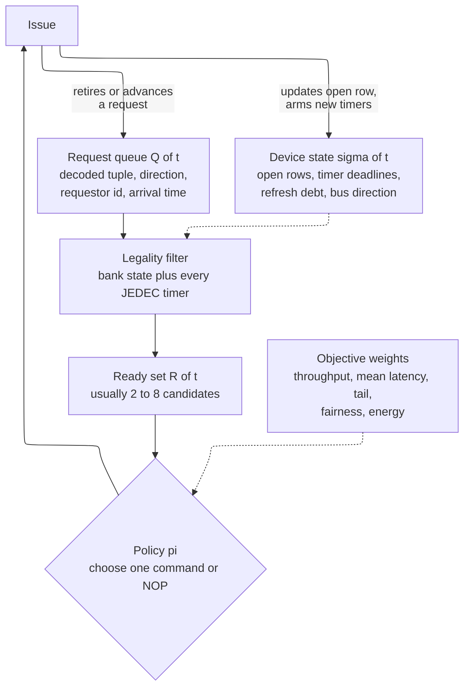
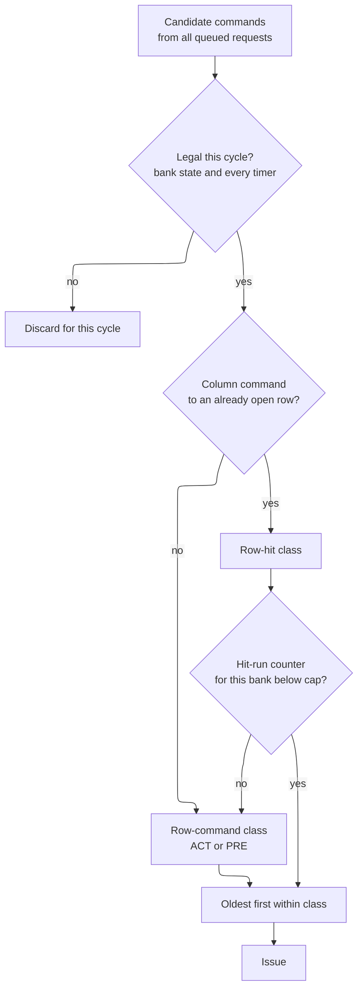
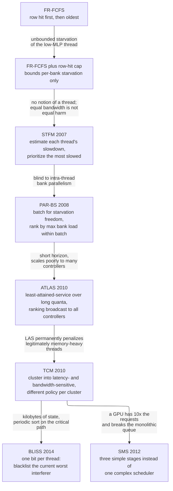
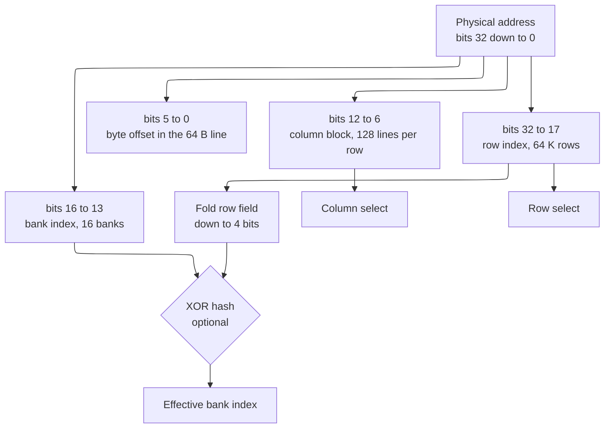
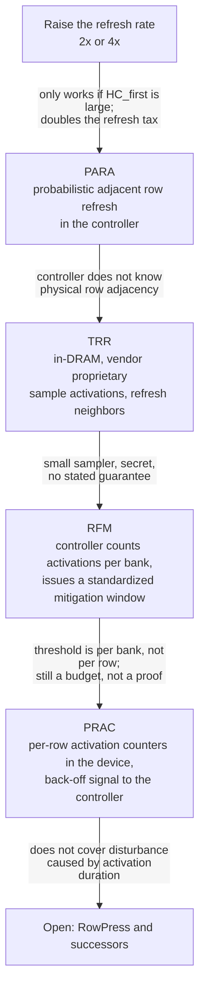
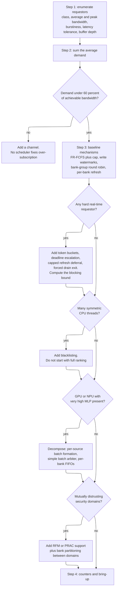

# Memory Scheduling and Address Mapping — the controller's policy, where most of the bandwidth is won or lost

> **First-time reader orientation:** The previous two pages built the *machine*: a bank state machine, a set of Joint Electron Device Engineering Council (JEDEC) timing guards, and a pin-level protocol. This page is about the *policy* that drives that machine — which of the legal commands to issue, and which physical-address bit goes to which bank. Two systems with identical dynamic random-access memory (DRAM) parts and identical peak bandwidth routinely differ by 2x in delivered bandwidth and by 10x in worst-case latency, and the difference is entirely here.

> **Abbreviation key — skim now and return as needed:** dynamic random-access memory (DRAM); double data rate (DDR); low-power DDR (LPDDR); high-bandwidth memory (HBM); Joint Electron Device Engineering Council (JEDEC); central processing unit (CPU); graphics processing unit (GPU); neural processing unit (NPU); system on chip (SoC); image signal processor (ISP); direct memory access (DMA); first come, first served (FCFS); first-ready first-come-first-served (FR-FCFS); stall-time fair memory scheduling (STFM); parallelism-aware batch scheduling (PAR-BS); adaptive per-thread least-attained-service (ATLAS); thread cluster memory scheduling (TCM); blacklisting memory scheduler (BLISS); staged memory scheduling (SMS); least-attained service (LAS); misses per kilo-instruction (MPKI); instructions per cycle (IPC); memory-level parallelism (MLP); quality of service (QoS); subarray-level parallelism (SALP); tiered-latency DRAM (TL-DRAM); adaptive-latency DRAM (AL-DRAM); retention-aware intelligent DRAM refresh (RAIDR); target row refresh (TRR); refresh management (RFM); rolling accumulated activation count (RAA); per-row activation counting (PRAC); probabilistic adjacent row activation (PARA); error-correcting code (ECC); single-error correction, double-error detection (SECDED); processing in memory (PIM); exclusive OR (XOR); non-uniform memory access (NUMA); variable retention time (VRT); data-pattern dependence (DPD); partial-array self-refresh (PASR); Advanced eXtensible Interface (AXI); register-transfer level (RTL); kilobyte (KB); megabyte (MB); gigabyte (GB); gigabit (Gb); picojoule (pJ); nanojoule (nJ).

> **Prerequisites:** [01 · DDR Controller](01_DDR_Controller.md) (the bank state machine and its row hit/empty/conflict cost model, the JEDEC timing guards read as physics, open-vs-closed page as a locality bet, the baseline FR-FCFS derivation, refresh as a background tax, and the achieved-bandwidth loss product — this page extends its §5 and assumes its §§1–4 without repeating them), [02 · DRAM Device Protocol and Training](02_DRAM_Device_Protocol_and_Training.md) (the command set, bank groups and $t_{CCD\_S}$ vs $t_{CCD\_L}$, burst arithmetic, on-die termination, and command-level refresh — the source for any command-level rule quoted here).
> **Hands off to:** [DRAM Simulators](../06_Simulation/01_DRAM_Simulators.md) (the executable form: the policies on this page are what its scheduler plugin slot holds, and its energy model is what §9 here reasons about), [QoS, Ordering, and I/O Coherence](../05_IO_and_Chiplets/01_QoS_Ordering_and_IO_Coherence.md) (the interconnect-level service contract that §6 here must actually deliver on), [Hardware Security Architecture](../../../08_Cross_Cutting_Engineering/01_Hardware_Security_Architecture.md) (the adversary model that turns §10's RowHammer from a reliability curiosity into a threat).

---

## 0. Why this page exists

The [DDR Controller](01_DDR_Controller.md) page ends with a loss product: achieved bandwidth is peak multiplied by a row-buffer efficiency, a refresh term, a turnaround term, and a bank-parallelism term, and real systems land at 40–60% of peak. That page derives the *structures* — the bank state machine, the timing checker, the refresh engine — and shows that the largest single loss is the row-hit rate. What it does not do, because it is a page about hardware, is derive the *policies* that set those terms. Every one of the four efficiency factors is a decision, not a property of the DRAM: the row-hit rate is set by the scheduler's ordering and by the address map; the turnaround loss is set by the write-drain watermarks; the bank-parallelism factor is set by which address bits select a bank; the refresh loss is set by when the controller chooses to spend its deferral credit. A DDR5 channel with an incompetent address map and no write batching delivers under 15% of peak. The same silicon with a good map and a 48-entry write watermark delivers 55%. Nothing physical changed.

This page owns those decisions. It also owns two things the notebook was missing entirely. The first is **read/write bus turnaround**, which is quietly one of the largest efficiency losses in a real memory controller and which almost no introductory treatment quantifies: reversing the direction of a bidirectional source-synchronous data bus costs $t_{WTR}$ plus the full column latency of the restarted read pipeline, roughly 16–21 ns of dead bus on a DDR4-3200 channel, and an unbatched request stream at a one-third write ratio spends **70% of its bus time doing nothing** (§3). The second is the **multicore fairness problem** and the fifteen-year sequence of scheduler designs that answers it (§5) — the single richest body of computer-architecture research attached to any part of a memory controller, and one whose central lesson (that a shared resource with state-dependent service times cannot be made fair by an ordering rule that does not know who is asking) generalizes far beyond DRAM.

Beyond policy, the page covers the DRAM technology frontier that a memory-systems engineer is expected to have an opinion about: subarray-level parallelism, retention-aware refresh, RowHammer and the mitigation ladder from probabilistic refresh through DDR5's refresh management and per-row activation counting, the latency-reduction family (tiered-latency, adaptive-latency, ChargeCache), and in-DRAM and near-DRAM computation. For each, the page states the observation being exploited, the gain claimed, the cost, and — the part usually omitted — the structural reason it has or has not shipped. DRAM is a commodity sold by the bit; a mechanism that costs 3% of die area is a 3% price increase in a market with single-digit margins, and that fact explains more of the research-to-product gap than any technical objection.

After this page you should be able to: state a memory scheduling problem precisely enough to reason about it; derive a write-drain watermark from a target turnaround loss; design and defend an address map, including the XOR hash that rescues a pathological stride; compute the fairness metrics the literature reports and say which scheduler family a given requestor mix needs; size a refresh-deferral policy against a hard real-time deadline; explain what RowHammer mitigations do and do not guarantee; and lay out the counters and the bring-up sequence that let you debug all of it on silicon rather than in a slide.

---

## 1. The scheduling problem, stated precisely

### 1.1 State, ready set, policy

Fix a cycle $t$. The controller holds:

- a **request queue** $Q(t)$ — each entry a decoded tuple `{channel, rank, bank group, bank, row, column}`, a direction (read or write), a requestor identity, an arrival timestamp, and any QoS attributes carried in from the bus;
- **device state** $\Sigma(t)$ — per bank, whether a row is open and which one; per bank, bank group, rank, and channel, the earliest cycle at which each command class becomes legal; the refresh debt; the current data-bus direction;
- a **legality predicate** derived entirely from $\Sigma(t)$ and the JEDEC guards ([01 · DDR Controller §3](01_DDR_Controller.md)).

From these, define the **ready set**

$$
R(t)=\{\,c : c \text{ is a command that advances some } q\in Q(t) \text{ and } c \text{ is legal at } t \,\}.
$$

$R(t)$ typically contains a `READ` or `WRITE` to a bank whose row is already open, an `ACTIVATE` for each idle bank with a pending request whose $t_{RP}$ and $t_{RRD}$ and four-activate-window guards are satisfied, a `PRECHARGE` for each active bank that has met $t_{RAS}$, and possibly a `REFRESH`. It is usually small — a handful of candidates — and it is *never* the whole queue, because most pending requests are blocked by a timer.

A **scheduling policy** is a function $\pi: (Q,\Sigma) \mapsto R(t)\cup\{\text{NOP}\}$. That is the entire object. Everything in the literature — FR-FCFS, PAR-BS, TCM, BLISS — is a different $\pi$. The reason the subject is hard is not that $\pi$ is complicated to state but that the consequences of a choice at cycle $t$ are felt hundreds of cycles later through $\Sigma$: issuing a `PRECHARGE` now forecloses every row hit that would have been available for the next 46 ns, and issuing a `WRITE` now forecloses every read for the next 26 clock cycles. **The scheduler is a controller in the control-theory sense, acting on a plant with long, state-dependent dead time.**



**Contract of the figure.** The dashed edges are the reason this is not a queueing exercise. The policy reads $\Sigma$ but also *writes* it, and the write is what makes greedy choices dangerous: a command chosen because it is cheap right now arms timers that make the next several choices expensive. **Trace:** at $t$, bank 3 holds row 42 open and $Q$ contains four requests to row 42 and one older request to row 99 in the same bank. $R(t)=\{\texttt{READ}(\text{b3,col}\ldots)\}$ four ways, plus $\texttt{PRECHARGE}(\text{b3})$ if $t_{RAS}$ has elapsed. Choosing `PRECHARGE` removes all four `READ`s from every future ready set until row 42 is reopened — a decision made in one cycle that costs 46 ns of that bank. **The trade-off it illustrates:** $R(t)$ is small and cheap to compute, but the *value* of each element depends on the future, which the controller cannot see. Every policy on this page is a heuristic for that unobservable value.

### 1.2 The objective space, and why it is not one number

Five objectives, all legitimate, all measurable, none reducible to the others.

| Objective | Definition | Who cares |
|---|---|---|
| **Throughput** | delivered bytes per second on the channel, equivalently data-bus occupancy | batch compute, GPU, NPU, anything roofline-bound |
| **Mean latency** | average time from request acceptance to data return | single-thread CPU performance, pointer-chasing code |
| **Tail latency** | 99th or 99.9th percentile, or the hard worst case | real-time requestors, latency service-level objectives, interactive services |
| **Fairness** | how equally the *slowdown* caused by sharing is distributed | multi-tenant servers, any SoC with a QoS contract |
| **Energy** | joules per useful byte, including background and refresh | mobile, and increasingly everything |

Now show that they genuinely conflict, with the smallest possible example.

**The example.** One bank, DDR4-3200 ($t_{CK}=0.625$ ns, $t_{RCD}=t_{RP}=t_{CL}\approx14$ ns, column-to-column within a bank $t_{CCD\_L}=8\,t_{CK}=5$ ns, activate energy $\approx 523$ pJ per device from [DRAM Simulators §9](../06_Simulation/01_DRAM_Simulators.md)). Bank 3 has row 5 open. The queue holds:

- request $b_0$ from requestor **B**, oldest, targets row 9 — a **row conflict**;
- requests $a_1\ldots a_8$ from requestor **A**, all younger, all target row 5 — eight **row hits**.

Three policies, three outcomes. Count bank-occupancy time from $t=0$ and count activations.

*Policy 1, arrival order (FCFS).* Serve $b_0$ first: `PRE` 14 ns, `ACT` 14 ns, one column command 5 ns; then A's row must be reopened: `PRE` 14, `ACT` 14, then eight columns at 5 ns = 40 ns. Total bank time $=14+14+5+14+14+40=\mathbf{101}$ ns, activations $=\mathbf{2}$, B's wait $=\mathbf{0}$ ns of queueing.

*Policy 2, row-hit-first (FR-FCFS).* Serve A's eight hits: $8\times5=40$ ns; then `PRE` 14, `ACT` 14, one column 5. Total bank time $=\mathbf{73}$ ns, activations $=\mathbf{1}$, B's queueing wait $=\mathbf{68}$ ns.

*Policy 3, cap the hit run at two.* Serve $a_1,a_2$ (10 ns), then B (`PRE`+`ACT`+col $=33$ ns), then reopen row 5 (`PRE`+`ACT` $=28$ ns) and serve $a_3\ldots a_8$ (30 ns). Total $=\mathbf{101}$ ns, activations $=\mathbf{3}$, B's wait $=\mathbf{10}$ ns.

| Policy | Bank time (ns) | Throughput vs FCFS | Activations | ACT energy (pJ) | B's queueing wait (ns) |
|---|---|---|---|---|---|
| FCFS (arrival order) | 101 | 1.00x | 2 | 1046 | 0 |
| FR-FCFS (hit-first) | 73 | **1.38x** | **1** | **523** | 68 |
| Hit-run cap of 2 | 101 | 1.00x | 3 | 1569 | 10 |

Read the table carefully, because it contains the entire argument of this page. FR-FCFS wins throughput by 38% *and* halves activation energy — those two objectives agree, because an activation is both a 28 ns delay and 523 pJ. But it multiplies B's wait from zero to 68 ns. And policy 3, the naive "be fair" repair, is worse than both on throughput *and* worse than both on energy, because bouncing between rows pays the activation cost three times. **There is no total order on policies.** A page that tells you FR-FCFS is "the" scheduler has not told you what it costs; a page that tells you fairness is free has not done the arithmetic. Every mechanism that follows is a way of buying one column of that table with another, and the engineering content is the exchange rate.

One more property, easy to miss: policies 1 and 3 have the *same* throughput but different energy and different fairness. Objectives are not merely in tension, they are not even monotonically related — you can lose on one axis without gaining on any other. That is why §13's insistence on reporting throughput and fairness *together*, over a load sweep, is not pedantry.

### 1.3 What "optimal" would even mean

It is worth stating why the problem is not simply solved. Even the offline version — given the entire future request stream, choose the command sequence minimizing total time — is a scheduling problem with sequence-dependent setup times (the setup being `PRE`+`ACT`, whose cost depends on which row was previously open), which is the classic $NP$-hard family. The online version faces an adversary. So the field is entirely about heuristics with good average behavior and bounded worst cases, and the honest framing throughout this page is: *this heuristic exploits this specific structure in real traffic, costs this much hardware, and fails on this input.*

---

## 2. The baselines and exactly how each fails

### 2.1 FCFS and the locality it discards

The simplest correct policy: maintain one queue in arrival order, and each cycle issue whatever command advances the head request, if legal. It is trivially starvation-free, trivially fair in the weak sense that service order equals arrival order, and it is what a naive RTL implementation produces.

Its failure is that **arrival order is uncorrelated with row locality after the last-level cache**. The cache has already absorbed the short-range spatial reuse; what reaches DRAM is a mix of streams from several requestors, interleaved by the interconnect, so consecutive queue entries rarely target the same row even when the *set* of queued requests contains long same-row runs. FCFS therefore realizes a row-hit rate close to the *interleaved* locality of the aggregate stream rather than the *available* locality within the scheduling window.

Quantify it on a stated stream. Take one bank, DDR4-3200, and a window containing 16 requests that alternate in arrival order between row $\alpha$ and row $\beta$: $\alpha,\beta,\alpha,\beta,\dots$ — a shape produced whenever two requestors each stream through their own buffer and the interconnect round-robins them.

*FCFS.* Every access is a row conflict, and consecutive conflicts to one bank are rate-limited not by the 42 ns conflict latency but by $t_{RC}=t_{RAS}+t_{RP}\approx32+14=46$ ns, the bank's activate-to-activate floor. Sixteen accesses take $16\times46=736$ ns and move $16\times64=1024$ B:

$$
BW_{\text{FCFS}}=\frac{1024\ \text{B}}{736\ \text{ns}}=1.39\ \text{GB/s}=5.4\%\ \text{of the 25.6 GB/s channel.}
$$

*FR-FCFS with a window that sees all 16.* The scheduler groups them: eight columns of $\alpha$, one row change, eight columns of $\beta$. Per group: $t_{RCD}$ 14 ns $+\,8\times t_{CCD\_L}$ 40 ns $+\,t_{RP}$ 14 ns $=68$ ns. Two groups: 136 ns.

$$
BW_{\text{FR-FCFS}}=\frac{1024\ \text{B}}{136\ \text{ns}}=7.5\ \text{GB/s}=29\%\ \text{of peak} \;\Longrightarrow\; \mathbf{5.4\times}\ \text{the FCFS result.}
$$

Same DRAM, same requests, same 16 cache lines. The factor of 5.4 is pure ordering. Note also what the second number is *not*: 29% is still far from peak, because one bank cannot fill the bus (its column commands are spaced $t_{CCD\_L}=5$ ns while the burst is only 2.5 ns) — that is §4's problem, and it is orthogonal to this one.

### 2.2 FR-FCFS derived, not announced

The repair follows directly from the failure. If the loss is unrealized row locality, the fix is a priority that promotes commands which *use* an already-open row over commands which *destroy* one. Rixner et al. (2000) state it as a two-level rule:

1. **First-ready.** Consider only commands legal in this cycle. (This is not a preference, it is the legality filter of §1.1; the name comes from the fact that earlier schedulers checked legality after choosing.)
2. **Column commands over row commands.** A `READ`/`WRITE` to an open row moves data now; an `ACT` or `PRE` only prepares to move data later. Prefer the former.
3. **Oldest first** among equals.

Rules 2 and 3 are the whole policy. Rule 2 is where the gain lives, and the gain per promotion is exactly the case-cost gap from [01 · DDR Controller §2.2](01_DDR_Controller.md): a hit costs $t_{CL}$, a conflict costs $t_{RP}+t_{RCD}+t_{CL}$, so each promotion saves $t_{RP}+t_{RCD}\approx28$ ns of service. Rule 3 is a guardrail, not a performance feature.



**Contract.** Three filters in series, each cheap: a legality AND-reduction over timer comparators, a row-tag equality compare per queue entry, and an age priority encoder. **Trace:** in §1.2's example, at $t=0$ the row-hit class holds $a_1\ldots a_8$ and the row-command class holds `PRE` for $b_0$; the hit-run counter is 0, below a cap of 8, so $a_1$ wins. After eight promotions the counter hits the cap, the `yes` branch closes, and $b_0$'s `PRE` becomes the only candidate. **The failure it illustrates:** without the cap node, the `F` diamond does not exist, and the row-hit class can be refilled indefinitely by a requestor that keeps generating hits — the starvation mode below.

### 2.3 The starvation failure, and the cap that bounds it

FR-FCFS as originally specified is **not starvation-free**, and the mechanism is worth being precise about because it is the seed of all of §5. Rule 2 dominates rule 3: a row hit beats an older row conflict *unconditionally*. So consider a requestor whose access stream produces a continuous supply of hits to one bank — a sequential stream through an 8 KB row produces 128 consecutive hits, and a strided stream that revisits the row produces more. As long as the queue contains at least one hit to the open row at every decision point, the conflicting request never wins. Its wait is bounded only by the row's size and the queue's refill rate, not by any constant.

*Worst case, computed.* An 8 KB row holds 128 cache lines. If a streaming requestor keeps the queue supplied, one traversal of the row is $128\times t_{CCD\_L}=128\times5=640$ ns during which the conflicting request makes no progress, and a requestor that walks the row repeatedly extends this without limit. A latency-sensitive request that would have cost 42 ns alone can therefore wait **640 ns and more** — a slowdown beyond 15x from ordering alone, before any of §5's multi-requestor effects are considered.

The minimal repair is a **row-hit cap** (also called an FR-FCFS cap): a per-bank counter of consecutive hits served to the currently open row; when it reaches $N_{\text{cap}}$, the row-hit class is suppressed until the oldest pending request to that bank is served. Cost: $\lceil\log_2 N_{\text{cap}}\rceil$ bits per bank — 4 bits x 16 banks = 64 flip-flops, i.e. nothing. Typical values are 4 to 16.

The cap is not free, and the price is computable. Return to §2.1's 16-request stream but impose $N_{\text{cap}}=4$: instead of two groups of eight you get four groups of four, so four row changes instead of two.

$$
T_{\text{cap4}}=4\times\big(t_{RCD}+4\,t_{CCD\_L}+t_{RP}\big)=4\times(14+20+14)=192\ \text{ns} \;\Longrightarrow\; 5.3\ \text{GB/s},
$$

against 7.5 GB/s uncapped: **the cap costs 29% of the bandwidth it was protecting.** It also raises activation energy by 2x (four activations instead of two, $4\times523=2092$ pJ against 1046 pJ). What it buys is a hard bound: no request waits more than $N_{\text{cap}}\cdot t_{CCD\_L}$ plus the conflict cost behind the requests ahead of it in age order, which for $N_{\text{cap}}=4$ is 20 ns plus one row cycle rather than 640 ns.

**Selection boundary.** Large caps (16 or unbounded) are right for a single-requestor, throughput-only channel — a GPU frame buffer, an NPU weight stream. Small caps (2 to 4) are right where a latency-sensitive requestor shares the channel and there is no thread-aware mechanism. The moment there are more than about two requestor classes, the cap is the wrong instrument entirely, because it bounds *per-bank* starvation while the actual unfairness in a multicore system comes from bank-parallelism asymmetry (§5.1) — a failure the cap cannot see.

---

## 3. Read/write turnaround — the efficiency term nobody teaches

### 3.1 Why reversing the bus costs time

The DQ (data) bus is **bidirectional and source-synchronous**: on a read the DRAM drives DQ and its strobe DQS, on a write the controller drives both. There is no separate return path. Reversing direction therefore requires four physically distinct things to complete, and they cannot overlap:

1. **The current driver must stop, verifiably.** Two drivers on one line is a low-impedance path from the supply to ground — not a signal-integrity problem but a reliability event. The guard band is mandatory and is not a place to be clever.
2. **Termination must re-settle.** On-die termination values differ between the read and write cases (during a write the targeted rank terminates; during a read the non-targeted ranks terminate, and the reader's own termination is disabled). Switching the termination state is an analog settling event on a transmission line ([02 · DRAM Device Protocol §8.4](02_DRAM_Device_Protocol_and_Training.md)).
3. **The receiving side's capture path must re-acquire.** DQS is a *non-continuous* strobe with a preamble; the receiver's gate window and delay-locked-loop phase are trained per direction, and the strobe has to be regated.
4. **The pipeline that was drained must refill.** This is the term people forget and it is by far the largest. After a write, the read pipeline is empty; the first subsequent read command cannot issue until the write recovery guard expires, and its data does not appear until $t_{CL}$ *after that*. The column latency, normally hidden behind a continuous stream of pipelined reads, becomes fully exposed.

JEDEC gives this two names, and they are wildly asymmetric.

- **$t_{WTR}$ (write-to-read)** is measured from the *end of the write data burst* to the next `READ` command. DDR4 splits it: $t_{WTR\_S}$ for a different bank group (4 $t_{CK}$ = 2.5 ns at DDR4-3200), $t_{WTR\_L}$ for the same bank group (12 $t_{CK}$ = 7.5 ns).
- **$t_{RTW}$ (read-to-write)** is not an independent physical parameter; it is derived, because the constraint is that the write data must not collide with the tail of the read burst. With column latency $CL$, column write latency $CWL$, a burst of $BL/2$ clocks, and a turnaround guard of about 2 $t_{CK}$:

$$
t_{RTW}\;=\;CL+\frac{BL}{2}+t_{\text{guard}}-CWL .
$$

### 3.2 The arithmetic: how much bus each direction change destroys

Use DDR4-3200: $t_{CK}=0.625$ ns, $CL=22\,t_{CK}$, $CWL=16\,t_{CK}$, BL8 so the burst occupies $4\,t_{CK}$, $t_{\text{guard}}=2\,t_{CK}$.

**Read to write.** Place a `READ` at cycle 0. Its data occupies the bus over $[CL,\,CL+4)=[22,26)$. The earliest `WRITE` is at $t_{RTW}=22+4+2-16=12$, and its data occupies $[12+CWL,\,12+CWL+4)=[28,32)$. Dead bus $=28-26=2\,t_{CK}=\mathbf{1.25\ ns}$. Cheap — exactly the guard band, nothing more.

**Write to read.** Place a `WRITE` at cycle 0; its data occupies $[16,20)$. The earliest `READ` is at $20+t_{WTR}$, and its data appears $CL$ later:

$$
\text{dead bus}=\big(20+t_{WTR}+CL\big)-20=t_{WTR}+CL .
$$

With $t_{WTR\_S}=4$: $4+22=26\,t_{CK}=\mathbf{16.25\ ns}$. With $t_{WTR\_L}=12$: $34\,t_{CK}=\mathbf{21.25\ ns}$.

**The asymmetry is the whole design driver.** Turning the bus toward writes costs a guard band; turning it back toward reads costs a guard band *plus the entire column latency*, because the read pipeline was emptied and $CL$ is no longer hidden. A full round trip — reads, then a write, then reads again — costs

$$
t_{\text{turn}}=t_{R\to W}+t_{W\to R}=2+26=28\ t_{CK}=17.5\ \text{ns of dead data bus,}
$$

against a payload burst of only $4\,t_{CK}=2.5$ ns. **One direction change costs seven cache lines' worth of bus time.** (DDR5 rescales but does not change the shape: at DDR5-6400 the BL16 burst on a 32-bit subchannel is $8\,t_{CK}=2.5$ ns, $CL\approx46\,t_{CK}$, and $t_{WTR\_L}\approx 30\,t_{CK}$, so $t_{W\to R}\approx76\,t_{CK}\approx 24$ ns — about ten times the burst.)

```wavedrom
{ "signal": [
  { "name": "CK",     "wave": "p..............." },
  { "name": "DQ bus", "wave": "x.=x=x.....=x=x.", "data": ["rd0","wr0","rd1","wr1"] },
  { "name": "driver", "wave": "x.3x4x.....3x4x.", "data": ["DRAM","CTRL","DRAM","CTRL"] }
 ],
 "head": {"text": "unbatched interleave, one division about 5 tCK: the short gap is the R-to-W guard, the long gap is tWTR plus CL"}
}
```

**Contract.** The `driver` row names who owns DQ; the `x` regions are the bus in high impedance with nobody driving — pure loss. **Trace:** `rd0` completes, the controller waits one guard division, drives `wr0`, and then must wait five divisions before `rd1`'s data can appear, because the read pipeline restarts from empty. **The failure it illustrates:** the loss is *not* proportional to the number of writes, it is proportional to the number of *direction changes*, which is what makes the fix a batching problem rather than a bandwidth problem.

```wavedrom
{ "signal": [
  { "name": "CK",     "wave": "p..............." },
  { "name": "DQ bus", "wave": "x.=....x=....x.=", "data": ["read phase, B times 2 bursts","write drain, B bursts","read phase"] },
  { "name": "driver", "wave": "x.3....x4....x.3", "data": ["DRAM","CTRL","DRAM"] }
 ],
 "head": {"text": "watermark-drained: the same two turnarounds now amortize over a whole batch"}
}
```

**Contract and trace.** Identical turnaround cost, identical total payload, one difference: the direction changes twice per *batch* instead of twice per *write*. **The trade-off:** every read that arrives during the write drain waits for the drain to finish, so batch size converts directly into read tail latency — quantified in §3.4.

### 3.3 The loss, as a closed form

Let $w$ be the write fraction of the request stream, $B$ the number of writes drained per batch, $t_{\text{burst}}$ the per-request bus occupancy, and $t_{\text{turn}}=t_{R\to W}+t_{W\to R}$. Over one full read-phase-plus-write-phase cycle the controller serves $B$ writes and $B(1-w)/w$ reads, so the payload bus time is $B\,t_{\text{burst}}/w$ and the dead time is $t_{\text{turn}}$:

$$
\boxed{\;\rho_{\text{turn}}=\frac{t_{\text{turn}}}{t_{\text{turn}}+\dfrac{B\,t_{\text{burst}}}{w}}\;}
$$

At DDR4-3200 with $t_{\text{turn}}=28\,t_{CK}$, $t_{\text{burst}}=4\,t_{CK}$, and a one-third write fraction ($w=1/3$, typical of a mixed CPU workload):

| Writes per drain $B$ | $\rho_{\text{turn}}$ | Comment |
|---|---|---|
| 1 (no batching) | **70%** | the naive controller: the bus is dead more than two-thirds of the time |
| 2 | 54% | |
| 4 | 37% | |
| 8 | 23% | the low end of the "20–40% lost" band |
| 16 | 13% | |
| 32 | 6.8% | |
| 44 | 5.0% | |
| 64 | 3.5% | diminishing |

Read the top of that table again. **An unbatched controller at a one-third write ratio throws away 70% of its data bus to turnaround alone**, before refresh, before row conflicts, before bank limits. That is why no shipping controller is unbatched, and why the [DDR Controller](01_DDR_Controller.md) page's loss product can only quote $\rho_{\text{turn}}\approx2\text{–}3\%$: it is quoting a *drained* controller. The 2–3% figure is not a property of DDR, it is the residue of a mechanism.

### 3.4 Deriving good watermarks

Invert the formula for the batch size that meets a target loss $\rho^\star$:

$$
B \;=\; \frac{w\,t_{\text{turn}}}{t_{\text{burst}}}\cdot\frac{1-\rho^\star}{\rho^\star}.
$$

For $w=1/3$, $t_{\text{turn}}=28$, $t_{\text{burst}}=4$: $\rho^\star=10\% \Rightarrow B=21$; $\rho^\star=5\% \Rightarrow B=44$; $\rho^\star=2\% \Rightarrow B=114$. So a 64-entry write queue with a **high watermark of 48 and a low watermark of 8** — batch $B=40$ — lands at $\rho_{\text{turn}}=5.5\%$, and that is where real designs sit.

The reason not to go further is the read-latency cost, and it has an exchange rate. A read arriving at the start of a drain waits $B\,t_{CCD\_S}+t_{W\to R}$; at $t_{CCD\_S}=4\,t_{CK}=2.5$ ns each additional write in the batch costs exactly **2.5 ns of worst-case read latency**. What it buys, from $\mathrm{d}\rho/\mathrm{d}B=-t_{\text{turn}}t_{\text{burst}}/\big(w\,(t_{\text{turn}}+Bt_{\text{burst}}/w)^2\big)$:

| Batch size $B$ | Marginal bandwidth gain per extra write | Marginal worst-case read latency cost |
|---|---|---|
| 8 | 0.98 percentage points | 2.5 ns |
| 16 | 0.69 pp | 2.5 ns |
| 32 | 0.24 pp | 2.5 ns |
| 44 | 0.11 pp | 2.5 ns |
| 64 | 0.05 pp | 2.5 ns |

The knee is sharp and it is around $B=32$ to $48$. Below it you are paying real bandwidth for latency you do not need; above it you are paying 2.5 ns per write for hundredths of a percent. **That is the derivation of a watermark: not a tuning sweep, a marginal-rate argument.**

Four further constraints complete the policy, and each removes a specific failure:

- **The high watermark must leave headroom for in-flight writes.** On AXI, write data already accepted cannot be refused. If $N_{\text{inflight}}$ writes can be in the pipeline between acceptance and the queue, then $W_{hi}\le Q_W-N_{\text{inflight}}$, or the queue overflows and the controller must backpressure the bus — which stalls unrelated traffic. With $Q_W=64$ and 12 in flight, $W_{hi}=48$ is the largest safe value, which is where the number above actually comes from in practice.
- **Opportunistic drain.** If the read queue is empty, drain writes regardless of the watermark: the turnaround is free because the bus was idle anyway, and it lowers the probability of hitting the high watermark later while reads are pending. This single rule removes most write-drain latency events in bursty traffic at zero cost.
- **Forced drain exit.** A read that has waited longer than a threshold aborts the drain after the in-flight write completes. This converts the drain from a non-preemptable 100 ns blocking term into a ~27 ns one, which §6 shows is the difference between meeting and missing a real-time deadline. It costs bandwidth only when it fires.
- **Read-after-write forwarding.** A read whose address matches a queued write must be satisfied from the write queue or ordered behind it. This is a correctness obligation, not an optimization: the write queue is architecturally visible state. The comparator array is $Q_W$ address comparators wide and is a real area and timing cost — it is the reason write queues are 32–64 entries and not 512.

Finally, the write queue is a *scheduling* resource, not just a buffer. Because a drain is a batch of writes with no ordering constraint among them, the controller should **sort the batch by bank and row** before issuing, converting what would have been scattered conflicts into row hits. A 40-write batch drawn from a stream with even modest locality typically collapses to 8–12 activations instead of 40 — a second, independent win from the same structure, and one that also cuts activation energy by the same ratio (§9).

```systemverilog
// Write-drain controller: high/low watermark hysteresis with an urgent-read escape.
// Synthesizable; no latches; single always_ff for state.
module wr_drain_ctl #(
  parameter int QDEPTH        = 64,   // write queue depth
  parameter int W_HI          = 48,   // enter drain at/above this occupancy
  parameter int W_LO          = 8,    // leave drain at/below this occupancy
  parameter int RD_URGENT_AGE = 200   // controller cycles before a read aborts the drain
) (
  input  logic                            clk,
  input  logic                            rst_n,
  input  logic [$clog2(QDEPTH+1)-1:0]     wq_level,       // current write queue occupancy
  input  logic                            wq_empty,
  input  logic                            rq_empty,       // read queue empty
  input  logic [15:0]                     oldest_rd_age,  // age of oldest pending read
  output logic                            drain_writes
);
  typedef enum logic { READ_MODE, DRAIN_MODE } state_e;
  state_e state, next_state;

  always_comb begin
    next_state = state;
    unique case (state)
      READ_MODE:
        // watermark trigger, or opportunistic drain into an idle read stream
        if ((wq_level >= W_HI) || (rq_empty && !wq_empty))
          next_state = DRAIN_MODE;
      DRAIN_MODE:
        // normal exit at the low watermark, or forced exit for an aging read
        if ((wq_level <= W_LO) || (oldest_rd_age > RD_URGENT_AGE))
          next_state = READ_MODE;
    endcase
  end

  always_ff @(posedge clk or negedge rst_n) begin
    if (!rst_n) state <= READ_MODE;
    else        state <= next_state;
  end

  assign drain_writes = (state == DRAIN_MODE);
endmodule
```

The hysteresis between `W_HI` and `W_LO` is the point: a single threshold would oscillate, turning the bus around on every request near the boundary and reproducing the $B=1$ row of the table above. The `rq_empty` term is the opportunistic drain and the `oldest_rd_age` term is the forced exit; both are one comparator each and both are worth more than any refinement of the thresholds themselves.

---

## 4. Parallelism as a scheduling resource

### 4.1 Bank count: the requirement, and the constraint that supersedes it

[01 · DDR Controller §7.2](01_DDR_Controller.md) derives the bank requirement from Little's law: to keep the data bus busy on miss-heavy traffic you need $N_{\text{banks}}\ge\lceil t_{RC}/t_{\text{burst}}\rceil\approx 19$–20 independent banks in flight, which is why DDR4 has 16 per rank and DDR5 has 16 per subchannel. That derivation is not repeated here. What this page owns is the observation that **the bank count is usually not the binding constraint** — the activation *rate* limits are — and what a scheduler must do about it.

Two guards ration activations, and both exist to protect the power delivery network rather than the array ([01 · DDR Controller §3](01_DDR_Controller.md)):

- $t_{RRD}$ — minimum spacing between activations to different banks ($t_{RRD\_L}\approx4.9$ ns same bank group, $t_{RRD\_S}\approx3.3$ ns different, at DDR4-3200);
- $t_{FAW}$ — no more than **four** activations in any sliding window ($\approx30$ ns for DDR4-3200, $\approx21$ ns for DDR5-5600).

Turn $t_{FAW}$ into a bandwidth ceiling. If each activation feeds $n$ bursts of $L=64$ B before the row closes, the maximum data rate is

$$
BW_{\max}=\frac{4}{t_{FAW}}\cdot n\cdot L .
$$

For DDR5 with $t_{FAW}=21$ ns and $n=1$ (pure random, one line per row): $\frac{4}{21\,\text{ns}}=190$ M activations/s, times 64 B $=\mathbf{12.2\ GB/s}$ — against a 32-bit DDR5-6400 subchannel peak of 25.6 GB/s. **$t_{FAW}$ alone caps random traffic at 48% of peak, no matter how many banks the device has.** For DDR4-3200 with $t_{FAW}=30$ ns the cap is 8.5 GB/s, or 33% of peak.

Invert it, and you get a result that reframes the whole page. Since $n=1/(1-h)$ where $h$ is the row-hit rate, saturating the bus requires

$$
\frac{4L}{t_{FAW}(1-h)}\ \ge\ BW_{\text{peak}} \quad\Longrightarrow\quad \boxed{\,h_{\min}=1-\frac{4L}{t_{FAW}\cdot BW_{\text{peak}}}\,}
$$

DDR5-6400 subchannel: $h_{\min}=1-\frac{256\ \text{B}}{21\ \text{ns}\times25.6\ \text{B/ns}}=1-0.476=\mathbf{52\%}$. DDR4-3200: $h_{\min}=1-\frac{256}{30\times25.6}=\mathbf{67\%}$.

**A DDR5 channel cannot be saturated at a row-hit rate below 52%, and a DDR4 channel below 67%, for reasons that have nothing to do with bank count or scheduling cleverness.** Since real server row-hit rates are 30–60%, this single constraint explains most of the stubborn "40–60% of peak" figure — and it explains why address mapping (§7), which sets $h$, is a first-class design decision rather than bookkeeping.

### 4.2 What the scheduler must do to keep banks busy

Three concrete behaviors, each a departure from textbook FR-FCFS:

**Activate-ahead.** Plain FR-FCFS prefers column commands over row commands unconditionally (§2.2, rule 2). That rule is wrong when a bank is *idle* with a pending request: issuing its `ACT` now starts a $t_{RCD}$ timer that would otherwise be dead time, and the column command it displaced is only delayed by one command slot. Real controllers therefore carry an exception — prefer `ACT` to an idle bank over a column command when the column command's bank has more queued work than the activation would delay. The general form is a small credit system: each bank gets an activation credit whenever it goes idle with pending requests, and credits outrank column preference until spent, subject to $t_{RRD}$ and $t_{FAW}$.

**Bank-group round-robin.** Within a bank group, column commands are spaced $t_{CCD\_L}$; across groups, $t_{CCD\_S}$ ([02 · DRAM Device Protocol §3.2](02_DRAM_Device_Protocol_and_Training.md)). At DDR4-3200 the burst is $4\,t_{CK}$ and $t_{CCD\_S}=4\,t_{CK}$, so cross-group commands are seamless, while $t_{CCD\_L}=8\,t_{CK}$ leaves the bus idle half the time.

```wavedrom
{ "signal": [
  { "name": "CK",          "wave": "p..............." },
  { "name": "CMD same BG", "wave": "x3x3x3x3x.......", "data": ["RD","RD","RD","RD"] },
  { "name": "DQ same BG",  "wave": "x=x=x=x=x.......", "data": ["d","d","d","d"] },
  { "name": "CMD alt BG",  "wave": "x3333x..........", "data": ["RD0","RD1","RD2","RD3"] },
  { "name": "DQ alt BG",   "wave": "x====x..........", "data": ["d","d","d","d"] }
 ],
 "head": {"text": "one division = tCCD_S: staying inside one bank group idles the bus every other slot"}
}
```

**Contract.** The top pair is four column reads confined to one bank group; the bottom pair is the same four reads spread over four groups. **Trace:** four 64 B lines take $4\times t_{CCD\_L}=8\times 4\,t_{CK}$ = 20 ns confined, versus $4\times t_{CCD\_S}=10$ ns spread — 50% versus 100% bus occupancy for identical work. **The trade-off:** the spread version needs four *different* rows open, so it consumes four activations against the $t_{FAW}$ budget where the confined version consumed one. Bank-group interleaving buys bus occupancy with activation budget, which is exactly the resource §4.1 showed is scarce; the resolution is that the address map (§7) should place *consecutive lines within a row* in the same bank group and *consecutive rows* in different ones, so that streams get $t_{CCD\_S}$ spacing from bank-group-striped columns rather than from extra activations.

**Refresh steering.** With per-bank refresh (§8), the scheduler must know which bank is currently refreshing and route around it rather than stalling. A controller that treats refresh as a channel-wide stall gets none of per-bank refresh's benefit, which is a common and expensive implementation mistake.

**Rank-level parallelism** is the coarser version of the same resource. A second rank doubles the bank count and, importantly, gives an *independent* $t_{FAW}$ window — the four-activate limit is per rank — so two ranks double the ceiling computed in §4.1. The price is a data-bus handoff between ranks: a rank-to-rank turnaround costs an extra 2–4 $t_{CK}$ plus termination re-settling even when both accesses are reads, because the driving device changes. So rank interleaving helps random traffic (where the activation ceiling binds) and mildly hurts streaming traffic (where it adds turnarounds to a stream that had none). A controller should therefore prefer to *stay* in a rank while a stream is hitting rows, and *spread* across ranks when the traffic is activation-bound — the same locality-versus-parallelism dial as everywhere else, one level up.

### 4.3 Subarray-level parallelism: the research extension

Inside one bank, the array is not monolithic. It is divided into 16 to 128 **subarrays**, each with its own local sense-amplifier row and local wordline drivers, connected to the bank's shared global bitlines and global row decoder ([Memory Circuits §10](../../../00_Fundamentals/06_Memory_Circuits_and_Technologies.md)). The observation behind SALP (Kim et al., ISCA 2012) is that **almost all of $t_{RC}$ is spent inside a subarray** — charge sharing, sensing, restore, and precharge are local operations — while the *shared* per-bank resources (global decoder, global bitlines, the I/O path) are occupied for a small fraction of that time. Two accesses to different subarrays of the same bank are therefore physically independent for most of their duration, and the only reason they serialize is that the bank's control logic exposes a single row-address latch and a single precharge state.

The proposals form a ladder of increasing device change:

- **SALP-1** overlaps the precharge of one subarray with the activation of another. It needs only per-subarray precharge state, no new commands in the strictest formulation, and the controller must track which subarray each row lives in.
- **SALP-2** additionally overlaps two activations, requiring the bank to hold two subarrays in the activated state and to arbitrate the shared global bitlines between them.
- **MASA** (Multitude of Activated Subarrays) keeps many subarray row buffers active at once, adding a per-subarray row-address latch and a designated-subarray selector, plus a new command to select which activated subarray a column command addresses.

What it buys, as reported: roughly 17% single-core and about 20% multi-core speedup for MASA, with the mechanism costing on the order of 0.15% of DRAM die area. What it costs beyond area: a new command in the JEDEC command set, a controller that knows the *internal* subarray mapping of the row address (which vendors treat as proprietary and remap for repair), and a scheduler with a per-subarray state table roughly 8–32x larger than the per-bank one.

**Why it has not shipped**, stated honestly: the benefit accrues to the *system integrator*, the cost accrues to the *DRAM vendor*, and DRAM is a commodity where die area is price. A 0.15% area cost is a 0.15% margin cost on a product with low single-digit margins, in exchange for a benefit the vendor cannot charge for because the standard would make it universal. This is the same structural argument that appears again in §11 and §12, and it is the correct first-order model for "why is this excellent idea not in my laptop."

**Selection boundary.** SALP is genuinely relevant in two places today: in-package memories where one vendor controls both ends (HBM stacks with a custom base die, [HBM and Advanced Memory Systems](../../02_GPU_Architecture/02_Memory_System/02_HBM_and_Advanced_Memory_Systems.md)), and in embedded/custom DRAM. For a commodity DDR5 SoC it is background knowledge, not a design option.

---

## 5. The multicore fairness problem and the scheduler family that answers it

### 5.1 Why an unmanaged FR-FCFS scheduler is structurally unfair

Put two threads on one channel.

- **Thread S** streams: a `for` loop over a large array, ~90% row-hit rate, and — because a modern core's load/store unit and prefetchers keep many misses outstanding — 16 or more requests in the memory queue at all times. High MLP.
- **Thread L** chases pointers: each load's address depends on the previous load's data, so it has ~1 outstanding request, near-zero row locality, and it *stalls* between requests.

Both FR-FCFS rules hand the channel to S, and they do it through two independent mechanisms. This is the part worth being precise about, because "the streaming thread wins" is a slogan and the two mechanisms have different fixes.

**Mechanism 1 — row-locality bias.** Rule 2 promotes row hits. S's requests are hits by construction; L's are conflicts by construction. So S's requests are structurally prioritized over L's regardless of age. This is not a tie-break, it is a class preference, and its magnitude is unbounded: as long as S supplies hits, L waits. A row-hit cap (§2.3) bounds this one.

**Mechanism 2 — bank-parallelism bias, which the cap does not touch.** Rule 3 breaks ties by age. That sounds neutral, but consider the steady state. S has 16 requests spread over 16 banks; L has one. Every bank's local decision is "S's request or L's request," and S has a candidate in every bank while L has a candidate in one. Even under *perfectly fair per-bank arbitration*, S receives 16 units of service per round and L receives 1. Worse, the two threads' requests interact asymmetrically in time: S's 16 concurrent requests overlap, so 16 requests cost S *one* memory latency; L's single request costs L *one full* memory latency and it cannot start the next until this one returns. **The thread with more memory-level parallelism converts each unit of service into more progress, and simultaneously wins more units of service.** That compounding is why the observed slowdowns are so extreme.

There is a third, subtler mechanism worth naming: **L's requests destroy S's locality far less than S's destroy L's.** When L's conflict finally wins and closes S's open row, S loses one activation. When S's hits win, L waits an unbounded time. The interference is not symmetric, so any policy that treats "interference" as a scalar and divides it equally is already wrong.

*Quantify the damage.* L alone: each request is a row conflict costing $t_{RP}+t_{RCD}+t_{CL}=42$ ns. L sharing with S under uncapped FR-FCFS: L's request waits behind S's supply of hits to the same bank; an 8 KB row holds 128 lines, so a single traversal is $128\times t_{CCD\_L}=640$ ns, and S traverses rows continuously. L's per-request latency becomes $640+42=682$ ns, a slowdown of

$$
S_L=\frac{682}{42}=\mathbf{16.2\times},
$$

while S, whose 16 concurrent requests keep overlapping, is slowed by well under 20%. That is the failure. Everything below is a repair.

### 5.2 The metrics, so the repairs can be compared

Define per-thread slowdown as the ratio of shared to alone execution time, equivalently the inverse ratio of IPC:

$$
S_i=\frac{T_i^{\text{shared}}}{T_i^{\text{alone}}}=\frac{IPC_i^{\text{alone}}}{IPC_i^{\text{shared}}}\;\;(\ge 1).
$$

From that, four standard metrics — and it matters that they are four, because a scheduler paper that reports one is hiding something:

$$
\text{Weighted speedup (system throughput)}\quad WS=\sum_{i=1}^{N}\frac{IPC_i^{\text{shared}}}{IPC_i^{\text{alone}}}=\sum_i \frac{1}{S_i}
$$

$$
\text{Harmonic speedup (throughput--fairness balance)}\quad HS=\frac{N}{\displaystyle\sum_{i=1}^{N}\frac{IPC_i^{\text{alone}}}{IPC_i^{\text{shared}}}}=\frac{N}{\sum_i S_i}
$$

$$
\text{Maximum slowdown}\quad MS=\max_i S_i \qquad\qquad
\text{Unfairness index}\quad U=\frac{\max_i S_i}{\min_i S_i}
$$

$WS$ is an arithmetic mean of normalized progress and is therefore maximized by favoring whoever converts memory service into progress most efficiently — it is happy to starve someone. $HS$ is a harmonic mean, so it is dominated by the *worst* term and penalizes starvation automatically; this is why it is the better single number if you insist on one. $MS$ is what a service-level objective actually cares about. $U$ measures dispersion but is blind to level: a system where every thread is slowed 5x has $U=1$, which is perfect fairness and a terrible machine.

**Worked comparison, two threads.** Thread A is latency-sensitive: $IPC_A^{\text{alone}}=1.6$, MPKI 2. Thread B streams: $IPC_B^{\text{alone}}=0.8$, MPKI 30, 95% row hits.

| Policy | $IPC_A$ | $IPC_B$ | $S_A$ | $S_B$ | $WS$ | $HS$ | $U$ | $MS$ |
|---|---|---|---|---|---|---|---|---|
| FR-FCFS, no cap | 0.64 | 0.72 | 2.50 | 1.11 | 1.30 | 0.554 | 2.25 | 2.50 |
| FR-FCFS + cap 4 | 0.84 | 0.68 | 1.90 | 1.18 | 1.375 | 0.649 | 1.61 | 1.90 |
| Equal bandwidth share | 1.04 | 0.62 | 1.54 | 1.29 | 1.425 | 0.707 | 1.19 | 1.54 |
| Cluster-aware, A prioritized | 1.28 | 0.56 | 1.25 | 1.43 | **1.50** | **0.746** | **1.14** | **1.43** |

Check one row so the arithmetic is not taken on faith. Cluster-aware: $S_A=1.6/1.28=1.25$, $S_B=0.8/0.56=1.43$; $WS=1.28/1.6+0.56/0.8=0.80+0.70=1.50$; $HS=2/(1.25+1.43)=2/2.68=0.746$; $U=1.43/1.25=1.14$.

The striking result is that the *last* row wins on all four metrics simultaneously, and this is not a rigged example — it is the central empirical finding of the field. Prioritizing the low-intensity thread costs the high-intensity thread very little bandwidth (A only needs a little) while removing a large amount of A's stall time, so throughput and fairness move together over most of the design space. The conflict between throughput and fairness is real but it lives at the *margin*, not at the baseline: once A is unconstrained, further priority to A buys nothing and only hurts B.

And there is a genuine conflict hiding in this table that the metrics do not show. If thread B is a GPU rendering to a 16.7 ms frame deadline rather than a benchmark, then row 1 ($S_B=1.11$) meets the deadline and row 4 ($S_B=1.43$) may not. **The "best" policy by every published metric can be the one that drops frames**, which is why §6 exists and why an SoC memory controller cannot be designed from the multicore literature alone.

### 5.3 The sequence of repairs



**Contract of the figure.** Each edge is labeled with the *specific failure* of the box it leaves, and each box is the minimal mechanism that removes it. This is the correct way to hold the literature: not as a list of schedulers but as a chain of debugging steps. **Trace:** the §5.1 example enters at `FR`, is bounded but not fixed by `CAP` (which limits row-hit runs but does nothing about S's 16-to-1 bank advantage), is first genuinely addressed by `STFM` (which measures that L is slowed 16x and reprioritizes it), and is addressed *efficiently* by `BLISS` (which observes that S is being served consecutively and blacklists it, at a cost of one bit). **The trade-off illustrated:** the chain moves rightward in effectiveness and, from `TCM` onward, sharply leftward in hardware cost — the field's own conclusion is that the middle of the chain over-engineered the problem.

#### STFM — stall-time fairness (Mutlu and Moscibroda, MICRO 2007)

*The insight.* Equal bandwidth is the wrong fairness target, because threads differ in how much a denied slot hurts. The right target is equal *slowdown*: define fairness over $S_i=T_i^{\text{shared}}/T_i^{\text{alone}}$ and equalize that.

*The mechanism.* The difficulty is that $T_i^{\text{alone}}$ is not observable — the thread is running shared. STFM estimates it online: for each request, the controller determines whether it was delayed by *interference* (another thread's request won the bank, or another thread's row was open where this thread's row would otherwise have been) and accumulates $T_i^{\text{interference}}$; then $T_i^{\text{alone}}\approx T_i^{\text{shared}}-T_i^{\text{interference}}$. Every $N$ cycles the controller computes $S_i$ for all threads. If $\max_i S_i/\min_i S_i>\alpha$ (a threshold near 1.05–1.10), it abandons FR-FCFS and gives absolute priority to the most-slowed thread; otherwise it runs FR-FCFS for throughput.

*The hardware.* Per-thread stall and interference counters, per-bank "which thread's row is open" tracking to attribute conflicts, and a comparison of ratios (implemented as a cross-multiplication to avoid a divider). Order a few hundred bits per thread plus modest arithmetic.

*What it improves.* Unfairness, substantially, with a small throughput gain on 4-core mixes — the gain arises because unblocking the stalled thread lets its core do work instead of idling.

*The failure that motivates the next step.* STFM is per-request and has **no model of memory-level parallelism**. Two requests from the same thread to different banks, served concurrently, cost that thread one memory latency; served far apart, they cost two. STFM's interference accounting cannot see the difference, so it will happily destroy a thread's bank parallelism while believing it has been fair. That is a first-order error: for a thread with MLP 4, serializing its requests quadruples its stall time while the counters record no unusual interference.

#### PAR-BS — parallelism-aware batch scheduling (Mutlu and Moscibroda, ISCA 2008)

Two independent ideas, both worth extracting.

*Idea 1 — batching gives starvation freedom without estimation.* Periodically, the controller **marks** the oldest $k$ requests of each thread in each bank (marking cap typically 5). The marked set is a **batch**. All marked requests must be serviced before a new batch is formed. Any request is therefore served within at most one batch duration of its marking, which is a hard bound requiring no slowdown estimate, no divider, and no thresholds. This is round-robin lifted from requests to *rounds*, and it is the cheapest starvation-freedom mechanism in the family.

*Idea 2 — within a batch, rank threads to preserve their bank parallelism.* Given a batch, in what order should threads be served? PAR-BS computes, for each thread, $\max_b N_{i,b}$ — the largest number of its marked requests sitting in any single bank — and ranks threads in **increasing** order of that quantity. The justification is the shortest-job-first theorem: the thread whose requests are spread thinly across banks completes its whole batch quickly *if given priority*, because its requests proceed in parallel; serving it first minimizes mean completion time over the batch.

The second half of idea 2 is the part usually missed and is the actual "parallelism-aware" content: **the ranking must be identical across all banks.** If bank 0 serves thread A first while bank 1 serves thread B first, then A's two concurrent requests are separated in time and A loses its parallelism, and so does B. One global ranking preserves every thread's intra-thread overlap. That is a statement about *correlation* between independent arbiters, and it generalizes: any set of parallel schedulers serving the same clients must agree on an order, or every client's parallelism is destroyed.

*Priority order in the final policy:* marked over unmarked, then higher thread rank, then row hit, then oldest.

*The hardware.* Per-thread per-bank counters for marking, one rank register per thread, batch-formation control. Modest — a few hundred bits, no division, no sorting beyond a small rank computation per batch.

*What it improves.* Reported roughly 8% system throughput and a substantial unfairness reduction over FR-FCFS on 4-core mixes, and better on both axes than STFM.

*The failure that motivates the next step.* Batches are short, so PAR-BS optimizes within a horizon of tens of microseconds and cannot exploit a thread's long-run behavior. And in a system with several memory controllers, each forms its own batches from its own queue, so the "one global ranking" property that made idea 2 work *within* a controller does not hold *across* controllers — a thread can be ranked first at controller 0 and last at controller 1, losing exactly the parallelism PAR-BS was protecting.

#### ATLAS — adaptive per-thread least-attained service (Kim et al., HPCA 2010)

*The insight.* Import a result from queueing theory. When job sizes are unknown and heavy-tailed, the **least-attained-service** discipline — always serve the job that has received the least service so far — minimizes average completion time. Threads' remaining memory demand is exactly such an unknown, heavy-tailed quantity.

*The mechanism.* Divide time into long **quanta** (order $10^7$ cycles). During a quantum, each controller accumulates per-thread **attained service** $AS_i$ (bank-busy cycles consumed by that thread). At the quantum boundary the controllers exchange these, combine with an exponentially weighted history $TotalAS_i \leftarrow \alpha\,TotalAS_i + (1-\alpha)AS_i$, and compute a single ranking in increasing order of $TotalAS_i$. That ranking is used by *all* controllers for the next quantum, which restores the cross-controller agreement PAR-BS lacked — at a communication cost of one message per controller per quantum, i.e. essentially free.

*Priority order:* thread rank, then row hit, then oldest, with a starvation-prevention override for very old requests.

*The hardware.* Per-thread service counters, a small exchange network or a designated coordinator, a sort over threads once per quantum (which, at $10^7$ cycles apart, can be done in microcode or over many cycles — it is not on any critical path).

*What it improves.* System throughput, especially as core count grows: ATLAS scales better than PAR-BS to 16 and 24 cores, reporting around 10% higher weighted speedup than PAR-BS at 24 cores.

*The unfairness it reintroduces, stated plainly.* LAS is **structurally biased against threads that legitimately need memory**. A streaming scientific kernel always has the most attained service, so it is always ranked last, every quantum, forever. Its slowdown is not bounded by anything in the algorithm. ATLAS's maximum-slowdown numbers are therefore *worse* than PAR-BS's even while its weighted speedup is better — a textbook case of an arithmetic-mean metric hiding a starved tail, and the reason §5.2 insists on reporting $MS$ alongside $WS$.

#### TCM — thread cluster memory scheduling (Kim et al., MICRO 2010)

*The insight.* The throughput-versus-fairness conflict is not one knob because the threads are not one population. Low-intensity threads need *latency* and consume almost no bandwidth; high-intensity threads need *bandwidth* and are relatively latency-tolerant. Applying one policy to both is the error. Give each group the policy it needs.

*The mechanism, in four steps.*

1. **Measure** per-thread memory intensity (MPKI) and bandwidth share each quantum.
2. **Cluster.** Sort threads by MPKI ascending and admit them to the *latency-sensitive* cluster until their cumulative bandwidth share exceeds a threshold (a few percent of total). Everyone else is *bandwidth-sensitive*. Note what this does: the latency-sensitive cluster is defined by the bandwidth it consumes, not by a fixed count, so prioritizing it is provably cheap.
3. **Between clusters:** the latency-sensitive cluster has strict priority. This is affordable precisely because step 2 capped its bandwidth.
4. **Within the latency-sensitive cluster:** rank by MPKI ascending — shortest-job-first among the small jobs.
5. **Within the bandwidth-sensitive cluster:** rank round-robin, but **shuffled**. Naive round-robin is not good enough, because threads differ in how much a low rank hurts them: a thread with low bank-level parallelism and low row-buffer locality (a "nice" thread that causes little interference) suffers disproportionately when de-prioritized. TCM computes a *niceness* score from each thread's bank-level-parallelism rank and row-buffer-locality rank, and uses an **insertion shuffle** that gives nicer threads more time at high rank.

*What it improves.* Both axes: throughput comparable to or better than ATLAS, with a large improvement in maximum slowdown relative to both ATLAS and PAR-BS. TCM is the point in the chain where the field could claim it had actually solved the multicore problem.

*The cost, which is the story.* Per-thread MPKI counters, bandwidth-share accounting, per-thread row-hit and bank-parallelism counters for the niceness metric, cluster-membership state, a full sort of threads at each quantum boundary, and a shuffling state machine. On the order of kilobytes of state for a many-core system, plus — and this is the binding constraint — a **multi-field thread-rank comparison inside the per-cycle command-selection path**. The memory controller runs at 1–2 GHz and its selection logic is already a priority encoder over 32–64 queue entries; adding a rank comparison per entry is a frequency risk, not just an area cost.

#### BLISS — the blacklisting memory scheduler (Subramanian et al., ICCD 2014)

*The insight, and it is a good one.* You do not need to *rank* threads. You need to identify the one that is currently causing interference and get it out of the way. A **binary** classification captures most of the benefit of a total order, at a fraction of the cost — and, crucially, a 1-bit comparison does not lengthen the selection critical path the way a rank comparison does.

*The mechanism, in full.* Count how many requests have been served **consecutively** from the same thread. If that count exceeds a threshold (4 in the paper), set that thread's **blacklist** bit. Clear all blacklist bits every fixed interval (order $10^4$ cycles). Priority order: non-blacklisted before blacklisted, then row hit, then oldest.

That is the entire algorithm. It needs no MPKI, no bank-parallelism measurement, no slowdown estimation, no sorting, no inter-controller communication, and no quanta longer than a clear interval.

*The hardware.* One "last served thread ID" register, one small consecutive-service counter, and one bit per thread — about 43 bytes in the paper's configuration, against roughly 4 KB for TCM. Two orders of magnitude less state, and the scheduling decision adds one bit to the comparison instead of a multi-bit rank field.

*What it improves.* Reported better system performance *and* better fairness than TCM, at that cost, with lower complexity and no critical-path penalty.

*The lesson worth generalizing.* Most of the value of thread-aware scheduling comes from detecting and suppressing the current worst interferer, not from computing a correct global order. Whenever you find yourself designing a full ranking for a shared resource, ask whether a blacklist reproduces most of the benefit — in interconnect arbiters, cache-partitioning policies, and I/O schedulers, it usually does.

```systemverilog
// BLISS-style blacklisting: detect a thread being served consecutively and
// de-prioritize it until the next clear interval. One bit of policy state per thread.
module bliss_blacklist #(
  parameter int NTHREAD   = 8,
  parameter int BL_THRESH = 4,      // consecutive services before blacklisting
  parameter int CLEAR_INT = 10000   // controller cycles between blacklist clears
) (
  input  logic                              clk,
  input  logic                              rst_n,
  input  logic                              served_valid,   // a request was issued this cycle
  input  logic [$clog2(NTHREAD)-1:0]        served_tid,
  output logic [NTHREAD-1:0]                blacklist
);
  logic [$clog2(NTHREAD)-1:0]     last_tid;
  logic [$clog2(BL_THRESH+1)-1:0] run_len;
  logic [$clog2(CLEAR_INT)-1:0]   clear_cnt;

  always_ff @(posedge clk or negedge rst_n) begin
    if (!rst_n) begin
      blacklist <= '0;
      last_tid  <= '0;
      run_len   <= '0;
      clear_cnt <= '0;
    end else begin
      // periodic amnesty: without it, every thread eventually ends up blacklisted
      if (clear_cnt == CLEAR_INT-1) begin
        clear_cnt <= '0;
        blacklist <= '0;
      end else begin
        clear_cnt <= clear_cnt + 1'b1;
      end

      if (served_valid) begin
        if (served_tid == last_tid) begin
          if (run_len == BL_THRESH-1) begin
            blacklist[served_tid] <= 1'b1;   // later assignment wins over the clear above
            run_len               <= '0;
          end else begin
            run_len <= run_len + 1'b1;
          end
        end else begin
          last_tid <= served_tid;
          run_len  <= '0;
        end
      end
    end
  end
endmodule
```

Two details in that module carry the design. The periodic clear is not housekeeping: without it, every thread eventually trips the threshold once and the blacklist saturates to all-ones, which is identical to having no policy. And the blacklist bit is set by a later assignment in the same `always_ff` than the clear, so a thread that trips the threshold in the same cycle as the amnesty stays blacklisted — the safe direction, since the alternative silently drops the detection.

#### SMS — staged memory scheduling for CPU-GPU systems (Ausavarungnirun et al., ISCA 2012)

*The new failure.* Everything above assumes requestors of comparable weight. A GPU is not. It issues an order of magnitude more requests than a CPU core, with very high row locality and enormous MLP. Three things break at once: the request queue must hold thousands of entries to expose the GPU's parallelism; the FR-FCFS associative search over that queue is no longer implementable at frequency; and no single scalar policy serves both a latency-critical CPU and a bandwidth-critical GPU.

*The mechanism — decompose rather than refine.* Split the scheduler into three stages, each of which is simple enough to be fast:

1. **Batch formation.** Per-source FIFOs. Group *consecutive* requests from one source that target the same row into a batch. Because it runs per source, in parallel, and only compares against the previous request, it costs nothing in the critical path — and it captures row locality *without any associative search*, which is exactly the expensive part of FR-FCFS.
2. **Batch scheduler.** Choose which batch goes next, using a deliberately simple policy: shortest-job-first (pick the source with the fewest in-flight batches, which naturally favors latency-sensitive CPUs) mixed with round-robin under a probability $p$ that serves as the single fairness dial.
3. **DRAM command scheduler.** Per-bank FIFOs, in-order within a bank, oldest-batch-first across banks. No row-hit search is needed at all, because stage 1 already delivered row-contiguous batches.

*The cost.* More queue structures, but every one of them is a FIFO. The large associative row-hit comparator array — the dominant area and timing cost of a monolithic FR-FCFS scheduler — disappears.

*What it improves.* Better CPU performance and better fairness than TCM, ATLAS, and FR-FCFS on CPU-GPU workloads, with lower complexity. The general principle: **when one requestor's queue occupancy dwarfs the others', decompose the scheduler by requestor rather than adding terms to a shared objective.** This is the design any SoC with a GPU or NPU alongside CPU clusters should start from (§14).

### 5.4 What the scheduler cannot fix

Honesty about the boundary. The memory scheduler sees requests *after* they have been generated, so it cannot undo damage done upstream:

- If a thread's working set has been evicted by another thread's streaming data, the misses already exist. That is a **cache-partitioning** problem ([Prefetching, Replacement, and QoS](../../01_CPU_Architecture/04_Cache_Hierarchy/02_Prefetching_Replacement_and_QoS.md)).
- If an aggressive prefetcher is generating useless requests, the scheduler can only choose their order. That is a **prefetch-throttling** problem.
- If the aggregate demand exceeds the channel's achievable bandwidth, no ordering makes everyone fast; the queueing term $1/(1-\rho)$ dominates every policy difference. That is a **provisioning** problem, and it is the first gate in §14.
- **Source throttling** — limiting an aggressive core's injection rate at its miss-status holding registers rather than at the controller — is often the cheaper fix, because it prevents the interference rather than reordering it, and it applies to the caches and interconnect too.

The correct framing: the memory scheduler is the *last* place to enforce fairness, and therefore the place where every upstream failure becomes visible. It is a good place to *measure* and a poor place to be the only defense.

---

## 6. QoS and deadline-driven scheduling for SoCs

### 6.1 Why the memory controller is where SoC QoS actually succeeds or fails

An SoC's interconnect carries a QoS layer: priority tags, arbitration weights, regulators ([QoS, Ordering, and I/O Coherence](../05_IO_and_Chiplets/01_QoS_Ordering_and_IO_Coherence.md)). Those mechanisms are effective at the points they control, but they share a property that the memory controller does not: **every other arbitration point in an SoC is work-conserving with roughly state-independent service times.** A network-on-chip router forwards a flit in a fixed number of cycles regardless of which flit went before. A memory controller's service time for the same request varies by 3x depending on the open row, by another factor from bank availability, and by 300 ns if a refresh is in progress.

Two consequences follow. First, a QoS scheme that delivers a request promptly to a controller with no QoS has accomplished nothing — it has moved the queue, not shortened it. Second, latency *bounds* cannot be composed end to end unless the memory controller supplies one, because it is the only stage whose worst case is not a small multiple of its average. This is why an SoC's real-time behavior is decided here.

### 6.2 The requestors that impose deadlines, and what a deadline actually means

Real-time requestors in an SoC are not "high priority" — they are **rate-plus-buffer** contracts. A display controller reads pixels at a fixed rate into a FIFO and scans them out to the panel on a clock that cannot be stopped. If the FIFO underflows, the panel shows a visible artifact. The contract is therefore: *deliver $R$ bytes per second, and never stall longer than the FIFO can cover.*

That converts directly into a memory-controller requirement. If a requestor drains its FIFO at rate $R$ and the FIFO holds $F$ bytes, the controller must guarantee a worst-case service gap

$$
L_{wc}\;\le\;\frac{F}{R}\quad\text{(with margin)}.
$$

*Worked.* A 4K60 display, RGBA: $3840\times2160\times4\ \text{B}=33.2$ MB per frame, $\times 60=\mathbf{1.99\ GB/s}$. With $F=4$ KB, $L_{wc}\le 4096/1.99\ \text{B/ns}=2.06\ \mu$s. That is the number the memory controller must beat, and it is the *only* number the display team cares about. Note the direction of the trade: doubling the FIFO doubles the allowed $L_{wc}$ and costs SRAM area in the display block; tightening the controller's bound costs bandwidth. The two teams are spending each other's budget, which is why this negotiation must happen at architecture time and not at bring-up.

### 6.3 The blocking bound: what the controller must actually guarantee

Standard response-time analysis: the worst-case latency of a request in class $k$ is its own service plus blocking by non-preemptable work plus interference from higher-priority classes over the response window:

$$
L_k \;=\; t_{\text{block}} \;+\; \sum_{j\in hp(k)}\left\lceil \frac{L_k}{P_j}\right\rceil C_j \;+\; C_k ,
$$

solved by fixed-point iteration from $L_k=C_k$. The term this page owns is $t_{\text{block}}$ — **the non-preemptable work specific to DRAM**, which has no analogue in a router:

| Blocking source | Why it cannot be preempted | Magnitude (DDR5-6400, 16 Gb) |
|---|---|---|
| Refresh in progress | `REF` occupies the device for $t_{RFC}$; there is no abort | 295 ns all-bank, 130–160 ns same-bank |
| Deferred refresh debt | if $n$ refreshes were postponed they must be repaid back to back | $n\times t_{RFC}$, up to $8\times295=2360$ ns |
| Write drain in progress | writes already issued must complete; the turn back costs $t_{WTR}+CL$ | $B\,t_{CCD}+24$ ns; 124 ns at $B=40$ |
| $t_{RAS}$ owed on an in-flight activation | precharging before restore corrupts the row — a data-integrity constraint | 32 ns |
| Bus turnaround | direction change already committed | up to 24 ns |
| Own service | row conflict | 42 ns |

Sum the worst case with an 8-deep refresh deferral and an unbounded write drain: $2360+124+32+24+42=\mathbf{2582}$ ns. Against the display's 2.06 µs budget, **that fails**. Now apply two policy caps — limit refresh deferral to 2, and force-exit the write drain after the in-flight write — and the same controller gives $2\times295+27+32+24+42=\mathbf{715}$ ns, comfortably inside budget with 2.9x margin.

**That arithmetic is the entire justification for the refresh-deferral cap and the forced drain exit.** Both cost a little bandwidth (§3.4, §8.2). Neither is discoverable by benchmarking, because the failure they prevent happens on one frame in ten thousand. This is the characteristic shape of real-time design: mechanisms whose value shows up only in a worst-case computation.

### 6.4 The mechanisms, and what each is good for

- **Priority classes.** The AXI `AxQOS` field ([AHB, AXI, APB](../03_Transaction_Protocols/01_AHB_AXI_APB.md)) carries 4 bits from the requestor to the controller, which maps them to internal priority levels. Simple and effective for *ordering*, but strict priority alone provides no bandwidth guarantee to lower classes and no bound to higher ones — a second high-priority requestor can starve the first.
- **Token-bucket regulation (the mechanism that actually works).** Give each requestor a bucket filling at rate $r$ with depth $b$. A request whose requestor has tokens is *in contract* and gets high priority; a request without tokens drops to best-effort. This is the mechanism that makes guarantees and high utilization compatible: in-contract traffic gets its bound, and out-of-contract traffic still uses idle bandwidth instead of being blocked. The bucket depth $b$ sets the tolerated burst, and the classical bound is that a regulated stream cannot inject more than $rt+b$ bytes in any interval $t$ — which is precisely the term that enters the $\sum_j$ interference sum above and makes it computable.
- **Deadline or urgency escalation.** Each request carries a deadline (or an age that maps to one), and its priority rises as the deadline approaches. This is earliest-deadline-first in a cheap form and it is what lets a real-time requestor sit at *low* priority most of the time — using bandwidth only when it needs it — instead of at high priority all the time. It is strictly better than static priority for utilization, at the cost of a timer per queue entry and a comparator tree.
- **Bank or rank partitioning.** Assign a real-time requestor its own banks so that no other requestor can leave a conflicting row open in them. This removes the row-conflict term from that requestor's worst case entirely, converting a 42 ns conflict into a 28 ns row-empty access and removing an entire interference source. The cost is capacity partitioning and reduced bank parallelism for everyone else; it is the right answer only for a small, well-characterized requestor. It is also the mechanism used for *security* isolation between domains (§10).

**The design rule.** Use token buckets to make the interference term finite, deadline escalation to keep utilization high, and policy caps on refresh deferral and write-batch length to make the blocking term small. Strict priority alone is the mechanism that looks simplest at design time and produces the most bring-up escalations.

---

## 7. Address mapping as a first-class design decision

### 7.1 The fields, and the one degree of freedom

A physical address must be sliced into `{channel, rank, bank group, bank, row, column, byte offset}`. The byte offset is fixed by the cache line, and the field *widths* are fixed by the device organization. The design freedom is entirely in **which address bits go to which field** — a permutation, plus optional hashing.

Fix a concrete part for the whole section: a DDR4 rank built from eight ×8 8 Gb devices, giving 16 banks (4 bank groups × 4 banks), 64 K rows, and an 8 KB row per rank (128 cache lines of 64 B). One channel, one rank, 8 GB. The natural "row-bank-column" mapping, low bit to high:

```text
bit:  32 ................ 17 | 16 .. 13 | 12 ..... 6 | 5 .. 0
field:        row (16)        | bank (4) | column (7) | offset (6)
```



**Contract.** Every arrow is a wire, not a computation — field extraction is free. Only the `XOR` node costs anything, and it costs one 4-bit XOR tree. **Trace:** address `0x0002_2040` gives offset `0x00`, column `0x01`, bank `0x1`, row `0x0001`; without the hash the effective bank is 1, with a fold of the row field it is $1\oplus1=0$. **The trade-off it illustrates:** the hash is nearly free in hardware and destroys the property that the bank index is a readable function of the address — which matters for debug, page retirement, and RowHammer analysis (§7.5).

### 7.2 The pathology: how a power-of-two stride decimates bank parallelism

With a contiguous bank field, the bank index is

$$
\text{bank}(A)=\left\lfloor \frac{A}{P}\right\rfloor \bmod B ,
$$

where $P$ is the row size in bytes (8 KB here) and $B$ is the bank count (16). Now walk memory with a stride $S=2^m P$. Each step advances the bank index by $2^m \bmod B$, so the visited bank set is the subgroup of $\mathbb{Z}_B$ generated by $2^m$, whose size is

$$
\left|\{\text{banks visited}\}\right|=\frac{B}{\gcd(B,2^m)}=\frac{B}{2^{\min(m,\log_2 B)}} .
$$

**Every doubling of a power-of-two stride halves the number of banks in play, and any stride that is a multiple of $B\cdot P$ collapses onto a single bank.** Tabulate it for $B=16$, $P=8$ KB:

| Stride | $m$ | Banks visited | Achievable bandwidth |
|---|---|---|---|
| 8 KB | 0 | 16 | activation-limited, ~8.5 GB/s |
| 16 KB | 1 | 8 | ~8.5 GB/s (still activation-limited) |
| 32 KB | 2 | 4 | ~5.6 GB/s |
| 64 KB | 3 | 2 | ~2.8 GB/s |
| **128 KB** | 4 | **1** | $L/t_{RC}=64\ \text{B}/46\ \text{ns}=$ **1.39 GB/s** — a bus duty factor of $t_{\text{burst}}/t_{RC}=2.5/46=5.4\%$ |
| 256 KB | 5 | 1 | 1.39 GB/s |

This is not a contrived pattern. A 128 KB stride is exactly what you get walking a column of a 32768-wide `float32` matrix, or the same pixel of successive scanlines in a 32768-pixel-wide surface, or successive elements of an array of 128 KB structures. Powers of two are *overwhelmingly* the common case in real data layouts, because allocators, image pitches, and tile sizes are all powers of two. The naive mapping fails on precisely the strides that occur most often.

Worse, the same bits are used by the cache. Cache set index bits and DRAM bank bits both come from the physical address; when a stride causes cache conflict misses it typically also causes bank conflicts, so the two penalties multiply instead of one masking the other. That coincidence is the original motivation for hashing (Zhang, Zhu, and Zhang, MICRO 2000).

### 7.3 The XOR fix, derived

The observation that gives the fix: **a stride that leaves the bank field constant must change the row field**, because the address is advancing and the row field is the only place left for the change to go. So mix the row field into the bank index:

$$
\text{bank}'=\text{bank}\;\oplus\;\mathcal{F}(\text{row}),
$$

where $\mathcal{F}$ folds the row field down to $\log_2 B$ bits by XOR-ing its $\log_2 B$-bit slices together. Apply it to the 128 KB stride: the bank field is constant, the row field increments by 1 per step, so $\mathcal{F}(\text{row})$ cycles through all 16 values and $\text{bank}'$ visits **all 16 banks in round-robin**. Bandwidth goes from 1.39 GB/s to the activation ceiling of 8.5 GB/s — a **6.1x improvement from one XOR tree**.

Two properties make this the *natural* fix rather than one option among many:

- **It preserves within-row locality exactly.** The hash never touches the column field, so all 128 lines of a row still map to the same row, and a sequential stream still sees 128 consecutive row hits. Hashing that changed the column mapping would destroy the streaming case to fix the strided one.
- **It is a bijection for fixed row.** Since XOR with a constant is a permutation of $\{0,\dots,B-1\}$, no capacity is lost and no bank is over- or under-subscribed on average. This also means it is invertible given the row, which the repair and debug paths need (§7.5).

The generalization is **permutation-based interleaving**: instead of XOR-ing with the raw low bits of the row, XOR the bank index with a chosen set of higher-order bits selected so that addresses which conflict in the last-level cache are guaranteed *not* to conflict in the bank. That is the MICRO 2000 scheme, and it is the ancestor of every bank hash shipping today.

```systemverilog
// Physical address -> DRAM coordinates, with an XOR bank hash that can be disabled.
// Constraint: ROW_W must be an integer multiple of BANK_W for the fold below.
module dram_addr_map #(
  parameter int PA_W   = 33,
  parameter int LINE_W = 6,    // 64 B cache line
  parameter int COL_W  = 7,    // 128 lines per 8 KB row
  parameter int BANK_W = 4,    // 16 banks
  parameter int ROW_W  = 16    // 64 K rows
) (
  input  logic [PA_W-1:0]    pa,
  input  logic               hash_en,
  output logic [COL_W-1:0]   col,
  output logic [BANK_W-1:0]  bank,
  output logic [ROW_W-1:0]   row
);
  localparam int COL_LSB  = LINE_W;
  localparam int BANK_LSB = COL_LSB  + COL_W;
  localparam int ROW_LSB  = BANK_LSB + BANK_W;

  logic [BANK_W-1:0] bank_raw;
  logic [BANK_W-1:0] row_fold;

  always_comb begin
    col      = pa[COL_LSB  +: COL_W];
    row      = pa[ROW_LSB  +: ROW_W];
    bank_raw = pa[BANK_LSB +: BANK_W];

    // fold the entire row field into BANK_W bits so that *any* row change
    // moves the bank, not only a change in the low row bits
    row_fold = '0;
    for (int i = 0; i < ROW_W; i += BANK_W) begin
      row_fold = row_fold ^ row[i +: BANK_W];
    end

    bank = hash_en ? (bank_raw ^ row_fold) : bank_raw;
  end
endmodule
```

Folding the *whole* row field rather than only its low bits matters: a stride of $B\cdot P\cdot 2^{12}$ would leave the low row bits constant and defeat a narrow hash, while the full fold moves the bank for any row change whatsoever. The `hash_en` input is not decoration — it is what lets bring-up (§14) compare bank-distribution counters with and without the hash on the same traffic.

### 7.4 Channel and rank interleaving granularity

The same permutation question one level up: how many contiguous bytes belong to one channel before the address moves to the next? Call it the **interleave granularity** $G$.

| $G$ | Effect on one sequential stream | Effect on row locality per channel | Software consequence |
|---|---|---|---|
| 64 B (line) | uses all channels immediately; maximum bandwidth for one thread | each channel sees a stride of $N_{ch}\times64$ B, so row hits collapse unless the row is large | no locality control at all; NUMA policies impossible |
| 256 B – 1 KB | uses all channels within a few lines | 4–16 consecutive lines per channel, preserving useful row runs | still no page-level control |
| 4 KB (page) | one thread is limited to one channel until it crosses a page | full row locality inside a page | page placement, per-channel power-down, and NUMA all become possible |
| coarser than a page | poor load balance unless software cooperates | maximal locality | full software control, full software responsibility |

Two hard constraints frame the choice. $G$ must be at least the cache line size, or a single line straddles two channels and every access becomes two transactions. And $G$ must be at least the page size if software is to control placement, because a page split across channels cannot be *placed* anywhere.

The **NUMA consequence** is the part with the longest shadow. Fine interleaving makes memory uniform: every thread sees the same average bandwidth and nothing can be done about it, good or bad. Coarse interleaving makes memory *placeable*: an operating system or runtime can put a thread's data in the channel nearest to it, and a mobile SoC can migrate all live pages out of a channel and put that channel into self-refresh, saving real milliwatts ([Low-Power Architecture and Domain Partitioning](../../../02_Power_and_Low_Power/03_Low_Power_Architecture_and_Domain_Partitioning.md)). The price is that a bad placement is now possible, and the failure mode changes from "uniformly mediocre" to "usually good, occasionally terrible." Server platforms expose exactly this choice as sub-NUMA clustering; mobile SoCs generally choose coarse for the power benefit; GPUs choose fine, because a single kernel must saturate every channel and there is no meaningful notion of placement.

When the channel count is not a power of two — 3 or 6 channels, which happens on wide server sockets — a bit field cannot select the channel and the design must use an XOR-fold of many address bits into a modulo-$N_{ch}$ hash, or a small lookup. The performance consequence is minor; the *debuggability* consequence is not, and it is the subject of the next subsection.

### 7.5 What hashing costs

The XOR hash costs approximately zero area and one gate of delay in the address decode. Its real costs are elsewhere, and they are worth listing because they are routinely discovered late:

- **The address-to-location map becomes opaque.** A failing DRAM cell no longer corresponds to a contiguous physical address range, so the operating system's page-retirement path must invert the hash to decide which pages to take out of service. Any hash you ship must be invertible and documented for the platform firmware.
- **Performance debug gets harder.** "Why is this loop slow" is answered by computing bank distribution from addresses; with a vendor-specific undocumented hash, that computation is not available to the software team. This is why controllers should expose a hash-disable and per-bank access counters (§14).
- **Security analysis is affected in both directions.** RowHammer attacks require knowing which addresses share a bank and which rows are adjacent; the hash raises the cost of that reverse-engineering, and researchers have shown it can be recovered by timing (the DRAMA technique, Pessl et al., USENIX Security 2016). Treat the hash as an obstacle, not a defense.
- **It can interact with a mitigation.** A hash that scatters a stride across banks also scatters an attacker's activations across banks, which changes the per-bank activation counts that RFM and PRAC (§10) are keyed on. Whether that helps or hurts depends on the mitigation, and it must be analyzed rather than assumed.
- **It cannot fix a mapping that is wrong at the field level.** If the channel bits are placed above the row bits, no bank hash will produce channel parallelism. The hash repairs stride pathologies within a chosen field assignment; it does not substitute for choosing the assignment.

---

## 8. Refresh scheduling as an optimization

[01 · DDR Controller §6](01_DDR_Controller.md) establishes refresh as a density tax: $\rho_{ref}=t_{RFC}/t_{REFI}$, unavoidable in aggregate, 7.6% for a 16 Gb DDR5 device and 15% on a hot die. That derivation is not repeated. What this page owns is that the *aggregate* is fixed but the *placement* is not, and placement is worth several percent of delivered bandwidth and an order of magnitude of tail latency.

### 8.1 The deferral credit is a scheduling resource

JEDEC permits the controller to postpone up to 8 refresh commands (accumulating a debt that must be repaid before the retention window closes) and to pull in up to 8 early ([02 · DRAM Device Protocol §10.2](02_DRAM_Device_Protocol_and_Training.md)). That is a credit counter with range $[-8,+8]$, and it is genuine scheduling freedom: a refresh can be moved by up to $8\times t_{REFI}=31\ \mu$s in either direction.

The policy that exploits it is **elastic refresh** (Stuecheli et al., MICRO 2010). Its logic is pure queueing intuition: refresh is a fixed-cost background task with a deadline, so schedule it in a service gap. Concretely, defer a refresh while the request queue is non-empty; issue it when the queue drains. The refinement that makes it work is *urgency ramping*: with $n$ refreshes already deferred out of a maximum $N$, the idle period required to trigger a refresh shrinks as $n$ grows, so the controller becomes progressively less picky and never gets cornered into repaying the whole debt at once. Reported gains are on the order of 10% for memory-intensive workloads.

```wavedrom
{ "signal": [
  { "name": "CK",           "wave": "p..............." },
  { "name": "queue busy",   "wave": "0.1......0......" },
  { "name": "REF on time",  "wave": "0..10..10..10..1" },
  { "name": "REF elastic",  "wave": "0........1110..1" },
  { "name": "debt",         "wave": "=..=...=.==.....", "data": ["0","1","2","1","0"] }
 ],
 "head": {"text": "elastic refresh: spend deferral credit while the queue is busy, repay it in the first idle window"}
}
```

**Contract.** `REF on time` is the fixed $t_{REFI}$ cadence; `REF elastic` is what the controller actually issues; `debt` is the credit counter, which must return to zero before the retention window closes. **Trace:** the queue goes busy at division 2, so the two scheduled refreshes at divisions 3 and 7 are skipped and the debt rises to 2; at division 9 the queue drains and both are repaid back to back, running straight into the on-time refresh at division 11. **The failure it illustrates:** if the queue had *not* drained, the debt would have reached the cap and three refreshes would have been forced back to back *into* peak traffic — the same cost, now paid at the worst possible time, and with a burst that blocks the channel for $3\times t_{RFC}$.

**The refresh storm is the failure mode, and it must be bounded by policy.** Eight deferred refreshes on a DDR5 16 Gb device is $8\times295=\mathbf{2.36\ \mu s}$ of blocked channel. For a throughput-only workload that is a rounding error amortized over 62 µs. For the 4K display of §6.2, whose entire FIFO covers 2.06 µs, it is a visible glitch. **The refresh-deferral cap is therefore a real-time parameter, not a performance tuning knob**, and a controller serving mixed traffic needs it configurable per platform: 8 for a compute part, 2 for a part with a display.

### 8.2 Per-bank and same-bank refresh: overlap instead of stall

All-bank refresh (`REFab`) makes the entire device unavailable for $t_{RFC}$. Per-bank refresh (`REFpb`, LPDDR) refreshes one bank at a time, and same-bank refresh (`REFsb`, DDR5) refreshes one bank index across all bank groups. The aggregate work is the same or slightly larger, but it *overlaps* with service to the other banks.

Compute both, for an LPDDR-style device with 8 refreshable bank units, $t_{RFCab}=280$ ns, $t_{RFCpb}=140$ ns, $t_{REFI}=3904$ ns (so `REFpb` commands are issued every $t_{REFI}/8=488$ ns, and each bank is refreshed once per $t_{REFI}$). Measure in **bank-time**, the resource that actually limits throughput:

$$
\rho_{ab}=\frac{8\ \text{banks}\times280\ \text{ns}}{8\ \text{banks}\times3904\ \text{ns}}=\frac{2240}{31232}=\mathbf{7.2\%},\qquad
\rho_{pb}=\frac{8\times140}{8\times3904}=\frac{1120}{31232}=\mathbf{3.6\%} .
$$

Per-bank halves the lost bank-time. But the latency difference is larger than the bandwidth difference, and that is the real reason to use it. A request arriving uniformly at random:

| | Probability it lands in a refresh | Mean added latency | Worst-case added latency |
|---|---|---|---|
| All-bank | $280/3904=7.2\%$ | $0.072\times140=\mathbf{10.0}$ ns | $\mathbf{280}$ ns, on *every* in-flight request |
| Per-bank | $140/3904=3.6\%$ | $0.036\times70=\mathbf{2.5}$ ns | $\mathbf{140}$ ns, on requests to *one* bank |

Four times lower mean, two times lower worst case per request, and — the qualitative difference — the worst case now applies to $1/8$ of the traffic rather than all of it. A scheduler with other banks to work on sees close to zero.

**Two conditions, both of which are commonly missed in implementations.** First, the controller must *know* which bank is refreshing and steer around it; a controller that simply stalls the channel on any refresh converts `REFpb` back into `REFab` and gains nothing. Second, the traffic must have bank parallelism to steer *into*; a single-bank-bound stream gets no benefit at all. Per-bank refresh is a scheduling opportunity, not an automatic win.

### 8.3 Refreshing only the rows that need it, and why it has not shipped

The 64 ms retention specification is set by the **weakest cell in the device**, but the retention-time distribution is extremely skewed: the overwhelming majority of rows hold data for many hundreds of milliseconds, and only a tiny population — on the order of hundreds to thousands of rows in a multi-gigabit device — actually requires the 64 ms rate. Refreshing everything at the weakest cell's rate is therefore enormously wasteful, and the waste grows with density.

**RAIDR** (Liu et al., ISCA 2012) exploits this directly. Profile each row's retention time, bin rows into a small number of retention groups (for example 64–128 ms, 128–256 ms, and greater than 256 ms), and store the membership of the *short* bins in Bloom filters in the controller — cheap precisely because those bins are tiny. Refresh each bin at its own rate. Reported: about 75% of refresh operations eliminated and roughly 8% average performance improvement at 32 Gb, with the benefit growing at higher densities.

The caveats are the reason this is a research direction and not a product, and they are physics, not engineering reluctance:

- **Variable retention time.** A single cell's retention time is not a constant. Trap states in and around the access transistor activate and deactivate over time, and a cell profiled as long-retention can become short-retention minutes later, by orders of magnitude. Any profile has a shelf life that nobody can bound, so a profiling-based scheme needs continuous online re-profiling backed by ECC to catch the errors it will make.
- **Data-pattern dependence.** A cell's retention depends on the values stored in its neighbors through coupling, so a profile taken with one data pattern does not hold for another. Exhaustive profiling over patterns is combinatorially infeasible.
- **Profiling cost and temperature.** Measuring retention over billions of rows takes hours and must be done at the worst-case operating temperature, then re-validated as the part ages.

What *has* shipped is the coarse, safe subset: **temperature-compensated refresh**, where the device reports its temperature (LPDDR mode register 4, or a DDR5 on-die sensor) and the controller adjusts $t_{REFI}$ — capturing the 2x from the 85 °C threshold without needing any per-row knowledge; **partial-array self-refresh**, where software declares which banks or segments hold live data and the rest are not refreshed at all, which is a large win in mobile idle; and **fine-granularity refresh modes**, which bound $t_{RFC}$ without changing the aggregate.

One honest complication: DDR5's on-die ECC already masks a small number of weak cells, and vendors use that margin in their own retention binning. Some of RAIDR's headroom has therefore already been spent, invisibly, inside the device.

---

## 9. Command scheduling, IDD residency, and energy

DRAM energy is the sum of per-command incremental energies plus background power integrated over time-in-state; the model, the IDD current taxonomy, and the worked per-event numbers live on the [DRAM Simulators §9](../06_Simulation/01_DRAM_Simulators.md) page and are not repeated. What matters here is that **the scheduler sets the state residencies**, so every policy on this page is also an energy policy — sometimes in the opposite direction from its performance effect.

### 9.1 Open-page is not the low-energy policy

Keeping a row open holds the bank in active standby ($I_{DD3N}\approx44$ mA) rather than precharge standby ($I_{DD2N}\approx34$ mA). At $V_{DD}=1.2$ V that is a standing premium of

$$
\Delta P=(44-34)\ \text{mA}\times 1.2\ \text{V}=12\ \text{mW per device},
$$

about 96 mW for an eight-device rank, paid for as long as any row is open. Against that, each row hit avoids one activate-plus-precharge, worth $E_{\text{ACT+PRE}}\approx523$ pJ per device.

Set them equal. If a bank is accessed every $T_a$ and the row is held open in between, open-page saves $h\,E_{\text{ACT+PRE}}$ per access and pays $\Delta P\cdot T_a$:

$$
h\cdot523\ \text{pJ}=12\ \text{mW}\cdot T_a \quad\Longrightarrow\quad \boxed{\,T_a^{\star}=h\times 43.6\ \text{ns}\,}
$$

At $h=0.5$, $T_a^\star=21.8$ ns. **If a bank is re-accessed less often than about 22 ns, holding its row open costs more energy than it saves.** Under any load below saturation, the per-bank inter-access interval is far longer than that — at 50% channel utilization with 16 banks it is hundreds of nanoseconds — so *under light load, closing rows is the lower-energy policy even where open-page is the lower-latency one.*

This is a genuine conflict that the [DDR Controller §4.2](01_DDR_Controller.md) break-even, which is latency-only, does not express: the latency break-even is $h^\star=t_{RP}/(t_{RP}+t_{RCD})\approx0.5$, while the energy break-even depends on the *arrival rate* as well as the hit rate. The mechanism that resolves it is the one real controllers implement: an **adaptive precharge timeout**. Keep the row open while hits keep arriving; close it after $T_{\text{idle}}$ of inactivity. Setting $T_{\text{idle}}\approx T_a^\star$ captures the hit-rate benefit under load and the standby benefit under light load, and it needs one timer per bank.

### 9.2 Power-down entry as a break-even, not a heuristic

After all banks are precharged, a rank can enter **precharge power-down** ($I_{DD2P}$), which gates the internal clock tree, or **self-refresh** ($I_{DD6}$), which additionally hands refresh to the device and allows the controller's clock and PHY to be shut down. Both have exit costs:

| State | Background power (per device, 1.2 V) | Exit cost | When it is right |
|---|---|---|---|
| Precharge standby $I_{DD2N}$ | ~41 mW | none | active traffic |
| Precharge power-down $I_{DD2P}$ | ~22 mW | $t_{XP}\approx7.5$ ns, or $t_{XPDLL}\approx24$ ns for slow exit | idle gaps of tens of ns and up |
| Self-refresh $I_{DD6}$ | a few mW | $t_{XS}\approx t_{RFC}+10$ ns, i.e. **300 ns and up** | idle windows of microseconds |

The classical break-even is $T_{be}=E_{\text{transition}}/(P_{\text{high}}-P_{\text{low}})$, and for shallow power-down the transition *energy* is nearly zero, so the decision is not an energy break-even at all — it is a **latency bet**. Entering precharge power-down always saves energy; the question is whether the 7.5 ns exit penalty lands on a latency-critical read. For self-refresh, the 300 ns exit is a genuine cliff and the bet must be made on a predicted idle window of microseconds. The standard implementation is a static timeout per state, which the competitive-analysis result says is within 2x of the offline optimum when set to the break-even time — an unusually clean theoretical justification for a very simple mechanism.

The interaction with the rest of this page: **the scheduler creates the idle windows that power-down consumes.** Write batching (§3) clusters activity and lengthens the gaps between bursts; refresh pull-in (§8.1) can be used to place a refresh at the *start* of an idle window so the rest of the window is uninterrupted; and a coarse channel-interleave granularity (§7.4) is what makes it possible to empty a whole channel and self-refresh it.

### 9.3 The throughput-versus-energy knob, and where race-to-idle stops paying

Since background energy is $P_{bg}\cdot T$, finishing sooner reduces it — the DRAM version of race-to-idle. A policy that raises throughput therefore usually lowers *total* energy even if it raises energy per command. The exception is when the extra throughput comes from *more activations*, because activation energy is per-event and does not shrink with time.

Locate the crossover with the numbers from the simulators page. Refresh is an unconditional floor of about $8192\times57\ \text{nJ}\approx467\ \mu$J per rank per 64 ms window. Activation energy at a random-access rate $r$ (one activation per 64 B line) is $r/64\ \text{B}\times523$ pJ. Setting these equal:

$$
\frac{r}{64\ \text{B}}\times 523\ \text{pJ}\times 64\ \text{ms}=467\ \mu\text{J}\quad\Longrightarrow\quad r\approx 0.9\ \text{GB/s}.
$$

**Below roughly 1 GB/s of random traffic, refresh dominates and finishing faster is the right objective; above it, activation dominates and reducing activations — which means raising the row-hit rate, which means the address map and the scheduler — is the right objective.** That single crossover organizes DRAM energy policy: idle-dominated systems optimize residency, active-dominated systems optimize locality.

Two write-specific notes. Writes cost roughly as much per burst as reads once termination is accounted for, and a long write drain is a $di/dt$ event on the supply — a 40-burst drain is 100 ns of sustained write current, which is exactly the kind of step the power delivery network must be designed for ([SoC PPA and Physical Implementation](../00_Design_Methodology/02_SoC_Chiplet_PPA_and_Physical_Implementation.md)). And write batching *reduces* energy for two independent reasons: it amortizes turnaround, and it permits sorting the batch by row (§3.4), which typically cuts the batch's activation count by 3–5x.

---

## 10. RowHammer as a DRAM technology problem

### 10.1 The mechanism, at the cell

Repeatedly activating one row — the **aggressor** — causes bit flips in physically nearby rows — the **victims** — without ever accessing them. Two coupling paths are responsible, and both are consequences of the 1T1C cell's total lack of feedback ([Memory Circuits §10.1](../../../00_Fundamentals/06_Memory_Circuits_and_Technologies.md)):

- **Wordline coupling and the passing-gate effect.** The aggressor wordline swings to the boosted supply $V_{PP}$ on every activation. Capacitive coupling to the adjacent wordline lifts it slightly, partially turning on the victim's access transistor and bleeding charge from the victim's storage capacitor onto the precharged bitline. Each toggle removes a small amount; enough toggles within one refresh window and the cell falls below the sense margin.
- **Trap-assisted leakage.** Repeated wordline toggling injects carriers into the substrate; some are captured by traps near victim cells and locally accelerate junction leakage. This path explains the observed dependence on the *pattern* and *timing* of activations, not just their count.

The victim set is the **blast radius**. It was $\pm1$ row in the first published measurements and has widened with scaling to $\pm2$, $\pm3$, and further in some parts. **Half-Double** (2021) showed something worse: hammering row $N$ hard and row $N\pm1$ lightly flips bits at $N\pm2$ — meaning a *mitigating refresh* of the immediate neighbor can itself act as the light hammer that reaches two rows out.

### 10.2 Why it worsened, quantified

Define $HC_{\text{first}}$ as the number of aggressor activations needed to produce the first bit flip within one refresh window. Measured values have collapsed:

| Era | Representative $HC_{\text{first}}$ |
|---|---|
| DDR3, 2014 first study | ~139,000 |
| DDR4, mid-generation | ~10,000–50,000 |
| DDR4 and LPDDR4, 2020 study | as low as ~4,800 |
| newest parts | lower still, and projected to keep falling |

The physics is straightforward: cells are physically closer (stronger coupling), $C_s$ has stayed roughly constant only through heroic process engineering while the charge margin per cell has shrunk, and the retention window has not changed. Now compare against the **attacker's budget**. The maximum number of activations to a single row within one 64 ms window is

$$
\frac{t_{REFW}}{t_{RC}}=\frac{64\ \text{ms}}{46\ \text{ns}}\approx 1.39\times10^{6},
$$

and a double-sided attack alternating two aggressors gives each about half that. Against $HC_{\text{first}}\approx5000$, an attacker needs **0.36% of the available budget**. There are more than two orders of magnitude of headroom, which is why the problem is not going away and why probabilistic mitigations must be sized carefully.

It also means RowHammer stopped being purely a security issue. At $HC_{\text{first}}$ in the low thousands, ordinary memory-intensive software with a hot loop over a small set of rows can approach the threshold by accident. It is now a reliability specification.

### 10.3 The mitigation ladder



**Contract.** Each edge names the exact reason the previous rung is insufficient. **Trace:** an attacker with 19 aggressor rows overflows TRR's 1–4 entry sampler and reaches the victim; RFM does not care how many aggressors there are because it counts *all* activations to the bank, so the attacker's total activation budget is what triggers mitigation. **The trade-off illustrated:** each rung moves cost and knowledge from the controller into the device, buying a stronger guarantee with die area and command overhead.

**Rung 1 — increase the refresh rate.** Doubling the refresh rate halves the activations available per window. It works only if $HC_{\text{first}}$ exceeds $t_{REFW}/(2t_{RC})\approx700{,}000$, which no modern part satisfies. It also doubles $\rho_{ref}$ from 7.6% to 15%. Ineffective and expensive; mentioned only because it was the first response.

**Rung 2 — PARA, probabilistic adjacent row activation** (Kim et al., ISCA 2014). On every `ACT`, with probability $p$, also refresh one adjacent row. It is **stateless**: a random number generator and a spare command slot, no counters, no tables. The guarantee is probabilistic and derivable. For a given neighbor to escape refresh over $HC$ aggressor activations, all $HC$ coin flips must miss:

$$
\Pr[\text{escape}]=\left(1-\frac{p}{2}\right)^{HC}\le\epsilon \quad\Longrightarrow\quad p\ \ge\ \frac{2\ln(1/\epsilon)}{HC_{\text{first}}}.
$$

At $HC_{\text{first}}=5000$ and $\epsilon=10^{-9}$: $p\ge 2\times20.7/5000=\mathbf{0.83\%}$ — under 1% of activations spent on mitigation, which is cheap. But note the scaling: $p\propto1/HC_{\text{first}}$, so at $HC_{\text{first}}=500$ the cost is 8.3%, and at 100 it is over 40%. **PARA's cost is not the problem today, and its cost becomes the problem tomorrow.**

The reason PARA did not ship is different and more instructive: **the controller does not know which rows are physically adjacent.** DRAM vendors remap row addresses internally for redundancy repair and for array layout convenience, and that mapping is proprietary and per-device. A controller that refreshes "row $N\pm1$" may be refreshing rows nowhere near the victim. Mitigation had to move inside the device, where adjacency is known — which is rung 3.

**Rung 3 — TRR, target row refresh.** In-DRAM, vendor-proprietary. The device samples activations, keeps a small set of candidate aggressors, and refreshes their neighbors by stealing time inside `REF` commands. It broke, comprehensively, and how it broke is worth knowing because the failure is generic to secret best-effort defenses:

- **TRRespass** (2020) showed the sampler tracks only a handful of rows, so **many-sided hammering** with 16–19 aggressors simply overflows it.
- **Blacksmith** (2022) showed that non-uniform, frequency-modulated hammering patterns defeat the sampler's implicit timing assumptions on every DDR4 device tested.
- **Half-Double** turned TRR's own mitigating refresh into the second-order hammer.

The structural problem: TRR is secret, unverifiable, and carries **no stated guarantee**. A defense whose parameters cannot be examined cannot be reasoned about, and one whose specification is "best effort" cannot appear in a threat model ([Hardware Security Architecture §1](../../../08_Cross_Cutting_Engineering/01_Hardware_Security_Architecture.md)).

**Rung 4 — RFM, refresh management** (DDR5 and LPDDR5). JEDEC's structural answer: standardize the *budget* and leave the *policy* proprietary. The **controller** maintains a rolling accumulated activation count (RAA) per bank. When it crosses the initial management threshold (RAAIMT, typically 32–80 activations), the controller must issue an `RFM` command, which grants the device a window $t_{RFM}$ — comparable to a same-bank refresh, roughly 130–350 ns depending on density — to do whatever mitigation it chooses. The RAA counter decrements on each ordinary `REF`.

This is a good piece of standards engineering because it makes the cost explicit and traffic-dependent. Under a hammering pattern, a bank sees one activation per $t_{RC}=46$ ns, so RAAIMT $=32$ activations arrive in 1472 ns and then owe ~195 ns:

$$
\rho_{RFM}=\frac{195}{1472+195}=\mathbf{11.7\%}
$$

— expensive, but only for traffic that looks like an attack. Under normal traffic a bank's activation rate is a small fraction of maximum, RAA rarely reaches the threshold, and the cost is near zero. **You pay in proportion to how much you look like an attacker**, which is the correct incentive structure.

RFM's limitation: the threshold is per *bank*, not per *row*. An attacker who spreads activations across many rows of one bank consumes the budget without concentrating on any victim; conversely the mechanism must be sized for the worst case, which makes the threshold conservative.

**Rung 5 — PRAC, per-row activation counting** (added to DDR5 in JESD79-5C, 2024). The device maintains an activation counter **per row**, stored in spare bits of the row itself and updated during that row's own activate-precharge cycle — which is why PRAC-enabled timing sets carry a longer effective precharge, since the counter read-modify-write happens there. When any counter crosses a threshold, the device raises a back-off request (over the alert path) and the controller must grant mitigation time.

This is the first mitigation with a **deterministic** guarantee: no row can be activated more than the threshold number of times without triggering mitigation, regardless of pattern, aggressor count, or timing. That is a qualitative change from every rung above it. The costs: extra array bits per row, a longer precharge on every access (a global latency tax paid by all traffic, not just aggressive traffic), and a new controller obligation to honor back-off. Honest caveats: PRAC is new, its performance profile at low thresholds is still being characterized in the literature, and the back-off mechanism itself is a denial-of-service surface — an attacker who can trigger back-offs continuously degrades everyone.

### 10.4 The ECC interaction, stated honestly

**ECC is not a RowHammer mitigation.** Three specific reasons:

- **SECDED corrects one bit per word; RowHammer produces many.** At sufficient hammer counts multiple cells in a codeword flip, which SECDED detects and cannot correct — converting a silent corruption into a machine check, which is better but is still a denial of service.
- **ECC can be turned into an oracle.** ECCploit (2019) showed that the timing difference between a corrected and an uncorrected access reveals the code's structure, allowing an attacker to reverse-engineer the ECC function and then deliberately craft *multi-bit* flip patterns that the code maps to a valid codeword — undetectable corruption.
- **On-die ECC makes analysis harder, not safer.** DDR5's internal SECDED corrects single-bit errors before data leaves the die, which means the system's error counters no longer see the early warning that a row is becoming marginal. It also transforms an internal multi-bit error into a *different* external error pattern, so system-level diagnosis of a hammering event becomes unreliable.

What ECC genuinely buys: it raises the number of flips an attacker must produce, and it converts a class of attacks from silent to detectable. That is worth having. It is not a substitute for a mitigation with a stated guarantee.

### 10.5 What is and is not solved

**Solved, in principle, on new parts:** with PRAC, a deterministic bound exists on how many times a row can be activated before mitigation, which removes the "unbounded, undetected" character of the attack.

**Not solved:**

- **The installed base.** Enormous fleets of DDR4 with TRR-only mitigation remain deployed and remain breakable by published techniques. There is no field update for a DRAM die.
- **The scaling trend.** Every mitigation's cost scales inversely with $HC_{\text{first}}$, which keeps falling. A mechanism that costs 1% today costs 10% at a threshold ten times lower.
- **Vendor opacity.** Physical adjacency remains proprietary, so any controller-side mitigation is still blind, and PRAC's guarantee rests on the vendor implementing counting correctly — which cannot be verified from outside.
- **A different mechanism entirely.** **RowPress** (2023) showed that keeping a row *open* for a long time causes disturbance in nearby rows with far fewer activations than classical hammering. Every mitigation above counts activations; a mechanism keyed on activation *duration* is systematically undercounted by all of them. This is not hypothetical — it is a demonstrated effect on real chips, and it means the mitigation ladder has at least one more rung to climb.

The design consequence for a controller today: implement RFM correctly, plan for PRAC, expose per-bank activation counters so the behavior can be measured on silicon (§14), and treat memory-domain isolation — giving mutually distrusting security domains disjoint banks or guard rows — as the mechanism that does not depend on the DRAM vendor being right.

---

## 11. The latency-reduction family, with its costs

$t_{RCD}$ has barely moved in a decade ([01 · DDR Controller §3](01_DDR_Controller.md)). Four research directions attack that, and each exploits a different slack. What unites them is the answer to "why is it not in my laptop," and the answer is structural rather than technical.

**TL-DRAM — tiered-latency DRAM** (Lee et al., HPCA 2013). *Observation:* most of $t_{RCD}$ and $t_{RAS}$ is bitline RC, and a bitline spans 512–1024 cells. *Mechanism:* insert an isolation transistor midway along each bitline, splitting the subarray into a **near segment** (short bitline, low capacitance, fast) and a **far segment** (reached through the isolation transistor, in series with the near half, slower). *Gain:* roughly halves near-segment activation and restore times; the far segment's restore time rises by tens of percent. The near segment is then used as a hardware-managed cache for the far segment, or exposed to software as a fast region. *Cost:* ~3% DRAM die area, plus a controller or OS policy for what lives where. *Why not shipped:* 3% die area is a 3% price increase on a commodity, paid by the vendor, for a benefit realized by the system integrator.

**AL-DRAM — adaptive-latency DRAM** (Lee et al., HPCA 2015). *Observation:* JEDEC timings are set for the worst cell in the worst chip at the worst temperature. A typical chip at a typical temperature has large margin. *Measurement:* profiling 115 modules showed timings could be cut substantially at common operating temperatures with no observed errors — roughly $t_{RCD}$ by 15%, $t_{RAS}$ by 33%, $t_{RP}$ by 20% at 55 °C — for about 14% average multi-core performance improvement. *Cost:* **zero hardware.** It is a per-module, per-temperature timing table in the controller. *Why not shipped:* nobody will underwrite the reliability. The margin covers the within-module cell tail, aging, variable retention time, and temperature excursions; a vendor cannot warrant a part outside its published timings, and a platform vendor cannot accept the liability. What *has* shipped is the same idea with the risk transferred to the user: XMP and EXPO profiles, manual timing tuning, and the vendor's own version — speed-grade binning, which is AL-DRAM performed at test and sold as a product tier.

**ChargeCache** (Hassan et al., HPCA 2016). *Observation:* a row that was recently activated has just been fully restored by its sense amplifiers, so its cells are near full charge and it can be reactivated with reduced $t_{RCD}$ and $t_{RAS}$ for a while afterward. *Mechanism:* the controller keeps a small table of recently activated row addresses per bank with an invalidation timer of a few milliseconds; a hit in the table authorizes reduced timings for that activation. *Gain:* roughly 9% speedup and 8% energy reduction on 8-core mixes, for about 5 KB of controller storage. *Why it is the most deployable of the family:* it requires **no DRAM change at all**, and unlike AL-DRAM its reduced-timing claim is conditioned on a *provable* fact — this row was restored $t<T$ ago — rather than on a statistical margin. *Why it still has not shipped:* there is no standardized parameter for "reduced $t_{RCD}$ after a recent activation," so a controller using it is operating a device outside its datasheet, and the underwriting problem returns.

**LISA — low-cost inter-linked subarrays** (Chang et al., HPCA 2016). *Observation:* adjacent subarrays are physically close, and their bitlines could be linked. *Mechanism:* isolation transistors between neighboring subarrays' bitlines, allowing a whole row to be transferred subarray-to-subarray in a few hundred nanoseconds. *Enables:* fast inter-subarray bulk copy (extending RowClone, §12), in-DRAM caching of hot rows in a fast subarray, and faster precharge by linking to an already-precharged neighbor. *Cost:* under 1% die area. *Status:* research; same commodity-economics barrier.

**The pattern, stated once.** Every one of these trades **DRAM die area or reliability margin for latency**. DRAM is sold by the bit at low margin, so die area is price; and the reliability margin is the warranty, so spending it requires someone to accept liability. The mechanisms that could ship are exactly the ones that cost only the *controller* — AL-DRAM and ChargeCache — and even those need a vendor-blessed parameter to exist. That is the correct model to carry: the research-to-product gap here is an economics and liability gap, not a technical one, and it closes only where one organization owns both ends. Which is precisely why the interesting deployments are in HBM base dies and custom in-package memory ([HBM and Advanced Memory Systems](../../02_GPU_Architecture/02_Memory_System/02_HBM_and_Advanced_Memory_Systems.md)).

---

## 12. In-DRAM and near-DRAM computation

### 12.1 RowClone: bulk copy without crossing the bus

*Observation.* `memcpy` of an 8 KB region currently reads 128 lines up through the controller, the bus, and the cache hierarchy, then writes 128 lines back down — 256 bursts, two full crossings of the channel, and a large share of the cache polluted.

*Mechanism* (Seshadri et al., MICRO 2013). If source and destination rows are in the **same subarray**: `ACT` the source (its contents are now latched in the sense amplifiers), then `ACT` the destination *without an intervening* `PRE` — the sense amplifiers, still driving full rail, write the source's data into the destination's cells. One row copied in roughly two activation times, using **zero bus bandwidth**. Reported: about 11.6x lower latency and 74x lower energy for bulk copy and initialization, at about 0.01% DRAM area.

*Limits, and they are severe.* It works only within a subarray, so the allocator must co-locate source and destination — a constraint no general-purpose allocator honors. It needs new commands. It is **invisible to the caches**, so the controller must ensure no dirty or stale copy of any affected line exists; for 8 KB that is 128 lines of coherence traffic, which can consume the entire gain unless the region is known non-cacheable. And it bypasses the ECC path: a correctable error in the source is propagated uncorrected, and the on-die ECC parity must be copied consistently, which holds only if source and destination have identical internal layout.

### 12.2 Ambit: the sense amplifier as a majority gate

*Observation.* Activate **three** rows simultaneously onto one bitline and the charge sharing resolves to the majority of the three stored values. Since $\mathrm{MAJ}(A,B,C)$ with $C=0$ is $A\!\cdot\!B$ and with $C=1$ is $A\!+\!B$, triple row activation gives AND and OR over an entire row at once. Add a dual-contact cell — one connected to the negated bitline — to get NOT. AND, OR, NOT is functionally complete.

*Mechanism* (Seshadri et al., MICRO 2017). Reserve a small set of compute rows and control rows; implement bitwise operations on 8 KB (65,536-bit) operands in a couple of row-activation times. Reported: about 32x higher bitwise throughput and 35x lower energy than a DDR3 baseline, at under 1% DRAM die area. Applications: bitmap indices, set operations, database scans, and bit-serial arithmetic.

*The limits that keep it niche*, in order of severity:

1. **Bitwise only.** There is no carry propagation, so an $n$-bit addition is $O(n)$ operations bit-serially. Anything arithmetic-heavy loses.
2. **Layout.** Operands must be bit-aligned across an entire row, which means a **transposed** data layout that no ordinary data structure uses. Transposing costs exactly the bandwidth the mechanism was supposed to save.
3. **No cheap shifts.** Moving data between bit positions requires copies.
4. **Destructive operands.** Triple row activation destroys its inputs, so operands must first be copied into compute rows — which is RowClone, and its cost is part of the total.
5. **No programming model.** New instructions, a driver, an allocator that guarantees subarray co-location, and results that are not coherent with the caches.

### 12.3 Commercial near-memory processing

| Part | Where the logic sits | Compute | Reported gain | Binding constraint |
|---|---|---|---|---|
| **Samsung HBM-PIM** (2021) | bank-group logic of alternate banks in an HBM2 die | 16-lane FP16 SIMD, ~9 instructions, no branching | ~2x system performance, ~70% energy reduction on memory-bound kernels | FP16 only; operates only on data in its attached banks; halves the capacity of the banks it occupies |
| **SK hynix AiM** (2022) | per-bank MAC units in a GDDR6 die | multiply-accumulate for GEMV | large speedups on LLM decode-style GEMV | same residency constraint; fixed operator set |
| **UPMEM PIM DIMM** | a 32-bit RISC core per ~64 MB bank on a standard DDR4 DIMM | general-purpose integer, ~2500 cores per server | order-of-magnitude gains on selected data-analytics kernels | no hardware floating point; ~24 KB instruction and ~64 KB scratchpad per core; no core-to-core communication; host must stage all data |

**Why this stays niche, stated as five structural facts rather than opinions:**

1. **Arithmetic intensity.** PIM wins only below the roofline knee *and* when operands already reside in the correct bank. Any movement to arrange residency consumes the win. The set of kernels satisfying both is small: GEMV, embedding lookup, some scans and joins.
2. **Precision.** DRAM processes have few metal layers and slow transistors; a full FP32 unit is prohibitively large in that process. You get FP16, INT8, or bit-serial. That excludes most scientific computing outright.
3. **Capacity tax.** Every square millimeter of logic is one not storing bits, and DRAM is sold by the bit. HBM-PIM halving the capacity of the banks it occupies is not an implementation detail; it is the business model colliding with the architecture.
4. **Programming model.** No coherence, no virtual memory in the compute units, explicit placement, a separate toolchain. This is the wall GPUs spent fifteen years climbing, and PIM does not have the volume to fund that climb.
5. **A moving target.** HBM bandwidth keeps rising, and each generation shrinks the gap PIM exploits. A mechanism whose value is "the bus is the bottleneck" competes against a bus that keeps getting wider ([NPU Accelerators](../../03_NPU_Architecture/01_Compute_Dataflows/01_NPU_Accelerators.md), [GPU Architecture](../../02_GPU_Architecture/01_Core_Architecture/01_GPU_Architecture.md)).

**Selection boundary.** Consider near-memory processing when the kernel is provably bandwidth-bound at low arithmetic intensity, the data layout is under your control end to end, the precision fits, and you own or can influence the memory part. Otherwise the honest answer is that a better address map and a better scheduler — the rest of this page — deliver a larger fraction of the achievable gain for none of the disruption.

---

## 13. How a scheduler is actually evaluated

The mechanics of running the experiment — which simulator, how the timing engine works, how a trace is produced, how energy is computed — belong to [DRAM Simulators](../06_Simulation/01_DRAM_Simulators.md). This section owns the *methodology*: what to measure, what to measure it on, and the four ways the measurement lies.

**What to report.** Always the pair: a throughput metric ($WS$) *and* a fairness metric ($MS$, and $U$ if the population is heterogeneous), plus $HS$ if you must compress to one number. Add achieved bandwidth as a fraction of peak, the realized row-hit rate, mean and 99th-percentile read latency, and energy or energy-delay product. The row-hit rate is the one to watch during development because it is the mechanism behind most of the others.

**What to run it on.** Classify single-thread workloads by MPKI into low, medium, and high intensity, then build multiprogrammed mixes with a *controlled* number of high-intensity threads — 0, 1, 2, ..., $N$ out of $N$ — and report each category separately. A grand mean over randomly assembled mixes hides exactly the interesting regime, because the mixes where scheduling matters (one latency-sensitive thread against several streamers) are rare in a random draw and dominate the design decision.

**Trap 1 — measuring at unsaturated load.** At 30% channel utilization the queue is usually empty and $R(t)$ has one element; there is nothing to schedule and every policy is identical. Scheduling differences appear only where the queue offers choices. Conversely, measuring *only* at saturation overstates the benefit for a system that actually runs at 40%. **Sweep the offered load and report the curve.** The right summary is not a number but a plot of the metric against $\rho$, because the $1/(1-\rho)$ queueing term (which the [DDR Controller §7.3](01_DDR_Controller.md) derives) dominates every policy difference near saturation and vanishes below it.

**Trap 2 — a trace that cannot respond.** A fixed trace of `(time, address)` cannot slow down when memory gets slower or speed up when it gets faster. Any policy that changes latency is therefore mis-measured, and the error has a direction: a policy that lowers a thread's latency in reality would let it issue more requests and increase contention, which a trace cannot show. **Traces systematically overstate fairness improvements and misreport throughput effects.** They also freeze the bank distribution, which makes them useless for evaluating address mapping (§7). Execution-driven, CPU-coupled simulation is not optional for scheduler work. A trace is fine for one thing: comparing timing-model implementations under a fixed stimulus.

**Trap 3 — throughput without fairness.** A policy that raises $WS$ by 10% while raising $MS$ from 2x to 6x is a regression for anyone with a service-level objective, and ATLAS (§5.3) is the canonical published example of the metric hiding the effect. Report both, or report a Pareto frontier.

**Trap 4 — a badly configured baseline.** FR-FCFS with no row-hit cap, or with a queue too small to expose bank parallelism, or with a naive address map, makes anything look good. State the baseline's cap, queue depth, address map, write watermarks, and refresh policy. If the baseline's achieved bandwidth is far outside the 40–60% band, it is misconfigured and every comparison against it is void.

**Trap 5 — ignoring the critical path.** A scheduler that cannot meet the controller's clock is not a scheduler. Report both the *storage* and the *depth of the selection logic* — the number of comparison fields per queue entry in the per-cycle priority encode. This is the axis on which BLISS beats TCM, and it is invisible in a simulator by construction. In a real design the selection is usually pipelined over two or three cycles, which means the decision is slightly stale; if your evaluation assumes a zero-latency oracle over the full queue, it is measuring a machine you cannot build.

**Trap 6 — single-channel studies.** Fairness effects change with multiple controllers, because a thread can be throttled at one and not another. That is the whole motivation for ATLAS's cross-controller ranking exchange; a single-channel experiment cannot see the problem it solves.

Finally, validate against silicon. The counters of §14.3 exist so that a delivered-bandwidth number measured on a real part can be decomposed into the same loss terms the model predicted. If the model says $\eta_{row}=0.5$ and the silicon counter says 0.31, the disagreement is the finding.

---

## 14. Designing a scheduler for a real SoC

### 14.1 The decision procedure



**Contract.** The gate is first for a reason: it is the only step that can invalidate everything after it. **Trace:** the SoC of Worked Problem 6 fails the gate at 2 channels, passes at 4, then acquires the real-time branch (display and camera), the blacklisting branch (4 CPU cores), and the decomposition branch (GPU and NPU). **The trade-off it illustrates:** each branch adds hardware and, more importantly, adds a mode in which the other branches interact — a token bucket that guarantees the display's bandwidth also removes it from the pool the blacklisting mechanism is balancing, so the mechanisms must be *composed*, not merely stacked.

**Step 2 in detail, since it is the gate.** Achievable bandwidth is peak times the loss product ([01 · DDR Controller §7.1](01_DDR_Controller.md)), which for a mixed SoC workload is 50–60%. If the sum of average demands exceeds that, the memory system is over-subscribed and $1/(1-\rho)$ makes every latency number diverge. **No scheduling policy fixes provisioning**, and the most common root cause of an SoC memory escalation is that this arithmetic was never done.

### 14.2 The hardware budget

| Mechanism | Storage | Logic and critical-path impact |
|---|---|---|
| Read queue, 48 entries | ~48 x 96 b ≈ 576 B | the row-tag comparator array is the dominant term; 48 comparators of ~18 b |
| Write queue, 64 entries + forwarding | ~64 x 96 b ≈ 768 B | 64 address comparators for read-after-write; real area |
| Row-hit cap | 4 b per bank ≈ 8 B | one increment and compare |
| Write watermarks | 2 registers + a mode bit | two comparators, off the per-cycle path |
| Bank-group round-robin | a few bits per group | pointer update |
| Token bucket per class, 8 classes | 8 x 48 b ≈ 48 B | one adder per class, off the per-cycle path |
| Deadline escalation | a timer per queue entry, ~16 b x 112 ≈ 224 B | comparator tree; **adds a field to the per-cycle priority encode** |
| Blacklisting, 16 threads | ~43 B | one bit added to the per-cycle comparison; negligible path cost |
| Full thread ranking, TCM-class | ~4 KB plus a periodic sort | multi-bit rank field in the per-cycle encode; **frequency risk** |
| Staged decomposition | more FIFOs, but the associative row-hit search disappears | usually a net *reduction* in path depth |
| RFM activation counters | ~10 b per bank ≈ 40 B | increment and threshold compare |

Two observations that drive real designs. First, **the queues dominate the area** and the comparator arrays dominate within them, which is why queue depth is the first thing negotiated and why 32–64 entries is the near-universal answer. Second, **the per-cycle selection path is the frequency limiter**, so the cheap mechanisms are the ones adding a single bit to the comparison. That ordering — blacklisting cheap, full ranking expensive, decomposition actually cheaper than the baseline — is the practical content of §5.3's chain.

### 14.3 The counters you must expose

The design rule: **you must be able to reconstruct achieved bandwidth as the loss product from counters alone.** If you cannot, a performance bug on silicon is undiagnosable.

- *Per channel:* `ACT`, `RD`, `WR`, `PRE`, `REF`, `RFM` counts; row hit, row empty, row conflict; data-bus busy cycles; turnaround dead cycles; refresh-blocked cycles; $t_{FAW}$- and $t_{RRD}$-blocked cycles; write-drain cycles; command-bus busy cycles.
- *Per requestor:* requests, bytes, accumulated queue latency (for the mean), maximum latency observed, count of requests exceeding the deadline, tokens exhausted.
- *Per bank:* activations (this is simultaneously the hot-bank detector, the address-map validator, and the RowHammer instrument), open-row residency cycles.
- *Histograms, not just means:* a read-latency histogram with at least 16 buckets, and a queue-occupancy histogram. A mean latency hides the tail that the real-time requestor cares about, and every interesting memory failure is a tail failure.
- *Blocking attribution:* for each cycle in which the scheduler issued nothing while requests were pending, which guard was responsible. This one counter set answers more bring-up questions than all the others combined.

### 14.4 The bring-up plan

0. **Legality.** Single requestor, single bank, protocol checker enabled ([02 · DRAM Device Protocol §14.1](02_DRAM_Device_Protocol_and_Training.md)). No performance work until zero violations.
1. **Load sweep.** Traffic generator, one requestor, sweep offered load. Plot bandwidth and latency against load; confirm the knee lands where the queueing model says. A knee that is early means a loss term is larger than modeled — find it in the blocking-attribution counters.
2. **Address map.** Run a synthetic power-of-two stride sweep with `hash_en` off, confirm the per-bank activation counters show the decimation predicted in §7.2, then turn the hash on and confirm they flatten. This is a five-minute test that catches the single most expensive class of address-map bug.
3. **Write draining.** Sweep the watermarks; confirm the turnaround-cycle counter falls as $\rho_{turn}=t_{\text{turn}}/(t_{\text{turn}}+Bt_{\text{burst}}/w)$ predicts. A measured curve that does not match means the batch is being broken by something — usually read-after-write forwarding or a missing bank-group rotation.
4. **Multi-requestor.** Enable all requestors; measure per-requestor slowdown against solo runs; tune regulators until the QoS contract is met with margin.
5. **Refresh and thermal corner.** Run hot so $t_{REFI}$ halves; confirm real-time requestors still meet their bounds and that the deferral cap is being honored. This corner is where §6.3's arithmetic is validated.
6. **Security.** Synthetic hammer pattern; confirm RFM is issued at the rate the RAA threshold implies, and that per-bank activation counters agree with the injected pattern.

The through-line: every phase validates one term of a model derived earlier on this page against a counter designed for the purpose. Bring-up that is not structured this way degenerates into bisecting configuration registers.

---

## Numbers to memorize

| Quantity | Value | Why it matters |
|---|---|---|
| $t_{WTR\_S}$ / $t_{WTR\_L}$, DDR4-3200 | 2.5 / 7.5 ns | different vs same bank group after a write (§3.1) |
| Dead bus, write to read | $t_{WTR}+CL$ = **16–21 ns** | the read pipeline restarts empty, so $CL$ is fully exposed (§3.2) |
| Dead bus, read to write | ~2 $t_{CK}$ = 1.25 ns | only the guard band — the asymmetry is why writes are batched (§3.2) |
| Full turnaround round trip $t_{\text{turn}}$ | 28 $t_{CK}$ = 17.5 ns | seven cache lines of bus time per direction change (§3.2) |
| Turnaround loss, unbatched, $w=1/3$ | **70%** | the number that makes write buffering non-optional (§3.3) |
| Write batch for 5% turnaround loss | $B\approx44$ → 64-deep queue, $W_{hi}=48$, $W_{lo}=8$ | derived, not tuned (§3.4) |
| Marginal cost of one more write in the batch | 2.5 ns worst-case read latency | the exchange rate that puts the knee at $B\approx32$–48 (§3.4) |
| $t_{CCD\_S}$ / $t_{CCD\_L}$, DDR4 | 4 / 8 $t_{CK}$ | same bank group idles the bus half the time (§4.2) |
| $t_{FAW}$ activation ceiling | 4 / 21 ns = 190 M ACT/s → 12.2 GB/s | caps random DDR5 traffic at **48% of peak** regardless of banks (§4.1) |
| Minimum row-hit rate to saturate | $h_{\min}=1-\frac{4L}{t_{FAW}BW_{peak}}$ = **52%** DDR5, 67% DDR4 | the reason "40–60% of peak" is so stubborn (§4.1) |
| FR-FCFS row-hit cap | 4–16, costs ~29% bandwidth at 4 | bounds per-bank starvation only (§2.3) |
| Uncapped starvation worst case | 640 ns per row traversal, $S_L>16\times$ | the failure the whole of §5 repairs (§2.3, §5.1) |
| Fairness metrics | $WS=\sum 1/S_i$, $HS=N/\sum S_i$, $MS=\max S_i$, $U=\max S_i/\min S_i$ | report throughput *and* fairness or the result is void (§5.2) |
| BLISS vs TCM state | ~43 B vs ~4 KB | most of the benefit is in blacklisting the worst interferer (§5.3) |
| Refresh storm, 8 deferred | $8\times295$ ns = **2.36 µs** | exceeds a 4 KB display FIFO — cap deferral at 2 (§6.3, §8.1) |
| Per-bank vs all-bank refresh | 3.6% vs 7.2% bank-time; 2.5 vs 10 ns mean added latency | only if the scheduler steers around the refreshing bank (§8.2) |
| Power-of-two stride decimation | banks visited $=B/2^m$ | a 128 KB stride collapses 16 banks to 1, 5.4% of peak (§7.2) |
| XOR bank hash gain | 1.39 → 8.5 GB/s, **6.1x**, one XOR tree | fold the *whole* row field, not just its low bits (§7.3) |
| Channel interleave granularity | 64 B – 4 KB; $\ge$ line size always, $\ge$ page size for NUMA | fine = uniform and uncontrollable, coarse = placeable (§7.4) |
| Open-page background premium | $I_{DD3N}-I_{DD2N}\approx10$ mA ≈ 12 mW/device | closing rows saves energy when $T_a>43.6h$ ns (§9.1) |
| Race-to-idle crossover | ~1 GB/s of random traffic | below it refresh dominates, above it activations do (§9.3) |
| RowHammer $HC_{\text{first}}$ | 139 K (2014) → **<5 K** (2020) | against a 1.39 M activation budget per window (§10.2) |
| PARA probability | $p\ge 2\ln(1/\epsilon)/HC_{\text{first}}$ = 0.83% at $HC=5000$ | cheap now, 8% at $HC=500$; blocked by unknown adjacency (§10.3) |
| RFM cost under hammering | ~12% at RAAIMT 32; ~0 under normal traffic | you pay in proportion to looking like an attacker (§10.3) |

---

## Worked problems

**1 — Bus turnaround loss, and the watermark that recovers it (§3).**
*Problem.* A DDR4-3200 channel (peak 25.6 GB/s, $t_{CK}=0.625$ ns, $CL=22$, $CWL=16$, BL8, $t_{WTR\_S}=4\,t_{CK}$) serves a stream that is 33% writes. The controller has no write buffer: it issues each request in arrival order. (a) Compute the turnaround loss. (b) Size a write queue and watermarks to hold the loss under 5%. (c) State the tail-latency price.

*Solution.* (a) Write-to-read dead bus $=t_{WTR}+CL=4+22=26\,t_{CK}$; read-to-write $=2\,t_{CK}$; $t_{\text{turn}}=28\,t_{CK}$. With no batching, $B=1$:
$$\rho_{\text{turn}}=\frac{28}{28+\frac{1\times4}{0.333}}=\frac{28}{28+12}=\mathbf{70\%}.$$
Delivered bandwidth is at most $25.6\times0.30=7.7$ GB/s from turnaround alone, before row conflicts or refresh.
(b) Invert: $B=\frac{w\,t_{\text{turn}}}{t_{\text{burst}}}\cdot\frac{1-\rho^\star}{\rho^\star}=\frac{0.333\times28}{4}\times\frac{0.95}{0.05}=2.33\times19=\mathbf{44}$ writes per drain. Choose a 64-entry write queue; reserve 12 entries for AXI writes already in flight, giving $W_{hi}=48$; set $W_{lo}=8$ so the batch is $B=40$, yielding $\rho_{\text{turn}}=28/(28+480)=5.5\%$. Turnaround loss falls from 70% to 5.5%, a **12.7x reduction** for two registers and a comparator.
(c) A read arriving at the start of a drain waits $40\times t_{CCD\_S}+t_{W\to R}=40\times2.5+16.25=\mathbf{116}$ ns. That is the price, and it is why §3.4's forced-exit rule exists: aborting after the in-flight write reduces the blocking term to ~19 ns at a bandwidth cost that only appears when the rule fires.

---

**2 — Bank count, and the constraint that supersedes it (§4).**
*Problem.* A DDR5-6400 32-bit subchannel: peak 25.6 GB/s, $t_{RC}=46$ ns, BL16 delivering a 64 B line in $8\,t_{CK}=2.5$ ns, $t_{FAW}=21$ ns, 16 banks. (a) How many banks are needed to cover $t_{RC}$? (b) Does the device have enough? (c) What actually limits random traffic?

*Solution.* (a) Little's law with $W=t_{RC}$ and $\lambda=1/t_{\text{burst}}$: $N=\lceil 46/2.5\rceil=\mathbf{19}$ banks with activations in flight.
(b) The subchannel has 16 — short by three on *pure* random traffic. It is closed in practice by row locality, which lets one activation feed several bursts and lowers the required $\lambda$.
(c) Neither, in fact. $t_{FAW}$ permits 4 activations per 21 ns $=190$ M/s; at one 64 B line per activation that is $190\times10^6\times64=\mathbf{12.2}$ GB/s, or **48% of peak** — reached with only 4 banks active. Adding banks past that does nothing. Saturating the bus requires $n=25.6/12.2=2.1$ lines per activation, i.e. a row-hit rate of $h_{\min}=1-1/2.1=\mathbf{52\%}$. *The design conclusion:* on this part, past four banks in flight, bandwidth is bought with row-hit rate — address mapping and scheduling — not with more parallelism.

---

**3 — A stride that collapses bank parallelism, and the XOR fix (§7).**
*Problem.* DDR4 rank, 16 banks, 8 KB row, 64 B lines, mapping `[row(16) | bank(4) | col(7) | offset(6)]`. Software walks a column of a matrix of `float32` with 32768 elements per row, so the stride is 128 KB. (a) Which banks are touched? (b) What bandwidth results? (c) Design a fix and compute the new bandwidth. (d) Name two costs.

*Solution.* (a) $128\ \text{KB}=2^{17}$, and the bank field occupies bits [16:13], so the stride's lowest set bit is bit 17 — *above* the bank field. The bank index is therefore constant: **one bank**, and the row field increments by 1 per access.
(b) Consecutive accesses to one bank at different rows are conflicts spaced $t_{RC}=46$ ns, each moving 64 B:
$$BW=\frac{64\ \text{B}}{46\ \text{ns}}=1.39\ \text{GB/s}=\mathbf{5.4\%\ of\ 25.6\ GB/s}.$$
(c) Since the stride must change the row field (it changes nothing else), fold the row field into the bank index: $\text{bank}'=\text{bank}\oplus\mathcal{F}(\text{row})$ with $\mathcal{F}$ XOR-ing the four 4-bit slices of the 16-bit row field. Now the bank index cycles through all 16 values as the row increments, visiting every bank round-robin. The limit becomes $t_{FAW}=30$ ns for DDR4-3200: $4/30\ \text{ns}\times64\ \text{B}=\mathbf{8.5}$ GB/s, **33% of peak — a 6.1x gain** from one 4-bit XOR tree. Note the *next* wall is now $t_{FAW}$, not bank count, exactly as Problem 2 predicts.
(d) First, the physical-address-to-location map is no longer readable, so page retirement and performance debug must invert the hash — it must be documented and `hash_en` must be exposed. Second, folding only the low row bits would be defeated by a stride of $2^{17}\times2^{4}$; the full fold is required.

---

**4 — A two-thread fairness calculation (§5).**
*Problem.* Thread A: $IPC^{\text{alone}}=1.6$, MPKI 2. Thread B: $IPC^{\text{alone}}=0.8$, MPKI 30, 95% row hits. Under uncapped FR-FCFS the shared IPCs are 0.64 and 0.72; under a cluster-aware scheduler they are 1.28 and 0.56. Compute all four metrics for both and state which policy to ship, and under what condition the answer flips.

*Solution.* Slowdowns $S_i=IPC^{\text{alone}}_i/IPC^{\text{shared}}_i$:
FR-FCFS: $S_A=1.6/0.64=2.50$, $S_B=0.8/0.72=1.11$.
Cluster-aware: $S_A=1.6/1.28=1.25$, $S_B=0.8/0.56=1.43$.

$$WS_{\text{FR}}=\tfrac{0.64}{1.6}+\tfrac{0.72}{0.8}=0.40+0.90=1.30,\qquad WS_{\text{CA}}=0.80+0.70=\mathbf{1.50}$$
$$HS_{\text{FR}}=\tfrac{2}{2.50+1.11}=0.554,\qquad HS_{\text{CA}}=\tfrac{2}{1.25+1.43}=\mathbf{0.746}$$
$$MS_{\text{FR}}=2.50,\ MS_{\text{CA}}=\mathbf{1.43};\qquad U_{\text{FR}}=\tfrac{2.50}{1.11}=2.25,\ U_{\text{CA}}=\tfrac{1.43}{1.25}=\mathbf{1.14}$$

Cluster-aware wins on all four. This is not luck: A is low-intensity, so giving it priority costs B little bandwidth while removing a large amount of A's stall time — throughput and fairness move together over most of the design space, and this is the field's central empirical finding.

*When the answer flips.* If B is not a benchmark but a GPU with a 16.7 ms frame budget sized assuming a 1.2x memory slowdown, then $S_B=1.43$ **misses the frame** while $S_B=1.11$ makes it. No published metric expresses that, because all four treat threads as interchangeable. An SoC with a deadline-bearing requestor must add the §6 mechanisms — a token bucket giving B a bandwidth floor — on top of whichever scheduler wins the table.

---

**5 — All-bank versus per-bank refresh (§8).**
*Problem.* A device with 8 refreshable bank units, $t_{REFI}=3904$ ns, $t_{RFCab}=280$ ns, $t_{RFCpb}=140$ ns (issued every $t_{REFI}/8=488$ ns). Compare (a) lost bank-time, (b) mean and worst-case added latency, (c) the two conditions under which per-bank delivers nothing, and (d) the effect of an 8-deep deferral on a 2 µs real-time budget.

*Solution.* (a) Measure in bank-time over one $t_{REFI}$ across 8 banks $=31{,}232$ ns:
$$\rho_{ab}=\frac{8\times280}{31232}=\mathbf{7.2\%},\qquad \rho_{pb}=\frac{8\times140}{31232}=\mathbf{3.6\%}.$$
Per-bank halves the loss even though it issues 8 commands instead of 1, because the aggregate command time (1120 ns) is still less than the all-bank command time multiplied by the banks it blocks ($8\times280=2240$ ns).
(b) All-bank: a request collides with probability $280/3904=7.2\%$ and then waits 140 ns on average → mean $+10.0$ ns, worst case $+280$ ns applied to *every* in-flight request. Per-bank: probability $140/3904=3.6\%$, mean wait 70 ns → mean $+2.5$ ns, worst case $+140$ ns applied to requests to *one* bank. **4x lower mean, 2x lower worst case, and 8x narrower blast radius.**
(c) Per-bank delivers nothing if (i) the controller stalls the whole channel on any refresh instead of steering around the refreshing bank, or (ii) the traffic is bound to a single bank so there is nothing to steer into.
(d) With deferral capped at 8, the worst case becomes $8\times280=2240$ ns for all-bank — outside a 2 µs budget. Per-bank with the same cap gives $8\times140=1120$ ns to one bank, inside budget. Capping deferral at 2 gives 560 ns all-bank, 280 ns per-bank. *The design rule:* the deferral cap, not the refresh mode, is the parameter that decides whether a real-time requestor is safe.

---

**6 — Choosing a scheduler for a stated SoC (§14).**
*Problem.* An SoC with LPDDR5X-8533 channels (32-bit, 34.1 GB/s peak each). Requestors: 4 CPU cores (6 GB/s average, latency-sensitive); GPU (20 GB/s, huge MLP, 90% row locality); NPU (12 GB/s in bursts, tolerant to ~2 µs); display (2.0 GB/s, hard real-time, 4 KB FIFO); camera ISP (1.5 GB/s write, hard real-time, 8 KB FIFO); storage DMA (1 GB/s, background). How many channels, and what policy?

*Solution — the gate first.* Average demand $=6+20+12+2.0+1.5+1=42.5$ GB/s. At a realistic 55% efficiency, 2 channels deliver $68.3\times0.55=37.6$ GB/s → **over-subscribed, fails**. 3 channels give 56.3 GB/s ($\rho=0.75$, so the queueing term is $1/(1-0.75)=4\times$ on latency — too tight for the CPUs). 4 channels give 75 GB/s ($\rho=0.57$, queueing term $2.3\times$). **Choose 4 channels.** No policy below would have rescued 2.

*Baseline mechanisms.* FR-FCFS with a row-hit cap of 8; bank-group round-robin; XOR bank hash with the full row fold; channel interleave at 4 KB so pages remain placeable and idle channels can enter self-refresh (this SoC is battery-powered); per-bank refresh.

*Write path.* Write fraction ≈ 0.35 (the camera write stream raises it). With $t_{\text{turn}}\approx 28$ equivalent burst-units and a 5% target, $B\approx44$; choose a 64-entry write queue, $W_{hi}=48$, $W_{lo}=8$, plus opportunistic drain and forced exit on an aging read.

*Real-time branch.* Token buckets for display (rate 2.0 GB/s, small burst depth) and camera (1.5 GB/s), with deadline escalation so both sit at low priority when in credit. Cap refresh deferral at 2. Compute the display's blocking bound: $2\times t_{RFCpb}(140)+ \text{aborted drain}(27)+t_{RAS}(32)+\text{turnaround}(24)+\text{own service}(42)=\mathbf{405}$ ns, plus camera interference; budget ~500 ns. Required FIFO $=2.0\ \text{GB/s}\times500\ \text{ns}=1$ KB against the 4 KB available → **passes with 4x margin.** Had deferral been left at 8, the bound would be $8\times140+125=1245$ ns → 2.5 KB required, margin only 1.6x, and with all-bank refresh $8\times280+125=2365$ ns → 4.7 KB required → **fails**. The deferral cap is the decision that makes this SoC work.

*Multicore branch.* Four symmetric CPU cores plus a GPU: add BLISS-style blacklisting (~43 B) rather than TCM. The GPU will be blacklisted almost continuously, which is the desired outcome — but that alone would starve it, so pair it with a token bucket giving the GPU a 20 GB/s floor. Blacklist above the floor, guarantee below it.

*Heterogeneity branch.* The GPU and NPU together would need a queue of hundreds of entries to expose their MLP, which no per-cycle associative row-hit search can span. Decompose SMS-style: per-source batch formation (which captures the GPU's 90% row locality in FIFOs, with no associative search), a simple shortest-job-first batch arbiter that naturally favors the CPUs, and per-bank command FIFOs. The CPU-facing queue stays at 32–48 entries.

*Security branch.* RFM support with per-bank RAA counters exposed; plan for PRAC on the next memory generation.

*What to instrument.* Per-bank activation counters (address-map validation and RowHammer), turnaround-cycle counter (watermark validation), per-requestor maximum latency and deadline-miss count (QoS validation), and blocking attribution. Bring-up follows §14.4, with the hot-corner refresh test as the gate on the display contract.

---

## Cross-references

- **Down the stack (what this page consumes):** [01 · DDR Controller](01_DDR_Controller.md) — the bank state machine, the row hit/empty/conflict cost model, the JEDEC guards, the baseline FR-FCFS derivation, the refresh tax, and the achieved-bandwidth loss product that this page's policies set the terms of; [02 · DRAM Device Protocol and Training](02_DRAM_Device_Protocol_and_Training.md) — the command set, bank groups, $t_{CCD}$, on-die termination, and the refresh and RFM commands whose scheduling is decided here; [Memory Circuits and Technologies §10](../../../00_Fundamentals/06_Memory_Circuits_and_Technologies.md) — the 1T1C cell, charge sharing, and the retention physics behind §8.3 and §10.1.
- **Up the stack (what consumes this):** [DRAM Simulators](../06_Simulation/01_DRAM_Simulators.md) — the executable form of every policy here, and the tool that must be used to evaluate them (§13 states the methodological contract, that page owns the mechanics); [QoS, Ordering, and I/O Coherence](../05_IO_and_Chiplets/01_QoS_Ordering_and_IO_Coherence.md) — the service contracts and regulators §6 must deliver on, and the end-to-end latency bound this stage either supplies or breaks; [Hardware Security Architecture](../../../08_Cross_Cutting_Engineering/01_Hardware_Security_Architecture.md) — the threat model that makes §10 a security requirement rather than a reliability curiosity.
- **Adjacent:** [Prefetching, Replacement, and QoS](../../01_CPU_Architecture/04_Cache_Hierarchy/02_Prefetching_Replacement_and_QoS.md) — the upstream fairness mechanisms §5.4 says the scheduler cannot substitute for; [HBM and Advanced Memory Systems](../../02_GPU_Architecture/02_Memory_System/02_HBM_and_Advanced_Memory_Systems.md) — the same scheduling and mapping problems at HBM width, where §4.3 and §11 mechanisms are actually deployable; [OoO Execution](../../01_CPU_Architecture/03_Out_of_Order_Backend/01_OoO_Execution.md) — the memory-level parallelism that §5.1 shows is the real source of scheduling unfairness; [Network on Chip](../04_On_Chip_Networks/01_Network_on_Chip.md) — the same hashing and arbitration ideas one level up; [SoC and Chiplet Workloads, Performance, and DSE](../00_Design_Methodology/01_SoC_Chiplet_Workloads_Performance_and_DSE.md) — where §14's provisioning gate is actually decided; [Low-Power Architecture and Domain Partitioning](../../../02_Power_and_Low_Power/03_Low_Power_Architecture_and_Domain_Partitioning.md) — the power-down and channel-idling policies §9.2 feeds.
- **Section index:** [00_Index](00_Index.md).

---

## References

1. Rixner, S., Dally, W.J., Kapasi, U.J., Mattson, P., and Owens, J.D., "Memory Access Scheduling," *ISCA*, 2000. The origin of FR-FCFS, extended in §2.
2. Mutlu, O. and Moscibroda, T., "Stall-Time Fair Memory Access Scheduling for Chip Multiprocessors," *MICRO*, 2007. STFM and the slowdown-based fairness definition (§5.3).
3. Mutlu, O. and Moscibroda, T., "Parallelism-Aware Batch Scheduling: Enhancing Both Performance and Fairness of Shared DRAM Systems," *ISCA*, 2008. Batching and within-batch parallelism-aware ranking (§5.3).
4. Kim, Y., Han, D., Mutlu, O., and Harchol-Balter, M., "ATLAS: A Scalable and High-Performance Scheduling Algorithm for Multiple Memory Controllers," *HPCA*, 2010. Least-attained-service over quanta, and cross-controller ranking (§5.3).
5. Kim, Y., Papamichael, M., Mutlu, O., and Harchol-Balter, M., "Thread Cluster Memory Scheduling: Exploiting Differences in Memory Access Behavior," *MICRO*, 2010. Clustering and the niceness-based shuffle (§5.3).
6. Subramanian, L., Seshadri, V., Ghosh, A., Khan, S., and Mutlu, O., "The Blacklisting Memory Scheduler: Achieving High Performance and Fairness at Low Cost," *ICCD*, 2014. Blacklisting, and the critical-path argument (§5.3).
7. Ausavarungnirun, R., Chang, K.K.-W., Subramanian, L., Loh, G.H., and Mutlu, O., "Staged Memory Scheduling: Achieving High Performance and Scalability in Heterogeneous Systems," *ISCA*, 2012. The CPU-GPU decomposition of §5.3 and §14.
8. Zhang, Z., Zhu, Z., and Zhang, X., "A Permutation-Based Page Interleaving Scheme to Reduce Row-Buffer Conflicts and Exploit Data Locality," *MICRO*, 2000. The ancestor of the XOR bank hash (§7.3).
9. Kim, Y., Seshadri, V., Lee, D., Liu, J., and Mutlu, O., "A Case for Exploiting Subarray-Level Parallelism in DRAM," *ISCA*, 2012. SALP, SALP-2, and MASA (§4.3).
10. Liu, J., Jaiyen, B., Veras, R., and Mutlu, O., "RAIDR: Retention-Aware Intelligent DRAM Refresh," *ISCA*, 2012. Retention binning with Bloom filters (§8.3).
11. Stuecheli, J., Kaseridis, D., Hunter, H.C., and John, L.K., "Elastic Refresh: Techniques to Mitigate Refresh Penalties in High Density Memory," *MICRO*, 2010. Deferral with urgency ramping (§8.1).
12. Kim, Y., Daly, R., Kim, J., Fallin, C., Lee, J.H., Lee, D., Wilkerson, C., Lai, K., and Mutlu, O., "Flipping Bits in Memory Without Accessing Them: An Experimental Study of DRAM Disturbance Errors," *ISCA*, 2014. RowHammer and PARA (§10).
13. Kim, J.S., Patel, M., Yaglikci, A.G., Hassan, H., Azizi, R., Orosa, L., and Mutlu, O., "Revisiting RowHammer: An Experimental Analysis of Modern DRAM Devices and Mitigation Techniques," *ISCA*, 2020. The $HC_{\text{first}}$ scaling trend of §10.2.
14. Frigo, P., Vannacci, E., Hassan, H., van der Veen, V., Mutlu, O., Giuffrida, C., Bos, H., and Razavi, K., "TRRespass: Exploiting the Many Sides of Target Row Refresh," *IEEE Symposium on Security and Privacy*, 2020. Why TRR failed (§10.3).
15. Jattke, P., van der Veen, V., Frigo, P., Gunter, S., and Razavi, K., "BLACKSMITH: Scalable Rowhammering in the Frequency Domain," *IEEE Symposium on Security and Privacy*, 2022. Non-uniform hammering patterns (§10.3).
16. Cojocar, L., Razavi, K., Giuffrida, C., and Bos, H., "Exploiting Correcting Codes: On the Effectiveness of ECC Memory Against Rowhammer Attacks," *IEEE Symposium on Security and Privacy*, 2019. Why ECC is not a mitigation (§10.4).
17. Luo, H., Olgun, A., Yaglikci, A.G., et al., "RowPress: Amplifying Read Disturbance in Modern DRAM Chips," *ISCA*, 2023. The disturbance mechanism activation counters miss (§10.5).
18. Lee, D., Kim, Y., Seshadri, V., Liu, J., Subramanian, L., and Mutlu, O., "Tiered-Latency DRAM: A Low Latency and Low Cost DRAM Architecture," *HPCA*, 2013 (§11).
19. Lee, D., Kim, Y., Pekhimenko, G., Khan, S., Seshadri, V., Chang, K., and Mutlu, O., "Adaptive-Latency DRAM: Optimizing DRAM Timing for the Common-Case," *HPCA*, 2015 (§11).
20. Hassan, H., Pekhimenko, G., Vijaykumar, N., Seshadri, V., Lee, D., Ergin, O., and Mutlu, O., "ChargeCache: Reducing DRAM Latency by Exploiting Row Access Locality," *HPCA*, 2016 (§11).
21. Seshadri, V., Kim, Y., Fallin, C., et al., "RowClone: Fast and Energy-Efficient In-DRAM Bulk Data Copy and Initialization," *MICRO*, 2013 (§12.1).
22. Seshadri, V., Lee, D., Mullins, T., et al., "Ambit: In-Memory Accelerator for Bulk Bitwise Operations Using Commodity DRAM Technology," *MICRO*, 2017 (§12.2).
23. Lee, S., Kang, S.-H., Lee, J., et al., "Hardware Architecture and Software Stack for PIM Based on Commercial DRAM Technology," *ISCA*, 2021. Samsung HBM-PIM (§12.3).
24. Gómez-Luna, J., El Hajj, I., Fernandez, I., Giannoula, C., Oliveira, G.F., and Mutlu, O., "Benchmarking a New Paradigm: Experimental Analysis and Characterization of a Real Processing-in-Memory System," *IEEE Access*, 2022. UPMEM measurement study (§12.3).
25. Pessl, P., Gruss, D., Maurice, C., Schwarz, M., and Mangard, S., "DRAMA: Exploiting DRAM Addressing for Cross-CPU Attacks," *USENIX Security*, 2016. Reverse-engineering the address map (§7.5).
26. JEDEC Solid State Technology Association, *JESD79-5 DDR5 SDRAM* (including the JESD79-5C update introducing PRAC) and *JESD209-5 LPDDR5*. RFM, RAA thresholds, same-bank refresh, and per-row activation counting (§8, §10).
27. Jacob, B., Ng, S.W., and Wang, D.T., *Memory Systems: Cache, DRAM, Disk*, Morgan Kaufmann, 2007. The canonical treatment of address mapping, turnaround, and controller policy.

---

⬅ prev [02 · The DRAM Device Protocol and Training](02_DRAM_Device_Protocol_and_Training.md) · [Section Index](00_Index.md) · [Root Index](../../../Index.md) · next ➡ [04 · System Atomics and Exclusive Access](04_System_Atomics_and_Exclusive_Access.md)
