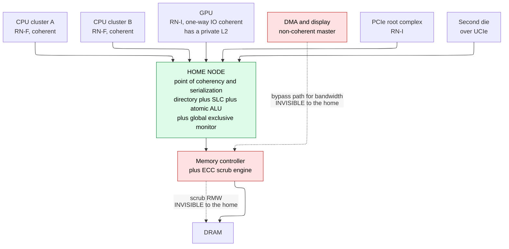
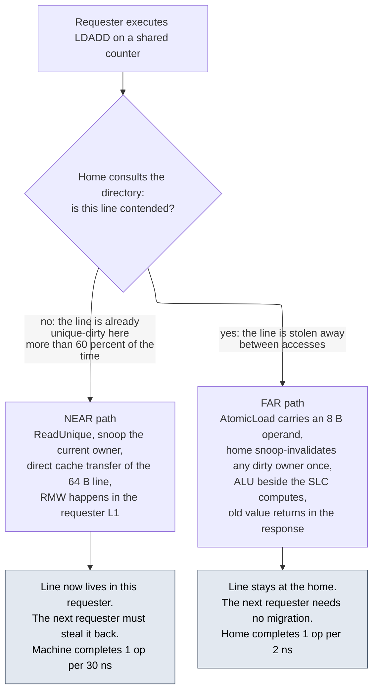
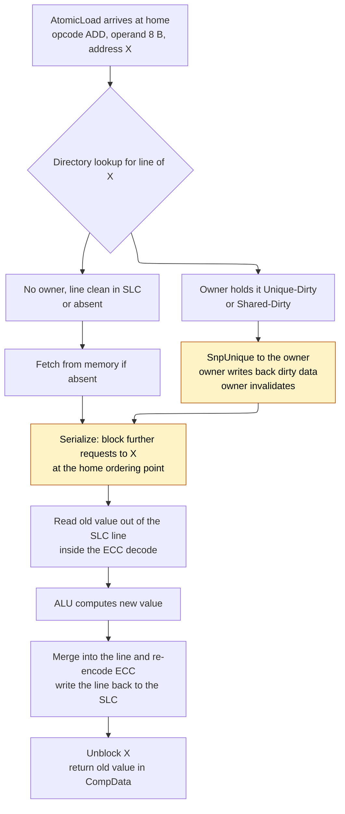
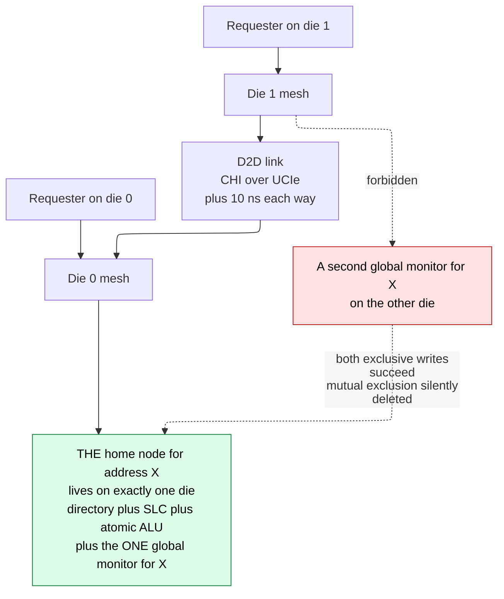
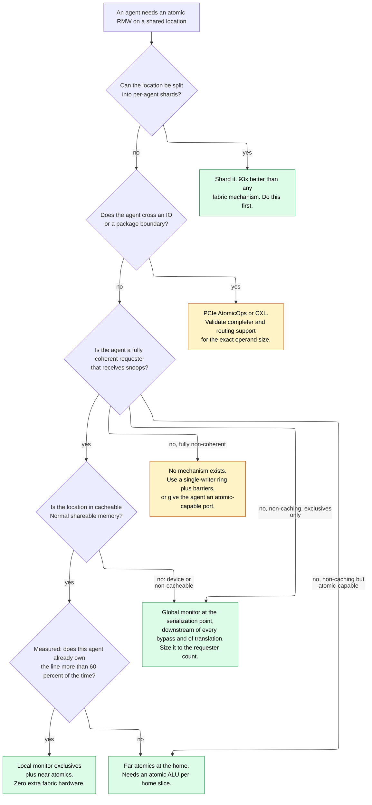

# System Atomics and Exclusive Access — Where the Serialization Point Lives When It Is Not in a Core

> **First-time reader orientation:** A core's atomic instruction is a promise that a read and a write of one location cannot be pulled apart by anybody else. On a single core with a single cache, the core keeps that promise by itself. On a real system on chip (SoC) the promise has to be kept by the *fabric*, because the "anybody else" includes a second cluster, a graphics processing unit (GPU), three direct memory access (DMA) engines, a Peripheral Component Interconnect Express (PCIe) endpoint, and possibly a second die. This page is about the hardware outside the core that keeps the promise: exclusive monitors, atomic transactions on the wire, the home node's arithmetic unit, and the several ways all of that is silently broken during integration.

> **Abbreviation key — skim now and return as needed:** read-modify-write (RMW); system on chip (SoC); central processing unit (CPU); graphics processing unit (GPU); digital signal processor (DSP); direct memory access (DMA); load-store unit (LSU); instruction set architecture (ISA); Advanced Microcontroller Bus Architecture (AMBA); Advanced eXtensible Interface (AXI); Coherent Hub Interface (CHI); AXI Coherency Extensions (ACE); request node (RN); request node, coherent (RN-F); request node, I/O coherent (RN-I); home node (HN); slave node (SN); system level cache (SLC); point of coherency (PoC); point of serialization (PoS); level-one cache (L1); unique dirty (UD); shared dirty (SD); direct cache transfer (DCT); load exclusive register (LDXR); store exclusive register (STXR); load reserved (LR); store conditional (SC); compare and swap (CAS); atomic memory operation (AMO); Large System Extensions (LSE); Peripheral Component Interconnect Express (PCIe); transaction layer packet (TLP); root complex (RC); unsupported request (UR); completer abort (CA); access control services (ACS); address translation services (ATS); address translation cache (ATC); Compute Express Link (CXL); host-managed device memory (HDM); back-invalidate (BI); Universal Chiplet Interconnect Express (UCIe); die-to-die (D2D); input-output memory management unit (IOMMU); system memory management unit (SMMU); error-correcting code (ECC); quality of service (QoS); network on chip (NoC); dynamic random-access memory (DRAM); static random-access memory (SRAM); operating system (OS); register-transfer level (RTL); SystemVerilog assertion (SVA); verification IP (VIP); physical address (PA); virtual address (VA); input-output virtual address (IOVA); nanosecond (ns); microsecond (µs); byte (B); kilobyte (KB).

> **Prerequisites:** [01 · Cache Coherence](../../01_CPU_Architecture/06_Coherence_and_Consistency/01_Cache_Coherence.md) (what a snoop is, why a store must acquire a line uniquely, and what "the point of coherency" means — every mechanism here is built on the fact that some agent already orders all accesses to a line), [03 · ACE and CHI](../../01_CPU_Architecture/06_Coherence_and_Consistency/03_ACE_and_CHI.md) (the home node, the directory, the request/response/snoop/data channel split, and direct cache transfer — this page uses those as building blocks and does not re-derive them), [01 · AHB, AXI, and APB](../03_Transaction_Protocols/01_AHB_AXI_APB.md) (the five AXI channels, the `AxID` ordering rules, and what a response code is), [02 · AMBA Family Signals and Low Power Interfaces](../03_Transaction_Protocols/02_AMBA_Family_Signals_and_Low_Power_Interfaces.md) (the bare encodings this page reasons about: `AxLOCK` values, the `AWATOP[5:0]` field layout, and the `RRESP`/`BRESP` response codes — reference them there, understand them here).
> **Hands off to:** [04 · Atomic Operations](../../01_CPU_Architecture/06_Coherence_and_Consistency/04_Atomic_Operations.md) (the core side of the same story: the ISA instructions, the LSU entry, the local reservation monitor as a microarchitectural structure, acquire/release qualifiers, and hardware transactional memory — this page deliberately stops at the core's port), [04 · PCIe Protocol Deep Dive](../05_IO_and_Chiplets/04_PCIe_Protocol_Deep_Dive.md) (the transaction-layer packet formats and completion rules that §11 here depends on), [02 · Chiplets, CXL, and Die-to-Die](../05_IO_and_Chiplets/02_Chiplets_CXL_and_Die_to_Die.md) (the link-layer and packaging costs that §12 here converts into atomic latency), [01 · QoS, Ordering, and IO Coherence](../05_IO_and_Chiplets/01_QoS_Ordering_and_IO_Coherence.md) (the service contract an atomic-heavy agent consumes).

---

## 0. Why this page exists

Every synchronization primitive a programmer has ever used — a mutex, a reference count, a lock-free queue, a semaphore, an epoch counter, a `std::atomic<int>++` — reduces to one hardware requirement: **there must exist a point in the machine at which the read and the write of a single location cannot be separated by another agent's write to that location.** That point is called the *point of serialization*. On a modern SoC it is almost never inside the core that issued the instruction. It is inside the interconnect, or inside the system level cache, or inside a memory controller, or on the other side of a die-to-die link. The instruction is the request; the guarantee is somebody else's hardware.

This matters because the guarantee is not automatic and it is not uniform. A load-exclusive/store-exclusive pair executed against ordinary cacheable memory by a fully coherent core costs the fabric nothing extra and works because coherence already delivers the conflict signal. The same instruction pair, executed by a non-caching DSP against a lock word in a device register region, requires a physically separate piece of hardware — a *global exclusive monitor* — that somebody has to have instantiated, placed at the right point in the address path, and sized. If that hardware is missing, the instruction does not fault. It returns a perfectly valid-looking response that means "the reservation was not taken," the store-exclusive reports failure forever, and the operating system's spinlock spins until the watchdog fires. This is one of the three or four canonical first-silicon hangs, and it is an *integration* bug, not an IP bug: every component in the path was individually correct.

The second half of the page is about the opposite design choice. Exclusive access moves the data to the operation. Under contention that is exactly wrong, because the cache line becomes a token that has to be physically dragged around the mesh once per increment, and the machine completes one atomic per line migration no matter how many cores are asking. The alternative is to move the operation to the data: send an opcode and an operand to the agent that already serializes the line, let it do the arithmetic, and send back the original value. AXI5 calls this an atomic transaction and carries it in `AWATOP`; CHI calls it the atomic family and carries it in four request opcodes; PCIe calls it an AtomicOp. The arithmetic that decides between the two is worked out in §8, and — this is the part usually left out — there is a large, common regime in which far atomics are *8.7 times slower* than the mechanism they replaced.

After this page you should be able to: enumerate the agents on a block diagram that can touch a shared location and say for each one which atomicity mechanism it has, if any; place and size a global exclusive monitor and justify the entry count with arithmetic; decide near versus far atomics from a measured hit rate; specify what a home node must implement to serve a far atomic without corrupting data; state the ordering obligations an atomic imposes on every interconnect stage between master and target; and write the four verification tests that catch the four ways this goes wrong. The core-side counterpart — which instruction to emit, what the LSU does with it, and how acquire/release qualifiers attach — belongs to [04 · Atomic Operations](../../01_CPU_Architecture/06_Coherence_and_Consistency/04_Atomic_Operations.md) and is not repeated here.

---

## 1. The system problem statement: an atomic is only as atomic as the weakest agent

### 1.1 The agent census

Start with the requirement stated precisely. An atomic RMW on location $X$ is correct if and only if, for the whole interval between the read of $X$ and the write of $X$, **no agent anywhere in the system modifies $X$ without that modification being detected or ordered.** "Anywhere in the system" is the load-bearing phrase. Take a mid-range application SoC and list every agent that can generate a write to a physical address in DRAM:

| Agent | Path to memory | Does the point of coherency see its writes? | Atomicity mechanism available to it |
|---|---|---|---|
| Big CPU cluster, coherent | RN-F into the mesh | yes, by construction | local monitor exclusives, near and far atomics |
| Little CPU cluster, coherent | RN-F into the mesh | yes | same, but possibly a **different reservation granule** |
| GPU with its own L2, one-way IO-coherent | RN-I; snoops the CPUs, is not snooped | writes go through the PoC, but its *caches* are invisible | far atomics only; exclusives are unsafe against CPU peers |
| Neural or display or camera engine, non-coherent | direct path to the memory controller, sometimes bypassing the SLC | **often no** | none |
| DMA engine, non-coherent | same | **often no** | none |
| PCIe endpoint doing DMA | root complex into an RN-I | yes, if the RC port is coherent | PCIe AtomicOps, if the whole path supports them |
| Security or management processor | its own AXI port to on-chip SRAM | only if that SRAM is behind the PoC | global monitor exclusives, if one exists there |
| Debug and trace agent writing a buffer | dedicated port | usually yes | irrelevant, but it *clears monitors* |
| DDR controller's ECC scrub engine | inside the memory controller, **below** the PoC | no — it is downstream of everything | none, and it can invalidate reservations |
| A second die across a D2D link | CHI-over-UCIe, or a non-coherent bridge | depends entirely on which of those two | everything, or nothing |

Two of those rows are the whole subject. The GPU row is a **one-way coherence** hazard: the GPU can see CPU data, so software believes it is coherent, but the CPU's snoop network has no port into the GPU's L2, so a CPU sitting between a `LDXR` and a `STXR` will never be told that the GPU wrote the same word. The scrub-engine row is an **invisible writer** hazard in the other direction: an agent that writes memory without the point of coherency observing it.



**Contract of the figure.** Solid edges are paths whose transactions the home node observes and therefore orders; dotted edges are paths that reach memory without the home node ever seeing them. Every atomicity mechanism on this page depends on the target address being reachable only by solid edges. **One concrete trace.** Software allocates a spinlock in a buffer that the display controller also writes through the dotted bypass path. CPU A takes the lock with a `LDXR`/`STXR` pair; the home node orders both and the pair succeeds. The display controller, ten microseconds later, writes a status byte in the same 64-byte granule directly at the memory controller. The home node's SLC still holds the old line, marked clean, and will hand that stale line to the next requester — the lock word is now *behind* memory, and the next `STXR` succeeds against data that no longer matches DRAM. **The trade-off the figure illustrates:** the dotted path exists for a real reason. Routing a 4 GB/s display stream through the home node consumes directory lookups and SLC bandwidth for data that will never be reused, and designers add the bypass to recover that bandwidth. The cost of the bypass is that a whole class of addresses loses every atomicity guarantee, which is why the bypass must be bound to an address range that shared data is architecturally forbidden to occupy — and why that binding has to be checked, not assumed.

### 1.2 Three breakages, traced

**Breakage 1 — the one-way-coherent accelerator.** The GPU maintains a shared work-stealing deque; the CPU pops from it under a `LDXR`/`STXR` pair on the head index.

```text
t=0     CPU:  LDXR  X   -> reads head = 7, local monitor {valid, granule(X)} set
t=40ns  GPU:  writes head = 8 from inside its own L2, line held dirty in GPU L2
              -> no snoop is sent to the CPU, because nothing snoops the GPU
t=90ns  CPU:  STXR  X, 8 -> local monitor still valid -> SUCCEEDS, writes 8
              Both agents believe they popped entry 7. One work item runs twice.
```

Nothing in the CPU is wrong. The local monitor's entire correctness argument is "coherence will deliver the conflict event to me," and in a one-way-coherent system that premise is false for exactly one direction. The repair is not a bigger monitor; it is to force the shared index into a memory type that reaches the global monitor, or to make both agents use far atomics executed at the home. This is why an accelerator that must synchronize with a CPU needs either full two-way coherence — CXL.cache, ACE, or a CHI RN-F port — or an atomic transaction path. IO coherence alone is not enough.

**Breakage 2 — the invisible writer behind the point of coherency.** A DMA engine writes a descriptor's status word straight to DRAM through the bypass path; the CPU polls that word with a far atomic compare-and-swap executed at the home.

```text
t=0     Home SLC holds the descriptor line, state Clean, status = 0
t=20ns  DMA writes status = 1 directly at the memory controller. DRAM now says 1.
        Home's SLC copy still says 0 and is still marked Clean, so nothing invalidates it.
t=60ns  CPU: AtomicCompare(addr=status, compare=0, swap=2)
        Home reads its SLC copy -> 0 -> comparison matches -> writes 2 to the SLC
        The DMA's write of 1 is now destroyed. It was never in the coherence domain.
```

The far atomic did everything the specification asked. It read the newest value *it could see*. The failure is upstream: a writer outside the coherence domain. The repair is either to route the DMA through the home node, or to make the descriptor region non-cacheable at the home so the atomic reads DRAM — which costs a full DRAM round trip per atomic and destroys the reason far atomics were fast.

**Breakage 3 — the duplicated monitor.** Two dies, each with its own copy of an interconnect IP that instantiates a global exclusive monitor, and an address region reachable from both.

```text
Die 0 requester: exclusive read X -> die-0 monitor takes reservation for X
Die 1 requester: exclusive read X -> die-1 monitor takes reservation for X
Die 0 requester: exclusive write X -> die-0 monitor valid -> EXOKAY, write lands
Die 1 requester: exclusive write X -> die-1 monitor never saw die-0's write
                                   -> still valid -> EXOKAY, write lands
Both stores report success. Mutual exclusion has been silently deleted.
```

There must be exactly **one** monitor per address, at the unique point that orders all accesses to that address. Two monitors for one address is not a performance bug; it is a correctness hole that no single-die simulation will ever hit. §12 returns to this.

### 1.3 Three mechanisms, three places to put the serialization point

Everything below is one of three answers, and they differ only in *where the read and the write are made inseparable*:

1. **Prevent interference.** Lock the fabric so no other agent can transact while the sequence runs. This is AXI3's locked transfer. It works, and it is why AXI4 deleted it (§2).
2. **Detect interference.** Move the line to the requester, do the arithmetic there, and keep a small piece of state — the *exclusive monitor* — that notices whether anyone touched the location in between. The fabric provides conflict *detection*. This is exclusive access (§3–§6).
3. **Execute at the serialization point.** Send the operation to the data. The agent that already orders every access to the line performs the RMW itself and returns the original value. The fabric provides *execution*. This is the atomic transaction (§7–§10).

Answer 2 is nearly free when coherence already exists and expensive when it does not. Answer 3 costs a small arithmetic unit at every home slice and wins by an order of magnitude under contention while losing by an order of magnitude without it. The rest of the page is those two claims, derived.

---

## 2. The baseline and its failure: locking the fabric

### 2.1 The bus lock, traced and costed

Software needs an indivisible RMW: increment a counter, take a lock, push onto a queue. On a single core with no bus, a `test-and-set` instruction is one memory operation and the hardware makes it atomic by construction. Across an AXI fabric there is no such instruction — there is a read transaction and, separately, a write transaction, with an unbounded number of cycles and an unbounded number of other masters' transactions in between.

**Baseline.** Assert a signal that prevents any other master from being granted the affected fabric path, read, modify, write, release. This is exactly the AXI3 *locked* encoding of `AxLOCK` — see [02 · AMBA Family Signals](../03_Transaction_Protocols/02_AMBA_Family_Signals_and_Low_Power_Interfaces.md) for the encoding itself.

**Trace.** Master A takes the lock and issues a read to DRAM. On a loaded system that is a 180 ns round trip. It computes, then issues the write, which takes another 60 ns to reach acceptance. Total lock hold: roughly 250 ns. During that entire window no other master may use the affected fabric path.

**Failure.** At 250 ns per lock acquisition and 100,000 lock operations per second across a four-core system:

$$
100{,}000\ \text{s}^{-1} \times 250\ \text{ns} = 25\ \text{ms per second} = 2.5\%\ \text{of all fabric time}
$$

— consumed by traffic that touches four bytes each time. That number alone is survivable. Three consequences are not:

- The display controller's hard deadline can now be missed because of a lock held by an entirely unrelated master. A *correctness* property of one subsystem has become dependent on the *software behavior* of another. QoS is now advisory, because the lowest-priority master in the system can stop the highest-priority one.
- The locking master might take an exception or a fault between the read and the write. The fabric stays locked with nobody to release it.
- Two masters can lock two paths in opposite orders and deadlock. Neither the masters nor the fabric can detect the cycle, and the fabric has no preemption — a textbook resource-ordering deadlock ([02 · Routing, Flow Control, and Deadlock](../04_On_Chip_Networks/02_Routing_Flow_Control_and_Deadlock.md) covers the general form).

### 2.2 Why the encoding was removed, in order of how badly each reason hurts

AXI4 deleted the locked encoding entirely. The reasons, ranked:

1. **It defeats quality of service.** A locked sequence blocks higher-priority traffic by construction; the whole `AxQOS` architecture becomes a suggestion.
2. **It creates non-local deadlocks.** As above, and undetectable by any single component.
3. **It does not compose with a multi-path fabric.** A crossbar or a NoC has no single "the bus" to lock. Implementing locked transfers on a mesh means either locking every path — catastrophic — or tracking which paths the locking master *might* use, which is impossible in general because it depends on addresses not yet issued.
4. **It cannot survive a fault.** No timeout is architecturally specified, and adding one turns a correctness mechanism into a race.
5. **Exclusive access already solves the problem** without any of the above.

**Cost of removal.** A master whose software genuinely needs a multi-access indivisible sequence — read three peripheral registers, all from the same snapshot — must now use another mechanism: a hardware snapshot register inside the peripheral, a software mutex, or a single wider access. That is a real burden, but it is now borne by the one master that needs it rather than by the whole fabric. This is the general shape of good system design: push the cost onto the agent that has the requirement.

### 2.3 The inversion: detect instead of prevent

**Derived repair.** Invert the mechanism. Instead of *preventing* interference, *detect* it. The master issues a read that says "remember this address for me," then a write that says "only take effect if nothing has touched that address since." Nothing is serialized; the fabric runs at full speed; contention is resolved by retry rather than by blocking. This is **exclusive access**, and it is the bus-level form of the load-linked/store-conditional pair in the ISA.

**Cost.** A small piece of state at the serialization point — the exclusive monitor — plus a retry loop in software, plus the possibility of failure even when no real conflict occurred (§4).

**Selection boundary.** Under extremely high contention, retry-based exclusives waste more bandwidth than they save, because every failed attempt is a full round trip that accomplished nothing. That is where far atomics (§7) win, because they move the whole operation to the target and cannot fail.

---

## 3. Exclusive monitors: local, global, and where each physically sits

`LoadExclusive`/`StoreExclusive` — Arm's `LDXR`/`STXR`, RISC-V's `LR`/`SC` — split an atomic into two instructions. The load records a **reservation**; the store succeeds only if the reservation is still valid, and returns a status the software loop branches on. The hardware that holds the reservation is the **exclusive monitor**, and it exists in two physically different places for a reason worth deriving rather than memorizing.

### 3.1 The local monitor, and why coherence makes it nearly free

The exact event the reservation must notice — *another agent wrote this location* — is **already delivered** to the requester by the coherence protocol. A competing store must acquire the line uniquely, and therefore must send this core a `SnpUnique` or `SnpCleanInvalid`. The conflict detector already exists; the monitor only has to latch onto it.

So the local monitor can be a handful of flip-flops holding $\{$valid, granule-aligned physical address, context identity$\}$, cleared by:

- any snoop that invalidates the granule,
- an eviction of the line from the local cache,
- a context switch, exception entry, or exception return,
- an explicit clear instruction such as `CLREX`,
- and, in many implementations, *any* snoop at all, including a read snoop.

Sizing it: a 48-bit physical address with a 64-byte granule needs $48 - 6 = 42$ tag bits; a context identity to prevent one thread's store from satisfying another thread's load takes on the order of 16 bits; plus a valid bit. That is 59 bits, so **roughly 64 flip-flops per hardware thread**, which is nothing.

There is **no fabric transaction at all**. `LoadExclusive` on coherent cacheable memory is an ordinary read-class request with an exclusive attribute set, and `StoreExclusive` is an ordinary ownership-acquiring store once the monitor has passed. This case covers essentially all normal shared memory in a normal operating system, which is why most engineers never think about the mechanism until they meet a system where it does not apply.

### 3.2 The global monitor, and the three cases that force it

The local monitor's entire argument was "coherence delivers the conflict event." Remove coherence and the argument evaporates. Three cases do exactly that:

1. **Non-cacheable or Device memory.** A lock word in a device register region, or a shared word in a non-cacheable buffer, is never brought into a cache, so no snoop ever arrives.
2. **A non-caching requester.** An RN-I, a DSP, a DMA engine, or a management processor with no coherent cache can issue exclusives but has nothing to snoop.
3. **Memory shared with an agent outside the coherence domain.** A non-coherent DMA engine or a second chip reaching the same memory over a non-coherent path.

In all three, the only agent that observes *every* access to the location is the agent that orders them. The monitor therefore moves to the **home node** (or, in a non-coherent system, to the target's own access point). In CHI the exclusive attribute rides on ordinary read and write requests; the home keeps a small table of $\{$address, requester `SrcID`, valid$\}$, sets an entry on an exclusive read, clears it on any conflicting write from anyone, and on an exclusive write checks the entry and reports the outcome **in the response's `RespErr` field** — the `EXOKAY` encoding, alongside `OK`, `DERR`, and `NDERR` — rather than in a separate message. Note that this is `RespErr` and not `Resp`: `Resp` carries the cache state the line ends up in, which is a different question. A failing exclusive write **does not update memory**, and the core's `STXR` returns failure.

### 3.3 Side by side

| | Local monitor | Global monitor |
|---|---|---|
| Physical location | inside the requester, beside the L1 | at the serialization point: one per home slice, or at the target's access point |
| Covers | cacheable, coherent, shareable memory | non-cacheable and Device memory, non-caching requesters, memory shared outside the domain |
| Conflict source | the snoop coherence already sends | the home's own serialization of every access |
| Storage | ~1 entry per hardware thread, ~64 flops | a table per home slice; entries are a **finite** resource |
| Fabric cost of one exclusive pair | zero extra transactions — the ordinary miss path | two round trips to the home, $\approx 26$ ns at §8's mesh numbers |
| New failure mode it introduces | none | table full, so an exclusive pair must be failed or an entry stolen |
| Who instantiates it | the core IP vendor | **you**, at integration |

That last row is the one that produces bugs. The local monitor arrives inside the core and cannot be forgotten. The global monitor is an integration decision, it is often an optional configuration parameter on an interconnect IP, and nothing about a passing single-threaded boot will tell you it is missing.

The second-to-last row surprises people too: the global monitor has finitely many entries, so with more concurrent exclusive sequences than entries, some must be evicted — and an evicted entry **must** fail its `StoreExclusive`. A fully correct implementation therefore produces failures that have nothing whatever to do with contention. §3.7 sizes that away.

### 3.4 The four rules, and the response inversion

The monitor's behavior is four rules. Written against AXI's signal names, with the encodings themselves living on [02 · AMBA Family Signals](../03_Transaction_Protocols/02_AMBA_Family_Signals_and_Low_Power_Interfaces.md):

1. On an **exclusive read** — `ARLOCK` asserted — record address and `ARID` and set valid. Return `RRESP = EXOKAY` if the monitor exists and took the reservation.
2. On **any** write to the monitored granule from **any** source, clear the valid bit.
3. On an **exclusive write** — `AWLOCK` asserted — whose address and ID match a valid entry: perform the write, clear the entry, return `BRESP = EXOKAY`.
4. On an exclusive write with **no** matching valid entry: **do not perform the write**, return `BRESP = OKAY`.

Rule 4 is the load-bearing one and it is stated in an easily-misread way. On an exclusive write, `OKAY` means **the write did not happen**. `EXOKAY` means it did. This inverts the usual reading of `OKAY` as "everything is fine," and it is why a master's exclusive-write handling must test for `EXOKAY` specifically rather than testing for "not an error." A checker written as `assert(bresp != SLVERR && bresp != DECERR)` passes on every failed exclusive in the design.

The corresponding rule on the read side is equally important and is the source of the bug in §3.5: **a target that does not implement an exclusive monitor returns `OKAY`, not `EXOKAY`, to an exclusive read.** The master must treat that as "exclusives are not supported here" and fall back to another synchronization mechanism. It must not proceed to the exclusive write, because that write will return `OKAY` forever and the software loop will spin without bound.

Notice the shape of the hazard. Both halves of the mechanism signal "unavailable" and "failed" using the *same* encoding that ordinarily means success, and there is no error response anywhere in the sequence. A missing global monitor produces a system that returns nothing but successful responses and never makes progress.

### 3.5 The bringup hang you will meet

> **Canonical first-silicon hang.** An SoC boots, runs single-threaded code fine, passes every peripheral test, and hangs the instant the operating system starts a second thread. Cause: the SRAM controller in the boot path has no exclusive monitor. `LDREX` returns `OKAY` rather than `EXOKAY`, `STREX` therefore always reports failure, and the kernel's spinlock loop never exits. It is found in about ten minutes if you know to look at `RRESP` on the exclusive read, and it can eat a week if you do not, because every symptom points at the scheduler.

The reason this specific bug is so common is that the boot SRAM is usually a different IP from the DRAM path, integrated by a different person, on a different branch of the address decode, and it is the only memory the kernel uses before the memory controller is trained. The DRAM path has a monitor because the interconnect IP was configured with one; the boot SRAM path is a simple AXI slave with none. The variant of this bug that is worse: a system with the monitor placed *after* a write buffer that some other master can bypass, which works in every directed test and fails once every few hours under load.

Two diagnostic habits remove the whole class:

- **Sweep the address map at bringup.** For every region software might place a lock in, issue one exclusive read and record `RRESP`. Any region that returns `OKAY` does not support exclusives. This is a fifteen-line assembly routine and it belongs in the very first bringup script — see [03 · Tapeout and Post-Silicon Bringup](../../../07_Manufacturing_and_Bringup/03_Tapeout_and_Post_Silicon_Bringup.md).
- **Make the *hardware* say so.** An assertion in the fabric that fires when an exclusive read is decoded to a target with no monitor turns a silicon-week hang into a simulation failure.

### 3.6 Where the monitor must physically sit

The monitor has to be at a point that observes *every* write to the monitored address. That single sentence rules out most of the places it is convenient to put it:

- **Not in front of a write buffer that can be bypassed.** If any path can deposit a write past the monitor, the monitor will miss invalidations and rule 2 fails silently.
- **Not at one memory channel when the address interleaves across four.** A write routed to a different channel never reaches the monitor. This is the same reasoning as address hashing in [03 · Memory Scheduling and Address Mapping](03_Memory_Scheduling_and_Address_Mapping.md): once the interleave function is chosen, a single address's traffic can only be guaranteed to converge at points *above* the interleave.
- **Not inside an IP that only sees one requester's traffic.** A monitor in a bridge sees the bridge's masters, not the mesh's.
- **Not below the point where a non-coherent bypass rejoins.** §1.1's dotted edge.

In a coherent system, the natural place is the coherency point — the snoop filter or home node — because that is *by construction* the serialization point for the line. In a non-coherent system it is the target's own access point, past every merge in the address path. **Placing the monitor is an architecture decision, not an IP-internal one**, and it should appear in the address-map document alongside the memory-type attributes.

There is one further constraint that people discover late: if the address region is interleaved across $H$ home slices, then the global monitor is *per slice*, and that is fine, because a given address always hashes to the same slice. But it means the entry count is per slice, and it means a bringup test that hammers one address exercises exactly one monitor out of $H$. Test with addresses that cover the hash.

### 3.7 Sizing: how many entries, tagged by what

**Tagged by what.** An entry must distinguish (a) which granule is reserved and (b) which requester reserved it, because rule 3 requires an ID match. So:

| Field | Width for a 48-bit PA, 64 B granule | Why |
|---|---|---|
| granule tag | 42 bits — `PA[47:6]` | rule 2 compares an incoming write's granule against this |
| requester identity | 8–11 bits — CHI `SrcID`, or the AXI `ARID` **after** interconnect ID widening | rule 3; the widened ID is what uniquely identifies the requesting port |
| valid | 1 bit | rules 1, 2, 4 |
| granule size select | 3 bits, only if variable sizes are supported | selects the comparator mask, §5 |
| **total** | **~54–57 bits** | |

Note the ID subtlety: an interconnect widens master IDs by prefixing port bits, so two masters that both use `ARID = 0x5` become distinct downstream. The monitor must key on the **widened** ID. A monitor placed upstream of ID widening, or one that truncates back to the narrow ID, will let master B's exclusive write satisfy master A's reservation — which is a silent mutual-exclusion failure, not a performance bug.

**How many.** The architecture permits at most **one outstanding exclusive sequence per ID** (§5), so the worst case is one entry per exclusive-capable requester ID that can be simultaneously mid-sequence. Call that $S$. Two design points:

- $E \ge S$: **eviction is impossible.** Allocation is direct-mapped by requester index; a new reservation can only ever displace that same requester's own previous one, which the architecture already permits. The table produces *zero* spurious failures of its own.
- $E < S$: the table becomes a cache and starts generating failures unrelated to contention.

Quantify the second case, because designers do choose it. Let $E$ be the entry count, $T$ the exposure window of one exclusive sequence — the two round trips to the home, $\approx 26$ ns from §3.3 — and $\lambda$ the aggregate rate at which *other* requesters take reservations at this slice. Expected foreign allocations during one sequence are $\lambda T$; with random replacement, the probability that an incumbent entry survives is $(1 - 1/E)^{\lambda T}$, so

$$
P_{\text{spurious}} = 1 - \left(1 - \tfrac{1}{E}\right)^{\lambda T}
$$

At $\lambda = 20$ M/s and $T = 26$ ns, $\lambda T = 0.52$:

| $E$ | $(1-1/E)^{0.52}$ | $P_{\text{spurious}}$ | Storage per slice |
|---:|---|---:|---:|
| 4 | $e^{0.52\ln 0.75} = 0.861$ | **13.9 %** | 228 bits |
| 8 | $e^{0.52\ln 0.875} = 0.933$ | **6.7 %** | 456 bits |
| 16 | $e^{0.52\ln 0.9375} = 0.967$ | **3.3 %** | 912 bits |
| 12 = $S$, direct-mapped | — | **0 %** | 684 bits |

The table makes the design decision obvious: an eviction-free monitor costs 684 bits per home slice, or about 8.2 kbit — roughly 1 KB — across a 12-slice mesh. That is the data storage of sixteen 64 B cache lines, for the whole machine. **Size the global monitor to the requester count and the entire eviction-induced failure class disappears.** Designs that do not are usually reusing a generic associative structure without noticing that the natural key is the requester, not the address.

**The replacement policy matters more than the size, if you undersize it.** Two options:

- **Evict an incumbent** to admit a newcomer. Two requesters can then evict each other forever — a genuine livelock that the architecture's forward-progress rules do not protect against, because each requester's sequence is individually well-formed.
- **Refuse to allocate** and return `OKAY` to the newcomer's exclusive read, which tells that requester "exclusives are unavailable right now" and forces it to retry from the top. The incumbent always completes. This converts livelock into unfairness, which is strictly better: the incumbent makes progress, and the newcomer's retry will eventually find a free entry.

Refusing to allocate is the correct default. Nothing in the mechanism requires a reservation to be granted.

Here is the eviction-free structure as synthesizable RTL. It is small enough to read completely, and every line corresponds to one of the four rules:

```systemverilog
// One global exclusive monitor slice. Instantiated AT the point of serialization
// for the addresses that hash to this slice: downstream of every write buffer that
// another master could bypass, upstream of nothing that can reorder writes past it.
//
// The table is indexed by a dense requester index that the integration assigns to
// each exclusive-capable source port. One entry per source makes eviction
// structurally impossible, which removes the livelock described above.
module excl_monitor #(
    parameter int unsigned SRCS      = 12,  // exclusive-capable source ports at this slice
    parameter int unsigned IDX_W     = 4,   // clog2 of SRCS
    parameter int unsigned PA_W      = 48,
    parameter int unsigned GRAN_LOG2 = 6    // 64-byte reservation granule
) (
    input  logic              clk,
    input  logic              rst_n,

    // Rule 1: exclusive read takes a reservation.
    input  logic              exrd_valid,
    input  logic [IDX_W-1:0]  exrd_idx,
    input  logic [PA_W-1:0]   exrd_addr,
    output logic              exrd_taken,   // 1 -> respond EXOKAY, 0 -> respond OKAY

    // Rule 2: ANY other write observed at this serialization point, from ANY source.
    // The exclusive write below is a write too, but it arrives on its own ports and
    // is handled internally; it must not also be replayed onto this one.
    input  logic              wr_valid,
    input  logic [PA_W-1:0]   wr_addr,

    // Rules 3 and 4: exclusive write checks and consumes.
    input  logic              exwr_valid,
    input  logic [IDX_W-1:0]  exwr_idx,
    input  logic [PA_W-1:0]   exwr_addr,
    output logic              exwr_pass     // 1 -> perform write, EXOKAY; 0 -> drop it, OKAY
);
    localparam int unsigned TAG_W = PA_W - GRAN_LOG2;

    logic             vld_q [SRCS];
    logic [TAG_W-1:0] tag_q [SRCS];

    logic [TAG_W-1:0] exrd_tag, wr_tag, exwr_tag;
    always_comb begin
        exrd_tag = exrd_addr[PA_W-1:GRAN_LOG2];
        wr_tag   = wr_addr  [PA_W-1:GRAN_LOG2];
        exwr_tag = exwr_addr[PA_W-1:GRAN_LOG2];
    end

    assign exrd_taken = exrd_valid;   // this slice implements exclusives; never refuse

    // A write and an exclusive write to the same granule in the same cycle have no
    // defined order at a serialization point, so the only safe answer is to fail.
    assign exwr_pass = exwr_valid
                    && vld_q[exwr_idx]
                    && (tag_q[exwr_idx] == exwr_tag)
                    && !(wr_valid && (wr_tag == exwr_tag));

    always_ff @(posedge clk or negedge rst_n) begin
        if (!rst_n) begin
            for (int unsigned i = 0; i < SRCS; i++) begin
                vld_q[i] <= 1'b0;
                tag_q[i] <= '0;
            end
        end else begin
            // Priority is low to high: the later assignment to the same target wins.
            // Rule 2 first, then rule 3/4 consumption, then rule 1 allocation.
            // Rule 2 has TWO write sources: an ordinary write seen here, and a
            // passing exclusive write, which is itself a write to the granule and
            // must kill every OTHER requester's reservation on it.
            for (int unsigned i = 0; i < SRCS; i++) begin
                if (vld_q[i] && ((wr_valid  && (tag_q[i] == wr_tag))
                              || (exwr_pass && (tag_q[i] == exwr_tag))))
                    vld_q[i] <= 1'b0;
            end
            if (exwr_valid)
                vld_q[exwr_idx] <= 1'b0;                      // consumed either way
            if (exrd_valid) begin
                tag_q[exrd_idx] <= exrd_tag;
                vld_q[exrd_idx] <= !((wr_valid  && (wr_tag   == exrd_tag))
                                  || (exwr_pass && (exwr_tag == exrd_tag)));
            end
        end
    end
endmodule
```

Four details in that module are the difference between a correct monitor and one that passes simulation and fails in silicon. First, `exwr_pass` deliberately fails on a same-cycle conflicting write, because at a serialization point "same cycle" has no order and guessing is a correctness gamble. Second, rule 1 allocation is written *last* so it takes priority, but its own valid bit accounts for a same-cycle write to the granule being reserved — otherwise a reservation could be born already stale. Third, **a passing exclusive write is itself a write to the granule**, so rule 2 must be applied to it against every *other* entry, and not only to the entry it consumed. A monitor that clears only its own entry lets two requesters that both reserved one granule both receive `EXOKAY` — §1.2's breakage 3 rebuilt inside a single slice, and the reason the exclusive write is given its own ports rather than being looped back onto the rule-2 port, where it would fail itself. Fourth, an exclusive write clears the entry whether it passed or failed; leaving a failed entry valid is the "monitor never clears" bug of §14.3.

---

## 4. Why the architecture permits spurious failure

### 4.1 What actually clears a reservation

Enumerate everything that can clear a reservation and classify each as a real conflict or not:

| Cause of `StoreExclusive` failure | Real conflict? | Why an implementation does it anyway |
|---|---|---|
| another agent wrote the granule | **yes** | the entire purpose of the mechanism |
| another agent *read* the granule, and the design clears on any snoop | no | distinguishing `SnpShared` from `SnpUnique` costs decode logic on the snoop critical path; clearing on all snoops is simpler and always safe |
| the line was evicted by capacity or conflict between the two instructions | no | after eviction no snoop will ever arrive, so the monitor has lost its conflict detector and must fail conservatively |
| context switch, exception entry or return, debug halt | no | a reservation belongs to a context; carrying it across a switch would let one thread's store succeed against another thread's load |
| a *different* address in the same reservation granule was written | no | the granule is a line, typically 64 B, not the operand, typically 8 B — false sharing, applied to the reservation |
| the block holding the monitor was power-gated | no | keeping the entry would require retention flops on a structure that exists to be cheap |
| a write of the *same value* landed in the granule | no | the monitor sees a write; comparing data would require reading the old value on every write |
| global-monitor table conflict or eviction | no | finite storage, §3.7 |
| ECC scrub engine wrote the line back unchanged | no | a background maintenance write is still a write at the target |

Only the first row is a genuine conflict. Every other row is a **spurious failure**, and the architecture permits all of them.

### 4.2 What an exact monitor would cost

If spurious failure were forbidden, the monitor would have to be exact: byte-granular address comparison for every reservation, one entry per outstanding exclusive per master, retained across every event in the system. Price each event:

- A **context switch**: the OS moves a thread between cores mid-sequence. An exact monitor would have to *migrate* the reservation between cores, which means a reservation-transfer protocol between every pair of cores.
- A **cache line eviction or migration**: the line moves to another cache. An exact monitor would have to follow it, which means the reservation becomes a coherence participant with its own states.
- **Power gating** of the block holding the monitor: the entry must survive, so retention flops on every monitor bit, always-on power to them, and isolation cells.
- A **write of the same value**: logically not a conflict, so the monitor would need to read the location and compare data before deciding — an extra read on the write critical path.
- A **partial-granule write to a neighboring byte**: requires byte-granular comparison, so 64 byte-enable comparisons per entry per write, at fabric frequency.

Each of those is real hardware cost paid on *every transaction*, to serve a case software already handles. Because software **must** have a retry loop anyway — genuine contention exists and always will — a spurious failure costs one extra loop iteration and nothing else. The specification therefore permits the monitor to clear the reservation for *any* reason.

There is a deeper reason than cost, and it is the one worth remembering: forbidding spurious failure would make **forward progress depend on the precision of a hardware structure**. Every future implementation would inherit an obligation it might not be able to meet, and a microarchitectural change — a bigger cache, a different eviction policy, a new power state — could break correctness rather than performance.

### 4.3 The contract that replaces the guarantee

The architecture instead makes the guarantee conditional on the *shape of the software loop*. A **constrained exclusive sequence** — no other memory access between the two instructions, a bounded instruction count, same address and same size on both halves, no exception taken — is guaranteed to eventually succeed. Forward progress becomes a contract between the ISA and the loop rather than a property of the monitor.

That is exactly why libc and compilers must emit one specific loop shape, and why an "improved" loop with a load, a function call, or a debug printf between the exclusive load and the exclusive store can spin forever on real silicon while passing every functional test on a simulator whose monitor is exact. If you write a reference model for verification, **make its monitor deliberately imprecise** — clear on all snoops, clear on a random 1-in-1000 timer — or your model will validate loops that real hardware livelocks on. The core-side rules for what a constrained sequence may contain belong to [04 · Atomic Operations](../../01_CPU_Architecture/06_Coherence_and_Consistency/04_Atomic_Operations.md).

```wavedrom
{ "signal": [
  { "name": "fabric clk",        "wave": "p........." },
  { "name": "core op",           "wave": "x3.x....4x", "data": ["LDXR X", "STXR X"], "node": ".a......d." },
  { "name": "monitor.valid",     "wave": "0.1...0...", "node": "..b...c..." },
  { "name": "SNP SnpUnique X",   "wave": "0.....10..", "node": "......e..." },
  { "name": "STXR status",       "wave": "x........5", "data": ["FAIL = 1"] }
 ],
 "edge": ["a~>b reservation set", "e~>c peer write clears it", "c~>d SC checks, finds invalid"],
 "head": {"text": "a peer's write between LDXR and STXR fails the store-exclusive"}
}
```

**Contract of the figure.** The monitor is a *level*, not an event: it is set by the exclusive load and can be torn down at any moment before the exclusive store samples it. **One concrete trace.** Core A executes `LDXR X` and the monitor goes valid at cycle 2; four cycles later core B's store to the same line drives `SnpUnique(X)` into A's snoop port; the snoop clears the monitor at cycle 6; A's `STXR` at cycle 8 samples an invalid monitor, performs **no** memory write, and returns 1 so the software loop retries. **The trade-off.** Replace the `SnpUnique` with a `SnpShared` from a mere *reader* and a design that clears on all snoops fails identically — row 2 of §4.1's table, a spurious failure caused by a harmless observer. Now scale it: under $N$ cores hammering one granule, every core's exclusive load produces snoops that clear everyone else's monitor and no store ever succeeds. That is livelock produced entirely by the mechanism, with no software bug anywhere, and §6 puts numbers on it.

### 4.4 The obligations this places on the system

Permission to fail spuriously is not permission to fail *always*. If a system can construct a state in which the exclusive write can never succeed, software livelocks. Four concrete rules keep that from happening, and every one of them is a system-integration obligation rather than an IP one:

1. **No unbounded external invalidation source.** If a periodic hardware event — a refresh-driven scrub, a performance-monitor counter written into memory, a debug agent polling a status word — writes into a granule containing a lock at a rate faster than a master can complete its read-write pair, that lock is *unusable*, permanently. Keep locks in granules that nothing else touches. Concretely, if a scrub engine rewrites every line once every 24 hours across a 4 GB region, it touches a given 64 B line every 24 h, which is harmless; but a statistics block that DMA-writes a 4 KB region every 10 µs drops a foreign write into every lock granule in that region on a schedule you have to price before you put a lock there. With a 26 ns exposure window and 64 lines in the region: per-line write rate $= 64/(10\,\mu s) \times (1/64) = 100$ kHz per line, so $P \approx 100\text{k} \times 26\text{ ns} = 0.26\%$ — survivable. Raise the DMA rate to every 100 ns and it becomes 26 % and the lock becomes a performance disaster. **Do the multiplication before placing shared data.**
2. **Bound the sequence length.** Software must not execute anything between the exclusive read and write that can take an unbounded time — no loads that might miss, no branches to code that might fault, no interrupts if avoidable.
3. **Do not let the retry loop itself cause failures.** A spin loop that re-issues the exclusive read at full rate from four cores keeps all four monitors thrashing. Exponential backoff, or the "spin on a plain load until the lock looks free, then attempt the exclusive" structure — test-and-test-and-set — converts a livelock into progress.
4. **If hardware must help, bound the help.** A **reservation hold window** briefly defers a conflicting snoop after an exclusive load so the local store has a chance to land. This works, and it is used. But an unbounded hold is a snoop that never responds, which is a coherence deadlock, so real designs use tens of cycles plus a hard timeout. That converts livelock into a rough queue. It does not make the mechanism cheap, which is the motivation for §7.

---

## 5. The limits on a legal exclusive pair, derived from the comparator

The architecture constrains exclusive accesses in ways that look arbitrary until you write the comparator. Derive them instead of memorizing them.

**What rule 2 requires the monitor to compute.** For every write the monitor observes, at address $W$ covering $w$ bytes, and for every valid entry reserving $[A,\,A+S)$, decide *does the write overlap the reservation?* In general that is

$$
\text{overlap} \iff (W < A + S) \ \wedge\ (W + w > A)
$$

which is two adders and two magnitude comparators **per entry, per write, at fabric frequency**. At 12 entries and a 2 GHz fabric that is 24 wide arithmetic operations every cycle on the write path, in series with the write's acceptance.

**Now constrain $S$ to a power of two and $A$ to be $S$-aligned.** The reserved region becomes exactly the set of addresses that share the high address bits, so

$$
\text{overlap} \iff W[47{:}\log_2 S] = A[47{:}\log_2 S]
$$

— one masked equality comparison: a wide XNOR followed by an AND tree, with the mask selected by a 3-bit $\log_2 S$ field. The adders and magnitude comparators vanish. Each constraint does one specific job:

| Rule | Value | What in the comparator forces it |
|---|---|---|
| Total bytes transferred | a power of two: 1, 2, 4, 8, 16, 32, 64, or 128 | makes the block boundary a *bit position* rather than an arithmetic value, so the compare is an equality, not a magnitude compare |
| Address alignment | aligned to the total byte count | makes "shares the high bits" equivalent to "lies in the block"; without alignment a power-of-two-sized region can straddle two blocks and need two comparisons |
| Maximum total bytes | 128 | bounds the mask multiplexer to 8 positions and the don't-care field to 7 bits; also guarantees a reservation never spans more than two 64 B lines, so the monitor is never forced to be a multi-line tracker |
| Burst length | at most 16 beats | bounds how long the target must hold the entry pinned while the data of one exclusive burst flows, and matches the 4-bit `AxLEN` of AXI3 so an exclusive is expressible in both generations |
| The exclusive write must match the read in | `AxID`, `AxADDR`, `AxSIZE`, `AxLEN`, `AxBURST`, and the cache and protection attributes | the entry is keyed by address and ID, and the *mask* is derived from size; a different size means a different mask and the monitor has no way to know which one was meant |
| Outstanding exclusives per ID | one | the table is keyed by ID; a second exclusive read on the same ID overwrites the first, silently losing it |

The 128-byte cap has a second consequence worth stating separately: it caps how much data a single reservation covers, and therefore caps the collateral damage of granule false sharing. A reservation granule of 128 B means any write anywhere in 128 bytes fails your lock. That is why lock words are padded to a granule, exactly as producer and consumer indices are padded to a cache line — the same lesson, applied to the reservation instead of to the cache.

Two further points that are easy to miss and expensive to discover:

**Device memory is not architecturally guaranteed to support exclusives.** Device memory typically sits behind a peripheral bridge with no monitor, so the exclusive read returns `OKAY` and the mechanism is simply unavailable. Locks belong in Normal memory. If a lock genuinely must live in a device region — a hardware semaphore block, a mailbox — then that block must implement the monitor itself, and that must be in its specification.

**A bridge that reshapes transactions destroys exclusives.** If an AXI-to-AXI width converter turns one 16-byte exclusive read into two 8-byte reads, the monitor sees two ordinary-looking accesses and the sequence's semantics are gone: the reservation, if taken at all, is taken for the wrong size. Exclusive transactions must therefore be marked **Non-modifiable** — `AxCACHE[1] = 0` — so that no fabric stage may split, merge, or resize them. This is one of the concrete consequences of the modifiable attribute, and it is why an exclusive to a region whose attributes are overridden by a fabric-level attribute remapper can break in a way that is invisible in the master's own waveforms.

---

## 6. Why contended exclusives collapse

Exclusive access is a **two-round-trip mechanism plus a retry probability**. Both halves scale badly, and they scale badly in different ways.

**Trace the failure at scale.** Sixteen cores increment a shared counter. Round trip to the coherency point on a loaded system: 120 ns. With $N$ contenders and roughly fair arbitration, the expected number of attempts before a given core succeeds is about $N/2$, so the mean time a core spends per successful increment is

$$
T_{\text{success}}(N) \approx \frac{N}{2}\, t_{\text{rt}} = 60N \ \text{ns}
$$

and the *system* carries $N/2$ times the traffic of the useful work. At $N = 16$ that is 960 ns per increment — call it a microsecond — for an eight-byte addition.

| $N$ | attempts $\approx N/2$ | time per success, per core | system throughput | wasted round trips per useful op | bytes moved per useful 8 B |
|---:|---:|---:|---:|---:|---:|
| 2 | 1 | 120 ns | 16.7 M/s | 0 | 64 B, 8× |
| 4 | 2 | 240 ns | 16.7 M/s | 1 | 128 B, 16× |
| 8 | 4 | 480 ns | 16.7 M/s | 3 | 256 B, 32× |
| 16 | 8 | 960 ns | 16.7 M/s | 7 | 512 B, 64× |
| 32 | 16 | 1.92 µs | 16.7 M/s | 15 | 1024 B, 128× |
| 64 | 32 | 3.84 µs | 16.7 M/s | 31 | 2048 B, **256×** |

System throughput is $N / (60N\ \text{ns}) = 16.7$ M ops/s, **independent of $N$**. That is the whole story in one number: adding cores adds exactly zero throughput and multiplies every core's latency linearly. It is not merely poor scaling; it is the classic negative-scaling curve, because the byte amplification in the last column eventually crowds out the rest of the machine's traffic. At 64 contenders the fabric moves two kilobytes of cache line per eight bytes of useful update.

**Where the $N/2$ comes from, and why it is optimistic.** The model assumes each attempt has probability $\approx 2/N$ of being the winner, which requires arbitration that does not systematically favor anyone. Real meshes are not like that: a core two hops from the home reaches it before a core eight hops away, essentially always. Under distance-based unfairness the near cores can starve the far cores indefinitely, and the far cores' worst-case time is unbounded. This is why the architecture's forward-progress guarantee is stated for a *constrained sequence executed repeatedly*, not for a bounded number of attempts: no bound exists.

**Three repairs, in increasing order of how much they help.**

1. **Exponential backoff in software.** Cheap, immediate, and it converts the collapse into something merely slow. It does not fix the byte amplification, only reduces its rate.
2. **A hardware reservation hold window** (§4.4). Throughput becomes $1/(t_{\text{rt}} + W)$ with a bounded window $W$, and forward progress becomes a rough queue. This costs snoop-path logic and a timeout, and it is the fix that turns livelock into liveness.
3. **Change mechanism.** Stop moving the line. §7.

There is a fourth answer that is better than all three and belongs to software: **do not share the location.** §8.6 puts the number on it.

---

## 7. Far atomics: send the operation to the data

### 7.1 The transaction families

**Derived repair.** Send the *operation* rather than fetch the *data*. The master issues one transaction carrying an operand and an opcode; the target — which is the serialization point and therefore already sees all accesses to the location in order — performs the read-modify-write locally and returns the original value. One round trip, no retries, and throughput bounded by the target's own pipeline rather than by the fabric round trip. This is the **atomic transaction**. AXI5 carries it in the `AWATOP[5:0]` field; CHI carries it in the four request opcode families it gained at Issue B, for exactly the reason derived in §6. The field layout and the opcode encodings live on [02 · AMBA Family Signals](../03_Transaction_Protocols/02_AMBA_Family_Signals_and_Low_Power_Interfaces.md); what they *mean* is here.

| Family | Semantics | Returns | Arm LSE form | RISC-V form |
|---|---|---|---|---|
| `AtomicStore` | `mem = f(mem, operand)` | **nothing** | `STADD`, `STCLR`, `STEOR`, `STSET`, `STSMAX`, `STSMIN`, `STUMAX`, `STUMIN` | `AMO*` with destination `x0` |
| `AtomicLoad` | `old = mem; mem = f(mem, operand)` | the old value | `LDADD`, `LDCLR`, `LDEOR`, `LDSET`, `LDSMAX`, `LDSMIN`, `LDUMAX`, `LDUMIN` | `AMOADD`, `AMOAND`, `AMOOR`, `AMOXOR`, `AMOMAX`, `AMOMIN`, `AMOMAXU`, `AMOMINU` |
| `AtomicSwap` | `old = mem; mem = operand` | the old value | `SWP`, `SWPB`, `SWPH` | `AMOSWAP` |
| `AtomicCompare` | `if mem == compare then mem = swap` | the old value | `CAS`, `CASP` | `AMOCAS` from the Zacas extension, or composed from `LR`/`SC` |

The function $f$ in the first two rows is one of eight: add, bit-clear, exclusive-or, bit-set, signed maximum, signed minimum, unsigned maximum, unsigned minimum. That set is not arbitrary — it is exactly the operations that are associative and commutative enough to be *reordered freely among themselves at the target*, which is what lets a home node pipeline a queue of them without tracking their order. Subtract is absent because it is add with a negated operand; multiply is absent because a multiplier at every home slice is not worth it.

The `AtomicStore` row is the one to pause on. It returns no data, so the requester can retire the instruction as soon as the transaction is accepted. That single property is why a statistics counter incremented by 64 cores costs the issuing core nothing but a transaction-table entry, while the same counter under exclusives costs a full line transfer plus a probable retry. If your code does not need the old value, *do not ask for it*: `STADD` and `LDADD` cost the same at the home and wildly different amounts at the core.

`AtomicCompare` is the opposite extreme: it carries **two** operands — the compare value and the swap value — so its request payload is twice the width of the location it operates on. An 8-byte compare-and-swap therefore transfers 16 bytes of write data, and its `AWLEN`/`AWSIZE` describe that doubled width. It is the one atomic whose request payload exceeds its result size, and a fabric sized on the assumption "atomics are small" will meet it as a buffering surprise.

One further encoding detail whose *reason* belongs here even though the bit lives on the AMBA page: `AWATOP[3]` selects the endianness with which the target interprets the operand. That bit exists because the target performs *arithmetic* on bytes it received over a byte-lane bus, and arithmetic is the one operation for which byte order is not a naming convention but a numeric fact. A big-endian master's `+1` and a little-endian target's interpretation of the same wires differ by a factor of $2^{56}$ on an 8-byte operand. Ordinary reads and writes never need the bit because they move bytes without interpreting them.

### 7.2 Near and far: fixing the vocabulary

The field uses these words loosely, so pin them down:

- An atomic executed **at the requester**, after the line has been pulled into the requester's cache with unique permission, is a **near atomic** — near the core.
- An atomic executed **at the home node, the system level cache, or the memory controller**, with the line never moving to the requester, is a **far atomic** — far from the core.

CHI carries the same four opcodes in both cases. The decision belongs to the home, which makes it from directory state, and the requester cannot tell the difference except in timing. This is important: **near versus far is a microarchitectural policy, not an architectural property.** Software cannot request it and must not depend on it.



**Contract of the figure.** Both paths are architecturally identical — same opcode, same result, same ordering obligations — and differ only in *where the ALU runs* and therefore in what the fabric must move. **One concrete trace on the far path.** The requester issues `AtomicLoad` carrying an 8 B operand; the home checks the directory, finds the line resident in its SLC with no dirty owner elsewhere, reads it, adds, writes it back into the SLC, and returns the old value in a `CompData` response. The 64-byte line never moved anywhere. **The failure this figure sets up** is the branch condition itself: choose wrong and you pay twice, because switching to the near path pulls the line out of the SLC and switching back snoops it home again. §8 derives the threshold, and §8.5 explains why the branch must be hysteretic rather than instantaneous.

### 7.3 What the wire carries

```wavedrom
{ "signal": [
  { "name": "ACLK",    "wave": "p..........." },
  { "name": "AWVALID", "wave": "010........." },
  { "name": "AWATOP",  "wave": "x2x.........", "data": ["AtomicLoad ADD"] },
  { "name": "AWID",    "wave": "x2x.........", "data": ["0x7"] },
  { "name": "WVALID",  "wave": "0.10........" },
  { "name": "WDATA",   "wave": "x.2x........", "data": ["operand = +1"] },
  { "name": "RVALID",  "wave": "0.....10...." },
  { "name": "RID",     "wave": "x.....2x....", "data": ["0x7"] },
  { "name": "RDATA",   "wave": "x.....3x....", "data": ["original value"] },
  { "name": "BVALID",  "wave": "0.......10.." },
  { "name": "BID",     "wave": "x.......2x..", "data": ["0x7"] }
 ],
 "head": { "text": "AtomicLoad ADD: one write-channel request produces BOTH an R response and a B response, sharing one ID" }
}
```

**Contract of the figure.** An atomic transaction is issued entirely on the *write* channels and generates a response on **both** the read-data channel and the write-response channel, with `RID` and `BID` equal to the issuing `AWID`. Nothing orders `R` against `B`. **One concrete trace.** The master issues at cycle 1 and presents the operand at cycle 2; the target adds 1 to the location; the pre-increment value returns at cycle 6 on `R`; completion is confirmed at cycle 8 on `B`. The master's transaction is retired only when it has collected both. **The trade-off, and the integration hazard.** An ordinary AXI component assumes the `R` channel is driven only by transactions accepted on `AR`. An interconnect, register slice, or reorder buffer that allocates `R`-channel resources purely from `AR` traffic will have *nothing allocated* for an atomic's read response, and the `R` channel stalls — permanently, because the thing that would free the resource is the response that cannot be sent. This is why atomics are an explicitly declared *property* rather than something a master may start driving, and it is §10's subject.

---

## 8. The arithmetic: where the crossover sits, and where far atomics lose

### 8.1 Parameters

| Symbol | Meaning | Value used |
|---|---|---|
| $t_{L1}$ | RMW on a line already held Unique-Dirty in the requester's L1 | 1.5 ns |
| $T_{\text{mig}}$ | one contended migration plus local RMW: request to home, snoop the owner, direct cache transfer of the line, compute | 30 ns — 22 ns of DCT plus home lookup and RMW |
| $t_{\text{rt}}$ | unloaded round trip requester to home to requester: 5.3 hops each way, 2 cycles per hop, 2 GHz | $2 \times 5.3 \times 2 \times 0.5\ \text{ns} = 10.6 \approx 11$ ns |
| $t_{\text{occ}}$ | home atomic-unit occupancy per operation — a pipelined banked-SLC read-modify-write, **not** a transaction | 2 ns |
| $T_{\text{far}}$ | unloaded far atomic, $= t_{\text{rt}} + t_{\text{occ}}$ | 13 ns |

Every one of those is a number you should be able to recompute for your own mesh from hop count, hop latency, and SLC bank cycle time. The conclusions below are not sensitive to the exact values; they are sensitive to the *ratio* $T_{\text{mig}}/t_{\text{occ}}$, which is 15 here and is between 10 and 25 on essentially every mesh-based SoC.

### 8.2 Contention scaling

**Under contention the migrating path is serialized by the line, not by the cores.** Only one requester can hold the line uniquely, so the machine completes one atomic per $T_{\text{mig}}$ no matter how many cores are asking, and each core waits behind all the others:

$$
\Lambda_{\text{near}} = \frac{1}{T_{\text{mig}}} = 33.3\ \text{M ops/s}, \qquad L_{\text{near}}(N) = N\,T_{\text{mig}}
$$

**The far path is serialized by the home's atomic unit**, which is a pipeline stage rather than a network round trip:

$$
L_{\text{far}}(N) = t_{\text{rt}} + N\,t_{\text{occ}} = 11 + 2N \ \text{ns}, \qquad \Lambda_{\text{far}}(N) = \frac{N}{L_{\text{far}}(N)} \ \xrightarrow[N\to\infty]{}\ \frac{1}{t_{\text{occ}}} = 500\ \text{M ops/s}
$$

| Contending agents $N$ | Migrating: throughput / per-op latency | Far: throughput / per-op latency | Far advantage | Data bytes moved per op |
|---:|---|---|---|---|
| 1, line already UD in L1 | 667 M/s / **1.5 ns** | 77 M/s / 13 ns | **0.12× — far loses by 8.7×** | 0 vs ≈32 B |
| 2 | 33.3 M/s / 60 ns | 133 M/s / 15 ns | 4.0× | 64 B vs ≈32 B |
| 8 | 33.3 M/s / 240 ns | 296 M/s / 27 ns | 8.9× | 64 B vs ≈32 B |
| 64 | 33.3 M/s / 1.92 µs | 460 M/s / 139 ns | **13.8×** | 64 B vs ≈32 B |

The latency and throughput ratios are identical at every row because this is a closed loop — that is Little's law, not a coincidence: with $N$ requesters each having exactly one atomic outstanding, $\Lambda = N/L$ by definition, so any ratio of latencies is also the inverse ratio of throughputs.

Compare the far column against §6's exclusive numbers — the same mesh, but priced under load, where a contended round trip is the 120 ns of §6 rather than the unloaded 11 ns of $t_{\text{rt}}$ — and the case is overwhelming: exclusives gave 16.7 M ops/s flat with 256× byte amplification at 64 contenders; far atomics give 460 M ops/s moving one request and one response, an amplification of 8× rather than 256×. **Far atomics are 27× the throughput of exclusives at 64 contenders**, and the gap is entirely the retry traffic that exclusives generate and atomics cannot.

### 8.3 The break-even

Real workloads are a mixture. With probability $p$ the requester already holds the line Unique-Dirty — a private accumulator, an uncontended lock reacquired by the same core, an array the core owns — and otherwise it must migrate. The near path costs $p\,t_{L1} + (1-p)\,T_{\text{mig}}$; the far path costs $T_{\text{far}}$ regardless of $p$, because the line is at the home either way. They are equal when

$$
1.5p + 30(1-p) = 13 \;\Longrightarrow\; 30 - 28.5p = 13 \;\Longrightarrow\; p = \frac{17}{28.5} = 0.596
$$

**The near path wins only if the requester finds the line already unique-dirty in its own cache more than about 60 % of the time.** Below that, the far atomic wins, and the margin widens fast, because $T_{\text{mig}}$ grows with the number of contenders while $T_{\text{far}}$ grows only by $t_{\text{occ}}$ per contender. The threshold is high, and that surprises people: you need a *majority* of atomics to be effectively private before keeping the arithmetic at the core is worthwhile.

Solve it symbolically once so you can redo it for your own numbers:

$$
p^{*} = \frac{T_{\text{mig}} - T_{\text{far}}}{T_{\text{mig}} - t_{L1}} = \frac{T_{\text{mig}} - t_{\text{rt}} - t_{\text{occ}}}{T_{\text{mig}} - t_{L1}}
$$

Note what moves $p^{*}$: a *faster mesh* — smaller $t_{\text{rt}}$ — pushes $p^{*}$ up and favors far atomics; a *slower* migration — a bigger mesh with more hops to the owner — also pushes $p^{*}$ up and favors far atomics. Both of the ways systems get bigger argue for far atomics. That is the structural reason the mechanism exists at all.

### 8.4 The losing regime, stated plainly

Far atomics lose on *private* atomics, and private atomics are extremely common:

- a thread-local accumulator flushed to a global once per epoch,
- a per-core statistics counter,
- a reference count touched by a single owner for its whole lifetime,
- a lock the same core acquires and releases in a loop with no other contender,
- any atomic over an array that this core already owns — a lock-free stack whose top pointer is hot in exactly one L1,
- and the pattern that hurts most: **an atomic followed immediately by a read of the same location.**

That last one deserves its own paragraph, because it is the case the latency table does not show. Consider `old = atomic_fetch_add(&p->count, 1); if (old == 0) { ... use p->data ... }`. On the near path the line is now in the requester's L1 in Unique-Dirty state, so the follow-up read of `p->data` — same 64-byte line — is a 1.5 ns hit. On the far path the line is at the home and was never sent, so the follow-up read is a full miss: another $t_{\text{rt}}$ plus SLC access, roughly 20 ns. **The far atomic converted a 1.5 ns hit into a 20 ns miss on the very next instruction**, and the total cost of the pair is 13 + 20 = 33 ns far versus 30 + 1.5 = 31.5 ns near even at $p=0$. Far atomics are a bet that the requester does not want the *line*, only the *location*. When the atomic is a gate on data in the same line, the bet loses.

Each of the private cases is a 1.5 ns L1 hit on the near path and a 13 ns fabric round trip on the far path — and the far version additionally consumes home atomic-unit slots and snoop bandwidth that a genuinely contended counter elsewhere in the system needs. A blanket "always use far atomics" policy therefore degrades the uncontended majority to pay for the contended minority.

### 8.5 Hysteresis, and why oscillation is the worst outcome

The choice must be **dynamic and hysteretic**. The home counts, per line or per region, how often the line was stolen away between one requester's atomics, uses the near path below a threshold, switches to far above it, and requires several consecutive observations before switching back.

Oscillation is the worst outcome of all, worse than being permanently wrong in either direction, because **each switch costs a line movement**: switching to near pulls the line out of the SLC into a requester's cache, and switching back snoops it home again. A predictor that flips every few operations pays $T_{\text{mig}}$ *in addition to* whatever it was going to pay. A four-bit saturating counter with asymmetric weights — add 4 on a contended observation, subtract 1 on an uncontended one, switch to far at 8 and back to near at 0 — reaches far after 2 consecutive contended observations and needs at least 8 consecutive uncontended ones to come back. It costs 4 bits per tracked line and removes the whole failure mode. The asymmetry has to be in the *weights*, not just in the thresholds: a counter with fewer states than the longer of the two run lengths cannot express "eight in a row" at all. The asymmetry is deliberate: far is the safe default because its worst case is 8.7× and near's worst case is 13.8×, and because far's cost is bounded while near's grows with $N$.

### 8.6 Sharding beats both

If the counter can be split into $N$ per-core shards summed on read, each shard lives in its owner's L1 and the contention disappears entirely:

$$
64 \times 667\ \text{M/s} = 42.7\ \text{G ops/s}
$$

against 460 M ops/s for the best fabric mechanism — a **93× gap that no protocol feature can close**. The fabric's job is to make the *irreducibly* shared case survivable, not to make a badly shared data structure fast. Before spending home-node area on atomic units, ask whether the hot counters in the workload actually need to be single locations. Statistics counters, allocation counters, and epoch counters almost never do; a lock's state and a queue's head pointer genuinely do.

This is the padding lesson from cache-line false sharing, applied to the read-modify-write: the correct answer to "many agents contend for one word" is usually "make it not be one word."

---

## 9. What the home node must implement, and what it must not skip

### 9.1 The datapath

A home node that serves far atomics needs, per home slice:

- **A narrow integer ALU** covering add, bit-clear, exclusive-or, bit-set, and signed and unsigned minimum and maximum at 1, 2, 4, and 8-byte widths, with correct sign extension for the signed comparisons. Sign extension is the detail that gets missed: `SMIN` on a 2-byte operand must compare the two operands as signed 16-bit values, not as the low half of a zero-extended 64-bit value, and a testbench that only exercises 8-byte operations will never notice.
- **A comparator and a second operand register** for `AtomicCompare`, sized for the doubled payload of §7.1.
- **Byte-enable and endianness handling**, per §7.1's `AWATOP[3]` reasoning.
- **A response path that carries the original value.** For `AtomicLoad`, `AtomicSwap`, and `AtomicCompare` the home must return the pre-operation value, which means the read half of the RMW must be captured before the write half overwrites it — a register, not a re-read. For `AtomicStore` the home returns only a completion. In CHI those are `CompData` and `Comp` respectively; in AXI they are the `R` and `B` responses of §7.3.

### 9.2 The coherence prerequisite — the part people skip

**A far atomic is not "skip coherence."** Before executing, the home must hold the newest data. If the directory shows a Unique-Dirty or Shared-Dirty owner somewhere, the home **must** issue `SnpUnique` and pull the line in first. Only then may the ALU run.



**Contract of the figure.** Every path converges on the shaded block: the home takes ownership of the address, blocks competing requests to it, and only then runs the RMW. Nothing may observe the line between the read and the write halves. **One concrete trace.** Core 3 owns line $X$ Unique-Dirty when core 11's `AtomicLoad ADD` arrives. The home issues `SnpUnique` to core 3, which writes back the dirty data and invalidates; the home installs the line in the SLC, blocks $X$, reads 0x41, adds 1 to get 0x42, writes 0x42 back, unblocks, and returns 0x41. Total cost: one full snoop round trip *plus* the atomic. **The trade-off.** The first far atomic on a line that some core owned dirty costs the full snoop; the next thousand cost nothing but $t_{\text{occ}}$, because the line now lives at the home and stays there. That asymmetry is precisely why §8.5's predictor must be hysteretic — a one-shot decision made on the first operation measures the most expensive one — and skipping the snoop entirely is the "atomic returns a stale old value" bug.

### 9.3 ECC, and why the ALU must sit inside the loop

An SLC line is protected by an error-correcting code covering the whole line — typically SECDED or a stronger symbol code over 64 bytes plus check bits. An 8-byte atomic is therefore a read-modify-write of the **ECC codeword** as well as of the data: you cannot write 8 bytes into a 64-byte-protected line without recomputing the check bits over the whole line.

The consequence for the floorplan is specific: **the atomic ALU must sit inside the SLC's ECC loop, not beside it.** Concretely, the sequence must be decode-and-correct → operate → re-encode → write, all as one pipeline. An implementation that reads the line out through the ECC decoder, hands corrected data to an ALU in a different pipeline stage, and writes back through a *separate* encoder will either add a full array round trip per atomic — doubling $t_{\text{occ}}$ and halving the throughput ceiling in §8.2 — or, worse, will write back a line whose check bits were computed from data that a concurrent correction has since changed. Placing the ALU inside the loop is a physical-design constraint that must be stated at architecture time, because it constrains where the atomic unit can be placed relative to the SLC macros.

A second ECC consequence: an atomic that hits an *uncorrectable* error in the line has no good answer. It cannot return the old value, because the old value is unknown; it cannot perform the operation, because the operand's result would be garbage. The home must return an error response and must **not** write the line — and the requester's atomic must raise an abort. Getting this wrong turns a detected error into a silently corrupted counter.

### 9.4 Ordering, cost, and the symptom table

**Ordering.** The atomic carries the request's ordering class. Whether an acquire or release qualifier is satisfied is decided by *which response is treated as the completion point*, not by the arithmetic. §10 develops this; the core-side rules belong to [04 · Atomic Operations](../../01_CPU_Architecture/06_Coherence_and_Consistency/04_Atomic_Operations.md) and the consistency-model background to [02 · Memory Consistency and Atomics](../../01_CPU_Architecture/06_Coherence_and_Consistency/02_Memory_Consistency_and_Atomics.md).

**Cost.** One atomic unit per home slice. At $H = 8$ to 16 homes that is 8 to 16 small ALUs plus their operand queues and roughly a dozen additional home-transaction states. The area is negligible next to the SLC data array — an 8-byte ALU with eight operations is a few thousand gates against megabytes of SRAM. **The real cost is the verification surface**, which is every atomic opcode crossed with every operand width crossed with every directory state crossed with every race, and that product is where the schedule goes. §14.3 prunes it.

| Symptom | First hypothesis |
|---|---|
| atomic returns a stale old value | the home executed without first snooping a dirty owner, or executed against the SLC copy while a direct cache transfer was in flight |
| `StoreExclusive` never succeeds on one agent while others do | reservation-granule false sharing, or a global-monitor entry repeatedly stolen by another requester, §3.7 |
| `StoreExclusive` succeeds when it must not | monitor not cleared on eviction, monitor keyed on the un-widened ID, or the exclusive check races the conflicting write's ordering at the home |
| exclusives fail 100 % of the time in one address region | no global monitor on that path — check `RRESP` on the exclusive read, §3.5 |
| atomics functionally correct but a release fails to order | the completion point was taken at acceptance rather than at the point the value became observable |
| far atomics measurably slower than exclusives on a benchmark | the workload is §8.4's private case and the predictor is stuck in far mode |
| throughput collapses when an operand spans two homes | an architecturally atomic operand was split across a line or home boundary — never legal |
| a counter increments by the operand value instead of accumulating | an interconnect stage dropped `AWATOP` and forwarded the transaction as a plain write, §10.4 |
| an atomic occasionally applies twice | an end-to-end timeout-and-reissue somewhere in the path, §10.5 |

---

## 10. Ordering obligations an atomic creates in a fabric

### 10.1 The two deadlock rules

**Rule 1 — the master must be able to accept `R` and `B` in either order.** Nothing orders an atomic's read data against its write response. A master that will not assert `RREADY` until it has seen `BVALID` — a perfectly reasonable design for ordinary AXI, where reads and writes are unrelated transactions — deadlocks against a target that returns `R` first and holds `B` behind it. The master's atomic tracking entry must have independent space for both responses and must complete only when both have arrived.

**Rule 2 — `R`-channel resources must not be allocated solely from `AR` traffic.** This is the fabric-side mirror of rule 1, and the concrete form of §7.3's hazard. Every buffer, credit counter, and reorder-buffer entry along the read-data return path must account for atomics that were accepted on `AW`. A register slice sized "one `R` beat per outstanding `AR`" is an integration bug that no ordinary traffic will reveal.

Both rules have the same shape: an atomic is a transaction that violates a structural assumption the rest of the protocol quietly relies on, so every structure that was sized against that assumption must be resized.

### 10.2 What an atomic does and does not order

This is the most commonly misunderstood point on the page, so state it flatly: **an atomic is atomic, not a barrier.** A plain `LDADD` with no ordering qualifier imposes no ordering whatsoever on the requester's other outstanding transactions. It guarantees indivisibility of one location's read and write, and nothing else.

What *does* create ordering:

- **Same-ID ordering.** Two atomics with the same `AWID` to the same address complete in issue order, which is what makes a sequence of increments from one master correct. Two atomics with *different* IDs have no mutual ordering. A master that issues its increments round-robin across IDs to gain parallelism has removed the ordering it may have been relying on for the *sequence*, though each individual operation remains atomic. This is a real and common performance-tuning mistake.
- **Ordering qualifiers.** An acquire-atomic requires that no later access by this requester be observed before the atomic; a release-atomic requires that all earlier writes by this requester be observed before the atomic. In a fabric, that is implemented by choosing *which response is the completion point*: the point at which the atomic's effect became observable to all other agents. In CHI, the distinction between accepting the request, granting a data buffer identifier, and signalling completion is exactly what makes this expressible. Take the completion point too early — at acceptance rather than at observability — and every release qualifier in the system is silently broken, with a symptom that appears once every few million iterations under load.
- **Explicit barriers.** Everything else.

**A fourth, subtler framing that resolves most arguments: an atomic is a write transaction that reads.** It must therefore honor the memory attributes of a write — cacheability, shareability, bufferability, device-ness — *and* the coherence obligations of a read. In a coherent system that pairing is exactly why atomics are performed at the coherency point rather than in a local cache when the line is contended.

### 10.3 Atomics are not idempotent, and what that forbids

A read can be repeated harmlessly. A write of a fixed value can be repeated harmlessly. **An atomic cannot.** Executing `LDADD +1` twice increments by two.

That single property forbids a whole class of otherwise-reasonable error recovery: **no stage in the path may recover from an error by re-issuing the transaction end to end.** Link-level replay is fine — PCIe's data-link-layer replay buffer and CHI's credited retry both use sequence numbers or credits that guarantee exactly-once delivery, so a replayed packet is deduplicated below the protocol layer. What is *not* fine is a bridge or a die-to-die adapter that implements "if no response in $N$ cycles, send it again." On reads that is a latency hiccup; on atomics it is silent data corruption whose rate scales with the link's error rate. If a path has an end-to-end timeout, atomics must either be excluded from that path or the timeout must escalate to an error response, never to a retry.

The same reasoning applies to speculation: a fabric may prefetch or speculatively issue a read; it may never speculatively issue an atomic.

### 10.4 The silent-corruption bug: pass-through without implementation

Consider a bridge that connects an AXI5 master to an AXI4 subordinate, or a CHI-to-AXI bridge in front of a memory-mapped SRAM. The master issues `AtomicLoad ADD` with operand $+1$ against a counter holding 100. The bridge does not implement atomics, and its `AWATOP` handling was written as "pass the field through if the downstream port has it, otherwise ignore it."

```text
Intended:  counter = 100 -> AtomicLoad ADD(+1) -> counter = 101, returns 100
Actual:    counter = 100 -> the AW/W pair is treated as a plain write of the
                            operand -> counter = 1, and no R response is ever sent
```

The counter is now **1**. Not 100, not 101 — the *operand* was stored as data. Every subsequent atomic sets it to 1 again. And because no `R` response was generated, the master's transaction never retires and the read-data path eventually backs up. Two distinct failures, both silent at the point of origin, both surfacing far away.

There is no encoding that means "I do not implement this." A subordinate that does not support atomics has exactly two legal behaviors, and it must implement one of them:

1. **Reject** the transaction with an error response — `SLVERR` — so the fault is loud, local, and traceable to the offending address.
2. **Implement** the operation, which for a simple target is a few hundred gates plus a bypass-proof serialization point.

"Ignore the field" is not on the list. This is the single most important integration rule about atomics, and it generalizes.

### 10.5 The interoperability rule: a property is a contract across every stage

State the general form. **A protocol property is a contract between the master, *every* interconnect stage in the path, and the target.** It is not a property of the master, and it is not a property of the target. It is a property of the *path*.

That has three practical consequences:

- **Every stage must declare it.** `Atomic_Transactions`, `Exclusive_Accesses`, and the related properties must be checked at every register slice, width converter, clock-domain crossing, protocol converter, address remapper, and firewall between master and target. One non-compliant stage in a path of twelve breaks the whole path, and it is usually the one added late for timing closure.
- **The property must be checked per address region, not per port.** A master's port may reach fifteen targets through different fabric branches. Atomics may work to DRAM and not to boot SRAM. The declaration that matters is "atomics work from master $M$ to region $R$," and that is a matrix, not a bit.
- **The check must be mechanical.** Human review of a twelve-stage path across three IP vendors does not scale. §14.2 gives the checklist and §14.3 gives the assertion that makes it automatic.

The exclusive-access mirror of the same rule was §5's Non-modifiable requirement: not only must every stage *support* exclusives, no stage may *reshape* them. Both are instances of "the path is the contract."

---

## 11. Atomics across the IO boundary: PCIe AtomicOps

### 11.1 Why an endpoint's read-modify-write over the bus is racy

An endpoint that needs to update a shared location in host memory — a producer index in a descriptor ring, a completion counter, a shared doorbell — has an obvious implementation: issue a memory read, wait for the completion, compute, issue a memory write. It is also wrong, and the window is enormous.

```text
t = 0      Endpoint issues MemRd of the 8-byte counter. Round trip 700 ns.
t = 350 ns The root complex reads the value at the host point of coherency: 40.
           From this instant the endpoint's value is stale.
t = 700 ns The completion carrying 40 arrives at the endpoint.
t = 720 ns The endpoint computes 41 and issues a posted MemWr.
t = 1120 ns The write reaches the host point of coherency and stores 41.

Vulnerability window = 1120 - 350 = 770 ns.
```

Any host-side update inside that 770 ns window is destroyed. If the host CPU updates the same counter at 200,000 per second, the expected number of host updates inside the window is $200{,}000 \times 770\ \text{ns} = 0.154$, so

$$
P(\text{lost update}) = 1 - e^{-0.154} = 14.3\%
$$

Roughly one in seven endpoint updates silently discards a host update. This does not show up in a functional test at low rates and it does not show up in a bandwidth test at all, because both parties' writes complete successfully. It shows up as a descriptor ring that occasionally goes backwards.

Note that nothing here is fixed by coherence. The root complex *is* the point of coherency and it *did* order both accesses correctly. The problem is that the endpoint's read and write are two separate transactions, and no mechanism made them inseparable — the same problem §2 opened with, now with a 770 ns gap instead of a 250 ns one.

### 11.2 What PCIe AtomicOps provide

The PCI Express base specification added three AtomicOp requests, at revision 2.1, for exactly this:

| AtomicOp | Semantics | Operand sizes | Data payload |
|---|---|---|---|
| **FetchAdd** | `old = mem; mem = mem + operand` | 32-bit, 64-bit | 4 or 8 bytes |
| **Swap** | `old = mem; mem = operand` | 32-bit, 64-bit | 4 or 8 bytes |
| **CAS** — compare and swap | `old = mem; if mem == compare then mem = swap` | 32-bit, 64-bit, **128-bit** | 8, 16, or 32 bytes — *two* operands |

The rules that make them work, each with the reason:

- **They are non-posted requests and always return a Completion** carrying the original value, even Swap and FetchAdd. There is no "fire and forget" AtomicOp analogous to `AtomicStore`, so an endpoint always pays the full round trip. The reason is that the requester must be able to distinguish "completed" from "unsupported," and the Completion status is the only channel for that.
- **The completer must perform the operation atomically** with respect to all other accesses it services. On a root complex that means executing at the host's point of coherency, which is exactly the far-atomic path of §9 with a PCIe front end.
- **The address must be naturally aligned** to the operand size — a 128-bit CAS on a 16-byte boundary — and the operation must not cross that boundary. The reason is §5's: the completer's serialization structure compares aligned power-of-two blocks.
- **Completion status carries the failure modes.** Successful Completion means the operation was performed and the returned data is the original value. Unsupported Request means no completer along the path implements it. Completer Abort means the completer could not perform it atomically. A requester must handle all three; treating anything but Successful Completion as a hang is a common driver bug.
- **Support is discovered, not assumed.** Capability bits advertise, separately, whether a function is a 32-bit AtomicOp completer, a 64-bit completer, and a 128-bit CAS completer, and whether a switch or root port supports **AtomicOp routing**. A requester must be explicitly enabled before it may issue them.

### 11.3 Why a switch may refuse to forward them, and what happens then

Two independent mechanisms let an intermediate component decline:

1. **No AtomicOp routing support.** A switch that does not advertise AtomicOp routing handles an AtomicOp request as an **Unsupported Request**. This is not obstinacy: forwarding an AtomicOp correctly requires the switch to route a non-posted request whose completion carries data of a size the switch must have buffering for, and to do so without ever splitting it. A switch designed before the capability existed, or one whose buffering was sized only for ordinary reads, cannot honestly claim support. The behavior is §10.4's rule 1 applied at the PCIe layer, and it is exactly right: reject loudly rather than forward something you will not perform.
2. **AtomicOp Egress Blocking.** A port can be *configured* to block AtomicOps from egressing, in which case a blocked request is reported as an access-control violation. This exists for security and isolation: an AtomicOp is a write that a downstream device performs on memory it may not otherwise be trusted with, and in a virtualized or multi-tenant system the administrator may want peer-to-peer atomics between endpoints disabled while host-directed ones remain enabled.

The practical consequence for an SoC architect: **peer-to-peer atomics between two endpoints under a switch are the least likely thing in this section to work**, and a design that depends on them must validate the specific switch silicon. Host-directed atomics from an endpoint to system memory through a root complex that advertises completer support are the reliable case, and even then only for the operand sizes advertised — 128-bit CAS support is much rarer than 32- and 64-bit.

**The performance comparison.** With FetchAdd, the vulnerability window of §11.1 is exactly zero, because the read and the write happen at the host's point of coherency inside one operation. The cost is one non-posted round trip, roughly 700 ns, against the 1120 ns of read-then-post. The atomic version is both **correct and faster**, which is unusual and worth noticing: the racy version's apparent advantage — that the write is posted and does not block — was never real, because the endpoint had to wait for the read completion anyway. The transaction-layer packet formats and completion routing rules are on [04 · PCIe Protocol Deep Dive](../05_IO_and_Chiplets/04_PCIe_Protocol_Deep_Dive.md); the ordering interaction with the rest of the IO subsystem is on [01 · QoS, Ordering, and IO Coherence](../05_IO_and_Chiplets/01_QoS_Ordering_and_IO_Coherence.md).

**And the fallback when AtomicOps are unavailable**, which is most of the time on older paths: do not emulate them. Give the endpoint its *own* location that only it writes, and let the host aggregate. This is §8.6's sharding argument, and across an IO boundary the case for it is even stronger, because the round trip is 50× a mesh round trip.

---

## 12. CXL, pooled memory, and what a die boundary does to the serialization point

### 12.1 What CXL changes

Compute Express Link runs three protocols over a PCIe physical layer, and only two of them matter here:

- **CXL.cache** lets a device hold host memory in its own coherent cache and participate in the host's coherence protocol as a peer. This is the mechanism that converts §1.2's one-way-coherent accelerator into a genuine coherent requester. A device with CXL.cache can execute a near atomic on host memory exactly as a CPU does, because it receives snoops.
- **CXL.mem** lets the host access memory attached to the device — host-managed device memory, HDM. The host's home agent remains the serialization point, so an atomic to HDM is a far atomic whose target happens to be across a link.

The device taxonomy follows directly. A **Type 1** device has CXL.io plus CXL.cache and no device memory: an accelerator, a smart NIC, an atomics-heavy offload engine. A **Type 2** device has all three and owns HDM. A **Type 3** device is a memory expander with CXL.io plus CXL.mem and no cache of its own.

**Where the serialization point sits for each combination:**

| Address lives in | Requester | Serialization point | Atomic mechanism |
|---|---|---|---|
| host DRAM | host CPU | host home node | near or far, §8 |
| host DRAM | Type 1/2 device via CXL.cache | host home node | near — the device caches the line and does the RMW itself |
| HDM in host bias | host CPU | host home node | far atomic, but the *data* is across the link |
| HDM in device bias | device's own engine | device's own coherence engine | device-local; host accesses require a bias flip first |
| pooled or shared fabric-attached memory | multiple hosts | the memory device, if it implements back-invalidate | the owning host performs the RMW while the device back-invalidates the others, or software coordination |

The **bias** rows deserve care. Host bias means the host's home agent tracks the line and the device must request it; device bias means the device may access its own memory without host involvement. An atomic issued in the wrong bias state does not fail — it triggers a bias flip, which is an expensive coherence operation. A workload that alternates host atomics and device atomics on the same HDM line will thrash the bias exactly as §8.5's predictor thrashes the near/far choice, and for the same reason: two agents both want to be the place where the arithmetic happens.

CXL 3.0's **back-invalidate** channel is what makes multi-host shared memory tractable, because it lets the memory device invalidate a host's cached copy — that is, it gives the *device* a snoop path, which is the missing ingredient in every §1.2-style breakage. Without it, memory shared between two hosts has no single serialization point that can see both, and the only correct answer is software coordination.

### 12.2 The latency change, and what it does to the arithmetic

Redo §8 with a CXL target. Take a Type 3 expander:

| Path | Round trip to the serialization point | $T_{\text{far}}$ | Throughput ceiling |
|---|---:|---:|---:|
| on-die home, SLC hit | 11 ns | 13 ns | 500 M ops/s |
| on-die home, DRAM access needed | 11 + 80 = 91 ns | 93 ns | still 500 M/s if pipelined |
| CXL Type 3 expander, device-side buffer hit | ≈ 300 ns | ≈ 310 ns | set by $t_{\text{occ}}$ at whichever agent executes |
| CXL Type 3 expander, device DRAM access | ≈ 400 ns | ≈ 410 ns | as above |

The throughput *ceiling* barely moves, because it is set by $t_{\text{occ}}$ at whichever agent executes, not by the round trip. The **latency** moves by a factor of 25. Feed that back into §8.3's break-even:

$$
p^{*} = \frac{T_{\text{mig}} - T_{\text{far}}}{T_{\text{mig}} - t_{L1}}
$$

with a CXL-resident line, $T_{\text{mig}}$ — migrating the line to the requester — is itself now $\approx 400$ ns, and $T_{\text{far}} \approx 310$ ns, so $p^{*} = (400-310)/(400-1.5) = 0.226$. **The break-even drops from 60 % to 23 %**, which means far atomics win over a much wider range on CXL memory than on local memory. The intuition is direct: when the round trip dominates everything, the mechanism that needs *one* round trip beats the mechanism that needs one round trip *plus a line migration*, at almost any hit rate.

The design conclusion the arithmetic points at is to put the atomic unit **at the memory**, not at the host, for CXL-attached memory that is contended: execution at the device costs one link crossing, while execution at the host costs a crossing to fetch the line, the RMW, and a crossing to hand it back.

That conclusion carries a large caveat that has to be stated, because it is the difference between a design and a wish: **CXL.mem has no atomic request.** Its master-to-subordinate request set is reads, writes, invalidates, and their speculative and non-temporal variants — there is no opcode with which a host can ask a Type 3 expander to add one to a location. Device-side execution today therefore means PCIe AtomicOps carried on CXL.io to an address the device owns, or a vendor-specific near-memory-compute path — not CXL.mem. Until that changes, the host's home agent is the serialization point for host-managed device memory, it pays the crossing on every contended atomic, and the practical response is §8.6's: a contended counter does not belong in CXL-attached memory in the first place.

### 12.3 What a die boundary does

A chiplet boundary does **not** move the serialization point. It adds a fixed toll to whoever is on the wrong side of it, and it makes one specific mistake catastrophic.

**The toll.** A UCIe or similar die-to-die crossing adds link-layer framing, serialization, retry-buffer traversal, and clock-domain crossing in each direction. Budget roughly 10 ns each way for an organic-substrate link carrying a coherence protocol, so 20 ns round trip. Applied to §8's numbers:

$$
T_{\text{far, remote die}} = t_{\text{rt}} + 2 t_{D2D} + t_{\text{occ}} = 11 + 20 + 2 = 33\ \text{ns}
$$

against 13 ns on-die — a 2.5× latency increase, and under contention $L_{\text{far}}(N) = 31 + 2N$ rather than $11 + 2N$, the 33 ns above being the $N = 1$ case of it. The penalty is a constant additive term that becomes negligible as $N$ grows. That is a comfortable result: **contended atomics tolerate a die crossing well**, because the crossing is paid once per operation while the serialization cost grows with $N$. Uncontended atomics tolerate it badly, which is the same conclusion as everywhere else on this page.

**The catastrophic mistake** is §1.2's breakage 3: **more than one serialization point for the same address.** This happens by accident in two ways, both of which look like sensible engineering:

- Each die instantiates the same interconnect IP with its global exclusive monitor enabled, and both dies can reach a shared SRAM or a shared DRAM region. Now two reservations for one address can be simultaneously valid.
- The address map interleaves a region across home nodes on both dies using a hash that is computed independently on each die from a *different* configuration register. If the two hashes ever disagree — a mismatched fuse, a different boot order, an errata workaround applied to one die — the same address hashes to two different homes, and every atomicity guarantee for that address evaporates.

Both are prevented by the same discipline: **for every physical address, exactly one agent in the whole package is the point of serialization, and that assignment must be derived from one source of truth.** Make the home hash a function of a value that physically cannot differ between dies — hardwired die ID plus a single fused configuration copied by one agent at boot — and add a boot-time check that reads the hash configuration from every die and compares.



**Contract of the figure.** Every access to address $X$ from anywhere in the package must funnel through the single shaded home node, whatever die it sits on. **One concrete trace.** A requester on die 1 issues an exclusive read of $X$; the request crosses the D2D link, takes the reservation in the one monitor on die 0, and the response crosses back — 20 ns of extra latency and nothing else changes. **The trade-off.** The dotted path is what happens when die 1's interconnect IP was configured with its monitor enabled "because die 0 has one." Both reservations then exist, both exclusive writes report success, and no amount of testing on a single die will ever reproduce it. The 20 ns toll is the price of correctness, and it is cheap; the temptation to avoid it by keeping a local monitor is the expensive mistake. The link-layer construction and its latency budget are on [02 · Chiplets, CXL, and Die-to-Die](../05_IO_and_Chiplets/02_Chiplets_CXL_and_Die_to_Die.md).

One more die-boundary consequence, from §10.3: a D2D adapter must never recover from a CRC error by re-issuing the *transaction*. It must recover at the link layer, with sequence numbers, so a replayed flit is deduplicated before the protocol layer sees it. A D2D link with end-to-end retry double-increments counters at the link's error rate, which on a marginal link is often enough to be noticed and never reproducible.

---

## 13. DMA, IOMMU, and non-coherent masters

### 13.1 An atomic whose address is translated

A DMA engine or a device behind an IOMMU issues its accesses with an IO virtual address. The IOMMU — Arm calls it the SMMU — translates it to a physical address, and the transaction continues downstream. Now ask where the monitor keys its entry.

**It must key on the physical address**, because that is the only name that is common to all agents. Two devices with different IOVA mappings onto the same page must clear each other's reservations, and only the PA makes them comparable. So the monitor must sit **downstream of translation**, which is one more constraint on §3.6's placement, and it rules out putting a global monitor inside the device or inside the IOMMU's upstream port.

That produces a specific failure mode. The reservation is taken on PA $P$ derived from IOVA $V$. If the mapping $V \to P$ changes between the exclusive read and the exclusive write — an unmap and remap, a page migration, a virtual-machine memory balloon operation — then the exclusive write's IOVA $V$ now translates to a *different* physical address $P'$. Two outcomes, both bad:

- The write finds no matching entry at $P'$ and fails forever. The device's retry loop never terminates, and it appears to software as a hung DMA engine.
- Worse, if $P'$ happens to have a valid entry for this same requester — because the requester's previous reservation was there — the write succeeds against a location the software never intended.

The correct rule is the same one that applies to the software loop: **a mapping must not be changed while a device has an exclusive sequence outstanding against it.** In practice that means an unmap must be preceded by quiescing the device, which the driver model already requires for other reasons, and the ATS invalidation must be completed — the invalidation-completion handshake acknowledged — before the mapping is reused. A system that reuses an IOVA before the device's address-translation cache has acknowledged the invalidation has a much larger problem than atomics, and the atomic failure is just its most visible symptom. The translation machinery itself is on [02 · Page Walkers, IOMMUs, and Virtualization](../../01_CPU_Architecture/05_Virtual_Memory/02_Page_Walkers_IOMMUs_and_Virtualization.md).

**The silent-downgrade variant.** Some IOMMU implementations do not forward the exclusive attribute at all. The exclusive read is translated into an ordinary read, the exclusive write into an ordinary write, and both succeed. The device believes it has mutual exclusion; it has nothing. This is §10.4's bug with a different offender, and it is caught by the same assertion: check the attribute on both sides of every stage.

### 13.2 The maintenance obligations of a non-coherent master

A fully non-coherent master — an ISP, a display pipe, a legacy DMA engine with no snoop port — cannot participate in any of the mechanisms on this page against cacheable memory. It has no snoop input to clear a local monitor, its writes may not reach the coherency point, and its reads may return stale DRAM while a CPU holds the line dirty. State the obligations plainly, because software gets them wrong constantly:

1. **The shared location must be non-cacheable, or explicitly maintained.** If it is non-cacheable for all participants, then all accesses reach the target's serialization point and a global monitor there covers everyone. This costs every CPU access a full uncached round trip, which is why it is used for a handful of control words and never for bulk data.
2. **If it is cacheable, the CPU must clean before handing off and invalidate before reading back.** Clean-to-point-of-coherency after writing a descriptor the device will read; invalidate before reading a descriptor the device wrote. Both must be complete — the maintenance operation's completion observed, not merely issued — before the doorbell is rung or the interrupt is taken.
3. **The maintenance and the doorbell must be ordered.** A `DSB` or equivalent between the cache maintenance and the write that tells the device to proceed. Without it, the device starts reading before the CPU's clean has drained.
4. **Do not attempt a lock.** A non-coherent master and a CPU cannot share a spinlock reliably. Use the structure the hardware actually supports: a single-writer/single-reader ring with separate producer and consumer indices, each written by exactly one party, with ordering enforced by barriers. This is §8.6's sharding argument in its strongest form — the correct answer to "these two agents cannot synchronize" is "give them a data structure that does not require them to."
5. **If the master genuinely needs an RMW on a shared word**, the only correct mechanism is a far atomic routed to the coherency point, which requires the master's port to support atomic transactions and every stage between it and the home to declare them (§10.5). That is a real design option and it is how a modern non-caching accelerator does an atomic: it does not cache anything, and it never needs to, because the arithmetic happens at the home.

Notice that option 5 is qualitatively different from the others. Options 1 to 4 are workarounds that push the problem into software; option 5 is the mechanism actually designed for this case. **A non-caching agent that needs atomics should be given an atomic-transaction-capable port, not a coherent cache.** It is far cheaper — a request encoder and a response tracker, against a cache, a snoop port, and a coherence state machine — and it lands exactly on the far-atomic path that §8 showed is the right one for a contended, non-reusing requester.

---

## 14. Choosing and verifying

### 14.1 A selection procedure



**Contract of the figure.** Each leaf is a complete specification of what hardware must exist and where, for one agent and one address region. The procedure must be run once per (agent, region) pair, not once per agent — §10.5's matrix. **One concrete trace.** A non-caching DSP takes a lock in a device register region: not shardable, no boundary crossed, not a coherent requester but atomic-capable, so the answer is far atomics — except that a lock is a compare-and-swap or an exclusive pair, and if the DSP's ISA only has exclusives, the exclusives-only branch out of Q1 applies instead and a global monitor must exist in that device region, exactly as §3.2's second case requires. Both leaves are legitimate; which one applies is decided by what the agent can *issue*, and that is why the first question to ask any IP vendor is "which atomic mechanisms does this port emit." **The trade-off.** The first decision node is deliberately the software one. Every leaf below it costs hardware; sharding costs none and outperforms all of them, so it is asked first even though it is the one answer this page's hardware cannot provide.

### 14.2 Integration checklist

Run this per (master, address region) pair. Every item has produced a real bug.

1. **Enumerate every agent that can write the region**, including scrub engines, debug agents, and bypass paths (§1.1). If any of them is invisible to the serialization point, no mechanism on this page works.
2. **Identify the single point of serialization** for the region, by physical address, across the whole package (§12.3). Exactly one.
3. **If exclusives are used, confirm a monitor exists at that point** and that it is downstream of every write buffer, every bypass, every interleave merge, and every address translation (§3.6, §13.1).
4. **Confirm the monitor keys on the widened ID**, not the master-local ID (§3.7).
5. **Size the monitor to the exclusive-capable requester count** and choose refuse-to-allocate over evict (§3.7).
6. **Sweep the address map at bringup** and record `RRESP` on an exclusive read to every region software may lock in (§3.5).
7. **Check that no periodic writer touches a lock granule** at a rate comparable to the exclusive exposure window; do the multiplication (§4.4 rule 1).
8. **Confirm exclusive transactions are marked Non-modifiable** and that no stage in the path splits, merges, or resizes them (§5).
9. **If atomics are used, confirm every stage in the path implements or rejects them** — never ignores (§10.4). Enumerate the stages; there are usually more than you think.
10. **Confirm `R`-channel resources are allocated from `AW` traffic too**, in every register slice, buffer, and reorder structure on the response path (§10.1).
11. **Confirm the master accepts `R` and `B` in either order** (§10.1).
12. **Confirm no stage performs end-to-end retry** on an atomic (§10.3), including D2D adapters and protocol bridges.
13. **Confirm the atomic ALU sits inside the SLC's ECC loop** and that an uncorrectable error produces an error response with no write (§9.3).
14. **For IO paths, verify the specific advertised capabilities** — completer support per operand size, routing support at every switch, requester enable, and egress-blocking configuration (§11.2, §11.3).
15. **For multi-die, verify the home hash configuration is identical on every die**, read back at boot from each (§12.3).

### 14.3 A verification plan

The verification surface is every mechanism crossed with every state crossed with every race, and it is unbounded. What is bounded is the set of *failure classes*, and there are four. Write one test per class that fails loudly, and the rest is coverage closure.

**Class 1 — a dropped or doubled atomic.** The test: $N$ agents each perform $M$ atomic increments on one location; at the end the value must be exactly $NM$. This catches drops and doubles but not reorderings, and it is weak against compensating errors. Strengthen it with a **bit-set test**: give each of the $N \times M$ operations a distinct bit position in a wide word and use `AtomicStore SET`; the final word must be all ones. A single lost RMW now shows up as a specific zero bit that identifies which operation was lost, which turns a "counter is 3 short" report into "operations 47, 1102, and 3390 were lost, all from agent 5." Run it with agents of every type in the census — CPU, non-caching requester, IO path — and with operand sizes 1, 2, 4, and 8 bytes, including the signed min/max operations where sign extension lives.

**Class 2 — a monitor that never clears** (an exclusive succeeds when it must not). The test: agent A performs an exclusive read; agent B writes the granule; agent A performs the exclusive write, which **must** fail. Sweep B's write across every byte offset in the granule, across every agent type, and across the boundary cases — B writes in the same cycle, B writes while A's exclusive write is already in flight. This is also the highest-value **formal** target on the page, because the property is small and complete:

$$
\text{exclusive write at }t\text{ returns EXOKAY} \implies \nexists\ t' \in (t_{\text{read}}, t)\ \text{with a write to the granule}
$$

Formal on the monitor block alone proves it exhaustively in minutes and covers every interleaving a simulation will never reach — see [12 · Formal Verification](../../../03_Frontend_RTL_and_Verification/12_Formal_Verification.md).

**Class 3 — a monitor that clears too eagerly** (livelock). The test: a *single* agent, zero contention, a private address, a tight constrained exclusive loop, with a hard bound on iterations. It must succeed within a small number of retries, ideally one. Then add background traffic to *unrelated* granules — different lines, same bank, same home slice — and assert the success rate does not collapse; a collapse means the granule comparison is too coarse or the monitor is keyed on something that aliases. Then fill the global monitor beyond its entry count with concurrent sequences from every requester and check that the incumbent still completes (§3.7's refuse-to-allocate policy). This class is the one that functional tests never fail, because they have no notion of "took too many tries"; the check must be an explicit iteration bound.

**Class 4 — a stage that silently downgrades.** The test is not a stimulus, it is a **checker instantiated on both sides of every stage**. Assert that an exclusive in implies an exclusive out, and that an atomic opcode in implies the identical opcode out. Bind it structurally so no stage can be added later without the check appearing:

```systemverilog
// Bind one instance of this to every interconnect stage an atomic or an exclusive
// can traverse. This is the mechanical form of the interoperability rule in §10.5:
// a property is a contract across the whole path, so it must be checked per stage.
// Assumes an in-order stage with at most one write request in flight.
module atomicity_preserved_checker #(
    // Set to 1 only on stages that actually implement atomic transactions.
    // The default is 0 so that an unreviewed stage fails loudly rather than quietly.
    parameter bit STAGE_SUPPORTS_ATOMICS = 1'b0
) (
    input logic       clk,
    input logic       rst_n,
    input logic       up_awvalid, up_awready,
    input logic [5:0] up_awatop,
    input logic       up_awlock,
    input logic       dn_awvalid, dn_awready,
    input logic [5:0] dn_awatop,
    input logic       dn_awlock
);
    logic [5:0] atop_q;
    logic       lock_q;
    logic       pend_q;

    always_ff @(posedge clk or negedge rst_n) begin
        if (!rst_n) begin
            atop_q <= '0;
            lock_q <= 1'b0;
            pend_q <= 1'b0;
        end else if (up_awvalid && up_awready) begin
            atop_q <= up_awatop;
            lock_q <= up_awlock;
            pend_q <= 1'b1;
        end else if (dn_awvalid && dn_awready) begin
            pend_q <= 1'b0;
        end
    end

    // An atomic opcode must arrive downstream bit-identical. Dropping it turns an
    // add into a store of the operand, which corrupts data with no error anywhere.
    a_atop_preserved: assert property (@(posedge clk) disable iff (!rst_n)
        (dn_awvalid && dn_awready && pend_q) |-> (dn_awatop == atop_q));

    // An exclusive marker must survive every stage, or the reservation is never taken
    // and the master's retry loop spins without bound.
    a_lock_preserved: assert property (@(posedge clk) disable iff (!rst_n)
        (dn_awvalid && dn_awready && pend_q) |-> (dn_awlock == lock_q));

    // A stage that cannot perform an atomic must reject it, never forward it as a
    // plain write. Downstream ports that do not carry AWATOP must therefore never
    // see a request that had one.
    a_no_silent_drop: assert property (@(posedge clk) disable iff (!rst_n)
        (up_awvalid && up_awready && (up_awatop != 6'b0)) |-> STAGE_SUPPORTS_ATOMICS);
endmodule
```

The last assertion's consequent is a *parameter*, not a temporal expression, and that is the point: on any stage instantiated with `STAGE_SUPPORTS_ATOMICS = 0`, it fires on the first atomic that stage ever accepts, at the stage that will mishandle it. That is the check that would have caught §10.4's bug on the first simulated atomic rather than in silicon, and because the parameter defaults to 0, a stage nobody reviewed fails rather than passes.

**Two further tests worth writing because nothing else finds them.** First, force **both response orders** for every atomic — `R` before `B` and `B` before `R` — from the verification IP, with maximum stall on the one that arrives first. This finds §10.1's deadlock in an afternoon and never otherwise. Second, a **stale-data test for far atomics**: have one agent take the line Unique-Dirty and modify it, then have another issue a far atomic to the same location; the returned old value must be the dirty writer's value, not memory's. That is §9.2's missing snoop, and it is invisible in every test where the line happened to be clean. The general framing for building this into a coverage plan is on [11 · Verification Planning and Coverage Closure](../../../03_Frontend_RTL_and_Verification/11_Verification_Planning_and_Coverage_Closure.md).

---

## Numbers to memorize

| Quantity | Value | Why it matters |
|---|---|---|
| Local monitor storage | ~64 flops per hardware thread | it is free, which is why cacheable coherent exclusives need no fabric hardware at all (§3.1) |
| Global monitor entry width | ~54–57 bits: 42-bit granule tag, 8–11-bit widened ID, valid, 3-bit granule-size select | the ID must be the *widened* one or masters satisfy each other's reservations (§3.7) |
| Global monitor entries for zero spurious failures | one per exclusive-capable requester ID, ~684 bits per home slice | eviction-induced failure is a *choice*, and it costs about 1 KB across a mesh to avoid (§3.7) |
| Spurious failure rate at 8 entries, 20 M/s foreign rate | 6.7 % | halves to 3.3 % at 16 entries; the arithmetic is $1-(1-1/E)^{\lambda T}$ (§3.7) |
| Exclusive access size | a power of two, 1 to 128 bytes, naturally aligned | makes the monitor's overlap check one masked equality instead of two magnitude compares (§5) |
| Exclusive burst limit | 16 beats | bounds how long the target pins an entry mid-transfer, and matches AXI3's 4-bit `AxLEN` (§5) |
| Reservation granule | typically the 64 B cache line | any write anywhere in it fails your lock, so pad lock words to a granule (§4.1, §5) |
| Exclusive pair fabric cost, local monitor | zero extra transactions | the ordinary miss path already carries it (§3.3) |
| Exclusive pair fabric cost, global monitor | two round trips, ≈26 ns | this is the exposure window $T$ in every spurious-failure calculation (§3.3) |
| AXI3 bus lock hold time | ≈250 ns for one DRAM RMW | 2.5 % of fabric time at 100k locks/s, plus unbounded QoS damage — why AXI4 deleted it (§2.1) |
| Contended exclusive throughput | 16.7 M ops/s, **independent of $N$** | adding cores adds zero throughput and multiplies latency linearly (§6) |
| Byte amplification at 64 contended exclusives | 2048 B moved per useful 8 B, 256× | the reason contended exclusives crowd out unrelated traffic (§6) |
| $t_{L1}$, RMW on a line already Unique-Dirty | 1.5 ns | the number far atomics have to beat, and usually cannot (§8.1) |
| $T_{\text{mig}}$, one contended line migration plus RMW | 30 ns | the near path's cost per operation under contention (§8.1) |
| $t_{\text{rt}}$, requester to home round trip | 11 ns at 5.3 hops, 2 cycles/hop, 2 GHz | the fixed cost of every far atomic (§8.1) |
| $t_{\text{occ}}$, home atomic-unit occupancy | 2 ns | sets the 500 M ops/s ceiling; it is a pipeline stage, not a transaction (§8.1) |
| $T_{\text{far}}$, unloaded far atomic | 13 ns | 8.7× *worse* than a near atomic when the line is already owned (§8.2) |
| Near/far break-even hit rate | $p^{*} = 0.596$ on-die, $0.226$ over CXL | you need a clear majority of atomics to be private before keeping them near (§8.3, §12.2) |
| Far advantage at 64 contenders | 13.8× over near, 27× over exclusives | the entire justification for an ALU at every home slice (§8.2) |
| Sharding advantage | 43 G ops/s vs 460 M ops/s, **93×** | no protocol feature closes this; fix the data structure first (§8.6) |
| PCIe AtomicOp operand sizes | FetchAdd and Swap 32/64-bit; CAS 32/64/**128**-bit | 128-bit CAS completer support is rare; check the capability bits (§11.2) |
| PCIe read-then-write race window | ≈770 ns, 14.3 % lost updates at 200k host updates/s | why an endpoint RMW over the bus is not merely slow but wrong (§11.1) |
| D2D crossing adder | ≈10 ns each way, 20 ns round trip | raises $T_{\text{far}}$ from 13 ns to 33 ns; negligible once $N$ is large (§12.3) |
| CXL far atomic round trip | ≈300–400 ns | 25× the on-die latency, but the throughput ceiling barely moves (§12.2) |

---

## Worked problems

**1 — Near or far for a hash table's bucket locks.** A 32-core SoC runs a concurrent hash table with 4096 buckets, each with its own lock word, and 8 threads active at any moment, distributed uniformly over buckets. Use §8.1's parameters. (a) Estimate $p$, the probability that a requester already holds the lock's line Unique-Dirty. (b) Decide near or far. (c) Compute the mean atomic latency for each. (d) Now the workload changes: the table is repartitioned so each thread owns a fixed 1/8 of the buckets. Redo the decision.

*Solution.* (a) A given bucket's lock line was last touched by one of the 8 active threads, uniformly, so the probability that it was *this* thread is $p = 1/8 = 0.125$. (b) $p^{*} = 0.596$ and $0.125 < 0.596$, so **far atomics win**. (c) Near: $0.125 \times 1.5 + 0.875 \times 30 = 0.1875 + 26.25 = 26.44$ ns. Far: 13 ns flat. Speedup $26.44/13 = 2.03\times$. (d) With ownership partitioning, every access to a bucket comes from its owning thread, so $p \to 1$ — subject to the line still being resident, say $p = 0.95$ after cache pressure. Near: $0.95 \times 1.5 + 0.05 \times 30 = 1.425 + 1.5 = 2.93$ ns. Far: still 13 ns. **Near now wins by $4.4\times$.** The lesson is that the *same code* flips the correct mechanism when the data partitioning changes, which is exactly why the decision must be a hardware predictor with hysteresis (§8.5) and not a compile-time choice.

**2 — Sizing a global monitor.** A home slice serves 12 exclusive-capable requester IDs. The exclusive exposure window is 26 ns and the aggregate rate at which *other* requesters take reservations at this slice is 20 M/s. (a) Compute the spurious-failure rate for $E = 4$, 8, and 16 entries with random replacement. (b) Compute the storage for an eviction-free table across a 12-slice mesh, using a 48-bit PA, a 64 B granule, and an 11-bit `SrcID`. (c) A colleague proposes $E = 4$ with eviction, arguing that 14 % spurious failures cost only one retry each. Rebut with a specific failure mode.

*Solution.* (a) $\lambda T = 20\times10^{6} \times 26\times10^{-9} = 0.52$. $P = 1 - (1-1/E)^{0.52}$. For $E=4$: $(0.75)^{0.52} = e^{0.52 \ln 0.75} = e^{-0.1496} = 0.861$, so $P = 13.9\%$. For $E=8$: $e^{0.52 \ln 0.875} = e^{-0.0694} = 0.933$, $P = 6.7\%$. For $E=16$: $e^{0.52 \ln 0.9375} = e^{-0.0336} = 0.967$, $P = 3.3\%$. (b) Entry width $= (48-6) + 11 + 1 = 54$ bits — §3.7's 57-bit entry additionally carries the 3-bit granule-size select, which a monitor supporting one fixed granule does not need. Eviction-free needs $E = 12$: $12 \times 54 = 648$ bits per slice; $\times 12$ slices $= 7776$ bits $= 972$ bytes. **Under 1 KB for the whole mesh.** (c) The rebuttal is not the 14 %; it is that eviction admits **livelock**. Two requesters whose sequences overlap can evict each other indefinitely, each one's exclusive write failing because the other's exclusive read displaced it, with no bound on the number of retries. Each individual sequence is architecturally well-formed, so the forward-progress guarantee does not apply. The fix costs 648 bits per slice, or the policy change to refuse-to-allocate, which costs nothing at all.

**3 — Retry storm versus far atomic.** Sixteen agents increment one 8-byte counter. The coherency-point round trip is 120 ns under load; lines are 64 B. Use §8.1's far-atomic parameters. (a) Time per successful increment per agent, and system throughput, using exclusives. (b) Bytes of coherence traffic per useful update. (c) The same figures with far atomics. (d) The speedup, and the traffic reduction. (e) What does 16-way sharding give?

*Solution.* (a) Expected attempts $\approx N/2 = 8$; time per success $= 8 \times 120 = 960$ ns. System throughput $= 16 / 960\ \text{ns} = 16.7$ M ops/s. (b) Each attempt migrates a 64 B line: $8 \times 64 = 512$ B per successful 8 B update, an amplification of $512/8 = 64\times$. (c) $L_{\text{far}}(16) = 11 + 2\times16 = 43$ ns; throughput $= 16/43\ \text{ns} = 372$ M ops/s. Traffic is roughly a 32 B request plus a 32 B response per operation, so $\approx 64/8 = 8\times$ amplification. (d) Latency speedup $960/43 = 22.3\times$; throughput speedup $372/16.7 = 22.3\times$ — identical, by Little's law on a closed loop. Traffic reduction $64/8 = 8\times$. (e) Sixteen shards, each private to one agent: $16 \times (1/1.5\ \text{ns}) = 10.7$ G ops/s, which is $10700/372 = 28.7\times$ better than the best fabric mechanism, and the traffic amplification drops to zero because no line ever moves. Total improvement over the starting point: $640\times$.

**4 — The PCIe endpoint's lost update.** An endpoint updates a shared 64-bit counter in host memory with MemRd then MemWr. The read round trip is 700 ns, symmetric; the endpoint computes in 20 ns; the posted write takes 400 ns to reach the host's point of coherency. The host CPU updates the same counter 200,000 times per second. (a) Compute the vulnerability window. (b) Compute the probability that a given endpoint update destroys a host update. (c) Compute the aggregate rate of lost updates if the endpoint updates 50,000 times per second. (d) Redo with FetchAdd, and compare the *latency* too.

*Solution.* (a) The endpoint's value becomes stale the instant the RC services the read, at $t = 350$ ns, and stays stale until the write lands at $t = 700 + 20 + 400 = 1120$ ns. Window $= 1120 - 350 = 770$ ns. (b) Expected host updates in the window $= 200{,}000 \times 770\times10^{-9} = 0.154$; $P(\ge 1) = 1 - e^{-0.154} = 14.3\%$. (c) $50{,}000 \times 0.143 = 7150$ lost host updates per second — a counter that is wrong by about 7000 per second and drifts monotonically downward. (d) With FetchAdd the read and the write happen as one indivisible operation at the host's point of coherency, so the window is **zero** and the lost-update rate is zero. Latency: one non-posted round trip, 700 ns, against 1120 ns for read-then-post. The atomic is $1.6\times$ *faster* as well as correct, because the posted write's apparent advantage was illusory — the endpoint still had to wait for the read completion before it could compute.

**5 — Atomics across a die boundary.** A two-die package interleaves memory across 16 home slices, 8 per die. The D2D crossing costs 10 ns each way. Use §8.1's parameters. (a) $T_{\text{far}}$ for a local-die home and for a remote-die home. (b) The expected $T_{\text{far}}$ for a randomly placed lock. (c) With 32 contenders split evenly across dies, compare $L_{\text{far}}$ and throughput against a hypothetical single-die machine. (d) A proposal: place the hot lock's home on the die where most contenders run. Evaluate. (e) A second proposal: give each die its own global monitor to avoid the crossing. Evaluate.

*Solution.* (a) Local: $11 + 2 = 13$ ns. Remote: $11 + 20 + 2 = 33$ ns. (b) A randomly placed address hashes to a remote home half the time: $0.5 \times 13 + 0.5 \times 33 = 23$ ns. (c) Use $L_{\text{far}}(N) = t_{\text{fixed}} + N\,t_{\text{occ}}$, where $t_{\text{fixed}}$ is the round trip *plus the mean crossing* — $11 + 0.5 \times 20 = 21$ ns. The 23 ns of part (b) is $L_{\text{far}}(1)$ and already contains one $t_{\text{occ}}$, so it must not be used as $t_{\text{fixed}}$. Two-die: $L_{\text{far}} = 21 + 32 \times 2 = 85$ ns, throughput $= 32/85\ \text{ns} = 376$ M ops/s. Single-die: $L_{\text{far}} = 11 + 64 = 75$ ns, throughput $= 32/75\ \text{ns} = 427$ M ops/s. The die boundary costs $(427-376)/427 = 11.8\%$ — modest, because the crossing is a constant additive term while the $2N$ serialization term grows. (d) If 24 of the 32 contenders run on die 0 and the home is placed on die 0, the mean crossing cost becomes $(8/32) \times 20 = 5$ ns instead of 10 ns, so $t_{\text{fixed}} = 16$ ns, $L_{\text{far}} = 16 + 64 = 80$ ns, and throughput rises to 400 M ops/s — recovering 24 of the 51 M ops/s the boundary cost, roughly half of it, for a 6 % gain. Worth doing when the thread placement is known and stable, and it is achieved by page coloring so the address hashes to a local home, not by moving the home. (e) **Reject it outright.** Two monitors for one address means two reservations can be simultaneously valid and both exclusive writes report success (§12.3). It saves 20 ns and deletes mutual exclusion. The failure will not reproduce on either die in isolation, and it will present as rare data corruption in software that is provably correct. The 11.8 % throughput cost of a single serialization point is the price of the mechanism working at all.

---

## Cross-references

- **Down the stack — what this page consumes:** [01 · Cache Coherence](../../01_CPU_Architecture/06_Coherence_and_Consistency/01_Cache_Coherence.md) (the snoop that clears a local monitor for free, §3.1), [03 · ACE and CHI](../../01_CPU_Architecture/06_Coherence_and_Consistency/03_ACE_and_CHI.md) (the home node, directory state, and direct cache transfer that §8's arithmetic prices), [01 · AHB, AXI, and APB](../03_Transaction_Protocols/01_AHB_AXI_APB.md) (the channel structure and `AxID` ordering that §10's rules constrain), [02 · AMBA Family Signals and Low Power Interfaces](../03_Transaction_Protocols/02_AMBA_Family_Signals_and_Low_Power_Interfaces.md) (the `AxLOCK`, `AWATOP[5:0]`, and response encodings this page reasons about but does not reproduce), [03 · Router Microarchitecture](../04_On_Chip_Networks/03_Router_Microarchitecture.md) (where the per-hop latency in $t_{\text{rt}}$ comes from), [02 · Routing, Flow Control, and Deadlock](../04_On_Chip_Networks/02_Routing_Flow_Control_and_Deadlock.md) (the general form of §2.1's bus-lock deadlock and §10.1's response deadlock).
- **Up the stack — what consumes this page:** [04 · Atomic Operations](../../01_CPU_Architecture/06_Coherence_and_Consistency/04_Atomic_Operations.md) (the core side: which instruction to emit, the LSU entry, the reservation as a microarchitectural structure, ordering qualifiers, and transactional memory), [02 · Memory Consistency and Atomics](../../01_CPU_Architecture/06_Coherence_and_Consistency/02_Memory_Consistency_and_Atomics.md) (the consistency model within which §10's ordering obligations are expressed), [04 · PCIe Protocol Deep Dive](../05_IO_and_Chiplets/04_PCIe_Protocol_Deep_Dive.md) (the packet and completion machinery behind §11), [02 · Chiplets, CXL, and Die-to-Die](../05_IO_and_Chiplets/02_Chiplets_CXL_and_Die_to_Die.md) (the link budget behind §12), [01 · QoS, Ordering, and IO Coherence](../05_IO_and_Chiplets/01_QoS_Ordering_and_IO_Coherence.md) (the service contract an atomic-heavy agent depends on), [02 · Page Walkers, IOMMUs, and Virtualization](../../01_CPU_Architecture/05_Virtual_Memory/02_Page_Walkers_IOMMUs_and_Virtualization.md) (the translation machinery behind §13.1), [03 · Memory Scheduling and Address Mapping](03_Memory_Scheduling_and_Address_Mapping.md) (the interleave function that decides which home slice, and therefore which monitor, an address reaches), [01 · DDR Controller](01_DDR_Controller.md) (the scrub engine of §1.1 and §4.4 lives here), [03 · Tapeout and Post-Silicon Bringup](../../../07_Manufacturing_and_Bringup/03_Tapeout_and_Post_Silicon_Bringup.md) (where §3.5's address-map sweep belongs), [12 · Formal Verification](../../../03_Frontend_RTL_and_Verification/12_Formal_Verification.md) and [11 · Verification Planning and Coverage Closure](../../../03_Frontend_RTL_and_Verification/11_Verification_Planning_and_Coverage_Closure.md) (how §14.3's plan is executed).
- **Section index:** [00_Index](00_Index.md).

---

## References

1. Arm Ltd., *AMBA AXI Protocol Specification* (ARM IHI 0022). The normative source for exclusive access rules, the `AxLOCK` and `AWATOP` fields, the `EXOKAY`/`OKAY` response semantics, and the atomic-transaction response obligations of §10.
2. Arm Ltd., *AMBA CHI Architecture Specification* (ARM IHI 0050). The home node, the exclusive attribute on read and write requests, the `EXOKAY` encoding of the `RespErr` field, and the four atomic transaction families added at Issue B and used in §7.
3. Arm Ltd., *Arm Architecture Reference Manual for A-profile Architecture* (ARM DDI 0487). The local and global monitor model, the constrained exclusive sequence and its forward-progress guarantee, and the Large System Extension atomic instructions.
4. RISC-V International, *The RISC-V Instruction Set Manual, Volume I: Unprivileged Architecture*. The A extension and its Zalrsc, Zaamo, and Zacas components, used in §7.1's ISA mapping and for the `LR`/`SC` reservation model.
5. PCI-SIG, *PCI Express Base Specification*. AtomicOp requests — FetchAdd, Swap, and CAS — their operand sizes, alignment rules, completion status codes, routing capability advertisement, and egress blocking, all used in §11.
6. CXL Consortium, *Compute Express Link Specification*. The CXL.io, CXL.cache, and CXL.mem protocols, the device type taxonomy, host and device bias for host-managed device memory, and the back-invalidate channel, used in §12.1.
7. UCIe Consortium, *Universal Chiplet Interconnect Express Specification*. The die-to-die stack whose per-crossing latency budget §12.3 uses, and the link-layer retry model that §10.3 relies on for exactly-once delivery.
8. D. J. Sorin, M. D. Hill, and D. A. Wood, *A Primer on Memory Consistency and Cache Coherence*, 2nd ed., Morgan & Claypool, 2020. The coherence and serialization framework underlying §1.3 and §9.2, and the formal treatment of what "atomic" means with respect to a memory model.
9. J. L. Hennessy and D. A. Patterson, *Computer Architecture: A Quantitative Approach*, 6th ed., Morgan Kaufmann, 2019. Synchronization primitives, the load-linked/store-conditional model, and the contention-scaling analysis that §6's table follows.
10. J. M. Mellor-Crummey and M. L. Scott, "Algorithms for Scalable Synchronization on Shared-Memory Multiprocessors," *ACM Transactions on Computer Systems*, vol. 9, no. 1, 1991. The queue-based locks that are the software answer to §6's retry storm, and the source of the test-and-test-and-set structure in §4.4.
11. M. Herlihy, "Wait-Free Synchronization," *ACM Transactions on Programming Languages and Systems*, vol. 13, no. 1, 1991. Why compare-and-swap is the primitive the atomic families must include, and the consensus argument that explains §7.1's operation set.

---

⬅ prev [03 · Memory Scheduling and Address Mapping](03_Memory_Scheduling_and_Address_Mapping.md) · [Section Index](00_Index.md) · [Root Index](../../../Index.md)
