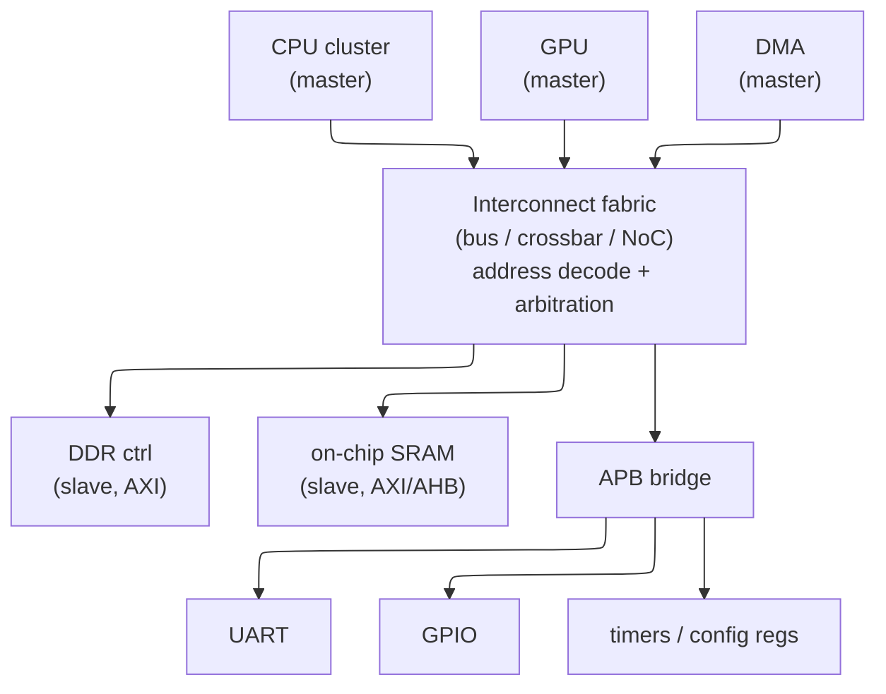
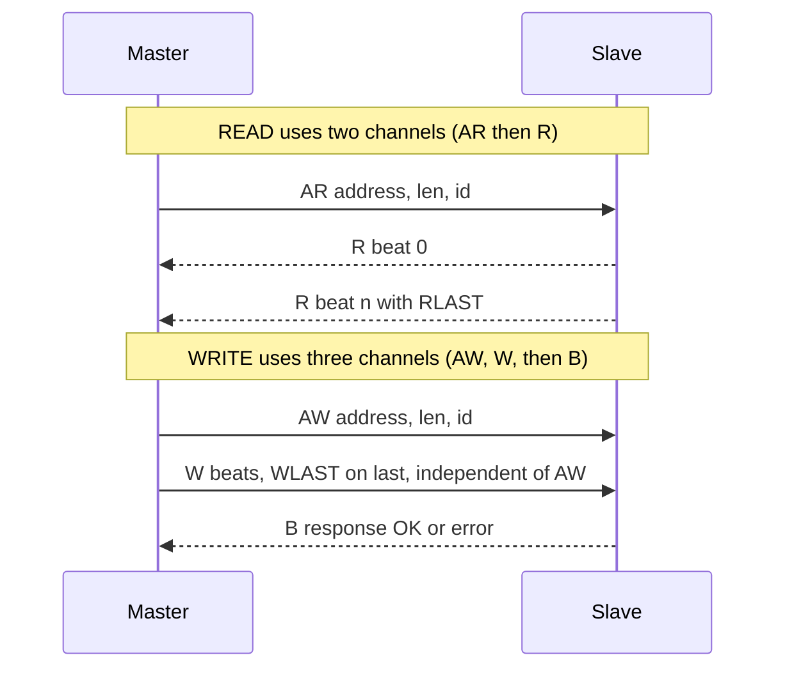
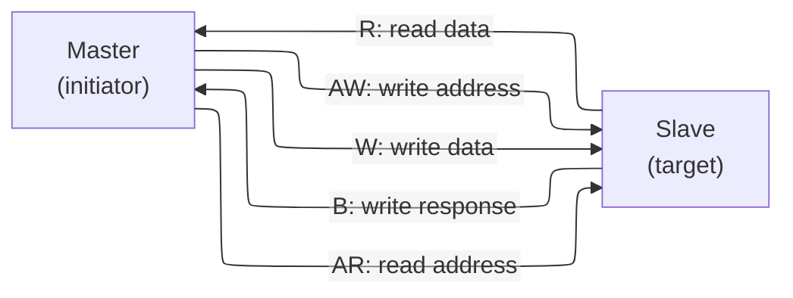
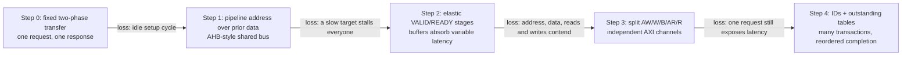
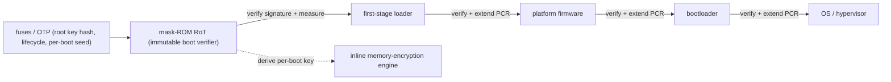

# On-Chip Transaction Protocols — From Simple Peripherals to Outstanding Work

> **First-time reader orientation:** Advanced Peripheral Bus (APB) serves simple low-bandwidth peripherals; Advanced High-performance Bus (AHB) pipelines a shared bus; Advanced eXtensible Interface (AXI) separates address, data, and response channels and supports multiple outstanding transactions. These protocols specify transfers and ordering at block boundaries, not the internal implementation of each block.

> **Abbreviation key — skim now and return as needed:** central processing unit (CPU); graphics processing unit (GPU); neural processing unit (NPU); system on chip (SoC); register-transfer level (RTL);
> power, performance, and area (PPA); instructions per cycle (IPC); memory-level parallelism (MLP); design-space exploration (DSE); out-of-order (OoO);
> translation lookaside buffer (TLB); reorder buffer (ROB); miss status holding register (MSHR); static random-access memory (SRAM); dynamic random-access memory (DRAM);
> double data rate (DDR); first in, first out (FIFO); network on chip (NoC); quality of service (QoS); direct memory access (DMA);
> Advanced eXtensible Interface (AXI); Advanced High-performance Bus (AHB); Advanced Peripheral Bus (APB); Advanced Microcontroller Bus Architecture (AMBA); AXI Coherency Extensions (ACE);
> Coherent Hub Interface (CHI); complementary metal-oxide-semiconductor (CMOS); clock-domain crossing (CDC); read after write (RAW); kilobyte (KB);
> megabyte (MB); gigabyte (GB); megahertz (MHz);
> root of trust (RoT); one-time programmable (OTP); trusted execution environment (TEE); Advanced Encryption Standard (AES); message authentication code (MAC); Platform Configuration Register (PCR).

> **Prerequisites:** [CPU_Architecture](../../01_CPU_Architecture/01_Core_Foundations/01_CPU_Architecture.md) (pipelining, stalls, the handshake discipline), [OoO_Execution](../../01_CPU_Architecture/03_Out_of_Order_Backend/01_OoO_Execution.md) (outstanding transactions, MLP, latency hiding — the same idea applied to a wire).
> **Hands off to:** [ACE_and_CHI](../../01_CPU_Architecture/06_Coherence_and_Consistency/03_ACE_and_CHI.md) (coherence riding on AXI's channels), [Network_on_Chip](../04_On_Chip_Networks/01_Network_on_Chip.md) (the packet fabric that replaces the crossbar at scale), [DDR_Controller](../02_Shared_Memory/01_DDR_Controller.md) (the memory the widest AXI port feeds), [Async_Design_and_CDC](../../../03_Frontend_RTL_and_Verification/06_Async_Design_and_CDC.md) (the metastability/FIFO physics behind CDC bridges).

---

## 0. Why this page exists

A modern SoC (system-on-chip) is not one design — it is *dozens to hundreds of independently designed IP (intellectual-property block) blocks* (CPU clusters, GPU, NPU (neural processing unit), DMA (direct memory access) engines, DDR controller, display, USB, UART, GPIO…) that must exchange data without any two teams having read each other's RTL (register-transfer level). The single idea that makes this possible is a **standardized on-chip interconnect protocol**: a fixed contract at each block's boundary so that the block can be designed, verified, and reused **without knowing what is on the other side or what fabric sits between**. AMBA (Advanced Microcontroller Bus Architecture) (AXI (Advanced eXtensible Interface)/AHB (Advanced High-performance Bus)/APB (Advanced Peripheral Bus)) is that contract, and everything on this page is a consequence of it.

This is a concept page, not a signal dictionary. Instead of listing `AWADDR`, `AWLEN`, `AWSIZE`… we ask the questions that generate them: *why does a standard interconnect exist at all* (§1); *why is the valid/ready handshake the universal flow-control primitive and not a fixed-timing contract* (§2); *why does high-throughput communication force AXI's five independent channels* (§3); *why do outstanding, ID-tagged, out-of-order transactions hide latency* — the bus analog of pipelining and memory-level parallelism (§4); *why bursts exist* (§5); and *why there is a three-tier family* — AXI, AHB, APB — rather than one protocol (§6, the central bandwidth-vs-complexity-vs-power trade). Topology (§7), bridges and clock-domain crossing (§8), and the policy sidebands (§9) then fall out. Signal tables, burst-encoding arithmetic, waveform cycle-dumps, and exclusive/atomic mechanics are deliberately cut; their *ideas* survive in the concept treatment. By the end you should be able to reason about a fabric quantitatively — size outstanding depth from Little's law, predict burst efficiency, and pick the right tier for a block — rather than recite port names.

---

## 1. The problem a standard interconnect solves: composing IP

Start from the pain a standard removes. Suppose $N$ blocks must talk and each pair uses a bespoke point-to-point interface. The wiring, the adapters, and the verification all grow as the number of pairs:

$$
\text{bespoke interfaces} \;\sim\; \binom{N}{2} \;=\; O(N^2)
$$

Nothing is reusable — a block wired to its neighbours' private conventions cannot be lifted into another SoC — and every new block re-opens the integration of every old one. A **standard interface** collapses this: each block speaks *one* protocol to a shared fabric, so integration cost is $O(N)$ and the fabric absorbs the cross-product. That is the whole value proposition, and it buys three separable things:

- **Reuse / composition.** A block that presents a spec-compliant AXI port drops into any AXI system — across SoCs, across vendors, across process nodes — because its contract is the protocol, not a neighbour.
- **Separation of concerns (independent verification).** Because the boundary is a published spec, a block is verified against *protocol Verification IP* (VIP), not against the rest of the chip. The same UVM environment and register model check it in isolation ([UVM_Methodology](../../../03_Frontend_RTL_and_Verification/10_UVM_Methodology.md)).
- **A swappable fabric.** The transport between blocks — shared bus, crossbar, or NoC (network-on-chip) — becomes a *separate design problem* (§7). You can replace a crossbar with a mesh without touching a single endpoint, because endpoints only ever saw the protocol.

The abstraction that makes this work is **memory-mapped, master/slave transactions**: every block is reachable at an address, a *master* (initiator: CPU, DMA, GPU) issues read/write transactions, a *slave* (target: memory, register block) responds, and an *address* is the one universal namespace. AXI, AHB, and APB are three points on a trade surface (§6) that all share this abstraction — which is exactly why they bridge cleanly into one another (§8).



The picture already contains §6's answer: the CPU→DDR path wants maximum bandwidth (AXI), the leaf peripherals want minimum area/power (APB behind one bridge). One chip, three tiers, because the requirements differ per edge.

---

## 2. The valid/ready handshake: flow control as *whether*, not *when*

Before any channel structure, one primitive underlies all of AMBA (and most on-chip streaming interfaces): the **VALID/READY handshake**. A transfer happens on a rising clock edge **iff both `VALID` (source has data) and `READY` (sink can accept) are high**. That is the entire mechanism. Its importance is easiest to see by asking what the naive alternative costs.

**Deriving the two wires from first principles.** Flow control must convey two *independent* facts, and each is privately owned: only the source knows whether it currently has data to give, and only the sink knows whether it currently has room to take. Two independent binary conditions cannot be carried on fewer than two bits of wire state — one driven by each party — because a single shared line could not distinguish "I have data" from "I have room," and the two conditions would alias. Name them `VALID` (source → sink, "data present") and `READY` (sink → source, "space available"). A transfer is legal exactly when *both* hold, so the transfer predicate is their **conjunction**, sampled synchronously:

$$
\text{transfer at clock edge } k \iff \text{VALID}_k \wedge \text{READY}_k.
$$

```wavedrom
{ "signal": [
  { "name": "ACLK",     "wave": "p......." },
  { "name": "VALID",    "wave": "0.1....0" },
  { "name": "READY",    "wave": "0...1..0" },
  { "name": "PAYLOAD",  "wave": "x.3....x", "data": ["beat A"] },
  { "name": "TRANSFER", "wave": "0...1..0" }
], "head": { "text": "VALID stays asserted and payload stays stable while READY applies backpressure" } }
```

The beat transfers only at the clock edge where both controls are high. Before that edge the sink is stalling, so the source must retain the same payload; after the edge the source may retire it or present the next beat.

Two bits, one AND, is therefore the *minimal sufficient* flow-control primitive — and every richer property (elasticity, backpressure, clock-domain crossing) is a consequence of this one conjunction. That the rule is an AND rather than, say, "move on `VALID` alone" is precisely what lets the sink refuse without loss: a beat offered but not accepted is simply re-offered on the next edge, so no data is created or destroyed by a stall. The two-wire cost is also why the handshake is *cheap enough to put on every channel and every pipeline stage* — the property that makes the whole fabric uniform (§3).

**Why not a fixed-timing contract?** The obvious protocol is a *timing contract*: "master asserts request in cycle 0; slave guarantees data in cycle $N$." It works for exactly one slave. It fails the moment you have:

- **Variable latency.** A cache hit and a DRAM miss differ by 100× ; a fixed $N$ cannot describe both. Real slaves have data-dependent latency.
- **Heterogeneous speeds.** The same interface must serve a 1-cycle SRAM and an off-chip flash. A single $N$ over-serves one and breaks the other.
- **Buffering, pipelining, and CDC (clock-domain crossing).** Insert a register stage on a long wire and every $N$ shifts — the contract breaks. You cannot close timing on a fabric, or cross a clock domain, under a fixed-latency promise.

VALID/READY replaces **when** with **whether**: the data moves on *any* cycle both sides agree, and latency becomes a *runtime* property rather than a *protocol constant*. This single move is what makes the fabric **elastic** — an arbitrary number of buffer/register stages can be inserted transparently, because each stage just re-handshakes. Backpressure and clock-domain crossing (§8) are then free consequences, not bolt-ons.

**The one asymmetry rule — a combinational-loop proof.** The handshake is symmetric except for a single constraint, and that constraint is *forced by correctness*, not a stylistic choice:

- **`VALID` must not depend on `READY`.** The source commits — it raises `VALID` when it has data, regardless of the sink.
- **`READY` *may* depend on `VALID`.** The sink is allowed to look before it leaps.

To see why one arc *must* be cut, suppose it were not — let both signals be combinational functions of the other, evaluated within the same cycle:

$$
\text{VALID} = f(\text{READY}), \qquad \text{READY} = g(\text{VALID}) \;\;\Longrightarrow\;\; \text{VALID} = f\!\big(g(\text{VALID})\big).
$$

That is a combinational cycle with no register in it, and such a loop has no well-defined synchronous value. Two cases exhaust the behaviour, and *both* are failures:

- **Deadlock (even number of inversions in the loop).** With the natural non-inverting policy — "I assert `VALID` once I see `READY`" and "I assert `READY` once I see `VALID`" — the state `VALID = READY = 0` is a fixed point: both-low is self-consistent, so the pair can sit idle *forever* even though the source has data and the sink has room. A spurious stable state that violates **liveness** (progress is possible but never forced).
- **Oscillation (odd number of inversions).** If the loop contains an odd inversion — e.g. a source that *drops* `VALID` the instant it sees `READY` ($f=\neg$) — then $\text{VALID} = \neg\,\text{VALID}$ has *no* fixed point at all; in real gates the node rings at the loop delay, a glitch generator that violates **safety**.

The minimal repair is to break exactly one arc — make one signal unconditional — which removes the cycle and leaves a well-posed synchronous update. The spec breaks the *source's* arc (`VALID` ⊥ `READY`) rather than the sink's for a definite reason: the source is the party that already *knows* whether it has data, so committing costs it nothing, whereas letting `READY` remain free to depend on `VALID` is what allows the sink to gate acceptance on real buffer space (the register slice, below). The companion **stability rule** — once `VALID` is asserted, the source holds it and the payload constant until the handshake completes — closes the last hole: it guarantees the offered beat cannot evaporate while the sink deliberates, so "the sink may take its time" never costs a lost transfer.

**Concretely, in RTL.** The whole primitive is a handful of lines. The transfer is one `AND`; the asymmetry and stability rules are just a statement about *which signals are registered*. Every AMBA channel — `AW`/`W`/`AR` driven by the master, `B`/`R` driven by the slave — is one instance of exactly this source side:

```systemverilog
// One VALID/READY channel, source side (a single elastic slot).
// A beat moves only on a clock edge where BOTH sides are high:
wire accept = VALID & READY;                  // the transfer predicate -- an AND
wire load   = have_data & (~VALID | accept);  // (re)fill the slot only when it is free

always_ff @(posedge ACLK)
  if (!ARESETn)    VALID <= 1'b0;
  else if (load)   VALID <= 1'b1;             // commit: raise VALID once data exists...
  else if (accept) VALID <= 1'b0;             // ...clear only after the beat is taken

always_ff @(posedge ACLK)
  if (load) PAYLOAD <= next_beat;             // payload changes only on (re)load, so
                                              // while (VALID && !READY) it holds stable
// VALID and PAYLOAD are flop outputs: they cannot COMBINATIONALLY chase READY, which
// is exactly the asymmetry rule that keeps the handshake free of a combinational loop.
```

Trace the three cases and the two rules fall out: with `VALID` high and `READY` low, `accept` and `load` are both `0`, so the flop holds `VALID` and `PAYLOAD` unchanged (stability); with both high and more data waiting, `load` stays `1`, so a fresh beat streams every cycle (100% throughput, no bubble); and because `VALID` is a register, its value this cycle never depends on `READY` this cycle (no loop). This one pattern, replicated per channel and buffered by the skid slice below, is the *entire* structural vocabulary of the fabric.

**Backpressure.** `READY` low is the sink saying *"not yet."* It propagates upstream: a stalled consumer deasserts `READY`, its producer's buffer fills and it deasserts *its* `READY`, and the stall ripples back to the origin with no data lost. This is the same producer/consumer discipline as a pipeline stall ([CPU_Architecture](../../01_CPU_Architecture/01_Core_Foundations/01_CPU_Architecture.md)) — a bus is just a very long, buffered pipeline.

**The elastic-buffer knee — why a register slice costs exactly one cycle and needs exactly two entries.** A `READY` that is combinational from `VALID` adds zero latency but threads a long timing path straight through the sink — often, once you chain fabric stages, the critical path of the whole interconnect. Registering `READY` breaks that path, but the flop makes the producer see the consumer's stall *one cycle late*, and that one cycle of blindness is the crux. In the cycle after the consumer deasserts, the producer — not yet informed — launches one more beat. To avoid dropping it the stage must be able to hold **two** beats: the one it is currently presenting, plus the one "skid" beat that arrives during the blind cycle. Hence the canonical **skid buffer / register slice** is a *2*-entry elastic buffer — the *minimum* structure that simultaneously registers both directions (one cycle of added latency, timing closed) **and** sustains 100% throughput (the second slot catches the in-flight beat, so no bubble is ever inserted by a transient stall).

Formally, let $r$ be the round-trip in cycles for backpressure to propagate from consumer to producer and take effect; a naive single register makes $r=1$, so up to $r=1$ beats can be in flight when `READY` drops, and the buffer depth must be $\ge r+1 = 2$ to lose none. One entry forces the naive fallback — deassert `READY` whenever the output is already `VALID` — which stalls every other cycle, a **50% duty** ceiling under any sustained backpressure. So the register slice is the atom of every AXI pipeline stage and every CDC bridge (§8): it converts "one more fabric hop" from a timing-closure crisis into a fixed *one-cycle* latency add at *zero* bandwidth cost — the exact property that lets the elasticity of this handshake scale to arbitrarily long, deeply pipelined fabrics.

---

## 3. Why AXI is five independent channels

Now derive AXI's shape from what *high-throughput* communication requires. A memory transaction has two natural phases — **address** (where/how much) and **data** (the payload) — and two independent directions — **read** and **write**. If you carry all of that on one shared, arbitrated wire (the AHB model, §6), then address and data contend for the same cycles, and reads and writes serialize behind one another. Every one of those couplings is a throughput ceiling. AXI removes them by giving each concern its **own VALID/READY channel**:

| Channel | Carries | Direction | Exists because |
|---|---|---|---|
| **AW** — write address | address + attributes of a write | master → slave | the *where* of a write can be sent before its data |
| **W** — write data | the write payload (+ byte strobes) | master → slave | data flows independently of its address |
| **B** — write response | completion / error status | slave → master | the master learns a write finished without blocking data |
| **AR** — read address | address + attributes of a read | master → slave | reads issue independently of any write |
| **R** — read data | the read payload (+ status) | slave → master | responses stream back on their own channel |

Read this as *five concerns that have independent timing, so they get independent flow control*. The consequences are exactly the throughput wins:

- **Read/write are full-duplex.** A read and a write can be in flight in the same cycle; there is no bus-turnaround bubble between a read and a write as on a shared tri-state bus.
- **Address runs ahead of data.** Because AW/AR handshake independently of W/R, the master can pour addresses into the fabric before any data returns — the precondition for outstanding transactions (§4).
- **Write completion is decoupled.** The separate B channel lets a master fire a write and pick up its acknowledgment later, rather than stalling the data path waiting for a status code.

**How the five channels compose one transaction.** The table lists the channels; the missing intuition is how they group. A *read* uses **two** channels — one `AR` address handshake, then the `R` data stream returning under it. A *write* uses **three** — `AW` (address) and `W` (data) flowing *independently* toward the slave, then a single `B` acknowledgement coming back. The return channels (`R`, `B`) are what let latency be a runtime property (§2): the master fires the address and picks the response up whenever it arrives, tagged to the right transaction (§4). Each arrow below is itself a VALID/READY stream from the RTL above.



**The bus-utilization argument — quantifying the gain over a shared phase.** Put a number on what each coupling costs. Model every transaction as a dead latency $L$ (address accepted → first data beat returned) followed by $n$ data beats, and measure utilization $\eta$ = fraction of cycles the *data* wires actually move data.

- **One shared address+data phase, one transaction at a time** (the naive limit): the bus is held for the whole $1 + L + n$ and can start nothing else, so $\eta = \dfrac{n}{1 + L + n}$ — for a single-beat access ($n{=}1$) to an $L{=}40$ slave, a dismal $1/42 \approx 2.4\%$.
- **Shared but address-pipelined** (AHB, §6): the address of transfer $i{+}1$ overlaps the data of transfer $i$, erasing the standalone address cycle — so a *fast* slave reaches the advertised $\eta \to 1$. But AHB is still *single-outstanding* and *half-duplex*: the dead time $L$ is exposed on every access, so a high-latency slave collapses to $\eta = \dfrac{n}{L+n} = 16/56 \approx 29\%$ at $n{=}16,\,L{=}40$, and a read and a write can never occupy the bus in the same cycle.
- **Five decoupled channels** (AXI): because AR/AW handshake independently of R/W, the address channel issues the *next* transaction's address *during* the current data phase — so $L$ is paid once and amortized across many outstanding transactions (§4), driving $\eta \to 1$ regardless of $L$. And because read data (R) and write data (W) are physically separate wires, a read and a write proceed *in the same cycle* — full duplex.

Multiplying the two independent wins, AXI extracts up to $\underbrace{\tfrac{L+n}{n}}_{\text{latency hiding}} \times \underbrace{2}_{\text{duplex}}$ the sustained bandwidth of the pipelined-shared bus on a high-latency mixed workload — here $\tfrac{56}{16}\times 2 \approx 7\times$. The decisive feature is that the latency-hiding factor is $(L+n)/n$, so **the advantage grows with $L$**: negligible for a 1-cycle SRAM, large for 40–100-cycle DRAM. The five channels are the structural *enabler*; §4's outstanding transactions are the *mechanism* that cashes the $L\to$hidden limit — and this latency-scaling is exactly why the tiered family (§6) exists rather than one universal protocol.

The essential state to remember is the *set of five channels and what decouples from what* — not the ~40 signals inside them. Each channel is "just" a VALID/READY stream (§2) with a payload; that uniformity is why the whole protocol pipelines, buffers, and bridges with one mechanism.



### 3.1 Build the protocol through four repairs: one transfer becomes an elastic transaction machine

The channel table is easier to remember when it is *derived as a sequence of repairs*. Start with the smallest correct register access and change the machine only when a workload demonstrates a concrete loss.



**Step 0 — a blocking two-phase access.** A minimal peripheral interface needs an address/data register, a state bit saying `SETUP` or `ACCESS`, and an error/completion input. In cycle 0 the initiator presents the request; in cycle 1 the target performs it and completes. Nothing else may start meanwhile. This is APB's virtue for configuration: the target has almost no queueing or ordering state. Its losing case is equally clear: even a zero-wait target uses at most one transfer every two cycles, and a slow target stretches the only transaction slot.

**Step 1 — overlap the next address with the current data.** Keep one shared transaction pipeline but add an address-phase pipeline register and an arbiter owner register. While transfer A occupies the data phase, transfer B's address can be decoded. That removes the compulsory setup bubble and produces the AHB-style one-beat-per-cycle fast path. The new state is small — current data-phase owner, next address/control, burst state, and response — but a target that inserts a wait state still freezes the shared pipeline. Reads and writes still share one address/control transaction stream—even though their data wires run in opposite directions—so they cannot proceed as independent full-duplex transactions.

**Step 2 — replace a timing promise with elasticity.** Put a VALID bit beside each payload register and a READY/backpressure path from its consumer. Now a stage advances when `VALID && READY`, not on a globally assumed cycle. A register slice or FIFO may be inserted without changing transaction semantics, so long wires, variable target latency, and clock/rate bridges no longer force every endpoint to change. What enables this is real state: the payload register, its occupancy/VALID bit, and—when READY is registered—the skid entry explained in §2. The price is one or more cycles of latency, buffer leakage/dynamic power, and a backpressure tree that must meet timing.

**Step 3 — split concerns whose service times are independent.** Elasticity alone does not help if an address waits behind data on the same channel or a read waits behind a write. AXI therefore duplicates the per-channel occupancy/handshake machinery five times. `AW` and `AR` queues hold addresses and attributes; `W` holds data and byte enables; `B` and `R` carry independently backpressured completions. The target also needs association state: a write cannot be committed until the accepted address and its data beats are matched, and the final beat/response must close exactly that transaction. Five channels cost wires, FIFO entries, arbiters, clock-tree load, and verification state; on a low-rate register bank those costs lose to APB because there is no useful overlap to recover.

**Step 4 — let multiple channel handshakes describe multiple unfinished transactions.** The initiator allocates an outstanding-table entry before sending an address. The entry records at least `{ID, read/write, destination/route, beats remaining, ordering domain, completion/error state}`. The fabric extends the ID with source identity, and each target or return network preserves it. A returning `RID`/`BID` selects the correct entry; the last beat frees it and wakes the original requester. This table—not the existence of `ARVALID`—is what converts independent channels into latency hiding. It costs storage, comparators, per-ID order tracking, timeout state, and enough response buffering to accept legal reordering.

The following trace shows why “independent” does not mean “unordered chaos.” Read A (`ID=0`) reaches a slow target; read B (`ID=1`) reaches a fast target one cycle later. Both addresses are accepted before either response exists. B may complete first because its ID names a different ordered stream; A still completes against its own entry.

```wavedrom
{ "signal": [
  { "name": "ACLK",       "wave": "p........." },
  { "name": "ARVALID",    "wave": "01.0......" },
  { "name": "ARREADY",    "wave": "01.0......" },
  { "name": "ARID",       "wave": "x34x......", "data": ["A: ID0 slow", "B: ID1 fast"] },
  { "name": "RVALID",     "wave": "0....10.10" },
  { "name": "RREADY",     "wave": "1........." },
  { "name": "RID/RDATA",  "wave": "x....5x.6x", "data": ["ID1: data B", "ID0: data A"] },
  { "name": "entry[ID1]", "wave": "0.1..0...." },
  { "name": "entry[ID0]", "wave": "01......0." }
], "head": { "text": "Two elastic address handshakes; completion is matched by ID, not by wall-clock order" } }
```

**When the richer machine loses.** AXI does not make one isolated register access faster: extra queue, arbitration, and pipeline stages often add latency. It wins only when overlap amortizes them. Too-shallow address/data FIFOs move the bottleneck rather than removing it; too many IDs expand every downstream table and response mux; registering every channel eases frequency but lengthens read latency; sharing buffers saves area but allows one channel/class to block another. Select the simplest tier whose concurrency covers the measured bandwidth–delay product.

**Make the evolution observable and provable.** Useful counters are accepted beats and stall cycles per channel, address-to-first-data and address-to-completion latency, outstanding-table high-water mark, reorder distance, per-ID head-of-line stall, target wait cycles, default-slave errors, and bridge FIFO occupancy. The minimum assertions are procedural:

- while `VALID && !READY`, payload and sidebands remain stable;
- every response ID names a live entry of the correct type, every entry completes once, and no entry is freed before its last beat;
- accepted beats never exceed declared burst length, and a write response cannot precede acceptance of its complete write;
- completions for the same ID preserve required order, while different IDs must not be falsely coupled;
- every accepted request eventually completes or returns a declared error under bounded target/fairness assumptions.

---

## 4. Outstanding, ID-tagged, out-of-order transactions: hiding latency

This is the section that makes AXI *fast*, and it is the same idea as everything in [OoO_Execution](../../01_CPU_Architecture/03_Out_of_Order_Backend/01_OoO_Execution.md) — applied to a wire.

**Why outstanding transactions exist (Little's law).** A slave (DRAM especially) answers with latency $L$. If the master issues one transaction, waits for its data, then issues the next, the data channel sits idle for $L$ every time and throughput collapses. How many transactions must be *in flight at once* to hide $L$ is answered exactly by **Little's law** — in steady state the population in a system equals arrival rate times residence time:

$$
N \;=\; \lambda \times L_{\text{full}},
$$

where $\lambda$ = completion throughput (transactions/cycle) and $L_{\text{full}}$ = a transaction's total time in flight (issue → completion). The bottleneck resource is the data channel: it retires one transaction's worth of data every $t$ cycles, where $t$ = beats per transaction (= burst length), so throughput *saturates* at $\lambda_{\max} = 1/t$. A transaction holds a tracking slot from address-issue until its last data beat, i.e. for $L_{\text{full}} = L + t$ ($L$ dead + $t$ streaming). Setting $\lambda = \lambda_{\max}$ gives the outstanding depth that just saturates the slave:

$$
\boxed{\,N_{\text{out}} \;=\; \Big\lceil \frac{L_{\text{full}}}{t} \Big\rceil \;=\; \Big\lceil \frac{L}{t} \Big\rceil + 1\,}
\qquad
\text{where } L=\text{dead latency (addr→first data)},\ t=\text{beats per transaction}.
$$

Read it as "$\lceil L/t\rceil$ transactions to blanket the dead latency, plus the one currently streaming." Equivalently, in bytes you must keep $B\times L$ **bytes in flight** — the classic **bandwidth–delay product** ($B$ = byte bandwidth). Because AW/AR handshake independently of R/W (§3), the master *can* launch those addresses before any data returns; the count it is allowed to leave unfinished is its **outstanding depth**. This is precisely the OoO core keeping many loads in flight against DRAM, and precisely a non-blocking cache's MSHRs (miss-status handling register).

Below saturation the data-channel utilization ramps linearly with depth and then clamps at $N_{\text{out}}$ — a hard knee, not an asymptote:

$$
\eta(N) \;=\; \min\!\Big(\frac{N\,t}{\,L+t\,},\ 1\Big),
$$

so each added in-flight transaction buys $t/(L{+}t)$ of peak until the pipe fills at $N_{\text{out}}$, after which more outstanding buys **nothing**. (This continuous-issue result — a pipelined slave streaming back-to-back responses — is the correct model; a *stop-and-wait* master that drains a whole batch before issuing the next would instead see the strictly worse $\eta = Nt/(Nt+L)$, which never reaches 100% at finite $N$ and is not how a bandwidth-seeking AXI master behaves.) Depth is therefore sized to the bandwidth–delay product of the *slowest* slave the port talks to and stopped there, since beyond $N_{\text{out}}$ every extra slot is tracking state and buffering (§8) with zero return.

*Worked number — hide a 40-cycle memory slave.* A read burst of $t=16$ beats to an $L=40$-cycle slave needs $N_{\text{out}} = \lceil 40/16\rceil + 1 = 3 + 1 = 4$ outstanding to keep the data channel full. The ramp is $N{=}1 \Rightarrow \eta = 16/56 = 29\%$; $N{=}2 \Rightarrow 57\%$; $N{=}3 \Rightarrow 86\%$ (the three that blanket the dead time); $N{=}4 \Rightarrow 100\%$. The depth tracks the bandwidth–delay product, not the slave's raw speed — the same reason an OoO ROB (reorder buffer) is sized to $\sim\!\text{IPC}\times L_{\text{miss}}$.

*Worked number — why single-beat traffic is hopeless, and why bursts rescue it.* Drop to single-beat accesses ($t=1$) against the same $L=40$: now $N_{\text{out}} = \lceil 40/1\rceil + 1 = 41$ outstanding transactions to saturate. A master that can track only a handful cannot hide DRAM latency one beat at a time. Raising the burst to $t=16$ collapses the requirement to $4$ — a $\sim\!10\times$ cut in tracking state. **Bursts (§5) and outstanding depth (§4) are one lever seen twice:** a longer burst raises $t$, so $N_{\text{out}}\propto L/t$ falls, which is why real fabrics burst *and* keep a modest outstanding depth rather than tracking hundreds of tiny transactions.

*The cost of too few slots or IDs.* If the master's outstanding-tracking buffer holds only $N_{\max} < N_{\text{out}}$ transactions, throughput is capped at $\eta(N_{\max}) = N_{\max}\,t/(L{+}t)$: two slots against a need of four leave the DDR port at $32/56 \approx 57\%$ no matter how fast the DRAM is. Worse, if all outstanding transactions share **one ID** (next paragraph), the per-ID ordering rule forces in-order completion, so a single slow response *head-of-line blocks* everything queued behind it — the concurrency the outstanding slots paid for is thrown away unless distinct IDs let the fast responses pass (quantified in §7).

**Why IDs, and why they enable *out-of-order* completion.** Once many transactions are outstanding, a fast slave (SRAM) may be ready before a slow one (DRAM) issued earlier. Forcing strict return order would let the slow response *head-of-line block* the fast one — throwing away the concurrency you just paid for. AXI tags every transaction with an **ID** and defines ordering *per ID*:

- **Same ID → ordered.** Transactions sharing an ID are one logical stream and must complete in issue order.
- **Different ID → reorderable.** The fabric and slaves may return them in any order.

That is exactly the renaming/ROB logic of an OoO core: a shared ID is a dependence chain that must stay ordered (like a RAW chain on one architectural register); distinct IDs are *independent* work that may overlap and complete out of order (like independent instructions overlapping cache misses to build MLP (memory-level parallelism)). The ID on the response (`RID`/`BID`) is the completion *tag* that tells the master which stream a returning beat belongs to — the bus analog of the common-data-bus tag that wakes the right consumer. A master that wants strict global order simply uses one ID; a master that wants maximum concurrency spreads IDs across independent streams.

**The trade-offs this opens:**
- *Outstanding depth vs area.* Every in-flight transaction needs a tracking slot and reorder buffering; depth is sized to the BW-delay product of the *slowest* slave it talks to, no deeper.
- *ID width vs reorder freedom.* More ID bits = more independent streams the fabric can juggle, at more buffering and more complex reorder logic.
- *Ordering vs simplicity.* AXI3 allowed **write-data interleaving** (data from different write transactions mixed on W, tagged by `WID`); AXI4 **removed** it because it complicated every slave and interconnect for a benefit almost nobody used. The general rule — weaker ordering buys concurrency but costs verification state-space — is why AXI4 keeps read reordering (high value) but drops write interleaving (low value).

**The one hard boundary: 4 KB.** A single burst may not cross a 4 KB address boundary. This is load-bearing: 4 KB is the minimum page size, so the rule guarantees a burst stays within one page and therefore within one slave and one protection region — the interconnect can route and permission-check a whole burst from its start address alone, without splitting mid-burst.

---

## 5. Bursts: amortizing the address phase

Every transaction pays for one address handshake. When the data is *sequential* — a cache-line fill, a DMA block, a framebuffer scan — sending a fresh address per beat is pure overhead. A **burst** sends the address once and streams $n$ data beats under it. The payoff is the same amortization curve as any fixed-cost-per-batch system:

$$
\eta_{\text{burst}} \;=\; \frac{n}{n + c},\qquad
\text{where } n=\text{beats per burst},\ c=\text{address/overhead beats amortized over the burst.}
$$

A single-beat access ($n{=}1$) wastes half its cycles on address overhead; a long burst ($n{=}16$) runs at ~94% of the raw wire bandwidth. This is *the* reason DMA and cache traffic use long bursts and register accesses do not — random single-word accesses cannot amortize the address and live near 50% efficiency.

**Deriving the amortization curve.** Charge each transaction a fixed overhead of $o$ "wasted" beats — the address handshake, the arbitration cycle to win the channel, and, at the DRAM, the row-activate/precharge command setup — *independent of how much data follows*. Writing $B$ for the useful beats (the $n$ above) and $o$ for that overhead (the $c$ above), a burst delivers $B$ data beats out of $B + o$ occupied beats:

$$
\eta_{\text{burst}} \;=\; \frac{B}{B + o}\ \text{of peak,}\qquad
\text{where } B=\text{data beats per burst},\ o=\text{fixed overhead beats amortized over the burst}
$$

— the universal fixed-cost-per-batch law (identical in shape to amortizing a function prologue over a loop body, or a DRAM row-open over a row of column reads). Its *curvature* is the whole story: the marginal value of one more beat is $\partial\eta/\partial B = o/(B+o)^2$, which falls as $1/B^2$, so the first few beats recover almost all the loss and beyond a point extra length is nearly-free bandwidth. With a minimal $o=1$: $B{=}1 \Rightarrow \tfrac12 = 50\%$, $B{=}4 \Rightarrow \tfrac45 = 80\%$, $B{=}16 \Rightarrow \tfrac{16}{17} = 94\%$, $B{=}64 \Rightarrow 98.5\%$, $B{=}256 \Rightarrow 99.6\%$ — a $16\times$ longer burst ($16\to256$) buys only the last $\sim\!6\%$.

**On AXI the overhead is not stolen data cycles — a subtlety worth stating.** Because AR/AW are *separate channels* from R/W (§3), an address handshake does not literally consume a data-channel cycle as it does on a shared bus. On AXI the burst payoff instead appears as (i) *outstanding-depth relief* — a longer burst raises the issue interval $t$, so $N_{\text{out}}=\lceil L/t\rceil{+}1$ falls (§4), letting a modest tracking buffer saturate the pipe; (ii) *address/arbitration headroom* — one address feeding $B$ beats leaves the AR channel $1/B$ utilized, so arbitration jitter cannot starve the data stream; and (iii) *DRAM command amortization* — the row-open is spread over $B$ column reads ([DDR_Controller](../02_Shared_Memory/01_DDR_Controller.md)). The $B/(B+o)$ curve is the same; $o$ is merely relabeled from "address cycles" to "per-transaction overhead."

**Why not always burst to the maximum — the latency/fairness cost.** A burst is *non-preemptible*: once a slave begins streaming $B$ beats it holds the data channel for $B$ cycles, so a competing master — however urgent — waits. Under round-robin arbitration across $M$ masters each running length-$B$ bursts, the worst-case wait a master suffers before its turn is

$$
t_{\text{wait}}^{\max} \;\approx\; (M-1)\,B \ \text{cycles},
$$

which grows *linearly in the very $B$ that improved bandwidth*. Concretely, $M{=}4$ masters at $B{=}256$ beats inflict up to $3\times256 = 768$ cycles ($\sim\!3.8\,\mu$s at 200 MHz) of head-of-line latency on a latency-sensitive peer — intolerable for, say, a display controller's real-time fetch (§9 QoS (quality of service)). This is the bandwidth-vs-tail-latency knee: long bursts win throughput and lose fairness, so fabrics cap burst length, and lean on QoS (§9) and interleaving to bound the tail. The **4 KB boundary** (§4) sets a hard ceiling too: at a 128-bit data width (16 B/beat), $256\ \text{beats}\times 16\ \text{B} = 4096\ \text{B}$ — a maximal AXI4 burst *exactly* fills one 4 KB page, and at wider buses the 4 KB rule, not `AxLEN`, becomes the binding limit (a 512-bit bus tops out at $4096/64 = 64$ beats).

Three burst *kinds* exist as points on a use-case space (the address arithmetic is not worth memorizing):
- **INCR** — addresses increment; the workhorse for sequential block moves.
- **WRAP** — addresses increment then wrap to an aligned boundary; this is **critical-word-first cache-line fill** — start at the word the CPU stalled on so it can resume immediately, then wrap to fill the rest of the line ([Cache_Microarchitecture](../../01_CPU_Architecture/04_Cache_Hierarchy/01_Cache_Microarchitecture.md)).
- **FIXED** — the same address every beat; for streaming a peripheral data port (e.g. a FIFO register) rather than a memory region.

**Byte strobes as a concept.** Real writes are not always full-width or aligned: a 32-bit store on a 128-bit bus, or an unaligned copy, touches only some byte lanes. Rather than special-case each, AXI carries a **write strobe** (`WSTRB`) — one enable bit per byte lane — and the slave writes only the enabled bytes. Narrow and unaligned transfers then need no separate mechanism: they are just bursts with the appropriate lanes masked. Keep the *idea* (per-byte enables make width/alignment a data-plane detail); the lane-by-lane arithmetic is mechanical.

---

## 6. The three-tier family: AXI vs AHB vs APB as a PPA trade

Why does AMBA ship *three* protocols instead of one? Because a single design point cannot be simultaneously high-bandwidth and low-area/low-power, and a real SoC needs both — on different edges. The family is a **bandwidth ↔ complexity ↔ power** trade, and each tier is one point on it:

| | **APB** (peripheral) | **AHB** (legacy fabric) | **AXI** (high-perf fabric) |
|---|---|---|---|
| Channels | 1 (shared) | 1 (shared, addr-pipelined) | 5 (independent) |
| Pipelining | none | address-phase overlap | full, per channel |
| Burst / outstanding / OoO | no / no / no | yes / no / no | yes / yes / yes |
| Cost per transfer | 2 cycles | ~1 cycle (pipelined) | ~1 beat/cycle × wide, deep |
| Relative slave complexity | ~hundreds of gates | moderate | thousands of gates + reorder |
| Optimized for | **area / power** | moderate BW, simplicity | **throughput / concurrency** |
| Use | UART, GPIO, config regs | on-chip SRAM, DMA (legacy) | DDR, GPU, CPU cluster |

**Quantified positioning — the trade is one axis, and it is $L$.** The three tiers span roughly two orders of magnitude in both throughput and cost, and the axes move together:

| | APB | AHB(-Lite) | AXI |
|---|---|---|---|
| Sustained throughput | $\le\tfrac12$ beat/cyc (2-cycle transfer) | $\to 1$ beat/cyc (fast slave); $\to \tfrac{n}{L+n}$ (slow) | $\to 1$ beat/cyc/channel, $\times 2$ duplex, $\times$ width |
| Latency hiding | none ($L$ fully exposed) | none (single-outstanding) | full ($N_{\text{out}}$ hides $L$, §4) |
| Slave complexity | $\sim$ few hundred gates | $\sim$ few $\times10^3$ gates | $\sim 10^4$ gates + reorder buffers |
| Energy per transfer | lowest (no pipeline, no tracking) | low | highest (channels + tracking leak even idle) |

The positioning rule drops straight out of §3's latency-scaling result: AXI's benefit over AHB is the factor $\approx \tfrac{L+n}{n}\times 2$ (latency-hiding $\times$ duplex), which is **large only when $L$ is large**. So AXI earns its $\sim\!30\times$ slave-gate cost exactly on high-$L$, bandwidth-critical edges — DDR at $L\sim100$ gives $\tfrac{116}{16}\approx 7\times$ from latency hiding alone, up to $\sim\!14\times$ with duplex — and is pure waste on a low-$L$ register ($L\sim1 \Rightarrow$ gain $\approx 1$). APB sits at the opposite corner: its 2-cycle transfer caps throughput at $\tfrac12$ beat/cycle, but a leaf peripheral moving a few bytes per boot never notices, and the few-hundred-gate slave is what lets 50–100 of them share one bridge. AHB is the middle — $\sim\!1$ beat/cycle for cheap, no latency hiding — which is why it survives only as AHB-Lite on low-$L$ on-chip SRAM/ROM. **The family is one trade surface; each tier is the cost-minimal point for its edge's $L$ and bandwidth.**

**APB — optimize for simplicity, because the traffic is trivial.** A UART or a GPIO or a config register is touched rarely and moves a handful of bytes. Spending AXI's five channels, ID tracking, and reorder logic on it is pure waste — of area, of leakage power, and of verification effort. APB is deliberately minimal: one channel, no pipeline, no burst, no outstanding, a two-phase (SETUP → ACCESS) transfer that costs 2 cycles. The quantitative argument is decisive: a chip may have 50–100 leaf peripherals; giving each a full-AXI port would multiply the interconnect's gate count and verification surface by that count, whereas hanging them all off **one** AXI-to-APB bridge (§8) spends AXI complexity *once* and APB's few-hundred-gate cost per leaf. That 50–100× saving on structures that never needed bandwidth is why APB is not going away.

**AHB — the middle that history left behind.** AHB is a *single, shared, pipelined* bus: the address phase of transfer $n{+}1$ overlaps the data phase of transfer $n$, so it sustains ~1 transfer/cycle — double APB — without AXI's channel count. But it is fundamentally one-transaction-at-a-time and arbitrated: a slow slave stalls the whole bus (the historical SPLIT/RETRY responses existed precisely to let the arbiter reclaim the bus from a slow slave, an ancestor of AXI's outstanding model). AHB has largely collapsed to **AHB-Lite** — single-master, no arbitration, no SPLIT/RETRY — used for a simple subsystem where one master talks to a few SRAM/ROM slaves and AXI would be overkill. Treat full AHB as legacy; its ideas (address pipelining, bursts) were absorbed and generalized by AXI.

**AXI — pay maximum complexity for maximum concurrency.** Everything in §3–§5 is AXI spending gates to remove couplings: five channels (no address/data or read/write contention), outstanding + OoO (latency hiding), long bursts (address amortization). It earns that cost only where bandwidth dominates — the DDR path, the GPU, the CPU cluster — which is why it anchors the SoC backbone (ARM CoreLink NIC-400 class interconnects, AMD/Xilinx Zynq PS↔PL ports, virtually every mobile application processor).

**Two AXI *dialects* fill out the space:**
- **AXI4-Lite** — AXI's channel structure and handshake, but single-beat, no IDs, no bursts. It is the register-interface point: a control/status block wants AXI's toolchain and VIP but none of its throughput, and dropping burst/outstanding logic cuts slave gate count by ~50–70% versus full AXI.
- **AXI4-Stream** — pure dataflow: **no address at all**, just `TVALID`/`TREADY`/`TDATA` with a `TLAST` packet marker. For video, DSP (digital signal processor), and networking there is no random access — data simply *flows* from producer to consumer — so the entire address apparatus is removed and only the §2 handshake (plus backpressure) remains. It is the clearest proof that the handshake, not the address, is the irreducible core.

The system-level picture is separation of concerns made physical: **AXI backbone, AHB-Lite subsystems, APB peripheral leaves behind a bridge** — complexity spent exactly where bandwidth is, and nowhere else.

---

## 7. Topology: the fabric as a separate, scalable concern

Because endpoints only see the protocol (§1), the *transport* is free to be whatever scales best. Three points on the topology curve:

| Topology | Concurrent paths | Area | Scales to | Why it stops |
|---|---|---|---|---|
| Shared bus | 1 | $O(M{+}S)$ | a handful of masters | one transfer at a time; arbitration + wire capacitance bottleneck |
| Crossbar | $\min(M,S)$ | $O(M\times S)$ | ~8–16 ports | area/wiring grow **quadratically** in port count |
| NoC (mesh) | many | $O(N)$ | 100s of nodes | — (see [Network_on_Chip](../04_On_Chip_Networks/01_Network_on_Chip.md)) |

The crossbar's $O(M\times S)$ area is the knee: it gives full concurrency (any master to any free slave in parallel) but its cost explodes past ~8–16 ports, which is exactly where a packet-switched **NoC** — routers, links, $O(N)$ area, many concurrent flows — takes over (ARM CMN-600/700 meshes in Neoverse, [Network_on_Chip](../04_On_Chip_Networks/01_Network_on_Chip.md)). The fabric changed; not one endpoint did.

**Deriving the crossbar's $O(M\times S)$ area.** A crossbar must let *any* master reach *any* slave, and let disjoint master→slave pairs transfer *simultaneously*. Concurrency forbids sharing one datapath, so realize it as one $M$-to-1 multiplexer at each slave input (any of $M$ masters may drive it) plus one $S$-to-1 multiplexer on each master's return path — $S$ muxes of $M$ inputs plus $M$ muxes of $S$ inputs, i.e. $2MS$ selectors — and the data wires form an $M\times S$ grid of crosspoints, each carrying a $w$-bit bus. Both switch logic and wiring therefore scale as

$$
A_{\text{crossbar}} \;=\; \Theta(M \times S \times w),\qquad
\text{where } M=\#\text{masters},\ S=\#\text{slaves},\ w=\text{bus width}.
$$

Contrast the shared bus: one wire set with $M$ drivers and $S$ taps, $A=\Theta((M{+}S)\,w)$ — linear, but only *one* transfer at a time. The crossbar buys full concurrency (up to $\min(M,S)$ simultaneous transfers — no more, since each slave serves one master and each master drives one slave per cycle) at a *quadratic* area price. That quadratic is the knee: doubling ports quadruples the crossbar. *Worked number:* $8\times8 = 64$ crosspoints, $16\times16 = 256$, $32\times32 = 1024$ — a $4\times$ port growth ($8\to32$) is a $16\times$ area growth, which no floorplan absorbs, so past ~8–16 ports the $\Theta(N)$ NoC wins.

**The arbitration fairness/latency trade.** When $k$ masters contend for one slave, the arbiter picks an order, and the policy is a direct fairness-vs-latency choice:
- **Round-robin** guarantees a *bounded* wait — at most $(k-1)$ turns — but gives every master equal priority, so a latency-critical master cannot jump the queue; with length-$B$ bursts its worst-case wait is $(k-1)B$ cycles.
- **Fixed-priority** gives the top master near-zero latency but *unbounded* wait (starvation) for the lowest — acceptable only if high-priority traffic is bounded.
- **Weighted / QoS** (§9) interpolates: bandwidth shares proportional to weights, with per-transaction urgency injected.

The trade is fundamental: because a single contended slave *serializes* its masters, you cannot give every master both minimum latency and a fair share at once — you can only choose *who waits*. *Worked number:* $k{=}4$ masters, $B{=}16$-beat bursts, round-robin → a master waits up to $3\times16 = 48$ cycles (240 ns @ 200 MHz); fixed-priority cuts the top master to $\sim\!0$ but can starve the bottom indefinitely under sustained load.

**Head-of-line blocking without enough IDs.** The outstanding machinery of §4 delivers concurrency *only* if independent transactions can pass each other. A stream that reuses **one ID** is, by the per-ID ordering rule, a single FIFO: a response stuck behind a slow one cannot be overtaken, even to a different slave. Quantify it — a master interleaves reads to a fast SRAM ($L_f=4$) and a slow DRAM ($L_s=40$) through one ID; because completion must follow issue order, a DRAM read issued first pins a following SRAM read behind it for the full $L_s$, so a pair that *could* have overlapped in $\max(L_f,L_s)=40$ cycles instead takes $L_s+L_f=44$ and serializes on every such pair, collapsing the ordered stream's throughput toward $1/(L_s+L_f)$ transactions/cycle. Giving the two destinations **distinct IDs** lets the fast response return first, so the stream overlaps and runs at §4's bandwidth-delay-product limit. The number of IDs a master needs is thus set by the number of *independent latency classes* it wants in flight at once; too few re-serializes the very concurrency the outstanding depth paid for — which is also why the fabric must widen IDs with master bits (below), so two masters' reused IDs cannot alias into one false ordering chain.

Two invariants any fabric must uphold, both derived from correctness rather than performance:
- **Address decode + a default slave.** The fabric routes by decoding the address; an access to an *unmapped* region must be steered to a **default slave** that returns an error, because the alternative — no slave responds, `READY`/`VALID` never complete — hangs the master forever. "Someone must always answer, even if only to say no" is a liveness requirement, not an optimization.
- **ID-width expansion.** Two different masters may innocently use the *same* transaction ID. If both reach one slave, their responses would be indistinguishable and the per-ID ordering rule (§4) would be violated. The interconnect prevents this by **prepending master-identifying bits** to the ID on the way in (widening it to $\text{ID\_WIDTH} + \lceil\log_2 M\rceil$) and stripping them on the way back — so streams from different masters are always distinct IDs at the slave. It is the fabric's version of renaming a namespace to avoid false collisions.

Arbitration policy (round-robin for fairness, fixed-priority for latency, weighted for differentiated service) is the last fabric concern; QoS (§9) is how a transaction influences it.

---

## 8. Bridges: everything reduces to buffering behind a handshake

A **bridge** sits wherever two interfaces disagree — different protocol, different width, different rate, different clock — and *every* such adapter reduces to the same recipe: **two VALID/READY interfaces with a buffer between them.** The elasticity of §2 is what makes this legal; a FIFO can sit in the middle of a handshake transparently because each side just re-handshakes against the FIFO.

- **Protocol bridge (e.g. AXI → APB).** Accept the rich transaction on one side, drive the poorer protocol's sequence on the other, funnel status back. An AXI burst becomes a series of APB single transfers; the bridge is a small state machine plus the backpressure to stall AXI while APB grinds through its 2-cycle transfers. (This is why one bridge can serve a whole APB peripheral island — §6.)
- **Width bridge (down/up-sizer).** A 128-bit master to a 32-bit slave: one wide beat becomes four narrow beats (adjust address, split `WSTRB`, accumulate the worst error into one response). Width mismatch is just a beat-count transform behind the handshake.
- **Rate bridge.** Different clock frequencies, *same* clock source: a FIFO decouples a fast producer from a slow consumer; backpressure (§2) does the throttling with zero protocol changes.

**CDC bridges — the interesting case.** When master and slave live in **asynchronous clock domains** (a 500 MHz CPU issuing to a 200 MHz peripheral island), a signal sampled near its transition can go **metastable** and resolve unpredictably, corrupting the handshake state machines. You cannot naively wire VALID/READY across the boundary. The canonical solution is an **asynchronous FIFO**: data is written in the source clock and read in the destination clock, and the *only* thing that crosses each way is a **pointer**, encoded in **Gray code** and passed through a **two-flop synchronizer**. The two ideas are worth carrying:

- *Why Gray code:* consecutive values differ by exactly **one bit**, so a pointer sampled mid-transition resolves to either the old or the new value — never a garbage intermediate. (A binary pointer with several bits changing at once could resolve to any combination.)
- *Why two flops:* the first flop may catch metastability; the second gives it a full clock period to resolve, driving the failure rate down to negligibility. The mean time between failures is

$$
\text{MTBF} \;=\; \frac{e^{t_s/\tau}}{W \cdot f_{\text{src}} \cdot f_{\text{dst}}},\qquad
\text{where } t_s=\text{settling time available},\ \tau,W=\text{technology metastability constants},\ f=\text{domain clocks.}
$$

The exponential in $t_s$ is why one extra flop (one more $t_s$ worth of settling) buys astronomical MTBF and two flops suffice for almost all SoC crossings. This page uses CDC bridges as a *concept*; the full metastability derivation, the MTBF numbers, and the production Gray-code FIFO live in [Async_Design_and_CDC](../../../03_Frontend_RTL_and_Verification/06_Async_Design_and_CDC.md) §1, §5 and are signed off by the static checks in [Lint_CDC_RDC_Signoff](../../../03_Frontend_RTL_and_Verification/07_Lint_CDC_RDC_Signoff.md). The point here is architectural: because AXI is per-channel VALID/READY, a CDC bridge is *five independent async FIFOs* (one per channel, B and R running the reverse direction) — the protocol's uniformity makes crossing clocks mechanical.

---

## 9. Policy sidebands: QoS, security, and atomics

A shared fabric needs more than data movement — it needs *policy*. AXI carries a few orthogonal sideband fields alongside every transaction; they are hints/attributes, not part of the data plane, and they exist because the fabric is shared.

**QoS — arbitration priority.** With many masters contending for one slave (the DDR controller especially), the fabric must choose an order, and pure fairness is wrong for real-time traffic. Each transaction carries a 4-bit **QoS** value (0–15); the arbiter favours higher QoS. The load-bearing example is a **display controller**: it must never underrun its line FIFO or the screen tears, so it raises QoS *dynamically* — low when its FIFO is full (yield bandwidth to others), maximum when the FIFO is nearly empty (an under-run is imminent and non-negotiable). This is how a throughput-optimal DRAM schedule ([DDR_Controller](../02_Shared_Memory/01_DDR_Controller.md) §5) is overridden by hard deadlines: the `AxQOS` tag carries the urgency into the memory scheduler.

**Security — access control at the fabric.** ARM TrustZone partitions the system into Secure and Non-secure worlds, and the partition is enforced *on the bus*: every transaction carries an `AxPROT` bit declaring secure vs non-secure, and a filter (TrustZone Controller) at the fabric/memory boundary checks each access against a region table, returning an error and raising an interrupt on a violation. The concept is the important part — **the interconnect is the natural chokepoint for a hardware security boundary**, because every access to protected memory must pass through it — not the bit encodings.

**Atomics — pushing read-modify-write to the slave.** A lock or counter update is a read-modify-write that must be indivisible. AXI4 does this with **exclusive access** (an exclusive read then a conditional exclusive write, retried on contention) — two round trips plus a retry loop. AXI5 adds **far-atomics (ATOP)**: the master sends the operation (add, swap, compare-and-swap…) in a *single* transaction and the *slave* performs the read-modify-write internally, collapsing two round trips (plus retries) to one. The mechanics and the operation tables are out of scope here; the concept is the same round-trip-reduction logic that motivates outstanding transactions and bursts — *do the work where the data is, and cross the fabric as few times as possible.* Full coherent/atomic protocols are the subject of [ACE_and_CHI](../../01_CPU_Architecture/06_Coherence_and_Consistency/03_ACE_and_CHI.md).

---

## 10. Numbers to memorize

| Quantity | Value | Why / section |
|---|---|---|
| AXI independent channels | **5** (AW, W, B, AR, R) | decouple addr/data and read/write (§3) |
| APB transfer cost | **2 cycles** (SETUP → ACCESS) | minimal, no pipeline (§6) |
| AHB throughput | **~1 transfer/cycle** (pipelined) | address/data overlap (§6) |
| AXI raw bandwidth | $\text{width}\times f/8$ | e.g. 64 b @ 200 MHz = **1.6 GB/s** (§10) |
| Data-bus widths | 32 / 64 / 128 / 256 / 512 / 1024 b | width is the first bandwidth lever (§6) |
| Burst efficiency | $B/(B{+}o)$ | 1 beat ≈ 50%, 16 ≈ **94%**, 256 ≈ 99.6% (§5) |
| Outstanding to saturate a slave | $N_{\text{out}}=\lceil L/t\rceil{+}1$ | BW-delay product / Little's law (§4) |
| AXI-over-AHB bandwidth gain | $\sim\tfrac{L+n}{n}\times 2$ | latency-hiding × duplex; grows with $L$ (§3, §6) |
| Round-robin worst-case wait | $(k{-}1)B$ cycles | fairness vs latency at one slave (§7) |
| Burst address boundary | **4 KB** (never crossed) | one page → one slave/region (§4) |
| Max burst length | **256** beats (AXI4), 16 (AXI3) | `AxLEN` is 8 bits in AXI4 (§5) |
| Read ordering | same ID in-order, **diff ID reorderable** | ID = completion tag / dependence chain (§4) |
| AXI4-Lite gate saving | **50–70%** vs full AXI | drops burst/outstanding logic (§6) |
| APB leaf saving | ~50–100 peripherals behind **1** bridge | spend AXI complexity once (§6) |
| Crossbar area | $O(M\times S)$ | quadratic knee at ~8–16 ports (§7) |
| Slave-side ID width | $\text{ID\_W} + \lceil\log_2 M\rceil$ | fabric prepends master bits (§7) |
| CDC crossing | Gray-code pointer + **2-flop** sync | one-bit-change + MTBF (§8) |
| QoS field | **4 bits**, 0–15 | arbitration priority (§9) |
| Chain of trust | each stage verifies+measures the next | induction from an immutable RoT (§12) |
| Memory-encryption MAC | 8 B / 64 B line = **12.5%** | integrity storage/BW overhead (§12) |
| CTR-mode encryption latency | **~0** on the read critical path | keystream precomputed from address+counter (§12) |
| Counter-tree depth | $\lceil\log_{\text{arity}}(\text{lines})\rceil$ (≈5 @ 4 GB, arity 64) | replay protection (§12) |

**Bandwidth-hiding intuition (why outstanding is mandatory for DRAM):** at a 40-cycle DDR read latency with 16-beat bursts, $\eta = \min(Nt/(L{+}t),1)$ gives 1 outstanding ≈ 29% of peak, 2 ≈ 57%, 3 ≈ 86%, and $N_{\text{out}}=\lceil 40/16\rceil{+}1 = 4$ ≈ 100% — a *hard* knee, not an asymptote. The address channel must run far ahead of the data — the bus form of MLP.

---

## 11. Worked problems

**1 — Size the outstanding depth for a DDR port (Little's law).** A 64-bit AXI port at 200 MHz (5 ns/cycle) feeds a DDR controller with ~40-cycle read latency; bursts are 16 beats (16 cycles of data, 128 bytes). One burst in flight yields $\eta = 16/(16+40) = 29\%$. Little's law sizes the depth: $N_{\text{out}} = \lceil L/t\rceil + 1 = \lceil 40/16\rceil + 1 = 4$ — three bursts to blanket the 40-cycle dead time, one more streaming — so the utilization ramp is 29% ($N{=}1$) → 57% (2) → 86% (3) → 100% (4). The depth tracks the BW-delay product, not the slave's raw speed — the same reason an OoO ROB is sized to $\sim\!\text{IPC}\times L_{\text{miss}}$ (§4, [OoO_Execution](../../01_CPU_Architecture/03_Out_of_Order_Backend/01_OoO_Execution.md)).

**2 — Burst vs single-beat bandwidth.** On the same 1.6 GB/s port, a stream of *single*-beat transactions pays one address cycle per data cycle: $\eta = 1/(1+1) = 50\%$ → 800 MB/s. Switching to INCR16 amortizes that address over 16 beats: $\eta = 16/17 = 94\%$ → ~1.5 GB/s. **Long bursts, not a faster clock, recover the missing half** — which is why DMA and cache traffic burst and register accesses (which cannot) live at ~50%.

**3 — Pick the tier.** A block is a set of 20 config registers written once at boot. It needs no bandwidth, no burst, no outstanding. Giving it a full-AXI port adds thousands of gates and a large verification surface for zero benefit; **APB (or AXI4-Lite) behind the SoC's one peripheral bridge** is correct — spend the interconnect complexity on the DDR/GPU edges where §4–§5 actually pay, and nowhere else. This is §6's separation-of-concerns argument in one decision.

---

## 12. System security architecture: root of trust, secure and measured boot, confidential memory

Section 9 established the load-bearing idea that **the interconnect is the natural chokepoint for a hardware security boundary** — a single `AxPROT` bit, checked by a filter at the fabric, partitions Secure from Non-secure. A shipping product needs the rest of that picture, and every piece answers the question §9 raised: *where is the trust boundary, and what enforces it?* Four features follow — an immutable anchor deciding what code may run at all, a chain that extends trust stage by stage, world/realm partitioning that generalizes the §9 filter to whole initiators including devices, and protection for data once it leaves the die into dynamic random-access memory (DRAM) or across a die-to-die link. (Mechanisms and structural arguments only; no code.)

**Root of trust — why trust must terminate in immutable hardware.** Software can be modified, so any signature check implemented in mutable software is circular: malware that can replace the verifier can approve itself. Trust must therefore terminate in something an attacker with full software access *cannot* change. The on-die **root of trust (RoT)** is that anchor: a small boot verifier in **mask ROM** (fixed at manufacture, the first instruction fetched out of reset) plus **one-time-programmable (OTP)/fuse** storage holding a root public-key hash (or a symmetric device key) and lifecycle state, often with a dedicated security processor. Immutability is the whole point — the ROM and fuses are trusted *by assumption*, because physics, not software, protects them.

**Secure boot, measured boot, and the chain-of-trust induction.** Two goals share one mechanism. **Secure (verified) boot** refuses to run unauthenticated code: each stage signature-verifies the next (an RSA or elliptic-curve signature) against a key rooted in the RoT, and halts on failure. **Measured boot** runs code but records an unforgeable measurement: each stage hashes the next into an append-only **Platform Configuration Register (PCR)** by the *extend* operation
$$\text{PCR} \leftarrow H(\text{PCR}\,\|\,H(\text{stage})),$$
then transfers control. The correctness of the whole is an **induction**. *Base case:* ROM + fuse is trusted by assumption. *Inductive step:* stage $n$, already trusted, verifies and/or measures stage $n{+}1$ before transferring control. Therefore every executed stage is trusted (or exactly measured). The proof breaks the instant one link runs code before verifying it — trust does not propagate across an unchecked jump, which is why the first mutable byte executed must be the one the immutable ROM just checked.



Because *extend* chains hashes, the final PCR is a cryptographic commitment to the exact ordered sequence of stages: forging a target PCR value requires a preimage or collision on $H$. *Worked number:* with SHA-256, collision resistance is $\sim 2^{128}$ and a measured-boot log of any length $k$ is bound by one **32-byte** PCR — an attacker cannot substitute a stage without changing the final register, and a remote verifier compares 32 bytes regardless of $k$. **Trade-off:** secure boot *enforces* locally (it bricks on a bad image — right for a locked appliance, wrong where field recovery or dual-boot is needed); measured boot is permissive but *only useful if a verifier acts on the measurement* (a PCR nobody checks is worthless) and it enables **remote attestation**. Real systems combine them — verified boot for the immutable early chain, measured boot for richer later configuration and attestation. *When the simpler option wins:* a fixed-function device that never attests or field-recovers can ship verified-boot-only and omit the measurement machinery.

**Trusted execution — generalizing the §9 filter to worlds and devices.** A high-value workload (key handling, media rights, payments) must survive a compromised rich operating system, so it cannot share an address space with everything. Arm **TrustZone** Secure/Non-secure worlds (and the newer **Realm** worlds of the Confidential Compute Architecture, or an equivalent security controller) partition memory and fabric access by a **security-state bit carried on every transaction** — precisely the `AxPROT[1]` non-secure bit of §9. A filter at the fabric (a TrustZone address-space/memory-protection controller, or a RISC-V physical-memory-protection/world-guard block) checks each access against a region table. This *is* §9's mechanism, generalized three ways: from one bit to multiple worlds/realms; from the fabric filter to per-initiator filtering; and — critically — to **devices**, because a direct-memory-access (DMA) engine the non-secure OS can program is itself an initiator. **Structural argument:** isolation holds *iff* every path to protected memory passes a checkpoint that sees an *unforgeable* security state. So the security bit must be driven by hardware (the core's current world), never writable by the non-secure side, and *every* initiator — CPU, GPU, DMA, and each device behind the input-output memory management unit (IOMMU) — must be filtered. One unchecked master (a DMA engine the non-secure OS points at Secure DRAM) breaks the entire partition, which is why device isolation (the IOMMU of [QoS, Ordering, and I/O Coherence](../05_IO_and_Chiplets/01_QoS_Ordering_and_IO_Coherence.md) §7) is part of the trusted-execution boundary, not a separate concern.

**Confidential memory — inline encryption, integrity, and replay protection.** On-die isolation protects nothing once data leaves the die in cleartext: a physical attacker can probe the DRAM bus, cold-boot the modules, or interpose on a die-to-die link. An **inline engine at the memory controller (or die-to-die adapter)** encrypts each cache line on write and decrypts on read with a **per-boot key held on-die** that never leaves. Three separable layers map to three threat models:

- **Confidentiality** — an **Advanced Encryption Standard (AES)** cipher keyed by physical address (AES-XTS, or AES in counter mode with an address/counter nonce) so identical plaintext at different addresses yields different ciphertext. In counter (CTR) mode the keystream $\text{AES}(\text{addr}\,\|\,\text{counter})$ depends only on address and counter, so it is computed **in parallel with the DRAM fetch** and XORed on arrival — adding essentially **zero latency** to the read critical path. A pipelined engine at one 128-bit block/cycle keeps up with the DDR beat rate, so confidentiality is effectively bandwidth-free.
- **Integrity** — a **message authentication code (MAC)** per line (a keyed hash or AES-based tag) detects modification; a read recomputes and compares. *Worked number:* a 64-byte line with an 8-byte (64-bit) MAC costs $8/64 = 12.5\%$ storage and bandwidth and gives forgery probability $\sim 2^{-64}$; a 4 GB protected region then needs 512 MB of MAC storage.
- **Replay protection** — a MAC alone does not stop an attacker *replaying* an old, validly-MAC'd (ciphertext, MAC) pair, so a **counter (integrity) tree** — a Merkle tree over per-line counters with its root held on-die — makes stale data detectable. *Worked number:* protecting 4 GB at 64 B lines is $2^{26}$ lines; with tree arity 64 (a 64 B node covering 64 children) the depth is $\lceil 26/\log_2 64\rceil = \lceil 26/6\rceil = 5$ levels, but an on-die counter/MAC cache collapses the common case to about one extra access. On a metadata-cache miss a protected read can cost up to $+2$ accesses (its MAC line and a counter line), so full confidential memory typically adds single-digit-to-~15% throughput overhead and tens of ns of latency, on top of the fixed 12.5% MAC storage.

**Trade-off — confidentiality versus latency/area, and matching the threat model.** Each layer is strictly stronger and strictly more expensive, and the knee is the *threat model*, not performance. Encryption-only (0% storage, ~0 latency in CTR) defeats a passive bus snoop or a stolen module; adding a MAC (+12.5%) defeats active tampering; adding a replay tree (+metadata accesses, +on-die root) defeats record-and-replay — the level a confidential virtual machine needs against a privileged attacker with physical DRAM access (as in AMD SEV-SNP, Intel TDX, and Arm CCA). *When the simpler option wins:* a phone or embedded SoC with **soldered** LPDDR and no bus-probe attacker in scope can rely on TrustZone isolation alone and omit line encryption entirely — the AES area, MAC bandwidth, and tree latency buy nothing against its threat model. The *same* engine placed at the die-to-die adapter (the UCIe/CXL "integrity and data encryption" mode) protects inter-die traffic, which is why multi-vendor chiplet trust (the [Chiplets, CXL, and Die-to-Die](../05_IO_and_Chiplets/02_Chiplets_CXL_and_Die_to_Die.md) page §10) reuses exactly this confidentiality/integrity/replay machinery across the package boundary.

## 13. Serial peripheral protocols: I2C, SPI, and UART

The AMBA fabric of §1–§8 moves high-bandwidth parallel traffic on-die. But a chip also talks to slow, pin-scarce, off-chip devices — sensors, EEPROMs, power-management ICs, displays, other MCUs (microcontroller units) — where a thirty-wire AXI (Advanced eXtensible Interface) bus is absurd. Those links use **serial** buses that trade bandwidth for pin count. Three dominate, and they span the pin/throughput/complexity trade the same way §6's AXI/AHB/APB tiering does.

### 13.1 I2C — two wires, many devices, addressed and arbitrated

**Why.** Reach dozens of slow peripherals over exactly **two** shared wires. **Mechanism.** **SCL** (serial clock) and **SDA** (serial data) are both **open-drain with pull-ups**, so any device may pull the wire low but none drives it high — the bus **wire-ANDs**, which is what makes multiple masters safe. A transfer is a **START** (SDA falls while SCL is high), a 7-bit (or 10-bit) **address** plus a read/write bit, a slave **ACK** (the addressed slave pulls SDA low on the 9th clock), then ACK-framed data bytes, then **STOP** (SDA rises while SCL is high). SDA may change only while SCL is low, so the two SCL-high edges are unambiguous framing markers. **Multi-master arbitration falls out of open-drain for free:** each master reads SDA back while driving; a master that wanted a 1 but sees 0 has lost to someone pulling low and withdraws — the lower address wins, non-destructively, with no data lost. A slow slave can **clock-stretch** by holding SCL low. Speeds: 100 k / 400 k / 1 M / 3.4 M (standard / fast / fast-plus / high-speed). **Cost.** The pull-up resistance times bus capacitance forms an RC that caps speed, and every byte pays addressing/ACK overhead; the 7-bit space is 128 nodes minus ~16 reserved.

### 13.2 SPI — four wires, full-duplex, fastest of the three

**Why.** When you need real throughput (NOR flash, ADCs, displays) and can spend pins. **Mechanism.** **SCLK, MOSI** (master-out slave-in), **MISO** (master-in slave-out), and one **active-low chip-select** per slave. The master and slave shift registers form one ring, so every clock edge shifts one bit out *and* one in — **full-duplex**, with no addressing and no ACK, just clock and select. One master fans out to N slaves with N chip-selects (or a daisy-chain). The **four modes** are the product of **CPOL** (idle clock level) × **CPHA** (sample on the leading vs trailing edge); modes 0 and 3 are most common, and master and slave must agree or every bit is sampled on the wrong edge. **Cost.** No built-in addressing (a pin per slave), no flow control, no error detection — but the simplest fast link (tens to >100 MHz).

### 13.3 UART — no shared clock at all

**Why.** The classic point-to-point asynchronous link (console, GPS, module-to-module) over just **TX/RX**, with a **baud rate** agreed in advance and no clock wire. **Mechanism.** The idle line is high; a frame is a **START** bit (0), 5–9 **data** bits LSB-first, an optional **parity** bit, and 1–2 **STOP** bits (1). Having no clock to lock onto, the receiver **oversamples** (typically 16×): the START falling edge arms a counter and each bit is sampled at its center. **Drift budget, derived:** the last data bit may be sampled up to half a bit-period off, so over a ~10-bit frame the accumulated baud mismatch must stay under ≈ ½ ÷ 10 ≈ **5 %** (in practice < 2–3 % with margin) or the STOP bit lands in the wrong place — a framing error. **Cost.** Point-to-point only, low speed, and both ends must be pre-set to the same baud.

### 13.4 Choosing between them

| Bus | Wires | Clock | Addressing | Duplex | Typical speed | Use when |
|---|---|---|---|---|---|---|
| I2C | 2 (shared) | SCL | 7/10-bit, in-band | half | 0.1–3.4 MHz | many slow devices, pin-scarce |
| SPI | 3 + 1/slave | SCLK | chip-select | full | 10–100+ MHz | few devices, need throughput |
| UART | 2 | none (baud) | none (point-to-point) | full | ≤ a few Mbaud | one link, no clock wire |

The through-line with §6's tiering: **spend wires and protocol complexity only where bandwidth demands it.** I2C minimizes pins at the cost of speed and per-byte overhead; SPI spends pins for raw full-duplex throughput; UART drops even the clock wire for the simplest possible link. On a real SoC (system-on-chip) all three hang off an APB (Advanced Peripheral Bus) peripheral segment, each behind a small controller a CPU programs over the fabric — bridging the low-speed serial world into the high-speed parallel one of §1.

---

## Cross-references

- **Down the stack (what this is built from):** [Async_Design_and_CDC](../../../03_Frontend_RTL_and_Verification/06_Async_Design_and_CDC.md) (metastability, MTBF, the Gray-code async FIFO behind §8's CDC bridges), [Lint_CDC_RDC_Signoff](../../../03_Frontend_RTL_and_Verification/07_Lint_CDC_RDC_Signoff.md) (the static sign-off those crossings must pass), [Memory](../00_Design_Methodology/02_SoC_Chiplet_PPA_and_Physical_Implementation.md) (the SRAM/FIFOs that implement buffers and outstanding-transaction tracking), [CMOS_Fundamentals](../../../00_Fundamentals/01_CMOS_Fundamentals.md) (the wire RC and metastability physics that bound shared-bus fanout and synchronizer settling).
- **Up the stack (what builds on it):** [ACE_and_CHI](../../01_CPU_Architecture/06_Coherence_and_Consistency/03_ACE_and_CHI.md) (coherence and far-atomics extending AXI's channels with snoop), [Network_on_Chip](../04_On_Chip_Networks/01_Network_on_Chip.md) (the packet fabric that replaces the §7 crossbar past its area knee), [DDR_Controller](../02_Shared_Memory/01_DDR_Controller.md) (where the `AxQOS`-tagged, outstanding read stream lands and is scheduled), [SoC/chiplet workload and performance methods](../00_Design_Methodology/01_SoC_Chiplet_Workloads_Performance_and_DSE.md) (bus bandwidth/latency in the virtual platform), [Xiangshan_CPU_Design](../../01_CPU_Architecture/07_Core_Case_Studies/01_Xiangshan_CPU_Design.md) (an open core whose memory subsystem speaks TileLink/AXI).
- **Adjacent / conceptual mirror:** [OoO_Execution](../../01_CPU_Architecture/03_Out_of_Order_Backend/01_OoO_Execution.md) (outstanding transactions = MLP; the ID = the ROB/rename tag; the handshake = pipeline backpressure), [Cache_Microarchitecture](../../01_CPU_Architecture/04_Cache_Hierarchy/01_Cache_Microarchitecture.md) (the critical-word-first line fill that motivates WRAP bursts, §5), [TLB_and_Virtual_Memory](../../01_CPU_Architecture/05_Virtual_Memory/01_TLB_and_Virtual_Memory.md) (the physical addresses these buses carry, and the 4 KB page behind §4's burst boundary), [UVM_Methodology](../../../03_Frontend_RTL_and_Verification/10_UVM_Methodology.md) (the VIP/RAL that verify a block against this contract).
- **Security/trust (§12, extending §9):** [QoS, Ordering, and I/O Coherence](../05_IO_and_Chiplets/01_QoS_Ordering_and_IO_Coherence.md) (IOMMU device isolation, §7), [Chiplets, CXL, and Die-to-Die](../05_IO_and_Chiplets/02_Chiplets_CXL_and_Die_to_Die.md) (§10 multi-die trust and link encryption), [DDR_Controller](../02_Shared_Memory/01_DDR_Controller.md) (where the inline encrypt/MAC engine sits) — `AxPROT` (§9) is the sideband §12 generalizes.

---

## References

1. Arm, *AMBA AXI and ACE Protocol Specification* (IHI 0022). The five-channel model, handshake rules, ordering by ID, and the 4 KB burst rule of §2–§5.
2. Arm, *AMBA APB Protocol Specification* (IHI 0024). The two-phase peripheral transfer of §6.
3. Arm, *AMBA 3 AHB-Lite / AMBA 5 AHB Protocol Specification* (IHI 0033). Address pipelining, bursts, and the legacy arbitration/SPLIT model of §6.
4. Cummings, C.E., "Simulation and Synthesis Techniques for Asynchronous FIFO Design," *SNUG*, 2002. The Gray-code pointer async FIFO underpinning §8.
5. Pasricha, S. and Dutt, N., *On-Chip Communication Architectures: System on Chip Interconnect*, Morgan Kaufmann, 2008. Bus/crossbar/NoC topology and the composition arguments of §1, §7.
6. Hennessy, J.L. and Patterson, D.A., *Computer Architecture: A Quantitative Approach*, 6th ed., 2017. Little's law and the bandwidth–delay reasoning reused in §4.
