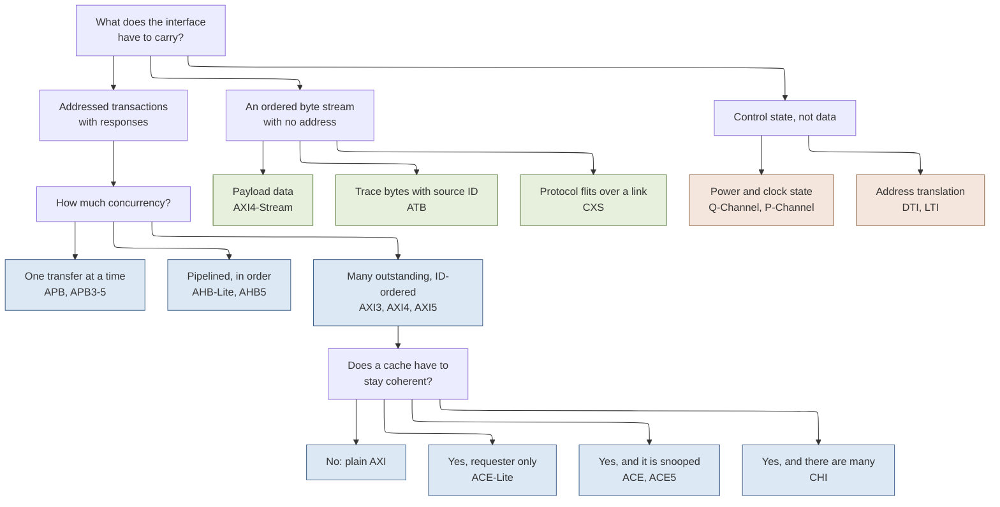
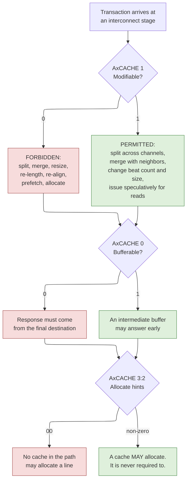
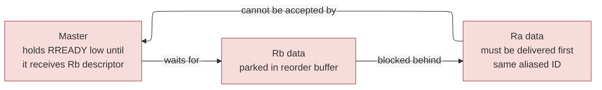
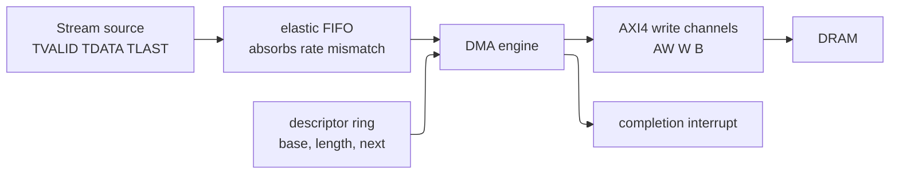
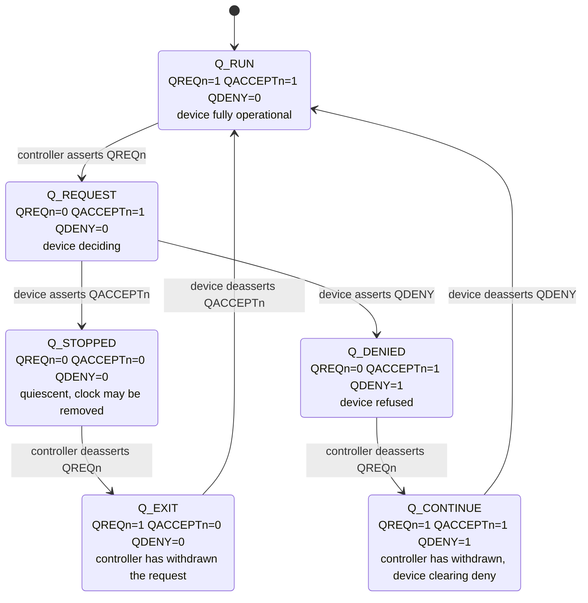
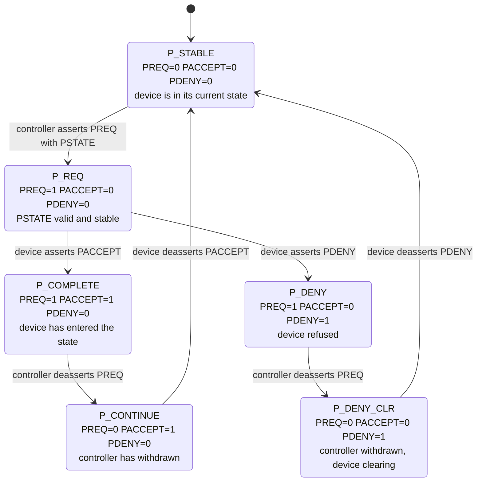
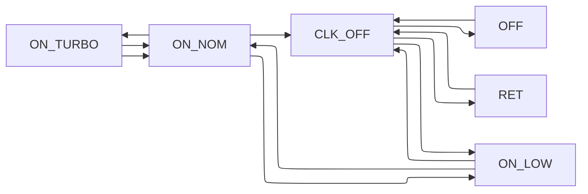
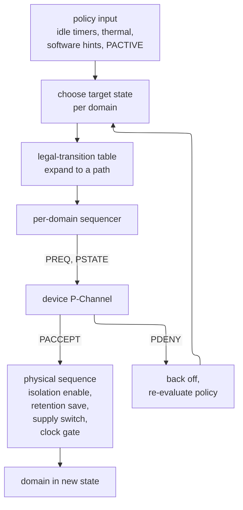

# The AMBA Family in Full — Signal Groups, Protocol Versions, and the Low-Power Interfaces

> **First-time reader orientation:** AMBA (Advanced Microcontroller Bus Architecture) is not one protocol. It is a family of about fifteen interface specifications published by Arm over roughly twenty-five years, of which most engineers know three. This page covers the other twelve, and it covers the *signal-level* detail of the three you already know — the attribute fields that tell an interconnect what it is allowed to do with your transaction, and the two small handshake protocols (Q-Channel and P-Channel) by which a block and its power controller negotiate turning the clock or the supply off.

> **Abbreviation key — skim now and return as needed:** Advanced Microcontroller Bus Architecture (AMBA); Advanced eXtensible Interface (AXI); Advanced High-performance Bus (AHB); Advanced Peripheral Bus (APB); AXI Coherency Extensions (ACE); Coherent Hub Interface (CHI); Advanced Trace Bus (ATB); Low Power Interface (LPI); Distributed Translation Interface (DTI);
> system on chip (SoC); intellectual property block (IP); register-transfer level (RTL); central processing unit (CPU); graphics processing unit (GPU); neural processing unit (NPU); direct memory access (DMA); network interface controller (NIC);
> quality of service (QoS); first in, first out (FIFO); static random-access memory (SRAM); dynamic random-access memory (DRAM); double data rate (DDR); network on chip (NoC); read-modify-write (RMW); compare-and-swap (CAS);
> memory management unit (MMU); system memory management unit (SMMU); translation lookaside buffer (TLB); translation buffer unit (TBU); translation control unit (TCU); address translation services (ATS);
> Unified Power Format (UPF); power state table (PST); power management unit (PMU); system control processor (SCP); integrated clock gating cell (ICG); reset-domain crossing (RDC); clock-domain crossing (CDC);
> verification IP (VIP); SystemVerilog Assertions (SVA); universal verification methodology (UVM); memory tagging extension (MTE); error-correcting code (ECC); functional safety (FuSa); realm management extension (RME);
> power, performance, and area (PPA); kilobyte (KB); kibibyte (KiB); megahertz (MHz); gigahertz (GHz); nanosecond (ns); microsecond (µs).

> **Prerequisites:** [01 · AHB, AXI, and APB](01_AHB_AXI_APB.md) — you need its five-channel derivation, the `VALID`/`READY` handshake laws, burst and outstanding-transaction mechanics, the ID-as-ordering-stream idea, and the three-tier APB/AHB/AXI PPA argument. This page assumes all of that and never re-derives it.
> **Hands off to:** [ACE and CHI](../../01_CPU_Architecture/06_Coherence_and_Consistency/03_ACE_and_CHI.md) (owns coherence: what `ReadShared` *means*, snoop filters, home nodes, the CHI layering — this page stops at the AXI signal groups that carry coherence intent), [UPF and CPF Power Intent](../../../02_Power_and_Low_Power/05_UPF_and_CPF_Power_Intent.md) (owns the declarative power specification whose legal states the P-Channel walks between), [Low-Power Architecture and Domain Partitioning](../../../02_Power_and_Low_Power/03_Low_Power_Architecture_and_Domain_Partitioning.md) (owns *where* to draw domain boundaries; this page owns the *protocol* that crosses them).

---

## 0. Why this page exists

Ask a working SoC integrator what went wrong on their last project and you will rarely hear "we misunderstood the `VALID`/`READY` handshake." You will hear that a DMA engine drove `AWCACHE = 0b0011` when the software expected coherent, cacheable behavior and the data silently never reached the CPU's view of memory. You will hear that a bridge copied `AWCACHE` onto `ARCACHE` bit-for-bit and produced a legal-looking but semantically wrong read attribute. You will hear that two masters' transaction identifiers (IDs) aliased inside an interconnect after someone truncated an ID width in an integration script, and the chip deadlocked in a way that took three weeks to root-cause. You will hear that a peripheral denied every clock-gating request forever because nobody specified what its `QACTIVE` was allowed to depend on, and the platform never reached its idle power target.

Every one of those is a *signal-level* failure in a protocol the team believed it understood. The five channels are the easy part; they are taught everywhere and they are what a first AXI tutorial covers. The hard part is the sideband: four bits of `AxCACHE`, three bits of `AxPROT`, one bit of `AxLOCK`, four bits each of `AxQOS` and `AxREGION`, and an arbitrary-width `AxUSER` that no two vendors define the same way. Those fields do not move data. They tell the interconnect and the endpoint what they are *permitted* to do with the data — split it, merge it, buffer it, reorder it, allocate it into a cache, or refuse it on a security check. Get them wrong and the chip is still protocol-legal and still wrong.

The second gap this page fills is the **AMBA Low Power Interface (LPI)** — the Q-Channel and P-Channel. Every modern SoC gates clocks and supplies at block granularity, and every one of those decisions has to be *negotiated*, because the power controller sitting outside a block cannot see whether that block has an outstanding read, a half-received UART character, a pending interrupt, or a DRAM refresh due in 3 µs. A raw enable wire from the controller to the block is a correctness bug waiting for a workload. The LPI is the two-page protocol that makes it a handshake instead, and it is the piece of low-power engineering that lives in the RTL rather than in the UPF file. It is squarely professional-engineer material and it is almost never taught.

After this page you will be able to: read any `AxCACHE`/`AxPROT`/`AxLOCK`/`AxQOS`/`AxREGION` value and state precisely what an interconnect may and may not legally do with that transaction; compute burst address and strobe sequences for narrow, unaligned, and wrapping bursts and check the 4 KiB rule by hand; explain why an exclusive access is *allowed* to fail spuriously and design a lock that does not livelock because of it; choose between every member of the AMBA family for a given block; implement and verify both sides of a Q-Channel and a P-Channel; and run an integration review that catches the ID-width, attribute-mapping, and quiesce-ordering bugs before they reach silicon.

---

## 1. The family map: every AMBA member, and the procedure for choosing one

### 1.1 Why one company shipped fifteen interfaces

A single universal interface is the obvious design. It is also wrong, and the reason is worth stating precisely because it is the same reason every other part of a chip is heterogeneous.

**Baseline.** Suppose Arm had published exactly one protocol — call it "AMBA-U" — with the full AXI5 signal set: five channels, 8-bit length, 6-bit ID, all attribute fields, atomics, memory tagging, parity, and coherence extensions. Every block in the SoC speaks it.

**Trace.** Count what that costs a real-time-clock (RTC) peripheral with eight 32-bit registers. AXI5's full manager-side signal count on a 64-bit interface with 6-bit IDs runs to roughly 300 wires per port once you include `AWADDR[39:0]`, `AWID[5:0]`, `AWLEN[7:0]`, `AWSIZE[2:0]`, `AWBURST[1:0]`, `AWCACHE[3:0]`, `AWPROT[2:0]`, `AWQOS[3:0]`, `AWREGION[3:0]`, `AWATOP[5:0]`, `AWUSER[n]`, the `W`, `B`, `AR`, and `R` channels, plus check and poison bits. The RTC's own logic is perhaps 400 gates. The interface registers, burst counters, ID tracking, and response-ordering logic needed to be *compliant* would be five to ten times the size of the peripheral itself, and the wiring would dominate the floorplan channel between the peripheral cluster and the fabric.

**Failure.** A 200-peripheral microcontroller built this way is mostly interface. Worse, the verification burden is per-port: every one of those 200 ports must be proven to obey burst geometry, ordering, and attribute rules it will never exercise. The protocol's own generality becomes the schedule risk.

**Derived repair.** Split the family along the axis that actually varies — *how much concurrency the endpoint needs* — and let each member drop everything the tier below it does not need. APB drops channels, bursts, IDs, and outstanding transactions and keeps a two-phase register transfer. AHB keeps a pipelined shared bus with no reordering. AXI keeps everything. Then add orthogonal members for the concerns that are not about bandwidth at all: coherence (ACE, CHI), unaddressed streaming (AXI4-Stream), trace transport (ATB), address translation (DTI), and power negotiation (Q-Channel, P-Channel).

**Cost.** Fifteen specifications, a bridge for every adjacent pair, and a permanent integration tax: every block boundary is now a place where two different protocols must be reconciled, and every reconciliation is a place where semantics can be lost (§2.5 shows one). The family also fragments verification IP and engineering skill.

**Selection boundary.** If your entire design is one accelerator with one memory port, you need exactly one protocol and the family map is noise. The family earns its complexity at roughly the point where an SoC has more than about ten distinct masters with materially different bandwidth and latency profiles — which is essentially every application processor, and essentially no small FPGA project.

### 1.2 The complete family table

The table below lists every AMBA member in current use. "Gen/year" gives the AMBA generation and the approximate first publication; treat the years as orientation, not citation.

| Protocol | Gen / year | What it is for | Choose it when |
|---|---|---|---|
| **APB** | AMBA 2, 1998 | Two-phase, unpipelined, single-master register access. No bursts, no IDs, no outstanding transactions. | The block is a register file with fewer than a few hundred accesses per millisecond and you want the smallest possible interface. |
| **APB3** | AMBA 3, 2003 | APB plus `PREADY` (wait states) and `PSLVERR` (error response). | Always, over APB2 — a slave that cannot stall or report an error forces every access to be a fixed-latency success. |
| **APB4** | AMBA 4, 2010 | APB3 plus `PPROT[2:0]` (privilege, security, instruction) and `PSTRB` (byte write strobes). | The peripheral bus crosses a security boundary, or software does byte-granular writes to packed registers. |
| **APB5** | AMBA 5, ~2021 | APB4 plus user signals, `PWAKEUP`, parity/check signals for functional safety, and RME security-state extension. | Safety-relevant or security-partitioned peripherals; anything that must participate in wakeup. |
| **AHB** | AMBA 2, 1999 | Pipelined shared bus with multi-master arbitration, `HBUSREQ`/`HGRANT`/`HMASTER`/`HLOCK`, and SPLIT/RETRY responses. | Legacy only. New designs should not use SPLIT/RETRY. |
| **AHB-Lite** | AMBA 3, 2003 | AHB with exactly one master: no arbitration, no SPLIT/RETRY, `HRESP` reduced to one bit. | A single-master subsystem — a small CPU with its instruction/data ports, or a DMA engine feeding a local SRAM — where AXI's channel count is not justified. |
| **AHB5** | AMBA 5, 2015 | AHB-Lite plus TrustZone (`HNONSEC`), exclusive access (`HEXCL`, `HEXOKAY`, `HMASTER`), extended memory types (`HPROT` widened to 7 bits), user signals, and a declared single-copy atomicity size. | A Cortex-M-class secure subsystem, or any AHB design that needs `LDREX`/`STREX` to work. |
| **AXI3** | AMBA 3, 2003 | Five channels, 4-bit `AxLEN` (1–16 beats), `WID` with write-data interleaving, `AxLOCK[1:0]` including locked transfers. | Legacy only. Its two distinctive features — write interleaving and locked transfers — are both removed in AXI4 for good reasons (§5.5, §3.6). |
| **AXI4** | AMBA 4, 2010 | AXI3 with 8-bit `AWLEN` (up to 256 beats for `INCR`), no `WID`, no locked transfers, plus `AxQOS`, `AxREGION`, and `AxUSER`. | The default high-bandwidth memory-mapped interface. If someone says "AXI" without qualification, this is what they mean. |
| **AXI4-Lite** | AMBA 4, 2010 | AXI4 restricted to single-beat, full-width 32- or 64-bit accesses with no exclusives and no bursts. | A register-mapped block that must sit on an AXI fabric without an APB bridge — control planes of accelerators, especially in FPGA flows. |
| **AXI4-Stream** | AMBA 4, 2010 | A *different* protocol: one unidirectional channel, no addresses, no responses, packets delimited by `TLAST`. | Point-to-point dataflow — video pixels, radio samples, network packets, systolic-array feeds (§6). |
| **AXI5** | AMBA 5, 2017+ | AXI4 plus atomic transactions, cache stashing, memory tagging, wakeup signaling, trace signals, parity/poison, QoS accept, untranslated transactions, and MPAM. | Server- and mobile-class SoCs where contended atomics, functional safety, or SMMU integration matter (§7.4). |
| **ACE** | AMBA 4, 2011 | AXI plus three snoop channels (`AC`, `CR`, `CD`), `AxDOMAIN`, `AxSNOOP`, `AxBAR`, widened `RRESP`, and `RACK`/`WACK`. | A cluster of up to roughly eight fully coherent caching masters (§11). |
| **ACE-Lite** | AMBA 4, 2011 | The requester-only subset: issue shareable transactions and cache maintenance, but no snoop channels and no snoop response path. | An I/O master — GPU, NIC, DMA — that needs coherent *access* to memory but holds no coherent cache of its own. |
| **ACE5 / ACE5-Lite** | AMBA 5 | ACE with the AXI5 additions folded in, notably atomics, stashing, and MTE. | A modern accelerator attaching to a coherent interconnect through an AXI-style port rather than CHI. |
| **CHI** | AMBA 5, 2014 (issues A–F+) | A packet-based, credit-flow-controlled, layered coherence protocol built for mesh interconnects and directory home nodes. | More than roughly eight coherent masters, or any design on a mesh NoC. Owned by the [ACE and CHI](../../01_CPU_Architecture/06_Coherence_and_Consistency/03_ACE_and_CHI.md) page. |
| **ATB** | CoreSight, ATBv1.0/1.1 | A `VALID`/`READY` bus that transports *trace* bytes with a 7-bit source ID and a flush protocol. | Any design with CoreSight trace sources feeding a funnel and a trace buffer (§12.1). |
| **Q-Channel** | AMBA LPI, ~2012 | A four-wire negotiated handshake for entering and leaving a single quiescent state — used for clock gating, power gating, and reset. | Every block whose clock or supply the platform intends to remove (§8). |
| **P-Channel** | AMBA LPI, ~2012 | A five-wire negotiated handshake over an *encoded* multi-state field, for components with several power and performance states. | CPU clusters, GPUs, and any block with more than an on/off distinction (§9). |
| **DTI** | AMBA 5 | The message interface between an SMMU's central translation control unit and a distributed translation buffer unit near a master, plus a profile for PCIe address translation services. | A system with a distributed SMMU — that is, most application processors (§12.2). |
| **LTI** | AMBA 5 | The companion translation interface used by a requester that asks a translation unit for a translation rather than embedding a buffer of its own. | An accelerator that wants virtual-address access without carrying its own TBU (§12.3). |
| **CXS** | AMBA 5 | A flit-streaming interface that carries CHI (or other protocol) packets across a link layer — a die-to-die adapter, a CCIX/CXL-style controller, or a serial PHY. | Multi-die and chiplet coherence; see [Chiplets, CXL, and Die-to-Die](../05_IO_and_Chiplets/02_Chiplets_CXL_and_Die_to_Die.md). |

Two members deserve a note because they are commonly confused with the above. **AMBA Traffic Profiles** is a modeling specification for describing master traffic patterns to a performance model, not a wire protocol. **CXL** is not an AMBA protocol at all — it is a PCIe-based standard from a different consortium — but it occupies the same architectural slot as CXS for off-package coherence, which is why the two are discussed together.

### 1.3 The three axes that actually separate them

Fifteen rows is a lot to hold. The family collapses onto three orthogonal questions, and every member is a point in that space.



**Contract of the figure.** Each leaf is a protocol you can actually instantiate; each branch is a question with a factual answer about your block, not a preference. **One trace:** a video scaler consumes pixels from a camera pipeline and writes frames to DRAM. The pixel input is an ordered byte stream with no address — left branch, `AXI4-Stream`. The frame output is addressed with responses, needs many outstanding writes to cover DRAM latency, and holds no cache — right branch to `C3` then `E1`, plain AXI4. Its configuration registers are a handful of words — `C1`, APB4. One block, three different AMBA interfaces, which is completely normal. **The trade-off it illustrates:** the branches are cheap to get right and expensive to get wrong, because they are *architectural* choices frozen at the block-boundary definition stage. Changing a block from AXI4-Stream to AXI4 after RTL freeze means adding an address generator, a response path, and outstanding-transaction tracking — a redesign, not a wrapper.

### 1.4 The selection procedure

Run these in order. The first match wins; do not skip ahead because a later answer sounds more impressive.

1. **Is there an address?** If the consumer's behavior does not depend on a destination address — a filter, a codec stage, a serializer — choose **AXI4-Stream**. Adding addresses you never use costs a full memory-mapped channel set and buys nothing.
2. **Is it trace?** CoreSight trace sources use **ATB**, because the funnel/replicator/sink infrastructure is built for it and the 7-bit `ATID` is what the off-chip decoder demultiplexes on.
3. **Is it a control-state negotiation, not data?** Clock or power state: **Q-Channel** for one quiescent state, **P-Channel** for several. Address translation: **DTI** or **LTI**.
4. **Estimate the sustained bandwidth requirement.** Compute it, do not guess. Bytes per transaction times transactions per second. Below roughly $10\ \mathrm{MB/s}$ and with no latency requirement, **APB4/APB5** is correct and everything else is waste. A 32-bit APB at 100 MHz delivers $4\ \mathrm{B} / (2\ \text{cycles} \times 10\ \mathrm{ns}) = 200\ \mathrm{MB/s}$ in the best case and far less in practice, which is more than adequate for register traffic.
5. **Does the block need more than one transaction in flight to meet its bandwidth target?** Apply Little's law with the round-trip latency $L$ and the target issue interval $I$: you need at least $\lceil L/I \rceil$ outstanding transactions. If that number is 1, **AHB-Lite/AHB5** suffices and saves the AXI channel count. If it is greater than 1 — and against DRAM at 100–200 ns round trip it always is — you need **AXI4**.
6. **Is the block a register-mapped control plane already sitting on an AXI fabric?** Use **AXI4-Lite** rather than adding an AXI-to-APB bridge, *if* the fabric is AXI end-to-end. If there is already an APB peripheral bus, put it there instead; a second bridge is worse than reusing the first.
7. **Does the block hold a cache whose contents software expects to be coherent with CPU caches?** If yes and there are fewer than roughly eight such masters: **ACE**. If more, or if the interconnect is a mesh: **CHI**.
8. **Does the block access shared memory coherently but hold no coherent cache?** **ACE-Lite**. This is the correct answer for the overwhelming majority of accelerators and I/O devices.
9. **Does it need contended read-modify-write at high rate, memory tagging, or safety parity?** Then the port must be **AXI5/ACE5**, and you must check that the interconnect and the target both declare the corresponding property (§7.5).
10. **Does it leave the die?** **CXS** into a die-to-die adapter, or a PCIe/CXL controller. See [Chiplets, CXL, and Die-to-Die](../05_IO_and_Chiplets/02_Chiplets_CXL_and_Die_to_Die.md).

### 1.5 "AMBA compliant" is not a specification

The single most useful habit this page can install: **the protocol name is the beginning of the interface specification, not the end of it.** Two ports both correctly labeled "AXI4" can differ in data width, address width, ID width, maximum burst length, supported burst types, whether `WRAP` is supported at all, whether exclusive access is implemented, whether `AxQOS` is honored or tied off, whether `AxREGION` is driven, how wide `AxUSER` is and what it means, whether narrow transfers are supported, whether unaligned starts are supported, maximum outstanding reads and writes, read-data interleaving depth, and the reset relationship between the two sides. Every one of those is an integration decision, and §14 is the checklist for settling them.

An IP datasheet that says "AXI4 compliant" and nothing else has told you approximately one third of what you need. The [IP Reuse, Integration, and Register Automation](../../../08_Cross_Cutting_Engineering/04_IP_Reuse_Integration_and_Register_Automation.md) page covers the machine-readable form of this metadata; this page covers what has to be in it.

---

## 2. The AXI memory-attribute signals in full

### 2.1 Why attributes exist: the interconnect is allowed to be clever

Start from the simplest possible contract. **Baseline:** an interconnect is a wire. Whatever address, length, and size a master issues arrives unchanged at the target, in the order issued.

**Trace.** A CPU issues a 4-beat, 8-byte `INCR` read from `0x8000_0000`. The wire delivers a 4-beat, 8-byte `INCR` read from `0x8000_0000`. A second master issues four separate 8-byte writes to `0x9000_0000`, `0x9000_0008`, `0x9000_0010`, `0x9000_0018`. The wire delivers four separate transactions.

**Failure.** The wire is leaving enormous performance on the floor. Those four separate writes to consecutive addresses could have been one 4-beat burst, saving three address-phase arbitrations and, at the DRAM, three row activations' worth of scheduling opportunity ([DDR Controller](../02_Shared_Memory/01_DDR_Controller.md)). A 64-byte read from a 128-bit port could be issued as two 32-byte requests to two different memory channels in parallel. A write to normal memory could be *acknowledged early* by a write buffer in the interconnect, freeing the master hundreds of cycles before the data reaches DRAM.

But apply those same optimizations to a different transaction and each one is a bug. Merging two writes to a UART transmit register sends one character instead of two. Splitting a read of a 64-bit hardware counter into two 32-bit reads returns a torn value. Acknowledging a write to a "clear interrupt" register early lets the CPU return from its handler before the interrupt is actually cleared, and it re-enters immediately.

**Derived repair.** The interconnect cannot distinguish these cases from the address alone — the same address map can hold both, and the block may not even know which memory type software has mapped it as. So the *master* must declare, per transaction, which optimizations are licensed. That declaration is `AxCACHE`. The same argument applied to access control gives `AxPROT`, applied to arbitration gives `AxQOS`, and applied to decode gives `AxREGION`.

**Cost.** Fourteen extra wires per address channel, and — far more expensive — a semantic contract that every component in the path must interpret identically. This is precisely where real systems break, because the attribute is a *permission*, and a component that ignores a permission it was granted merely loses performance while a component that assumes a permission it was not granted is silently incorrect.

**Selection boundary.** In a single-master, single-slave, point-to-point link with no buffering, the attributes are dead wires and can be tied off. The moment there is a fabric that might buffer, split, merge, or reorder, they become load-bearing.

### 2.2 `AxCACHE` bit by bit

`AxCACHE[3:0]` exists on both the write-address channel (`AWCACHE`) and the read-address channel (`ARCACHE`). The bits are independent permissions.

| Bit | AXI3 name | AXI4 name | What asserting it *licenses* |
|---|---|---|---|
| `[0]` | Bufferable (B) | Bufferable (B) | An intermediate component may return the write response before the write reaches its final destination. For reads, the corresponding freedom is that the read may be served from an intermediate buffer holding a not-yet-committed write. |
| `[1]` | Cacheable (C) | **Modifiable** (M) | The transaction's characteristics may be changed: it may be split into multiple transactions, merged with others, have its burst length, size, or address boundaries altered, or be issued with a different number of beats — as long as the same bytes are read or written. |
| `[2]` | Read-allocate (RA) | **Allocate** / **Other Allocate** | A cache in the path is recommended to allocate a line for this transaction (or for the other direction — see below). This is a *hint*, never a requirement. |
| `[3]` | Write-allocate (WA) | **Other Allocate** / **Allocate** | The mirror-image allocation hint. |

Three consequences follow immediately, and each is a rule you can check by inspection.

**Modifiable is the dangerous bit.** `AxCACHE[1] = 1` is the master saying: *I do not care about the shape of this transaction, only about the bytes.* An interconnect may then take one 16-beat burst and issue it as four 4-beat bursts to interleave across memory channels, or take two adjacent single writes and merge them. If the target is a peripheral with side effects on access, or a register whose write must be a single atomic bus event, that is a functional failure. Therefore: **peripheral and device regions must be issued Non-modifiable.**

**Non-modifiable forbids allocation.** If a transaction may not be reshaped, it also may not be pulled into a cache line, because allocation is a reshaping — a 4-byte read that allocates becomes a 64-byte line fill. The encoding rule follows: when `AxCACHE[1] = 0`, `AxCACHE[3:2]` must be `0b00`.

**Bufferable is about *when*, not *whether*.** A bufferable write still happens; the response merely arrives early. The failure mode is not lost data but lost *ordering with respect to the master's own subsequent actions*. A driver that writes a DMA descriptor and then writes a "go" bit relies on the first write being visible before the second takes effect. If the descriptor write is Bufferable and the "go" write goes to a different target that is not, the ordering is not guaranteed by AXI and must be enforced by the master — with a barrier, or by reading back, or by making the descriptor write Non-bufferable.

### 2.3 The AXI3 → AXI4 rename and the memory-type table

In AXI3 the two allocate bits had fixed meanings on both channels: `[3]` was always write-allocate and `[2]` was always read-allocate. AXI4 changed the naming so that the bits are interpreted **relative to the direction of the transaction carrying them**: on any channel, one bit is the *Allocate* hint for that channel's own access type and the other is the *Other Allocate* hint for the opposite type. The practical consequence is the one that bites:

> **The same memory type has different `ARCACHE` and `AWCACHE` encodings in AXI4.** A bridge, a protocol converter, or a piece of glue logic that copies `AWCACHE` onto `ARCACHE` — or that uses one constant for both — is producing a wrong attribute on one of the two channels.

The AXI4 memory-type table, giving the encoding that a manager should drive on each channel for each architectural memory type:

| `ARCACHE[3:0]` | `AWCACHE[3:0]` | Memory type |
|---|---|---|
| `0000` | `0000` | Device Non-bufferable |
| `0001` | `0001` | Device Bufferable |
| `0010` | `0010` | Normal Non-cacheable Non-bufferable |
| `0011` | `0011` | Normal Non-cacheable Bufferable |
| `1010` | `0110` | Write-Through No-Allocate |
| `1110` | `0110` | Write-Through Read-Allocate |
| `1010` | `1110` | Write-Through Write-Allocate |
| `1110` | `1110` | Write-Through Read and Write-Allocate |
| `1011` | `0111` | Write-Back No-Allocate |
| `1111` | `0111` | Write-Back Read-Allocate |
| `1011` | `1111` | Write-Back Write-Allocate |
| `1111` | `1111` | Write-Back Read and Write-Allocate |

Read the structure rather than memorizing twelve rows:

- `AxCACHE[1:0] = 00` → **Device Non-bufferable**: not modifiable, not bufferable. The strictest attribute in the protocol. Every access reaches the endpoint, in shape, in order relative to other Device accesses from the same master.
- `AxCACHE[1:0] = 01` → **Device Bufferable**: still not modifiable, but the response may come early. Used for a write-only peripheral where the driver does not need the completion point.
- `AxCACHE[1:0] = 10`, allocate bits `00` → **Normal Non-cacheable Non-bufferable**: modifiable, so the fabric may split/merge, but nothing may cache it.
- `AxCACHE[1:0] = 11`, allocate bits `00` → **Normal Non-cacheable Bufferable**: the usual attribute for a DMA buffer that software manages by explicit cache maintenance.
- `AxCACHE[1] = 1` with a non-zero allocate field → **cacheable**: Write-Through when `[0] = 0`, Write-Back when `[0] = 1`, with the allocation policy in `[3:2]`.

The asymmetry between the `ARCACHE` and `AWCACHE` columns in the allocate rows is exactly the rename of §2.3's first paragraph in action; the `Allocate`/`Other Allocate` bit positions swap between the two channels, so the same memory type lands on different four-bit patterns. When you build the attribute-driving logic for a master, derive both encodings from a single memory-type enumeration in one place, and never let a downstream module recompute one from the other. If your edition of the specification is not AXI4, check the table in that edition before coding it — this is one of the few places where the encoding, not just the concept, changed between versions.

### 2.4 What each bit licenses, stated as fabric permissions

Turn the table into the form a fabric designer actually needs — a permission list.



**Contract of the figure.** Each decision node reads one bit and yields a *permission set* for every component between the master and the endpoint — not just the first one. **One trace:** a transaction with `AWCACHE = 0b0000` entering a three-stage path (register slice → width converter → memory controller) grants no permissions anywhere: the width converter may not merge two 32-bit beats into one 64-bit beat even though its data path is 64 bits wide, because merging changes `AWSIZE` and that is a modification. It must instead perform two 32-bit-strobed writes. **The trade-off:** that transaction runs at half the converter's peak throughput, forever, and correctly. If a designer "optimizes" the converter to merge unconditionally, the design gets its bandwidth back and starts corrupting every peripheral behind it that has write side effects.

The single most important reading of this diagram: **all four bits are permissions granted downward, and no bit is an obligation.** A slave that ignores the allocate hints is compliant. A memory controller that never merges is compliant. But a fabric that merges a Non-modifiable transaction is *non-compliant and functionally wrong*, and no amount of testing against well-behaved masters will find it.

### 2.5 What a wrong `AxCACHE` does: two failure traces

**Failure trace A — a correctness bug from an attribute that is too permissive.** A camera DMA engine writes 1920×1080 frames into a buffer that the driver allocated as Device memory (the buffer is aliased to a display controller's scan-out region, which has ordering requirements). The DMA's `AWCACHE` is hard-tied to `0b0011` (Normal Non-cacheable Bufferable) because the RTL author copied it from a reference design where the target was DRAM.

Consequences, in order:
1. `Modifiable = 1` lets the interconnect's write-combining buffer merge the DMA's 32-byte bursts into 64-byte bursts. Harmless so far.
2. `Bufferable = 1` lets that buffer return `BRESP = OKAY` immediately.
3. The DMA's completion interrupt fires when it has collected all its `B` responses.
4. Software takes the interrupt, and signals the display controller to scan out the frame.
5. The last 64 bytes of the frame are still sitting in the interconnect's write buffer.
6. The display controller reads the frame *through a different path* — its own read port — and gets stale data for the final line.

Frequency: only when the write buffer happens to be non-empty at completion, which depends on DRAM bank conflicts. In practice this shows as an intermittent one-line tear at the bottom of the screen, roughly one frame in a few hundred, and it is invisible in RTL simulation because the testbench memory model responds in one cycle. Root cause is one constant in one file. The correct value is `0b0000` (Device Non-bufferable), which costs the DMA perhaps 8% of its write bandwidth and is unconditionally correct; or `0b0011` plus a driver that issues an explicit barrier/read-back before signaling.

**Failure trace B — a performance bug from an attribute that is too strict.** A machine-learning accelerator reads weights from DRAM through a 512-bit AXI port. Its `ARCACHE` is tied to `0b0000` because someone reasoned "we are not using caches, so Non-cacheable, and Non-bufferable is safest."

Consequences:
1. `Modifiable = 0` means the interconnect may not split the accelerator's 16-beat, 64-byte-per-beat read bursts across the four memory channels. Every burst goes whole to whichever channel decodes its start address.
2. The address interleaving granularity is 256 bytes, and the burst is 1024 bytes, so a compliant interconnect cannot issue the burst at all — it must reject or the master must not generate it. In the delivered design, the master was generating 4-beat (256-byte) bursts to stay inside the granule.
3. Each 256-byte burst hits exactly one channel. The accelerator's access pattern walks a weight tensor with a stride that lands on the same channel repeatedly.
4. Measured DRAM bandwidth: 26% of peak, against a model that predicted 78%.

Fixing the attribute to `0b0011` (Normal Non-cacheable Bufferable) lets the interconnect split long bursts across channels and lets writes retire early. Measured bandwidth after the change: 71% of peak. One bit, a $2.7\times$ throughput difference, and no functional change whatsoever — because for a plain DRAM buffer with software-managed coherence, `Modifiable` costs nothing.

The lesson from the pair: `AxCACHE` is neither "set it high for speed" nor "set it low for safety." It is a statement about *what the target is*, and it must be derived from the memory type in the address map, not chosen per-master.

### 2.6 `AxPROT` and how it becomes a security filter

`AxPROT[2:0]` is three independent bits and their polarities are not uniform, which is the first thing to get right.

| Bit | Value 0 | Value 1 | Note |
|---|---|---|---|
| `AxPROT[0]` | Unprivileged access | Privileged access | Follows the CPU's current exception level, or the DMA's programmed attribute. |
| `AxPROT[1]` | **Secure** access | **Non-secure** access | **Inverted sense.** A tie-off of `3'b000` is a *Secure* transaction. This catches people constantly. |
| `AxPROT[2]` | Data access | Instruction access | A hint only. A master that cannot distinguish should drive 0 (Data). |

**Why bit 1 is inverted, and why that matters.** Arm's TrustZone partitions the system into a Secure and a Non-secure world. The safe default for an *unmodified legacy master* attached to a secure system is that it should be treated as Non-secure — a master that does not know about TrustZone must not be able to reach Secure memory. A signal named "Secure" that defaults low would give the opposite behavior on an accidental tie-off. Naming the bit `NS` (Non-secure) and asserting it for the *non*-secure case would make `3'b000` mean Secure, which is what the encoding does — so the polarity is a deliberate choice, and it means the "safe" tie-off is `3'b010`, not `3'b000`. If you are tying off `AxPROT` on a non-secure peripheral master, tie it to `3'b010` or `3'b011`, never to zero.

**How this becomes an enforcement point.** The bus is where the security boundary lives, because every access to protected memory must physically traverse it. A filter component — a TrustZone address space controller, a memory protection unit at the fabric edge, or the SMMU — holds a table of address regions and the `AxPROT` values permitted for each. On each transaction:

1. Decode the address to a region.
2. Compare `AxPROT[1]` against the region's required security state, and `AxPROT[0]` against its required privilege.
3. On a match, forward. On a mismatch, do **not** forward; return `DECERR` on the response channel and raise an interrupt to the security monitor.

Two implementation rules that separate a real filter from a toy one. First, **the check must be on the request path, not the response path** — a read that has already been issued to a secure memory has already leaked timing and may have side effects. Second, **the write data must be discarded, not written**, and the `B` response must still be generated: an AXI write whose `AW` was accepted but whose `B` never arrives hangs the master forever. A denied write must accept all `W` beats (to keep the channel from backing up), discard them, and return `DECERR`.

More recent AMBA editions extend the security state beyond two worlds. The Realm Management Extension adds a `NSE` bit alongside `AxPROT[1]`, giving four states — Secure, Non-secure, Realm, and Root — so the filter's comparison becomes a two-bit match rather than a one-bit one. The architecture is unchanged; the table widens. The full treatment of trust boundaries, attestation, and key management is on [Hardware Security Architecture](../../../08_Cross_Cutting_Engineering/01_Hardware_Security_Architecture.md); what this page owns is that the *transport* of the security state is three (or four) bits on the address channel, and that a component which drops or re-drives them has destroyed the boundary.

### 2.7 `AxLOCK` and the AXI3 → AXI4 change

| Version | Width | Encoding |
|---|---|---|
| AXI3 | `AxLOCK[1:0]` | `00` Normal, `01` Exclusive, `10` Locked, `11` Reserved |
| AXI4, AXI5 | `AxLOCK[0]` | `0` Normal, `1` Exclusive |

The removal of the `Locked` encoding is covered in §3.6, where the mechanism it named is derived. The width change is a concrete integration hazard on its own: an AXI3 master connected to an AXI4 slave through a naive adapter that drops `AxLOCK[1]` converts every locked transfer into a normal one, silently removing the mutual exclusion the master was relying on. An adapter that instead maps `AxLOCK[1:0] = 2'b10` onto `AxLOCK = 1'b1` converts a locked transfer into an exclusive one, which is a different mechanism with different failure semantics — the write may now fail and the master, being AXI3, has no code path that handles a failed exclusive write. Both adaptations are wrong; the correct answer is that an AXI3 master that uses locked transfers cannot be attached to an AXI4 fabric without changing the master.

### 2.8 `AxQOS`

`AxQOS[3:0]` is a four-bit priority hint, values 0–15, higher meaning more urgent. The protocol assigns it **no required semantics** — it does not define what an arbiter must do with it, only that it is carried unchanged. `0b0000` is the value a master drives when it participates in no QoS scheme.

The reason it is a hint rather than a guarantee is that priority is a *system* property. Two masters that both drive `AxQOS = 15` have told the arbiter nothing. The value is only meaningful relative to a system-wide QoS budget that the architect assigns, exactly as with any priority scheme.

The mechanism and its canonical use — a display controller raising its QoS as its line FIFO drains, so that a throughput-optimal DRAM schedule is overridden by a hard deadline — are derived on [01 · AHB, AXI, and APB](01_AHB_AXI_APB.md) §9 and elaborated on [QoS, Ordering, and I/O Coherence](../05_IO_and_Chiplets/01_QoS_Ordering_and_IO_Coherence.md). What belongs here is the signal-level integration rule: **`AxQOS` must be carried through every stage unchanged, and a stage that regenerates it destroys the scheme.** A width converter that drives a constant `AxQOS`, or a bridge that does not have the field at all, converts every downstream arbiter into a round-robin. This is the most common way a carefully designed QoS architecture stops working, and it is invisible until a real workload runs.

AXI5's `AWQOSACCEPT`/`ARQOSACCEPT` closes the loop in the other direction; see §7.4.

### 2.9 `AxREGION`

`AxREGION[3:0]` identifies which of up to 16 logical regions of a subordinate's address space the transaction targets. It is **generated by the interconnect's address decoder**, not by the master, and it exists to solve one specific problem.

**Baseline.** A subordinate occupies several disjoint address ranges — say, a memory controller that owns `0x8000_0000–0xBFFF_FFFF` for DRAM and `0x4000_0000–0x4000_FFFF` for its own configuration registers. It has one AXI slave port.

**Failure.** The subordinate must decode the full address again internally to know which range it was hit in. That decode is duplicated logic (the interconnect already did it), it depends on the system address map (so the IP is no longer portable), and it is on the critical path of the address phase.

**Derived repair.** The interconnect, which decoded the address anyway to route the transaction, passes the region number along. The subordinate switches on four bits instead of forty.

**Cost.** Four wires, and a rule: `AxREGION` must be constant within any 4 KiB address range, so that the burst-boundary rule (§4.5) guarantees a burst has exactly one region. **Selection boundary:** a subordinate with a single contiguous address range gains nothing; tie `AxREGION` to zero.

### 2.10 `AxUSER`, and an honest warning

`AWUSER`, `ARUSER`, `WUSER`, `RUSER`, and `BUSER` are user-defined sideband fields of implementation-defined width. The specification says nothing about their contents. That is the entire definition.

They exist because every real SoC has *something* it needs to carry with a transaction that the standard does not define: a stream identifier for the SMMU on an older design, a master identity for a performance counter, an ECC syndrome, a hint for a prefetcher, a virtual-machine tag, a transaction age for an arbiter. Without a user field, each such need would force a proprietary protocol variant.

**Now the warning, and it should be read as strongly as it is written.** User signals are the single largest source of "this IP is AXI, that IP is AXI, and they do not connect" in the industry, for four compounding reasons:

1. **There is no negotiation.** Nothing in the protocol lets one side discover the other's `AxUSER` width or meaning. It is settled by a document, or by a conversation, or by a bug.
2. **Widths differ.** Connecting a 12-bit `AWUSER` producer to a 4-bit consumer means eight bits are dropped. If those bits carried the stream ID, every transaction now has the wrong translation context.
3. **Interconnects do not always carry them.** Many commercial fabrics carry `AxUSER` only if configured to, and only on some paths. A user field that survives the crossbar but is dropped by a width converter fails only for the masters behind that converter.
4. **Meaning drifts across a project.** A field defined as "master ID" in the architecture spec becomes "master ID plus a QoS override in the top two bits" for one late fix, and the two definitions coexist in different blocks.

The engineering rules that follow, in order of how much they will save you:

- **Prefer a standard field.** If you need to carry a stream ID for an SMMU, AXI5 has `AxMMUSID`/`AxMMUSSID`. If you need a QoS value, use `AxQOS`. If you need a region, use `AxREGION`. Use `AxUSER` only when nothing standard fits.
- **Define the encoding in one machine-readable place** — the IP-XACT description or equivalent, per [IP Reuse, Integration, and Register Automation](../../../08_Cross_Cutting_Engineering/04_IP_Reuse_Integration_and_Register_Automation.md) — and generate both endpoints' decoders from it. Never document it in prose only.
- **Make the design functionally correct with `AxUSER` tied to zero.** If the system breaks when the user bits are lost, you have put semantics in a field with no compatibility guarantees. Use user signals for hints, telemetry, and optimization; never for correctness.
- **Assert the width match at elaboration.** A one-line `generate`-time check that the producer's and consumer's `USER` widths are equal catches the most common form of this bug at compile time rather than at bringup.
- **Include the user-signal policy in the integration checklist** (§14) as an explicit line item that someone signs off.

---

## 3. Exclusive access and atomics

### 3.1 The problem: read-modify-write across a fabric

Software needs indivisible read-modify-write: increment a counter, take a lock, push onto a queue. On a single core with no bus, a `test-and-set` instruction is one memory operation and the hardware makes it atomic by construction. Across an AXI fabric there is no such instruction — there is a read transaction and, separately, a write transaction, with an unbounded number of cycles and an unbounded number of other masters' transactions in between.

**Baseline.** Do it with a bus lock: assert a signal that prevents any other master from being granted the bus, read, modify, write, release. This is exactly the AXI3 `Locked` encoding of `AxLOCK`.

**Trace.** Master A takes the lock, issues a read to DRAM (180 ns round trip on a loaded system), computes, issues the write (another 60 ns to acceptance). Total lock hold: roughly 250 ns. During that window no other master may use the affected fabric path.

**Failure.** At 250 ns per lock acquisition and, say, 100,000 lock operations per second across a 4-core system, the fabric is serialized for 25 ms per second — 2.5% of all fabric time — for lock traffic that touches 4 bytes each time. Worse, the display controller's hard deadline (§2.8) can now be missed by a lock held by an unrelated master, so a *correctness* property of one subsystem depends on the *software behavior* of another. Worse still, the locking master might fault between the read and the write, and the fabric is locked with nobody to release it.

**Derived repair.** Invert the mechanism. Instead of *preventing* interference, *detect* it. The master issues a read that says "remember this address for me," then a write that says "only take effect if nothing has touched that address since." Nothing is serialized; the fabric runs at full speed; contention is resolved by retry rather than by blocking. This is the **exclusive access** mechanism, and it is the same idea as the load-linked/store-conditional pair in the CPU's ISA — the [Memory Consistency and Atomics](../../01_CPU_Architecture/06_Coherence_and_Consistency/02_Memory_Consistency_and_Atomics.md) page owns the software-level semantics; this page owns the bus transport.

**Cost.** A small piece of state at the target — the exclusive monitor — plus a retry loop in software, plus the possibility of failure even without real contention (§3.4).

**Selection boundary.** Under extremely high contention, retry-based exclusives waste more bandwidth than they save; that is where AXI5's far-atomics (§3.7) win, because they move the whole operation to the target and can never fail.

### 3.2 The exclusive monitor

The exclusive monitor is a small associative structure at (or in front of) the target. For each entry it holds:

- the **address** of the monitored location, at some implementation-defined **granularity** (the monitor may track more bytes than the transaction requested);
- the **master identity** — in AXI terms, the `ARID` of the exclusive read, which after ID widening in the interconnect uniquely identifies the requesting port;
- a **valid** bit.

Its rules:

1. On an exclusive read (`ARLOCK = 1`), record address + ID and set valid. Return `RRESP = EXOKAY` if the monitor exists and took the reservation.
2. On **any** write to the monitored granule from **any** source, clear the valid bit.
3. On an exclusive write (`AWLOCK = 1`) whose address and ID match a valid entry: perform the write, clear the entry, return `BRESP = EXOKAY`.
4. On an exclusive write with no matching valid entry: **do not perform the write**, return `BRESP = OKAY`.

Rule 4 is the load-bearing one and it is stated in an easily-misread way. `OKAY` on an exclusive write means **the write did not happen**. `EXOKAY` means it did. This inverts the usual reading of `OKAY` as "everything is fine," and it is why a master's exclusive-write handling must test for `EXOKAY` specifically rather than testing for "not an error."

The corresponding rule on the read side is equally important: **a target that does not implement an exclusive monitor returns `OKAY` (not `EXOKAY`) to an exclusive read.** The master must treat that as "exclusives are not supported here" and fall back to another synchronization mechanism. It must not proceed to the exclusive write, because that write will return `OKAY` forever and the software loop will spin without bound.

> **Bringup bug you will meet.** An SoC boots, runs single-threaded code fine, and hangs the instant the operating system starts a second thread. Cause: the SRAM controller in the boot path has no exclusive monitor, `LDREX` returns `OKAY` rather than `EXOKAY`, `STREX` always reports failure, and the kernel's spinlock loop never exits. It is one of the three or four canonical first-silicon hangs, and it is found in about ten minutes if you know to look at `RRESP` on the exclusive read.

**Where the monitor must sit.** It has to be at a point that observes *every* write to the monitored address. Put it in front of a write buffer that can be bypassed and it will miss invalidations. Put it at one memory channel when the address interleaves across four and it will miss writes routed to the other three. In a coherent system, the natural place is the coherency point (the snoop filter or home node), because that is by construction the serialization point for the line; in a non-coherent system it is the target's own access point. Placing the monitor is an architecture decision, not an IP-internal one.

### 3.3 The sequence

```wavedrom
{ "signal": [
  { "name": "ACLK",     "wave": "p..........." },
  { "name": "ARVALID",  "wave": "010........." },
  { "name": "ARLOCK",   "wave": "010........." },
  { "name": "ARADDR",   "wave": "x2x.........", "data": ["0x8000_0000"] },
  { "name": "ARID",     "wave": "x2x.........", "data": ["0x5"] },
  { "name": "RVALID",   "wave": "0...10......" },
  { "name": "RRESP",    "wave": "x...3x......", "data": ["EXOKAY"] },
  { "name": "monitor",  "wave": "x...5.......", "data": ["valid: addr=0x8000_0000, id=0x5"] },
  { "name": "AWVALID",  "wave": "0.....10...." },
  { "name": "AWLOCK",   "wave": "0.....10...." },
  { "name": "WVALID",   "wave": "0......10..." },
  { "name": "BVALID",   "wave": "0........10." },
  { "name": "BRESP",    "wave": "x........3x.", "data": ["EXOKAY"] }
 ],
 "head": { "text": "Successful exclusive pair: EXOKAY on read takes the reservation, EXOKAY on write means the store happened" }
}
```

**Contract of the figure.** The read arms the monitor; the write is conditional on that reservation still being valid. The two transactions are *ordinary* AXI transactions in every other respect — separate channels, separate handshakes, and nothing in the fabric is held between them. **One trace:** at cycle 4 the monitor becomes valid; between cycles 4 and 7 the fabric is completely free for other masters; at cycle 9 `BRESP = EXOKAY` tells the master its store took effect and it may exit the retry loop. **The trade-off:** the window between cycles 4 and 9 is exactly the vulnerability window. Every cycle a master spends between its exclusive read and its exclusive write is a cycle during which any other write to the granule will cause a failure, and the master pays a full retry.

Now the failing case, which is the one that determines whether your lock implementation performs:

```wavedrom
{ "signal": [
  { "name": "ACLK",       "wave": "p..........." },
  { "name": "ARVALID",    "wave": "010........." },
  { "name": "ARLOCK",     "wave": "010........." },
  { "name": "RRESP",      "wave": "x...3x......", "data": ["EXOKAY"] },
  { "name": "monitor",    "wave": "x...5..6....", "data": ["valid", "INVALID"] },
  {},
  { "name": "otherWVALID","wave": "0......10..." },
  { "name": "otherWADDR", "wave": "x......7x...", "data": ["0x8000_0008"] },
  {},
  { "name": "AWVALID",    "wave": "0........10." },
  { "name": "AWLOCK",     "wave": "0........10." },
  { "name": "BVALID",     "wave": "0..........1" },
  { "name": "BRESP",      "wave": "x..........9", "data": ["OKAY = FAILED"] }
 ],
 "head": { "text": "Failing exclusive: another master writes 0x8000_0008, inside the same monitor granule, and clears the reservation" }
}
```

**Contract.** The monitor invalidates on a write from *any* source to the monitored granule, and the exclusive write then reports `OKAY` and performs nothing. **One trace:** the foreign write at cycle 7 targets `0x8000_0008`, which is a *different address* from the reserved `0x8000_0000`. It still clears the reservation, because the monitor's granularity is coarser than 8 bytes. **The trade-off this illustrates is the whole of §3.4:** the architecture deliberately permits the monitor to be coarse, and coarseness converts unrelated traffic into lock failures.

### 3.4 Why the architecture permits spurious failure

An exclusive write may report failure when no logically conflicting access occurred. This is not a defect; it is a designed-in freedom, and the reasoning is a good example of how a specification buys implementability.

**If spurious failure were forbidden**, the monitor would have to be exact. Exact means: byte-granular address comparison for every monitored reservation, one entry per outstanding exclusive per master, retained across every event in the system. Consider what "every event" contains:

- A **context switch**: the OS moves a thread between cores mid-sequence. An exact monitor would have to migrate the reservation.
- A **cache line eviction or migration** in a coherent system: the line moves to another cache. An exact monitor would have to follow it.
- **Power gating** of the block holding the monitor: the entry must survive, which means retention flops on the monitor.
- A **write of the same value**: logically not a conflict, but the monitor sees a write.
- A **partial-granule write** to a neighboring byte: not a conflict, but requires byte-granular comparison for every entry.

Each of those is real hardware cost paid on every transaction, to serve a case software already handles. Because software *must* have a retry loop anyway — genuine contention exists and always will — a spurious failure costs one extra loop iteration and nothing else. The specification therefore permits the monitor to clear the reservation for *any* reason, including reasons that have nothing to do with the address: a coarse granule, an eviction, a timeout, a reset, a context switch, or an unrelated exclusive from a different master.

**The obligation this places on the system.** Permission to fail spuriously is not permission to fail *always*. If a system can construct a state where the exclusive write can never succeed, software livelocks. Three concrete rules keep that from happening:

1. **No unbounded external invalidation source.** If a periodic hardware event (a refresh counter, a performance-monitor write, a debug agent polling) writes into a granule containing a lock at a rate faster than a master can complete its read-write pair, that lock is unusable. Keep locks in granules nothing else touches.
2. **Bound the sequence length.** Software must not execute anything between the exclusive read and write that can take an unbounded time — no loads that might miss, no branches to code that might fault, no interrupts if avoidable. Arm's architectural guidance limits the sequence to a small number of instructions for exactly this reason.
3. **Do not let the retry loop itself cause failures.** A spin loop that re-issues the exclusive read at full rate from four cores can keep all four monitors thrashing. Exponential backoff, or a "spin on a plain load until it looks free, then attempt the exclusive" structure, converts a livelock into progress.

### 3.5 The rules a legal exclusive pair must obey

These constrain the *master*, and violating them makes the result undefined rather than merely slow.

| Rule | Value | Why |
|---|---|---|
| Total bytes transferred | a power of two: 1, 2, 4, 8, 16, 32, 64, or 128 | The monitor compares an aligned power-of-two block; a non-power-of-two would need two comparisons. |
| Maximum total bytes | 128 | Bounds the monitor's granule comparator and the amount a single reservation can cover. |
| Address alignment | aligned to the total byte count | Together with the power-of-two rule, guarantees the access lies in exactly one aligned block. |
| Burst length | at most 16 beats | Bounds how long a target must hold the reservation while data flows. |
| The exclusive write must match the exclusive read in | `AxID`, `AxADDR`, `AxSIZE`, `AxLEN`, `AxBURST`, and the cache/protection attributes | The monitor keyed the entry on address and ID; a mismatch is a different reservation. |
| Outstanding exclusives per ID | one | The monitor holds one entry per ID; a second exclusive read with the same ID replaces the first, silently losing it. |

Two further points that are easy to miss. First, **an exclusive access to Device memory is not architecturally guaranteed to work** — Device memory typically sits behind a peripheral bridge with no monitor, so the read returns `OKAY` and the mechanism is unavailable. Locks belong in Normal memory. Second, **a bridge that splits transactions breaks exclusives**: if an AXI-to-AXI width converter turns one 16-byte exclusive read into two 8-byte reads, the monitor sees two ordinary-looking accesses and the sequence's semantics are gone. Exclusive transactions must be marked Non-modifiable so that the fabric may not reshape them (§2.4 — this is one of the concrete consequences of `AxCACHE[1] = 0`).

### 3.6 AXI3 locked transfers, and why they were removed

The AXI3 `AxLOCK = 2'b10` encoding requested that the interconnect grant the issuing master exclusive use of a path until the master released it — a bus lock, per §3.1's baseline. AXI4 removed the encoding entirely. The reasons, in order of how badly each hurts:

1. **It defeats quality of service.** A locked sequence blocks higher-priority traffic by construction. The whole `AxQOS` architecture becomes advisory, because a low-priority master can hold the path.
2. **It creates deadlocks that are not local.** Master A holds a lock on path 1 and needs path 2; master B holds a lock on path 2 and needs path 1. Neither the masters nor the fabric can detect the cycle, and the fabric has no preemption. This is a textbook resource-ordering deadlock, and the fabric cannot solve it because it does not know the masters' intentions ([Routing, Flow Control, and Deadlock](../04_On_Chip_Networks/02_Routing_Flow_Control_and_Deadlock.md) covers the general form).
3. **It does not compose with a multi-path fabric.** A crossbar or NoC has no single "the bus" to lock. Implementing locked transfers on a NoC means either locking every path (catastrophic) or tracking which paths the locking master might use (impossible in general).
4. **It cannot survive a fault.** If the locking master takes an exception between lock and release, the fabric stays locked.
5. **Exclusive access already solved the problem** without any of the above.

**Cost of removal.** A master whose software genuinely needs a multi-access indivisible sequence — read three registers, all from the same snapshot — must now use another mechanism: a hardware snapshot register in the peripheral, a software mutex, or a single wider access. That is a real burden, but it is borne by the one master that needs it rather than by the whole fabric.

### 3.7 AXI5 atomic transactions

Exclusive access is a *two-round-trip* mechanism plus a retry probability. Under contention, its cost grows with the number of contending masters, because each failure is a full round trip that accomplished nothing.

**Trace the failure at scale.** Sixteen cores increment a shared counter. Round trip to the coherency point: 120 ns. With $N$ contenders, the expected number of attempts before a given core succeeds is roughly $N/2$ in a fair system, so the mean time per successful increment is about $60N$ ns of that core's time, and the *fabric* carries $N$ times the traffic. At $N = 16$, each increment costs about 1 µs and the interconnect is saturated with failed attempts. The counter's throughput collapses as contention rises — the classic negative-scaling curve.

**Derived repair.** Send the *operation* rather than the data. The master issues one transaction carrying the operand and an opcode; the target — which is the serialization point and therefore already sees all accesses in order — performs the read-modify-write locally and returns the original value. One round trip, no retries, and throughput bounded by the target's own pipeline rather than by the fabric round trip. This is the **far-atomic**, and AXI5 carries it in `AWATOP[5:0]`.

| `AWATOP[5:4]` | Class | Behavior |
|---|---|---|
| `00` | NonAtomic | An ordinary write. `AWATOP[3:0]` must be zero. |
| `01` | AtomicStore | Target applies the operation; **no** read data is returned. |
| `10` | AtomicLoad | Target applies the operation and **returns the original value** on the `R` channel. |
| `11` | AtomicSwap / AtomicCompare | `AWATOP = 0b110000` is swap; `0b110001` is compare-and-swap. |

For the `AtomicStore` and `AtomicLoad` classes, the remaining bits select the operation:

| `AWATOP[2:0]` | Operation | Meaning |
|---|---|---|
| `000` | ADD | value += operand |
| `001` | CLR | value &= ~operand (bit clear) |
| `010` | EOR | value ^= operand |
| `011` | SET | value \|= operand (bit set) |
| `100` | SMAX | signed maximum |
| `101` | SMIN | signed minimum |
| `110` | UMAX | unsigned maximum |
| `111` | UMIN | unsigned minimum |

and `AWATOP[3]` selects the endianness with which the target interprets the operand (0 = little-endian, 1 = big-endian). That bit exists because the target performs arithmetic on bytes it received over a byte-lane bus, and arithmetic is the one operation for which byte order is not a naming convention but a numeric fact — a point [01 · AHB, AXI, and APB](01_AHB_AXI_APB.md) §16.6 makes about the bus generally, sharpened here into a signal.

`AtomicCompare` carries **two operands** in the write data — the compare value followed by the swap value — so its `AWLEN`/`AWSIZE` describe twice the width of the location it operates on. A 8-byte compare-and-swap therefore transfers 16 bytes of write data.

```wavedrom
{ "signal": [
  { "name": "ACLK",    "wave": "p..........." },
  { "name": "AWVALID", "wave": "010........." },
  { "name": "AWATOP",  "wave": "x2x.........", "data": ["0b100000 = AtomicLoad ADD"] },
  { "name": "AWID",    "wave": "x2x.........", "data": ["0x7"] },
  { "name": "WVALID",  "wave": "0.10........" },
  { "name": "WDATA",   "wave": "x.2x........", "data": ["operand = +1"] },
  { "name": "RVALID",  "wave": "0.....10...." },
  { "name": "RID",     "wave": "x.....2x....", "data": ["0x7"] },
  { "name": "RDATA",   "wave": "x.....3x....", "data": ["original value"] },
  { "name": "BVALID",  "wave": "0.......10.." },
  { "name": "BID",     "wave": "x.......2x..", "data": ["0x7"] }
 ],
 "head": { "text": "AtomicLoad ADD: one write-channel request produces BOTH an R response and a B response, sharing one ID" }
}
```

**Contract of the figure.** An atomic transaction is issued entirely on the write channels and generates a response on **both** the read-data channel and the write-response channel, with `RID` and `BID` equal to the issuing `AWID`. **One trace:** the master issues at cycle 1, the target adds 1 to the location, returns the pre-increment value at cycle 6 on `R`, and confirms completion at cycle 8 on `B`. **The trade-off — and the integration hazard:** an ordinary AXI component assumes the `R` channel is driven only by transactions accepted on `AR`. An interconnect, register slice, or reorder buffer that allocates `R`-channel resources purely from `AR` traffic will have nothing allocated for an atomic's read response, and the `R` channel stalls. This is why atomics are an explicitly declared *property* (§7.5) rather than something a master may just start driving.

### 3.8 The ordering obligations atomics create

Three rules make far-atomics safe, and each removes a specific deadlock.

**1. The master must be able to accept `R` and `B` in either order.** Nothing orders an atomic's read data against its write response. A master that will not assert `RREADY` until it has seen `BVALID` — a perfectly reasonable design for ordinary AXI, where reads and writes are unrelated — deadlocks against a target that returns `R` first and holds `B` behind it. The master's atomic tracking entry must have space for both responses independently.

**2. `R`-channel resources must not be allocated solely from `AR`.** Stated above; it is the fabric-side mirror of rule 1. Every buffer, credit counter, and reorder-buffer entry along the read-data return path must account for atomics.

**3. Same-ID atomics are ordered like same-ID transactions.** Two atomics with the same `AWID` to the same address complete in issue order, which is what makes a sequence of increments from one master correct. Two atomics with *different* IDs have no mutual ordering, and a master that issues its increments round-robin across IDs to gain parallelism has removed the ordering it may have been relying on for the *sequence*, though each individual operation remains atomic.

A fourth, subtler point: **an atomic is a write transaction that reads.** It must therefore honor the memory attributes of a write and the coherence obligations of a read. In a coherent system this is why atomics are performed at the coherency point rather than in a local cache — the [ACE and CHI](../../01_CPU_Architecture/06_Coherence_and_Consistency/03_ACE_and_CHI.md) page derives near-memory versus in-cache atomic placement and the workload conditions that select between them. This page stops at the AXI5 signal that carries the request.

---

## 4. Bursts, sizes, and the awkward cases products actually hit

[01 · AHB, AXI, and APB](01_AHB_AXI_APB.md) §16.5 derives why bursts exist and gives the address formulas. This section is about the cases the formulas leave to the reader and that real designs land on constantly: narrow transfers, unaligned starts, wrap arithmetic in practice, the 4 KiB rule's justification, and strobe semantics.

### 4.1 The geometry fields, restated as the four numbers you need

For any burst, three fields determine everything:

$$N = \texttt{AxLEN} + 1 \quad \text{beats}, \qquad B = 2^{\texttt{AxSIZE}} \quad \text{bytes per beat}, \qquad \text{total} = N \cdot B \ \text{bytes (aligned start)}$$

with `AxBURST` selecting `FIXED` (`00`), `INCR` (`01`), or `WRAP` (`10`); `11` is reserved. Constraints:

| Constraint | AXI3 | AXI4 / AXI5 |
|---|---|---|
| `AxLEN` width | 4 bits, 1–16 beats | 8 bits |
| Max beats, `INCR` | 16 | 256 |
| Max beats, `FIXED` | 16 | 16 |
| Legal beats, `WRAP` | 2, 4, 8, 16 | 2, 4, 8, 16 |
| `AxSIZE` | 3 bits, $2^0$ to $2^7$ = 1 to 128 bytes | same |
| `AxSIZE` vs bus width | $2^{\texttt{AxSIZE}} \le$ data-bus bytes | same |

The `FIXED` and `WRAP` limits did not grow with `AxLEN` because neither has a use case that needs them to. `FIXED` addresses a single location repeatedly — a FIFO port — and 16 beats is already more than a peripheral FIFO absorbs in one go. `WRAP` exists to fill a cache line critical-word-first, and 16 beats at the widest sensible beat size already covers any line size in use.

### 4.2 Narrow transfers and the strobe pattern they generate

A **narrow transfer** is one where `AxSIZE` is smaller than the data bus width. This is not an exotic case: it happens whenever a 32-bit master is bridged onto a 128-bit fabric, whenever software does byte or halfword stores, and whenever a peripheral's registers are narrower than the bus it sits on.

The rule is: the bytes of a beat occupy the byte lanes selected by the *low address bits*, and `WSTRB` marks exactly those lanes.

For a data bus of $W$ bytes and a beat address $A$, the beat's active lanes are

$$\text{lane}_{\text{low}} = A \bmod W, \qquad \text{lane}_{\text{high}} = \text{lane}_{\text{low}} + B - 1$$

**Worked sequence.** 64-bit bus ($W = 8$), `AWADDR = 0x2`, `AWSIZE = 1` (2 bytes/beat), `AWLEN = 3` (4 beats), `AWBURST = INCR`.

| Beat | Address | $A \bmod 8$ | Active lanes | `WSTRB[7:0]` |
|---|---|---|---|---|
| 0 | `0x2` | 2 | 2–3 | `8'b0000_1100` = `0x0C` |
| 1 | `0x4` | 4 | 4–5 | `8'b0011_0000` = `0x30` |
| 2 | `0x6` | 6 | 6–7 | `8'b1100_0000` = `0xC0` |
| 3 | `0x8` | 0 | 0–1 | `8'b0000_0011` = `0x03` |

Notice beat 3: the address has crossed into the next 8-byte bus word, so the strobe wraps back to the low lanes. A slave that assumes strobes march monotonically upward will corrupt this burst.

**The cost, quantified.** This burst moves 8 bytes in 4 beats on a bus capable of 32 bytes in 4 beats — 25% efficiency. Over a 64-byte transfer at 1 GHz on a 64-bit bus: an aligned wide burst takes 8 beats (8 ns); the same bytes as 2-byte narrow beats take 32 beats (32 ns). If a 32-bit peripheral master is doing this against DRAM through a 128-bit fabric, the effective utilization is $4/16 = 25\%$ at best, and the DRAM controller sees 4-byte requests where it wanted 64-byte ones ([DDR Controller](../02_Shared_Memory/01_DDR_Controller.md) explains why that destroys row-buffer locality). The architectural fix is not on the bus: it is a width-converting bridge with a write-combining buffer, *and* the `Modifiable` bit set so the combining is legal (§2.4).

**A slave that ignores `WSTRB` is the classic silent corruptor.** Consider a 32-bit register block implemented as a simple array with a single write enable. Software does `*(uint8_t*)0x4000_0003 = 0xAB;`. The master issues `AWSIZE = 0`, `WSTRB = 4'b1000`, and `WDATA = 32'hAB??_????` where `?` is undefined on the inactive lanes. The slave writes all 32 bits. Three bytes of an adjacent packed field are now garbage. Nothing errors, nothing asserts, and the bug surfaces as a configuration register with an implausible value weeks later. Every register slave needs per-byte write enables, and every register-slave testbench needs a byte-write test.

### 4.3 Unaligned first transfers

An `INCR` burst may start at an address that is not aligned to `AxSIZE`. The rule: **the first beat uses `AxADDR` as given; every subsequent beat uses an address aligned down to `AxSIZE`.** Formally, with $B = 2^{\texttt{AxSIZE}}$:

$$A_0 = \texttt{AxADDR}, \qquad A_i = \left\lfloor \frac{\texttt{AxADDR}}{B} \right\rfloor B + iB \quad (i \ge 1)$$

The first beat therefore transfers fewer than $B$ bytes — only from `AxADDR` up to the end of its aligned block. Total bytes moved is

$$\text{bytes} = N \cdot B - (\texttt{AxADDR} \bmod B)$$

**Worked sequence.** 64-bit bus ($W = 8$), `AWADDR = 0x3`, `AWSIZE = 2` (4 bytes/beat), `AWLEN = 3` (4 beats), `INCR`.

Aligned base $= \lfloor 3/4 \rfloor \cdot 4 = 0$.

| Beat | Address | Bytes actually transferred | Lanes | `WSTRB[7:0]` |
|---|---|---|---|---|
| 0 | `0x3` | 1 (byte 3 only, to the end of the 4-byte block) | 3 | `0x08` |
| 1 | `0x4` | 4 | 4–7 | `0xF0` |
| 2 | `0x8` | 4 | 0–3 | `0x0F` |
| 3 | `0xC` | 4 | 4–7 | `0xF0` |

Total $= 1 + 4 + 4 + 4 = 13 = 4 \cdot 4 - (3 \bmod 4) = 16 - 3$. ✓

Two consequences a designer must plan for. First, **the last beat is full, not partial** — the burst does not "recover" the bytes it skipped at the start, so an unaligned burst covers 13 bytes spanning addresses `0x3` through `0xF`. Second, **whether a component supports unaligned starts at all is an interface property.** Many DMA engines never generate them; many simple slaves never handle them. If your master can generate them and your slave cannot, the failure is data corruption on the first beat, and no protocol checker will flag it because both sides are individually legal. §14 makes this a checklist line.

### 4.4 `WRAP` bursts and their address arithmetic

`WRAP` exists for one purpose: **critical-word-first cache line fill.** A cache miss on a word in the middle of a line wants that word back first, so the stalled instruction can resume, with the rest of the line following and wrapping around to the line's start.

The arithmetic. With $N$ beats of $B$ bytes, the wrap region is $NB$ bytes and is *aligned* to $NB$:

$$A_{\text{wrap}} = \left\lfloor \frac{A_0}{NB} \right\rfloor \cdot NB, \qquad A_i = A_{\text{wrap}} + \big( (A_0 - A_{\text{wrap}} + iB) \bmod NB \big)$$

`WRAP` requires the start address to be aligned to `AxSIZE` (unlike `INCR`) and $N \in \{2, 4, 8, 16\}$. Both restrictions exist so the modulo is a bit-mask: the low $\log_2(NB)$ address bits increment and the higher bits are held constant. No adder carries propagate out of the wrap region, which is why the address generator is a few gates rather than a full adder plus comparator.

**Worked sequence 1 — a 16-byte wrap.** `ARADDR = 0x34`, `ARSIZE = 2` (4 bytes), `ARLEN = 3` (4 beats), `WRAP`.

$NB = 4 \times 4 = 16$. $A_{\text{wrap}} = \lfloor 0x34 / 16 \rfloor \times 16 = 3 \times 16 = 48 = \texttt{0x30}$.

| Beat | Computation | Address |
|---|---|---|
| 0 | `0x30` + ((`0x34`−`0x30`+0) mod 16) = `0x30` + 4 | `0x34` |
| 1 | `0x30` + ((4+4) mod 16) = `0x30` + 8 | `0x38` |
| 2 | `0x30` + ((4+8) mod 16) = `0x30` + 12 | `0x3C` |
| 3 | `0x30` + ((4+12) mod 16) = `0x30` + 0 | `0x30` |

**Worked sequence 2 — a realistic 64-byte line fill.** 128-bit bus, `ARSIZE = 4` (16 bytes), `ARLEN = 3` (4 beats), so $NB = 64$. The CPU missed on the word at `0x1_0020`, inside the line based at `0x1_0000`.

$A_{\text{wrap}} = \lfloor \texttt{0x10020}/64 \rfloor \times 64 = \texttt{0x10000}$. Addresses: `0x1_0020`, `0x1_0030`, `0x1_0000`, `0x1_0010`.

The critical 16-byte chunk arrives in beat 0, roughly 3 beats — 3 ns at 1 GHz — earlier than it would with an `INCR` burst from the line base. On a load-to-use-critical pipeline that is 3 cycles off every L2 miss ([Cache Microarchitecture](../../01_CPU_Architecture/04_Cache_Hierarchy/01_Cache_Microarchitecture.md) covers the miss path this feeds).

**Cost and selection boundary.** The fill buffer's write pointer must wrap, and the "line complete" test is no longer "the last beat arrived at the highest address" but a beat counter. A cache that fills in `INCR` order can use a simple incrementing pointer and skip the wrap logic entirely, at the price of the critical-word latency. Many small caches make exactly that trade. A slave that does not support `WRAP` is legal — and a master that generates `WRAP` against it is a system bug that a protocol checker will not catch, because the transaction is legal in isolation.

### 4.5 The 4 KiB boundary rule, and why it exists

**The rule.** A burst must not cross a 4096-byte address boundary. Equivalently, with $A_{\text{last}}$ being the address of the final byte the burst touches:

$$\left\lfloor \frac{A_0}{4096} \right\rfloor = \left\lfloor \frac{A_{\text{last}}}{4096} \right\rfloor$$

**Why 4096 and not something else.** Three independent reasons converge on the same number, which is why the rule has survived three protocol generations.

1. **Address decode.** An interconnect routes a burst to exactly one subordinate, and it decides from the *start* address only. If a burst could span a decode boundary, the fabric would have to split it, track two responses, merge them, and handle the case where one half errors and the other does not. Guaranteeing a minimum decode granularity of 4 KiB and forbidding bursts from crossing it removes all of that. This is the reason the rule is *mandatory* rather than advisory.
2. **Address translation.** 4 KiB is the smallest architectural page in essentially every relevant ISA. A burst that stayed within 4 KiB stays within one page, so an SMMU can translate the burst's start address once and apply the same translation to every beat ([Page Walkers, IOMMUs, and Virtualization](../../01_CPU_Architecture/05_Virtual_Memory/02_Page_Walkers_IOMMUs_and_Virtualization.md)). Without the rule, translation would have to be per-beat.
3. **Hardware cost.** The burst address generator only ever has to increment the low 12 bits. No carry propagates into bit 12 or above, so the adder is 12 bits wide instead of 40 or 48, in a path that runs at full bus frequency and is replicated at every fabric stage.

**Worked check.** `AWADDR = 0x0000_0F80`, `AWSIZE = 3` (8 bytes), `AWLEN = 127` (128 beats), `INCR`.

Total bytes $= 128 \times 8 = 1024$. $A_{\text{last}} = \texttt{0xF80} + 1023 = \texttt{0x137F}$.
$\lfloor \texttt{0xF80}/4096 \rfloor = 0$, $\lfloor \texttt{0x137F}/4096 \rfloor = 1$. **Illegal.**

Maximum legal length from that start: bytes to the boundary $= \texttt{0x1000} - \texttt{0xF80} = \texttt{0x80} = 128$ bytes $= 16$ beats, so `AWLEN` must be at most 15.

**The general formula a DMA address generator needs**, for an aligned `INCR` burst of $B$-byte beats starting at $A$:

$$N_{\max} = \left\lfloor \frac{4096 - (A \bmod 4096)}{B} \right\rfloor$$

and the engine must clamp its requested length to $\min(N_{\text{desired}}, N_{\max}, 256)$. Omitting this clamp is one of the two or three most common DMA bugs; it produces a protocol violation only for buffers that happen to be positioned near a 4 KiB boundary, so it passes any test whose buffers are page-aligned and fails on the first user-supplied buffer.

### 4.6 `WSTRB` semantics, including sparse and zero strobes

`WSTRB` has one bit per byte lane, width $W = \texttt{DATA\_WIDTH}/8$. Three rules define it:

1. **A strobe bit may only be asserted for a byte lane that is within the beat's addressed range** (§4.2's lane calculation). Asserting outside is a protocol violation.
2. **Bytes whose strobe is low must not change storage.** Not "may be written with the same value" — must not change. This matters for a slave built on an SRAM without byte write enables: it has to do a read-modify-write internally, and it must do so atomically with respect to other accesses.
3. **Within the addressed range, any subset of strobes is legal, including none.**

Rule 3 is the interesting one, and both extremes have real uses.

**Sparse strobes.** A CPU write-combining buffer accumulates several small stores to different offsets within one 64-byte line and flushes them as one burst. The beats carry whatever byte pattern the software wrote — `0xF0`, `0x03`, `0x81`, arbitrary. The alternative is one transaction per store, which is the whole point of write combining. So a memory controller must handle arbitrary strobe patterns efficiently, and one that internally serializes any beat with non-contiguous strobes will show a large, unexplained slowdown on store-heavy code.

**Zero strobes.** A beat with `WSTRB = 0` transfers no bytes but still counts as a beat toward `AWLEN` and still requires a `WVALID`/`WREADY` handshake and, if last, `WLAST`. Uses:

- A DMA engine writing a partially valid buffer: the unwritten beats are strobed off rather than removing them from the burst, which keeps the burst geometry simple.
- A write to a region where only some beats are enabled by a mask register.
- A `WSTRB = 0` first beat of an unaligned `INCR` burst whose unaligned prefix happens to be empty.

And the hazard: **a zero-strobe write is still an access.** A slave with side effects on write — a FIFO push, a write-1-to-clear status register, a doorbell — must decide whether a zero-strobe write triggers the side effect. The specification does not decide for you. Say so explicitly in the register description, and test it. The common, defensible convention is that a zero-strobe write to a side-effect register performs no side effect, but a slave that fires the doorbell anyway is not violating AXI.

**Reads have no strobe.** Read data comes back on full beats; the master selects the bytes it wanted using the address and size it issued. A slave must return well-defined values on all lanes of a read beat, including lanes outside the requested range — not `X`. Returning `X` on unrequested lanes is legal at the protocol level and catastrophic in gate-level simulation, where the `X` propagates into the master's byte multiplexer and then into control logic. Drive zeros.

---

## 5. Ordering in depth: what AXI guarantees, and the deadlocks in what it does not

[01 · AHB, AXI, and APB](01_AHB_AXI_APB.md) §16.8 establishes that an AXI ID names an ordering stream. This section states the guarantees precisely, states the *non*-guarantees just as precisely — because those are where the bugs live — and works through the two structural hazards: write interleaving, which AXI4 deleted, and ID reuse, which it did not.

### 5.1 The complete list of what AXI guarantees

Exactly four things. Memorize them as a list, because every ordering argument you make about an AXI system reduces to these.

1. **Beats within one burst are in order.** The $i$-th `W` beat carries the data for the $i$-th address of the burst; the $i$-th `R` beat likewise.
2. **Transactions with the same ID, in the same direction, complete in issue order.** Two reads with `ARID = 5` return their data in the order the `AR` handshakes occurred. Two writes with `AWID = 5` return their `B` responses in the order the `AW` handshakes occurred.
3. **Every transaction gets exactly one completion.** One `B` per write burst (not one per beat); one `R` beat per read beat with `RLAST` on the final one.
4. **A response carries the ID of its request.** `BID` matches an outstanding `AWID`; `RID` matches an outstanding `ARID`.

That is the entire ordering model.

### 5.2 What AXI explicitly does not guarantee

Each of these is a place where an engineer's intuition supplies a guarantee the protocol does not.

| Assumption | Reality |
|---|---|
| "Transactions with different IDs complete in order." | No ordering whatsoever. A read with ID 3 issued after a read with ID 1 may return first, always. |
| "A read and a write with the same ID are ordered." | No. `AR` and `AW` are independent channels; the ID space is shared only in the sense that responses are tagged. A read and a write to the **same address** from one master with the same ID have **no** defined order. |
| "A write is visible once `BRESP` arrives." | Only to the extent the memory attributes say. A `Bufferable` write's `B` may come from an intermediate buffer (§2.2). |
| "Issuing order equals arrival order at the slave." | No. The interconnect may reorder across IDs, across paths, and across targets. |
| "If I issue A then B to the same address with different IDs, B sees A." | No. This is the single most dangerous one; it is a data race in hardware. |
| "The interconnect will not reorder because my design has only one slave." | Possibly true for your instance, and it will stop being true the first time someone adds a second slave or a cache. Never rely on an implementation property the protocol does not promise. |

**The operative rule that follows.** If a master requires ordering between two accesses, it must obtain it by one of exactly three means: (a) give them the same ID and the same direction; (b) wait for the first to complete before issuing the second; or (c) use an explicit ordering mechanism outside the base protocol — an ACE barrier (§11.3), a CHI ordering field, or a system-level fence. There is no fourth way, and "it works in simulation" is not one.

This is the bus-level statement of the memory model that [Memory Consistency and Atomics](../../01_CPU_Architecture/06_Coherence_and_Consistency/02_Memory_Consistency_and_Atomics.md) develops at the ISA level and that [Load-Store Unit and Memory Ordering](../../01_CPU_Architecture/03_Out_of_Order_Backend/02_Load_Store_Unit_and_Memory_Ordering.md) implements inside a core. The core's `DMB` instruction is only meaningful because the fabric honors the ordering the core's bus interface then imposes.

### 5.3 Per-ID ordering versus cross-ID freedom: the design lever

The ID is the only ordering knob a master has, and it is a genuine two-sided trade.

**One ID for everything.** Every transaction is ordered against every other. Simple, and correct for any software expectation. But: a read that misses to DRAM (200 ns) blocks a read that would have hit in SRAM (10 ns), because same-ID responses must come back in order. The master's effective memory-level parallelism collapses to one long-latency access at a time. Measured effect: on a load-heavy stream with a 20% miss rate and the numbers above, mean latency per access goes from $0.8(10) + 0.2(200) = 48$ ns with reordering to something approaching the serialized 200 ns whenever a miss is in flight.

**A distinct ID per transaction.** Maximum reordering freedom, maximum concurrency, and no ordering at all. The master must then enforce every ordering it needs itself.

**The engineering answer** is an ID *allocation policy* that maps ordering requirements onto IDs:

- One ID per outstanding *ordering requirement*, not per transaction. A CPU typically uses one ID per hardware thread or per memory-access class.
- A DMA engine that must write descriptors in order uses one ID for descriptors and a different pool for payload.
- A GPU or NPU with fully independent request streams uses one ID per stream, and the number of IDs it needs is the number of streams, not the number of outstanding requests.

The number of IDs a master needs is therefore an *architectural* number, and it appears at the interface as the `ID_WIDTH` parameter — which is where §5.7's deadlock comes from.

### 5.4 Read and write channel independence

The `AR`/`R` pair and the `AW`/`W`/`B` triple are fully independent. Three practical consequences:

1. **A slave must not require an `AW` before it will accept `W` beats.** The protocol permits write data to arrive before, with, or after its address. A slave whose `WREADY` is derived from "an `AW` has been accepted" is legal only if it never deasserts `AWREADY` in a way that creates a dependency loop — and getting this wrong is how a fabric deadlocks. The safe implementation is independent `AW` and `W` FIFOs with pairing logic downstream, exactly as [01 · AHB, AXI, and APB](01_AHB_AXI_APB.md) §16.10 shows.
2. **A master must not require `B` before issuing more `W`.** Otherwise write throughput is limited to one burst per round trip.
3. **Read-after-write to the same address is the master's problem.** If a master writes and then reads the same location, it must either wait for `BRESP` or issue both with the same ID *and the same direction*, which is impossible since they are different directions. In practice: wait for `BRESP`. A master that does not is racing itself.

### 5.5 Write interleaving, `WID`, and interleaving depth

AXI3 allowed the `W` beats of different write transactions to be interleaved on the shared write-data channel, tagged by a `WID` field that matched the corresponding `AWID`.

**Why it was there.** Consider a master with two write streams: a slow one to a peripheral that accepts one beat every 20 cycles, and a fast one to DRAM. Without interleaving, if the slow burst is at the head of the `W` channel, the fast stream waits behind it — head-of-line blocking, potentially for hundreds of cycles.

**The `interleaving depth` concept.** A subordinate declared a **write interleaving depth**: the number of distinct write transactions whose data it could accept interleaved. A depth of 1 means no interleaving. A depth of 4 means the slave can hold partial burst state for four addresses simultaneously. The master was required to interleave no more deeply than the slave's declared depth.

**Why AXI4 deleted it.** Four reasons, and the fourth is the decisive one.

1. **Cost at the subordinate.** Depth $D$ means $D$ sets of burst state — address counter, beat counter, strobe alignment, error accumulator — and a $D$-way lookup on every `W` beat, at full bus frequency.
2. **Cost at every interconnect stage.** A stage that merges write streams from two masters must reconcile their interleaving; a stage that splits must un-interleave. The buffering scales with depth times the number of ports.
3. **Deadlock surface.** A slave that has accepted the first beats of transactions X and Y, and can only complete X, will deassert `WREADY` until X's remaining beats arrive. If the master's `W` FIFO happens to have Y's beats at the head, neither side can move.
4. **It required out-of-band knowledge to be correct.** The interleaving depth is not carried on any wire and cannot be discovered at run time. A master had to be *configured* with each slave's depth — through the interconnect, whose own depth-preserving behavior was itself a property. This makes protocol legality depend on integration-time information that no protocol checker can see. That is the fatal objection: a protocol whose correct use requires a document is not a protocol.

**Cost of the removal.** Head-of-line blocking on the `W` channel is now real and permanent. A master with a slow write stream and a fast one will stall the fast one. The mitigations are architectural rather than protocol-level: give the master two AXI write ports; put the slow target behind a bridge with a deep write buffer that accepts beats quickly and drains slowly; or order the master's issue so a slow burst is never queued ahead of a latency-critical one. In practice the second is what designs do, and it is why an AXI-to-APB bridge always contains a write buffer.

### 5.6 Read data interleaving, and the response reordering rules

Reads kept what writes lost. Every `R` beat carries `RID`, so a subordinate may return beats belonging to different IDs interleaved on the read-data channel, and the master demultiplexes on `RID`. Within one ID, beats are strictly in order and the final beat carries `RLAST`.

The rules:

- Beats of one burst are contiguous *in that ID's stream*, not on the wire.
- Bursts with the **same** `RID` must be returned completely, one after another — a slave may not interleave two transactions that share an ID, because the master could not tell them apart.
- Bursts with **different** `RID`s may interleave freely, subject to the master's declared **read interleaving depth**.

Read interleaving is cheap for the master (a per-ID reassembly pointer) and expensive for nobody, which is why it survived. Nonetheless most modern components declare a read interleaving depth of 1 — no interleaving — because the performance gain is small when bursts are short and the verification cost is not. If you are integrating, *check* the declared depth on both sides; a master with depth 1 attached to a slave that interleaves will scramble its reassembly.

**Response reordering at a subordinate.** A DRAM controller reorders requests to exploit row locality. It may therefore have request $B$'s data ready before request $A$'s. If $A$ and $B$ have different IDs, it returns $B$ first, freely. If they share an ID, it must hold $B$'s completed data until $A$ is done — and that holding storage is the physical price of the ordering contract. Sizing it is a real design decision: too small and the controller stalls its own pipeline whenever same-ID reordering occurs; too large and it is area spent on a rare case.

### 5.7 The deadlock a naive ID-reuse policy creates

This is the failure that motivates §14's ID-width checklist item, and it is worth walking end to end because it is entirely invisible in block-level verification.

**The setup.** An interconnect connects one master port to two subordinates:

- $S_1$: DRAM controller, round-trip latency 200 cycles.
- $S_2$: on-chip SRAM, round-trip latency 4 cycles.

The interconnect must preserve same-ID ordering *across* subordinates: if the master issues two reads with the same `ARID`, one to $S_1$ and one to $S_2$, the responses must return in issue order, because the master is entitled to rely on guarantee 2 of §5.1.

**The mechanism that creates the hazard.** The interconnect has a per-master read reorder buffer of depth 4 beats. When $S_2$'s data arrives first for a same-ID pair, those beats sit in the reorder buffer until $S_1$'s transaction completes.

**How ID aliasing appears without anyone writing it.** The master has `ID_WIDTH = 6` (64 IDs). The subordinate ports were specified at `ID_WIDTH = 4`. During integration, the connection script "adapts" by connecting `ARID[3:0]` and leaving `ARID[5:4]` unconnected — a truncation. Now master IDs `0x01` and `0x11` both appear downstream as `0x1`.

**The trace.**

1. Master issues read $R_a$ with `ARID = 0x11` to $S_1$ (DRAM). It believes this is ordering stream 0x11.
2. Master issues read $R_b$ with `ARID = 0x01` to $S_2$ (SRAM). It believes this is ordering stream 0x01, independent of stream 0x11, so it does not expect any ordering.
3. Downstream both are `0x1`. The interconnect now believes these are the *same* ordering stream and must return $R_a$'s data before $R_b$'s.
4. At cycle 4, $S_2$ returns $R_b$'s 4 beats. The interconnect parks them in the reorder buffer. The buffer is now full.
5. The master's own microarchitecture: $R_b$ fetched a descriptor telling it where to place $R_a$'s payload. Until it has that descriptor, it holds `RREADY` low.
6. At cycle 200, $S_1$ returns $R_a$'s data. The interconnect cannot forward it — the master is not asserting `RREADY`, and even if it were, $R_a$ must go out before $R_b$, and there is no room to buffer $R_a$ behind the full reorder buffer.
7. Circular wait: master waits for $R_b$; interconnect will not release $R_b$ until $R_a$ is delivered; $R_a$ cannot be delivered because the master is not accepting. **Deadlock.**



**Contract of the figure.** Three resources, each held by one party and needed by the next — the canonical deadlock cycle. **One trace:** break any single edge and the system recovers; the master accepting `R` beats out of order would do it, but the master cannot, because the ordering it is being given is not the ordering it asked for. **The trade-off:** the interconnect is behaving *correctly* for the IDs it sees. Nothing in the fabric is wrong. The bug is entirely in the four dropped wires.

**The arithmetic that prevents it.** An interconnect with $M$ master ports must be able to distinguish every master's IDs downstream. It therefore appends a source tag:

$$\texttt{ID\_WIDTH}_{\text{slave port}} \;\ge\; \max_m \texttt{ID\_WIDTH}_{\text{master } m} + \lceil \log_2 M \rceil$$

Four masters with 4-bit IDs need a 6-bit slave-port ID. **Never truncate.** If a subordinate's ID port is genuinely too narrow — a legacy IP with a fixed 4-bit port — the interconnect must implement an explicit **ID remap table**: allocate a downstream ID on issue, record the upstream ID and source port, free it on completion, and **apply backpressure on `ARVALID` when the table is full**. That backpressure is a performance cost and is correct. Truncation is a correctness cost and is not.

**Three related integration rules that fall out of the same analysis:**

1. **A master should not use the same ID for transactions to different subordinates** unless it genuinely requires them ordered. Doing so forces the interconnect into exactly the reorder-buffering situation above, legitimately, and costs latency even when it does not deadlock. Many masters partition their ID space by target region for this reason.
2. **Check the interconnect's declared behavior for same-ID-different-target reads.** Some fabrics serialize instead of buffering: they hold the second `AR` until the first completes. That is safe but converts a 4-cycle SRAM read into a 200-cycle one.
3. **Assert ID width equality at elaboration**, the same way §2.10 recommends for `AxUSER`. A `generate`-time check costs one line and removes an entire bug class.

---

## 6. AXI4-Stream: a different protocol that shares a name

### 6.1 What it is, and what it is not

AXI4-Stream shares AMBA's `VALID`/`READY` handshake and nothing else. There is no address, no read direction, no response channel, no ID-based ordering, no burst length, and no notion of a memory location. It is a **unidirectional, ordered, backpressured byte pipe** from exactly one source to exactly one destination.

Why it exists is the mirror of §1.1's argument. **Baseline:** carry streaming data over memory-mapped AXI by writing it into a buffer. **Trace:** a 4K video pipeline at 60 Hz carries $3840 \times 2160 \times 3 \times 60 \approx 1.5$ GB/s between two adjacent processing stages. **Failure:** routing it through DRAM costs 1.5 GB/s of write bandwidth plus 1.5 GB/s of read bandwidth — 3 GB/s of a DRAM budget that might be 25 GB/s total — plus the DRAM energy, roughly 15–20 pJ/byte against under 1 pJ/byte for a short on-chip link, plus a buffer large enough to decouple the stages. **Derived repair:** connect the stages directly with a protocol that has no addresses because it does not need them. **Cost:** the connection is point to point and static; you cannot re-route a stream at run time the way you can re-target an address. **Selection boundary:** the moment the consumer needs random access to the producer's output, or the two run at unrelated rates with a large decoupling buffer, memory-mapped AXI through DRAM is right again.

### 6.2 The signal set

| Signal | Direction | Required | Meaning |
|---|---|---|---|
| `ACLK`, `ARESETn` | — | yes | Clock and active-low reset. |
| `TVALID` | source → sink | yes | Source has a transfer available. |
| `TREADY` | sink → source | no (defaults asserted) | Sink can accept. If omitted, the sink accepts every cycle. |
| `TDATA[8n-1:0]` | source → sink | no | Payload, an integer number of bytes. |
| `TSTRB[n-1:0]` | source → sink | no | Byte qualifier: this byte is *data* rather than a position marker. |
| `TKEEP[n-1:0]` | source → sink | no | Byte qualifier: this byte position is significant and must not be removed. |
| `TLAST` | source → sink | no | This transfer is the last of a packet. |
| `TID[i-1:0]` | source → sink | no | Identifies the stream this transfer belongs to. |
| `TDEST[d-1:0]` | source → sink | no | Routing destination for this transfer. |
| `TUSER[u-1:0]` | source → sink | no | User-defined sideband; the §2.10 warning applies in full. |

Only `ACLK`, `ARESETn`, and `TVALID` are strictly required. A stream with just `TVALID`/`TREADY` and no data is a legal — and occasionally useful — event channel.

The handshake laws are identical to memory-mapped AXI: `TVALID` must not depend combinationally on `TREADY`; once asserted, `TVALID` and every payload signal must hold stable until the transfer completes; `TREADY` may be asserted or deasserted freely.

### 6.3 The byte-qualifier table

This is the part of AXI4-Stream that is unique to it and that people get wrong. `TSTRB` and `TKEEP` are **not** two copies of `WSTRB`. Together they classify each byte position into three kinds:

| `TKEEP[i]` | `TSTRB[i]` | Byte type | Meaning |
|---|---|---|---|
| 1 | 1 | **Data byte** | Carries a valid data value that must be transported to the destination. |
| 1 | 0 | **Position byte** | Carries no data, but the *position* is meaningful and must be preserved — it marks a gap that has to survive to the destination. |
| 0 | 0 | **Null byte** | Carries neither data nor position. Any component may remove it. |
| 0 | 1 | — | Reserved; must not be generated. |

**Why "position byte" needs to exist.** Consider a network packet whose header is 14 bytes on a 16-byte-wide stream, and a downstream block that must see the payload starting at a 16-byte boundary. The producer emits a beat with 14 data bytes and 2 position bytes: nothing is transported for those two lanes, but a width converter or a FIFO may not compact them away, because the alignment is part of the meaning. A null byte, by contrast, is padding that any stage may squeeze out to save bandwidth. Collapsing that distinction — treating position bytes as null — is exactly the bug that shifts every subsequent field of a protocol header by two bytes.

A stream with no `TKEEP` and no `TSTRB` is defined as all-data, which is the common case and why most video and DSP streams omit both.

### 6.4 Packets, frames, and `TLAST`

The hierarchy is: **transfer** (one handshake) → **packet** (a run of transfers ending with `TLAST` asserted) → **frame** (an application-level group of packets, not represented by any signal) → **stream** (everything with one `TID`).

`TLAST` is the only structural marker in the protocol, and it carries no length. That is deliberate: a source that does not know a packet's length until it ends — a compressor, a variable-length decoder, a receiver of a network frame — can still emit a well-formed packet. The consequence is that a sink cannot pre-allocate by length; it must either handle arbitrary lengths or apply its own maximum and error out.

```wavedrom
{ "signal": [
  { "name": "ACLK",   "wave": "p........." },
  { "name": "TVALID", "wave": "01..0.1..0" },
  { "name": "TREADY", "wave": "1.0.1....." },
  { "name": "TDATA",  "wave": "x2.34x5.6x", "data": ["D0","D1","D2","D3","D4"] },
  { "name": "TKEEP",  "wave": "x2..7x2.2x", "data": ["FF","F0","FF","FF"] },
  { "name": "TLAST",  "wave": "0...10...1" }
 ],
 "head": { "text": "One 3-transfer packet then a 2-transfer packet; TREADY low at cycle 2 stalls without disturbing TVALID or payload" }
}
```

**Contract of the figure.** A transfer occurs only where `TVALID && TREADY`; `TLAST` marks packet ends; payload and `TKEEP` are held stable across the stall at cycle 2. **One trace:** at cycle 2 the sink deasserts `TREADY`; the source holds `D1` and `TKEEP = 0xF0` unchanged until cycle 4, then advances. **The trade-off:** the last transfer of packet 1 carries `TKEEP = 0xF0`, meaning the top four byte lanes of a 8-byte stream are not data. If the downstream FIFO is byte-packing, it must compact those lanes only if they are *null*; if they were position bytes it must not. One bit decides whether the next packet starts aligned or shifted.

### 6.5 `TID` and `TDEST`

`TID` labels which logical stream a transfer belongs to; `TDEST` labels where it should be routed. They are different because a stream interconnect may need both: a switch routes on `TDEST` and a sink demultiplexes on `TID`.

The critical rule, and the reason stream interconnects are simpler than memory-mapped ones: **transfers within one `TID`/`TDEST` combination must not be reordered**, and a packet must not be interleaved with another packet on the same `TDEST` unless every stage in the path supports it. Most do not. In practice, a stream switch serializes whole packets, which is why a stream fabric with one slow destination head-of-line blocks in a way an AXI fabric with independent IDs does not.

### 6.6 Bridging to memory-mapped AXI

You do not convert AXI4-Stream to AXI4 by renaming wires. The two protocols differ in the one thing that matters — a stream has no destination address — so something must *supply* the addresses. That something is a DMA engine, and it is the semantic bridge:



**Contract.** The DMA holds the address state the stream lacks; the FIFO holds the rate mismatch between a source that cannot stall and a fabric that can. **One trace:** a camera emits one line per 7 µs and cannot be backpressured; the DMA writes 4 KiB bursts to DRAM; when DRAM is busy for 3 µs the FIFO absorbs $3\ \mu\text{s} \times 1.5\ \text{GB/s} \approx 4.5$ KiB, so the FIFO must be at least that deep or the stream overflows. **The trade-off:** the FIFO's depth is set by the worst-case fabric stall, which is a system-level QoS question (§2.8) and not something the stream protocol can express. This is why a stream source that cannot tolerate backpressure needs both a deep FIFO *and* a high `AxQOS`, and why an overflow counter belongs in its status register.

---

## 7. Protocol versions and what each addition was for

Each version exists because a specific class of design could not be built with its predecessor. Reading the list as "features added" teaches nothing; reading it as "problem, then repair" tells you when you need the newer version.

### 7.1 APB → APB3 → APB4 → APB5

| Version | Added | The problem it solved |
|---|---|---|
| APB2 (1998) | `PSEL`, `PENABLE`, `PWRITE`, `PADDR`, `PWDATA`, `PRDATA` | Baseline: a two-cycle SETUP/ACCESS register transfer with no failure mode. |
| APB3 (2003) | `PREADY`, `PSLVERR` | A slave with a synchronizer, a clock-domain crossing, or a slow internal register could not stall — so every APB slave had to respond in exactly two cycles, which forced either an artificially fast peripheral clock or a lying slave that returned stale data. `PSLVERR` fixed the parallel problem: an access to an unimplemented register silently succeeded, so software could not distinguish a missing peripheral from a zero-valued one. |
| APB4 (2010) | `PPROT[2:0]`, `PSTRB` | Peripheral registers sit inside TrustZone boundaries; without `PPROT` the security state stopped at the AXI-to-APB bridge and every peripheral was reachable from both worlds. `PSTRB` fixed byte-granular writes to packed registers (§4.2's corruption case). |
| APB5 (~2021) | user signals, `PWAKEUP`, parity/check signals on address, data, and control, and RME security-state extension | Functional safety standards require that a fault on the peripheral bus be *detected*, not merely unlikely; a corrupted `PADDR` writes the wrong register with no indication. `PWAKEUP` lets a peripheral bus participate in the clock-gating negotiation of §8 without a separate sideband. |

Everything else about APB — the SETUP/ACCESS state machine, slave RTL, and bridge design — is on [01 · AHB, AXI, and APB](01_AHB_AXI_APB.md) §14.

### 7.2 AHB → AHB-Lite → AHB5

| Version | Added / removed | The problem |
|---|---|---|
| AHB (1999) | Multi-master arbitration (`HBUSREQ`, `HGRANT`, `HMASTER`, `HLOCK`), SPLIT and RETRY responses | Baseline. SPLIT let a slow slave release the bus and be re-granted later. |
| AHB-Lite (2003) | **Removed** arbitration and SPLIT/RETRY; `HRESP` narrowed to one bit | SPLIT/RETRY required every master to be able to re-issue a transfer it had already committed to, and required the arbiter to track split masters. The combination was a large fraction of AHB's verification cost and was used by almost nobody, because by then anything needing that concurrency used AXI. Simplifying to one master made AHB the right answer for small subsystems again. |
| AHB5 (2015) | `HNONSEC`; exclusive access via `HEXCL`, `HEXOKAY`, and `HMASTER`; `HPROT` widened from 4 to 7 bits (adding Lookup, Allocate, Shareable and renaming Cacheable to Modifiable); `HAUSER`/`HWUSER`/`HRUSER`/`HBUSER`; a declared single-copy atomicity size | A Cortex-M-class secure subsystem needs the TrustZone bit on its bus, and any multi-threaded software on an AHB-based system needs `LDREX`/`STREX` to work — which requires the bus to carry exclusivity and the slave to host a monitor. The `HPROT` widening brings AHB's memory-type vocabulary up to AXI's, so a bridge can translate attributes without losing information (§2.3's warning applies across protocols too). |

For reference, the two AHB control fields you will read on every waveform:

`HTRANS[1:0]`: `00` IDLE, `01` BUSY, `10` NONSEQ, `11` SEQ.
`HBURST[2:0]`: `000` SINGLE, `001` INCR, `010` WRAP4, `011` INCR4, `100` WRAP8, `101` INCR8, `110` WRAP16, `111` INCR16.

### 7.3 AXI3 → AXI4

| Change | Direction | Why |
|---|---|---|
| `AxLEN` 4 bits → 8 bits (`INCR` only, up to 256 beats) | added | A 16-beat maximum on a 128-bit bus caps a burst at 256 bytes. DRAM and cache traffic wants kilobyte-scale transfers, and the address-phase overhead of 16-beat bursts was a measurable fraction of fabric throughput. `FIXED` and `WRAP` did not need it (§4.1). |
| `WID` and write-data interleaving | **removed** | §5.5. |
| `AxLOCK` locked transfers | **removed** | §3.6. |
| `AxQOS[3:0]` | added | Arbitration had no way to express urgency; fairness is the wrong policy for real-time traffic (§2.8). |
| `AxREGION[3:0]` | added | Subordinates with several address ranges were re-decoding the full address (§2.9). |
| `AxUSER` | added | Formalized what everyone was already doing with proprietary sidebands (§2.10). |
| AXI4-Lite, AXI4-Stream defined as profiles | added | Gave a standard name to the two shapes people kept building by hand. |

### 7.4 AXI5's additions, and what each is for

AXI5 is not a single protocol change but a set of independently selectable extensions. Each is a **property** a component declares (§7.5); a design uses only what it needs.

| Extension | Signals | The problem it solves |
|---|---|---|
| **Atomic transactions** | `AWATOP[5:0]`, plus `R` responses to write-channel requests | Contended read-modify-write collapses under exclusive-access retries (§3.7). |
| **Cache stashing** | `AWSTASHNID`, `AWSTASHNIDEN`, `AWSTASHLPID`, `AWSTASHLPIDEN` | A producer writes data that a specific consumer will read next; without stashing the data lands in DRAM and the consumer takes a full cold miss. Stashing lets the writer name the cache that should receive the line, converting a miss into a hit. The coherence machinery that executes it is on [ACE and CHI](../../01_CPU_Architecture/06_Coherence_and_Consistency/03_ACE_and_CHI.md). |
| **Memory tagging (MTE)** | `AxTAGOP[1:0]`, `WTAG`, `RTAG`, `BTAGMATCH` | Memory-safety violations — use-after-free, buffer overrun — are the dominant class of exploitable bugs. MTE colors each 16-byte granule with a 4-bit tag and checks pointer tag against memory tag on access. The bus must carry the tag, the operation to perform on it (invalid / transfer / update / match), and the match result. |
| **Wakeup signaling** | `AWAKEUP` (per channel) | A source whose clock is gated must be able to say "I am about to transact" *before* it can assert `VALID`, so the clock controller can restart the clock without the source stalling on a clock it does not have. Directly related to `QACTIVE` (§8.6); in most integrations the two are combined. |
| **Trace signals** | `AxTRACE`, `WTRACE`, `RTRACE`, `BTRACE` | Post-silicon debug needs to follow one transaction through a fabric. A one-bit tag propagated with the transaction lets every stage's trace logic filter on it, instead of trying to correlate by address and time. See [Tapeout and Post-Silicon Bringup](../../../07_Manufacturing_and_Bringup/03_Tapeout_and_Post_Silicon_Bringup.md). |
| **Parity / check signals** | `*CHK` signals on address, data, control, and handshake | A safety-critical design must *detect* a corrupted address or a stuck `VALID`, not merely make it improbable. See [Functional Safety and Reliability Engineering](../../../08_Cross_Cutting_Engineering/02_Functional_Safety_and_Reliability_Engineering.md). |
| **Poison** | `WPOISON`, `RPOISON`, one bit per 64 data bits | An uncorrectable ECC error in DRAM must be *propagated* rather than silently delivered, so the consumer of the data faults rather than computing on garbage. Poison marks the containing 64-bit chunk as known-bad, and the fault is taken by whoever actually uses it. |
| **QoS accept** | `AWQOSACCEPT[3:0]`, `ARQOSACCEPT[3:0]` | Ordinary `READY`-based backpressure is priority-blind: a subordinate that deasserts `AWREADY` blocks the highest-priority master exactly as hard as the lowest, and if a low-priority transaction is at the head of the queue it causes priority inversion. `QOSACCEPT` lets the subordinate publish a *threshold*: "I will currently accept only transactions with `AxQOS` at or above this value." High-priority traffic keeps flowing while low-priority traffic holds off at the source. |
| **Untranslated transactions** | `AxMMUSID`, `AxMMUSSID`, `AxMMUVALID`, `AxMMUSECSID`, `AxMMUATST`, `AxMMUFLOW` | A master issuing virtual addresses must tell the SMMU which translation context to use. Before these signals existed, the stream ID travelled in `AxUSER` — with every problem §2.10 lists. |
| **MPAM** | `AxMPAM` | Partitions cache capacity and memory bandwidth between software entities, so one workload cannot starve another. See [Prefetching, Replacement, and QoS](../../01_CPU_Architecture/04_Cache_Hierarchy/02_Prefetching_Replacement_and_QoS.md) for the resource-partitioning side. |

### 7.5 How a design declares support

None of the above is discoverable at run time. AMBA handles this with **interface properties**: named attributes with defined values that a component's documentation and its machine-readable description carry — `Atomic_Transactions`, `Cache_Stash_Transactions`, `Wakeup_Signals`, `Trace_Signals`, `Check_Type`, `Poison`, `QoS_Accept`, `Untranslated_Transactions`, `MTE_Type`, `Read_Interleaving_Depth`, `Max_Outstanding_Reads`, and so on.

Three rules make properties actually work:

1. **A property is a contract between two ports, not a feature of one.** Atomics work only if the master, *every* interconnect stage, and the target all declare support. An interconnect that passes `AWATOP` through without allocating `R`-channel resources for atomics (§3.8) declares support it does not have.
2. **Absent means unsupported, and unsupported means "must not be generated."** If a target does not declare atomics, a master must not issue them. There is no negotiation and no error response that means "I do not implement this."
3. **Properties belong in the machine-readable description, and the integration tool must check them.** This is the concrete payoff of the IP metadata flow on [IP Reuse, Integration, and Register Automation](../../../08_Cross_Cutting_Engineering/04_IP_Reuse_Integration_and_Register_Automation.md): a connection that pairs an atomics-generating master with a non-atomics target should fail at build time, not at bringup.

---

## 8. The AMBA Low Power Interface: Q-Channel, derived

### 8.1 The problem: a controller cannot see inside a component

Every SoC has a power controller — a small always-on state machine, a dedicated microcontroller, or a system control processor — whose job is to remove clocks and supplies from blocks that are idle. [Low-Power Architecture and Domain Partitioning](../../../02_Power_and_Low_Power/03_Low_Power_Architecture_and_Domain_Partitioning.md) covers *where* the boundaries go and [Power Reduction Techniques](../../../02_Power_and_Low_Power/04_Power_Reduction_Techniques.md) covers *why* removing them saves energy. What neither can answer is: **at this instant, is it safe?**

**Baseline.** Give the controller a wire. `CLK_EN = 0` gates the block's clock; `CLK_EN = 1` restores it. The controller decides based on whatever it can observe from outside — an idle timer, a software register write, an interrupt status.

**Trace.** A DMA engine finishes its last descriptor and asserts its completion interrupt. Software services the interrupt and writes the "block idle" bit. The controller waits 100 µs of hysteresis and then drops `CLK_EN`.

**Failure — four of them, each real.**

1. **Outstanding transactions.** The DMA had issued an AXI read whose `RVALID` has not yet returned. With its clock stopped, the DMA never asserts `RREADY`. The subordinate holds `RVALID` forever. The fabric's read-data path backs up, and every other master sharing that path stalls. The whole SoC hangs, and the waveform shows a perfectly legal AXI transaction that simply never completes.
2. **Partially received data.** A UART is 6 bits into a 10-bit character. Stopping its clock loses the character and, worse, leaves its receiver state machine mid-frame so that the next character resynchronizes wrongly.
3. **Pending internal work.** A CRC engine has 3 bytes left. A DRAM controller has a refresh due in 2 µs. Neither is visible as an "outstanding transaction" from outside.
4. **The race on the decision itself.** Between software writing "idle" and the controller acting, the DMA received a new descriptor. Software's view and hardware's state have diverged, and nothing in the wire-based scheme can detect it.

The common structure of all four: **the controller is making a decision that depends on state only the component can see, and the wire carries no information back.** No amount of hysteresis fixes it, because there is no idle *duration* that guarantees quiescence — a block can be idle for 10 ms and then have an outstanding transaction 1 ns later.

**Derived repair.** Replace the command with a **request/response handshake**. The controller *asks*; the component *answers*, and the answer is authoritative because the component is the only thing that knows. The component may accept — in which case it guarantees it is and will remain quiescent until released — or refuse. And because the component may become busy while quiescent, it needs a way to ask to be woken. Four wires:

**Cost.** Four wires per block plus a small state machine on each side, a defined reset relationship, and a new class of integration bug (§10.5). **Selection boundary.** A block that is genuinely combinational and stateless, or one whose clock is never gated, does not need a Q-Channel. Almost nothing else qualifies.

### 8.2 The four signals

| Signal | Driven by | Polarity | Meaning |
|---|---|---|---|
| `QREQn` | controller | active **low** | Request to enter the quiescent state. Asserted (low) means "please stop." |
| `QACCEPTn` | device | active **low** | Accept. Asserted (low) means "I am quiescent; you may proceed." |
| `QDENY` | device | active **high** | Deny. Asserted means "I cannot become quiescent now." |
| `QACTIVE` | device | active **high** | "I have, or expect, activity." A hint from the device to the controller, outside the handshake. |

The active-low naming of `QREQn` and `QACCEPTn` is not decoration. These signals cross power-domain boundaries, and an isolation clamp that forces a signal to a fixed value while its source domain is off must clamp to the value that keeps the channel in a *legal and safe* state. §10.4 works this through; for now, note that the polarity choice interacts with the isolation strategy and must not be "fixed" by adding an inverter somewhere convenient.

### 8.3 The complete state machine



**Contract of the figure.** The state is the *encoding of the three handshake wires* — there is no hidden state, which is what makes the channel checkable by a three-line assertion (§13.3). Six of the eight possible encodings are legal states; the remaining two (`QACCEPTn=0` with `QDENY=1`, in either `QREQn` polarity) are illegal and must never occur. Every transition is driven by exactly one side changing exactly one signal, so the two sides never race.

**One trace.** Controller wants to gate a UART's clock. `Q_RUN` → asserts `QREQn` → `Q_REQUEST`. The UART checks: no character in flight, transmit FIFO empty, no outstanding APB access. It asserts `QACCEPTn` → `Q_STOPPED`. The controller now gates the clock. Later a start bit arrives; the UART asserts `QACTIVE`; the controller deasserts `QREQn` → `Q_EXIT`, and ungates the clock. The UART deasserts `QACCEPTn` → `Q_RUN` and resumes.

**The trade-off it illustrates.** Note what is *not* in the diagram: there is no transition from `Q_REQUEST` back to `Q_RUN`. **Once the controller has asserted `QREQn`, it must hold it until the device responds.** This is the rule that makes the protocol safe — without it, the controller could withdraw its request in the same cycle the device accepted it, and the two sides would disagree about whether the clock may stop. The price is that a controller which changes its mind must wait for the device's answer first, which can be many cycles if the device drains before accepting.

### 8.4 The accepted and denied sequences

```wavedrom
{ "signal": [
  { "name": "CLK",      "wave": "p..........." },
  { "name": "QACTIVE",  "wave": "10.........." },
  { "name": "QREQn",    "wave": "1.0.....1..." },
  { "name": "QACCEPTn", "wave": "1...0.....1." },
  { "name": "QDENY",    "wave": "0..........." },
  { "name": "state",    "wave": "3.4.5...6.3.", "data": ["Q_RUN","Q_REQUEST","Q_STOPPED","Q_EXIT","Q_RUN"] },
  { "name": "CLK_dev",  "wave": "p...l.....p." }
 ],
 "head": { "text": "Accepted quiescence: the device drains for two cycles, accepts, and the controller gates CLK_dev" }
}
```

**Contract.** The device's clock may only be removed while in `Q_STOPPED`, and must be running again before the device is required to respond in `Q_EXIT`. **One trace:** `QREQn` asserts at cycle 2; the device takes cycles 2–3 to confirm it has no outstanding work; `QACCEPTn` asserts at cycle 4; `CLK_dev` stops at cycle 4 and restarts at cycle 10 after `QREQn` deasserts at cycle 8. **The trade-off:** the two-cycle decision latency at cycles 2–3 is pure overhead on every gating attempt. A device that decides combinationally saves it but then cannot drain; a device that drains a deep pipeline may take hundreds of cycles, during which the controller is committed and cannot service other domains.

```wavedrom
{ "signal": [
  { "name": "CLK",      "wave": "p........." },
  { "name": "QACTIVE",  "wave": "1........." },
  { "name": "QREQn",    "wave": "1.0...1..." },
  { "name": "QACCEPTn", "wave": "1........." },
  { "name": "QDENY",    "wave": "0...1...0." },
  { "name": "state",    "wave": "3.4.7.8.3.", "data": ["Q_RUN","Q_REQUEST","Q_DENIED","Q_CONTINUE","Q_RUN"] },
  { "name": "CLK_dev",  "wave": "p........." }
 ],
 "head": { "text": "Denied quiescence: the device refuses, the clock never stops, and the channel returns to Q_RUN" }
}
```

**Contract.** A deny is a complete, terminated transaction — not an error and not a retry. The channel returns to `Q_RUN` and the controller may request again whenever it chooses. **One trace:** `QDENY` asserts at cycle 4; the controller deasserts `QREQn` at cycle 6, which it is *obliged* to do (leaving `QREQn` asserted while denied is illegal, because `Q_DENIED` has no self-loop out); `QDENY` clears at cycle 8. **The trade-off:** four cycles of channel activity produced nothing. §8.5 and worked problem 5 cover when to retry, which is the difference between a controller that wastes power polling and one that never gates.

### 8.5 The deny path, and why it must exist

Suppose the protocol had only accept. Then a device that cannot become quiescent has exactly one option: hold `QACCEPTn` high until it can. Follow the consequences.

1. **The controller blocks.** It is in `Q_REQUEST` and may not withdraw. If it is a sequential state machine walking a list of domains — which is what power controllers are — the entire sequence stalls behind one busy device. Domains that *could* have been gated are not.
2. **The wait is unbounded.** A UART receiving a continuous stream, a DRAM controller under sustained load, or a PLL in the middle of a lock sequence may be non-quiescent for milliseconds. There is no timeout in the protocol, and adding one at the controller reintroduces the original bug: a controller that gives up and gates anyway is back to §8.1.
3. **Priority inversion.** An emergency request — thermal throttle, imminent brownout — cannot be issued because the channel is occupied by a request the device will not answer.
4. **It hides information.** "Not yet accepted" and "cannot accept" look identical from outside, so the controller cannot distinguish a device that is draining (wait a little) from one that is streaming (come back in a millisecond).

`QDENY` fixes all four by making refusal an **explicit, immediate, terminating** answer. The controller learns the outcome in bounded time, releases the channel, and moves on. The cost is one wire and two extra states.

**What deny does *not* mean.** It is not an error, it does not indicate a fault, and it does not require the controller to do anything in particular. It also carries no reason and no suggested retry time — the protocol deliberately says nothing about *when* to retry, because that is policy (§10.5 and worked problem 5).

**The liveness obligation deny creates.** A device that denies every request forever is protocol-legal and functionally useless: the platform never reaches its idle power state. Nothing in the four wires prevents it. This must therefore be an explicit, reviewed requirement on the device: *state the exact conditions under which the device will deny, and demonstrate that those conditions cannot persist indefinitely under any legal system input.* That sentence belongs in the device's specification, and the corresponding assertion belongs in its testbench.

### 8.6 `QACTIVE`: the device's own request to stay awake

`QACTIVE` is outside the handshake — it is not part of the state encoding and asserting or deasserting it never changes the state. It is the device saying "I have work, or expect work imminently."

**Why it is necessary.** Without it, a quiescent device with its clock stopped has no way to signal that it needs to run again. Wake-up would have to come from software (which needs a running CPU and takes microseconds) or from the controller polling (which means periodically ungating every gated clock — precisely the energy the gating was supposed to save). `QACTIVE` gives a hardware wake path: a UART's start-bit detector, an interrupt input, an incoming AXI `AWVALID`, or a timer match asserts `QACTIVE`; the controller sees it and deasserts `QREQn`; the device leaves `Q_STOPPED` and runs. Latency is a handful of cycles, with no software involvement.

**Three rules that make it usable, each with a failure if broken.**

1. **`QACTIVE` must be valid while the device's clock is stopped.** This is the constraint that shapes the implementation. It cannot be generated by logic clocked by the gated clock, because that logic is frozen. It must come from an ungated portion of the device, from always-on logic, or combinationally from asynchronous inputs. A design that generates `QACTIVE` from a gated-clock register is a hang: the device sleeps, the wake event arrives, and no clock edge ever occurs to register it.
2. **`QACTIVE` is advisory, and the controller may ignore it.** The controller might have policy reasons — a thermal cap, a forced low-power mode — to leave a device gated despite `QACTIVE`. The device must not assume it will be woken; it must remain correct while gated (which it is, by definition of having accepted).
3. **`QACTIVE` deassertion is the controller's cue to try again.** This is the piece that makes deny efficient (§8.5, worked problem 5): rather than polling on a timer, a well-built controller waits for `QACTIVE` to fall and then issues `QREQn`. It replaces a poll loop with an event.

A device may legally tie `QACTIVE` high permanently. It is compliant and it means "never gate me," which defeats the mechanism. Reviewers should treat a tied-high `QACTIVE` as a red flag, not a simplification.

### 8.7 Reset and initialization

Reset is where Q-Channel integrations most often break, because the two ends are in different reset domains by construction — the controller is always-on and the device is not.

**The requirement.** Both ends must leave reset in the *same* legal state, and that state must be either `Q_RUN` (all signals inactive: `QREQn = 1`, `QACCEPTn = 1`, `QDENY = 0`) or `Q_STOPPED` (`QREQn = 0`, `QACCEPTn = 0`, `QDENY = 0`).

Two consistent schemes, and the trap between them:

- **Reset to `Q_RUN`.** The device comes up clocked and operational; the controller may immediately request quiescence. Simplest, and correct when the device's clock is running at reset release.
- **Reset to `Q_STOPPED`.** The device comes up already quiescent with its clock stopped, and the controller must explicitly release it. This is the right scheme when the device's clock is *not* guaranteed to be running during reset, because the device's reset logic then has no clock with which to reach `Q_RUN`.

**The trap:** the controller resets to `Q_RUN` and the device resets to `Q_STOPPED`, or vice versa. The composite state is then `QREQn = 1` with `QACCEPTn = 0`, which is `Q_EXIT` — a state neither side thinks it is in. The device believes it is stopped and will not act; the controller believes the device is running and will not deassert anything. Nothing moves. This produces the characteristic symptom of "the block never responds after reset, and no waveform shows anything wrong," because every individual signal is at a legal value.

**Three further reset rules.** First, the device's Q-Channel state machine must be clocked by an **ungated** clock — see §8.8, this is the single most common implementation error. Second, if the device's reset can be asserted independently of the controller's, the controller must treat that reset as forcing the channel back to its reset state, or the two will diverge exactly as above. Third, `QDENY` must be low out of reset in both schemes; a device whose `QDENY` reset value is 1 comes up in an illegal encoding. The reset-domain-crossing analysis for these signals belongs in the static checks of [Lint, CDC, RDC Signoff](../../../03_Frontend_RTL_and_Verification/07_Lint_CDC_RDC_Signoff.md).

### 8.8 Where Q-Channels attach: clock, power, and reset

The same four wires serve three distinct purposes, and the *meaning of accept* differs in each. This is not a detail; it determines what the device must have done before it asserts `QACCEPTn`.

| Attachment | What the controller does after accept | What accept must therefore guarantee |
|---|---|---|
| **Clock** | Gates the device's clock | No outstanding transactions in either direction; no internal timing dependency that a stopped clock breaks; nothing that must respond to an input while gated. All state is retained. |
| **Power** | Removes the switched supply (usually after a P-Channel or an isolation/retention sequence) | Everything above, **plus** all state that must survive has been saved to a retained or always-on location, because the device's registers will lose their contents. |
| **Reset** | Asserts the device's reset | No transaction is mid-flight that would leave a fabric partner waiting; no shared resource is held. Prevents the reset-domain-crossing hazards of asserting reset asynchronously to in-flight logic. |

The reset use is the least known and among the most useful. A block whose reset is asserted while it holds an outstanding AXI read will never accept the returning data, hanging the fabric exactly as in §8.1 — reset does not undo a transaction that the fabric has already committed to. A reset Q-Channel makes the sequence explicit: request quiescence, wait for accept, then assert reset.

### 8.9 A synthesizable device-side Q-Channel

```systemverilog
// Device-side AMBA Q-Channel endpoint.
// IMPORTANT: clk here is the UNGATED clock. The clock this channel negotiates
// away is a downstream product of QACCEPTn; if this FSM were clocked by the
// gated clock it could never leave Q_STOPPED.
module qchannel_device (
  input  logic clk,
  input  logic rst_n,

  // Q-Channel
  input  logic QREQn,
  output logic QACCEPTn,
  output logic QDENY,
  output logic QACTIVE,

  // device status, all from ungated or always-on logic
  input  logic outstanding_nonzero,  // AXI transactions issued and not completed
  input  logic internal_busy,        // pipeline, FIFO, or state machine not idle
  input  logic async_wake_event      // e.g. start-bit detect, incoming AWVALID, IRQ
);

  typedef enum logic [2:0] {
    S_RUN, S_REQUEST, S_STOPPED, S_EXIT, S_DENIED, S_CONTINUE
  } state_e;

  state_e state, next_state;

  // A device is quiescible only when nothing can be lost by freezing it.
  logic can_quiesce;
  assign can_quiesce = !outstanding_nonzero && !internal_busy && !async_wake_event;

  // QACTIVE must be valid with the device clock stopped: derived combinationally
  // from ungated status, never from a gated-clock register.
  assign QACTIVE = !can_quiesce;

  always_comb begin
    next_state = state;
    unique case (state)
      S_RUN      : if (!QREQn) next_state = S_REQUEST;
      S_REQUEST  : next_state = can_quiesce ? S_STOPPED : S_DENIED;
      S_STOPPED  : if (QREQn)  next_state = S_EXIT;
      S_EXIT     :             next_state = S_RUN;
      S_DENIED   : if (QREQn)  next_state = S_CONTINUE;
      S_CONTINUE :             next_state = S_RUN;
      default    :             next_state = S_RUN;
    endcase
  end

  always_ff @(posedge clk or negedge rst_n) begin
    if (!rst_n) state <= S_RUN;          // reset to Q_RUN; controller must match
    else        state <= next_state;
  end

  always_comb begin
    QACCEPTn = 1'b1;
    QDENY    = 1'b0;
    unique case (state)
      S_STOPPED, S_EXIT      : QACCEPTn = 1'b0;
      S_DENIED,  S_CONTINUE  : QDENY    = 1'b1;
      default                : ;
    endcase
  end

endmodule
```

Three design notes this code makes concrete. **First**, the decision in `S_REQUEST` is combinational — accept if quiescible now, otherwise deny. A device with a drain phase would instead sit in `S_REQUEST` asserting neither signal while it flushes, with a bounded drain counter; the protocol permits that, and the only rule is that it must eventually answer. **Second**, `QACTIVE` is deliberately the inverse of `can_quiesce`, so the controller's "retry when `QACTIVE` falls" policy (§8.6) lines up exactly with when the device would accept. **Third**, the reset value `S_RUN` is a *contract with the controller*, not a local choice (§8.7); if the platform resets its channels to `Q_STOPPED`, this line must change and so must the controller's.

---

## 9. P-Channel: the multi-state extension

### 9.1 Why binary quiescent/active is not enough

The Q-Channel expresses exactly one bit of intent: run, or stop. **Trace what that costs a CPU cluster.** A modern cluster has, at minimum: full-on at nominal voltage; full-on at a reduced voltage/frequency operating point; clock-gated with all state retained; logic powered off with the L2 cache retained on a separate rail; fully off; and a debug state in which the core is halted but its registers remain externally readable. Six states, and the transitions between them are not interchangeable — going from "logic off, cache retained" directly to "fully off" requires flushing the cache first, while going from "fully on" to "clock-gated" requires nothing but quiescence.

**Failure of the Q-Channel baseline.** You could build six states out of five Q-Channels, one per condition. Three things break. (1) The device can accept one and deny another, leaving the controller in a combination that corresponds to no real state. (2) There is no way to express that a transition is illegal — the Q-Channels are independent, so nothing prevents the controller from removing power while the cache is dirty. (3) The device cannot express a *preference*; it can only answer the question it was asked, so the controller has no way to learn that the device would be happy at "retention" but not at "off."

**Derived repair.** Carry the requested state as an *encoded field* alongside the request, so there is exactly one handshake and exactly one authoritative state; make the device's accept mean "I am now in state $S$"; and give the device a vector output through which it can express what it needs. **Cost.** A wider interface, an implementation-defined encoding that both sides must agree on, and a new obligation — the *legal state sequence* — that the Q-Channel did not have. **Selection boundary.** A peripheral with one off state should use a Q-Channel; the extra machinery buys nothing.

### 9.2 The signals

| Signal | Driven by | Meaning |
|---|---|---|
| `PREQ` | controller | Active-high request. Asserted together with a stable `PSTATE`. |
| `PSTATE[n-1:0]` | controller | The requested state, in a device-specific encoding. Width is implementation-defined. |
| `PACCEPT` | device | Active-high accept: "I am now in the requested state." |
| `PDENY` | device | Active-high deny: "I will not enter the requested state." |
| `PACTIVE[m-1:0]` | device | A vector expressing the device's own activity or the states it would be content in. Outside the handshake, like `QACTIVE`. |

Note the polarity difference from the Q-Channel: P-Channel signals are active high. Do not assume symmetry when writing glue logic.

### 9.3 The state machine



**Contract.** Structurally identical to the Q-Channel — request, single authoritative answer, symmetric withdrawal — with `PSTATE` naming *which* state was requested. `PSTATE` must be driven at least as early as `PREQ` and must remain stable for the whole `P_REQ`/`P_COMPLETE`/`P_DENY` sequence, because the device latches it on accept and the controller must not change the meaning of an in-flight request. **One trace:** the controller wants a GPU at retention. It drives `PSTATE = RET`, asserts `PREQ`; the GPU saves its configuration state to retention flops, then asserts `PACCEPT`; the controller deasserts `PREQ`, the GPU deasserts `PACCEPT`, and only *then* does the controller run its isolation/supply sequence. **The trade-off:** unlike the Q-Channel, accept here can take a long time — thousands of cycles if state must be saved to SRAM — and the channel is occupied for all of it. A power controller must therefore be able to have several P-Channels in flight to different domains concurrently, which makes it a small parallel machine rather than a sequential script.

### 9.4 `PSTATE` encodings and the legal-state-sequence obligation

`PSTATE` is device-specific; the protocol assigns no meanings. A representative encoding for an accelerator with a retained control block:

| `PSTATE[2:0]` | Name | Supplies | Clocks | State retained |
|---|---|---|---|---|
| `000` | `OFF` | switched rail off | off | none |
| `001` | `RET` | switched rail off, retention rail on | off | control registers only |
| `010` | `CLK_OFF` | on | gated | all |
| `011` | `ON_LOW` | on at 0.60 V | 400 MHz | all |
| `100` | `ON_NOM` | on at 0.72 V | 800 MHz | all |
| `101` | `ON_TURBO` | on at 0.88 V | 1200 MHz | all |

**The legal-state-sequence obligation.** Not every pair of states is a legal transition, and the device's specification must say which are. For the encoding above:



**Contract.** An edge exists exactly where a direct transition is architecturally supported. **One trace:** `ON_TURBO` → `OFF` is not an edge. Powering down from turbo requires `ON_TURBO` → `ON_NOM` → `CLK_OFF` → `OFF`: the frequency must come down before the voltage, and the block must be quiescent before the supply is removed. A controller that requests `OFF` directly from `ON_TURBO` is issuing an illegal request; the device may deny it, but it is not *required* to detect it, and a device that accepts an illegal request may then behave in an undefined way. **The trade-off:** the obligation to walk legal paths lives in the controller, which means the controller must encode a copy of every device's transition graph. That is a genuine integration burden, and it is why platform power controllers are usually table-driven with the transition graph as data rather than as code.

Two further rules. **`PSTATE` may request the state the device is already in** — a redundant request is legal and the device accepts immediately; controllers use this to resynchronize after a reset. And **the device must eventually accept some request**: a device that denies every state including the one it is in has no legal behavior, and the liveness argument of §8.5 applies with more force here, because the controller has no fallback.

### 9.5 `PACTIVE`

`PACTIVE` is a vector, and its interpretation is device-specific in the same way `PSTATE` is. The two common conventions:

- **One bit per state**, where a set bit means "I have activity that requires at least this state." The controller ORs across bits and requests the lowest state that satisfies everything asserted. A GPU with `PACTIVE = 3'b011` (`OFF` and `RET` bits set, `ON` clear) is saying it could go as deep as `RET`.
- **A small encoded field** naming the deepest acceptable state directly.

Either way the semantics are the Q-Channel's `QACTIVE` generalized: advisory, valid while the device is in any state including powered-down ones (so it must be driven from an always-on portion), and the controller's cue for when to request. The same implementation constraint applies with more force: for the `OFF` state, `PACTIVE` must be driven by logic on an always-on rail, because the device's own logic has no supply.

### 9.6 A worked multi-state transition

**Scenario.** The accelerator above is at `ON_TURBO`. The workload ends. The platform wants it at `RET` to save leakage, and there is a thermal event 40 µs later that forces `OFF`.

| Step | `PSTATE` | Device action before answering | Answer | Elapsed |
|---|---|---|---|---|
| 1 | `ON_NOM` | Reduce internal clock divider; wait for the voltage regulator to settle at 0.72 V (regulator ramp 12 µs) | `PACCEPT` | 12 µs |
| 2 | `CLK_OFF` | Drain 6 outstanding AXI reads (worst case 200 ns each, overlapped: 260 ns); flush write buffer | `PACCEPT` | 12.3 µs |
| 3 | `RET` | Copy 340 control registers to retention flops (1 per cycle at 400 MHz = 0.85 µs); assert internal clamp readiness | `PACCEPT` | 13.2 µs |
| 4 | *thermal event at 40 µs* | — | — | — |
| 5 | `OFF` | Illegal from `RET`: the graph has no `RET` → `OFF` edge | `PDENY` | 40.0 µs |
| 6 | `CLK_OFF` | Restore from retention (0.85 µs), re-enable clocks | `PACCEPT` | 41.0 µs |
| 7 | `OFF` | Nothing left to save — `CLK_OFF` → `OFF` is legal | `PACCEPT` | 41.1 µs |

Two lessons. **First, the deny at step 5 was the controller's bug, not the device's** — the controller failed to consult the transition graph — and the recovery cost 1.1 µs plus a pointless retention restore. Cheap here; on a cluster with a 2 MB L2 that must be flushed, the equivalent mistake costs milliseconds. **Second, note where the time actually goes:** step 1's 12 µs of regulator settling dominates everything else by an order of magnitude. Power-state transition latency is usually analog, not digital, which is why the interesting optimization is reducing the *number* of voltage transitions rather than speeding up the handshake.

### 9.7 How P-Channel drives the power controller's state machine



**Contract.** The P-Channel produces exactly one thing the physical sequence needs: a *safe point*. Everything downstream of `PACCEPT` — isolation, retention, switch control — is the controller's own micro-sequence and is not part of the protocol. **One trace:** for a `CLK_OFF` → `RET` transition, `PACCEPT` at the device means "my state is saved"; the controller then asserts isolation enable, waits the isolation settling time, opens the power switch, and waits the rail-collapse time. If it did any of that *before* `PACCEPT`, it would be clamping outputs of a block still using them. **The trade-off:** the split means the protocol is reusable across wildly different physical implementations, at the cost that a correct P-Channel guarantees nothing about the physical sequence — the two must be verified together, which is the subject of §10.

---

## 10. Connecting the low-power interfaces to the rest of the flow

### 10.1 The power controller as the owner of both sides

Everything in §§8–9 assumes a component on the other end of the channel. That component is the **power controller**: an always-on block, sometimes a hardwired state machine and sometimes a small processor running firmware, that owns the platform's power policy. Its inputs are idle timers, thermal sensors, software requests, wake sources, and the `QACTIVE`/`PACTIVE` hints; its outputs are the Q- and P-Channel requests plus the physical controls (clock gate enables, switch enables, isolation enables, retention controls, reset).

The architectural point worth stating explicitly: **the power controller is the only block that knows the whole platform's power state, and the LPI channels are the only mechanism by which that knowledge is kept truthful.** Every other representation — a software register, a status bit, an idle timer — is an inference. The channels are the ground truth, and that is why a design that bypasses them "just for this one block" loses the property that made the scheme safe.

### 10.2 Relationship to UPF power states and the power state table

[UPF and CPF Power Intent](../../../02_Power_and_Low_Power/05_UPF_and_CPF_Power_Intent.md) §6 develops the **power state table (PST)**: the declarative enumeration of which combinations of domain supply states are legal. The relationship to the P-Channel is precise and worth stating as a pair of sentences:

> **UPF declares which states exist and which combinations are legal. The P-Channel is the run-time protocol that moves between them, and the device is the only party that can say when a move is safe.**

Concretely: a `PSTATE` value should correspond one-for-one with a named power state in the UPF description of that domain, and the legal-transition graph of §9.4 should be derivable from — and checked against — the PST. Where they disagree, one of two bugs exists: either the controller can request a state UPF says is illegal (a functional bug that low-power simulation will show as corrupted data through an unisolated boundary), or UPF permits a state the device cannot reach (a coverage hole, where a state is verified in power-aware simulation but unreachable in silicon).

The practical procedure: generate the controller's transition table and the device's `PSTATE` decode from the same source as the PST, and add a check that every `PSTATE` value has a PST entry and every PST entry is reachable by some legal path. This is exactly the kind of consistency that has to be automated, because there is no simulation that naturally covers it.

### 10.3 Clock gating versus power gating negotiation

The two look alike on the wire and differ entirely in what accept means.

| | Clock gating | Power gating |
|---|---|---|
| Typical channel | Q-Channel | P-Channel (or Q-Channel for a simple on/off block) |
| Accept means | "No transaction is in flight and freezing me loses nothing." | All of that, **plus** "every piece of state that must survive has been moved to a supply that will remain on." |
| State after entry | All flops retain their values | Non-retained flops lose their values |
| Entry latency | A few cycles | Hundreds to thousands of cycles for state save, plus rail collapse |
| Exit latency | A few cycles | Rail ramp plus restore, typically microseconds |
| Energy break-even | Tens of cycles of idleness | Hundreds of microseconds to milliseconds of idleness |
| What goes wrong if accept is premature | A transaction is lost; the fabric hangs | The same, **plus** silent state corruption after wake |

The break-even numbers are the reason the two mechanisms coexist. Clock gating removes dynamic power only, saves nothing static, and costs almost nothing to enter — so it is worth doing for a few idle cycles. Power gating removes leakage as well but pays a fixed energy cost to collapse and restore the rail, so it pays off only for idle periods long enough to amortize it. [Power Reduction Techniques](../../../02_Power_and_Low_Power/04_Power_Reduction_Techniques.md) derives the break-even algebra; the LPI is how the decision is *executed* safely once made.

The physical thing that a `PACCEPT` for an `OFF` state authorizes is the opening of the power switch:

```tikz
\begin{document}
\begin{circuitikz}[scale=1.0]
  \draw (0,0) node[pmos](M){};
  \draw (M.S) -- (0,2) node[above]{VDD always-on};
  \draw (M.G) -- (-2.6,0) node[left]{SW\_EN\_N};
  \draw (M.D) -- (0,-1.6);
  \draw (0,-1.6) node[below left]{VDD\_SW};
  \draw (0,-1.6) -- (2.4,-1.6) to[C, l=$C_{\mathrm{dom}}$] (2.4,-3.2) node[ground]{};
\end{circuitikz}
\end{document}
```

**Contract of the figure.** `SW_EN_N` low turns the header device on and connects the domain's virtual rail `VDD_SW` to the always-on supply; high disconnects it and $C_{\mathrm{dom}}$ — the domain's total decoupling and parasitic capacitance — discharges through leakage. **One trace:** a domain with $C_{\mathrm{dom}} = 20$ nF at 0.8 V stores $\tfrac12 C V^2 = \tfrac12 (20\ \mathrm{nF})(0.64) \approx 6.4$ nJ, and every wake-up dumps that energy back in as inrush through the header. At a leakage saving of, say, 4 mW, the break-even idle time is $6.4\ \mathrm{nJ}/4\ \mathrm{mW} = 1.6\ \mu\mathrm{s}$ for the charge alone, before counting state save and restore. **The trade-off it illustrates:** the `PACCEPT` handshake costs a handful of cycles and the physics costs microseconds, which is why the interesting engineering is in the policy that decides *whether* to enter, not in the protocol that enters safely.

### 10.4 Isolating the low-power interface itself

The LPI signals cross a power-domain boundary by construction: `QREQn`/`PREQ` come from the always-on controller, and `QACCEPTn`/`QDENY`/`PACCEPT`/`PDENY` come from a domain that is about to be switched off. Those outputs must be isolated, and the **clamp value is not a free choice**.

The rule: **the clamped value must place the channel in a legal state consistent with what the controller believes.** For a Q-Channel on a domain that is being powered down after accepting:

- `QACCEPTn` must clamp **low** (asserted). The controller is in `Q_STOPPED`; a clamp to high would move the apparent state to `Q_REQUEST`, and the controller would conclude the device had un-accepted itself.
- `QDENY` must clamp **low**. A clamp high produces `QREQn=0, QACCEPTn=0, QDENY=1`, which is one of the two illegal encodings.

Getting this backwards is a genuine and common UPF bug, and it is exactly the case the UPF page warns about in general terms — "active-low outputs must clamp HIGH: their safe state is 1, not 0" is correct for a typical `valid` output and *wrong* for `QACCEPTn`, because `QACCEPTn`'s safe state is its asserted state. The lesson generalizes: **clamp values come from interface semantics, not from signal polarity or naming.** Write the isolation strategy for LPI signals by walking the state machine and asking which encoding the controller must continue to see, not by applying a default.

Two related requirements. `QACTIVE`/`PACTIVE` must remain valid while the domain is off, so they cannot simply be isolated to a constant — they must be generated in the always-on portion, which usually means the wake logic itself lives on the always-on rail. And the always-on-to-switched direction (`QREQn`, `PREQ`, `PSTATE`) does not need isolation but *does* need to be safe when the receiving domain has no supply, which is the ordinary level-shifter and floating-input analysis of the UPF page.

### 10.5 The deadlock a badly specified deny creates

Deny is the mechanism that keeps the controller live (§8.5). Specified badly, it does the opposite. Two failure shapes.

**Shape 1 — the permanent denier.** A device's deny condition includes something that is true whenever the platform is doing anything at all: `QACTIVE` derived from "any register was accessed in the last 1024 cycles" on a device that a polling driver touches every 500 cycles. It denies forever, and the domain never gates. Symptom: idle power 30% above target with no failing test. This is not a hang, which is why it survives to silicon.

**Shape 2 — the mutual dependence, which is a true deadlock.** Domain A contains a master; domain B contains its target.

1. The controller requests quiescence of B. B has no outstanding work; it accepts. Its clock stops.
2. A issues a read to B. The request is accepted by the fabric but B never responds — its clock is stopped.
3. The controller requests quiescence of A. A has one outstanding transaction, so it denies.
4. A will deny forever, because its outstanding transaction can only complete if B runs; B will not run because nothing asserts its `QACTIVE`; and B's `QACTIVE` is not asserted because B's designer derived it from B's *internal* activity rather than from an incoming request.

The system is now deadlocked in a way that neither channel's assertions detect — every Q-Channel is in a legal state and every transition was legal.


**Three fixes, and you need all three.**

1. **`QACTIVE` must include incoming requests.** A target's `QACTIVE` must assert on an incoming `AWVALID`/`ARVALID` (or the AXI5 `AWAKEUP`, which exists precisely for this), not only on internal work. This alone breaks the cycle above.
2. **Quiesce in dependency order.** Quiesce *requesters before targets*, and release *targets before requesters*. The ordering is a directed graph derived from the address map: if A can address B, A must be quiesced first. A controller that walks its domain list in arbitrary order will eventually hit this.
3. **Make the accept condition strong enough.** A target should not accept quiescence while any upstream master that can address it is still running, unless the wake path of fix 1 is present and verified. Stated as a reviewable property: *"this device accepts quiescence only when it has no outstanding work and cannot receive new work without asserting `QACTIVE`."*

The deadlock is worth dwelling on because it is the LPI's characteristic bug: it is a *system* property, invisible in any block-level testbench, invisible to protocol checkers, and reproducible only when the power controller's timing lines up with a particular traffic pattern. It is found by review of the quiesce-order graph, or in emulation with a real power-management sequence running — see [Verification Planning and Coverage Closure](../../../03_Frontend_RTL_and_Verification/11_Verification_Planning_and_Coverage_Closure.md) for how such cross-block scenarios get onto a verification plan at all.

---

## 11. Where AXI meets coherence: the signal groups, then the handoff

This section covers only the **AXI signals** that carry coherence intent. What the transactions mean, how snoop filters and home nodes work, and how the protocol scales are entirely owned by [ACE and CHI](../../01_CPU_Architecture/06_Coherence_and_Consistency/03_ACE_and_CHI.md).

### 11.1 `AxDOMAIN`: the shareability domain

`ARDOMAIN[1:0]` and `AWDOMAIN[1:0]` declare how far a transaction's coherence effects must reach.

| Encoding | Domain | Which caches must be snooped |
|---|---|---|
| `00` | Non-shareable | None. The line is private to this master. |
| `01` | Inner Shareable | The masters in this master's inner domain — typically one CPU cluster. |
| `10` | Outer Shareable | A wider set, typically all CPU clusters plus coherent accelerators. |
| `11` | System | Everything in the coherent system. |

Two bits, and they determine the cost of the transaction more than any other field. A snoop broadcast to a domain of $N$ masters costs $O(N)$ messages and its latency is set by the slowest responder, so the difference between Inner Shareable (4 cores) and System (16 masters spread across a mesh) can be a factor of three or more in latency and four in fabric traffic. The domains exist to make the common case — thread-private data, page tables, a stack — cost nothing. [ACE and CHI](../../01_CPU_Architecture/06_Coherence_and_Consistency/03_ACE_and_CHI.md) §2 quantifies this and shows why shrinking the domain only shrinks the constant, not the $O(N^2)$ scaling that motivates CHI.

The integration hazard: `AxDOMAIN` comes from the page table attributes, through the MMU, into the bus interface. A master that hard-ties `AxDOMAIN` — common in accelerators — forces every access into that domain regardless of what software intended. Tied to `11` it is safe and slow; tied to `00` it is fast and *incorrect* for any shared buffer, producing exactly the class of bug where the accelerator reads stale data that a CPU has in its cache.

### 11.2 `AxSNOOP`: the transaction type

`ARSNOOP[3:0]` (4 bits) and `AWSNOOP[2:0]` (3 bits) name the coherent transaction. Together with `AxDOMAIN` and `AxBAR` they select from a table of roughly two dozen operations grouped as:

- **Coherent reads** — obtain a line in a specified state: read it shared, read it clean, read it unique for a subsequent write, or read it once without keeping a copy.
- **Coherent writes** — put a line back: write-back a dirty line, write-clean while keeping it, evict, or write a full line unique without first reading it.
- **Cache maintenance** — clean, invalidate, clean-and-invalidate, or make-unique across a domain, issued by software or by an I/O driver.
- **DVM (distributed virtual memory)** — TLB and instruction-cache maintenance messages plus their completion synchronization, covered in depth on the ACE/CHI page.

The exact four-bit encodings are in the specification and are not worth reproducing here, because you will never hand-decode them without the table in front of you; what matters at integration time is the *set* a component supports. A master that issues `ReadUnique` to an interconnect whose snoop filter does not implement it will get a protocol error or, worse, a silently downgraded response.

### 11.3 `AxBAR`: barrier transactions

`ARBAR[1:0]` and `AWBAR[1:0]` are decoded as two independent bits:

- `AxBAR[0]` — **is this a barrier transaction?** 0 means an ordinary access; 1 means the transaction carries no data and exists only to impose ordering.
- `AxBAR[1]` — **which kind of barrier**: memory barrier (order accesses relative to each other) or synchronization barrier (additionally require prior accesses to have completed at their observation point).

Barriers exist because §5.2's non-guarantees are real: with different IDs and independent channels, a master cannot otherwise force one access to be observed before another. A barrier transaction propagates through every fabric stage, and each stage must not let post-barrier traffic pass pre-barrier traffic. The cost is that a barrier drains the pipeline it crosses, so an over-barriered driver is a common and easily-missed performance bug.

Later coherent protocols moved away from standalone barrier transactions toward *per-request ordering fields*, for the reason the ACE/CHI page gives: a barrier transaction serializes the whole fabric to express what is usually a requirement between two specific requests. The mechanism you are looking at in `AxBAR` is the earlier, blunter form.

### 11.4 The ACE-Lite subset an I/O master uses

ACE-Lite is the correct interface for the overwhelming majority of non-CPU masters, and it is defined by subtraction. An ACE-Lite port has:

- `AxDOMAIN`, `AxSNOOP`, `AxBAR` — it can issue shareable reads and writes and cache-maintenance operations;
- the full AXI channel set with the usual attributes;

and does **not** have:

- the `AC`/`CR`/`CD` snoop channels — nothing snoops it;
- `RACK`/`WACK` — it has no snoop stream to order responses against;
- the coherent-write transaction types that only a caching master can issue.

The asymmetry is exactly right for a device with no coherent cache: it participates as a *requester* — the interconnect snoops the CPUs on its behalf, so it sees up-to-date data — and opts out as a *snoopee*, because a device with no cache cannot hold a stale copy for anyone else. It is cheap precisely because of that. [QoS, Ordering, and I/O Coherence](../05_IO_and_Chiplets/01_QoS_Ordering_and_IO_Coherence.md) covers the system consequences of I/O coherence; [ACE and CHI](../../01_CPU_Architecture/06_Coherence_and_Consistency/03_ACE_and_CHI.md) covers the protocol.

### 11.5 The widened `RRESP`, and `RACK`/`WACK`

Two smaller signal changes complete the AXI-to-ACE delta.

**`RRESP` widens from 2 bits to 4.** The extra bits carry coherence state alongside the ordinary response: whether the line is shared with another cache, and whether responsibility for the dirty data is being passed to the requester. A master that receives "pass dirty" now owns the obligation to write the line back; if the fabric sets that bit and the master ignores it, the only copy of the modified data is dropped on the next eviction. Any AXI-to-ACE adapter that truncates `RRESP` to two bits is therefore not an adapter but a data-loss mechanism.

**`RACK` and `WACK` are new single-bit acknowledgments** from the master to the interconnect, asserted when the master has finished processing a read or write response. They exist because the interconnect must know when it is safe to send a snoop for the same line: between delivering read data and the master actually installing it in its cache, there is a window in which a snoop would find the line in neither place. `RACK` closes that window. Omitting `RACK`/`WACK` from an ACE integration produces a rare, timing-dependent coherence hole — the hardest class of bug in this entire page to reproduce.

**Handoff.** Everything about what these transactions *do* — state machines, snoop filters, directories, the $O(N^2)$ argument that produced CHI, DVM, and far-atomics at the coherency point — is on [ACE and CHI](../../01_CPU_Architecture/06_Coherence_and_Consistency/03_ACE_and_CHI.md). Read it next if your block caches shared data.

---

## 12. The debug and translation members: ATB, DTI, LTI

### 12.1 ATB: trace transport

The **Advanced Trace Bus** carries trace *bytes* from trace sources to trace sinks. It exists because trace has a fundamentally different traffic shape from data: it is one-way, bursty, lossy-tolerant in some configurations, and it must be merged from many sources into one stream that an off-chip decoder can demultiplex.

| Signal | Meaning |
|---|---|
| `ATCLK`, `ATRESETn` | Clock and reset of the trace domain, usually separate from the functional domain. |
| `ATVALID`, `ATREADY` | The familiar handshake. |
| `ATDATA[n-1:0]` | Trace payload, typically 8, 16, 32, or 64 bits wide. |
| `ATBYTES[m-1:0]` | Number of valid bytes in this transfer, minus one — trace sources rarely fill the bus. |
| `ATID[6:0]` | **Trace source identifier.** Some values are reserved; the rest name a source. |
| `AFVALID`, `AFREADY` | Flush request and acknowledgment, flowing *upstream* from sink toward sources. |

Two features distinguish ATB from a generic stream. **`ATID` is the demultiplexing key**: a funnel merges several sources into one stream, and the off-chip decoder separates them again purely by `ATID`. Two sources assigned the same `ATID` produce a trace file that cannot be decoded — an integration bug with no hardware symptom at all until someone tries to use the trace. Allocating `ATID` values is a chip-level responsibility, like allocating interrupt numbers.

**The flush protocol solves the snapshot problem.** When a debugger halts the system, the trace buffer holds whatever happened to have been written, and every source holds a partial packet in its own buffer. Without flush, the last few microseconds before the halt — the interesting part — are lost. `AFVALID` propagates upstream, each source pads and pushes out its partial packet, and `AFREADY` returns when the pipeline is empty. See [Tapeout and Post-Silicon Bringup](../../../07_Manufacturing_and_Bringup/03_Tapeout_and_Post_Silicon_Bringup.md) for how this is used in practice.

A typical topology: several sources (core trace units, instrumentation macrocells, system trace) → funnel → replicator → an on-chip buffer and an off-chip trace port. Every link is ATB.

### 12.2 DTI: the SMMU-to-client interface

An SMMU translates the addresses issued by non-CPU masters. **Baseline:** put the whole SMMU — walker, caches, and all — in one place and route every master's transaction through it. **Failure:** the SMMU becomes a latency bottleneck and a bandwidth chokepoint; a master 5 mm away pays the round trip on every access even when its translation is cached. **Derived repair:** split the SMMU. Keep the page-table walker, the configuration state, and the invalidation logic in a central **translation control unit**; place a small translation cache — a **translation buffer unit** — physically next to each master. The TBU translates hits locally at near-zero latency and asks the TCU only on a miss.

That split requires an interface between the two halves, and that interface is **DTI (Distributed Translation Interface)**. It is a pair of unidirectional message channels with `VALID`/`READY` handshakes, carrying:

- **downstream** (TCU → TBU): translation responses, and invalidation messages when software changes a page table;
- **upstream** (TBU → TCU): translation requests on a TBU miss, and invalidation completions.

Two profiles exist: one for the TCU–TBU relationship described above, and one for **address translation services**, where a PCIe device holds its own translation cache and asks the SMMU for translations directly — the same architecture with the client off-chip. [Page Walkers, IOMMUs, and Virtualization](../../01_CPU_Architecture/05_Virtual_Memory/02_Page_Walkers_IOMMUs_and_Virtualization.md) owns the translation architecture; what belongs here is that the invalidation path is the hard part. A TLB invalidate from software must reach every TBU and be acknowledged before the invalidate is considered complete, which makes DTI's upstream completion messages the fabric leg of a synchronization barrier — the same structure the ACE/CHI page derives for DVM.

### 12.3 LTI

**LTI** is the companion translation interface, used by a requester that asks a translation unit to translate an address rather than embedding a translation buffer of its own. The distinction matters at integration: with a TBU the master issues *physical* addresses downstream (the TBU has already translated), whereas with LTI the master obtains a translation and then issues the translated transaction itself, which changes where the fault, retry, and page-request logic must live. Arm publishes it as the *AMBA LTI Protocol Specification*; check the current issue for the channel list, since it postdates most of the widely reproduced DTI material.

The AXI5 `AxMMUSID`/`AxMMUSSID`/`AxMMUVALID`/`AxMMUATST` signals of §7.4 are the third member of this family: they let a master issue an *untranslated* transaction on its ordinary AXI port, tagged with the stream and substream identifiers the SMMU needs to select a translation context. Before those signals existed, the stream ID travelled in `AxUSER` with every problem §2.10 lists — which is the clearest single example in AMBA of a user-signal convention being promoted into the standard because interoperability demanded it.

---

## 13. Verifying an AMBA interface

### 13.1 Invariants before stimulus

The organizing principle, which [Assertions and Coverage](../../../03_Frontend_RTL_and_Verification/09_Assertions_and_Coverage.md) develops in general: **write the properties that must hold for every legal input before writing any test.** A protocol checker is a set of always-on assertions bound to an interface; it fires on the first violating cycle regardless of which test produced it, and it converts a debug that would have started at a corrupted result into one that starts at the offending handshake.

The invariant classes, in the order they are worth writing:

1. **Handshake stability** — `VALID` and payload held under stall; `VALID` never withdrawn without `READY`.
2. **Reset behavior** — all `VALID` outputs low out of reset.
3. **Structural legality** — burst geometry, `WLAST` position, 4 KiB rule, `WRAP` length and alignment, `AxSIZE` within bus width.
4. **Strobe legality** — no strobe outside the beat's addressed lanes.
5. **Response legality** — every response matches an outstanding request; `EXOKAY` only for exclusive; one `B` per write burst.
6. **Ordering** — same-ID responses in issue order; beats of one burst not interleaved with another of the same ID.
7. **Exclusive-monitor consistency** — an exclusive write returns `EXOKAY` only if no intervening write to the granule occurred.
8. **Liveness** — every accepted request eventually completes (a bounded-time assertion, not a safety property).

### 13.2 SVA for the ten most important rules

```systemverilog
// AXI4 write-side protocol checker (verification code; bind to the interface).
module axi4_wr_checker #(
  parameter int ADDR_W = 40,
  parameter int DATA_W = 128,
  parameter int ID_W   = 6,
  parameter int STRB_W = DATA_W/8
)(
  input logic ACLK, ARESETn,
  input logic AWVALID, AWREADY, input logic [ADDR_W-1:0] AWADDR,
  input logic [ID_W-1:0] AWID, input logic [7:0] AWLEN,
  input logic [2:0] AWSIZE, input logic [1:0] AWBURST, input logic AWLOCK,
  input logic WVALID, WREADY, WLAST, input logic [STRB_W-1:0] WSTRB,
  input logic BVALID, BREADY, input logic [1:0] BRESP, input logic [ID_W-1:0] BID
);
  default clocking cb @(posedge ACLK); endclocking
  default disable iff (!ARESETn);

  localparam logic [1:0] FIXED = 2'b00, INCR = 2'b01, WRAP = 2'b10;
  localparam logic [1:0] EXOKAY = 2'b01;

  // ---- 1. VALID is never withdrawn before READY -------------------------
  a1_aw_valid_held : assert property (AWVALID && !AWREADY |=> AWVALID);
  a1_w_valid_held  : assert property (WVALID  && !WREADY  |=> WVALID );
  a1_b_valid_held  : assert property (BVALID  && !BREADY  |=> BVALID );

  // ---- 2. Payload is stable while VALID is asserted and unaccepted ------
  a2_aw_stable : assert property (AWVALID && !AWREADY |=>
      $stable({AWADDR, AWID, AWLEN, AWSIZE, AWBURST, AWLOCK}));
  a2_w_stable  : assert property (WVALID && !WREADY |=> $stable({WSTRB, WLAST}));

  // ---- 3. No VALID out of reset ----------------------------------------
  a3_reset : assert property (@(posedge ACLK)
      !ARESETn |=> !AWVALID && !WVALID && !BVALID);

  // ---- 4. Burst type and length legality -------------------------------
  a4_burst_legal : assert property (AWVALID |-> AWBURST != 2'b11);
  a4_wrap_len    : assert property (AWVALID && AWBURST == WRAP |->
      AWLEN inside {8'd1, 8'd3, 8'd7, 8'd15});
  a4_wrap_align  : assert property (AWVALID && AWBURST == WRAP |->
      (AWADDR & ((1 << AWSIZE) - 1)) == '0);
  a4_fixed_len   : assert property (AWVALID && AWBURST == FIXED |-> AWLEN <= 8'd15);

  // ---- 5. AxSIZE never exceeds the data bus width ----------------------
  a5_size_fits : assert property (AWVALID |-> (1 << AWSIZE) <= STRB_W);

  // ---- 6. The 4 KiB boundary rule --------------------------------------
  function automatic int unsigned incr_span
      (input logic [ADDR_W-1:0] a, input logic [7:0] len, input logic [2:0] sz);
    int unsigned beat = 1 << sz;
    return ((int'(len) + 1) * beat) - (a % beat);   // bytes from a to last byte + 1
  endfunction

  a6_4kb : assert property (AWVALID && AWBURST == INCR |->
      (AWADDR % 4096) + incr_span(AWADDR, AWLEN, AWSIZE) <= 4096);

  // ---- 7. WLAST lands on beat AWLEN, never early or late ---------------
  //   Simple INCR-only tracking model.
  logic [7:0] beats_seen;
  logic [7:0] beats_expected;
  logic       burst_open;

  always_ff @(posedge ACLK or negedge ARESETn) begin
    if (!ARESETn) begin
      burst_open <= 1'b0; beats_seen <= '0; beats_expected <= '0;
    end else begin
      if (!burst_open && AWVALID && AWREADY) begin
        burst_open <= 1'b1; beats_seen <= '0; beats_expected <= AWLEN;
      end else if (burst_open && WVALID && WREADY) begin
        if (WLAST) burst_open <= 1'b0;
        else       beats_seen <= beats_seen + 8'd1;
      end
    end
  end

  a7_wlast_position : assert property (
      burst_open && WVALID && WREADY |-> (WLAST == (beats_seen == beats_expected)));

  // ---- 8. Strobe legality: no strobe outside the beat's byte lanes -----
  //   For an aligned INCR burst the beat window is 2**AWSIZE bytes wide.
  logic [STRB_W-1:0] legal_strb_mask;
  assign legal_strb_mask = STRB_W'(((1 << (1 << AWSIZE)) - 1)) <<
                           (beats_seen == 0 ? (AWADDR % STRB_W) : 0);

  a8_strobe_in_range : assert property (
      burst_open && WVALID && WREADY |-> (WSTRB & ~legal_strb_mask) == '0);

  // ---- 9. Exactly one B response per accepted write burst, matching ID -
  int unsigned aw_accepted, b_returned;
  always_ff @(posedge ACLK or negedge ARESETn) begin
    if (!ARESETn) begin aw_accepted <= 0; b_returned <= 0; end
    else begin
      if (AWVALID && AWREADY) aw_accepted <= aw_accepted + 1;
      if (BVALID  && BREADY ) b_returned  <= b_returned  + 1;
    end
  end
  a9_no_extra_b : assert property (BVALID && BREADY |-> b_returned < aw_accepted);

  // ---- 10. EXOKAY only in response to an exclusive write ---------------
  //   Requires an ID-indexed record of which outstanding writes were exclusive.
  logic excl_pending [2**ID_W];
  always_ff @(posedge ACLK) begin
    if (AWVALID && AWREADY) excl_pending[AWID] <= AWLOCK;
  end
  a10_exokay_legal : assert property (
      BVALID && BREADY && (BRESP == EXOKAY) |-> excl_pending[BID]);

  // ---- Liveness: every accepted write eventually responds --------------
  a11_write_completes : assert property (
      AWVALID && AWREADY |-> ##[1:$] (BVALID && BREADY));
endmodule
```

Notes on using these. The strobe mask in property 8 is exact only for aligned `INCR`; a production checker computes the beat address from the burst type and compares against it, which is more code and the same idea. Property 11 is a liveness property with an unbounded window — useful in formal ([Formal Verification](../../../03_Frontend_RTL_and_Verification/12_Formal_Verification.md)) and useless in simulation, where you want a bounded `##[1:TIMEOUT]` variant that actually fires. And the whole module should be attached with `bind` rather than instantiated, so that it applies to every interface in the design without editing the RTL.

### 13.3 Q-Channel assertions

The Q-Channel's entire specification is a legal-transition graph over a three-bit encoding, which makes it one of the most compactly checkable protocols in existence:

```systemverilog
module qchannel_checker (
  input logic CLK, RESETn, QREQn, QACCEPTn, QDENY
);
  typedef enum logic [2:0] {
    Q_RUN, Q_REQUEST, Q_STOPPED, Q_EXIT, Q_DENIED, Q_CONTINUE, Q_ILLEGAL
  } qstate_e;

  function automatic qstate_e q_decode(logic rq, logic ac, logic dn);
    case ({rq, ac, dn})
      3'b110  : return Q_RUN;
      3'b010  : return Q_REQUEST;
      3'b000  : return Q_STOPPED;
      3'b100  : return Q_EXIT;
      3'b011  : return Q_DENIED;
      3'b111  : return Q_CONTINUE;
      default : return Q_ILLEGAL;      // QACCEPTn asserted together with QDENY
    endcase
  endfunction

  qstate_e qs, qs_d;
  assign qs = q_decode(QREQn, QACCEPTn, QDENY);
  always_ff @(posedge CLK) qs_d <= qs;

  // No illegal encoding, ever.
  aq_legal_state : assert property (@(posedge CLK) disable iff (!RESETn)
      qs != Q_ILLEGAL);

  // Every change of state is one of the six legal edges. This single property
  // also enforces "the controller must hold QREQn while in Q_REQUEST",
  // because Q_REQUEST -> Q_RUN is not in the list.
  aq_legal_edge : assert property (@(posedge CLK) disable iff (!RESETn)
      (qs != qs_d) |-> ( (qs_d == Q_RUN      && qs == Q_REQUEST)
                      || (qs_d == Q_REQUEST  && (qs == Q_STOPPED || qs == Q_DENIED))
                      || (qs_d == Q_STOPPED  && qs == Q_EXIT)
                      || (qs_d == Q_EXIT     && qs == Q_RUN)
                      || (qs_d == Q_DENIED   && qs == Q_CONTINUE)
                      || (qs_d == Q_CONTINUE && qs == Q_RUN) ));

  // Liveness: a request is answered in bounded time.
  aq_answered : assert property (@(posedge CLK) disable iff (!RESETn)
      (qs == Q_REQUEST) |-> ##[1:1000] (qs == Q_STOPPED || qs == Q_DENIED));
endmodule
```

Two properties, plus one liveness check, and the safety half of the protocol is fully verified. The parts they cannot check are the ones that matter at system level: that `QACTIVE` is valid while the clock is stopped, that the device really has no outstanding work when it accepts, and that the quiesce ordering of §10.6 holds. Those need a system-level scenario, not an interface checker.

### 13.4 VIP, compliance suites, and the coverage model

**Commercial verification IP.** Every major EDA vendor ships AMBA VIP: a UVM agent that can act as master or slave, a protocol monitor with the assertion set above and several hundred more, and a functional coverage model. The reason to buy rather than build is not the driver — that is a week of work — but the *monitor and coverage model*, which encode years of accumulated corner cases. Open equivalents exist for AXI and AXI-Stream and are adequate for simpler designs. Whatever you use, the non-negotiable requirement is that the monitor is bound to every AMBA interface in the design, not just the ones under test, because a protocol violation propagates and the first violation is always the cheapest to debug. See [UVM Methodology](../../../03_Frontend_RTL_and_Verification/10_UVM_Methodology.md).

**Compliance test suites.** Arm publishes compliance/verification kits for the major protocols. They test the specification, not your design intent, so passing one means "this port does not violate AMBA" — not "this port does what the system needs." The two most useful things a compliance suite does are to exercise legal-but-unusual cases your own tests will not (zero-strobe beats, maximum-length bursts, back-to-back `VALID` with single-cycle `READY` pulses, exclusive sequences that fail) and to give a defensible artifact for IP delivery.

**The coverage model.** Structural coverage is not enough here; you need functional coverage of the *attribute and geometry cross-product*. The minimum useful model for an AXI port:

| Coverage group | Bins |
|---|---|
| Burst geometry | `AxBURST` × `AxLEN` (1, 2, 16, 17, 256) × `AxSIZE` (1 byte, half bus, full bus) |
| Alignment | aligned, unaligned start, crossing a bus-word boundary, ending exactly on a 4 KiB boundary |
| Strobes | all lanes, single lane, sparse non-contiguous, zero strobe, first-beat partial |
| Attributes | every legal `AxCACHE` memory type × `AxPROT` privilege × security |
| Exclusives | success, fail by foreign write, fail by ID mismatch, unsupported target returning `OKAY` |
| Responses | `OKAY`, `EXOKAY`, `SLVERR`, `DECERR`, and error on a non-first beat of a read burst |
| Concurrency | outstanding count at 1, at the declared maximum, and at maximum with all-distinct IDs |
| Ordering | same-ID reads to two targets; read-data interleaving if the depth is above 1 |
| Backpressure | `READY` low at first beat, mid-burst, and at `WLAST` |
| Low-power | Q-Channel accept, deny, deny-then-accept, request while `QACTIVE` high, wake from `Q_STOPPED` |

The cross of attributes with geometry is where the real bugs are, and it is the part most home-grown testbenches omit. [Verification Planning and Coverage Closure](../../../03_Frontend_RTL_and_Verification/11_Verification_Planning_and_Coverage_Closure.md) covers how to turn this into a closable plan.

---

## 14. The integration checklist

Settle every one of these in writing, between the two teams, before the ports are connected. Each line is a bug this page has already shown you.

**Widths and geometry**

1. **Data width** on both sides, and where the converter is if they differ. A converter that merges beats requires `Modifiable` (§2.4).
2. **Address width**, and what the extra bits are driven to if the master is narrower.
3. **Maximum `AxLEN`** each side generates and accepts. An AXI3 master (16 beats) into an AXI4 slave is fine; the reverse is not.
4. **Burst types supported.** Does the subordinate accept `WRAP`? `FIXED`? Many do not, and it is legal not to.
5. **Narrow transfers and unaligned starts** — generated by the master? handled by the subordinate? (§4.2, §4.3)

**Identity and ordering**

6. **ID width on both sides, and the arithmetic of §5.7.** Never truncate. If the subordinate's ID port is too narrow, specify the remap table and its backpressure behavior.
7. **Does the master use one ID across multiple subordinates?** If so, confirm the interconnect's declared behavior — buffer or serialize — and its latency cost.
8. **Read interleaving depth** declared by both sides.
9. **Maximum outstanding reads and writes** each side supports, and the Little's-law justification for the number.

**Attributes**

10. **`AxCACHE`**: derived from the address map's memory types, generated in one place, with the `ARCACHE`/`AWCACHE` asymmetry handled (§2.3). Is it tied off anywhere in the path?
11. **`AxPROT`**: correct polarity on bit 1 (§2.6); what a tied-off master drives; where the security filter sits and what it does with a denied write.
12. **`AxLOCK` and exclusives**: does the subordinate host a monitor? At what granularity? Is it at a point that sees every write to the address?
13. **`AxQOS`**: carried unchanged through every stage, or regenerated somewhere (§2.8)?
14. **`AxREGION`**: driven by the interconnect, decoded by the subordinate, constant within 4 KiB?
15. **`AxUSER` policy**: width, meaning, one machine-readable definition, and — the important one — is the design correct with it tied to zero? (§2.10)

**AXI5 and coherence properties**

16. **Every declared property matched end to end** (§7.5): atomics, stashing, MTE, poison, check signals, QoS accept, untranslated transactions.
17. **Coherence**: `AxDOMAIN` source (tied off or from the MMU?), `AxSNOOP` transaction set supported, `RRESP` width not truncated, `RACK`/`WACK` present (§11).

**Low-power interfaces**

18. **Is there a Q-Channel or P-Channel on this block?** If not, state why the block's clock and supply are never removed.
19. **Reset state of the channel**, agreed identically by both ends (§8.7).
20. **The Q-Channel FSM is clocked by an ungated clock**, and `QACTIVE`/`PACTIVE` are generated by ungated or always-on logic (§8.6, §8.9).
21. **`QACTIVE` includes incoming bus requests**, not only internal activity (§10.5).
22. **Deny conditions specified and bounded**: exactly when the device denies, and the argument that the condition cannot persist forever (§8.5).
23. **Quiesce ordering** across the domain dependency graph, derived from the address map (§10.5).
24. **Isolation clamp values for LPI outputs**, derived from the state machine rather than from polarity (§10.4).
25. **`PSTATE` encoding and the legal transition graph**, cross-checked against the UPF power state table (§10.2).

**Reset and clocking**

26. **Reset relationship**: can either side be reset independently? If yes, what flushes the in-flight transactions that a reset does not undo (§8.8)?
27. **Clock relationship**: same clock, ratio-synchronous, or asynchronous — and which side owns the CDC bridge ([Async Design and CDC](../../../03_Frontend_RTL_and_Verification/06_Async_Design_and_CDC.md)).
28. **Register slices**: where, and is there at least one full elastic slice on any path that would otherwise create a combinational loop through `READY`?

**Verification**

29. **Protocol monitor bound to this interface**, with the assertion set of §13.
30. **Functional coverage model** including the attribute × geometry cross (§13.4).

---

## Numbers to memorize

| Quantity | Value | Why it matters |
|---|---|---|
| `AxCACHE` width | 4 bits | Bufferable, Modifiable, and two allocate hints — the entire optimization licence (§2.2) |
| `AxCACHE[1] = 0` implication | `AxCACHE[3:2]` must be `00` | Non-modifiable forbids allocation, because allocation reshapes the transaction (§2.2) |
| `AxPROT` width and the trap | 3 bits; bit 1 is **Non-secure**, so `3'b000` is Secure | A tie-off of zero grants Secure access to a master that should not have it (§2.6) |
| `AxLOCK` width | AXI3: 2 bits; AXI4/AXI5: 1 bit | The AXI3 `Locked` encoding cannot be adapted to AXI4 — the master must change (§2.7, §3.6) |
| `AxQOS`, `AxREGION` widths | 4 bits each; QoS 0–15, up to 16 regions | Regenerating either in a fabric stage silently disables the scheme (§2.8, §2.9) |
| Exclusive access limits | power-of-two size, ≤ 128 bytes total, ≤ 16 beats, aligned | Bounds the exclusive monitor's comparator (§3.5) |
| Exclusive write response meaning | `EXOKAY` = the write happened; `OKAY` = it did **not** | Inverts the usual reading of `OKAY`; the source of the classic bringup hang (§3.2) |
| `AxLEN` width | AXI3: 4 bits (≤16 beats); AXI4: 8 bits (≤256, `INCR` only) | `FIXED` stays ≤16 and `WRAP` stays in {2,4,8,16} (§4.1) |
| `AxSIZE` range | 3 bits: 1 to 128 bytes per beat, never exceeding the bus width | A narrow transfer on a wide bus wastes lanes in proportion (§4.2) |
| Burst boundary rule | 4096 bytes | Minimum decode granularity, smallest architectural page, and a 12-bit address adder (§4.5) |
| Max `INCR` beats from address $A$ | $\lfloor (4096 - (A \bmod 4096))/B \rfloor$ | The clamp a DMA address generator must apply (§4.5) |
| AXI ordering guarantees | exactly 4 (§5.1) | Everything else — cross-ID, read-vs-write, same address — is unordered (§5.2) |
| Slave-port ID width needed | $\max_m \texttt{ID\_W}_m + \lceil \log_2 M\rceil$ for $M$ masters | Truncating instead deadlocks the fabric (§5.7) |
| AXI4-Stream byte types | 3 legal: data (`TKEEP=1,TSTRB=1`), position (`1,0`), null (`0,0`) | Treating a position byte as null shifts every downstream field (§6.3) |
| AXI4-Lite restriction | single beat, full-width 32- or 64-bit only, no exclusives | A control-plane profile, not a lightweight AXI (§1.2) |
| Poison granularity | 1 bit per 64 data bits | Propagates an uncorrectable ECC error to whoever uses it (§7.4) |
| Memory tag granularity | 4 tag bits per 16-byte granule | The bus must carry tag, tag operation, and match result (§7.4) |
| Q-Channel size | 4 signals, 6 legal states, 6 legal transitions | Two SVA properties verify the whole safety specification (§8.3, §13.3) |
| Q-Channel illegal encodings | `QACCEPTn` asserted together with `QDENY`, either `QREQn` polarity | The only two of eight encodings that must never occur (§8.3) |
| P-Channel size | 5 signals, 6 states; `PSTATE`/`PACTIVE` widths implementation-defined | Adds the legal-state-sequence obligation the Q-Channel lacks (§9.4) |
| Power-gating break-even | typically µs to ms of idleness; clock gating breaks even in tens of cycles | Sets which channel a block needs (§10.3) |
| `ATID` width | 7 bits | Two trace sources sharing an `ATID` make the trace undecodable (§12.1) |

---

## Worked problems

**1 — Decode a set of `AxCACHE` and `AxPROT` values.**

*Problem.* For each row, state what the interconnect may legally do and whether the value is appropriate for the stated target.

| # | Signal | Value | Target |
|---|---|---|---|
| a | `AWCACHE` | `4'b0000` | DRAM frame buffer |
| b | `AWCACHE` | `4'b0011` | UART transmit data register |
| c | `ARCACHE` | `4'b1111` | DRAM, shared with a CPU that caches it |
| d | `AWPROT` | `3'b000` | a peripheral in the Non-secure world |
| e | `AWPROT` | `3'b011` | a Secure-only key store |

*Solution.*

(a) `Modifiable=0`, `Bufferable=0`, allocate `00` — Device Non-bufferable. The fabric may not split, merge, resize, or re-align the burst, and must not answer until the write reaches DRAM. **Legal but wrong for the target:** a frame buffer wants `Modifiable=1` so the fabric can split long bursts across memory channels and `Bufferable=1` so the master is not stalled by DRAM latency. Expect roughly the §2.5 trace-B outcome — a large, unexplained bandwidth shortfall.

(b) `Modifiable=1`, `Bufferable=1` — Normal Non-cacheable Bufferable. The fabric may **merge** two consecutive writes to the same address. Two consecutive character writes to a UART data register may become one bus write, and one character is lost. It may also reorder against other Normal writes. **Functionally wrong.** A peripheral with side effects on write requires `4'b0000`.

(c) `Modifiable=1`, `Bufferable=1`, both allocate bits set — Write-Back Read and Write-Allocate. A cache in the path may allocate the line and keep it. **Appropriate**, provided the master is coherent (ACE/CHI) or software performs explicit maintenance. If this is a non-coherent DMA engine, the allocate hints are harmless but useless, and the real risk is that software forgets the invalidate before reading the buffer back.

(d) `AxPROT[1]=0` means **Secure**. A Non-secure peripheral master driving `3'b000` is claiming Secure privilege. Whether it succeeds depends on the filter, but the value is wrong: it should be `3'b010` (unprivileged, Non-secure, data) or `3'b011` if the master runs privileged. **This is the §2.6 polarity trap.**

(e) `3'b011` = privileged, **Non-secure**, data. A Secure-only key store must reject it. The correct request from Secure software is `3'b001`. If the key store accepts `3'b011`, the security boundary does not exist.

---

**2 — A `WRAP` burst address sequence.**

*Problem.* A 64-byte cache line at base `0x2000_1C00` is filled over a 256-bit (32-byte) AXI port. The missing word is at `0x2000_1C28`. Give `ARADDR`, `ARSIZE`, `ARLEN`, `ARBURST`, and the address of every beat. Then repeat for a 128-bit port.

*Solution.* Beat size = bus width = 32 bytes, so `ARSIZE = 5` ($2^5 = 32$). Line = 64 bytes, so $N = 64/32 = 2$ beats and `ARLEN = 1`. `ARBURST = WRAP`.

`WRAP` requires the start address aligned to `ARSIZE = 32` bytes. `0x...1C28` is not; align down to the containing 32-byte chunk: `0x2000_1C20`. So `ARADDR = 0x2000_1C20`.

$NB = 2 \times 32 = 64$. $A_{\text{wrap}} = \lfloor \texttt{0x20001C20}/64\rfloor \times 64 = \texttt{0x2000\_1C00}$.

- Beat 0: `0x2000_1C00` + ((`0x20` − `0x00` + 0) mod 64) = `0x2000_1C20` ✓ contains the critical word at offset `0x28`.
- Beat 1: `0x2000_1C00` + ((`0x20` + `0x20`) mod 64) = `0x2000_1C00` + 0 = `0x2000_1C00`.

For a 128-bit (16-byte) port: `ARSIZE = 4`, $N = 4$, `ARLEN = 3`. Align `0x...1C28` down to 16 bytes → `ARADDR = 0x2000_1C20`. $NB = 64$, $A_{\text{wrap}} = \texttt{0x2000\_1C00}$, offset = `0x20`.

Beats: `0x2000_1C20`, `0x2000_1C30`, `0x2000_1C00`, `0x2000_1C10`.

*Observation worth carrying.* The narrower port delivers the critical 16 bytes in beat 0 and the rest over 3 more beats; the wider port delivers 32 bytes in beat 0. Wider is better for the critical word *and* for total fill time, but only if the DRAM burst can supply 32 bytes as one beat — otherwise the width conversion re-serializes it and the `WRAP` sequence you carefully constructed is undone downstream.

---

**3 — A narrow-transfer strobe sequence.**

*Problem.* A 32-bit master writes 6 bytes starting at address `0x1005` through a bridge onto a 128-bit (16-byte) AXI fabric, as a 3-beat `INCR` burst with `AWSIZE = 1` (2 bytes per beat). Give the address, active lanes, and `WSTRB[15:0]` for each beat, and state the bus efficiency.

*Solution.* $B = 2$ bytes, $W = 16$ bytes.

| Beat | Address | $A \bmod 16$ | Lanes | `WSTRB[15:0]` |
|---|---|---|---|---|
| 0 | `0x1005` | 5 | 5–6 | `16'b0000_0000_0110_0000` = `0x0060` |
| 1 | `0x1007` | 7 | 7–8 | `16'b0000_0001_1000_0000` = `0x0180` |
| 2 | `0x1009` | 9 | 9–10 | `16'b0000_0110_0000_0000` = `0x0600` |

Total bytes = 6, delivered in 3 beats on a 16-byte bus = 48 byte-slots. **Efficiency = 6/48 = 12.5%.**

Two things to notice. **First**, beat 1 straddles byte lane 7 and lane 8, which is the middle of the bus — a slave whose write path is built as two independent 8-byte halves must handle a strobe pattern that spans both. **Second**, the fix is not on this bus: it is a write-combining buffer in the bridge that gathers the 6 bytes and issues a single beat with `WSTRB = 0x0FE0`... which requires `AWCACHE[1] = 1` (Modifiable) to be legal (§2.4). If the target is a peripheral, it is not legal, and 12.5% is the correct answer.

---

**4 — Exclusive-access failure analysis.**

*Problem.* A quad-core system uses a spinlock at `0x8000_0000`. The exclusive monitor at the memory port has 64-byte granularity. A DMA descriptor ring occupies `0x8000_0000`–`0x8000_00FF` and its head pointer at `0x8000_0038` is written by a DMA engine every 3 µs. Cores run at 1.2 GHz and the `LDREX`-to-`STREX` window is 48 cycles. (a) What fraction of exclusive attempts fail spuriously? (b) With all four cores contending, estimate the effect. (c) Give the fix, and the fix if the lock cannot be moved.

*Solution.*

(a) The vulnerability window is 48 cycles at 1.2 GHz = $48/1.2\times10^9 = 40$ ns. `0x8000_0038` lies in the same 64-byte granule as `0x8000_0000` (both in `0x8000_0000`–`0x8000_003F`), so every DMA head-pointer write clears the reservation. Probability a given attempt overlaps a DMA write:

$$P_{\text{spurious}} = \frac{40\ \text{ns}}{3000\ \text{ns}} \approx 1.33\%$$

Expected attempts per success from this cause alone: $1/(1-0.0133) \approx 1.014$ — negligible in isolation.

(b) Now add real contention. With 4 cores spinning, each attempt also fails if another core takes the lock first. If the critical section is 200 ns and the lock is heavily contended, a core's success probability per attempt is roughly $1/4$, so about 4 attempts per acquisition; the DMA raises that to $4/(1-0.0133) \approx 4.05$. Still not catastrophic — **but** the two effects are not independent in the worst case: if the DMA write rate rises to once per 100 ns (a busy ring), $P_{\text{spurious}} = 40/100 = 40\%$, and expected attempts become $4/(1-0.4) \approx 6.7$, a 67% increase in lock-acquisition traffic and latency. If the granule were 4 KiB rather than 64 bytes — which some monitors use — the entire descriptor ring would invalidate the lock and the system would approach livelock.

(c) **Primary fix:** move the lock out of the granule. Pad and align it so that it occupies a granule nothing else writes — in practice, cache-line-align the lock structure and pad it to a full line (or to the monitor granularity, whichever is larger). This costs 60 bytes of memory and removes the failure entirely. **If the lock cannot be moved:** reduce the monitor granularity if the design allows it; failing that, restructure the software loop to spin on a plain load until the lock *looks* free before attempting the exclusive pair, which shortens the aggregate exposure by keeping most spinning cores out of the exclusive path; and add exponential backoff so four cores do not re-attempt in lockstep.

*The general rule to extract:* **the exclusive monitor's granularity is part of your synchronization design, and it is usually not documented on the page where you allocate your lock.** Find it, and pad accordingly.

---

**5 — A Q-Channel deny and retry sequence.**

*Problem.* A UART runs at 115200 baud with 10 bits per character. The power controller wants to clock-gate it. During a 100-character transfer the UART denies every request. (a) How long is the transfer? (b) If the controller retries every 10 µs, how many futile requests does it make, and what is the cost? (c) Design the retry policy properly and compute the improvement. (d) What must be true of `QACTIVE` for your policy to work?

*Solution.*

(a) Character time $= 10/115200 = 86.8\ \mu\text{s}$. One hundred characters $= 8.68$ ms.

(b) At one retry per 10 µs over 8.68 ms: $8680/10 = 868$ requests. Each costs the controller a `Q_RUN → Q_REQUEST → Q_DENIED → Q_CONTINUE → Q_RUN` walk — 4 clock cycles of controller and device activity, plus the toggling of four wires that in many designs cross a domain boundary through synchronizers. Say 8 cycles of controller time each: 6944 cycles of the controller's budget spent learning nothing. On a controller that also sequences 30 other domains, that is a real serialization cost, and the toggling itself burns dynamic power in exactly the always-on logic you were trying to keep small.

(c) **Event-driven retry:** the controller does not poll. It observes `QACTIVE` and issues `QREQn` only on the falling edge of `QACTIVE`. During the 8.68 ms transfer, `QACTIVE` is continuously high, so the controller issues **zero** requests. When the last stop bit completes and the transmit shift register empties, `QACTIVE` falls, the controller requests once, and the device accepts. **868 requests → 1.** A defensive implementation adds a floor — do not re-request within, say, 2 µs of a deny — to handle a device whose `QACTIVE` glitches, and a very long backstop timer to recover if `QACTIVE` is stuck.

(d) The policy depends entirely on `QACTIVE` being an accurate predicate for "I would deny." In the §8.9 implementation `QACTIVE = !can_quiesce`, and `can_quiesce` is exactly the accept condition — so the alignment is exact by construction. If a device drives `QACTIVE` from something coarser (an "any recent activity" timer), the controller will request while the device still denies, and the policy degrades back toward polling. And `QACTIVE` must be valid while the device's clock is stopped (§8.6), or the device can never be woken once it *does* accept.

---

**6 — An ID-width integration problem that deadlocks.**

*Problem.* An SoC has 3 masters, each with a 5-bit `ARID`, connected through a crossbar to 2 subordinates. The DRAM subordinate's IP was licensed with a fixed 5-bit `ARID` port. The integration script connects the crossbar's slave-port `ARID` to the DRAM's `ARID` by taking the low 5 bits. (a) What ID width does the crossbar's slave port need? (b) Exhibit a deadlock. (c) Give two correct fixes and their costs.

*Solution.*

(a) $\texttt{ID\_W}_{\text{slave}} \ge 5 + \lceil\log_2 3\rceil = 5 + 2 = 7$ bits. Truncating to 5 discards the 2-bit source tag, so master 0's `ARID = 5'h03`, master 1's `ARID = 5'h03`, and master 2's `ARID = 5'h03` all arrive at DRAM as `5'h03`.

(b) **Deadlock.** Master 0 issues read $R_0$ (`ARID = 3`) to DRAM; master 1 issues $R_1$ (`ARID = 3`) to the SRAM subordinate; master 1 then issues $R_2$ (`ARID = 3`) to DRAM.

The crossbar, seeing the truncated downstream ID, believes $R_0$ and $R_2$ are the same ordering stream, so it must return $R_0$'s data before $R_2$'s. DRAM services $R_2$ first (row hit) and $R_0$ later (row miss, 3× the latency). The crossbar parks $R_2$'s beats in its response reorder buffer, which has 8 beats of capacity and is now full.

Master 1's microarchitecture: it issued $R_2$ to fetch data whose destination address comes from $R_1$, and it will not accept any `R` beat until it has processed $R_1$. But $R_1$'s beats are behind $R_2$'s in the crossbar's per-master response path, which is blocked. Meanwhile $R_0$'s data arrives from DRAM and cannot enter the full reorder buffer.

Circular wait: master 1 waits for $R_1$; $R_1$ waits for the response path to drain; the path cannot drain because $R_2$ must wait for $R_0$; $R_0$ cannot be buffered. **Deadlock**, with every AXI signal at a legal value and every component behaving correctly for the IDs it can see.

(c) **Fix 1 — widen the subordinate port.** Wrap the DRAM IP in a shim that stores the crossbar's 7-bit ID in a small table indexed by the 5-bit ID it hands downstream, and restores it on the response. *Cost:* a 32-entry × 7-bit table (224 bits), a free-list, and `ARVALID` backpressure when all 32 downstream IDs are in use. The backpressure is the real cost: under heavy load the DRAM port's effective outstanding depth is capped at 32 regardless of what the masters can issue. Correct, and its worst case is a throughput limit rather than a hang.

**Fix 2 — make the aliasing harmless by partitioning the ID space.** Assign each master a disjoint range of the 5 bits: master 0 uses `5'h00`–`5'h07`, master 1 uses `5'h08`–`5'h0F`, master 2 uses `5'h10`–`5'h17`. Truncation is then lossless because the IDs were already unique. *Cost:* each master loses ID diversity — 8 ordering streams instead of 32 — which reduces its achievable memory-level parallelism if it needs more than 8 independent streams. It also requires every master's ID allocation to be configurable, which is an RTL parameter that must be set consistently at integration and is easy to get wrong on a later derivative chip.

**What is *not* a fix:** leaving the truncation and "testing more." The deadlock needs a specific interleaving of three transactions across two subordinates with a particular reorder-buffer occupancy. Random stimulus finds it eventually; a directed test finds it in seconds *if you know to write it*; and the §14 checklist finds it before RTL exists, which is where it costs nothing.

---

## Cross-references

- **Down the stack (what this consumes):** [01 · AHB, AXI, and APB](01_AHB_AXI_APB.md) (the five-channel derivation, handshake laws, bursts, outstanding transactions, topology, and the APB/AHB/AXI designer deep dives that this page extends rather than repeats), [Flow Control and FIFOs](../../../03_Frontend_RTL_and_Verification/15_Flow_Control_and_FIFOs.md) (the elastic buffers behind every register slice and reorder buffer here), [Async Design and CDC](../../../03_Frontend_RTL_and_Verification/06_Async_Design_and_CDC.md) (the synchronizers that LPI signals and cross-domain AXI ports need), [Clock Division and Switching](../../../03_Frontend_RTL_and_Verification/04_Clock_Division_and_Switching.md) (the glitch-free gating that a Q-Channel accept authorizes).
- **Up the stack (what consumes this):** [ACE and CHI](../../01_CPU_Architecture/06_Coherence_and_Consistency/03_ACE_and_CHI.md) (takes §11's signal groups and builds the coherence protocol on them), [UPF and CPF Power Intent](../../../02_Power_and_Low_Power/05_UPF_and_CPF_Power_Intent.md) (the declarative power states whose legal transitions §9 walks, and the isolation strategy §10.4 constrains), [Low-Power Architecture and Domain Partitioning](../../../02_Power_and_Low_Power/03_Low_Power_Architecture_and_Domain_Partitioning.md) (decides where the domains are; this page connects them), [Network on Chip](../04_On_Chip_Networks/01_Network_on_Chip.md) (the packet fabric these attributes and IDs are mapped onto at scale), [DDR Controller](../02_Shared_Memory/01_DDR_Controller.md) (where `AxCACHE`, `AxQOS`, and burst geometry are finally cashed in as bandwidth), [Address Map, Protocols, and Memory Integration Blueprint](../08_Implementation_Blueprints/01_Address_Map_Protocols_and_Memory_Integration_Blueprint.md) (the build-level form of §14's checklist).
- **Adjacent / conceptual mirror:** [Memory Consistency and Atomics](../../01_CPU_Architecture/06_Coherence_and_Consistency/02_Memory_Consistency_and_Atomics.md) (§3 and §5 are the bus-level image of the ISA's ordering and atomicity), [Load-Store Unit and Memory Ordering](../../01_CPU_Architecture/03_Out_of_Order_Backend/02_Load_Store_Unit_and_Memory_Ordering.md) (where a core's exclusives and barriers originate), [Cache Microarchitecture](../../01_CPU_Architecture/04_Cache_Hierarchy/01_Cache_Microarchitecture.md) (the line fill that motivates `WRAP`), [Page Walkers, IOMMUs, and Virtualization](../../01_CPU_Architecture/05_Virtual_Memory/02_Page_Walkers_IOMMUs_and_Virtualization.md) (what DTI and the untranslated-transaction signals serve), [Hardware Security Architecture](../../../08_Cross_Cutting_Engineering/01_Hardware_Security_Architecture.md) (what `AxPROT` enforcement is part of), [Functional Safety and Reliability Engineering](../../../08_Cross_Cutting_Engineering/02_Functional_Safety_and_Reliability_Engineering.md) (why AXI5 and APB5 have check and poison signals), [Assertions and Coverage](../../../03_Frontend_RTL_and_Verification/09_Assertions_and_Coverage.md) and [Formal Verification](../../../03_Frontend_RTL_and_Verification/12_Formal_Verification.md) (the tooling behind §13), [IP Reuse, Integration, and Register Automation](../../../08_Cross_Cutting_Engineering/04_IP_Reuse_Integration_and_Register_Automation.md) (where interface properties and §14's answers should live, machine-readable).
- **Section index:** [00_Index](00_Index.md).

---

## References

1. Arm, *AMBA AXI and ACE Protocol Specification* (IHI 0022). The normative source for `AxCACHE`, `AxPROT`, `AxLOCK`, `AxQOS`, `AxREGION`, `AxUSER`, burst geometry, the 4 KiB rule, exclusive access, ordering by ID, atomic transactions, and the ACE `AxDOMAIN`/`AxSNOOP`/`AxBAR` signal groups — §§2–5, §7, §11.
2. Arm, *AMBA AXI-Stream Protocol Specification* (IHI 0051). The signal set, byte-qualifier table, and packet/frame semantics of §6.
3. Arm, *AMBA APB Protocol Specification* (IHI 0024). The APB → APB3 → APB4 → APB5 progression of §7.1.
4. Arm, *AMBA 5 AHB Protocol Specification* (IHI 0033). AHB, AHB-Lite, and AHB5 including `HNONSEC`, `HEXCL`, and the extended `HPROT` of §7.2.
5. Arm, *AMBA Low Power Interface Specification: Q-Channel and P-Channel Interfaces* (IHI 0068). The normative source for §§8–10: signal definitions, the state machines, the deny path, `QACTIVE`/`PACTIVE`, and the reset requirements.
6. Arm, *AMBA CHI Architecture Specification* (IHI 0050). The protocol §11 hands off to; used here only for the placement of atomics and the layered/mesh argument.
7. Arm, *AMBA ATB Protocol Specification* (IHI 0032). `ATID`, `ATBYTES`, and the flush protocol of §12.1.
8. Arm, *AMBA Distributed Translation Interface (DTI) Protocol Specification*. The TCU–TBU message interface and the ATS profile of §12.2.
9. Arm, *Arm System Memory Management Unit Architecture Specification, version 3*. The translation architecture that DTI and LTI serve, and the stream-identifier model behind the AXI5 untranslated-transaction signals.
10. IEEE Std 1800, *IEEE Standard for SystemVerilog — Unified Hardware Design, Specification, and Verification Language*. The assertion and coverage constructs of §13.
11. IEEE Std 1801, *IEEE Standard for Design and Verification of Low-Power, Multi-Voltage Integrated Circuits* (Unified Power Format). The power state table and isolation semantics that §10.2 and §10.4 connect the P-Channel to.
12. Keating, M., Flynn, D., Aitken, R., Gibbons, A., and Shi, K., *Low Power Methodology Manual for System-on-Chip Design*, Springer, 2007. The power-controller, isolation, and retention sequencing methodology that §10 assumes.
13. Pasricha, S. and Dutt, N., *On-Chip Communication Architectures: System on Chip Interconnect*, Morgan Kaufmann, 2008. Bus and interconnect background for the family-selection argument of §1.

---

⬅ prev [01 · AHB, AXI, and APB](01_AHB_AXI_APB.md) · [Section Index](00_Index.md) · [Root Index](../../../Index.md)
