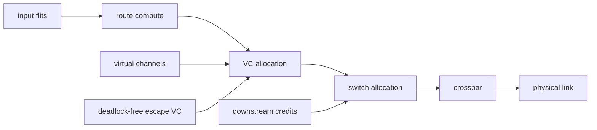
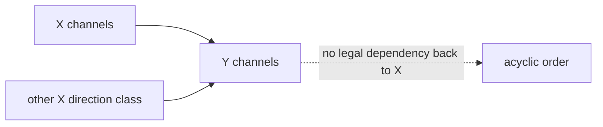
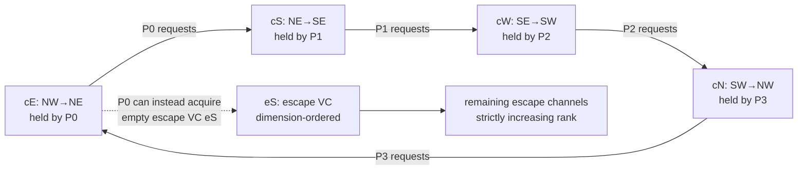

# Routing, Flow Control, and Deadlock — Proving the Network on Chip Continues to Move

> **First-time reader orientation:** Routing chooses a path; flow control ensures the next buffer has space; arbitration chooses which waiting flit moves. Deadlock is a cycle of agents each holding one resource while waiting for another. Credits prevent overflow, while virtual channels and restricted routes can break dependency cycles. These are different guarantees and must be proved separately.

> **Abbreviation key — skim now and return as needed:** store queue (SQ); network on chip (NoC); virtual channel (VC); quality of service (QoS); AXI Coherency Extensions (ACE);
> Coherent Hub Interface (CHI); virtual address (VA).

> **Prerequisites:** [Network-on-Chip Architecture](01_Network_on_Chip.md) (topology, router pipeline, latency), [ACE and CHI](../../01_CPU_Architecture/06_Coherence_and_Consistency/03_ACE_and_CHI.md) (coherence message classes), and basic graph theory.
> **Hands off to:** [NoC and Coherence Simulation](../../01_CPU_Architecture/08_Simulation/02_NoC_and_Coherence_Simulation.md) for measurement and [QoS, Ordering, and I/O Coherence](../05_IO_and_Chiplets/01_QoS_Ordering_and_IO_Coherence.md) for policy.

---

## 0. Why this page exists

A NoC can pass every zero-load latency test and still fail permanently under one unlucky combination of requests. Correctness requires proving that packet dependencies cannot form an unbreakable cycle and that mandatory responses can eventually obtain buffers, credits, routes, and arbitration.

Routing chooses permissible channels; flow control assigns finite storage over time; deadlock analysis proves those choices cannot wait cyclically forever.

## Before the details: progress depends on finite buffers

A packet is divided into flits so routers do not need to store the whole message before forwarding it. In wormhole flow control, the head flit reserves a route while following flits occupy a chain of buffers and links. If the next buffer is full, the packet stops while retaining resources already acquired. This efficient behavior creates dependencies that can form cycles.

A credit represents one available downstream buffer slot. Sending consumes a credit; releasing a slot returns it. Credits prevent overflow but cannot guarantee that a cyclic set of packets will ever release resources. Virtual channels provide separate logical queues on one physical link and can divide dependencies into ordered classes. An escape virtual channel offers a restricted route whose dependency graph is acyclic.

**Beginner checkpoint:** draw nodes for channel resources and directed edges for “may hold A while requesting B.” A cycle identifies potential deadlock. Then include protocol message dependencies and endpoints; proving only router turns is incomplete if a cache controller waits while holding a network resource.

## 1. Packets, flits, and wormhole dependency

A packet is divided into flits. In wormhole switching, the head flit acquires channels while trailing flits occupy buffers along the path. If the head blocks, the packet can hold several upstream channels, creating a chain of dependencies.

For packet size $P$ bits, flit width $F$ bits, $H$ hops, router latency $L_r$, and link latency $L_l$, zero-load latency approximates

$$
L_0=H(L_r+L_l)+\left\lceil\frac{P}{F}\right\rceil-1.
$$

The head flit crosses all $H$ hops in $H(L_r+L_l)$; the remaining $\lceil P/F\rceil-1$ flits then stream in one per cycle behind it — the trailing serialization term.

Under load add queueing and arbitration. Wider flits reduce serialization but enlarge crossbars, buffers, and links; more buffering absorbs bursts but increases area/leakage and can worsen congestion spreading.

## 2. Credit-based flow control

Each upstream virtual channel (VC) tracks free slots downstream. Sending decrements credit; downstream buffer release eventually returns credit. Correct credit accounting invariant:

$$
0\le credit+inflight+occupied=C_{buffer}
$$

with the exact partition depending on where link pipeline slots are counted.

Round-trip credit latency $L_c$ sets a bandwidth-delay product. To sustain one flit/cycle on a VC without credit bubbles,

$$
B_{VC}\gtrsim L_c
$$

flit slots unless multiple VCs interleave. Over-provisioning buffers can hide credit latency but not downstream service shortage.

On/off flow control uses thresholds rather than per-flit credits, reducing control traffic but requiring headroom for in-flight flits after stop is asserted.

## 3. Virtual channels separate waiting classes

Several logical VCs share one physical link but own independent buffer/allocator state. VCs serve three roles:

1. break protocol/routing dependency cycles;
2. prevent one blocked packet from head-of-line blocking unrelated traffic;
3. implement traffic classes/QoS.

One VC per traffic class is not automatically deadlock-free. The proof depends on how routes transition among VCs and how request/response protocol dependencies map onto them.

VC allocation creates a new resource wait: a packet can hold its input VC while requesting an output VC. Switch allocation then arbitrates among allocated heads. Fairness at both stages is needed for liveness.

## 4. Channel-dependency graph

Create one node per channel resource (often direction × link × VC class). Add edge $c_i\rightarrow c_j$ if a packet may hold $c_i$ while requesting $c_j$. A cycle is a **necessary condition** for routing deadlock under standard wormhole assumptions; an acyclic channel-dependency graph is sufficient to avoid it.

Deterministic dimension-order routing in a 2D mesh orders X channels before Y channels. Since a route never returns from Y to X, the dependency graph is acyclic across dimensions.

Turn-model routing forbids selected turns to break cycles while retaining some adaptivity. The proof must include all topology wraparound links, local injection/ejection, and VC transitions.

## 5. Adaptive routing and escape resources

Adaptive routing chooses among minimal or nonminimal paths based on congestion/faults. Flexibility adds dependency edges and can reintroduce cycles. Duato-style designs provide:

- adaptive VCs for performance;
- a connected deadlock-free escape subnetwork;
- a rule that any packet can eventually enter the escape network and follow its restrictions.

The escape path must have reserved/obtainable buffers and fair arbitration. If adaptive traffic can permanently consume escape resources, the proof is hollow.

Nonminimal routing (for example, Valiant-style intermediate routing) balances adversarial traffic at extra hops. It requires enough VC classes to prevent phase transitions from making channel cycles.

### 5.1 Concrete failure: four legal turns close one permanent wait cycle

“A cycle might exist” is too abstract to debug. Construct one in a 2×2 mesh whose routers are northwest (NW), northeast (NE), southeast (SE), and southwest (SW). Let the adaptive routing function permit every clockwise turn, and define four directed channel resources:

- $c_E$: NW→NE; $c_S$: NE→SE; $c_W$: SE→SW; $c_N$: SW→NW.
- Packet P0's body holds $c_E$ while its head at NE requests $c_S$.
- P1 holds $c_S$ and requests $c_W$; P2 holds $c_W$ and requests $c_N$; P3 holds $c_N$ and requests $c_E$.

At the freeze point every requested output VC has zero available credit because another packet owns its buffer. No switch arbiter can grant a transfer, so no input slot drains; without a drained slot no credit returns; without a credit no head advances; without a head advance no tail releases a channel. Waiting longer and making the arbiter fair do nothing. This distinguishes **deadlock** from ordinary blocking: if P1 merely waited for a destination that was guaranteed to consume, an external event would release $c_S$; here every release event is produced only by another member of the same closed set.

The router state that makes this diagnosis possible is not just flit data. For every input VC it needs `{occupancy, packet/owner ID, head/body/tail, route candidates, requested output, allocated output VC, protocol VN, escape-eligible/escape-committed, age}`; for every output VC it needs `{owner, credits, allocation state}`. A debug snapshot can therefore emit a literal wait-for edge `held_output_vc → requested_output_vc`. Joining these edges across routers reconstructs the cycle above.

**Repair A — forbid enough turns to make rank increase.** With dimension-order XY routing, a packet traverses X and then Y and cannot return from Y to X. Assign every legal channel a monotonically increasing rank. At least one dependency needed by the clockwise cycle is now illegal, so this exact occupancy state is unreachable. The hardware is cheap: simple coordinate comparison and no adaptive congestion choice. The losing cases are nonuniform traffic and faults: all packets choose the same minimal path, and a failed link can destroy connectivity unless routing is recomputed under another acyclic rule.

**Repair B — retain adaptive VCs but reserve an escape VC.** Keep the high-throughput adaptive VCs, including their cyclic dependency graph, and add an escape VC that follows an acyclic XY subnetwork. P0 at NE may request the *separate, empty* escape VC `eS`; after it wins and its tail drains $c_E$, P3 receives a credit, then P2, then P1. One transition breaks the four-way cycle. Once a packet enters escape it must not return to adaptive channels, or it could add a dependency edge back into the cycle. The implementation therefore needs an `escape_committed` bit in the head/VC state, escape-specific route compute, independent buffer/credit state, and arbitration that guarantees a continuously requesting packet eventually wins escape service.

The repair is valid only if the escape resource is **reachable and obtainable**, not merely drawn in the block diagram. These losing cases invalidate the proof:

- adaptive traffic is allowed to allocate and permanently occupy the reserved escape buffers;
- the allocator continually favors adaptive requests, so escape eligibility never becomes an escape grant;
- a fault disconnects the XY escape subnetwork but routing keeps using the old proof;
- an endpoint refuses the response that would drain escape traffic;
- route-version changes let old and new escape orders coexist and form a transient cycle.

**PPA and performance trade.** One extra VC does not add link bandwidth; it adds buffer words, read/write pointers, credit counters, VC-allocation request/grant matrix entries, mux inputs, and clocked control. If each of five ports adds depth $D$ at flit width $F$, the raw storage increment is approximately $5DF$ bits per router before error bits and control. More adaptive VCs reduce head-of-line blocking and raise saturation, but allocator delay/energy and verification state grow roughly with the number of VC contenders. A single escape VC minimizes the correctness tax; multiple escape classes may be required when protocol VNs or topology phases have independent dependency orders.

**Counters and assertions that close the proof in RTL.** Record cycles blocked by `{no credit, no output VC, lost switch arbitration, sink backpressure}`, adaptive-to-escape transitions, escape occupancy and maximum wait age, tail releases, and a watchdog's sampled wait-for chain. Assert that an escape-committed packet selects only legal next-rank escape channels; escape ranks strictly increase; adaptive traffic cannot consume reserved escape capacity; credits are conserved; a tail releases exactly its owned VC; and an escape requester receives service within a declared bound under sink-ready assumptions. Formal exploration on a 2×2 or 3×3 instance should cover a near-cycle, force one escape transition, and prove eventual drain. Random traffic that ran for a billion cycles without freezing is evidence of test duration, not a deadlock proof.

## 6. Protocol deadlock versus network deadlock

Even an acyclic routing graph can deadlock at the protocol level:

- requests occupy all buffers;
- progress requires responses;
- responses cannot enter because requests consumed shared resources.

Coherence may have request, snoop, response, data, and retry dependencies. Map classes onto separate virtual networks/buffers according to the protocol dependency graph. Reserve space or provide consumption guarantees for messages that release resources.

Example rule: a node receiving a snoop must be able to accept it and generate a response without waiting for a resource held by the original request. If response injection needs an SQ/cache resource blocked by that request, endpoint microarchitecture participates in the cycle.

## 7. Livelock and starvation

Deadlock is no movement; livelock is movement without destination progress; starvation is one packet waiting indefinitely while others proceed.

Causes:

- adaptive deflection repeatedly reroutes a packet;
- priority traffic continuously wins arbitration;
- retries collide in phase;
- age resets when a packet changes VC/router;
- requestor-specific throttles prevent mandatory responses.

Mitigations:

- monotonically increasing age and oldest-first escape;
- bounded deflection/nonminimal hops;
- fair round-robin or weighted arbitration with aging;
- randomized/exponential retry backoff;
- reserved response/maintenance service;
- formal liveness assumptions on sinks and credits.

Fairness needs a bound when real-time/QoS matters. “Eventually” is insufficient if deadline traffic can wait milliseconds.

## 8. Multicast and reduction dependencies

Coherence snoops and accelerator collectives may replicate or combine packets. A multicast head can reserve several outputs. Atomic multi-output allocation risks deadlock or low utilization; incremental replication needs per-branch state and replay safety.

Design choices:

- source replication into unicasts;
- router replication with branch masks;
- tree-based multicast/reduction;
- destination acknowledgements aggregated in network/home nodes.

Replication amplifies offered load. If average fanout is $K$, a logical message may consume $K$ destination paths plus responses. Model link-level flit-hops, not logical packet count.

## 9. Congestion control

Backpressure is necessary but can spread congestion trees. Control options:

- injection throttling based on local/global occupancy;
- source rate/token control by class/requestor;
- adaptive path selection;
- separating short control from long data packets;
- age-aware arbitration;
- congestion notification to cores/prefetchers;
- admission limits on outstanding transactions.

Stability requires offered load below sustainable service for every cut. Bisection bandwidth gives a topology bound:

$$
\lambda_{cross}\bar{P}<BW_{bisection}.
$$

No router optimization can overcome a workload whose required traffic exceeds the cut.

## 10. Fault-aware routing

Disabled links/routers change the dependency graph. A rerouting algorithm proven for a healthy mesh may deadlock after faults. Approaches:

- recompute acyclic routing tables for the remaining topology;
- preserve an escape spanning tree;
- use additional VCs/classes for detours;
- isolate unreachable partitions and report failure;
- drain or epoch-flush traffic before changing routes.

Dynamic route updates must avoid mixing old/new routes into a transient cyclic dependency. Version routes and quiesce/drain or prove compatibility across versions.

## 11. Verification strategy

### Safety

- credits never underflow/overflow and conserve buffer capacity;
- flits of a packet preserve order and identity;
- tail releases each reserved VC exactly once;
- route outputs are legal and eventually reach the destination;
- multicast replicas/acks are neither lost nor duplicated;
- no message crosses security/QoS domains incorrectly.

### Liveness

- every accepted packet reaches a sink under stated sink/fairness assumptions;
- mandatory responses have an independent progress path;
- retry state cannot oscillate indefinitely;
- escape VC is reachable and fairly served;
- route reconfiguration drains all old-version packets.

Use formal analysis on small parameterizations to find dependency cycles and credit bugs; use random/adversarial simulation for saturation, hotspot, transpose, tornado, and protocol traffic.

## 12. Counters and plots

- injection/acceptance/ejection rate by virtual network and requestor;
- per-link utilization and flit-hop count;
- VC occupancy, credit stalls, allocation stalls;
- packet latency distribution split into serialization, hops, and queueing;
- age/starvation maximums;
- adaptive versus escape route use;
- deadlock watchdog state and blocked-resource chain;
- multicast fanout and replication load;
- saturation curve (latency versus offered load).

Always plot latency against offered/accepted throughput. One point below saturation cannot validate flow control.

## 13. Numbers to remember

- Wormhole packets hold channels while their heads wait, creating dependency chains.
- Credit round-trip sets a buffer bandwidth-delay product.
- VCs are logical resources for deadlock avoidance, head-of-line isolation, and QoS.
- An acyclic channel-dependency graph proves routing deadlock freedom under its assumptions.
- Protocol deadlock can exist even when routing is deadlock-free.
- Adaptive routing needs a reachable, fairly served deadlock-free escape path.

## 14. Worked problems

### Problem 1 — serialization and zero-load latency

A 256-bit packet crosses six hops on a 128-bit link; each hop has 1-cycle router and 1-cycle link latency:

$$
L_0=6(1+1)+\lceil256/128\rceil-1=13\ \text{cycles}.
$$

Queueing under load is additional.

### Problem 2 — credit buffer depth

Downstream credit round trip is 7 cycles and the link sends one flit/cycle. One VC needs at least 7 effective slots/in-flight credits to avoid bubbles. Four VCs with two slots each may collectively fill the link under mixed traffic, but one long packet on a single VC can still bubble.

### Problem 3 — protocol cycle

Requests and responses share every endpoint input slot. All slots fill with requests waiting for invalidation responses, so responses cannot be accepted. Routing continues elsewhere but protocol progress stops. Reserve response capacity or separate virtual networks and ensure response generation does not wait on request-held resources.

## Cross-references

- **Topology/router:** [Network-on-Chip Architecture](01_Network_on_Chip.md).
- **Protocol classes:** [ACE and CHI](../../01_CPU_Architecture/06_Coherence_and_Consistency/03_ACE_and_CHI.md), [Cache Coherence](../../01_CPU_Architecture/06_Coherence_and_Consistency/01_Cache_Coherence.md).
- **Evaluation/policy:** [NoC and Coherence Simulation](../../01_CPU_Architecture/08_Simulation/02_NoC_and_Coherence_Simulation.md), [QoS, Ordering, and I/O Coherence](../05_IO_and_Chiplets/01_QoS_Ordering_and_IO_Coherence.md).

## References

1. W. Dally and B. Towles, *Principles and Practices of Interconnection Networks*.
2. J. Duato, “A Necessary and Sufficient Condition for Deadlock-Free Adaptive Routing in Wormhole Networks,” TPDS 1995.
3. C. Glass and L. Ni, “The Turn Model for Adaptive Routing,” ISCA 1992.
4. gem5, [Garnet 2.0 On-Chip Network Model](https://www.gem5.org/documentation/general_docs/ruby/garnet-2/).
5. L. Peh and W. Dally, “A Delay Model and Speculative Architecture for Pipelined Routers,” HPCA 2001.

---

**Navigation:** [Network on Chip index](00_Index.md) · [Interconnect index](../00_Index.md)
