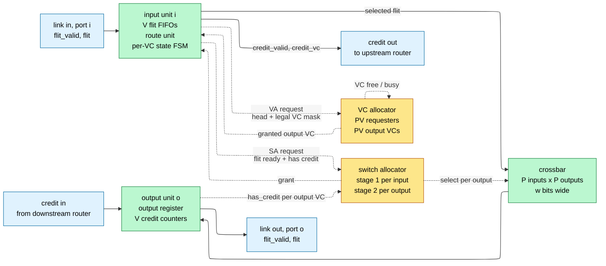
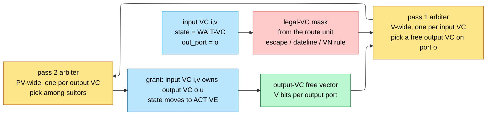
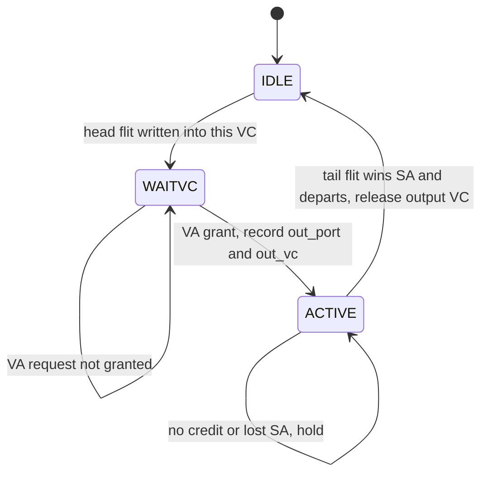
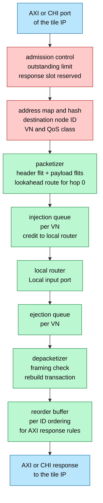
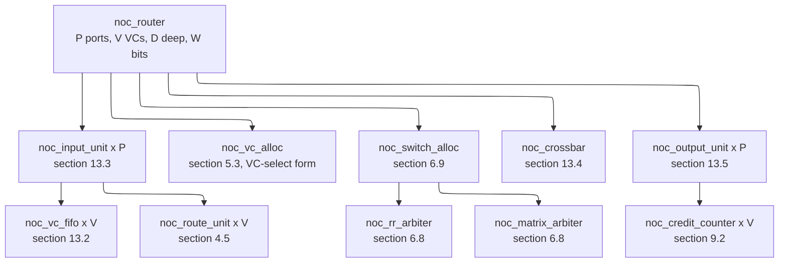

# Router Microarchitecture — building the block the whole fabric is made of

> **First-time reader orientation:** A network-on-chip router is a small, hard, repeated block. It accepts flits on several input links, decides which output link each one needs, arbitrates for the shared crossbar and for a downstream buffer, and drives the flit out — all in one to four clock cycles, forever, at every tile on the die. This page builds that block: its ports, its pipeline, its buffers, its allocators, its crossbar, its credit logic, its RTL, its timing budget, and its verification.

> **Abbreviation key — skim now and return as needed:** network on chip (NoC); virtual channel (VC); virtual network (VN); network interface unit (NIU); register-transfer level (RTL);
> buffer write (BW); route computation (RC); virtual-channel allocation (VA); switch allocation (SA); switch traversal (ST); link traversal (LT);
> next-route computation, that is lookahead routing (NRC); dimension-order routing (DOR); dynamically allocated multi-queue (DAMQ); first in, first out (FIFO); static random-access memory (SRAM);
> flip-flop (FF); gate equivalent, one 2-input NAND (GE); fanout-of-4 inverter delay (FO4); static timing analysis (STA); clock-tree synthesis (CTS);
> integrated clock gate (ICG); dynamic voltage and frequency scaling (DVFS); head of line (HoL); channel dependency graph (CDG); least recently served (LRS);
> SystemVerilog Assertion (SVA); Advanced eXtensible Interface (AXI); Coherent Hub Interface (CHI); quality of service (QoS); power, performance, and area (PPA);
> globally asynchronous, locally synchronous (GALS); clock-domain crossing (CDC); error-correcting code (ECC); intellectual-property block (IP); design rule check (DRC).

> **Prerequisites:** [Network on Chip](01_Network_on_Chip.md) (topology, flit/packet/phit vocabulary, credit flow control, the concept-level RC/VA/SA/ST/LT pipeline, the $1-1/e$ matching-efficiency derivation, and the latency-under-load model that this page's numbers feed), [Routing, Flow Control, and Deadlock](02_Routing_Flow_Control_and_Deadlock.md) (the channel-dependency-graph theorem, escape VCs, turn models, and protocol deadlock — this page *enforces* those rules in gates but does not re-derive them).
> **Hands off to:** [NoC, QoS, IO, and Chiplet Integration Blueprint](../08_Implementation_Blueprints/02_NoC_QoS_IO_and_Chiplet_Integration_Blueprint.md) (assembling these routers into a shipped fabric with QoS policy and chiplet crossings), [Topology Selection and Performance Analysis](04_Topology_Selection_and_Performance_Analysis.md) (choosing the graph these routers sit on, using this page's per-hop latency and allocator efficiency as inputs).

---

## 0. Why this page exists

The NoC page proves that a fabric is the right answer and shows what a router must *do*. It stops one level above the gates: its §5 is titled "the router pipeline as a concept," and a concept does not close timing. Between "the router allocates a VC and then a crossbar timeslot" and a block you can hand to synthesis there is a wide gap containing every decision that actually determines whether the fabric ships: how deep the buffers are and why, which of four allocator circuits you build, whether the crossbar's cost is transistors or metal tracks, where the critical path lands, and what fails when you double the VC count "for performance."

That gap is where NoC projects die. The three characteristic failures are all microarchitectural, not architectural. **(1) The fabric runs at 60 % of its link bandwidth with no congestion anywhere** — because buffer depth is smaller than the credit round-trip and every VC throttles itself (§3, §9). **(2) The router misses its frequency target by 15 %** — because a single-cycle VC-plus-switch allocator was specified with eight VCs, and the allocator's two serial arbitration passes plus the crossbar do not fit in a cycle (§6, §11). **(3) The design deadlocks in silicon after passing a billion cycles of random traffic** — because a shared buffer pool let adaptive traffic starve the escape VC, quietly invalidating the proof from the deadlock page (§3.4, §5.5). None of these are visible in a topology spreadsheet. All three are visible in the equations on this page.

The organizing idea is that a router is a **scheduler wrapped around a small memory and a small switch**, and that its cost, power, and clock period are dominated by exactly three things in this order: the input buffers (area and clock power), the allocators (critical path and throughput), and the crossbar (metal tracks and the wire delay across them). Everything else — the route unit, the credit counters, the output registers — is rounding error. So the page derives each of the three from a baseline that fails, and quantifies the repair.

After working through it you should be able to: size a VC buffer from a credit-loop timing diagram and predict the exact throughput lost if you under-size it; pick between a round-robin, matrix, wavefront, and iSLIP allocator with a delay and area number for each; write the RTL for all of them; predict, before synthesis, which of your parameter choices will fail timing at a stated frequency; compute a router's area and power from its parameters; and state the assertions that make a router's correctness checkable rather than hoped-for.

---

## 1. The router's contract and its ports

### 1.1 What a router promises

A router is a purely local device: it has no idea what the topology is, where the packet came from, or how many hops remain. Its entire specification is a per-port contract, and every correctness argument in the fabric is assembled from copies of it.

**The contract, stated as obligations.** For each input port the router promises:

1. **Losslessness.** Every flit accepted is eventually delivered to exactly one output port. The router never drops, duplicates, or corrupts a flit. There is no retransmission mechanism on chip, so "accepted" is an unbreakable promise.
2. **Per-VC FIFO order.** Flits arriving on input port $i$, virtual channel $v$ depart in the same relative order. The router may interleave *different* VCs arbitrarily on the output link; it may never reorder within one.
3. **Packet atomicity per output VC.** Once a head flit is assigned an output VC, that output VC carries only that packet's flits until its tail departs. No two packets interleave inside one VC.
4. **Backpressure honesty.** The router asserts credit for an input slot only after that slot is genuinely reusable, and it sends a flit downstream only when it holds a credit proving a slot exists there.
5. **Routing legality.** The output port chosen for a packet is one the routing function permits from this node, including all deadlock-avoidance restrictions ([Routing, Flow Control, and Deadlock](02_Routing_Flow_Control_and_Deadlock.md)).

Obligations 1–4 are what makes the fabric a *lossless* network and are checked by the assertions of §14. Obligation 5 is where the deadlock theorems become hardware, in the route unit (§4) and the VC allocator (§5).

### 1.2 The ports

A mesh router has $P$ ports. The canonical mesh value is $P = 5$: four **network ports** (North, South, East, West) that connect to neighbouring routers, and one **local port** that connects to the NIU of the tile this router serves. The local port is not special in the datapath — it is another input and another output — but it *is* special in three ways worth naming now, because they cause real bugs:

- **It is the only injection and ejection point.** Packets enter and leave the fabric only here. A packet that reaches its destination router must be granted the local output; if local ejection can be backpressured indefinitely by the tile, the fabric loses its progress guarantee and every deadlock proof collapses (§10.5).
- **It has no U-turn.** A packet injected from local never immediately ejects to local at the same router unless source equals destination, and a packet arriving from the network never turns back onto the port it came from. Deleting those crosspoints is free crossbar area (§8.4).
- **It usually has a different width and clock.** The NIU often runs in the tile's clock domain at the protocol's data width, so the local port carries a CDC or width-conversion boundary (§10, §12.4).

Each port is a pair of unidirectional channels. In one direction:

| Signal | Direction | Width | Meaning |
|---|---|---|---|
| `flit_valid` | downstream | 1 | a flit is present on the wires this cycle |
| `flit.vc` | downstream | $\log_2 V$ | which input VC at the receiver this flit belongs to |
| `flit.ftype` | downstream | 2 | head / body / tail / head-and-tail |
| `flit.route` | downstream | 3–8 | destination coordinates, or the precomputed next port |
| `flit.payload` | downstream | $w$ | data and protocol fields |
| `credit_valid` | upstream | 1 | one buffer slot freed at the receiver |
| `credit_vc` | upstream | $\log_2 V$ | which VC's slot was freed |

There is **no ready signal**. This is the single most common surprise for readers coming from AXI ([AHB, AXI, APB](../03_Transaction_Protocols/01_AHB_AXI_APB.md)), where `VALID`/`READY` is the universal handshake. A NoC link uses credits instead, for a physical reason: `READY` is a combinational signal that must travel from the receiver back to the sender and be consumed by the sender's send decision *within the same cycle*, which means the link wire delay appears twice in one clock period. A credit is a *registered* signal that arrives late and is merely accumulated in a counter, so the round trip is spread over several cycles and the wire length between routers is bounded only by one-way flight time (§12.2). The cost is buffering: the sender must hold enough credits to cover the loop, which is exactly the sizing equation of §3.5.

### 1.3 Block diagram



**Contract of the figure.** Solid arrows carry flit data — the *datapath*. Dashed arrows carry single-bit requests and grants — the *control plane*. The datapath is wide ($w$ = 128 to 512 bits) and shallow: a flit's entire journey through a router is buffer write, buffer read, one $P{:}1$ mux, one output register. The control plane is narrow (a few bits per VC) and deep: it contains all the arbitration, all the state machines, and all the deadlock rules.

**One concrete trace.** A head flit arrives on the West input carrying destination $(3,1)$ while this router is at $(1,1)$. The input unit writes it into the FIFO for its VC. The route unit reads the destination and produces "East." The per-VC state machine moves from IDLE to WAIT-VC and raises a VA request for East with a legal-VC mask. The VC allocator finds East VC 2 free, grants it, and the state machine moves to ACTIVE. From the next cycle the input unit raises an SA request for East, qualified by `East VC 2 has credit`. The switch allocator's first stage picks this VC over the other three at this input; its second stage picks this input over the other four contending for East; the grant drives the crossbar select for the East output. The flit crosses the mux, lands in the East output register, and goes out on the wire. The input slot is now free, so the input unit returns a credit to the router to its West.

**The trade the figure illustrates.** Notice that the control plane touches every stage and the datapath touches none of the decisions. That separation is what lets you scale the flit width from 128 to 512 bits without changing a single line of allocator logic — the crossbar and buffers get wider, the arbiters do not. It is also what makes the *control* plane the frequency limiter (§11): the datapath is one mux deep, while the control path is two serial arbitration passes plus a decode.

### 1.4 Datapath versus control: the split that governs the whole design

State this split precisely, because every later section is an argument about one side of it.

| | Datapath | Control plane |
|---|---|---|
| Carries | flit payload, $w$ bits | requests, grants, credits, pointers: $O(PV)$ bits |
| Scales with | $w$ (linear), $P$ (quadratic in wires) | $P$ and $V$ (quadratic in allocator logic) |
| Dominates | area and dynamic energy | clock period |
| Elements | FIFOs, muxes, registers | arbiters, state machines, counters |
| Verification risk | low, structurally checkable | high, this is where deadlock and starvation live |
| Cheap knob | narrow the flit and serialize | fewer VCs, more pipeline stages |

Two consequences follow immediately and are worth carrying through the page:

- **Widening flits is nearly free in *time* and expensive in *area and energy*.** The mux delay of a $P{:}1$ crossbar is $\log_2 P$ levels regardless of $w$; only the span wires lengthen (§8.5). So if you need bandwidth and can afford the metal, widen. If you need frequency, do not narrow the flit — attack the control plane.
- **Adding VCs is nearly free in *area* and expensive in *time*.** One more VC adds $D \cdot w$ bits of buffer per port (real, but linear), while it adds $O(V)$ to the first allocator stage and $O(PV)$ fan-in to the second (§6.7). So VC count is a *frequency* decision disguised as a performance decision. §11's worked budget shows a design that closes at $V=4$ and fails at $V=8$ with everything else identical.

---

## 2. The canonical pipeline, stage by stage

### 2.1 The six stages and what each one touches

The NoC page derives *why* the stages exist from the router's three logical jobs. Here is what each one physically reads, writes, and costs. Assume $P=5$, $V=4$, $D=8$ slots per VC, $w=128$, and the FO4 delay model of §11.2.

**BW — buffer write.** *Reads:* `flit_valid`, `flit.vc`, the flit payload from the input register; the write pointer for that VC. *Writes:* one word of the VC's FIFO; the write pointer; the occupancy counter; the per-VC "head arrived" flag. *Combinational depth:* a $\log_2 V \to V$ decode, an AND with `flit_valid` to form write enables, and the write-data broadcast to $D$ slots. About **3 FO4** of logic plus the wire fanout to $V \cdot D = 32$ slot registers, which is really a buffering problem, not a logic problem. *Why it cannot merge with RC:* it can, and in good designs it does — see §2.4. The reason it exists as a nameable stage is that the flit must be *stored* before anything can be decided about it, because the allocation decision may not succeed this cycle and the flit must survive.

**RC — route computation.** *Reads:* the head flit's destination field and this router's hardwired coordinates. *Writes:* the per-VC `out_port` register (and, with lookahead, the flit's own `nrc` field). *Combinational depth:* for dimension-order routing, two magnitude comparisons of $\lceil\log_2 k\rceil$ bits and a 4-way priority select — **3 to 4 FO4** for a $k \le 16$ mesh. For a table-based route unit, a small RAM read: **6 to 10 FO4** including the address decode and the bit-line sense. *Why it cannot merge with VA in the naive router:* VA needs `out_port` to know *which* output port's VCs to request, so RC feeds VA combinationally. Chaining them costs $4 + 15 \approx 19$ FO4 in one cycle, which is affordable at 2 GHz but not at 3 GHz. Lookahead routing (§4.4) removes this dependency entirely by computing `out_port` one hop early, which is why every production router uses it.

**VA — virtual-channel allocation.** *Reads:* for every input VC in state WAIT-VC: its `out_port`, its legal-VC mask, and the busy/free status of all $PV$ output VCs. *Writes:* the per-input-VC `out_vc` register, the output-VC ownership table. *Combinational depth:* two serial arbitration passes. Pass 1 is $PV$ arbiters of $V$ inputs each; pass 2 is $PV$ arbiters of up to $PV$ inputs each. For $P=5$, $V=4$: pass 1 is a 4-input round robin (**6 FO4**), pass 2 is a 20-input matrix arbiter (**5.5 FO4** including the wide fan-in tree), plus request routing wires — about **15 FO4** total (§11.3). *Why it cannot merge with SA in the naive router:* SA must know that a downstream buffer exists before it moves a flit, and "a downstream buffer exists" means "an output VC has been granted and it has credit." Speculation (§7) is precisely the trick that breaks this dependency, at the cost of wasted allocator slots.

**SA — switch allocation.** *Reads:* for every input VC in state ACTIVE with a non-empty FIFO: its `out_port`, its `out_vc`, and `has_credit[out_port][out_vc]`. *Writes:* the crossbar select for each output port, the FIFO read pointers for winners, the arbiter pointers. *Combinational depth:* again two passes — $P$ arbiters of $V$ inputs (pick one VC per input port), then $P$ arbiters of $P$ inputs (pick one input per output port). About **12 FO4** for $P=5$, $V=4$ (§11.3). *Why it cannot merge with ST:* it can, and usually does — SA and ST in one cycle is the standard arrangement, and §11's budget shows it closing at 2 GHz with margin. What cannot be merged is SA with *itself* across two flits: SA runs every cycle for every flit, so its latency is not amortizable over a packet the way RC and VA are.

**ST — switch traversal.** *Reads:* the selected flit from each input unit's FIFO read port, the crossbar selects. *Writes:* the output registers. *Combinational depth:* a $P{:}1$ mux, $\lceil\log_2 5\rceil = 3$ levels of 2:1 mux (**4.4 FO4**), plus the span wire across the crossbar array (**0.7 FO4** at $w=128$, **2.5 FO4** at $w=512$ — §8.5). *Why it cannot merge with LT:* it can only if the link is short enough that mux plus wire fits in the residual cycle. Since the crossbar output is the natural place to register (it is the point where $P$ sources become 1), ST-then-register-then-LT is the default.

**LT — link traversal.** *Reads:* the output register. *Writes:* the next router's input register. *Combinational depth:* pure wire — repeated intermediate metal at roughly **70 ps/mm** at a 7 nm-class slow corner (§12.2), so a 1.25 mm mesh link is about **88 ps**, or 9 FO4. *Why it cannot merge with BW:* it can, and does — the receiving router's BW happens in the cycle after the flit lands in its input register, so LT and BW are adjacent, not fused. What forces LT to be its own stage on long links is arithmetic: at 2 GHz a link longer than about 5 mm no longer fits in one cycle and must be pipelined (§12.2), which adds a hop of latency and, critically, *lengthens the credit round trip* and therefore the required buffer depth (§3.5).

### 2.2 The pipeline in time, with credits

```wavedrom
{ "signal": [
  { "name": "clk",                    "wave": "p..........." },
  { "name": "link in, from upstream", "wave": "3454x.......", "data": ["H","B0","B1","T"], "node": "a..........." },
  { "name": "BW  write into VC FIFO", "wave": "x3454x......", "data": ["H","B0","B1","T"] },
  { "name": "RC and VA, head only",   "wave": "x.3x........", "data": ["H"] },
  { "name": "SA  switch allocation",  "wave": "x..3454x....", "data": ["H","B0","B1","T"] },
  { "name": "ST  crossbar",           "wave": "x...3454x...", "data": ["H","B0","B1","T"] },
  { "name": "LT  on the output link", "wave": "x....3454x..", "data": ["H","B0","B1","T"] },
  { "name": "credit out to upstream", "wave": "0....1...0.." },
  { "name": "credits at upstream",    "wave": "=====.====..", "data": ["8","7","6","5","4","5","6","7","8"], "node": "......b....." },
  { "name": "tail releases out VC",   "wave": "0......10..." }
 ],
 "edge": ["a~>b credit round trip = 6 cycles"],
 "head": {"text": "One 4-flit packet through a 3-stage router: head pays RC and VA once, every flit pays SA, ST, LT"}
}
```

**Contract of the figure.** Each row is a pipeline stage; a coloured box means "this flit occupies this stage during this cycle." The credit rows show the same router's *upstream* neighbour, so you can see the loop close.

**Trace it.** The head arrives on the link in cycle 0 and is written into its VC FIFO in cycle 1. In cycle 2 the route unit and the VC allocator run — once, for this packet only. From cycle 3 the head competes for the crossbar, wins, traverses in cycle 4, and is on the outgoing wire in cycle 5. B0 arrived one cycle behind the head and could have been buffer-written in cycle 2, but it cannot reach SA until cycle 4, because the head occupied the crossbar in cycle 4 and a VC delivers flits in order. So the body and tail follow the head at exactly one flit per cycle — the packet becomes a train, which is the whole point of wormhole flow control. Per-hop latency for the head is **3 cycles** (BW, RC+VA, SA) plus ST plus LT; the body flits inherit the route and the VC and pay only SA, ST, LT.

**The trade it illustrates.** Two things are visible that a block diagram cannot show. First, the head's 3-cycle latency is paid *at every hop* and is therefore multiplied by $\bar h$ in the fabric's zero-load latency — which is the entire motivation for §7's pipeline collapsing. Second, the credit for the head's input slot is not returned when the head is *written* but when it *departs* in cycle 4, and it does not increment the upstream counter until cycle 6. That six-cycle loop is the number that sizes the buffer (§3.5), and it grows by two for every pipeline flop you add to the link.

### 2.3 Why the stage boundaries are where they are

The stage list is not arbitrary; each boundary exists because merging across it costs either correctness or frequency. Stated as a rule per boundary:

- **BW | RC** — mergeable, and merged in every modern router via lookahead (§4.4). The naive separation exists only because the flit must be readable before its header can be decoded, which is a register-file read, not a logical necessity.
- **RC | VA** — a *data* dependency: VA cannot form its request vector without knowing the output port. Removable only by computing the route earlier (lookahead), not by speculating, because a speculative port choice would request the wrong output VCs and could be granted one that is illegal for the packet's deadlock class. Never speculate the route.
- **VA | SA** — a *resource* dependency: SA must not move a flit into a buffer that has not been reserved. Removable by speculation (§7.1) because the recovery is cheap: an unreserved flit that wins SA simply does not leave, and the wasted crossbar slot costs throughput, not correctness.
- **SA | ST** — mergeable and normally merged. Separating them buys frequency at the cost of one cycle of latency per hop and, worse, one more cycle of credit round trip.
- **ST | LT** — a *physical* boundary set by wire length. Not a design choice below about 5 mm; mandatory above it.

Notice the asymmetry: the only boundary you may collapse with *speculation* is VA | SA, because it is the only one whose violation is recoverable. That single observation is why "speculative switch allocation" exists and "speculative route computation" does not.

### 2.4 The four pipeline depths you will actually see

| Depth | Stages per hop | How it is achieved | Head latency per hop | Typical use |
|---|---|---|---|---|
| 5 | BW, RC, VA, SA, ST (+LT) | textbook, nothing optimized | 5 + LT | teaching, first RTL |
| 4 | BW, RC, VA, SA+ST (+LT) | merge SA and ST | 4 + LT | conservative, high frequency |
| 3 | BW, VA, SA+ST (+LT) | lookahead routing removes RC | 3 + LT | common baseline |
| 2 | BW, VA-and-speculative-SA + ST (+LT) | lookahead + speculation | 2 + LT | production mesh routers |
| 1 | everything, with pre-arbitration | lookahead + advance bundles + bypass | 1 + LT | latency-critical, costs 15–30 % $f_{max}$ |

The body/tail flits are one cycle shallower than the head in every row, because they skip RC and VA. On an $8\times8$ mesh with $\bar h = 5.25$ hops, moving from the 4-stage to the 2-stage router removes $5.25 \times 2 \approx 10.5$ cycles from the average packet's latency — against a zero-load latency of roughly 26 cycles ([Network on Chip](01_Network_on_Chip.md) §6), that is a **40 % latency cut for no change in topology**. This is the single largest lever in the router, and §7 spends its whole length on it.

---

## 3. Buffer organization — the dominant area and power term

### 3.1 The baseline and why it is the biggest thing in the router

Start with the simplest structure that satisfies the contract: **one private FIFO per input VC**, $D$ flits deep, $w$ bits wide, replicated across $P$ input ports. Total storage:

$$
S \;=\; P \cdot V \cdot D \cdot w \quad \text{bits}
$$

For a mesh router with $P=5$, $V=4$, $D=8$, $w=128$: $S = 5 \times 4 \times 8 \times 128 = 20{,}480$ bits. That is not a large memory by SoC standards, but it is large *relative to the rest of the router*: the crossbar is $5 \times 128 = 640$ mux bits of logic, the allocators are a few hundred gates, and the credit counters are 20 small counters. Buffers are typically **50–70 % of router area** and, once you count the clock, an even larger share of router power (§3.7). Every subsequent choice in this section is an attempt to make $S$ smaller without losing throughput.

### 3.2 Private per-VC queues: the baseline that wastes half its slots

**How it works.** Each of the $V$ VCs at an input port owns $D$ dedicated slots, addressed by its own write and read pointer. One write port suffices because at most one flit arrives per input port per cycle and it belongs to exactly one VC. One read port suffices because switch allocation grants at most one VC per input port per cycle (absent input speedup, §8.3).

**Why it is attractive.** Nothing can go wrong. A VC can never be starved of storage by another VC, so the escape-VC guarantee from the deadlock page is structurally true and needs no reservation logic. Pointer management is two counters. Allocation is nothing at all.

**Where it fails.** Traffic is bursty and unbalanced. Consider four VCs at an input port where VC0 carries a long data packet stream and VC1–VC3 are idle request channels. VC0 wants 20 slots; it has 8, so it stalls its upstream neighbour and the link idles. Meanwhile 24 slots sit empty in VC1–VC3. Measure it: under a typical coherent-mesh mix, average per-VC occupancy across a router runs **10–20 %**, while the *maximum* VC occupancy in a burst pins at $D$. The private organization sizes for the maximum and pays for it $V$ times over.

**The cost of the failure, quantified.** To give the busy VC an effective depth of 16 you must set $D = 16$ for all four, so $S$ doubles to 40,960 bits and the router's dominant area term doubles — to serve a condition that holds for one VC at a time.

### 3.3 Dynamically allocated multi-queue (DAMQ): share the slots, keep the queues

**The derived repair.** Decouple *slot ownership* from *queue identity*. Put all $V \cdot D$ slots of an input port in one physical array and give each VC a **linked list** through them. Per VC you keep a head pointer and a tail pointer; per slot you keep a `next` pointer; a **free list** holds the unallocated slots.

- **Push into VC $v$:** pop a slot index $s$ from the free list, write the flit to slot $s$, set `next[tail[v]] = s`, set `tail[v] = s`. If VC $v$ was empty, also set `head[v] = s`.
- **Pop from VC $v$:** read slot `head[v]`, set `head[v] = next[head[v]]`, push the old index back onto the free list.

**What it buys.** Any single VC can now grow to nearly the whole pool. Empirically, a DAMQ pool of $M$ slots delivers the throughput of private queues with $M/2$ to $M/1.5$ slots *per VC* under bursty traffic — that is, you can shrink from $V \cdot D = 32$ slots to about $12$–$16$ shared slots at equal performance. At $w=128$ that is a **50 % cut in the router's largest area term**.

**What it costs.**

- **A `next`-pointer array.** $M$ entries of $\log_2 M$ bits: for $M=16$, $16 \times 4 = 64$ bits. Negligible in area, but it is a second array that must be read and written every cycle.
- **A pointer chase in the read path.** Naively, popping requires reading `head[v]`, then reading `next[head[v]]` — two dependent array reads in one cycle. The standard fix is to keep the head *and* the head's successor in registers, updating both on every pop, so the array read is off the critical path. This is a real design cost: it adds a small shadow-register file and a corner case when the queue has fewer than two entries.
- **Free-list management.** One push and one pop per cycle on a small LIFO. Simple, but it is state that must be proven never to leak a slot — a leaked slot is a permanent capacity loss that presents in silicon as slow degradation.
- **Per-VC reservation, which is a correctness requirement.** This is the important one.

### 3.4 The DAMQ correctness trap: shared buffers can invalidate the deadlock proof

The deadlock page's escape-VC argument requires that a blocked packet can *always eventually obtain* an escape channel. With private queues that is structural: the escape VC's $D$ slots belong to it and nothing else. With a shared pool it is false by default. A flood of adaptive traffic can occupy every slot in the pool, so the escape VC has no buffer, so no packet can step onto the escape network, so the acyclic drain path does not exist and the whole proof evaporates. The network deadlocks even though every routing decision was legal.

The repair is a **per-VC reservation floor**: refuse to allocate a slot from the free list to VC $v$ unless either $v$ is below its reserved count $R_v$, or the number of free slots exceeds $\sum_u R_u$ counted over VCs that are currently below their floor. In practice:

$$
M \;\ge\; \sum_{v} R_v \;+\; M_{\text{shared}}, \qquad R_{\text{escape}} \;\ge\; L_{\text{pkt}} \ \text{(atomic VC reallocation)} \ \text{or}\ 1 \ \text{(non-atomic)}
$$

where $M$ is the pool size, $R_v$ the reserved slots for VC $v$, $L_{\text{pkt}}$ the maximum packet length in flits. With atomic VC reallocation (§5.6) an output VC is held for a whole packet, so the escape VC's reservation must hold a whole packet or a partially-drained packet can still wedge. Setting $R_{\text{escape}} = L_{\text{pkt}} = 5$ and $R_v = 1$ for three adaptive VCs gives $\sum R_v = 8$; a pool of $M=16$ then has 8 genuinely shared slots. The sharing gain shrinks from 2× to about 1.6×, which is the honest number for a DAMQ in a deadlock-sensitive fabric.

**Selection boundary.** DAMQ is worth its complexity when $V \ge 4$, when traffic is bursty and class-imbalanced, and when buffer area is genuinely binding. For $V = 2$ the sharing gain is small (two queues cannot be very imbalanced) and the pointer machinery costs more than it saves. Most 2-VC embedded routers use private queues; most 6–10-VC coherent-mesh routers use a shared or partially-shared pool.

### 3.5 The single most important sizing equation: depth from the credit round trip

**The question.** How deep must a VC's buffer be for a single packet on that VC to stream at one flit per cycle with no contention anywhere?

**The derivation.** A flit sent at cycle $t$ occupies a downstream slot. That slot is not reusable by the sender until the sender *knows* it is free, which happens when the credit lands in the sender's counter. Call that delay $t_{crt}$, the credit round trip. Between $t$ and $t + t_{crt}$ the sender can only send using *other* credits. So the sender can sustain one flit per cycle only if it holds at least $t_{crt}$ credits at the start — that is, only if the VC has at least $t_{crt}$ slots. Below that, the achievable rate is exactly the number of credits divided by how long each one takes to come back:

$$
\boxed{\;U \;=\; \min\!\left(1,\; \frac{D}{t_{crt}}\right)\;}
\qquad\Longrightarrow\qquad
D_{\min} \;=\; \lceil t_{crt} \rceil
$$

where $U$ is the sustained per-VC link utilization, $D$ the buffer depth in flits, and $t_{crt}$ the credit round trip in cycles. This is a bandwidth-delay product identical in form to AXI outstanding-transaction sizing and to Little's law with $\lambda = 1$; the NoC page states the identity, and here is the cycle-by-cycle accounting behind it.

**Counting $t_{crt}$ honestly.** From the waveform of §2.2, with a 3-stage router and a single-cycle link:

| Contribution | Cycles | Why |
|---|---|---|
| ST: flit into the sender's output register | 1 | the send decision commits here; credit is decremented |
| LT: flit on the wire into the receiver's input register | 1 | one registered link stage |
| BW: flit written into the VC FIFO | 1 | the slot is now occupied |
| earliest SA grant that pops the slot | 1 | the flit must be visible to SA before it can win |
| credit generation and LT back | 1 | registered credit on the return wire |
| credit counter update at the sender | 1 | counter is visible to the send decision next cycle |
| **$t_{crt}$** | **6** | |

So $D_{\min} = 6$, and designs round to 8 for pointer convenience and margin. Now add one pipeline flop to the forward link and one to the credit return (a 2 mm link at 2 GHz): $t_{crt} = 8$, $D_{\min} = 8$. Add two flops each way (a die-crossing or a chiplet hop): $t_{crt} = 10$, $D_{\min} = 10$ and you should build 12.

**The bubble, shown.** With $D = 2$ and $t_{crt} = 6$ the sender fires two flits, runs out of credits, and waits four cycles for the first to come back:

```wavedrom
{ "signal": [
  { "name": "clk",                 "wave": "p............." },
  { "name": "send flit on VC",     "wave": "11000011000011" },
  { "name": "credits at sender",   "wave": "===...=.=...=.", "data": ["2","1","0","1","0","1"] },
  { "name": "stalled, no credit",  "wave": "0.1...0.1...0." },
  { "name": "credit returning",    "wave": "0.....10....10" }
 ],
 "head": {"text": "D=2 against a 6-cycle credit round trip: 2 flits sent every 6 cycles = 33 percent link utilization with zero contention"}
}
```

Read the pattern: the send waveform is high in cycles 0–1, dead in 2–5, high in 6–7, dead in 8–11. Two sends per six cycles is $U = 2/6 = 33\,\%$, exactly $D/t_{crt}$. Nothing is congested. No other traffic exists. The link is one third utilized purely because the buffer is short. This is the bug behind the perennial question "why is my link stuck at 60 %," and it is invisible in a topology model, which assumes links carry one flit per cycle.

**The escape hatch, and its limit.** Multiple VCs sharing the link do fill the gap: if $V$ VCs each have $D$ slots and all are active, the *link* can be saturated as long as $V \cdot D \ge t_{crt}$. So a 4-VC router with $D=2$ and $t_{crt}=6$ can keep the link busy — with four independent flows. It cannot make any *single* flow exceed 33 %, so a fabric carrying a few fat streams (a DMA burst, an accelerator tensor transfer) still suffers. Size $D \ge t_{crt}$ if single-flow bandwidth matters; size $V \cdot D \ge t_{crt}$ if only aggregate link utilization matters.

### 3.6 Flip-flops, latch arrays, or SRAM: the crossover

The same $S$ bits can be built three ways, and the choice is decided almost entirely by *instance size*, not by total capacity.

| Implementation | Area per bit | Ports available | Read latency | Practical floor |
|---|---|---|---|---|
| Standard-cell flip-flops + mux tree | 5 GE for the flop, ~1.5 GE for the read mux share → **~6.5 GE/bit** | any number, free | combinational read | none |
| Latch-array / compiled register file | **~1.8 GE/bit** + decoders and drivers | 1W1R typical, 2R at ~1.4× | combinational or 1 cycle | ~256 bits per instance |
| Compiled SRAM macro (6T single-port, 8T dual-port) | **~0.35 GE/bit** of bit cell, plus **800–1500 µm² of fixed periphery per macro** | 1RW, or 1R1W in 8T | 1 cycle, fixed | ~8–16 Kb before periphery amortizes |

Work the arithmetic for one input port's buffers, $V \cdot D \cdot w = 4 \times 8 \times 128 = 4096$ bits, at a 7 nm-class density of $0.03\ \mu\text{m}^2$ per GE:

- **Flops:** $4096 \times 6.5 = 26{,}600$ GE $= 800\ \mu\text{m}^2$.
- **Latch array:** $4096 \times 1.8 = 7{,}400$ GE $= 220\ \mu\text{m}^2$, plus roughly $80\ \mu\text{m}^2$ of decode and drivers $\approx 300\ \mu\text{m}^2$. **2.7× smaller than flops.**
- **SRAM macro:** the bit cells are only $4096 \times 0.35 \times 0.03 = 43\ \mu\text{m}^2$, but the periphery is $\approx 1000\ \mu\text{m}^2$ — **more than three times the latch array**, for a memory that is 96 % periphery.

The crossover is where periphery amortizes: below roughly **8 Kb per instance, SRAM loses**; above roughly 16 Kb it wins decisively. A router's per-port buffer is 2–8 Kb, which lands it squarely on the wrong side. This is why **router buffers are flop or latch arrays and never SRAM macros**, while the NIU's reorder buffer (§10.4, tens of kilobits) is always an SRAM macro. There is a second, harder reason: an SRAM macro's read is a *registered* cycle with a fixed latency and a fixed port count, so a single-port macro cannot serve one write and one read to different VCs in the same cycle, and a 1R1W macro at these depths costs more periphery still.

**Port count forced by organization.** This is the constraint that quietly decides the implementation:

- **Private per-VC FIFOs, no speedup:** 1 write, 1 read per *port*, and the read is a $V \cdot D {:} 1$ mux across the whole array. Flops handle this natively; the mux is the cost.
- **DAMQ shared pool:** 1W1R on the data array *plus* 1W1R on the `next` array *plus* 1 pop and 1 push on the free list. Three arrays, all small, all single-ported.
- **Input speedup $S_i = 2$ (§8.3):** two flits leave one input port per cycle, so the data array needs **2 read ports**. In flops that is a second read mux (about +1.5 GE/bit, +23 %); in a compiled array it is a 2R1W macro at roughly 1.4× the bit-cell area. This is why input speedup is affordable in a flop-based router and awkward in an array-based one.

### 3.7 Area and power arithmetic for a realistic 5-port router

Parameters: $P=5$, $V=4$, $D=8$, $w=128$, 7 nm-class library, $V_{dd} = 0.75$ V, $f = 2$ GHz, $0.03\ \mu\text{m}^2$/GE.

**Area.**

| Block | Derivation | GE | Area |
|---|---|---|---|
| Input buffers, latch array | $20{,}480$ bits × 1.8 GE | 36,900 | $1{,}110\ \mu\text{m}^2$ |
| Buffer decode, pointers, occupancy | 20 VCs × ~120 GE | 2,400 | $72\ \mu\text{m}^2$ |
| Crossbar mux logic | $5 \times 128 \times 4$ GE | 2,560 | $77\ \mu\text{m}^2$ |
| VC allocator | $PV=20$ small arbiters + 20 wide arbiters | 3,500 | $105\ \mu\text{m}^2$ |
| Switch allocator | 5 × RR(4) + 5 × matrix(5) | 900 | $27\ \mu\text{m}^2$ |
| Route units, 5 ports | DOR + lookahead | 400 | $12\ \mu\text{m}^2$ |
| Credit counters, 20 | 4-bit up/down + compare | 800 | $24\ \mu\text{m}^2$ |
| Output registers, 5 × 134 bits | 5 GE/bit | 3,350 | $100\ \mu\text{m}^2$ |
| **Cell total** | | **50,800** | **$1{,}530\ \mu\text{m}^2$** |
| Crossbar wire footprint (§8.2) | $(P w \cdot \text{pitch})^2$ | — | $4{,}100\ \mu\text{m}^2$ of routing area |

At 65 % placement utilization the cells occupy about $2{,}350\ \mu\text{m}^2$; the crossbar's metal demand is what actually sets the block outline, so a realistic router footprint is **0.004–0.006 mm²**, and buffers are **73 % of the cell area**. Scale-check this against published silicon: a 5-port, 4-VC router in a 45 nm process measures 0.1–0.3 mm²; dividing by the $(45/7)^2 \approx 41\times$ density ratio gives 0.0024–0.007 mm². The model is in range.

**Power.** Three terms, and the ranking is the surprise.

*Clock power of the buffer array.* Every one of the $S = 20{,}480$ storage bits is a clocked flip-flop or latch. Taking an effective clock-pin plus local-clock-buffer capacitance of $C_{ck} \approx 1.5$ fF per bit:

$$
P_{clk} = S \cdot C_{ck} \cdot V_{dd}^2 \cdot f = 20{,}480 \times 1.5\times10^{-15} \times 0.75^2 \times 2\times10^{9} = \mathbf{34.6\ mW}
$$

*Dynamic energy per flit.* Per bit, taking activity $\alpha = 0.5$ for random payload data:

| Event | Effective $C$ per bit | Energy per 128-bit flit |
|---|---|---|
| Buffer write | 2.0 fF | $0.5 \times 128 \times 2.0\text{f} \times 0.5625 = 72$ fJ |
| Buffer read through the mux tree | 1.5 fF | 54 fJ |
| Crossbar mux + 64 µm span | 12.8 fF | 461 fJ |
| Link, 0.5 mm repeated | 100 fF | 3.6 pJ |

At 30 % average link utilization a router moves $0.3 \times 5 = 1.5$ flits per cycle, i.e. $3\times10^{9}$ flit-hops per second. Dynamic power is $3\times10^{9} \times (72 + 54 + 461 + 3600)\ \text{fJ} = 12.6$ mW, of which the *link* is 10.8 mW.

*Total, ungated:* $34.6 + 12.6 + \approx 2$ mW of control $= \mathbf{49\ mW}$ per router, so **3.1 W for a 64-router mesh**. Clock is 71 % of it.

**The lever this exposes.** The buffer array is written 1.5 times per cycle out of 160 possible 128-bit words, and read a similar number of times. Clock-gating at word granularity — one ICG per 128-bit word, enabled only when that word is written — removes essentially all of the 34.6 mW, leaving the ICG cells' own clock load and the always-on pointer and control flops. Realistically the array's clock power falls **10–15×**, to 2–3 mW, and the router lands at **17–18 mW**, matching published measurements once scaled. After that fix, links are 61 % of router power and the next lever is physical, not logical (§12.5). Worked problem 5 does this end to end.

---

## 4. Route computation

### 4.1 What the route unit must produce

For a head flit, the route unit answers: **which output port, and which output VCs am I allowed to ask for?** The second half is not optional decoration — it is where the deadlock theorems of the prerequisite page become gates. The route unit's outputs are therefore a pair:

- `out_port`: one of $P$ values, or a *set* of productive ports if the routing is adaptive.
- `vc_mask`: a $V$-bit vector marking which output VCs on that port this packet may legally occupy.

Everything downstream — VA, SA, the crossbar — consumes only these. Change the routing algorithm and only this unit changes.

### 4.2 Table versus algorithmic

**Algorithmic (combinational).** Compute the port from the destination coordinates with comparators. For dimension-order routing on a mesh the entire unit is two magnitude comparators and a 4-way priority select — under 100 gates, 3–4 FO4, and it scales to any mesh size for free.

- *Gains:* smallest, fastest, no state, no configuration, no boot sequence.
- *Costs:* the routing function is frozen in silicon. You cannot reroute around a failed link, cannot partition the fabric for a virtualized SoC, cannot change the algorithm after tape-out.

**Table-based.** A small RAM indexed by destination node ID, holding the output port (and optionally the VC class) for each destination. For a 64-node mesh, $64 \times 3 = 192$ bits per router, plus a configuration path to write it.

- *Gains:* arbitrary routing functions, including irregular topologies, fault-avoiding routes, and per-region isolation. Reconfigurable at run time by software.
- *Costs:* a RAM read in the RC path (6–10 FO4 versus 3–4); a configuration bus and boot-time programming; and a much heavier correctness burden — **any table the software can write is a routing function whose CDG must be acyclic**, so either the software is trusted to install only acyclic tables, or the hardware must restrict what tables are writable. A mis-programmed table is a silent deadlock.
- *Scaling:* the table is $O(N)$ entries per router, so at 256 nodes it is 768 bits per router and the RAM read starts to matter. Large fabrics use *region* tables (route by destination region, then by node inside the region) to keep the table logarithmic.

**Selection boundary.** Use algorithmic routing for a regular mesh or torus with no fault-tolerance requirement — the overwhelming majority of on-die fabrics. Use tables when the topology is irregular (a chiplet fabric with heterogeneous tiles), when link/router repair after test is required, or when the fabric must be partitioned between security domains. A common hybrid: algorithmic DOR as the default, with a small table of *exceptions* for faulty or partitioned links.

### 4.3 Source routing versus distributed routing

**Distributed** is what the above describes: each router decides. **Source routing** puts the whole path in the header — a list of turn or port codes, one per hop — and each router consumes the first entry and shifts the rest.

Arithmetic decides this one. For a $k \times k$ mesh with diameter $2(k-1)$, the source route needs $2(k-1) \times \lceil\log_2 5\rceil = 2(k-1)\times 3$ bits. At $k=8$ that is $14 \times 3 = 42$ header bits, versus 6 bits for the destination coordinates. At $k=16$ it is 90 bits versus 8. Since the header competes for space in a 128-bit flit against transaction ID, opcode, address, and QoS fields (§10.2), source routing is affordable only in small fabrics.

- *Gains:* zero route logic in the router (a shift and a 3-bit select), trivially supports arbitrary and per-flow paths, and makes path selection a software policy — useful for accelerator NoCs where a compiler schedules the traffic.
- *Costs:* header growth as above; every source must hold a routing table for every destination; and reconfiguration must quiesce the fabric because in-flight packets carry the *old* route, which is exactly the transient-cycle hazard the deadlock page warns about.
- *Where it wins:* software-scheduled accelerator fabrics and small embedded rings, where paths are static and headers are short.

### 4.4 Lookahead routing: taking RC off the critical path

**The failure being repaired.** In the naive pipeline the route must be known before VA can form its request, and both must complete before SA. That is $4 + 15 + 12 = 31$ FO4 of serial control logic, which does not fit in a 2 GHz cycle alongside the crossbar. Pipelining it costs a cycle of latency at every hop, multiplied by $\bar h$.

**The repair.** Observe that a router knows its own coordinates *and* its neighbours' coordinates, both hardwired. So router $A$ can compute not only "this packet leaves me on the East port" but also "when it arrives at $B$, it will leave $B$ on the North port." Carry that second answer in the flit as an `nrc` field. Then at $B$, the output port is not computed at all — it is *read out of the flit* along with the payload, available the instant the flit is buffer-written, at zero logic depth.

This is **next-route computation (NRC)**, universally called lookahead routing. The route unit still runs at every hop, but it now runs *in parallel with VA and SA for the current flit*, computing the port for the next hop. It has an entire cycle to itself and never appears on any critical path.

**Cost.** Three or four extra bits in every head flit; a route unit that must model the neighbour's position (one increment/decrement of the coordinate, §4.5); and a bootstrap — the source NIU must compute the *first* hop's port before injection, so the NIU contains one copy of the route unit.

**Payoff.** One pipeline stage per hop removed, unconditionally. On an $8\times8$ mesh at $\bar h = 5.25$, that is 5.25 cycles off the average packet's latency, about **20 % of zero-load latency**, for a dozen gates and four header bits. There is no reason not to do it, and every production router does.

### 4.5 RTL for a dimension-order route unit with lookahead and escape eligibility

```systemverilog
package noc_pkg;
  parameter int P  = 5;     // ports: N, S, E, W, Local
  parameter int V  = 4;     // virtual channels per port
  parameter int D  = 8;     // flit slots per VC
  parameter int W  = 128;   // payload width in bits
  parameter int XW = 3;     // mesh coordinate widths
  parameter int YW = 3;

  localparam int PW = $clog2(P);
  localparam int VW = $clog2(V);

  typedef enum logic [2:0] {PN = 3'd0, PS = 3'd1, PE = 3'd2, PW_ = 3'd3, PL = 3'd4} port_e;
  typedef enum logic [1:0] {F_HEAD = 2'd0, F_BODY = 2'd1, F_TAIL = 2'd2, F_ONE = 2'd3} ftype_e;

  typedef struct packed {
    ftype_e          ftype;
    logic [VW-1:0]   vc;       // input VC at the receiver
    logic [XW-1:0]   dst_x;
    logic [YW-1:0]   dst_y;
    logic [2:0]      nrc;      // lookahead: output port to use at the NEXT router
    logic            escape;   // committed to the deadlock-free escape class
    logic [W-1:0]    payload;
  } flit_t;

  // Dimension-order routing: exhaust X, then Y. This is the escape function.
  function automatic logic [2:0] dor_port
      (input logic [XW-1:0] cx, input logic [YW-1:0] cy,
       input logic [XW-1:0] dx, input logic [YW-1:0] dy);
    if      (dx > cx) dor_port = PE;
    else if (dx < cx) dor_port = PW_;
    else if (dy > cy) dor_port = PN;
    else if (dy < cy) dor_port = PS;
    else              dor_port = PL;
  endfunction
endpackage
```

```systemverilog
// Route unit: consumes the lookahead port the UPSTREAM router computed, and
// computes the port the DOWNSTREAM router will use. Purely combinational.
module noc_route_unit
  import noc_pkg::*;
#(
  parameter int MY_X = 0,
  parameter int MY_Y = 0
)(
  input  flit_t            head,
  input  logic             head_valid,
  output logic [2:0]       out_port,   // port to use HERE  (zero logic depth)
  output logic [2:0]       nrc_port,   // port to use at the NEXT router
  output logic [V-1:0]     vc_mask,    // legal output VCs: the deadlock rule
  output logic             at_dest
);
  logic [XW-1:0] nx;
  logic [YW-1:0] ny;

  always_comb begin
    // 1. This hop's port was computed one router upstream and rides in the flit.
    out_port = head.nrc;
    at_dest  = (head.nrc == PL);

    // 2. Coordinates of the neighbour we are about to send to.
    nx = XW'(MY_X);
    ny = YW'(MY_Y);
    case (head.nrc)
      PE:  nx = XW'(MY_X) + XW'(1);
      PW_: nx = XW'(MY_X) - XW'(1);
      PN:  ny = YW'(MY_Y) + YW'(1);
      PS:  ny = YW'(MY_Y) - YW'(1);
      default: ; // local: no neighbour, nrc_port is a don't-care
    endcase

    // 3. Lookahead route from that neighbour, using the acyclic DOR function.
    nrc_port = dor_port(nx, ny, head.dst_x, head.dst_y);

    // 4. Deadlock rule enforcement point. VC 0 is the escape class, routed DOR;
    //    VCs 1..V-1 are the adaptive class. Once a packet commits to escape it
    //    may never return to an adaptive VC, or it re-creates the dependency
    //    edge the escape subnetwork exists to remove.
    vc_mask = head_valid
            ? (head.escape ? {{(V-1){1'b0}}, 1'b1}   // escape only
                           : {V{1'b1}})              // any class
            : '0;
  end
endmodule
```

**Reading the deadlock enforcement.** Three lines carry the entire weight of the prerequisite page. `nrc_port = dor_port(...)` guarantees that the escape class follows a routing function whose CDG is acyclic. `vc_mask` guarantees that an escape-committed packet can be granted only the escape VC, so it cannot step back into the cyclic adaptive subgraph. And because `vc_mask` feeds the VC allocator's request formation (§5.3) rather than being checked afterwards, an illegal allocation is *unrepresentable* rather than merely unlikely — the correct place for a safety property is in the request, not in an assertion.

**The adaptive extension.** For minimal-adaptive routing, replace `out_port` with a *set*: `port_mask` marking every productive direction, computed as `{dx>cx, dx<cx, dy>cy, dy<cy}`. The VA request then covers all productive ports and the allocator selects among them by credit availability (a congestion signal). Two rules must survive: escape-committed packets still see only the DOR port, and a packet may enter the escape class at any router but never leave it. Adding a `escape_committed` bit that is sticky through the packet's life is the standard implementation, and §14 asserts its stickiness.

**Torus dateline.** For a torus, add a rank rule instead of a class rule: on crossing the dateline the VC index must increase, `vc_mask = escape ? one_hot(vc_index + 1) : ...`. The route unit is where the increment is computed and where the "no wrap without a higher VC" property is enforced.

---

## 5. Virtual-channel allocation

### 5.1 The problem statement

At the start of a cycle, some set of input VCs hold a head flit that has a route but no downstream buffer. Some set of output VCs are free. VA must produce a matching: each requesting input VC gets at most one output VC, each output VC is given to at most one input VC, and every assignment respects the requester's `vc_mask`.

Formally it is a bipartite matching on $PV \times PV$ vertices, to be computed in a fraction of a clock cycle. For $P=5$, $V=4$ that is a $20 \times 20$ problem. Optimal matching is out of the question; §6.2's separable approximation is what gets built.

### 5.2 Why VA is the scarce-resource stage

Compare the *holding time* of the two resources a router allocates.

- A **crossbar timeslot** is held for exactly one cycle. It is re-auctioned every cycle. Losing it costs one cycle.
- An **output VC** is held from the head's departure until the tail's departure — the whole packet, plus any stall the packet suffers downstream. For a 5-flit packet with a modest downstream stall, that is 5 to 50 cycles. Losing it costs the packet the entire wait for the *next* VC to free.

So an output VC turns over one to two orders of magnitude more slowly than a crossbar slot, and there are only $V$ of them per output port. That is what "scarce" means here, and it has two consequences:

1. **VC availability, not crossbar bandwidth, is what limits throughput at moderate load.** A router whose crossbar is 40 % idle can still be blocking heads for want of an output VC, because the VCs are all held by packets stalled two hops away. This is precisely head-of-line blocking pushed up one level, and it is why VC count matters more than crossbar speedup in a mesh.
2. **A bad VA policy has a long memory.** Granting an output VC to a packet that is about to stall for 40 cycles removes that VC from service for 40 cycles. Some routers therefore prefer requesters whose downstream credit count is high, on the theory that they will drain quickly — a *congestion-aware* VA policy.

### 5.3 Full VA: the two-pass separable allocator

**Structure.** Two arbitration passes, exactly like the switch allocator but on a bigger matrix.

- **Pass 1 — per input VC, choose which output VC to ask for.** Requester $(i,v)$ knows its `out_port` $o$ and its `vc_mask`. Among the free output VCs on port $o$ permitted by the mask, it picks one with a $V$-input arbiter. There are $PV = 20$ such arbiters, each $V = 4$ wide.
- **Pass 2 — per output VC, choose among its suitors.** Output VC $(o,u)$ may have been selected by up to $PV$ requesters. A $PV$-input arbiter picks one. There are $PV = 20$ such arbiters, each 20 wide.



**Contract.** The red block is the only place a deadlock rule is applied. Everything downstream of it is pure arbitration, and pure arbitration cannot create an illegal allocation because illegal candidates were never presented.

**Trace.** An escape-committed packet on input VC $(W, 2)$ with `out_port = E` has `vc_mask = 0001`. Pass 1 sees only output VC $(E,0)$; if it is busy, the requester makes no request and waits. It cannot be granted $(E,1)$ even if $(E,1)$ is free and no one wants it — that is the point. Contrast an adaptive packet with `vc_mask = 1111`, which will take any free VC on E.

**The trade.** Pass 2's arbiters are $PV = 20$ inputs wide, and there are 20 of them: 400 request wires and 400 grant wires crossing the router. That fan-in is the dominant term in VA delay (§11.3) and the reason VC count is a frequency decision. Doubling $V$ to 8 makes pass 2 forty inputs wide with forty instances: 1600 wires, and roughly 1.5 FO4 more delay in the fan-in tree.

### 5.4 VC-select: the cheap alternative that is usually right

**The observation.** Pass 2's full generality is rarely needed. If all the free VCs on an output port are interchangeable — same class, same rules — then it does not matter *which* one a requester gets, only that it gets one. So replace the $PV$-wide matching with a much smaller problem: per output port, keep a **free-VC list**; a single arbiter picks which requester for that port wins; the winner pops the head of the free list.

**Structure.** $P$ arbiters of $PV$ inputs (one per output *port*, not per output VC), plus $P$ free lists of $V$ entries each. The pop is a priority encoder over a $V$-bit free vector — about 2 FO4.

**Gains.** Pass 2 shrinks from $PV$ arbiters of width $PV$ to $P$ arbiters of width $PV$: a factor of $V$ fewer instances, and the "which VC" decision becomes a 2 FO4 encoder instead of a 20-way arbitration. Total VA delay drops from about 15 FO4 to about 11, and area drops by roughly $V\times$ on the pass-2 arbiters.

**Costs and the boundary.** VC-select cannot express *policy* over VCs. Three cases force full VA:

- **Class-partitioned VCs.** If VC 0 is the escape channel and 1–3 are adaptive, the free list must be per class, which is just VC-select applied twice — still cheap. This case is fine.
- **Priority/QoS-partitioned VCs.** If VC 3 is reserved for high-priority traffic, the free list must respect priority when popping. Also expressible with per-class free lists.
- **Torus dateline ranks.** Here a packet needs a VC of a *specific higher index*, not any free one. VC-select genuinely cannot do this; you need the mask-driven full VA.

**Selection boundary.** Use VC-select with per-class free lists in a mesh with escape/adaptive or VN partitioning — that covers most designs. Use full VA when the VC index carries ordering semantics (torus datelines, rank-increasing schemes).

### 5.5 The deadlock-rule enforcement points, listed

Because this is where fabrics go wrong, name every place a rule lands:

| Rule from the deadlock page | Where it is enforced here | Failure if omitted |
|---|---|---|
| Escape VC follows an acyclic function | route unit's `nrc_port` uses DOR (§4.5) | escape channel itself can cycle |
| Escape-committed packets stay on escape | `vc_mask` in the route unit | packet re-enters the cyclic adaptive subgraph |
| Escape VC must be *obtainable* | pass-2 arbiter must be fair, and DAMQ must reserve slots (§3.4) | escape starves; the drain path exists on paper only |
| VN separation by message class | `vc_mask` restricted to the packet's VN | protocol deadlock through the endpoints |
| Torus dateline rank increase | `vc_mask` = one-hot on the next rank | wrap channels re-close the ring |
| No two packets share an output VC | output-VC ownership table, one owner bit | flits of two packets interleave; the tail releases the wrong VC |

The last row deserves emphasis: the "one owner per output VC" property is not an emergent consequence of arbitration, it is an explicit ownership bit set on grant and cleared on tail departure. §14 asserts it directly.

### 5.6 Atomic versus non-atomic VC reallocation

**The question.** A packet's tail has just departed this router on output VC $(o,u)$. When may $(o,u)$ be granted to a different packet?

**Atomic reallocation** says: not until the downstream buffer for $(o,u)$ is *empty* — that is, until every flit of the old packet has left the downstream router too. Implementation: the output VC returns to the free list only when its credit count is back to $D$.

**Non-atomic reallocation** says: as soon as the tail has departed here. A second packet's head can immediately follow the first packet's tail into the same downstream VC buffer, so the buffer holds flits of two packets at once.

| | Atomic | Non-atomic |
|---|---|---|
| Downstream buffer utilization | one packet at a time; if $D > L_{pkt}$, the excess slots idle | up to $\lfloor D / L_{pkt} \rfloor$ packets resident |
| Throughput at small $D$ | fine | fine |
| Throughput at large $D$ | wastes buffer | recovers it |
| VC turnover | slow: tail departure plus full drain | fast: tail departure only |
| Extra state | none | per-slot packet tag, so the downstream router knows where one packet ends |
| New hazard | none | HoL *inside* a VC: packet 2 is stuck behind packet 1 in the same queue, and if packet 1 blocks, packet 2 blocks even though it wanted a free output |
| Credit accounting | unchanged | unchanged, but the "VC free" condition decouples from "credits full" |

**Selection boundary.** Choose $D \approx L_{pkt}$ and use atomic reallocation: the buffer holds about one packet, so there is nothing to recover, and you avoid both the packet tag and the intra-VC HoL hazard. Choose non-atomic only when $D \gg L_{pkt}$ — typically on long or chiplet links where §3.5 forced $D = 12$–$16$ while packets are 2–5 flits. There, atomic reallocation would idle two thirds of the buffer.

There is a correctness rider: with non-atomic reallocation the deadlock argument must be redone, because a blocked packet now blocks *packets behind it in the same VC*, adding dependency edges that did not exist. The safe rule is to forbid non-atomic reallocation on the escape VC.

### 5.7 The per-VC state machine

Everything above is coordinated by a three-state machine per input VC. It is small, and getting it wrong is the most common router bug.



Three rules make it correct, and each maps to an assertion in §14:

- **Only a head flit may move IDLE → WAITVC.** A body flit arriving at an IDLE VC is a protocol violation, not a condition to handle gracefully.
- **The output VC is recorded once, on grant, and used unchanged by every subsequent flit of the packet.** Re-running VA for a body flit would allow the packet to split across two VCs.
- **The tail, and only the tail, releases.** Releasing on the head allows interleaving; never releasing leaks the VC and the fabric quietly loses capacity until it stops.

---

## 6. Switch allocation — the throughput-critical stage

### 6.1 The problem, and why it is different from VA

Every cycle, SA must match input VCs holding a flit to output ports. The differences from VA are what make it the throughput bottleneck:

- It runs **every cycle for every flit**, not once per packet. Its latency is on the critical path of the whole fabric's bandwidth.
- Its resource is the *port*, not the VC, so the matrix is $PV \times P$, not $PV \times PV$.
- A request is qualified by **credit**: input VC $(i,v)$ may request output port $o$ only if it is ACTIVE, has a flit, and `has_credit[o][out_vc]` is true. That AND-term sits at the front of the critical path.
- **Its matching quality is the fabric's throughput.** The NoC page establishes that a single-pass separable allocator matches only $1 - 1/e \approx 63\,\%$ of feasible pairs under random traffic, and that saturation throughput is $\eta_{alloc}\cdot C_{link}$. This section is about buying back that 37 %.

### 6.2 Separable input-first

**Structure.** Pass 1: at each input port, a $V$-input arbiter picks one of its VCs to bid. Pass 2: at each output port, a $P$-input arbiter picks among the (at most $P$) bids aimed at it.

**Why "input-first" loses matches.** Pass 1 commits an input to one output before knowing whether that output is contended. Concretely: input A has VC0 wanting East and VC1 wanting North; input B has only VC0 wanting East. If pass 1 at A picks VC0 (East), then A and B collide on East, one loses, and North goes idle — even though a perfect matching (A→North, B→East) existed. The information needed to avoid this (which outputs are contended) is only available *after* pass 1.

- *Delay:* $V$-wide arbiter + request routing + $P$-wide arbiter $\approx 6 + 2.5 + 3.2 = 11.7$ FO4 for $P=5, V=4$ (§11.3).
- *Area:* $P$ arbiters of width $V$ plus $P$ of width $P$: about 900 GE at $P=5,V=4$.
- *Matching:* $\approx 63\,\%$ single pass.

### 6.3 Separable output-first

**Structure.** Pass 1: each output port arbitrates among *all* $PV$ requests aimed at it. Pass 2: each input port, which may now hold several grants (one per output that chose it), picks one to accept and discards the rest.

**Why it also loses matches, differently.** Two outputs may both grant the same input; the input accepts one, and the other output's grant is wasted for that cycle even though a different requester was available to it. The waste has moved from the input side to the output side but has not gone away.

- *Delay:* $PV$-wide arbiter + $P$-wide arbiter $\approx 5.5 + 3.2 + 2 = 10.7$ FO4 — slightly *faster* than input-first, because the wide arbiter is a matrix arbiter whose delay grows sub-linearly with width while the input-first ordering puts a round-robin's prefix chain first.
- *Area:* $P$ arbiters of width $PV$: about 1,400 GE — larger.
- *Matching:* also $\approx 63\,\%$ single pass, with a slightly different bias: output-first favours inputs with many active VCs, input-first is neutral.

**Selection boundary.** Input-first when $V$ is large (its first-pass width is $V$, not $PV$) and when you want the input's VC-selection policy to be visible and controllable. Output-first when $V$ is small and you want the shorter path.

### 6.4 The wavefront allocator: maximal matching in one pass

**The failure being repaired.** Both separable allocators leave feasible matches unmade because each pass decides with partial information. A *maximal* matching — one where no unmatched request could be added without conflict — cannot be produced by two independent passes.

**The mechanism.** Arrange requests in a $P \times P$ array; cell $(i,o)$ holds "input $i$ requests output $o$." Each cell receives two tokens: `row_free[i]` from its left neighbour and `col_free[o]` from its neighbour above. A cell grants if `req && row_free && col_free`, and if it grants it consumes both tokens (passing `0` onward). Priority enters as a **diagonal**: the wave starts at a chosen diagonal of cells, which see both tokens free, and propagates outward. Rotating the starting diagonal every cycle gives round-robin fairness across all $P$ inputs and outputs simultaneously.

```text
      out0  out1  out2  out3  out4      priority diagonal starts at (0,2)
in0  [ . ]--[ . ]--[*W*]--[ . ]--[ . ]   tokens flow right and down,
       |     |      |      |      |       wrapping around the array
in1  [ . ]--[ . ]--[ . ]--[*W*]--[ . ]
       |     |      |      |      |      a cell grants only if BOTH its
in2  [ . ]--[ . ]--[ . ]--[ . ]--[*W*]   row and column tokens are free
       |     |      |      |      |
in3  [*W*]--[ . ]--[ . ]--[ . ]--[ . ]   longest token chain = 2P-1 cells
       |     |      |      |      |
in4  [ . ]--[*W*]--[ . ]--[ . ]--[ . ]
```

**Why it is fair.** Every cycle the diagonal advances by one, so every (input, output) pair takes its turn at highest priority within $P$ cycles. No requester can be starved, and unlike round-robin the fairness is joint across both dimensions rather than applied twice independently.

**Why the carry chain is long.** A token entering at the priority diagonal may have to traverse the entire array before it is consumed: the worst chain is $2P-1$ cells. For $P=5$ that is 9 cells; each cell is an AND-OR of about 1.5 FO4, so the allocator is $\approx 13.5$ FO4 — noticeably worse than separable's 11. Worse, the wrap-around makes the array a combinational *loop*, which synthesis and STA both reject. The standard fix is **diagonal unrolling**: replicate the array to $P \times (2P-1)$ cells so the wrap is unrolled into a straight chain. That roughly doubles the cell count.

- *Delay:* $\approx 13.5$ FO4 at $P=5$, growing linearly in $P$ — the reason wavefront allocators do not scale to high-radix routers.
- *Area:* $P(2P-1) = 45$ cells at $P=5$, about 250 GE, plus the diagonal rotator.
- *Matching:* **maximal**, so around 90–95 % under random traffic rather than 63 %.

**Selection boundary.** Worth it when $P$ is small (4–6), the matching gain matters (short packets, high load), and you have the cycle to spend. It is the natural choice for a router that already pipelines allocation, where 13.5 FO4 is affordable.

### 6.5 iSLIP: iterate the cheap allocator until it matches well

**The mechanism.** Keep the separable structure and *repeat* it within a cycle, removing matched inputs and outputs between iterations. One iteration is three phases:

1. **Request.** Every unmatched input sends a request to every output for which it has a queued flit.
2. **Grant.** Every unmatched output picks the requesting input nearest (in round-robin order) to its grant pointer $g_o$. It does **not** move $g_o$ yet.
3. **Accept.** Every unmatched input that received grants picks the one nearest its accept pointer $a_i$ and accepts it.

**The pointer update rule, exactly.** This is the part that is nearly always stated wrong:

> $g_o$ and $a_i$ are updated **only if the grant was accepted**, and **only in the first iteration**. On update, $g_o \leftarrow (\text{accepted input} + 1) \bmod P$ and $a_i \leftarrow (\text{accepted output} + 1) \bmod P$.

Both qualifiers are load-bearing. Updating on an *unaccepted* grant would advance a pointer past an input that received no service, breaking the starvation bound. Updating in *later* iterations destroys the desynchronization property — the mechanism, argued in the NoC page, by which the output pointers spread apart so that different outputs stop selecting the same input. With the rule as stated, iSLIP converges to a maximal matching in $O(\log P)$ iterations and is provably starvation-free.

**Cost per iteration.** One iteration is one separable pass: about 11 FO4. Two iterations is 22, three is 33 — which exceeds a 2 GHz logic budget of 43 FO4 once the crossbar is added. So multi-iteration iSLIP in a fast router requires either a dedicated allocation pipeline stage or a lower frequency. In a mesh router with $P=5$, the matching gain from iteration 1 to 2 is large (63 % → ~85 %) and from 2 to 3 modest (~85 % → ~93 %), so **two iterations is the usual stopping point**.

**Relationship to what §6.2 already builds.** One iteration of iSLIP *is* separable output-first with round-robin arbiters and the accept-conditional pointer update. In the RTL of §6.8 that update rule appears as the `update` port on the arbiter, driven by the downstream grant rather than by the arbiter's own output. If you build a separable allocator and wire `update` to the arbiter's own grant instead of to the final accepted grant, you have silently built an unfair allocator that can starve an input. This is a real and common bug.

### 6.6 Matrix arbiters: the fairest and, surprisingly, the fastest

**Mechanism.** Maintain an $N \times N$ bit matrix where `pri[i][j] = 1` means requester $i$ currently outranks requester $j$. The matrix is antisymmetric and encodes a total order. Requester $i$ is granted if it is requesting and no requesting $j$ outranks it:

$$
\text{gnt}[i] \;=\; \text{req}[i] \wedge \bigwedge_{j \neq i} \overline{\big(\text{req}[j] \wedge \text{pri}[j][i]\big)}
$$

On a grant to $i$, clear row $i$ and set column $i$ — $i$ becomes the lowest-priority requester, everyone else rises above it. The resulting policy is **least recently served**, the strongest practical fairness: the longest-waiting requester always wins.

**Why it is fast.** The grant expression is a single wide AND-OR-INVERT per requester — two gate levels of fan-in $N-1$, roughly 2.2 FO4 at $N=5$, plus the final AND: about **3.2 FO4**. A round-robin arbiter, by contrast, must build a thermometer mask by prefix-OR and then isolate a lowest set bit through a borrow chain: about **6 FO4** at $N=4$ and **9 FO4** at $N=8$. The matrix arbiter has no serial chain at all.

**Why it is not always used.** State and update logic grow as $N^2$: $N(N-1)/2$ flops and $N^2$ update gates. At $N=5$ that is 10 flops and about 70 GE — trivial. At $N=20$ (a VA pass-2 arbiter) it is 190 flops and 1,200 GE, still acceptable. At $N=64$ it is 2,016 flops, and the round-robin's $O(\log N)$ delay finally wins. **Rule: matrix arbiter below about $N=32$, round-robin above.** In a 5-port router, matrix arbiters everywhere is the right default and most designers reach for round-robin out of habit.

### 6.7 The comparison table

$P=5$, $V=4$, 7 nm-class FO4 model (§11.2), area in GE at 0.03 µm²/GE.

| Allocator / arbiter | State | Critical path | Area | Fairness | Matching (uniform random) |
|---|---|---|---|---|---|
| Fixed priority, $N=5$ | none | 2.5 FO4 | 15 GE | none, starves | n/a |
| Round-robin, $N=4$ | 4-bit one-hot ptr | 6.0 FO4 | 40 GE | strict rotation | n/a |
| Round-robin, $N=8$ | 8-bit ptr | 9.0 FO4 | 90 GE | strict rotation | n/a |
| Matrix arbiter, $N=5$ | 10 bits | 3.2 FO4 | 70 GE | least recently served | n/a |
| Matrix arbiter, $N=20$ | 190 bits | 5.5 FO4 | 1,200 GE | least recently served | n/a |
| **Separable input-first** | per-arbiter ptrs | **11.7 FO4** | 900 GE | RR twice, weakly fair | **63 %** |
| **Separable output-first** | per-arbiter ptrs | **10.7 FO4** | 1,400 GE | RR twice, weakly fair | **63 %** |
| **iSLIP, 2 iterations** | $2P$ pointers | **22 FO4** | 1,600 GE | RR with desync, starvation-free | **≈ 85 %** |
| **iSLIP, 3 iterations** | $2P$ pointers | **33 FO4** | 1,600 GE | RR with desync, starvation-free | **≈ 93 %** |
| **Wavefront, unrolled** | $P$-bit diagonal | **13.5 FO4** | 2,500 GE | joint rotating, strong | **≈ 92 %** maximal |

**How to read it.** Three regimes. If you have a 43 FO4 budget and must also fit the crossbar (≈ 9 FO4), single-pass separable (11.7) leaves room for everything else and costs 37 % of your throughput. Wavefront (13.5) buys that throughput back for 2 FO4 and 1,600 GE — an excellent trade at $P=5$ and the reason wavefront allocators appear in real mesh routers despite their reputation for being exotic. iSLIP at 2 iterations gets similar matching but needs 22 FO4, which forces allocation into its own pipeline stage — acceptable if you were pipelining anyway, expensive if you were not.

The second reading is that **the arbiter choice inside the allocator is nearly free and mostly ignored**. Swapping round-robin for matrix arbiters at $N \le 20$ shortens the separable path from 11.7 to about 8.5 FO4 and improves fairness, for a few hundred gates.

### 6.8 RTL: round-robin and matrix arbiters

```systemverilog
// Mask-based round-robin arbiter. One-hot grant. The `update` input implements
// the iSLIP rule: advance the pointer ONLY when this grant is actually consumed
// downstream. Wiring update to |gnt instead is the classic starvation bug.
module noc_rr_arbiter #(parameter int N = 4) (
  input  logic            clk,
  input  logic            rst_n,
  input  logic            update,        // grant was accepted; advance pointer
  input  logic [N-1:0]    req,
  output logic [N-1:0]    gnt,           // one-hot, or all-zero if no request
  output logic            any_gnt
);
  logic [N-1:0] ptr_q;                   // one-hot: lowest-index requester with priority
  logic [N-1:0] mask, hi_req, hi_gnt, lo_gnt;

  // Thermometer mask: mask[i] = 1 for all i >= pointer position.
  // This prefix-OR is the round-robin arbiter's serial chain.
  always_comb begin
    mask[0] = ptr_q[0];
    for (int i = 1; i < N; i++) mask[i] = mask[i-1] | ptr_q[i];
  end

  assign hi_req = req & mask;
  assign hi_gnt = hi_req & (~hi_req + 1'b1);   // isolate lowest set bit
  assign lo_gnt = req    & (~req    + 1'b1);   // wrap-around case
  assign gnt     = (|hi_req) ? hi_gnt : lo_gnt;
  assign any_gnt = |req;

  always_ff @(posedge clk or negedge rst_n) begin
    if (!rst_n)                    ptr_q <= {{(N-1){1'b0}}, 1'b1};
    else if (update && (|gnt))     ptr_q <= {gnt[N-2:0], gnt[N-1]};  // one past the winner
  end
endmodule
```

```systemverilog
// Matrix arbiter: least-recently-served order, no serial chain, N*(N-1)/2 state bits.
// Faster and fairer than round-robin for N up to roughly 32.
module noc_matrix_arbiter #(parameter int N = 5) (
  input  logic            clk,
  input  logic            rst_n,
  input  logic            update,
  input  logic [N-1:0]    req,
  output logic [N-1:0]    gnt
);
  logic [N-1:0][N-1:0] pri_q;    // pri_q[i][j] = 1 : requester i outranks requester j
  logic [N-1:0]        blocked;

  always_comb begin
    for (int i = 0; i < N; i++) begin
      blocked[i] = 1'b0;
      for (int j = 0; j < N; j++)
        if (j != i) blocked[i] |= (req[j] & pri_q[j][i]);
      gnt[i] = req[i] & ~blocked[i];
    end
  end

  always_ff @(posedge clk or negedge rst_n) begin
    if (!rst_n) begin
      for (int i = 0; i < N; i++)
        for (int j = 0; j < N; j++)
          pri_q[i][j] <= (i < j);            // any total order will do at reset
    end else if (update) begin
      for (int i = 0; i < N; i++)
        for (int j = 0; j < N; j++)
          if (i != j) begin
            if      (gnt[i]) pri_q[i][j] <= 1'b0;   // winner drops to lowest rank
            else if (gnt[j]) pri_q[i][j] <= 1'b1;   // everyone else rises above it
          end
    end
  end
endmodule
```

**Why exactly one grant is produced.** `pri_q` is initialized to a total order and the update rule preserves both antisymmetry and transitivity, so among any non-empty requesting set there is a unique maximum, and only that requester finds `blocked == 0`. If you ever modify the update rule, re-prove this — a matrix that is not a total order can produce two simultaneous grants, which drives two crossbar sources onto one output.

### 6.9 RTL: the separable switch allocator

```systemverilog
// Separable input-first switch allocator.
// Stage 1: per input port, choose one VC   (round robin over V).
// Stage 2: per output port, choose one input (matrix arbiter over P).
// The stage-1 pointer advances only when the chosen VC actually wins stage 2 --
// this is the iSLIP accept rule and it is what makes the allocator fair.
module noc_switch_alloc
  import noc_pkg::*;
(
  input  logic                         clk,
  input  logic                         rst_n,
  input  logic [P-1:0][V-1:0]          sw_req,       // ACTIVE, has flit, has credit
  input  logic [P-1:0][V-1:0][2:0]     sw_port,      // output port each VC wants
  output logic [P-1:0][V-1:0]          sw_gnt,       // to the input units
  output logic [P-1:0]                 xb_sel_valid, // per output port
  output logic [P-1:0][2:0]            xb_sel        // which input drives that output
);
  logic [P-1:0][V-1:0] s1_gnt;
  logic [P-1:0]        s1_any;
  logic [P-1:0][2:0]   s1_port;
  logic [P-1:0][P-1:0] o_req, o_gnt;
  logic [P-1:0]        in_wins;

  // ---- stage 1: one VC per input port ----
  for (genvar i = 0; i < P; i++) begin : g_in
    noc_rr_arbiter #(.N(V)) u_vc_arb (
      .clk (clk), .rst_n (rst_n),
      .update (in_wins[i]),                 // only advance if stage 2 accepted us
      .req (sw_req[i]), .gnt (s1_gnt[i]), .any_gnt (s1_any[i]));

    always_comb begin
      s1_port[i] = 3'd0;
      for (int v = 0; v < V; v++)
        if (s1_gnt[i][v]) s1_port[i] = sw_port[i][v];
    end
  end

  // ---- build the stage-2 request matrix: o_req[o][i] ----
  always_comb begin
    o_req = '0;
    for (int i = 0; i < P; i++)
      if (s1_any[i]) o_req[s1_port[i]][i] = 1'b1;
  end

  // ---- stage 2: one input per output port ----
  for (genvar o = 0; o < P; o++) begin : g_out
    noc_matrix_arbiter #(.N(P)) u_port_arb (
      .clk (clk), .rst_n (rst_n),
      .update (|o_gnt[o]),
      .req (o_req[o]), .gnt (o_gnt[o]));
  end

  // ---- fold the grants back to the input units and the crossbar ----
  always_comb begin
    sw_gnt       = '0;
    xb_sel_valid = '0;
    xb_sel       = '0;
    in_wins      = '0;
    for (int o = 0; o < P; o++)
      for (int i = 0; i < P; i++)
        if (o_gnt[o][i]) begin
          xb_sel_valid[o] = 1'b1;
          xb_sel[o]       = 3'(i);
          sw_gnt[i]       = s1_gnt[i];
          in_wins[i]      = 1'b1;
        end
  end
endmodule
```

**The one subtle line.** `.update(in_wins[i])` closes the loop from stage 2 back to stage 1's pointer. It is combinational into a flop input, not a combinational loop, and it is the difference between a fair allocator and one where an input's VC pointer rotates past VCs that never got service. If you profile a router and find one VC starving under load, this port is the first thing to check.

---

## 7. Speculation and pipeline collapsing

### 7.1 Speculative switch allocation

**The failure being repaired.** VA and SA are serial by a resource dependency (§2.3): SA must not move a flit unless an output VC exists to receive it. That serialization costs one full pipeline stage per hop, paid $\bar h$ times per packet.

**The observation that makes speculation safe.** SA's grant does not *do* anything by itself — the flit only moves if the input unit pops it. So a router can let a head flit bid for the crossbar *before* it knows whether VA will succeed, and simply decline to pop if VA failed. Nothing is lost but the crossbar slot, which was going to be idle anyway if no non-speculative requester wanted it.

**The mechanism.**

1. Each input VC in state WAITVC raises **two** requests in the same cycle: a VA request for an output VC, and a *speculative* SA request for the port it will use.
2. The switch allocator maintains two request classes. **Non-speculative requests always beat speculative ones.** This is not a fairness nicety: if a speculative request could displace a non-speculative one, a flit that was certain to move would be blocked by one that might not, and throughput would fall below the non-speculative baseline.
3. At the end of the cycle the input unit computes `advance = va_grant && sa_grant` for a speculative flit, and `advance = sa_grant` for an ACTIVE flit.
4. If `sa_grant && !va_grant` — a **mis-speculation** — the flit stays in its buffer, the VC stays in WAITVC, and the crossbar slot for that output is wasted this cycle. No state is corrupted, no flit is lost, no credit is consumed, and the packet retries next cycle.

**Why recovery is free.** Everything that would have to be undone is conditioned on the conjunction: the FIFO read pointer, the credit decrement, the output register enable, and the crossbar select's *effect*. In practice the crossbar mux does switch (its select came from SA), so the output register would capture a flit — which is why the **output register's enable must come from the conjunction, not from `sa_grant`**. Getting that one enable term wrong is how mis-speculation turns into a duplicated flit.

**The cost, quantified.** Let $\sigma$ be the fraction of SA grants that go to speculative requesters and $q$ the probability that a speculative requester also wins VA. Wasted crossbar slots per cycle per output port are $\sigma(1-q)$. Under moderate load, most SA winners are ACTIVE (body/tail) flits, so $\sigma$ is small — typically 10–20 % — and $q$ is high when VCs are plentiful. Wasted slots land around **2–5 % of crossbar capacity**, against a saving of one cycle per hop. At high load $\sigma$ falls further because non-speculative requests fill the crossbar, so speculation degrades gracefully: it helps most when the router is empty (where latency matters) and costs least when it is full (where throughput matters). That self-limiting property is why speculation is safe to deploy unconditionally.

**The payoff.** Head latency per hop drops from 3 cycles (BW, VA, SA+ST) to 2 (BW, VA-and-speculative-SA + ST). On an $8\times8$ mesh, $\bar h = 5.25$ hops $\times$ 1 cycle $= 5.25$ cycles off a ~26-cycle zero-load latency: **20 %**.

**The frequency cost.** The allocator now has two request vectors and a priority merge. The merge is a 2:1 select on each output arbiter's request line plus a "was any non-speculative request present" reduction — about **2 FO4**. The genuinely expensive part is that VA and SA now run in the *same* cycle, so the cycle must contain $\max(\text{VA}, \text{SA})$ plus the merge plus the crossbar, rather than SA plus the crossbar. §11.4 works this out: about 24 FO4 versus 21, which still closes at 2 GHz with margin but costs roughly 10 % of peak frequency compared with a non-speculative 3-stage router.

### 7.2 Combining VC and switch allocation

**The idea.** Notice that a speculative router already runs VA and SA in the same cycle but as two separate matchings. A **combined allocator** merges them: a single allocation that assigns, in one decision, both an output VC and a crossbar timeslot. The request is "input VC $(i,v)$ wants output port $o$ and any free VC on it"; the grant returns both.

**What it buys.** One matching instead of two removes the priority-merge logic, removes the possibility of mis-speculation entirely (you cannot win the switch without winning a VC), and removes the duplicated arbitration state.

**What it costs.** The combined matrix is $PV \times PV$ with a port-level exclusion constraint layered on the VC-level matching — harder than either problem alone, and the arbiter must now enforce "at most one grant per output *port*" and "at most one grant per output *VC*" simultaneously. In practice designs implement it as VC-select (§5.4) fused into SA: SA picks the input, and the winner pops the output port's free-VC list in the same cycle. That is genuinely cheap: SA's 11.7 FO4 plus a 2 FO4 free-list pop.

**Selection boundary.** Combined allocation with VC-select is the sweet spot for a mesh router with class-partitioned VCs. Full combined allocation with per-VC policy is not worth building; use speculation instead.

### 7.3 Single-cycle routers

Getting to one cycle per hop requires removing *all* of BW, VA, and SA from the flit's own critical path. Three mechanisms together do it.

- **Lookahead routing (§4.4)** removes RC. Mandatory prerequisite.
- **Buffer bypass.** If the input VC's FIFO is empty and the flit's requested output is free, the incoming flit is muxed directly from the input register to the crossbar, skipping the write-then-read entirely. The FIFO write still happens in parallel as a safety net, but the read path is bypassed. This removes BW from the latency but adds a 2:1 mux at the crossbar input (1.6 FO4) and a "bypass legal" condition that must be computed fast.
- **Advance bundles / pre-arbitration.** The upstream router sends a small control bundle one cycle *before* the flit — carrying the requested output port and VC — so the downstream router performs VA and SA during the cycle the flit is still in link traversal. When the flit lands, the grant already exists and the flit goes straight to the crossbar. This is the mechanism behind published single-cycle routers.

**Latency saving.** From 2 cycles/hop to 1: another $\bar h = 5.25$ cycles on an $8\times8$ mesh, another **20 %**. Cumulatively, a 4-stage router at 4+1 cycles/hop gives $5.25 \times 5 + 5 = 31$ cycles zero-load; a single-cycle router at 1+1 gives $5.25 \times 2 + 5 = 15.5$. **Half the latency, same topology.**

**Frequency cost.** The bypass mux, the bundle decode, and the tighter allocation window typically cost **15–30 % of $f_{max}$**. That is the crux of the trade: a single-cycle router at 1.6 GHz versus a two-cycle router at 2.2 GHz. Compute both in *time*, not cycles:

$$
T_{0}^{\text{1-cyc}} = \frac{5.25 \times 2 + 5}{1.6\ \text{GHz}} = 9.7\ \text{ns}, \qquad
T_{0}^{\text{2-cyc}} = \frac{5.25 \times 3 + 5}{2.2\ \text{GHz}} = 9.4\ \text{ns}
$$

They tie. This is the honest answer and it is why single-cycle routers are not universal: the cycle you save per hop is often the cycle you lose to a longer clock period. Single-cycle wins when (a) the fabric clock is *not* the limiter because the router shares a slower SoC clock domain anyway, (b) hop counts are large so the linear term dominates the constant, or (c) the workload is latency-critical and tail-sensitive, where the reduction in *variance* from fewer allocation stages matters more than the mean.

### 7.4 The collapsing ladder, summarized

| Router | Cycles/hop, head | Mechanism added | Typical $f_{max}$ penalty | $T_0$ on $8\times8$, $\bar h=5.25$, 5-flit packets |
|---|---|---|---|---|
| 5-stage | 5 + 1 LT | none | baseline | 36.5 cycles |
| 4-stage | 4 + 1 LT | merge SA and ST | 0 % | 31.3 cycles |
| 3-stage | 3 + 1 LT | lookahead routing | 0 % | 26.0 cycles |
| 2-stage | 2 + 1 LT | speculative SA | ~10 % | 20.8 cycles |
| 1-stage | 1 + 1 LT | bypass + advance bundles | 15–30 % | 15.5 cycles |

Read the second and third rows first: **merging SA with ST and adding lookahead routing costs nothing and removes 29 % of the latency.** No design should ship without both. The last two rows are real engineering trades where the frequency penalty must be measured, not assumed.

---

## 8. The crossbar

### 8.1 Three implementations of the same function

The crossbar's job is trivial — connect any of $P$ inputs to any of $P$ outputs, $w$ bits wide — and its implementation is entirely a physical-design question.

**Mux-based.** Each output is a $P{:}1$ multiplexer of $w$ bits, with select lines from SA. Cell count $\approx P \cdot w \cdot 4$ GE. Fully static CMOS, fully synthesizable, fully characterizable. **This is what you build.**

**Tristate / shared-bus.** Each output is a horizontal wire; each input drives it through $w$ tristate buffers gated by the select. Transistor count is lower (no mux tree), and the layout is a regular array. It is nonetheless the wrong answer in a modern flow: tristate nets cannot be statically verified free of contention or float by ordinary STA, they require bus keepers to avoid floating-node leakage, they complicate DRC and electromigration checks, and most standard-cell flows discourage or forbid internal tristate. Use it only in a full-custom datapath.

**Matrix / crosspoint.** The conceptual layout: $P$ horizontal input bundles of $w$ wires crossing $P$ vertical output bundles of $w$ wires, with a pass device or driver at each crossing. This is not really a third circuit so much as the *physical picture* of the first two, and it is the picture that gives the correct cost model.

### 8.2 The cost model: $P^2 w$ in devices, $P^2 w^2$ in area

Count devices: there are $P^2$ crosspoints, each $w$ bits wide, so device cost is

$$
A_{\text{devices}} \;\propto\; P^2 w
$$

Now count *metal*. The array needs $P \cdot w$ horizontal tracks and $P \cdot w$ vertical tracks. At a routing pitch $p$ (track pitch including spacing), the array's physical extent is $P w p$ on each side, so

$$
\boxed{\;A_{\text{wire}} \;=\; \left(P\,w\,p\right)^2\;}
$$

**Quadratic in $w$, not linear.** This is the single fact that governs crossbar cost, and it is why a crossbar cannot be scaled by width the way a buffer can.

### 8.3 Worked comparison: 5 ports at 128, 256, and 512 bits

Take $P=5$ and a 7 nm-class signal routing pitch of $p = 0.1\ \mu$m (minimum pitch with 1:1 spacing on an intermediate layer, with margin for vias).

| $w$ | Tracks per side $= Pw$ | Array side $= Pwp$ | $A_{\text{wire}}$ | Mux cells $= 4Pw$ GE | $A_{\text{cells}}$ | Wire : cell |
|---|---|---|---|---|---|---|
| 128 | 640 | 64 µm | **4,100 µm²** | 2,560 GE | 77 µm² | 53× |
| 256 | 1,280 | 128 µm | **16,400 µm²** | 5,120 GE | 154 µm² | 107× |
| 512 | 2,560 | 256 µm | **65,500 µm²** | 10,240 GE | 307 µm² | 213× |

**Reading the table.** Doubling the flit width doubles the transistor count and *quadruples* the metal footprint. At $w=512$ the crossbar's wiring occupies 0.066 mm² — an order of magnitude more than the entire cell area of the router (§3.7's 1,530 GE-derived 0.0015 mm²). The crossbar is not a logic block that happens to have wires; it is a wiring block that happens to have some muxes.

**The physical reality, stated precisely.** Those wires do not need their own silicon: they route on intermediate metal layers *over* the standard cells of the buffers and allocators. So the crossbar's cost does not appear in the area report as a separate block. It appears as:

- **Routing congestion.** $2Pw$ tracks must cross the router's footprint. If the router block is 64 µm on a side and the crossbar needs 640 tracks per direction at 0.1 µm pitch, it consumes exactly one full metal layer in each direction over its whole footprint. Two layers of the six or seven available for signals are gone.
- **A placement utilization ceiling.** You cannot place cells at 85 % density under a fully-occupied routing region; the router block will route only at 55–70 % utilization, so its *effective* area is 1.3–1.6× its cell area.
- **A hard block-size floor.** The router cannot be smaller than the crossbar array, so at $w=512$ the block is at least 256 µm on a side regardless of how few gates it contains.

This is why the honest way to state crossbar cost is "two metal layers over a $(Pwp)^2$ footprint," not "$P^2w$ gates."

### 8.4 Deleting crosspoints: dimension slicing and turn restrictions

**The observation.** A full $5\times5$ crossbar allows 25 connections. A DOR mesh router does not need them all. Enumerate the legal connections under XY routing with no U-turns:

| From | Legal outputs under XY | Count |
|---|---|---|
| North input | South, Local | 2 |
| South input | North, Local | 2 |
| East input | West, North, South, Local | 4 |
| West input | East, North, South, Local | 4 |
| Local input | North, South, East, West | 4 |
| **Total** | | **16** |

Sixteen crosspoints instead of 25 — a **36 % reduction**, free, from a routing restriction that was already mandatory for deadlock freedom. The East and West output muxes shrink from 5:1 to 2:1, which also shortens their delay by a full mux level. In wire terms the North/South and Local output columns still need $w$ tracks from four sources, but the East/West columns need only two, so the average vertical track count falls from $5w$ to $16w/5 = 3.2w$.

**Dimension slicing, the stronger version.** Split the crossbar into an X-dimension switch and a Y-dimension switch. The X switch connects {East-in, West-in, Local-in} to {East-out, West-out, transfer-to-Y}; the Y switch connects {North-in, South-in, transfer-from-X} to {North-out, South-out, Local-out}. Two $3\times3$ crossbars: 18 crosspoints, and — more importantly — each array is only $3w$ tracks per side, so the wire area is $2(3wp)^2 = 18(wp)^2$ against the full crossbar's $25(wp)^2$: a **28 % reduction in metal**, on top of shorter spans and therefore faster traversal.

**The cost.** A packet that *turns* from X to Y must cross both switches. Either it takes an extra cycle (adding a pipeline stage for turning traffic only, which makes latency direction-dependent) or the two switches are chained combinationally (adding a mux level and a span to the critical path). The transfer path between the two switches becomes a shared resource that must be arbitrated, and it is a new congestion point for turning traffic. Dimension slicing therefore pays in wide-flit designs where metal is binding, and does not pay when $w$ is small.

### 8.5 Wire delay across the crossbar span

The crossbar's span is a real delay, and at wide flits it is what forces ST into its own pipeline stage. Model the span as a distributed RC line:

```tikz
\begin{document}
\begin{circuitikz}[scale=1.0]
  \draw (0,0) to[R=$R_w/2$] (2,0) to[R=$R_w/2$] (4,0);
  \draw (2,0) to[C=$C_w$] (2,-1.5) node[ground]{};
  \draw (0,0) node[left] {mux output};
  \draw (4,0) node[right] {output register};
\end{circuitikz}
\end{document}
```

**Contract of the figure.** A single-segment pi model of one crossbar output wire: total resistance $R_w = r\ell$ and total capacitance $C_w = c\ell$ for a wire of length $\ell$, with $r \approx 30\ \Omega/\mu$m and $c \approx 0.2\ \text{fF}/\mu$m for an intermediate-layer signal wire at a 7 nm-class node.

**Trace it.** Elmore delay for the un-repeated line is $\approx 0.38\, r c\, \ell^2$. At $w=128$ the span is $\ell = 64\ \mu$m: $0.38 \times 30 \times 0.2\times10^{-15} \times 64^2 = 9.3$ ps, under 1 FO4 — invisible. At $w=512$ the span is $\ell = 256\ \mu$m: $0.38 \times 30 \times 0.2\times10^{-15} \times 256^2 = 149$ ps, or **15 FO4** — a third of a 2 GHz cycle, spent on a wire. One repeater in the middle splits the span into two 128 µm segments; because the delay is quadratic in length, each segment is $149/4 = 37$ ps and the two in series total 75 ps — a $2\times$ cut, not a $4\times$ one. Adding the repeater's own 1.5 FO4, a properly repeated 512-bit crossbar span costs about **9 FO4**.

**The trade it illustrates.** The quadratic term bites twice: wide flits cost $w^2$ in area *and* $w^2$ in un-repeated span delay. Repeaters linearize the delay but add power on the fabric's hottest datapath. This is the mechanism behind "the crossbar is wire-dominated," and it is why a 512-bit router pipelines ST separately while a 128-bit router merges SA and ST comfortably.

### 8.6 Crossbar speedup

**Definitions.** *Input speedup* $S_i$: the crossbar has $S_i P$ input ports, so an input unit may send $S_i$ flits per cycle. *Output speedup* $S_o$: the crossbar has $S_o P$ output ports, so an output may receive $S_o$ flits per cycle. Since the link drains only one flit per cycle, output speedup requires **output buffers** to absorb the excess.

**Why it helps the allocator, not the wires.** Speedup does not add link bandwidth — the links are unchanged. What it adds is *matching opportunities*. With $S=2$, an input that lost a match on one port can still send on another in the same cycle, and an output that granted one input can still accept a second. The separable allocator's 63 % matching efficiency climbs toward **95 %+ at $S=1.5$** and is essentially perfect at $S=2$. Formally, a maximal matching on a bipartite graph with speedup 2 emulates an output-queued switch exactly.

**Cost.** Crosspoints scale as $S_i S_o P^2 w$, and — the killer — the wire area scales as $(S P w p)^2$, i.e. quadratically in speedup too. At $S=2$ a 256-bit 5-port crossbar's metal footprint goes from 16,400 µm² to 65,500 µm². Output speedup additionally requires an output buffer of at least $S_o$ flits per output VC and a second scheduler to drain it onto the link.

**When it is worth it.** Speedup buys allocator matching. So it pays exactly when the allocator, not the bisection, is the binding throughput constraint, and when a *cheaper* way to buy matching is unavailable. In a 5-port mesh router with 4 VCs, iterating iSLIP or building a wavefront allocator buys the same matching for a few hundred gates and 2 FO4, against a 4× increase in crossbar metal. **So mesh routers essentially never use speedup.** Speedup earns its keep in high-radix routers ($P \ge 16$), where the allocator's matching problem is genuinely hard, wavefront does not scale, and the crossbar is being built hierarchically anyway. It also appears with $S_i = 2$ alone (cheap: only the input read ports double, §3.6) in routers with many VCs per port, where a single input frequently has two VCs wanting two different free outputs.

---

## 9. Credit management and link-level flow control

### 9.1 The credit counter and the exact accounting

One counter per **output VC** at the sending router, initialized to the downstream buffer depth $D$. Decrement on send, increment on credit return. `has_credit = (count != 0)` gates the SA request.

The invariant that must hold at every cycle boundary, per output VC:

$$
\boxed{\;\underbrace{\text{credit\_count}}_{\text{sender's counter}} \;+\; \underbrace{\text{flits\_in\_flight}}_{\text{on the forward link}} \;+\; \underbrace{\text{occupied}}_{\text{in the downstream FIFO}} \;+\; \underbrace{\text{credits\_in\_flight}}_{\text{on the return link}} \;=\; D\;}
$$

Every term must be counted exactly once, and the classic bug is double-counting a flit that is simultaneously "leaving the link" and "being written." Fix the convention: a flit is *in flight* from the cycle it is captured in the sender's output register until the cycle it is captured in the receiver's FIFO; a credit is *in flight* from the cycle the receiver asserts `credit_valid` until the cycle the sender's counter updates. With that convention the four terms partition $D$ with no overlap, and the assertion in §14 is checkable in simulation with two shadow counters.

### 9.2 RTL

```systemverilog
// One credit counter per output VC. Initialized to the downstream buffer depth.
module noc_credit_counter #(parameter int DEPTH = 8) (
  input  logic clk,
  input  logic rst_n,
  input  logic send,        // a flit departed on this output VC this cycle
  input  logic credit_in,   // downstream freed a slot on this VC
  output logic has_credit
);
  localparam int CW = $clog2(DEPTH + 1);
  logic [CW-1:0] cnt_q;

  assign has_credit = (cnt_q != '0);

  always_ff @(posedge clk or negedge rst_n) begin
    if (!rst_n) cnt_q <= CW'(DEPTH);
    else begin
      unique case ({credit_in, send})
        2'b01:   cnt_q <= cnt_q - 1'b1;   // sent, no credit back
        2'b10:   cnt_q <= cnt_q + 1'b1;   // credit back, nothing sent
        default: cnt_q <= cnt_q;          // both or neither: net zero
      endcase
    end
  end

`ifndef SYNTHESIS
  // Local safety properties. These are cheap and catch the two fatal bugs.
  a_no_send_without_credit: assert property (@(posedge clk) disable iff (!rst_n)
      send |-> has_credit)
    else $error("flit sent on a VC with zero credit");
  a_no_credit_overflow:     assert property (@(posedge clk) disable iff (!rst_n)
      cnt_q <= CW'(DEPTH))
    else $error("credit counter exceeded downstream depth");
`endif
endmodule
```

**Note the `has_credit` path.** It is a zero-compare on a 4-bit counter — about 2 FO4 — and it feeds the SA request formation, so it sits at the very front of the critical path (§11.3). If the counter is wide (deep chiplet-class buffers, $D=64$), pre-compute `has_credit` as a registered flag updated by the same case statement rather than comparing the counter combinationally.

### 9.3 Where the credit is generated, and the mistake that halves your bandwidth

The receiver returns a credit when a slot becomes reusable. There are three candidate moments and only one is right:

- **On buffer write.** Wrong: the slot is now *occupied*, not free.
- **On SA grant / flit departure.** Correct: the read pointer advances, the slot is reusable next cycle.
- **On the flit reaching the next router.** Wrong in the conservative direction: it works, but it adds two cycles to $t_{crt}$ for no benefit, and therefore two flits to the required depth.

The common performance bug is a variant of the third: returning the credit from a *registered* copy of the departure signal that is itself already registered, adding a cycle to $t_{crt}$ that nobody accounted for. Since $D$ was sized to the design-intent $t_{crt}$, the link silently caps at $D/(t_{crt}+1)$. Always measure $t_{crt}$ in simulation by timestamping a send and the matching counter increment; do not trust the block diagram.

### 9.4 Credit versus on/off versus ack-nack, as circuits

| | Credit-based | On/off (stop-go) | Ack-nack |
|---|---|---|---|
| Upstream signal | `credit_valid` + `credit_vc`, $1 + \log_2 V$ wires | one `go` bit per VC | `ack`/`nack` + sequence number |
| Sender state | one counter per output VC | one flag per output VC | a retransmit buffer holding every unacked flit |
| Buffer needed for full rate | $D \ge t_{crt}$ | $D \ge 2\,t_{crt} + \text{hysteresis}$ | $D \ge t_{crt}$, plus $t_{crt}$ flits of retransmit buffer at the sender |
| Buffer efficiency | best | ~half | best downstream, worst upstream |
| Control wires | $O(\log V)$ per link | $O(V)$ per link, but 1 bit each | most |
| Failure mode | counter desync is fatal and silent | threshold too tight overflows | livelock under repeated nack |
| Where used | **on-chip default** | very deep buffers; some chiplet links | off-chip, D2D, noisy links |

**Why on/off needs twice the buffer.** The receiver asserts `stop` when occupancy crosses a high threshold. Between that assertion and the sender actually stopping, $t_{crt}$ more flits arrive, so the high threshold must leave $t_{crt}$ free slots above it. Symmetrically, the receiver asserts `go` when occupancy falls below a low threshold, and the sender's first new flit arrives $t_{crt}$ later, so the low threshold must leave $t_{crt}$ flits still buffered or the link goes idle. The two margins add: $D \ge 2t_{crt}$ plus whatever hysteresis you want between the thresholds to avoid toggling. In exchange you save $\log_2 V$ wires per link and a counter per VC. That trade is only attractive when $D$ is large for other reasons — long chiplet links where the buffer is already 64 flits deep and doubling the *requirement* still fits.

**Why ack-nack is wrong on chip.** It requires the sender to hold a copy of every unacknowledged flit — a second buffer of at least $t_{crt}$ flits at the *sender*, at full flit width. On-chip links do not have a bit-error rate that justifies this; the wires are short, shielded, and covered by the same reliability analysis as any other net. It becomes correct at chiplet and package scale, where the [Chiplets, CXL, and Die-to-Die](../05_IO_and_Chiplets/02_Chiplets_CXL_and_Die_to_Die.md) link layer does exactly this with CRC and replay.

### 9.5 Credit return bandwidth

One detail that bites on wide fabrics: the credit return path must be able to carry **one credit per flit**, i.e. one credit per cycle per link, or credits queue up and $t_{crt}$ grows under load. With a single `credit_valid` + `credit_vc` pair that is satisfied exactly — one credit per cycle. But a router with **input speedup** ($S_i = 2$) can free two slots per input port per cycle, and then a single credit wire is a bottleneck that appears only at high load. The fixes are a per-VC credit bus ($V$ wires, one per VC, each a single-bit "one credit for this VC this cycle") or a small credit-count field ($\log_2 S_i$ bits). The per-VC-wire form is standard in high-VC routers: 4 wires for 4 VCs is cheaper than 3 wires plus the serialization risk.

---

## 10. The network interface unit

### 10.1 What the NIU is for

The routers speak flits; the SoC speaks transactions. The **network interface unit** is the translator, and it is where three things live that no router contains: packetization, reassembly and reordering, and the endpoint half of the protocol-deadlock proof. It is also, in area terms, frequently *larger than the router it attaches to* — a fact that surprises people who budget a fabric by counting routers.



**Contract.** Red blocks are the correctness-critical path: admission control is where protocol deadlock is prevented (§10.5) and address mapping is where a wrong answer sends a transaction to a node that will never respond. Green blocks are datapath. **Trace:** an AXI read from the tile is admitted only if a response slot is reserved; its address is hashed to a home node; the packetizer builds one head flit; the injection queue sends it when the local router grants a credit; on the way back, data flits are reassembled and, if the fabric may have reordered them relative to other transactions with the same ARID, held in the reorder buffer until they can be released in order.

### 10.2 Packetization: the header budget

A head flit must carry everything the fabric and the destination need. Count the bits for a 64-node mesh carrying AXI-class transactions:

| Field | Bits | Consumer |
|---|---|---|
| flit type: head/body/tail/single | 2 | every router |
| VC id | 2–3 | every router |
| lookahead port `nrc` | 3 | next router (§4.4) |
| destination node | 6 | route unit |
| source node | 6 | destination NIU, for the response |
| escape-committed / VN class | 1 + 2 | VC allocator (§5.5) |
| opcode | 6 | destination protocol block |
| transaction ID | 12 | end-to-end, for response matching |
| address | 48 | destination |
| burst length / size / type | 8 + 3 + 2 | destination |
| QoS / priority | 4 | arbiters and regulators |
| protection / security | 3 | destination and any firewall |
| **subtotal** | **≈ 108** | |
| ECC or parity over the header | 8–16 | reliability |
| **total** | **≈ 116–124** | fits a 128-bit flit |

Two consequences fall straight out. First, a 128-bit flit has essentially **no room for payload in the head flit**, so a write transaction is 1 header flit + $\lceil$data/128$\rceil$ payload flits, and a 64-byte cache line write is $1 + 4 = 5$ flits. Second, a read *request* is a single head-and-tail flit carrying no data at all — which is why request packets are 1 flit and data packets are 5, and why sizing a fabric on "average packet length" without splitting request from data traffic gives the wrong answer.

**Width mismatch arithmetic.** If the tile's AXI data width is 64 bits and the flit is 128, two AXI beats pack per flit — but each beat also carries 8 bits of `WSTRB`, so a flit must hold $128 + 16 = 144$ bits of payload or the strobes must go somewhere else. The clean solutions are to widen the flit's payload field to 144, to carry strobes only when a "partial write" bit is set in the header, or to convert partial writes into read-modify-write at the destination. Silently dropping the strobes is a real bug that only shows up on unaligned DMA.

### 10.3 Depacketization and framing

The destination NIU must reject malformed packets rather than mis-parse them, because a lost tail flit permanently leaks an output VC in every router along the path. Minimum framing checks: a head must not arrive on a VC already mid-packet; a body or tail must not arrive on an idle VC; the number of payload flits must match the header's declared length; and the header's ECC must check. On a violation the correct response is to drop the packet, force a tail-equivalent release of the VC, and raise an error interrupt — never to attempt recovery, and never to pass the malformed transaction upward.

### 10.4 Reorder buffers and end-to-end ordering

AXI requires that read data for transactions with the same `ARID` return in issue order. A NoC provides, at best, in-order delivery per (source, destination, VC) — and only if routing is deterministic. Two same-ID reads to *different* destinations, or on different VCs, can return in either order. Three ways to reconcile:

1. **Restrict at the source.** Allow only one outstanding transaction per ID at a time, or only one destination per ID at a time. Costs performance: a single-ID master becomes serialized, which is exactly what AXI IDs exist to avoid.
2. **Pin the path.** Hash the ID to a fixed VC and use deterministic routing, so same-ID traffic to the *same* destination stays ordered. This handles the common case (one memory controller) and fails for multi-destination same-ID traffic.
3. **Reorder at the destination NIU.** A buffer keyed by ID that releases responses in order.

**Size the reorder buffer.** With $N_{out}$ outstanding transactions per ID stream and a maximum burst of $B$ beats at $w_{axi}$ bits, worst-case storage is $N_{out} \times B \times w_{axi}$. For $N_{out}=32$, $B=16$, $w_{axi}=128$: $32 \times 16 \times 128 = 65{,}536$ bits $= 8$ KB. Compare with the entire router's 20 Kb of buffers (§3.7) — **the reorder buffer is three times the size of the router it attaches to**, and unlike the router's buffers it is large enough to be an SRAM macro (§3.6). This is the arithmetic that makes NIUs, not routers, the area story in a fabric with many small tiles.

**The cheaper structure.** Most designs avoid the full buffer by noting that only *reordering* needs storage, not all outstanding data: track completion in a small ID-indexed scoreboard and stall the *fabric ejection* of an out-of-order response instead of buffering it. That converts an 8 KB SRAM into a 32-entry scoreboard, at the cost of pushing backpressure into the fabric — which is safe only if the response VN is guaranteed to drain (§10.5).

### 10.5 Where protocol deadlock is actually prevented

The deadlock page proves that fabric acyclicity is insufficient: a cycle can close through the endpoints' transaction tables. The prevention is entirely in the NIU, and it is exactly two rules.

**Rule 1 — message classes ride independent virtual networks.** REQ, RSP, SNP, and DAT get separate VCs *and separate buffers end to end*, including inside the NIU's injection and ejection queues. Sharing a queue anywhere in the NIU re-closes the cycle even if the routers keep the classes separate. This is the rule CHI mandates ([ACE and CHI](../../01_CPU_Architecture/06_Coherence_and_Consistency/03_ACE_and_CHI.md)) and that AXI's five channels approximate at bus scale ([AHB, AXI, APB](../03_Transaction_Protocols/01_AHB_AXI_APB.md)).

**Rule 2 — a response must be sinkable unconditionally, which means reserving its landing slot before the request is issued.** Concretely, the admission block holds a counter:

$$
\text{outstanding} \;<\; N_{\text{resp\_slots}}
$$

and refuses to accept a new transaction from the tile when the counter is at its limit. Every accepted request therefore has a guaranteed place for its response to land, so the response VN can always drain, so the request VN can always make progress. Violating this rule is the single most common protocol-deadlock bug and it is invisible until the fabric is near saturation.

**The third, easily-forgotten obligation: the ejection port must not be blockable forever.** If the tile can leave the NIU's ejection queue full indefinitely — because its own downstream is stalled on something that requires the fabric — the guarantee evaporates. Every fabric-level liveness proof rests on an assumption of the form "every destination eventually consumes," and that assumption must be discharged at the tile, in writing, per tile. Accelerator tiles that stall on a semaphore while holding a full ejection queue are a recurring source of field hangs.

---

## 11. Frequency and the critical path

### 11.1 Where the critical path actually lands

Synthesis will report one path; experience says it will be one of these five, in decreasing order of likelihood:

1. **`has_credit` → SA stage 1 → SA stage 2 → crossbar select → crossbar mux → output register.** The default critical path of any router that merges SA and ST. Two serial arbitrations plus a mux.
2. **VA stage 1 → VA stage 2 → (speculation merge) → SA → crossbar.** The critical path of a single-cycle or speculative router. Adds the VA chain in front of path 1.
3. **Buffer read mux ($VD{:}1$) → crossbar mux ($P{:}1$) → output register.** Dominant when $V \cdot D$ is large (say 8 VCs × 16 slots = 128:1 read mux, 7 mux levels) and the allocator is pipelined.
4. **Crossbar span wire.** Dominant at $w \ge 512$ (§8.5) if repeaters were not inserted or the block aspect ratio stretched the array.
5. **Route unit → VA request formation**, if lookahead routing was *not* implemented. This is a self-inflicted path and the fix is §4.4.

The ordering tells you where to look first, and it also says something structural: **four of the five paths are in the control plane.** Narrowing the flit does not help any of them.

### 11.2 The FO4 delay model

Timing budgets that are quoted in picoseconds do not survive a node change. Quote them in **FO4** — the delay of an inverter driving four identical inverters — which is roughly node-invariant for logic and lets you carry the budget from 16 nm to 3 nm unchanged.

| Node class | FO4, typical corner | FO4, slow signoff corner |
|---|---|---|
| 28 nm | ~20 ps | ~28 ps |
| 16/12 nm | ~11 ps | ~15 ps |
| 7/5 nm | ~7 ps | ~10 ps |

All budgets below use the **7 nm slow corner, $\tau = 10$ ps**. Element delays, including realistic fanout:

| Element | FO4 |
|---|---|
| INV, NAND2 at fanout 4 | 1.0 – 1.3 |
| 2:1 mux | 1.6 |
| 4:1 mux (2 levels) | 3.0 |
| 8:1 mux (3 levels) | 4.4 |
| Wide AND-OR-INVERT, fan-in 5 | 2.2 |
| Wide AND-OR tree, fan-in 20 | 4.5 |
| Prefix-OR over 4 / 8 bits | 2.0 / 3.0 |
| Lowest-set-bit isolate (borrow chain) over 4 / 8 | 2.5 / 4.5 |
| Select decode + buffer tree to 128 mux selects | 4.0 |
| Repeated intermediate-metal wire | 0.7 per 100 µm |
| FF clock-to-Q | 2.5 |
| FF setup | 1.5 |
| Clock skew + jitter allowance at 2 GHz | 3.0 |

**Cycle budget.** At 2 GHz the period is 500 ps $= 50$ FO4. Sequential overhead is $2.5 + 1.5 + 3.0 = 7$ FO4, leaving

$$
B_{2\,\text{GHz}} = 43\ \text{FO4}, \qquad B_{2.5\,\text{GHz}} = 33\ \text{FO4}, \qquad B_{3\,\text{GHz}} = 26\ \text{FO4}
$$

of logic depth. Keep these three numbers in your head; the rest of this section is arithmetic against them.

### 11.3 Path budgets for each stage

**SA + ST, separable input-first with matrix output arbiters, $P=5$, $V=4$, $w=128$:**

| Step | FO4 |
|---|---|
| `has_credit` compare AND with ACTIVE and non-empty | 2.0 |
| Stage-1 round-robin over $V=4$: prefix-OR 2.0 + isolate 2.5 + select 1.6 | 6.1 |
| Encode requested port, route request wires across the block | 2.5 |
| Stage-2 matrix arbiter, $N=5$: AOI5 2.2 + grant AND 1.0 | 3.2 |
| Grant → crossbar select decode + buffer tree to 128 mux selects | 4.0 |
| Crossbar 5:1 mux, 3 levels | 4.4 |
| Crossbar span wire, 64 µm | 0.7 |
| **Total** | **22.9** |

Against $B_{2\,\text{GHz}} = 43$: closes with **47 % margin**. Against $B_{3\,\text{GHz}} = 26$: closes with 12 % margin. A 3-stage router with SA merged into ST is comfortably a 3 GHz block at 7 nm.

**VA, full two-pass, $P=5$, $V=4$:**

| Step | FO4 |
|---|---|
| Request formation: WAITVC AND `vc_mask` AND free-vector | 2.0 |
| Pass-1 round-robin over $V=4$ | 6.1 |
| Request wires to the $PV=20$ output-VC arbiters | 1.5 |
| Pass-2 matrix arbiter, $N=20$: AOI tree 4.5 + grant AND 1.0 | 5.5 |
| **Total** | **15.1** |

### 11.4 The worked verdict: which designs close at 2 GHz

Combine the pieces for four candidate routers, all at 7 nm slow corner, $B = 43$ FO4.

| Design | Path | FO4 | 2 GHz? |
|---|---|---|---|
| 3-stage, $V=4$: SA+ST in one cycle | SA+ST | 22.9 | **yes**, 47 % margin |
| Single-cycle VA→SA+ST, $V=4$ | VA 15.1 → SA+ST 22.9 | **38.0** | **yes**, 12 % margin |
| Single-cycle VA→SA+ST, $V=8$ | VA 19.6 → SA+ST 25.9 | **45.5** | **no**, misses by 6 % |
| 2-stage speculative, $V=4$ | max(VA, SA) + merge 2 + xbar | 24.0 | **yes**, 44 % margin |

**Where the $V=8$ numbers come from.** Doubling $V$ changes two things. The round-robin arbiters at both allocators widen from 4 to 8: prefix-OR $2.0 \to 3.0$ and isolate $2.5 \to 4.5$, so each stage-1 arbiter grows from 6.1 to 9.1 FO4. And VA's pass-2 fan-in grows from $PV = 20$ to 40, adding a level to the AND-OR tree: $4.5 \to 6.0$. Total: VA $15.1 \to 19.6$, SA+ST $22.9 \to 25.9$, sum $45.5$.

**This is the predictive result the section exists for.** Two designs identical in every respect except VC count; one closes and one does not; and you can see it before writing a line of RTL. The general statement: **VC count enters the critical path twice, once in each allocator's first pass, and once more through the second pass's fan-in.** Treat $V$ as a frequency parameter.

### 11.5 The standard fixes, ranked by what they cost

| Fix | Delay removed | What it costs |
|---|---|---|
| **Lookahead routing** (§4.4) | 4–10 FO4 (the whole RC chain) | 3 header bits. Free. Always do it. |
| **Matrix arbiters instead of round-robin** at $N \le 20$ | ~3 FO4 per arbitration pass | $N^2$ state bits; better fairness as a bonus |
| **Speculative SA** (§7.1) | serializes VA and SA into a max, saving ~13 FO4 | 2–5 % wasted crossbar slots, a merge network |
| **Pipeline the allocator**: register between VA and SA | splits 38 into 15 and 23 | +1 cycle/hop latency, +2 cycles on $t_{crt}$, so +2 on $D$ |
| **Reduce $V$** from 8 to 4 | ~7.5 FO4 | less HoL relief, fewer traffic classes; may force VN sharing |
| **VC-select instead of full VA** (§5.4) | ~4 FO4 | cannot express rank-increasing VC rules |
| **Registered `has_credit`** | ~1.5 FO4 | one cycle of staleness, so credit is conservative; costs a slot of depth |
| **Repeater in the crossbar span** | up to 10 FO4 at $w=512$ | power on the hottest datapath |
| **Narrow the flit** | ~1 FO4 (span only) | halves bandwidth. **Almost never the right fix** |

The last row is worth stating as a rule because it is the reflex answer and it is wrong: narrowing the flit from 512 to 256 bits removes only the span-wire term, roughly 1–2 FO4 with repeaters, while halving the link bandwidth. If a router misses timing, the problem is in the control plane; fix the control plane.

---

## 12. Physical implementation of the fabric

### 12.1 Router placement in a mesh floorplan

A mesh is a floorplan before it is a topology. Each tile is a rectangle containing its IP, its NIU, and its router; the router must sit near the tile boundary shared with its neighbours, because every link is a boundary crossing. Two arrangements are used:

- **Router-in-tile.** The router is a soft block placed inside the tile's outline, usually toward a corner. Simple hierarchy; each tile is one physical partition. The link is a tile-to-tile route whose length is roughly the tile pitch.
- **Router-at-crossing.** The routers form their own regular array on a separate floorplan grid, with the tiles filling the space between. Better for link regularity and for a fabric that runs on its own voltage/frequency domain, worse for hierarchical closure because the router array crosses every tile boundary.

The number that matters is the **tile pitch**, because it *is* the link length. A 64-tile mesh on a 10 mm die has a 1.25 mm pitch. Concentration ($c$ agents per router, see [Topology Selection and Performance Analysis](04_Topology_Selection_and_Performance_Analysis.md)) increases the pitch: $c=4$ on the same die gives 16 routers at 2.5 mm pitch, halving hop count and doubling link length — a direct trade of latency-per-hop against wire delay and link energy, and one that this page's wire model lets you evaluate ([Floorplanning and Power Planning](../../../05_Backend_Physical_Design/03_Floorplanning_and_Power_Planning.md)).

### 12.2 Link pipelining and the reach of one hop

An optimally repeated wire on intermediate metal at a 7 nm-class node runs at roughly **70 ps/mm** at the slow corner; on thick top-level metal, roughly **35 ps/mm** ([Routing and Parasitic Extraction](../../../05_Backend_Physical_Design/06_Routing_and_Parasitic_Extraction.md)). At 2 GHz a registered link may spend the whole 43 FO4 budget on wire, so the reach of a single link stage is

$$
\ell_{\max} = \frac{430\ \text{ps}}{70\ \text{ps/mm}} \approx 6.1\ \text{mm (intermediate)}, \qquad \approx 12\ \text{mm (top metal)}
$$

minus the output driver and input setup already counted. So a 1.25 mm mesh link costs 88 ps — 20 % of the cycle — and needs no pipelining. An express link spanning four tiles (5 mm) costs 350 ps and *just* fits. A die-spanning link at 10 mm on intermediate metal needs **two pipeline stages**.

**The cost of each pipeline stage is not one cycle, it is three.** One cycle of forward latency, plus one cycle added to $t_{crt}$ for the forward direction and one for the credit return if the credit path is pipelined identically. §3.5's equation then demands two more flits of buffer depth per VC on that link. A designer who adds link pipelining without re-sizing $D$ has just capped that link's per-VC throughput at $D/(t_{crt}+2)$.

**Repeater arithmetic.** Optimal repeater spacing on intermediate metal at this node is 200–400 µm. A 1.25 mm link needs 4–6 repeater stages per bit; at $w=128$ that is 512–768 inverters per link, about 70 µm² of cells and — more importantly — cells that must be placed *inside the tile they pass through*, which is a floorplan constraint the tile owner must accept. Fabric links crossing a hard macro (an SRAM array) cannot be repeated inside it, so the effective span is longer than the Manhattan distance and the reach shrinks. This is a routine cause of late-stage fabric timing failures.

### 12.3 Clock distribution to a distributed fabric

A 64-router mesh spread over 10 mm cannot be treated as one timing island at 2 GHz without paying for it. Three options:

**Fully synchronous.** One global clock, one balanced tree, skew budgeted across the whole die. Achievable skew across 10 mm at 2 GHz is 40–70 ps, i.e. 8–14 % of the period, plus on-chip-variation derate that grows with the tree's insertion delay ([Clock Tree Synthesis](../../../05_Backend_Physical_Design/05_Clock_Tree_Synthesis.md)). Simple to verify, expensive in clock power and in the skew that must be subtracted from every path budget.

**Mesochronous.** All routers run at the same frequency from a common source, but the phase differs by an unknown, *static* amount per router. Each link crossing needs a phase-tolerant capture: a 2-deep FIFO whose write is in the sender's phase and read in the receiver's, with the safe read pointer offset determined once at reset by a training sequence. Cost: 2 flit-widths of flops per link crossing (256 flops at $w=128$) and one cycle of latency per hop. Gain: the clock tree is per-router and local, so skew is a local problem and the global network only needs frequency accuracy, not phase alignment.

**GALS / asynchronous.** Each region has its own clock and possibly its own voltage. Every link crossing is a full asynchronous FIFO with two-flop synchronizers in each direction ([Async Design and CDC](../../../03_Frontend_RTL_and_Verification/06_Async_Design_and_CDC.md)). Cost: 2–3 cycles of latency per crossing and a real MTBF calculation. Gain: independent DVFS per region — the only structure that lets you drop the fabric's voltage while a tile runs fast, or vice versa.

**Selection boundary.** Fully synchronous below ~4 mm of fabric span; mesochronous for a die-spanning coherent mesh; GALS when regions must scale voltage independently, or when crossing a chiplet boundary where a common clock does not exist at all.

### 12.4 Power breakdown and the levers

From §3.7's model, a 64-router mesh at 2 GHz, $w=128$, $V=4$, $D=8$, 0.5 mm links, 30 % link utilization:

| Term | Per router, ungated | Share | Per router, after gating | Share |
|---|---|---|---|---|
| Buffer array clock | 34.6 mW | 71 % | 2.8 mW | 16 % |
| Links | 10.8 mW | 22 % | 10.8 mW | 61 % |
| Crossbar | 1.4 mW | 2.8 % | 1.4 mW | 8 % |
| Buffer read/write data | 0.4 mW | 0.8 % | 0.4 mW | 2 % |
| Allocators, credit, control | 2.0 mW | 4 % | 2.0 mW | 11 % |
| **Total** | **49.2 mW** | | **17.4 mW** | |
| **64-router fabric** | **3.15 W** | | **1.11 W** | |

**The levers, in the order you should apply them:**

1. **Word-granular clock gating on the buffer array.** One ICG per flit-word, enabled only when that word is written. Removes 90 %+ of the array clock. Biggest single lever by a wide margin, costs 160 ICG cells per router, and synthesis will do it automatically if the RTL writes the array under an enable rather than under a mux-feedback ([Power Reduction Techniques](../../../02_Power_and_Low_Power/04_Power_Reduction_Techniques.md)).
2. **Operand isolation on the crossbar and link.** Hold the crossbar inputs and the output register when no flit is granted, so idle cycles produce no toggling on the widest nets in the design.
3. **Shorten or thin the links.** After gating, links are 61 %. Options: concentration (fewer, longer links but fewer hops — evaluate with §12.1's pitch arithmetic), routing links on thicker metal (lower $C$ per mm), or low-swing signalling. This is a floorplan decision, which is why fabric power is a physical-design conversation, not an RTL one.
4. **VC power-down at low load.** Retain one VC per port and clock- or power-gate the rest when the fabric is below a utilization threshold. Saves leakage as well as clock, at the cost of a wake-up latency and a correctness obligation: the escape VC must never be powered down.
5. **DVFS on the fabric domain.** The fabric's frequency requirement tracks aggregate bandwidth demand, which is often uncorrelated with core frequency. A separate fabric voltage domain is the mechanism; the GALS crossings of §12.3 are its prerequisite.

Note what is *not* on the list: reducing $V$ or $D$ for power. Those reduce the clocked bit count linearly, but word-granular gating already removed the clock term, so the saving after gating is small and the throughput loss is not.

---

## 13. A complete parameterized router in SystemVerilog

### 13.1 Module hierarchy



Six leaf modules and two containers. `noc_pkg`, `noc_route_unit`, `noc_rr_arbiter`, `noc_matrix_arbiter`, `noc_switch_alloc`, and `noc_credit_counter` are given in §4.5, §6.8, §6.9, and §9.2. What remains is the buffer, the input unit, the crossbar, the output unit, and the top-level wiring.

### 13.2 The per-VC flit FIFO

```systemverilog
module noc_vc_fifo
  import noc_pkg::*;
#(parameter int DEPTH = D)
(
  input  logic  clk,
  input  logic  rst_n,
  input  logic  push,
  input  flit_t din,
  input  logic  pop,
  output flit_t dout,
  output logic  empty,
  output logic  full,
  output logic [$clog2(DEPTH+1)-1:0] occ
);
  localparam int AW = $clog2(DEPTH);
  flit_t                        mem_q [DEPTH];
  logic [AW-1:0]                wp_q, rp_q;
  logic [$clog2(DEPTH+1)-1:0]   occ_q;

  assign empty = (occ_q == '0);
  assign full  = (occ_q == DEPTH);
  assign occ   = occ_q;
  assign dout  = mem_q[rp_q];              // combinational read: flops, not SRAM

  always_ff @(posedge clk or negedge rst_n) begin
    if (!rst_n) begin
      wp_q  <= '0;
      rp_q  <= '0;
      occ_q <= '0;
    end else begin
      if (push) begin
        mem_q[wp_q] <= din;                // synthesis infers per-word clock gating here
        wp_q        <= (wp_q == AW'(DEPTH-1)) ? '0 : wp_q + AW'(1);
      end
      if (pop) rp_q <= (rp_q == AW'(DEPTH-1)) ? '0 : rp_q + AW'(1);

      unique case ({push, pop})
        2'b10:   occ_q <= occ_q + 1'b1;
        2'b01:   occ_q <= occ_q - 1'b1;
        default: ;
      endcase
    end
  end

`ifndef SYNTHESIS
  a_no_overwrite:  assert property (@(posedge clk) disable iff (!rst_n) push |-> !full);
  a_no_underflow:  assert property (@(posedge clk) disable iff (!rst_n) pop  |-> !empty);
`endif
endmodule
```

The `if (push) mem_q[wp_q] <= din;` form is what lets synthesis insert one integrated clock gate per word — the §12.4 power lever. Writing it as `mem_q[wp_q] <= push ? din : mem_q[wp_q];` produces the same function and *no* gating, and costs 30 mW per router.

### 13.3 The input unit

```systemverilog
// One per input port. Holds V flit FIFOs, V route units, and the per-VC state
// machine of section 5.7. Presents VA and SA requests, consumes grants,
// drives one flit to the crossbar, returns credits upstream.
module noc_input_unit
  import noc_pkg::*;
#(
  parameter int MY_X = 0,
  parameter int MY_Y = 0
)(
  input  logic                          clk,
  input  logic                          rst_n,
  // upstream link
  input  logic                          in_valid,
  input  flit_t                         in_flit,
  output logic                          cred_valid,
  output logic [VW-1:0]                 cred_vc,
  // VC allocation
  output logic [V-1:0]                  va_req,
  output logic [V-1:0][2:0]             va_port,
  output logic [V-1:0][V-1:0]           va_vcmask,
  input  logic [V-1:0]                  va_gnt,
  input  logic [V-1:0][VW-1:0]          va_gnt_vc,
  // switch allocation
  output logic [V-1:0]                  sa_req,
  output logic [V-1:0][2:0]             sa_port,
  input  logic [V-1:0]                  sa_gnt,
  input  logic [P-1:0][V-1:0]           out_has_credit,
  // crossbar
  output flit_t                         xb_flit,
  output logic                          xb_valid
);
  typedef enum logic [1:0] {S_IDLE, S_WAITVC, S_ACTIVE} vcst_e;

  vcst_e            st_q     [V];
  logic [2:0]       oport_q  [V];
  logic [VW-1:0]    ovc_q    [V];

  flit_t            fdout    [V];
  logic [V-1:0]     fempty, ffull, fpush, fpop;
  logic [V-1:0][2:0] rc_port, rc_nrc;
  logic [V-1:0][V-1:0] rc_mask;

  // ---------------- buffers and route units ----------------
  for (genvar v = 0; v < V; v++) begin : g_vc
    assign fpush[v] = in_valid && (in_flit.vc == VW'(v));

    noc_vc_fifo #(.DEPTH(D)) u_fifo (
      .clk (clk), .rst_n (rst_n),
      .push (fpush[v]), .din (in_flit), .pop (fpop[v]),
      .dout (fdout[v]), .empty (fempty[v]), .full (ffull[v]), .occ ());

    noc_route_unit #(.MY_X (MY_X), .MY_Y (MY_Y)) u_rc (
      .head (fdout[v]), .head_valid (!fempty[v]),
      .out_port (rc_port[v]), .nrc_port (rc_nrc[v]),
      .vc_mask (rc_mask[v]), .at_dest ());
  end

  // ---------------- requests ----------------
  always_comb begin
    va_req = '0; va_port = '0; va_vcmask = '0;
    sa_req = '0; sa_port = '0;
    for (int v = 0; v < V; v++) begin
      // VA: a head is buffered and has no output VC yet.
      va_req[v]    = (st_q[v] == S_WAITVC) && !fempty[v];
      va_port[v]   = rc_port[v];
      va_vcmask[v] = rc_mask[v];
      // SA: an owned output VC exists, a flit is buffered, and there is credit.
      sa_req[v]  = (st_q[v] == S_ACTIVE) && !fempty[v]
                   && out_has_credit[oport_q[v]][ovc_q[v]];
      sa_port[v] = oport_q[v];
    end
  end

  // ---------------- flit selection and credit return ----------------
  always_comb begin
    fpop       = '0;
    xb_flit    = fdout[0];
    xb_valid   = 1'b0;
    cred_valid = 1'b0;
    cred_vc    = '0;
    for (int v = 0; v < V; v++)
      if (sa_gnt[v]) begin
        fpop[v]    = 1'b1;            // slot freed this cycle
        xb_flit    = fdout[v];
        xb_flit.vc = ovc_q[v];        // rewrite the VC field for the DOWNSTREAM router
        xb_flit.nrc= rc_nrc[v];       // lookahead result for the NEXT hop
        xb_valid   = 1'b1;
        cred_valid = 1'b1;            // return one credit upstream
        cred_vc    = VW'(v);
      end
  end

  // ---------------- per-VC state machine ----------------
  always_ff @(posedge clk or negedge rst_n) begin
    if (!rst_n) begin
      for (int v = 0; v < V; v++) begin
        st_q[v]    <= S_IDLE;
        oport_q[v] <= 3'd0;
        ovc_q[v]   <= '0;
      end
    end else begin
      for (int v = 0; v < V; v++) begin
        unique case (st_q[v])
          S_IDLE:
            if (fpush[v] && (in_flit.ftype == F_HEAD || in_flit.ftype == F_ONE))
              st_q[v] <= S_WAITVC;
          S_WAITVC:
            if (va_gnt[v]) begin
              st_q[v]    <= S_ACTIVE;
              oport_q[v] <= rc_port[v];
              ovc_q[v]   <= va_gnt_vc[v];
            end
          S_ACTIVE:
            if (sa_gnt[v] && (fdout[v].ftype == F_TAIL || fdout[v].ftype == F_ONE))
              st_q[v] <= S_IDLE;      // the tail, and only the tail, releases
          default: st_q[v] <= S_IDLE;
        endcase
      end
    end
  end
endmodule
```

Three lines carry disproportionate weight. `xb_flit.vc = ovc_q[v]` rewrites the VC identifier as the flit leaves — the input VC at this router and the input VC at the next router are different resources, and conflating them is a classic bug that produces packets landing in the wrong queue. `xb_flit.nrc = rc_nrc[v]` installs the lookahead route so the next router does no RC. And the `S_ACTIVE → S_IDLE` transition is conditioned on the tail *and* on the grant, so a tail that loses arbitration does not release early.

### 13.4 The crossbar

```systemverilog
module noc_crossbar
  import noc_pkg::*;
(
  input  flit_t [P-1:0]      in_flit,
  input  logic  [P-1:0]      sel_valid,   // per OUTPUT port
  input  logic  [P-1:0][2:0] sel,         // per OUTPUT port: which input drives it
  output flit_t [P-1:0]      out_flit,
  output logic  [P-1:0]      out_valid
);
  always_comb begin
    for (int o = 0; o < P; o++) begin
      out_valid[o] = sel_valid[o];
      out_flit[o]  = in_flit[sel[o]];     // P:1 mux, w bits wide
    end
  end
endmodule
```

Deliberately trivial: the crossbar is a mux array and nothing else. Do **not** add `out_flit[o] = sel_valid[o] ? in_flit[sel[o]] : '0;` — forcing zeros makes the widest nets in the router toggle on every idle cycle. Hold the last value in the mux and gate the *output register's* enable instead, which is the operand-isolation lever of §12.4. For the reduced-crosspoint version of §8.4, replace the flat mux with a per-output case statement listing only legal sources; synthesis then removes the illegal paths and the North/South muxes collapse to 2:1.

### 13.5 The output unit and top-level wiring

```systemverilog
module noc_output_unit
  import noc_pkg::*;
(
  input  logic          clk,
  input  logic          rst_n,
  input  flit_t         xb_flit,
  input  logic          xb_valid,
  input  logic          cred_in_valid,
  input  logic [VW-1:0] cred_in_vc,
  output logic [V-1:0]  has_credit,
  output logic          out_valid,
  output flit_t         out_flit
);
  for (genvar v = 0; v < V; v++) begin : g_cc
    noc_credit_counter #(.DEPTH(D)) u_cc (
      .clk (clk), .rst_n (rst_n),
      .send      (xb_valid && (xb_flit.vc == VW'(v))),
      .credit_in (cred_in_valid && (cred_in_vc == VW'(v))),
      .has_credit(has_credit[v]));
  end

  always_ff @(posedge clk or negedge rst_n) begin
    if (!rst_n) out_valid <= 1'b0;
    else        out_valid <= xb_valid;
  end
  always_ff @(posedge clk) begin
    if (xb_valid) out_flit <= xb_flit;   // enable-gated: no toggling when idle
  end
endmodule
```

```systemverilog
module noc_router
  import noc_pkg::*;
#(parameter int MY_X = 0, parameter int MY_Y = 0)
(
  input  logic                clk,
  input  logic                rst_n,
  input  logic  [P-1:0]       in_valid,
  input  flit_t [P-1:0]       in_flit,
  output logic  [P-1:0]       cred_out_valid,
  output logic  [P-1:0][VW-1:0] cred_out_vc,
  output logic  [P-1:0]       out_valid,
  output flit_t [P-1:0]       out_flit,
  input  logic  [P-1:0]       cred_in_valid,
  input  logic  [P-1:0][VW-1:0] cred_in_vc
);
  logic  [P-1:0][V-1:0]        va_req,  va_gnt, sa_req, sa_gnt;
  logic  [P-1:0][V-1:0][2:0]   va_port, sa_port;
  logic  [P-1:0][V-1:0][V-1:0] va_vcmask;
  logic  [P-1:0][V-1:0][VW-1:0]va_gnt_vc;
  logic  [P-1:0][V-1:0]        has_credit;
  flit_t [P-1:0]               xb_in,  xb_out;
  logic  [P-1:0]               xb_in_v, xb_out_v, xb_sel_v;
  logic  [P-1:0][2:0]          xb_sel;

  for (genvar i = 0; i < P; i++) begin : g_iu
    noc_input_unit #(.MY_X(MY_X), .MY_Y(MY_Y)) u_iu (
      .clk, .rst_n,
      .in_valid (in_valid[i]), .in_flit (in_flit[i]),
      .cred_valid (cred_out_valid[i]), .cred_vc (cred_out_vc[i]),
      .va_req (va_req[i]), .va_port (va_port[i]), .va_vcmask (va_vcmask[i]),
      .va_gnt (va_gnt[i]), .va_gnt_vc (va_gnt_vc[i]),
      .sa_req (sa_req[i]), .sa_port (sa_port[i]), .sa_gnt (sa_gnt[i]),
      .out_has_credit (has_credit),
      .xb_flit (xb_in[i]), .xb_valid (xb_in_v[i]));
  end

  noc_vc_alloc     u_va (.clk, .rst_n, .req (va_req), .port (va_port),
                         .vcmask (va_vcmask), .gnt (va_gnt), .gnt_vc (va_gnt_vc));
  noc_switch_alloc u_sa (.clk, .rst_n, .sw_req (sa_req), .sw_port (sa_port),
                         .sw_gnt (sa_gnt), .xb_sel_valid (xb_sel_v), .xb_sel (xb_sel));
  noc_crossbar     u_xb (.in_flit (xb_in), .sel_valid (xb_sel_v), .sel (xb_sel),
                         .out_flit (xb_out), .out_valid (xb_out_v));

  for (genvar o = 0; o < P; o++) begin : g_ou
    noc_output_unit u_ou (
      .clk, .rst_n,
      .xb_flit (xb_out[o]), .xb_valid (xb_out_v[o]),
      .cred_in_valid (cred_in_valid[o]), .cred_in_vc (cred_in_vc[o]),
      .has_credit (has_credit[o]),
      .out_valid (out_valid[o]), .out_flit (out_flit[o]));
  end
endmodule
```

`noc_vc_alloc` is the one module left as an exercise, and §5.4 says how to build the cheap version: per output port, a $V$-bit free vector, a $PV$-wide matrix arbiter to pick the winning requester, and a priority encoder over `free & vcmask` to choose the VC. About forty lines. Wired as above, this is a **3-stage router** (BW, VA, SA+ST) with lookahead routing, credit flow control, and enforced escape-VC rules — synthesizable, and the starting point for the speculation of §7.

---

## 14. Verification of a router

### 14.1 The invariants, and the SVA for each

A router's correctness is a short list of properties. Every one of them is cheap to write and each has caught real bugs.

```systemverilog
// 1. Flit conservation. Maintained with free-running counters in a bind-in checker.
a_conservation: assert property (@(posedge clk) disable iff (!rst_n)
    (flits_in_total == flits_out_total + flits_resident));

// 2 and 3. No overwrite, no underflow. Per VC FIFO -- see section 13.2.

// 4. One owner per output VC: a VC may be granted only while it is free.
a_one_owner: assert property (@(posedge clk) disable iff (!rst_n)
    va_gnt_valid |-> !ovc_busy[va_gnt_port][va_gnt_vc]);

// 5. Body and tail follow a head on the same input VC.
property p_frame(v);
  @(posedge clk) disable iff (!rst_n)
    (fpush[v] && in_flit.ftype == F_HEAD)
      |=> (fpush[v] && in_flit.ftype == F_BODY)[*0:$]
          ##1 (fpush[v] && in_flit.ftype == F_TAIL);
endproperty
a_framing: assert property (p_frame(0));  // replicate per VC

// 6. The tail releases exactly once: a release implies an owned VC and a tail.
a_release_once: assert property (@(posedge clk) disable iff (!rst_n)
    ovc_release |-> $past(ovc_busy[rel_port][rel_vc]) && tail_departed);

// 7. Credit accounting, with shadow counters in the checker.
a_credit_sum: assert property (@(posedge clk) disable iff (!rst_n)
    (credit_count + flits_in_flight + occupied_dn + credits_in_flight == D));

// 8. Never send without credit -- see section 9.2.

// 9. Deadlock-rule legality: an escape-committed packet is granted only VC 0,
//    and the escape bit is sticky for the life of the packet.
a_escape_vc:     assert property (@(posedge clk) disable iff (!rst_n)
    (va_gnt_valid && head_escape) |-> (va_gnt_vc == '0));
a_escape_sticky: assert property (@(posedge clk) disable iff (!rst_n)
    escape_committed |=> escape_committed until_with tail_departed);

// 10. Liveness, under an explicit sink-fairness assumption.
a_progress: assert property (@(posedge clk) disable iff (!rst_n)
    sa_req[0] |-> s_eventually sa_gnt[0]);
```

Property 10 is the one that requires care: it is only true under an assumption that downstream credits eventually return, which in a unit-level testbench must be *assumed* (`assume property`) rather than left implicit. A liveness property with an unstated environment assumption either fails spuriously or, worse, passes vacuously.

### 14.2 Deadlock detection in simulation

Deadlock does not announce itself; the fabric simply stops. Three detectors, in increasing cost:

- **Per-VC age watchdog.** Every input VC carries an age counter, reset on flit departure. When any age exceeds a threshold (say $50\times$ the expected worst-case latency), dump the wait-for state: for each input VC, `{state, requested output port, granted output VC, credit count of that VC, owner of that VC}`. Joining those edges across routers reconstructs the cycle directly, which is what makes the dump actionable rather than merely alarming.
- **Global quiescence monitor.** If no flit anywhere in the fabric moved for $K$ cycles while at least one packet is resident and at least one sink is ready, the fabric is deadlocked. This catches cases the per-VC watchdog misses because every VC is "recently active" in a slowly-rotating livelock.
- **Formal on a small instance.** A $2\times2$ mesh with $V=2$, $D=2$, and 2-flit packets has a small enough reachable state space for a model checker to prove "no state exists in which all packets are permanently blocked" ([Formal Verification](../../../03_Frontend_RTL_and_Verification/12_Formal_Verification.md)). This is the only method that constitutes a *proof*; simulation, however long, is evidence of test duration. Run the formal instance with the escape VC forced narrow to exercise the drain path.

### 14.3 Bring-up traffic, in order

Run these in sequence; each one isolates a class of bug and the ordering means a failure points at a small number of causes.

1. **One flit, one hop.** A single head-and-tail flit from the local port to the neighbour. Exercises route, VA, SA, crossbar, credit return. If this fails, nothing else will diagnose.
2. **One multi-flit packet, one hop.** Adds framing, VC holding, tail release.
3. **All-pairs sequential.** One packet at a time between every source-destination pair. Exercises every route and catches coordinate-arithmetic and corner-tile bugs.
4. **Uniform random, ramped.** Inject at 5 %, 10 %, ... of capacity and plot latency against accepted throughput. The curve should be flat then hockey-stick. A flat curve that saturates early points at the allocator or the credit loop; a curve that never saturates points at a testbench that is not offering enough load.
5. **Adversarial permutations.** Bit-complement, bit-reverse, transpose, shuffle, and tornado. These target the topology's weak cuts and expose unfair arbitration; tornado in particular saturates a mesh at a small fraction of uniform-random throughput.
6. **Hotspot.** All sources to one destination. Tests backpressure propagation, tree-saturation behaviour, and whether QoS or age escalation works.
7. **Full-buffer stress with a hostile sink.** Random ejection backpressure at the destinations, so buffers fill and credits go to zero constantly. Most credit and state-machine bugs surface only here.
8. **Protocol traffic.** Real request/response pairs across separate VNs with realistic outstanding limits — the only test that exercises the §10.5 protocol-deadlock rules.

Assertions from §14.1 must be bound and active in all eight; a passing traffic test with the checkers disabled is not a passing test ([Assertions and Coverage](../../../03_Frontend_RTL_and_Verification/09_Assertions_and_Coverage.md)).

### 14.4 Coverage that means something

Functional coverage for a router is small and specific: every (input port, output port) pair used; every (input VC, output VC) pair granted; each VC state machine having visited every transition; simultaneous grants on all $P$ outputs in one cycle (proving the allocator can produce a full matching); zero-credit stall observed on every output VC; a tail departing on the same cycle as another packet's head being granted the same VC (the atomic-reallocation boundary); and, for adaptive routing, at least one adaptive-to-escape transition under congestion. That last item is the one usually missing, and it is the one that matters.

---

## 15. Where the design space actually lands

### 15.1 Three design points

| Parameter | Small embedded fabric | Coherent CPU mesh | Accelerator NoC |
|---|---|---|---|
| Agents | 8–16 | 32–128 | 64–1024 tiles |
| Topology | ring, or $3\times3$ mesh | $k \times k$ mesh, concentration 1–2 | $k \times k$ mesh or torus |
| Ports $P$ | 3 (ring) or 5 | 5 | 5 |
| VCs $V$ | 2 | 6–10 | 2–4 |
| Depth $D$ | 2–4 | 4–8 | 8–16 |
| Flit width $w$ | 64–128 | 256–512 | 256–1024 |
| Pipeline | 1–2 stages | 2 stages, lookahead + speculative SA | 1–2 stages |
| Allocator | separable input-first, round-robin | separable + speculation, matrix arbiters | separable, round-robin, or static schedule |
| Routing | XY, algorithmic | XY + address hash, algorithmic with a fault table | XY, or source-routed by the compiler |
| Buffers | private per-VC flops | DAMQ with reservation, latch array | private per-VC, deep |
| Frequency | 200–800 MHz | 1.5–2.5 GHz | 1–2 GHz |
| Clocking | fully synchronous | mesochronous | synchronous per region, GALS between |
| Router area (7 nm-equivalent) | 0.001 mm² | 0.005–0.012 mm² | 0.01–0.03 mm² |

### 15.2 The reasoning behind each

**Small embedded fabric.** The requirement is *cost*, and the traffic is a handful of masters talking to a handful of slaves at low utilization. Two VCs suffice because there are exactly two message classes to separate (request and response) and there is no adaptive routing to need an escape VC — XY on a ring or small mesh is acyclic by construction, or a dateline VC is added on a ring for one extra VC. $D = 2$–4 follows from $t_{crt}$: a 1-stage router with a combinational-adjacent link has $t_{crt} \approx 3$–4. Flits are narrow because the peripherals are narrow and the crossbar's $w^2$ metal cost dominates the tiny logic. The frequency target is low, so a 1-stage router closes trivially and there is no reason to pipeline. Total router cost lands near a thousand gate-equivalents plus buffers — cheaper than the AXI crossbar it replaces once the agent count passes about eight.

**Coherent CPU mesh.** The requirement is *bandwidth with bounded tail latency under coherence traffic*, and it is the VC count that gives the game away. CHI's four message classes need four virtual networks; each VN wants at least two VCs for head-of-line relief; and adaptive routing, if used, needs an escape VC. That lands at 6–10 VCs, and §11.4 shows that 8 VCs breaks a single-cycle allocator at 2 GHz — hence the 2-stage pipeline with speculative SA, which is the only structure that delivers 2 cycles/hop at that VC count. Flits are 256–512 bits because a 64-byte cache line should be 2–4 flits, not 8; that width forces the crossbar into its own metal budget (§8.3) and pushes the router area to 0.005–0.012 mm². Depth 4–8 follows from a $t_{crt}$ of 6–8 with a pipelined 2 mm link. DAMQ is worth its complexity here and only here: 8 VCs with private queues would be $8 \times 8 \times 512 = 32$ Kb per port. Mesochronous clocking because the mesh spans the die.

**Accelerator NoC.** The requirement is *sustained bandwidth on long, predictable transfers*, and almost every choice follows from "traffic is scheduled, not random." Few VCs, because there is no coherence protocol demanding classes and the compiler can avoid contention. Deep buffers, because links are long (large tiles) and $t_{crt}$ is 10 or more — this is the design point where §3.5 binds hardest, and where non-atomic VC reallocation (§5.6) earns its keep since $D \gg L_{pkt}$ for short control packets. Very wide flits, because a tensor tile transfer is bandwidth-bound and the serialization term dominates. Allocation can be nearly trivial — some accelerator fabrics use a static, compiler-computed schedule with no dynamic arbitration at all, which removes the allocator from the critical path entirely and is the reason these routers can be single-cycle at wide flits. Source routing is attractive for the same reason. The correctness contract is weaker (often no hardware coherence) but the *liveness* obligation is stronger, because a stalled tile holding a full ejection queue can wedge a scheduled fabric that has no adaptive escape.

### 15.3 The three questions that determine everything

If you take one procedure from this page, take this. Given a fabric requirement, answer in order:

1. **How many message classes must not block each other?** That sets the VN count, hence the floor on $V$, hence — via §11.4 — your pipeline depth and your achievable frequency. Answer this before anything else, because it is the only parameter that can make a target frequency unreachable.
2. **What is $t_{crt}$ on the longest link?** That sets $D$ via §3.5, hence the buffer area and clock power that will dominate the router. If the answer is large, decide now between deep private buffers, DAMQ with reservation, and non-atomic reallocation.
3. **How wide must a flit be for the dominant packet to fit in 2–4 flits?** That sets $w$, hence the crossbar's $(Pwp)^2$ metal footprint and the block's minimum physical size, hence whether ST needs its own pipeline stage.

Everything else — allocator choice, arbiter type, speculation, bypass — is a second-order optimization that can be changed late. These three cannot.

---

## Numbers to memorize

| Quantity | Value | Why it matters |
|---|---|---|
| Buffer depth floor | $D_{\min} = \lceil t_{crt} \rceil$ | the single most important router equation; under-size it and the link throttles with zero contention (§3.5) |
| Sustained per-VC utilization when short | $U = D / t_{crt}$ | $D=4$, $t_{crt}=8$ gives exactly 50 %, not "about 90 %" (§3.5) |
| Typical $t_{crt}$, 3-stage router, 1-cycle link | 6 cycles | ST + LT + BW + earliest-SA + credit LT + counter update (§3.5) |
| Cost of one link pipeline flop | +2 on $t_{crt}$, so +2 on $D$ | forward and credit-return stage both count (§12.2) |
| Router storage | $P \cdot V \cdot D \cdot w$ bits | 20,480 bits at 5/4/8/128; 50–70 % of router area (§3.1) |
| Buffer implementation crossover | SRAM loses below ~8 Kb per instance | router buffers are flop or latch arrays, never SRAM (§3.6) |
| Latch array vs flops | ~1.8 vs ~6.5 GE/bit | 2.7× area saving on the router's biggest block (§3.6) |
| DAMQ sharing gain | 1.5–2× effective depth | but escape VCs must have a reserved floor or the deadlock proof dies (§3.3, §3.4) |
| Separable allocator matching | $1 - 1/e \approx 63\,\%$ | matching efficiency *is* saturation throughput (§6.1) |
| iSLIP matching, 2 / 3 iterations | ≈ 85 % / ≈ 93 % | each iteration costs a full separable pass, ~11 FO4 (§6.5) |
| Wavefront allocator | maximal match, ~92 %, 13.5 FO4 at $P=5$ | best matching per FO4 in a 5-port router; chain is $2P-1$ cells (§6.4) |
| Matrix arbiter vs round-robin, $N=5$ | 3.2 vs 6.0 FO4 | the matrix arbiter is both fairer and faster below $N \approx 32$ (§6.6) |
| Crossbar device cost | $\propto P^2 w$ | linear in width (§8.2) |
| Crossbar metal cost | $(P\,w\,p)^2$ | **quadratic** in width: 4,100 → 65,500 µm² from 128 to 512 bits (§8.3) |
| Legal crosspoints in a DOR mesh router | 16 of 25 | 36 % free saving from a restriction deadlock already required (§8.4) |
| Logic budget at 2 GHz, 7 nm slow corner | 43 FO4 | 50 FO4 period minus 7 FO4 sequential overhead (§11.2) |
| SA + ST path, $P{=}5$, $V{=}4$ | 22.9 FO4 | closes at 3 GHz; the default router critical path (§11.3) |
| Single-cycle VA→SA+ST | 38.0 FO4 at $V{=}4$, 45.5 at $V{=}8$ | closes then fails; VC count is a *frequency* parameter (§11.4) |
| Lookahead routing payoff | one pipeline stage per hop, free | 3 header bits; no router should ship without it (§4.4, §7.4) |
| Speculative SA payoff / cost | −1 cycle/hop, 2–5 % wasted crossbar slots | self-limiting: helps most when empty, costs least when full (§7.1) |
| Single-cycle router frequency penalty | 15–30 % | often cancels the latency gain exactly (§7.3) |
| Wire delay, repeated intermediate metal | ~70 ps/mm at 7 nm slow | one registered link reaches ~6 mm at 2 GHz (§12.2) |
| Router power, ungated vs word-gated | 49 mW vs 17 mW at 2 GHz | buffer-array clock is 71 % before gating and 16 % after (§3.7, §12.4) |
| Reorder buffer at an NIU | $N_{out} \times B \times w_{axi}$, e.g. 8 KB | three times the size of the router it attaches to (§10.4) |
| Protocol-deadlock rule | outstanding $<$ reserved response slots | reserve the landing slot at issue, per class, per NIU (§10.5) |

---

## Worked problems

**1 — Buffer depth from the credit round trip, and the throughput lost.**
A mesh router is 3-stage (BW, VA, SA+ST). Its East link is 2.5 mm long and has been pipelined with two flops in the forward direction and two in the credit return. The buffer was sized $D = 4$ per VC by a designer who used the un-pipelined $t_{crt} = 6$. There are 4 VCs. A DMA engine sends a 64-flit burst on one VC. What fraction of the link does it achieve, what is the correct $D$, and does adding VCs fix it?

*Solution.* Recount $t_{crt}$ with the pipelining. Forward: ST 1 + LT 3 (one wire cycle plus two flops) + BW 1 = 5. Slot frees at the earliest SA: +1 → 6. Credit return: 3 (one wire cycle plus two flops) → 9. Counter update: +1 → $t_{crt} = 10$.

Utilization for a single flow: $U = D/t_{crt} = 4/10 = \mathbf{40\,\%}$. The DMA's 64-flit burst therefore takes $64/0.4 = 160$ cycles instead of 64 — **96 cycles of pure stall on an otherwise empty fabric**.

Correct depth: $D_{\min} = \lceil t_{crt}\rceil = 10$, build 12 for margin and pointer convenience. Cost: at $w = 256$, going from $D=4$ to $D=12$ per VC on 5 ports and 4 VCs adds $5 \times 4 \times 8 \times 256 = 40{,}960$ bits — it *triples* the router's dominant area term, from 20,480 to 61,440 bits, roughly $+1{,}500\ \mu\text{m}^2$ of latch array and, ungated, $+70$ mW of clock. That is the real price of a pipelined link, and it is why §12.2 insists that link pipelining is a three-cycle decision, not a one-cycle one.

Do more VCs fix it? For *aggregate link utilization*, yes: $V \cdot D = 4 \times 4 = 16 \ge 10$, so four concurrent flows keep the link busy. For the *single* DMA flow, no — that flow owns one VC and is capped at 40 % no matter how many idle VCs sit beside it. The correct answer depends on the workload: a fabric carrying many small flows can under-buffer; a fabric carrying a few fat streams cannot. Given a DMA engine in the requirement, size $D \ge t_{crt}$. Alternatively, let the DMA stripe its burst across two VCs (2 × 40 % = 80 %) — which is a real technique, and it works only because the NIU can reassemble out-of-order arrivals (§10.4).

---

**2 — Allocator matching efficiency and its throughput consequence.**
A 5-port router uses a single-pass separable input-first switch allocator. Under uniform-random traffic every input has a flit each cycle and its requested output is uniform over the 5 outputs. (a) What fraction of outputs are matched per cycle? (b) The mesh's bisection allows each link to carry 1 flit/cycle. What saturation throughput does the fabric actually reach? (c) The team proposes going to 2-iteration iSLIP at a cost of one extra pipeline stage. Evaluate.

*Solution.* (a) Each of the 5 inputs independently picks a uniform output. Output $o$ receives no request with probability $(1 - 1/5)^5 = 0.8^5 = 0.328$. So the expected number of matched outputs is $5(1 - 0.328) = 3.36$, and the matching efficiency is

$$
\eta_{alloc} = \frac{3.36}{5} = \mathbf{0.672}
$$

which is the finite-$N$ version of the $1 - 1/e = 0.632$ asymptote from the NoC page; small $P$ is slightly *better* than the limit.

(b) The NoC page's saturation bound is $\Theta_{sat} = \min(2B_b/N,\ \eta_{alloc} C_{link})$. Here the bisection term permits 1.0 flit/cycle/link, so the allocator binds: $\Theta_{sat} = 0.672$ flit/cycle/link. **The fabric delivers 67 % of the bandwidth its wires can carry**, and every latency-vs-load curve hockey-sticks 33 % earlier than the topology model predicted. This is the most common gap between a topology spreadsheet and silicon.

(c) 2-iteration iSLIP lifts $\eta_{alloc}$ to about 0.85 — a **26 % throughput gain**, equivalent to widening every link by 26 % or adding a quarter of a mesh dimension. The cost is one pipeline stage: 22 FO4 does not fit alongside the crossbar in a 43 FO4 budget (§11.3), so allocation must be registered. That adds one cycle per hop of latency (5.25 cycles on an $8\times8$ mesh, ~20 % of $T_0$) *and* two cycles to $t_{crt}$, hence two more flits of depth per VC (§3.5).

Verdict: for a throughput-limited fabric (accelerator, memory-bound mesh) the trade is clearly worth it. For a latency-critical coherent mesh operating at 30 % load — where $\eta_{alloc}$ never binds because the router is rarely contended — it is a pure loss. Better option for the latency-critical case: a **wavefront allocator** at 13.5 FO4, which fits in the existing single cycle alongside the crossbar (13.5 + 9 = 22.5 FO4) and delivers ~92 % matching with **zero** latency cost (§6.4, §6.7). That is the answer the table in §6.7 exists to make visible.

---

**3 — Crossbar area and wire cost across flit widths.**
A 5-port router is being widened from 128-bit to 512-bit flits to halve the serialization of 64-byte cache lines. Routing pitch is 0.1 µm; the rest of the router's cells total 50,800 GE at 0.03 µm²/GE. Quantify what happens to the crossbar, and state what breaks first.

*Solution.* Mux cells scale linearly: $4Pw$ GE gives $2{,}560 \to 10{,}240$ GE, i.e. $77 \to 307\ \mu\text{m}^2$. Trivial.

Metal scales quadratically. Tracks per side $= Pw$: $640 \to 2{,}560$. Array side $= Pwp$: $64 \to 256\ \mu$m. Footprint $=(Pwp)^2$:

$$
4{,}100\ \mu\text{m}^2 \;\longrightarrow\; 65{,}500\ \mu\text{m}^2 \quad (16\times)
$$

Compare with the rest of the router: $50{,}800 \times 0.03 = 1{,}524\ \mu\text{m}^2$ of cells, which at 65 % utilization occupy about $2{,}350\ \mu\text{m}^2$. **At 512 bits the crossbar's metal footprint is 28 times the entire cell area of the router.** The block's size is now set by the crossbar array, and it cannot be smaller than 256 µm on a side.

What breaks first, in order:

1. **Span delay.** The un-repeated Elmore delay across 256 µm is $0.38 \times 30\,\Omega/\mu\text{m} \times 0.2\,\text{fF}/\mu\text{m} \times 256^2 = 149$ ps $= 15$ FO4 (§8.5). Added to SA's 18 FO4 and the crossbar mux's 4.4, the SA+ST path becomes 37 FO4 — still inside 43, but with almost no margin. One mid-span repeater halves the wire term to ~9 FO4 (§8.5), so the path lands at $18 + 4.4 + 9 \approx 31$ FO4 and the budget is restored. **Insert the repeater or lose the frequency.**
2. **Routing resources.** $2Pw = 5{,}120$ tracks must cross the block. At 0.1 µm pitch over a 256 µm side that is exactly one full metal layer in each direction — two of the six or seven signal layers consumed over the whole router footprint, which caps placement utilization near 60 % and pushes every other net around the array.
3. **Link energy.** Each flit now toggles 512 wires over a 0.5 mm link: link energy per flit-hop rises 4× to 14.4 pJ. Since links were 61 % of gated router power (§12.4), fabric power roughly triples.

**The cheaper alternative.** Dimension-slicing (§8.4) replaces the $5\times5$ array with two $3\times3$ arrays: metal falls from $25(wp)^2$ to $18(wp)^2$, i.e. $65{,}500 \to 47{,}200\ \mu\text{m}^2$ (−28 %), and each span drops from 256 µm to 154 µm, cutting the un-repeated delay from 149 ps to 54 ps. The price is a mux level (or a pipeline stage) for turning traffic. At 512 bits this is the right answer; at 128 bits it is not worth the complexity.

---

**4 — Will this design close at 2 GHz?**
Target: 2 GHz, 7 nm-class, slow corner. Proposal: a **single-cycle** router (VA and SA and ST in one clock), $P=5$, $w=256$, and — because the SoC runs CHI with four virtual networks and the architect wants two VCs per VN — $V=8$. Full two-pass VA with round-robin arbiters throughout. Decide, and if it fails, give the cheapest fix that preserves the VN count.

*Solution.* Budget: period 500 ps $=$ 50 FO4; sequential overhead $2.5 + 1.5 + 3.0 = 7$; **logic budget 43 FO4**.

Path, VA then SA then crossbar, at $V=8$:

| Step | FO4 |
|---|---|
| VA request formation | 2.0 |
| VA pass 1, round-robin $N=8$: prefix-OR 3.0 + isolate 4.5 + select 1.6 | 9.1 |
| Request wires to $PV=40$ output-VC arbiters | 1.5 |
| VA pass 2, fan-in 40 AND-OR tree 6.0 + grant 1.0 | 7.0 |
| SA request qualification, including `has_credit` | 2.0 |
| SA pass 1, round-robin $N=8$ | 9.1 |
| Request routing to output arbiters | 2.5 |
| SA pass 2, matrix $N=5$ | 3.2 |
| Crossbar select decode and buffer tree | 4.0 |
| Crossbar 5:1 mux | 4.4 |
| Crossbar span, 128 µm, repeated | 1.5 |
| **Total** | **46.3** |

$46.3 > 43$: **it fails by 8 %**, i.e. the design closes at about 1.85 GHz. Note that the failure is *entirely* in the control plane — the crossbar and its span are 9.9 of 46.3 FO4 — so narrowing the flit would recover about 0.8 FO4 and halve the bandwidth. That is the wrong fix.

The four candidate fixes, cheapest first:

1. **Matrix arbiters instead of round-robin at both first passes.** $N=8$ matrix is 3.5 FO4 versus 9.1: saves $2 \times 5.6 = 11.2$ FO4, landing at **35.1 FO4** — closes at 2 GHz with 18 % margin, and at 2.4 GHz. Cost: $8\times7/2 = 28$ state bits per arbiter and $O(N^2)$ update logic, about 100 GE each, for $P + PV = 45$ arbiters: ~4,500 GE, under 10 % of the router. **This is the fix.** It also improves fairness from round-robin to least-recently-served.
2. **VC-select instead of full VA** (§5.4). Removes VA pass 2's 7.0 FO4 and replaces it with a ~2 FO4 free-list pop: saves 5 FO4 → 41.3, closes with 4 % margin. Marginal, and it forfeits rank-based VC rules.
3. **Speculative SA** (§7.1). VA and SA run in parallel rather than in series, so the path becomes $\max(19.6,\ 16.8) + 2$ merge $+ 9.9$ crossbar $= 31.5$ FO4 — closes comfortably. Cost: 2–5 % wasted crossbar slots and a more complex allocator. Excellent, but it is a microarchitectural change, not a circuit swap.
4. **Pipeline VA and SA into separate stages.** Path becomes $\max(19.6,\ 26.7) = 26.7$ FO4 — closes at 2.8 GHz. Cost: one cycle per hop of latency (5.25 cycles on an $8\times8$ mesh) and **two cycles on $t_{crt}$**, hence two more flits per VC on all 40 VCs: $5\times8\times2\times256 = 20{,}480$ extra bits. Expensive on both axes.

**Recommendation.** Fix 1 alone, and keep $V=8$. It is a library-level substitution inside two modules, costs under 10 % area, improves fairness, and preserves the VN structure the architecture requires. The general lesson: when a router misses timing, check the arbiter *type* before touching the microarchitecture — most designs reach for round-robin by reflex and leave 5 FO4 per arbitration pass on the table.

---

**5 — NoC power breakdown and the highest-leverage reduction.**
A 64-router mesh: $P=5$, $V=4$, $D=8$, $w=128$, 2 GHz, $V_{dd}=0.75$ V, 0.5 mm links, 30 % average link utilization. Effective clock-pin capacitance 1.5 fF per storage bit; per-bit switched capacitance 2.0 fF (buffer write), 1.5 fF (buffer read), 12.8 fF (crossbar mux plus 64 µm span), 100 fF (0.5 mm link); data activity 0.5. Produce the breakdown, identify the largest lever, quantify it, and say what becomes the limiter afterwards.

*Solution.* **Storage bits per router:** $5 \times 4 \times 8 \times 128 = 20{,}480$.

**Clock power of the buffer array:**
$$P_{clk} = 20{,}480 \times 1.5\times10^{-15} \times 0.75^2 \times 2\times10^{9} = 34.6\ \text{mW}$$

**Flit rate:** at 30 % utilization on 5 outputs, $1.5$ flits/cycle $= 3.0\times10^{9}$ flit-hops/s per router.

**Energy per 128-bit flit** ($E = \alpha \cdot n_{bits} \cdot C \cdot V_{dd}^2$, $\alpha = 0.5$, $V_{dd}^2 = 0.5625$):

| Event | $C$/bit | Energy/flit | Power at $3.0\times10^{9}$/s |
|---|---|---|---|
| Buffer write | 2.0 fF | 72 fJ | 0.22 mW |
| Buffer read | 1.5 fF | 54 fJ | 0.16 mW |
| Crossbar | 12.8 fF | 461 fJ | 1.38 mW |
| Link | 100 fF | 3,600 fJ | 10.80 mW |

**Total per router:** $34.6 + 0.22 + 0.16 + 1.38 + 10.80 + 2.0$ (allocators, credit counters, control) $= \mathbf{49.2\ mW}$. Fabric: $64 \times 49.2 = \mathbf{3.15\ W}$.

**Breakdown:** buffer clock **70 %**, links 22 %, crossbar 2.8 %, control 4 %, buffer data 0.8 %.

**The lever.** The array is organized as $20{,}480/128 = 160$ flit-words per router, of which only $1.5$ are written per cycle — a 0.94 % duty. Word-granular clock gating (one ICG per 128-bit word) removes the clock from the 158.5 idle words. Residual clock power is the ICG cells' own load plus the always-on pointer, occupancy, and state flops; realistically the array's clock falls **10–15×**:

$$P_{clk}' \approx 34.6 / 12 \approx 2.9\ \text{mW}$$

New total per router: $2.9 + 0.22 + 0.16 + 1.38 + 10.80 + 2.0 = \mathbf{17.5\ mW}$, fabric $\mathbf{1.12\ W}$ — a **64 % reduction** for 160 ICG cells per router (about 1,000 GE, 2 % area). Nothing else on the list comes close; this is the highest-leverage change in the router by an order of magnitude, and it is obtained by writing `if (push) mem[wp] <= din;` instead of a mux-feedback assignment (§13.2).

**What becomes the limiter.** After gating, **links are 62 %** of router power. The remaining levers are physical, not logical:

- *Shorten the links.* Link energy scales linearly with length. Concentration $c=2$ halves the router count but doubles link length — net link energy per delivered flit is roughly unchanged while hop count falls, so total link energy drops with $\bar h$. Worth modelling with §12.1's pitch arithmetic.
- *Route the links on thicker metal.* Top-layer wires have lower capacitance per mm; a 30 % reduction in $C$ is realistic and buys 3.2 mW per router.
- *Operand isolation.* At 30 % utilization the crossbar and output register are idle 70 % of the time; holding rather than clearing them is already assumed here, but confirm it in the netlist (§13.4).
- *Fabric DVFS.* The 62 % link term scales as $V_{dd}^2 f$; dropping the fabric domain from 0.75 V/2 GHz to 0.65 V/1.4 GHz when bandwidth demand is low cuts link power by $(0.65/0.75)^2 \times (1.4/2) = 0.53$ — but requires the GALS crossings of §12.3.

Note what does *not* help after gating: reducing $V$ or $D$. Halving $D$ to 4 removes 1.45 mW of residual clock and 0 mW of anything else, while halving the buffer depth and — via §3.5 — potentially capping every link at $4/t_{crt}$. Sizing buffers for power is a trap once the clock is gated.

---

## Cross-references

- **Down the stack (what this page is built from):** [Memory Circuits and Technologies](../../../00_Fundamentals/06_Memory_Circuits_and_Technologies.md) (the flop, latch-array, and SRAM cost models behind §3.6's crossover), [Logic Building Blocks](../../../00_Fundamentals/02_Logic_Building_Blocks.md) (the muxes, priority encoders, and prefix chains that make up every arbiter in §6), [CMOS Fundamentals](../../../00_Fundamentals/01_CMOS_Fundamentals.md) (the FO4 metric and the wire RC that set §11's budget and §8.5's span delay), [Flow Control and FIFOs](../../../03_Frontend_RTL_and_Verification/15_Flow_Control_and_FIFOs.md) (the FIFO and credit patterns generalized in §9), [RTL Design Patterns](../../../03_Frontend_RTL_and_Verification/14_RTL_Design_Patterns.md) (the arbiter and state-machine idioms of §6.8 and §13.3).
- **Sideways (the theory this page enforces):** [Network on Chip](01_Network_on_Chip.md) (topology, flow-control vocabulary, the $1-1/e$ derivation, the latency-under-load model), [Routing, Flow Control, and Deadlock](02_Routing_Flow_Control_and_Deadlock.md) (the CDG theorem, escape VCs, turn models — enforced in §4.5, §5.5, and §3.4).
- **Up the stack (what consumes this):** [Topology Selection and Performance Analysis](04_Topology_Selection_and_Performance_Analysis.md) (feeds per-hop latency $t_r$, allocator efficiency $\eta_{alloc}$, and router area into topology choice), [NoC, QoS, IO, and Chiplet Integration Blueprint](../08_Implementation_Blueprints/02_NoC_QoS_IO_and_Chiplet_Integration_Blueprint.md) (assembles these routers into a shipped fabric), [QoS, Ordering, and I/O Coherence](../05_IO_and_Chiplets/01_QoS_Ordering_and_IO_Coherence.md) (the priority fields the §6 arbiters consume and the ordering the §10.4 NIU must preserve), [Chiplets, CXL, and Die-to-Die](../05_IO_and_Chiplets/02_Chiplets_CXL_and_Die_to_Die.md) (where §9.4's ack-nack and §12.3's GALS crossings become mandatory).
- **Protocol endpoints (what rides on it):** [AHB, AXI, APB](../03_Transaction_Protocols/01_AHB_AXI_APB.md) (the transactions §10 packetizes, and the ordering rules that size the reorder buffer), [ACE and CHI](../../01_CPU_Architecture/06_Coherence_and_Consistency/03_ACE_and_CHI.md) (the four message classes that set the VN count and therefore, via §11.4, the achievable frequency).
- **Physical and verification:** [Floorplanning and Power Planning](../../../05_Backend_Physical_Design/03_Floorplanning_and_Power_Planning.md) (§12.1's tile pitch and router placement), [Routing and Parasitic Extraction](../../../05_Backend_Physical_Design/06_Routing_and_Parasitic_Extraction.md) (§8.3's track budget and §12.2's wire delay), [Clock Tree Synthesis](../../../05_Backend_Physical_Design/05_Clock_Tree_Synthesis.md) (§12.3's skew and mesochronous crossings), [Async Design and CDC](../../../03_Frontend_RTL_and_Verification/06_Async_Design_and_CDC.md) (the GALS crossings), [STA](../../../06_Signoff/01_STA.md) (where §11's FO4 budget is confirmed against a real library), [Constraints SDC](../../../04_Synthesis/02_Constraints_SDC.md) (constraining a multi-clock fabric), [Assertions and Coverage](../../../03_Frontend_RTL_and_Verification/09_Assertions_and_Coverage.md) and [Formal Verification](../../../03_Frontend_RTL_and_Verification/12_Formal_Verification.md) (§14's properties and the small-instance deadlock proof), [Power Reduction Techniques](../../../02_Power_and_Low_Power/04_Power_Reduction_Techniques.md) (§12.4's clock gating and DVFS levers).
- **Section index:** [00_Index](00_Index.md).

---

## References

1. Dally, W.J. and Towles, B., *Principles and Practices of Interconnection Networks*, Morgan Kaufmann, 2004. The canonical treatment of router microarchitecture, allocators, arbiters, and crossbar organization; chapters 16–19 underpin §5, §6, and §8.
2. Peh, L.-S. and Dally, W.J., "A Delay Model and Speculative Architecture for Pipelined Routers," *HPCA*, 2001. The gate-level delay model behind §11 and the speculative switch allocator of §7.1.
3. McKeown, N., "The iSLIP Scheduling Algorithm for Input-Queued Switches," *IEEE/ACM Transactions on Networking*, 7(2), 1999. The iterative separable allocator, the pointer-update rule, and the desynchronization argument of §6.5.
4. Tamir, Y. and Frazier, G.L., "Dynamically-Allocated Multi-Queue Buffers for VLSI Communication Switches," *IEEE Transactions on Computers*, 41(6), 1992. The DAMQ organization of §3.3.
5. Duato, J., "A New Theory of Deadlock-Free Adaptive Routing in Wormhole Networks," *IEEE Transactions on Parallel and Distributed Systems*, 4(12), 1993. The escape-VC protocol whose hardware enforcement points are §4.5 and §5.5.
6. Mullins, R., West, A., and Moore, S., "Low-Latency Virtual-Channel Routers for On-Chip Networks," *ISCA*, 2004. Single-cycle router techniques, pre-computed arbitration, and the frequency cost quantified in §7.3.
7. Kumar, A., Peh, L.-S., Kundu, P., and Jha, N.K., "Express Virtual Channels: Towards the Ideal Interconnection Fabric," *ISCA*, 2007. Buffer bypass and virtual express paths, the basis of §7.3's bypass mechanism.
8. Hoskote, Y., Vangal, S., Singh, A., Borkar, N., and Borkar, S., "A 5-GHz Mesh Interconnect for a Teraflops Processor," *IEEE Micro*, 27(5), 2007. A measured 5-port mesh router: pipeline, crossbar, and the power breakdown that §3.7 and §12.4 scale from.
9. Becker, D.U., *Efficient Microarchitecture for Network-on-Chip Routers*, PhD thesis, Stanford University, 2012. Detailed allocator, arbiter, and buffer implementations, including the credit and VC-reallocation analysis of §5.6 and §9.
10. Arm, *CoreLink CMN-600 / CMN-700 Coherent Mesh Network Technical Reference Manual*. The production coherent-mesh design point tabulated in §15.1.

---

⬅ prev [02 · Routing, Flow Control, and Deadlock](02_Routing_Flow_Control_and_Deadlock.md) · [Section Index](00_Index.md) · [Root Index](../../../Index.md) · next ➡ [04 · Topology Selection and Performance Analysis](04_Topology_Selection_and_Performance_Analysis.md)
