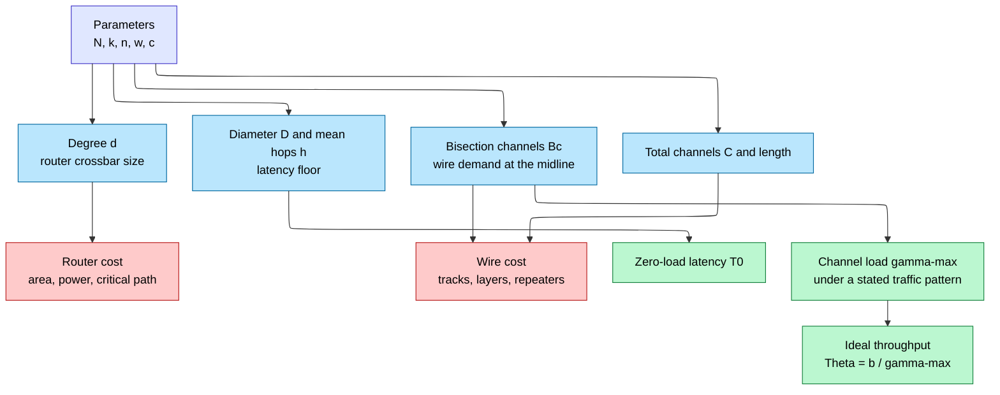
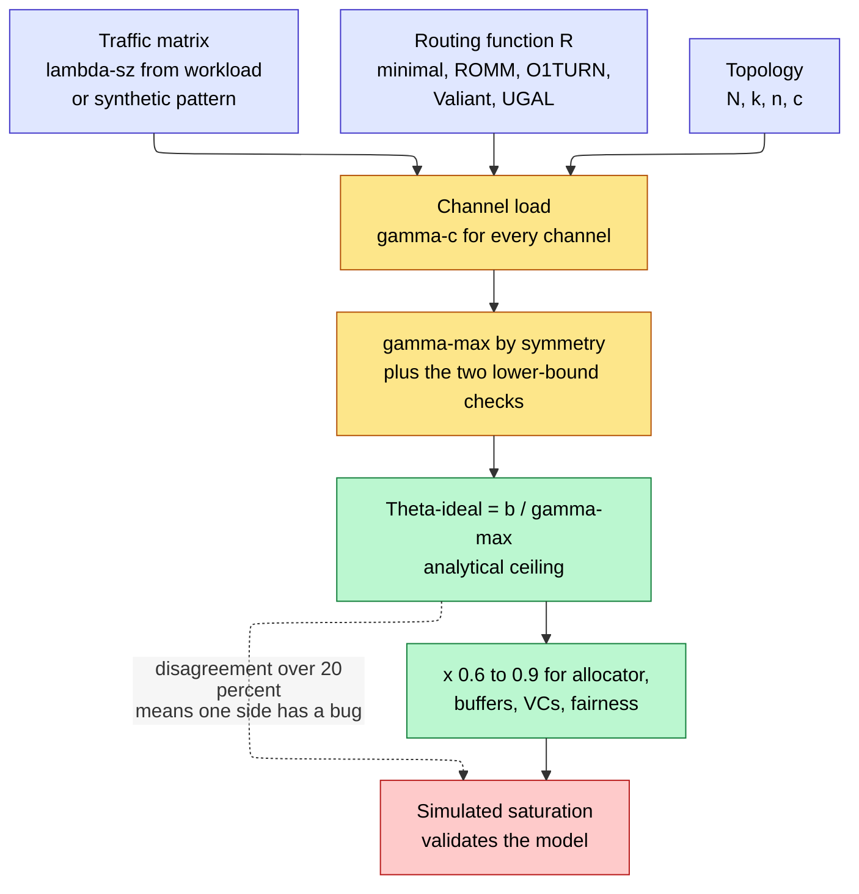
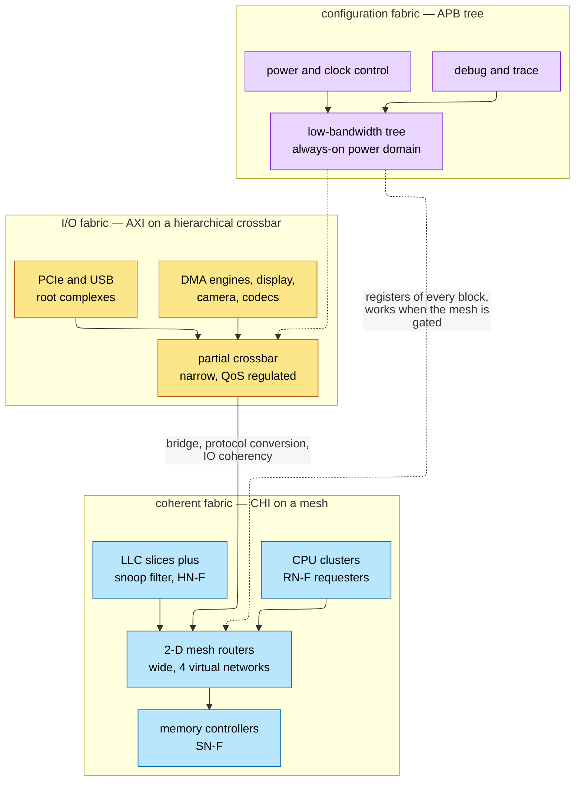
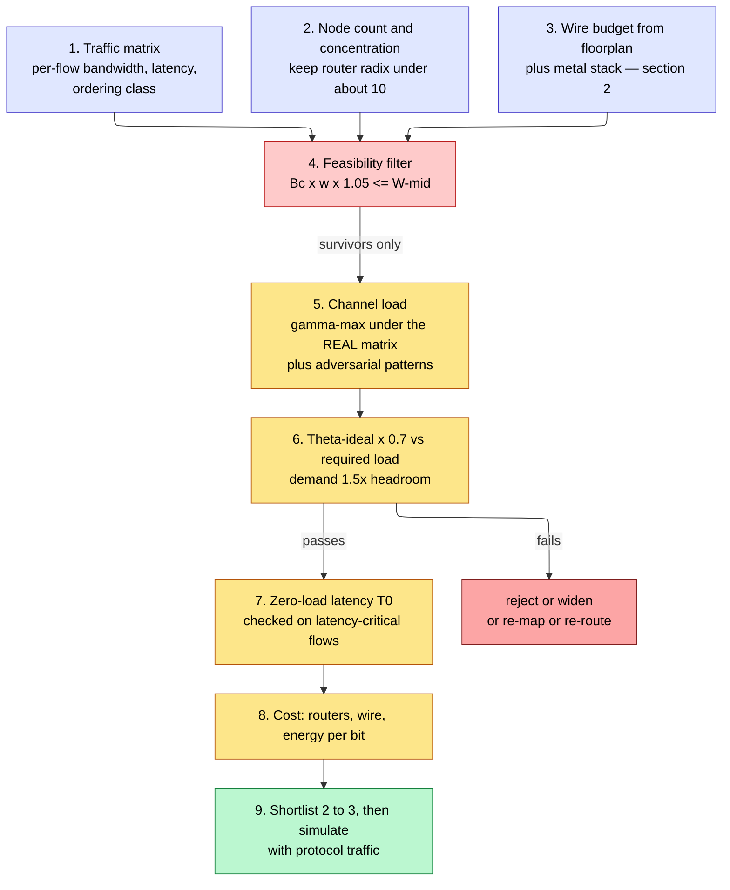

# Topology Selection and Performance Analysis — predicting a network's throughput before you build it

> **First-time reader orientation:** A topology is the graph of routers and channels. Its quality is not a picture but a set of numbers: how many hops a packet takes, how much traffic each channel must carry, how many wires the graph demands across the middle of the die, and how much silicon the routers cost. This page derives those numbers, shows how to compute the throughput a topology can deliver *under a stated traffic pattern* before any RTL exists, and turns that computation into a selection procedure.

> **Abbreviation key — skim now and return as needed:** network on chip (NoC); virtual channel (VC); virtual network (VN); dimension-order routing (DOR); uniform random (UR); universal globally-adaptive load-balanced routing (UGAL); randomized oblivious multi-phase minimal routing (ROMM); back end of line (BEOL — the metal stack above the transistors); non-default rule (NDR); through-silicon via (TSV); wavelength-division multiplexing (WDM); memory controller (MC); last-level cache (LLC); home node (HN); coherent mesh network (CMN); Coherent Hub Interface (CHI); Advanced eXtensible Interface (AXI); Universal Chiplet Interconnect Express (UCIe); die-to-die (D2D); electronic design automation (EDA); register-transfer level (RTL); static timing analysis (STA); mixed-integer linear program (MILP); dynamic random-access memory (DRAM); joule (J); picojoule (pJ); gigabit per second (Gb/s); gigabyte per second (GB/s); terabyte per second (TB/s).

> **Prerequisites:** [Network on Chip](01_Network_on_Chip.md) (why a bus and a crossbar stop scaling, what bisection and diameter mean, the zero-load latency formula this page decomposes), [Routing, Flow Control, and Deadlock](02_Routing_Flow_Control_and_Deadlock.md) (the deadlock theorems that decide whether a topology's *required* routing is legal, and the credit/VC machinery whose cost this page prices).
> **Hands off to:** [Router Microarchitecture](03_Router_Microarchitecture.md) (implements the router radix, channel width, and VC count this page's selection produces, and determines what fraction of ideal throughput is actually delivered), [NoC and Coherence Simulation](../../01_CPU_Architecture/08_Simulation/02_NoC_and_Coherence_Simulation.md) (measures the curve whose *analytical prediction* this page owns — simulation validates this model, it does not replace it).

---

## 0. Why this page exists

There is a question every interconnect engineer is asked in the first week of a project and cannot answer by simulation, because at that point nothing exists to simulate: *given 256 agents, this floorplan, this metal stack, and this traffic, which topology should we build, and what throughput will it sustain?* The honest answer is a number with an error bar, and it comes from a calculation that takes about twenty minutes with a pencil. That calculation is **channel load analysis**: for a stated traffic pattern and routing function, find the most heavily loaded channel in the network, and divide its bandwidth by that load. The result, $\Theta_{ideal} = b/\gamma_{max}$, is the throughput ceiling of the topology-plus-routing pair, independent of buffers, allocators, clock frequency, and every microarchitectural detail. It is the number a simulation must be *validated against*, not the number a simulation produces.

[Network on Chip](01_Network_on_Chip.md) established the vocabulary — degree, diameter, average hop count, bisection — and derived the coarsest possible bound, $\Theta \le 2B_b/N$ under uniform random traffic. That bound is correct and nearly useless in practice, for three reasons. It assumes traffic is uniform, and no real workload is. It assumes the routing function spreads load evenly across the bisection, and dimension-order routing on a mesh under a transpose pattern does not even come close. And it says nothing about topologies whose bottleneck is not the bisection at all — a network whose hottest channel is the ejection port of a memory controller cannot be fixed by any amount of bisection. An engineer who ships the $2B_b/N$ bound as a throughput promise will be wrong by a factor of three to thirty on the first real workload, and the error will surface after the floorplan is frozen and the wire budget spent.

This page supplies the missing machinery. It states the topology design space as parameters rather than pictures (§1), derives the cost model that makes bisection a *constraint* imposed by the metal stack rather than a knob (§2), develops channel load and ideal throughput as a complete analytical method (§3), catalogs the traffic patterns that probe a topology's worst case (§4), and derives the latency–throughput curve those numbers predict (§5). It then applies the method to the low-radix families the notebook already mentions (§6), to the high-radix families it does not — flattened butterfly, fat tree, dragonfly (§7) — and to the hierarchical, chiplet, and mapped configurations that real silicon actually ships (§8–§10). It closes with energy (§11), the research frontier assessed honestly (§12), commercial topology synthesis (§13), and a decision procedure (§14).

The division of labor with neighboring pages is deliberate and worth stating once. [Routing, Flow Control, and Deadlock](02_Routing_Flow_Control_and_Deadlock.md) owns the *legality* of a routing function: whether its channel dependency graph is acyclic, how escape VCs restore adaptivity, and why protocol deadlock needs separate virtual networks. This page owns the *performance consequence* of a routing choice — how much $\gamma_{max}$ falls when you load-balance and how many hops that costs — and it will cite the routing page whenever a topology *forces* a routing choice, which is exactly what happens with the dragonfly. [Router Microarchitecture](03_Router_Microarchitecture.md) owns the pipeline, the allocator, and the buffers; it determines the *fraction* of $\Theta_{ideal}$ a real fabric delivers, typically 0.6 to 0.9. And [NoC and Coherence Simulation](../../01_CPU_Architecture/08_Simulation/02_NoC_and_Coherence_Simulation.md) owns the measurement methodology. The rule to carry: **if simulation and this page's arithmetic disagree by more than 20 %, one of them has a bug, and finding out which is the single most valuable debugging step in interconnect work.**

After this page you will be able to: write down the parameters of any topology family and instantiate them at a node count; compute $\gamma_{max}$ for a stated pattern and routing by symmetry; convert a metal stack into a bisection budget and reject an infeasible topology before RTL; read a latency–throughput curve and say which of four things is limiting; compare two candidates on energy per bit rather than only on latency; and defend a topology choice with numbers in a design review.

---

## 1. The topology design space, as parameters

A topology drawn as a picture invites reasoning by resemblance. A topology written as parameters invites arithmetic. Every family in this page is specified by at most four numbers, and every metric that matters is a closed-form function of them.

### 1.1 The four independent parameters

| Symbol | Name | Meaning | Typical on-chip range |
|---|---|---|---|
| $N$ | terminal count | number of *agents* attached to the network — cores, cache slices, memory controllers, accelerators, I/O bridges | 8 to 512 |
| $k$ | radix per dimension | nodes along one axis of a regular topology; for a square mesh $k=\sqrt N$ | 2 to 16 |
| $n$ | dimension | number of axes; a $k$-ary $n$-mesh has $N=k^n$ | 1 to 3 on chip |
| $w$ | channel width | signal wires in one *unidirectional* channel, before control | 32 to 512 bits |
| $c$ | concentration | terminals sharing one router | 1 to 8 |

Two more quantities are derived from $w$ and the clock and appear everywhere below. **Channel bandwidth** $b = w f$ where $f$ is the channel signaling rate, measured in bits per second in *one* direction. **Serialization latency** $T_s = L/b$ where $L$ is the packet length in bits.

> **Convention warning, and it matters more than any formula on this page.** A "link" between two adjacent mesh routers is almost always drawn as one line and implemented as *two* independent unidirectional channels. Half the factor-of-two errors in interconnect analysis come from mixing the two. **Throughout this page, $b$ is the bandwidth of one unidirectional channel, and every channel count is a count of unidirectional channels unless the word "bidirectional" appears.** When you read a bisection figure in a datasheet or another page, establish this convention before comparing anything.

### 1.2 The six derived metrics

**Degree $d$** — network channels per router, counting each direction separately. Sets the router's crossbar size and therefore its area and critical path. **Radix $r$** — total router ports including the $c$ terminal ports: $r = d + c$ for a router with separate injection and ejection, or $r = d/2 + c$ counted bidirectionally. The router microarchitecture page prices radix; here it is a cost input.

**Diameter $D$** — the maximum shortest-path hop count between any two terminals. Sets worst-case latency, which matters for tail-latency service-level objectives and for the deepest coherence transaction chains, but not for average performance.

**Average hop count $\bar h$** — the mean shortest-path hop count over a uniformly random destination. This is the number that appears in zero-load latency and in energy, and it is almost always well below $D/2$. *Convention:* $\bar h$ below averages over all $N$ destinations **including the source itself** (which contributes zero hops), because that makes the mesh algebra clean. Excluding self multiplies every figure by $N/(N-1)$ — under 1.6 % at $N=64$ and under 0.4 % at $N=256$, so the choice never changes a decision, but state it or a reviewer will re-derive your number and get a different one.

**Bisection channel count $B_c$** — the minimum number of unidirectional channels whose removal splits the terminals into two equal halves. Multiplied by $b$ it gives bisection bandwidth. §2 shows this is a *demand* the topology places on the metal stack, not a property you may choose freely.

**Total channel count $C$** — every unidirectional channel in the network. Together with channel length it gives total wire, which is the routability constraint everywhere that is not the midline.

**Total channel length $L_{ch}$** — $\sum_c \ell_c$ over all channels, in units of the router pitch $p$. Combined with $w$ it gives wire *area*; combined with $b$ and the energy model of §11 it gives link energy. (The symbol $\Lambda$ is reserved for the traffic matrix of §3.1 and is never a length on this page.)

### 1.3 Closed forms per family

Let $p$ denote the router pitch (physical distance between adjacent routers on the die).

**$k$-ary $n$-mesh** ($N = c\,k^n$ terminals, $k^n$ routers):

$$
d = 2n,\qquad D = n(k-1),\qquad \bar h = \frac{n(k^2-1)}{3k},\qquad B_c = 2k^{n-1},\qquad C = 2n(k-1)k^{n-1},\qquad \ell_c = p .
$$

The $\bar h$ derivation is one line and worth keeping: Manhattan distance separates by axis, so $\bar h = n\,\mathbb{E}|x_1-x_2|$ with $x_1,x_2$ independent uniform on $\{0..k-1\}$. Using $\sum_{i,j}|i-j| = \tfrac{k(k^2-1)}{3}$ gives $\mathbb{E}|x_1-x_2| = \tfrac{k^2-1}{3k}$, hence the formula, which tends to $nk/3$.

**$k$-ary $n$-cube (torus)** ($N=c\,k^n$, even $k$):

$$
d = 2n,\qquad D = n\lfloor k/2\rfloor,\qquad \bar h = \frac{nk}{4},\qquad B_c = 4k^{n-1},\qquad C = 2nk^n,\qquad \ell_c = 2p\ \text{(folded)} .
$$

Per axis the torus is a $k$-node ring; the sum of distances from one node to all $k$ (including itself) is $2\sum_{d=1}^{k/2-1}d + k/2 = k^2/4$, so the per-axis mean is $k/4$. The wrap channels double the min-cut, hence $B_c$ twice the mesh's. The $\ell_c = 2p$ entry is not a graph property — it is the price of folding, derived in §6.3.

**Ring** — the $n=1$ torus: $d=2$, $D=N/2$, $\bar h = N/4$, $B_c = 4$ (two bidirectional links), $C=2N$.

**Concentrated mesh (CMesh)** — a $k$-ary 2-mesh with $c>1$: substitute $k=\sqrt{N/c}$ into the mesh formulas, and note $r = 4 + c$ and $p_{\text{CMesh}} = \sqrt c \cdot p_{\text{flat}}$ because each router now covers $c$ tiles.

**$k$-ary $n$-flat (flattened butterfly)** — routers in a $k^n$ grid, each fully connected to the $k-1$ others in each dimension:

$$
d = 2n(k-1),\qquad D = n,\qquad B_c = \frac{k^{n+1}}{2}\ (n=2),\qquad C = n\,k^n(k-1),\qquad \overline{\ell_c} = \frac{k+1}{3}p .
$$

Count $C$ the safe way, because this is where a spurious factor of two normally enters: each dimension of each of the $k^{n-1}$ lines is a complete graph $K_k$ with $k(k-1)/2$ bidirectional links, giving $n\,k^n(k-1)/2$ bidirectional links and hence $C = n\,k^n(k-1)$ *unidirectional* channels. Equivalently $C = k^n \times (\text{out-degree}) = k^n \cdot n(k-1)$, since $d = 2n(k-1)$ counts in *and* out. The mesh's $C = 2n(k-1)k^{n-1}$ has the 2 because there the bracketed quantity is a bidirectional link count; here it is not. At $k=4,n=2$ this gives 96 and at $k=8,n=2$ it gives 896 — the values in §1.4, §2.4, and Worked problem 3.

For $n=2$ the bisection is counted directly: a vertical cut between column halves severs, in each of the $k$ rows, all $(k/2)^2$ row-channels joining a left router to a right router, in both directions — $2k \cdot k^2/4 = k^3/2$ unidirectional channels. Average channel length follows from $\mathbb{E}|i-j|$ over $i\ne j$ on $\{0..k-1\}$, which is $(k+1)/3$.

**Folded Clos / fat tree** — $m$ levels of radix-$r$ switches, $r/2$ up and $r/2$ down, $N=(r/2)^m$ leaves:

$$
d = r,\qquad D = 2m,\qquad B_c = N,\qquad C = 2mN \ \text{(up+down, both directions)} .
$$

$\bar h$ depends on the level of the least common ancestor: with probability $(r/2)^j/N$ the LCA is at level $j$, giving $2j$ hops.

**Dragonfly** — $g$ groups of $a$ routers, $c$ terminals and $h$ global ports per router (the same concentration $c$ as everywhere else on this page; $p$ remains the router pitch), $N = a\,c\,g$, groups fully connected with

$$
m = \left\lfloor \frac{a h}{g-1} \right\rfloor \ \text{channels per group pair}, \qquad
d = 2\big[(a-1) + h\big],\qquad D = 3\ \text{(minimal)},\ 5\ \text{(Valiant)},\qquad B_c = 2m\left(\frac{g}{2}\right)^2 .
$$

The floor is not cosmetic: a group owns $ah$ global ports and must reach $g-1$ peers, so only $\lfloor ah/(g-1)\rfloor$ channels per pair are *realizable* and the remainder are spare ports. At $g{=}8,a{=}4,h{=}2$ the ratio is $8/7 = 1.14$, so $m=1$ and $B_c = 2(1)(4)^2 = 32$; at $g{=}8,a{=}8,h{=}4$ it is $32/7 = 4.57$, so $m=4$ and $B_c = 2(4)(4)^2 = 128$. Both are the §1.4 table entries.

### 1.4 The families instantiated: $N=64$ and $N=256$

The point of the table is that families stop being shapes and become comparable numbers. All entries use $c=1$ except where noted; channel counts are unidirectional; $\bar h$ includes the zero-hop self term.

**At $N=64$:**

| Topology | Config | $d$ | $r$ | $D$ | $\bar h$ | $B_c$ | $C$ | $\overline{\ell_c}$ |
|---|---|---|---|---|---|---|---|---|
| Ring | $k=64$ | 2 | 3 | 32 | 16.0 | 4 | 128 | $p$ |
| 2-D mesh | $8\times8$ | 4 | 5 | 14 | 5.25 | 16 | 224 | $p$ |
| 2-D torus | $8\times8$ folded | 4 | 5 | 8 | 4.00 | 32 | 256 | $2p$ |
| 3-D mesh | $4\times4\times4$ | 6 | 7 | 9 | 3.75 | 32 | 288 | $p$ |
| CMesh | $4\times4$, $c=4$ | 4 | 8 | 6 | 2.50 | 8 | 48 | $2p$ |
| Flattened butterfly | $4\times4$, $c=4$ | 12 | 16 | 2 | 1.50 | 32 | 96 | $1.67p$ |
| Fat tree | $r=16$, 2 levels | 16 | 16 | 4 | 3.75 | 64 | 256 | mixed |
| Dragonfly | $g{=}8,a{=}4,c{=}2,h{=}2$ ($m{=}1$) | 10 | 12 | 3 | 2.28 | 32 | 152 | mixed |

**At $N=256$:**

| Topology | Config | $d$ | $r$ | $D$ | $\bar h$ | $B_c$ | $C$ | $\overline{\ell_c}$ |
|---|---|---|---|---|---|---|---|---|
| Ring | $k=256$ | 2 | 3 | 128 | 64.0 | 4 | 512 | $p$ |
| 2-D mesh | $16\times16$ | 4 | 5 | 30 | 10.63 | 32 | 960 | $p$ |
| 2-D torus | $16\times16$ folded | 4 | 5 | 16 | 8.00 | 64 | 1024 | $2p$ |
| 3-D mesh | $4\times8\times8$ | 6 | 7 | 17 | 6.50 | 64 | 1280 | $p$ |
| CMesh | $8\times8$, $c=4$ | 4 | 8 | 14 | 5.25 | 16 | 224 | $2p$ |
| Flattened butterfly | $8\times8$, $c=4$ | 28 | 32 | 2 | 1.75 | 256 | 896 | $3p$ |
| Fat tree | $r=32$, 2 levels | 32 | 32 | 4 | 3.88 | 256 | 1024 | mixed |
| Dragonfly | $g{=}8,a{=}8,c{=}4,h{=}4$ ($m{=}4$) | 22 | 26 | 3 | 1.74 | 128 | 672 | mixed |

Three readings of these tables carry the rest of the page.

**Diameter and degree trade against each other on a fixed exchange rate.** Going from the $16\times16$ mesh to the $8\times8$ flattened butterfly cuts $\bar h$ by $6.1\times$ (10.63 to 1.75) and multiplies degree by $7\times$ (4 to 28). That is not a coincidence — Moore-bound arguments say a degree-$d$ graph of diameter $D$ holds at most $\sim d^D$ nodes, so shrinking $D$ at fixed $N$ forces $d$ up geometrically. The engineering question is never "can I have low diameter" but "what does the extra degree cost in *this* substrate," and §2 and §7 answer it.

**Bisection channel count spans an order of magnitude at fixed $N$.** From 4 (ring) to 256 (flattened butterfly, fat tree) at $N=256$. That column is the one the die cannot honor for free; §2 turns it into a metal budget.

**Average hop count is not the same as average distance.** The CMesh at $N=256$ has $\bar h=5.25$ router hops but each hop is $2p$ long, so the average *physical* distance travelled is $10.5p$ — essentially identical to the flat mesh's $10.63p$. On a planar die with minimal routing, physical distance is a floorplan property that topology cannot change; what topology changes is **how many routers that distance is chopped into**. Hold that thought; it is the whole content of §11's energy model.



The figure's contract: parameters on the left are chosen by the architect, metrics in the middle are computed with §1.3's closed forms, and the two right-hand columns are the only things anyone outside the interconnect team cares about. Trace one path concretely — choosing $k=16, n=2, w=256, c=1$ fixes $d=4$ (a 5-port router, cheap), $\bar h=10.63$ (which at 3 cycles per hop is a 32-cycle latency floor before any contention), and $B_c=32$ (which §2 will show costs 8,192 midline wires). The trade-off the figure illustrates is that no arrow crosses from the cost column to the performance column: **you cannot buy throughput without paying wire, and you cannot buy latency without paying degree.** Every remaining section is an instance of that.

---

## 2. The cost model: why bisection is a constraint, not a knob

The single most common failure in early NoC work is treating bisection bandwidth as something you specify. It is something the metal stack grants you. This section derives the grant.

### 2.1 Two cost models, and which one binds

Interconnect cost analysis has two canonical normalizations, and a comparison is meaningless until you say which one you are using.

**Node-constrained (pin-limited).** Each router has a fixed total channel width budget $P$ — set by how many wires can physically leave the router's footprint, by the crossbar area you will tolerate, or off chip by the package's pin count. Then $d \cdot w = P$: **degree and width trade one-for-one.** A degree-4 mesh router with $P=1024$ has $w=256$; a degree-28 flattened butterfly router with the same $P$ has $w=36$. This model is the right one when the router, not the wiring channel, is the scarce thing — which is the usual case off chip and in high-radix on-chip designs.

**Bisection-constrained (wire-limited).** The total wire crossing the die's midline is fixed at $W_{mid}$ signal wires. Then $B_c \cdot w = W_{mid}$: **bisection channel count and width trade one-for-one.** This is the right model for planar on-chip fabrics, where the router is small and the metal is the binding scarcity.

On a die *both* apply, and the binding one is whichever gives the smaller $w$. A useful discipline: compute $w$ under both, take the minimum, and state which bound bit. If the node constraint binds, your topology is too high-radix for the router you can afford; if the bisection constraint binds, it is too wire-hungry for the stack.

### 2.2 Deriving the midline wire budget from a metal stack

Take a $10\ \text{mm} \times 10\ \text{mm}$ die on the 7 nm-class stack tabulated in [Routing and Parasitic Extraction](../../../05_Backend_Physical_Design/06_Routing_and_Parasitic_Extraction.md) §1.2. A *vertical* cut down the die midline is crossed by wires on the *horizontally* preferred layers. Only layers whose resistance permits a millimeter-scale run with a sane repeater count are candidates: M6 (80 nm pitch), M8 (160 nm), M10 (240 nm), M12 (480 nm). The 1× local layers M0/M2/M4 are consumed inside blocks and, at $r \approx 90\ \Omega/\mu\text{m}$ for M0, are unusable over millimeters.

Raw track supply is cut length divided by pitch:

| Layer | Pitch | Raw tracks across 10 mm | Consumed by | Derate | Usable |
|---|---|---|---|---|---|
| M6 | 80 nm | 125,000 | block-internal routing (it is the block workhorse) | 80 % | 25,000 |
| M8 | 160 nm | 62,500 | block-boundary nets, clock spine, other buses | 50 % | 31,250 |
| M10 | 240 nm | 41,667 | power straps, top-level clock, other top nets | 70 % | 12,500 |
| M12 | 480 nm | 20,833 | power distribution, global clock | 95 % | 1,042 |
| **Total** | | **250,000** | | | **69,792** |

Roughly 70,000 usable global-tier tracks cross the midline, and the NoC is one client among many. On a CPU or accelerator die where the fabric is the dominant top-level structure, a realistic negotiated allocation is 20–30 % of that supply; on a mobile SoC with a sparse fabric it is under 10 %. Take 20 %: **14,000 tracks.**

Tracks are not wires. A NoC link running 1.25 mm at 2 GHz is a long, parallel, same-direction bus — precisely the worst crosstalk structure a design can contain — so its wires typically carry a non-default rule (NDR), commonly double width and double spacing, which consumes about **3 tracks per wire**. If half the NoC's wires take NDR on M8/M10 and half run default on M6, the average is 2 tracks per wire:

$$
W_{mid} = \frac{14{,}000\ \text{tracks}}{2\ \text{tracks/wire}} = 7{,}000\ \text{signal wires}.
$$

Round to **$W_{mid} \approx 7{,}000$–$8{,}000$ wires for a 10 mm die at 7 nm-class with a fabric-friendly allocation.** That number, not any graph metric, is what a topology must fit inside. Scale it linearly with die edge length and inversely with metal pitch: a 20 mm die roughly doubles it; an N5 stack with 28–30 nm minimum pitch raises the bottom tiers by about 30 %.

### 2.3 What that budget permits

A topology needs $B_c$ unidirectional channels of width $w$ crossing the midline, plus control (valid, credit return, and error/parity — typically 4–6 % overhead). So feasibility is:

$$
B_c \cdot w \cdot 1.05 \le W_{mid}.
$$

| Topology, $N=256$ | $B_c$ | $w$ affordable at $W_{mid}=7{,}500$ | Verdict |
|---|---|---|---|
| $16\times16$ mesh | 32 | 223 bits → **192 or 256** | comfortable |
| $16\times16$ folded torus | 64 | 111 → **96 or 128** | comfortable, half the mesh width |
| $8\times8$ CMesh, $c=4$ | 16 | 446 → **384 or 512** | comfortable, very wide |
| $8\times8$ flattened butterfly, $c=4$ | 256 | 27 → **16 or 32** | feasible only at narrow width |
| Fat tree, full bisection | 256 | 27 → **16 or 32** | same, and see §7.3 |
| Ring | 4 | 1,785 → capped by router | wire is free, throughput is not |

The table is the single most useful artifact in early topology work, and it says something that surprises people: **a full-bisection fat tree is not "unwireable on a die" in the naive sense — it is wireable at 32-bit channels.** What kills it is not the midline count but the *total* wire (§2.4) and the fact that 32-bit channels serialize a 64-byte cache line into 16 flits, which §7 prices in latency.

### 2.4 The other wire constraint: total length

The midline is the max-cut of routing *demand*, but wire must exist everywhere, and the global constraint is total wire area:

$$
A_{wire} = \sum_c \ell_c \cdot w \cdot (\text{pitch}) \quad \text{versus} \quad (\text{die area}) \times (\text{layers allocated}) .
$$

For the $N=256$ candidates with $p_{mesh}=0.625$ mm on a 10 mm die (16 routers per side), measuring in mm·bits:

- $16\times16$ mesh: $960$ channels $\times\ 0.625\ \text{mm} \times 256\ \text{b} = 153{,}600$.
- $16\times16$ folded torus: $1024 \times 1.25 \times 128 = 163{,}840$ — essentially the same. Folding doubles length and halves width; they cancel.
- $8\times8$ CMesh: $224 \times 1.25 \times 512 = 143{,}360$ — again the same.
- $8\times8$ flattened butterfly: $896 \times 3.75\ \text{mm} \times 32 = 107{,}520$ — *lower*, because narrow channels beat long ones here.

The near-invariance of the first three is not luck. Total wire is $\sum \ell_c w$, and for planar topologies carrying the same traffic across the same physical distances, that product is pinned by the traffic, not by the graph. §11 will show the same invariance in energy. The families that escape it are the ones whose routing changes the *distance* travelled (non-minimal routing, §3.5) or whose channels do not lie in the plane (3-D, §12.5).

### 2.5 A repeated wire is why length costs what it costs

The link cost above assumed a wire can simply be made longer. It cannot, without repeaters. A wire of length $\ell$ with per-micron resistance $r$ and capacitance $c$ behaves as a distributed RC ladder:

```tikz
\begin{document}
\begin{circuitikz}[scale=1.0]
  \draw (0,0) node[left]{$v_{in}$} to[R=$r\Delta$] (2,0)
        to[R=$r\Delta$] (4,0) to[R=$r\Delta$] (6,0) node[right]{$v_{out}$};
  \draw (2,0) to[C=$c\Delta$] (2,-1.5) node[ground]{};
  \draw (4,0) to[C=$c\Delta$] (4,-1.5) node[ground]{};
  \draw (6,0) to[C=$c\Delta$] (6,-1.5) node[ground]{};
\end{circuitikz}
\end{document}
```

The contract of this figure: each segment of length $\Delta$ contributes series resistance $r\Delta$ and shunt capacitance $c\Delta$, and the Elmore delay of the ladder is $\approx 0.4\,rc\,\ell^2$ — **quadratic in length.** Trace it on M8 ($r=2.3\ \Omega/\mu$m, $c=0.20$ fF/$\mu$m from the stack table): for $\ell=1.25$ mm, $0.4 \times 2.3 \times 0.2\times10^{-15} \times (1250)^2 = 0.29$ ns; double the length to 2.5 mm and the delay is $1.15$ ns, four times larger. The trade-off it illustrates is the reason every long on-chip wire is broken into repeated segments: inserting inverters every few hundred microns makes delay *linear* in length at roughly **0.2–0.4 ns/mm on the 4×/6× tiers**, at the cost of repeater area, repeater power, and a placement blockage every segment. Two consequences propagate through this page. A 1.25 mm mesh link fits a single 0.5 ns cycle at 2 GHz with little margin. A 2.5 mm folded-torus link does not, and needs two cycles or a pipeline flop — which §6.3 shows exactly cancels the torus's hop-count advantage.

### 2.6 The packaging analogue

Off the die, the same two cost models reappear with different constants, and this is what makes chiplet topology a distinct problem (§9). The node constraint becomes the **beachfront**: the die edge available for die-to-die PHY, times the bandwidth density that packaging technology supports. Standard organic packages achieve roughly $30$–$60$ GB/s per millimeter of die edge; advanced packaging (silicon interposer, embedded bridge) with 25–55 µm bump pitch achieves several hundred GB/s to over 1 TB/s per millimeter, within a small factor of the on-die midline density computed in §2.2 — see [Chiplets, CXL, and Die-to-Die](../05_IO_and_Chiplets/02_Chiplets_CXL_and_Die_to_Die.md) and [IC Packaging](../../../07_Manufacturing_and_Bringup/02_IC_Packaging.md). What does *not* close is energy and latency: an on-die millimeter costs about 0.1 pJ/bit, an advanced-package crossing 0.25–0.5 pJ/bit plus 5–20 ns of adapter and PHY latency, and a SerDes-based link several pJ/bit. §9 shows the topology consequences.

### 2.7 The invariance this sets up

Put §2.2 and §2.3 together and a proposition falls out that governs everything after it.

> **Proposition (bisection-limited invariance).** Consider any topology whose bisection channels all cross the die midline, carrying uniform random traffic under a routing function that loads those channels evenly. Let $W_{mid}$ be the total signal wires crossing the midline and $f$ the signaling rate. Then the per-node ideal throughput is
> $$\Theta = \frac{2\,W_{mid}\,f}{N},$$
> **independent of the topology.**

*Proof.* Each of the $N$ nodes injects $\Theta$ bits/s. The $N/2$ nodes on the left send half their traffic to the right half, so $N\Theta/4$ bits/s must cross left-to-right. Half of $W_{mid}$ carries left-to-right traffic, giving capacity $(W_{mid}/2)f$. Setting demand equal to capacity, $N\Theta/4 = W_{mid}f/2$, hence $\Theta = 2W_{mid}f/N$. $\blacksquare$

*Numerically,* with $W_{mid}=7{,}500$, $f = 2$ GHz, $N=256$: $\Theta = 2 \times 7500 \times 2\times10^9/256 = 117$ Gb/s $= 14.6$ GB/s per node, $3.7$ TB/s aggregate — **and that figure applies equally to the mesh, the torus, the CMesh, and the flattened butterfly.**

> **Corollary — the thesis of this page.** On a 2-D die under uniform random traffic, topology cannot buy throughput. It buys **latency** (fewer hops), **cost** (fewer or cheaper routers), and **worst-case robustness** (how far $\gamma_{max}$ rises when traffic stops being uniform). Choosing a topology to raise uniform-random bandwidth is choosing the wrong objective.

Two honest caveats keep this from being over-claimed. The proposition is an *upper* bound reached only by topologies whose routing balances the bisection channels; §3 shows dimension-order routing on a mesh under transpose traffic falls short of it by $3.5\times$. And it assumes the bisection is the binding cut; for topologies whose hot channel is a terminal port (§10) or a die edge (§9), the bound is irrelevant because a different constraint bites first. The method for finding out which constraint bites is exactly §3.

---

## 3. Channel load and ideal throughput — the analytical method

This is the section the rest of the page is built on. Everything before it was setup; everything after it is application. The method answers, with arithmetic and no simulator, the question *what throughput can this network sustain under this traffic?*

### 3.1 The three objects

**A traffic pattern** is a matrix $\Lambda$ whose entry $\lambda_{sz}$ is the fraction of node $s$'s injected traffic destined for node $z$, with $\sum_z \lambda_{sz} = 1$ for every $s$. Uniform random is $\lambda_{sz} = 1/N$; a permutation pattern is $\lambda_{sz} = 1$ for exactly one $z$ per $s$ and 0 elsewhere. The matrix is the *only* thing about the workload that this analysis needs, which is both its power and its limit (§4.4). **Notation:** $z$ denotes a *destination* node throughout; $d$ is reserved for router degree (§1.2) and is never a destination on this page.

**A routing function** $R$ maps each $(s,z)$ pair to a path, or to a probability distribution over paths for oblivious-randomized and adaptive routing. This is where [Routing, Flow Control, and Deadlock](02_Routing_Flow_Control_and_Deadlock.md) meets performance: that page decides which routing functions are *legal*, this one decides which are *fast*.

**Channel load** $\gamma_c$ is the traffic on channel $c$ when every node injects one unit of traffic per unit time. It is dimensionless:

$$
\gamma_c \;=\; \sum_{s}\sum_{z} \lambda_{sz}\,\Pr\big[R(s,z)\ \text{traverses}\ c\big].
$$

A load of $\gamma_c = 3$ means channel $c$ must carry three times as much traffic as one node injects. Because every channel has the same capacity $b$, the network saturates when the *busiest* channel saturates:

$$
\boxed{\;\gamma_{max} = \max_c \gamma_c, \qquad \Theta_{ideal} = \frac{b}{\gamma_{max}}\;}
$$

$\Theta_{ideal}$ has units of bits per second **per node** and is the throughput each node can sustain assuming perfect flow control, infinite buffering, and a perfect allocator. It is an upper bound on anything a real fabric delivers; §5 and [Router Microarchitecture](03_Router_Microarchitecture.md) account for the gap.

### 3.2 Two bounds that check your arithmetic

Before maximizing anything, write down two lower bounds on $\gamma_{max}$. If your computed maximum is below either, you have made an error.

**The average-load bound.** Total channel work per unit time is $N\bar h_\Lambda$ flit-hops, where $\bar h_\Lambda$ is the mean hop count *under the pattern $\Lambda$ and routing $R$* (not necessarily the uniform-random $\bar h$ of §1). Spread over $C$ channels:

$$
\gamma_{max} \;\ge\; \gamma_{avg} = \frac{N\,\bar h_\Lambda}{C}.
$$

**The cut bound.** For any cut of the network into sets $A$ and $\bar A$, with $T_{A\to\bar A}$ units of traffic crossing and $C_{A\to\bar A}$ channels available:

$$
\gamma_{max} \;\ge\; \frac{T_{A\to\bar A}}{C_{A\to\bar A}}.
$$

The bisection cut is the usual choice, but the *right* cut is whichever gives the largest bound, and for hotspot traffic (§4.3) the winning cut is a single node's ejection channel.

Define the **load balance factor** $\eta_{LB} = \gamma_{avg}/\gamma_{max} \in (0,1]$. It separates two entirely different problems: $\eta_{LB}$ near 1 with low throughput means the topology genuinely lacks channels, and only more wire helps; $\eta_{LB}$ far below 1 means the topology has channels the routing is not using, and better routing is free throughput. Diagnosing which one you have is the highest-value five minutes in a NoC investigation.

### 3.3 Finding the maximum-loaded channel by symmetry

The naive method — enumerate all $N^2$ source-destination pairs, trace each path, and accumulate per-channel counters — is $O(N^2 \bar h)$ and always correct. It is also a twenty-line script rather than an insight. Symmetry gives the answer in closed form and, more importantly, tells you *where* the hot channel is, which is what you need to fix it.

**Procedure.**

1. **Identify the symmetry group of the triple (topology, pattern, routing).** A topology is *edge-symmetric* if for any two channels there is an automorphism mapping one to the other. The ring, the torus, and the hypercube are edge-symmetric; the mesh, the fat tree, and the dragonfly are not.
2. **If the triple is edge-symmetric, every channel carries the same load**, so $\gamma_{max} = \gamma_{avg} = N\bar h_\Lambda/C$ and you are done in one line.
3. **If symmetry is broken, parameterize the channel by the coordinate that breaks it** — for a mesh, the column index of a row channel — write $\gamma$ as a function of that coordinate, and maximize.
4. **Check against both bounds of §3.2.**

**Worked: uniform random on a $k$-ary 2-mesh with dimension-order (XY) routing.** The mesh is not edge-symmetric — its edge channels are structurally different from its center channels — so use step 3. Consider the $+x$ channel in row $y$ joining column $x$ to column $x+1$. Under XY routing, a packet traverses this channel exactly when its source lies in row $y$ at a column $\le x$ and its destination lies at a column $> x$ (in any row). Counting sources and destinations, and weighting each $(s,z)$ pair by $\lambda_{sz} = 1/N$:

$$
\gamma(x) \;=\; \underbrace{(x+1)}_{\text{sources in row } y}\cdot\underbrace{(k-1-x)\,k}_{\text{destinations right of }x}\cdot\frac{1}{k^2} \;=\; \frac{(x+1)(k-1-x)}{k}.
$$

This is a downward parabola in $x$, maximized at $x = k/2 - 1$:

$$
\gamma_{max}^{\text{mesh,UR}} = \frac{(k/2)(k/2)}{k} = \frac{k}{4}, \qquad \Theta_{ideal} = \frac{4b}{k}.
$$

*Check it.* At $k=8$: $\gamma_{max}=2$, $\Theta=0.5b$. Average bound: $\bar h = 5.25$, $C=224$, so $\gamma_{avg} = 64 \times 5.25/224 = 1.5 \le 2$ ✓, and $\eta_{LB}=0.75$. Cut bound: $64/4 = 16$ units cross left-to-right over $k=8$ left-to-right channels $= 2$ ✓ — **the bisection bound is tight here**, which tells you the mesh under UR with XY is bisection-limited and the 25 % imbalance lives entirely in the underused edge channels.

```text
  channel load along one mesh row, uniform random, XY routing, k = 8

  gamma(x) = (x+1)(7-x)/8       x = 0    1     2     3     4     5     6
                                    0.88 1.50  1.88  2.00  1.88  1.50  0.88
                                                      ^
   [R]--[R]--[R]--[R]--[R]--[R]--[R]--[R]            gamma_max = k/4 = 2
     0    1    2    3    4    5    6                  at the midline channel
                       |
                  the halving cut
```

The figure's contract: every $+x$ channel of every row carries the load printed above it, by the parabola. Trace one concrete packet — a flit from $(1,3)$ to $(6,0)$ traverses the $x=1,2,3,4,5$ channels of row 3, contributing $1/64$ to each. The trade-off it illustrates: the *edge* channels at $x=0$ and $x=6$ carry 44 % of the peak, so 25 % of the mesh's row bandwidth is structurally unusable under XY — a load-balance loss no amount of buffering recovers, and the exact loss the torus's wraparound removes.

**Worked: uniform random on a $k$-ary 2-cube (torus), minimal DOR.** The torus *is* edge-symmetric under UR, so step 2 applies: $\gamma_{max}=\gamma_{avg}$. Per axis, mean distance is $k/4$, so $\bar h = k/2$; total channels $C = 4N$; hence

$$
\gamma_{max}^{\text{torus,UR}} = \frac{N\,(k/2)}{4N} = \frac{k}{8}, \qquad \Theta_{ideal} = \frac{8b}{k},
$$

and $\eta_{LB}=1.00$ exactly. At $k=8$: $\gamma_{max}=1$, $\Theta = b$ — **twice the mesh's throughput at the same channel bandwidth.** Cross-check with the cut bound: the torus midline severs $2k$ channels per direction, and $N\Theta/4$ crossing gives $\Theta \le 8b/k$ ✓.

### 3.4 The result that reframes the comparison

The torus's factor of two is real *at equal channel bandwidth* and vanishes *at equal wire*, exactly as §2.7 predicted. The torus has twice the bisection channels, so under the bisection-constrained cost model its channels are half as wide, $b_{torus} = b_{mesh}/2$, and

$$
\Theta_{torus} = \frac{8 (b/2)}{k} = \frac{4b}{k} = \Theta_{mesh}.
$$

What the torus actually buys is a 25 % reduction in hop count ($k/2$ versus $2k/3$) and perfect load balance ($\eta_{LB}=1$ versus $0.75$), the second of which matters only under patterns where the mesh's imbalance is worse than 25 % — which, as §4 shows, is most of them. This is the correct and frequently missed reading of "the torus has twice the bisection," and it is the difference between quoting a topology table and doing the analysis.

### 3.5 The routing-dependent part: load balancing and what it costs

$\gamma_{max}$ is a property of the *pair* (topology, routing). Change the routing and the number changes, sometimes by a factor of four, with no wire moved.

**Minimal deterministic (DOR).** One path per $(s,z)$. Zero path diversity, so any pattern that concentrates minimal paths on one channel concentrates all of it there. Provably deadlock-free on a mesh with no extra VCs (the acyclic-CDG proof in [Routing, Flow Control, and Deadlock](02_Routing_Flow_Control_and_Deadlock.md) §4). It is the baseline and the worst case for adversarial patterns.

**Valiant randomized routing.** Route every packet first to a uniformly random intermediate node $q$, then from $q$ to $d$, each phase minimally. The consequence is exact and beautiful: **any traffic pattern becomes two independent uniform-random patterns.** Therefore

$$
\gamma_{max}^{\text{Valiant}} \le 2\,\gamma_{max}^{\text{UR,minimal}},
$$

*for every pattern*, which is why Valiant is the basis of worst-case throughput guarantees. On an $8\times8$ torus: $\gamma_{max} = 2 \times 1 = 2$, so $\Theta = b/2$ under *any* pattern. The costs are two, and both are large:

- **Hop count doubles.** $\bar h_{\text{Valiant}} = 2\bar h_{\text{UR}}$ — on the $8\times8$ torus, 4 hops becomes 8. That is a direct hit to zero-load latency and, via §11, roughly a doubling of energy per bit.
- **Throughput on benign traffic halves.** Under uniform random, Valiant gives $b/2$ where minimal gives $b$. Price the other side of that trade with this page's own worst cases rather than a slogan: on the $8\times8$ mesh Valiant takes transpose from $\gamma_{max}=7$ to $4$ ($1.75\times$ better), and on the $8\times8$ torus it takes tornado from $3$ to $2$ ($1.5\times$). **You pay a factor of two on the common case to buy about $1.5$–$1.75\times$ on the rare one** — which is exactly why the unconditional form lost to UGAL.

Deadlock freedom also changes: a Valiant path visits channels in two phases and can revisit dimensions, reintroducing cycles. The standard fix is one VC class per phase — cheap in VCs, but it is a real cost and it belongs on the ledger.

**ROMM (randomized oblivious multi-phase minimal).** Choose the random intermediate node *inside the minimal quadrant* between $s$ and $d$. Every path stays minimal, so hop count is unchanged, and load spreads across the many minimal paths a mesh offers. On patterns whose minimal quadrants are wide *and whose DOR load is lopsided* — transpose is the standard example — ROMM captures much of Valiant's balancing for free. It is not automatic: under bit complement on an $8\times8$ mesh, spreading uniformly over the minimal staircases piles traffic onto the centre channels and raises $\gamma_{max}$ from XY's 4 to about 7.5, so path diversity used blindly can be *worse* than no diversity at all. On patterns whose minimal paths are essentially unique — tornado on a ring, where every source-destination pair has one shortest path — ROMM can do nothing at all, because there is no diversity to exploit. **ROMM improves the average case at zero hop cost; Valiant improves the worst case at 2× hop cost. They are not substitutes.**

**O1TURN.** The cheapest useful load balancer on a mesh: route each packet XY or YX with probability $\tfrac12$ each. Hop count is unchanged (both are minimal). Under uniform random it changes nothing — both sub-routings have the same $\gamma(x)$ parabola, so $\gamma_{max}$ stays $k/4$. Under transpose it halves $\gamma_{max}$ (§4.2). Cost: two VC classes, because the union of the XY and YX subnetworks has a cyclic channel dependency graph even though each is acyclic separately. **Two VCs to halve the worst case at zero hop cost is the best exchange rate in this section**, which is why the technique keeps reappearing in production fabrics under other names.

**Adaptive and UGAL.** Locally adaptive routing picks among productive outputs by credit count and helps with transient congestion but not with structural imbalance — an adversarial pattern loads *every* minimal path, so choosing among them changes nothing. UGAL (universal globally-adaptive load-balanced routing) fixes that by choosing *between* minimal and Valiant per packet, comparing $\bar q_{min} \cdot h_{min}$ against $\bar q_{val} \cdot h_{val}$ where $\bar q$ is the queue occupancy on the candidate first hop. Below saturation the minimal estimate wins and you get minimal's throughput and latency; under adversarial load the minimal queues fill and Valiant wins, recovering the worst-case guarantee. **UGAL is the reason high-radix topologies are usable at all** (§7.4), and it is not free: it needs the VC classes of Valiant, a queue-occupancy estimate that is stale by at least a round trip, and careful hysteresis or it oscillates.

| Routing | $\gamma_{max}$ on UR | $\gamma_{max}$ worst case | $\bar h$ | VC classes | Deadlock proof |
|---|---|---|---|---|---|
| Minimal DOR | $\gamma_0$ | unbounded in principle, $k-1$ on mesh transpose | $\bar h_0$ | 1 | free (acyclic CDG) |
| ROMM | $\approx \gamma_0$ | pattern-dependent, no guarantee | $\bar h_0$ | 2 | per-phase VC |
| O1TURN | $\gamma_0$ | $\tfrac12$ of DOR on transpose | $\bar h_0$ | 2 | XY and YX subnetworks |
| Valiant | $2\gamma_0$ | $2\gamma_0$ **guaranteed** | $2\bar h_0$ | 2–3 | per-phase VC |
| UGAL | $\approx\gamma_0$ | $\approx 2\gamma_0$ | $\bar h_0$ to $2\bar h_0$ | 2–3 | per-phase VC + escape |

### 3.6 Where the ideal number stops being ideal

$\Theta_{ideal}$ is an upper bound and a real fabric misses it for four reasons, each owned by a different page.

1. **Allocator inefficiency.** A separable allocator matches only $1-1/e \approx 63\ \%$ of feasible input-output pairs in a single pass; iterative allocation recovers most of it. See [Network on Chip](01_Network_on_Chip.md) §5 and [Router Microarchitecture](03_Router_Microarchitecture.md).
2. **Insufficient buffering.** A VC whose depth is below the credit round trip throttles its channel with zero contention — the bandwidth-delay product of [Routing, Flow Control, and Deadlock](02_Routing_Flow_Control_and_Deadlock.md) §2.
3. **Head-of-line blocking.** With too few VCs, a blocked packet idles a channel that has traffic waiting for it. Two to four VCs typically recover 20–40 %.
4. **Injection-side unfairness.** If the local port loses arbitration against through traffic, nodes far from the destination starve and *accepted* throughput falls below what the channels could carry.

Empirically a well-built wormhole fabric delivers **0.6 to 0.9 of $\Theta_{ideal}$**. Use 0.7 for planning. And note the diagnostic value of the ratio: if a simulation reports 0.4, the problem is in the router, not the topology, and changing topology will not help.



The figure's contract: three inputs, one number out, and a validation edge back from simulation. Trace it on the $8\times8$ mesh — uniform random, XY, $k=8$ gives $\gamma_{max}=2$, $\Theta_{ideal}=b/2 = 32$ GB/s at $b=64$ GB/s, derated to $\approx 22$ GB/s, and a Garnet run reporting saturation at 21 GB/s confirms both the model and the router. The failure it illustrates: a Garnet run reporting 9 GB/s does *not* mean the mesh is wrong — it means something in the router is, and the analytical number is what told you so.

---

## 4. Traffic patterns as theorem tests

A traffic pattern is an instrument, not a workload. Each one is engineered to make a specific structural weakness visible, and a topology that survives all of them has been *bounded*, not *predicted*. This section defines the standard set, computes what each does to a mesh, and then states plainly what the set cannot tell you.

### 4.1 Definitions

Index each node by an $n_b$-bit number $s = s_{n_b-1}s_{n_b-2}\cdots s_0$ with $N = 2^{n_b}$; for a $k$-ary $n$-cube, split the index into $n$ fields of $\log_2 k$ bits, one per dimension. ($n_b$, not $b$, counts index bits — $b$ is channel bandwidth throughout this page.) Destinations are written $z$, per the §3.1 notation. Patterns come in two flavors: **random** patterns spread each node's traffic over many destinations, and **permutation** patterns send each node's entire output to exactly one destination — permutations are far harsher because they remove all statistical averaging.

| Pattern | Definition | What it stresses | Topology it embarrasses |
|---|---|---|---|
| Uniform random | $z$ uniform over all $N$ | average-case balance; the bisection bound | nothing — it is the baseline, and it flatters everything |
| Bit complement | $z_i = \lnot s_i$ (all $n_b$ bits) | maximum distance; every packet crosses every midline | mesh: $\gamma_{max}$ doubles vs UR |
| Bit reverse | $z_i = s_{n_b-1-i}$ | long structured permutation, no locality | butterfly-family networks; mesh moderately |
| Bit rotation | $z_i = s_{(i+1) \bmod n_b}$ | mixes dimension fields, so DOR concentrates | dimension-ordered mesh and torus |
| Shuffle | $z_i = s_{(i-1) \bmod n_b}$ | as rotation, opposite direction | same |
| Transpose | $z_i = s_{(i + n_b/2) \bmod n_b}$ — swap the $x$ and $y$ halves | diagonal traffic against an axis-ordered route | **XY mesh: $\gamma_{max} = k-1$, the worst standard case** |
| Tornado | $z_x = (s_x + \lceil k/2\rceil - 1) \bmod k$, **applied in every dimension** | defeats minimal routing's direction choice by one hop | torus/ring with minimal routing |
| Neighbor | $z_x = (s_x + 1) \bmod k$, **in the $x$ dimension only** | locality; the best case | indirect networks — a fat tree still climbs to a switch |
| Hotspot | fraction $f$ of every node's traffic to one node | terminal bandwidth, not network bandwidth | every topology equally; it is not a topology problem |
| Random permutation | a uniformly random bijection $s \mapsto z$ | the hard-case ensemble for oblivious routing | oblivious routing generally; the basis of worst-case theory |

The dimensional scope in the last two rows is not pedantry: it fixes $\bar h_\Lambda$, and therefore $\eta_{LB}$, in §4.2's table.

### 4.2 Worked: what each does to an $8\times8$ mesh with XY routing

Every entry below is computed by the §3.3 procedure. Each source injects one unit.

**Uniform random.** $\gamma_{max} = k/4 = 2$ (§3.3). $\Theta = 0.5b$. Reference point.

**Bit complement.** With $s=(x,y)$ and $z = (k{-}1{-}x,\;k{-}1{-}y)$, every packet crosses both midlines. The $+x$ channel of row $y$ joining column $c$ to $c+1$ is used by sources with column $x \le c$ whose destination column $k{-}1{-}x > c$, i.e. $x \le \min(c,\,k{-}2{-}c)$, giving $\min(c, k{-}2{-}c) + 1$ sources. The peak is at $c = k/2-1$:

$$
\gamma_{max}^{\text{bitcomp}} = \frac{k}{2} = 4, \qquad \Theta = \frac{2b}{k} = 0.25b .
$$

Exactly half of uniform random — the mesh's honest penalty for traffic that refuses to stay local. Its load balance is *not* the mesh's worst: every packet travels $|2x-k{+}1| + |2y-k{+}1|$ hops, so $\bar h_\Lambda = 8$, $\gamma_{avg} = 64\times8/224 = 2.29$, and $\eta_{LB} = 2.29/4 = 0.57$ — the channels are reasonably used, there are simply too few of them for traffic this long. That is a *wire* problem, not a routing one, and §4.3's Rule 2 says so.

**Transpose.** $s = (x,y) \mapsto z = (y,x)$. Under XY, a packet from $(x,y)$ first travels in row $y$ from column $x$ to column $y$. Every one of the $k$ nodes in row $y$ therefore targets column $y$. For the top row $y = k-1$, all $k$ nodes converge on column $k-1$, and $k-1$ of them must traverse the single channel joining column $k-2$ to $k-1$:

$$
\gamma_{max}^{\text{transpose}} = k-1 = 7, \qquad \Theta = \frac{b}{k-1} = 0.143b .
$$

That is $3.5\times$ worse than uniform random, and the load balance factor collapses: $\bar h_\Lambda = 2\,\mathbb{E}|x-y| = 5.25$, so $\gamma_{avg} = 64\times5.25/224 = 1.5$ and $\eta_{LB} = 1.5/7 = 0.21$. **Four fifths of the mesh's channel bandwidth is idle while one channel saturates.** This is the diagnostic signature of a routing problem, not a wire problem, and §3.5 named the fix: O1TURN splits each flow between XY and YX, halving the peak to $(k-1)/2 = 3.5$ at zero extra hops and the cost of two VC classes. Valiant does better still on the worst case, $\gamma_{max} = 2 \times k/4 = 4$, but doubles hops.

**Tornado** ($z_x = (x+3) \bmod 8$, and likewise in $y$). On a mesh the modulus has no wraparound to ride, so the three highest columns route backward across the whole row. Counting: each $+x$ channel carries the three sources within reach ahead of it, and each $-x$ channel carries the three wrapped flows, giving $\gamma_{max} = 3$ and $\Theta = b/3 = 0.33b$. Per dimension the mean distance is $(5\times3 + 3\times5)/8 = 3.75$ hops, so over both dimensions $\bar h_\Lambda = 7.5$, $\gamma_{avg} = 64\times7.5/224 = 2.14$, and $\eta_{LB} = 0.71$ — again a channel-count limit rather than a routing one. On a *torus* the same pattern gives $\gamma_{max} = k/2 - 1 = 3$ as well — the wrap does not help, because every packet chooses the same direction and the ring's channels in that direction all carry the full stream. Relative to each topology's own uniform-random baseline, tornado costs the mesh $1.5\times$ and the torus $3\times$: **the torus's perfect UR balance makes its adversarial degradation look worse, even though its absolute throughput is still equal or better.** Comparing degradation ratios instead of absolute throughputs is a standard way to reach a wrong conclusion.

**Neighbor.** Each flow uses exactly one channel, so $\gamma_{max} = 1$ and $\Theta = b$ — the mesh's best case and twice its uniform-random figure. On a mesh the wrap flows from column $k-1$ to column 0 must travel back across the row, which raises $\bar h_\Lambda$ from 1 to 1.75 but leaves $\gamma_{max}$ at 1; on a torus both are 1. Note $\eta_{LB} = 64\times1.75/224 = 0.50$ here, and it means nothing: with $\gamma_{max}$ already at its floor there is no imbalance left to recover, which is why §3.2's diagnostic is only meaningful when throughput is *insufficient*.

**Hotspot** ($f = 0.1$ of every node's traffic to node $H$). Apply the cut bound with the cut placed around $H$ alone: $N f = 6.4$ units must cross into $H$ over its single ejection channel, so $\gamma_{max} \ge 6.4$ and $\Theta \le b/6.4 = 0.156b$. **No topology changes this number**, because the cut contains one channel by construction. The only repairs are more destinations (finer address interleaving, §10), a wider ejection port, or multiple attachment points.

| Pattern on $8\times8$ mesh, XY | $\gamma_{max}$ | $\Theta_{ideal}$ | vs UR | $\bar h_\Lambda$ | $\gamma_{avg}$ | $\eta_{LB}$ | Fix |
|---|---|---|---|---|---|---|---|
| Neighbor ($x$ only) | 1 | $1.00\,b$ | $2.0\times$ better | 1.75 | 0.50 | 0.50 | — |
| Uniform random | 2 | $0.50\,b$ | baseline | 5.25 | 1.50 | 0.75 | — |
| Tornado (both dims) | 3 | $0.33\,b$ | $1.5\times$ worse | 7.50 | 2.14 | 0.71 | non-minimal routing |
| Bit complement | 4 | $0.25\,b$ | $2.0\times$ worse | 8.00 | 2.29 | 0.57 | more wire — no routing helps (§3.5) |
| Hotspot, $f=0.1$ | 6.4 | $0.16\,b$ | $3.2\times$ worse | n/a | n/a | n/a | interleaving, not topology |
| Transpose | 7 | $0.14\,b$ | $3.5\times$ worse | 5.25 | 1.50 | 0.21 | **O1TURN halves it free** |

Every $\eta_{LB}$ is $\gamma_{avg}/\gamma_{max}$ with $\gamma_{avg} = N\bar h_\Lambda/C = 64\,\bar h_\Lambda/224$ evaluated **under that pattern**, not under uniform random — using the UR $\gamma_{avg}=1.5$ for every row is the standard way to get this table wrong. Read the $\eta_{LB}$ column against §4.3's Rule 2: only transpose is a routing problem.

### 4.3 Reading the table as a design instrument

Three rules extract the value.

**Rule 1 — compare a pattern against the same topology's UR, never against another topology's.** The absolute numbers mix topology and pattern; the ratio isolates the pattern.

**Rule 2 — the load balance factor tells you what to fix.** $\eta_{LB} \ge 0.7$ with insufficient throughput means the network genuinely lacks channels: widen or change topology. $\eta_{LB} \le 0.4$ means the channels exist and the routing is not using them: change routing, which is orders of magnitude cheaper than changing wire. Transpose at $\eta_{LB}=0.21$ is a routing problem wearing a topology costume.

**Rule 3 — check whether the hot channel is a terminal channel.** If the maximum load sits on an injection or ejection channel, the network is not the limit and every topology experiment you are about to run will report the same number. This is the most common wasted week in interconnect work.

### 4.4 What synthetic traffic cannot tell you, stated plainly

A synthetic pattern is a **bound check**: it proves the fabric can or cannot carry a stated matrix, and it exposes structural weakness reproducibly. It is **not a workload prediction**, for reasons that are not fixable by picking a better pattern:

- **Real traffic is closed-loop.** A core whose misses are delayed issues fewer misses. Every pattern here is open-loop, so it over-drives the network exactly where a real workload would throttle itself. [NoC and Coherence Simulation](../../01_CPU_Architecture/08_Simulation/02_NoC_and_Coherence_Simulation.md) §6–7 develops this and shows how a fixed trace gets it wrong too.
- **Real traffic is bursty and phased.** A steady Bernoulli injection at the mean rate understates queueing badly; a workload that alternates between a compute phase at 5 % load and a communication phase at 90 % has a tail latency no mean-rate synthetic reproduces.
- **Real traffic has protocol structure.** A coherence read is a small request that produces a large response, possibly after a snoop fan-out — one logical transaction is several packets of different sizes on different virtual networks with dependencies between them. Flit-hops, not packets, are the work metric, and only a protocol model produces them.
- **Real destinations are set by the address map.** The spatial structure of traffic on a coherent SoC is manufactured by the address-to-home hash and the memory interleave (§10), not by the topology, and changing either changes $\Lambda$ completely.

The correct workflow, and the one this notebook is organized around: **use the analytical method of §3 with synthetic patterns to bound and shortlist, then use the simulation methodology of the simulation page with protocol traffic to rank and close.** Skipping the first step means simulating candidates that were arithmetically impossible; skipping the second means shipping a number no workload will reproduce.

---

## 5. The latency–throughput curve, properly

Every NoC evaluation ends in one plot: mean packet latency against offered load. It is a two-parameter object and it is routinely misread.

### 5.1 Zero-load latency, decomposed

With no contention, latency has exactly three parts:

$$
T_0 \;=\; \underbrace{\bar h\,(t_r + t_w)}_{\text{hop latency}} \;+\; \underbrace{\frac{L}{b}}_{\text{serialization}} \;+\; \underbrace{t_{inj} + t_{ej}}_{\text{interface}}
$$

where $t_r$ is per-router delay in cycles, $t_w$ per-link wire delay, $L$ the packet length in bits, and $b = wf$ the channel bandwidth. Written in flits, the serialization term is $F - 1$ cycles for an $F$-flit packet on a one-flit-per-cycle channel, because the head crosses all hops first and the remaining flits stream in behind it.

The decomposition matters because the two big terms respond to *opposite* actions. Hop latency falls when you raise degree, concentrate, or add express paths — all of which consume router ports and therefore, at fixed pin budget, **narrow the channels and raise serialization**. Serialization falls when you widen channels — which, at fixed wire, **reduces channel count and raises hop count**. $T_0$ is minimized at the balance point, and §7's high-radix argument is precisely the algebra of finding it.

*Worked:* $8\times8$ mesh, $\bar h = 5.25$, $t_r = 2$, $t_w = 1$, 5-flit packet: $T_0 = 5.25 \times 3 + 4 = 19.75$ cycles, or 9.9 ns at 2 GHz. Against the $D=14$ corner case, $14\times3+4 = 46$ cycles — the mean is well under half the worst case, which is why placement optimizes $\bar h$ and service-level objectives are written against $D$.

### 5.2 The saturation knee and the $1/(1-\rho)$ pole

Model the most heavily loaded channel as a queue with deterministic service (M/D/1). At per-node injection rate $\alpha$, that channel's utilization is

$$
\rho \;=\; \frac{\alpha\,\gamma_{max}}{b} \;=\; \frac{\alpha}{\Theta_{ideal}},
$$

which is the cleanest statement of what $\Theta_{ideal}$ means: **it is the injection rate at which the busiest channel reaches 100 % utilization.** M/D/1 mean waiting time is

$$
W = \frac{\rho}{2(1-\rho)}\,t_s, \qquad t_s = \frac{L}{b},
$$

and end-to-end latency is $T(\alpha) \approx T_0 + \sum_{c \in \text{path}} W(\rho_c)$. Below about $\rho = 0.5$ the sum is a small additive constant and the curve is flat. As $\rho \to 1$ the $1/(1-\rho)$ pole dominates and latency diverges *at the busiest channel only* — which is why the knee is sharp rather than gradual, and why the position of the knee is $\Theta_{ideal}$ (times the derate of §3.6) rather than anything about the average channel.

```text
   mean       |                                       ||
   packet     |                                       ||  <- vertical asymptote
   latency    |                                       ||     at Theta_sat
              |                                      /|
              |                                    _/ |
              |                              _____/   |
              |    T0 -----------------_____/         |
              |___________________________            |
              |                                       |
              +---------------------------------------+---> offered load alpha
              0            0.6 Theta_sat        Theta_sat

     operate here ^                      never here ^
     T ~ T0, tail bounded                T unbounded, tail unpredictable
```

The figure's contract: the flat region is set by $T_0$ (§5.1) and the asymptote by $\Theta_{ideal}$ (§3.1). Trace it with the mesh numbers above at $\alpha = 14$ GB/s against $\Theta_{ideal}=32$ GB/s: $\rho = 0.44$, $W = 0.44/(2\times0.56) \times 5 = 2.0$ cycles at the hot channel and about 1.2 cycles at an average channel, so $T \approx 19.75 + 5.25\times1.2 \approx 26$ cycles — a 32 % rise over $T_0$. Push to $\alpha = 28$ GB/s and $\rho = 0.875$ gives $W = 17.5$ cycles at the hot channel alone. The trade-off it illustrates is the standard provisioning rule: **size for 60–70 % of saturation**, because the region above it converts a 10 % traffic increase into a 3× latency increase.

### 5.3 Reading a curve you did not generate

Two numbers summarize the plot, and their combination localizes the problem.

| Symptom | Reading | Where to look |
|---|---|---|
| Low $T_0$, saturates early | channel-load limited: $\gamma_{max}$ too high | topology, routing (§3.5), or the wire budget (§2) |
| High $T_0$, saturates late | hop-count or serialization limited | concentration, express paths, wider channels (§6, §7) |
| Saturates below $0.6\,\Theta_{ideal}$ | implementation, not topology | allocator, VC count, buffer depth — [Router Microarchitecture](03_Router_Microarchitecture.md) |
| Latency rises well before the knee | load imbalance: one channel saturating early | plot the $\gamma$ *distribution*, not just $\gamma_{max}$ |
| Curve differs by pattern by more than 2× | poor worst-case robustness | load-balanced routing (§3.5) |
| Accepted throughput *falls* past the knee | congestion collapse or unfair injection | throttling, age-based arbitration ([Routing](02_Routing_Flow_Control_and_Deadlock.md) §7, §9) |

### 5.4 The measurement protocol, and why offered load must be measured

The curve is easy to generate incorrectly. The standard protocol:

1. **Injection process.** Each node generates packets by an independent Bernoulli or Poisson process at rate $\alpha$, with destinations drawn from $\Lambda$. Generation must be independent of the network's state — otherwise you are measuring a closed loop and calling it open.
2. **Warm-up.** Run until queue occupancies are stationary. Near saturation this takes an order of magnitude longer than people expect, because the queues are filling on a $1/(1-\rho)$ timescale. Warm up *network* state, not only caches — see [NoC and Coherence Simulation](../../01_CPU_Architecture/08_Simulation/02_NoC_and_Coherence_Simulation.md) §8.
3. **Measurement window.** Reset statistics without resetting state. Sample enough packets that the tail percentiles are meaningful; a mean over 10,000 packets tells you nothing about p99.
4. **Drain.** At the end of the window, either continue running until every packet generated in the window has been delivered and count it, or stop at a quiescent boundary. **Silently discarding in-flight packets truncates the longest latencies and biases the mean low exactly where the curve is interesting.**
5. **Measure accepted throughput.** Past saturation the network cannot accept what is offered: source queues grow without bound, and *offered* load becomes a number you set rather than a number that happened. Always plot latency against **accepted** throughput, and report the offered rate separately.

Point 5 is the one that produces published nonsense, so make it concrete:

```wavedrom
{ "signal": [
  {"name": "clk",                "wave": "p........."},
  {"name": "gen at source",      "wave": "0101010101"},
  {"name": "inject to network",  "wave": "010101.0.."},
  {"name": "source queue depth", "wave": "=.=.=.=.=.", "data": ["0","0","1","2","4"]},
  {"name": "measurement window", "wave": "0..1......"}
 ],
 "head": {"text": "past saturation the injection rate falls below the generation rate and the source queue grows without bound"}
}
```

The figure's contract: `gen` is what the experiment asked for and `inject` is what the network took. Trace it — for the first six cycles they match and the source queue stays near zero, so offered equals accepted and the latency sample is meaningful. From cycle seven the network stops accepting every other cycle, `inject` thins out, and the queue depth climbs 1, 2, 4 with no bound. The failure it illustrates: if latency is measured from *generation*, it includes an unbounded source-queue wait and the reported latency diverges even though the network is behaving perfectly; if measured from *injection*, it stays flat and the network looks fine while half the traffic never entered. Both are wrong, and the resolution is to report accepted throughput as the x-axis and generation-to-delivery latency as the y-axis, plotting only points where accepted tracks offered within a few percent.

One further caution: **a single point below saturation validates nothing.** Two topologies with a 2× difference in $\Theta_{ideal}$ have identical latency at 20 % load. Comparisons must sweep.

---

## 6. The low-radix families

These are the topologies that ship on dies today. Each is presented as parameters (§1.3), the routing it admits (which the routing page must bless), and its physical realization.

### 6.1 Ring

**Parameters.** $d=2$, $D=N/2$, $\bar h = N/4$, $B_c = 4$, $C = 2N$, $\ell_c = p$. Channel load under UR is $\gamma_{max} = N/8$ by the edge-symmetry argument of §3.3, so $\Theta_{ideal} = 8b/N$ — **throughput falls linearly with node count**, which is the ring's death sentence and the reason the table above is not a menu.

**Routing.** Shortest-way-around, with a dateline VC to break the wraparound cycle ([Routing, Flow Control, and Deadlock](02_Routing_Flow_Control_and_Deadlock.md) §4). Trivial, provable, one extra VC.

**Physical realization.** Every link is a neighbor hop; the ring folds exactly like a torus dimension (§6.3), so no wire is long. Its router is a 3-port switch — the cheapest possible.

**Where it is right.** Up to roughly 8–16 agents, or as a *tier* of a hierarchy: a cluster ring bridged into a mesh, a ring of L2 slices inside one CPU complex, a peripheral ring bridged to the coherent fabric. Its virtue is that $\bar h = N/4$ is small when $N$ is small, and the router is nearly free. The moment $N$ passes about 16 the linear diameter and constant bisection make it indefensible as a chip-wide fabric.

### 6.2 Mesh

**Parameters.** §1.3. The load-bearing property is that both bisection and diameter scale as $\sqrt N$: $B_c = 2\sqrt N$ fits the $O(\sqrt N)$ tracks a planar midline exposes (§2), and $D = 2(\sqrt N - 1)$ is the price. [Network on Chip](01_Network_on_Chip.md) §2 derives why that pairing makes the mesh the planar default; this page adds the channel-load view: the mesh's UR load balance is $\eta_{LB} = 0.75$, and its weakness is entirely in the adversarial column of §4.2.

**Routing.** XY/DOR is free and deadlock-proof. The turn model buys partial adaptivity at the same price. O1TURN buys worst-case robustness for two VCs at zero hop cost and is, on the evidence of §4.2, the single best routing upgrade available to a mesh.

**Physical realization.** A mesh *is* a floorplan: routers sit at tile corners, links are neighbor wires of one tile pitch, and the structure tiles and repeats — which means one router is characterized, timed, and verified once and instantiated $N$ times. That regularity, not the graph metrics, is why the mesh dominates: it collapses physical design, timing closure, and verification effort in a way no irregular topology does. See [Floorplanning and Power Planning](../../../05_Backend_Physical_Design/03_Floorplanning_and_Power_Planning.md).

**Where it is right.** Dense, symmetric traffic among many similar agents — CPU tile arrays, AI compute fabrics, GPU slice arrays. Its failure mode is asymmetric traffic (§10), where a naive mapping creates hotspots that the mesh's $\eta_{LB}$ cannot absorb.

### 6.3 Torus and folded torus

**What the wraparound buys.** Adding wrap channels doubles $B_c$, halves $D$, and — most importantly — makes the topology **edge-symmetric**, so $\eta_{LB} = 1$ under uniform random. All three at degree 4, the same as the mesh. On the graph, the torus dominates the mesh outright.

**What it costs, and why folding exists.** The wrap channel of an unfolded $k$-node ring spans $(k-1)$ tile pitches — across the whole die. **Folding** reorders the nodes physically as $0,\,k{-}1,\,1,\,k{-}2,\,2,\,\ldots$ so that every logical link becomes a physical span of one or two pitches:

```text
  unfolded ring, k = 8 : one link spans the whole die

    [0]--[1]--[2]--[3]--[4]--[5]--[6]--[7]
     |                                   |
     +-----------------------------------+     wrap = 7 pitches

  folded ring, physical order 0 7 1 6 2 5 3 4 : no link spans more than 2

    [0]  [7]  [1]  [6]  [2]  [5]  [3]  [4]
     |    |    |    |    |    |    |    |
     +----|----+    +----|----+    +----+      0-1, 1-2, 2-3 : 2 pitches
          +---------+    +---------+           7-6, 6-5, 5-4 : 2 pitches
     +----+                        (3-4 and 7-0 : 1 pitch)
```

The figure's contract: the folded row implements the same graph as the unfolded row — node $j$ is still adjacent to $j\pm1 \bmod 8$ — using only short wires. Trace the link $2\!-\!3$: node 2 sits at physical position 4 and node 3 at position 6, a span of two pitches, versus the unfolded wrap $7\!-\!0$ which spanned seven. The trade-off it illustrates: folding converts one catastrophic wire into a *uniform* doubling of every wire, and that doubling is the torus's real on-chip cost.

**And the doubling is exactly fatal.** From §2.5, a repeated wire runs at 0.2–0.4 ns/mm; a mesh link of one pitch fits a cycle and a folded-torus link of two pitches usually does not, so it takes two cycles or a pipeline flop. Compare zero-load hop latency at $k=8$, $t_r = 2$:

$$
T_{hop}^{\text{mesh}} = \bar h(t_r + t_w) = \frac{2k}{3}(2+1) = 5.33 \times 3 = 16\ \text{cyc}, \qquad
T_{hop}^{\text{torus}} = \frac{k}{2}(2+2) = 4 \times 4 = 16\ \text{cyc}.
$$

**Dead even.** The torus's 25 % hop-count advantage is exactly cancelled by its 2× link delay. Add the §3.4 result that its throughput advantage vanishes at fixed wire, and the honest verdict is: *on a 2-D die at typical clock rates, a folded torus is not better than a mesh under uniform traffic; it is better under adversarial traffic (via $\eta_{LB}=1$) and worse in layout regularity.* That is why on-die tori are rare and off-die tori — where links are cables and the per-hop delay ratio is different — are common.

**Routing.** Minimal with dateline VCs, or Valiant for worst-case guarantees. The dateline requirement is a genuine extra VC, and on a fabric that already needs four virtual networks for CHI message classes it multiplies.

### 6.4 Concentrated mesh

**Construction.** Attach $c$ terminals to each router, shrinking the router grid to $\sqrt{N/c}$ per side. At $N=64$, $c=4$: a $4\times4$ grid, $\bar h$ falls from 5.25 to 2.50 router hops, router count falls from 64 to 16, and $C$ falls from 224 to 48.

**Why it wins.** Router cost drops superlinearly in the good direction: 4× fewer routers at radix 8 instead of 5. Crossbar area scales as $r^2 w$, so each router is $(8/5)^2 = 2.6\times$ larger but there are $4\times$ fewer — **net router area about 0.64× the flat mesh**, with less than half the hop count. §11 shows the energy consequence.

**The bug it invites.** Each router now injects $c$ times as much traffic. Under uniform random on the $4\times4$/$c{=}4$ configuration, the network's $\gamma_{max}$ is 4 (by the cut bound: 16 units cross the midline over 4 channels per direction), and the *local* port's load is also 4 — balanced only because the numbers happen to match. Get $c$ wrong, or use a single 1×-wide local port, and **the concentration port becomes the bottleneck while every network channel sits idle**. The rule: size the local port at $c$ times the network channel width, or provide $c$ separate local ports, and check $\gamma_{local} = c$ against $\gamma_{network}$ explicitly. This is a §4.3 Rule 3 failure and it is common.

**Physical realization.** Router pitch grows to $\sqrt c \cdot p$, so links are longer (2× at $c=4$) with the same repeater consequences as folding. Concentration is nearly always combined with wider channels, since §2's bisection budget now divides among 4× fewer channels.

### 6.5 Express and bypass channels

**Mechanism.** Add channels that skip $j$ routers in a straight line. A "mesh + express" adds a parallel long channel every $j$ tiles; the packet takes the express when its remaining distance in that dimension is at least $j$. Effective hop count for a distance-$\delta$ traversal falls from $\delta$ to $\lceil \delta/j\rceil + (\delta \bmod j)$.

**What it costs and what it does not.** Express channels do *not* raise bisection unless you add wire — an express channel crossing the midline consumes midline tracks like any other. What they buy is hop count, hence router *energy* and latency, at the cost of router radix (each express endpoint is another port) and long wires with the §2.5 delay problem. Balfour and Dally's tiled-CMP study found concentration plus express channels together to be a better use of a fixed wire budget than either alone.

**The cheap relative that actually ships.** Rather than physical express wires, production routers implement *bypass*: a flit continuing straight through a router that has the output free skips buffer write and allocation, costing one cycle instead of two or three. This is a router-microarchitecture mechanism, not a topology one, and it is where [Router Microarchitecture](03_Router_Microarchitecture.md) picks up. Express *virtual* channels (§12.1) are the research generalization.

---

## 7. The high-radix families, and why they exist

The notebook's topology coverage stops at the mesh, and this is the gap that matters most, because the entire interconnect field moved to high radix between roughly 2005 and 2010 for a reason that is quantitative and still true.

### 7.1 The economics: why high radix won

Start with the baseline. Fix a router's total channel width budget $P$ — the node-constrained cost model of §2.1 — and split it into $d$ channels of width $w = P/d$. Zero-load latency for a packet of $L$ bits is

$$
T_0(d) \;=\; \bar h(d)\,\big(t_r + t_w\big) \;+\; \frac{L}{w f} \;=\; \bar h(d)\,(t_r+t_w) \;+\; \frac{L\,d}{P f}.
$$

The first term **falls** with degree (higher radix means fewer hops); the second **rises linearly** with degree (higher radix means narrower channels means more serialization). $T_0$ therefore has an interior minimum, and the whole high-radix argument is the observation that technology moved that minimum.

**Trace it concretely at $N=256$, $P = 1024$ bits, $f = 2$ GHz, $t_r = 3$ cycles.**

| Candidate | $d$ | $w$ | $\bar h$ | $t_w$ | hop term | serialization, $L=576$ b | $T_0$ |
|---|---|---|---|---|---|---|---|
| $16\times16$ mesh | 4 | 256 | 10.63 | 1 | 42.5 cyc | 2.3 cyc | **44.8 cyc** |
| $8\times8$ CMesh, $c{=}4$ | 4 | 256 | 5.25 | 2 | 26.3 cyc | 2.3 cyc | **28.6 cyc** |
| $8\times8$ flat. butterfly, $c{=}4$ | 28 | 36 → 32 | 1.75 | 3 | 10.5 cyc | 18.0 cyc | **28.5 cyc** |

At a 72-byte cache-line packet the CMesh and the flattened butterfly tie, and both beat the flat mesh by 1.6×. Now find the crossover in packet size between the flat mesh and the flattened butterfly:

$$
42.5 + \frac{L}{256} \;=\; 10.5 + \frac{L}{32} \;\Longrightarrow\; 32 = L\left(\frac{1}{32}-\frac{1}{256}\right) = \frac{7L}{256} \;\Longrightarrow\; L \approx 1170\ \text{bits} \approx 146\ \text{bytes}.
$$

**High radix wins for packets below about 146 bytes and loses above.** Coherence traffic — 8–16 byte requests and 72-byte data responses — sits well below the crossover. Bulk DMA with 512-byte packets sits above. That single number explains the field: as networks grew ($\bar h$ up), routers got faster relative to wires ($t_r$ down in absolute time but hop *counts* rising), and messages stayed cache-line sized, the optimum radix rose from 4 to dozens. The formal version is Kim, Dally, Towles and Gupta's result that the optimal radix satisfies $k(\ln k - 1) \approx t_r/t_s$ where $t_s$ is the time to serialize a packet at the router's *full* bandwidth; the practical version is the table above.

The counter-argument, which is why on-die fabrics did not all convert: high radix needs **long channels**. The $t_w = 3$ entry above is not a rounding — a fully connected dimension of 8 routers on a 12 mm die has an average channel length of $(k+1)/3 \times 1.5\,\text{mm} = 4.5$ mm, which at 0.3 ns/mm is 1.35 ns, nearly three cycles at 2 GHz. High radix converts hop latency into wire latency, and on a die wire latency is not free. Off-die, where a channel is a cable and its latency is dominated by distance anyway, the conversion is pure profit — which is exactly why dragonflies are system-scale and meshes are die-scale.

### 7.2 Flattened butterfly

**Construction.** Take a conventional $k$-ary $n$-fly (butterfly) and collapse each *row* of switches into one router. The result: routers arranged in a $k^n$ grid, each fully connected to the $k-1$ others in **every** dimension. On chip it is drawn as a grid where each row and each column is a complete graph.

```text
   2-D flattened butterfly, k = 4, concentration c = 4  (N = 64 terminals)
   Each router R is fully connected within its row AND within its column.

        R00 ==== R01 ==== R02 ==== R03      "====" : direct channel
         |\\      |\\      |\\      |               every pair in the
         | \\____ | \\____ | \\____ |               row is joined, not
         |  \\    |  \\    |  \\    |               only neighbors
        R10 ==== R11 ==== R12 ==== R13
         |        |        |        |
        R20 ==== R21 ==== R22 ==== R23      degree d = 2n(k-1) = 12 unidirectional
         |        |        |        |       (6 bidirectional links per router)
        R30 ==== R31 ==== R32 ==== R33      radix  r = d + c = 16 ports
                                            diameter = n = 2 hops
                                            C = n k^n (k-1) = 96 channels
```

Note the counting convention, which §1.2 fixes and which is the usual source of a factor-of-two dispute here: each router has $2(k-1) = 6$ *bidirectional* links, hence $d = 2n(k-1) = 12$ *unidirectional* channels and $r = d + c = 16$ ports — the §1.4 table's numbers, and the degree §2.1 divides the pin budget $P$ by.

**Parameters** (from §1.3): $d = 2n(k-1)$, $D = n$, $B_c = k^{n+1}/2$ for $n{=}2$, $C = n\,k^n(k-1)$, average channel length $(k+1)p/3$.

**Routing and what it forces.** Minimal routing is one hop per dimension and has **no path diversity** beyond the $n!$ dimension orderings. That is fine under uniform random and catastrophic under adversarial traffic: a pattern in which every node sends within its own row concentrates an entire row's traffic on the row's channels with no alternative. Consequently a flattened butterfly needs **non-minimal load-balanced routing** — Valiant through a random intermediate router, or UGAL to get minimal's latency when uncongested. Deadlock: minimal DOR on the flattened butterfly is acyclic and free; non-minimal routing revisits dimensions and needs one VC per routing phase, exactly as §3.5 described.

**Cost on a die.** Total wire from §2.4 was $107{,}520$ mm·bits at $N=256$ versus the mesh's $153{,}600$ — *lower*, because narrow channels beat long ones at this scale. But the $B_c = 256$ demand means the channels must be 32 bits (§2.3), and 32-bit channels serialize a 72-byte response into 18 flits. That is the trade in one sentence: **the flattened butterfly spends bits-per-channel to buy hops, and it is a good trade exactly when packets are short.**

**Where it is actually used.** Published as an on-chip topology (Kim, Balfour and Dally, MICRO 2007) and as a general high-radix topology (Kim, Dally and Abts, ISCA 2007). In production it appears in high-radix *switch chips* and in on-package fabrics rather than as a die-wide NoC; on-die SoCs overwhelmingly ship meshes, rings, and hierarchical crossbars (§8, §13). Say so honestly: the analysis favors it, and layout regularity, verification cost, and the difficulty of closing timing on 4.5 mm channels favor the mesh.

### 7.3 Fat tree and folded Clos

**Construction.** A folded Clos of $m$ levels using radix-$r$ switches, $r/2$ ports down and $r/2$ up, supports $N=(r/2)^m$ leaves. A packet climbs from its leaf to a common ancestor of source and destination, then descends. Leiserson's original "fat tree" made the *links* fatter toward the root; the practical realization instead uses more parallel links and identical switches, which is the folded Clos.

**Parameters.** $D = 2m$, $\bar h = \sum_j 2j \cdot \Pr[\text{LCA at level } j]$, $B_c = N$ for full bisection. At $N=256$ with $r=32$ and 2 levels: $\bar h = (16\times2 + 240\times4)/256 = 3.88$, $D = 4$, 32 switches total.

**Routing, and the property people get wrong.** The descent is deterministic — there is exactly one path down from an ancestor to a leaf. The *ascent* is where all the path diversity lives: any of the $r/2$ upward ports leads to a valid ancestor. **A fat tree with deterministic up-routing behaves like a much thinner tree**, because all traffic from a leaf climbs the same link. Real fat trees hash the flow identifier or adaptively select the up-port, and getting this wrong is the single most common fat-tree performance bug. Deadlock freedom is free and elegant: label up-channels before down-channels, forbid down→up transitions, and the channel dependency graph is acyclic by construction — the classic up*/down* argument, which needs no VCs.

**Oversubscription is the real design knob.** A "thin tree" with fewer up ports than down ports at some level scales the *up* capacity down by the oversubscription ratio $\sigma$ (a $\sigma{:}1$ tree), so in this page's unidirectional convention $B_c = N/\sigma$ — full bisection $B_c = N$ at $\sigma = 1$, half at $2{:}1$ — and it costs proportionally less. An SoC's hierarchical crossbar — a local crossbar per cluster, bridged upward into a smaller global crossbar — *is* an oversubscribed two-level folded Clos, and recognizing it as one lets you compute its $\gamma_{max}$ with §3's method instead of guessing.

**Where it is used.** Datacenter networks (InfiniBand and Ethernet Clos fabrics), FPGA and switch-chip internals, and — under the name "hierarchical crossbar" — a very large fraction of mobile and embedded SoC fabrics. As a full-bisection die-wide NoC it is uncommon: §2.3 showed it is wireable only at 32-bit channels, and at that width its $\bar h = 3.88$ advantage over a CMesh's 5.25 does not pay for 18-flit packets.

### 7.4 Dragonfly

**The idea, stated as an economic argument.** Global channels — cables, package traces, optical links — are expensive per bit and long. Local channels are cheap. The dragonfly builds a **virtual high-radix router** out of a *group* of $a$ cheap routers connected locally, so that the group presents $a\cdot h$ global ports. With $g \le ah+1$ groups the global layer can be fully connected, and **any group reaches any other group in one global hop**. The expensive resource is used at the minimum possible count.

```text
   Dragonfly: g groups, a routers/group, c terminals/router, h global ports/router
   Example: g = 8, a = 8, c = 4, h = 4  ->  N = a*c*g = 256 terminals
            group global ports = a*h = 32, over 7 other groups -> m = floor(32/7) = 4
            channels each, with 4 ports left spare

     +---- group 0 ----+       +---- group 1 ----+
     | R0 R1 R2 ... R7 |=======| R0 R1 R2 ... R7 |     "=" : global channels
     | fully connected |       | fully connected |           4 per group pair
     +--------|--------+       +--------|--------+
              \\                        //
               \\      +---- group 2 ----+
                \\=====| R0 R1 ... R7    |    every group pair directly joined
                       +-----------------+

   minimal route: local hop -> global hop -> local hop   (<= 3 hops)
   Valiant route: local -> global -> local -> global -> local  (<= 5 hops)
```

The figure's contract: local channels inside a group are short and numerous; global channels between groups are few and long, and there is at least one direct channel between every pair of groups. Trace a minimal packet from a terminal on group 0's router R2 to a terminal on group 5's router R6: R2 hops locally to whichever of group 0's routers owns a channel to group 5, crosses one global channel into group 5, then hops locally to R6 — at most three hops for 256 terminals. The failure it illustrates is in the next paragraph.

**Parameters.** $d = 2[(a-1)+h]$, $D = 3$ minimal / 5 non-minimal, $\bar h = 1.74$ for the configuration above, $B_c = 2m(g/2)^2 = 128$ with $m = \lfloor ah/(g-1)\rfloor = 4$. Balanced design (Kim, Dally, Scott and Abts) sets $a = 2c = 2h$.

**Why minimal routing fails, computed.** Take the adversarial pattern in which every terminal of group A sends to group B. All $ac = 32$ units must cross the $m=4$ channels joining A to B directly:

$$
\gamma_{max}^{\text{minimal, adversarial}} = \frac{ac}{m} = \frac{32}{4} = 8 .
$$

Compare uniform random, where a group's $32$ units send a fraction $(N-ac)/N = 7/8$ outside, spread over all $ah = 32$ global ports: $\gamma \approx 28/32 = 0.875$. **Adversarial traffic is $9\times$ worse than uniform random under minimal routing** — the topology is unusable without a load balancer, and this is not a corner case: any workload with group-level locality inverted (all of one rack's traffic to another rack) produces it.

**The required repair, and the deadlock it creates.** Valiant routing through a random intermediate *group* spreads the 32 units over all 32 global ports twice, giving $\gamma_{max} \approx 2$ and a 4× improvement on the adversarial case — at the cost of two global hops per packet and half the uniform-random throughput. UGAL restores the uniform-random case by choosing per packet. This is the clean example of the §3.5 trade and it is not optional: **a dragonfly without non-minimal adaptive routing is a broken network.**

The deadlock consequence is concrete. A Valiant path traverses local channels in three distinct phases (source group, intermediate group, destination group) and global channels in two. A packet can hold a local channel in phase 3 while another holds one in phase 1, and the channel dependency graph closes a cycle that no turn restriction removes. The standard fix, exactly the "per-phase VC" construction of [Routing, Flow Control, and Deadlock](02_Routing_Flow_Control_and_Deadlock.md) §5, is to index the VC by the number of global hops taken so far: VC0 before any global hop, VC1 after the first, VC2 after the second. The VC index strictly increases along any path, so the CDG is acyclic by the same rank argument as the torus dateline. **Cost: 2 VCs for minimal routing, 3 for non-minimal, multiplied by the number of protocol virtual networks.** For a coherent fabric with four message classes that is twelve VC classes per port — a real router cost, and the honest reason the dragonfly does not appear inside coherent SoCs.

**Where it is used.** Cray Cascade/Aries and HPE Slingshot supercomputer interconnects; large-scale HPC and AI training fabrics. At package scale it is an active research direction for many-chiplet systems (§9). It has not appeared as a die-internal NoC, and the VC cost above is a large part of why.

### 7.5 Comparing the three at fixed budget

| | Flattened butterfly | Fat tree / folded Clos | Dragonfly |
|---|---|---|---|
| Diameter | $n$ (2 on chip) | $2m$ (4 typical) | 3 minimal, 5 non-minimal |
| Degree | $2n(k-1)$ — very high | $r$ — very high | $2[(a-1)+h]$ — high |
| Bisection channels | $k^{n+1}/2$ — very high | $N$ — very high | $2m(g/2)^2$ — moderate |
| Expensive-channel count | all channels moderate | all channels moderate | **global channels minimized** |
| Routing required | non-minimal for adversarial | randomized/adaptive *up* | **UGAL mandatory** |
| Deadlock cost | 1 VC minimal, 2 non-minimal | free (up*/down*) | 2–3 VCs |
| Natural habitat | switch chips, on-package | datacenter, SoC hierarchical crossbar | HPC/AI system fabrics |

The organizing insight: all three exist to trade *degree* for *diameter*, and they differ in **which channel they are trying to economize**. The fat tree economizes nothing and simply buys full bisection. The flattened butterfly economizes total wire by shortening paths. The dragonfly economizes the *global* channel specifically, which is why it wins exactly when global channels are the dominant cost — cables and optics — and loses on a die where all channels are metal.

---

## 8. Hierarchical and heterogeneous fabrics as they actually ship

No SoC ships one flat network. The reason is in §4: a real traffic matrix is not one pattern but several superimposed, with wildly different bandwidth, latency, ordering, and availability requirements, and a single fabric sized for the union of them is oversized for each.

### 8.1 The canonical partition



The figure's contract: three networks with three different cost points, joined by bridges, each sized for its own traffic. Trace one transaction of each kind. A CPU load miss enters the mesh at its tile, hashes to an HN-F, and possibly continues to an SN-F — wide channels, low latency, four virtual networks for CHI's REQ/RSP/SNP/DAT classes ([ACE and CHI](../../01_CPU_Architecture/06_Coherence_and_Consistency/03_ACE_and_CHI.md)). A display-controller DMA read enters the I/O crossbar, is rate-regulated, crosses the bridge into the mesh at a single point, and returns — high bandwidth, enormous latency tolerance, and nothing gained by putting it on the coherent mesh's wide channels. A firmware write to a PLL control register crawls down the APB tree at a few megabytes per second, and *must work when the mesh is clock-gated or in reset*. The failure it illustrates: put the configuration path on the coherent mesh and you cannot bring the chip up, because the fabric you need to configure the clocks is itself waiting for clocks.

### 8.2 Multiple physical networks versus multiple virtual networks

Both give message classes independent progress; they differ in what they duplicate.

| | Virtual networks | Physical networks |
|---|---|---|
| Duplicated | buffers, VC state, allocator request lines | buffers **and** crossbar, links, wires |
| Shared | crossbar, links, wire budget | nothing |
| Wire cost | 1× | $M\times$ (or $1/M$ width each) |
| Buffer cost | $M\times$ | $M\times$ |
| Allocator cost | grows with total VC count, often superlinear | $M$ independent, each smaller |
| Width per class | forced equal | **chosen per class** |
| Latency isolation | good, but classes contend for the crossbar every cycle | perfect |

The decisive column is the second-to-last. A coherence fabric carries 1-flit control messages and 5-flit data messages. With virtual networks they share a channel width chosen for data, so every control message wastes most of a wide channel and, worse, may queue behind a 5-flit data packet at every hop. Two physical networks — a narrow control network and a wide data network — spend the same total wire, give control single-flit serialization, and remove the cross-class queueing entirely. The arithmetic that justifies it: if control is 50 % of packets but 15 % of flits, splitting the wire budget 25/75 gives control a channel that is 1.7× oversized for its flit share (so it essentially never queues) while data loses only 25 % of its width.

Reasons to split onto separate physical fabrics, in decreasing order of how often they decide the question:

1. **Different width optimum** — the argument above.
2. **Availability and power domain** — the configuration network must run when everything else is gated; the coherent mesh must not depend on it.
3. **Independent deadlock proofs** — two physically separate networks cannot form a cross-class cycle, so the proof obligation of [Routing, Flow Control, and Deadlock](02_Routing_Flow_Control_and_Deadlock.md) §6 shrinks from one large graph to several small ones.
4. **Safety and security isolation** — a safety island or secure-world path that must be provably non-interfering is far easier to argue about with its own wires ([Hardware Security Architecture](../../../08_Cross_Cutting_Engineering/01_Hardware_Security_Architecture.md) is the reference for the threat model).
5. **Independent power gating** — an I/O fabric idle in a low-power state can be gated entirely if it shares nothing with the coherent fabric.

The cost of splitting is real: more top-level wire channels to route, more clock domains and crossings, more bridges (each of which is a latency step and an ordering hazard), and a harder floorplan. The selection boundary: **split when traffic classes differ by more than about 3× in packet size or by an order of magnitude in latency tolerance, or when one class must survive the other being powered down. Otherwise use virtual networks.**

### 8.3 Where the analysis method applies to a hierarchy

§3 works on a hierarchy with one addition: compute $\gamma_{max}$ **separately in each tier and at each bridge**, because a bridge is a cut with exactly one channel across it and is therefore a prime candidate for the cut bound of §3.2. A common outcome is that the mesh has 4× headroom, the I/O crossbar has 2×, and the single bridge between them is at 95 % — which no measurement of either fabric alone reveals. QoS regulation at the bridge, per [QoS, Ordering, and I/O Coherence](../05_IO_and_Chiplets/01_QoS_Ordering_and_IO_Coherence.md), is what keeps the bridge from converting a bursty accelerator into a coherent-fabric latency problem; the transaction-level ordering rules that the bridge must preserve are in [AHB, AXI, APB](../03_Transaction_Protocols/01_AHB_AXI_APB.md).

---

## 9. Topology for chiplets and multi-die

A chiplet system is a network whose channels have two wildly different cost points. That single fact drives every topology consequence below. The partitioning, protocol, and packaging background is in [Chiplets, CXL, and Die-to-Die](../05_IO_and_Chiplets/02_Chiplets_CXL_and_Die_to_Die.md); this section adds the topology and channel-load view.

### 9.1 The discontinuity at the die edge, quantified

| Property | On-die channel (1.25 mm mesh link) | Advanced-package D2D | Standard-package D2D |
|---|---|---|---|
| Latency added | 0.5–1 ns (1–2 cycles) | 5–15 ns round trip | 10–30 ns round trip |
| Energy per bit | ~0.13 pJ | 0.25–0.5 pJ | 0.5–1.25 pJ |
| Bandwidth density | ~1–2 TB/s per mm of midline | ~0.3–1.3 TB/s per mm of edge | ~30–60 GB/s per mm of edge |
| Failure model | wire; assume correct | needs CRC, retry, lane repair | same, plus more margin |
| Count available | thousands of channels | a few modules per edge | fewer |

Bandwidth *density* has largely closed — this is the genuinely new fact of the last several years and it is why chiplets became viable. **Latency and energy have not.** A die crossing costs 5–20 on-die hops' worth of latency and 2–5 on-die hops' worth of energy per bit, and it is a *single* channel rather than a distributed cut.

### 9.2 The three topology consequences

**Consequence 1 — the package fabric is low radix.** Each die can host only a handful of D2D modules, because each consumes beachfront, a PHY, a power domain, and training logic. Degree 2 to 6 per die is typical. That rules out the high-radix families of §7 at package level for small chiplet counts and makes rings, small meshes, stars through a central I/O die, and point-to-point the realistic set. As chiplet counts rise past roughly 16 the dragonfly's economics start to apply — it exists precisely to economize the expensive channel — and this is an active area rather than shipped practice.

**Consequence 2 — the die-edge channel is almost always $\gamma_{max}$.** Apply the cut bound of §3.2 with the cut placed at the die boundary. If a fraction $\phi$ of each die's traffic leaves the die, and the die has $D2D$ channels of bandwidth $b_{d2d}$ against $N_{die}$ terminals injecting $\alpha$:

$$
\gamma_{edge} = \frac{N_{die}\,\phi}{n_{d2d}}, \qquad \Theta \le \frac{b_{d2d}}{\gamma_{edge}} = \frac{n_{d2d}\,b_{d2d}}{N_{die}\,\phi}.
$$

*Worked:* two compute dies of 64 cores each, fine-grained address interleaving across both dies' memory controllers so $\phi = 0.5$, joined by one UCIe-advanced module at 1 TB/s. Then $\Theta \le 1\ \text{TB/s}/(64\times0.5) = 31$ GB/s per core — which sounds fine until you notice the on-die mesh delivers 14.6 GB/s per node (§2.7), so the link is *not* the limit here. Halve the link to 500 GB/s and it becomes 15.6 GB/s, right at the on-die figure, and any further reduction makes the package the bottleneck. **The design decision is therefore $\phi$, not the topology**: the interleaving policy that sets how much traffic crosses the die edge is the throughput decision, and §10 owns it.

**Consequence 3 — hop count must be weighted, and NUMA appears.** The metric $\bar h$ assumed all hops cost the same. Across a package they do not, so use

$$
T_0 = \sum_i h_i\,t_i
$$

with a separate term per channel class. A two-die system with $\bar h_{on-die} = 5.25$ at 1.5 ns/hop and one die crossing at 12 ns has $T_0 = 7.9 + 12 = 19.9$ ns for a remote access versus 7.9 ns local — a 2.5× non-uniform memory access ratio that software will see and that the operating system's scheduler and allocator must be told about. Present it to software as a NUMA domain, or accept that half of every workload's accesses land on the wrong die.

### 9.3 What the on-die topology should do differently

Two adjustments follow.

**Place the D2D ports as network terminals with high concentration.** The D2D module is a terminal that carries $\phi N_{die}$ units of traffic — by far the hottest node in the network. Attaching it to a single router reproduces the §4.3 Rule 3 hotspot: the last-hop channel into that router saturates while the fabric idles. The fix is the same as for memory controllers (§10.3): attach the D2D bridge to **several** routers along the die edge and stripe traffic across them by address bits.

**Do not extend the coherent mesh's routing across the die boundary naively.** A mesh routing function proved deadlock-free on one die is not automatically deadlock-free on the union of two dies plus the link, because the link's buffers introduce dependencies the original CDG did not contain, and the D2D adapter's retry buffer is a resource that can be held while waiting. The practical discipline — separate virtual networks end to end and a guaranteed sink at the adapter — is in [Routing, Flow Control, and Deadlock](02_Routing_Flow_Control_and_Deadlock.md) §6, and the integration checklist is in the [NoC, QoS, I/O, and Chiplet Integration Blueprint](../08_Implementation_Blueprints/02_NoC_QoS_IO_and_Chiplet_Integration_Blueprint.md).

---

## 10. Mapping and placement: the decision that rivals topology

Topology fixes the graph. **Mapping** — which agent sits at which node — fixes the traffic matrix on that graph. Since $\gamma_{max}$ depends on both, and mapping is free while topology is not, mapping is usually the higher-leverage decision and almost always the later-discovered one.

### 10.1 Why mapping changes throughput as much as topology

Return to §3: $\gamma_c$ is a sum over $(s,z)$ pairs weighted by $\lambda_{sz}$. A permutation of node labels permutes which physical channels appear in which paths, and therefore changes $\gamma_{max}$ — potentially by the full range between the pattern's best and worst case. For an $8\times8$ mesh, §4.2 showed that range spans $\gamma_{max}=1$ (neighbor) to $\gamma_{max}=7$ (transpose): **a 7× throughput range on identical hardware, decided entirely by which agent got which coordinate.**

### 10.2 Address interleaving is a traffic-shaping decision

On a coherent SoC the traffic matrix is manufactured by two hash functions, and neither is usually thought of as a network design parameter.

**Address-to-home mapping** decides which LLC slice or home node owns a line. A uniform hash across all homes makes every core's traffic uniform-random over the die: $\bar h$ becomes the network mean (5.25 on an $8\times8$ mesh) and no home is a hotspot. A locality-aware mapping (home near the requester) cuts $\bar h$ dramatically but risks imbalance. Uniform hashing is the default for exactly the reason §4.2 gives — it converts an unknown workload's matrix into the one benign pattern.

**Address-to-memory-controller interleaving** decides which MC serves a line. This is where hotspots are made:

- **Contiguous regions per MC** (each MC owns a 1 GB range). A streaming workload touching one region sends *all* traffic to one MC.
- **Fine-grained low-order interleave** (256 B granularity, MC = bits [9:8]). Spreads uniformly — until a workload strides by a power of two that aliases those bits, at which point it collapses back to one MC. A 2-D array traversal with a 4 KB row stride does exactly this.
- **Hashed interleave** (MC select = XOR-fold of many higher address bits). Breaks power-of-two aliasing. This is what production designs ship, and it is the same trick as GPU L2-slice hashing and DRAM channel hashing — see [GPU Architecture](../../02_GPU_Architecture/01_Core_Architecture/01_GPU_Architecture.md) and [DDR Controller](../02_Shared_Memory/01_DDR_Controller.md).

### 10.3 The hotspot a naive mapping creates, and the fix that is not placement

**Setup.** $8\times8$ mesh, 60 cores and 4 memory controllers, XY routing, channel bandwidth $b = 64$ GB/s. Streaming workload: every core reads DRAM continuously.

**Version A — contiguous regions.** The working set lands in MC$_0$'s region. All 60 cores target one node. By the cut bound with the cut drawn around MC$_0$:

$$
\gamma_{max} = 60, \qquad \Theta = \frac{64}{60} = 1.07\ \text{GB/s per core}, \qquad 64\ \text{GB/s aggregate.}
$$

**Version B — 256 B hashed interleave across all 4 MCs.** Each MC receives 15 units:

$$
\gamma_{max} = 15, \qquad \Theta = 4.3\ \text{GB/s per core}, \qquad 256\ \text{GB/s aggregate} \; (4\times).
$$

**Now the check that catches a wrong answer.** Would moving the MCs help? No. The channel adjacent to a destination carries essentially that destination's entire load under any minimal routing, so $\gamma_{max} \ge$ (traffic to the hottest terminal) **regardless of where that terminal sits**. Placement changes $\bar h$ and therefore latency and energy; it cannot change a terminal-limited $\gamma_{max}$. The only repairs are: more destinations (finer interleave — done), a wider terminal port, or **multiple attachment points**.

**Version C — dual-homing.** Attach each MC to two adjacent routers, selecting by an address bit. The last-hop load halves to 7.5 and $\Theta$ rises to 8.5 GB/s per core, 512 GB/s aggregate. **Do not build this.** Four DDR5-6400 channels sustain about $4 \times 51.2 = 205$ GB/s, so Version B's 256 GB/s network already has 25 % headroom over what the DRAM can serve. Version C spends router ports and wire to widen a pipe behind a narrower one. This is the §14 check "is the network still the binding constraint after the fix" and it is the most common way a correct optimization becomes a wasted one.

### 10.4 A worked remapping that halves both latency and channel load

**Setup.** $8\times8$ mesh, 64 tiles, each with a core and an LLC slice, uniform address-to-home hashing. Four 16-core virtual machines share the chip. Each core's L2 misses go to a home chosen uniformly over all 64 slices.

**Before.** Traffic is uniform random by construction. From §3.3 and §1.4: $\gamma_{max} = k/4 = 2$, $\bar h = 5.25$, $\Theta = 0.5b$, and $T_0 = 5.25\times3 + 4 = 19.75$ cycles.

**The remap.** Pin each VM to one $4\times4$ quadrant and restrict its address-to-home hash to the 16 slices in that quadrant. Traffic becomes uniform random *within* each quadrant and zero across quadrants.

**After.** Each quadrant is an independent $4\times4$ mesh under uniform random:

$$
\bar h = \frac{2(4^2-1)}{3\times4} = 2.5, \qquad \gamma_{max} = \frac{k'}{4} = \frac{4}{4} = 1, \qquad \Theta = b, \qquad T_0 = 2.5\times3+4 = 11.5\ \text{cyc}.
$$

**Throughput doubles and zero-load latency falls 42 %, with no change to the topology, the routers, or a single wire.** The die's midline channels now carry nothing, which is the visible signature of the change.

**The cost, stated honestly.** Each VM now has 1/4 of the chip's LLC capacity, so its miss rate rises — and if that pushes miss rate up enough, the extra DRAM traffic can exceed the network saving. The break-even is workload-dependent and must be measured, not assumed: this is exactly where the analytical method hands off to [NoC and Coherence Simulation](../../01_CPU_Architecture/08_Simulation/02_NoC_and_Coherence_Simulation.md), because capacity-versus-locality is a protocol-and-workload question that no channel-load calculation can answer. Secondary costs: the scheduler must honor the pinning, VM migration becomes expensive, and a VM larger than a quadrant needs a different mapping.

### 10.5 The mapping checklist

- Compute $\gamma_{max}$ under the *mapped* traffic matrix, not the abstract pattern.
- Identify the hottest terminal and check whether $\gamma_{max}$ is terminal-limited (§4.3 Rule 3). If so, stop optimizing the network.
- Verify the interleave hash has no power-of-two alias with plausible workload strides.
- Place the highest-bandwidth terminals (memory controllers, D2D bridges) to minimize $\bar h$ *for the dominant flow*, not for uniform traffic — the dominant flow is usually core→memory, and it is not symmetric.
- Re-run the analysis after every floorplan change. A block that moved 2 mm changed $\bar h$ and possibly $\gamma_{max}$.
- **Never change topology without re-mapping.** Comparing a mesh and a torus with home placement tuned for the mesh measures the tuning, not the topology — a modeling failure explicitly called out in the simulation page's §13.

---

## 11. Power and area as a function of topology

A topology comparison on latency alone is incomplete, because two candidates with equal latency can differ by 40 % in fabric energy, and fabric energy is 5–15 % of SoC dynamic power in agent-heavy designs. This section builds a model that lets you rank candidates on joules.

### 11.1 The energy model

Energy per delivered bit decomposes into router work and wire work:

$$
E_{bit} \;=\; (\bar h + 1)\,E_{router} \;+\; \bar h \cdot \ell_c \cdot E_{wire},
$$

where $E_{router}$ is the energy to move one bit through one router, $\ell_c$ is channel length, $E_{wire}$ is energy per bit per millimeter, and the $+1$ accounts for the injection router.

**Deriving $E_{wire}$.** A repeated global wire presents its own capacitance plus repeater loading, roughly $0.2 + 0.1 = 0.3$ fF/µm $= 300$ fF/mm (the 0.2 fF/µm figure is the stack-independent constant from [Routing and Parasitic Extraction](../../../05_Backend_Physical_Design/06_Routing_and_Parasitic_Extraction.md) §1.2). One full transition costs $CV^2 = 300\times10^{-15} \times 0.75^2 = 0.17$ pJ; at an average bit activity of 0.5 transitions:

$$
E_{wire} \approx 0.09\ \text{pJ/bit/mm} \quad\longrightarrow\quad \textbf{use 0.1 pJ/bit/mm.}
$$

**Deriving $E_{router}$.** A buffered router writes the flit into a buffer, reads it out, drives it across the crossbar, and pays allocation and clock overhead. For a 5-port, 256-bit-flit router at 7 nm-class the decomposition is roughly buffer write+read 0.07, crossbar 0.05, allocator and clock 0.03, total

$$
E_{router} \approx 0.15\ \text{pJ/bit} \quad \text{(5-port; scale the crossbar term by } r/5 \text{ for other radices).}
$$

These are planning numbers; for signoff use a characterized model such as DSENT or ORION driven by the actual library, and calibrate against a placed-and-routed router. But they are good to about 30 %, which is enough to rank topologies.

### 11.2 The invariance that decides most comparisons

Substitute $\bar h \cdot \ell_c = \bar\delta$, the **average physical distance travelled**:

$$
E_{bit} = (\bar h + 1) E_{router} + \bar\delta\,E_{wire}.
$$

For any planar topology under minimal routing, $\bar\delta$ is a property of the *floorplan* — where the agents are — and not of the graph. §1.4 showed it: the $16\times16$ mesh travels $10.63 \times 0.625 = 6.64$ mm on average, the $8\times8$ CMesh $5.25 \times 1.25 = 6.56$ mm. Therefore:

> **The wire term is essentially fixed for a given floorplan and traffic; only the router term is under topological control.** Topology optimization for energy is hop-count optimization, and its ceiling is the wire term.

Two escapes from the invariance, and they are the only ones: **non-minimal routing**, which genuinely increases $\bar\delta$ (Valiant doubles it — its real on-chip cost), and **leaving the plane** (3-D, §12.5), where vertical distance is 50 µm instead of millimeters.

### 11.3 Worked energy comparison

$N=64$ on a 10 mm die, 256-bit flits, $E_{wire}=0.1$ pJ/bit/mm, $E_{router}=0.15$ pJ/bit at radix 5.

**Candidate A — flat $8\times8$ mesh.** $\bar h = 5.25$, $\ell_c = 1.25$ mm, radix 5.

$$
E = 6.25\times0.15 + 5.25\times1.25\times0.1 = 0.938 + 0.656 = \mathbf{1.59\ \text{pJ/bit}}.
$$

**Candidate B — $4\times4$ CMesh, $c=4$.** $\bar h = 2.5$ router hops, $\ell_c = 2.5$ mm, radix 8 so the crossbar term scales by $8/5$: $E_{router} = 0.07 + 0.05\times1.6 + 0.03 = 0.18$ pJ/bit.

$$
E = 3.5\times0.18 + 2.5\times2.5\times0.1 = 0.630 + 0.625 = \mathbf{1.26\ \text{pJ/bit}} \quad (21\ \%\ \text{less}).
$$

**Where the saving came from.** Router energy 0.94 → 0.63 (−33 %); wire energy 0.656 → 0.625 (−5 %, i.e. unchanged, exactly as §11.2 predicts). The CMesh's entire advantage is fewer routers, and the fact that its links are twice as long costs it almost nothing in energy — though it costs it a cycle of latency per hop (§2.5).

**Candidate C — the same mesh with Valiant routing.** $\bar h$ doubles to about 10.5 and so does $\bar\delta$:

$$
E = 11.5\times0.15 + 10.5\times1.25\times0.1 = 1.725 + 1.313 = \mathbf{3.04\ \text{pJ/bit}} \quad (1.9\times \text{ Candidate A}).
$$

**Valiant costs roughly a factor of two in fabric energy.** That is the honest price of a worst-case throughput guarantee and the strongest argument for UGAL, which pays it only when congestion says it must.

**System-level check.** At 256 nodes sustaining 8 GB/s each — 2 TB/s, or $1.6\times10^{13}$ bit/s — Candidate A's 1.59 pJ/bit gives $1.6\times10^{13} \times 1.59\times10^{-12} = 25$ W of fabric power. On a 250 W part that is 10 %, consistent with the 5–15 % range quoted in [Network on Chip](01_Network_on_Chip.md) §5, which is the sanity check that the model is calibrated. Twenty-five watts is also large enough that the 21 % Candidate B saving is 5 W — a number that wins design reviews. See [Power Fundamentals](../../../02_Power_and_Low_Power/01_Power_Fundamentals.md) for the switching-energy framework these numbers instantiate.

### 11.4 Area

Router area is dominated by two terms:

$$
A_{router} \;\approx\; \underbrace{r \cdot v \cdot D_{buf} \cdot w}_{\text{buffer bits}} \;+\; \underbrace{\kappa\, r^2 w}_{\text{crossbar}},
$$

with $r$ ports, $v$ VCs per port, $D_{buf}$ flits per VC, $w$ bits per flit. For a 5-port, 4-VC, 4-deep, 256-bit router: $5\times4\times4\times256 = 20{,}480$ buffer bits and a $5\times5\times256$ crossbar — roughly 0.02–0.05 mm² at 7 nm-class, so 64 of them occupy 1.3–3.2 mm², or 1.3–3.2 % of a 100 mm² die.

The topological trade is visible in the two terms. Concentration cuts router *count* by $c$ but raises $r$, and since the crossbar term is quadratic in $r$, concentration stops paying somewhere around $c = 4$–$8$ on a mesh. High radix pushes hard on the quadratic term, which is why high-radix routers use hierarchical or distributed crossbar organizations rather than a flat one — the subject of [Router Microarchitecture](03_Router_Microarchitecture.md). Wire area is the §2.4 calculation and competes for the same metal as everything else in the block.

---

## 12. The frontier, surveyed honestly

Research on NoC topology and transport has produced a long list of mechanisms with impressive published numbers and near-zero production adoption. That gap is informative, and the useful skill is being able to state, for each, the mechanism, the claimed benefit, and the specific reason it did or did not ship. Nothing below is oversold.

### 12.1 Express virtual channels

**Mechanism.** Reserve a virtual channel for flits travelling $j$ hops in a straight line. At each intermediate router the flit skips buffer write, buffer read, and VC allocation, going directly from the input latch to the crossbar — a one-cycle hop instead of two or three. Nodes along the express path are prevented from injecting while an express flit passes, so starvation must be bounded by periodically breaking the express.

**Claimed benefit.** Roughly 25–40 % latency reduction and around 10 % energy reduction, from the buffer accesses avoided.

**Why it partly shipped.** The *static reservation* of a VC per express path is the expensive part: it costs VC state, it must be re-planned per topology instance, and its starvation bound interacts with QoS. The cheap 80 % of the idea — **let any flit continuing straight through an otherwise-idle router bypass the buffer and allocation** — is now standard as lookahead bypass in production routers, which is why the frontier version stopped being pursued: the mechanism won, the packaging of it did not. See [Router Microarchitecture](03_Router_Microarchitecture.md).

### 12.2 SMART NoC

**Mechanism.** SMART (single-cycle multi-hop asynchronous repeated traversal) exploits the fact that a repeated wire can carry a signal several millimeters within one clock period even though the routers between are clocked. Each cycle, routers broadcast short setup signals that pre-configure the crossbars along a straight path, and a flit then traverses up to $HPC_{max}$ hops in a single cycle.

**Claimed benefit.** Multi-hop traversal at one cycle, approaching the latency of a dedicated point-to-point link while keeping a mesh's cost.

**The clock-period constraint, and why it is fatal at production frequencies.** The period must cover the wire delay of $HPC_{max}$ hops plus $HPC_{max}$ crossbar traversals:

$$
t_{clk} \;\ge\; HPC_{max}\big(t_{wire/hop} + t_{mux}\big).
$$

With a 1.25 mm hop at 0.25 ns/mm ($0.31$ ns) and a crossbar mux at $0.1$ ns, each hop costs about $0.41$ ns. At 1 GHz ($t_{clk}=1$ ns) that permits $HPC_{max} \approx 2$; at 2 GHz ($0.5$ ns) it permits **1** — no multi-hop at all. **SMART's benefit is largest exactly where the clock is slowest, and production SoC fabrics are clocked at the frequency where a single hop already fills the period.** Add the fact that the per-cycle setup broadcast is a wide, low-latency, near-global signal that complicates clock-tree synthesis and timing closure, and the reason for non-adoption is arithmetic rather than inertia.

### 12.3 Bufferless and deflection routing

**Mechanism.** Remove input buffers entirely. Since a router has as many outputs as inputs, every arriving flit can be sent somewhere every cycle; flits that lose arbitration for their productive port are **deflected** onto a non-productive one. Buffers, which dominate router area and are half of router energy (§11.1), disappear.

**Claimed benefit.** 30–40 % router area and power reduction at low to moderate load, with latency comparable to a buffered router below about 30 % utilization.

**The three honest problems.**

1. **Livelock.** A repeatedly deflected flit may never arrive. Bounding it requires age-based priority (oldest flit always wins its productive port), which is a global-ish comparison in the arbiter and reintroduces cost — and the livelock argument is a *liveness proof obligation* of exactly the kind [Routing, Flow Control, and Deadlock](02_Routing_Flow_Control_and_Deadlock.md) §7 describes, not a tuning parameter.
2. **Throughput collapse.** Deflections rise superlinearly with load: each deflection adds a hop, which adds load, which causes more deflections. Saturation typically arrives around 40–60 % of a buffered network's, so the area saving is paid back in the region where fabrics are provisioned to operate.
3. **Reassembly re-creates the buffers.** Deflected flits arrive out of order, so the destination needs a reassembly buffer sized for the worst-case reordering window — and if that buffer fills with partial packets that cannot complete, you have a new deadlock class. The buffering was moved, not removed.

**Adoption.** Essentially none in coherent production fabrics. Deflection survives as an *overflow* policy in some switch designs and in a few academic prototypes. The honest summary: the buffer saving is real, and the load ceiling plus reassembly cost is not acceptable when the fabric must carry coherence traffic losslessly and in bounded time.

### 12.4 Approximate and lossy NoCs

**Mechanism.** Exploit application tolerance — neural-network activations, image data, some scientific kernels — by dropping packets, truncating precision, or approximating values in transit to reduce traffic.

**Claimed benefit.** Traffic reductions of 20–50 % on tolerant workloads, with proportional latency and energy gains.

**Why it has not shipped.** It breaks the lossless, value-preserving contract that every layer above the fabric assumes. Coherence protocols, memory consistency models, ECC and RAS strategies, and debug all rest on "what was sent is what arrives"; making that conditional on an application annotation makes the verification problem — already the dominant cost — qualitatively harder, and no ECC scheme can distinguish an intentional approximation from a real fault. The production answer to the same problem is **lossless compression** on links and in DRAM, which captures much of the bandwidth benefit with no semantic change and no new verification obligation.

### 12.5 3-D NoCs over TSVs

**Mechanism.** Stack dies and route vertical channels through through-silicon vias (TSVs). A vertical link is roughly 50 µm long — shorter and faster than any in-plane link — so a 3-D topology gets a nearly free dimension.

**The genuine structural argument.** §2's constraint was a *perimeter* constraint: the bisection is limited by the length of a cut across a 2-D die. In 3-D the bisection cut is an **area**, not a line, so vertical bandwidth scales with die area rather than die edge. That is a real asymptotic improvement, not an incremental one. Concretely at $N=64$: a flat $8\times8$ mesh has $\bar h = 5.25$; a $4\times4\times4$ mesh has $\bar h = 3.75$, a 29 % reduction, with the third dimension's hops nearly free in both latency and energy.

**Why the topology has not shipped even though the integration has.** TSV pitch is 4–10 µm, roughly 100× the metal pitch, so vertical channel count is limited by *area* consumed rather than by pitch across a cut; every TSV is a keepout in the logic beneath it. Thermally, the die in the middle of a stack has no path to the heat sink, which caps power density exactly where a compute-on-compute stack wants it. Test and yield require known-good-die screening and repair. And commercially, the value of stacking was captured by **memory on logic** — HBM and 3-D stacked SRAM — which needs a wide vertical *bus*, not a vertical *mesh*. 3-D integration shipped; 3-D NoC topology did not, because the products that wanted stacking did not want a network in the third dimension.

### 12.6 Photonic NoCs

**Mechanism.** Replace electrical channels with silicon waveguides carrying many wavelengths (WDM). A modulator writes a wavelength at the source, a ring resonator drops it at the destination. Waveguide loss per millimeter is tiny, so **energy per bit is nearly independent of distance** — precisely the property that would rescue §7's long high-radix channels.

**Claimed benefit.** Distance-independent energy, very high bandwidth density via WDM, low latency (light crosses a die in tens of picoseconds).

**The honest costs.** Laser power is **static**: the source runs whether or not there is traffic, so at low utilization the link energy per delivered bit is dominated by idle laser power, often 30–70 % of the optical power budget. Ring resonators are exquisitely temperature-sensitive and need active thermal tuning — a chip with thousands of rings spends real power keeping them on resonance, and the tuning power partly cancels the transmission saving. The process is not standard CMOS and needs a photonic layer or a separate die.

**Where it did ship.** Co-packaged optics for datacenter switches and, increasingly, for scale-up accelerator interconnect — where the distance is meters, electrical SerDes costs 5–15 pJ/bit, and the static laser cost is amortized over a link that is always busy. **The economics work off-package and do not yet work on-die**, and the reason is the utilization-dependent static cost, not the physics.

### 12.7 Wireless NoCs

**Mechanism.** On-chip millimeter-wave antennas and transceivers provide single-hop links across the die, overlaid on a conventional mesh.

**Claimed benefit.** One-hop long-distance communication and cheap broadcast, both of which a mesh does badly.

**The structural objection.** The radio channel is a **shared medium**. It therefore has exactly the scaling behavior of a bus, which [Network on Chip](01_Network_on_Chip.md) §1 showed collapses as $1/N$ — the topology has reintroduced the problem the NoC was invented to solve. Aggregate wireless bandwidth demonstrated on chip is in the tens of Gb/s, against a single 256-bit mesh channel at 2 GHz delivering 512 Gb/s. Add antenna area, transceiver power, and the absence of any standard characterization or signoff flow for on-die radio.

**Honest verdict.** Potentially interesting as a low-latency **broadcast or control** channel — barrier synchronization, cache-coherence broadcast on small systems, congestion notification — where the payload is tiny and the value is in the one-hop reach. Not a data fabric. No production adoption.

### 12.8 Reading the frontier

The pattern across all seven is worth naming, because it generalizes. Mechanisms that survive are the ones that **fit inside the existing correctness contract and the existing signoff flow** — bypass, compression, hashing. Mechanisms that ask the rest of the system to relax a guarantee (bufferless: bounded delivery; approximate: value preservation) or to change the physical flow (photonic, wireless, 3-D) face a barrier that is not about their published speedup. When you read a NoC paper, the question that predicts adoption is not "how much faster" but **"what does this ask the rest of the chip to give up."**

---

## 13. NoC IP and topology synthesis in practice

Most SoCs do not contain a hand-designed topology. They contain a **generated** fabric, produced by a tool from a specification, and understanding what that tool consumes and emits is what makes the analysis of §3 actionable in industry.

### 13.1 What a commercial NoC generator produces

Commercial NoC IP — Arteris FlexNoC and Ncore, Arm CoreLink NIC-400/450 and the CMN coherent mesh family, Synopsys DesignWare interconnect IP, and open-source alternatives such as OpenSoC Fabric, CONNECT, and the ESP and OpenPiton fabrics — takes a specification and emits an implementation. The specification is:

- **The connectivity matrix** — which initiators talk to which targets. This is $\Lambda$'s support set, and on a mobile SoC it is startlingly sparse.
- **Per-flow requirements** — sustained and peak bandwidth, latency budget, ordering class, and outstanding-transaction limits for each initiator–target pair.
- **The address map** — decode ranges, interleaving, and aliasing rules.
- **Clock and power domains** — which blocks share a clock, which can be gated, where asynchronous crossings are required.
- **The floorplan** — approximate block positions, which the tool needs to pipeline long links.

The output is not just RTL:

- Router, network-interface, and protocol-adapter RTL, parameterized per instance.
- Address decoders and the register map for programmable arbitration, QoS weights, and rate regulators.
- Clock-domain-crossing and power-domain isolation logic at the right boundaries.
- Link pipelining inserted according to the floorplan distances.
- Timing constraints (SDC) consistent with the generated pipelining — see [Constraints SDC](../../../04_Synthesis/02_Constraints_SDC.md).
- A UVM testbench, protocol assertions, and connectivity/performance coverage.
- A SystemC/TLM performance model of the *same* topology for early exploration, which is what makes the analytical–simulation loop of §3.6 practical before RTL exists.

### 13.2 Application-specific topology synthesis

Given a traffic matrix and a floorplan, synthesizing a topology is an optimization problem: minimize power and area subject to per-flow bandwidth and latency constraints. Formally it is a min-cost multi-commodity flow with integral switch-instantiation variables — an MILP, and NP-hard. Practical tools use a staged heuristic:

1. **Cluster flows** by source/destination proximity and bandwidth affinity, producing candidate switch groupings.
2. **Instantiate switches** for each cluster, choosing radix from the cluster's port count.
3. **Route flows** over the candidate switch graph, typically shortest-path with congestion-aware ripup.
4. **Size each link's width** directly from its computed channel load: $w_c = \lceil \gamma_c \alpha / f\rceil$ — **this is §3's calculation, run by the tool, per link.**
5. **Check physical feasibility** — link lengths against the clock period, total wire against the routing budget, switch area against the floorplan.
6. **Iterate**, splitting overloaded links or merging underused switches.

The academic lineage is Murali and De Micheli's SUNMAP/NetChip work and the broader Benini–De Micheli program; the commercial tools implement the same skeleton with far more attention to protocol correctness and physical feasibility.

### 13.3 Why most SoCs use a generated fabric

The reason is the shape of the traffic matrix, and it is the practically important selection boundary of this page.

**A mobile or consumer SoC's traffic matrix is extremely sparse and asymmetric.** A display controller talks to DRAM and nothing else. A camera pipeline talks to DRAM and one accelerator. A USB controller needs 5 GB/s while the GPU needs 100. Instantiating a regular $8\times8$ mesh on such a system means most channels carry nothing while a few saturate: the load balance factor $\eta_{LB}$ of §3.2 is dreadful *by construction*, and the wire spent on the idle channels is wasted. A generated partial crossbar or mesh-of-trees matches the actual matrix, spends wire only where flows exist, and re-generates in an afternoon when marketing adds a fourth camera.

**A server or AI SoC's traffic matrix is dense and symmetric.** Sixty-four identical CPU tiles, uniform address hashing across sixty-four LLC slices, and traffic that is close to uniform random by design (§10.2). Here the regular mesh is *right*: $\eta_{LB} = 0.75$ is near the achievable maximum, every channel is used, and the enormous secondary benefit — one router characterized once and tiled — collapses physical design and verification effort. This is why Arm's CMN family is a mesh and why AI compute fabrics are meshes.

> **The boundary: regular topology when the traffic matrix is dense and symmetric and the agents are homogeneous; generated topology when it is sparse and asymmetric and the agents are heterogeneous.** Most SoCs are the second case, which is why most fabrics are generated, and why the analysis in this page is more often used to *check a generator's output* than to hand-build a network.

### 13.4 The constraint-driven flow, and what it does not do

The generator reports slack per flow: for each initiator–target pair, the achieved bandwidth against the requirement and the achieved latency against the budget. A violation is repaired by widening a link, adding a parallel path, moving a block in the floorplan, or relaxing the requirement — in that order of cost. What the flow does **not** do is discover that a requirement was wrong. If the specification says an accelerator needs 20 GB/s and it actually bursts to 60, the generated fabric will meet the spec and fail in silicon. The traffic matrix is an input, and the quality of the result is bounded by the quality of that input — which is why [SoC and Chiplet Workloads, Performance, and DSE](../00_Design_Methodology/01_SoC_Chiplet_Workloads_Performance_and_DSE.md) and the IP integration discipline in [IP Reuse, Integration, and Register Automation](../../../08_Cross_Cutting_Engineering/04_IP_Reuse_Integration_and_Register_Automation.md) are prerequisites to trusting any generated fabric.

---

## 14. Choosing a topology: a decision procedure

Everything above assembles into a procedure. It is deliberately ordered so the cheapest rejections happen first.



The figure's contract: steps 1–3 are inputs gathered before any topology is named, step 4 is a hard filter that costs minutes and eliminates most candidates, and simulation appears only at step 9 on two or three survivors. Trace a real case: 256 agents, 12 mm die, $W_{mid}=8{,}375$ (the budget Worked problems 2 and 3 derive for exactly this die and share), coherence traffic with a 72-byte dominant packet. Step 4 kills the full-bisection fat tree at usable widths. Step 5 finds the $16\times16$ mesh at $\gamma_{max}=4$ under the real (hotspot-bearing) matrix rather than 2 under uniform random. Step 6 finds that $\Theta_{ideal}\times0.7$ is below the requirement, sending you back to re-map (§10) rather than to a different topology. The failure it illustrates: teams that start at step 9 spend weeks simulating candidates that step 4 would have rejected in an afternoon.

### 14.1 The steps in detail

1. **Get the traffic matrix.** From workload traces, from an architectural bandwidth budget, or from the IP vendors' datasheets. Record sustained *and* peak, and the latency sensitivity of each flow. If you cannot get it, say so explicitly and use uniform random plus the adversarial set as a bound — do not pretend uniform random is a prediction (§4.4).
2. **Fix node count and concentration.** Router radix drives area quadratically and the critical path roughly logarithmically; keep $r \lesssim 10$ for a single-cycle router at typical SoC clocks. That fixes $c = N_{agents}/N_{routers}$.
3. **Compute the wire budget.** §2.2, from the actual die size, actual stack, and an actual negotiated share. Do this with the physical design team present; a number you invented will be renegotiated later at maximum cost.
4. **Feasibility filter.** $B_c \cdot w \cdot 1.05 \le W_{mid}$ for each candidate, and separately check total wire (§2.4) against block routing budgets. Reject, do not "revisit."
5. **Compute $\gamma_{max}$** for each survivor under the real matrix *and* the adversarial set of §4, for each candidate routing function. Record $\eta_{LB}$ alongside.
6. **Check throughput with headroom.** $0.7\,\Theta_{ideal} \ge 1.5\times$ the required sustained load. The 0.7 is the implementation derate (§3.6); the 1.5 keeps you off the $\rho/(1-\rho)$ knee (§5.2).
7. **Check latency on the flows that care**, using $T_0$ from §5.1 with the *weighted* hop model of §9.2 if the design crosses dies. The corner case matters only if a service-level objective is written against it.
8. **Cost.** Router area (§11.4), wire area (§2.4), energy per bit (§11.3) times the projected traffic.
9. **Shortlist and simulate.** Two or three candidates, with protocol traffic and a real router model, per the simulation page. Confirm achieved saturation is $\ge 0.7\,\Theta_{ideal}$; if it is not, the problem is the router.

### 14.2 The checks that catch a wrong answer early

Run these before believing any result, yours or a tool's.

- **Is $\gamma_{max}$ equal to the cut bound?** If yes, you are wire-limited and only more wire helps. If $\gamma_{max}$ is far above it, you are routing-limited and better routing is nearly free. (§3.2)
- **Is the hot channel a terminal channel?** If so, no topology change helps at all, and every topology experiment will return the same number. (§4.3 Rule 3, §10.3)
- **Does the required bisection wire fit the midline?** If not, the candidate is infeasible regardless of how good the simulation looks — simulators do not model metal. (§2.3)
- **Is $T_0$ dominated by serialization or by hops?** Serialization says widen; hops say concentrate or raise radix. Applying the wrong one makes things worse in both terms. (§5.1, §7.1)
- **Is the worst adversarial pattern within about 2× of uniform random?** If not, the design has no worst-case guarantee and one unlucky workload will find it. Add a load balancer. (§4.2, §3.5)
- **Did the mapping change when the topology changed?** Comparing topologies with a mapping tuned for one of them measures the tuning. (§10.5)
- **Does the traffic matrix have 10:1 sparsity?** Then a regular topology is spending wire on channels no flow uses; consider a generated fabric. (§13.3)
- **After a fix, is the network still the binding constraint?** Widening a network behind a DRAM controller that cannot serve the extra bandwidth buys nothing. (§10.3, Version C)
- **Does the required routing have a deadlock proof?** A topology that needs non-minimal adaptive routing has bought a VC bill; count it in the area budget before choosing. ([Routing, Flow Control, and Deadlock](02_Routing_Flow_Control_and_Deadlock.md), §7.4)

---

## Numbers to memorize

| Quantity | Value | Why it matters |
|---|---|---|
| Ideal throughput | $\Theta_{ideal} = b/\gamma_{max}$ | the whole analytical method in one formula (§3.1) |
| Mesh $\bar h$ | $n(k^2-1)/(3k) \to nk/3$; 5.25 at $8\times8$ | zero-load latency and energy (§1.3) |
| Torus $\bar h$ | $nk/4$; 4.00 at $8\times8$ | 25 % below the mesh at equal degree (§1.3) |
| Mesh $\gamma_{max}$, uniform random, DOR | $k/4$ → $\Theta = 4b/k$ | the mesh baseline; $\eta_{LB}=0.75$ (§3.3) |
| Torus $\gamma_{max}$, uniform random | $k/8$ → $\Theta = 8b/k$ | edge symmetry gives $\eta_{LB}=1.00$ (§3.3) |
| Mesh $\gamma_{max}$, transpose, XY | $k-1$ = 7 at $k{=}8$ | $3.5\times$ worse than UR; $\eta_{LB}=0.21$ (§4.2) |
| Load balance factor | $\eta_{LB} = \gamma_{avg}/\gamma_{max}$ | below 0.4 means fix routing, above 0.7 means add wire (§3.2) |
| Valiant routing | $\gamma_{max} \le 2\gamma_{UR}$ for **any** pattern; $2\times$ hops | worst-case guarantee at 2× latency and energy (§3.5) |
| O1TURN | halves transpose $\gamma_{max}$, zero extra hops, 2 VCs | best exchange rate available to a mesh (§3.5) |
| Midline wire budget | ~7,000–8,000 NoC signal wires, 10 mm die, 7 nm-class | the hard feasibility filter (§2.2) |
| Bisection-limited invariance | $\Theta = 2W_{mid}f/N$, topology-independent | topology buys latency and cost, not UR throughput (§2.7) |
| Repeated global wire | 0.2–0.4 ns/mm; delay linear, not $\ell^2$ | why a 2× longer link costs a cycle (§2.5) |
| Implementation derate | delivered $\approx 0.6$–$0.9 \times \Theta_{ideal}$; plan on 0.7 | below 0.6 blames the router, not the topology (§3.6) |
| Provisioning target | $\le 60$–70 % of saturation | the $\rho/(1-\rho)$ pole beyond it (§5.2) |
| High-radix crossover | flattened butterfly beats $16\times16$ mesh below ~146 B packets | why coherence traffic favors high radix (§7.1) |
| Dragonfly adversarial penalty | $9\times$ under minimal routing | UGAL is mandatory, not optional (§7.4) |
| Link energy | 0.1 pJ/bit/mm; router 0.15 pJ/bit at radix 5 | ranks topologies on joules (§11.1) |
| Energy invariance | wire term fixed by floorplan; only hops are topological | concentration saves routers, not wire (§11.2) |
| Fabric power share | 5–15 % of SoC dynamic power; 25 W at 2 TB/s | the size of the prize in §11.3 |
| Terminal-limited rule | $\gamma_{max} \ge$ traffic to the hottest terminal, any topology | interleaving fixes hotspots; placement does not (§10.3) |

---

## Worked problems

**1 — Channel load and ideal throughput for a mesh and a torus under two patterns.** For an $8\times8$ mesh and an $8\times8$ torus with minimal dimension-order routing, compute $\gamma_{max}$ and $\Theta_{ideal}$ under (a) uniform random and (b) transpose. Then repeat the comparison at equal *bisection wire* rather than equal channel bandwidth, and explain both ratios.

*Solution.* Take $b = 64$ GB/s per unidirectional channel at equal width.

*(a) Uniform random, mesh.* Not edge-symmetric, so parameterize. The $+x$ channel of row $y$ joining columns $x$ and $x+1$ carries $\gamma(x) = (x+1)(k-1-x)/k$; at $x = k/2-1 = 3$, $\gamma = (4)(4)/8 = 2$. So $\gamma_{max}=2$, $\Theta = 64/2 = \mathbf{32}$ **GB/s per node**. Checks: $\gamma_{avg} = N\bar h/C = 64\times5.25/224 = 1.5 \le 2$ ✓, $\eta_{LB}=0.75$; cut bound $= (64/4)/8 = 2$ ✓ tight.

*(a) Uniform random, torus.* Edge-symmetric, so $\gamma_{max}=\gamma_{avg} = N\bar h/C = 64\times4/256 = 1$. $\Theta = \mathbf{64}$ **GB/s**, exactly $2\times$ the mesh, and $\eta_{LB}=1.00$.

*(b) Transpose, mesh.* $s=(x,y)\mapsto(y,x)$; under XY every node of row $y$ targets column $y$. In row $k-1=7$ all eight nodes target column 7, so seven of them cross the single channel from column 6 to 7: $\gamma_{max} = k-1 = \mathbf{7}$, $\Theta = 64/7 = \mathbf{9.1}$ **GB/s**. With $\bar h_\Lambda = 2\mathbb{E}|x-y| = 5.25$, $\gamma_{avg}=1.5$ and $\eta_{LB} = 0.21$.

*(b) Transpose, torus.* The X-phase gathers all eight of row $r$'s nodes onto column $r$; on a ring of 8 the three nearest on each side route inward and the antipode splits, so the channel adjacent to column $r$ carries $3 + 0.5 = 3.5$. The Y-phase scatters symmetrically and gives the same 3.5. $\gamma_{max} = \mathbf{3.5}$, $\Theta = 64/3.5 = \mathbf{18.3}$ **GB/s** — again exactly $2\times$ the mesh.

*The ratio, explained.* The torus's factor of two is *identically* its factor of two in **bisection** ($B_c = 32$ vs $16$), not a property of either pattern — and note it is *not* a factor of two in total channels, which rise only from $C = 224$ to $256$ ($1.14\times$). Adding the wrap links buys $14\,\%$ more channels and $100\,\%$ more min-cut, and it is the min-cut that sets $\gamma_{max}$ here. The doubling appears under both patterns because both are symmetric enough that the bisection channels absorb load proportionally.

*At equal bisection wire.* The torus has $2\times$ the bisection channels, so at a fixed $W_{mid}$ its channels are half as wide: $b_{torus}=32$ GB/s. Then uniform random gives $32/1 = 32$ GB/s for the torus and $64/2 = 32$ GB/s for the mesh — **identical**; transpose gives $32/3.5 = 9.1$ versus $64/7 = 9.1$ — **identical again.** The torus buys *no throughput* at fixed wire. What it buys is $\bar h = 4$ versus 5.25 (25 % fewer hops, hence less router energy) and $\eta_{LB}=1$, and it pays with 2× longer folded links that cost a cycle each (§6.3), which cancels the hop advantage at typical clocks. This is the calculation that explains why on-die tori are rare.

---

**2 — Bisection feasibility against a real metal budget.** A 12 mm × 12 mm die at 7 nm-class hosts a $16\times16$ mesh with 256-bit flits at 2 GHz. The NoC is granted 20 % of the usable global-tier tracks crossing the midline. Is it feasible? If not, name three fixes and pick one.

*Solution.* **Supply.** Horizontal layers crossing a vertical 12 mm midline, with pitches from the stack table: M6 at 80 nm gives $12{,}000/0.08 = 150{,}000$ raw tracks; M8 at 160 nm gives 75,000; M10 at 240 nm gives 50,000; M12 at 480 nm gives 25,000 — 300,000 raw. Applying **the same derates as §2.2** (M6 80 % consumed inside blocks, M8 50 %, M10 70 %, M12 95 %):

$$
30{,}000 + 37{,}500 + 15{,}000 + 1{,}250 = 83{,}750 \ \text{usable global tracks.}
$$

The NoC's 20 % share is 16,750 tracks. Long parallel same-direction NoC buses take a double-width/double-space non-default rule on the upper tiers (3 tracks per wire) and run default on M6 (1 track); averaging 2 tracks per wire:

$$
W_{mid} = 16{,}750/2 = \mathbf{8{,}375\ \text{signal wires}}.
$$

(This is the number Worked problem 3 also uses; the two problems share a die, a stack, and a negotiated share, so they must share a budget.)

**Demand.** A $16\times16$ mesh's midline cut severs 16 bidirectional links, i.e. 32 unidirectional channels: $32 \times 256 = 8{,}192$ data wires, plus ~5 % for credit return, valid, and parity $= \mathbf{8{,}602\ \text{wires}}$.

**Verdict: infeasible by 2.7 %** ($8{,}602$ against $8{,}375$) — and note it is infeasible by a *small* margin, which is the dangerous case, because it will be discovered at floorplan freeze rather than at architecture time.

**Three fixes.** (i) Narrow the flit to 224 bits: $32\times224\times1.05 = 7{,}526$ wires ✓, at the cost of $256/224 = 1.14\times$ more serialization on every packet. (ii) Negotiate 21 % of tracks instead of 20 % — $83{,}750\times0.21/2 = 8{,}794 \ge 8{,}602$ ✓ — which is a political fix and must be won before other blocks bank their budgets. (iii) Concentrate to a $16\times8$ grid with $c=2$: the midline cut now severs 8 links $= 16$ channels, so at 384-bit flits the demand is $16\times384\times1.05 = 6{,}451$ wires ✓ with *wider* channels and lower serialization.

**Pick (iii).** It reduces demand by 25 % while *improving* serialization, cuts router count in half, and drops $\bar h$; its costs are radix 6 routers and a 2× longer link in one dimension. Fix (i) makes every packet slower to pay for wire, which is the wrong direction when §7.1 says on-chip fabrics are already serialization-sensitive.

**Resulting throughput.** With $c=2$, $k_x=16$, the midline cut has 16 channels of $b = 384\times2\times10^9 = 768$ Gb/s $= 96$ GB/s. Traffic crossing is $N\Theta/4$, so $\Theta = 4\times16\times96/256 = \mathbf{24}$ **GB/s per node**, 6.1 TB/s aggregate, derated to $\approx 17$ GB/s per node in practice.

---

**3 — Topology comparison at fixed wire cost: where high radix wins.** At $N=256$ on a 12 mm die, compare a $16\times16$ mesh against an $8\times8$ flattened butterfly with $c=4$, under a fixed per-router channel-width budget $P = 1024$ bits, $f=2$ GHz, $t_r = 3$ cycles. Find the packet size at which they cross over, and state what the mesh's answer would be if the router were slower.

*Solution.* **Widths.** Mesh degree $d = 2n = 4$ → $w = 1024/4 = 256$ bits. Flattened butterfly degree $d = 2n(k-1) = 28$ *unidirectional* channels (§1.2's convention, §7.2's figure) → $w = 1024/28 = 36.6$, rounded down to a power of two, $w = 32$ bits. Dividing $P$ by the 14 *bidirectional* links instead would double the width and is the single most common way to flatter a high-radix candidate; §2.1 fixes $d = 28$ for exactly this configuration.

**Wire delays.** Mesh pitch $12/16 = 0.75$ mm at 0.3 ns/mm $= 0.23$ ns → 1 cycle. Flattened butterfly router pitch $12/8 = 1.5$ mm, and the average channel spans $\mathbb{E}|i-j| = (k+1)/3 = 3$ router pitches $= 4.5$ mm $= 1.35$ ns → 3 cycles.

**Hop counts.** Mesh $\bar h = 2(16^2-1)/(3\times16) = 10.625$. Flattened butterfly $\bar h = (1\times56 + 2\times196)/256 = 1.75$.

**Zero-load latency.**

$$
T_0^{mesh} = 10.625(3+1) + \frac{L}{256} = 42.5 + \frac{L}{256}, \qquad
T_0^{FB} = 1.75(3+3) + \frac{L}{32} = 10.5 + \frac{L}{32}.
$$

**Crossover.** $42.5 - 10.5 = L(1/32 - 1/256) = 7L/256$, so $L = 32\times256/7 = \mathbf{1170\ \text{bits} = 146\ \text{bytes}}$ — the same crossover §7.1 derives from the same inputs, as it must be.

**Reading it.** A 72-byte coherence response (576 bits) gives $T_0^{mesh} = 44.8$ cycles and $T_0^{FB} = 28.5$ cycles — the flattened butterfly is **1.6× faster**. A 512-byte DMA burst (4096 bits) gives 58.5 versus 138.5 — the mesh wins by more than $2\times$. **High radix wins on short packets and loses on long ones**, and coherence traffic sits on the high-radix side of a 146-byte line.

**Slower router.** Raise $t_r$ to 5 cycles: the mesh's hop term becomes $10.625\times6 = 63.8$ and the butterfly's $1.75\times8 = 14$, moving the crossover to $L = (63.8-14)\times256/7 = 1819$ bits $= 227$ bytes. **A slower router pushes the crossover further out and favors high radix more**, because the hop term is multiplied by $\bar h$ and the mesh has six times more of it. That is the historical mechanism: as networks grew and per-hop costs stayed stubborn, the optimum radix rose.

**The check that keeps this honest.** Total wire (§2.4): the butterfly is $896 \times 3\times1.5\ \text{mm} \times 32 = 129$ k mm·bits against the mesh's $960\times0.75\times256 = 184$ k mm·bits — **0.70× the wire**, because at this width narrow-and-long beats wide-and-short. The midline is what bites: its bisection demand is $256\times32\times1.05 = 8{,}602$ wires against the $W_{mid} = 8{,}375$ that Worked problem 2 computed for this die, so **the flattened butterfly wins the latency comparison and still fails the §2 feasibility filter, by 2.7 %.** Squeeze to $w = 16$ and it fits easily ($256\times16\times1.05 = 4{,}301$), but the serialization term doubles, $T_0^{FB} = 10.5 + L/16$, and the crossover collapses to $32\times256/15 = 546$ bits $= \mathbf{68\ \text{bytes}}$ — *below* the 72-byte coherence response, so at the only width the metal actually grants, the mesh wins even on the traffic the butterfly was chosen for (46.5 cycles versus 44.8). This is why the decision procedure runs feasibility before latency: the latency comparison was answering a question about a network that cannot be built.

---

**4 — Zero-load latency and saturation from stated router parameters.** An $8\times8$ mesh with XY routing runs at 2 GHz with 256-bit flits. The router is 2-stage (speculative switch allocation), so $t_r = 2$ cycles, and links take $t_w = 1$ cycle. Coherence data packets are 5 flits. Give $T_0$, $\Theta_{ideal}$, the recommended operating point, and the latency there and at 88 % of ideal.

*Solution.* **Zero-load latency.** $\bar h = 2(64-1)/(3\times8) = 5.25$.

$$
T_0 = \bar h(t_r + t_w) + (F-1) = 5.25\times3 + 4 = \mathbf{19.75\ \text{cycles}} = 9.9\ \text{ns}.
$$

The corner case is $D=14$ hops: $14\times3+4 = 46$ cycles $= 23$ ns. Note the mean is 43 % of the worst case, which is why §10 optimizes $\bar h$.

**Ideal throughput.** $b = 256\ \text{b} \times 2\ \text{GHz} = 512$ Gb/s $= 64$ GB/s. Uniform random gives $\gamma_{max}=k/4=2$:

$$
\Theta_{ideal} = 64/2 = \mathbf{32\ \text{GB/s per node}}, \qquad 2.05\ \text{TB/s aggregate.}
$$

Derating by 0.7 for allocator, VC, and buffer effects: expect saturation near **22 GB/s per node**.

**Operating point.** 65 % of $\Theta_{ideal}$ is $\alpha = 21$ GB/s — but that is *at* the derated saturation, so use 65 % of the realistic saturation instead: $\alpha \approx 14$ GB/s.

**Latency at the operating point.** Hot-channel utilization $\rho = \alpha\gamma_{max}/b = 14\times2/64 = 0.44$; average-channel utilization uses $\gamma_{avg}=1.5$, giving $\rho_{avg} = 0.33$. With $t_s = 5$ cycles (packet service time):

$$
W_{avg} = \frac{0.33}{2(1-0.33)}\times5 = 1.23\ \text{cyc/hop}, \qquad T \approx 19.75 + 5.25\times1.23 = \mathbf{26.2\ \text{cycles}} = 13.1\ \text{ns},
$$

a 33 % rise over $T_0$ — comfortable.

**At 88 % of ideal** ($\alpha = 28$ GB/s, $\rho = 0.875$ on the hot channel):

$$
W_{hot} = \frac{0.875}{2(1-0.875)}\times5 = \mathbf{17.5\ \text{cycles}}\ \text{at the bottleneck channel alone},
$$

and with several near-hot channels on a typical path, $T$ exceeds 60 cycles — more than $3\times$ $T_0$, with a p99 far worse. **The 14 GB/s operating point and the 28 GB/s operating point differ by 2× in throughput and by more than 2× in latency; the curve between them is where the entire provisioning argument lives.**

---

**5 — Removing a hotspot by interleaving, with no topology change.** An $8\times8$ mesh has 60 cores and 4 memory controllers, $b = 64$ GB/s, XY routing. Each MC fronts one DDR5-6400 channel (51.2 GB/s). Firmware maps memory as four contiguous 1 GB regions, one per MC. A streaming benchmark whose working set lies in region 0 achieves 1.1 GB/s per core. Diagnose and fix, and then decide whether to dual-home the MCs.

*Solution.* **Diagnose.** Draw the cut around MC$_0$ alone. All 60 cores target it, so $T_{\text{cut}} = 60$ units over $C_{\text{cut}} = 1$ ejection channel:

$$
\gamma_{max} \ge 60 \quad\Longrightarrow\quad \Theta \le 64/60 = \mathbf{1.07\ \text{GB/s per core}},
$$

matching the measurement — so the model is right and the bottleneck is identified. Aggregate is 64 GB/s, i.e. one channel's worth. The other 223 network channels are nearly idle: this is a §4.3 Rule 3 failure, a terminal-limited network.

**Do not move the memory controllers.** Under any minimal routing, the channel adjacent to a destination carries essentially that destination's whole load, so $\gamma_{max} \ge$ (traffic to the hottest terminal) *regardless of placement*. Placement changes $\bar h$, hence latency and energy, but cannot change a terminal-limited $\gamma_{max}$. Anyone proposing a floorplan change here is optimizing the wrong variable.

**Fix — interleave.** Switch to 256 B granularity with the MC index taken from an XOR-fold of high address bits. Each MC now receives $60/4 = 15$ units:

$$
\gamma_{max} = 15, \qquad \Theta = 64/15 = \mathbf{4.3\ \text{GB/s per core}}, \qquad 256\ \text{GB/s aggregate} \ (4.0\times).
$$

*Why XOR-hash rather than plain low-order bits:* with MC select $=$ address bits [9:8], a benchmark striding 1 KB has bits [9:8] constant and lands entirely on one MC — the original hotspot, restored. Folding several higher bits into the select breaks every power-of-two alias. This is the same defense used for DRAM channel and cache-slice hashing ([DDR Controller](../02_Shared_Memory/01_DDR_Controller.md)).

**Should you dual-home?** Attaching each MC to two adjacent routers, selected by an address bit, halves the last-hop load to 7.5 and would give $\Theta = 8.5$ GB/s per core, 512 GB/s aggregate. **No.** Four DDR5-6400 channels sustain $4\times51.2 = 205$ GB/s, and even at 100 % efficiency the DRAM cannot serve more. The interleaved network at 256 GB/s already carries 25 % more than the memory can deliver; dual-homing spends four router ports and their wire on bandwidth that will never be requested. **The check: after any fix, verify the network is still the binding constraint. Here it stopped being one, and further network work has zero return.**

**Residual.** At 205 GB/s aggregate the per-core figure is 3.4 GB/s, so the network's 4.3 GB/s ceiling still has headroom, and the remaining optimization is on the DRAM side — more channels, better row-buffer locality, or a prefetch change. The interconnect work is finished.

---

**6 — Energy per bit between two candidates.** Compare an $8\times8$ mesh and a $4\times4$ concentrated mesh with $c=4$ on a 10 mm die, using $E_{wire} = 0.1$ pJ/bit/mm and $E_{router} = 0.15$ pJ/bit at radix 5, with the crossbar term scaling as $r/5$. Then price the same mesh with Valiant routing, and convert to watts at 2 TB/s.

*Solution.* **Candidate A — flat $8\times8$ mesh.** $\bar h = 5.25$, $\ell_c = 10/8 = 1.25$ mm, radix 5.

$$
E_A = (\bar h + 1)E_{router} + \bar h\,\ell_c E_{wire} = 6.25(0.15) + 5.25(1.25)(0.1) = 0.938 + 0.656 = \mathbf{1.59\ \text{pJ/bit}}.
$$

**Candidate B — $4\times4$ CMesh, $c=4$.** $\bar h = 2.5$ router hops, $\ell_c = 10/4 = 2.5$ mm, radix $4+4 = 8$. Decompose the router energy: buffers 0.07 (unchanged, same flit width), crossbar $0.05\times(8/5) = 0.08$, allocator and clock 0.03, total $E_{router} = 0.18$ pJ/bit.

$$
E_B = 3.5(0.18) + 2.5(2.5)(0.1) = 0.630 + 0.625 = \mathbf{1.26\ \text{pJ/bit}} \quad (\mathbf{21\ \%\ \text{less}}).
$$

**Where the saving is, and where it is not.** Router term $0.938 \to 0.630$, a 33 % cut, from halving the hop count. Wire term $0.656 \to 0.625$, a 5 % cut — i.e. essentially none, because average physical distance is $5.25\times1.25 = 6.56$ mm for A and $2.5\times2.5 = 6.25$ mm for B. **Minimal routing on a planar die travels the same distance whatever the topology; concentration saves routers, not wire.** Any energy argument that claims a large wire saving from a planar topology change without changing routing or floorplan has an error in it.

**Candidate C — mesh A with Valiant routing.** Both $\bar h$ and average distance double, to 10.5 hops and 13.1 mm:

$$
E_C = 11.5(0.15) + 10.5(1.25)(0.1) = 1.725 + 1.313 = \mathbf{3.04\ \text{pJ/bit}} \quad (1.91\times E_A).
$$

**Valiant's worst-case throughput guarantee costs 91 % more fabric energy** — and, from §3.5, half the uniform-random throughput and double the latency. This is the complete case for UGAL, which pays that bill only on the packets that need it.

**Watts.** At 256 nodes sustaining 8 GB/s each — $2$ TB/s $= 1.6\times10^{13}$ bit/s:

$$
P_A = 1.6\times10^{13}\times1.59\times10^{-12} = \mathbf{25.4\ \text{W}}, \quad P_B = \mathbf{20.2\ \text{W}}, \quad P_C = \mathbf{48.6\ \text{W}}.
$$

On a 250 W part, A is 10 % of the budget — consistent with the 5–15 % rule, which is the sanity check that the model is calibrated. The A-to-B saving is **5.2 W**, which is a real and defensible design-review argument; the A-to-C penalty is 23 W, which is why nobody runs Valiant unconditionally.

---

## Cross-references

- **Down the stack (what this consumes):** [Routing and Parasitic Extraction](../../../05_Backend_Physical_Design/06_Routing_and_Parasitic_Extraction.md) (the metal stack, track pitches, and the 0.2 fF/µm constant that turn a bisection into a wire budget, §2, §11), [Floorplanning and Power Planning](../../../05_Backend_Physical_Design/03_Floorplanning_and_Power_Planning.md) (block positions that fix average physical distance, §10, §11.2), [CMOS Fundamentals](../../../00_Fundamentals/01_CMOS_Fundamentals.md) (the RC wire model behind the repeated-link delay of §2.5), [Power Fundamentals](../../../02_Power_and_Low_Power/01_Power_Fundamentals.md) (the $CV^2$ switching-energy framework of §11.1), [IC Packaging](../../../07_Manufacturing_and_Bringup/02_IC_Packaging.md) (bump pitch and beachfront density behind §9.1), [Constraints SDC](../../../04_Synthesis/02_Constraints_SDC.md) and [STA](../../../06_Signoff/01_STA.md) (the link pipelining a generated fabric must produce constraints for, §13.1).
- **Sideways (what this coordinates with):** [Routing, Flow Control, and Deadlock](02_Routing_Flow_Control_and_Deadlock.md) (owns whether a routing function is legal; this page owns how fast it is, §3.5, §7.4), [Router Microarchitecture](03_Router_Microarchitecture.md) (owns the derate between $\Theta_{ideal}$ and delivered throughput, §3.6, §5.3), [Network on Chip](01_Network_on_Chip.md) (the bus/crossbar scaling argument and the topology table this page supersedes and extends).
- **Up the stack (what consumes this):** [NoC and Coherence Simulation](../../01_CPU_Architecture/08_Simulation/02_NoC_and_Coherence_Simulation.md) (validates this page's analytical prediction with protocol traffic; §4.4 and §14 define the handoff), [ACE and CHI](../../01_CPU_Architecture/06_Coherence_and_Consistency/03_ACE_and_CHI.md) (the message classes whose virtual-network requirement multiplies the VC costs of §7.4, §8.2), [AHB, AXI, APB](../03_Transaction_Protocols/01_AHB_AXI_APB.md) (the transaction protocols the hierarchical fabrics of §8 bridge between), [QoS, Ordering, and I/O Coherence](../05_IO_and_Chiplets/01_QoS_Ordering_and_IO_Coherence.md) (the regulation applied at the bridges §8.3 identifies as bottlenecks), [Chiplets, CXL, and Die-to-Die](../05_IO_and_Chiplets/02_Chiplets_CXL_and_Die_to_Die.md) (the package-level context for §9), [DDR Controller](../02_Shared_Memory/01_DDR_Controller.md) (the interleaving and hashing that shape the traffic matrix of §10.2), [NoC, QoS, I/O, and Chiplet Integration Blueprint](../08_Implementation_Blueprints/02_NoC_QoS_IO_and_Chiplet_Integration_Blueprint.md) (the implementation checklist for a chosen topology), [SoC and Chiplet Workloads, Performance, and DSE](../00_Design_Methodology/01_SoC_Chiplet_Workloads_Performance_and_DSE.md) (where the traffic matrix that §14 step 1 demands actually comes from), [Full-Chip Modeling](../01_System_Modeling/01_Full_Chip_Modeling.md) (system-level models that consume $T_0$ and $\Theta_{ideal}$).
- **Adjacent applications:** [GPU Architecture](../../02_GPU_Architecture/01_Core_Architecture/01_GPU_Architecture.md) (L2-slice hashing as the same traffic-shaping decision as §10.2), [Multi-GPU Interconnect and Execution](../../02_GPU_Architecture/03_Scale_Up/01_Multi_GPU_Interconnect_and_Execution.md) (where the high-radix families of §7 are actually deployed), [Systolic, Spatial, and Vector Dataflows](../../03_NPU_Architecture/01_Compute_Dataflows/02_Systolic_Spatial_and_Vector_Dataflows.md) (accelerator fabrics where the NoC *is* the dataflow and neighbor traffic dominates), [IP Reuse, Integration, and Register Automation](../../../08_Cross_Cutting_Engineering/04_IP_Reuse_Integration_and_Register_Automation.md) (the integration discipline that makes a generated fabric's inputs trustworthy, §13.4).
- **Section index:** [00_Index](00_Index.md).

---

## References

1. Dally, W.J. and Towles, B., *Principles and Practices of Interconnection Networks*, Morgan Kaufmann, 2004. The standard text; chapters 3 and 25 are the source of the channel-load and ideal-throughput method of §3 and the traffic-pattern set of §4.
2. Dally, W.J., "Performance Analysis of $k$-ary $n$-cube Interconnection Networks," *IEEE Transactions on Computers*, 39(6), 1990. The wire-cost-constrained comparison of mesh and torus families that §2 and §3.4 reconstruct in on-chip terms.
3. Leiserson, C.E., "Fat-Trees: Universal Networks for Hardware-Efficient Supercomputing," *IEEE Transactions on Computers*, C-34(10), 1985. The original fat-tree construction underlying §7.3.
4. Valiant, L.G. and Brebner, G.J., "Universal Schemes for Parallel Communication," *ACM Symposium on Theory of Computing (STOC)*, 1981. The randomized two-phase routing whose $2\gamma_{UR}$ bound is used throughout §3.5.
5. Nesson, T. and Johnsson, S.L., "ROMM Routing on Mesh and Torus Networks," *ACM Symposium on Parallel Algorithms and Architectures (SPAA)*, 1995. Randomized minimal routing, §3.5.
6. Seo, D., Ali, A., Lim, W.-T., Rafique, N. and Thottethodi, M., "Near-Optimal Worst-Case Throughput Routing for Two-Dimensional Mesh Networks," *International Symposium on Computer Architecture (ISCA)*, 2005. The O1TURN result quantified in §3.5 and §4.2.
7. Kim, J., Dally, W.J., Towles, B. and Gupta, A.K., "Microarchitecture of a High-Radix Router," *ISCA*, 2005. The radix-versus-serialization optimum derived in §7.1.
8. Kim, J., Dally, W.J. and Abts, D., "Flattened Butterfly: A Cost-Efficient Topology for High-Radix Networks," *ISCA*, 2007; and Kim, J., Balfour, J. and Dally, W.J., "Flattened Butterfly Topology for On-Chip Networks," *International Symposium on Microarchitecture (MICRO)*, 2007. The construction and on-chip evaluation of §7.2.
9. Kim, J., Dally, W.J., Scott, S. and Abts, D., "Technology-Driven, Highly-Scalable Dragonfly Topology," *ISCA*, 2008. The dragonfly construction, balanced-design rule, and the non-minimal routing requirement of §7.4.
10. Singh, A., "Load-Balanced Routing in Interconnection Networks," PhD thesis, Stanford University, 2005. UGAL and the adaptive minimal/non-minimal decision used in §3.5 and §7.4.
11. Balfour, J. and Dally, W.J., "Design Tradeoffs for Tiled CMP On-Chip Networks," *International Conference on Supercomputing (ICS)*, 2006. Concentration and express channels evaluated at fixed wire budget, §6.4 and §6.5.
12. Kumar, A., Peh, L.-S., Kundu, P. and Jha, N.K., "Express Virtual Channels: Towards the Ideal Interconnection Fabric," *ISCA*, 2007. §12.1.
13. Krishna, T., Chen, C.-H.O., Kwon, W.C. and Peh, L.-S., "Breaking the On-Chip Latency Barrier Using SMART," *International Symposium on High-Performance Computer Architecture (HPCA)*, 2013. The single-cycle multi-hop mechanism and its clock-period constraint, §12.2.
14. Moscibroda, T. and Mutlu, O., "A Case for Bufferless Routing in On-Chip Networks," *ISCA*, 2009. Deflection routing and its livelock and throughput caveats, §12.3.
15. Murali, S. and De Micheli, G., "SUNMAP: A Tool for Automatic Topology Selection and Generation for Networks on Chip," *Design Automation Conference (DAC)*, 2004. Application-specific topology synthesis from a traffic matrix, §13.2.
16. Sun, C., Chen, C.-H.O., Kurian, G., Wei, L., Miller, J., Agarwal, A., Peh, L.-S. and Stojanovic, V., "DSENT — A Tool Connecting Emerging Photonics with Electronics for Opto-Electronic Networks-on-Chip Modeling," *International Symposium on Networks-on-Chip (NOCS)*, 2012. The router and link energy models calibrated in §11.1.
17. Arm, *CoreLink CMN-600 / CMN-700 Coherent Mesh Network Technical Reference Manual*. The production coherent mesh whose node types, hashing, and dense-symmetric traffic matrix motivate §13.3.
18. UCIe Consortium, *Universal Chiplet Interconnect Express (UCIe) Specification*, revisions 1.1 and 2.0. Die-to-die bandwidth density, energy, and latency figures used in §9.1.

---

⬅ prev [03 · Router Microarchitecture](03_Router_Microarchitecture.md) · [Section Index](00_Index.md) · [Root Index](../../../Index.md)
