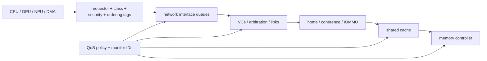

# Quality of Service (QoS), Ordering, and Input/Output (I/O) Coherence

> **First-time reader orientation:** Quality of service turns a shared fabric from best effort into an enforceable latency, bandwidth, priority, or fairness policy. Input/output coherence defines how devices and processor caches obtain compatible views of memory. A priority field alone is not a guarantee; every queue, bridge, network, and memory scheduler on the path must preserve the service contract.

> **Abbreviation key — skim now and return as needed:** central processing unit (CPU); graphics processing unit (GPU); neural processing unit (NPU); memory-level parallelism (MLP); input-output memory management unit (IOMMU);
> input-output translation lookaside buffer (IOTLB); miss status holding register (MSHR); dynamic random-access memory (DRAM); double data rate (DDR); last-level cache (LLC);
> network on chip (NoC); virtual channel (VC); direct memory access (DMA); Advanced eXtensible Interface (AXI); Advanced High-performance Bus (AHB);
> Advanced Peripheral Bus (APB); AXI Coherency Extensions (ACE); Coherent Hub Interface (CHI); reliability, availability, and serviceability (RAS); gigabyte (GB).

> **Prerequisites:** [AHB, AXI, and APB](../03_Transaction_Protocols/01_AHB_AXI_APB.md) (channels, IDs, ordering), [ACE and CHI](../../01_CPU_Architecture/06_Coherence_and_Consistency/03_ACE_and_CHI.md), and [Routing, Flow Control, and Deadlock](../04_On_Chip_Networks/02_Routing_Flow_Control_and_Deadlock.md).
> **Hands off to:** cache/memory partitioning, IOMMU/device integration, real-time policy, and package/off-die fabrics. This page owns the end-to-end enforcement path.

---

## 0. Why this page exists

A fabric is correct when transactions complete with required ordering. A product is usable only when critical traffic completes within a bounded service envelope despite CPUs, GPUs, NPUs, DMA, refresh, and coherence sharing queues and links.



QoS fails when identity or policy disappears at one stage. Ordering fails when two stages assume the other is the serialization point. I/O coherence fails when device caches/DMA use a different visibility domain than software expects.

## Before the details: end-to-end guarantees cross many schedulers

A requester usually passes through a source queue, protocol bridge, on-chip network, memory controller, and return path. Each stage can delay work. A quality-of-service label merely carries intent; a guarantee requires compatible admission control, bounded bursts, arbitration, buffering, and progress rules at every stage. Otherwise a high-priority request can remain trapped behind lower-priority work already occupying an ordered queue.

Bandwidth and latency guarantees are different. Weighted arbitration can provide a long-term bandwidth share while still allowing an unacceptably long burst delay. A strict priority can reduce urgent latency but starve background traffic. Aging, deadlines, reservations, or credit limits address different policies. Ordering constraints may also force one request to wait for an older request even when it has higher priority.

**Beginner checkpoint:** state the protected requester, traffic envelope, metric, time window, and overload behavior. Then derive or measure the worst-case path, including dependent responses and memory timing—not just one router’s arbitration result.

## 1. Define service contracts

| Contract | Example metric | Appropriate mechanism |
|---|---|---|
| minimum bandwidth | ≥ 20 GB/s over 10 µs windows | token/reservation + downstream capacity |
| maximum average latency | mean ≤ 100 ns | priority/weight + utilization control |
| tail latency | p99 ≤ 500 ns | admission, aging, isolation, bounded interference |
| deadline | complete by display/audio period | time-aware scheduling and budget |
| fairness | weighted slowdown or max-min share | weighted arbitration + resource accounting |
| isolation | one tenant cannot exceed allocation | partition/quota at all bottlenecks |

Priority alone does not guarantee latency if a low-priority long packet is non-preemptive, buffers are full, or memory is in an uninterruptible command sequence. Contracts need a traffic envelope and assumptions about maximum blocking.

## 2. Carry identity and intent end to end

A request may carry:

- source/requestor ID;
- transaction/order ID;
- traffic class/priority;
- partition/control ID and monitoring ID;
- VM/security domain;
- coherent/cacheable/shareable attributes;
- latency-sensitive, bandwidth, isochronous, or best-effort class;
- deadline/age;
- read/write/atomic/device ordering attributes.

Bridges must define how fields map, merge, or terminate. If 16 upstream requestors collapse to one downstream ID, per-requestor QoS and ordering may be lost unless sideband context is retained internally.

Monitoring identity should be separable from control identity: several cores may share one allocation while being measured individually, or one VM may span several initiators.

## 3. Arbitration mechanisms

### Fixed priority

Low latency for critical traffic, but starvation unless aging or budgets constrain it.

### Round-robin

Simple fairness by grants, not bytes or service time. A requester with long bursts receives more bandwidth per grant.

### Weighted round-robin / deficit round-robin

Weights allocate service; deficit accounting handles variable packet sizes. Over a long interval, class $i$ target share is approximately

$$
s_i=\frac{w_i}{\sum_jw_j}
$$

when all classes are backlogged. Hierarchical scheduling can reserve first by tenant/class, then arbitrate requestors within each.

### Age/deadline aware

Age prevents starvation; earliest-deadline policies serve real-time traffic when admission ensures total utilization is feasible. Unbounded priority escalation can disrupt lower-class guarantees, so define budgets.

## 4. Bounding latency

Worst-case path latency sums fixed pipeline/transport plus interference at each shared resource:

$$
L_{worst}\le L_{base}+\sum_k B_k,
$$

where $B_k$ is bounded blocking at NI queues, router VCs, links, home nodes, shared caches, and memory controller. One unbounded queue makes the end-to-end bound unbounded.

Sources of non-preemptive blocking:

- maximum packet/burst already on a link;
- DRAM read/write batch or refresh;
- cache miss/coherence transaction holding an entry;
- atomic or device transaction;
- retry/backoff interval;
- bridge packetization.

Admission control limits offered load so reservations are feasible. Burstiness needs token-bucket parameters $(r,b)$: long-term rate $r$ and burst $b$. A rate guarantee without a burst bound cannot guarantee finite short-window latency.

## 5. Ordering domains and IDs

Transaction protocols often allow out-of-order completion across IDs while preserving order within defined ID/address/domain combinations. More IDs increase MLP but enlarge reorder buffers at bridges/targets.

An ordering point may be:

- source store buffer;
- coherent home node;
- shared cache/memory controller;
- device endpoint;
- bridge crossing into a stronger domain.

Document each operation's completion meaning. “Write response received” might mean accepted into a target buffer, visible to coherent observers, or committed to a device. Software synchronization must wait for the right point.

Responses returning out of order need source-side tags and reorder semantics. Never infer age from arrival order after adaptive routing or independent channels.

## 6. Coherent versus noncoherent I/O

### Noncoherent DMA

Device reads/writes memory without participating in CPU cache coherence. Software/firmware must clean dirty CPU lines before device reads, invalidate stale CPU lines before consuming device writes, and order descriptor/doorbell operations.

### I/O coherent

Device requests enter the coherent domain so homes/snoop filters resolve CPU cache copies. This simplifies shared buffers but adds protocol traffic, directory state, ordering, and potentially device caches.

### Device cache coherent

A device cache can hold shared/owned lines and respond to probes. It needs transaction capacity, eviction/writeback, reset/error behavior, and deadlock-safe request/response resources like any other coherent agent.

Coherence scope may be inner, outer, system, or device-specific. “Coherent” must state which agents and memory types participate.

### 6.1 Follow one coherent device read: ordering, service class, and fault are one contract

Use a network-interface controller (NIC) transmit descriptor as the concrete path. The CPU writes a packet buffer and descriptor in write-back cache, rings a memory-mapped doorbell, and the NIC reads the descriptor/data. A baseline noncoherent design can work only if software cleans every dirty cache line before the doorbell and invalidates completion lines afterward. Missing one maintenance operation exposes stale data. **I/O coherence removes that manual visibility step by letting the home snoop CPU caches; it does not remove ordering, translation, QoS, or fault state.**

```mermaid
sequenceDiagram
    participant CPU as "CPU + cache"
    participant DEV as "coherent NIC"
    participant IOM as "IOMMU"
    participant FAB as "NoC/QoS fabric"
    participant H as "home/directory"
    CPU->>CPU: "write packet + descriptor D52"
    CPU->>DEV: "release/fence; doorbell D52"
    DEV->>IOM: "ReadShared(IOVA, RID=9, context, class=control)"
    alt "translation/permission fault"
        IOM-->>DEV: "fault(RID=9); retain D52 as fault-pending"
        CPU->>IOM: "repair mapping; invalidate/fence"
        DEV->>IOM: "bounded replay of D52 read"
    end
    IOM->>FAB: "PA + requester/order/QoS/security/coherent attributes"
    FAB->>H: "admit and arbitrate under control-class budget"
    H->>CPU: "snoop dirty descriptor/cache line if needed"
    CPU-->>H: "data + downgrade/ack"
    H-->>FAB: "Data(RID=9, coherence state, poison status)"
    FAB-->>DEV: "ordered response; retire RID=9 once"
    DEV->>DEV: "fetch payload; transmit"
    DEV->>CPU: "coherent completion write; interrupt after visibility point"
```

**1. Publish before notifying.** CPU stores may sit in a store buffer or cache and the interconnect may use independent channels. A release operation/fence orders the descriptor and payload writes before the doorbell. The doorbell's arrival tells the device that descriptor `D52` exists; it is not by itself proof that unordered older stores are visible. Coherence answers *which copy is current* when the device reads, while the fence answers *whether the producer was allowed to advertise the work yet*.

**2. Allocate identity before issue.** The NIC retains descriptor state `{ring/sequence D52, I/O virtual address, length, operation, retry count, completion target}` and allocates request ID `RID=9`. Its outbound request adds device/stream or process context, ordering domain, coherent/cacheable/shareable attributes, security domain, monitoring ID, and requested service class. These fields have different owners: `RID` matches completion, the order domain prevents illegal overtaking, the context selects translation/protection, and the QoS class affects service but not correctness.

**3. Translate and police intent.** The IOMMU resolves the I/O virtual address through its context/IOTLB/page walker and checks read permission. It emits a physical address while preserving or trusted-remapping requester, order, coherence, and monitoring identities. An untrusted NIC cannot promote itself to an unrestricted highest class: platform policy maps its device/context plus operation into allowed QoS. Translation miss entries and page-walk bandwidth are part of the end-to-end service path; priority preserved after the IOMMU is useless if the walk queue itself has unbounded interference.

**4. Enforce QoS at every finite queue.** Descriptor/control reads may use a low-latency class while bulk payload reads use a bounded-bandwidth class. Source credits prevent the device from filling all fabric/home entries; virtual channels or reserved buffers preserve mandatory responses; weighted/age arbitration carries the class through NoC and memory-controller service. A priority value alone cannot preempt a long packet already on a link, an active DRAM burst, or a coherence transaction holding a home entry, so the service contract includes maximum burst/outstanding counts and admission bounds.

**5. Resolve coherence at the home.** If the CPU owns the descriptor line dirty, memory is stale. The home sends a snoop, receives data plus downgrade/ack, updates directory state, and returns the current line to `RID=9`. The NIC need not force a CPU cache clean, but the coherent path consumes home transaction state, snoop/response capacity, and possibly an ownership transfer. Response/data traffic must retain a progress path independent of new device requests.

**6. Preserve completion meaning.** The NIC cannot post “transmit complete” when its read was merely accepted. It consumes the descriptor/payload, performs the I/O operation, then writes a coherent completion record. The interrupt is ordered after the completion's declared visibility point. The CPU's handler performs the matching acquire/read before reusing the buffer. This creates the software happens-before chain `CPU publish → doorbell → device read/use → completion visible → interrupt/CPU consume`.

**7. Fault without duplicating work.** If translation or permission fails, the IOMMU creates a fault record containing device/context, address, access type, `RID=9`, reason, and timestamp; no home request is issued. For a recoverable page-request design, the NIC keeps `D52` in a `fault-pending` state while software installs/repairs the mapping, performs the required IOTLB invalidation and fence, and authorizes a bounded replay. Replay may use a new transport request ID, but it remains tied to the same descriptor sequence, and only one successful device operation/completion is permitted. A permission violation, poison returned by coherence/memory, retry limit, device reset, or inaccessible dirty owner instead produces a declared error completion/containment path. Retrying indefinitely at top priority would turn one fault into denial of service.

The implementation state follows directly: descriptor/fault/retry tables in the device; context, IOTLB and walk-MSHR state in the IOMMU; per-class token/deficit/age and outstanding quotas at each arbitration point; per-ID order/reorder entries; home transient/snoop masks; and completion visibility/interrupt state. More coherent outstanding work hides latency but expands every one of those tables. Reserved queues and bandwidth improve isolation but strand capacity when idle unless borrowing/reclaim is safe. Stronger ordering reduces reorder logic but serializes independent payload reads. Coherent I/O removes software cache-maintenance cost while adding snoop traffic, directory pressure, device-reset rules, and verification state.

**Replayable observation and verification.** Correlate descriptor `D52`, device/context, `RID`, physical address, order domain, QoS/partition/monitor IDs, home transaction, and completion sequence across timestamped probes. Attribute latency to doorbell wait, device queue, translation/walk, fabric admission/serialization, home/snoop, memory, return/reorder, and device service; count offered/admitted/completed bytes, throttled cycles, borrowed/reclaimed capacity, snoops/dirty interventions, faults/replays, poison, deadline misses, and maximum age by class. Assertions should prove publish-before-doorbell and completion-before-interrupt under the declared memory model; no request reaches the home after a translation denial; QoS/security remapping is authorized; retries cannot create two live operations or two completions for `D52`; same-domain ordering is preserved despite different classes; mandatory responses progress; and device reset drains/aborts transactions and coherent ownership before state is discarded. Replaying the captured boundary events with the same contract/policy must reproduce the same fault decision and terminal completion.

## 7. IOMMU, address identity, and QoS

Translation can change request attributes and latency. The IOMMU associates device/process context, permissions, memory type, and sometimes QoS IDs. Its context/IOTLB miss queues are shared bottlenecks that need partitioning or bounded service.

A device request flow can be blocked by:

1. command queue;
2. IOMMU context lookup/walk;
3. coherent home transaction;
4. NoC and cache;
5. memory scheduler;
6. response/reorder queue.

QoS tags must survive translation, or be intentionally remapped by trusted policy. Untrusted devices should not assert the highest priority directly.

## 8. Resource partitioning

End-to-end isolation may require:

- NI ingress queue quotas;
- VC/buffer reservation;
- weighted link arbitration;
- maximum outstanding transaction credits;
- home/directory transaction quotas;
- cache capacity and MSHR partitions;
- memory-controller bandwidth/command budgets;
- IOMMU walk/context quotas.

Allow elastic borrowing when capacity is idle, but reclaim without deadlock and preserve minimum guarantees. A two-threshold scheme—guaranteed minimum and hard maximum—often balances isolation and utilization.

Memory-system partitioning architectures such as Arm MPAM transport partition identifiers so downstream components can implement capacity/bandwidth controls and monitoring.

## 9. Feedback control and stability

Controllers measure bandwidth/latency and adjust weights/throttles. Risks:

- delayed measurements cause oscillation;
- local controllers fight (cache throttles while memory raises priority);
- phase bursts are mistaken for permanent demand;
- accumulated credits produce post-throttle bursts;
- priority inversion through dependencies (critical response waits on low-priority request).

Use coordinated objectives, bounded update rates, hysteresis, and dependency-aware priority inheritance. Mandatory coherence responses may inherit the class of the transaction they unblock.

## 10. Error, reset, and maintenance traffic

QoS policy must reserve progress for:

- coherence responses and writebacks;
- IOMMU invalidations/fences;
- DRAM refresh and RAS scrub;
- interrupts and fault reports;
- power-management handshakes;
- device reset/drain;
- debug/firmware control.

Starving maintenance to maximize foreground bandwidth can cause data loss or permanent deadlock. During reset, block new traffic, drain/cancel outstanding requests with defined completion, invalidate coherent/device state, then release resources.

## 11. Verification and observability

Invariants:

- ordering within each defined domain/ID is preserved;
- responses match exactly one request despite retries/reordering;
- hard partition limits and security remaps are enforced;
- mandatory traffic eventually progresses under admitted load;
- noncoherent cache-maintenance sequences produce correct visibility;
- coherent device reset cannot leave dirty/untracked data;
- QoS IDs cannot be forged across trust boundaries.

Counters per hop/resource and class:

- offered, accepted, serviced bytes/transactions;
- queue occupancy/age and maximum blocking;
- arbitration grants, deficit/tokens, throttled cycles;
- latency percentiles and deadline misses;
- cache/MSHR/walker/memory share;
- coherent probes/ownership transfers and DMA maintenance;
- policy changes and saturation events.

## 12. Numbers to remember

- Priority is not a latency guarantee without bounded blocking and admitted load.
- End-to-end QoS is only as strong as the least-controlled shared resource.
- IDs define ordering and concurrency; bridges must preserve or explicitly terminate them.
- Noncoherent DMA requires cache maintenance plus ordering; coherent I/O pays protocol/state costs.
- Monitoring and control identities serve different purposes.
- Reserve progress for responses, invalidations, refresh, RAS, and reset traffic.

## 13. Worked problems

### Problem 1 — weighted share

Three saturated classes have weights 4:2:1 on a 70 GB/s link. Long-term targets are 40, 20, and 10 GB/s. If class 1 is idle, an elastic scheduler may let others borrow; guarantees define how quickly its 40 GB/s is restored when it returns.

### Problem 2 — non-preemptive blocking

A 256 B low-priority packet is already transmitting on a 32 B/cycle link when a critical packet arrives. Minimum blocking is 8 cycles (or remaining serialization), even with strict priority. Bounding maximum packet size bounds this interference term.

### Problem 3 — incomplete partition

Two VMs each receive half the LLC ways, but VM A occupies all memory-controller entries with long row misses. VM B's hits are isolated; its misses are not. Add outstanding/queue quotas and bandwidth/age policy downstream before claiming latency isolation.

## Cross-references

- **Transport/protocol:** [AHB, AXI, and APB](../03_Transaction_Protocols/01_AHB_AXI_APB.md), [ACE and CHI](../../01_CPU_Architecture/06_Coherence_and_Consistency/03_ACE_and_CHI.md), [Routing, Flow Control, and Deadlock](../04_On_Chip_Networks/02_Routing_Flow_Control_and_Deadlock.md).
- **Memory controls:** [Prefetching, Replacement, and QoS](../../01_CPU_Architecture/04_Cache_Hierarchy/02_Prefetching_Replacement_and_QoS.md), [DDR Controller](../02_Shared_Memory/01_DDR_Controller.md).
- **Devices/translation:** [Page Walkers, IOMMUs, and Virtualization](../../01_CPU_Architecture/05_Virtual_Memory/02_Page_Walkers_IOMMUs_and_Virtualization.md), [Host Interface, Memory Visibility, and Scheduling](../../03_NPU_Architecture/03_System_Integration/01_Host_Interface_Memory_Visibility_and_Scheduling.md).

## References

1. Arm, AMBA AXI/ACE/CHI architecture specifications.
2. Arm, [MPAM deployment overview](https://developer.arm.com/community/arm-community-blogs/b/servers-and-cloud-computing-blog/posts/practice-in-mpam-deploy-and-verify-mpam-on-ubuntu).
3. RISC-V International, IOMMU QoS Identifiers Extension in the [IOMMU specification](https://docs.riscv.org/reference/iommu/index.html).
4. W. Dally and B. Towles, *Principles and Practices of Interconnection Networks*.
5. K. Goossens et al., “QoS for On-Chip Communication,” in *Networks on Chips*, 2003.

---

**Navigation:** [System Fabrics index](00_Index.md) · [Interconnect index](../00_Index.md)
