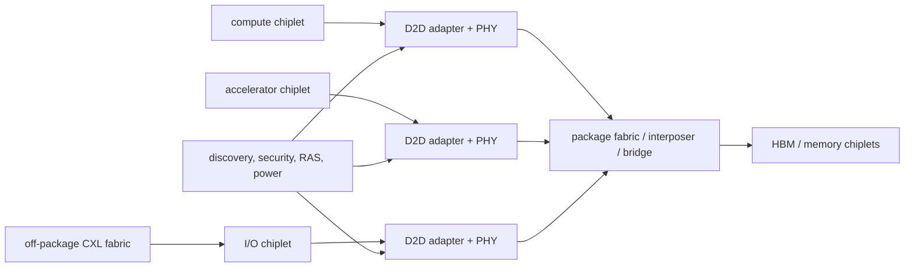
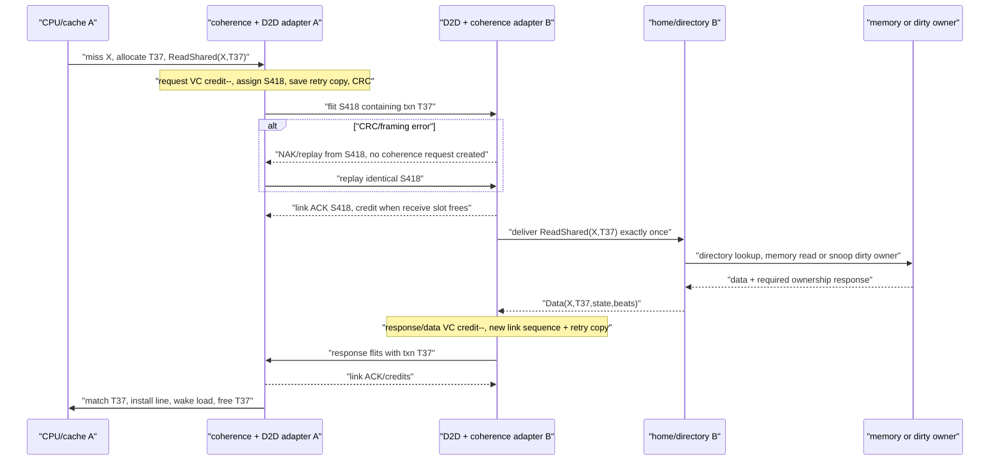
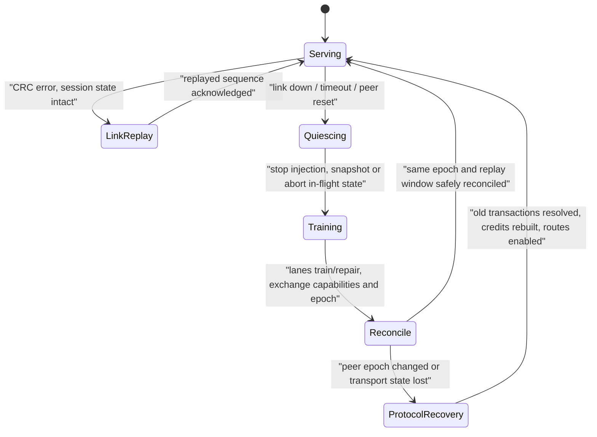
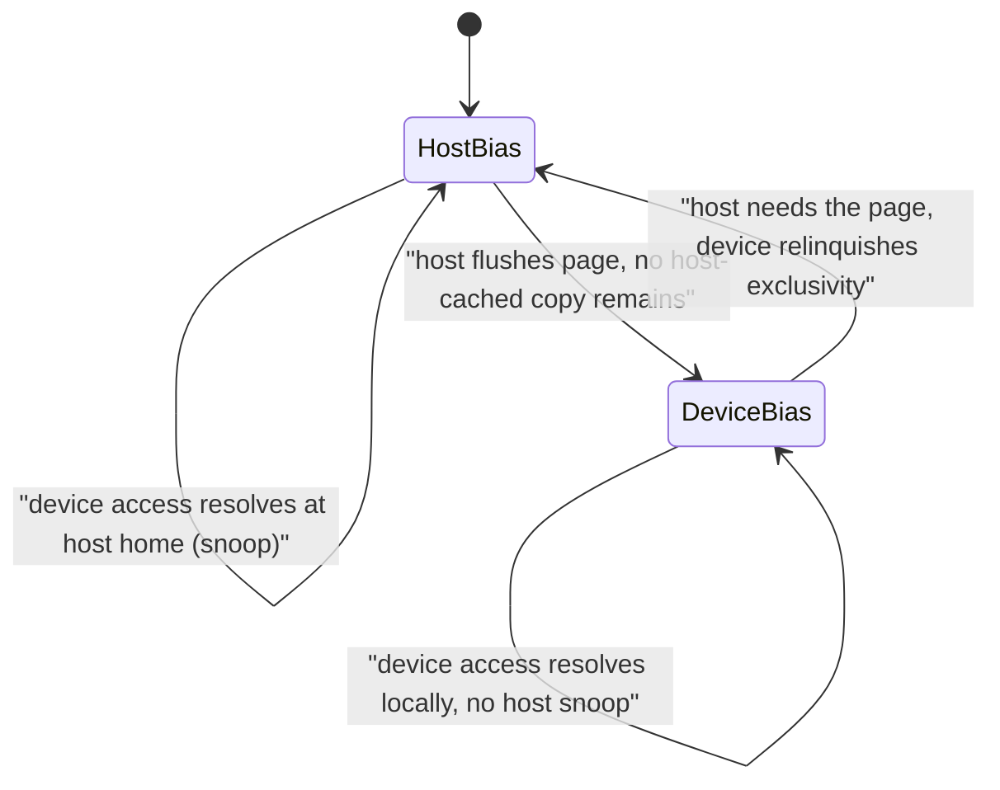

# Chiplets, Compute Express Link (CXL), and Die-to-Die Architecture

> **First-time reader orientation:** A chiplet is one silicon die intended to compose with others inside a package. Compute Express Link provides cache-coherent and memory-semantic protocols beyond a single die; Universal Chiplet Interconnect Express (UCIe) defines die-to-die connectivity. Partitioning trades yield, reuse, and modularity against link latency, energy, bandwidth, packaging, test, security, and failure recovery.

> **Abbreviation key — skim now and return as needed:** central processing unit (CPU); graphics processing unit (GPU); static random-access memory (SRAM); dynamic random-access memory (DRAM); high-bandwidth memory (HBM);
> virtual channel (VC); quality of service (QoS); direct memory access (DMA); AXI Coherency Extensions (ACE); Coherent Hub Interface (CHI);
> Universal Chiplet Interconnect Express (UCIe); Peripheral Component Interconnect Express (PCIe); die-to-die (D2D); reliability, availability, and serviceability (RAS); non-uniform memory access (NUMA);
> physical-layer interface (PHY); input/output (I/O); gigabyte (GB); kibibyte (KiB);
> transaction-layer packet (TLP); through-silicon via (TSV); embedded multi-die interconnect bridge (EMIB); redistribution layer (RDL); device-to-host (D2H); host-to-device (H2D).

> **Prerequisites:** [Full-Chip Modeling](../01_System_Modeling/01_Full_Chip_Modeling.md), [ACE and CHI](../../01_CPU_Architecture/06_Coherence_and_Consistency/03_ACE_and_CHI.md), [Network on Chip](../04_On_Chip_Networks/01_Network_on_Chip.md), and [IC Packaging](../../../07_Manufacturing_and_Bringup/02_IC_Packaging.md).
> **Hands off to:** package implementation, signal/power integrity, thermal design, and system software. This page owns partitioning and link/protocol architecture.

---

## 0. Why this page exists

A chiplet system moves boundaries that were once internal wires onto standardized or proprietary die-to-die links. The move can improve yield, reuse, reticle scaling, technology specialization, and product composition. It also adds serialization, PHY power, protocol conversion, package dependencies, and new reset/RAS/security domains.

The architecture must decide **where semantics terminate**, not only how many gigabits cross the package.

## Before the details: a boundary converts wires into a protocol

Inside one die, nearby blocks may exchange wide signals with tight clocking and shared reset assumptions. Across a chiplet boundary, the design needs physical lanes, training, clock tolerance, flow control, error detection, retry, discovery, and reset sequencing. The boundary therefore adds latency and energy and creates new failure modes even when logical behavior is preserved.

Partitioning can improve yield by replacing one large die with smaller dies, reuse mature process nodes for analog or I/O functions, and enable several products from common components. The benefits depend on known-good-die test, package yield, substrate routing, thermal density, and the traffic placed across the boundary. Fine-grained feedback loops suffer most from added latency; bulk transfers tolerate it better.

**Beginner checkpoint:** quantify bytes per second, round-trip sensitivity, energy per bit, outstanding-credit requirement, and failure behavior for every cut edge. “Use chiplets” is not an architecture until the partition and link contract are explicit.

## 1. Why partition a die?

Partitioning benefits:

- yield improvement from smaller dies;
- reuse of validated I/O, compute, cache, and analog tiles;
- mixing process nodes (dense logic, SRAM, analog/PHY);
- scaling past reticle limits;
- product binning and configurable chiplet counts;
- independent development schedules and suppliers.

Costs:

- duplicated PHY/adapters, clocks, test, management, and keepout;
- higher latency/energy per crossing;
- package/interposer area, yield, and routing constraints;
- limited edge/bump bandwidth;
- cross-die coherence/directory complexity;
- known-good-die test and repair;
- thermal and power-delivery coupling;
- security/trust between dies.

The right partition cuts few latency-critical, high-bandwidth paths and many modular/technology-specific ones.

## 2. A first partition cost model

For boundary $b$ with traffic $T_b$ bytes/s, energy $E_b$ J/byte, and latency sensitivity coefficient $\lambda_b$, crossing cost is

$$
C_b=T_bE_b+\lambda_bL_b+ A_{adapter,b}+P_{idle,b}.
$$

Total value also includes die yield and reuse. With defect density $D_0$ and die area $A$, a simple Poisson yield is

$$
Y\approx e^{-D_0A}.
$$

Because $Y$ falls exponentially in $A$, dividing the function across $n$ dice of area $A/n$ each raises per-die yield to $e^{-D_0A/n}>e^{-D_0A}$.

Splitting reduces individual die area but package yield multiplies component/assembly yields and adds link/test overhead. More chiplets are not automatically cheaper.

Use traffic matrices from representative workloads. An average boundary traffic number hides bursts and coherence fanout that set queue/credit requirements.

## 3. Semantic partition choices

### 3.1 Protocol tunneling

Carry an existing on-die transaction/coherence protocol across the link. Benefits: preserves semantics and can make remote agents look local. Costs: link must carry fine-grained messages, ordering, retries, and virtual channels; latency may expose protocol assumptions designed for short wires.

### 3.2 Protocol termination and translation

Terminate on-die protocol at an adapter, then use a die-to-die transport and reconstruct transactions remotely. This localizes domains and supports heterogeneous chiplets, but bridges need reorder buffers, flow-control translation, error mapping, and precise completion semantics.

### 3.3 Message/software boundary

Partition at coarse queues, DMA, or software messages. It minimizes coherence and fine-grained latency coupling, but shifts data placement and synchronization to software/compiler.

Choose the coarsest boundary compatible with product latency and programmability.

## 4. UCIe stack as an architectural framework

Universal Chiplet Interconnect Express (UCIe) standardizes die-to-die physical/link capabilities and protocol mappings so chiplets can interoperate. Conceptually:

| Layer | Owns |
|---|---|
| protocol | PCIe/CXL or streaming/raw protocol semantics |
| die-to-die adapter | flitization, CRC/retry, ordering/flow mapping |
| physical | lanes, training, repair, clocking, electrical signaling |
| management/DFx | discovery, test, telemetry, reset, power, debug |

The exact feature set depends on specification version and package class. Architecture models should parameterize lane count, data rate, flit overhead, retry buffer, training, and repair rather than hard-coding a headline bandwidth.

Effective bandwidth:

$$
BW_{eff}=N_{lane}R_{lane}\eta_{encoding}\eta_{flit}\eta_{protocol}\eta_{retry}.
$$

Small coherence/control packets can have lower efficiency than large streaming transfers because headers/CRC/flow-control consume a larger fraction.

## 5. Link latency and credit sizing

Crossing latency includes source adapter, serialization, PHY/link, package propagation, destination adapter, and protocol reconstruction:

$$
L_{D2D}=L_{src}+L_{ser}+L_{phy}+L_{pkg}+L_{dst}+L_{protocol}.
$$

Round-trip coherence or load latency crosses twice and may visit a remote home/cache. Link replay after CRC errors adds a tail, so retry-buffer depth must cover the link round-trip bandwidth-delay product.

Credits need enough outstanding bytes to fill the pipe:

$$
C_{bytes}\gtrsim BW_{target}L_{credit}.
$$

Partition credits by virtual channel/protocol class to keep mandatory responses moving. A wide physical link can still underperform if transaction limits or adapter reorder entries are too small.

## 6. Coherence across chiplets

Options:

- one system-wide coherent domain with distributed homes/directories;
- coherent within compute chiplets, noncoherent/DMA across selected boundaries;
- hierarchical coherence: local directories summarized to a global level;
- memory-side coherence through a host/home agent;
- explicit software-managed sharing.

System-wide coherence improves programmability but makes remote latency, directory placement, snoop filtering, and failure recovery architectural. A hierarchical directory can track one bit per chiplet at the upper level and finer sharers locally, trading extra hop/lookup for scalable storage.

Coherence deadlock proof must include adapter queues and link VCs. A chiplet reset must not discard dirty owned data or outstanding acknowledgements silently.

### 6.1 Follow one coherent read across the boundary—and recover without completing it twice

Take a CPU on compute chiplet A that loads cache line `X`. `X` is absent locally, and the address-to-home map assigns its coherence home and attached memory to I/O/memory chiplet B. This one load crosses four different contracts: CPU/cache, coherence protocol, die-to-die transport, and physical link. Keeping their state and completion meanings separate is the key to a correct adapter.

**1. Admit the miss before transmitting it.** The local cache allocates a miss-status entry and requester transaction tag `T37`. That entry records at least `{line X, requesting core/load, requested permission, returned-beat mask, error state}`. The coherence requester creates a `ReadShared(X, requester=A, txn=T37)` message. If the miss table, request queue, or remote-link credits are exhausted, admission backpressures the cache; it must not emit a request it cannot later match.

**2. Convert protocol identity into transport identity.** Chiplet A's protocol adapter maps the coherence request class to a request virtual channel (VC), adds destination/home and ordering attributes, and packetizes it. The link layer then assigns link sequence number `S418`, consumes request-VC credit, calculates a cyclic redundancy check (CRC), and retains an exact copy in a **retry buffer**. `T37` survives end to end so the coherence response finds the cache miss. `S418` exists only between the two adjacent link adapters so a corrupted flit can be replayed. Confusing these tags leads either to duplicate cache transactions or to a retry buffer that can never retire.

**3. Receive or replay at link granularity.** Chiplet B checks framing and CRC before exposing the request to its coherence engine. If the check fails, B does not create a home transaction; it requests replay of `S418`. A resends the retained bytes, not a newly constructed coherence request. If the check passes, B accepts `S418` once, suppresses any duplicate sequence, advances its receive sequence, and acknowledges it. A may then release retry-buffer entry `S418`. Separately, B returns flow-control credit when the receive-buffer slot is actually reusable. An acknowledgment retires replay state; a credit grants future storage. Combining them is possible in an encoding, but their logical invariants remain different.

**4. Execute coherence at the remote home.** The B-side protocol adapter reconstructs `ReadShared(X,T37)` and allocates a home transaction entry. The directory lookup determines whether memory is authoritative or another cache owns modified data. If memory is current, the home reads it. If an owner holds dirty data, the home sends a snoop, waits for owner data and required acknowledgments, updates directory sharer/owner state, and only then forms the permitted data response. Link receipt of the request was therefore *not* architectural completion; coherence can still be waiting hundreds of cycles after `S418` was acknowledged.

**5. Return data under an independent progress path.** The response/data message carries `{requester=A, txn=T37, line X, permission/state, beat number, error/poison}` on response/data VCs. B's transmit adapter repeats the credit, sequence, CRC, and retry procedure in the reverse direction. Independent request and response credit pools are a liveness feature: a flood of new reads must not consume the storage needed by the data that releases their miss entries.

**6. Complete exactly once at the requester.** A verifies and accepts each return flit, reconstructs the coherence data response, and uses `T37` to update the original miss entry. Only after all required data beats and coherence conditions arrive may the cache install the line in the granted state, wake the CPU load, and free `T37`. A duplicate link flit is suppressed by link sequence state; a duplicate protocol completion is rejected because `T37` is no longer live. These are complementary defenses at different layers.

The enabling state can be reviewed as a layered ledger:

| Layer/state owner | Minimum live metadata | Freed when |
|---|---|---|
| cache requester/miss entry | line, requester, `T37`, permission, beat mask, error | coherence data/completion conditions satisfied |
| source coherence adapter | opcode, home/destination, ordering class, protocol VN, `T37` | protocol handoff/response contract permits |
| D2D link transmitter | link sequence `S418`, exact flit copy, CRC, retry/ack state, VC | peer acknowledges valid receipt |
| D2D flow control | credits and in-flight accounting per VC | receiver declares buffer reusable |
| remote home transaction | line lock/transient directory state, requester/`T37`, snoop/ack/data masks | directory transition commits and response launches |
| destination reassembly | packet length/flit mask, poison/error, protocol class | complete message is delivered or aborted |

**Transient corruption uses replay; link-state loss uses recovery.** A CRC error leaves both adapters in the same session with retry/receive sequence state intact, so link-local replay is invisible to coherence apart from latency. A link-down event, peer reset, or lost retry/credit state is different: the receiver may no longer know whether `S418` was accepted. Blindly replaying or resetting credits can create a duplicate request or overwrite a full buffer. Recovery must be an explicit distributed state machine:

During **quiescing**, stop new injection, mark the route unavailable, and retain retry/protocol tables. During **training**, repair or down-width lanes and re-establish electrical/link framing. During **reconciliation**, exchange a session epoch, accepted-sequence/replay-window state, and fresh credit baseline. Replay is safe only if both peers prove the same session and agree which sequences were accepted. If the peer epoch changed, raise a transport abort into the coherence layer: the requester/home tables must resolve each old transaction, roll back or finish transient directory state, and reissue only under a new transaction identity after the old one cannot complete. If an unreachable chiplet may own dirty data, recovery cannot invent a clean copy; policy must preserve the owner through reset, reach it over another route, poison/isolate the affected lines, or declare a fatal containment event.

**PPA and losing cases.** Retry depth follows link bandwidth × acknowledgment round trip; credit storage follows bandwidth × credit round trip; home/requester outstanding depth follows coherence bandwidth × full remote latency. These are three related but non-interchangeable windows. Deeper windows sustain throughput and tolerate bursts, but cost SRAM, leakage, sequence comparators, timers, muxing, and reset retention. More protocol VCs isolate request/response/data progress but multiply buffers and arbitration. A narrower repaired link preserves availability at reduced bandwidth and longer serialization; continuing at full injection rate merely moves congestion into adapters. Fine-grained false sharing, ownership ping-pong, or remote atomics can be latency-bound despite a link that reaches peak streaming bandwidth, so “GB/s passed” is not a sufficient partition result.

**Counters, fault injection, and assertions.** Measure protocol requests/completions by class, remote-home/dirty-owner cases, request-to-first-data and full completion tails, credits and retry-buffer high-water marks, credit/ack stalls separately, CRC/sequence errors, replays and replayed bytes, duplicate suppressions, lane repair/down-width time, link epochs, quiesce/retrain/reconcile latency, aborted/reissued transactions, and outstanding dirty ownership at faults. Assert:

- credits never underflow/overflow and `free + occupied + in_flight` matches declared capacity;
- an unacknowledged sequence retains an immutable retry copy, and an accepted sequence is delivered upward at most once;
- link ACK cannot complete `T37`; only the coherence response may free the miss entry;
- response/data traffic has a reachable, fairly served progress path independent of request pressure;
- a session-epoch change prevents ambiguous old replay and forces explicit protocol resolution;
- reset/link loss cannot silently discard a dirty owner, home transient, accepted request, or completion;
- every admitted coherent read eventually completes, reports poison/error, or enters a declared containment state under the platform's fault assumptions.

## 7. CXL: coherent and memory semantics off package

Compute Express Link (CXL) layers cache/memory protocols with PCIe-based discovery/I/O. Architecturally, devices can expose:

- accelerator functions with coherent access to host memory;
- device-attached memory accessed by the host;
- memory expansion/pooling through switches/fabrics;
- device caches participating under host-managed coherence rules.

The host typically remains a key coherence/management authority. CXL memory is not “slow DRAM with a different connector”; it has fabric/host bridge latency, device controllers, failure domains, poison/RAS, hot-plug/fabric management, and NUMA placement.

For tiered memory, break-even migration follows

$$
N_{reuse}(L_{remote}-L_{local}) > L_{copy}+L_{coherence}+L_{mapping}.
$$

Capacity-only data may remain remote; hot latency-sensitive data may migrate or be replicated under consistency constraints.

### 7.1 The three multiplexed sub-protocols: CXL.io, CXL.cache, CXL.mem

CXL earns its place by carrying **three protocols on one physical link**, because one device edge has three unlike needs and neither separate links (wasted pins) nor a single tunnel (wrong latency/overhead) serves all three:

| Sub-protocol | Initiator and semantics | Coherence role |
|---|---|---|
| **CXL.io** | PCIe-based enumeration, configuration, register access, DMA, interrupts, hot-plug | non-coherent; always present — it bootstraps and manages the device |
| **CXL.cache** | device coherently caches host memory (device-to-host, D2H, requests; host-to-device, H2D, snoops/responses) | device is a coherent agent under the host home/directory (asymmetric — the device holds no directory) |
| **CXL.mem** | host accesses device-attached memory (master-to-subordinate, M2S, reads/writes; subordinate-to-master, S2M, data) | device memory is subordinate; the host home resolves coherence; optional metadata + poison |

**Mechanism — one link, dynamic multiplex.** A flex-bus arbitration multiplexer (ARB/MUX) interleaves .cache and .mem on a **latency-optimized fixed-format flit** with .io on the **PCIe transaction-layer packet (TLP)** format, choosing per flit. The coherent classes share a slim, fixed header to minimize per-message overhead; .io keeps the full PCIe packet because it must stay enumeration-compatible with existing software. **Why not tunnel everything over .io?** Tie it to §4's efficiency identity $BW_{eff}=N_{lane}R_{lane}\eta_{encoding}\eta_{flit}\eta_{protocol}\eta_{retry}$: a small coherent message pays a much smaller header on the .cache/.mem flit path than as a PCIe TLP. *Worked number:* a 64-byte line as a PCIe memory-write TLP carries roughly 24–30 B of header/sequence/framing → $\eta_{protocol}\approx 64/(64{+}28)\approx 70\%$; as a CXL.mem flit slot the header is a few bytes → $\eta_{protocol}\gtrsim 90\%$. That ~20-point efficiency gap on line-grained coherent traffic — exactly the "small coherence/control packets have lower efficiency" remark of §4 — is why .cache/.mem exist as distinct formats rather than riding .io.

**Device types (needed for §7.2).** The sub-protocol mix defines the device class: **Type-1** = .io + .cache (an accelerator with no local memory that coherently caches host memory — e.g. a coherent network adapter); **Type-2** = .io + .cache + .mem (an accelerator *with* device-attached memory that both caches host memory and exposes its own — e.g. a GPU or FPGA); **Type-3** = .io + .mem (a pure memory expander or pool, the §8 case). **Trade-off / when the simpler option wins:** a memory expander needs only .io + .mem — adding .cache would force a coherent agent's snoop/response machinery onto a device that never caches host memory, pure waste; and a streaming accelerator that only bulk-reads host data can often use plain PCIe DMA with no .cache at all. Spend a coherent sub-protocol only where the access pattern needs its granularity.

### 7.2 Host bias versus device bias for a Type-2 device

**Why bias exists.** A Type-2 accelerator constantly touches its *own* attached memory during a compute kernel. If every such access must resolve host coherence — snoop the host in case it cached the line — the accelerator pays a full **off-package host round-trip to reach memory millimeters away**, precisely in the inner loop where bandwidth and latency matter most. Bias removes that cost for data the device owns.

**Mechanism.** A **per-page bias bit**, tracked in a bias table (typically resident in device memory), selects where coherence for that page resolves. Under **host bias** it resolves at the host home: the host may cache the page and device accesses route through the host coherence path (CXL.mem with a host snoop) — correct while the host is producing or consuming that data. Under **device bias** it resolves *locally* at the device, which is guaranteed no host-cached copy exists, so the device reads and writes its attached memory with **no host snoop** — correct during the accelerator's compute phase. Flipping host→device requires a **barrier**: the host flushes/invalidates any cached copies of those pages before the device may assume exclusivity. **Structural argument:** this is the **off-die cousin of the Exclusive state** ([Cache Coherence](../../01_CPU_Architecture/06_Coherence_and_Consistency/01_Cache_Coherence.md)) — a line in E is guaranteed to have no other cacher and so can be written with zero bus traffic; device bias is "E-state at page granularity across the package boundary."

**Derivation — flip cost versus snoop-per-access.** Let a kernel make $N$ accesses to a device-attached page. Host bias costs $\approx N\,\Delta$, where $\Delta$ is the per-access penalty of routing through host coherence (a snoop/ownership check adds link + home latency and consumes host directory bandwidth even when pipelined). Device bias costs one flip, $L_{flip}$ (the host barrier + flush of the page), then $N\cdot 0$ local accesses. Device bias wins when
$$N\,\Delta > L_{flip}\quad\Longleftrightarrow\quad N > \frac{L_{flip}}{\Delta},$$
the same shape as §7's tiered-memory migration inequality $N_{reuse}(L_{remote}-L_{local})>L_{copy}+L_{coherence}+L_{mapping}$ — a bias flip is a per-page ownership migration. *Worked number:* with $L_{flip}\approx 2\,\mu\text{s}$ (barrier plus flushing ~64 lines/page across the link) and a snoop penalty $\Delta\approx 200\,\text{ns}$ avoided per access, break-even is $N>10$ accesses per page. A kernel touching a page thousands of times obviously runs device-biased; a page the host reads once or twice stays host-biased. Frequent flips reproduce coherence **ownership thrash** (the dirty-owner ping-pong of §6.1), so the driver/operating system keeps bias stable within a phase and flips only at phase boundaries. **Trade-off / when the simpler option wins:** host bias everywhere is the simplest, always-correct model (coherent, host always current) and is right when reuse is low or the data is genuinely host-shared; device bias adds explicit flush/barrier management and driver phase-tracking and repays only for the compute phase of a bandwidth-bound kernel. When reuse is uncertain, host bias wins because the flip is not amortized.

## 8. Memory pooling and sharing

Pooling raises utilization by assigning memory capacity dynamically among hosts/devices. Architecture questions:

- allocation granularity and address-map updates;
- fabric manager availability and failover;
- isolation/encryption/key ownership;
- bandwidth oversubscription and QoS;
- poison containment and error attribution;
- coherent versus exclusive ownership;
- migration/quiescence during reallocation;
- topology-aware NUMA placement.

A pooled capacity number is useless without bisection bandwidth and contention policy. Ten hosts cannot each receive peak device bandwidth simultaneously through one oversubscribed switch.

## 9. Clock, reset, power, and discovery

Each chiplet may have independent clocks/voltages/power states. Links need:

- clock-domain crossing and elastic buffering;
- training and lane repair after reset/power-up;
- ordered power-state entry/exit;
- retention or re-discovery of routing/configuration;
- timeout behavior when a peer disappears;
- firmware ownership and version compatibility;
- telemetry for link errors and margins.

Reset is a distributed protocol: stop injection, drain/cancel transactions, resolve dirty coherence state, reset/train link, rediscover capabilities, re-enable routing. Partial reset should not force a full package reset unless the architecture chooses that availability trade.

## 10. Security and trust

Multi-vendor or separately managed chiplets enlarge the trust boundary. Protect:

- identity/authentication and lifecycle state;
- configuration and debug access;
- memory/request address permissions;
- protocol conformance and malformed flits;
- denial of service through credits/priority;
- replay/injection on links;
- data confidentiality/integrity where threat model requires;
- side channels in shared caches/fabrics.

Adapters should validate protocol fields before allocating scarce downstream resources. Rate-limit faulting peers and contain errors to a declared domain.

## 11. Physical/package co-design

Logical topology is constrained by bumps and package routing. A full crossbar among many chiplets may be unroutable; ring/mesh/package switches trade hops against wires. PHY placement fixes die edges and competes with memory interfaces and power delivery.

Thermal gradients affect link timing and stacked memory. Power delivery must handle simultaneous switching on wide die-to-die interfaces. Package escape, microbump pitch, interposer reticle/stitching, bridges, and organic substrate choices change bandwidth density and cost.

Feed package estimates back into architecture before freezing chiplet shapes and link counts.

### 11.1 2.5D versus 3D integration: the bandwidth-density / thermal taxonomy

**Why the geometry is architectural.** Section 1 partitioned the design into chiplets and §11 warned that the package constrains architecture; the *join geometry* is where that constraint bites, because it sets the achievable inter-die **bandwidth density** and the **thermal/power-delivery** envelope, which together decide which partition (§1–§2) is even viable. The architect must therefore choose between two families before assigning traffic to a cut edge.

**2.5D — lateral, side-by-side.** Dies sit next to each other on a shared carrier that supplies dense lateral wiring: a **silicon interposer** (fine wires plus through-silicon vias, TSVs, down to the package; reticle-area-limited), a cheaper and coarser **organic or redistribution-layer (RDL) interposer**, or a localized **silicon bridge** (e.g. an embedded multi-die interconnect bridge, EMIB) buried only under the die-to-die gap. Links are lateral; micro-bump pitch is tens of µm; each die keeps its own back side facing the lid/heat sink.

**3D — vertical, stacked.** Dies are stacked and joined by TSVs with micro-bumps, or by **hybrid bonding** (direct copper-to-copper, no solder). Vertical contact density is far higher and the vertical wire is ~µm rather than ~mm, so bandwidth per area is enormous and energy/bit is low — but a die buried in the stack must reject heat *through* its neighbors, and current for upper dies must climb through TSVs.

**Derivation — bandwidth density versus thermal.** Contact density is $\rho = 1/p^2$ for pitch $p$. A 2.5D micro-bump at $p=45\,\mu\text{m}$ gives $\rho\approx(1000/45)^2\approx 4.9\times10^2/\text{mm}^2$; hybrid bonding at $p=9\,\mu\text{m}$ gives $\rho\approx(1000/9)^2\approx 1.2\times10^4/\text{mm}^2$ — about **25× denser**. At 2 Gb/s per contact that is ~124 GB/s/mm² for 2.5D versus ~3.1 TB/s/mm² for 3D, plus roughly an order-of-magnitude lower energy/bit from the shorter wire. The thermal counter-pressure is equally physical: stacking **sums power through one footprint**, and junction rise is $\Delta T = P\,\theta_{JA}$. Two dies dissipating $q$ each present $\sim 2q$ through the same sink area while the escape path is unchanged and the buried die conducts through the stack. *Worked number:* a logic die near its air-cooled limit at ~100 W/cm², stacked with a second like it, presents ~200 W/cm² through one footprint — beyond a typical ~50–100 W/cm² ceiling. **So 3D is reserved for a low-power die over a hot one** — memory-on-logic or cache-on-core (stacked last-level SRAM, e.g. 3D stacked cache) — not two maximum-power compute dies; and power delivery must push upper-die current through TSVs whose IR drop and keep-out compete with signal routing.

**Trade-off / when the simpler option wins.** 2.5D gives moderate-to-high bandwidth density (HBM-on-interposer already reaches ~TB/s aggregate) with each die independently cooled, on a mature, lower-cost flow and a larger area budget (bounded by interposer reticle/stitching). 3D wins *only* where bandwidth density and energy/bit dominate **and** the thermal stack is favorable (a cool memory/cache die over hot logic). When both dies are high-power compute, or lateral links already meet the bandwidth need, or cost/yield/test dominate (stacking multiplies known-good-die yields, §2), 2.5D is the right call. The physical fabrication detail — bonding, TSV formation, underfill, warpage, and assembly test — is deferred to [IC Packaging](../../../07_Manufacturing_and_Bringup/02_IC_Packaging.md).

## 12. Evaluation checklist and counters

Evaluate:

- boundary traffic matrix, burst/fanout, and locality by workload;
- effective bandwidth and tail latency by packet class;
- adapter/credit/reorder occupancy;
- flit overhead and small-message efficiency;
- retry, lane repair, degraded-width performance;
- remote coherence/home transactions and directory storage;
- power/energy per transferred byte including adapters;
- package routing/yield/cost scenarios;
- reset/recovery time and fault containment;
- memory-tier placement/migration benefit.

Simulate protocol and traffic jointly. A link-level bandwidth test cannot reveal coherence serialization or home-node hot spots.

## 13. Numbers to remember

- Partition at boundaries with low latency-critical traffic and high reuse/technology value.
- Chiplet economics combine die yield, package yield, adapter overhead, test, and reuse—not die yield alone.
- Effective link bandwidth multiplies lane rate by encoding/flit/protocol/retry efficiency.
- Credit and retry storage follow bandwidth × round-trip latency.
- Coherence across a resettable/fallible boundary needs explicit dirty-state and transaction recovery.
- CXL memory is a NUMA/fabric tier with management, RAS, security, and contention semantics.
- CXL multiplexes three sub-protocols on one link — .io (PCIe enumerate/config/DMA), .cache (device caches host memory), .mem (host reads device memory) — with the coherent classes on a slim flit for higher small-message efficiency (§7.1).
- A Type-2 device's per-page bias bit is an off-die Exclusive state: device bias skips host snoops on locally-owned pages and repays its flush/barrier flip after $N>L_{flip}/\Delta$ local accesses (§7.2).
- 3D (hybrid bonding, ~µm pitch) offers ~25× the bandwidth density and ~10× lower energy/bit of 2.5D micro-bumps, but is thermally limited to a cool-die-over-hot-die stack (§11.1).

## 14. Worked problems

### Problem 1 — effective link bandwidth

Sixteen lanes each provide 32 Gb/s raw. Combined encoding/flit/protocol efficiency is 82%:

$$
BW=16\times32/8\times0.82=52.48\ \text{GB/s}
$$

per direction if the lanes are unidirectional as modeled. Transaction limits may reduce achieved rate further.

### Problem 2 — credit window

A 50 GB/s link has 80 ns credit round trip:

$$
C\ge50\times10^9\times80\times10^{-9}=4000\ \text{B}.
$$

Roughly 4 KiB of usable outstanding credit is required per fully utilized aggregate path, then partitioned/headroom-adjusted by traffic class.

### Problem 3 — hierarchical directory

An eight-chiplet system with eight cores/chiplet could track 64 core sharers globally. A hierarchical upper directory uses eight chiplet bits; only the owning local directory tracks eight core bits. Storage falls at the global level, but a request may add a local-directory lookup/hop.

## Cross-references

- **Protocols and coherence:** [ACE and CHI](../../01_CPU_Architecture/06_Coherence_and_Consistency/03_ACE_and_CHI.md), [Cache Coherence](../../01_CPU_Architecture/06_Coherence_and_Consistency/01_Cache_Coherence.md).
- **Transport/package:** [Network-on-Chip Architecture](../04_On_Chip_Networks/01_Network_on_Chip.md), [Routing, Flow Control, and Deadlock](../04_On_Chip_Networks/02_Routing_Flow_Control_and_Deadlock.md), [IC Packaging](../../../07_Manufacturing_and_Bringup/02_IC_Packaging.md).
- **Memory/system:** [HBM and Advanced Memory Systems](../../02_GPU_Architecture/02_Memory_System/02_HBM_and_Advanced_Memory_Systems.md), [Full-Chip Modeling](../01_System_Modeling/01_Full_Chip_Modeling.md).
- **CXL bias and confidential links (§7.1–§7.2, §11.1):** [Cache Coherence](../../01_CPU_Architecture/06_Coherence_and_Consistency/01_Cache_Coherence.md) (the Exclusive state that device bias mirrors), [AHB, AXI, and APB](../03_Transaction_Protocols/01_AHB_AXI_APB.md) (§12 root of trust and memory/link encryption reused at §10), [IC Packaging](../../../07_Manufacturing_and_Bringup/02_IC_Packaging.md) (2.5D/3D fabrication behind §11.1).

## References

1. UCIe Consortium, [UCIe Specifications](https://www.uciexpress.org/specifications).
2. Compute Express Link Consortium, [CXL Specification](https://computeexpresslink.org/).
3. R. St. Amant et al., “Die-to-Die Interconnects and Chiplet-Based Systems,” IEEE Micro.
4. Arm, [Chiplet System Architecture overview](https://developer.arm.com/community/arm-community-blogs/b/architectures-and-processors-blog/posts/arm-a-profile-architecture-developments-2024).
5. [IC Packaging](../../../07_Manufacturing_and_Bringup/02_IC_Packaging.md) and its primary references.

---

**Navigation:** [System Fabrics index](00_Index.md) · [Interconnect index](../00_Index.md)
