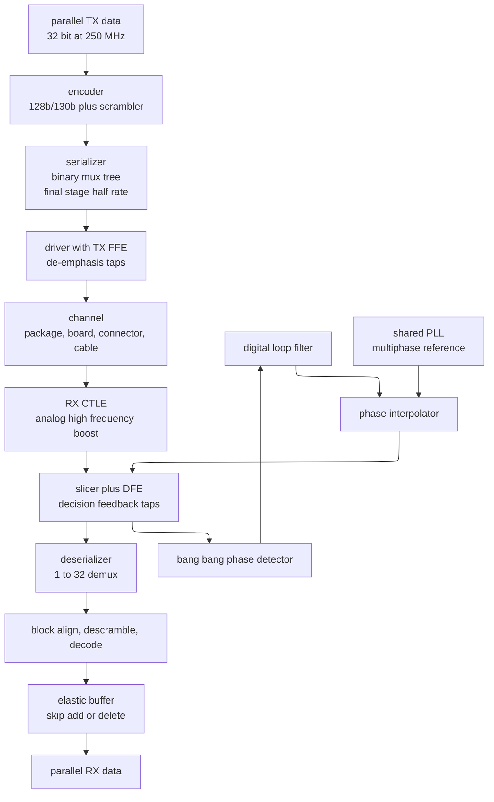
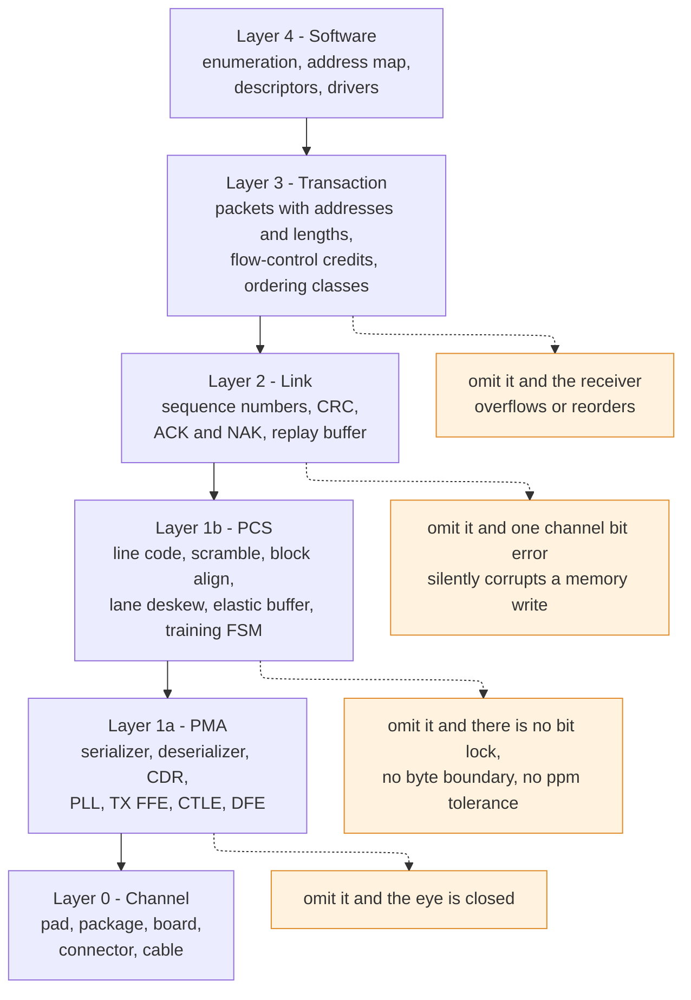
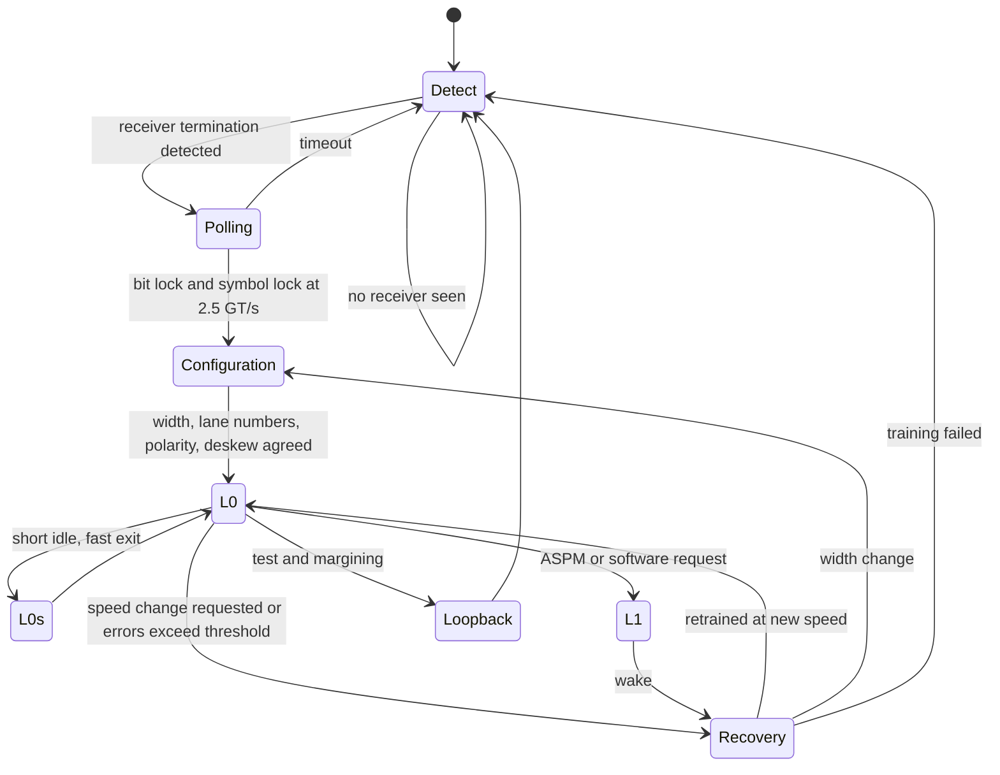
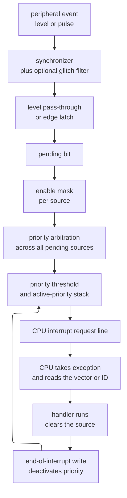

# High-Speed I/O and Peripheral Protocols — how a chip talks to everything outside it

> **Prerequisites:** [AHB, AXI, APB](../03_Transaction_Protocols/01_AHB_AXI_APB.md) — you need the idea of a transaction split into address and data phases, of a handshake with backpressure, and of a low-speed peripheral bus hanging off a bridge; §10 hangs every peripheral in this page off exactly that bridge. [CMOS Fundamentals](../../../00_Fundamentals/01_CMOS_Fundamentals.md) — you need the CMOS inverter, the $RC$ charging of a capacitive load, and the fact that a driver's strength trades against its $di/dt$; §9 and §11 turn those into pull-up sizing and ground bounce.
> **Hands off to:** [Chiplets, CXL, and Die-to-Die](02_Chiplets_CXL_and_Die_to_Die.md) — it takes the SerDes and layered-stack machinery derived here and applies it to links that stay *inside* the package, where the channel is short enough to change every trade-off. [QoS, Ordering, and I/O Coherence](01_QoS_Ordering_and_IO_Coherence.md) — it owns what happens to a device transaction once it is *on* the fabric: service classes, coherence, IOMMU, and interrupt routing.

---

## 0. Why this page exists

Every other page in this notebook describes wires that stay on the die. Advanced eXtensible Interface (AXI) channels, Coherent Hub Interface (CHI) flits, and network-on-chip (NoC) links all live in an environment where a wire is a few hundred micrometers of metal, the two endpoints share a clock tree, the loss is negligible, and a "channel" is a lumped $RC$. Almost nothing in that environment survives the trip across the package.

Outside the package, four things change at once. The interconnect becomes a **transmission line** with frequency-dependent loss, so the received waveform is not a delayed copy of the transmitted one. The two endpoints **no longer share a clock**, so the receiver must either be given one or recover one. The wire count collapses from thousands to tens, because every pin costs package area, board area, and power. And the other end is **not yours** — it is a connector, a cable, a disk, a camera, or another vendor's chip, which means the interface is a contract enforced by a published standard and a compliance program rather than by your own regression suite.

The consequence is that external interfaces are where an SoC's schedule most often dies. A block that works in simulation can fail at bring-up because the board's insertion loss closed the eye, because a source-synchronous input was constrained as if it were system-synchronous, because a UART's baud divider rounded the wrong way, because an I2C master's clock generator ignored clock stretching, or because sixteen outputs switched at once and bounced the I/O ground past $V_{IL}$. None of those is exotic; all of them are the same class of error, which is **treating an off-chip interface as if it were an on-chip one**.

After this page you should be able to: explain from first principles why a 32-bit parallel bus loses to a single serial lane past a few hundred megabits per second per pin; describe what a serializer/deserializer (SerDes) does and why it needs clock and data recovery, line coding, and three different equalizers; compute a real PCI Express (PCIe) throughput number including every layer of overhead; choose between non-return-to-zero (NRZ) and four-level pulse-amplitude modulation (PAM4) with a link budget rather than a preference; read and write the four Serial Peripheral Interface (SPI) modes without a lookup table; derive why Universal Asynchronous Receiver/Transmitter (UART) baud rates must match within about two percent; say what a double data rate (DDR) memory PHY is training and why training must exist at all; and lay out a post-silicon bring-up ladder for an interface you have never seen boot.

---

## 1. The three families, and why the boundary between them exists

### 1.1 The taxonomy, stated as three answers to one question

Every off-chip interface must answer one question: **how does the receiver know when to sample?** There are exactly three answers in use, and they are the taxonomy.

**Parallel source-synchronous.** The transmitter sends $N$ data wires *plus a clock or strobe wire it generates itself*, launched from the same flip-flops with the same delay. The receiver samples all $N$ bits with the forwarded strobe. Examples: the DDR synchronous dynamic random-access memory (SDRAM) data bus with its DQS strobe, the Reduced Gigabit Media Independent Interface (RGMII) between an Ethernet media access controller and its physical layer device, and every legacy wide bus from Peripheral Component Interconnect (PCI) to Advanced Technology Attachment (ATA).

**Embedded-clock serial.** The transmitter sends *no clock at all*. It sends one differential pair per direction per lane, encoded so the data itself contains enough edges for the receiver to reconstruct a sampling clock. Examples: PCIe, Universal Serial Bus (USB) 3.x, Serial ATA, and every Ethernet interface above one gigabit per second.

**Low-speed simple.** The signaling rate is low enough that none of the above matters. Either a clock wire is sent and the setup/hold budget is enormous relative to any plausible skew (SPI, Inter-Integrated Circuit or I2C), or no clock is sent and the receiver oversamples a pre-agreed bit rate (UART). Examples: I2C, SPI, UART, and general-purpose input/output (GPIO).

The interesting engineering is not the list. It is **why the first family stops working at a specific rate**, which is the boundary that forced the second family into existence.

### 1.2 The baseline: a wide parallel bus, and where it breaks

Take the simplest thing that could work: a 32-bit single-ended parallel bus with a forwarded clock, running across 15 cm of printed circuit board (PCB). Start slow and speed it up.

The receiver's sampling budget for one bit period, the **unit interval** ($\text{UI}$), must absorb every source of uncertainty:

$$\text{UI} \;\ge\; t_{su} + t_h \;+\; t_{\text{skew}} \;+\; t_{\text{jitter}} \;+\; t_{\text{ISI}} \;+\; t_{\text{xtalk}}$$

Fill in numbers that are typical for a modern process and a normal four-layer board:

| Term | Value | Where it comes from |
|---|---|---|
| $t_{su} + t_h$ | 150 ps | receiver flip-flop aperture plus the input buffer's own uncertainty |
| $t_{\text{skew}}$ | 120 ps | package substrate mismatch 60 ps, PCB length mismatch and via stubs 40 ps, on-die routing to the pads 20 ps |
| $t_{\text{jitter}}$ | 80 ps | phase-locked loop (PLL) jitter plus power-supply-induced jitter on the transmitting flip-flops |
| $t_{\text{ISI}}$ | 60 ps | the previous bit has not fully settled at the low-pass-filtered receiver |
| $t_{\text{xtalk}}$ | 90 ps | 31 aggressors coupling into the victim, converted from a voltage error to a time error through the edge slope |
| **total** | **500 ps** | |

At 200 Mb/s per pin, $\text{UI} = 5000$ ps; the budget consumes 10% of it and the design is trivially safe. At 1 Gb/s, $\text{UI} = 1000$ ps and the budget consumes half; achievable with care. At 2 Gb/s, $\text{UI} = 500$ ps and the budget is exactly the whole bit — **zero margin, at typical, before corners**. That is the wall, and it lands between 1 and 2 Gb/s per pin for a board-level single-ended bus. This is why "a few hundred megabits per second per pin" is the rule of thumb: it is the rate at which you can still close the budget across process, voltage, and temperature with a design team that has other work to do.

Now look at *which* terms grow. $t_{su}+t_h$ is fixed by the process and does not shrink with the data rate. $t_{\text{skew}}$ is set by physical construction — package substrate routing, PCB length matching, connector pin assignment — and it is *absolute* picoseconds, not a fraction of a UI, so it becomes a larger share of the budget every generation. $t_{\text{xtalk}}$ scales with the *number of aggressors*, so it gets worse precisely because the bus is wide. A 32-bit bus is not one problem; it is 32 victims each with 31 aggressors.

### 1.3 The three arguments, quantified

**The skew argument.** Skew between data lines is unavoidable and it does not scale down. FR-4 stripline propagates at roughly 6.9 ps/mm, so matching traces to $\pm 0.25$ mm buys $\pm 1.7$ ps — cheap. But the package substrate routes from die pad to ball across a fan-out region with routing lengths that differ by several millimeters, and a connector's pins differ in length by more than that. Sixty to one hundred picoseconds of unavoidable skew is normal. At 200 Mb/s that is 2% of a UI. At 5 Gb/s it is 50% of a UI, and no amount of board layout fixes it because the error is inside parts you did not lay out.

**The crosstalk argument.** Near-end crosstalk (NEXT) between adjacent PCB traces at a normal 3-times-width spacing is roughly 2% of the aggressor's swing per aggressor, and the coupled noise from multiple aggressors adds. With eight nearby lines switching in the same direction — which the worst-case data pattern will find — a victim sees 10-20% of full swing as noise, on top of a signal already attenuated by the channel. A differential pair, by contrast, carries its own return path: an interferer that couples equally into both conductors appears as common-mode and is rejected by the receiver's differential amplifier, typically by 30-40 dB.

**The pin argument.** This is the one that decides the matter commercially. Suppose the requirement is 256 Gb/s in each direction.

- Parallel at 1 Gb/s per pin: 256 signal pins, plus a forwarded clock, plus returns. Single-ended signaling at these speeds needs roughly one ground pin per two signal pins to control the return path and the simultaneous-switching noise of §11.4. Total: **about 390 pins per direction, 780 for both.**
- Serial at 32 GT/s per lane with 128b/130b coding: $256 / (32 \times 128/130) = 8.1 \to 9$ lanes, but the natural width is 8 lanes carrying $8 \times 32 \times 128/130 = 252$ Gb/s. Eight lanes, differential, each direction: $8 \times 2 \times 2 = 32$ signal pins. Differential pairs need far fewer dedicated returns because the pair is its own return; budget one ground per pair: **about 48 pins total.**

A factor of sixteen in pins, and pins are the scarcest resource in a package. A PCIe Gen5 x16 slot delivers 63 GB/s each way over 64 signal pins. There is no parallel bus that reaches that number at any pin count you could route.

### 1.4 The derived repair, and the one thing serial actually buys

Serial links do not solve skew. They **relocate** it. Each lane recovers its own clock (§2.2), so a lane's sampling instant is set by that lane's own data edges. Lane-to-lane skew is then absorbed not by picosecond-accurate matching but by a **deskew buffer** in the physical coding sublayer, which aligns lanes on a marker in the bitstream and delays the early ones by whole symbol times. PCIe's receiver lane-to-lane skew budget is about 20 ns at 2.5 GT/s and still several nanoseconds at 16-32 GT/s. Compare with the 60-120 ps a parallel bus must hold: the tolerance improved by two to three orders of magnitude, and it improved because the *unit of alignment* moved from a picosecond of analog delay to a symbol of digital buffering.

**The cost.** A serial link needs a PLL, a clock-recovery loop, encoders and decoders, elastic buffers, equalizers, and a training state machine — hundreds of thousands of gates and a mixed-signal macro that must be characterized separately. It adds latency: serialization and deserialization alone cost $N$ UI each, and the full PHY round trip is typically 30-60 ns. It burns 5-10 pJ/bit at long reach against roughly 1 pJ/bit for a short parallel bus.

**The selection boundary.** Parallel source-synchronous is still correct when the link is short, wide, point-to-point, and latency-critical, and when you can *train* it instead of statically timing it. That describes exactly one thing in a modern SoC: the DDR memory interface (§8), which runs at 6.4 GT/s per pin over a few centimeters with a hundred data pins and no CDR anywhere, because it trains every path individually at boot. It also describes die-to-die links inside a package, where the channel is short enough that a clock-forwarded parallel bus wins outright — which is the subject of the [chiplet page](02_Chiplets_CXL_and_Die_to_Die.md).

---

## 2. The SerDes, derived

### 2.1 Serialization is the easy half

The **serializer** converts $N$ parallel bits at $f_{par}$ into one bit stream at $N f_{par}$. Built naively as an $N{:}1$ multiplexer driven by a counter, the final mux would have to switch at the full line rate with $N$ inputs loading its output node — unbuildable above a few gigabits per second. The universal repair is a **binary tree**: log2($N$) stages of 2:1 muxes, each stage running at twice the rate of the one below it, so only the last stage sees the full rate and it sees exactly two inputs. The last stage is usually built as a **half-rate** mux clocked on both edges of a clock at half the line rate, because generating a clean 32 GHz clock is much harder than generating a clean 16 GHz one and using both its edges.

The **deserializer** is the mirror: a 1:2 demux at half rate feeding a tree that fans down to $N$ bits at $f_{par}$. Nothing here is conceptually hard. The hard half is knowing *when* to sample.

### 2.2 Why an embedded clock forces clock and data recovery

The receiver has no clock wire. It has a local reference oscillator, but that oscillator and the transmitter's are independent crystals with independent tolerances: Ethernet specifies $\pm 100$ ppm at each end, PCIe $\pm 300$ ppm, so the two ends can differ by 200-600 parts per million. At 32 GT/s, 600 ppm is $32 \times 10^9 \times 600 \times 10^{-6} = 19.2$ million bits per second of drift. A free-running local clock would slip a whole bit every $1/(19.2\times10^6) = 52$ **nanoseconds** — under two thousand bit times — and the link would be useless.

So the receiver must extract both the **frequency** and the **phase** of the transmitter's symbol clock from the data edges themselves. That is **clock and data recovery (CDR)**, and it is a phase-locked loop whose phase detector observes data transitions instead of a reference clock.

**The phase detector.** The dominant structure is the Alexander, or "bang-bang", detector. It uses three samples: the previous data bit $D_{n-1}$, an *edge* sample $E_n$ taken nominally at the transition between bits, and the current data bit $D_n$.

| $D_{n-1}$ | $E_n$ | $D_n$ | Interpretation | Action |
|---|---|---|---|---|
| 0 | 0 | 0 | no transition | no information |
| 1 | 1 | 1 | no transition | no information |
| 0 | 0 | 1 | edge sample caught the *old* value, so the clock fired before the data changed | clock is **early**, retard phase |
| 0 | 1 | 1 | edge sample caught the *new* value, so the clock fired after the data changed | clock is **late**, advance phase |
| 1 | 1 | 0 | early | retard |
| 1 | 0 | 0 | late | advance |

Compactly: $\mathrm{UP} = D_{n-1} \oplus E_n$ and $\mathrm{DOWN} = E_n \oplus D_n$, and both are zero when there is no transition. Note what this means: the detector produces only the *sign* of the phase error, never its magnitude. That is why it is called bang-bang, and it is why the loop always dithers by at least one phase step around the lock point — a fundamental, irreducible contribution to recovered-clock jitter.

**Two loop architectures.** The classic CDR closes the loop on a voltage-controlled oscillator: phase detector, charge pump, loop filter, VCO. It works, but it needs one inductor-based VCO per lane, and sixteen VCOs on one die at slightly different frequencies is a coupling and area disaster. The modern architecture is a **phase-interpolator (PI) CDR**: one shared PLL generates a small number of evenly spaced clock phases; per lane, a digital loop filter accumulates the bang-bang votes and drives a phase interpolator that mixes adjacent phases to synthesize any sampling instant, typically in 64 or 128 steps per UI. The advantages are decisive: one analog PLL amortized across all lanes, an all-digital per-lane loop that is portable and testable, and a directly readable phase code that becomes the on-die eye monitor of §12.5.

**The frequency-offset problem the CDR cannot solve.** A PI-based CDR tracks phase indefinitely by rotating, but the *parallel* data it produces still comes out at the transmitter's rate while the receiver's downstream logic runs on the local reference. Over time one side must overflow. The repair is an **elastic buffer** plus periodic **skip** symbols that the transmitter inserts and the receiver may delete or duplicate.

The sizing follows directly. If the frequency offset is $\epsilon$ and the interval between skip opportunities is $B$ bits, the accumulated drift is $\epsilon B$ bits, and this must stay below the number of bits the elastic buffer can add or remove in one adjustment. PCIe Gen3 schedules a skip ordered set every 370 blocks of 130 bits:

$$\epsilon B = 600\times10^{-6} \times 370 \times 130 = 28.9 \text{ bits} \approx 3.6 \text{ symbols}$$

and a PCIe skip ordered set may be lengthened or shortened by up to four symbols. The specification's "370 blocks" is not arbitrary; it is $\epsilon B$ set just under the adjustment granularity. At 8 GT/s that is one opportunity every 6.0 µs.

### 2.3 Line coding: three jobs, and the arithmetic of paying for them

A raw bitstream cannot be sent as-is. It has three defects, and a line code fixes all three at a measurable cost.

**Defect 1 — no transitions.** A run of identical bits gives the CDR no phase information. During a run the loop coasts on its accumulated frequency estimate, and the VCO's or PI's own jitter accumulates as a random walk. Long runs also break the receiver's automatic gain control, which needs edges to measure amplitude.

**Defect 2 — no DC balance.** Serial links are almost always **AC-coupled**: a series capacitor at the receiver blocks the transmitter's common-mode voltage so that two chips at different supply voltages can interoperate. That capacitor is a high-pass filter. With $C = 100$ nF into $R = 100\ \Omega$ differential, $\tau = RC = 10\ \mu\text{s}$ and the corner is $1/(2\pi RC) = 15.9$ kHz. A run of $N$ identical bits at rate $R_b$ lasts $N/R_b$ and the signal droops by approximately $(N/R_b)/\tau$ of its amplitude. At 8 Gb/s a 66-bit run lasts 8.25 ns and droops 0.08% — nothing. At 100 Mb/s a 10 000-bit run lasts 100 µs and droops by ten time constants — the signal has gone to zero and the receiver is decoding noise. So the DC-balance requirement is severe at low rates and mild at high rates, which is exactly why 8b/10b's strict balance was abandoned for 64b/66b once rates rose.

**Defect 3 — no framing.** A bit stream has no byte boundaries. The receiver must find them.

**8b/10b** (Widmer and Franaszek, 1983) maps each 8-bit byte to one of two 10-bit codewords chosen to drive the *running disparity* — the cumulative excess of ones over zeros — back toward zero. It guarantees a maximum run length of 5, guarantees DC balance within $\pm 1$ bit at every codeword boundary, and reserves twelve **control symbols** (K-codes) that cannot appear in data, which solves framing directly. The cost is stark:

$$\text{efficiency} = \frac{8}{10} = 80\%, \qquad \text{overhead} = 25\% \text{ of the payload}$$

PCIe Gen1 at 2.5 GT/s therefore delivers $2.5 \times 0.8 = 2.0$ Gb/s = 250 MB/s per lane. One quarter of the link is spent on coding.

**64b/66b** (10 Gigabit Ethernet, IEEE 802.3 Clause 49) refuses to pay that. It prepends a **two-bit sync header** to each 64-bit block: `01` means the block is all data, `10` means it contains control information. The payload is not balanced by construction; instead it is **scrambled** so that runs become improbable. The sync header is the only guarantee, and it is enough: it is always a transition, so there is at least one edge per 66 bits for the CDR, and the receiver finds block alignment by hunting for the bit offset at which the header is `01` or `10` in 64 consecutive blocks.

$$\text{efficiency} = \frac{64}{66} = 96.97\%, \qquad \text{overhead} = 3.1\%$$

**128b/130b** (PCIe Gen3 through Gen5) applies the same idea with a longer block:

$$\text{efficiency} = \frac{128}{130} = 98.46\%, \qquad \text{overhead} = 1.56\%$$

PCIe Gen3 at 8 GT/s delivers $8 \times 128/130 = 7.877$ Gb/s = 984.6 MB/s per lane, and the entire generation-to-generation jump from Gen2's 500 MB/s to Gen3's 985 MB/s is $1.6\times$ from the raw rate and $1.23\times$ from abandoning 8b/10b. **USB 3.1 Gen2** uses 128b/132b (3.03% overhead) because it needs more control-symbol capacity than PCIe.

The trade is explicit: 8b/10b guarantees run length and disparity deterministically and costs 25%; 64b/66b and 128b/130b guarantee almost nothing and cost 2-3%, relying on scrambling to make failure improbable rather than impossible.

### 2.4 Scrambling: making long runs improbable for free

A **scrambler** exclusive-ORs the data with the output of a linear feedback shift register (LFSR). Two families exist and the difference matters.

An **additive** (side-stream) scrambler runs its LFSR free, seeded to a known value at link training and re-seeded at ordered sets. PCIe Gen3 uses $x^{23}+x^{21}+x^{16}+x^{8}+x^{5}+x^{2}+1$. Because the LFSR state does not depend on the data, a channel bit error corrupts exactly one descrambled bit. The cost is that transmitter and receiver must stay in lockstep, which is why the seed is reset at every skip ordered set.

A **multiplicative** (self-synchronizing) scrambler feeds the *transmitted* bits back into its own shift register; 10GBASE-R uses $x^{58}+x^{39}+1$. The receiver needs no seed — it synchronizes automatically after 58 bits. The cost is **error multiplication**: because the polynomial has three terms, each channel bit error produces three descrambled bit errors, which triples the effective raw error rate the forward error correction must handle.

Either way, scrambling does not *guarantee* anything. The probability that a scrambled stream produces a run of 66 identical bits starting at any given bit is about $2^{-65} = 2.7\times10^{-20}$; at 32 Gb/s that is $8.7\times10^{-10}$ such runs per second, or one every $1.2\times10^{9}$ seconds — **about 37 years per lane**. And the consequence of one is not a bit error but a few tens of picoseconds of accumulated CDR drift, which the loop recovers from on the next edge. A guarantee replaced by a 37-year mean time to a *recoverable* event, in exchange for 22 percentage points of link bandwidth: that is the whole argument, and it is why standards committees accepted it.

Scrambling also has a second, independent purpose: **electromagnetic emissions**. An unscrambled repetitive pattern — an idle sequence, a block of zeros — concentrates its spectral energy into a few narrow lines that radiate and fail regulatory limits. Scrambling spreads the same energy across the band, lowering the peak by 20-30 dB with no change in total power.

### 2.5 The SerDes datapath



The contract of this figure is that everything left of the channel runs on the transmitter's clock and everything right of the elastic buffer runs on the receiver's, with the CDR loop and the elastic buffer forming the only bridge between those two time bases. Trace one bit: it enters at 250 MHz in a 32-bit word, is scrambled and given a two-bit sync header, is serialized to 8 Gb/s, is pre-distorted by the transmit equalizer so that after the channel's low-pass filtering it arrives roughly square, is boosted again by the CTLE, is sliced into a decision that simultaneously feeds the data path and the phase detector, and is reassembled into a 32-bit word whose rate differs from the local one by up to 600 ppm until the elastic buffer absorbs the difference. The failure this figure illustrates is the loop: the slicer feeds the phase detector, which moves the phase interpolator, which moves the slicer's sampling instant. If the equalization is wrong, the slicer's decisions are wrong, the phase detector's votes are wrong, and the CDR walks *off* the eye rather than onto it. Equalization and clock recovery are not independent subsystems, and a link that "trains and then fails" is almost always this interaction.

### 2.6 The eye diagram: the measurement that contains everything

Overlay every unit interval of a long capture on one time axis, triggered on the recovered clock, and the result is an **eye diagram**. It is the single measurement that expresses jitter, loss, noise, equalization quality, and margin simultaneously.

```text
              |<--------------- 1 unit interval, UI --------------->|
              |                                                     |
   V1  -------+-----\_____________________________________/---------+------
              |      \                                   /          |
              |       \                                 /           |
              |        \              ^                /            |
              |         \             |  A_eye        /             |
   Vth  - - - + - - - - - X - - - - - + - - - - - - - X - - - - - - + - - -
              |         /             |                \            |
              |        /              v                 \           |
              |       /                                   \         |
   V0  -------+-----/‾‾‾‾‾‾‾‾‾‾‾‾‾‾‾‾‾‾‾‾‾‾‾‾‾‾‾‾‾‾‾‾‾‾‾‾‾‾\---------+------
              |     |<--------- W_eye = 1 UI - TJ -------->|         |
              |     |                  ^                   |         |
              | left crossing   optimal sampling      right crossing |
              | histogram, width TJ    phase          histogram      |
```

The quantities the figure defines, and what each one is telling you:

- **$A_{eye}$, eye height** — the vertical opening at the sampling phase, in millivolts. It is the received signal amplitude *after* the channel has attenuated it and *after* residual inter-symbol interference has eaten into it. It sets the slicer's voltage margin against thermal noise, crosstalk, and reference offset.
- **$W_{eye}$, eye width** — the horizontal opening at the decision threshold, in UI or picoseconds. It equals $1\,\text{UI} - \text{TJ}$, where TJ is the total jitter at the specified bit error ratio.
- **Crossing histograms** — the distribution of times at which traces cross $V_{th}$. Their width *is* the total jitter. They decompose into **deterministic jitter** (DJ), which is bounded and pattern-dependent, and **random jitter** (RJ), which is Gaussian and unbounded and is quoted as an RMS value $\sigma$.
- **Total jitter at a bit error ratio** — because RJ is unbounded, "the" eye width does not exist until you name an error rate. The standard dual-Dirac model gives $\text{TJ}(\text{BER}) = \text{DJ} + 2 Q(\text{BER}) \cdot \sigma_{RJ}$, and for $\text{BER} = 10^{-12}$, $Q = 7.03$, so $\text{TJ} = \text{DJ} + 14.07\,\sigma_{RJ}$.
- **Rise and fall times, and crossing level** — a crossing level far from 50% indicates a duty-cycle or amplitude asymmetry that will show up as deterministic jitter.
- **The mask** — every standard publishes a polygon that must fit inside the eye with no trace touching it. Compliance is literally this geometric test.

The one point that trips people: **an eye is a contour of constant error rate, not a fixed geometric object.** Quoting "the eye is 0.4 UI wide" without saying at what BER is meaningless, because the same measurement gives 0.55 UI at $10^{-6}$ and 0.30 UI at $10^{-15}$. §12.4 makes this quantitative with the bathtub curve.

---

## 3. Channel loss, equalization, and the NRZ-to-PAM4 decision

### 3.1 The channel is a low-pass filter, and that is the whole problem

A PCB trace attenuates with frequency through two mechanisms. **Conductor loss** comes from the skin effect: current crowds into a surface layer of depth $\delta = \sqrt{2\rho/(\omega\mu)}$, so the effective resistance rises as $\sqrt{f}$. **Dielectric loss** comes from the substrate's loss tangent: energy dissipated per cycle is proportional to $f \tan\delta$, so this term rises linearly with $f$ and dominates above a few gigahertz. Add vias, connectors, and cable, and the composite insertion loss of a real channel is roughly linear in frequency over the band of interest.

Typical magnitudes, per inch of trace at the Nyquist frequency:

| Material | Loss at 4 GHz | at 8 GHz | at 16 GHz |
|---|---|---|---|
| standard FR-4 | 0.9 dB/in | 1.8 dB/in | 4.0 dB/in |
| improved FR-4 | 0.6 dB/in | 1.2 dB/in | 2.6 dB/in |
| low-loss laminate | 0.3 dB/in | 0.6 dB/in | 1.3 dB/in |

The standards' channel budgets follow: PCIe Gen3 (8 GT/s, Nyquist 4 GHz) allows roughly 22 dB of channel loss; Gen4 (16 GT/s, Nyquist 8 GHz) roughly 28 dB; Gen5 (32 GT/s, Nyquist 16 GHz) roughly 36 dB. Notice that the *allowed* loss grew while the *available* reach shrank, because 36 dB at 16 GHz is a far shorter piece of FR-4 than 22 dB at 4 GHz.

**What loss does to bits.** A low-pass channel spreads each transmitted pulse in time. The received single-bit response $h[k]$ therefore has energy in neighboring bit slots: $h[-1]$ is the **pre-cursor** (energy arriving before the main bit), $h[0]$ the **main cursor**, and $h[+1], h[+2], \dots$ the **post-cursors**. Every neighboring bit adds its tail into the current decision. That is **inter-symbol interference (ISI)**, and the worst-case eye height is

$$A_{eye} = h[0] - \sum_{k \neq 0} |h[k]|$$

because the worst data pattern makes every tail subtract. Take a moderately lossy channel with $h[-1] = 0.05$, $h[0] = 0.60$, $h[+1] = 0.25$, $h[+2] = 0.10$ (normalized so an ideal channel would give $h[0] = 1$):

$$A_{eye} = 0.60 - (0.05 + 0.25 + 0.10) = 0.20$$

Twenty percent of full swing, before noise, crosstalk, and jitter. Two more decibels of loss closes it entirely. **Equalization is not an optimization; it is the only reason the link exists at all.**

### 3.2 Three equalizers, three different physical arguments

**Transmit feed-forward equalizer (TX FFE), also called de-emphasis or pre-emphasis.** A short finite impulse response filter applied to the transmitted symbols:

$$y[n] = c_{-1}\,x[n{+}1] + c_{0}\,x[n] + c_{+1}\,x[n{-}1]$$

with $|c_{-1}| + |c_0| + |c_{+1}| = 1$ because the driver's peak swing is fixed by its supply. Setting $c_{+1} = -h[1]/h[0]$ pre-subtracts the first post-cursor, so the channel's own tail cancels it. The name "de-emphasis" is literal: since the sum of magnitudes is pinned, boosting the high-frequency content necessarily *reduces* the low-frequency content, which is what a fixed-swing driver can do.

*What it corrects:* pre-cursor and post-cursor ISI, both, because it operates on symbols the transmitter already knows.
*What it costs:* main-cursor amplitude. With $c_{-1} = -0.10$, $c_0 = 0.75$, $c_{+1} = -0.15$, the main cursor is $0.75$ of full swing — a $20\log_{10}(0.75) = -2.5$ dB reduction in launched signal. You have flattened the channel and simultaneously lowered your own signal-to-noise ratio by 2.5 dB. Every dB of equalization boost from the transmitter is a dB of amplitude given up.
*Its limitation:* the transmitter cannot see the received eye. Without a back channel it must guess the channel. This is precisely why PCIe Gen3 and later added **link equalization phases** in which each end tells the other, over the link itself, which coefficient preset to use (§5.3).

**Receive continuous-time linear equalizer (RX CTLE).** An analog filter — canonically a differential pair with an $R_sC_s$ network degenerating the sources — whose transfer function has a zero at $1/(R_sC_s)$ and poles above it, producing 6-15 dB of programmable peaking at the Nyquist frequency.

*What it corrects:* the smooth, monotonic part of the channel's roll-off, cheaply and with almost no latency.
*Its limitation:* it is **linear**, so it multiplies everything in its passband by the same gain — signal, thermal noise, and crosstalk alike. Twelve decibels of peaking at Nyquist boosts the far-end crosstalk at Nyquist by exactly 12 dB too. A CTLE improves the eye only while the channel's own attenuation of the signal exceeds the noise it is amplifying, and past roughly 15 dB of boost, additional peaking makes the eye worse.

**Receive decision feedback equalizer (RX DFE).** Subtract the known tails of *already-decided* bits from the incoming signal before slicing it:

$$\hat{d}[n] = \operatorname{sgn}\!\left( r[n] - \sum_{k=1}^{K} b_k\,\hat{d}[n{-}k] \right)$$

*What it corrects:* post-cursor ISI, and — this is the point — **without amplifying noise**, because what it feeds back is a clean $\pm 1$ decision, not the noisy received waveform. This is the only equalizer with that property, which is why every modern SerDes has one.
*Its limitations, all three of which matter:*
1. **It cannot correct pre-cursor ISI.** The bit that causes $h[-1]$ has not been decided yet. Pre-cursor removal must come from the TX FFE or the CTLE.
2. **Error propagation.** One wrong decision feeds a wrong correction into the next $K$ decisions. A single slicer error can burst into several, which is why DFE-equipped links have burst-error statistics that a naive BER model does not predict, and why forward error correction schemes for such links are designed with interleaving.
3. **The first-tap timing constraint is brutal.** The decision for bit $n$ must be resolved, scaled, and summed into the analog node before bit $n{+}1$ is sampled — within one UI. At 32 GT/s that is 31.25 ps for a slicer plus a summer. The standard repair is **loop unrolling**: compute both hypotheses in parallel with two slicers offset by $\pm b_1$, and let the previous decision select between their outputs with a multiplexer. That converts a timing-critical analog feedback path into a timing-trivial digital mux, at the cost of doubling the slicer count per unrolled tap.

The three are complements, not alternatives: TX FFE handles pre-cursor and takes some post-cursor load off the DFE, CTLE handles the bulk roll-off cheaply, and the DFE cleans up residual post-cursor without the noise penalty. A 32 GT/s receiver typically runs 3 TX FFE taps, one CTLE with adaptive peaking, and 8 to 16 DFE taps, all adapted continuously by a least-mean-squares loop that runs during live traffic.

### 3.3 PAM4: buying bandwidth with signal-to-noise ratio

Past roughly 25-30 Gb/s per lane on a board channel, no amount of equalization closes an NRZ eye, because the channel's loss at the Nyquist frequency has passed 35-40 dB and the recovered signal is below the receiver's noise floor. The escape is to stop sending one bit per symbol.

**PAM4** sends four amplitude levels, encoding two bits per symbol. At the same *bit* rate, the symbol rate halves, so the Nyquist frequency halves, so the channel loss — being roughly linear in frequency — halves in decibels. That is the entire motivation, and it is a large effect.

The penalty is equally direct. With the same peak-to-peak swing $V_{pp}$:

- NRZ has one eye of height $V_{pp}$.
- PAM4 has three eyes, each of height $V_{pp}/3$.

$$\text{amplitude penalty} = 20\log_{10}(3) = 9.54\ \text{dB}$$

There is a partial refund. At equal bit rate the PAM4 symbol rate is half, so the receiver's matched-filter noise bandwidth is half, so the integrated noise power drops by a factor of two:

$$\text{noise-bandwidth credit} = 10\log_{10}(2) = 3.01\ \text{dB}$$

There is also a small extra debit: in NRZ each symbol has one nearest neighbor, while in PAM4 the two inner levels have two, so the average number of error-producing neighbors is $(1+2+2+1)/4 = 1.5$, worth roughly $0.2$ dB at the operating point. Netting:

$$\text{PAM4 penalty at equal bit rate} \approx 9.54 - 3.01 + 0.2 \approx 6.7\ \text{dB}$$

**The selection boundary falls straight out.** If the channel's insertion loss is $\alpha$ dB per GHz, moving from NRZ to PAM4 halves the Nyquist frequency and saves $\alpha f_N / 2$ dB. PAM4 wins when

$$\frac{\alpha f_N}{2} > 6.7\ \text{dB} \quad\Longleftrightarrow\quad \text{IL}_{\text{NRZ, Nyquist}} > 13.4\ \text{dB}$$

For a typical board that threshold is crossed somewhere around 25-28 Gb/s, which is precisely where the industry switched: 25G and 28G were the last NRZ generations, and 50G, 100G, and 200G per lane are all PAM4.

**Why PAM4 forces forward error correction.** Even with the eye open, PAM4's raw bit error ratio lands around $10^{-4}$ to $10^{-6}$, not the $10^{-12}$ to $10^{-15}$ a system needs. Three effects conspire: the 6.7 dB SNR penalty, level-dependent noise (the outer levels come from a driver operating closer to its rails and are noisier), and the fact that the three eyes are never equal, so the worst one sets the error rate. **Forward error correction (FEC) is therefore mandatory, not optional**, and this is a structural change: NRZ links below 25G ship with no FEC at all.

The canonical code is Reed-Solomon **RS(544,514)** over $\mathrm{GF}(2^{10})$, known as KP4 in the Ethernet world. It carries 514 payload symbols in a 544-symbol codeword and corrects up to $t = (544-514)/2 = 15$ symbol errors, taking a raw BER near $2.4\times10^{-4}$ down below $10^{-15}$.

$$\text{FEC overhead} = \frac{544}{514} - 1 = 5.84\%$$

which is why a "100 Gb/s" Ethernet lane actually signals at $100 \times 544/514 = 105.8 \to 106.25$ Gb/s (53.125 GBaud PAM4).

**The latency FEC costs, and why PCIe made a different choice.** A decoder cannot begin until it has the whole codeword. A KP4 codeword is $544 \times 10 = 5440$ bits; at 106.25 Gb/s that is 51.2 ns of buffering, and with decode pipelining the round figure quoted for KP4 is roughly **100 ns each way**. For an Ethernet switch whose end-to-end budget is microseconds, 100 ns is a rounding error. For PCIe it is not: PCIe is a load/store fabric where a CPU stalls on a read completion, and a typical device-read latency is 500-700 ns, so adding 200 ns round trip would be a 30-40% regression on the metric that matters most.

PCIe 6.0 therefore designed a **deliberately weak** FEC. Its 256-byte FLIT contains 236 bytes of transaction-layer payload, 6 bytes of data-link payload, an 8-byte cyclic redundancy check, and only 6 bytes of FEC arranged as three interleaved Reed-Solomon codes that each correct a *single* symbol. That corrects the common isolated error at roughly 2 ns of added latency, and everything the FEC misses is caught by the CRC and fixed by the link layer's replay mechanism (§4.2). The design point is explicit: **use light FEC to cut the error rate to where retry is rare, and let retry handle the rest**, rather than using heavy FEC to make retry unnecessary. Ethernet made the opposite choice because it has no retry layer to fall back on.

---

## 4. One layered stack, three standards

### 4.1 The stack



The contract: each layer converts a guarantee it is given into a stronger guarantee it hands upward. Layer 0 provides a lossy analog channel. Layer 1a converts it into a bit stream with an unknown error rate and a recovered clock. Layer 1b converts that into aligned, deskewed, rate-matched symbols with framing. Layer 2 converts *that* into an ordered, error-free byte stream by detecting corruption and retransmitting. Layer 3 converts that into addressed packets that cannot overrun the receiver, with defined ordering. Layer 4 turns packets into a programming model.

Trace one memory write from a device to host DRAM: software fills a buffer and rings a doorbell; the transaction layer builds a write packet with an address, a length, and a requester identity, and spends a posted-header credit and sixteen posted-data credits; the link layer stamps a sequence number, appends a 32-bit CRC, and copies the packet into the replay buffer; the PCS scrambles it, adds sync headers, and stripes it across eight lanes; the PMA serializes, pre-distorts, and drives it. At the far end everything unwinds, the CRC checks, an acknowledgment carrying the sequence number travels back, and only then does the transmitter free that replay-buffer entry. The failure this illustrates: if the CRC fails, the receiver sends a negative acknowledgment and *discards everything after* the bad sequence number, because accepting a later packet would violate ordering. Retry is therefore go-back-N, and the replay buffer must hold a full round trip's worth of data — the same bandwidth-delay-product sizing as the credit calculation of §5.5.

### 4.2 The same picture, three standards

| Layer | PCIe | USB 3.x / USB4 | Ethernet |
|---|---|---|---|
| **0 Channel** | AC-coupled diff pairs, 2.5-64 GT/s, board plus one connector | diff pairs, 5-20 Gb/s per lane, cable up to 1-3 m | twisted pair, backplane, or optics; 10 Mb/s to 800 Gb/s |
| **1a PMA** | SerDes with TX FFE, CTLE, DFE; PI-based CDR | SerDes, lighter equalization because cables are shorter | SerDes; for 1000BASE-T instead a hybrid, echo canceller, and PAM5 |
| **1b PCS** | 8b/10b Gen1-2; 128b/130b Gen3-5; 1b/1b plus FLIT and FEC Gen6+. LTSSM does training | 8b/10b Gen1; 128b/132b Gen2. Its own LTSSM | 64b/66b for 10G+; PCS lanes plus alignment markers for 40G+; auto-negotiation |
| **2 Link** | DLLPs: 12-bit sequence number, 32-bit LCRC, ACK/NAK, replay buffer, credit updates | Link commands: LGOOD/LBAD, LCRD credits, header packets with CRC-16 | **MAC only: 32-bit FCS, and no retry at all.** A bad frame is dropped |
| **3 Transaction** | TLPs: memory, I/O, config, message, completion. Posted / non-posted / completion classes, credit flow control, explicit ordering rules | transfers over endpoints: control, bulk, interrupt, isochronous; data-toggle sequencing | none. Ethernet stops at the frame; ordering and delivery are TCP's problem |
| **4 Software** | enumeration by bus/device/function, BARs, config space, MSI-X | descriptors, device classes, host-scheduled transactions | descriptor rings, interrupt moderation, IP and TCP stack |

The single most instructive row is **Layer 2**. PCIe and USB both retransmit; Ethernet does not. That is not an oversight, it is the defining architectural choice of each. PCIe carries *load/store semantics*: a dropped completion is a CPU that never gets its data, and there is no software layer that will notice, so link-level retry is mandatory and the cost — a replay buffer, sequence numbers, acknowledgment traffic, and a latency floor — is unavoidable. Ethernet carries *packets to an unbounded network*, where a lost frame will be retransmitted by TCP milliseconds later; adding hop-by-hop retry would add buffering and latency to every switch to solve a problem the endpoints already solve. The same reasoning explains why data-center Ethernet variants that carry storage or remote direct memory access traffic add priority flow control and congestion notification: they are trying to make the network lossless *without* adding retry, because retry is the thing Ethernet deliberately does not have.

---

## 5. PCIe as the worked example

### 5.1 Generations, and where the bandwidth actually goes

| Gen | Rate per lane | Encoding | Payload per lane per direction | x4 | x16 |
|---|---|---|---|---|---|
| 1.0 | 2.5 GT/s | 8b/10b, 80% | 250 MB/s | 1.0 GB/s | 4 GB/s |
| 2.0 | 5.0 GT/s | 8b/10b, 80% | 500 MB/s | 2.0 GB/s | 8 GB/s |
| 3.0 | 8.0 GT/s | 128b/130b, 98.46% | 984.6 MB/s | 3.94 GB/s | 15.75 GB/s |
| 4.0 | 16.0 GT/s | 128b/130b | 1969 MB/s | 7.88 GB/s | 31.5 GB/s |
| 5.0 | 32.0 GT/s | 128b/130b | 3938 MB/s | 15.75 GB/s | 63.0 GB/s |
| 6.0 | 64.0 GT/s, PAM4 | 1b/1b, FLIT, light FEC | 8000 MB/s raw, 7375 MB/s of TLP | 29.5 GB/s | 118 GB/s |
| 7.0 | 128.0 GT/s, PAM4 | as 6.0 | 16 000 MB/s raw | 59 GB/s | 236 GB/s |

The arithmetic for one cell, Gen4 x16: $16\ \text{GT/s} \times \dfrac{128}{130} \div 8\ \dfrac{\text{bit}}{\text{byte}} \times 16\ \text{lanes} = 31.5\ \text{GB/s}$, per direction, full duplex, before any packet overhead. Worked problem 1 takes it the rest of the way to a number you could quote in a design review.

The Gen6 row deserves a note: PAM4 doubled the rate without doubling the Nyquist frequency, which is why Gen6 works on approximately the same channels as Gen5. The price was FEC and a fixed-size FLIT, and the FLIT is why the payload figure is $8000 \times 236/256 = 7375$ MB/s rather than the raw 8000.

### 5.2 Topology and the programming model

A PCIe fabric is a tree, not a bus, even though its programming model pretends otherwise for backward compatibility.

- The **root complex** sits at the top, bridging the CPU's coherent fabric to PCIe. It generates configuration transactions, is the target of most device writes, and owns the address map.
- **Endpoints** are the leaves: network controllers, non-volatile memory express (NVMe) drives, GPUs.
- **Switches** are interior nodes. Architecturally a switch is *not* one device; it is an upstream port plus $N$ downstream ports, each modeled as a virtual PCI-to-PCI bridge, which is precisely the trick that lets 1990s enumeration software walk a modern tree.

Enumeration walks the tree assigning **bus/device/function (BDF)** identifiers, reads each function's configuration space (256 bytes of legacy space, extended to 4 KB for capabilities such as advanced error reporting and single-root I/O virtualization), sizes each **base address register (BAR)** by writing all ones and reading back which bits are hardwired to zero, and assigns non-overlapping address windows. Every switch then decodes downstream by address range and upstream by default. Interrupts are message-signaled: a device raises an interrupt by *writing* to an address the host programmed into its MSI-X table, which means interrupts travel the same ordered path as data and cannot arrive before the data they announce. The routing and virtualization of those messages belongs to [QoS, Ordering, and I/O Coherence](01_QoS_Ordering_and_IO_Coherence.md) and [Page Walkers, IOMMUs, and Virtualization](../../01_CPU_Architecture/05_Virtual_Memory/02_Page_Walkers_IOMMUs_and_Virtualization.md).

### 5.3 Link training: the LTSSM

Two chips that have never met must agree on lane count, lane order, polarity, speed, and equalizer coefficients, using only the wires being negotiated. The **link training and status state machine (LTSSM)** is that negotiation.



What each state accomplishes, and the mechanism that makes it possible:

- **Detect** answers "is anything plugged in?" without any signaling. The transmitter drives a common-mode step and measures how fast the pin charges: an unterminated pin has only the pad and package capacitance and charges quickly; a pin loaded by the far end's 50 Ω termination charges slowly. The $RC$ difference *is* the detection.
- **Polling** runs at 2.5 GT/s regardless of the eventual speed, because every generation must be able to talk to Gen1. It exchanges TS1 and TS2 ordered sets until each receiver achieves bit lock and symbol lock, and it discovers **polarity inversion** — a board that swapped P and N on a pair, which is legal and common, and which the receiver simply compensates by inverting.
- **Configuration** negotiates link width (a x16-capable port on a x4 slot must come up as x4), assigns lane numbers, tolerates **lane reversal** (lane 0 wired to lane 15), and performs **lane-to-lane deskew** by aligning the TS ordered sets across lanes in the elastic buffers.
- **L0** is operational. **L0s** and **L1** are low-power link states with progressively longer exit latency; the exit latency of L1 is the reason latency-sensitive devices disable active state power management.
- **Recovery** is entered for every speed change and after error thresholds are exceeded. Speed changes above 8 GT/s run the **equalization procedure**: Phase 0 hands an initial preset over the low-speed link; Phase 1 confirms both ends can operate at the target speed with those presets; Phase 2 lets the upstream port request coefficient changes in the downstream port's transmitter; Phase 3 does the reverse. The requests travel in TS1 ordered sets *over the link being tuned* — a back channel that solves exactly the problem §3.2 identified, that a transmitter cannot see the eye it is producing.
- **Loopback** exists for manufacturing test and margining; §12.3 uses it.

The practical consequence for a bring-up engineer: the LTSSM state is readable in a register, and "what state is it stuck in?" is the first question. Stuck in Detect means no receiver termination — check power to the far end. Stuck in Polling means bit lock fails — check the reference clock and the AC-coupling capacitors. Cycling Recovery-to-L0 means the equalized eye is marginal — check the channel.

### 5.4 Packet structure

A **transaction layer packet (TLP)** at Gen3 and later, on the wire:

```text
+--------+----------------+---------------------+--------+--------+
|  STP   |  TLP header    |  data payload       |  ECRC  |  LCRC  |
| 4 bytes|  12 or 16 B    |  0 .. MPS bytes     | 0 or 4 |  4 B   |
+--------+----------------+---------------------+--------+--------+
   ^          ^                                     ^        ^
   |          |                                     |        |
   |          3 DW header for 32-bit addressing,     |        appended by
   |          4 DW for 64-bit; carries type,         |        the link layer;
   |          length, requester ID, tag,             |        covers everything
   |          address, and attribute bits            |
   |                                                 optional end-to-end CRC,
   framing token containing the 12-bit sequence      generated by the source
   number and a CRC over the token itself            and checked by the ultimate
                                                     destination, so it survives
                                                     switch store-and-forward
```

Overhead is $4 + 16 + 4 = 24$ bytes per TLP with a 64-bit address and no ECRC. With a **maximum payload size (MPS)** of 256 bytes the packet is 280 bytes on the wire and the framing efficiency is $256/280 = 91.4\%$. With MPS of 128 bytes it is $128/152 = 84.2\%$ — an eight-percent bandwidth difference set by a single configuration register, and one of the highest-value things to check on a system that is missing throughput.

**Data link layer packets (DLLPs)** are short, fixed-size, and never leave the link: acknowledgments, negative acknowledgments, flow-control initialization and updates, and power-management messages. They consume link bandwidth but carry no user data.

### 5.5 Credit-based flow control, and the three ordering classes

A receiver must never be overrun, and PCIe cannot use a stop signal because a stop takes a full round trip to arrive. So it uses **credits**, advertised in advance.

At link initialization each receiver advertises, per virtual channel, six counters: header credits and data credits for each of three classes. A transmitter may send a packet only if it holds enough credits, and it decrements them at send time. The receiver returns credits as it drains its buffers. One **data credit is 16 bytes** (4 doublewords); one **header credit is one header**.

Sizing follows from the bandwidth-delay product exactly as it does for a NoC virtual channel: to keep the link busy across a round trip $T_{rt}$ at rate $B$ you must have $C \ge B \cdot T_{rt}$ bytes of credit outstanding. At 14 GB/s with a 1 µs round trip that is 14 KB, or 875 data credits. Under-provision the credits and throughput collapses to $C/T_{rt}$ regardless of the link rate — a failure mode identical to the one analyzed on [Routing, Flow Control, and Deadlock](../04_On_Chip_Networks/02_Routing_Flow_Control_and_Deadlock.md) and in §5 of the [chiplet page](02_Chiplets_CXL_and_Die_to_Die.md).

**The three classes exist to prevent deadlock, and the reason is mechanical.** Split the traffic:

- **Posted** — memory writes and messages. No completion is returned; the transaction is finished when it is sent.
- **Non-posted** — memory reads, I/O and configuration accesses, atomic operations. Each requires a completion to come back.
- **Completion** — the responses to non-posted requests.

Suppose completions shared credits with requests. A device fills the link with read requests, exhausting the shared credits; the host's completions for those reads now cannot be sent because there are no credits; the device cannot free credits because it is waiting for exactly those completions. That is a textbook protocol deadlock, and the repair is exactly the one used for virtual channels in a NoC: give the response class its own buffers and credits so that responses can always make progress independently of requests. A root port may even advertise *infinite* completion credits, because it is required to accept completions for reads it itself issued.

**Ordering rules** exist for a different reason: software correctness. The canonical case is producer-consumer. A device writes a data buffer, then writes a "ready" flag; the CPU polls the flag and reads the buffer. If the flag write could pass the data write, the consumer would read stale data. PCIe therefore requires that a posted request never pass another posted request. Similarly a read may not pass a preceding write to the same path, because the classic "read to flush" idiom — issuing a dummy read to guarantee that earlier posted writes have landed — depends on it. The complete table in the specification is a 2-D matrix of "may pass / must not pass / may pass optionally", and the *optional* entries are what the **Relaxed Ordering** and **ID-Based Ordering** attribute bits enable: a GPU streaming into memory sets Relaxed Ordering to let writes bypass one another and gains real throughput, at the price of having to issue an explicit fence before signaling completion.

For the fabric-side consequences of these rules — how they interact with coherence, with the IOMMU, and with quality of service — see [QoS, Ordering, and I/O Coherence](01_QoS_Ordering_and_IO_Coherence.md). For **CXL**, which reuses PCIe's electricals and adds cache-coherent and memory-semantic protocols on top, see [Chiplets, CXL, and Die-to-Die](02_Chiplets_CXL_and_Die_to_Die.md); this page deliberately stops at the point where the protocol stops being load/store-over-a-tree.

---

## 6. Ethernet in an SoC

### 6.1 Why the MAC and the PHY are separate chips, or separate hard macros

An Ethernet interface splits at a standardized boundary into a **media access controller (MAC)** and a **physical layer device (PHY)**. The split is not aesthetic. The MAC is ordinary synchronous digital logic — framing, cyclic redundancy check, descriptor-driven direct memory access — that ports to any process and belongs on the SoC. The PHY is analog and medium-specific: driving 100 m of unshielded twisted pair needs hybrids, echo cancellers, and line drivers with tens of volts of headroom; driving an optical module needs a different SerDes; driving a backplane needs a third. Putting the medium-specific analog behind a published digital interface lets one MAC design serve copper, fiber, and backplane, and lets the PHY be a separate die on a process suited to it.

The interface family exists because the standardized boundary had to be re-optimized every time the rate rose:

| Interface | Rate supported | Signals | Structure | Use it when |
|---|---|---|---|---|
| **MII** | 10/100 Mb/s | ~16 | 4-bit data each direction, 25 MHz at 100 Mb/s, PHY supplies the clock | legacy; the reference definition everything else reduces |
| **RMII** | 10/100 Mb/s | 7 | 2-bit data at 50 MHz, one shared 50 MHz reference | pin-constrained, multiple ports on one board |
| **GMII** | 1 Gb/s | ~24 | 8-bit data at 125 MHz | on-die MAC-to-PHY only; too many pins to leave a package |
| **RGMII** | 10/100/1000 | 12 | 4-bit **DDR** at 125 MHz, source-synchronous | the workhorse for board-level gigabit; needs a ~2 ns clock-to-data delay, supplied either by a 2 ns board trace, v1.0 style, or by an internal delay in the MAC or PHY, v2.0 style |
| **SGMII** | 10/100/1000 | 4 | 1.25 GBaud SerDes, 8b/10b; sub-gigabit rates carried by symbol replication | crossing a connector or backplane, or many ports where pins dominate |
| **QSGMII** | 4 x 1 Gb/s | 4 | 5 Gb/s SerDes carrying four SGMII streams | switch-facing, four ports on one pair |
| **XGMII** | 10 Gb/s | ~72 | 32-bit plus 4 control, 156.25 MHz DDR | internal only; the logical reference for 10G PCS |
| **XFI / SFI / 10GBASE-KR** | 10 Gb/s | 4 | one SerDes lane at 10.3125 Gb/s, 64b/66b | 10G to an optical module or over a backplane |
| **USXGMII** | 10M to 10G | 4 | one 10.3125 Gb/s lane with rate adaptation by idle insertion | one physical interface that must serve any negotiated speed, including 2.5G and 5G |

The RGMII row is where bring-up bugs live, and it is a direct instance of §1: RGMII is *source-synchronous*, so its constraint is the skew between TXC and TXD, not the absolute flight time. The specification's requirement that data be centered in the clock window can be met by adding delay in the board, in the MAC, or in the PHY — and if two of the three add it, the data lands on the clock edge and the link comes up with a high error rate rather than not at all. That failure mode, "it links but drops packets", is the signature.

### 6.2 The frame, the checksum, and where the bandwidth goes

```text
 |<---- not part of the frame ---->|<--------------- frame, covered by FCS -------------->|
 +----------+------+ +------------+------------+--------+----------------+--------+ +-----+
 | preamble | SFD  | | dest addr  | src addr   | type / | payload        | FCS    | | IFG |
 | 7 bytes  | 1 B  | | 6 bytes    | 6 bytes    | length | 46 .. 1500 B   | 4 B    | | 12B |
 | 0x55 x7  | 0xD5 | |            |            | 2 B    |                | CRC-32 | |     |
 +----------+------+ +------------+------------+--------+----------------+--------+ +-----+
```

The frame check sequence is a 32-bit CRC with polynomial `0x04C11DB7`, computed over everything from the destination address through the payload. Its guarantees are concrete: it detects every burst error up to 32 bits, every odd number of bit errors, and all one-, two-, and three-bit errors within the maximum frame length; for random corruption the residual undetected probability is $2^{-32} \approx 2.3\times10^{-10}$. A frame that fails it is **counted and dropped**, never repaired — see the Layer 2 row of §4.2.

Per-frame overhead on the wire is $7 + 1 + 12 = 20$ bytes outside the frame plus $6+6+2+4 = 18$ bytes inside it, so 38 bytes total.

- Maximum-size frames: $1500 / 1538 = 97.5\%$ efficiency.
- Minimum-size frames: a 64-byte frame plus preamble, SFD, and inter-frame gap occupies 84 bytes to carry 46 bytes of payload, so $46/84 = 54.8\%$.

The second case gives the packet-rate numbers worth memorizing: $10^9 / (84 \times 8) = 1.488$ million packets per second at 1 Gb/s, 14.88 Mpps at 10 Gb/s, 148.8 Mpps at 100 Gb/s. Those set the hardware requirement, because at 14.88 Mpps a MAC has 67 ns per packet to compute a CRC, look up a filter, write a descriptor, and possibly raise an interrupt. It is why interrupt moderation, descriptor batching, and receive-side scaling exist.

### 6.3 IEEE 1588 timestamping, and why it must be in hardware

Precision Time Protocol synchronizes clocks by exchanging timestamps. A master sends `Sync` at its time $t_1$; the slave receives it at its time $t_2$; the slave sends `Delay_Req` at $t_3$; the master receives it at $t_4$. Under the assumption that the path delay is the same in both directions,

$$\text{offset} = \frac{(t_2 - t_1) - (t_4 - t_3)}{2}, \qquad \text{delay} = \frac{(t_2 - t_1) + (t_4 - t_3)}{2}$$

Now look at where the timestamps can be taken. In software, in the driver's interrupt handler, $t_2$ includes the receive interrupt latency, the scheduler's response, and the DMA completion delay — tens of microseconds, varying from packet to packet by nearly as much. That jitter enters the offset directly and no amount of filtering removes a *bias*.

Taken in hardware at the point where the MAC or PHY detects the start-frame delimiter on the wire, $t_2$'s uncertainty is one period of the recovered clock plus the PHY's own known, calibratable latency — single-digit nanoseconds. The improvement is three to four orders of magnitude, and it is the entire reason 1588 support is a hardware feature and not a software library.

Two implementation styles, and the RTL consequence of each:

- **Two-step**: transmit the packet, capture the egress timestamp, then send a `Follow_Up` message carrying it. Easy — the timestamp is just a captured register — but doubles the message count.
- **One-step**: insert the egress timestamp into the packet *as it is being transmitted*. This requires the MAC to modify bytes in flight after the CRC engine has already consumed earlier bytes, so the FCS must be corrected on the fly. That is a real and non-obvious RTL requirement, and it is why one-step support appears in datasheets as a distinguishing feature.

The residual error that hardware cannot fix is **path asymmetry**. If the forward path is 100 ns longer than the reverse, the formula above puts 50 ns of pure bias into the offset, permanently. Asymmetry from unequal fiber lengths, from store-and-forward switches, and from different PHY latencies in each direction is why 1588 deployments calibrate per-port asymmetry constants, and why **transparent clocks** — switches that measure their own residence time and add it to a correction field in the packet — exist.

### 6.4 Time-Sensitive Networking, in one paragraph each

TSN is a set of IEEE 802.1 amendments that turn best-effort Ethernet into a network with bounded latency, so that it can carry control traffic in a car or a factory alongside ordinary data.

- **802.1AS** is a profile of 1588 that constrains the options enough to make interoperable sub-microsecond synchronization achievable. Everything else depends on it, because a schedule requires a shared clock.
- **802.1Qbv, the time-aware shaper**, puts a gate on each egress queue and drives the gates from a **gate control list** — a cyclic schedule expressed in synchronized time. Traffic in a scheduled queue transmits only in its own window, so its latency is bounded by construction rather than by statistics. The cost is a global schedule that must be computed offline and distributed, and bandwidth wasted in guard bands.
- **802.1Qbu with 802.3br, frame preemption**, lets an express frame interrupt a preemptable one at a 64-byte boundary and resume it afterward. The arithmetic is the argument: at 1 Gb/s a 1522-byte frame occupies the wire for $1522 \times 8 / 10^9 = 12.2\ \mu\text{s}$, so a high-priority frame arriving just after one starts waits 12.2 µs. With preemption the worst-case blocking falls to the time to finish a minimum fragment plus overhead, under 1 µs — an order of magnitude, for the cost of a second MAC state machine and a fragment CRC.
- **802.1Qav, the credit-based shaper**, smooths a class's bursts by making it accrue credit at a configured rate, bounding its interference with other classes.
- **802.1CB, frame replication and elimination**, sends duplicates over disjoint paths and discards the later arrival, converting a link failure from an outage into a non-event.

---

## 7. USB and MIPI

### 7.1 USB: one host, and everything follows from that

USB's defining architectural decision is that a bus has exactly **one host**, and devices never transmit unless asked. That single choice explains most of the protocol. There is no arbitration, because there is nothing to arbitrate. There is no addressing conflict, because the host assigns addresses during enumeration. Bandwidth is guaranteed by construction for isochronous transfers, because the host owns the schedule. And the price is that a device with urgent data must wait to be polled — which is why USB latency is bounded but not small.

**Speeds and their signaling.** Low speed (1.5 Mb/s), full speed (12 Mb/s), and high speed (480 Mb/s) all share one bidirectional differential pair, half duplex, using NRZI encoding with bit stuffing — a zero is inserted after six consecutive ones to guarantee a transition, which is a line code chosen for its near-zero gate cost. SuperSpeed (5 Gb/s, 8b/10b) and SuperSpeed+ (10 Gb/s, 128b/132b; 20 Gb/s as two lanes) add *separate* transmit and receive pairs and become full duplex, with a proper SerDes and a link training state machine that PCIe readers will find familiar down to the name LTSSM. USB4 adds a routing fabric that tunnels USB 3, DisplayPort, and PCIe over the same wires with negotiated bandwidth allocation, at 20, 40, or 80 Gb/s.

**The endpoint model.** A device exposes up to 16 IN and 16 OUT **endpoints**, each a unidirectional buffer with a type. Endpoint 0 is bidirectional and carries control transfers, which is how enumeration bootstraps before anything else is configured. The four transfer types are chosen by what the data needs:

| Type | Guarantee | Retried | Typical user |
|---|---|---|---|
| Control | small, reliable, always available | yes | enumeration, configuration |
| Bulk | reliable, no latency bound, uses leftover bandwidth | yes | mass storage, printers |
| Interrupt | bounded latency by a polling interval | yes | keyboards, mice, sensors |
| Isochronous | guaranteed bandwidth, fixed period, **no retry** | no | audio, video |

Isochronous is the interesting one: it explicitly gives up reliability for timing, because for audio a late sample is worse than a missing one.

**Packets.** A transaction is a token packet from the host (IN, OUT, SETUP, or start-of-frame), optionally a data packet (DATA0 or DATA1, alternating), and a handshake (ACK, NAK, NYET, or STALL). The **data toggle** alternating between DATA0 and DATA1 is a one-bit sequence number that lets the receiver discard a duplicate caused by a lost handshake — the minimum possible retry protocol, and a good illustration of the §4.1 layering at its cheapest.

SuperSpeed changes one thing that matters a great deal for power: instead of the host polling an endpoint and receiving NAK until data is ready, the device sends an **ERDY** notification asynchronously when it becomes ready. Polling burned bus bandwidth and kept both ends awake; asynchronous notification lets the link enter a low-power state between transfers. Power management drove the protocol change.

### 7.2 MIPI: short reach, low swing, inside the module

MIPI Alliance interfaces solve a different problem from PCIe and USB: connecting a camera or a display to an application processor over a few centimeters of flex cable inside a sealed product, at the lowest possible energy per bit, with no hot-plug and no cable to certify.

**D-PHY** is source-synchronous and differential, with one clock lane and one to four data lanes, and its distinguishing feature is that every lane has **two operating modes on the same wires**. In **high-speed (HS) mode** it drives about 200 mV differential around a 200 mV common mode into a 100 Ω termination — very low swing, therefore very low power, and up to 2.5 Gb/s per lane in v1.2 and 4.5 Gb/s in later versions. In **low-power (LP) mode** it drives the two wires single-ended, rail-to-rail at 1.2 V, at about 10 Mb/s, with the termination disabled. LP mode carries control, escape commands, bus turnaround, and the transitions into and out of HS bursts. The mechanism is the point: instead of adding sideband pins for control and instead of burning HS power during idle, the same two wires switch personality.

**C-PHY** replaces the differential pair with a three-wire **trio** carrying a three-phase symbol. Each symbol transition encodes about 2.28 bits (precisely, 16 bits per 7 symbols), the clock is embedded so no clock lane is needed, and the result is higher throughput per pin than D-PHY at a similar symbol rate. The cost is a much more complex receiver and encoder.

**CSI-2** is the camera protocol, unidirectional from sensor to processor. It defines *short packets* for frame start, frame end, line start, and line end, and *long packets* with a 4-byte header — a data identifier holding the virtual channel and the data type, a 16-bit word count, and a 6-bit error-correcting code over the header — followed by the payload and a 16-bit checksum. Note the asymmetry of protection: the header gets an ECC that can correct a single-bit error, because a corrupted word count desynchronizes the whole stream, while the payload gets only a checksum, because one bad pixel is tolerable. That is protection proportional to consequence, and it is a design pattern worth carrying elsewhere.

The **virtual channel** field is what makes one physical link carry several logical streams: full-resolution image plus embedded metadata plus a second exposure for high dynamic range, or several sensors aggregated by a bridge. The original 2-bit field allowed 4 virtual channels; CSI-2 v3.0 extends it to 5 bits and 32.

**DSI** is the display protocol, primarily host to panel, with a low-power reverse path for reading panel status. It has two modes with very different system consequences. **Video mode** streams pixels continuously with real timing, exactly like a legacy display interface, so the panel needs no frame buffer but the link and the display pipeline can never sleep. **Command mode** writes into the panel's own frame memory, so a static screen requires no traffic at all and the entire display path can be powered down between updates — which is why command-mode panels dominate in battery-powered products.

---

## 8. The memory PHY: parallel source-synchronous, taken to its limit

### 8.1 Why training must exist

Section 1 concluded that parallel source-synchronous signaling dies between 1 and 2 Gb/s per pin. DDR4 runs at 3200 MT/s and DDR5 at 6400 MT/s on exactly that kind of bus. The contradiction is resolved by one word: the DDR bus is not *statically timed*, it is **trained**.

Do the budget at DDR4-3200. The unit interval is $1/3.2\ \text{GHz} = 312.5$ ps. The uncertainty terms:

| Term | Magnitude | Note |
|---|---|---|
| DRAM $t_{DQSQ}$, DQS-to-DQ skew inside the die | 100-140 ps | specified, but a range, not a value |
| DRAM $t_{DQSCK}$, DQS output relative to CK | $\pm$ 100+ ps and **drifts with temperature** | the same part behaves differently after ten minutes of operation |
| package substrate mismatch, both dies | 30-60 ps | fixed per design but unknown at design time |
| PCB mismatch, fly-by topology to multiple ranks | 20 ps matched, but **hundreds of ps of CK arrival difference between DRAMs by design** | fly-by routing deliberately staggers CK |
| PHY driver and delay-line variation over PVT | 100-200 ps | and it drifts |
| **sum** | **comfortably exceeds 312.5 ps** | |

A statically timed design cannot close this. Not because engineers are careless, but because several of the terms are *unknown until the board exists* and two of them *change while the system runs*. The only possible repair is to **measure the actual timing of the actual system at the actual temperature and place the sampling instants accordingly** — and then repeat parts of the measurement periodically. That is training, and it is the reason a DDR interface takes tens of milliseconds to come up while a PCIe link trains in microseconds.

### 8.2 What the PHY actually trains

The sequence, in the order a controller runs it, with the failure each step removes:

1. **Command/address training.** Align the command and address bus to the clock. Without it, commands are misinterpreted and nothing else can proceed. DDR4 uses CA parity and a specific training mode; DDR5 has explicit CA training.
2. **Write leveling.** On a fly-by-routed DIMM, CK reaches each DRAM at a different time by design, so a single DQS phase cannot satisfy all of them. In write-leveling mode the DRAM samples CK with the incoming DQS and returns the result on DQ. The PHY sweeps its per-byte-lane DQS delay and watches for the sampled value to flip from 0 to 1; that flip *is* the alignment point. Without it, writes to the far DRAMs fail while writes to the near ones pass.
3. **Read gate, or DQS gate, training.** DQS is bidirectional and floats when nobody drives it. If the PHY's DQS receiver is enabled while the line floats, noise clocks garbage into the read path. Gate training finds the round-trip delay from command issue to data return — a value that depends on the board, the rank, and the temperature — and opens the gate only for the preamble-plus-burst window. This is the step that most often fails first on a new board, and it fails loudly.
4. **Read DQS centering with per-bit deskew.** Sweep the read DQS delay against the data and record the passing window for each DQ separately; place each bit's strobe at its own window center. Per-bit, because each DQ has its own package and board path. Modern PHYs have per-bit delay lines with 5-10 ps steps.
5. **Write DQ centering.** The same, in the other direction, validated by writing a pattern and reading it back.
6. **VREF training.** The receiver's reference voltage is the *vertical* decision threshold, and with the pseudo-open-drain signaling DDR4 and DDR5 use, the eye is not symmetric about the midpoint — its optimum depends on driver strength, on-die termination, and the pattern. Sweeping VREF and delay together maps a two-dimensional eye, and the PHY places the sample at its centroid. DDR4 exposed this to the controller through mode register 6 for writes; the PHY does its own for reads. Without it, the interface can pass at room temperature with a nominal VREF and fail at a corner.
7. **ZQ calibration.** An external 240 Ω $\pm 1\%$ resistor on the ZQ pin gives the DRAM and the PHY an absolute reference against which to calibrate output driver impedance and on-die termination, both of which vary by tens of percent over process, voltage, and temperature. A long calibration (ZQCL) runs at initialization and a short one (ZQCS) runs periodically — roughly every 128 ms — because the drift is thermal and continuous.

Steps 3, 4, 6, and 7 all have periodic or on-demand repeats during operation, which is why the PHY needs a way to *ask the controller for the bus*. That is the next subsection.

### 8.3 DFI: the controller-to-PHY contract

The **DDR PHY Interface (DFI)** is the standardized digital boundary that lets a controller from one vendor drive a PHY from another. It matters architecturally because it is where a purely digital, verifiable block meets a mixed-signal one.

| Signal group | Examples | What it carries |
|---|---|---|
| Command | `dfi_cs`, `dfi_address`, `dfi_cke`, `dfi_act_n` | the DRAM command, one or more per DFI clock depending on the frequency ratio |
| Write data | `dfi_wrdata`, `dfi_wrdata_en`, `dfi_wrdata_mask` | data presented a fixed number of cycles after the write command |
| Read data | `dfi_rddata_en`, `dfi_rddata`, `dfi_rddata_valid` | the controller enables the read path; the PHY returns data with a valid strobe |
| Update | `dfi_ctrlupd_req/ack`, `dfi_phyupd_req/ack` | **the retraining handshake**: either side can request a pause in traffic so delays can be re-centered |
| Status and init | `dfi_init_start`, `dfi_init_complete`, `dfi_freq_ratio` | bring-up sequencing and the clock-ratio contract |
| Low power | `dfi_lp_ctrl_req`, `dfi_lp_data_req` | coordinated entry into PHY low-power states |

Two parameters in this interface are the usual source of integration bugs. The **timing parameters** — `tphy_wrlat`, `tphy_wrdata`, `trddata_en`, `tphy_rdlat` — tell the controller exactly how many cycles the PHY inserts in each direction; get one wrong and data is presented on the wrong cycle, which looks like random corruption rather than like a timing bug. The **frequency ratio** (1:1, 1:2, or 1:4) says how many DRAM commands the controller must present per DFI cycle, because the controller runs slower than the memory clock to make its own timing closable — a 6400 MT/s DDR5 interface has a 3200 MHz clock but a controller running at 800 MHz issuing four commands per cycle.

The scheduling side of this interface — bank state machines, JEDEC timing constraints, row-buffer policy, refresh, and the achieved-bandwidth model — belongs to [DDR Controller](../02_Shared_Memory/01_DDR_Controller.md). This page owns only the physical boundary. For the extreme case where the "board" is an interposer and the bus is 1024 bits wide, see [HBM and Advanced Memory Systems](../../02_GPU_Architecture/02_Memory_System/02_HBM_and_Advanced_Memory_Systems.md).

---

## 9. The low-speed peripheral family

These four interfaces are on every SoC ever built, they are what a junior engineer is actually handed to implement, and they are what interviews ask about — because each one contains a complete, small, checkable piece of engineering reasoning.

### 9.1 I2C: two wires, many devices, and the consequences of open-drain

I2C uses two wires, **SCL** (clock) and **SDA** (data), shared by every device on the bus. Both are **open-drain**: a device can only pull the line low, never drive it high; a resistor $R_p$ to the supply does that. The line is high only when *every* device has released it — a wired-AND.

**Why open-drain, and not a normal driver.** With push-pull drivers on a shared wire, two devices driving opposite values would short the supply to ground through two saturated transistors. You would need an arbitration protocol *before* anyone could drive, and the protocol would need a wire to run on. Open-drain removes the problem by construction: simultaneous drive is never a conflict, it is just a low.

**And that choice hands you arbitration for free.** In multi-master operation, each master drives SDA and simultaneously *reads it back*. If a master releases SDA (writes a 1) but reads a 0, another master is driving low, so it has lost. It withdraws immediately. The crucial property is that the loser's withdrawal is **non-destructive**: every bit on the wire so far is exactly what the winner intended, because the winner was the one pulling low. No transfer is corrupted and no retry is needed. The lower address, and then the lower data, wins.

**The cost of open-drain is the rising edge.** Falling edges are driven by a transistor and are fast; rising edges are an $RC$ exponential. The specification measures rise time from 30% to 70% of $V_{DD}$:

$$t_r = R_p C_b \ln\!\frac{0.70}{0.30} = 0.847\,R_p C_b$$

with limits of 1000 ns at Standard mode (100 kHz), 300 ns at Fast mode (400 kHz), and 120 ns at Fast-mode Plus (1 MHz), against a maximum bus capacitance $C_b$ of 400 pF. That gives an upper bound on $R_p$. The lower bound comes from the pull-down: the specification requires a device to sink $I_{OL} = 3$ mA while holding $V_{OL} \le 0.4$ V.

$$R_{p,\min} = \frac{V_{DD} - V_{OL}}{I_{OL}}, \qquad R_{p,\max} = \frac{t_{r,\max}}{0.847\,C_b}$$

For a 3.3 V bus at Fast mode with a measured $C_b = 200$ pF:

$$R_{p,\min} = \frac{3.3 - 0.4}{3\ \text{mA}} = 967\ \Omega, \qquad R_{p,\max} = \frac{300\ \text{ns}}{0.847 \times 200\ \text{pF}} = 1771\ \Omega$$

so 1.5 kΩ, and the window is only 1.8:1 wide. Add two more devices and 100 pF of extra trace and $R_{p,\max}$ falls to 1180 Ω, nearly closing the window — which is why "add another sensor and I2C stops working" is a real and common failure, and why Fast-mode Plus tightened $t_r$ to 120 ns and pushed designs toward buffers or toward I3C.

```wavedrom
{ "signal": [
  {"name": "SCL (bus)",       "wave": "1.01010.101.", "node": "......a.b..."},
  {"name": "SDA (bus)",       "wave": "10=.=.0..0.1", "data": ["A6","A5"]},
  {},
  {"name": "target drives SCL","wave": "z.....0.z..."},
  {"name": "target drives SDA","wave": "z.....0..z.."}
 ],
 "edge": ["a<->b target holds SCL low: clock stretching"],
 "head": {"text": "I2C: START, two address bits, target ACK with clock stretching, STOP"}
}
```

Read the figure left to right. SDA falls while SCL is high — that combination is illegal for data and is therefore the **START** condition. Address bits are then changed while SCL is low and are stable while SCL is high, which is the entire data rule of the protocol. After the eighth bit the controller releases SDA so the target can pull it low for **ACK**. At the same moment the target also holds **SCL** low: that is **clock stretching**, the target telling the controller "I am not ready." Finally SDA rises while SCL is high — again illegal for data — which is the **STOP** condition.

Clock stretching is the mechanism that produces the single most common I2C master bug. Because SCL is open-drain, the master cannot *know* the clock is high just because it released the line. A master whose SCL generator is an open-loop divider will happily proceed while the target still holds SCL low, and the transfer silently corrupts. **A correct I2C master's clock generator is a state machine that releases SCL, then waits until it reads SCL high, and only then starts the high-phase timer.**

Three more mechanisms worth having in memory:

- **Repeated START (Sr).** To read a register you must first write the register address, then read. If you issued STOP between them, another master could win arbitration and move the target's internal pointer before your read. A repeated START changes direction *without releasing the bus*, making the pair atomic. That is what it is for.
- **10-bit addressing.** The first byte is `11110` followed by address bits A9 and A8 and the read/write bit; the second byte carries A7 through A0. The `11110` prefix is a reserved pattern precisely so that 7-bit devices ignore it.
- **Bus recovery.** If a target was reset mid-byte it may be holding SDA low forever, and no START can be issued. The recovery is to toggle SCL up to nine times, letting the target finish clocking out its stuck byte and release SDA, then issue a STOP. Every production I2C driver has this routine.

**I3C is the derived repair.** MIPI I3C keeps the two-wire topology and legacy compatibility but replaces the $RC$ rising edge with a push-pull drive during high-speed phases (12.5 MHz and beyond), adds **in-band interrupts** so a target can request attention without a separate pin, and adds **dynamic address assignment** and hot-join so addresses stop being a board-level configuration problem. Each feature maps one-to-one onto an I2C limitation derived above.

### 9.2 SPI: four modes, and why there are exactly four

SPI has four wires: **SCLK**, **MOSI** (controller out, peripheral in), **MISO** (peripheral out, controller in), and one **CS_n** chip select per peripheral. It is push-pull, full duplex, and has no addressing, no acknowledgment, no defined frame length, and no error detection. That minimalism is why it is fast and cheap, and why every device defines its own framing.

The one thing it does define is *edge polarity*, through two bits:

- **CPOL** — the idle level of SCLK. 0 means idle low, 1 means idle high.
- **CPHA** — which of the two clock edges in a bit period is the *sampling* edge. 0 means the **leading** edge samples; 1 means the **trailing** edge samples.

Two bits, four combinations, four modes. The invariant behind all of them is one sentence: **data changes on one edge and is sampled on the opposite edge.** CPHA chooses which; CPOL only relabels which physical direction "leading" is.

| Mode | CPOL | CPHA | SCLK idle | Sample on | Shift on |
|---|---|---|---|---|---|
| 0 | 0 | 0 | low | rising (leading) | falling |
| 1 | 0 | 1 | low | falling (trailing) | rising |
| 2 | 1 | 0 | high | falling (leading) | rising |
| 3 | 1 | 1 | high | rising (trailing) | falling |

Note that modes 0 and 3 both sample on the rising edge; they differ only in idle level, which is why many devices accept either.

```wavedrom
{ "signal": [
  {"name": "CS_n",            "wave": "10........1."},
  {},
  {"name": "SCLK, CPOL=0",    "wave": "0.10101010.."},
  {"name": "SCLK, CPOL=1",    "wave": "1.01010101.."},
  {},
  {"name": "data, CPHA=0",    "wave": "x=.=.=.=.x..", "data": ["b7","b6","b5","b4"]},
  {"name": "data, CPHA=1",    "wave": "x.=.=.=.=.x.", "data": ["b7","b6","b5","b4"]}
 ],
 "head": {"text": "SPI: CPOL relabels the edges, CPHA chooses which edge samples"}
}
```

Trace it. With **CPHA = 0** the data line already carries b7 before the first clock edge arrives, so the first edge can sample it; the bit then changes on the second edge of that period. With **CPHA = 1** the first edge *launches* b7 and the second edge samples it. The consequence that catches people is visible in the figure: a CPHA = 0 device has no clock edge available to launch its first bit, so **the first bit must be launched by the falling edge of CS_n**. That is why CPHA = 0 peripherals often cannot have CS_n tied permanently low, and why an SPI controller's start sequence must drive MOSI at chip-select time rather than at the first clock (see the `if (!cpha)` branch in the code below).

**The maximum clock frequency is set by the return path, not the outgoing one.** In mode 0 the peripheral launches MISO on the falling edge and the controller samples on the next rising edge, half a period later. The path is: controller's falling edge, board delay to the peripheral, the peripheral's clock-to-output $t_V$, board delay back, and the controller's setup requirement:

$$\frac{T}{2} \;\ge\; 2 t_{pd} + t_V + t_{su}$$

With a typical serial flash at $t_V = 6$ ns, $t_{pd} = 1.2$ ns each way, and $t_{su} = 2.5$ ns: $T/2 \ge 10.9$ ns, so $T \ge 21.8$ ns and $f_{\max} = 45.9$ MHz — even though the flash is rated at 104 MHz. The repair used by every real controller is to **delay its own sampling** by half a cycle or a whole cycle, which changes the constraint to $T \ge 10.9$ ns and $f_{\max} = 91.7$ MHz. Past that, no amount of sampling delay helps, because $t_V$ is now a large fraction of the period and its *variation* is what remains. The final repair is the one §1 predicted: **make the read path source-synchronous.** That is exactly what the JEDEC xSPI octal standard did by adding a data strobe (DS) pin that the memory drives alongside its data, removing $t_V$ from the budget entirely and allowing 200 MHz DDR operation. The same argument that produced DQS on a DDR bus produces DS on a flash bus.

A compact controller. It is written to make the mode logic explicit rather than to be fast:

```systemverilog
// SPI controller supporting all four modes.  clk_div sets the SCLK half period
// in clk cycles.  One transfer of WIDTH bits per start pulse, MSB first.
module spi_master #(
    parameter int WIDTH = 8,
    parameter int DIV_W = 8
)(
    input  logic             clk,
    input  logic             rst_n,
    input  logic [DIV_W-1:0] clk_div,     // SCLK half period, in clk cycles
    input  logic             cpol,
    input  logic             cpha,
    input  logic             start,
    input  logic [WIDTH-1:0] tx_data,
    output logic [WIDTH-1:0] rx_data,
    output logic             busy,
    output logic             done,        // one clk pulse at end of transfer
    output logic             sclk,
    output logic             mosi,
    output logic             cs_n,
    input  logic             miso
);
    localparam int ECW = $clog2(2*WIDTH + 1);

    logic [DIV_W-1:0]   div_cnt;
    logic [ECW-1:0]     edge_cnt;
    logic [WIDTH-1:0]   tx_sr, rx_sr;
    logic               sclk_int;   // toggles from 0; CPOL applied at the pad
    logic               running;

    wire tick = (div_cnt == '0);

    // CPOL is a pure relabeling of the idle level, so it is one XOR at the pad.
    assign sclk = cpol ^ sclk_int;
    assign busy = running;

    // MISO is launched by a clock that has made a board round trip, so it is
    // asynchronous with respect to clk and must be synchronized (see 11.5).
    logic [1:0] miso_sync;
    always_ff @(posedge clk or negedge rst_n)
        if (!rst_n) miso_sync <= 2'b00;
        else        miso_sync <= {miso_sync[0], miso};

    always_ff @(posedge clk or negedge rst_n) begin
        if (!rst_n) begin
            div_cnt <= '0; edge_cnt <= '0; tx_sr <= '0; rx_sr <= '0;
            sclk_int <= 1'b0; running <= 1'b0; cs_n <= 1'b1;
            mosi <= 1'b0; rx_data <= '0; done <= 1'b0;
        end else begin
            done <= 1'b0;
            if (!running) begin
                if (start) begin
                    cs_n     <= 1'b0;
                    sclk_int <= 1'b0;
                    edge_cnt <= '0;
                    rx_sr    <= '0;
                    div_cnt  <= clk_div;
                    running  <= 1'b1;
                    if (cpha) begin
                        // first bit is launched by clock edge 0
                        tx_sr <= tx_data;
                    end else begin
                        // no edge is available before the first sample, so the
                        // chip-select edge launches the first bit
                        mosi  <= tx_data[WIDTH-1];
                        tx_sr <= {tx_data[WIDTH-2:0], 1'b0};
                    end
                end
            end else if (!tick) begin
                div_cnt <= div_cnt - 1'b1;
            end else begin
                div_cnt  <= clk_div;
                sclk_int <= ~sclk_int;
                edge_cnt <= edge_cnt + 1'b1;

                if (edge_cnt[0] == cpha) begin
                    // sampling edge
                    rx_sr <= {rx_sr[WIDTH-2:0], miso_sync[1]};
                end else begin
                    // shifting edge
                    mosi  <= tx_sr[WIDTH-1];
                    tx_sr <= {tx_sr[WIDTH-2:0], 1'b0};
                end

                if (edge_cnt == ECW'(2*WIDTH - 1)) begin
                    running <= 1'b0;
                    cs_n    <= 1'b1;
                    done    <= 1'b1;
                    // with CPHA=1 the final edge is itself a sampling edge, so
                    // the last received bit is not yet in rx_sr
                    rx_data <= cpha ? {rx_sr[WIDTH-2:0], miso_sync[1]} : rx_sr;
                end
            end
        end
    end
endmodule
```

### 9.3 UART: no clock at all, and the arithmetic that makes it work

A UART sends a **frame**: the line idles high, a **start bit** pulls it low for one bit time, then 5 to 9 **data bits** least-significant-bit first, an optional **parity bit**, and 1, 1.5, or 2 **stop bits** at the high level. There is no clock wire and no training. Both ends are simply configured with the same nominal bit rate and the receiver resynchronizes its phase on each start bit.

**The receiver.** Sampling once per bit at a free-running rate would put the sample wherever the phase happened to land. The standard receiver instead runs a sample clock at **16 times the baud rate**, detects the start bit's falling edge, counts 8 sample ticks to land in the middle of the start bit, verifies that the line is still low — rejecting a glitch that would otherwise start a bogus frame — and thereafter samples every 16 ticks, which keeps it at the center of each bit.

**Why 2% is the number.** After the start edge the receiver has no further phase information; it free-runs for the rest of the frame. If the receiver's bit period differs from the transmitter's by a fraction $\epsilon$, the sampling point drifts by $\epsilon$ of a bit per bit. For 8N1 the last sample is the stop bit, whose center is $9.5$ bit times after the start edge. Staying inside that bit requires the accumulated drift to be under half a bit:

$$9.5\,\epsilon < 0.5 \quad\Longrightarrow\quad \epsilon < 5.26\%$$

That 5.26% is the *theoretical combined* budget, and it must then pay for everything else:

| Item | Cost in bit times | As a fraction of the 9.5-bit span |
|---|---|---|
| theoretical margin, half a bit at the last sample | 0.500 | 5.26% |
| receiver start-edge quantization, one of 16 sample ticks | −0.063 | −0.66% |
| line rise/fall asymmetry over a cable, plus the $RC$ of a transceiver | −0.100 | −1.05% |
| noise and jitter margin so a single disturbed sample is not fatal | −0.100 | −1.05% |
| **left for combined transmitter and receiver clock error** | **0.237** | **2.50%** |

Split between two independent ends, that is about $\pm 1.25\%$ each, which is why datasheets and application notes state the rule as "**keep each end within about 2%, and the total under about 3%**." A longer frame tightens it: with parity and two stop bits the last sample sits at 11.5 bit times, and the theoretical budget falls from 5.26% to $0.5/11.5 = 4.35\%$.

**Where the error actually comes from: the divider.** A baud generator divides the system clock. With an integer divider at 16 times oversampling, $\text{div} = \operatorname{round}\!\left(f_{clk} / (16 \cdot \text{baud})\right)$ and the achieved rate is $f_{clk}/(16\,\text{div})$.

| $f_{clk}$ | exact divisor for 115 200 | integer div | achieved baud | error |
|---|---|---|---|---|
| 50 MHz | 27.127 | 27 | 115 741 | **+0.47%** — fine |
| 12 MHz | 6.510 | 7 | 107 143 | **−6.99%** — fails |
| 12 MHz | 6.510 | 6 | 125 000 | **+8.51%** — fails |

A 12 MHz crystal simply cannot produce 115 200 baud with an integer divider, and no amount of care at the other end rescues it. This is the reason **fractional baud generators** exist. The ARM PL011 style uses a 16-bit integer part plus a 6-bit fraction: $\text{div}_{\text{int}} = 6$, $\text{div}_{\text{frac}} = \operatorname{round}(0.510 \times 64) = 33$, giving an effective divisor of $6 + 33/64 = 6.5156$ and a baud rate of $12\times10^6/(16 \times 6.5156) = 115\,108$, an error of **−0.08%**. The equivalent and more general construction is a phase accumulator: add a constant to an $N$-bit accumulator every clock and use the carry as the sample tick, which makes the *average* rate exact and leaves only a one-clock dither. The receiver below uses that form.

```systemverilog
// UART receiver, OSR-times oversampled, with a fractional baud accumulator so
// that non-integer divisors are exact on average (see the 12 MHz case above).
// baud_inc = round(OSR * baud * 2**ACC_W / f_clk).
module uart_rx #(
    parameter int DATA_BITS = 8,
    parameter int OSR       = 16,   // oversample ratio, even, >= 8
    parameter int ACC_W     = 24
)(
    input  logic                 clk,
    input  logic                 rst_n,
    input  logic [ACC_W-1:0]     baud_inc,
    input  logic                 rx,        // asynchronous pad input
    output logic [DATA_BITS-1:0] data,
    output logic                 valid,     // one clk pulse per accepted frame
    output logic                 frame_err  // stop bit was not high
);
    localparam int MID = OSR/2;

    // 1. two-flop synchronizer: rx is asynchronous to clk by construction
    logic [1:0] sync;
    always_ff @(posedge clk or negedge rst_n)
        if (!rst_n) sync <= 2'b11;
        else        sync <= {sync[0], rx};
    wire rx_s = sync[1];

    // 2. fractional accumulator, one tick per 1/OSR of a bit time
    logic [ACC_W:0] acc;
    wire tick = acc[ACC_W];
    always_ff @(posedge clk or negedge rst_n)
        if (!rst_n) acc <= '0;
        else        acc <= {1'b0, acc[ACC_W-1:0]} + {1'b0, baud_inc};

    // 3. frame state machine
    typedef enum logic [1:0] {S_IDLE, S_START, S_DATA, S_STOP} state_e;
    state_e                         state;
    logic [$clog2(OSR)-1:0]         phase;
    logic [$clog2(DATA_BITS+1)-1:0] bitcnt;
    logic [DATA_BITS-1:0]           shreg;

    always_ff @(posedge clk or negedge rst_n) begin
        if (!rst_n) begin
            state <= S_IDLE; phase <= '0; bitcnt <= '0; shreg <= '0;
            data  <= '0;     valid <= 1'b0; frame_err <= 1'b0;
        end else begin
            valid     <= 1'b0;
            frame_err <= 1'b0;
            if (tick) begin
                phase <= phase + 1'b1;
                unique case (state)
                    S_IDLE: begin
                        phase <= '0;
                        if (!rx_s) state <= S_START;   // candidate start edge
                    end
                    S_START: begin
                        // re-check at the centre: a glitch is not a start bit
                        if (phase == MID[$clog2(OSR)-1:0]) begin
                            if (rx_s) state <= S_IDLE;
                        end else if (phase == OSR-1) begin
                            phase  <= '0;
                            bitcnt <= '0;
                            state  <= S_DATA;
                        end
                    end
                    S_DATA: begin
                        if (phase == MID[$clog2(OSR)-1:0])
                            shreg <= {rx_s, shreg[DATA_BITS-1:1]};  // LSB first
                        else if (phase == OSR-1) begin
                            phase <= '0;
                            if (bitcnt == DATA_BITS-1) state <= S_STOP;
                            else                       bitcnt <= bitcnt + 1'b1;
                        end
                    end
                    S_STOP: begin
                        if (phase == MID[$clog2(OSR)-1:0]) begin
                            data      <= shreg;
                            valid     <= 1'b1;
                            frame_err <= ~rx_s;   // stop bit must be high
                            phase     <= '0;
                            state     <= S_IDLE;
                        end
                    end
                endcase
            end
        end
    end
endmodule
```

Two design points are worth naming. The start-bit re-check at `MID` is what makes the receiver immune to a noise spike on an idle line; without it, one glitch produces a garbage byte and, worse, resynchronizes the receiver in the middle of a real frame. And `frame_err` is not decoration: a persistently framing-errored stream is the signature of a baud mismatch, which is exactly the failure the arithmetic above predicts, so the bit is the diagnostic that points at the divider.

### 9.4 GPIO: the pad, and the discipline

A general-purpose pin looks trivial and is not. Its cell contains a push-pull output stage with an output enable, a receiver (usually a Schmitt trigger, whose hysteresis of 0.1-0.3 $V_{DD}$ prevents a slow input edge from producing multiple output transitions), electrostatic-discharge protection, a weak programmable pull-up and pull-down of roughly 20-100 kΩ, programmable drive strength, and programmable slew rate. §11 covers the circuit; here is what the *digital* designer owes it.

**Drive strength is a real decision, not a default.** A strong driver into a short, unterminated trace overshoots and rings, because the trace is a transmission line whose far end reflects; the ringing can exceed the receiver's absolute maximum rating and it radiates. A weak driver into a long capacitive trace fails to meet the receiver's rise-time requirement. Neither is universally right, which is why drive strength is a register field selecting among parallel driver segments, typically in 2/4/8/12 mA steps.

**Every input needs a glitch filter or a debouncer, and they are different things.** A digital glitch filter requires $N$ consecutive samples to agree before the synchronized value is allowed to change; it rejects pulses shorter than $N$ clocks and costs $N$ flip-flops. A mechanical switch bounces for 1-20 ms, which at any sensible clock is far too many flip-flops, so debouncing uses a counter that restarts on every observed change and declares a new value only after a stable interval.

**The synchronizer discipline is not optional and it has a bus-level clause.** An input arriving from outside is asynchronous to the sampling clock by definition, so it can violate setup and hold and drive a flip-flop metastable. The standard repair is two flip-flops in series, whose mean time between failures is

$$\text{MTBF} = \frac{e^{\,t_r/\tau}}{T_0\, f_{clk}\, f_{data}}$$

with $t_r$ the settling time available before the second flop samples. The exponential is the whole story: buying one extra nanosecond of settling time multiplies the MTBF by $e^{1000/\tau}$, which for a typical $\tau$ of 50-100 ps is an astronomical factor, and it is why two flops suffice at moderate frequencies and three become necessary as $t_r$ shrinks toward $\tau$.

The clause people forget: **a multi-bit asynchronous input cannot be synchronized bit by bit and then used as a word.** Each bit resolves independently, so a value transitioning from `0111` to `1000` can be sampled as any of several intermediate codes. The fixes are the same ones the [Async Design and CDC](../../../03_Frontend_RTL_and_Verification/06_Async_Design_and_CDC.md) page derives in full: Gray-code the value so only one bit changes at a time, or use a request/acknowledge handshake so the data is stable while it is sampled. This page states the rule; that page owns the proof.

Finally, a GPIO used as an interrupt source must have its edge detector placed **after** the synchronizer, never before. An edge detector on the raw pad can fire from a metastable transition and set a pending bit that no software action can explain.

---

## 10. The peripheral subsystem: timers, interrupts, DMA, and the bus they hang off

### 10.1 Timers, derived from what they must measure

A timer subsystem is one counter plus four ways of using it, and each way exists because software cannot do the job.

**Free-running counter with a prescaler.** A wide counter incrementing from a divided clock, readable and never stopping. It is the time base: everything else is a comparison against it. The prescaler exists because one counter must serve both microsecond stopwatch duty and multi-second timeouts, and widening the counter costs more than dividing the clock.

There is one non-obvious RTL requirement here. Reading a 64-bit counter over a 32-bit peripheral bus takes two accesses, and the counter increments between them, so a read that catches a low-half rollover returns a value that never existed. The fix is architectural: reading the low half must **latch the high half into a shadow register in the same cycle**, and the second access reads the shadow. Software then reads low-then-high, always. Getting the order wrong is a bug that appears once every $2^{32}$ ticks and is never reproduced on demand.

**Output compare and PWM.** A comparator fires when the counter reaches a programmed value. Two comparators — one that resets the counter and sets the output, one that clears it — produce pulse-width modulation with a period and a duty cycle. **Edge-aligned** PWM keeps one edge fixed; **center-aligned** PWM counts up then down, which places the pulse symmetrically in the period, halves the harmonic content driven into a motor, and makes multi-phase pulses line up. Complementary outputs driving a half-bridge additionally need **dead-time insertion**, a programmable delay that guarantees both transistors are never on at once — a hardware requirement because a software gap of even a microsecond would let the bridge shoot through.

**Input capture.** A pin edge latches the current counter value into a register and raises an event. The resolution is one timer tick with *no* software latency in the measurement, which is the whole point: measuring a pulse width by taking timestamps in an interrupt handler adds the interrupt latency and its jitter to the result, while capture removes both. It is the same argument as hardware 1588 timestamping in §6.3, one level down.

**Watchdog.** A counter that resets the SoC unless software services it. Three refinements, each removing a specific failure:
- A **windowed** watchdog requires the service to fall inside a window, neither too early nor too late. Without the early bound, a runaway loop that happens to include the service write keeps the system alive forever, which is exactly the case a watchdog exists to catch.
- A **two-stage** watchdog raises a non-maskable interrupt at the first timeout so firmware can capture state, and resets at the second. Without it, every watchdog reset is a mystery.
- The watchdog must be clocked from an **independent low-frequency oscillator**, not from the PLL, because a PLL unlock is one of the failures it is supposed to catch.

### 10.2 The interrupt controller: from a wire to a vector



The contract: the controller converts an unbounded set of asynchronous wires into one prioritized, maskable, restartable exception per core. Trace a UART receive interrupt: the FIFO crosses its threshold and asserts a level; the level is synchronized and sets a pending bit; the bit passes its enable mask; arbitration finds it is the highest pending priority and higher than the current active priority, so the request line asserts; the core takes the exception and reads the interrupt ID; the handler drains the FIFO, which deasserts the source; the handler writes end-of-interrupt, which pops the active priority and re-enables lower-priority interrupts.

**Level versus edge is a property of the source, not a preference.**

- **Level-sensitive** means the pending state *is* the source's state. It is impossible to miss an interrupt, and it is impossible to have a phantom one. The handler must clear the source, and if it does not, the interrupt re-fires immediately — a loud, easily diagnosed failure. Use it for anything that is a condition: FIFO not empty, error flag set, request line asserted.
- **Edge-sensitive** requires a latch inside the controller, because the source's pulse may be gone before anyone looks. It can capture events shorter than a bus access, but a lost edge is lost silently, and two edges arriving before the handler runs merge into one. Use it for things that are events: a completion pulse, a GPIO transition.

**Priority, preemption, and nesting.** Priority bits are typically split into a **group** (preemption) field and a **subpriority** field: a pending source preempts the running handler only if its group is higher; equal groups are ordered by subpriority but do not preempt. Nesting requires the controller to maintain a stack of active priorities so that end-of-interrupt restores the right level. The costs are real: worst-case stack depth times the context size of RAM, and a worst-case execution time analysis that must consider every legal nesting order.

**Masking has three levels, and only one of them is usable in a real-time system.** A global disable is fastest but blocks everything including the deadline-critical source. A per-source enable is precise but requires knowing which source to mask. A **priority threshold** register blocks everything below a level, which is what lets a critical section protect a data structure from the interrupts that touch it while leaving a high-priority handler free to run. This is why priority masking exists at all.

**Two mechanisms that only look like details.** First, a **spurious interrupt** ID: if the source deasserts between the request and the core's acknowledgment — a race that a level-sensitive source with a slow bus makes routine — the controller must return a defined "spurious" value rather than an arbitrary vector. Second, the **clear-and-return ordering** bug that appears on every new SoC: the handler writes to clear the peripheral's flag, then returns, but the write is still sitting in a bridge write buffer when the core re-enables interrupts, so the still-asserted level immediately re-fires. The fix is to *read back* the peripheral register — or issue the architecture's memory barrier — before returning, which forces the write to have taken effect. This is a direct consequence of posted writes, and it is the same producer-consumer ordering issue that §5.5 derived for PCIe.

The system-level side of interrupts — Generic Interrupt Controller and Platform-Level Interrupt Controller structure, inter-processor interrupts, message-signaled interrupts and their translation — is owned by [QoS, Ordering, and I/O Coherence](01_QoS_Ordering_and_IO_Coherence.md).

### 10.3 DMA placement

Programmed I/O — a core reading a peripheral register and writing it to memory — costs two bus round trips per word plus instruction overhead, perhaps 100-200 ns per 4 bytes. At 1 Gb/s Ethernet that is a 20-times shortfall. Direct memory access moves the copy into hardware, and the only real design question is *where* the hardware sits.

| Placement | Mechanism | Cost | Choose it when |
|---|---|---|---|
| **Inside the peripheral** (bus-master peripheral) | the peripheral has its own AXI master port and descriptor engine | area and verification replicated per peripheral; each one needs its own IOMMU-facing identity | throughput is high and sustained: Ethernet MACs, USB hosts, PCIe endpoints, display pipelines |
| **Central DMA controller** | one multi-channel engine on the fabric; peripherals raise a request line and the engine performs the transfer | shared, so channels contend; adds a request-to-transfer latency | many medium-rate peripherals: SPI, I2S, UART, ADC |
| **Programmable I/O processor** | a small core or descriptor sequencer running a scatter-gather program | most area, most software | complex chained transfers, protocol offload |

The central case exists because of a specific limitation: an APB peripheral has no master port at all and cannot fetch its own data, so it can only *ask*. The request line is the minimal interface that lets a bus-slave peripheral participate in DMA. The full treatment — descriptor formats, coherency of descriptors and buffers, IOMMU interaction, chiplet-crossing DMA, and verification — is in the [Address Map, Protocols and Memory Integration Blueprint](../08_Implementation_Blueprints/01_Address_Map_Protocols_and_Memory_Integration_Blueprint.md).

### 10.4 APB: why the control plane gets its own bus

Every peripheral in this section is a small register file. Attaching each one to AXI would give it five independent channels, ID tracking, outstanding-transaction bookkeeping, and burst logic — thousands of gates and a nontrivial verification obligation, to serve accesses that occur a few thousand times per second.

**APB** removes all of it. One transfer, two phases: a SETUP cycle asserting `PSEL` with address and write data, and an ACCESS cycle asserting `PENABLE` and waiting for `PREADY`. No bursts, no pipelining, no outstanding transactions, no IDs. A transfer takes at least two cycles, and `PSLVERR` is the only error mechanism.

The cost is stated plainly: a 32-bit register read across an AXI-to-APB bridge costs the bridge latency plus at least two APB cycles plus the clock-domain crossing in each direction, typically 100-200 ns end to end. That is fine for configuring a UART and ruinous for moving data. **The selection boundary is therefore the control plane / data plane split**: registers, status, and configuration on APB; anything with sustained bandwidth on AXI, either as a bus-master peripheral or through a DMA engine. The bridge itself is where the slow peripheral clock domain meets the fast fabric, which makes it the natural place for the clock-crossing and for the error-response translation. The protocol details belong to [AHB, AXI, APB](../03_Transaction_Protocols/01_AHB_AXI_APB.md).

---

## 11. The pad and the package boundary

### 11.1 The I/O cell

```tikz
\begin{document}
\begin{circuitikz}[scale=1.0]
  \draw (0,4) node[left]{VDDIO} -- (6.5,4);
  \draw (0,0) node[left]{VSS} -- (6.5,0);
  \draw (2,3) node[pmos](P){};
  \draw (2,1) node[nmos](N){};
  \draw (P.source) -- (2,4);
  \draw (P.drain) -- (2,2);
  \draw (N.drain) -- (2,2);
  \draw (N.source) -- (2,0);
  \draw (P.gate) -- (0.6,3) node[left]{pu\_n};
  \draw (N.gate) -- (0.6,1) node[left]{pd};
  \draw (2,2) -- (4,2);
  \draw (4,2) node[circ]{} node[above]{PAD};
  \draw (4,2) to[D] (4,4);
  \draw (4,0) to[D] (4,2);
  \draw (4,2) -- (6.5,2) node[right]{to receiver};
\end{circuitikz}
\end{document}
```

The contract of this cell: it converts an internal logic level into a controlled voltage and current at the package ball, and back, while surviving events that would destroy core logic instantly. `pu_n` and `pd` are driven from separate gates rather than one shared input so that both can be deasserted, putting the pad in a high-impedance state — that is how the same cell serves as an output, an input, and a bidirectional pin. The two diodes to VDDIO and VSS are the primary electrostatic-discharge (ESD) path: any pad voltage outside the rails is clamped by conducting one of them into the supply network, where a **rail clamp** — a large NMOS with an $RC$ trigger that turns it on for the duration of a fast transient and stays off in normal operation — dumps the charge.

The three ESD models a pad must survive are different problems. **Human body model** (typically 2 kV, delivered through 1.5 kΩ and 100 pF, giving a ~1.3 A peak over ~150 ns) is a long, moderate-current event, handled well by the diode-plus-clamp path. **Charged device model** (typically 500 V, the die itself discharging through one pin in about 1 ns, with several amperes of peak current) is much harder, because it is faster than the clamp's turn-on and because the discharge is *internal*: the current path runs through the on-die interconnect and can punch through the gate oxide of the very first receiver transistor before the primary clamp responds. That is why a pad has a **secondary** clamp close to the receiver gate, separated from the primary by a small series resistance that limits the current into the secondary during the first nanosecond. CDM is the model that dominates modern process nodes and it is the reason ESD is a layout problem, not just a schematic one.

### 11.2 Drive strength and slew control

The output stage is not one transistor pair but several parallel **segments**, binary-weighted or unary, each independently enabled. Enabling more segments lowers the output impedance and raises $di/dt$. Enabling them through a **delay chain**, so that segments turn on staggered by tens of picoseconds, produces the same final drive with a lower peak $di/dt$ — that is slew-rate control, and it is why slew and strength are separate register fields.

For controlled-impedance signaling the target is a specific output impedance, typically 50 Ω single-ended or 34/40/48 Ω for DDR, which is achieved by calibrating segment count against an external precision resistor (the ZQ mechanism of §8.2). For general CMOS I/O the target is a rise time compatible with the receiver, which is set by $C_{load}$ and the segment count.

### 11.3 Simultaneous switching noise

Every output that switches pulls its charging current through the package's supply and ground inductance. With $N$ outputs switching together through a shared effective inductance $L_{\text{eff}}$:

$$V_{\text{bounce}} = N \, L_{\text{eff}} \, \frac{di}{dt}$$

Take 16 outputs, each delivering 20 mA in a 500 ps edge, so $di/dt = 40$ mA/ns each and 640 mA/ns in total, through an effective ground inductance of 1 nH:

$$V_{\text{bounce}} = 1\ \text{nH} \times 0.64\ \text{A/ns} = 0.64\ \text{V}$$

The local on-die ground has moved by 640 mV relative to the board. A quiet input on that same domain, driven at a legitimate 0 V by an external device, now appears to the receiver to be at $-0.64$ V relative to its own ground reference — and, worse, a quiet *output* held low is pulled up by the same amount, which can violate $V_{OL}$ at the far end. This is **simultaneous switching output noise**, also called ground bounce, and it produces the classic symptom of a bus that works with random data and fails with all-ones-to-all-zeros patterns.

Four repairs, each attacking a different term:

- **More power and ground pins** reduces $L_{\text{eff}}$, both because inductances parallel and because mutual coupling between adjacent power and ground pins reduces the effective loop inductance. This is why a package's pin count is dominated by supplies.
- **Slew-rate limiting** reduces $di/dt$ directly, at the cost of eating into the timing budget.
- **Differential signaling** removes the term altogether for the pairs that use it, because the return current flows in the complementary conductor rather than through the ground network. This is another argument in §1's list.
- **Data bus inversion** caps $N$. The transmitter inverts the byte and asserts a flag whenever more than half the bits would switch (AC-style) or would be low (DC-style), so the worst case falls from 8 switching bits to 4. It costs one extra pin per byte and is used in GDDR and DDR4.

The board-level and on-die consequences of these currents — decoupling, resonance, and the power-delivery network — are the subject of [Signal Integrity and Reliability](../../../05_Backend_Physical_Design/02_Signal_Integrity_Reliability.md).

### 11.4 I/O power domains and level shifting

The pad ring runs at $V_{DDIO}$ — 1.8 V or 3.3 V for general-purpose I/O, 1.1 V or lower for DDR and SerDes — while the core runs at 0.6-0.9 V. Every signal crossing the boundary needs a **level shifter**.

Down-shifting (high to low) is easy: an inverter on the low supply whose input swings higher than its own rail turns off correctly. Up-shifting is not, and the reason is worth stating because it is a common interview question: an inverter on $V_{DDIO}$ driven by a $V_{DD}$-swing input never turns its PMOS fully off, because $V_{SG} = V_{DDIO} - V_{DD}$ can exceed the threshold, so the cell burns static current continuously. The standard repair is a **cross-coupled** shifter: a pair of $V_{DDIO}$ PMOS devices latched against each other and pulled down by a differential pair of core-voltage NMOS devices, so the winning side latches the loser off and no DC path remains.

Two related cells live at the same boundary. **Isolation cells** clamp a signal leaving a power-gated domain to a known value so that a floating output does not drive downstream logic into a crowbar condition. **Retention** and **always-on** structures keep the pad's configuration through a core power-down, which is what allows a chip to hold its I/O state — chip selects deasserted, resets held — while its logic is off. The full power-intent treatment is on [Low-Power Architecture and Domain Partitioning](../../../02_Power_and_Low_Power/03_Low_Power_Architecture_and_Domain_Partitioning.md).

### 11.5 I/O timing constraints, and how the two families appear in SDC

This is where §1's taxonomy becomes a file the synthesis and timing tools read. The [Constraints and SDC](../../../04_Synthesis/02_Constraints_SDC.md) page owns the language; here is the part specific to chip boundaries.

**System-synchronous** means both chips are clocked from a common source and the data crosses between them referenced to that shared clock. The constraint expresses the *absolute* budget: the external device's clock-to-output plus the board flight time.

```tcl
# system-synchronous input: external device launches on sysclk
create_clock -name sysclk -period 10.0 [get_ports CLK_IN]
set_input_delay -clock sysclk -max [expr 4.5 + 0.6] [get_ports DIN[*]]  ;# Tco_max + Tpcb_max
set_input_delay -clock sysclk -min [expr 1.8 + 0.3] [get_ports DIN[*]]  ;# Tco_min + Tpcb_min

# system-synchronous output: external device captures on sysclk
set_output_delay -clock sysclk -max [expr 2.0 + 0.6] [get_ports DOUT[*]] ;#  Tsu_ext + Tpcb_max
set_output_delay -clock sysclk -min [expr -0.5 + 0.3] [get_ports DOUT[*]] ;# -Th_ext + Tpcb_min
```

Note the sign convention on the output minimum: the external device's *hold requirement* enters as a negative number, because a positive hold requirement means the data must not change too soon, which relaxes rather than tightens the minimum path.

**Source-synchronous** means the transmitting device sends a clock along with the data. The budget is then about the *skew between the data and its own strobe*, and the absolute flight time cancels because both travel together. That cancellation is the entire reason source-synchronous interfaces reach rates that system-synchronous ones cannot, and it shows up in SDC as constraining against a clock created *on the incoming port*:

```tcl
# source-synchronous DDR input: the far device forwards DQS with DQ
create_clock -name dqs_in -period 5.0 [get_ports DQS_IN]
# skew of data relative to the forwarded strobe, both edges, hence four statements
set_input_delay -clock dqs_in -max  0.35 [get_ports DQ[*]]
set_input_delay -clock dqs_in -min -0.35 [get_ports DQ[*]]
set_input_delay -clock dqs_in -max  0.35 [get_ports DQ[*]] -clock_fall -add_delay
set_input_delay -clock dqs_in -min -0.35 [get_ports DQ[*]] -clock_fall -add_delay
```

Four statements rather than two, because a double-data-rate interface launches on both edges and each edge needs its own maximum and minimum. Constraining a source-synchronous input as if it were system-synchronous — using flight time instead of skew — produces a report that fails by nanoseconds on a bus that works perfectly in silicon, or, in the more dangerous direction, passes a design that cannot work. It is the single most common I/O constraint error.

Two further constraints belong at every boundary. A **virtual clock** (`create_clock -name vclk -period 10 ` with no port) models an external reference that has no pin on this chip, so that asynchronous outputs can still be given a defined budget. And **`set_max_transition` / `set_load`** on output ports must reflect the real package and board capacitance, because a pad characterized into 5 pF and loaded with 20 pF misses its rise time by a factor that no amount of core-side optimization repairs. The package parasitics that make the ball different from the pad are the subject of [IC Packaging](../../../07_Manufacturing_and_Bringup/02_IC_Packaging.md).

---

## 12. Verifying an external interface

### 12.1 Why an external interface is a different verification problem

Internal blocks are verified against a specification you wrote and a partner you control. An external interface is verified against a document written by a committee and a partner who will be chosen after tape-out. Two things follow. First, your testbench must model the *legal* behavior of an unknown partner, not the behavior of the one device you have on your desk, which means constrained-random stimulus over the protocol's legal space rather than directed tests. Second, passing your own testbench is not sufficient evidence; the industry replaced "we tested it" with **compliance programs** precisely because every vendor's interpretation of an ambiguous clause differs.

### 12.2 Protocol VIP and compliance

**Verification IP (VIP)** for an external protocol is three things bundled: a bus functional model that can act as either endpoint, a set of protocol assertions that flag every illegal sequence in either direction, and a functional coverage model enumerating the states and transitions the standard defines. For PCIe, USB, Ethernet, and MIPI you buy it — the LTSSM alone has dozens of states with timeouts, and reimplementing it is a multi-year project whose only output is a chance of being wrong. For an internal I2C or SPI controller you build it, because the protocol fits on a page. That is the whole buy-versus-build boundary. The methodology for wrapping either in a reusable agent is on [UVM Methodology](../../../03_Frontend_RTL_and_Verification/10_UVM_Methodology.md), and the assertion style on [Assertions and Coverage](../../../03_Frontend_RTL_and_Verification/09_Assertions_and_Coverage.md).

**Compliance and certification** are the industry's answer to interoperability, and they test three separate things: *electrical* conformance (eye masks, jitter decomposition, return loss, transmitter equalization presets), *protocol* conformance (link training through every legal path, error injection and recovery, correct response to malformed input), and *interoperability* against a pool of real devices. PCI-SIG runs compliance workshops and publishes an Integrators List; USB-IF certification is what permits the logo; Ethernet relies on interoperability suites; MIPI publishes conformance test suites. The schedule consequence is that these events happen on fixed calendar dates, so an interface bug found late does not merely cost a respin, it costs a quarter.

### 12.3 Loopback as a bisection ladder

Loopback is not one feature; it is a family, and its value is that each member includes one more piece of the physical path than the last.

| Mode | Path exercised | What a pass proves | What it still hides |
|---|---|---|---|
| **Near-end digital** | parallel TX data to parallel RX data inside the PCS | encoders, scramblers, alignment, elastic buffer, link and transaction layers | all analog, the package, and the board |
| **Serial on-die** | serializer output to deserializer input in the PMA | the SerDes itself, CDR lock, equalizer adaptation | package, board, connector, cable |
| **External plug** | out through the pads and back on a loopback fixture at the connector | pads, package, board traces, connector | the partner device and the cable |
| **Remote / far-end** | the link partner is placed in loopback and echoes your data | the entire channel in both directions, including the partner's receiver | the partner's protocol layers |

The ladder is a bisection procedure. Near-end passes and serial fails: the fault is in the SerDes or its configuration. Serial passes and external fails: the fault is in the package, the board, or the pad configuration. External passes and remote fails: the fault is in the cable or the partner. This is how a post-silicon debug converges in hours instead of weeks, and it is why every one of these modes must be *designed in* and reachable from a register — a loopback mode you cannot enter is a debugging tool you do not have.

### 12.4 PRBS, BER, and the bathtub

A **pseudo-random binary sequence (PRBS)** generator is a maximal-length linear feedback shift register: PRBS7 uses $x^7+x^6+1$ and repeats after 127 bits; PRBS31 uses $x^{31}+x^{28}+1$ and repeats after $2^{31}-1$ bits. Longer sequences contain longer runs and therefore more low-frequency content, which stresses the AC-coupling capacitors, the equalizer adaptation loops, and the CDR far harder — which is why PRBS31 is the standard stress pattern in high-speed compliance and PRBS7 is used for quick functional checks. The checker is self-synchronizing: it loads received bits into its own LFSR, then predicts and compares, so it locks without any handshake and counts errors from then on.

**Bit error ratio** is errors divided by bits, and the confidence requirement is the part that surprises people. With zero errors observed, the number of bits needed to claim a BER below $\text{BER}_{\text{target}}$ at confidence $C$ is

$$N = \frac{-\ln(1 - C)}{\text{BER}_{\text{target}}}$$

For 95% confidence, $-\ln(0.05) = 3.0$, so $N = 3/\text{BER}$. To claim $10^{-12}$ requires $3\times10^{12}$ bits: 94 seconds at 32 Gb/s. To claim $10^{-15}$ requires $3\times10^{15}$ bits: **26 hours on one lane**. No production test can afford that, which is why the number is never measured directly.

**The bathtub curve is how it is obtained instead, and it is also the exact relationship between BER and the eye.** Sweep the sampling phase across the unit interval and measure BER at each position. In the middle the BER is immeasurably low; approaching either crossing it rises steeply. Plotted logarithmically the result is a bathtub whose walls are dominated by the Gaussian tails of random jitter:

$$\text{BER}(t) \approx \tfrac{1}{2}\left[\,\operatorname{erfc}\!\left(\frac{t - \mu_L}{\sqrt{2}\,\sigma_L}\right) + \operatorname{erfc}\!\left(\frac{\mu_R - t}{\sqrt{2}\,\sigma_R}\right)\right]$$

Fit the walls at a *measurable* error rate — $10^{-6}$ takes milliseconds — extract $\mu$ and $\sigma$ for each edge, and extrapolate inward to the target rate. The horizontal distance between the two walls at $10^{-12}$ *is* the eye width at $10^{-12}$, which closes the loop opened in §2.6: the eye opening is defined by the BER contour you choose, and TJ$(10^{-12}) = \text{DJ} + 14.07\,\sigma_{RJ}$ is exactly the extrapolation written in closed form. Sweeping the decision threshold instead of the phase gives the vertical bathtub and the eye height.

### 12.5 On-die eye monitors and the bring-up ladder

Every modern SerDes contains a spare sampler whose phase and threshold are independently programmable. Comparing its decisions against the main data sampler's, over millions of bits, builds a two-dimensional BER map *in silicon, with no instrument attached*. That is the primary margin tool in the field: it works on an assembled system, through a package, on a link carrying live traffic, and it is what "link margining" in PCIe 4.0 and later standardizes so that a host can interrogate any device's receiver margin over the link itself.

A post-silicon bring-up ladder for an interface nobody has booted, in the order that isolates faults fastest:

1. **Power and reference clock.** Measure $V_{DDIO}$ and the SerDes supplies; confirm the reference clock frequency, amplitude, and ppm accuracy at the pin. A wrong or absent refclk explains most "PLL never locks" reports.
2. **Reset and straps.** Confirm reset polarity and duration, and that pin-mux and strapping pins were sampled with the intended values — a strap resistor on the wrong side of a divider silently selects a different function.
3. **PLL lock.** Read the lock status bit. If it does not set, nothing downstream can be diagnosed.
4. **Near-end digital loopback with PRBS7.** Proves the digital stack without any analog dependency.
5. **On-die serial loopback with PRBS31.** Proves the SerDes and the CDR. If step 4 passes and step 5 fails, the problem is analog configuration: equalizer presets, termination, or common-mode.
6. **External loopback.** Adds package and board. A failure here that step 5 passed localizes to layout, and the eye monitor now gives a picture of *how* it fails.
7. **Link training.** Read the training state machine's state and its history. A stuck or cycling state names its own cause, as §5.3 listed.
8. **First transaction.** For PCIe, a configuration read of the vendor and device identifiers — the smallest possible end-to-end test that exercises every layer.
9. **Enumeration and traffic**, then **margin sweep** with the eye monitor, then **stress**: temperature corners, voltage corners, the worst cable and connector in the qualification set, and hot-plug cycles.

The full post-silicon methodology — bring-up boards, debug hooks, silicon debug flows, and how this ladder fits a schedule — is on [Tapeout and Post-Silicon Bringup](../../../07_Manufacturing_and_Bringup/03_Tapeout_and_Post_Silicon_Bringup.md).

---

## 13. Choosing an interface

The decision is never "which is best"; it is a mapping from a requirement vector — bandwidth, latency, distance, pin budget, energy per bit, and ecosystem — onto the family that satisfies it most cheaply. Energy figures below are order-of-magnitude and include the full PHY.

| Requirement pattern | Choose | Rate and reach | Pins | Energy | The reason, and what you give up |
|---|---|---|---|---|---|
| Configuration and status registers on a board; many devices; cost dominates | **I2C**, or **I3C** if rates or interrupt latency bite | 0.1-1 MHz over cm; I3C to 12.5 MHz+ | 2 shared | negligible | Two wires serve every device and addressing is in the protocol. You give up throughput, and the $RC$ rise time of §9.1 caps the device count |
| Boot code and firmware from serial flash | **Quad or Octal SPI (xSPI)** | 50-200 MHz, DDR, cm | 4-12 | low | Push-pull, no addressing overhead, execute-in-place controllers exist. You give up error detection and one chip select per device |
| Console, debug, modem, simple sensors | **UART** | 9.6 kb/s to a few Mb/s, m over a transceiver | 2-4 | negligible | No clock wire at all. You give up rate accuracy tolerance: both ends must agree within ~2% (§9.3) |
| Resets, straps, mode select, discrete control | **GPIO** | static to MHz | 1 each | negligible | Direct, zero protocol. You give up density and you owe every input a synchronizer |
| Camera or display inside a sealed module | **MIPI CSI-2 or DSI** over D-PHY or C-PHY | 1-10 Gb/s, cm of flex | 6-10 | ~2-5 pJ/bit | Lowest energy at short reach; LP/HS dual mode removes sideband pins. You give up reach, hot-plug, and retry |
| Hot-pluggable consumer peripheral over a cable | **USB** | 12 Mb/s to 80 Gb/s, 1-3 m | 2-8 | 5-15 pJ/bit | Universal connector, class drivers, power delivery. You give up latency determinism to host scheduling |
| Accelerator, NVMe, or NIC attached to a CPU with load/store semantics | **PCIe** | 1-128 GB/s each way, 30 cm plus a connector | 4-64 | 5-10 pJ/bit | Memory-mapped, credit flow control, retry, an enormous ecosystem. You give up pins and take on compliance |
| The same, but the device needs coherence or is memory | **CXL** | as PCIe electricals | as PCIe | as PCIe | Adds cache and memory semantics on PCIe PHY. See [Chiplets, CXL, and Die-to-Die](02_Chiplets_CXL_and_Die_to_Die.md) |
| Reach beyond a chassis, routable, multi-vendor | **Ethernet** | 10 Mb/s to 800 Gb/s, 100 m copper to km optical | 4-16 | 5-20 pJ/bit | Routable and universal, with optics available at every rate. You give up link-level retry and load/store semantics entirely |
| Bulk memory bandwidth at minimum energy | **DDR / LPDDR parallel PHY** | 20-100+ GB/s, a few cm | 100-300 | 2-5 pJ/bit at the PHY | Lowest energy per bit at short reach, no CDR, no coding overhead. You give up reach, hot-plug, and a fast boot (§8 training) |
| Maximum bandwidth density between dies in one package | **die-to-die: UCIe, or a proprietary parallel link; HBM for memory** | 1-10 TB/s, mm | 100s-1000s of microbumps | 0.25-1 pJ/bit | An order of magnitude better energy and density than any off-package link. You give up independence: package co-design, joint test, and shared thermals. See [Chiplets, CXL, and Die-to-Die](02_Chiplets_CXL_and_Die_to_Die.md) |

Two heuristics compress most of the table. **Energy per bit rises by roughly an order of magnitude for each boundary crossed** — on-die wire, in-package link, on-board link, cabled link — so the cheapest bandwidth is always the bandwidth you did not send off the die. And **you choose the ecosystem, not just the electricals**: PCIe's real advantage over a hypothetical better link is that operating systems, IOMMUs, hot-plug, error reporting, virtualization, and a thousand devices already exist for it, and reproducing that is not an engineering budget item.

---

## Numbers to memorize

| Quantity | Value | Why it matters |
|---|---|---|
| Practical ceiling for a board-level single-ended parallel bus | 1-2 Gb/s per pin | Where the sampling budget of §1.2 runs out and serial takes over |
| FR-4 stripline propagation | ~6.9 ps/mm (~175 ps/inch) | Converts a length mismatch into a skew number (§1.3) |
| PCIe receiver lane-to-lane skew tolerance | ~20 ns at 2.5 GT/s, ~5 ns at 16-32 GT/s | Three orders of magnitude more than a parallel bus allows; the payoff of per-lane CDR (§1.4) |
| Reference clock tolerance | $\pm 100$ ppm Ethernet, $\pm 300$ ppm PCIe | Sets the elastic buffer and skip-ordered-set interval (§2.2) |
| 8b/10b overhead | 25% of payload, 80% efficiency | PCIe Gen1 2.5 GT/s becomes 250 MB/s per lane (§2.3) |
| 64b/66b and 128b/130b overhead | 3.03% and 1.54% | PCIe Gen3 8 GT/s becomes 984.6 MB/s per lane (§2.3) |
| Total jitter at $10^{-12}$ | $\text{TJ} = \text{DJ} + 14.07\,\sigma_{RJ}$ | Turns a jitter decomposition into an eye width (§2.6, §12.4) |
| PCIe channel loss budgets | ~22 dB Gen3, ~28 dB Gen4, ~36 dB Gen5, at Nyquist | Decides board material and reach (§3.1) |
| PAM4 vertical eye penalty | $20\log_{10}3 = 9.54$ dB, netting ~6.7 dB at equal bit rate | The cost side of the PAM4 decision (§3.3) |
| PAM4 break-even | NRZ Nyquist insertion loss above ~13.4 dB, i.e. above ~25-28 Gb/s | The selection boundary between NRZ and PAM4 (§3.3) |
| RS(544,514) KP4 FEC | 5.84% overhead, ~100 ns latency each way | Why 100G lanes signal at 106.25 Gb/s, and why PCIe refused it (§3.3) |
| PCIe per-lane payload by generation | 250 / 500 / 984.6 / 1969 / 3938 MB/s for Gen1-5 | The single most quoted table in system design (§5.1) |
| PCIe TLP overhead and MPS effect | 24 bytes per TLP; 91.4% at MPS 256, 84.2% at MPS 128 | An 8% bandwidth swing set by one register (§5.4) |
| PCIe credit unit | 16 bytes per data credit; size credits to $B \times T_{rt}$ | Under-credited links run at $C/T_{rt}$ regardless of rate (§5.5) |
| Ethernet per-frame overhead | 38 bytes: 8 preamble/SFD, 12 IFG, 18 header and FCS | 97.5% efficiency at 1500 B, 54.8% at minimum size (§6.2) |
| Ethernet minimum-size packet rate | 1.488 Mpps at 1 GbE, 14.88 Mpps at 10 GbE | Sets the per-packet hardware budget: 67 ns at 10 GbE (§6.2) |
| I2C pull-up window | $R_{p,\min}=(V_{DD}-0.4)/3\,\text{mA}$; $R_{p,\max}=t_r/(0.847 C_b)$ | 967-1771 Ω at 3.3 V, Fast mode, 200 pF — a 1.8:1 window (§9.1) |
| I2C rise-time limits | 1000 / 300 / 120 ns at 100 kHz / 400 kHz / 1 MHz, $C_b \le 400$ pF | Caps how many devices a bus can carry (§9.1) |
| UART baud tolerance | 5.26% theoretical for 8N1; ~2% per end in practice | Decides whether a given crystal can produce a given baud rate (§9.3) |
| DDR4-3200 unit interval | 312.5 ps, against skew and drift terms that exceed it | Why the memory PHY must train rather than be statically timed (§8.1) |
| SSO ground bounce | $V = N L_{\text{eff}} \, di/dt$; 16 pins, 40 mA/ns each, 1 nH gives 0.64 V | Why packages are dominated by supply pins (§11.3) |
| BER confidence | $N = 3/\text{BER}$ bits for 95% confidence with zero errors | $10^{-12}$ takes 94 s at 32 Gb/s; $10^{-15}$ takes 26 hours (§12.4) |
| Energy per bit by boundary | ~0.1 on-die, 0.25-1 in-package, 2-5 DDR PHY, 5-10 board SerDes, 5-20 cabled, pJ/bit | The order-of-magnitude ladder that drives partitioning (§13) |

---

## Worked problems

**1 — PCIe effective bandwidth, from GT/s to something you can promise.**
A storage accelerator sits behind a **PCIe Gen4 x8** link. It is configured with a maximum payload size of 256 bytes, uses 64-bit addressing, and does not enable end-to-end CRC. Measurements show the device issues one acknowledgment DLLP per 4 TLPs and one flow-control update DLLP per 8 TLPs. (a) What sustained write bandwidth can the device achieve in one direction? (b) What would it lose if system firmware left MPS at 128 bytes? (c) The device performs 4 KB reads with a maximum read request size of 512 bytes and a measured round-trip latency of 1.2 µs. If only 16 tags are available, what read bandwidth results?

*Solution.*

(a) Work down the layers, multiplying efficiencies.

Raw signaling: $16\ \text{GT/s} \times 8\ \text{lanes} = 128\ \text{Gb/s} = 16.000\ \text{GB/s}$.

Line code, 128b/130b: $16.000 \times \dfrac{128}{130} = 15.754\ \text{GB/s}$.

TLP framing: the wire overhead is the 4-byte STP token, a 16-byte 4-doubleword header for 64-bit addressing, and a 4-byte LCRC, so 24 bytes. A 256-byte payload occupies 280 bytes:

$$\eta_{\text{TLP}} = \frac{256}{280} = 0.9143 \quad\Longrightarrow\quad 15.754 \times 0.9143 = 14.404\ \text{GB/s}$$

DLLP traffic: a framed DLLP is 8 bytes on the wire. One per 4 TLPs plus one per 8 TLPs is $\tfrac{1}{4} + \tfrac{1}{8} = 0.375$ DLLPs per TLP, i.e. 3 bytes per 280-byte TLP:

$$\eta_{\text{DLLP}} = \frac{280}{283} = 0.9894 \quad\Longrightarrow\quad 14.404 \times 0.9894 = 14.251\ \text{GB/s}$$

Skip ordered sets: one 16-byte SKP OS per 370 blocks, each block carrying 16 bytes:

$$\eta_{\text{SKP}} = 1 - \frac{16}{370 \times 16} = 0.99730 \quad\Longrightarrow\quad 14.251 \times 0.9973 = 14.213\ \text{GB/s}$$

**Answer: about 14.2 GB/s, which is 88.8% of the 16 GB/s raw figure.** The honest way to quote a Gen4 x8 link is "roughly 14 GB/s each way", not 16.

(b) With MPS = 128, the packet is $128 + 24 = 152$ bytes and $\eta_{\text{TLP}} = 128/152 = 0.8421$. Redoing the chain: $15.754 \times 0.8421 \times \eta_{\text{DLLP}}' \times 0.9973$, where the DLLP fraction is now $3/152$ per packet so $\eta_{\text{DLLP}}' = 152/155 = 0.9806$:

$$15.754 \times 0.8421 \times 0.9806 \times 0.9973 = 12.97\ \text{GB/s}$$

**A loss of 1.24 GB/s, or 8.7%, from one configuration register.** Checking MPS is the cheapest performance work available on a PCIe system.

(c) This is a bandwidth-delay-product limit, not a link-rate limit. Each 512-byte read consumes one tag from request to final completion, so with 16 tags the maximum data in flight is $16 \times 512 = 8192$ bytes. Over a 1.2 µs round trip:

$$B = \frac{8192\ \text{B}}{1.2\ \mu\text{s}} = 6.83\ \text{GB/s}$$

To saturate the 14.2 GB/s of part (a) you would need $14.2\ \text{GB/s} \times 1.2\ \mu\text{s} = 17.0$ KB in flight, which is $17040/512 = 34$ tags. **With 16 tags the link runs at 48% of its capability, and the fix is to enable extended tags** — the 8-bit extended tag field gives 256 outstanding requests, the 10-bit tags added in PCIe 4.0 give 1024, and the 14-bit tags added in PCIe 6.0 give 16 384. This is the same $C \ge B \cdot T_{rt}$ relation as credit sizing in §5.5, applied to a different resource.

---

**2 — UART baud tolerance, derived and then applied.**
(a) Derive the maximum tolerable combined clock error for an 8N1 frame with a receiver that samples at the center of each bit. (b) A design uses a 3.6864 MHz crystal and a 16-times-oversampling integer divider. Which of 9600, 115200, and 230400 baud can it produce, and with what error? (c) The same design is re-spun with a 12 MHz crystal because it also needs USB. Show that 115200 is impossible with an integer divider and compute the error using a 6-bit fractional divider.

*Solution.*

(a) The receiver aligns its phase only once, on the start-bit falling edge, then free-runs. In an 8N1 frame the bits, counted from that edge, are: start (centered at 0.5), data bits (centered at 1.5 through 8.5), and stop (centered at **9.5**). If the receiver's bit period is wrong by a fraction $\epsilon$ relative to the transmitter's, the sampling instant of bit $k$ drifts by $k\epsilon$ bit times. The last and therefore worst sample is the stop bit, and it must remain inside a bit that is 1 bit wide, so the drift must be under half a bit:

$$9.5\,\epsilon < 0.5 \quad\Longrightarrow\quad \boxed{\epsilon < 5.26\%}$$

This is the *combined* error of both ends and it is a hard theoretical ceiling with zero margin for anything else. Subtracting the receiver's own start-edge quantization of $1/16$ bit ($0.66\%$ of the 9.5-bit span), a budget of 0.1 bit for line rise/fall asymmetry ($1.05\%$), and 0.1 bit for noise ($1.05\%$), leaves $2.50\%$ combined, or roughly $\pm1.25\%$ per end — which is where the familiar "each end within 2%" rule comes from. A frame with parity and two stop bits puts the last sample at 11.5 bit times and tightens the theoretical ceiling to $0.5/11.5 = 4.35\%$.

(b) The required divisor is $\text{div} = f_{clk}/(16\cdot\text{baud})$.

| Baud | Exact divisor | Integer | Achieved | Error |
|---|---|---|---|---|
| 9600 | $3\,686\,400/(16 \times 9600) = 24.000$ | 24 | 9600.0 | **0.00%** |
| 115200 | $3\,686\,400/(16\times115\,200) = 2.000$ | 2 | 115 200.0 | **0.00%** |
| 230400 | $3\,686\,400/(16\times230\,400) = 1.000$ | 1 | 230 400.0 | **0.00%** |

All three are exact, which is not luck: $3.6864\ \text{MHz} = 16 \times 230\,400$, and the crystal exists precisely because it makes every standard baud rate an exact integer divisor. That is why odd-looking frequencies like 3.6864, 7.3728, 11.0592, and 14.7456 MHz populate crystal catalogs.

(c) With 12 MHz: $\text{div} = 12\times10^6/(16\times115\,200) = 6.5104$.

- Rounding to 7: achieved baud $= 12\times10^6/(16\times7) = 107\,142.9$, error $= (107\,142.9 - 115\,200)/115\,200 = -6.99\%$.
- Rounding to 6: achieved baud $= 12\times10^6/96 = 125\,000$, error $= +8.51\%$.

Both exceed even the 5.26% theoretical ceiling from (a), so **the link cannot work in either direction regardless of the partner's accuracy**. With a PL011-style 6-bit fractional divider, the integer part is 6 and the fractional part is $\operatorname{round}(0.5104 \times 64) = 33$, giving an effective divisor of $6 + 33/64 = 6.5156$:

$$\text{baud} = \frac{12\times10^6}{16 \times 6.5156} = 115\,108 \quad\Longrightarrow\quad \text{error} = \frac{115\,108 - 115\,200}{115\,200} = \boxed{-0.08\%}$$

Comfortably inside the $\pm1.25\%$ per-end budget. **The fractional divider is not a convenience feature; it is what makes a general-purpose clock frequency usable for asynchronous serial at all.**

---

**3 — SPI mode selection and maximum clock, from a datasheet timing diagram.**
A datasheet's read-timing figure shows: SCLK resting at the **low** level while CS_n is high; the peripheral's MISO output changing **shortly after each falling edge of SCLK**; and the diagram's setup arrow drawn from MISO valid to the **rising** edge of SCLK. The controller's MOSI is annotated "captured by the device on the rising edge of SCLK". The AC table gives $t_V$ (SCLK falling to MISO valid) $= 7$ ns max, and the controller's input setup requirement is 2.0 ns. The board contributes 1.0 ns of flight time in each direction. (a) Which SPI mode is this? (b) What is the maximum SCLK frequency with conventional half-cycle sampling? (c) What does the controller do to go faster, and what is the ultimate limit?

*Solution.*

(a) Two facts determine the two bits.

- SCLK rests **low** while deselected $\Rightarrow$ **CPOL = 0**.
- With CPOL = 0 the *leading* edge of each bit period is the **rising** edge. The device captures MOSI on the rising edge and the controller captures MISO on the rising edge, so the **leading edge is the sampling edge**, which by definition is $\Rightarrow$ **CPHA = 0**.

The self-consistency check is the shift edge: with CPHA = 0 the data must change on the trailing edge, which for CPOL = 0 is the falling edge — and the datasheet says MISO changes after the falling edge. Consistent. **This is mode 0**, and mode 3 (CPOL = 1, CPHA = 1) would also sample on rising edges, which is why many such devices claim "mode 0 or mode 3".

One further consequence follows from CPHA = 0 and is worth writing into the driver: the peripheral has no clock edge available before the first sample, so **it launches its first MISO bit on the falling edge of CS_n**, and the controller must likewise present its first MOSI bit at chip-select time. A controller that starts driving MOSI at the first SCLK edge loses the most significant bit of every transfer.

(b) In conventional operation the controller samples MISO on the rising edge that follows the falling edge which launched it — half a period later. The chain is: the controller's falling edge propagates to the device ($t_{pd}$), the device produces valid data ($t_V$), the data propagates back ($t_{pd}$), and it must arrive before the controller's setup window:

$$\frac{T}{2} \;\ge\; t_{pd} + t_V + t_{pd} + t_{su} = 1.0 + 7.0 + 1.0 + 2.0 = 11.0\ \text{ns}$$

$$T \ge 22.0\ \text{ns} \quad\Longrightarrow\quad f_{\max} = \frac{1}{22\ \text{ns}} = \boxed{45.5\ \text{MHz}}$$

Note what limits it: **only the return path**. The outgoing MOSI path has a full half-period of its own and is nowhere near critical. This is the general shape of every source-less synchronous interface — the round trip, not the launch, sets the rate.

(c) The controller delays *its own sampling point* by an additional half period (a programmable "sample delay" or "read capture delay" field, present in essentially every real SPI controller), capturing on the falling edge one full period after launch instead of the rising edge half a period after. The constraint becomes

$$T \ge 11.0\ \text{ns} \quad\Longrightarrow\quad f_{\max} = 90.9\ \text{MHz}$$

Beyond that, further delay does not help: $t_V$ is now a large fraction of the period, and it is a *maximum* over process, voltage, and temperature whose spread you cannot recover by shifting a fixed phase. The structural fix is the one §1 predicted — **convert the read path from system-synchronous to source-synchronous** — which is exactly what the JEDEC xSPI/octal standard does by adding a **data strobe (DS)** pin driven by the memory alongside its data. With DS, $t_V$ leaves the budget entirely and only the *skew* between DS and DQ remains, which is how 200 MHz DDR octal flash reaches 400 MB/s. It is the same argument that produced DQS on a DDR bus (§8) and the same reason a forwarded clock beats a shared one.

---

**4 — NRZ versus PAM4 link budget at 64 Gb/s.**
A 64 Gb/s per-lane serial link must cross a channel whose insertion loss is well approximated by $\text{IL}(f) = 1.0\ \text{dB/GHz} \times f$ over the band of interest, including the package, board, and one connector. The receiver's minimum required signal-to-noise ratio at the slicer, after equalization, is 18 dB for an unencoded raw BER of $10^{-12}$. (a) Compare NRZ and PAM4. (b) Determine the loss at which PAM4 becomes the better choice. (c) State the consequences for FEC and latency, and explain why PCIe 6.0 and 400 Gb/s Ethernet made different FEC choices.

*Solution.*

(a) Set out the two options.

| | NRZ | PAM4 |
|---|---|---|
| Symbol rate for 64 Gb/s | 64 GBaud | 32 GBaud |
| Nyquist frequency | 32 GHz | 16 GHz |
| Channel insertion loss at Nyquist | $1.0 \times 32 = 32$ dB | $1.0 \times 16 = 16$ dB |

The constellation penalty for PAM4, built from three terms:

$$\underbrace{20\log_{10}(3) = 9.54\ \text{dB}}_{\text{three eyes of } V_{pp}/3} \;-\; \underbrace{10\log_{10}(2) = 3.01\ \text{dB}}_{\text{half the symbol rate, half the noise bandwidth}} \;+\; \underbrace{0.2\ \text{dB}}_{\text{1.5 nearest neighbors on average}} \;=\; 6.73\ \text{dB}$$

Compare the two link budgets relative to the same transmitter amplitude and the same receiver noise density. NRZ pays 32 dB of channel loss and no constellation penalty; PAM4 pays 16 dB of channel loss and 6.73 dB of constellation penalty, for 22.73 dB total.

$$\text{PAM4 advantage} = 32 - 22.73 = \boxed{9.3\ \text{dB}}$$

Concretely: if the transmitter launches at 800 mV differential peak-to-peak and the receiver needs 18 dB of SNR, the NRZ option arrives $32$ dB down, at $800 \times 10^{-32/20} = 20$ mV — before equalizer noise enhancement, crosstalk, and residual ISI, all of which the CTLE will amplify along with the signal. The PAM4 option arrives $16$ dB down at $800 \times 10^{-16/20} = 127$ mV, of which each of the three eyes gets a third, $42$ mV. **PAM4's inner eye is twice the size of NRZ's whole eye.** That is the decision, and it is not close.

(b) PAM4 wins when the channel saving exceeds the constellation penalty. Halving the Nyquist frequency saves $\alpha f_N / 2$ decibels, where $\alpha f_N = \text{IL}_{\text{NRZ}}$:

$$\frac{\text{IL}_{\text{NRZ}}}{2} > 6.73\ \text{dB} \quad\Longrightarrow\quad \text{IL}_{\text{NRZ}} > 13.5\ \text{dB}$$

With $\alpha = 1.0$ dB/GHz that is $f_N > 13.5$ GHz, i.e. a bit rate above **27 Gb/s**. Below that, NRZ is strictly better and PAM4's extra complexity buys nothing — which is exactly why 10G, 25G, and 28G links are all NRZ and 50G, 100G, and 200G per lane are all PAM4. The threshold moves with the channel: a very short, very low-loss channel keeps NRZ viable to higher rates, which is why in-package die-to-die links stayed NRZ far longer than board links.

(c) PAM4's raw BER, even with the eye open, lands near $10^{-4}$ to $10^{-6}$ rather than $10^{-12}$, because of the 6.73 dB penalty, level-dependent noise, and the fact that the three eyes are unequal so the worst one dominates. **FEC becomes mandatory.** RS(544,514) over $\mathrm{GF}(2^{10})$ corrects $t = 15$ symbols per codeword, takes a raw BER of $2.4\times10^{-4}$ below $10^{-15}$, and costs $544/514 - 1 = 5.84\%$ overhead — which is why a nominal 100 Gb/s Ethernet lane actually signals at $53.125$ GBaud PAM4, or 106.25 Gb/s.

The latency is where the two ecosystems diverge. A KP4 codeword is $544 \times 10 = 5440$ bits; at 106.25 Gb/s that is $5440/106.25\times10^9 = 51.2$ ns just to accumulate, and the round figure including decode is about **100 ns each way**.

- **400 Gb/s Ethernet accepts it.** A switch's end-to-end budget is measured in microseconds and its traffic is packets whose senders are already prepared for millisecond retransmission; 200 ns of round-trip FEC latency is noise.
- **PCIe 6.0 refuses it.** PCIe is a load/store fabric: a CPU stalls on a read completion, and a device read already costs 500-700 ns, so adding 200 ns would be a 30-40% regression on the metric the market measures. PCIe 6.0 therefore uses a fixed 256-byte FLIT containing 236 bytes of TLP payload, 6 bytes of data-link payload, an 8-byte CRC, and only **6 bytes of FEC** — three interleaved Reed-Solomon codes each correcting a single symbol, adding roughly 2 ns. That weak code does not reach $10^{-15}$ on its own; it reduces the error rate to the point where the CRC-plus-replay machinery PCIe already had (§4.2) handles the remainder at an acceptable retry rate.

The generalizable statement: **FEC strength is chosen against the latency budget and against whether a retry layer already exists, not against the raw error rate alone.** A protocol with retry can afford weak FEC; one without it cannot.

---

## Cross-references

- **Down the stack (what this consumes):** [CMOS Fundamentals](../../../00_Fundamentals/01_CMOS_Fundamentals.md) — the driver, the $RC$ load, and the drive-versus-$di/dt$ trade behind §9.1, §11.1, and §11.3. [AHB, AXI, APB](../03_Transaction_Protocols/01_AHB_AXI_APB.md) — the transaction model and the APB peripheral bus that §10.4 hangs everything off. [PLL, DLL and Clock Distribution](../../../03_Frontend_RTL_and_Verification/05_PLL_DLL_and_Clock_Distribution.md) — the loop dynamics, jitter, and multiphase generation that the CDR of §2.2 is a special case of. [Async Design and CDC](../../../03_Frontend_RTL_and_Verification/06_Async_Design_and_CDC.md) — the synchronizer discipline §9.4 states and the MTBF argument behind it. [Flow Control and FIFOs](../../../03_Frontend_RTL_and_Verification/15_Flow_Control_and_FIFOs.md) — the elastic buffer of §2.2 and the replay buffer of §4.1 are both asynchronous FIFOs with a sizing rule. [DSP and Fixed-Point Hardware](../../../00_Fundamentals/07_DSP_and_Fixed_Point_Hardware.md) — the FIR structure that the TX FFE of §3.2 is, and the fixed-point questions its coefficients raise.
- **Up the stack (what consumes this):** [Chiplets, CXL, and Die-to-Die](02_Chiplets_CXL_and_Die_to_Die.md) — takes the SerDes, the layered stack, and the credit model into the package, where the shorter channel reverses several of §1's conclusions; it also owns CXL entirely. [QoS, Ordering, and I/O Coherence](01_QoS_Ordering_and_IO_Coherence.md) — owns what a device transaction does after it reaches the fabric: service classes, coherent versus non-coherent DMA, IOMMU, and interrupt routing. [DDR Controller](../02_Shared_Memory/01_DDR_Controller.md) — consumes the trained PHY of §8 and owns the scheduling above it. [Network on Chip](../04_On_Chip_Networks/01_Network_on_Chip.md) and [Routing, Flow Control and Deadlock](../04_On_Chip_Networks/02_Routing_Flow_Control_and_Deadlock.md) — the on-chip counterpart of the credit and virtual-channel arguments of §5.5. [Full-Chip Modeling](../01_System_Modeling/01_Full_Chip_Modeling.md) — where an I/O interface's bandwidth and latency become parameters of a system model. [Address Map, Protocols and Memory Integration Blueprint](../08_Implementation_Blueprints/01_Address_Map_Protocols_and_Memory_Integration_Blueprint.md) and [NoC, QoS, I/O and Chiplet Integration Blueprint](../08_Implementation_Blueprints/02_NoC_QoS_IO_and_Chiplet_Integration_Blueprint.md) — the DMA engines and integration checklists §10.3 defers to.
- **Adjacent (where these interfaces land in someone else's flow):** [Constraints and SDC](../../../04_Synthesis/02_Constraints_SDC.md) — the source-synchronous versus system-synchronous distinction of §11.5, written as constraints. [STA](../../../06_Signoff/01_STA.md) — where those constraints are checked. [Signal Integrity and Reliability](../../../05_Backend_Physical_Design/02_Signal_Integrity_Reliability.md) — crosstalk, the power-delivery network, and the SSO currents of §11.3. [Physical Design](../../../05_Backend_Physical_Design/01_Physical_Design.md) — pad-ring construction and the pad-limited versus core-limited decision. [IC Packaging](../../../07_Manufacturing_and_Bringup/02_IC_Packaging.md) — the parasitics that separate the die pad from the ball. [Tapeout and Post-Silicon Bringup](../../../07_Manufacturing_and_Bringup/03_Tapeout_and_Post_Silicon_Bringup.md) — where §12.5's ladder is actually walked. [DFT and ATPG](../../../06_Signoff/02_DFT_and_ATPG.md) — I/O loopback and boundary scan as manufacturing test, not just debug. [Hardware Security Architecture](../../../08_Cross_Cutting_Engineering/01_Hardware_Security_Architecture.md) — every external interface is attack surface, and debug interfaces most of all. [Low-Power Architecture and Domain Partitioning](../../../02_Power_and_Low_Power/03_Low_Power_Architecture_and_Domain_Partitioning.md) — I/O domains, isolation, and level shifting from §11.4. [UVM Methodology](../../../03_Frontend_RTL_and_Verification/10_UVM_Methodology.md) and [Assertions and Coverage](../../../03_Frontend_RTL_and_Verification/09_Assertions_and_Coverage.md) — how §12.2's VIP is built and wrapped. [Architecture and PPA interview questions](../../../interview_prep/01_Architecture_and_PPA_Questions.md) and the [Glossary](../../../Glossary.md).
- **Section index:** [00_Index](00_Index.md).

---

## References

1. Dally, W. J. and Poulton, J. W., *Digital Systems Engineering*, Cambridge University Press, 1998. The foundational treatment of signaling, transmission lines, noise, timing, and synchronization; the source of the framing used throughout §1, §2, and §11.
2. Johnson, H. and Graham, M., *High-Speed Digital Design: A Handbook of Black Magic*, Prentice Hall, 1993, and *High-Speed Signal Propagation: Advanced Black Magic*, Prentice Hall, 2003. Practical PCB propagation, crosstalk, ground bounce, and terminations behind §1.3 and §11.3.
3. Hall, S. H. and Heck, H. L., *Advanced Signal Integrity for High-Speed Digital Designs*, Wiley, 2009. Frequency-dependent conductor and dielectric loss, the insertion-loss model, and equalization used in §3.1 and §3.2.
4. Razavi, B., *Design of Integrated Circuits for Optical Communications*, 2nd ed., Wiley, 2012. Clock and data recovery architectures, phase detectors, and jitter, the technical basis of §2.2.
5. Alexander, J. D. H., "Clock recovery from random binary signals," *Electronics Letters*, vol. 11, no. 22, 1975. The original bang-bang phase detector whose truth table appears in §2.2.
6. Widmer, A. X. and Franaszek, P. A., "A DC-Balanced, Partitioned-Block, 8B/10B Transmission Code," *IBM Journal of Research and Development*, vol. 27, no. 5, 1983. The 8b/10b code, its running disparity, and its control symbols, used in §2.3.
7. PCI-SIG, *PCI Express Base Specification*, Revisions 4.0, 5.0, and 6.0. Generation rates, LTSSM, TLP and DLLP formats, credit flow control, ordering rules, FLIT mode, and the lightweight FEC of §3.3 and §5.
8. IEEE Std 802.3, *IEEE Standard for Ethernet* (current revision), particularly Clause 22 and 35 for the MII family, Clause 49 for 64b/66b, and Clause 91 and 134 for RS-FEC. Source for §6.1-§6.2 and the KP4 parameters in §3.3.
9. IEEE Std 1588, *Standard for a Precision Clock Synchronization Protocol for Networked Measurement and Control Systems*, and IEEE Std 802.1AS. The offset and delay equations and the one-step/two-step distinction of §6.3.
10. IEEE 802.1 TSN amendments: 802.1Qbv (time-aware shaper), 802.1Qbu with IEEE 802.3br (frame preemption), 802.1Qav (credit-based shaper), 802.1CB (replication and elimination). The features summarized in §6.4.
11. USB Implementers Forum, *Universal Serial Bus 3.2 Specification* and *USB4 Specification*. Endpoint and transfer model, packet types, SuperSpeed link layer, and tunneling, used in §7.1.
12. MIPI Alliance, *D-PHY*, *C-PHY*, *CSI-2*, *DSI-2*, and *I3C* specifications. The dual LP/HS mode, the trio encoding, the CSI-2 packet structure and virtual channels, and the I3C improvements of §7.2 and §9.1.
13. NXP Semiconductors, *I2C-bus specification and user manual*, UM10204. Bus modes, rise-time and capacitance limits, the pull-up sizing equations, arbitration, clock stretching, and 10-bit addressing used throughout §9.1.
14. JEDEC, *JESD79-4 (DDR4 SDRAM)* and *JESD79-5 (DDR5 SDRAM)*, together with the DFI Group's *DDR PHY Interface (DFI) Specification*. Training modes, ZQ calibration, VREF training, and the controller-to-PHY signal groups of §8.
15. ARM, *AMBA APB Protocol Specification* and *AMBA AXI and ACE Protocol Specification*. The two-phase APB transfer and the bridge behavior discussed in §10.4.
16. Synopsys / Cadence / Keysight application literature on jitter decomposition and bathtub extrapolation, together with the dual-Dirac model as defined in the *Fibre Channel* MJSQ technical report. The $\text{TJ} = \text{DJ} + 14.07\,\sigma_{RJ}$ relation and the bathtub fitting of §2.6 and §12.4.

---

⬅ prev [02 · Chiplets, CXL, and Die-to-Die](02_Chiplets_CXL_and_Die_to_Die.md) · [Section Index](00_Index.md) · [Root Index](../../../Index.md) · next ➡ [04 · PCI Express Protocol Deep Dive](04_PCIe_Protocol_Deep_Dive.md)
