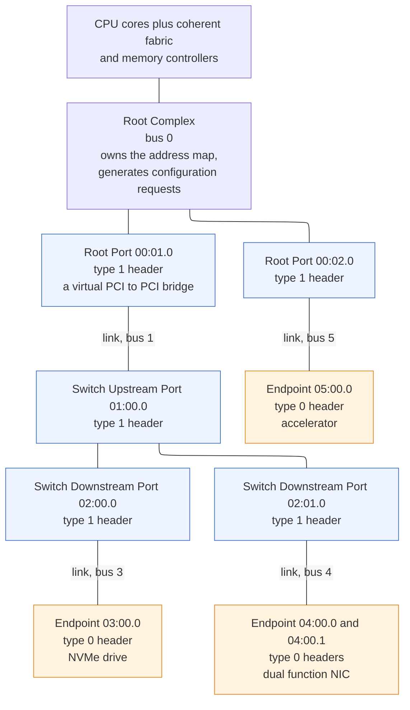
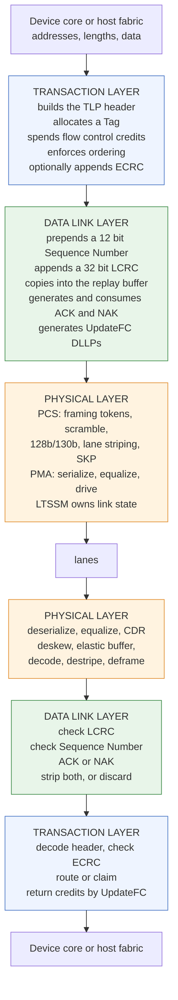
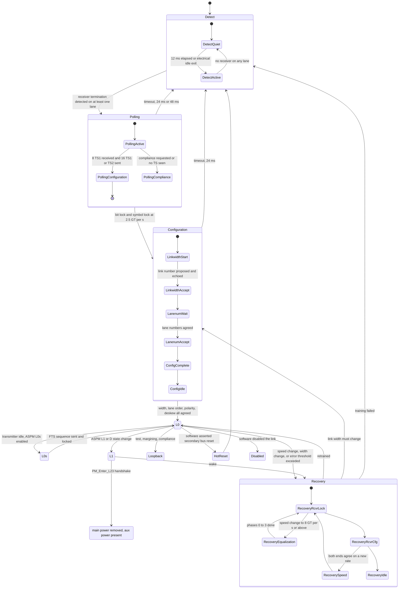
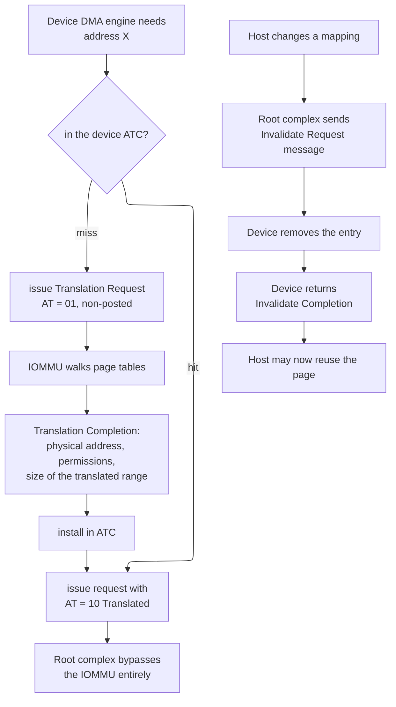
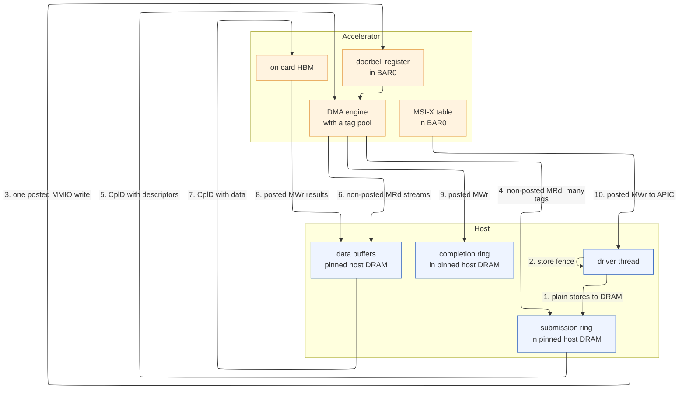

# PCI Express — the Protocol, from Link Training to a Completed Transaction

> **Prerequisites:** [High-Speed I/O and Peripheral Protocols](03_High_Speed_IO_and_Peripheral_Protocols.md) — you need its §2 (serializer/deserializer, clock and data recovery, 8b/10b and 128b/130b line coding, scrambling), its §3 (channel insertion loss, transmit feed-forward equalizer, continuous-time linear equalizer, decision feedback equalizer), and its §4 (the general layered-stack argument). This page never re-derives any of that; it starts one layer above the recovered bit stream. [On-Chip Transaction Protocols](../03_Transaction_Protocols/01_AHB_AXI_APB.md) — you need the Advanced eXtensible Interface (AXI) five-channel model, `VALID`/`READY` backpressure, transaction identifiers and outstanding transactions, and the split of address from data. §1 uses all of it as the contrast that makes PCI Express legible.
> **Hands off to:** [Chiplets, CXL, and Die-to-Die](02_Chiplets_CXL_and_Die_to_Die.md) — Compute Express Link (CXL) reuses this page's electrical layer, its configuration space, and its enumeration model verbatim, then adds two cache-coherent sub-protocols on top; that page owns everything coherent. [QoS, Ordering, and I/O Coherence](01_QoS_Ordering_and_IO_Coherence.md) — it owns what a device transaction becomes *after* the root complex accepts it: service classes on the internal fabric, snoop behavior, and interrupt routing.

---

## 0. Why this page exists

Every accelerator you will ever design sits behind PCI Express (Peripheral Component Interconnect Express, universally abbreviated PCIe). The tensor cores, the scratchpad hierarchy, the systolic array, the on-die network — all of it is reachable from software only through a link that delivers roughly one hundredth of the bandwidth of the accelerator's own memory system, at roughly ten times the latency of a local dynamic random-access memory (DRAM) access, using a packet format designed in 2003 to be backward-compatible with a bus designed in 1992. That constraint shapes the whole system: it decides how weights are staged, why descriptor rings exist, why device drivers avoid reading device registers, why peer-to-peer transfers between two accelerators are a separate engineering problem, and why a model that does not fit in on-card memory is a fundamentally different product from one that does.

The failure mode this page prevents is not exotic. It is an engineer who knows AXI well, treats PCIe as "AXI with a longer wire", and then ships an endpoint that head-of-line blocks its own completions, or writes a driver that assumes a memory-mapped write has landed when it has only been queued, or spends a quarter of the link's bandwidth because a maximum-payload-size register was left at its 128-byte reset value, or debugs a link stuck in Recovery for three weeks without knowing that the state name itself names the failure. Each of those is a direct consequence of one specific structural difference between an on-chip bus and a packet-switched, credit-flow-controlled, error-retrying, software-enumerated tree. This page derives every one of those differences from the physics and the topology that force them.

The page is also, deliberately, a bring-up manual. A PCIe link is the first thing that must work on a new accelerator board and the thing most likely not to. Its state machine is observable in a register, its error counters are architected and standardized, and the mapping from symptom to root cause is unusually tight — much tighter than for a DRAM interface, because PCIe was designed by a consortium of companies that all had to debug each other's silicon. Learning to read `lspci -vvv`, the Link Training and Status State Machine (LTSSM) state, and the Advanced Error Reporting (AER) registers is the highest-leverage post-silicon skill in system integration, and it is teachable from the specification's own structure.

After this page you should be able to: read a raw transaction layer packet header out of a protocol analyzer trace and say what it is, where it is going, and what it costs in credits; compute the real throughput of a stated link generation, width, payload size, and read-request size, and say which of the two configuration knobs to turn; size a replay buffer and a flow-control credit pool from a round-trip latency; predict which of two reorderings of a packet stream is legal and which one deadlocks; diagnose a link that trained to the wrong width or speed; explain what an interrupt has to do with memory ordering; and decide, with arithmetic rather than intuition, whether PCIe is the limiter for a given accelerator workload.

---

## 1. Why PCIe looks nothing like AXI, and exactly where your AXI intuition transfers

### 1.1 The baseline that PCIe replaced, and why it died

Conventional Peripheral Component Interconnect (PCI) was a **bus**: a set of shared, multi-drop, parallel wires with 32 or 64 address/data lines multiplexed onto the same conductors, one arbiter, and every device electrically attached to every wire. At 33 MHz and later 66 MHz this worked. Three properties killed it, and each one maps directly onto a property of PCIe that would otherwise look arbitrary.

**The electrical property.** A multi-drop bus has a stub at every connector. Each stub is an unterminated transmission-line branch that reflects; each device adds capacitance that slows the edge. The settling time of the shared net grows with the device count, so the achievable clock frequency *falls* as you add devices. PCI-X pushed this to 133 MHz at the cost of allowing only one or two loads. The escape is to stop sharing wires: give every device its own point-to-point link and put the sharing in a switch, where it becomes a buffering problem instead of an analog one. Once the link is point-to-point, all the arguments in §1.3 of the [high-speed I/O page](03_High_Speed_IO_and_Peripheral_Protocols.md) apply and the link becomes serial and differential.

**The arbitration property.** On a bus, a device must win arbitration before it can drive anything, and it holds the bus for the whole transaction. A read that takes 500 ns of target latency holds 500 ns of bus time doing nothing, unless the protocol supports *delayed* or *split* transactions — which PCI bolted on late and badly. The escape is to make every transaction split by construction: a request is a packet, the response is a separate packet, and nothing is held in between.

**The addressing property.** A bus decodes by address: every device watches every cycle and one of them claims it. That works only when every device sees every cycle. In a tree, a switch must decide *which port* to forward a packet to before the target has seen it, which means routing information must be in the packet and the tree must have a consistent, hierarchical address map. That requirement is why PCIe has bridge windows, why enumeration assigns bus numbers depth-first, and why the whole of §3 exists.

So: point-to-point, packetized, split-transaction, hierarchically routed. Everything else follows.

### 1.2 Load-store semantics carried over packets

The awkward part of PCIe is that the *programming model* it must preserve is a memory bus. Software written for PCI does this:

```c
volatile uint32_t *ctrl = ioremap(bar0_phys, 0x4000);
ctrl[DOORBELL] = tail_index;      /* a store instruction */
uint32_t st = ctrl[STATUS];       /* a load instruction  */
```

Those are a store and a load. The processor's load-store unit issues them as ordinary uncached memory operations; nothing in the instruction set knows a packet exists. The root complex must turn a store into a **memory write request packet** and a load into a **memory read request packet** plus a later **completion packet**, and it must do so in a way that makes the load appear to the core to have the semantics of a load — including its ordering relationships with other loads and stores. That is the entire design brief: *load-store semantics, implemented over a packet network, without the load-store consumer knowing.*

Two consequences fall straight out and are worth stating before anything else, because they are the two things that trip experienced AXI designers.

**Consequence one: a write has no response.** A memory write in PCIe is **posted**. It is transmitted, it consumes credit, and it is considered complete by the requester the moment it is handed to the link layer. There is no acknowledgment at the transaction layer, ever. The reason is latency: a store instruction that stalled the core for a 1 µs round trip would make memory-mapped input/output (MMIO) unusable, and the PCI bus it replaced also completed writes without a response. The cost is that **you cannot know when a write landed.** The only mechanism is to issue a read to the same target afterward and wait for its completion, because a read may not pass a write (§8). Every driver that must guarantee a doorbell has been seen before it does something else performs exactly that read, and pays a microsecond for it.

**Consequence two: a read is a pair of unrelated packets joined only by a tag.** The request carries a `Requester ID` and a `Tag`. The completion carries the same two fields back. There is no circuit, no reserved path, and no state in the switches between them. If the completion is lost, nothing detects it except a timer in the requester. This is the same idea as an AXI `ARID`, but the failure semantics are entirely different: on AXI, an `R` beat cannot be lost.

### 1.3 The contrast table, and what each row means

| Dimension | AXI | PCIe | Why they differ |
|---|---|---|---|
| Physical form | tens to hundreds of parallel wires, one clock domain, synchronous | 1 to 16 differential lane pairs per direction, embedded clock, no shared clock | pin cost and skew, derived in §1.3 of the [I/O page](03_High_Speed_IO_and_Peripheral_Protocols.md) |
| Topology | arbitrary: crossbar, mesh, hierarchy of interconnect IP | strict tree with exactly one root | routing must be decidable at each hop with only the packet header |
| Flow control | per-beat `VALID`/`READY`; backpressure takes effect next cycle | credits advertised in advance, per class | a stop signal costs a full round trip; see §7 |
| Concurrency unit | five independent channels, each independently stallable | one serialized stream carrying three multiplexed classes | there is only one wire; classes are virtual |
| Transaction identity | `AWID` / `ARID`, local to one interface | `Requester ID` (bus/device/function) plus `Tag`, globally meaningful | responses must be routable back across a tree |
| Ordering scope | per-ID: same ID strictly ordered, different IDs unordered | per-class: a table of must/must-not/may over posted, non-posted, completion | ordering must hold across *different requesters* to preserve producer-consumer |
| Write response | `B` channel, one response per burst | none; writes are posted | latency of MMIO stores |
| Error model | 2-bit `xRESP` per transaction; wire assumed perfect | link-layer retry hides bit errors; transaction-layer completion status, poisoning, and AER report the rest | the channel has a nonzero bit error ratio |
| Address map | fixed at synthesis in the decoder | discovered and assigned at boot into base address registers | devices are not known until they are plugged in |
| Maximum burst | `AWLEN` up to 256 beats, one address | `Length` up to 1024 doublewords = 4096 bytes, one header, but capped by Max Payload Size | both are amortization of one header over many bytes |
| 4 KB rule | a burst must not cross a 4 KB boundary | a request must not cross a 4 KB boundary | identical reason: 4 KB is the minimum page and decode granule |
| Typical latency | 10-40 ns for an on-die target | 500-900 ns for a host memory read from an endpoint | serialization, equalization, CDR, tree hops, and the host's own fabric |

Four rows deserve the derivation treatment, because each is a place where transferring intuition produces a bug.

**Backpressure cannot be a wire.** On AXI, `READY` deasserting is free: the sender sees it in the same cycle and stops in the next one, and the total in-flight data is one beat. Suppose PCIe tried the same thing with an in-band "stop" indication. A Gen4 x8 link moves 15.75 GB/s. The round trip from "receiver decides to stop" to "transmitter has stopped" includes the transmitter's own pipeline, serialization, flight, the receiver's deserialization and elastic buffer, the return path, and the transmitter's response — call it 600 ns on a short link. In 600 ns the transmitter has already launched $15.75 \times 10^9 \times 600 \times 10^{-9} = 9450$ bytes. The receiver would need 9.45 KB of buffer *anyway*. Since the buffer is unavoidable, the protocol may as well tell the transmitter how big it is up front and let the transmitter do the accounting. That is exactly what a credit is, and it is the same argument that makes on-chip networks credit-based once a link crosses more than a couple of cycles — see [Routing, Flow Control, and Deadlock](../04_On_Chip_Networks/02_Routing_Flow_Control_and_Deadlock.md).

**Ordering is per-class, not per-ID.** This is the single most common source of confusion. On AXI, two transactions with different IDs have *no* ordering relationship whatsoever, and the interconnect is free to complete them in any order. Take that intuition to PCIe and you will conclude that two memory writes from two different endpoints have no ordering relationship — and you will be wrong. PCIe's ordering rules are stated over *classes* and apply to whatever packets happen to occupy the same queue in the same direction on the same virtual channel, regardless of who sent them. A switch that has queued a write from endpoint A and then a write from endpoint B toward the root complex must not reorder them. The rules exist to protect a software pattern (producer-consumer, §8.1), not to protect a hardware requester's expectation about its own transactions, and software patterns span requesters.

**PCIe's tag is closer to AXI's ID than it looks, and the shared limit bites.** `ARID` bounds how much read parallelism a manager can express; `Tag` does the same for PCIe, and the arithmetic is Little's Law in both cases. A requester with $N$ tags, each covering $S$ bytes, on a link with round-trip latency $T$, achieves at most $N S / T$ bytes per second of read bandwidth no matter how fast the link is. With 32 tags, a 128-byte Max Read Request Size, and $T = 1.2\ \mu\text{s}$: $32 \times 128 / 1.2\times10^{-6} = 3.4$ GB/s — which will not fill a Gen3 x8 link, let alone a Gen5 x16. This is the most common reason a competent endpoint measures far below link rate, and §15.4 makes it a design rule.

**AXI trusts the wire; PCIe does not.** There is no AXI equivalent of a cyclic redundancy check, a sequence number, or a replay buffer, because on-die wires do not flip bits at a rate anyone budgets for. A PCIe lane at 32 GT/s with a raw bit error ratio of $10^{-12}$ delivers an error every $1/(32\times10^9 \times 10^{-12}) = 31$ seconds *per lane*; on a x16 link that is one every 2 seconds. If those reached the transaction layer, a machine would corrupt memory every few seconds. The entire data-link layer of §6 exists to convert that error rate into an invisible latency hiccup.

### 1.4 What does transfer

It would be wrong to leave the impression that nothing carries over. Four ideas transfer completely, and they are the load-bearing ones.

1. **Split transactions with outstanding work.** AXI's decoupling of `AR` from `R` is the same idea as PCIe's decoupling of a memory read request from its completion, for the same reason: hiding target latency. The queueing analysis is identical.
2. **Response traffic needs its own resources.** AXI gives `R` and `B` their own channels so a response can never be blocked behind a request. PCIe gives completions their own credit pool for exactly the same reason, and §8.3 shows what happens when a designer merges them.
3. **Bursts amortize headers.** AXI's `AWLEN` and PCIe's `Length` are the same optimization, and both are limited by a 4 KB boundary rule for the same reason.
4. **Backpressure must be composed carefully or it deadlocks.** Everything the AXI page says about ordering dependencies between channels reappears here as the ordering table.

The rest of this page is what does *not* transfer.

---

## 2. Topology: root complex, switch, endpoint, and what "link", "port", and "lane" mean

### 2.1 Three words that are constantly confused

- A **lane** is one differential pair in each direction: four wires, `TX+`/`TX-` and `RX+`/`RX-`. A lane carries one serial bit stream each way at the negotiated transfer rate.
- A **link** is the set of lanes connecting exactly two ports, plus the training state that binds them. A link has a *width* (x1, x2, x4, x8, x12, x16, x32) and a *speed*. Both are negotiated, not configured, and either can come up lower than the hardware supports (§9.7).
- A **port** is one end of a link inside one component: the logic block containing the physical layer, the data-link layer, and the transaction layer for that link, plus one configuration-space function that represents it to software.

The trap: a x16 link is **one** link with sixteen lanes, not sixteen links. All sixteen lanes carry one striped byte stream with one sequence-number space, one replay buffer, one credit pool, and one LTSSM. A single lane failing does not degrade throughput by 1/16; it forces the whole link into Recovery and, if the failure persists, down to a narrower configuration — which is why §9.7's down-training symptom is so informative.

### 2.2 The four component types



The contract of this figure is that **every blue box is a PCI-to-PCI bridge as far as software is concerned**, and every orange box is a leaf. Trace one configuration read from the CPU to function 04:00.1: the root complex emits a configuration request naming bus 4; root port 00:01.0 sees that 4 lies inside its secondary-to-subordinate range and forwards it; switch upstream port 01:00.0 does the same; switch downstream port 02:01.0 sees that 4 equals its own secondary bus number, converts the packet from a Type 1 configuration request to a Type 0 configuration request, and puts it on the link; the endpoint's function 1 claims it. That mechanism is derived in §3.5, and the reason it exists is backward compatibility: a 1995 operating system that knew how to walk a tree of PCI-to-PCI bridges walks a modern PCIe fabric unmodified.

The failure this figure illustrates: **a switch is not one device.** It is $1 + N$ bridge functions occupying two bus numbers before any endpoint is reached. A four-port switch consumes five configuration-space functions, four memory-decode windows that must nest, and two bus numbers of the 256 available. Deep trees exhaust bus numbers and, far more often, exhaust the 32-bit non-prefetchable memory window (§3.7).

**Root complex.** The bridge between the processor's coherent fabric and PCIe. It is bus 0 by definition. It is the only component that can generate configuration requests, it owns the system address map, it is the target of nearly all device writes (because device writes go to host DRAM), and it contains the root ports. In a modern server the root complex is distributed across sockets and contains integrated endpoints (on-die devices that appear on bus 0 as ordinary endpoints without a link).

**Endpoint.** A leaf with a Type 0 configuration header. It has at most eight functions per device, or up to 256 with Alternative Routing-ID Interpretation (ARI, §12.5). It can be a requester (issuing reads and writes) and a completer (responding to reads and writes of its own memory), and almost all real endpoints are both.

**Switch.** One upstream port plus $N$ downstream ports, each a virtual PCI-to-PCI bridge, connected by an internal virtual bus. Switches route downstream by address or by ID and upstream by default (anything not claimed by a downstream window goes up). A switch is where the ordering rules and the flow-control classes actually earn their keep, because a switch is the only place in the fabric where packets from different sources share a queue.

**Bridge to a non-PCIe segment.** A PCIe-to-PCI bridge, or a bridge to a proprietary internal fabric. Rare in new designs but architecturally important because the ordering rules were written with it in mind (§8.3).

### 2.3 Two routing mechanisms, and when each applies

A PCIe packet is routed by exactly one of three methods, selected by its type:

| Method | Used by | Mechanism |
|---|---|---|
| **Address routing** | memory reads and writes, I/O reads and writes | each bridge compares the address against its Memory Base/Limit, Prefetchable Base/Limit, and I/O Base/Limit windows; a hit routes downstream, a miss routes upstream |
| **ID routing** | configuration requests, all completions, some messages | each bridge compares the target bus number against its Secondary and Subordinate Bus Number registers |
| **Implicit routing** | messages such as `Assert_INTx`, `ERR_FATAL`, power-management messages | the routing subfield in the message type says "to the root complex", "broadcast from the root complex", or "terminate at the receiver" |

The pair matters because **completions are ID-routed while the requests that provoked them are address-routed.** A read request finds its way down the tree by address; the completion finds its way back up and down by the `Requester ID` embedded in the request header. That is why the requester ID must be globally unique and why a device whose bus number changes (after a bus renumbering, or a hot-plug event) must not have completions in flight. It is also why a switch does not need to remember anything about a read it forwarded: the return path is carried in the packet, not in the switch.

### 2.4 Where PCIe stops

PCIe is a **non-coherent, load-store, tree** fabric. It has no notion of a cache line, no snoop, no ownership, and no way for a device to participate in the host's coherence protocol. A device that wants a cache line must read it and hope; a host that wants to see what a device wrote must rely on the device's writes having been snooped by the root complex on the way in (which they are, by default, unless the `No Snoop` attribute is set — see §5.6 and [QoS, Ordering, and I/O Coherence](01_QoS_Ordering_and_IO_Coherence.md)).

Removing that limitation is precisely what CXL does, by running two additional protocols — `CXL.cache` and `CXL.mem` — over the same electrical link and the same enumeration model, multiplexed with a `CXL.io` protocol that *is* PCIe. Everything in this page is a prerequisite for that page and none of it is repeated there: see [Chiplets, CXL, and Die-to-Die](02_Chiplets_CXL_and_Die_to_Die.md) §7.

---

## 3. Configuration space and enumeration

### 3.1 The problem enumeration solves

An on-chip AXI decoder is synthesized knowing every target's base and size. A PCIe root complex is not: the devices are plugged in after the silicon shipped, by a user, in an order nobody predicted, and each one needs a different amount of address space. So the fabric must support a **discovery protocol** that (a) finds every function, (b) identifies it well enough to bind a driver, (c) learns how much address space each of its apertures needs, and (d) assigns non-overlapping, properly nested address windows so that every bridge can route by range comparison.

The baseline that could work — a fixed table in firmware — fails the moment a card is moved to a different slot. The derived repair is a **separate address space** that is reachable without knowing anything about the device: **configuration space**. Every function has one, at a location determined purely by its position in the tree, and it is the bootstrap that makes everything else possible.

### 3.2 Two ways to reach configuration space

**The legacy mechanism** is a pair of x86 I/O ports. Writing a 32-bit address word to port `0xCF8` and then reading or writing port `0xCFC` performs a configuration cycle:

```text
port 0xCF8, 32 bits:
 31      30..24     23..16      15..11      10..8      7..2       1..0
 +------+----------+-----------+-----------+----------+----------+------+
 |enable| reserved | bus[7:0]  | dev[4:0]  | fn[2:0]  | reg[5:0] | 0  0 |
 +------+----------+-----------+-----------+----------+----------+------+
```

Six bits of register number reach only 256 bytes. This is the whole reason "the 256-byte configuration header" is a phrase at all: it is not a design choice, it is an address-bit shortage inherited from 1992.

**The Enhanced Configuration Access Mechanism (ECAM)** is the modern one. Firmware reserves a physically contiguous region of the memory map — its base is reported to the operating system in the ACPI `MCFG` table — and maps the whole configuration space into it:

$$\text{ECAM address} = \text{base} + (\text{bus} \ll 20) + (\text{device} \ll 15) + (\text{function} \ll 12) + \text{offset}$$

Each function gets 4096 bytes, each device 8 functions, each bus 32 devices, and there are 256 buses:

$$256 \times 32 \times 8 \times 4096 = 2^8 \times 2^5 \times 2^3 \times 2^{12} = 2^{28} = 256\ \text{MB}$$

Two things follow immediately. The 4 KB per function is where **extended configuration space** lives (offsets `0x100`-`0xFFF`), which is where every capability invented after 2003 went. And a configuration access under ECAM is an ordinary memory load or store from the processor's point of view, which the root complex recognizes by address and converts into a configuration request packet — so it is subject to all the ordering rules of §8, and in particular a configuration write is *non-posted*, so it does not complete until the target has accepted it.

### 3.3 The Type 0 header, field by field

Every function's first 64 bytes are architected. The `Header Type` byte at offset `0x0E` selects the layout: bits 6:0 equal to 0 means Type 0 (an endpoint), 1 means Type 1 (a bridge). Bit 7, set on function 0 only, declares the device **multi-function**, which tells the enumerator to probe functions 1 through 7 instead of stopping.

```text
Type 0 configuration header, offsets 0x00 to 0x3F

 offset  byte 3            byte 2            byte 1            byte 0
 ------  ----------------  ----------------  ----------------  ----------------
  0x00   Device ID [15:8]  Device ID [7:0]   Vendor ID [15:8]  Vendor ID [7:0]
  0x04   Status  [15:8]    Status  [7:0]     Command [15:8]    Command [7:0]
  0x08   Class Code base   Class subclass    Class prog IF     Revision ID
  0x0C   BIST              Header Type       Latency Timer     Cache Line Size
  0x10   BAR0  -- base address register 0
  0x14   BAR1
  0x18   BAR2
  0x1C   BAR3
  0x20   BAR4
  0x24   BAR5
  0x28   Cardbus CIS Pointer  -- legacy, normally 0
  0x2C   Subsystem ID                        Subsystem Vendor ID
  0x30   Expansion ROM Base Address
  0x34   reserved                            reserved          Cap Pointer
  0x38   reserved
  0x3C   Max_Lat           Min_Gnt           Interrupt Pin     Interrupt Line
```

The fields that carry real weight:

- **Vendor ID** (assigned by PCI-SIG) and **Device ID** (assigned by the vendor). A read that returns `0xFFFF` for Vendor ID means *no function is present here* — because an unclaimed configuration request produces an Unsupported Request completion, and the root complex synthesizes all-ones for the data. "All Fs" is therefore the universal signal for "not there", and it is also what you get from a live device whose Memory Space Enable bit is clear, which is a classic bring-up confusion (§16.6).
- **Class Code**, three bytes: base class, subclass, programming interface. `0x010802` is an NVM Express controller; `0x0604` is a PCI-to-PCI bridge; `0x0302` is a 3D display controller. This is what lets a generic driver bind before any vendor-specific code runs, and it is what `lspci` prints as the human-readable device type.
- **Command** register, and specifically three bits: bit 0 **I/O Space Enable**, bit 1 **Memory Space Enable (MSE)**, bit 2 **Bus Master Enable (BME)**. Until MSE is set, the function claims *nothing* in memory space and all MMIO reads return all ones. Until BME is set, the function may not *initiate* any request, so all DMA silently does nothing. Both are cleared by reset. Forgetting either is the single most common first-day driver bug.
- **Status** register, notably bit 4 **Capabilities List** — if clear, there is no capability chain and the `Cap Pointer` at `0x34` is meaningless.
- **Cap Pointer**, an 8-bit byte offset into the range `0x40`-`0xFF` where the capability chain starts.
- **Interrupt Pin** (1 = INTA#, 2 = INTB#, ...) and **Interrupt Line** (the legacy routed IRQ number, filled in by firmware). Both are vestigial on a modern system that uses MSI-X (§11).
- **Cache Line Size** at `0x0C` is genuinely vestigial in PCIe; the analogous modern control is the Read Completion Boundary in the Link Control register (§5.8).

### 3.4 The Type 1 header: a bridge is a pair of routing windows

A Type 1 header replaces four of the six BARs with the routing state a bridge needs.

```text
Type 1 configuration header, the fields that differ from Type 0

 offset  byte 3                  byte 2              byte 1            byte 0
 ------  ----------------------  ------------------  ----------------  ----------------
  0x10   BAR0
  0x14   BAR1
  0x18   Secondary Latency Timer Subordinate Bus No. Secondary Bus No. Primary Bus No.
  0x1C   Secondary Status [15:8] Sec Status [7:0]    I/O Limit [7:0]   I/O Base [7:0]
  0x20   Memory Limit [15:8]     Memory Limit [7:0]  Memory Base[15:8] Memory Base[7:0]
  0x24   Prefetch Limit [15:8]   Pref Limit [7:0]    Pref Base [15:8]  Pref Base [7:0]
  0x28   Prefetchable Base Upper 32 Bits
  0x2C   Prefetchable Limit Upper 32 Bits
  0x30   I/O Limit Upper 16 Bits                     I/O Base Upper 16 Bits
  0x34   reserved                                    reserved          Cap Pointer
  0x38   Expansion ROM Base Address
  0x3C   Bridge Control [15:0]                       Interrupt Pin     Interrupt Line
```

**Bus numbers.** `Primary` is the bus the bridge's upstream side is on. `Secondary` is the bus immediately below it. `Subordinate` is the *highest* bus number anywhere in the subtree below it. The routing rule is exactly:

- target bus $=$ Secondary $\Rightarrow$ forward downstream, converting Type 1 to Type 0
- Secondary $<$ target bus $\le$ Subordinate $\Rightarrow$ forward downstream, still Type 1
- otherwise $\Rightarrow$ do not claim; the packet goes upstream

For this to work, the intervals $[\text{Secondary}, \text{Subordinate}]$ must be **properly nested** across the whole tree. That nesting requirement is what forces the depth-first walk of §3.6.

**Memory windows.** The `Memory Base`/`Memory Limit` pair uses only bits 15:4 of each register, which hold address bits 31:20. Bits 3:0 are hardwired zero. So:

$$\text{window base} = (\text{MemoryBase} \;\&\; \text{0xFFF0}) \ll 16, \qquad \text{window limit} = ((\text{MemoryLimit} \;\&\; \text{0xFFF0}) \ll 16) \;|\; \text{0xFFFFF}$$

The granularity is therefore **1 MB**, and the window is inclusive of the limit. The `Prefetchable` pair works identically, except that bits 3:0 encode 64-bit capability (value `0001b`) and, when they do, the `Prefetchable Base Upper 32 Bits` and `Prefetchable Limit Upper 32 Bits` registers supply address bits 63:32. The `I/O` pair has 4 KB granularity and encodes 32-bit capability in its low nibble.

A bridge with a window disabled sets Base greater than Limit — which is the idiomatic way to say "I route nothing of this kind", and the reason a freshly reset bridge has `Memory Base = 0xFFF0, Memory Limit = 0x0000`.

**Bridge Control** at `0x3E` carries the **Secondary Bus Reset** bit (bit 6), which is how software resets everything below a port. It is the hammer used by hot-plug, by error recovery, and by virtual-machine device assignment.

### 3.5 Capabilities: two chains, two formats

The 256-byte header ran out of room almost immediately, so PCI defined a **capability list**: a singly-linked list of variable-length structures in the range `0x40`-`0xFF`. Each item begins with a 1-byte Capability ID and a 1-byte pointer to the next item; a next pointer of `0x00` terminates the list.

| ID | Capability | What it is for |
|---|---|---|
| `01h` | Power Management | D-states, `PMCSR`; §14.3 |
| `05h` | MSI | message-signaled interrupts, up to 32 vectors; §11.2 |
| `10h` | **PCI Express** | the one every PCIe function must have: Device/Link/Slot Capabilities, Control, and Status registers |
| `11h` | MSI-X | table-based interrupts, up to 2048 vectors; §11.3 |

The **PCI Express Capability** (`10h`) is where the fields you will read every day live: `Device Control` (Max Payload Size, Max Read Request Size, Extended Tag Enable, error reporting enables, Function Level Reset), `Device Status` (Correctable/Non-Fatal/Fatal Error Detected, Transactions Pending), `Link Capabilities` (Max Link Speed, Max Link Width, L0s/L1 exit latencies), `Link Control` (ASPM Control, Read Completion Boundary, Retrain Link), `Link Status` (Current Link Speed, Negotiated Link Width, Link Training), and `Link Control 2` (Target Link Speed, transmit preset selection).

The extended 4 KB space uses a different, larger format starting at offset `0x100`: a 16-bit Extended Capability ID, a 4-bit version, and a 12-bit offset to the next item.

| ID | Extended capability | Section |
|---|---|---|
| `0001h` | Advanced Error Reporting | §13.5 |
| `0002h` | Virtual Channel | §7.6 |
| `0003h` | Device Serial Number | — |
| `000Eh` | Alternative Routing-ID Interpretation | §12.5 |
| `000Fh` | Address Translation Services | §12.2 |
| `0010h` | Single Root I/O Virtualization | §12.5 |
| `0013h` | Page Request Interface | §12.3 |
| `0015h` | Resizable BAR | §15.2 |
| `0018h` | Latency Tolerance Reporting | §14.6 |
| `0019h` | Secondary PCI Express | Gen3 equalization control, §9.6 |
| `001Bh` | Process Address Space ID | §12.4 |
| `001Dh` | Downstream Port Containment | §13.7 |
| `001Eh` | L1 PM Substates | §14.2 |

The two chains are independent: a function can have a long capability list and no extended capabilities, or the reverse. Walking both, printing IDs, and confirming the ones your device claims is step one of endpoint bring-up and is exactly what `lspci -vvv` does.

### 3.6 Base Address Registers: how a device advertises what it needs

A BAR is a read/write register whose **low-order bits are hardwired to zero**, and that single implementation detail is the entire sizing protocol.

```text
Memory BAR bit layout

 31 ................................. 4   3       2   1     0
 +--------------------------------------+---+-------+-------+
 |        base address bits 31:4        | P | type  |   0   |
 +--------------------------------------+---+-------+-------+
   writable above log2(size); zero below   |    |        +-- 0 = memory space
                                           |    +----------- 00 = 32-bit BAR
                                           |                 10 = 64-bit BAR
                                           +---------------- 1 = prefetchable

 I/O BAR bit layout

 31 ................................ 2   1     0
 +-------------------------------------+---+-----+
 |       base address bits 31:2        | r |  1  |
 +-------------------------------------+---+-----+
```

**The sizing algorithm**, which is the same six lines on every operating system ever written:

```c
uint32_t save = cfg_read32(bdf, bar_off);
cfg_write32(bdf, bar_off, 0xFFFFFFFF);
uint32_t probe = cfg_read32(bdf, bar_off);
cfg_write32(bdf, bar_off, save);

if (probe == 0) { /* BAR not implemented */ }
uint32_t mask = (probe & 1) ? 0xFFFFFFFC : 0xFFFFFFF0;  /* strip type bits */
uint64_t size = (uint64_t)(~(probe & mask)) + 1;
```

Why it works: the device hardwires to zero every bit below $\log_2(\text{size})$, so writing all ones leaves those bits zero and sets every bit above. Inverting turns the writable region into zeros and the hardwired region into ones — that is $\text{size} - 1$ — and adding one gives the size. The BAR must be **naturally aligned** to its size, which is not a rule imposed on software so much as a consequence: the device physically cannot decode a misaligned base because it has no register bits to hold one.

For a 64-bit BAR the same procedure runs on both halves. Software must write all ones to *both* registers before reading either back, because the hardwired-zero region can extend into the upper register for very large apertures.

**Prefetchable** is a contract, not a hint. Setting bit 3 asserts that (a) reads have no side effects, (b) the device returns all bytes of a read regardless of which byte enables were asserted, and (c) a bridge may merge writes to the aperture. Only a prefetchable BAR may be placed above 4 GB, because a bridge's non-prefetchable memory window is 32-bit only. That is why a GPU's large frame-buffer aperture is always prefetchable and its control-register BAR never is: control registers have side effects on read (a read-to-clear status register is the canonical example), so marking them prefetchable would let a bridge speculatively read them and destroy state.

The specification recommends a minimum memory BAR of 128 bytes and caps an I/O BAR at 256 bytes; new designs should use no I/O BARs at all, because I/O space is 64 KB in total for the whole machine and is not routable through many modern root complexes.

### 3.7 A worked enumeration of the §2.2 tree

Depth-first, with a single `next_bus` counter. The invariant being maintained is that every bridge's $[\text{Secondary}, \text{Subordinate}]$ interval contains exactly the buses in its subtree.

```text
next_bus = 0
scan bus 0:
  00:00.0  vendor OK, Type 0, class 0600h  -> host bridge, leaf, no recursion
  00:01.0  vendor OK, Type 1               -> bridge
      Primary = 0
      next_bus += 1  -> 1;  Secondary = 1;  Subordinate = 0xFF (provisional)
      scan bus 1:
        01:00.0  Type 1                    -> switch upstream port
            Primary = 1
            next_bus += 1 -> 2; Secondary = 2; Subordinate = 0xFF
            scan bus 2:
              02:00.0  Type 1              -> switch downstream port
                  Primary = 2
                  next_bus += 1 -> 3; Secondary = 3; Subordinate = 0xFF
                  scan bus 3:  03:00.0 Type 0, single function -> leaf
                  Subordinate = 3          (final)
              02:01.0  Type 1              -> switch downstream port
                  Primary = 2
                  next_bus += 1 -> 4; Secondary = 4; Subordinate = 0xFF
                  scan bus 4:  04:00.0 Type 0, Header Type bit 7 set
                                          -> multifunction, also probe fn 1..7
                               04:00.1 Type 0 -> present
                  Subordinate = 4          (final)
            Subordinate = 4                (final, = max over children)
      Subordinate = 4                      (final)
  00:02.0  vendor OK, Type 1               -> bridge
      Primary = 0
      next_bus += 1 -> 5; Secondary = 5; Subordinate = 0xFF
      scan bus 5:  05:00.0 Type 0 -> leaf
      Subordinate = 5                      (final)
```

Final bus-number state:

| Bridge | Primary | Secondary | Subordinate |
|---|---|---|---|
| 00:01.0 root port A | 0 | 1 | 4 |
| 01:00.0 switch upstream | 1 | 2 | 4 |
| 02:00.0 switch downstream 0 | 2 | 3 | 3 |
| 02:01.0 switch downstream 1 | 2 | 4 | 4 |
| 00:02.0 root port B | 0 | 5 | 5 |

Three details that matter in practice. First, `Subordinate` is set to `0xFF` *before* recursing, not after — because the configuration requests that discover the subtree must themselves be routable, and until the walk completes the enumerator does not know how far down the tree goes. Second, the enumerator probes functions 1-7 only if function 0's `Header Type` bit 7 is set; a device that forgets to set it will have its extra functions silently invisible, which is a real endpoint bug. Third, the whole walk is $O(\text{buses} \times 32 \times 8)$ configuration reads in the worst case, each of which is a non-posted round trip; a full blind scan of 256 buses at 1 µs per access would take 65 ms, which is why enumerators prune aggressively by checking function 0 first.

### 3.8 A worked BAR sizing and address assignment

Endpoint 03:00.0 implements three apertures. The enumerator probes them:

| Probe | Write | Read back | Decode |
|---|---|---|---|
| `0x10` (BAR0) | `0xFFFFFFFF` | `0xFFFFC000` | bit 0 = 0 memory; bits 2:1 = `00` 32-bit; bit 3 = 0 non-prefetchable |
| `0x18` (BAR2 lo) | `0xFFFFFFFF` | `0xF000000C` | bit 0 = 0 memory; bits 2:1 = `10` 64-bit; bit 3 = 1 prefetchable |
| `0x1C` (BAR3 hi) | `0xFFFFFFFF` | `0xFFFFFFFF` | upper half of BAR2 |
| `0x20` (BAR4) | `0xFFFFFFFF` | `0xFFFFF000` | 32-bit non-prefetchable |
| `0x24` (BAR5) | `0xFFFFFFFF` | `0x00000000` | unimplemented |

Sizes:

$$\text{BAR0}: \quad \sim(\text{0xFFFFC000} \;\&\; \text{0xFFFFFFF0}) + 1 = \text{0x00003FFF} + 1 = \text{0x4000} = 16\ \text{KB}$$

$$\text{BAR2}: \quad \sim(\text{0xFFFFFFFF\_F0000000}) + 1 = \text{0x0FFFFFFF} + 1 = \text{0x1000\_0000} = 256\ \text{MB}$$

$$\text{BAR4}: \quad \sim(\text{0xFFFFF000}) + 1 = \text{0xFFF} + 1 = \text{0x1000} = 4\ \text{KB}$$

Now assign. The platform gives root port A a 32-bit non-prefetchable window of `0xC0000000`-`0xDFFFFFFF` and a 64-bit prefetchable window of `0x00_0038_0000_0000`-`0x00_003F_FFFF_FFFF`. Assign largest-first within each pool, respecting natural alignment:

| Aperture | Size | Assigned base | Alignment check |
|---|---|---|---|
| 03:00.0 BAR2 (prefetchable) | 256 MB | `0x38_0000_0000` | base mod $2^{28}$ = 0, aligned |
| 03:00.0 BAR0 | 16 KB | `0xC000_0000` | base mod $2^{14}$ = 0, aligned |
| 03:00.0 BAR4 | 4 KB | `0xC000_4000` | base mod $2^{12}$ = 0, aligned |

Then program every bridge between the root port and the endpoint so its windows *enclose* the assignments, rounded out to the register granularity. For switch downstream port 02:00.0:

- Non-prefetchable span needed: `0xC000_0000` to `0xC000_4FFF`. Rounded to 1 MB: base `0xC000_0000`, limit `0xC00F_FFFF`.
- Register encoding: `Memory Base = 0xC000` (bits 15:4 hold address bits 31:20 = `0xC00`), `Memory Limit = 0xC000`. Decoding back: base $= \text{0xC000} \ll 16 = \text{0xC000\_0000}$; limit $= (\text{0xC000} \ll 16) \,|\, \text{0xFFFFF} = \text{0xC00F\_FFFF}$, which is exactly the span needed
- Prefetchable span needed: `0x38_0000_0000` to `0x38_0FFF_FFFF`. Base address bits 31:20 are `0x000`, so `Prefetchable Memory Base = 0x0001` (low nibble `1` declares 64-bit) and `Prefetchable Base Upper 32 Bits = 0x0000_0038`. Limit address bits 31:20 are `0x0FF`, so `Prefetchable Memory Limit = 0x0FF1` and `Prefetchable Limit Upper 32 Bits = 0x0000_0038`.

Then 01:00.0 must enclose the union of 02:00.0's and 02:01.0's windows, and 00:01.0 must enclose 01:00.0's. Finally, set `Memory Space Enable` in each function's Command register, and `Bus Master Enable` on any function that will initiate DMA.

**The cost this exposes.** The 1 MB granularity means each bridge level rounds every child's requirement up to a megabyte. A tree with a switch, four downstream ports, and one 16 KB BAR behind each consumes 4 MB of window at the switch's downstream ports, and the upstream port must enclose the same 4 MB — 64 times the 64 KB actually used. Multiply by a server with a dozen switches and several hundred functions and the 32-bit non-prefetchable region, which must live below 4 GB alongside everything else the firmware needs there, genuinely runs out. That is why every large BAR must be prefetchable and 64-bit, why firmware exposes an "Above 4G Decoding" option, and why the Resizable BAR capability (§15.2) exists to let a device request a smaller aperture on a platform that cannot afford a large one.

---

## 4. The three layers, and what each one adds and strips

### 4.1 The responsibility split

PCIe has exactly three architected layers. The general argument for layering — each layer converting a weak guarantee into a stronger one — is made in §4.1 of the [I/O page](03_High_Speed_IO_and_Peripheral_Protocols.md) and is not repeated. What matters here is the *exact* split, because the boundaries are where design work and debug work both happen.



The contract: **the transaction layer is end-to-end, the data link layer is hop-by-hop, and the physical layer is lane-by-lane.** A TLP created by an endpoint survives unchanged (except for two bits, §13.4) all the way to its ultimate destination, possibly through several switches. The sequence number and LCRC that wrap it are stripped and *regenerated at every hop*, because each link has its own independent sequence-number space and its own replay buffer. The 128b/130b encoding and the lane striping exist only between two adjacent physical layers.

The consequence, which is the single most useful thing to know about the layering: **a bit flip inside a switch's internal buffer is invisible to LCRC**, because the switch recomputes LCRC over the corrupted data before retransmitting it. Only the optional end-to-end ECRC catches that class of failure. §13.4 makes this a design decision with a cost.

### 4.2 What is added and stripped, in bytes

For Gen3 through Gen5 framing (128b/130b, `STP` token form):

| Direction | Layer | Adds | Bytes |
|---|---|---|---|
| ↓ | transaction | TLP header | 12 (3 DW) or 16 (4 DW) |
| ↓ | transaction | payload | 0 to Max Payload Size |
| ↓ | transaction | ECRC, optional | 0 or 4 |
| ↓ | data link | `STP` framing token, containing the 11-bit TLP length in DW, the 12-bit Sequence Number, and a 4-bit token CRC | 4 |
| ↓ | data link | LCRC | 4 |
| ↓ | physical | 2-bit sync header per 128-bit block, SKP ordered sets, lane striping | amortized, §10.3 |

So the fixed overhead of a TLP on the wire is **8 bytes of framing plus 12 or 16 bytes of header**: 20 bytes for a 32-bit-addressed request or any completion, 24 bytes for a 64-bit-addressed request. Every bandwidth calculation in §10 starts from that number.

### 4.3 A byte-level walk of one memory read

An accelerator at 03:00.0 reads 64 bytes of host memory at physical address `0x0000_0001_2345_6780`. Its device driver has already programmed a descriptor; the DMA engine now issues the read.

**Step 1 — the transaction layer builds a Memory Read request.** The address is above 4 GB, so a 4 DW header is required. Length is 64 bytes = 16 doublewords. The engine allocates tag `0x2A` from its free-tag pool and records the expected byte count.

```text
byte:   0    1    2    3    4    5    6    7    8    9    A    B    C    D    E    F
      0x20 0x00 0x00 0x10 0x04 0x00 0x2A 0xFF 0x00 0x00 0x00 0x01 0x23 0x45 0x67 0x80
       |    |    |    |    \_______/   |    |    \_______________/ \_________________/
       |    |    |    |    Requester   |   BE     Address[63:32]     Address[31:2],
       |    |    |  Length[7:0]        |  last=F                     low 2 bits zero
       |    |  TD=0 EP=0 Attr=00       Tag  first=F
       |    |  AT=00 Length[9:8]=00
       |  TC=0, no IDO, no TH
     Fmt=001 (4DW, no data), Type=00000 (MRd)  ->  0b001_00000 = 0x20
```

Credits spent: **1 NPH** (non-posted header). Zero NPD, because a read carries no data.

**Step 2 — the data link layer wraps it.** Current sequence number is 0x137. The `STP` token encodes the total TLP length in doublewords (4 header DW, so 4) and the sequence number; the LCRC is computed over the sequence number and the header. On the wire: 4 + 16 + 4 = **24 bytes**.

**Step 3 — the physical layer sends it.** The 24 bytes are scrambled, striped across the link's lanes, and packed into 128b/130b blocks. On a Gen4 x8 link running at 15.75 GB/s of post-encoding payload, serializing 24 bytes takes $24 / 15.75\times10^9 = 1.5$ ns. The *latency*, however, is dominated by fixed pipeline delays, not by serialization.

**Step 4 — the round trip.** A representative budget for an add-in card two hops from the memory controller:

| Stage | Time |
|---|---|
| endpoint transaction layer: header build, credit check, arbitration | 30 ns |
| endpoint data link + PCS: sequence, LCRC, scramble, stripe | 15 ns |
| endpoint PMA: serialize, drive | 12 ns |
| flight, 25 cm of board plus a connector | 2 ns |
| switch: deserialize, CDR settle, deskew, elastic buffer | 40 ns |
| switch: LCRC check, route lookup, output queue, re-frame, re-serialize | 60 ns |
| flight | 2 ns |
| root port receive PHY + data link | 50 ns |
| root complex: address decode, IOMMU translation, coherent fabric issue | 90 ns |
| memory controller + DRAM, row hit | 75 ns |
| return: root complex → root port TL/DL/PHY | 70 ns |
| switch, upstream direction | 100 ns |
| endpoint receive PHY, data link, transaction layer, tag lookup | 65 ns |
| **total** | **≈ 611 ns** |

Two lessons. First, **serialization is 0.25% of the latency**; the link's *speed* barely affects a small read's latency, only its bandwidth. Going from Gen3 to Gen5 on this path changes 611 ns to about 600 ns. Second, **each switch hop costs about 150 ns round trip.** A fabric with two switch levels between an accelerator and host memory has a read latency near 900 ns, and by §1.3's Little's Law that inflates the tag count needed to sustain bandwidth by 50%.

**Step 5 — the completion.** The root complex has data. Its Read Completion Boundary is 64 bytes and the request was 64 bytes, naturally aligned, so it returns exactly one `CplD`:

```text
byte:   0    1    2    3    4    5    6    7    8    9    A    B
      0x4A 0x00 0x00 0x10 0x00 0x00 0x00 0x40 0x04 0x00 0x2A 0x00
       |              |    \_______/  |    |   \_______/  |    |
       |            Length=16DW    Status  ByteCount  Requester |
       |                           =000 SC   = 64        ID    Lower
     Fmt=010 (3DW, with data), Type=01010 (Cpl)   Tag=0x2A     Address[6:0]
       = 0b010_01010 = 0x4A                                     = 0x80 & 0x7F = 0
```

On the wire: 4 (`STP`) + 12 (header) + 64 (data) + 4 (LCRC) = **84 bytes for 64 bytes of payload**, an efficiency of $64/84 = 76.2\%$. Credits spent by the completer: **1 CPLH + 4 CPLD**, since a data credit is 16 bytes and $64/16 = 4$.

**Step 6 — retirement.** The endpoint matches `Requester ID` = 0x0400 and `Tag` = 0x2A against its outstanding-request table, checks that the accumulated byte count now equals the requested 64, frees tag 0x2A, and delivers the data. It also returns 1 CPLH and 4 CPLD of credit to the switch by scheduling an `UpdateFC-Cpl` DLLP.

That 76.2% number is worth holding onto. It is the *best case* for a 64-byte read. §10.5 shows what happens when the completer splits a larger read into 64-byte chunks, and it is the same 76.2%.

---

## 5. The transaction layer packet, field by field

### 5.1 Fmt and Type: the two fields that decide everything

The first byte of every TLP header is `Fmt[2:0]` in bits 7:5 and `Type[4:0]` in bits 4:0. `Fmt` says how long the header is and whether there is data; `Type` says what the packet does.

| `Fmt` | Meaning |
|---|---|
| `000` | 3 DW header, no data |
| `001` | 4 DW header, no data |
| `010` | 3 DW header, with data |
| `011` | 4 DW header, with data |
| `100` | TLP Prefix (a header extension, used by PASID and by end-to-end prefixes) |

| Packet | `Fmt` | `Type` | Class | Notes |
|---|---|---|---|---|
| Memory Read (`MRd`) | `000`/`001` | `00000` | non-posted | 3 DW if address < 4 GB |
| Memory Read Locked (`MRdLk`) | `000`/`001` | `00001` | non-posted | legacy, deprecated for new designs |
| Memory Write (`MWr`) | `010`/`011` | `00000` | **posted** | no completion, ever |
| I/O Read / Write | `000`/`010` | `00010` | non-posted | 3 DW only; legacy |
| Config Type 0 Read / Write | `000`/`010` | `00100` | non-posted | claimed by the function on this link |
| Config Type 1 Read / Write | `000`/`010` | `00101` | non-posted | forwarded by bridges |
| Message (`Msg`) | `001` | `10rrr` | **posted** | `rrr` is the routing subfield |
| Message with data (`MsgD`) | `011` | `10rrr` | **posted** | |
| Completion (`Cpl`) | `000` | `01010` | completion | no data: for writes, or for an error |
| Completion with data (`CplD`) | `010` | `01010` | completion | |
| Fetch and Add | `010`/`011` | `01100` | non-posted | AtomicOp |
| Unconditional Swap | `010`/`011` | `01101` | non-posted | AtomicOp |
| Compare and Swap | `010`/`011` | `01110` | non-posted | AtomicOp |

The message routing subfield `rrr` is the mechanism behind implicit routing: `000` route to root complex, `001` route by address, `010` route by ID, `011` broadcast from root complex, `100` local — terminate at the receiver, `101` gather and route to root complex. This is how `Assert_INTx`, `ERR_FATAL`, and power-management messages travel without needing an address.

**Three observations that carry weight.** First, `MWr` and `MRd` share the same `Type` value and are distinguished only by the data bit in `Fmt` — which is why a corrupted `Fmt` field is far more dangerous than a corrupted address, and why `Malformed TLP` is a fatal error class. Second, the only *posted* types are memory writes and messages; everything else expects a completion. Third, AtomicOps are non-posted and carry data, which makes them the only request class that consumes both NPH and NPD credits in quantity — an endpoint that supports atomics must size its non-posted data buffer accordingly.

### 5.2 The full request header layout

```text
Memory / IO / Configuration Request header

 DW  byte 0                   byte 1                   byte 2                   byte 3
 --  -----------------------  -----------------------  -----------------------  --------------
  0  [7:5] Fmt                [7]   T9  (tag bit 9)    [7]   TD  ECRC present   [7:0] Length
     [4:0] Type               [6:4] TC  traffic class  [6]   EP  poisoned             [7:0]
                              [3]   T8  (tag bit 8)    [5]   Attr[1] RelaxOrd
                              [2]   Attr[2] ID ordered [4]   Attr[0] NoSnoop
                              [1]   LN  lightweight    [3:2] AT  address type
                              [0]   TH  proc. hint     [1:0] Length[9:8]
  1  Requester ID [15:8]      Requester ID [7:0]       Tag [7:0]                [7:4] Last DW BE
     = bus number             = device[4:0] fn[2:0]                             [3:0] First DW BE
  2  Address[63:56]           Address[55:48]           Address[47:40]           Address[39:32]
     (4 DW form only)
  3  Address[31:24]           Address[23:16]           Address[15:8]            [7:2] Addr[7:2]
                                                                                [1:0] reserved
```

In the 3 DW form, DW2 holds `Address[31:2]` directly and DW3 does not exist.

### 5.3 Requester ID, Tag, and the three tag generations

**Requester ID** is 16 bits: 8 bits of bus number, 5 bits of device number, 3 bits of function number. It is not configured by the device; the device *captures* it from the first configuration write it receives, because a configuration request carries the target's own BDF and that is the only way a function can learn its own identity. A device that has never been configured does not know its own requester ID and must not issue requests — which is another reason `Bus Master Enable` starts clear.

With ARI enabled (§12.5), the 5+3 split becomes a flat 8-bit function number, giving 256 functions on one bus at the cost of forcing all of them onto device number 0.

**Tag** is the field that makes multiple outstanding non-posted requests possible, and it has grown three times:

| Generation | Width | Outstanding | Enabled by |
|---|---|---|---|
| original | 5 bits | 32 | default |
| extended | 8 bits | 256 | `Extended Tag Field Enable` in Device Control |
| 10-bit | 10 bits | 1024 | `10-Bit Tag Requester Enable` in Device Control 2, plus completer support |
| 14-bit | 14 bits | 16384 | PCIe 6.0 FLIT mode |

The bits are scattered: `Tag[7:0]` is byte 6 of DW1, `Tag[8]` is byte 1 bit 3, `Tag[9]` is byte 1 bit 7. Those two bits were reserved in earlier revisions, which is why a 10-bit-tag requester talking to a completer that does not understand them produces catastrophic aliasing rather than a clean error: the completer returns a completion with the upper tag bits zeroed, the requester matches it against the wrong outstanding request, and data lands in the wrong buffer. Hence the strict rule that a requester must not enable 10-bit tags unless the completer advertises `10-Bit Tag Completer Supported`.

**Why the growth was forced.** Little's Law again. To sustain $B$ bytes per second of read traffic with a round-trip latency $T$ and a Max Read Request Size $S$, the requester needs $N \ge B T / S$ tags. For a Gen5 x16 accelerator pulling 55 GB/s from host memory with $T = 900$ ns and $S = 512$ bytes:

$$N \ge \frac{55 \times 10^9 \times 900 \times 10^{-9}}{512} = \frac{49500}{512} = 96.7 \to 97\ \text{tags}$$

That fits in 8 bits. Raise the latency to 2 µs (a two-switch fabric with retimers) and drop $S$ to 256 bytes and it becomes 430 tags — which does not. That is the whole argument for 10-bit tags, and it explains why they appeared exactly when Gen4 and Gen5 accelerators did.

### 5.4 Length, byte enables, and the alignment rules

**Length** is 10 bits, in **doublewords**, and `0x000` encodes 1024 DW = 4096 bytes. A `Cpl` with no data still carries a Length field, which must be 1.

**Byte enables.** `First DW BE[3:0]` names which bytes of the first doubleword participate, `Last DW BE[3:0]` the last. Between them, every doubleword is fully enabled. The rules:

- If Length = 1 DW, `Last DW BE` **must be 0000b** and `First DW BE` may be any value, including non-contiguous or zero.
- If Length > 1 DW, both `First DW BE` and `Last DW BE` must be non-zero.
- Non-contiguous byte enables are permitted only when Length is 1 DW, or when Length is 2 DW and the request is aligned such that the two doublewords are a single qword.
- A **zero-length read** — Length = 1, both BEs = `0000b` — is legal, transfers nothing, and is the architected way to flush posted writes: it forces a completion that, by the ordering rules, cannot arrive before the writes ahead of it have been accepted.

**Address alignment.** The address field holds bits 63:2 or 31:2; the low two bits are always zero, so every request is doubleword-aligned by construction. Sub-doubleword granularity comes entirely from the byte enables.

**The 4 KB boundary rule.** A memory request must not cross a 4096-byte boundary. So a 256-byte write to address `0x...F80` is illegal and must be split into 128 bytes at `0x...F80` and 128 bytes at the next boundary. The reason is decode: 4 KB is the minimum page size in every architecture PCIe targets, and it is the granule at which an IOMMU assigns permissions and at which a bridge could in principle have a discontinuity. A packet that straddled a boundary could belong half to one translation and half to another. This is exactly the same rule, for exactly the same reason, as the AXI 4 KB burst rule in §5 of the [AXI page](../03_Transaction_Protocols/01_AHB_AXI_APB.md) — the most direct piece of transferable intuition on this page.

Violating it produces a `Malformed TLP`, which defaults to **fatal**. A DMA engine's address generator must therefore contain an explicit boundary splitter, and that splitter is one of the two or three places where endpoint RTL bugs concentrate.

### 5.5 Max Payload Size and Max Read Request Size

Two registers in `Device Control` cap request sizes, and they are the two most consequential tunables in the entire protocol.

**Max Payload Size (MPS)** caps the data payload of any TLP the function *transmits*, and simultaneously declares the largest payload it can *receive*. Encodings: 0 = 128 B, 1 = 256 B, 2 = 512 B, 3 = 1024 B, 4 = 2048 B, 5 = 4096 B. `Device Capabilities` reports the maximum the function supports; `Device Control` holds the programmed value.

The hard constraint: **every function in a hierarchy that might exchange peer-to-peer traffic must be programmed to the same MPS**, because a switch does not re-fragment. A 512-byte write from a device with MPS = 512 arriving at a port whose device has MPS = 128 is a protocol violation with no recovery. Operating systems therefore default to the *safe* policy — set every function to the minimum `Max Payload Size Supported` anywhere in the tree — which means **one legacy 128-byte device drags the entire hierarchy to 128 bytes**. Linux exposes `pci=pcie_bus_perf` to override this when the administrator knows there is no peer-to-peer traffic. Checking MPS is the first thing to do on a system that is missing 10-15% of expected throughput, and §10.4 quantifies it.

**Max Read Request Size (MRRS)** caps how many bytes a single `MRd` may request. Same encodings, 128 B to 4096 B, and unlike MPS it need not be uniform across the hierarchy — it constrains only the requester. Raising MRRS reduces the number of requests, the number of tags consumed per byte in flight, and the reverse-direction header traffic. Lowering it improves fairness, because a device with MRRS = 4096 can occupy a completer's read pipeline for a long time.

Note the asymmetry that catches people: **MRRS does not cap the completion size.** A 4096-byte read may come back as 64 completions of 64 bytes each. What caps completion size is the completer's Read Completion Boundary and its internal fetch granularity (§5.8).

### 5.6 Traffic Class and the attribute bits

**`TC[2:0]`** selects one of eight traffic classes. TC is *not* a priority by itself; it is a mapping key. Each TC is mapped by configuration to a **Virtual Channel (VC)**, and it is the VC that owns a separate credit pool, a separate buffer, and a separate ordering domain. Most real systems implement one VC (VC0) and map all eight TCs to it, in which case TC does nothing except get carried around. When multiple VCs exist, the important architectural fact is that **TLPs in different TCs have no ordering relationship at all** — which makes TC the tool for isolating a latency-sensitive control stream from a bandwidth-hungry bulk stream, at the cost of a second full set of receive buffers. See [QoS, Ordering, and I/O Coherence](01_QoS_Ordering_and_IO_Coherence.md) for how the root complex maps VCs onto internal fabric service classes.

**`Attr[2:0]`**, three bits with three unrelated meanings:

- **`Attr[0]`, No Snoop (NS).** Asserts that the requester guarantees the target lines are not in any processor cache, so the root complex may skip the snoop. Saves real latency and coherent-fabric bandwidth on large streaming DMA. The cost is that it is a *promise*, and if it is wrong the host reads stale data with no error indication. Drivers set it only for buffers they have explicitly flushed.
- **`Attr[1]`, Relaxed Ordering (RO).** Releases the ordering constraint against other posted traffic (§8.5). A GPU streaming writes into host memory with RO set lets the root complex commit them to different memory banks out of order and gains measurable throughput. The cost is that the producer-consumer guarantee is gone and software must issue an explicit fence — and, critically, that the interrupt-ordering guarantee of §11.5 is gone with it.
- **`Attr[2]`, ID-Based Ordering (IDO).** A weaker, safer relaxation: a TLP may be reordered relative to TLPs from a *different* requester ID, but ordering within one requester's stream is preserved. Since producer-consumer patterns are almost always within one requester, IDO gets most of RO's benefit without most of its risk. It is the right default for a switch-heavy fabric.

**`TH`** (TLP Processing Hint) and **`LN`** (Lightweight Notification) carry cache-placement hints and a lightweight coherence mechanism respectively; both are optional and rarely implemented. **`AT[1:0]`** is the Address Type field used by ATS (§12.2): `00` untranslated, `01` translation request, `10` translated.

### 5.7 The completion header and its status codes

```text
Completion header, always 3 DW

 DW  byte 0                   byte 1                   byte 2                   byte 3
 --  -----------------------  -----------------------  -----------------------  --------------
  0  [7:5] Fmt (000 or 010)   [7]   T9                 [7]   TD                 [7:0] Length
     [4:0] Type = 01010       [6:4] TC                 [6]   EP                       [7:0]
                              [3]   T8                 [5:4] Attr[1:0]
                              [2]   Attr[2]            [3:2] AT
                              [1:0] LN, TH             [1:0] Length[9:8]
  1  Completer ID [15:8]      Completer ID [7:0]       [7:5] Completion Status  [7:0] Byte
                                                       [4]   BCM                     Count[7:0]
                                                       [3:0] Byte Count[11:8]
  2  Requester ID [15:8]      Requester ID [7:0]       Tag [7:0]                [7] reserved
                                                                                [6:0] Lower
                                                                                      Address
```

Three fields do the real work.

**Completion Status[2:0]:**

| Code | Name | Meaning | Where the fault is |
|---|---|---|---|
| `000` | Successful Completion (SC) | normal | — |
| `001` | Unsupported Request (UR) | the completer does not claim this address, this function, or this request type | requester's address, or an unenabled BAR, or a nonexistent function |
| `010` | Configuration Request Retry Status (CRS) | the target is not yet ready to answer configuration requests | target still initializing after reset |
| `100` | Completer Abort (CA) | the completer claims the address but cannot complete the request | completer-internal error, or an illegal access to a valid address |

CRS deserves a note because it is architecturally unusual: it is the only "try again later" in PCIe. A device that needs more than the 100 ms the specification allows between reset and its first configuration response returns CRS, and the root complex either retries transparently or, if `CRS Software Visibility` is enabled, synthesizes `0x0001` for a Vendor ID read so software can distinguish "still booting" from "not present". An endpoint whose firmware boots slowly and does *not* implement CRS is a device that intermittently fails to enumerate.

**Byte Count[11:0]** is the number of bytes *still to be transferred for the original request, including this completion*. A value of 0 encodes 4096. It is how the requester knows a split read is finished: the last completion is the one whose Byte Count equals its own payload length.

**Lower Address[6:0]** is bits 6:0 of the address of the first byte in this completion. Combined with Byte Count it lets the requester place each split completion at the right offset in its reassembly buffer without tracking how the completer chose to split.

### 5.8 Split completions and the Read Completion Boundary

A completer is permitted to return one request's data as several completions. The rules that make it tractable:

1. Every completion except possibly the first must start at an address aligned to the **Read Completion Boundary (RCB)**, which is 64 or 128 bytes and is reported and controlled by a bit in `Link Control`.
2. Completions for the same request (same Requester ID and Tag) **must not pass each other** (§8.2) — so the requester sees them in increasing address order.
3. Completions for *different* requests may be arbitrarily interleaved.
4. The requester knows it is done when the accumulated payload equals the original request length, which the Byte Count field confirms.

The performance consequence is large and frequently missed. A root complex whose internal read granularity is one 64-byte cache line, with RCB = 64, will return a 512-byte read as **eight** completions:

$$8 \times (4 + 12 + 64 + 4) = 8 \times 84 = 672\ \text{bytes on the wire for } 512 \text{ bytes of data} = 76.2\%$$

A root complex that coalesces into 256-byte completions returns two:

$$2 \times (4 + 12 + 256 + 4) = 552\ \text{bytes} = 92.8\%$$

A **22% throughput difference on the read path, decided entirely by the completer's splitting policy**, which the requester cannot control and which no register reports. The only way to know is to capture a trace with a protocol analyzer and count. This is why measured device-read bandwidth so often falls short of the number computed from the link rate, and why §10's arithmetic must be stated separately for reads and writes.

The reassembly burden this places on the endpoint is real: for each outstanding tag you need a byte-count accumulator, a base offset, and enough buffer to hold the whole request, because completions for a tag arrive in order but completions across tags do not. §16.3 makes this a design checklist item.

---

## 6. The data link layer: sequence numbers, LCRC, ACK/NAK, and replay

### 6.1 The failure the layer exists to hide

Take a Gen4 x16 link with a post-forward-error-correction bit error ratio of $10^{-12}$ per lane, which is the specification's compliance target. The aggregate error rate is

$$16\ \text{lanes} \times 16 \times 10^{9}\ \text{bit/s} \times 10^{-12} = 0.256\ \text{errors per second}$$

— one every four seconds. Without a repair, every one of those corrupts a memory write, a completion payload, or a header. A host that silently corrupts DRAM every four seconds is not a computer. So the data link layer's job is to convert **one error every four seconds** into **one extra microsecond of latency every four seconds**, invisible to the transaction layer.

The baseline that could work is end-to-end retry: let the requester notice something went wrong and reissue. It fails immediately, for two reasons. Posted writes have no response, so nothing would ever notice a corrupted write. And a switch that forwards a corrupted TLP has already committed it downstream; by the time an endpoint noticed, the damage would be several hops old. The repair must therefore be **hop-by-hop** and must catch the error *before* the packet is forwarded. That forces a per-link sequence-number space, a per-link CRC, and a per-link retransmission buffer — the three things the data link layer is.

### 6.2 Sequence numbers and LCRC

The transmitter maintains `NEXT_TRANSMIT_SEQ`, a 12-bit counter that wraps at 4096. Every TLP handed down from the transaction layer gets the current value, and the counter increments. The 32-bit **Link CRC (LCRC)** is computed over the sequence number and the entire TLP and appended.

The receiver maintains `NEXT_RCV_SEQ`. On each arriving TLP it checks two things in order:

1. **LCRC.** If it fails, the TLP is discarded and a NAK is scheduled. Nothing else is examined — a TLP with a bad LCRC has an untrustworthy sequence number too.
2. **Sequence number.** If it does not equal `NEXT_RCV_SEQ`, the TLP is discarded and a NAK is scheduled. This is what enforces the "no gaps" property: once a TLP is lost, every subsequent TLP is discarded until the retransmission catches up, even if it arrived perfectly.

That second rule is why PCIe retry is **go-back-N** and not selective. The reason is ordering: accepting TLP $n+2$ after discarding TLP $n+1$ would deliver packets to the transaction layer out of order, and §8's rules would be violated in a way no upper layer could detect or repair. The cost is real bandwidth — a single bit error discards everything already in flight — and §6.5 quantifies it.

12 bits of sequence number gives 4096 outstanding TLPs. The requirement is that the number of unacknowledged TLPs never reach 2048, so the receiver can always tell "this is the next one I want" from "this is a stale replay". A transmitter must stop sending when 2048 TLPs are unacknowledged, which at MPS = 128 bytes corresponds to only 256 KB in flight — enough for any real link, but a constraint that becomes visible at Gen6 x16 with a long fabric.

### 6.3 DLLPs

A **Data Link Layer Packet** is 6 bytes — 1 byte of type, 3 bytes of payload, 2 bytes of CRC-16 — wrapped in an `SDP` framing token, for 8 bytes on the wire. DLLPs never leave the link and never reach the transaction layer.

| DLLP | Carries | Purpose |
|---|---|---|
| `Ack` | 12-bit sequence number | all TLPs up to and including this number were received correctly |
| `Nak` | 12-bit sequence number | all TLPs up to and including this number were correct; retransmit from the next one |
| `UpdateFC-P` / `-NP` / `-Cpl` | header credit limit, data credit limit, VC ID | return flow-control credit; §7 |
| `InitFC1-*` / `InitFC2-*` | initial credit advertisement | flow-control initialization; §7.3 |
| `PM_Enter_L1`, `PM_Request_Ack`, ... | — | link power-state negotiation; §14 |

`Ack` and `Nak` are both **cumulative**: they name the last *good* sequence number, not the bad one. One `Ack` can retire dozens of replay-buffer entries. That is a deliberate efficiency choice — acknowledging every TLP individually would consume a large fraction of the reverse link at small MPS.

### 6.4 A NAK-and-replay episode

```wavedrom
{ "signal": [
  { "name": "clk",              "wave": "p..............." },
  { "name": "TX lane, TLP seq", "wave": "x3333x....333x..", "data": ["50","51","52","53","51","52","53"] },
  { "name": "channel bit error","wave": "0.10............", "node": "..e............." },
  { "name": "RX LCRC result",   "wave": "x.3455x....333x.", "data": ["ok 50","BAD 51","drop 52","drop 53","ok 51","ok 52","ok 53"], "node": "...b............" },
  { "name": "RX to TX DLLP",    "wave": "x...35x......3.x", "data": ["Ack 50","Nak 50","Ack 53"], "node": ".....n.........." },
  { "name": "TX replay buffer", "wave": "x3...4.5.....3.x", "data": ["50 to 53 held","50 freed by Ack","replay 51 to 53","all freed"], "node": ".......r........" }
 ],
 "edge": ["e~>b LCRC fails on seq 51", "b~>n Nak names 50, the last good sequence number", "n~>r replay restarts at 51: go-back-N"],
 "head": {"text": "One NAK and replay episode. TLPs 52 and 53 arrived intact and were still discarded."}
}
```

The contract of this figure is that **the transaction layer on both ends sees nothing**. The endpoint's DMA engine never learns that TLP 51 was corrupted; the only observable trace is the `Bad TLP` correctable-error counter incrementing in AER and roughly one round trip of added latency.

Trace it concretely on the Gen4 x8 link of §4.3. TLPs 50-53 are 256-byte writes, so each occupies $280 / 15.75\times10^9 = 17.8$ ns of link time. The receiver detects the LCRC failure about 40 ns after the packet fully arrives, schedules a `Nak`, and the `Nak` reaches the transmitter roughly 250 ns later (a half round trip plus the wait for the current TLP transmission to finish). The transmitter then resends 51, 52, and 53: $3 \times 17.8 = 53$ ns. Total cost of the episode: about **300 ns of link time and three re-sent packets**, against a mean time between errors of $1/(8 \times 16\times10^{9} \times 10^{-12}) = 7.8$ seconds on this x8 link (§6.1's four seconds is the x16 figure — half the lanes, half the error rate). The bandwidth cost is $300\times10^{-9} / 7.8 = 3.8 \times 10^{-8}$ — utterly negligible. That is the point: go-back-N is wasteful per event and irrelevant in aggregate, which is why nobody implements selective retry.

The failure this figure illustrates is what happens when the error rate is *not* at spec. At a raw BER of $10^{-8}$ — a marginal channel, a missing equalization preset, a cracked AC coupling capacitor — the same x8 link errors 1280 times per second, each costing 300 ns plus the discarded in-flight packets, and the replay traffic itself starts causing further errors. The link enters a regime where `REPLAY_NUM` rolls over, the LTSSM drops to Recovery to retrain, and the observable symptom is **a link that oscillates between L0 and Recovery while delivering a fraction of its rated bandwidth**. §9.7 and §16.6 turn that into a diagnosis.

### 6.5 The replay timer, and what happens when a NAK itself is lost

A `Nak` can be corrupted too. So the transmitter cannot rely on receiving one; it runs a **`REPLAY_TIMER`**, restarted every time a TLP is transmitted or an `Ack` is received. If it expires with unacknowledged TLPs outstanding, the transmitter replays exactly as if it had received a `Nak`. The timer must be longer than the worst-case time for an `Ack` to come back, which is: the far end's `ACKNAK_LATENCY_TIMER` (its self-imposed deadline for sending an unprompted `Ack`) plus a full round trip plus the transmission time of one maximum-size TLP in each direction.

A `REPLAY_NUM` counter tracks consecutive replays of the same TLP. After **four** consecutive failures the data link layer concludes the link is unusable and directs the LTSSM to Recovery, which retrains and, if necessary, renegotiates speed and width. Both `Replay Timer Timeout` and `REPLAY_NUM Rollover` are architected correctable errors in AER, and their rate is the single best physical-layer health metric a running system exposes.

### 6.6 Sizing the replay buffer

The replay buffer must hold every TLP transmitted but not yet acknowledged. The transmitter must not stall waiting for buffer space, so the buffer must cover a full acknowledgment round trip at full rate — the same bandwidth-delay product that sizes a credit pool or a network-on-chip virtual channel.

$$S_{\text{replay}} \;\ge\; B \times T_{\text{ack}}$$

where $T_{\text{ack}}$ is the time from starting to transmit a TLP to freeing its buffer entry:

| Component | Gen4 x8, short link | Gen5 x16, one retimer and a switch |
|---|---|---|
| TX data link and PHY | 30 ns | 30 ns |
| flight | 2 ns | 12 ns |
| RX PHY, deskew, elastic buffer, LCRC check | 55 ns | 60 ns |
| retimer, each direction | — | 60 ns |
| receiver's Ack scheduling latency, including waiting out a max-size TLP in progress | 120 ns | 90 ns |
| return path PHY + flight | 60 ns | 130 ns |
| TX credit and buffer release | 20 ns | 20 ns |
| **$T_{\text{ack}}$** | **287 ns** | **402 ns** |

Then:

$$\text{Gen4 x8}: \quad S \ge 15.75 \times 10^{9} \times 287 \times 10^{-9} = 4520\ \text{bytes}$$
$$\text{Gen5 x16}: \quad S \ge 63.0 \times 10^{9} \times 402 \times 10^{-9} = 25{,}330\ \text{bytes}$$

Round up and add margin: 8 KB and 32 KB respectively. Note that the buffer holds *whole TLPs*, so it must also be sized in **entries**: at MPS = 128 bytes, 32 KB (32,768 B) of Gen5 replay buffer is 215 entries of 152 bytes, and each entry needs a sequence-number tag and a length. At MPS = 512, the same 32 KB is 61 entries of 536 bytes. The entry count matters because the free-list and the replay state machine are indexed by it.

**What under-sizing costs.** If the buffer holds only $S' < B T_{\text{ack}}$, the transmitter stalls whenever it is full, and throughput falls to $S' / T_{\text{ack}}$ regardless of link rate. A Gen5 x16 controller configured with a 4 KB replay buffer delivers $4096 / 402\times10^{-9} = 10.2$ GB/s out of 63 GB/s. This is a real, configurable parameter in every commercial PCIe controller IP, it is often left at a default sized for a shorter link, and it is invisible to every software-level diagnostic. Checking it is part of §16.6's ladder.

---

## 7. Credit-based flow control, derived

### 7.1 Why credits and not backpressure

§1.3 established the arithmetic: a stop signal takes a full round trip to arrive, during which the transmitter launches $B \times T_{rt}$ bytes that the receiver must buffer anyway. Since the buffer is unavoidable, the protocol tells the transmitter its size in advance and makes the transmitter do the accounting. That is a **credit**.

The properties this buys, beyond avoiding overrun: the transmitter can make scheduling decisions (which class to send next) with complete knowledge of what will be accepted, so it never wastes link time on a packet that will be dropped; and the receiver never has to drop a well-formed packet, which means "receiver overflow" is definitionally a bug rather than a congestion event.

### 7.2 Six counters, and why exactly six

Per virtual channel, per direction, the receiver advertises six independent credit pools:

| Pool | Covers | Unit |
|---|---|---|
| **PH** | posted headers — memory writes, messages | 1 credit = 1 header |
| **PD** | posted data | 1 credit = 4 DW = **16 bytes** |
| **NPH** | non-posted headers — reads, config, I/O, atomics | 1 credit = 1 header |
| **NPD** | non-posted data — the operands of I/O writes, config writes, atomics | 16 bytes |
| **CPLH** | completion headers | 1 credit = 1 header |
| **CPLD** | completion data | 16 bytes |

Two orthogonal splits produce six pools. **The class split** — posted, non-posted, completion — exists to prevent deadlock, and §8.3 derives it. **The header/data split** exists because headers and data land in physically different structures: headers go into a small, associatively-searched control structure (a queue with routing and ordering state), data goes into a wide, dense SRAM. Sizing them independently is not an optimization, it is a necessity: a stream of 4-byte writes consumes header credits at 32× the rate it consumes data credits, and a stream of MPS-sized writes does the opposite. A single combined pool would have to be sized for the worse of the two, wasting most of one structure.

A concrete consequence: a receiver that advertises 128 PH and 2048 PD is sized for an average payload of $2048 \times 16 / 128 = 256$ bytes. Feed it 64-byte writes and it runs out of header credits with 75% of its data buffer empty. Feed it 512-byte writes and it runs out of data credits with half its header queue empty. **The advertised ratio is a design commitment to an expected traffic profile**, and mismatching it to the actual workload is a common and entirely invisible cause of under-performance.

### 7.3 Initialization: InitFC1 and InitFC2

Credits cannot be assumed; they must be exchanged before any TLP moves. The sequence runs immediately after the physical layer reports the link is up:

1. **FC_INIT1.** Each side transmits `InitFC1-P`, `InitFC1-NP`, and `InitFC1-Cpl` repeatedly, each carrying its own initial header and data credit advertisement for VC0. It keeps repeating until it has received all three from the far end.
2. **FC_INIT2.** Each side then transmits `InitFC2-P`, `InitFC2-NP`, `InitFC2-Cpl` repeatedly. Receiving any `InitFC2`, or any other DLLP or TLP, confirms the far end saw the `InitFC1` set.
3. The link is now `DL_Active` and TLPs may flow.

The two-phase handshake exists because the advertisement itself must be delivered reliably before the retry machinery is running. Phase 1 gets the numbers across by brute repetition; phase 2 confirms both sides completed phase 1. A link that reaches L0 but never reaches `DL_Active` — a real and confusing symptom — means the InitFC exchange is failing, and the cause is almost always one side advertising a value the other rejects as illegal, or a DLLP CRC problem that also shows in the `Bad DLLP` counter.

An advertised value of **zero means infinite**. A receiver that advertises infinite credits for a pool promises never to run out and is never sent `UpdateFC` for it. The specification **requires an endpoint to advertise infinite CPLH and CPLD**, and the reason is airtight: an endpoint receives completions only for non-posted requests it issued itself, and it may not issue a request without having already reserved space for the completion. Since the space is guaranteed by construction, advertising a finite number would add accounting for no benefit. Switches and root ports, which forward completions they did not request, must advertise finite completion credits.

### 7.4 UpdateFC: cumulative, not incremental

As the receiver drains its buffers it returns credit with `UpdateFC-P`, `-NP`, or `-Cpl` DLLPs. The crucial design detail: an `UpdateFC` carries the **cumulative total of credits released since initialization**, modulo the field width, not the number newly freed.

That choice makes credit accounting **self-healing**. A DLLP is protected by CRC-16 and is *not* retried — there is no sequence number on a DLLP and no replay buffer for it. A corrupted `UpdateFC` is simply discarded. If updates were incremental, a single lost DLLP would permanently leak credits, and the link would slowly strangle itself over hours. Because they are cumulative, the *next* `UpdateFC` restores the correct value and the loss is invisible. This is one of the cleanest pieces of engineering in the specification and worth internalizing as a general principle: **state that cannot be retransmitted should be absolute, not differential.**

The transmitter's check before sending a TLP is a modulo comparison:

$$(\text{CREDITS\_CONSUMED} + \text{cost}) - \text{CREDIT\_LIMIT} \le 0 \pmod{2^{k}}$$

with $k = 8$ for header fields and $k = 12$ for data fields. This is why the *maximum finite* advertisement is 255 header credits and 2047 data credits (half the field, so the modulo comparison is unambiguous) — a hard ceiling that §7.5 shows is a real constraint at high speed.

### 7.5 Sizing the credit pool from the round trip

The credit round trip $T_{fc}$ is longer than the replay round trip, because a credit is not returned when the packet is *received*, it is returned when the packet is *drained from the buffer* and an `UpdateFC` has been scheduled and delivered. Components:

| Component | Value for a Gen4 x8 add-in card |
|---|---|
| transmitter pipeline to wire | 30 ns |
| flight and receive PHY | 60 ns |
| receiver: LCRC, decode, deliver to the application, free the buffer | 120 ns |
| `UpdateFC` scheduling, including waiting out an in-progress max-size TLP on the return link | 100 ns |
| return flight and receive PHY | 60 ns |
| transmitter credit-counter update | 20 ns |
| **$T_{fc}$** | **390 ns** |

Add a switch hop and a retimer and this becomes 700-900 ns; a two-level fabric with a slow endpoint drain can exceed 1.5 µs.

**Data credits.** To keep a Gen4 x8 link at 15.75 GB/s fully busy with posted writes:

$$\text{bytes in flight} = 15.75\times10^{9} \times 390\times10^{-9} = 6143\ \text{bytes}$$
$$N_{PD} \ge \frac{6143}{16} = 384\ \text{credits}$$

**Header credits.** Each TLP consumes 1 PH regardless of size, so the header requirement is set by the *number* of packets in flight, which depends on MPS:

$$N_{PH} \ge \frac{\text{bytes in flight}}{\text{MPS}}$$

| MPS | TLPs in flight | $N_{PH}$ required | Fits in 255? |
|---|---|---|---|
| 512 B | 12.0 | 12 | yes |
| 256 B | 24.0 | 24 | yes |
| 128 B | 48.0 | 48 | yes |

Now run the same calculation for a Gen5 x16 link at 63 GB/s with a 1.2 µs credit round trip through a switch:

$$\text{bytes in flight} = 63\times10^{9} \times 1.2\times10^{-6} = 75{,}600\ \text{bytes}$$
$$N_{PD} \ge 75{,}600 / 16 = 4725\ \text{credits}$$

which **exceeds the 2047 maximum finite data-credit advertisement.** The link physically cannot be kept full by a single posted stream at that latency. The available repairs are all architectural: shorten the round trip (fewer switch hops, faster drain, a retimer removed), use multiple virtual channels so each carries a fraction of the traffic with its own 2047-credit pool, or accept that the achievable throughput is capped at

$$B_{\max} = \frac{2047 \times 16}{1.2\times10^{-6}} = 27.3\ \text{GB/s}$$

— 43% of link rate. This is not hypothetical; it is exactly why deep PCIe fabrics under-deliver and why accelerator platforms fight to keep endpoints one hop from the root complex.

And the header side at that operating point:

$$\text{MPS} = 128: \quad N_{PH} \ge 75{,}600 / 128 = 591 > 255$$

so at Gen5 x16 with a long round trip, **MPS = 128 makes it impossible to fill the link even with data credits available**, purely on header-credit exhaustion. MPS is not only a framing-efficiency knob; it is a credit-pressure knob, and the two effects compound.

**The buffer cost.** 4725 data credits is 75.6 KB of receive SRAM for posted traffic alone. Add completions (a root port needs the same depth) and the non-posted pools, times the number of virtual channels, times two for both directions in a switch, and the receive buffers become the largest block in a PCIe controller — routinely 200-500 KB of SRAM. Controller IP vendors expose these as synthesis parameters precisely because most integrators cannot afford the maximum, and the resulting throughput ceiling is the price.

### 7.6 Virtual channels

A **virtual channel** is a complete, independent replica of the six credit pools and their buffers, sharing one physical link. Traffic classes are mapped to VCs by configuration through the Virtual Channel extended capability. Two properties follow:

1. **A blocked VC cannot block another VC.** This is the standard virtual-channel argument from [Routing, Flow Control, and Deadlock](../04_On_Chip_Networks/02_Routing_Flow_Control_and_Deadlock.md), applied off-chip.
2. **There is no ordering relationship between TLPs in different VCs**, so a latency-critical control message genuinely bypasses a bulk stream rather than waiting behind it.

The cost is the full duplicate buffer set, which is why VC1-VC7 are optional and why the overwhelming majority of shipping silicon implements VC0 only. When you see a device advertising more than one VC it is almost always a switch intended for a system with hard real-time or isochronous requirements.

---

## 8. Ordering rules

### 8.1 The software pattern the rules must protect

Every ordering rule in PCIe exists to preserve one program:

```c
/* Producer: a device, or a CPU writing to a device */
memcpy(buffer, payload, n);     /* many writes */
smp_wmb();                       /* on the producer's own side */
flag = READY;                    /* one write */

/* Consumer: whoever is on the other side */
while (flag != READY) { }        /* poll */
consume(buffer);                 /* read */
```

The consumer's correctness depends on exactly one guarantee: **when the flag write becomes visible, the buffer writes must already be visible.** Nothing else about the ordering matters. If the fabric may deliver the flag write ahead of the buffer writes, the consumer reads garbage, and it does so silently, intermittently, and in a way that reproduces once every few hours under load. This is the bug that ordering rules exist to make impossible, and it is worth noticing that it is a *software* requirement imposed on a *hardware* fabric that has no idea which write is the flag.

Because the fabric cannot tell the flag from the data, it must preserve order between **all** posted writes on a path, not just the ones software cares about. Hence the first rule: *a posted request must not pass another posted request.*

Now note what makes this different from AXI, and it is the point §1.3 flagged. The producer and consumer need not be the same requester. A device writes the buffer and the CPU writes the flag; or two different queues on the same device write into a shared region. The ordering must hold **wherever the two packets meet**, which is in some switch's output queue, and that queue does not know or care who sent them. This is why PCIe ordering is stated over classes rather than over requester IDs, and it is why relaxing it (§8.5) is genuinely dangerous rather than merely aggressive.

### 8.2 The table

Rows are the TLP that *arrived later* and wants to move ahead. Columns are the TLP already queued ahead of it. All entries apply only within one traffic class on one virtual channel, in one direction, at one queue.

| ↓ later TLP wants to pass → earlier TLP | Posted Request | Non-Posted Read Request | Non-Posted Write Request | Completion |
|---|---|---|---|---|
| **Posted Request** | **must not pass** (a) — *may pass* if RO=1, or if IDO applies and the requester IDs differ (b) | **must be allowed to pass** | **must be allowed to pass** | may pass — implementation choice |
| **Non-Posted Read Request** | **must not pass** | may pass | may pass | may pass |
| **Non-Posted Write Request** | **must not pass** | may pass | may pass | may pass |
| **Completion** | **must not pass** (a) — *may pass* if RO=1, or if IDO applies and the requester IDs differ (b) | **must be allowed to pass** | **must be allowed to pass** | may pass if the Transaction IDs differ; **must not pass** if the Transaction IDs are the same |

Three categories of entry, and they mean genuinely different things:

- **"must not pass"** is a correctness constraint imposed *for software*. Violating it corrupts data silently.
- **"must be allowed to pass"** is a correctness constraint imposed *for the hardware itself*. Violating it deadlocks the fabric. A design that is merely "conservative" and keeps everything in order violates these entries and is broken. This is the trap in Worked Problem 4.
- **"may pass"** is a genuine implementation choice, and it is where performance lives.

Reading off the ones that matter:

1. **Posted ↛ Posted.** Producer-consumer, §8.1.
2. **Non-posted ↛ Posted.** A read must not pass a write. This is what makes the read-flush idiom work: a driver that writes a device register and then reads *anything* on the same path knows that when the completion returns, the write has been accepted by the completer. Without this rule there would be no way in the entire protocol to determine that a posted write had landed.
3. **Completion ↛ Posted.** A completion carrying read data must not overtake a posted write. Consider a device that reads a status word and, ahead of it in the queue, has a write that updates that same status. Allowing the completion past would return a value from before an update that was already ordered ahead of it.
4. **Posted → Non-posted, must be allowed.** Deadlock avoidance, §8.3.
5. **Completion → Non-posted, must be allowed.** Deadlock avoidance, §8.3.
6. **Completion ↛ Completion with the same Transaction ID.** Split completions for one read must arrive in increasing address order, which is what lets a requester reassemble using `Lower Address` and a running byte count without a full scatter-gather reorder buffer (§5.8).

### 8.3 The deadlock the "must be allowed to pass" entries prevent

Build the failure explicitly. Take a switch with a **single shared output queue** per egress port, holding all classes in strict arrival order — the design a careful engineer reaches for, because strict FIFO satisfies every "must not pass" entry in the table.

Egress port toward endpoint E. The queue contains, in arrival order:

```text
head  ->  [ NPRd  R1 -> E ]  [ CplD C1 -> E ]  [ CplD C2 -> E ]  [ CplD C3 -> E ]  <- tail
```

Endpoint E previously issued four reads of its own and is waiting for C1-C3. Its non-posted receive buffer is full, so it has advertised **NPH = 0**: it cannot accept another read request until it retires the work already queued. Retiring that work requires the data in C1, C2, C3.

- R1 sits at the head and cannot be transmitted: NPH credit is zero.
- C1-C3 sit behind R1 and cannot be transmitted: strict FIFO.
- E cannot free NPH credit: it needs C1-C3.

Circular wait. The link is permanently dead, with credits available for completions and a completion sitting in the queue, unable to move. Recovery requires a link reset, and the symptom in the lab is a device that hangs under load after a random interval — the worst class of bug.

The rule "Completion must be allowed to pass Non-Posted Request" breaks the cycle exactly. So does "Posted must be allowed to pass Non-Posted", which handles the symmetric case where a completer's forward progress depends on draining a posted write that is stuck behind a credit-starved read.

**The minimum fix** is not a bigger queue — a bigger queue delays the deadlock, it does not remove it, because the cycle is on credits, not on space. The fix is **three separate queues with independent credit accounting and an arbiter free to select any class whose credits are available.** That is precisely the virtual-channel argument from on-chip networks, arrived at from a completely different direction, and it is why the class split of §7.2 is architectural rather than an optimization.

The historical motivating case is worth knowing because it is where the rule came from. A PCIe-to-PCI bridge holds a read request targeted at a conventional PCI device. That device is currently bus master, performing a posted write upstream, and will retry the read until it finishes. The write is queued behind the read inside the bridge. Strict order deadlocks; "posted may pass non-posted" resolves it.

### 8.4 Where the rules do and do not apply

The rules govern packets **in the same direction, on the same path, in the same traffic class, on the same virtual channel**. Everything outside that scope is unordered, and this is the source of a large family of driver bugs:

- **Different traffic classes are completely unordered.** Splitting a producer-consumer pair across TC0 and TC1 removes all guarantees.
- **Different directions are unordered.** A device's write upstream has no relationship to the host's write downstream.
- **Different destinations are not ordered end-to-end.** This is the important one. A CPU writes a descriptor into host DRAM, then writes a doorbell to a device BAR. Those two writes travel *different paths* — one into the memory controller, one out through a root port — and PCIe orders nothing between them. The guarantee must come from the CPU's own memory model: a store fence, or on x86 the fact that uncached stores are not reordered with respect to earlier stores. Get this wrong and the device fetches a descriptor that has not been written yet. See [Memory Consistency and Atomics](../../01_CPU_Architecture/06_Coherence_and_Consistency/02_Memory_Consistency_and_Atomics.md) for the processor half of the contract.
- **Acceptance is not visibility.** A posted write that has been accepted by the root complex has been accepted into the coherent fabric; when it becomes visible to a core is the coherent fabric's problem, covered by [QoS, Ordering, and I/O Coherence](01_QoS_Ordering_and_IO_Coherence.md).

### 8.5 Relaxed Ordering and ID-Based Ordering

Both attribute bits convert "must not pass" entries into "may pass".

**Relaxed Ordering (RO)** removes the posted-vs-posted and completion-vs-posted constraints for the TLP carrying it. The benefit is concrete: a root complex receiving RO writes may commit them to memory in whatever order its bank scheduling prefers, and an accelerator streaming into host DRAM typically gains 5-15% on the write path because the memory controller can reorder for row-buffer hits instead of being serialized. The cost is that the producer-consumer guarantee is gone. A device using RO for bulk data must (a) not set RO on the completion flag or the interrupt, and (b) ensure the non-RO write is issued after the RO writes have been *accepted*, which in practice means the device's own DMA engine must track them.

**ID-Based Ordering (IDO)** is the safer relaxation: a TLP may be reordered relative to TLPs from a *different* requester ID, but not relative to TLPs from the same one. Since producer-consumer pairs are nearly always emitted by a single requester, IDO preserves the pattern that matters while removing the false serialization between unrelated devices sharing a switch queue. It is the better default and is under-used, largely because RO came first and drivers copied each other.

### 8.6 The read-flush idiom, stated precisely

Because it follows directly from row 2 of the table and because every driver uses it:

```c
writel(value, dev->bar0 + REG_CONFIG);   /* posted; no completion; may still be in flight */
(void)readl(dev->bar0 + REG_CONFIG);     /* non-posted; cannot pass the write */
/* When this read's completion returns, the write has been accepted by the device. */
```

Three properties. It works because *non-posted must not pass posted* on the path between the root complex and the device. It costs a full round trip, 600-1500 ns, which is why it must never appear in a per-packet fast path. And it guarantees only that the completer **accepted** the write, not that the device has acted on it — a device that queues register writes internally can still be slow, and only a device-defined status bit proves the effect.

---

## 9. Link training and the LTSSM

### 9.1 The problem

Two chips that have never communicated must agree, using only the wires being negotiated, on: how many lanes are connected, in what order, with what polarity, at what speed, and with what equalizer settings — starting from a state where neither can reliably receive anything. That bootstrap is the **Link Training and Status State Machine (LTSSM)**, and it is the most operationally important state machine in the protocol because its current state is readable in a register and names the failure.

### 9.2 The state diagram



The contract: **the state name is the diagnosis.** Every state's entry condition is a specific physical or protocol fact, so a link parked in a state has failed the specific check that state performs. §9.7 is the lookup table.

Trace a normal cold boot. Power comes up, `PERST#` deasserts, both ports enter `Detect.Quiet` and wait 12 ms. `Detect.Active` drives a common-mode step on every lane and measures how fast the pin charges — an unterminated lane has only pad and package capacitance and rises quickly; a lane loaded by the far end's 50 Ω termination rises slowly. The $RC$ difference *is* the detection; no signaling is involved, which is why Detect works before either side can receive anything. Lanes that show a receiver proceed to `Polling`, where both ends run at **2.5 GT/s regardless of their capability** — every generation must be able to bootstrap with a Gen1 partner — and exchange TS1 ordered sets until each receiver achieves bit lock and symbol lock. `Configuration` then agrees on width, lane numbering, and deskew, and the link enters `L0` at Gen1. Only *after* reaching L0 does either side attempt a speed change, which is done by dropping into `Recovery`.

The failure this diagram illustrates: **there is no path from Detect directly to a high speed.** Every link in every system starts at 2.5 GT/s x1-capable signaling and negotiates upward. So "the link came up at Gen1" never means "the speed change was not attempted"; it means "the speed change was attempted and did not stick", which is a completely different investigation.

### 9.3 Ordered sets: TS1 and TS2

Training uses **ordered sets**, 16-symbol patterns that carry the negotiation payload:

| Symbol | Field | Purpose |
|---|---|---|
| 0 | `COM` (Gen1/2) or ordered-set block header (Gen3+) | alignment marker |
| 1 | Link Number, or `PAD` | which link this port belongs to; `PAD` means "not yet assigned" |
| 2 | Lane Number, or `PAD` | this lane's position within the link |
| 3 | N_FTS | how many Fast Training Sequences this receiver needs to relock after L0s |
| 4 | Data Rate Identifier | which speeds this port supports, plus the speed-change and autonomous-change bits |
| 5 | Training Control | Hot Reset, Disable Link, Loopback, Disable Scrambling, Compliance Receive |
| 6-15 | TS identifier, plus at Gen3+ the equalization payload in symbols 6-8 | `TS1` or `TS2` |

Two mechanisms fall out of the Lane Number field alone.

**Lane reversal.** A board designer routing a x16 connector to a package may find that lane 0 of the connector lands nearest lane 15 of the die. Rerouting costs layers and length matching. Instead, the port detects that it is receiving lane numbers in *decreasing* order and internally reverses its lane mapping. Only whole-link reversal is supported — lane $i$ maps to lane $N-1-i$ — not arbitrary permutation, because arbitrary permutation would require a full crossbar in the deskew path.

**Polarity inversion.** Swapping `P` and `N` on a differential pair is legal and common, because it can remove a via or a crossover. The receiver detects it during Polling by observing that the known TS1 pattern arrives inverted, and compensates by inverting the lane. Each lane is handled independently, so a board may invert some pairs and not others.

Both of these are worth stating explicitly because they are *why* PCIe board layout is far more forgiving than DDR layout: the protocol absorbs two entire classes of routing constraint that a source-synchronous parallel bus cannot.

### 9.4 Lane-to-lane deskew

A x16 link's sixteen lanes arrive at different times: different package trace lengths, different board lengths, different connector pin lengths, different per-lane CDR settling. The striped byte stream is meaningless until they are realigned.

The mechanism is a per-lane elastic buffer plus a common alignment marker. During training, all lanes carry ordered sets simultaneously; the receiver finds the marker on each lane and delays the early lanes by whole symbol times until all markers align. Because the unit of correction is a *symbol*, not a picosecond, the tolerance is enormous: roughly 20 ns at 2.5 GT/s and still several nanoseconds at 16 and 32 GT/s, against the 60-120 ps a parallel source-synchronous bus must hold. §1.4 of the [I/O page](03_High_Speed_IO_and_Peripheral_Protocols.md) derives why this is the fundamental advantage of embedded-clock serial links; this is where it is spent.

During normal operation, `SKP` ordered sets maintain the alignment and simultaneously perform the elastic-buffer rate compensation for the ±300 ppm clock offset described in §2.2 of that page.

### 9.5 Width and speed negotiation

**Width** is agreed in `Configuration`. The downstream port proposes a link number on the lanes it wants to use; the upstream port echoes it on the lanes it can support; the intersection becomes the link. Legal widths are x1, x2, x4, x8, x12, x16, x32, and the negotiated width is the largest legal width that both ends and the physical connection support. A x16 card in a x4 slot trains to x4 — the card's remaining twelve lanes see no receiver in Detect.

**Speed** is agreed after reaching L0. Each side advertises its supported rates in TS1 symbol 4. If both support a higher rate, either may set the speed-change bit, and the link enters `Recovery`. In `Recovery.Speed` both transmitters go to electrical idle, change rate, and resume; `Recovery.RcvrLock` then re-establishes bit lock at the new rate. If lock fails, the link falls back to the previous rate — which is exactly the mechanism that produces a link running at Gen1 on hardware capable of Gen5.

`Link Control 2`'s **Target Link Speed** field caps the negotiation and is the standard debug tool: setting it to 2.5 GT/s and retraining tells you whether a problem is speed-dependent, which separates channel problems from protocol problems in one experiment.

### 9.6 Equalization, phases 0 through 3

At 8 GT/s and above, fixed equalizer settings do not close the eye across the range of channels the standard must support. But §3.2 of the [I/O page](03_High_Speed_IO_and_Peripheral_Protocols.md) established the core difficulty: **a transmitter cannot see the eye it is producing.** The repair is a back channel, and PCIe builds it out of the link being tuned.

- **Phase 0.** Still at the current (lower) rate, the downstream port sends the upstream port the transmitter **preset** it should use at the new rate. There are eleven presets, P0-P10, each a defined combination of pre-shoot and de-emphasis; P4 is flat, no equalization. Both ends then change speed.
- **Phase 1.** Both operate at the new rate with those initial settings. Each confirms it can receive with a bit error ratio better than $10^{-4}$. This is a minimal-functionality gate: if Phase 1 fails, the channel cannot support the rate at all and no amount of tuning will help.
- **Phase 2.** The **upstream** port evaluates its received signal and sends coefficient or preset requests to the downstream port's transmitter, embedded in TS1 ordered sets. The downstream port applies each request and the upstream port measures again. This is a closed-loop search running over the live link.
- **Phase 3.** The same, with roles reversed: the downstream port tunes the upstream port's transmitter.

Then the link returns to `Recovery.RcvrLock` and on to `L0` at the new rate.

The settings and the outcome are visible. The **Secondary PCI Express** extended capability holds the Gen3 Lane Equalization Control registers (a preset and a receiver hint per lane, per direction); Gen4 and Gen5 have their own physical-layer extended capabilities with the same structure. `Link Status 2` reports **Equalization Phase 1/2/3 Successful** and **Equalization Complete**, plus **Link Equalization Request**. Reading those four bits after a failed speed change tells you *which phase* failed, which localizes the problem to a specific direction and a specific mechanism.

The transmitter's coefficient space is bounded by two advertised parameters: **FS** (Full Swing), the maximum sum of coefficient magnitudes, and **LF** (Low Frequency), the minimum permitted main-cursor coefficient. Together they stop the far end from requesting a setting that would collapse the transmitter's own amplitude — the amplitude-versus-equalization trade quantified in §3.2 of the I/O page.

### 9.7 Reading the LTSSM in the lab

This is the section to memorize.

| Observation | What it means | What to check |
|---|---|---|
| Stuck in **Detect** | no receiver termination seen on any lane | far end unpowered; `PERST#` still asserted; reference clock absent at the far end; a connector not seated; on a chiplet or embedded link, the far end held in reset |
| Cycling **Detect ↔ Polling** | receiver detected, but no bit or symbol lock | reference clock frequency or spread-spectrum mismatch; AC coupling capacitors missing, wrong value, or on the wrong side; a lane pair swapped in a way polarity inversion cannot fix; far end's PHY not released from reset |
| Reaches **L0 at Gen1 x1** on a x16 Gen5 design | training succeeded only in its most conservative configuration | see the two rows below; treat width and speed as separate investigations |
| Trained **narrower** than expected | Detect saw fewer receivers, or Configuration rejected lanes | root-port bifurcation setting in firmware; slot wiring; the missing lanes' AC caps or terminations; read per-lane status if the controller exposes it |
| Trained **slower** than expected | speed change attempted and failed, or was never allowed | `Target Link Speed` in Link Control 2; `Max Link Speed` in Link Capabilities on **both** ends; `Link Status 2` equalization phase bits; retimer present and rate-capable |
| Oscillating **L0 ↔ Recovery** | error thresholds exceeded, or `REPLAY_NUM` rollover, repeatedly | this is a **physical** problem: check `Bad TLP` / `Bad DLLP` / `Replay Timer Timeout` counters in AER, then channel loss, equalization presets, and per-lane margining |
| Stuck in **Recovery** | speed or equalization negotiation cannot converge | `Link Status 2` phase bits; try pinning Target Link Speed one generation lower; suspect a retimer or a marginal lane |
| Stuck in **Polling.Compliance** | the port entered compliance-pattern mode | a compliance-mode strap or test hook left asserted; the far end never sent valid TS1 |
| Reaches L0 but **never `DL_Active`** | the InitFC credit exchange is failing | `Bad DLLP` counter; an illegal credit advertisement from one side; a controller configured with zero buffers for a class |
| L0, `DL_Active`, but **config reads return all `0xFFFF`** | link is fine, decode is not | `Memory Space Enable` in the Command register; device still returning CRS; BAR not assigned |

The discipline: **establish the LTSSM state and the AER counters before forming any hypothesis.** Almost every long PCIe debug is a case where someone started changing things before reading those two.

---

## 10. Generations, encodings, and the bandwidth arithmetic

### 10.1 The generation table

§2.3 and §5.1 of the [I/O page](03_High_Speed_IO_and_Peripheral_Protocols.md) derive why 8b/10b was abandoned for 128b/130b and why PAM4 forces forward error correction; that argument is not repeated. What matters here is the resulting arithmetic.

| Gen | Rate/lane | Encoding | Encoding efficiency | Payload/lane/direction |
|---|---|---|---|---|
| 1.0 | 2.5 GT/s | 8b/10b | 80.00% | 250 MB/s |
| 2.0 | 5.0 GT/s | 8b/10b | 80.00% | 500 MB/s |
| 3.0 | 8.0 GT/s | 128b/130b | 98.46% | 984.6 MB/s |
| 4.0 | 16.0 GT/s | 128b/130b | 98.46% | 1969 MB/s |
| 5.0 | 32.0 GT/s | 128b/130b | 98.46% | 3938 MB/s |
| 6.0 | 64.0 GT/s PAM4 | 1b/1b, 256 B FLIT with FEC | 92.19% | 7375 MB/s |
| 7.0 | 128.0 GT/s PAM4 | as 6.0 | 92.19% | 14 750 MB/s |

Gen1→2 doubled the rate. Gen2→3 raised the rate only $1.6\times$ but changed the code, so the payload rate rose $1.97\times$ — the encoding change was worth as much as a generation. Gen5→6 doubled the rate *without* doubling the Nyquist frequency by moving to PAM4, which is why Gen6 works on approximately the same channels as Gen5; the price was mandatory FEC and a fixed 256-byte FLIT.

### 10.2 Gen6 FLIT mode, in one paragraph

A **FLIT** (flow control unit) is exactly 256 bytes: **236 bytes of TLP payload, 6 bytes of data-link payload, 8 bytes of CRC, 6 bytes of FEC.** There is no line code; the FLIT structure itself provides framing. Three consequences. First, the per-TLP `STP` token and LCRC disappear — TLPs are packed into the 236-byte region and the CRC covers the whole FLIT — so a bare 12-byte completion header costs 12 bytes instead of 20, which is a large win for small-transaction workloads. Second, the acknowledgment and credit information that used to travel in separate DLLPs moves into the 6-byte DLP, so DLLP overhead becomes a fixed tax rather than a traffic-dependent one. Third, at narrow widths FLIT accumulation is a real latency: a 256-byte FLIT at x16 Gen6 serializes in 2 ns, but at x1 it takes 32 ns, and the receiver cannot check the CRC until the FLIT is complete.

### 10.3 What is actually subtracted, in order

For Gen3-Gen5, moving from the raw transfer rate to delivered payload:

$$B_{\text{payload}} = R \times W \times \underbrace{\frac{128}{130}}_{\text{line code}} \times \underbrace{\frac{370}{371}}_{\text{SKP}} \times \underbrace{\frac{\text{MPS}}{\text{MPS} + 20\ \text{or}\ 24}}_{\text{TLP framing}} \times \frac{1}{8}$$

The **SKP term** is the rate-compensation ordered set, one 16-symbol block every 370 blocks — 0.27%. Under **SRIS** (Separate Reference Clock with Independent Spread), where the two ends have genuinely independent clocks with independent spread-spectrum modulation, SKP must be sent every **37** blocks instead, and the overhead becomes **2.7%**. That is a full percent-scale difference determined by a board-level clocking decision, and it is invisible to software.

**Acknowledgments and credit updates cost nothing on the forward link.** They are DLLPs travelling in the *reverse* direction. For a unidirectional write stream they are free; for a bidirectional workload they consume 8 bytes each on a link already carrying data, which is where the amortization of cumulative `Ack` (§6.3) earns its keep.

### 10.4 Worked: Gen4 x16 writes, three payload sizes

Raw: $16\ \text{GT/s} \times 16 / 8 = 32$ GB/s of symbols per direction.

$$32 \times \frac{128}{130} = 31.51\ \text{GB/s} \quad\text{after line coding}$$
$$31.51 \times \frac{370}{371} = 31.43\ \text{GB/s} \quad\text{after SKP}$$

Now apply TLP framing for 64-bit-addressed memory writes (24 bytes of header plus framing):

| MPS | Wire bytes per TLP | Framing efficiency | Delivered payload | vs MPS 128 |
|---|---|---|---|---|
| 128 B | 152 | 84.21% | **26.47 GB/s** | — |
| 256 B | 280 | 91.43% | **28.73 GB/s** | +8.5% |
| 512 B | 536 | 95.52% | **30.02 GB/s** | +13.4% |
| 1024 B | 1048 | 97.71% | **30.71 GB/s** | +16.0% |

Under SRIS, multiply each by $\frac{37/38}{370/371} = 0.9766$: MPS 256 delivers 28.06 GB/s.

The returns diminish sharply above 512 bytes while the receive-buffer cost keeps rising linearly, which is why 256 and 512 are the practical settings and why 4096 is essentially never used.

### 10.5 Worked: the read path is worse, and by how much

Reads pay twice: the request occupies the reverse link, and the completions carry a header each. Take a 4096-byte read on the same Gen4 x16 link with MRRS = 512, so eight requests.

**Forward (request) direction:** $8 \times 24 = 192$ bytes — negligible.

**Return (completion) direction**, for three completer behaviors:

| Completer splits at | Completions | Wire bytes | Efficiency | Effective read bandwidth |
|---|---|---|---|---|
| 64 B (RCB, cacheline-granular root complex) | 64 | $64 \times 84 = 5376$ | 76.2% | **23.95 GB/s** |
| 128 B | 32 | $32 \times 148 = 4736$ | 86.5% | **27.19 GB/s** |
| 512 B (no split) | 8 | $8 \times 532 = 4256$ | 96.2% | **30.24 GB/s** |

A **26% spread** on the read path, set by a policy the requester cannot configure and no register reports. This is the single largest gap between "the link rate" and "what I measured", and the only way to determine which case you are in is a protocol-analyzer capture.

### 10.6 The two knobs, ranked

1. **MPS.** Affects every write in both directions. Default 128 B on most hardware. Raising it to 256 is worth 8.5%, to 512 worth 13.4%. Constrained to be uniform across any hierarchy with peer-to-peer traffic, so one legacy device caps everything. **Check this first, always.**
2. **MRRS.** Affects the read path only, and only through request count and tag occupancy. Raising it from 128 to 512 cuts the tag requirement of §5.3 by $4\times$, which is usually the dominant effect — not the header overhead. Raise it as far as the completer's fairness allows.

Everything else — RCB, SRIS, VC count, credit advertisements — is either fixed by the platform or a second-order effect. Two registers account for nearly all recoverable PCIe throughput.

---

## 11. Interrupts

### 11.1 INTx: four wires, emulated

Conventional PCI had four open-drain, level-triggered, shared interrupt wires per slot: `INTA#` through `INTD#`. PCIe has no sideband wires, so it emulates them with **messages**: `Assert_INTx` and `Deassert_INTx`, posted messages routed implicitly to the root complex, which recreates the virtual wire state and drives the platform interrupt controller.

Three costs made it obsolete. Sharing: several devices assert the same virtual wire, so the handler must poll every device's status register to find the source — one MMIO read per candidate, at ~1 µs each. Level semantics: the device keeps the wire asserted until software clears the condition, so the handler must perform a device write and then, usually, a read to confirm it landed before returning. And a single virtual wire cannot express *which* queue on a 64-queue network controller needs service.

INTx remains mandatory for legacy compatibility and is the fallback when MSI/MSI-X initialization fails — a device unexpectedly using INTx is a strong signal that MSI-X setup silently failed.

### 11.2 MSI: an interrupt is a memory write

**Message Signaled Interrupts** replace the wire with the observation that a memory write can carry the same information. The MSI capability (ID `05h`) holds a **Message Address** (32 or 64 bits) and a 16-bit **Message Data** value, both programmed by the operating system. To raise an interrupt, the device performs an ordinary posted memory write of Message Data to Message Address. On x86 the address `0xFEE0_0000` plus destination fields targets the local APIC, and the data encodes the vector and delivery mode; on Arm it targets the GIC ITS `GITS_TRANSLATER` register.

MSI supports up to 32 vectors, but with two crippling restrictions: the vectors must be a **power-of-two contiguous block**, allocated all-or-nothing, and there is only **one address** — the device varies the low bits of Message Data to select the vector. One address means every vector is delivered to the same target, so per-vector CPU affinity is impossible. Per-vector masking is an optional extension that many devices omit.

### 11.3 MSI-X: a table, and why it won

**MSI-X** (capability ID `11h`) moves the vector state out of configuration space and into device memory. The capability header holds a BAR Indicator Number and an offset locating two structures inside one of the device's BARs:

- The **vector table**, up to 2048 entries, each 16 bytes: Message Address (2 DW, 64-bit), Message Data (1 DW), Vector Control (1 DW, bit 0 = mask).
- The **Pending Bit Array (PBA)**, one bit per vector, indicating an interrupt that is masked and pending.

Four decisive advantages: **2048 vectors** instead of 32; **an independent address per vector**, so vector $i$ can be steered to core $i$ and a 64-queue NIC or NVMe drive can have one interrupt per queue landing on the core that owns that queue's ring; **independent per-vector masking**, so one queue can be quiesced without disturbing others; and **no power-of-two allocation**, so a driver can request exactly what it needs and gracefully accept fewer.

The per-queue affinity is the whole game for a multi-queue device. Without it, every completion interrupt lands on one core, that core becomes the bottleneck, and every completion requires a cross-core cache-line transfer of the ring state. With it, the queue's descriptors, its completion ring, and its interrupt all stay in one core's cache.

**The design consequence for your endpoint:** the MSI-X table lives in *your* BAR, so *you* implement it as a register file, and you must honor mask bits and maintain the PBA. It must be in a 4 KB-aligned region that contains nothing else, because the operating system may map it separately for protection. Getting the table and PBA on the same page as ordinary control registers is a common and awkward-to-fix bug.

### 11.4 A pathological example: the interrupt that arrives first

Consider a device with a sideband interrupt wire — not PCIe, but a device on an SoC's internal fabric with an interrupt line.

1. DMA engine writes 4 KB of received data into host DRAM.
2. The last write is accepted by the interconnect and is sitting in a buffer, two hops from the memory controller.
3. The DMA engine asserts its interrupt wire.
4. The wire propagates in a few nanoseconds. The CPU takes the interrupt, the handler reads the buffer — and gets stale data, because the write has not landed.

This is not a hypothetical; it is one of the classic SoC integration bugs, and the standard mitigations are ugly: have the handler read a device register first to flush the write path, or insert a hardware interlock that delays the interrupt until the write path is empty.

### 11.5 Why PCIe cannot have this bug, and when it can

An MSI or MSI-X interrupt **is a posted memory write**. It travels the same path, in the same direction, in the same traffic class, in the same queue as the DMA writes that preceded it. Row 1 of the ordering table (§8.2) says a posted request must not pass another posted request. Therefore:

> When the root complex accepts the interrupt write, every DMA write the device issued before it has already been accepted.

The bug is structurally impossible. This is the strongest single argument for message-signaled interrupts and the reason MSI is not merely a convenience: **it puts the interrupt into the data's ordering domain**, which a wire cannot be.

Three ways to break it anyway, all of which appear in real drivers:

- **Relaxed Ordering on the data.** If the DMA writes set RO=1 and the interrupt write does not, the writes may be reordered past the interrupt. A device using RO must clear it on the final writes, or issue a zero-length read to flush, before writing the MSI.
- **Different traffic classes.** Data on TC0 and the interrupt on TC1 have no ordering relationship at all.
- **Different paths.** If the device writes data to one root complex and the MSI to another — possible in a multi-socket system with an IOMMU remapping the MSI address — nothing is ordered.

The rule to hand a driver author: *the interrupt write must be the last write, in the same class, on the same path, with the same ordering attributes, as the data it announces.*

---

## 12. Address translation and virtualization

### 12.1 The problem

A device DMAs to addresses. Which addresses? Physical addresses are unsafe (a buggy or malicious device can write anywhere — see [Hardware Security Architecture](../../../08_Cross_Cutting_Engineering/01_Hardware_Security_Architecture.md)) and inconvenient (a user buffer is scattered across physical pages). So the platform inserts an **IOMMU** between the root complex and memory, which translates device addresses (IOVAs) to physical addresses and enforces per-device permissions. The full IOMMU mechanism — page-table formats, the IOTLB, invalidation, and virtualization — belongs to [Page Walkers, IOMMUs, and Virtualization](../../01_CPU_Architecture/05_Virtual_Memory/02_Page_Walkers_IOMMUs_and_Virtualization.md). This section covers only the three PCIe protocol features that exist to make it work well.

The cost the IOMMU imposes is latency and throughput: every request must be translated, an IOTLB miss costs a multi-level page walk in host memory, and the IOMMU is a shared, centralized resource that a x16 Gen5 device streaming at 55 GB/s can saturate on translations alone. That cost is what ATS removes.

### 12.2 ATS: caching translations in the device

**Address Translation Services** moves a translation cache into the device.



The `AT[1:0]` field in every request header (§5.2) carries the mode: `00` untranslated, `01` this is a translation request, `10` this address is already translated. A root complex that receives `AT = 10` from a function whose ATS is enabled skips the IOMMU.

The contract: the device holds a **cache of the IOMMU's page tables**, and the host must invalidate it on every mapping change. Trace the cost of that: an invalidation is a message down the tree, a device-side lookup and removal, and a completion back — 2-10 µs, and the host **cannot reuse the page until the completion returns**. A workload that unmaps buffers frequently (which is exactly what a DMA-mapping API does by default) turns ATS from a win into a disaster. ATS pays off for long-lived, large, statically mapped regions — which is precisely the accelerator case.

The security consequence is severe and worth stating plainly: enabling ATS means **trusting the device to translate its own addresses**. A device that lies about `AT = 10` bypasses the IOMMU completely. This is why ATS is gated behind an explicit trust decision, why the Access Control Services capability exists to police it, and why external, hot-pluggable ports should never enable it.

### 12.3 PRI: letting a device take a page fault

Without **Page Request Interface**, every page a device may touch must be pinned before the transfer starts. PRI removes that by giving the device a way to fault:

1. Device's translation request misses, and the IOMMU has no valid mapping.
2. Device sends a **Page Request Message** (posted) naming the address and the access type.
3. Host software faults the page in — allocating, or reading from swap.
4. Root complex returns a **Page Request Group Response Message**.
5. Device retries the translation.

This is what makes device-side demand paging possible: a GPU can touch a host buffer larger than physical memory and have the operating system page it in. The cost is the fault latency, which is a full software page-fault path — **tens of microseconds**, sometimes hundreds if the page must come from storage. A device must therefore have somewhere else to run while faulting, which means enough concurrent contexts to hide 100 µs. That requirement is why PRI appears on GPUs, which have thousands of warps, and essentially never on network controllers, which do not.

### 12.4 PASID: many address spaces per device

A **Process Address Space ID** is a 20-bit value carried in an End-to-End TLP Prefix (`Fmt = 100`). It names *which* address space a request belongs to, so the IOMMU can select a different page table per PASID.

Without it, a device has one translation context, so sharing a device between processes requires either one function per process (SR-IOV, expensive) or a driver-mediated copy. With it, a single function can DMA directly into many processes' virtual address spaces, which is what enables **shared virtual memory**: an application passes a pointer to the accelerator and the accelerator dereferences the same virtual address the CPU uses, with no mapping call at all. PASID plus ATS plus PRI is the complete triple that makes a pointer meaningful on both sides of the link.

### 12.5 SR-IOV: one device, many functions

**Single Root I/O Virtualization** lets one physical device present itself as many independently assignable functions, so a hypervisor can give each virtual machine direct hardware access without a software switch in the data path.

- The **Physical Function (PF)** is a complete, ordinary PCIe function that additionally carries the SR-IOV extended capability (`0010h`) with `NumVFs`, `VF Offset`, `VF Stride`, `System Page Size`, `VF Device ID`, and `VF BAR0`-`VF BAR5`.
- **Virtual Functions (VFs)** appear when software writes `NumVFs` and sets `VF Enable`. Each is a lightweight function with just enough configuration space to be assigned to a VM.

**What a VF has:** a Vendor ID equal to the PF's and a Device ID taken from the PF's `VF Device ID` field; the PCI Express capability; MSI-X (essentially always, since a VF must deliver interrupts to its own VM); ARI; optionally ATS; a working `Bus Master Enable` bit; and Function Level Reset, which is mandatory because assigning a VF to a new VM must scrub its state.

**What a VF does not have:** its own BAR sizing. A VF's BARs in its own header are read-only zero; the aperture size and layout come from the PF's `VF BAR` registers, and the VFs' apertures are laid out as a **contiguous array** — VF $n$'s aperture starts at $\text{VFBAR} + (n-1) \times \text{aperture size}$. A VF also has no I/O space, no Expansion ROM of its own, and — the detail that surprises everyone — **its `Memory Space Enable` bit is hardwired to 0**. VF memory decoding is controlled collectively by the `VF MSE` bit in the PF's SR-IOV Control register. A hypervisor that dutifully sets MSE in a VF's Command register and then finds all MMIO returning `0xFFFF...` has hit exactly this.

**Routing IDs.** VF $n$'s requester ID is $\text{RID}_{PF} + \text{VF Offset} + (n-1)\times\text{VF Stride}$. Because 8 functions per device is nowhere near enough, SR-IOV requires **ARI**, which reinterprets the 5-bit device plus 3-bit function field as a flat 8-bit function number — 256 functions on one bus. Beyond that, the arithmetic simply spills onto higher bus numbers, which is why the PF's bridge must have a `Subordinate Bus Number` large enough to cover them and why enabling SR-IOV can fail on a firmware that assigned bus numbers tightly.

The IOMMU ties it together: each VF has a distinct requester ID, so the IOMMU gives each VF its own translation domain, and a VM can be given a VF with hardware-enforced isolation from every other VM's memory. That is the entire point, and it is why the requester ID's uniqueness (§5.3) is a security property, not just a routing convenience.

---

## 13. Error handling and triage

### 13.1 Three severities, and what each one asserts

PCIe classifies every error into one of three buckets, and the classification is a statement about **what is still trustworthy**, not about how bad it looks.

| Class | Assertion | Software response |
|---|---|---|
| **Correctable** | hardware already fixed it; no data was lost or corrupted | log it, watch the *rate* |
| **Uncorrectable, Non-Fatal** | a transaction failed, but the link and the rest of the fabric are still consistent | fail the transaction; the driver may recover the device |
| **Uncorrectable, Fatal** | the link or the protocol state is no longer trustworthy | reset the link, and possibly the segment; do not trust anything in flight |

The severity of most uncorrectable errors is **programmable** through the AER Uncorrectable Error Severity register, so the classification is a policy, not a fact. Defaults put Malformed TLP, Receiver Overflow, Flow Control Protocol Error, Data Link Protocol Error, and Surprise Down in the fatal bucket — the ones that mean protocol state is corrupt — and put Unsupported Request, Completer Abort, Completion Timeout, Poisoned TLP Received, Unexpected Completion, and ECRC Error in the non-fatal bucket, because each of those localizes to one transaction.

### 13.2 The correctable set: a rate, not an event

`Receiver Error`, `Bad TLP`, `Bad DLLP`, `Replay Timer Timeout`, `REPLAY_NUM Rollover`, `Advisory Non-Fatal Error`, `Corrected Internal Error`, `Header Log Overflow`.

The first five are the physical layer being observed through the data link layer's repair machinery (§6). A single `Bad TLP` is meaningless — the spec's own compliance target guarantees several per minute on a healthy Gen4 x16 link. What matters is the derivative. Establish a baseline count per hour at a known-good operating point; a link whose `Bad TLP` rate rises by orders of magnitude has a channel problem, and the correlation with temperature, with load, or with a specific lane is the diagnosis.

`REPLAY_NUM Rollover` is qualitatively different: it means four consecutive replay attempts failed, which forced Recovery (§6.5). Any nonzero rate here means the link is genuinely marginal, not merely imperfect.

### 13.3 The uncorrectable set, and what each one localizes

| Error | Means | The fault is |
|---|---|---|
| **Unsupported Request (UR)** | no completer claimed this address, function, or request type | the **requester's** address, or a BAR not enabled, or a nonexistent function — a software/configuration fault far more often than a hardware one |
| **Completer Abort (CA)** | the completer claimed it and could not do it | inside the **completer**: an internal error, or a legal address accessed illegally |
| **Completion Timeout** | the request left; nothing came back | routing, a hung target, or a target that dropped it — check the *target* for a matching UR |
| **Unexpected Completion** | a completion arrived matching no outstanding request | duplicate tag allocation in the requester, or a completion arriving after its own timeout already retired the tag |
| **Poisoned TLP Received** | the data in this packet is known bad | upstream of the sender; see §13.6 |
| **Malformed TLP** | the packet violates a structural rule: bad length, reserved field set, crossing a 4 KB boundary, an illegal `Fmt`/`Type` | the **sender's transaction layer** — nearly always an RTL bug in your own endpoint |
| **Flow Control Protocol Error** | the credit accounting is inconsistent | one side's credit logic — an RTL bug |
| **Receiver Overflow** | more data arrived than credits were advertised for | the **transmitter's** credit accounting — an RTL bug |
| **Data Link Protocol Error** | an `Ack` or `Nak` named a sequence number that was never sent | link-layer state corruption on one side |
| **Surprise Down** | the link went down without a software-initiated transition | a card removed, power lost, or a catastrophic physical failure |
| **ECRC Error** | end-to-end CRC failed but LCRC passed | corruption *inside* a switch or root complex; see §13.4 |
| **ACS Violation** | a peer-to-peer request was blocked by Access Control Services | a policy decision, not a fault; see §15.5 |

The three-way split in the right column is the practical value of this table. `Malformed TLP`, `Flow Control Protocol Error`, and `Receiver Overflow` mean **your RTL is wrong** and should never appear after bring-up. `UR` and `Completion Timeout` mean **configuration or routing** and are usually software. `Bad TLP` rates and `Surprise Down` mean **physical**.

### 13.4 ECRC versus LCRC

They protect disjoint things, and the difference is the layering of §4.1.

- **LCRC** is computed by the data link layer of each transmitting port and checked by the next receiving port. It is **regenerated at every hop.** It protects the wire.
- **ECRC** is computed by the *original requester's* transaction layer, carried in the TLP as a 4-byte digest (flagged by the `TD` bit), and checked by the *ultimate completer*. It is never regenerated. It protects everything: the wire, and every buffer, queue, and datapath inside every switch and root complex along the way.

A soft error in a switch's output-queue SRAM corrupts a TLP; the switch then computes a *correct* LCRC over the corrupted data, and every downstream check passes. Only ECRC catches it. For a system with a hundred switches, buffers holding hundreds of kilobytes, and a multi-year mission time, that failure mode is not negligible — this is the same reasoning that puts ECC on caches, applied to a fabric.

The cost: 4 bytes per TLP (2.6% at MPS = 128, 0.7% at MPS = 512), generation and check logic at both ends, and the requirement that both ends support it. ECRC computation has one subtlety: **bit 0 of the `Type` field and the `EP` bit are treated as 1** regardless of their actual values, because those are exactly the two bits an intermediate component is permitted to modify — `Type[0]` when a bridge converts a Type 1 configuration request to Type 0, and `EP` when a component poisons a TLP in transit. Without that exemption ECRC would break on legal operations.

Enable ECRC on anything doing functional-safety or storage-integrity work ([Functional Safety and Reliability Engineering](../../../08_Cross_Cutting_Engineering/02_Functional_Safety_and_Reliability_Engineering.md)); leave it off on a latency- and bandwidth-critical accelerator link with no switches in the path, where it buys little and costs measurable bandwidth.

### 13.5 Completion timeout, and why its range is programmable

A non-posted request that never receives a completion would hang the requester forever. The **completion timeout** timer bounds the wait. `Device Control 2` exposes programmable ranges:

| Range | Value |
|---|---|
| A | 50 µs to 10 ms |
| B | 10 ms to 250 ms |
| C | 250 ms to 4 s |
| D | 4 s to 64 s |
| default, if not programmable | 50 µs to 50 ms |

The spread is four orders of magnitude because the right answer depends entirely on the target. A read of a device's own SRAM should return in under 2 µs, and waiting 50 ms to declare failure wastes 25,000 opportunities to retry. A configuration read of a device still initializing after reset can legitimately take 100 ms. A read that traverses a CXL memory expander behind two switches, misses its cache, and goes to a slow media can take milliseconds.

Set it too short and you get spurious timeouts followed by `Unexpected Completion` when the real completion finally arrives against a tag you already freed — a particularly confusing failure, because the second error masks the first. Set it too long and a hung device stalls a driver thread for a minute. The rule: set it to roughly ten times the worst plausible service time for the slowest target you address.

### 13.6 Poisoning: forwarding known-bad data

The `EP` (Error Poisoned) bit says *this packet's data is known to be wrong*. The mechanism exists because dropping is sometimes worse than forwarding. A memory read hits a DRAM location with an uncorrectable ECC error: the completer cannot supply correct data, but silently dropping the completion produces a completion timeout that says nothing about *why*, and the failure surfaces far from the fault. Instead the completer returns the data with `EP = 1`, and the requester learns precisely which access failed and which bytes are suspect. It can then poison its own downstream data, propagating the taint until it reaches a consumer that can act — which is the standard data-poisoning discipline of a RAS architecture.

The corresponding rule: a component that receives a poisoned TLP **must not act on the data** and must log `Poisoned TLP Received`. A DMA engine that writes poisoned completion data into a buffer and signals success has broken the chain.

### 13.7 AER, and Downstream Port Containment

The **Advanced Error Reporting** extended capability (`0001h`) is the architected error interface. Its registers:

- `Uncorrectable Error Status` / `Mask` / `Severity` — one bit per error type; Mask suppresses reporting, Severity selects fatal versus non-fatal.
- `Correctable Error Status` / `Mask`.
- `Advanced Error Capabilities and Control` — the **First Error Pointer** (which error type was logged in the Header Log) plus ECRC generation and checking enables.
- **`Header Log`**, four doublewords holding the header of the offending TLP. This is the single most valuable field in the entire capability: it tells you the type, the address, the requester, and the tag of the packet that failed. Any error handler that does not dump the Header Log is throwing away the diagnosis.
- `TLP Prefix Log` — the prefixes, for PASID-tagged traffic.
- On root ports: `Root Error Command` / `Status` and **`Error Source ID`**, which names the requester ID that reported the error, so the root complex can attribute a fabric-wide error to a specific device.

Errors are also signaled to the root complex as messages: `ERR_COR`, `ERR_NONFATAL`, `ERR_FATAL`.

**Downstream Port Containment (DPC)** (`001Dh`) is the containment mechanism. On an uncorrectable error, the downstream port **automatically disables its own link** and, from then on, discards TLPs arriving from below and returns Unsupported Request completions to anything targeting the subtree. Three properties make this valuable:

1. **It stops propagation.** Corrupted data cannot reach memory, and a completion timeout does not stall a driver for 50 ms per request — the requests fail immediately with UR.
2. **It scopes the blast radius.** A fatal error that would previously have been a machine check becomes a device-scoped failure. The rest of the machine survives.
3. **It makes recovery orderly.** Software sees a clean, defined state, can read the AER logs, and can drive the standard recovery sequence: notify the driver, reset the link, reset the slot, re-enumerate, re-init the driver.

DPC is also what makes surprise removal survivable, and it is a prerequisite for any system where an untrusted device can be plugged in. Enable it on every downstream port that can reach the outside world.

---

## 14. Power management

### 14.1 Two hierarchies: link states and device states

PCIe has **link power states** (L0, L0s, L1, L1 substates, L2, L3), which describe the electrical state of the physical layer, and **device power states** (D0, D1, D2, D3hot, D3cold), which describe the function's internal state. They are coupled but not identical: a device in D0 may have its link in L1.

| Link state | What is off | Exit latency | Entered by |
|---|---|---|---|
| **L0** | nothing | — | normal operation |
| **L0s** | the transmitter of *one direction* only | 100-500 ns, set by the far end's `N_FTS` | hardware, autonomously, after a short idle |
| **L1** | both directions; the PLL may be off | 1-10 µs | hardware via ASPM, or software via a D-state change |
| **L1.1** | as L1, plus more of the PHY; **common-mode voltage maintained** | 1-10 µs | ASPM or PCI-PM, requires `CLKREQ#` |
| **L1.2** | as L1.1, plus **common mode removed**; near-zero power | 10-100 µs, dominated by the programmed `T_POWER_ON` | as L1.1 |
| **L2** | main power removed; only auxiliary power remains | milliseconds | `PM_Enter_L23` handshake, on the way to D3cold |
| **L3** | no power at all | full re-enumeration | power off |

**L0s** is transmitter-side and unilateral: one direction can be idle while the other carries traffic. It is cheap to enter and exit, and the exit latency is negotiated — each receiver advertises in TS1 symbol 3 how many Fast Training Sequences it needs to relock, and the transmitter sends that many before resuming.

**L1** shuts down both directions and usually the PLL, so exit requires re-locking. This is where the interesting trade lives.

### 14.2 L1 substates and why they exist

Plain L1 keeps the transmitter's common-mode driver active, which costs a few tens of milliwatts and dominates the residual power of an otherwise-idle link. For a phone or a laptop with an NVMe drive that is idle 99% of the time, that residual is the whole battery argument.

**L1.1** deasserts `CLKREQ#` so the platform can gate the 100 MHz reference clock, while keeping common mode — exit stays fast. **L1.2** additionally removes common mode, dropping to single-digit milliwatts, at the cost of having to re-establish common mode on exit. The re-establishment time is a programmed constant, `T_POWER_ON`, in the L1 PM Substates extended capability, typically 10-70 µs.

Both substates require the `CLKREQ#` sideband signal. A board that omits it cannot use L1 substates at all — which is a schematic-level decision made long before anyone measures idle power.

### 14.3 D-states

The Power Management capability (`01h`) holds `PMCSR`, whose `PowerState` field software writes to move the function between D-states.

- **D0** — fully operational. `D0uninitialized` after reset, `D0active` once enabled.
- **D1, D2** — optional intermediate states; rarely implemented in new designs.
- **D3hot** — the function is off but its **configuration space is still accessible**, so software can read it and command a return to D0. Internal state may be lost; the driver must save and restore it.
- **D3cold** — main power removed. Configuration space is inaccessible. Return requires a full reset and re-initialization.

Any state other than D0 forces the link to L1; D3cold forces L2 or L3. A function's transition out of D3hot has a specification-mandated recovery time before it must respond to configuration requests, which is one reason CRS (§5.7) exists.

### 14.4 ASPM: the autonomous part

**Active State Power Management** is the hardware entering L0s or L1 *by itself*, on an idle timer, with no software involvement. It is controlled by a 2-bit field in `Link Control`: `00` disabled, `01` L0s only, `10` L1 only, `11` both.

Because it is autonomous, it can surprise you. A workload with a bursty idle pattern that straddles the L1 entry timer will enter and exit L1 continuously, paying the exit latency on a large fraction of transactions and gaining almost no power benefit — a thrash regime that shows up as latency variance rather than as a mean shift.

The specification provides a correctness gate. `Link Capabilities` reports each port's **L0s Exit Latency** and **L1 Exit Latency**; `Device Capabilities` reports each endpoint's **Endpoint L0s/L1 Acceptable Latency**. System software must sum the exit latencies along the whole path and refuse to enable ASPM if the total exceeds what the endpoint declared it can tolerate. An endpoint that declares an optimistic acceptable latency and then under-runs a buffer is a real class of bug, and it is why some drivers explicitly disable ASPM on their own device at probe time.

### 14.5 The trade, with numbers

Take a Gen5 x16 accelerator link. At roughly 5 pJ/bit, the PHY burns

$$32\times10^{9}\ \text{bit/s} \times 16\ \text{lanes} \times 2\ \text{directions} \times 5\times10^{-12}\ \text{J/bit} = 5.1\ \text{W}$$

L1 removes most of that: call it **4 W saved** while idle. Now the latency side. Suppose the accelerator runs 50 µs kernels with a 40 µs idle gap between them — long enough to trip the L1 entry timer — and each kernel begins by fetching a descriptor from host memory. With L1 exit at 8 µs, the exit latency is prepended to every 50 µs kernel:

$$\text{overhead per kernel} = \frac{8\ \mu\text{s}}{8 + 50\ \mu\text{s}} = 13.8\%$$

against a power saving of 4 W on a card whose total is 400 W: **1%**. Trading 13.8% of throughput for 1% of power is obviously wrong, and it is worse than that, because the 8 µs is *variance* — it lands on some kernels and not others, which is exactly what inflates the p99 latency of an inference service ([End-to-End GPU AI Inference and Serving](../../02_GPU_Architecture/05_AI_Workloads_and_Serving/02_End_to_End_GPU_AI_Inference_and_Serving.md)). Hence the near-universal practice of disabling ASPM on datacenter accelerators.

Run the same arithmetic on a laptop NVMe drive: a Gen4 x4 link, PHY around 0.6 W active, idle 99.5% of the time, total system power 5 W. L1.2 takes the link's idle contribution to single-digit milliwatts, saving ~0.6 W out of 5 W — **12% of system power** — and the 50 µs exit latency is invisible against a 100 µs NAND read. Obviously right.

**The selection boundary, stated once:** ASPM is correct when idle time dominates and the exit latency is small relative to the service time of the work that follows it. It is wrong when the device is a throughput engine whose idle gaps are short, whose power budget is dominated by something other than the link, and whose tail latency is a product requirement.

### 14.6 LTR and OBFF

Two mechanisms let device and platform negotiate rather than guess. **Latency Tolerance Reporting** (`0018h`) lets an endpoint tell the root complex how much service latency it can tolerate *right now* — so a device that has just filled its buffers can report a large tolerance and let the platform enter a deep package C-state, then report a small one when it is about to need service. **Optimized Buffer Flush/Fill** goes the other way: the platform tells devices when it is an efficient moment to do DMA, so several devices' bursts coalesce into one window and the memory subsystem gets longer idle stretches. Both are optional, both are under-implemented, and both matter mainly in client platforms where package power states dominate.

---

## 15. PCIe from an accelerator's point of view

### 15.1 The one picture



The contract of this figure is that **the host touches the device exactly once per batch** — step 3, a single posted MMIO write — and everything else is the device pulling and pushing host DRAM. Trace the cost of the alternatives to see why. If the host wrote the data to the device with MMIO stores, each store would be a posted TLP of at most 64 bytes generated by the CPU's write-combining buffers, and the CPU would be the bottleneck at a few GB/s. If the driver polled a device register to check progress, each poll would be a non-posted read costing 600-1500 ns and consuming a CPU core. Instead the device writes a completion record into *cacheable host DRAM* (step 9) and the driver polls that — a local L1 hit, a few nanoseconds, and the cache-coherence protocol delivers the invalidation for free.

The failure this illustrates: any driver design that reads from the device in its steady-state path is off by two to three orders of magnitude on the polling cost, and this is by far the most common performance defect in first-generation accelerator drivers.

### 15.2 BARs, doorbells, and the aperture problem

A typical accelerator exposes:

- **BAR0**, 32-bit or 64-bit non-prefetchable, a few hundred kilobytes to a few megabytes: control and status registers, per-queue doorbells, the MSI-X table and PBA. Non-prefetchable because reads have side effects.
- **BAR2/BAR3**, 64-bit **prefetchable**, large: an aperture onto device memory. This is what makes host stores into device HBM possible and what a peer device targets for peer-to-peer.

**Doorbells** are the cheap direction. A doorbell write is a posted TLP: the CPU's store retires without waiting, and the whole cost is the store-buffer drain plus the fabric traversal. Give each queue its own doorbell **on its own 4 KB page**, for two reasons: a page can be mapped into a user process or a VM in isolation, and separate cache lines avoid false sharing between cores ringing different queues.

**The aperture problem.** Historically a device could expose at most a 256 MB window onto its memory, because that was what fit under 4 GB. A GPU with 80 GB of HBM exposing a 256 MB window means the host can only see 0.3% of it at a time, and every host access requires the driver to move a window register — which serializes and destroys peer-to-peer. The **Resizable BAR** extended capability (`0015h`) lets a device advertise a set of supported aperture sizes and lets firmware pick the largest the platform can place. Combined with "Above 4G Decoding" and a 64-bit prefetchable window, the host maps all 80 GB. The measurable effect on workloads that write directly into device memory is large, which is why this obscure capability became a marketed feature.

### 15.3 Direction asymmetry, and where it comes from

Host-to-device and device-to-host bandwidth are usually *not* equal, and the reason is which packet class implements each.

- **Device-to-host (D2H)** is normally the device's DMA engine issuing **posted writes**. Posted writes stream at the framing efficiency of §10.4 — no completions, no tags, no round trip. Throughput is limited only by posted credits.
- **Host-to-device (H2D)** is normally the device's DMA engine issuing **non-posted reads** against host memory. Every byte costs a request header on the reverse link, a tag, a completion header, and a round trip's worth of outstanding capacity. Throughput is limited by $N S / T$ (§15.4) and by the completion-splitting policy of §10.5.

So the same link typically delivers more D2H than H2D, and the gap is largest when the completer splits aggressively. The measured asymmetry on real Gen4 x16 systems is commonly 5-20%. It reverses when the host does the copy itself with write-combining stores, because then H2D becomes posted writes too — which is exactly why some runtimes implement small H2D transfers as CPU stores and large ones as device-side reads.

### 15.4 The tag-limited read ceiling

This is the arithmetic to reach for whenever a device measures below link rate on reads:

$$B_{\text{read}} \;\le\; \frac{N_{\text{tags}} \times \text{MRRS}}{T_{\text{rt}}}$$

| Configuration | $N$ | MRRS | $T_{rt}$ | Ceiling |
|---|---|---|---|---|
| small endpoint, default settings | 32 | 128 B | 1.2 µs | **3.4 GB/s** |
| extended tags enabled | 256 | 128 B | 1.2 µs | 27.3 GB/s |
| extended tags + MRRS raised | 256 | 512 B | 1.2 µs | 109 GB/s |
| 10-bit tags, deep fabric | 1024 | 512 B | 2.5 µs | 210 GB/s |

The first row is a device that will not fill a Gen3 x8 link. The fix is two configuration bits — `Extended Tag Field Enable` and `Max Read Request Size` — plus enough reassembly buffer in the endpoint to hold $N \times \text{MRRS}$ bytes of in-flight completions. That buffer requirement, $256 \times 512 = 128$ KB, is the real cost and the reason small endpoints ship with small tag pools.

### 15.5 Peer-to-peer

Two devices under the same switch can exchange data directly: device A issues a memory write to an address inside device B's prefetchable BAR, the switch's downstream port for B claims it by address, and the packet never touches the root complex. Latency and bandwidth are excellent, and host memory bandwidth is untouched.

Three things break it.

**Topology.** If A and B hang off different root ports, the traffic must traverse the root complex, and many root complexes handle peer traffic through a slow path never optimized for it — 10-30% of link bandwidth is a common measurement, and some implementations do not support it at all.

**ACS.** Access Control Services can be configured to force peer requests upstream to the root complex so the IOMMU can validate them. This is *required* for isolation when the devices belong to different virtual machines — without it, VF A could write into VF B's memory, bypassing the IOMMU entirely. So the security-correct configuration is precisely the one that destroys peer-to-peer performance. The resolution is per-path: enable ACS redirect on paths that cross trust boundaries, disable it within a trusted group of accelerators.

**Address translation.** With an IOMMU active, A must target B's *IOVA*, not its physical BAR address, and something must have established that mapping. This is why peer-to-peer support is a driver and platform feature, not just a hardware property.

For accelerator-to-accelerator traffic at scale, the honest conclusion is that PCIe peer-to-peer is a workaround, and the real answer is a dedicated scale-up fabric — see [Multi-GPU Interconnect and Execution](../../02_GPU_Architecture/03_Scale_Up/01_Multi_GPU_Interconnect_and_Execution.md) and [Chiplets, CXL, and Die-to-Die](02_Chiplets_CXL_and_Die_to_Die.md) §7.3.

### 15.6 Why pinned memory matters

A device DMAs to an address the IOMMU (or nothing) resolves to a physical page. The operating system, meanwhile, is free to migrate, compact, or swap out any pageable page at any moment. If it does so while a DMA is in flight, the device writes into a page that now belongs to something else. So the page must be **pinned** — marked non-migratable, non-swappable — for the duration.

The two costs of not pinning:

- **Pinning on demand** costs a system call, a page-table walk, and an IOMMU map per transfer, typically 5-30 µs. For a 64 KB transfer that dwarfs the 4 µs of actual data movement.
- **Bouncing** — copying the user's pageable buffer into a pre-pinned staging buffer — costs a full memcpy at DRAM bandwidth in *both* directions relative to the PCIe transfer. Since host DRAM bandwidth is perhaps 200 GB/s and PCIe is 25 GB/s, the copy itself is fast, but it consumes CPU cycles and doubles the memory traffic, and it roughly halves achievable end-to-end throughput on a loaded system.

Hence every accelerator runtime exposes a pinned-allocation API, and hence the standard advice to allocate a pool of pinned buffers once and reuse them. ATS + PRI + PASID (§12) removes the need in principle, but the 10-100 µs page-fault path means pinning still wins for anything that streams.

### 15.7 Is PCIe the bottleneck? The general criterion

Define the **system arithmetic intensity threshold**: the number of operations that must be performed per byte crossing PCIe for the accelerator to stay busy.

$$I^{*}_{\text{PCIe}} = \frac{\text{accelerator throughput [ops/s]}}{B_{\text{PCIe}} \text{[bytes/s]}}$$

For a 400 TOPS INT8 accelerator at 60% utilization on a Gen4 x16 link delivering 25 GB/s:

$$I^{*}_{\text{PCIe}} = \frac{240 \times 10^{12}}{25 \times 10^{9}} = 9600\ \text{ops/byte}$$

Compare with the on-card HBM ridge point for the same accelerator with 1.6 TB/s of HBM:

$$I^{*}_{\text{HBM}} = \frac{240 \times 10^{12}}{1.6 \times 10^{12}} = 150\ \text{ops/byte}$$

**PCIe's ridge point is 64× harder than HBM's.** That single ratio is the most useful thing on this page for an AI-system architect. It says:

- **Weights that live on the card**: crossed once at load time, amortized over millions of tokens. Fine.
- **Activations to and from the host**: a few kilobytes per token, against billions of operations per token. Intensity in the millions. Completely fine.
- **Weights streamed from host memory every step**: 2 bytes of weight per 2 operations, intensity ≈ 1. Off by four orders of magnitude. **Catastrophic** — the accelerator idles at under 1% utilization, and no amount of pipelining fixes a bandwidth shortfall of that size.
- **Data-parallel gradient all-reduce over PCIe**: for a $P$-parameter model in FP16 across $N$ accelerators, ring all-reduce moves $2\frac{N-1}{N} \times 2P$ bytes per step per link. For $P = 7\times10^{9}$, $N = 8$: 24.5 GB per step, or **0.98 s** at 25 GB/s, against tens of milliseconds of compute. This is the entire reason dedicated scale-up interconnects exist.

The design rule that falls out: **anything that must cross PCIe once per step, proportional to model size, is a design error.** Everything else — one-time loads, per-token activations, control traffic — is free.

For the host-interface architecture that follows from this, see [Host Interface, Memory Visibility, and Scheduling](../../03_NPU_Architecture/03_System_Integration/01_Host_Interface_Memory_Visibility_and_Scheduling.md).

---

## 16. Designing and verifying a PCIe endpoint

### 16.1 What the hard IP gives you

Nobody writes a PCIe physical layer or data link layer from scratch. A commercial controller plus PHY delivers:

- The **PMA and PCS**: SerDes, CDR, equalizers, 128b/130b or FLIT encoding, scrambling, lane striping, deskew, elastic buffer, SKP insertion.
- The **LTSSM**, complete with detect, polling, configuration, recovery, equalization, and the power states.
- The **data link layer**: sequence numbers, LCRC, ACK/NAK, the replay buffer, the replay timer, DLLP generation and consumption.
- The **flow-control credit engine** and the receive buffers.
- TLP framing and parsing, and the **mandatory configuration registers**: the PCI Express capability, Power Management, AER, and the header.

It exposes a streaming TLP interface — an AXI4-Stream or equivalent, split into requester and completer paths — plus a configuration-register sideband and a large parameter block.

### 16.2 What you write

Everything above the TLP interface:

1. **BAR decode and the register file.** Address decode against your own apertures, byte-enable handling, read-side-effect semantics, and the reset values. This is where a register-automation flow pays for itself — see [IP Reuse, Integration, and Register Automation](../../../08_Cross_Cutting_Engineering/04_IP_Reuse_Integration_and_Register_Automation.md).
2. **The MSI-X table and PBA**, as a register file in a dedicated 4 KB region, honoring mask bits.
3. **The DMA engine**: descriptor fetch, address generation with an explicit **4 KB boundary splitter** and an **MPS splitter**, and the write path.
4. **Tag allocation and completion reassembly.** The hardest block on the list, and §16.3 gives it its own section.
5. **Device-specific configuration space**: vendor capabilities, DVSEC, and any extended capability your device needs.
6. **Reset and power-state handling**, including Function Level Reset, which must quiesce all outstanding transactions and scrub state within 100 ms.

### 16.3 Completion reassembly, the block that bites

A single 4 KB read may return as 64 completions (§5.8). The requirements:

- A per-tag context holding the original address, the total length, a running byte-count accumulator, and the destination.
- Completions for one tag arrive **in order**; completions across tags arrive **interleaved**. So you need per-tag state, not a global reorder buffer.
- Use `Lower Address[6:0]` plus the accumulator to place each payload; use `Byte Count` to detect the final completion.
- Handle every abnormal case explicitly: a completion with non-`SC` status (abandon the request, report the error, free the tag), a completion for an unallocated tag (`Unexpected Completion`), a tag whose completion timeout fired, and a completion whose accumulated length **overshoots** the request.

The failure mode of getting this wrong is silent data corruption under load, discovered weeks later. Assertion coverage here is worth more than anywhere else in the design: assert that every completion matches an allocated tag, that byte counts are monotone, that a tag is never freed with a nonzero residue, and that a tag is never reallocated while a completion could still arrive. See [Assertions and Coverage](../../../03_Frontend_RTL_and_Verification/09_Assertions_and_Coverage.md).

### 16.4 PIPE: the PHY/MAC boundary

**PIPE** (PHY Interface for PCI Express) plays the same role for PCIe that DFI plays for DRAM (§8.3 of the [I/O page](03_High_Speed_IO_and_Peripheral_Protocols.md)): it standardizes the boundary between the analog-heavy PHY and the digital MAC, so the two can come from different vendors and different processes.

The MAC side owns the LTSSM and the link layer; the PHY side owns the SerDes, CDR, and equalizers. Representative signals: `TxData`/`RxData` with a configurable 8/16/32-bit width and `PCLK`; `TxDetectRx` to command receiver detection; `PowerDown[1:0]` to command the PHY's power state; `Rate[1:0]` to command the link speed; `PhyStatus` to acknowledge a commanded operation; `RxStatus[2:0]` to report decode and elastic-buffer conditions; `TxElecIdle` and `RxElecIdle`; `RxPolarity` for polarity inversion; and `TxDeemph`/`TxMargin` for equalization and margining control.

Later PIPE revisions replace the ever-growing sideband signal count with a **message bus** — a narrow, addressed register interface between MAC and PHY — because the signal list had grown past what was routable. The cost of the boundary is a clock-domain crossing and a few nanoseconds of latency; the benefit is that a PHY hardened in one process can serve controllers from several vendors. If you integrate across this boundary, budget serious effort for the reset sequencing and the CDC verification ([Async Design and CDC](../../../03_Frontend_RTL_and_Verification/06_Async_Design_and_CDC.md)).

### 16.5 Verification

**Protocol VIP** is mandatory, not optional. A PCIe verification IP models a root complex (or an endpoint, for testing your root port), drives the TLP interface, and — the valuable part — **checks** ordering rules, credit accounting, tag legality, header field legality, and the 4 KB rule on every packet, continuously. Building this yourself is a multi-engineer-year project that a vendor has already done and validated against real silicon.

The test list that matters, beyond directed feature tests:

- **Error injection**: corrupt an LCRC, skip a sequence number, duplicate a tag, return a completion for an unissued tag, return a completion with a bad byte count, return a poisoned completion, drop a completion entirely to fire the timeout.
- **Credit stress**: a receiver that returns credit as slowly as legal, then in bursts; a completer that splits every completion at RCB; a completer that never splits.
- **Ordering**: randomized mixes of all three classes with scoreboard checks that every "must not pass" entry holds and every "must be allowed to pass" entry is exercised.
- **Configuration randomization**: MPS, MRRS, extended tags, RCB, ASPM, and the tag width, swept across every legal combination your device claims to support.
- **Reset and power**: FLR mid-transfer; hot reset mid-transfer; D3hot and back with outstanding requests.

Constrained-random with functional coverage on the header field space is the right methodology here; see [UVM Methodology](../../../03_Frontend_RTL_and_Verification/10_UVM_Methodology.md) and [Verification Planning and Coverage Closure](../../../03_Frontend_RTL_and_Verification/11_Verification_Planning_and_Coverage_Closure.md).

**Compliance** is separate from verification. PCI-SIG runs compliance workshops where a device is tested against reference boards, a calibrated stressed-eye receiver test, a link-training matrix against many partners, and a protocol-test suite run on an analyzer. Passing your own regression is necessary and nowhere near sufficient — interoperability failures are overwhelmingly failures against a *specific partner's* interpretation, which only a workshop finds.

### 16.6 Bring-up order, and the symptom table

Bring up in this order, and do not skip forward — each step's failure has a distinct signature that later steps will mask.

1. **Reference clock.** 100 MHz, within ±300 ppm, present at both ends. Confirm both ends agree on common-clock versus SRIS/SRNS; a mismatch trains and then fails intermittently.
2. **Reset sequencing.** Power stable → 100 ms → `PERST#` deasserted → 100 ms → first configuration access. Violating either interval produces a device that enumerates on cold boot and not on warm reboot, or vice versa.
3. **LTSSM reaches Detect, then Polling.** Receiver detection working means the far end is powered and terminated.
4. **L0 at Gen1, any width.** Read the negotiated width and current speed from `Link Status`.
5. **`DL_Active`.** Flow control initialized.
6. **Configuration space readable.** Vendor ID is not `0xFFFF`. Walk both capability chains and confirm every capability you implemented is present with the right ID and length.
7. **BAR sizing and assignment**, then set `Memory Space Enable`, then read and write a scratch register.
8. **Target speed.** Raise `Target Link Speed`, retrain, and check `Link Status 2` equalization bits.
9. **DMA**: one small read, then one small write, then a descriptor ring.
10. **MSI-X**: one vector, then all of them, then affinity.
11. **Error injection and AER.** Confirm your handler dumps the Header Log.
12. **Throughput**, with MPS and MRRS swept.
13. **Power and reset**: ASPM states, D-states, FLR, hot reset.

| Lab symptom | Most likely cause | First check |
|---|---|---|
| Device absent from enumeration | link never reached L0, or CRS not implemented and the device is slow to boot | LTSSM state; `PERST#` timing; CRS |
| Vendor ID reads `0xFFFF` but LTSSM is L0 | Memory Space Enable clear, or a bus-number mismatch | Command register; bridge Secondary/Subordinate |
| MMIO reads return `0xFFFF...`, writes vanish | `Memory Space Enable` clear; BAR unassigned; on a VF, the PF's `VF MSE` | Command register; BAR contents |
| DMA never starts | `Bus Master Enable` clear | Command register bit 2 |
| DMA starts, data is wrong or partial | completion reassembly, or the 4 KB splitter | protocol trace; assert on byte counts |
| Random hangs under load | completion timeout, or an ordering/credit deadlock | AER status; whether a class is starved |
| `Unexpected Completion` errors | duplicate tag allocation, or a completion after a timeout | tag free-list logic; completion timeout value |
| `Malformed TLP` | your own header generation: length, reserved bits, 4 KB crossing | AER Header Log — it contains the offending header |
| Throughput ~25% of expected on reads | tag-limited (§15.4) | Extended Tag Enable; MRRS |
| Throughput ~85% of expected on writes | MPS at 128 | Device Control MPS field on every device in the tree |
| Throughput fine but latency spiky | ASPM entering L1 between bursts | Link Control ASPM field |
| Correctable error counters climbing | physical layer marginal | channel loss, equalization presets, per-lane margining |
| Works at Gen1, fails at Gen4 | equalization or channel | `Link Status 2` phase bits; pin Target Link Speed and bisect |

Two habits separate people who debug PCIe quickly from people who do not. **Read the LTSSM state and the AER registers before touching anything** — they are architected, always present, and usually name the fault. And **capture a protocol trace early**: an analyzer showing the actual TLPs on the wire converts a week of hypothesis into an afternoon of reading, and it is the only way to observe the completer behaviors of §10.5 that no register reports. The general post-silicon method is in [Tapeout and Post-Silicon Bring-up](../../../07_Manufacturing_and_Bringup/03_Tapeout_and_Post_Silicon_Bringup.md).

---

## Numbers to memorize

| Quantity | Value | Why it matters |
|---|---|---|
| Configuration space, legacy / extended | 256 B / 4096 B | the 256 B limit comes from 6 address bits in the `0xCF8` mechanism; everything modern lives in the extended space (§3.2) |
| ECAM region size | 256 MB | $256 \times 32 \times 8 \times 4\ \text{KB}$; the address formula is bus≪20, dev≪15, fn≪12 (§3.2) |
| Bridge memory-window granularity | **1 MB** | every switch level rounds up, which is why 32-bit MMIO space exhausts on large servers (§3.4, §3.8) |
| BARs per function | 6 (Type 0), 2 (Type 1) | a 64-bit BAR consumes two (§3.6) |
| TLP header size | 12 B (3 DW) or 16 B (4 DW) | 4 DW whenever the address is above 4 GB (§4.2) |
| TLP framing overhead, Gen3-5 | **8 B** (`STP` + LCRC) | so 20 B or 24 B total fixed cost per TLP (§4.2) |
| Max TLP payload field | 1024 DW = **4096 B** | but capped by MPS in practice (§5.4) |
| The 4 KB boundary rule | a request must not cross it | same rule and same reason as AXI bursts (§5.4) |
| Data credit unit | **16 bytes** (4 DW) | header credit = 1 header; six pools per VC (§7.2) |
| Max finite credit advertisement | 255 headers, 2047 data | 2047 × 16 = 32 KB, which caps throughput on long round trips (§7.4, §7.5) |
| Sequence number width | 12 bits, stop at 2048 outstanding | go-back-N retry, per link (§6.2) |
| Tag width by generation | 5 → 8 → 10 → 14 bits | Little's Law forced each step (§5.3) |
| Read Completion Boundary | 64 B or 128 B | a 64 B-splitting completer caps read efficiency at **76.2%** (§5.8, §10.5) |
| Encoding efficiency | 80% (Gen1-2), 98.46% (Gen3-5), 92.19% (Gen6 FLIT) | the Gen2→3 code change was worth as much as a generation (§10.1) |
| Payload per lane per direction | 250 / 500 / 985 / 1969 / 3938 / 7375 MB/s | Gen1 through Gen6 (§10.1) |
| MPS 128 → 256 → 512 | +8.5% → +13.4% delivered bandwidth | the highest-value register in the protocol (§10.4) |
| SKP overhead | 0.27% common clock, **2.7% under SRIS** | a board clocking decision worth 2.4% of bandwidth (§10.3) |
| Typical endpoint→host read latency | 500-900 ns | ~150 ns per switch hop; serialization is under 1% of it (§4.3) |
| Completion timeout default | 50 µs to 50 ms | programmable in four decades of range (§13.5) |
| L0s / L1 / L1.2 exit latency | ~0.1-0.5 µs / 1-10 µs / 10-100 µs | L1 exit is why ASPM is off on accelerators (§14.1, §14.5) |
| Reset timing | 100 ms power-stable→`PERST#`, 100 ms→first config access | violating it produces cold-boot-only enumeration (§16.6) |
| PCIe ridge point vs HBM ridge point | roughly **64× harder** | anything streamed over PCIe per step is a design error (§15.7) |

---

## Worked problems

**1 — BAR sizing and assignment for a two-endpoint subtree.**

*Problem.* Behind switch downstream port 02:00.0 sits endpoint 03:00.0; behind 02:01.0 sits endpoint 04:00.0. Probing returns:

| Function | Offset | Read back after writing all ones |
|---|---|---|
| 03:00.0 | `0x10` | `0xFFF00000` |
| 03:00.0 | `0x18` / `0x1C` | `0xC000000C` / `0xFFFFFFFF` |
| 04:00.0 | `0x10` | `0xFFFFF000` |
| 04:00.0 | `0x14` | `0xFFF00008` |

The platform gives root port 00:01.0 a 32-bit non-prefetchable window `0xD000_0000`-`0xDFFF_FFFF` and a 64-bit prefetchable window `0x40_0000_0000`-`0x4F_FFFF_FFFF`. Determine every BAR size and type, assign addresses, and program all three bridges.

*Solution.* Decode the low nibbles first.

- 03:00.0 `0x10`: low nibble `0` → memory, 32-bit, non-prefetchable. Size $= \sim(\text{0xFFF00000}) + 1 = \text{0x000FFFFF} + 1 = \text{0x10\_0000} = \mathbf{1\ MB}$.
- 03:00.0 `0x18`: low nibble `C` = `1100b` → bit 3 prefetchable, bits 2:1 = `10` 64-bit, bit 0 = 0 memory. The 64-bit value is `0xFFFFFFFF_C0000000`; size $= \sim(\text{0xFFFFFFFF\_C0000000}) + 1 = \text{0x3FFF\_FFFF} + 1 = \mathbf{1\ GB}$.
- 04:00.0 `0x10`: low nibble `0` → 32-bit non-prefetchable. Size $= \text{0xFFF} + 1 = \mathbf{4\ KB}$.
- 04:00.0 `0x14`: low nibble `8` = `1000b` → bit 3 prefetchable, bits 2:1 = `00` **32-bit**, bit 0 = 0. Size $= \text{0x000FFFFF} + 1 = \mathbf{1\ MB}$, prefetchable but 32-bit, so it **must be placed below 4 GB**.

Assign, largest first, honoring natural alignment.

- 03:00.0 BAR2, 1 GB prefetchable 64-bit → `0x40_0000_0000` , which is aligned to $2^{30}$.
- 04:00.0 BAR1, 1 MB prefetchable but 32-bit: it cannot go in the 64-bit window above 4 GB. It must be carved out of the 32-bit region. Place it at `0xD000_0000`.
- 03:00.0 BAR0, 1 MB non-prefetchable → `0xD010_0000`.
- 04:00.0 BAR0, 4 KB non-prefetchable → `0xD020_0000`.

Now the bridges, rounding to 1 MB granularity and keeping the intervals nested.

| Bridge | Memory window (non-prefetchable) | Prefetchable window |
|---|---|---|
| 02:00.0 | `0xD010_0000`-`0xD01F_FFFF` → Base `0xD010`, Limit `0xD010` | `0x40_0000_0000`-`0x40_3FFF_FFFF` → Base `0x0001`, Upper `0x40`; Limit `0x3FF1`, Upper `0x40` |
| 02:01.0 | `0xD020_0000`-`0xD02F_FFFF` → Base `0xD020`, Limit `0xD020` | must carry 04:00.0's 32-bit prefetchable BAR: `0xD000_0000`-`0xD00F_FFFF` → Base `0xD000`, Limit `0xD000`, low nibbles `0` for 32-bit |
| 01:00.0 | union: `0xD010_0000`-`0xD02F_FFFF` → Base `0xD010`, Limit `0xD020` | union: both of the above |
| 00:01.0 | encloses 01:00.0 | encloses 01:00.0 |

*The trap.* 04:00.0's prefetchable-but-32-bit BAR forces the switch upstream port's prefetchable window to be 32-bit, which then forces 03:00.0's 1 GB 64-bit aperture out of that window — because a single prefetchable window per bridge cannot be simultaneously 32-bit and 64-bit. In practice firmware either places the 1 MB BAR in the *non-prefetchable* window (legal, since prefetchable is a permission, not a requirement) or gives up on the 64-bit placement for the whole subtree. The first is correct and is what real enumerators do; a firmware that does the second is why a large-BAR card sometimes fails to get its full aperture behind a switch shared with an old device.

---

**2 — Effective bandwidth on Gen5 x8.**

*Problem.* A Gen5 x8 link, common reference clock (not SRIS), 64-bit addressing, ECRC disabled. (a) What is the delivered write bandwidth at MPS = 128 and MPS = 512? (b) The workload is 70% writes and 30% reads, and the completer splits every completion at RCB = 64 B. What is the aggregate delivered bandwidth in each direction, assuming reads and writes share the link's two directions as described?

*Solution.* (a) Start from the raw symbol rate:

$$32\ \text{GT/s} \times 8\ \text{lanes} \div 8 = 32\ \text{GB/s}$$
$$\times \tfrac{128}{130} = 31.51\ \text{GB/s} \quad\times \tfrac{370}{371} = 31.43\ \text{GB/s}$$

Framing per write TLP is 24 bytes (4 `STP` + 16 header + 4 LCRC):

$$\text{MPS} = 128: \quad 31.43 \times \frac{128}{152} = \mathbf{26.47\ GB/s}$$
$$\text{MPS} = 512: \quad 31.43 \times \frac{512}{536} = \mathbf{30.02\ GB/s}$$

A 13.4% difference from one register field.

(b) Take MPS = 512, MRRS = 512. Writes go device→host on the upstream link; read *completions* come host→device on the downstream link; read *requests* go upstream. So:

**Upstream link** carries 70% of the traffic as write TLPs plus the read request headers. If the total useful payload rate is $X$ GB/s, the upstream carries $0.7X$ bytes of write payload, framed at 536/512, plus one 24-byte request per 512 bytes of read data, i.e. $0.3X \times 24/512$ bytes:

$$0.7X \times \frac{536}{512} + 0.3X \times \frac{24}{512} \le 31.43 \implies X(0.7328 + 0.0141) \le 31.43 \implies X \le 42.1\ \text{GB/s}$$

**Downstream link** carries the read completions. At RCB = 64 the completer returns eight 64-byte completions per 512-byte read, each costing 84 wire bytes for 64 payload bytes:

$$0.3X \times \frac{84}{64} \le 31.43 \implies 0.3937X \le 31.43 \implies X \le 79.8\ \text{GB/s}$$

The upstream direction binds: **$X = 42.1$ GB/s aggregate**, of which 29.5 GB/s is writes and 12.6 GB/s is reads. Note that if the completer had *not* split, the read side would have been $0.3X \times 532/512$ (a completion carries a 3 DW header, so 512 + 20, not the 24 a 64-bit write pays) and the downstream constraint would be $X \le 100$ GB/s — the splitting policy costs nothing here because reads are the minority direction. Flip the mix to 30% writes and 70% reads and the downstream constraint becomes binding at $X = 34.2$ GB/s, and the splitting policy costs 21%.

*The lesson:* which knob matters depends on the read/write mix, and the two directions must be budgeted separately.

---

**3 — Credit sizing for a stated round trip.**

*Problem.* An endpoint on a Gen4 x16 link sits behind one switch and one retimer. Measured credit round trip $T_{fc} = 950$ ns. The endpoint must sustain full-rate posted writes into host memory at MPS = 256 B. (a) How many PD and PH credits must the receiving root port advertise? (b) How much receive SRAM is that? (c) The root port's controller is configured with 1024 PD credits. What throughput results? (d) What changes if MPS is dropped to 128 B?

*Solution.* Gen4 x16 delivers $16 \times 16 / 8 \times \frac{128}{130} \times \frac{370}{371} = 31.43$ GB/s of framed traffic.

(a) Bytes in flight over one credit round trip:

$$31.43\times10^{9} \times 950\times10^{-9} = 29{,}859\ \text{bytes}$$
$$N_{PD} \ge \frac{29{,}859}{16} = \mathbf{1867\ credits}$$
$$N_{PH} \ge \frac{29{,}859}{256} = 116.6 \to \mathbf{117\ credits}$$

Both fit under the 2047 / 255 ceilings, but 1867 is 91% of the data-credit maximum — this link is at the edge of what credit-based flow control can express.

(b) $1867 \times 16 = 29.9$ KB of posted-data receive buffer, for one virtual channel, in one direction. A root port that must also buffer completions at the same depth needs roughly 60 KB, and a switch needs it on every port in both directions.

(c) With only 1024 PD credits the transmitter stalls once $1024 \times 16 = 16{,}384$ bytes are outstanding:

$$B = \frac{16{,}384}{950\times10^{-9}} = \mathbf{17.2\ GB/s}$$

— 55% of link rate, with no error counter incrementing and nothing in software indicating why. The only visible symptom is throughput.

(d) At MPS = 128 the data requirement is unchanged (1867 credits — it depends on bytes, not packets), but the header requirement doubles:

$$N_{PH} \ge \frac{29{,}859}{128} = 233.3 \to 234\ \text{credits}$$

which is 92% of the 255 maximum. Add one more switch hop, pushing $T_{fc}$ to 1.3 µs, and $N_{PH}$ becomes 320 — **impossible**. At MPS = 128 the link would then be capped at $255 \times 128 / 1.3\times10^{-6} = 25.1$ GB/s by header credits alone, independent of everything else. This is the concrete mechanism behind "small MPS costs more than its framing overhead suggests".

---

**4 — An ordering puzzle where the wrong answer deadlocks.**

*Problem.* You are architecting a small PCIe switch. To save area, your first proposal is one output queue per egress port, holding posted, non-posted, and completion TLPs in strict arrival order, with a single shared credit pool sized to the bandwidth-delay product. You justify it: "Strict FIFO order trivially satisfies every *must not pass* entry in the ordering table, and the shared pool is larger than any per-class pool would be, so it can only help." A colleague says it deadlocks. Who is right, and what is the minimum change?

*Solution.* The colleague is right, and the argument has two independent halves.

**Half one: the table has three kinds of entry, not two.** Strict FIFO satisfies every *must not pass*. But it violates all four *must be allowed to pass* entries: Posted→NP-Read, Posted→NP-Write, Completion→NP-Read, Completion→NP-Write. Those entries are not permissions; they are requirements, and they exist for hardware liveness rather than software correctness.

**Half two: construct the cycle.** Egress port toward endpoint E. The queue holds, head to tail:

```text
[ NPRd R1 -> E ] [ CplD C1 -> E ] [ CplD C2 -> E ] [ CplD C3 -> E ]
```

E has four reads of its own outstanding and its non-posted receive buffer is full, so it advertises **NPH = 0**. E can only retire that work once C1-C3 deliver their data.

- R1 is at the head and cannot be sent: no NPH credit.
- C1-C3 are behind R1 and cannot be sent: strict FIFO.
- E cannot free NPH credit: it needs C1-C3.

Circular wait, permanent, requiring a link reset. Note that the shared credit pool makes it *worse*, not better: with one pool, R1's inability to find credit also consumes the accounting that C1 would have used, so even an out-of-order arbiter would stall.

**Minimum change.** Not a deeper queue — depth delays the deadlock but the cycle is on credits, not space, and a deeper queue simply means the hang happens later and under heavier load, which is the worst possible failure characteristic. The minimum fix is:

1. **Three physically separate queues** per egress port, one per class.
2. **Three independent credit pools** (six counters, header and data per class).
3. An **arbiter free to select any class** that is non-empty and has credit, subject only to the *must not pass* entries applied *within and across* the queues — which in practice means tracking, for each queued non-posted and completion TLP, whether a posted TLP arrived before it.

Point 3 is the part people forget: separating the queues is necessary but not sufficient, because "Completion must not pass Posted" is a cross-queue constraint. The standard implementation is an arrival-order tag on each entry compared against the head of the posted queue.

---

**5 — Diagnosing a link that trained wrong.**

*Problem.* A new x16 Gen4 accelerator board enumerates. `lspci` reports `LnkCap: Speed 16GT/s, Width x16` and `LnkSta: Speed 2.5GT/s, Width x4`. AER shows `Bad TLP` at 40,000 per hour and `Replay Timer Timeout` at 200 per hour, both rising. The LTSSM register reads `L0`. What is happening, and what is the investigation order?

*Solution.* Three independent facts, and they must be separated before any of them can be explained.

**Fact 1: width is x4, not x16.** Width is agreed in Configuration, which only considers lanes that passed Detect and Polling. Twelve lanes were rejected. Two candidate causes, distinguished by *where* they were rejected. If Detect saw only four receivers, the far end's other twelve lanes are not terminated — a bifurcation setting in root-port firmware splitting x16 into x4+x4+x4+x4, a slot wired x4, or twelve lanes physically dead. If Detect saw sixteen but Configuration accepted four, those twelve lanes failed to achieve bit or symbol lock — missing AC coupling capacitors, a swapped pair that polarity inversion cannot fix (P/N swap is fixable; lane-to-lane swap is only fixable as whole-link reversal), or a PHY not released from reset on part of the macro. **Check root-port bifurcation configuration first**, because it is the most common and costs nothing to check.

**Fact 2: speed is 2.5 GT/s, not 16 GT/s.** Since every link starts at 2.5 GT/s and negotiates up (§9.2), this means the speed change was attempted and reverted, or was never allowed. Check in this order: `Target Link Speed` in `Link Control 2` (firmware may have pinned it); `Max Link Speed` in `Link Capabilities` on **both** ends (a retimer that only supports Gen3 caps the link); then `Link Status 2`'s **Equalization Phase 1/2/3 Successful** bits, which name the failing phase. Phase 1 failing means the channel cannot carry the rate at all. Phase 2 or 3 failing means the coefficient search did not converge, which points at a specific direction's transmitter.

**Fact 3: correctable errors are climbing.** 40,000 `Bad TLP` per hour is 11 per second — orders of magnitude above a healthy link, and it is happening at **2.5 GT/s**, the slowest and most forgiving rate the protocol has. That is the decisive clue: a channel that errors at Gen1 rates is not marginal, it is broken. `Replay Timer Timeout` at 200/hour means some `Ack` DLLPs are also being lost.

**Synthesis.** Facts 1 and 3 have a common explanation that fact 2 then follows from: **a physical fault affecting most lanes.** Twelve lanes failed outright; the four that survived are themselves marginal; and a link erroring at Gen1 will certainly fail Phase 1 equalization at Gen4, so it reverted. A bifurcation misconfiguration would explain fact 1 but *not* fact 3, so the physical hypothesis is the better one.

**Investigation order.**
1. Confirm reference clock: present at both ends, 100 MHz, and — critically — that both ends agree on common-clock versus SRIS. A clocking-mode mismatch produces exactly this signature.
2. Inspect AC coupling capacitors on all sixteen lanes: presence, value, and which side of the link they are on.
3. Check `PERST#` timing and that the PHY is fully out of reset.
4. Read root-port bifurcation config.
5. Force `Target Link Speed` to 2.5 GT/s, run traffic, and measure per-lane error rates using the Lane Margining at the Receiver capability if available, or Loopback with a PRBS pattern otherwise.
6. Only then look at equalization presets — they are irrelevant while the link is failing at Gen1.

*The general rule:* when correctable errors are high at the lowest speed, stop investigating the protocol. It is the channel.

---

**6 — Is PCIe the bottleneck?**

*Problem.* An inference card sits on Gen4 x8 delivering 14.4 GB/s of usable payload in each direction. The accelerator sustains 180 TOPS on INT8 at realistic utilization. Evaluate three deployments of a 13-billion-parameter transformer quantized to INT8 (13 GB of weights):

(a) Card has 32 GB of on-board HBM; weights resident. Batch 64, prefill of 256 tokens each. Host sends token IDs (4 B each) and receives final-position logits (vocabulary 32,000, FP16).
(b) Card has 8 GB of HBM; 5 GB of weights must stream from host every forward pass.
(c) Eight such cards do data-parallel training of the same model with FP16 gradients, all-reduced over PCIe through the root complex.

*Solution.*

**(a) Weights resident.** Data across the link:

$$\text{in} = 64 \times 256 \times 4\ \text{B} = 65.5\ \text{KB}, \qquad \text{out} = 64 \times 32{,}000 \times 2\ \text{B} = 4.10\ \text{MB}$$
$$t_{\text{PCIe}} = \frac{65.5\times10^{3} + 4.10\times10^{6}}{14.4\times10^{9}} = 289\ \mu\text{s}$$

Compute for prefill, using $2 \times \text{params} \times \text{tokens}$:

$$2 \times 13\times10^{9} \times (64 \times 256) = 4.26\times10^{14}\ \text{ops} \implies t_{\text{compute}} = \frac{4.26\times10^{14}}{180\times10^{12}} = 2.37\ \text{s}$$

PCIe is $289\ \mu\text{s} / 2.37\ \text{s} = \mathbf{0.012\%}$ of the time. **Not remotely the bottleneck.** Even overlapping nothing, the link is idle 99.99% of the wall clock.

**(b) Streaming 5 GB per forward pass.** Consider the decode phase, one token per sequence, batch 64:

$$t_{\text{PCIe}} = \frac{5\times10^{9}}{14.4\times10^{9}} = 347\ \text{ms per step}$$
$$\text{compute} = 2 \times 13\times10^{9} \times 64 = 1.66\times10^{12}\ \text{ops} \implies t_{\text{compute}} = 9.2\ \text{ms}$$

PCIe is 347 ms against 9.2 ms of compute: the accelerator is busy **2.6%** of the time and the achieved throughput is $64 / 0.356 = 180$ tokens/s where the hardware could do 6900. A **38× loss**. Check it against the criterion of §15.7: the streamed weights carry $1.66\times10^{12} / 5\times10^{9} = 332$ ops per byte, against a required $I^{*} = 180\times10^{12} / 14.4\times10^{9} = 12{,}500$ ops/byte. Short by $38\times$ — the same factor, as it must be. **PCIe is overwhelmingly the bottleneck, and no scheduling trick fixes a 38× bandwidth shortfall.** The only real fixes are architectural: more HBM, a smaller quantization, offloading fewer layers, or a much larger batch (batch 2432 would reach break-even, at a latency nobody wants).

**(c) Data-parallel all-reduce.** Gradients are $13\times10^{9} \times 2\ \text{B} = 26$ GB. Ring all-reduce moves $2\frac{N-1}{N}$ times the payload per link:

$$2 \times \frac{7}{8} \times 26\ \text{GB} = 45.5\ \text{GB per step per link}$$
$$t_{\text{allreduce}} = \frac{45.5\times10^{9}}{14.4\times10^{9}} = 3.16\ \text{s per step}$$

And that assumes perfect ring behavior through a root complex that in practice handles peer-to-peer poorly (§15.5), so the real number is worse. A training step's compute, at global batch 512 with $6 \times \text{params} \times \text{tokens}$ for forward plus backward:

$$6 \times 13\times10^{9} \times 512 \times 2048 = 8.2\times10^{16}\ \text{ops} \implies \frac{8.2\times10^{16}}{8 \times 180\times10^{12}} = 56.9\ \text{s}$$

so all-reduce is 3.16 s against 56.9 s — **5.6% overhead**, tolerable, and largely hideable by overlapping the all-reduce of early layers with the backward pass of later ones. But shrink the batch to 64 and compute falls to 7.1 s while communication stays at 3.16 s: **45% overhead**, and now unhideable, because there is not enough backward-pass work left to overlap with.

*The three lessons.* Weights that stay resident make PCIe irrelevant. Weights that stream per step make PCIe fatal, by a factor you can compute in one line from $I^{*}$. And collective communication is a *ratio* problem — it scales with model size while compute scales with model size times batch size, so PCIe-based scale-out fails first at small batch, which is exactly the regime that low-latency serving demands. That last point is why every serious training and scale-up system replaces PCIe with a dedicated fabric.

---

## Cross-references

- **Down the stack (what this consumes):** [High-Speed I/O and Peripheral Protocols](03_High_Speed_IO_and_Peripheral_Protocols.md) — the SerDes, CDR, line coding, channel loss, and equalization that produce the bit stream this page's physical layer consumes, plus the general layered-stack argument. [On-Chip Transaction Protocols](../03_Transaction_Protocols/01_AHB_AXI_APB.md) — the split-transaction, outstanding-ID, handshake model that §1 contrasts against. [Routing, Flow Control, and Deadlock](../04_On_Chip_Networks/02_Routing_Flow_Control_and_Deadlock.md) — credit flow control and the virtual-channel deadlock argument, arrived at on-chip and reused verbatim in §7 and §8.3. [Async Design and CDC](../../../03_Frontend_RTL_and_Verification/06_Async_Design_and_CDC.md) — the clock-domain crossings at the PIPE boundary and the elastic buffer.
- **Up the stack (what consumes this):** [Chiplets, CXL, and Die-to-Die](02_Chiplets_CXL_and_Die_to_Die.md) — CXL runs `CXL.io` (which is PCIe), `CXL.cache`, and `CXL.mem` over this exact electrical layer, enumeration model, and configuration space. [QoS, Ordering, and I/O Coherence](01_QoS_Ordering_and_IO_Coherence.md) — what happens to a device transaction after the root complex accepts it. [Page Walkers, IOMMUs, and Virtualization](../../01_CPU_Architecture/05_Virtual_Memory/02_Page_Walkers_IOMMUs_and_Virtualization.md) — the translation and protection machinery that §12's ATS, PRI, PASID, and SR-IOV plug into. [Host Interface, Memory Visibility, and Scheduling](../../03_NPU_Architecture/03_System_Integration/01_Host_Interface_Memory_Visibility_and_Scheduling.md) and [Multi-GPU Interconnect and Execution](../../02_GPU_Architecture/03_Scale_Up/01_Multi_GPU_Interconnect_and_Execution.md) — the accelerator-side architecture built on §15. [End-to-End GPU AI Inference and Serving](../../02_GPU_Architecture/05_AI_Workloads_and_Serving/02_End_to_End_GPU_AI_Inference_and_Serving.md) — where §15.7's bottleneck arithmetic decides a serving design.
- **Sideways:** [Memory Consistency and Atomics](../../01_CPU_Architecture/06_Coherence_and_Consistency/02_Memory_Consistency_and_Atomics.md) for the processor half of the ordering contract in §8.4. [Hardware Security Architecture](../../../08_Cross_Cutting_Engineering/01_Hardware_Security_Architecture.md) for why ATS and peer-to-peer are trust decisions. [Functional Safety and Reliability Engineering](../../../08_Cross_Cutting_Engineering/02_Functional_Safety_and_Reliability_Engineering.md) for the ECRC and poisoning discipline of §13. [UVM Methodology](../../../03_Frontend_RTL_and_Verification/10_UVM_Methodology.md) and [Assertions and Coverage](../../../03_Frontend_RTL_and_Verification/09_Assertions_and_Coverage.md) for §16.5. [Tapeout and Post-Silicon Bring-up](../../../07_Manufacturing_and_Bringup/03_Tapeout_and_Post_Silicon_Bringup.md) for the general form of §16.6's ladder.
- **Section index:** [00_Index](00_Index.md).

---

## References

1. PCI-SIG, *PCI Express Base Specification*, current revision. The normative source for every field layout, ordering-table entry, LTSSM state, credit rule, and error definition on this page; consult it rather than any secondary source when a bit position matters.
2. PCI-SIG, *Single Root I/O Virtualization and Sharing Specification*, Revision 1.1. The source for §12.5's PF/VF split, VF BAR arrays, routing-ID arithmetic, and the hardwired VF configuration fields.
3. PCI-SIG, *Address Translation Services Specification*. The source for §12.2's `AT` encodings, translation-request and invalidation flows, and the ATS trust model.
4. PCI-SIG, *PCI Express Card Electromechanical Specification*. Slot mechanics, `PERST#` and `CLKREQ#` behavior, and the reset timing intervals used in §16.6.
5. Mike Jackson and Ravi Budruk, *PCI Express Technology 3.0*, MindShare Press, 2012. The standard tutorial treatment of the three layers, the LTSSM, and flow control; used here as a cross-check on the layered walk of §4 and the training sequence of §9.
6. Ravi Budruk, Don Anderson, and Tom Shanley, *PCI Express System Architecture*, Addison-Wesley, 2003. The earlier companion volume; still the clearest exposition of the PCI-to-PCIe compatibility argument that shapes §2 and §3.
7. Intel Corporation, *PHY Interface for the PCI Express, SATA, USB, DisplayPort, and Converged I/O Architectures (PIPE) Specification*. The PHY/MAC boundary described in §16.4.
8. Arm Limited, *AMBA AXI and ACE Protocol Specification*, IHI 0022. The reference for the AXI side of the §1 contrast, including the burst and 4 KB boundary rules.
9. Rolf Neugebauer, Gianni Antichi, José Fernando Zazo, Yury Audzevich, Sergio López-Buedo, and Andrew W. Moore, "Understanding PCIe Performance for End Host Networking", *ACM SIGCOMM*, 2018. Measured evidence for the MPS, MRRS, tag-limit, and completion-splitting effects quantified in §10 and §15.4.
10. William J. Dally and Brian Towles, *Principles and Practices of Interconnection Networks*, Morgan Kaufmann, 2004. The credit-flow-control and virtual-channel deadlock theory that §7 and §8.3 apply off-chip.
11. A. Theodore Markettos, Colin Rothwell, Brett F. Gutstein, Allison Pearce, Peter G. Neumann, Simon W. Moore, and Robert N. M. Watson, "Thunderclap: Exploring Vulnerabilities in Operating System IOMMU Protection via DMA from Untrustworthy Peripherals", *NDSS*, 2019. The concrete attack surface behind §12's warning that ATS and peer-to-peer are trust decisions.
12. John L. Hennessy and David A. Patterson, *Computer Architecture: A Quantitative Approach*, 6th edition, Morgan Kaufmann, 2019. The Little's Law and roofline framing used in §5.3, §15.4, and §15.7.

---

⬅ prev [03 · High-Speed I/O and Peripheral Protocols](03_High_Speed_IO_and_Peripheral_Protocols.md) · [Section Index](00_Index.md) · [Root Index](../../../Index.md) · next ➡ [05 · Interrupt Architecture](05_Interrupt_Architecture.md)
