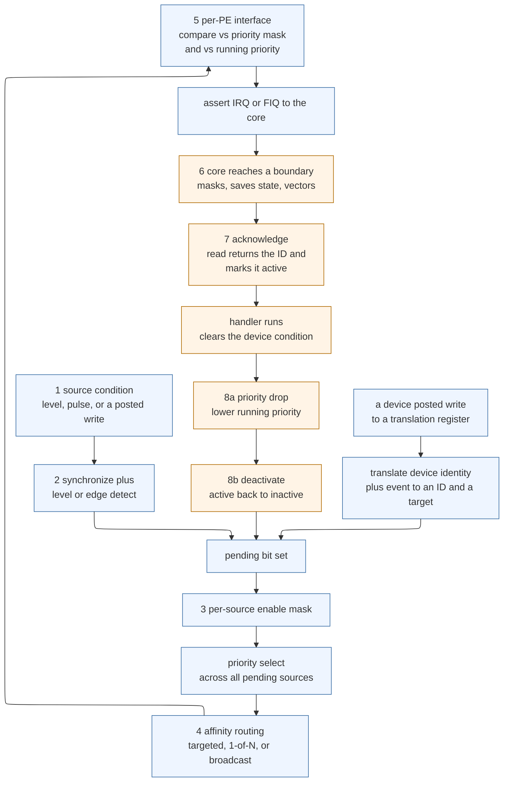
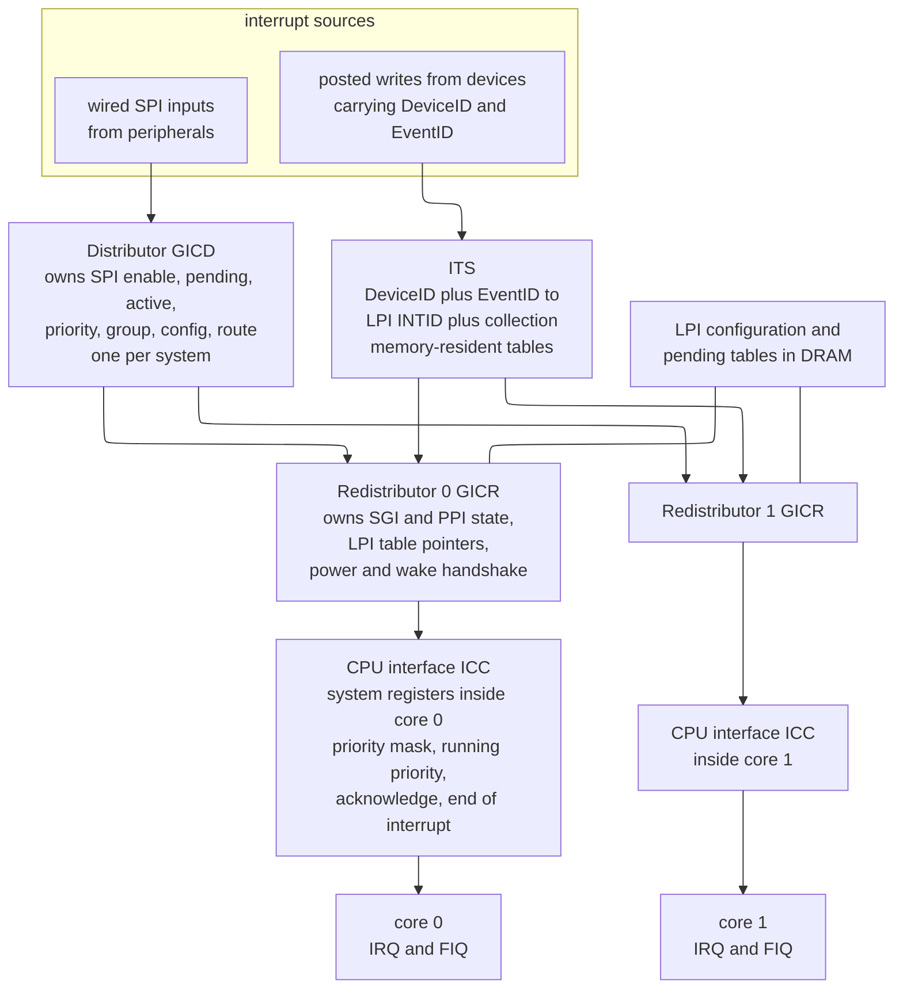
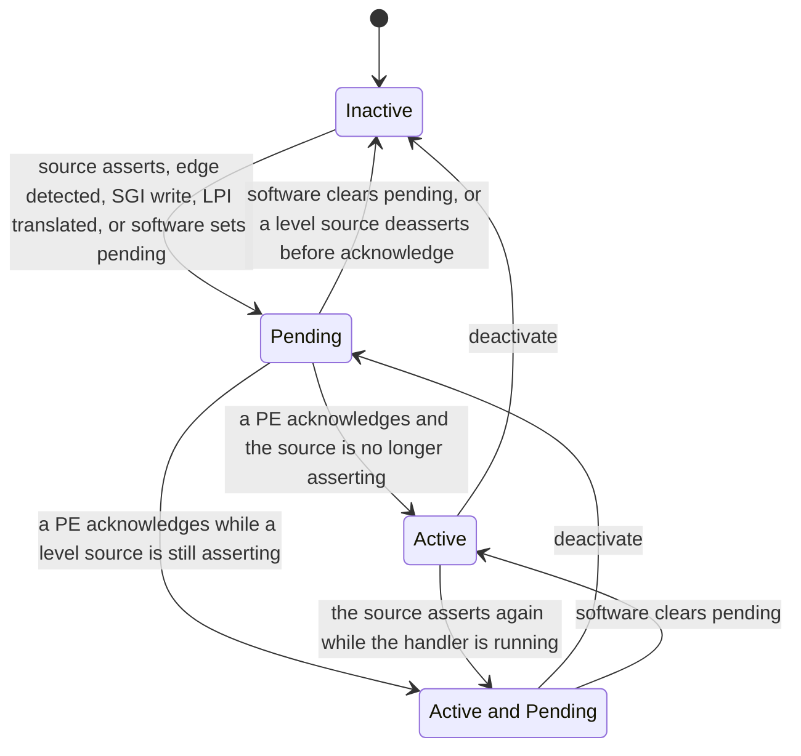
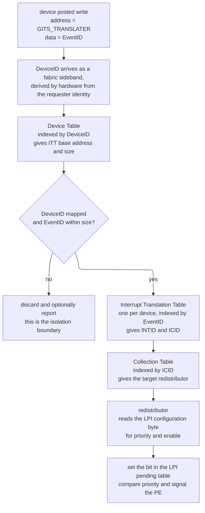
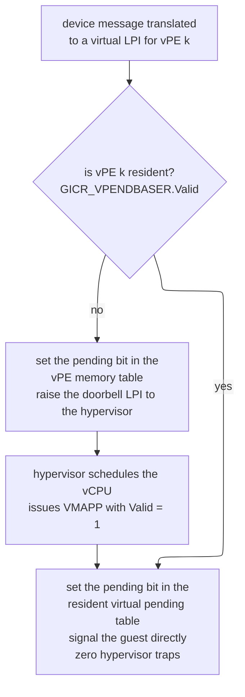
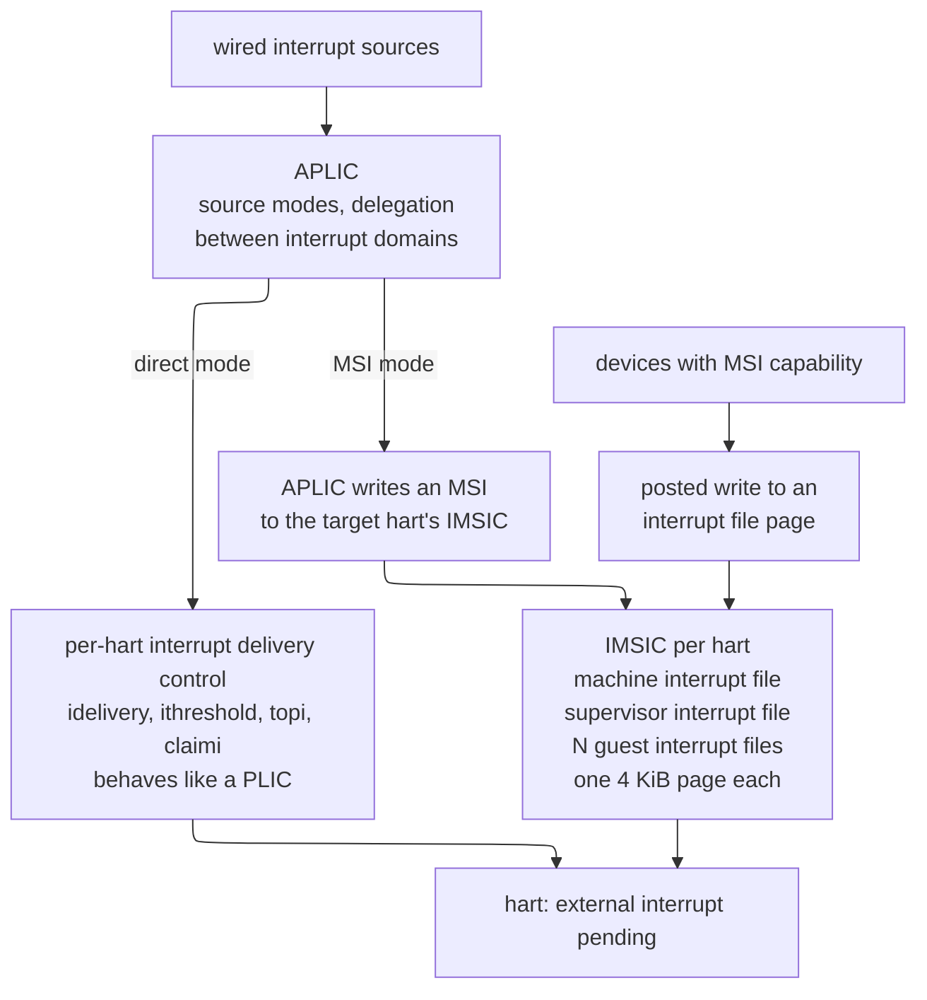
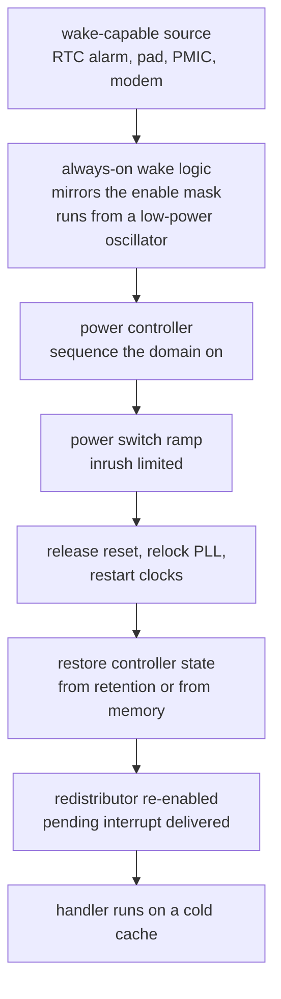
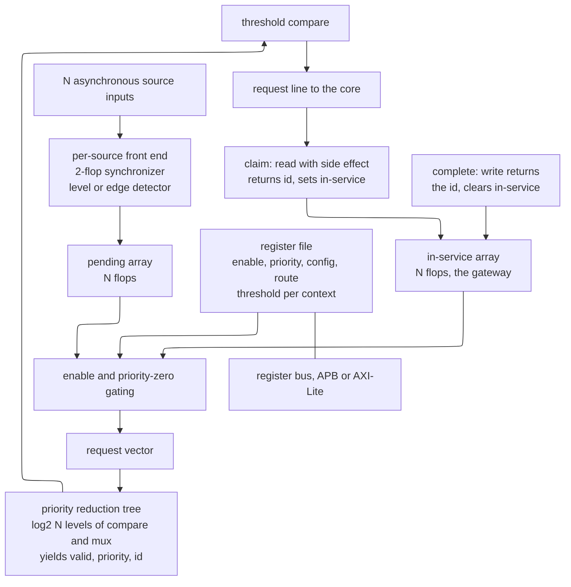

# Interrupt Architecture — from a wire or a message to a running handler

> **Prerequisites:** [High-Speed I/O and Peripheral Protocols](03_High_Speed_IO_and_Peripheral_Protocols.md) — you need the peripheral event sources of its §9-§10 (a first-in-first-out buffer crossing a threshold, a general-purpose input/output pin toggling, a timer comparator firing), the two-flop synchronizer discipline of its §9.4, and the posted-write hazard it names in §10.2. [AHB, AXI, APB](../03_Transaction_Protocols/01_AHB_AXI_APB.md) — you need the idea of a posted write that is accepted before it lands, of a register access split into address and data phases, and of a low-speed control bus hanging off a bridge; every register in this page is reached that way.
> **Hands off to:** [Privileged Architecture, CSRs, and Traps](../../01_CPU_Architecture/01_Core_Foundations/04_Privileged_Architecture_CSRs_and_Traps.md) — it owns everything that happens *inside* the core once this page's controller has raised a request and the core has decided to take it: the control-and-status registers that record the cause, the vector table, the privilege transition, and the return instruction. This page stops at the moment the core acknowledges.

---

## 0. Why this page exists

An interrupt controller is one of the two or three most heavily specified intellectual-property (IP) blocks on a modern system-on-chip (SoC), and it is the one most often treated as a footnote. The Arm Generic Interrupt Controller version 3 architecture specification is several hundred pages. The RISC-V Advanced Interrupt Architecture is two specifications and adds a second, message-based delivery mechanism on top of a wired one. The x86 local Advanced Programmable Interrupt Controller has accreted three generations of programming interface and a fourth for virtualization. None of that complexity is decoration: every clause exists because a simpler design lost an interrupt, took one twice, delivered one to a powered-down core, let a malicious device inject one into another security domain, or deadlocked a fabric.

The reason this block is architecturally load-bearing is that it sits on the **only asynchronous control path in the system**. Every other transaction on an SoC is something a core asked for. An interrupt is the one thing the machine does because something *outside* the core decided it was time. That inverts every assumption the rest of the design makes: there is no requester to backpressure, no natural ordering point, no program order to appeal to, and no way to retry if the notification is dropped. A lost read completion produces a timeout and an error report. A lost interrupt produces a device that silently stops making progress an hour into a soak test, on one board in fifty, and no logic analyzer trace of the moment it happened.

The second reason is that interrupt latency is a system property that no single team owns. It is assembled from a synchronizer in the source's clock domain, a pipeline in the distributor, a traversal of the fabric, a table walk in a translation engine, a comparison in the core's interrupt interface, a pipeline drain, a vector fetch that may miss in the instruction cache, and — usually dominating all of it — a stretch of driver code that ran with interrupts masked. Every one of those is somebody else's block. An architect who cannot write the budget cannot tell the real-time team whether the deadline is achievable, and cannot tell the driver team which of their habits is the actual problem.

After this page you should be able to: decide from arithmetic whether a given device should be polled, interrupted, or both; choose level-sensitive or edge-triggered signaling for a source and state the failure each choice exposes you to; explain why a message-signaled interrupt is ordered with respect to the data it announces and a wire is not; read and program a GICv3 distributor, redistributor, CPU interface, and Interrupt Translation Service, including the priority and grouping rules that make naive configurations silently ineffective; do the same for a RISC-V Platform-Level Interrupt Controller and for the Advanced Interrupt Architecture, and say honestly what each buys and costs relative to the GIC; compute a worst-case nested interrupt latency with the same response-time analysis a real-time scheduling paper would use; size a rate limiter that contains an interrupt storm without losing events; and write and verify the register-transfer-level (RTL) core of a controller with the assertions that catch the bugs this page catalogs.

---

## 1. The problem interrupts solve, and the vocabulary that follows

### 1.1 The baseline: polling, and its exact cost

The simplest way for software to learn that a device needs attention is to ask. A core reads the device's status register in a loop and acts when a bit is set. Nothing in the hardware is required beyond the status register itself. No controller, no wire, no vector table, no priority, no masking, no re-entrancy — and, importantly, no asynchrony, so the code is trivially easy to reason about.

Three quantities describe it:

- $C_p$ — the cost of one poll: the core cycles spent issuing the read and testing the result, dominated by the memory-mapped input/output (MMIO) round trip. On an Advanced Peripheral Bus (APB) peripheral behind a bridge and a clock-domain crossing this is 100-200 ns; on a register in a fast on-die block, 40-80 ns; on a coherent flag in dynamic random-access memory (DRAM) that a device wrote by direct memory access (DMA), it is a cache miss, roughly 80-150 ns.
- $T_p$ — the polling period.
- $L$ — the detection latency the system must meet. A poll loop with period $T_p$ has mean detection latency $T_p/2$ and worst case $T_p$, so meeting a mean-latency target $L$ requires $T_p \le 2L$.

The fraction of a core consumed by polling is then

$$U_p \;=\; \frac{C_p}{T_p} \;\ge\; \frac{C_p}{2L}.$$

Trace it. A device that must be serviced within a mean of 10 µs, polled across a fabric at $C_p = 60$ ns, needs $T_p \le 20$ µs and costs $U_p = 60\,\text{ns}/20\,\mu\text{s} = 0.3\%$ of a core. That is cheap. A device that must be serviced within a mean of 100 ns needs $T_p \le 200$ ns and costs $U_p = 30\%$ of a core — and since $C_p$ is itself 60 ns, the loop is barely able to run at that period at all. **Polling cost scales as the inverse of the latency target, and it hits a wall when the target approaches the poll cost.**

### 1.2 The failure that forces notification, stated twice

The first failure is the one just derived: *tight latency targets make polling arbitrarily expensive*. But that is not the failure that actually made interrupts universal, because most devices do not have 100 ns deadlines.

The real failure is the other end. Consider a keyboard controller producing 10 events per second, and a system with 40 such low-rate sources. Polling each at 20 ms — a latency a human cannot perceive — costs $40 \times 60\,\text{ns}/20\,\text{ms} = 0.012\%$ of a core. Trivial. And yet polling is catastrophically wrong here, for a reason that has nothing to do with processor utilization: **a polling core can never sleep.**

A core waiting in a poll loop is executing instructions. It cannot enter a clock-gated wait state, and it certainly cannot be power-gated, because it has to wake every $T_p$ to look. The energy accounting is brutal. A large application core in a 5 nm process burns on the order of 200-600 mW when it is running instructions and 20-50 mW when it is clock-gated in a wait-for-interrupt state with only leakage flowing. Power-gating the cluster takes that to 1-3 mW. So the 0.012% of *throughput* that polling costs is accompanied by 100% of the *power*, forever, for a device that is idle 99.9999% of the time.

That is the derived requirement, and it is the actual one: **the mechanism must let the core stop executing entirely and be restarted by the event.** Everything else about interrupts — priority, vectoring, masking, nesting — is refinement on top of that single property. A design that gets the notification right but keeps the core spinning has solved nothing.

### 1.3 The crossover, computed

With notification available, the cost model flips. Let $C_i$ be the total processor cost of taking one interrupt: the pipeline drain, the trap entry, the acknowledge read, the context save, the dispatch through the operating system's handler chain, the end-of-interrupt write, and the return. Then

$$U_i \;=\; \lambda \, C_i$$

where $\lambda$ is the event rate. Setting $U_i = U_p$ gives the crossover rate

$$\lambda^{*} \;=\; \frac{C_p}{2 L\, C_i}.$$

Numbers, for a general-purpose operating system on an application core: $C_i \approx 1.5$ µs (this is a realistic figure once the handler chain, the threaded-handler wakeup, and the cache and translation-lookaside-buffer disturbance are counted; a bare-metal handler on the same core is 100-300 ns). With $C_p = 60$ ns and a 10 µs latency target:

$$\lambda^{*} = \frac{60 \times 10^{-9}}{2 \times 10 \times 10^{-6} \times 1.5 \times 10^{-6}} = \frac{6 \times 10^{-8}}{3 \times 10^{-11}} = 2000 \ \text{events/s}.$$

Above 2000 events per second, at that latency target, polling costs the processor *less* than interrupting. This is not a marginal effect at the top end: a solid-state drive sustaining $10^6$ input/output operations per second would spend $10^6 \times 1.5\,\mu\text{s} = 1.5$ core-seconds per second — one and a half entire cores — purely on interrupt entry and exit, before any useful work. Polling the same completion queue every 2 µs costs 3% of one core. That factor of fifty is exactly why high-performance storage and networking stacks (io_uring in polled mode, the Storage Performance Development Kit, the Data Plane Development Kit) turn interrupts *off* and dedicate cores to spinning.

So the two regimes are:

| Regime | Winner | Why |
|---|---|---|
| Low rate, any latency target | **Interrupt** | the core sleeps; polling burns 100% of the power for 0% of the work |
| High rate, tight latency, a core to spare | **Polling** | the per-event fixed cost $C_i$ exceeds the amortized poll cost |
| High rate, bursty, cores are shared | **Hybrid** | neither pure mode is acceptable |

### 1.4 The hybrid that production systems actually ship

The hybrid is worth naming precisely, because it is what every serious network and storage driver does and it is a direct consequence of the arithmetic above.

**Interrupt to start, poll to drain.** The device's interrupt is enabled while the queue is empty. On the first event, the handler does three things: it *masks that source*, it schedules a polling context, and it returns. The polling context then drains the queue without taking any further interrupts, up to a work budget. When the queue is empty (or the budget expires and the context yields), the source is unmasked. Linux calls this New API (NAPI); the same shape appears under other names everywhere.

The effect on the arithmetic is that $C_i$ is paid once per *burst* rather than once per *event*. If a burst averages $B$ events, the effective per-event interrupt cost is $C_i/B$ plus the per-event poll cost. At $B = 32$ and $C_i = 1.5$ µs the fixed cost falls to 47 ns per event, and the crossover rate $\lambda^{*}$ rises by a factor of 32.

**Interrupt moderation** is the hardware half of the same idea: the device (or the controller) delays raising the interrupt by a programmable time $t_{mod}$ or until a programmable count of events accumulates. The trade is one line of arithmetic: moderation caps the interrupt rate at $1/t_{mod}$, batches on average $\lambda\, t_{mod}$ events per interrupt, and adds at most $t_{mod}$ to the latency of the *first* event in a batch. At $\lambda = 500{,}000$ packets per second and $t_{mod} = 50$ µs, the interrupt rate drops from 500 kHz to 20 kHz, 25 events are batched per interrupt, and worst-case added latency is 50 µs. Whether that is acceptable is a workload question, which is why moderation is always software-programmable and never fixed in the RTL.

**Selection boundary.** Pure polling remains correct only when a core is genuinely dedicated and the power cost is accepted, which is a data-center bargain and almost never an embedded or mobile one. Pure interrupts remain correct whenever the event rate is low enough that $\lambda C_i$ is negligible, which covers the overwhelming majority of sources on any SoC — every timer, every error line, every button, every low-rate serial port. The hybrid is for the small number of sources whose rate can span four orders of magnitude between idle and load.

### 1.5 The vocabulary, stated precisely

The terms below are used interchangeably in casual speech and are not interchangeable in a specification. Getting them wrong in a design document produces hardware that software cannot use.

**Trap** is the umbrella term: any transfer of control to a privileged handler that was not caused by an ordinary control-flow instruction. Everything below is a kind of trap. (Unhelpfully, some architectures also use "trap" in the narrow sense given further down. Where ambiguity matters, say "trap entry" for the umbrella and name the specific class otherwise.)

**Exception** is a trap caused *by the instruction currently being executed*. It is **synchronous**: re-running the same instruction stream with the same state reproduces it at the same instruction. Exceptions divide by *when they are reported relative to the instruction's completion*:

- A **fault** is reported *before* the instruction takes effect. The instruction is restartable, and the saved program counter points *at* the faulting instruction. A page fault, an undefined-instruction exception, and an alignment fault are faults. The entire virtual-memory system depends on this: the handler installs a mapping and returns, and the load re-executes.
- A **trap** (narrow sense) is reported *after* the instruction has taken effect. The saved program counter points *past* it. A system call, a software breakpoint, and (on many architectures) a data watchpoint are traps.
- An **abort** is reported when the instruction cannot be restarted and some architectural state may already be lost. An external abort on a bus access and an uncorrected memory error are aborts.

**Interrupt** is a trap caused by something *unrelated to the instruction currently executing*. It is **asynchronous**: nothing in the instruction stream determines when it arrives. The core does not "interrupt an instruction" — it chooses an instruction boundary, completes everything older, discards everything younger, and enters the handler there. That choice is the subject of [Retirement, Recovery, and Precise State](../../01_CPU_Architecture/03_Out_of_Order_Backend/03_Retirement_Recovery_and_Precise_State.md) §4.1 and is not re-derived here.

**Precise** and **imprecise** describe whether the architectural state at the moment of the trap corresponds to a single point in program order. A precise event guarantees that all older instructions have committed, no younger instruction has had any effect, and a single saved program counter identifies the boundary. An imprecise event guarantees none of that: it says only that *something* went wrong, somewhere behind the current point. Imprecise events are not resumable in the ordinary sense; software can only contain the damage. Arm's SError (System Error) and x86's machine-check are the canonical examples; the machine-check treatment is in the retirement page's §14.

**Maskable** and **non-maskable** describe whether ordinary privileged software can defer the event. A non-maskable interrupt (NMI) cannot be deferred, which is exactly why it is dangerous: it can arrive in the middle of any sequence, including one that has left a data structure inconsistent (§13.6).

| Class | Synchronous? | Precise? | Restartable? | Saved PC points at | Example |
|---|---|---|---|---|---|
| Fault | yes | yes | yes | the faulting instruction | page fault, undefined instruction |
| Trap (narrow) | yes | yes | n/a — already done | the next instruction | system call, breakpoint |
| Precise abort | yes | yes | no | the aborting instruction | synchronous external abort with known address |
| Imprecise abort | no (reported late) | no | no | wherever the pipeline was | SError, machine check |
| Interrupt | no | yes, by construction | yes — it resumes | the next instruction to run | this entire page |

### 1.6 Four bugs that come from blurring these

Each of the following has shipped in real silicon or real firmware, and each is a direct consequence of treating one row of that table as another.

1. **A fault reported as a trap.** A load takes a page fault, but the core saves the program counter of the *next* instruction. The operating system installs the mapping and returns — to the instruction *after* the load. The load never executes and its destination register keeps whatever it held. This is silent data corruption with no error report anywhere, and it is the single reason the architecture must specify, for every exception, whether the saved program counter points at or past the instruction.

2. **An imprecise abort reported as precise.** A buffered write fails at the memory controller long after the storing instruction retired. If the architecture reports this as a precise synchronous abort on whatever instruction happened to be at the head of the reorder buffer, software will diagnose and "retry" an instruction that had nothing to do with the failure, and the genuinely lost write is never recovered. The correct architecture *declares* the event imprecise, which forces software to escalate to a containment path (kill the process, or reset the partition) rather than pretend it can resume.

3. **An interrupt allowed to displace a pending exception.** An asynchronous interrupt and a synchronous fault become deliverable in the same cycle. If the interrupt wins and the fault record is discarded, the outcome depends on the fault's class: a *fault* is harmless, because the instruction re-executes on return and faults again; a *trap* is fatal, because the instruction already had its side effect and re-executing it repeats it. This is why every architecture publishes a fixed priority order among simultaneous events, and why that order is not a free implementation choice.

4. **An interrupt taken imprecisely "for speed."** A design lets the interrupt be taken at a point where a multi-part store has partially retired, on the argument that it saves pipeline drain cycles. No software can resume from that state. This is the failure that the precise-interrupt requirement exists to forbid, and it is why long non-interruptible operations are made *restartable* (with a progress counter in an architectural register) rather than made interruptible mid-way.

---

## 2. The delivery path, end to end

### 2.1 The eight hops

Every interrupt architecture in this page — GICv3, the PLIC, the AIA, the local APIC — implements the same eight-stage path. The names differ; the stages do not. Fixing this sequence in mind first makes the architecture-specific sections readable as variations rather than as unrelated systems.

1. **Signal at the source.** A condition becomes true in a peripheral: a receive buffer crosses a threshold, a DMA descriptor completes, a comparator matches, a pin changes. The peripheral expresses this as a level held on a wire, a pulse on a wire, or a memory write.
2. **Detect and make pending.** The controller samples the source into its own clock domain, applies the configured level or edge rule, and sets a **pending** bit. Pending means "this interrupt is asking to be taken."
3. **Filter by enable and priority.** The pending bit is gated by a per-source **enable**. Surviving requests are compared against every other surviving request; the highest-priority one wins.
4. **Route by affinity.** The winner is matched against the set of processing elements (PEs) that are permitted to take it. This may be a single named target, a set from which the controller picks, or every PE.
5. **Compare against the target's running priority and mask.** The chosen PE's interface checks the candidate against that PE's priority mask and against the priority of whatever the PE is already handling. Only if it wins both does the interface assert the PE's interrupt request signal.
6. **The core takes the trap.** The core notices the request, reaches an instruction boundary it can trap at, masks further interrupts of the same or lower priority, saves the return state, and jumps to the handler. This step is owned by [Privileged Architecture, CSRs, and Traps](../../01_CPU_Architecture/01_Core_Foundations/04_Privileged_Architecture_CSRs_and_Traps.md).
7. **Acknowledge.** The handler asks the controller *which* interrupt this is. The read is not a passive query: it atomically returns the winning identifier and transitions that interrupt from pending to **active**, which is what stops it being delivered again to this or any other core.
8. **End of interrupt, then deactivate.** When the handler is done it tells the controller. This may be one operation or two: a **priority drop**, which lowers the PE's running priority so that lower-priority interrupts can preempt again, and a **deactivate**, which returns the interrupt to inactive so it can fire again.



The contract of this figure is that **every path converges on the pending bit**, whether it arrived as a wire or as a memory write, and **every path leaves through the acknowledge**. That convergence is what makes one controller able to serve wired and message-signaled sources with one priority scheme, one masking scheme, and one handler entry point — and it is the reason the RISC-V Advanced Interrupt Architecture's APLIC can convert a wire into a message and the GIC's message-based SPI interface can convert a message into a shared peripheral interrupt. Trace one interrupt through it: a Universal Asynchronous Receiver/Transmitter (UART) receive buffer reaches its threshold and asserts a level; two flops later a pending bit sets; the enable is on; no other source is pending, so it wins selection trivially; its route names core 2; core 2's interface finds priority 0xA0 beats a priority mask of 0xF0 and a running priority of 0xFF (idle), so it asserts IRQ; core 2 traps, reads the acknowledge register, gets identifier 68, drains the UART until its threshold bit clears, writes end-of-interrupt, and the pending bit — which had been tracking the still-asserted level — is now clear because the level dropped when the buffer drained.

The trade-off the figure illustrates is the split between the hardware stages (blue) and the software stages (orange). Hardware owns *whether* and *which*; software owns *when* and *what*. The single most common architectural mistake is trying to move a decision across that line — for example, expecting software to arbitrate priority (it cannot, because it cannot see all pending sources atomically), or expecting hardware to know when a device's condition has been serviced (it cannot, because that is a property of the device's internal state).

### 2.2 The latency budget: where the nanoseconds actually go

The table below is a realistic budget for a 2 GHz application-class core on a modern SoC, with the interrupt controller running at 800 MHz. Every entry is a range, because every entry depends on a configuration choice made elsewhere.

| # | Hop | Typical | Worst plausible | Dominated by |
|---|---|---|---|---|
| 1 | Source assertion to controller sampling | 2.5-4 ns | 1 source clock + 3 controller clocks | the two-flop synchronizer |
| 1b | Optional glitch filter | 0 | programmable, up to milliseconds | the filter depth register |
| 2 | Pending set, enable gate | 1-3 ns | + register-access arbitration | controller pipeline stage |
| 3 | Priority selection across N sources | 5-15 ns | + contention with configuration writes | tree depth, pipelined |
| 4 | Distributor to redistributor transport | 10-40 ns | 100+ ns under configuration traffic | on-die distance, hops |
| 5 | Redistributor compare and assert | 2-5 ns | | one or two flops |
| 6a | Core notices and reaches a trappable boundary | 5-25 ns | 500 ns+ | an in-flight non-cacheable read, a long divide, a vector operation |
| 6b | Trap entry: mask, save, vector fetch | 3-10 ns | +100-200 ns | an instruction-cache miss on the vector |
| 7 | Acknowledge read | 5-10 ns as a system register | 150-300 ns as an MMIO register | whether the interface is in the core |
| 8 | Handler prologue and dispatch | 100 ns bare metal | 1.5 µs+ under an OS | context save, handler chain, threaded wakeup |
| — | **Message-signaled path adds:** device write across the fabric | 50-200 ns | microseconds behind bulk traffic | fabric service class |
| — | translation table walk | 20-50 ns cached | 200-600 ns on two DRAM reads | translation cache hit rate |

Two totals fall out. **Wired source, bare metal, everything warm:** roughly 30-70 ns of controller and transport plus 10-35 ns of core, so **50-120 ns from assertion to the first handler instruction**. **Message-signaled source, cold translation, under a general-purpose operating system:** 200 ns of fabric plus 400 ns of table walks plus 50 ns of controller plus 1.5 µs of software, so **2-3 µs typical and 10 µs or more at the tail**.

The conclusion the budget forces, and the reason it is worth building before arguing about anything else: **the hardware terms sum to well under a microsecond and are boundable; the software terms are larger and are not bounded by anything this page controls.** A team that spends a quarter shaving 20 ns off a distributor pipeline while a driver holds interrupts masked for 30 µs has optimized 0.07% of the problem. §9 turns each row into an engineering lever; §8 shows how to bound the software term properly.

---

## 3. Signaling at the source: level versus edge

### 3.1 The two rules, and the circuits that implement them

The source has to communicate a fact ("I need attention") over a wire that carries a voltage. There are exactly two ways to encode it, and they differ in *where the memory of the event lives*.

**Level-sensitive.** The source asserts the wire and holds it asserted until software has dealt with the condition. The wire *is* the state. The controller's pending bit is not storage at all; it is a synchronized copy of the wire:

$$\text{pending}[i] \;=\; \text{sync}(\text{src}[i])$$

**Edge-triggered.** The source pulses the wire. The pulse may be one clock wide and long gone before anyone looks. The memory of the event must therefore live *in the controller*, in a set-dominant latch fed by a transition detector:

$$\text{pending}[i] \;\leftarrow\; \text{pending}[i] \;\lor\; \big(\text{sync}(\text{src}[i]) \land \lnot\, \text{sync}(\text{src}[i])_{\text{delayed}}\big)$$

That single structural difference — *whose flop holds the event* — generates every downstream property of the two schemes.

### 3.2 The detectors in RTL

```systemverilog
// -----------------------------------------------------------------------------
// One interrupt source's front end: synchronizer, configurable detector,
// pending bit. Instantiate N of these, or vectorize as in section 14.
//   cfg_edge  : 1 = edge-triggered (rising), 0 = level-sensitive (active high)
//   claim     : one-cycle pulse when this source is acknowledged
// -----------------------------------------------------------------------------
module intc_source_fe (
  input  logic clk,
  input  logic rst_n,
  input  logic src_async,     // straight from the pad or the peripheral domain
  input  logic cfg_edge,
  input  logic claim,
  output logic pending
);

  // Two flops resolve metastability; the third gives the edge detector a
  // stable previous value. The detector is AFTER the synchronizer -- putting
  // it before means a metastable transition can manufacture an event that
  // no software action can explain.
  logic meta_q, stable_q, prev_q;
  logic pend_q;

  logic rise;
  assign rise    = stable_q & ~prev_q;
  assign pending = pend_q;

  always_ff @(posedge clk or negedge rst_n) begin
    if (!rst_n) begin
      meta_q   <= 1'b0;
      stable_q <= 1'b0;
      prev_q   <= 1'b0;
      pend_q   <= 1'b0;
    end else begin
      meta_q   <= src_async;
      stable_q <= meta_q;
      prev_q   <= stable_q;

      if (cfg_edge) begin
        // Set dominates clear. An edge arriving in the same cycle as its own
        // acknowledge must survive; the opposite ordering is the lost-edge
        // bug diagnosed in worked problem 6.
        if (rise)       pend_q <= 1'b1;
        else if (claim) pend_q <= 1'b0;
      end else begin
        // Level: the pending bit is a mirror, not a memory. Acknowledging
        // does not clear it -- only the source deasserting does.
        pend_q <= stable_q;
      end
    end
  end

endmodule
```

The contract of this module is that `pending` is a stable, single-clock-domain, glitch-free statement of "this source is asking." The one asymmetry to read carefully is that `claim` clears the pending bit for an edge source and does nothing for a level source. That is not an optimization: for a level source, clearing the pending bit would be a *lie*, because the condition in the peripheral is still true. The mechanism that stops a level source from immediately re-interrupting its own handler is the **active** state (§5.4) or the **gateway** (§6.2), not the pending bit.

### 3.3 The synchronizer requirement, and why it is not optional

The source wire almost always originates in a different clock domain: the peripheral's clock, a pad's asynchronous input, or another chiplet entirely. Sampling it directly into the controller's pending flop puts that flop at risk of metastability, and a metastable pending bit is not merely a delayed interrupt — it is a bit that different downstream logic can read as different values in the same cycle, which can set the active state for one interrupt while the priority tree selected another.

The two-flop synchronizer and its mean-time-between-failures argument are derived in [Async Design and CDC](../../../03_Frontend_RTL_and_Verification/06_Async_Design_and_CDC.md), and restated in [High-Speed I/O and Peripheral Protocols](03_High_Speed_IO_and_Peripheral_Protocols.md) §9.4. Three consequences specific to interrupts:

- **The edge detector goes after the synchronizer, never before.** An XOR on the raw asynchronous input can fire from a metastable excursion and set a pending bit for an event that never occurred. This is the phantom-interrupt bug, and it is undiagnosable from software because there is nothing in the peripheral to look at.
- **The synchronizer costs latency in every interrupt.** Two flops at 800 MHz is 2.5 ns of the budget in §2.2, plus up to one full source clock of sampling uncertainty. At a 100 kHz peripheral clock that uncertainty is 10 µs — which is why a slow peripheral's interrupt should be generated in a fast domain if latency matters.
- **A multi-bit event indication cannot be synchronized bit by bit.** If a peripheral wants to convey "which of four conditions fired" on four parallel wires, the four bits resolve independently and the controller can sample a combination that never existed. Either give each condition its own interrupt (the usual answer, and the reason interrupt counts are large), or use a request/acknowledge handshake so the vector is stable while it is sampled.

### 3.4 The lost edge

This is the failure mode that makes edge triggering dangerous, and it has two independent causes that are frequently confused in the field.

**Cause one: the pulse is narrower than the sampling interval.** A flop clocked at $f$ can only observe a signal that is present at a clock edge. A pulse that begins after one edge and ends before the next is never sampled at all. The rule is unforgiving: **an asynchronous pulse must be at least two destination clock periods wide to be guaranteed captured**, because a pulse of exactly one period may straddle a single edge and violate setup at it, and the flop's resolution then decides the outcome.

```wavedrom
{ "signal": [
  {"name": "clk_ctrl",       "wave": "0.1.0.1.0.1.0.1.0.1."},
  {},
  {"name": "src_async",      "wave": "0.1......0.1.0......", "node": "..a........b........"},
  {"name": "meta_q",         "wave": "0.....1...0........."},
  {"name": "stable_q",       "wave": "0.........1...0....."},
  {"name": "prev_q",         "wave": "0.............1...0."},
  {"name": "rise",           "wave": "0.........1...0....."},
  {"name": "pending_q",      "wave": "0.............1.....", "node": ".............c......"}
 ],
 "edge": ["a~>c capture costs three sampling edges", "b never sampled"],
 "head": {"text": "A pulse shorter than one controller clock period can fall entirely between two sampling edges and is lost with no trace"}
}
```

Read it left to right. The first pulse is two clock periods wide, so it is present at a sampling edge, propagates through the synchronizer, produces a one-cycle `rise`, and sets `pending_q` three sampling edges after it began. The second pulse is half a clock period wide and lands between two edges: `meta_q` never moves, so no `rise` is generated and no pending bit is set. There is no error, no status bit, and no counter anywhere in the system that records this. The event simply did not happen, as far as every piece of logic downstream is concerned. This is the defining property of edge triggering and the reason it must be chosen deliberately rather than by default.

The fixes, in order of preference: **make the source hold the pulse for at least two destination clock periods** (a "pulse stretcher" of two or three flops in the source domain); or **convert the pulse to a toggle** — the source inverts a level on each event, the destination synchronizes it and XORs against the previous value, which is width-independent because the level persists until the next event; or **use level signaling with an explicit clear**, which removes the problem entirely.

**Cause two: the clear races the next event.** The second WaveDrom shows a bug that is entirely in software and produces the identical symptom.

```wavedrom
{ "signal": [
  {"name": "clk",                     "wave": "p............."},
  {},
  {"name": "device event",            "wave": "0.10....10...."},
  {"name": "controller pending bit",  "wave": "0..1......0...", "node": "...x......y..."},
  {"name": "handler running",         "wave": "0...1.....0..."},
  {"name": "handler reads the device","wave": "0....10......."},
  {"name": "handler clears pending",  "wave": "0........10..."}
 ],
 "edge": ["x~>y one clear erases two events"],
 "head": {"text": "Clear-after-service: an event arriving between the device read and the pending clear is destroyed"}
}
```

The handler reads the device's data at cycle 5, a second event arrives at cycle 8, and the handler clears the pending bit at cycle 9. The second event's data was never read and its pending bit is now gone. The miss rate scales with the handler's duration, which is why this bug is load-dependent and why adding a print statement to the handler makes it worse — a diagnostic detail that is often the first real clue. **The rule that removes it: clear the pending bit before servicing the device, not after.** A spurious extra handler invocation (because you cleared a bit for an event you then serviced) is harmless; a lost event is not. Worked problem 6 diagnoses a case where both causes are present at once.

### 3.5 The stuck level

Level triggering has the mirror-image failure: a source that never deasserts. If the handler fails to clear the peripheral's condition — because it cleared the wrong bit, because it drained one entry from a buffer that had thirty, or because the clearing write is still sitting in a bridge write buffer when the handler returns — the level stays asserted and the interrupt fires again immediately, forever.

This looks worse than the lost edge and is in fact far better, for one reason: **it is loud.** The system does not silently drop work; it visibly stops making progress, with a counter in the controller and in the operating system incrementing at a rate that any tool can see. A bug that announces itself on the first boot of the first board is a bug that gets fixed; a bug that loses one event in two thousand under load is a bug that ships.

The specific instance of stuck level that appears on every new SoC deserves naming, because it is a consequence of the posted-write model rather than a coding error. The handler writes to the peripheral to clear the condition. That write is *posted*: the fabric accepts it and returns before it reaches the peripheral. The handler then writes end-of-interrupt and returns, re-enabling interrupts — while the clearing write is still in flight. The level is still asserted, the interrupt re-fires, and the handler runs a second time on a condition that is about to be cleared. The fix is to **read back the peripheral register after clearing it**, which forces the write to have taken effect at the peripheral before the read can return, or to execute the architecture's device-ordering barrier. The ordering rules that make this necessary are owned by [QoS, Ordering, and I/O Coherence](01_QoS_Ordering_and_IO_Coherence.md) §5 and by [Memory Consistency and Atomics](../../01_CPU_Architecture/06_Coherence_and_Consistency/02_Memory_Consistency_and_Atomics.md).

### 3.6 Glitch filtering and debounce

A source that comes from outside the die can carry transients that are not events: coupling from an adjacent switching pin, a bouncing mechanical contact, an electrostatic-discharge event on the board. A filter that requires $N$ consecutive identical samples before the controller believes a transition is the standard defense.

The costs are exact and unavoidable:

- **Latency.** The filter adds $N$ controller clocks to every genuine assertion. At $N = 8$ and 800 MHz that is 10 ns — negligible. At the sample rates a mechanical switch requires it is not.
- **Minimum pulse width.** A filter of depth $N$ *cannot* pass a pulse shorter than $N$ samples. This is the same lost-edge failure as §3.4, now created deliberately. If the same input carries both a bouncing button and a fast data-ready strobe, one of the two will break.
- **Counter width where the time constants are large.** A mechanical switch bounces for 1-10 ms. Filtering that at 800 MHz needs a counter to 8 million — 23 bits, per source. This is why debounce does not live in the interrupt controller: it lives in the general-purpose input/output block, clocked from a divided low-frequency clock, where a 10 ms filter is a 10-bit counter at 100 kHz.

The design rule that follows: **glitch filtering belongs at the pad, debounce belongs in the GPIO block, and the interrupt controller's filter — if it has one at all — should be a two-or-three-sample filter for on-die noise only, and disabled by default.**

### 3.7 The shared line, and why level is the safe default

Multiple devices frequently share one interrupt wire, either because pins are scarce (a board with eight peripherals and four interrupt inputs) or because the protocol mandates it (conventional PCI's four shared, level-triggered, open-drain lines per slot). The electrical realization is a wired-OR: every device can pull the line low, a single pull-up resistor returns it high, and the line is low if *any* device is asserting.

```tikz
\begin{document}
\begin{circuitikz}[scale=1.0]
  \draw (0,4) node[left]{VDD} -- (7,4);
  \draw (0,0) node[left]{VSS} -- (7,0);
  \draw (1,4) to[R=$R_{pu}$] (1,2.5);
  \draw (1,2.5) -- (6.5,2.5) node[right]{nIRQ};
  \draw (3,1.2) node[nmos](A){};
  \draw (A.drain) -- (3,2.5);
  \draw (A.source) -- (3,0);
  \draw (A.gate) -- (1.8,1.2) node[left]{dev A};
  \draw (5.5,1.2) node[nmos](B){};
  \draw (B.drain) -- (5.5,2.5);
  \draw (B.source) -- (5.5,0);
  \draw (B.gate) -- (4.3,1.2) node[left]{dev B};
\end{circuitikz}
\end{document}
```

The contract of this circuit is that the line is asserted (low) if either transistor is on, and released (high) only when both are off. That is precisely the OR of two conditions with no active driver contention — which is the whole reason open-drain is used for shared lines instead of push-pull, where two drivers fighting would produce a short. The trade-off is that the rise time is set by $R_{pu}$ and the total line capacitance, exactly as in the I2C analysis of [High-Speed I/O and Peripheral Protocols](03_High_Speed_IO_and_Peripheral_Protocols.md) §9.1: adding devices adds capacitance, slows the rise, and eventually pushes the deassertion edge past the point where the controller can see the line return high between two interrupts.

Now the decisive argument. **On a shared line, edge triggering loses events by construction.** Device A pulls the line low; the controller sees a falling edge and sets pending. Before the handler runs, device B also pulls low — the line was already low, so there is no edge, and the controller records nothing. The handler polls A, finds and services it, A releases, but B is still pulling, so the line never returns high and no further edge is ever generated. Device B is now permanently ignored and the line is permanently stuck low.

With **level** triggering the same sequence works: the line stays low, the pending bit stays set, the handler chain runs again, finds B, and services it. The line rises only when the last asserter releases. The mechanism has an inherent retry.

This is the reason PCI's `INTA#` through `INTD#` are specified as level-triggered and open-drain, and it is the general rule: **level is the correct default; edge should be chosen only when the source genuinely cannot hold a level, and never on a shared line.**

### 3.8 The comparison, condensed

| Property | Level-sensitive | Edge-triggered |
|---|---|---|
| Where the event is remembered | in the source | in the controller's pending flop |
| Can an event be lost? | no — the level persists | yes — narrow pulse, or a clear that races a new edge |
| Can a phantom event occur? | no | yes — a metastable or unfiltered transition |
| Two events before service | naturally collapse; handler must drain | collapse silently; handler must drain anyway |
| Shareable | yes, with a handler chain | no — see §3.7 |
| Handler obligation | must clear the source, then verify with a read-back | must clear pending *before* servicing |
| Failure signature | interrupt storm, immediately visible | silent loss under load, weeks later |
| Minimum source pulse width | none — hold it | two destination clock periods |
| Right for | conditions: buffer non-empty, error flag, request asserted | events: a completion strobe, a pin transition, a message arrival |

Message-signaled interrupts (§4) sit in the edge column: a write is an event, and a second write before the first is serviced is absorbed. That is why the "drain until empty" discipline is not optional for any modern device driver.

---

## 4. Message-signaled interrupts: why a write beat a wire

### 4.1 Four independent arguments, each sufficient on its own

A **message-signaled interrupt (MSI)** replaces the dedicated wire with an ordinary posted memory write, to an address the interrupt controller decodes, carrying data that names the interrupt. The device is programmed at enumeration time with an (address, data) pair; to raise the interrupt it performs that write.

**Argument one: pins and routes.** A dedicated wire per source needs a wire per source. Inside the die that is a route from every peripheral to the distributor — hundreds of long, mostly idle nets crossing the floorplan, each needing a synchronizer and each contributing to congestion. Off the die it is worse: a pin per source, and a modern serial interconnect has no spare sidebands at all. The arithmetic is decisive. A network controller with 64 queues wanting one interrupt per queue per core has $64 \times 8 = 512$ distinct notifications. As wires that is impossible. As MSI-X table entries it is 512 rows of a table in the device's own memory, costing **zero** pins and zero routes, because the writes ride the data path that already exists.

**Argument two: ordering.** This is the argument that matters most and the one that is hardest to reproduce any other way. A wire is *out of band*: it propagates in nanoseconds while the data the device just wrote is still sitting in a fabric buffer two hops from the memory controller. The core takes the interrupt, the handler reads the buffer, and gets stale data. That is a real and classic SoC integration bug, described concretely in [PCI Express Protocol Deep Dive](04_PCIe_Protocol_Deep_Dive.md) §11.4.

A write is *in band*. It travels the same path, in the same direction, in the same ordering domain as the DMA writes that preceded it, and the fabric's rule that a posted write may not pass an earlier posted write on the same path therefore guarantees that when the interrupt write is accepted, every data write issued before it has already been accepted. The interrupt cannot arrive before the data it announces. **MSI puts the notification into the data's ordering domain, which a wire structurally cannot be.**

**Argument three: virtualization and remapping.** An address is a *name*, and names can be translated. A translation engine sitting between the device and the controller can rewrite (device identity, event number) into (interrupt number, target), can validate that this device is permitted to raise this interrupt at this target, and can redirect it into a guest without the hypervisor ever seeing it. A wire carries no identity and can only be remapped by a physical multiplexer per wire, which is exactly as expensive as it sounds and cannot be made per-guest.

**Argument four: steering granularity.** With one address per vector, vector $i$ can be steered to core $i$. A device with per-core queues can arrange that a queue's descriptors, its completion ring, and its interrupt all land on the same core, so the handler runs where the data already is. §10 quantifies what that is worth: getting it wrong can double the cost of a completion interrupt.

### 4.2 The ordering property, stated as a design rule

The ordering guarantee is not automatic — it is a property of the *path*, and there are exactly three ways to lose it. On an internal SoC fabric the equivalent statements are:

1. **Same ordering domain.** On an AXI-style fabric, ordering between two writes is guaranteed only when they carry the same write-identifier to the same destination. If the DMA data uses `AWID=7` and the interrupt write uses `AWID=8`, or if they target different slaves reached by different routes, nothing orders them. The device must either use the same identifier and destination path, or place a barrier between them.
2. **Same service class.** If the data rides a bulk virtual channel and the interrupt rides a low-latency control channel — which is a tempting optimization, because it cuts interrupt latency — the two channels have no ordering relationship whatsoever, and the optimization introduces the exact bug MSI was supposed to eliminate.
3. **No relaxed-ordering attribute on the data.** If the data writes are marked relaxed-ordering to let them bypass congestion and the interrupt write is not, the data may be reordered *behind* the interrupt.

The rule to hand a device designer, and to put in the integration checklist: **the interrupt write must be the last write, in the same class, on the same path, with the same ordering attributes, as the data it announces — or the device must issue a barrier or a read-back before it.** The full ordering machinery is owned by [QoS, Ordering, and I/O Coherence](01_QoS_Ordering_and_IO_Coherence.md) §5 and §6.1; this page owns only the consequence for the interrupt.

### 4.3 The address and data pair as a routing token

What is actually in the write differs by architecture, and the differences are instructive because they show three answers to the same question: *where does the trustworthy part of the routing information come from?*

| Architecture | Address selects | Data carries | Device identity comes from |
|---|---|---|---|
| x86 local APIC | the APIC address window plus destination identifier, redirection hint, destination mode | vector, delivery mode, trigger mode | nothing — which is why interrupt remapping had to be added |
| Arm GICv3 with ITS | which ITS, via `GITS_TRANSLATER` in that ITS's page | the EventID: which of this device's events fired | the fabric's DeviceID sideband, derived from the requester identity by hardware |
| RISC-V AIA with IMSIC | which hart's interrupt file, and which privilege level or guest — one 4 KiB page each | the external interrupt identity within that file | the address itself: a guest can only write pages mapped into it |

The Arm and RISC-V rows are the two clean solutions and they are worth contrasting. **Arm carries identity out of band**: the DeviceID accompanying the write is inserted by hardware from the requester's identity (a PCIe Requester ID, or a StreamID assigned at the fabric port), so a device cannot forge it, and the ITS uses it to index a table the device cannot write. **RISC-V carries identity in the address**: each interrupt file is a separate 4 KiB page, and isolation is achieved by mapping only the correct page into a guest's address space, so a guest physically cannot address another guest's file. Both work; the Arm scheme scales to thousands of devices sharing one translation engine, and the RISC-V scheme needs no translation engine at all but costs a page of address space per hart per privilege level per guest.

The x86 row is the cautionary one. The original format put the destination and the vector directly in the address and data with no identity check, which meant any device that could issue a memory write could deliver any vector — including a non-maskable interrupt or a processor-init message — to any processor. That is a full platform compromise from a plug-in card, and it is why interrupt remapping (§13.1) exists and why enabling it is mandatory on any machine that exposes a device to an untrusted driver.

### 4.4 What MSI gives up

An MSI is a write, and a write is an event, so **MSI inherits every property of the edge column in §3.8.**

- **A dropped write is a lost interrupt.** There is no level to re-assert. The path from device to controller must therefore be reliable end to end: an error that discards the write, a translation failure, or a queue overflow that drops it produces exactly the silent stall §3.4 warned about. This is why translation faults on the interrupt path must be *reported*, not silently dropped, and why a full ITS command or translation queue must apply backpressure rather than discard.
- **Two writes before service coalesce.** The pending bit is a bit. If a device raises the same vector twice before the handler acknowledges, one delivery results. The handler must therefore service *everything the device has produced*, not one unit of work, and must re-check the queue after clearing its state. Every driver that assumes one interrupt equals one completion is broken; it merely has not been loaded hard enough to show it yet.
- **Masking needs somewhere to put the event.** If software masks a vector, an arriving message still has to be remembered. That is what the MSI-X **pending bit array** is for on the device side, and what the LPI pending table is for on the controller side.
- **The controller now depends on memory.** Message-based interrupt state lives in DRAM (§5.8), which means the interrupt path depends on the memory system being alive and on the translation tables being correct. A wired timer interrupt works before DRAM is trained; an LPI does not. That is precisely why every architecture keeps a small set of wired sources for the boot, timer, watchdog, and error paths and never converts them to messages.

---

## 5. Arm GICv3 and GICv4, in product depth

This section is the centerpiece. GICv3 is the most fully specified interrupt architecture in wide use, it is the one an SoC architect is most likely to integrate, and — because it made almost every design decision explicitly and documented the reasoning — it is the best vehicle for understanding what the other architectures chose to leave out.

### 5.1 The interrupt identifier space and the four classes

Every interrupt in a GIC system has an **interrupt identifier (INTID)**. The space is partitioned, and the partition is not administrative: each class has different state ownership, different routing, and different delivery machinery.

| INTID range | Class | Banked per PE? | State lives in | Purpose |
|---|---|---|---|---|
| 0-15 | **SGI** — Software Generated Interrupt | yes | redistributor | inter-processor interrupts; raised by a register write, never by a wire |
| 16-31 | **PPI** — Private Peripheral Interrupt | yes | redistributor | a source that exists once per core: its generic timer, its performance-monitor overflow, its cross-trigger interface |
| 32-1019 | **SPI** — Shared Peripheral Interrupt | no | distributor | ordinary device interrupts, routable to any PE by affinity |
| 1020-1023 | special | — | — | acknowledge return values; 1023 means "no interrupt of sufficient priority" |
| 1024-8191 | reserved | — | — | — |
| 8192 and above | **LPI** — Locality-specific Peripheral Interrupt | no | **memory** | message-signaled interrupts; configuration and pending state are DRAM tables |
| 4096-5119 | extended SPI | no | distributor | GICv3.1 extension when 988 SPIs are not enough |
| 1056-1119 | extended PPI | yes | redistributor | GICv3.1 extension for cores with many private sources |

Read the "banked per PE" column carefully, because it is the whole point of the partition. **Banked** means INTID 30 on core 0 and INTID 30 on core 3 are *different interrupts* with independent enable, pending, active, and priority state, all reached through the same register offsets — because each core accesses its own redistributor. That is how sixteen cores each get their own timer interrupt without consuming sixteen INTIDs, and it is why a driver for a per-core device programs the redistributor and never the distributor.

The conventional PPI assignment on Arm application cores is worth memorizing because it appears in every device tree: INTID 30 is the non-secure EL1 physical timer, 27 the virtual timer, 26 the EL2 physical timer, 29 the secure physical timer, 25 the virtual-GIC maintenance interrupt, and 23 the performance-monitor overflow. These are strong convention rather than architecture — the specification leaves PPI assignment implementation-defined — which is exactly why they must come from the device tree and not from a constant in a driver.

**The special identifiers exist because acknowledge must always return something.** If the source deasserts between the moment the controller raised the request and the moment the core reads the acknowledge register, there is no interrupt to report — but the read has already happened and must produce a value. Returning 1023 is the architecture's answer, and §11.2 explains why leaving this undefined is not an option.

**LPIs are structurally different from the other three classes in one decisive way: they have no active state.** An LPI goes inactive to pending when a message translates, and pending to inactive when it is acknowledged. There is no state that says "a handler is currently running for this LPI." The consequences run through the rest of this section: an LPI cannot mask itself against re-delivery, deactivation is meaningless for it, and the handler's obligation to drain the device completely (§4.4) is absolute rather than merely advisable. The reason for the design is capacity: with tens of thousands of LPIs, three bits of state each in flops would be tens of thousands of flops, so LPI state was moved to DRAM — and a DRAM-resident active state that must be atomically updated on every acknowledge would have been ruinous.

### 5.2 Distributor, redistributor, CPU interface: three components, three reasons



The contract of this hierarchy is a clean split of state by *who must be able to change it and how fast*. Trace a single SPI: a peripheral asserts a wire into the distributor; the distributor holds that SPI's pending bit, compares its priority against every other pending SPI, reads its `GICD_IROUTER` entry to learn which PE should take it, and forwards the winning candidate to that PE's redistributor; the redistributor merges it with the SGI and PPI candidates it owns locally and with any pending LPIs from its DRAM table, and presents a single best candidate to the CPU interface; the CPU interface compares that candidate against the priority mask and the running priority and asserts IRQ or FIQ.

Three reasons for the split, each a real physical constraint:

- **The distributor is far away.** It is a chip-wide structure that all peripherals reach and all cores configure. On a large SoC it is millimeters of wire and several clock domains from any given core. Nothing on the latency-critical acknowledge path can live there.
- **The redistributor belongs to one core and can share its fate.** Putting the per-core state in a per-core block means it can be placed next to the core, clocked with the cluster, and — critically — power-managed with it (§12). It is also the natural place to hold a pointer into a memory table, because it is the block that knows which core's tables to read.
- **The CPU interface must be inside the core.** This is the single most consequential change from GICv2 to GICv3. In GICv2 the CPU interface was a memory-mapped block (`GICC_*`) and every acknowledge and end-of-interrupt was an MMIO round trip — 150-300 ns each, twice per interrupt, and non-cacheable, so they could not be pipelined with anything. GICv3 made the CPU interface a set of **system registers** (`ICC_*`), accessed by the same instruction that reads any other control register: 10-20 cycles, ordered by the core's own rules, and no fabric transaction at all. That change alone removes 300-600 ns from every interrupt. The x86 architecture reached exactly the same conclusion independently when x2APIC replaced the memory-mapped APIC page with model-specific registers (§7).

### 5.3 Affinity routing: targeted and 1-of-N

**Affinity** is a four-level hierarchical identifier for a PE, read from the core's `MPIDR_EL1` register and written as `Aff3.Aff2.Aff1.Aff0`. The conventional mapping is Aff0 = core within a cluster, Aff1 = cluster, Aff2 = die or socket, Aff3 = board or system, but the architecture only requires that the value be unique per PE.

Each SPI has a 64-bit `GICD_IROUTER<n>` register:

- bits [7:0] = Aff0, [15:8] = Aff1, [23:16] = Aff2, [39:32] = Aff3
- bit [31] = **Interrupt Routing Mode (IRM)**

With **IRM = 0** the interrupt is *targeted*: it is delivered to exactly the PE whose affinity matches, and to no other. With **IRM = 1** the interrupt is *1-of-N*: the distributor may deliver it to any PE that is participating.

Participation is not automatic. Each redistributor has `GICR_CTLR` bits `DPG0`, `DPG1NS`, and `DPG1S` ("disable PE group"), which let a PE opt *out* of receiving 1-of-N interrupts of a given group. That is how an operating system takes a core out of the interrupt rotation before idling it deeply, and it is essential: delivering a 1-of-N interrupt to a core that is about to be power-gated is how you get a wake-up that costs 200 µs instead of 50 ns.

**The selection algorithm among participating PEs is implementation-defined**, and this matters more than it appears. Implementations variously choose the least-recently-targeted PE, the PE with the lowest running priority, or the first idle PE. None of them knows anything about where the interrupt's *data* is. §10.2 quantifies the consequence; the short version is that 1-of-N optimizes the wrong variable for any interrupt that touches per-queue state, which is why production operating systems overwhelmingly use targeted routing with explicit per-vector affinity and reserve 1-of-N for stateless sources.

A failure mode worth naming: if IRM = 1 and *every* PE has set its DPG bit for that group, the interrupt is pending and undeliverable. It does not error and it does not fall back to a targeted delivery. It simply waits. Systems have hung this way during suspend sequences.

### 5.4 The per-interrupt state machine



The contract of this machine is that **exactly one PE can hold an interrupt in the Active state at a time, and while it is Active that INTID will not be signaled to anyone.** That single property is what makes an interrupt handler safe to write: it cannot be re-entered on its own interrupt, and no other core can be running it concurrently.

| Transition | Cause | Register or event |
|---|---|---|
| Inactive to Pending | a level source asserts; an edge is detected; a `GICD_ISPENDR` or `GICR_ISPENDR0` write; an `ICC_SGI1R_EL1` write for an SGI; an ITS translation for an LPI | any of the above |
| Pending to Inactive | software writes `GICD_ICPENDR`; or a level source deasserts before any PE acknowledges | this is the race that produces a spurious acknowledge |
| Pending to Active | a PE reads `ICC_IAR0_EL1` or `ICC_IAR1_EL1` and gets this INTID | the acknowledge, atomic with the state change |
| Pending to Active-and-Pending | same acknowledge, but the level source is still asserting so the pending bit re-sets immediately | correct behavior for an unserviced level |
| Active to Inactive | `ICC_EOIR1_EL1` with `EOImode = 0`, or `ICC_DIR_EL1` with `EOImode = 1` | the deactivate |
| Active to Active-and-Pending | the source asserts again while the handler runs | the second event is remembered |
| Active-and-Pending to Pending | deactivate | the interrupt fires again immediately, which is correct |

**Why the Active state has to exist.** Suppose it did not, and the controller only had pending. A level-sensitive source asserts, the handler is entered, and — because the peripheral's condition has not been cleared yet, since the handler has not run its first instruction — the pending bit is still set, the controller still sees a request, and the core re-enters the handler as soon as it re-enables interrupts. The handler never gets past its prologue. The Active state is what suppresses that: from the moment of acknowledge until deactivate, that INTID is not a candidate for delivery, regardless of what the wire is doing.

**And why LPIs get away without it.** An LPI's source is a message, not a level, so there is nothing to re-assert during the handler. The transition on acknowledge is simply pending to inactive. If a second message arrives during the handler, the LPI becomes pending again and *will* be delivered after the handler returns — which is correct and is exactly the drain-until-empty obligation. The cost of the omission is that `ICC_DIR_EL1` on an LPI does nothing, that an LPI cannot be used where mutual exclusion of the handler against itself is required, and that a badly written handler that returns without draining will be re-entered indefinitely.

### 5.5 Priority, the binary point, masking, preemption, and running priority

**Priority format.** Priority is an 8-bit value in which **numerically lower means more urgent**: 0x00 is the most urgent, 0xFF the least. An implementation need not implement all eight bits; the architecture requires at least four (16 levels), and real designs implement five (32 levels) or six. Unimplemented bits are the *low* bits and read as zero.

Discovering how many are implemented is a standard driver probe, and it must be done rather than assumed: write 0xFF to a `GICD_IPRIORITYR` byte, read it back, and count the set bits. `ICC_CTLR_EL1.PRIbits` reports the same information for the CPU interface. A driver that assumes eight bits and spaces its priorities by 1 will find that all of its interrupts have the same priority on a five-bit implementation.

**The security shift, which is where most priority bugs come from.** When the implementation supports two security states and `GICD_CTLR.DS` is 0, the non-secure view of priority is *not* the hardware value. A non-secure write of value $v$ stores $(v \gg 1)\ |\ 0\text{x}80$, and a non-secure read of a stored value $s$ returns $(s \ll 1)\ \&\ 0\text{xFF}$. The effect is that every non-secure priority is confined to the range 0x80-0xFF, so **every secure interrupt outranks every non-secure interrupt by construction**, with no policy required and no way for non-secure software to escape. The cost is that non-secure software has half the priority resolution it thinks it has, and that writing 0x00 from a non-secure driver produces an actual priority of 0x80 rather than "maximum urgency." Worked problem 4 turns this into a concrete wrong answer.

**Priority masking.** `ICC_PMR_EL1` holds a priority mask. An interrupt is signaled to the PE only if its priority is *strictly* numerically less than PMR. PMR = 0xFF allows everything; PMR = 0x00 blocks everything. This is the mechanism that makes a *selective* critical section possible: raise PMR to just above the priority of the data structure's users, and interrupts that touch that structure are blocked while genuinely urgent ones still run. Contrast it with `PSTATE.I`, the core's global interrupt disable, which blocks everything and is therefore the wrong tool for any system with a latency requirement.

**The binary point, and what it actually controls.** `ICC_BPR0_EL1` and `ICC_BPR1_EL1` split the 8-bit priority into a **group priority** field (the upper bits) and a **subpriority** field (the lower bits). *Preemption compares only the group priority field.* Subpriority orders interrupts that are simultaneously pending but never causes one to preempt another.

| BPR value | Group priority field | Subpriority field | Preemption levels |
|---|---|---|---|
| 0 | [7:1] | [0] | 128 |
| 1 | [7:2] | [1:0] | 64 |
| 2 | [7:3] | [2:0] | 32 |
| 3 | [7:4] | [3:0] | 16 |
| 4 | [7:5] | [4:0] | 8 |
| 5 | [7:6] | [5:0] | 4 |
| 6 | [7] | [6:0] | 2 |
| 7 | none | [7:0] | 1 — no preemption at all |

The minimum writable BPR depends on how many priority bits $P$ are implemented: writing a smaller value gives the minimum, which is $7 - P$ for group 0. When two security states are implemented, the non-secure `ICC_BPR1_EL1` minimum is one larger, because the non-secure view is already shifted left by one. On a five-bit implementation that means minimum BPR0 = 2 and minimum non-secure BPR1 = 3.

Combining the shift and the binary point produces a rule that is not obvious and that catches real drivers. Written priority $v$ becomes stored $(v \gg 1)|0\text{x}80$, whose group-priority field is $\{1, v[7{:}b{+}2]\}$ for binary point $b$. Two written priorities can therefore preempt each other only if they differ in $v[7{:}b{+}2]$, so:

$$\text{preemption granularity in written units} \;=\; 2^{\,b+2} \quad\text{(two security states)},\qquad 2^{\,b+1} \quad\text{(}\texttt{GICD\_CTLR.DS}=1\text{)}.$$

At $b = 5$ that is 128: two non-secure interrupts written 0x00 and 0x10 apart *cannot* preempt each other no matter how urgent one is. This is the arithmetic behind worked problem 4.

**Running priority and the active-priorities bitmap.** `ICC_RPR_EL1` reports the priority of the highest-priority interrupt currently Active on this PE, or 0xFF when none is. It is not stored as a register that gets overwritten; it is derived from the **active priorities registers**, `ICC_AP0R<n>_EL1` and `ICC_AP1R<n>_EL1`, which are a **bitmap with one bit per preemption level**. Acknowledge sets the bit corresponding to the new interrupt's group priority; the priority drop clears the highest set bit.

The bitmap representation has three consequences that a stack of priority values would not have. It makes push and pop single-cycle operations with a leading-zero count instead of a memory access. It makes the "restore the previous running priority" operation exact and impossible to corrupt. And — the one worth memorizing — **it bounds the nesting depth in hardware at exactly the number of preemption levels**, because you cannot set a bit twice. With 32 preemption levels the machine physically cannot nest 33 deep. §8.3 turns that into a stack-sizing rule.

**The delivery condition, complete.** An interrupt is signaled to a PE if and only if all four hold: its group is enabled at the CPU interface (`ICC_IGRPEN0_EL1` or `ICC_IGRPEN1_EL1`); its enable bit is set in the distributor or redistributor; its priority is numerically less than `ICC_PMR_EL1`; and its *group priority*, per the binary point, is numerically less than the current running priority. All four are and-ed. A missing interrupt is always one of those four, and checking them in that order is the fastest debug path there is.

### 5.6 Groups, FIQ and IRQ, and exception levels

The GIC assigns every interrupt to one of three groups, encoded across two registers (`GICD_IGROUPR` and `GICD_IGRPMODR`, or their redistributor equivalents for SGIs and PPIs):

| `IGROUPR` | `IGRPMODR` | Group | Intended owner |
|---|---|---|---|
| 0 | 0 | Group 0 | secure firmware at EL3 |
| 1 | 0 | Group 1 Non-secure | the non-secure operating system or hypervisor |
| 0 | 1 | Group 1 Secure | the secure operating system at S-EL1 |

The group determines which physical signal the interrupt uses, and *that depends on the PE's current security state*:

| Group | PE is in Secure state | PE is in Non-secure state |
|---|---|---|
| Group 0 | FIQ | FIQ |
| Group 1 Secure | IRQ | **FIQ** |
| Group 1 Non-secure | **FIQ** | IRQ |

The pattern is one rule: **an interrupt belonging to a security state other than the current one is always signaled as FIQ.** Combined with `SCR_EL3.FIQ = 1`, which routes FIQ to EL3, this means that any cross-world interrupt lands in the secure monitor, which performs the world switch and re-delivers it. The mechanism needs no comparison logic and no policy table — the asymmetry of the signal *is* the routing decision.

Two practical consequences. First, `ICC_IAR0_EL1` acknowledges Group 0 and `ICC_IAR1_EL1` acknowledges Group 1; reading the wrong one returns 1023, which is a common cause of "my interrupt fires but the handler sees nothing." Second, a system with `GICD_CTLR.DS = 1` (security disabled) has only Group 0 and Group 1, no priority shift, and no FIQ/IRQ asymmetry — which is why a bare-metal or single-world system looks so much simpler and why code developed on one breaks on a TrustZone-enabled part.

### 5.7 End of interrupt: one write or two

`ICC_CTLR_EL1.EOImode` selects between two completion protocols.

**EOImode = 0 (combined).** Writing the acknowledged INTID to `ICC_EOIR1_EL1` performs both operations at once: the **priority drop** (clear the highest bit of the active-priorities bitmap, restoring the previous running priority) and the **deactivate** (Active to Inactive). One system-register write, about 10 cycles. This is what a simple bare-metal handler wants.

**EOImode = 1 (split).** `ICC_EOIR1_EL1` performs only the priority drop. A separate write of the same INTID to `ICC_DIR_EL1` performs the deactivate. Two writes, and an obligation to match them.

The split exists for three reasons, each of which is impossible to satisfy with the combined mode:

1. **Virtualization.** When a hypervisor forwards a physical interrupt to a guest, it must drop the physical priority immediately — otherwise the host is stuck at that priority for as long as the guest takes — but it must *not* deactivate the physical interrupt until the guest has finished, or the device will immediately re-interrupt. Split mode is the only way to separate those two moments. (GICv3's hardware-linked list registers automate the deactivate for pass-through devices; see §5.9.)
2. **Threaded handlers.** An operating system that runs device work in a kernel thread wants the hard-interrupt context to be as short as possible. It acknowledges, drops priority so the rest of the system runs at full speed, and leaves the interrupt Active — which keeps the source masked — until the thread has finished. Deactivating early would let the device re-interrupt before its condition was handled.
3. **Safe migration.** An interrupt's affinity can be changed safely only when it is not Active. Split mode gives software explicit control of the moment it becomes Inactive.

The cost is real and asymmetric. Two writes instead of one is 10-20 extra cycles, which is negligible. The obligation to match them is not: **a missing `ICC_DIR_EL1` leaves that INTID Active forever.** It is never signaled again, the device stops working, nothing reports an error, and the symptom is "the network interface went quiet after four hours." Three related rules follow, all of which belong in a code review checklist:

- **The value written to EOIR must be exactly the value read from IAR.** Anything else is architecturally unpredictable.
- **INTID 1023 must not be EOI'd.** The handler must test for the spurious value *before* the completion path.
- **EOIs must occur in the reverse order of acknowledges.** The active-priorities bitmap pops the highest set bit; completing out of order pops the wrong level and corrupts the running priority for everything below it.

### 5.8 The ITS: translation and routing for LPIs

The **Interrupt Translation Service (ITS)** is the block that turns a device's posted write into an LPI targeted at a redistributor. It exists because the mapping it performs cannot be done anywhere else: the device knows only its own event numbers, the redistributor knows only INTIDs, and the binding between them changes at runtime as virtual machines migrate and drivers rebalance.

Its job, in one line: translate **(DeviceID, EventID)** into **(LPI INTID, Interrupt Collection ID)**, then translate the collection into a **target redistributor**.



The contract is that **a device can only raise the interrupts its device-table entry and interrupt-translation table permit, at the targets its collections permit, and nothing it can write changes that.** Trace a translation with real values: a device whose requester identity maps to DeviceID 0x0300 writes EventID 6 to `GITS_TRANSLATER`; the ITS reads device-table entry $\text{DT} + 0\text{x}0300 \times 8$, finds it valid with an ITT at 0x8\_0001\_0000 and a size field of 4 (meaning 5 bits of EventID, so events 0-31); 6 is within range, so it reads $\text{ITT} + 6 \times 8$ and finds INTID 8250 and ICID 3; it reads collection-table entry 3 and finds redistributor 3; redistributor 3 reads LPI configuration byte $8250 - 8192 = 58$, finds enable set and priority 0xA0, sets bit 58 of its pending table, and signals core 3. Worked problem 5 does the memory arithmetic for this and shows what goes wrong when the invalidate commands are skipped.

**The five memory structures, and what they cost.**

| Structure | Indexed by | Where | Programmed via | Size |
|---|---|---|---|---|
| Device Table | DeviceID | `GITS_BASER<n>` type 1 | `MAPD` command | entries $\times$ 8 B; flat or two-level |
| Interrupt Translation Table | EventID | allocated by software per device | `MAPD` gives the pointer | events $\times$ `GITS_TYPER.ITT_entry_size`, 256-byte aligned |
| Collection Table | ICID | `GITS_BASER<n>` type 4 | `MAPC` command | collections $\times$ 8 B |
| LPI Configuration Table | INTID minus 8192 | `GICR_PROPBASER` | direct memory write plus `INV` | **1 byte per LPI** |
| LPI Pending Table | INTID minus 8192 | `GICR_PENDBASER`, one per redistributor | hardware-owned | **1 bit per LPI** |

The LPI configuration byte holds the enable bit in bit [0] and the priority in bits [7:2]. Note what that means: **LPI priority has only 6 bits of resolution and always has the low two bits of the 8-bit priority as zero.** A driver that carefully spaces LPI priorities by 1 or 2 achieves nothing.

The memory arithmetic is a real budget item. With `GICR_PROPBASER.IDbits = 15`, INTIDs up to 65535 are representable, so there are $65536 - 8192 = 57344$ LPIs. The configuration table is 57344 bytes (56 KiB), shared by all redistributors. Each pending table is $57344/8 = 7168$ bytes, rounded up and 64 KiB-aligned in practice, **per redistributor** — so a 64-core system spends 64 $\times$ 64 KiB = 4 MiB of DRAM on LPI pending state alone. That is the price of moving state out of flops, and it is the right trade at that scale, but it is not free and it must appear in the memory map.

**The command queue.** The ITS is programmed not by registers but by a memory-resident command queue: `GITS_CBASER` gives the base and size, software advances `GITS_CWRITER`, and the ITS advances `GITS_CREADR` as it consumes 32-byte commands. The commands that matter:

| Command | Effect |
|---|---|
| `MAPD` | create or destroy a device: bind a DeviceID to an ITT address and an EventID size |
| `MAPTI` | map (DeviceID, EventID) to an INTID and a collection |
| `MAPC` | bind a collection ID to a redistributor |
| `MOVI` | move one interrupt to a different collection |
| `MOVALL` | move every interrupt from one redistributor to another — core hot-unplug, vCPU migration |
| `INV` | invalidate the cached configuration for one LPI |
| `INVALL` | invalidate cached configuration for a whole collection |
| `INT` | inject an interrupt in software, for bring-up and test |
| `DISCARD`, `CLEAR` | unmap an event; clear a pending state |
| `SYNC` | wait until all prior commands' effects are visible at a given redistributor |

Two of these are the source of most ITS bugs, and both for the same underlying reason: **the ITS caches, and it completes asynchronously.**

- **Caching.** The ITS caches device-table, translation-table, and collection-table entries, and the redistributor caches LPI configuration bytes. Software that edits the configuration table in memory — to change a priority or to enable an LPI — must follow it with `INV` for that LPI or `INVALL` for the collection. Skip it and the change never takes effect, with no error. "I changed the priority and nothing happened" is nearly always a missing `INV`.
- **Asynchronous completion.** Writing `GITS_CWRITER` only *submits*; the command may not have taken effect when the write returns. Software that issues `MOVI` and then assumes the interrupt now targets the new core is wrong, and the window is wide enough to hit in practice. `SYNC` against the relevant redistributor is what closes it. The same hazard exists in the distributor and redistributor, where it is exposed as the **RWP (register write pending)** bit in `GICD_CTLR` and `GICR_CTLR`: after disabling an interrupt, software must poll RWP to zero before it may assume the interrupt cannot still be delivered.

**Cacheability and shareability.** `GITS_BASER<n>`, `GICR_PROPBASER`, and `GICR_PENDBASER` each carry inner/outer cacheability and shareability attributes. If software marks the tables as inner-shareable write-back but the implementation does not report coherency with the PE caches, the ITS reads stale data. The bring-up rule is to check `GICD_TYPER`/`GITS_TYPER` for the coherency indication, and where it is absent, clean the tables to the point of coherency after every edit. Getting this wrong produces translations that work on one silicon revision and fail on the next.

### 5.9 Virtualization: list registers, maintenance interrupts, and GICv4 direct injection

The problem: a hypervisor must deliver interrupts to a guest's virtual CPU (vCPU). The naive implementation traps every physical interrupt to EL2, has the hypervisor emulate the guest's view of the controller in software, and enters the guest with a virtual interrupt pending. That costs a world switch on **every** interrupt — 1-2 µs of hypervisor overhead. At $10^5$ interrupts per second that is 10-20% of a core spent shuttling interrupts, and a pass-through storage device at 500 kIOPS would consume 75% of a core doing nothing else.

**GICv3: the virtual CPU interface and list registers.** GICv3 gives each PE a *virtual* CPU interface alongside the physical one. The hypervisor writes **list registers**, `ICH_LR<n>_EL2` (typically 4 to 16 implemented, reported in `ICH_VTR_EL2.ListRegs`), each of which describes one virtual interrupt: its virtual INTID, its priority, its group, its state, and — the key field — a **HW bit** and an associated physical INTID.

- With **HW = 0** the virtual interrupt is purely software-generated: an emulated device, or a virtual timer. When the guest EOIs it, nothing physical happens.
- With **HW = 1** the virtual interrupt is *linked* to a physical one. When the guest writes its virtual EOI, **the hardware deactivates the linked physical INTID automatically**, with no trap to EL2. This is what makes pass-through devices cheap: the guest's entire interrupt handling — acknowledge, handle, EOI — runs at EL1 with zero hypervisor involvement.

The **maintenance interrupt** (conventionally PPI 25) is how the hypervisor learns it needs to intervene. `ICH_HCR_EL2` enables conditions: underflow (fewer than one valid list register left), EOI with no matching list register, no pending interrupts, and virtual group enable/disable changes. The hypervisor's maintenance handler refills the list registers from a software queue.

The cost is now visible: **list registers are a fixed-size hardware queue, and exceeding it costs a trap.** With 4 list registers and a guest receiving interrupts from several devices, list-register exhaustion becomes the dominant overhead — which is exactly the motivation for the next step.

**GICv4: direct injection of virtual LPIs.** GICv4 makes the ITS itself aware of virtual PEs. A new set of commands and structures appears:

- `VMAPP` binds a **vPEID** to a redistributor and to that vPE's *virtual* LPI property and pending tables (`GICR_VPROPBASER`, `GICR_VPENDBASER`, in the redistributor's VLPI frame).
- `VMAPTI` maps (DeviceID, EventID) to a **virtual** INTID for a given vPEID, plus a **doorbell** physical INTID.
- `VMOVP` moves a vPE between redistributors; `VSYNC` orders against it.

Delivery then splits on residency. If the target vPE is **resident** — the hypervisor has set `GICR_VPENDBASER.Valid` on that redistributor — the incoming message sets the virtual LPI's pending bit and the hardware signals the guest directly, with **no hypervisor trap at all**. If the vPE is **not resident**, the pending bit is still set in the vPE's memory-resident table, and the hardware raises the *doorbell* physical LPI to the hypervisor, which schedules the vCPU and, on the next `VMAPP`, finds the pending bits already waiting.



The residency protocol is the whole mechanism and it is small: clearing `Valid` on a context switch out, setting it on a context switch in, and polling the `Dirty` bit to know the hardware has finished processing the change. GICv4.1 extends the idea to **virtual SGIs**, so that a guest's inter-processor interrupts also avoid a trap, and adds a shared vPE table so multiple ITS instances can serve the same vPE set.

The honest cost accounting: GICv4 adds per-vPE memory-resident tables (the same 7 KiB per vPE that a physical redistributor spends), significant ITS state, and a migration protocol that software must get exactly right — a vPE that migrates while a message is in flight must not lose it. **The selection boundary is interrupt rate.** Software injection through list registers is entirely adequate at low interrupt rates or where guests use paravirtualized devices; direct injection earns its complexity only for interrupt-heavy pass-through networking and storage.

### 5.10 The registers a driver actually programs

| Frame | Register | What it is for |
|---|---|---|
| Distributor | `GICD_CTLR` | enable each group; select affinity routing with `ARE`; `DS` disables security; **bit 31 is RWP** |
| | `GICD_TYPER` | `ITLinesNumber` gives the SPI count as $32(N{+}1)$; `IDbits`; `LPIS`; `MBIS`; `No1N`; `A3V` |
| | `GICD_IGROUPR<n>`, `GICD_IGRPMODR<n>` | group assignment, one bit per interrupt each |
| | `GICD_ISENABLER<n>` / `GICD_ICENABLER<n>` | **set/clear pair**, not a read-modify-write enable — see §15.3 |
| | `GICD_ISPENDR<n>` / `GICD_ICPENDR<n>` | force or clear pending; used for testing and for storm recovery |
| | `GICD_ISACTIVER<n>` / `GICD_ICACTIVER<n>` | read the active state; required for safe migration |
| | `GICD_IPRIORITYR<n>` | one byte per interrupt |
| | `GICD_ICFGR<n>` | **two bits per interrupt**; bit[1] = 0 level, 1 edge |
| | `GICD_IROUTER<n>` | 64-bit affinity plus the IRM bit |
| | `GICD_SETSPI_NSR` | the message-based SPI door, when `MBIS` is set |
| Redistributor | `GICR_CTLR` | `EnableLPIs`; `DPG0`/`DPG1NS`/`DPG1S`; **bit 3 is RWP** |
| | `GICR_TYPER` | this PE's affinity, processor number, `Last`, `PLPIS`, `VLPIS` |
| | `GICR_WAKER` | `ProcessorSleep` and `ChildrenAsleep` — the power handshake of §12.2 |
| | `GICR_PROPBASER`, `GICR_PENDBASER` | LPI table pointers, with cacheability and shareability |
| | `GICR_IGROUPR0`, `GICR_ISENABLER0`, `GICR_IPRIORITYR<n>`, `GICR_ICFGR0/1` | the SGI and PPI equivalents, in the SGI_base frame |
| CPU interface | `ICC_IAR0_EL1`, `ICC_IAR1_EL1` | **acknowledge** — a read with the side effect of activating |
| | `ICC_EOIR0_EL1`, `ICC_EOIR1_EL1` | end of interrupt: priority drop, and deactivate if `EOImode = 0` |
| | `ICC_DIR_EL1` | deactivate, when `EOImode = 1` |
| | `ICC_PMR_EL1`, `ICC_BPR0/1_EL1`, `ICC_RPR_EL1` | mask, binary point, running priority |
| | `ICC_IGRPEN0_EL1`, `ICC_IGRPEN1_EL1` | per-group enable at this PE |
| | `ICC_SGI1R_EL1` | raise an inter-processor interrupt — see §10.3 |
| | `ICC_CTLR_EL1`, `ICC_SRE_EL1` | `EOImode`, `PRIbits`; `SRE` selects system-register access at all |
| ITS | `GITS_CTLR`, `GITS_TYPER` | enable; `Devbits`, `ITT_entry_size`, `PTA`, `Physical`/`Virtual` LPI support |
| | `GITS_BASER<n>` | table pointers, one per table type, with page size and indirection |
| | `GITS_CBASER`, `GITS_CWRITER`, `GITS_CREADR` | the command queue |
| | `GITS_TRANSLATER` | the write target devices are programmed with |

Two conventions in that table are worth extracting because they are general and recur in every other architecture in this page.

**Set/clear register pairs instead of a single read-write field.** `GICD_ISENABLER` sets bits and `GICD_ICENABLER` clears them; writing a zero to either does nothing. This is not a stylistic preference. A single read-write enable register would force software to read, modify, and write, and two agents doing that concurrently would lose one of the updates — so it would require a lock, and a lock on the interrupt-configuration path is a priority inversion waiting to happen. The set/clear pair makes every update a single write that touches only the bits it names, which is lock-free by construction.

**Asynchronous completion, exposed.** RWP in the distributor and redistributor, and `SYNC` in the ITS, exist because these structures are large, are physically distant, and hold their state in RAM rather than flops (§14.2). A write cannot take effect in the cycle it is accepted. Rather than stall the bus, the architecture makes the delay visible and hands software a way to wait for it. **A driver that disables an interrupt and immediately assumes it cannot fire is wrong on every real implementation**, and the resulting bug — an interrupt delivered to a core that has already torn down its handler — is one of the ugliest in the field.

---

## 6. RISC-V: PLIC, CLIC, and the Advanced Interrupt Architecture

RISC-V arrived at the same problem two decades later and answered it three times, for three different classes of machine. Reading them in order is instructive because each one is visibly a response to a specific limitation of the one before.

### 6.1 The baseline: CLINT, and the three interrupt causes

The RISC-V privileged architecture defines only three interrupt *causes* per privilege level: software, timer, and external. They appear as bits in the `mip` (machine interrupt pending) and `mie` (machine interrupt enable) control-and-status registers, and the architecture fixes their relative priority — external outranks software outranks timer, and machine outranks supervisor.

The **Core-Local Interruptor (CLINT)** supplies two of the three. It is a memory-mapped block with, per hardware thread (**hart**), a `msip` bit that any hart can write to raise another hart's software interrupt, and an `mtimecmp` register compared against a global `mtime` to raise the timer interrupt. Later work splits this into ACLINT's separate MSWI, MTIMER, and SSWI devices, but the function is unchanged.

The CLINT is the entire interrupt architecture of a minimal RISC-V system, and its limitation is immediate: there is exactly **one** external interrupt bit. Everything a system might want to interrupt about — every device, every error, every queue — arrives as "the external interrupt fired." Something must tell the hart *which*, and must arbitrate when several are asserted at once. That something is the PLIC.

### 6.2 The PLIC, and why claim is a read

The **Platform-Level Interrupt Controller (PLIC)** takes up to 1023 wired sources and turns them into a per-context external interrupt with an identifier. Its structure is deliberately smaller than a GIC's, and every omission is a decision worth examining.

**Sources and gateways.** Source 0 does not exist; it is the encoding for "no interrupt," which is the PLIC's spurious value (§11.2). Each real source has a **gateway** that converts the source's signaling — level or edge, as the platform wires it — into a uniform request, and that enforces one crucial rule: **the gateway does not forward a second request from a source until the previous one has been completed.** That is why the PLIC's interrupt-pending state is a single bit per source with no counter behind it: the gateway guarantees at most one outstanding request per source, so there is never a second event to count. It is the PLIC's substitute for the GIC's Active state, moved from the interrupt to the source.

**Priority and thresholds.** Each source has a global priority register; priority 0 means "never interrupt," which is how a source is disabled globally. Real implementations use three bits (levels 1-7). **Ties are broken by lowest source identifier.** Each context has a threshold register; a source is only signaled if its priority is strictly greater than the context's threshold.

**Contexts, not harts.** A **context** is a (hart, privilege level) pair. A four-hart system supporting machine and supervisor modes has eight contexts, each with its own enable bit array, its own threshold, and its own claim/complete register. Getting the context index wrong — indexing by hart rather than by context — is the single most common PLIC driver bug, and it presents as "interrupts work on hart 0 and nowhere else," because context 0 and hart 0 happen to coincide.

The conventional memory map, which is not architectural but is universal in practice: priorities at offset 0x000000 (one 32-bit word per source), pending bits at 0x001000, enable bit arrays at 0x002000 with 0x80 per context, and per-context threshold and claim/complete at 0x200000 with a 0x1000 stride.

**Why claim is a read with a side effect.** Reading a context's claim/complete register atomically returns the identifier of the highest-priority pending enabled source for that context *and clears that source's pending bit*. It is not a query.

The reason is concurrency, and the argument is worth following because it generalizes. Suppose claim were a passive read followed by a separate write to clear. Two harts are enabled for the same source; both take the external interrupt; both read the identifier; both write the clear; **both run the handler.** Two concurrent executions of a driver's interrupt handler is a data race in code that was written assuming it could not happen. The only ways out are a lock around every claim — which serializes all interrupt entry in the system and inverts priority — or making the read-and-clear a single indivisible operation in the controller. The PLIC chose the latter. Exactly one hart receives the identifier; every other hart that races it reads 0 and returns.

The same reasoning, arrived at independently, is why the GIC's `ICC_IAR1_EL1` is a read that activates, why the APLIC's `claimi` is a read that clears, and why the x86 local APIC's in-service register is set by the acknowledge cycle rather than by software. **The acknowledge must be atomic with the state change, or two agents can service one event.**

**Complete.** Writing the identifier back to the same register tells that source's gateway it may forward the next request. Writes of an identifier the context did not claim, or is not enabled for, are ignored — which is a small but important robustness property, because it means a buggy driver cannot re-enable another driver's source.

**What the PLIC does not have, and what that costs.** No active state visible to software. No affinity routing beyond the per-context enable bits. No message-signaled interrupts. No virtualization support. And, most consequentially, **no hardware preemption support**: there is no running-priority register and no active-priority bitmap.

Software has to build nesting itself, and the sequence is exactly this: claim the interrupt; read the current threshold and save it; write the claimed source's priority into the threshold register (so that only strictly higher-priority sources can interrupt); re-enable `mie`; run the handler; disable `mie`; restore the saved threshold; complete. That is **four extra MMIO accesses** on the critical path of every nested interrupt. On a PLIC reached across a slow peripheral bridge at 100-200 ns per access, that is 400-800 ns of pure overhead per interrupt, against the GIC's single-cycle bitmap push and pop. This is the honest cost of the PLIC's simplicity, and for a system with a handful of sources and no real-time requirement it is entirely acceptable. For a server it is not, which is why the AIA exists.

### 6.3 CLIC: fast vectored interrupts for embedded parts

The **Core-Local Interrupt Controller (CLIC)** attacks a different limitation. On a microcontroller the PLIC's MMIO claim is unaffordable: a deeply embedded core running at 100 MHz with a few wait states on its peripheral bus spends more time reading the claim register than executing the handler. Arm's Nested Vectored Interrupt Controller (NVIC) does not pay that, because it is inside the core.

CLIC's answer is to move the controller into the core's control-and-status register space and add four mechanisms:

- **Hardware vectoring.** In CLIC mode, `mtvec` points at a *table* of handler addresses rather than a single entry point. The hardware fetches the entry for the pending interrupt's identifier and jumps there. Per-interrupt configuration (`clicintattr.shv`) chooses vectored or non-vectored, so a source that wants a shared entry point can still have one.
- **Hardware preemption by level.** `clicintctl[i]` is a byte split by `cliccfg.nlbits` into an **interrupt level** field and a **priority** field. Preemption compares levels only; priority breaks ties among equal levels without preempting. This is precisely the GIC's binary-point split, configured per-controller rather than per-CPU-interface. `mintstatus` holds the current level per privilege mode; `mintthresh` provides threshold masking.
- **Level 0 means "not an interrupt."** Levels run 1 to 255, and an interrupt configured at level 0 is never taken — the same "priority 0 disables" convention as the PLIC.
- **`mnxti`: architected tail-chaining.** This is CLIC's most interesting addition. A read-modify-write of the `mnxti` CSR returns the handler address of the next pending-and-enabled interrupt (or zero if none), and as a side effect updates `mcause` and the interrupt level and clears the new interrupt's pending bit if it is edge-triggered. A handler can therefore, at its end, execute one CSR instruction, discover that another interrupt is waiting, and *branch directly into its handler* without unwinding and re-entering. That is tail-chaining (§8.4) exposed as an instruction rather than hidden in the hardware.

**Selection boundary.** CLIC is for deeply embedded, single-hart-per-controller, latency-deterministic parts, where interrupt entry is measured in single-digit cycles. It does not route between harts, has no message support, and does not virtualize. A platform with multiple harts and shared devices needs a PLIC or an APLIC alongside it. (The CLIC specification has been in draft for an extended period; implementations exist and differ in details, so a design that depends on it should pin a specific revision.)

### 6.4 The Advanced Interrupt Architecture: APLIC and IMSIC

The AIA is RISC-V's answer for platforms that need what a GICv3 provides: thousands of sources, message signaling, per-hart steering, and virtualization without a trap per interrupt. It is two devices, and the split is along the wired/message line rather than the global/local line.



**IMSIC — the Incoming MSI Controller.** One per hart. It contains one or more **interrupt files**, each occupying a separate 4 KiB page of physical address space: one for machine level, one for supervisor level, and up to 63 **guest interrupt files**. A write of the value $v$ to the file's `seteipnum` register sets pending bit $v$ in that file. Each file supports 63, 127, 255, ..., up to 2047 interrupt identities.

Two design decisions are worth extracting.

*The page granularity is the isolation mechanism.* Because each interrupt file is a separate page, a hypervisor grants a guest the ability to receive a device's interrupts by mapping exactly one guest interrupt file into that guest's physical address space and programming the device's MSI address to point there. The guest cannot address any other file because no other file is mapped. There is no translation engine, no device table, and no per-device permission check — the address space *is* the permission check. This is the same argument that requires an MSI-X vector table to occupy a page containing nothing else ([PCI Express Protocol Deep Dive](04_PCIe_Protocol_Deep_Dive.md) §11.3).

*The identity number is the priority.* There is no per-interrupt priority register anywhere in an IMSIC. Lower identity numbers are higher priority, full stop, and `eithreshold` provides a single masking level. This removes an entire register file — with 2047 identities per file and several files per hart, an 8-bit priority each would be tens of kilobits of state per hart — at the cost that changing an interrupt's priority means changing its identity, which means reprogramming the device's MSI data. That is a genuine loss of flexibility and the AIA accepts it deliberately: priorities in practice are assigned once at driver-probe time and never changed.

The file's control state (`eidelivery`, `eithreshold`, and the `eip`/`eie` arrays) is not memory-mapped. It is reached through an *indirect* CSR pair — `miselect` selects a register and `mireg` accesses it, with `siselect`/`sireg` and `vsiselect`/`vsireg` for supervisor and virtual-supervisor. The indirection keeps thousands of bits of state addressable through two CSRs instead of consuming hundreds of CSR encodings.

**APLIC — the Advanced PLIC.** Handles wired sources, and its central idea is the **interrupt domain**. Domains form a tree: a root machine-level domain can *delegate* a source to a child domain (a supervisor-level domain, or a domain belonging to a guest) via `sourcecfg[i].D` and a child index. Delegation is the AIA's answer to the question the GIC answers with security groups — *which privilege level owns this interrupt* — and it is more general, because the tree can be deeper than two levels.

Each source's mode is set in `sourcecfg[i]`: inactive, detached, edge-rising, edge-falling, level-high, or level-low. Pending and enable state is manipulated through `setip`/`setipnum`/`in_clrip`/`clripnum`/`setie`/`clrie` — again set/clear registers rather than read-modify-write, for the reason given in §5.10.

The domain's `domaincfg.DM` bit selects delivery:

- **Direct mode.** The domain drives per-hart interrupt delivery control blocks with `idelivery`, `iforce`, `ithreshold`, `topi` (read the top pending interrupt without claiming) and `claimi` (read and claim). This is a PLIC with a better register interface, including the useful `topi` that lets software inspect without committing.
- **MSI mode.** The domain *converts* the wired interrupt into a message: it performs a write to the target hart's IMSIC interrupt file, with the target hart index, guest index, and external interrupt identity taken from `target[i]`, and the address computed from `mmsiaddrcfg`/`smsiaddrcfg`.

MSI mode is the important one, because it unifies the two delivery paths: **every interrupt in the system, wired or message, arrives at a hart as a write to an interrupt file.** One masking mechanism, one priority mechanism, one claim path, one virtualization story. The GIC reached the same place from the other direction with its message-based SPI door (`GICD_SETSPI_NSR`) and with LPIs.

Virtualization follows directly. A guest's `hstatus.VGEIN` selects which guest interrupt file this virtual hart is using; `hgeip` and `hgeie` report and enable guest external interrupts to the hypervisor. A device programmed to write a guest interrupt file delivers to a running guest with no hypervisor involvement — the AIA's equivalent of GICv4 direct injection, achieved with address-space mapping instead of a vPE table.

### 6.5 The four architectures, compared honestly

| | GICv3/v4 | PLIC | CLIC | AIA (APLIC + IMSIC) |
|---|---|---|---|---|
| Max wired sources | 988 SPI + extended | 1023 | implementation-defined, typically ≤4096 | implementation-defined per domain |
| Message-signaled | LPIs via ITS, up to $2^{24}$ | none | none | IMSIC, up to 2047 identities per file |
| Priority levels | 16-256 (implemented bits) | typically 8 | 256 levels $\times$ priorities | identity order only |
| Hardware preemption | yes — active-priority bitmap | **no** — software emulates with the threshold | yes — level in `mintstatus` | yes — `eithreshold` and identity order |
| Per-interrupt Active state | yes (not for LPIs) | gateway equivalent, not visible | yes | no — like LPIs |
| Affinity routing | targeted and 1-of-N | per-context enable bits only | none — core-local | target register per source; MSI address per vector |
| Virtualization | list registers; GICv4 direct injection | none | none | guest interrupt files, direct by construction |
| Security separation | three groups plus FIQ/IRQ asymmetry | none in the controller | privilege mode in `clicintattr` | domain delegation plus separate files |
| Software cost per nested interrupt | 1-2 system-register writes | 4 extra MMIO accesses | 1 CSR access with `mnxti` | 1-2 CSR accesses |
| Where the complexity is | the ITS and its tables | almost nowhere | in the core | split: address map in IMSIC, tree in APLIC |

The fair summary: **the PLIC is the right controller for a system that does not need what it lacks**, and a great many systems do not. The GIC and the AIA cost roughly the same complexity and reach roughly the same capability by different routes — the GIC centralizing translation and permission in one engine with memory-resident tables, the AIA distributing them into the address map. The GIC's approach scales better to very large device counts sharing one translation cache; the AIA's approach needs no translation engine at all and is dramatically simpler to reason about for isolation, at the cost of consuming address space linearly in harts $\times$ privilege levels $\times$ guests.

---

## 7. x86 interrupt delivery, for literacy

An architect who never writes x86 firmware still needs to read x86 documentation, because the ideas propagated everywhere and because the failures are instructive.

**The local APIC.** One Advanced Programmable Interrupt Controller per logical processor, holding: a 256-bit **interrupt request register (IRR)** of pending vectors; a 256-bit **in-service register (ISR)**, which is the Active state; a 256-bit **trigger mode register (TMR)** recording whether each vector was delivered level-triggered; the **task priority register (TPR)** and derived **processor priority register (PPR)**; **local vector table (LVT)** entries for the local timer, thermal sensor, performance counters, two local interrupt pins, an error vector, and corrected machine-check; the **interrupt command register (ICR)** used to send inter-processor interrupts; and an **EOI** register.

**Vector number is priority, and there are only sixteen classes.** A vector's priority class is `vector[7:4]`; higher vector means higher priority. Vectors 0-31 are reserved for exceptions, so 32-255 are usable, giving **14 usable priority classes** for 224 vectors. Within a class, the higher vector wins but does not preempt.

The consequence is a bug generator. A naive vector allocator that hands out vectors in ascending order gives the *first* device registered the *lowest* priority and the last the highest — an ordering with no relationship to what anything needs. Real operating systems spread allocations across classes deliberately.

**TPR, PPR, and masking.** TPR is software's floor; PPR is the maximum of TPR's class and the highest ISR bit's class. An interrupt is delivered only if its class exceeds PPR's class. On x86-64, `CR8` is an alias for TPR[7:4], which makes raising the priority floor a single register write — the same role `ICC_PMR_EL1` plays on Arm and `ithreshold` plays in the AIA.

**EOI and nesting.** Writing the EOI register clears the *highest* set ISR bit. Nesting is therefore a 256-bit hardware bitmap stack — structurally identical to the GIC's active-priorities bitmap, at one bit per vector rather than one bit per preemption level. If the TMR bit for that vector is set, the local APIC additionally broadcasts an EOI message so that the I/O APIC can re-evaluate its level input.

**The I/O APIC.** Converts wires into messages. Typically 24 redirection-table entries, each 64 bits: vector, delivery mode, destination mode, destination, interrupt input pin polarity, trigger mode, mask, and a **remote IRR** bit that tracks whether a level-triggered interrupt has been acknowledged but not yet EOI'd. The remote IRR bit is the I/O APIC's Active state, and forgetting to broadcast the EOI leaves it set — the x86 form of the stuck-Active bug from §5.7.

**x2APIC.** Replaces the 4 KiB memory-mapped page with model-specific registers, widens the APIC identifier to 32 bits (so a system can have more than 255 logical processors), and adds a self-IPI register. The MSR interface removes the uncacheable MMIO round trip from every acknowledge, EOI, and IPI. **This is the same architectural conclusion GICv3 reached when it moved the CPU interface into system registers**, arrived at independently and for the same reason: the per-core interrupt interface must be a register in the core, not a device on the bus.

**The IDT and interrupt stacks.** The interrupt descriptor table holds 256 gate descriptors, 16 bytes each in long mode. An **interrupt gate** clears the interrupt flag on entry; a **trap gate** leaves it set — the architecture's way of letting a handler declare whether it is re-entrant. The **interrupt stack table (IST)** field selects one of seven known-good stacks from the task-state segment, unconditionally switching to it on entry. That mechanism exists for a specific failure: a stack fault, a double fault, or an NMI cannot be handled on the stack that caused the problem. Any architecture that lacks an equivalent — a banked stack pointer, a dedicated scratch register — has an unhandleable failure class.

**Posted interrupts.** The virtualization mechanism, and the one that most repays study because it is GICv4's problem solved with different materials. The IOMMU remaps a device's MSI into a write to a 64-byte **posted-interrupt descriptor** in memory containing: a 256-bit **posted interrupt request** field, an **outstanding notification** flag, a **suppress notification** flag, a **notification vector**, and a **notification destination**. If the target vCPU is currently running, the hardware sends the notification vector to that physical processor, which ORs the request field into the virtual APIC's virtual IRR and delivers to the guest **with no VM exit**. If it is not running, the outstanding-notification flag prevents a flood of redundant notifications and the hypervisor collects the pending bits at the next entry.

The correspondence to GICv4 is exact: posted-interrupt descriptor to virtual LPI pending table, notification vector to doorbell interrupt, outstanding-notification flag to the residency check. Two architectures, no shared design, same structure — which is a strong signal that the structure is forced by the problem rather than chosen.

---

## 8. Priority, preemption, and nesting

### 8.1 Deriving the running-priority mechanism

**Baseline.** A single register holds "the priority I am currently running at." On acknowledge, write the new interrupt's priority into it; on end-of-interrupt, write 0xFF (idle) back.

**Trace.** Interrupt A at priority 0x40 is taken; the register reads 0x40. Interrupt B at 0x20 preempts; the register reads 0x20. B finishes and writes 0xFF. Now the machine believes it is idle while A's handler is still running, so any interrupt at all — including another A — preempts A. A's handler is re-entered on its own interrupt.

**Failure identified.** End-of-interrupt must restore the *previous* value, not a constant. That requires storage proportional to the nesting depth: a stack.

**Derived repair.** Note that preemption is strictly monotonic — an interrupt can only preempt one of strictly lower priority — so the set of active priorities is always a set of distinct values, pushed in increasing order and popped in decreasing order. A set of distinct values from a small universe is a **bitmap**, and "pop the highest" is a leading-zero count. So the stack collapses to one bit per preemption level, with a priority encoder to read it.

**Cost.** With $L$ preemption levels the bitmap is $L$ flops plus an $L$-bit leading-zero counter. At $L = 32$ that is 32 flops and about five levels of logic — cheaper than the alternative, which is a RAM of depth $L$ and width $\log_2 L$ plus a stack pointer plus overflow logic.

**The property that comes free.** The bitmap cannot represent the same level twice, so **the maximum nesting depth is exactly $L$, enforced by construction.** No overflow check is needed and no overflow is possible. That is the property §8.5 uses to size stacks.

This is the mechanism behind the GIC's `ICC_AP0R<n>_EL1`/`ICC_AP1R<n>_EL1`, the x86 local APIC's ISR, and CLIC's `mintstatus` level field. It is absent from the PLIC, which is exactly why the PLIC needs four MMIO accesses per nested interrupt (§6.2).

### 8.2 How nesting actually proceeds

The sequence, with the division of labor made explicit:

1. **Controller:** interrupt B, group priority higher than the running priority, becomes the best candidate; the interface asserts IRQ.
2. **Core:** the request is only visible if `PSTATE.I` (or `mstatus.MIE`, or the interrupt flag) is clear. If handler A has not re-enabled interrupts, nothing happens yet.
3. **Core:** at an instruction boundary, save state, set `PSTATE.I`, vector to the handler.
4. **Handler B prologue:** read `ICC_IAR1_EL1`. **The controller sets B's bit in the active-priorities bitmap at this instant**, raising the running priority. From here, only interrupts above B's group priority can preempt.
5. **Handler B:** clears `PSTATE.I` when it is safe to be preempted — typically after saving whatever state a preempting handler would clobber.
6. **Handler B:** does its work, clears the device, writes `ICC_EOIR1_EL1`. The controller clears B's bit; the running priority falls back to A's.
7. **Core:** returns to A's handler, which resumes.

The critical observation: **the controller decides *whether* an interrupt may preempt; the core decides *when* it does.** The controller's running-priority comparison determines eligibility, and the core's interrupt-enable bit determines the moment. Everything between step 3 and step 5 is a window in which the core has interrupts masked entirely, and its length is a direct contributor to the worst-case latency of every other interrupt in the system (§8.6).

### 8.3 Tail-chaining

When handler A completes and interrupt B is already pending and eligible, the naive sequence is: restore A's context, return, immediately take B, save B's context. On a core with hardware context stacking, that is an unstack followed immediately by a stack of the *same registers to the same addresses* — provably redundant work.

**Tail-chaining** is the hardware recognizing exactly that. Arm's Cortex-M NVIC stacks eight registers on entry (about 12 cycles at zero wait states) and unstacks eight on exit (about 12 cycles). A tail-chain skips both and costs about **6 cycles** in total, saving roughly 18 cycles — more than half of the entry-plus-exit overhead. Under a sustained interrupt load, that is the difference between spending 40% and 15% of the core on exception plumbing.

**Late arrival** is the same optimization at the other end. If a higher-priority interrupt becomes pending *during* the stacking for a lower-priority one, the hardware does not complete the entry and then immediately preempt (which would be two stackings). It re-vectors to the higher-priority handler using the stack frame already being built. The condition is that the arrival happens before the vector fetch completes; the saving is again roughly 12 cycles, plus the avoided second frame.

**Pop preemption** completes the set: an interrupt arriving during unstacking abandons the unstack and chains.

These are properties of cores with *hardware* context stacking. An application-class core does not automatically stack registers — software does — so the hardware cannot know the frames are identical. The equivalent there is a **software tail-chain**: at the end of the handler, after EOI, read the acknowledge register again; if it does not return the spurious value, handle the new interrupt without returning. RISC-V's CLIC turns that loop into a single architected operation with `mnxti` (§6.3), which is the cleanest expression of the idea in any current architecture.

### 8.4 The worst-case latency analysis a real-time system needs

Interrupt handlers under a fixed-priority preemptive controller are exactly the object that classical fixed-priority response-time analysis was built for, and the same equation applies without modification.

For interrupt $i$ with handler worst-case execution time $C_i$, minimum inter-arrival time $T_i$, and blocking time $B_i$, the worst-case response time $R_i$ is the smallest fixed point of

$$R_i \;=\; B_i \;+\; C_i \;+\; \sum_{j \in hp(i)} \left\lceil \frac{R_i}{T_j} \right\rceil C_j$$

where $hp(i)$ is the set of interrupts with strictly higher *preemption* priority. Solve by iteration from $R_i^{(0)} = B_i + C_i$; if the iteration exceeds the deadline, the set is infeasible.

The term that this page owns is $B_i$, the **blocking time**, and it is the sum of contributions that have nothing to do with priority:

$$B_i \;=\; \underbrace{t_{hw}}_{\text{§2.2 hardware path}} \;+\; \underbrace{t_{boundary}}_{\text{longest non-interruptible operation}} \;+\; \underbrace{t_{entry}}_{\text{trap entry and prologue}} \;+\; \underbrace{\max_k D_k}_{\text{longest interrupt-masked region anywhere}}$$

Two of those four are usually invisible to the person doing the analysis.

$t_{boundary}$ is the longest operation the core cannot abandon: an integer divide (20-40 cycles), a vector operation over a long vector, a load-multiple, a page-table walk, or — the worst case by an order of magnitude — an outstanding non-cacheable read to a slow peripheral, which can be 500 ns to several microseconds. A core that permits several outstanding uncached reads has a $t_{boundary}$ equal to the slowest of them.

$\max_k D_k$ is the longest region *anywhere in the system* in which interrupts are masked at or above priority $i$. It includes every driver, not just the ones the analyst wrote. This term routinely dominates all the others combined, and it is the reason priority-based masking (`ICC_PMR_EL1`, the PLIC threshold, `ithreshold`, TPR) matters so much: a critical section that raises the priority floor to just above its own users blocks only what it must, whereas a global disable adds its full duration to $B_i$ for *every* interrupt in the system.

### 8.5 Stack depth, and why more preemption levels is not better

With $L$ preemption levels the nesting depth is bounded by $L$ (§8.1), so the interrupt stack must be sized for $L$ frames. On a Cortex-M with floating point, a basic frame is 32 bytes and an extended frame is 104 bytes; at eight preemption levels that is up to 832 bytes reserved permanently, and the reservation must assume the extended frame because lazy stacking still requires the space.

That gives a design rule that surprises people: **increasing the number of preemption levels makes the system worse in two ways at once.** It increases worst-case stack depth linearly. And it increases the worst-case response time of *low*-priority interrupts, because finer granularity means more interrupts are strictly higher priority than any given one, so more terms appear in the summation of §8.4.

Setting the binary point to allow only four or eight preemption levels — while keeping the full priority resolution for *ordering* through the subpriority field — is frequently the correct configuration. It gives the scheduler the discrimination it needs to pick what runs next without giving it the ability to nest eight deep.

### 8.6 A worked shape, before the full arithmetic

To make the terms concrete before worked problem 2 does the full computation: a system with a 5 µs deadline on its highest-priority interrupt, an 80 ns hardware path, a 400 ns trap entry and prologue, a 600 ns worst non-interruptible operation, and one driver that masks interrupts for 20 µs while reprogramming a clock. The deadline is missed by a factor of four, and no amount of priority configuration fixes it, because the 20 µs term is above every priority. The fix is entirely in that one driver. **This is the normal shape of a real-time interrupt problem: the hardware terms are small and boundable, and the answer is almost always in somebody's critical section.**

---

## 9. Interrupt latency as an engineering budget

§2.2 established where the time goes. This section turns each row into a lever: what reduces it, what that costs, and what the resulting floor actually is.

### 9.1 The levers, row by row

| Contributor | Typical | What cuts it | What that costs | Floor |
|---|---|---|---|---|
| Source synchronization | 2.5-4 ns | run the controller faster; use two flops rather than three | mean time between failures falls exponentially in the removed settling time — see the CDC page before doing this | one source clock of sampling uncertainty, irreducible |
| Glitch filter | 0 to ms | disable it on clean on-die sources; move debounce to the GPIO block | false interrupts if the source is genuinely noisy | filter depth in controller clocks |
| Pending and enable gating | 1-3 ns | nothing worth doing | — | one flop |
| Priority selection | 5-15 ns | bucket-by-priority instead of a comparator tree (§14.2); pipeline it | storage, or added pipeline latency | $\lceil \log_2 N \rceil$ levels of logic |
| Distributor to redistributor | 10-40 ns | place the redistributor with the cluster; give delivery its own path, separate from configuration accesses | area and wires | on-die distance |
| Fabric traversal for a message | 50-200 ns | give interrupt writes a dedicated service class or virtual channel | reserved buffering that is idle most of the time | link latency |
| Translation (ITS/IOMMU) | 20-50 ns warm | size the translation cache to the *active* DeviceID count; keep tables in a cache-resident region | SRAM in the ITS | one cache lookup |
| Redistributor compare | 2-5 ns | — | — | one or two flops |
| Reaching a trappable boundary | 5-25 ns | bound the number of outstanding uncached reads; make long operations restartable rather than atomic | complexity in the core | pipeline depth |
| Trap entry and vector fetch | 3-10 ns | pin the vector table and handler prologue in a tightly-coupled memory or a locked cache way | cache capacity taken from everything else | the architectural entry sequence |
| Acknowledge | 5-10 ns | make the CPU interface a system register, not an MMIO device | a redesign — this is GICv3 vs GICv2, x2APIC vs xAPIC | CSR access latency |
| Handler prologue and dispatch | 100 ns to 1.5 µs | split top-half and bottom-half; avoid a full context save in the top half; avoid the shared-handler chain by using one vector per source | driver complexity | the minimum register save |
| Interrupt-masked regions | 1-20 µs | audit them; replace global disables with priority masking | engineering time, and it never ends | the longest legitimate atomic sequence |

### 9.2 What is achievable, stated plainly

- **Microcontroller class, wired source, hardware stacking, bare metal.** About **12 cycles** from assertion to the first handler instruction — 60 ns at 200 MHz. This is the floor, and it is achieved because the controller is inside the core, the vector fetch is from tightly-coupled memory, and the context save is hardware.
- **Application core, wired SPI, bare metal, warm caches.** **100-200 ns**. The extra time over the microcontroller is the distributor traversal and the software context save.
- **Application core, message-signaled source, warm translation, a small handler under a general-purpose operating system.** **2-3 µs typical.**
- **The same, at the tail.** **10-50 µs**, dominated by other drivers' masked regions and by cache and translation-lookaside-buffer misses on a cold handler path.

And what is not achievable: **a guaranteed sub-microsecond worst case on a general-purpose operating system running arbitrary third-party drivers.** Not "difficult" — not possible, because the bound depends on code you did not write and cannot audit. Systems that genuinely need a hard sub-microsecond bound get it one of three ways: a dedicated core running only known code with a measured maximum masked region; a hardware state machine that handles the event without involving a core at all; or an architecturally separate fast-interrupt path with banked registers and a dedicated handler, which is what Arm's FIQ was originally for and what RISC-V's CLIC vectored mode provides.

### 9.3 Jitter, not mean, is usually the requirement

For a control loop, the mean latency is almost irrelevant and the *variation* is everything: a motor controller sampling at a fixed rate can tolerate a constant 5 µs delay (it is just a phase shift, and can be compensated) but not a delay that varies between 1 µs and 20 µs (which is noise injected into the loop).

The consequence is a design rule that appears in three places in this notebook: **do not measure time in an interrupt handler.** Use the hardware input-capture mechanism, which latches the timer value at the pin edge with no software in the path ([High-Speed I/O and Peripheral Protocols](03_High_Speed_IO_and_Peripheral_Protocols.md) §10.1), or hardware timestamping in the network path (§6.3 of the same page). The handler then reads an exact timestamp at its leisure. This removes both the mean and the jitter from the measurement, and it is the same argument one level down that hardware 1588 timestamping makes.

### 9.4 Coalescing as a latency *and* power technique

§1.4 introduced moderation as a way to cut processor cost. It is worth restating the arithmetic here because it is the single most effective lever on this whole list, and because it also appears in §12 as a power technique.

With moderation time $t_{mod}$: the interrupt rate is capped at $1/t_{mod}$; the batch size is $\lambda\,t_{mod}$; the added latency for the first event of a batch is at most $t_{mod}$ and for the last event is zero. At $\lambda = 500{,}000$/s and $t_{mod} = 50$ µs, the rate drops 25-fold, the per-event fixed cost drops 25-fold, and the worst-case added latency is 50 µs.

The reason it belongs in a latency section rather than only a throughput one: **without moderation, a high interrupt rate increases the latency of every other interrupt in the system**, because each interrupt's entry and exit is a period during which higher-priority-only masking is in force and during which the caches are being disturbed. Moderating a chatty source is frequently the fastest way to improve an unrelated source's tail latency.

---

## 10. Affinity, routing, and load balancing across cores

### 10.1 Three routing policies

**Static affinity.** One interrupt, one named target. Deterministic, analyzable, and cache-friendly, because the handler always runs where its data was last touched. The cost is that a single hot device pins one core: a network interface delivering 200,000 interrupts per second to core 3 saturates core 3 while seven others idle.

**1-of-N.** The controller picks among participating targets. Load balances automatically and can avoid cores that have opted out (§5.3). The cost is that the controller's selection heuristic — least recently used, lowest running priority, first idle — knows nothing about where the interrupt's *data* lives.

**Broadcast.** Every target takes it. Used almost exclusively for inter-processor interrupts that every core must act on, such as a translation-lookaside-buffer shootdown or a system-wide stop.

### 10.2 What migrating an interrupt actually costs

This is the number that decides the policy, and it is usually left unquantified.

Count the cache lines a completion handler touches: the completion-ring descriptor it is being told about (1 line), the driver's per-queue software state — head and tail pointers, statistics, the lock (2-4 lines), the buffer-pool head (1-2 lines), and the device's memory-mapped doorbell (uncached, so not a line but a fabric round trip). Call it 6 cache lines of *modified* state.

If the interrupt is delivered to the same core each time, those lines are in that core's L1 or L2 and each access costs a few nanoseconds. If it is delivered to a different core, every one of them is dirty in another core's cache and must be transferred: on a large SoC, a dirty-line intervention from another cluster's L2 costs 100-200 ns.

$$6 \text{ lines} \times 150\,\text{ns} \;=\; 900\,\text{ns}$$

against a handler whose useful work is 1-2 µs. **Migrating a completion interrupt can add 50-90% to its cost**, and it does so on *both* cores — the one that gains the lines and the one that loses them.

That is the argument, and it is why production operating systems use per-vector static affinity for anything with per-queue state, and why receive-side scaling exists at all: the whole point of steering a flow's packets to a queue and that queue's interrupt to a core is to make all three co-resident.

**When 1-of-N is right:** interrupts with no per-core state. A shared error interrupt, a thermal event, a watchdog pre-timeout, a mailbox doorbell whose handler only wakes a work queue. For those, "any core that is awake" is genuinely the best answer, and 1-of-N also avoids the pathology where a targeted interrupt's core is in a deep idle state and must be woken (§12).

### 10.3 Inter-processor interrupts: how a core interrupts another core

There is no wire between cores. An IPI is a *register write that the interrupt controller routes*.

**Arm GICv3.** Write `ICC_SGI1R_EL1`. The fields matter more than they look:

- `INTID[27:24]` — which of the 16 SGIs
- `TargetList[15:0]` — a **bitmap of Aff0 values** within one cluster
- `Aff1[23:16]`, `Aff2[39:32]`, `Aff3[55:48]` — which cluster
- `IRM[40]` — 1 means "all PEs except this one," ignoring the target list
- `RS[47:44]` — GICv3.1 range selector, which extends the target list beyond 16

The consequence that shows up in real code: **one write reaches at most 16 PEs, and they must all be in the same cluster.** Broadcasting to 64 cores arranged as four clusters of 16 takes four writes, not one — unless the operation truly is "everyone but me," in which case `IRM = 1` does it in one. A shootdown routine that loops over a CPU mask must therefore group by cluster, or it issues one write per core and pays 64 system-register writes.

**RISC-V.** Either store 1 to the target hart's `msip` bit in the CLINT, or, with the AIA, perform an MSI write to the target hart's IMSIC. The AIA form scales better precisely because it needs no per-hart MMIO window in a coherent, globally-mapped region.

**x86.** Write the interrupt command register. In the legacy xAPIC form this is two 32-bit MMIO writes plus a poll of the delivery-status bit; x2APIC reduced it to a single 64-bit MSR write with no polling, and added a self-IPI MSR. The removal of the delivery-status poll is worth noting: it was a synchronous wait on a bus transaction in the middle of a scheduler path.

### 10.4 The dominant consumer: translation-lookaside-buffer shootdown

Most IPIs in a running system are not scheduler wakeups; they are TLB shootdowns. When a page mapping is removed, every core that might have cached that translation must invalidate it, and on architectures without a hardware broadcast the only mechanism is to interrupt each of them and wait for acknowledgment:

$$T_{shoot}(N) \;\approx\; t_{IPI} \;+\; (N-1)\,t_{flush} \;+\; t_{sync}$$

The details are owned by [TLB and Virtual Memory](../../01_CPU_Architecture/05_Virtual_Memory/01_TLB_and_Virtual_Memory.md) §8. The interrupt-architecture consequence is that $t_{IPI}$ — the issue-to-delivery latency of an inter-processor interrupt — is a fixed cost paid $N$ times, so it appears directly in the cost of every `munmap`, every page migration, and every copy-on-write break in a multithreaded process.

The general principle worth extracting: **an IPI is the software fallback for a missing hardware broadcast.** Arm's distributed virtual memory messages carry `TLBI` operations through the coherent interconnect and remove the IPI entirely; that is why an Arm server does not show TLB shootdown in its profiles the way an architecture without broadcast invalidation does. Where the hardware broadcast exists, use it; where it does not, the interrupt path is on the critical path of the memory-management system, which is a much higher-stakes position than "device notification."

### 10.5 Migrating an interrupt safely

Changing an interrupt's target while it is in flight is a race with three distinct failure modes: a delivery already committed to the old target arrives after software has torn down that core's handler; the deactivate goes to a redistributor that has no record of the activation; or, for an LPI, the ITS's cached collection entry still names the old redistributor.

The protocol, for a GIC:

1. **For an SPI:** disable it (`GICD_ICENABLER`), poll `GICD_CTLR.RWP` to zero, poll `GICD_ISACTIVER` to confirm it is not Active, write the new `GICD_IROUTER`, re-enable.
2. **For an LPI:** issue `MOVI` to point the event at a different collection, or `MAPC` to re-bind the collection, then **`SYNC` against the affected redistributor** and wait for the command queue to consume it.
3. **For a whole core being taken offline:** `MOVALL` from that redistributor to another, then `SYNC`.

Software that skips the RWP poll or the `SYNC` has a window in which the interrupt still goes to the old target, and the window is wide enough to hit in a hotplug stress test.

There is a simpler discipline that operating systems adopt for exactly this reason: **defer the affinity change to the next interrupt.** Record the requested mask, and apply it inside the handler at end-of-interrupt time, when the interrupt is known to be Active on this core and no delivery can be in flight elsewhere. That is why writing a new affinity mask through a system interface sometimes appears to have no effect until traffic flows through the device — the change is queued, not applied.

### 10.6 Placing the translation engine

On a multi-socket or multi-chiplet system, the ITS (or IOMMU) that translates a device's message should be the one physically closest to the device, and the collection it selects should name a redistributor in the same coherence domain wherever possible. Getting this wrong adds a cross-socket hop to *every* interrupt from that device — 100-300 ns each, at the device's full interrupt rate. The same locality argument as [Chiplets, CXL, and Die-to-Die](02_Chiplets_CXL_and_Die_to_Die.md) makes for data traffic applies unchanged to the interrupt path, and it is easier to get wrong because interrupt placement is usually configured by firmware tables rather than by anything a performance tool measures.

---

## 11. Failure modes, and the mechanisms that contain them

### 11.1 Interrupt storms and rate limiting

**The failure.** A source raises interrupts fast enough that the system makes no progress in task context. The naive threshold is $\rho = \lambda C_i \to 1$, but livelock arrives *earlier* than full utilization, and the reason is structural: at high interrupt rates the handler runs but the deferred work that would *drain* the source never gets scheduled, so the source keeps asserting. The system is 100% busy and throughput is zero. This is receive livelock, and it was characterized precisely by Mogul and Ramakrishnan.

**The primary fix is not rate limiting; it is making the interrupt self-limiting.** The handler masks its own source and hands off to a polling context, which drains and only then unmasks (§1.4). This bounds the interrupt rate by the *drain* rate rather than by the arrival rate, which is exactly the property needed.

**Hardware rate limiting** is the backstop for sources that software cannot be trusted to mask — a malicious device, a broken peripheral, a source whose driver has crashed. A token bucket per source, at the gateway:

- rate $r$ tokens per second, burst depth $b$
- to bound this source's processor share at $u$: $r \le u / C_i$. With $u = 10\%$ and $C_i = 2$ µs, $r \le 50{,}000$/s.
- to avoid clipping legitimate bursts: $b \ge$ the largest burst the device can legitimately produce back to back. A device with a 32-entry completion queue needs $b \ge 32$.

**The property that makes this safe: for a level-sensitive source it is lossless.** Excess assertions are not discarded; the pending bit remains set and the next token delivers it. Rate limiting *coalesces*, it does not drop. For an edge or message source it is not lossless unless the pending bit is retained, which is the argument for retaining pending state through the throttle rather than gating the input.

**Where it must live.** At the source's gateway, before the fabric, not at the CPU interface — otherwise the storm still floods the interconnect even though the core is protected.

**The runtime backstop.** Operating systems ship a software storm detector as well: Linux disables an interrupt line after roughly 100,000 consecutive interrupts that no registered handler claimed. That such a mechanism exists permanently, in production, in every kernel, is the strongest evidence available that this failure is common rather than exotic.

### 11.2 Spurious interrupts, and why the architecture must define one

**The race.** The controller asserts the request line. Before the core reads the acknowledge register, the condition disappears: a level source deasserted because a different core's handler cleared it; the interrupt was masked; another core won a 1-of-N delivery; or the interrupt was re-targeted. The acknowledge read has already been issued and must return a value. There is no interrupt to name.

If the architecture leaves this undefined, the read returns something arbitrary — a stale identifier, zero, or an identifier belonging to a different interrupt — and the core dispatches to the wrong handler with a completion protocol it will now get wrong. So every architecture defines it:

| Architecture | Spurious indication | Completion rule |
|---|---|---|
| Arm GIC | INTID **1023** (also 1020 and 1021 in security-related acknowledge cases) | **do not** write EOI for 1023 |
| RISC-V PLIC | source **0** | no complete is required |
| RISC-V AIA | `claimi`/`topi` returns 0 | no claim occurred |
| x86 local APIC | the vector in `SVR[7:0]` | **do not** write EOI — no ISR bit was set |

The x86 rule is the one that bites, because it is an asymmetry: for every other vector, the handler must write EOI, and for the spurious vector it must not. A handler that writes EOI unconditionally clears the ISR bit of whatever interrupt was genuinely in service, corrupting the nesting state of the interrupt it was nested inside. **The handler must test for the spurious value first, count it, and return without completing.**

### 11.3 Lost and double-taken interrupts

**Lost, by cause:**

| Cause | Mechanism | Fix |
|---|---|---|
| Narrow pulse | shorter than two destination clock periods (§3.4) | widen at the source, or use a toggle, or use level |
| Clear-after-service | a new event lands between the device read and the pending clear (§3.4) | clear pending *before* servicing |
| Read-modify-write on a status register | an event arriving between the read and the write is erased | **write-1-to-clear only** — never a read-modify-write status register |
| Dropped message | an MSI write discarded by an error, a translation fault, or a full queue | never silently discard on the interrupt path; report translation faults; apply backpressure instead of dropping |
| Missing deactivate | `ICC_EOIR` without the matching `ICC_DIR` in split mode leaves the INTID Active forever (§5.7) | pair them, and assert on it in verification |
| Missing invalidate | the ITS or redistributor serves a stale cached configuration after software edits a table (§5.8) | `INV` or `INVALL` after every table edit |
| Missing RWP or SYNC poll | a configuration change had not taken effect when software assumed it had | poll RWP; issue `SYNC` |

The third row generalizes into a register-design rule that belongs in every specification: **an interrupt status register must be write-1-to-clear.** With a read-modify-write field, the sequence read-status, modify, write-back destroys any bit that was set between the read and the write, and there is no software workaround because the window is inside a single logical operation. This rule is why the register conventions of §15.3 look the way they do.

**Double-taken, by cause:**

- **The posted-write hazard.** The handler's clearing write is still buffered when the handler returns and re-enables interrupts, so the still-asserted level immediately re-fires. Fix: read back the peripheral register after clearing, or issue the architecture's device barrier. This is the most common integration bug on any new SoC.
- **EOI before clearing the source.** Correct hardware behavior, wrong software ordering. Clear the device, verify, *then* complete.
- **A shared line where handler A clears device B's condition** — or fails to, so the chain re-runs. §11.5.
- **Concurrent claim by two agents,** which is prevented by construction in every architecture in this page (§6.2) but is a real hazard in a home-grown controller that separates read from clear.

### 11.4 Priority inversion, in three distinct forms

1. **Classical, through a shared lock.** A low-priority task holds a lock that a high-priority *handler* needs. Since a handler cannot block, this is not a scheduling problem to be solved with priority inheritance — it is a design error. Data shared between task context and an interrupt handler must be protected by *masking*, not by a sleeping lock. And the masking must be priority-based (`ICC_PMR_EL1`, the PLIC threshold, `CR8`), because a global disable inverts the priority of every other interrupt in the system for the duration.
2. **Inside the fabric.** A high-priority MSI is queued behind a low-priority bulk DMA write in the same virtual channel. **No interrupt priority setting fixes this**, because interrupt priority is interpreted only at the *end* of the path, in the controller. The priority of the write on the way there is a fabric quality-of-service property, and giving interrupt writes a dedicated service class is the only remedy. This is owned by [QoS, Ordering, and I/O Coherence](01_QoS_Ordering_and_IO_Coherence.md) §4, and it is the reason that page and this one must be read together.
3. **Through the masked region.** A low-priority handler that runs with interrupts globally masked delays a high-priority one for its entire duration. This is the $\max_k D_k$ term of §8.4, and it is inversion in the precise technical sense: a lower-priority activity is delaying a higher-priority one.

### 11.5 The shared-line ambiguity problem

$N$ devices on one level-triggered line. The interrupt fires and the operating system has no idea which device asserted, so it walks a chain: call each registered handler in turn, each of which reads its device's status register to decide whether this interrupt is its own.

The cost is a full MMIO read per candidate. On an on-die peripheral that is 100-200 ns; on a device across a serial link it is closer to 1 µs. With four sharers, that is up to **4 µs of dispatch overhead on every interrupt from any of them**, before any useful work begins.

The failure is worse than the cost. If a device's status is transient, or if its status read has a side effect, or if the handler chain runs while the asserting device is being reset, the chain can conclude that *nobody* asserted. The interrupt is then unhandled — which the storm detector of §11.1 counts, and which, after enough consecutive occurrences, causes the line to be disabled, taking all $N$ devices down.

This is the complete argument for message-signaled interrupts with one vector per source, and it is why §4's pin-count argument, though true, is not even the most important one.

### 11.6 Interrupt-related deadlock through the fabric

The scenario, which is entirely realistic:

1. A handler must perform an MMIO read of its device to clear a condition (§3.5).
2. The core stalls on that read. It is now unable to retire, unable to take any other interrupt, and holding a slot in the fabric.
3. The read's response is blocked because the device's outbound DMA write queue is full.
4. The write queue is full because the memory controller is stalled behind a long burst, or because the write path and the response path share a channel and the writes are ahead.
5. Nothing drains. The core cannot help, because the thing that would drain the queue is the very read it is stalled on.

That is a cycle in the resource dependency graph with "core stalled on a read completion" as one edge. The general theory is owned by [Routing, Flow Control and Deadlock](../04_On_Chip_Networks/02_Routing_Flow_Control_and_Deadlock.md); the interrupt-specific rules that break the cycle are three:

- **Responses must not depend on requests.** A device's MMIO response path must be able to make progress regardless of whether its outbound DMA is making progress. In practice this means separate channels or reserved buffering for responses.
- **Interrupt-related traffic must not share a blockable channel with bulk data.** This is the same rule as §11.4's second form, now motivated by deadlock rather than by latency.
- **Acknowledging an interrupt must not require a resource the handler is expected to free.** This is a strong argument for GICv3's system-register CPU interface: if the acknowledge were a bus transaction, it could be blocked by the very congestion the handler exists to relieve.

**A related livelock worth naming.** A core taking an interrupt in the middle of an exclusive-access sequence loses its exclusive monitor, so the store-exclusive fails and the loop retries. If interrupts arrive faster than the loop can complete a load-exclusive/store-exclusive pair, the loop never terminates. The core is running, the interrupt handlers are running, and the lock is never acquired. The bound is exact: livelock occurs when the mean inter-interrupt interval falls below the time to execute the exclusive pair plus the trap entry and exit. The remedies are to mask interrupts for the duration of the exclusive sequence (which lengthens $D_k$ in §8.4, so it must be short), to bound the retry count and fall back to a different algorithm, or to rate-limit the offending source.

---

## 12. Interrupts and power

### 12.1 The wake-up requirement, and why it reshapes the controller

§1.2 established that the point of interrupts is to let the core stop. That means the interrupt path must remain functional when the core, its cluster, its caches, and possibly the interconnect are powered off — which is a much stronger requirement than "works when the core is idle."

Three structural consequences follow:

- A subset of sources must be routed to an **always-on** wake path that does not depend on the main controller.
- The main controller's *state* must survive the power cycle, or the system wakes with no idea why.
- The wake must be *fast enough*, which is a budget with a floor four orders of magnitude above ordinary interrupt latency.



The contract of this path is that **the pending state that caused the wake must still exist when the core is finally able to look at it.** Trace the failure when it does not: a real-time-clock alarm asserts, the always-on logic requests power-on, the domain ramps, the controller comes up with its pending array cleared by reset, the core boots, finds nothing pending, and goes back to sleep. The system wakes and sleeps in a loop that is invisible from software and shows up only as battery drain — one of the hardest classes of bug to attribute, because every individual component is behaving as designed.

### 12.2 Retaining controller state across a power cycle

Three implementations exist, and the choice is an area-versus-time trade with a computable break-even.

1. **Put the controller in the always-on domain.** Simple and always correct. The cost is that the controller's flops leak continuously. §14.2 counts them: a distributor for 480 SPIs holds roughly 22,600 flops even before the routing table is counted. Keeping that many flops in the always-on domain, powered during every sleep, is unattractive on a battery-powered part.
2. **Retention flops.** Each flop gains a balloon latch on a separate always-on supply. Area cost is roughly 1.2-1.5$\times$ a normal flop; leakage in retention is a small fraction of active leakage. Entry and exit are a few clock cycles.
3. **Save and restore to memory.** Firmware reads every register into always-on SRAM or DRAM before power-down and writes them back on wake. Zero standing area cost, but a real time cost: roughly 700 32-bit registers for a mid-size configuration at 100-200 ns per non-cacheable access is **70-140 µs each way**.

**The break-even is the sleep frequency.** For a deep, rare sleep — a phone in a pocket, entered once and exited minutes later — 140 µs of save/restore is invisible and option 3 is free. For a cluster idle entered every few milliseconds between packet bursts, 140 µs is catastrophic and option 2 is required. Real SoCs use both: retention for the per-cluster redistributors, save/restore for the distributor and the ITS.

**LPIs get option 4 for free.** Their configuration and pending state is already in DRAM, and DRAM in self-refresh retains it with no action from anyone. This is a genuine architectural advantage of memory-backed interrupt state that is rarely mentioned: the *scaling* argument (§5.1) was about capacity, but the retention property falls out of it.

### 12.3 The power handshake, and the bug it prevents

The GIC exposes the sequence through `GICR_WAKER`. Before powering a core down, software sets `ProcessorSleep` and polls until `ChildrenAsleep` reads 1. That tells the redistributor two things: stop signaling interrupts to this PE, and instead assert a wake-up request to the power controller if one arrives. On wake, software clears `ProcessorSleep` and polls `ChildrenAsleep` to 0 before the PE is considered available again.

Skip the handshake and the redistributor continues to signal into a core that is powering down. The interrupt is asserted into logic that is losing its supply; it is neither taken nor retained; it is simply gone. This is one of the classic SoC power-management bugs and it is entirely preventable by treating `GICR_WAKER` as part of the mandatory power sequence rather than as an optimization.

### 12.4 The wake latency budget

| Stage | Typical |
|---|---|
| Source assertion to always-on logic recognizing it | 1-30 µs, depending on the always-on clock — a 32.768 kHz clock is 30 µs *per tick*, which is why serious designs use a few-megahertz low-power oscillator instead |
| Power controller sequencing and switch ramp | 20-200 µs, limited by inrush current, not by logic |
| Reset release, clock restart, phase-locked loop relock | 20-100 µs |
| Controller state restore | 0 (retention) to 140 µs (save/restore) |
| First handler instruction, cold instruction cache and TLB | 1-10 µs |
| **Total** | **100 µs to 1 ms** |

Against roughly 50 ns for the same interrupt on a running core, that is a factor of $2\,000$ to $20\,000$. **This is why the set of wake-capable sources is short and is an architectural decision rather than a driver preference.** Every source added to the wake list is a source that can pull the entire system out of its deepest state, and each such wake costs both the latency above and the energy of a full power-up sequence.

### 12.5 The break-even that makes interrupt rate a power parameter

Whether to power-gate at all is decided by a residency comparison:

$$T_{be} \;=\; \frac{E_{entry} + E_{exit}}{P_{idle} - P_{gated}}$$

With a combined entry-plus-exit energy of about 10 µJ for a cluster, and $P_{idle} - P_{gated} \approx 30$ mW:

$$T_{be} = \frac{10 \times 10^{-6}\ \text{J}}{30 \times 10^{-3}\ \text{W}} \approx 333\ \mu\text{s}.$$

If the mean interval between wake events is shorter than $T_{be}$, power gating **costs** energy rather than saving it. At 333 µs that corresponds to an interrupt rate of about **3 kHz**: above that, the cluster should stay clock-gated rather than power-gated.

The conclusion is one that power architects and interrupt architects have to reach together: **interrupt rate is an input to the power architecture, not just to the performance model.** A device that generates 10 kHz of interrupts denies the system its deepest idle state permanently, and the fix is not in the power controller — it is interrupt coalescing (§9.4), which converts a 10 kHz stream into a 1 kHz stream of batches and restores the residency. That is why moderation appears in both the latency chapter and the power chapter of any serious design review. The domain-level machinery behind these numbers is owned by [Low-Power Architecture and Domain Partitioning](../../../02_Power_and_Low_Power/03_Low_Power_Architecture_and_Domain_Partitioning.md).

### 12.6 Wait-for-interrupt, and one elegant architectural rule

The instruction that puts a core to sleep — `WFI` on Arm, `wfi` on RISC-V, `HLT`/`MWAIT` on x86 — has one non-obvious and load-bearing property: **the core wakes on a pending interrupt regardless of whether interrupts are masked.**

The reason is the lost-wakeup race. Consider the idiom every idle loop uses:

```c
disable_interrupts();
if (!work_pending())
    wait_for_interrupt();
enable_interrupts();
```

The interrupts must be disabled across the test, or an interrupt arriving between the test and the sleep would set `work_pending` and then find the core already asleep with nothing left to wake it. But if masking also blocked the *wake*, the core would sleep forever. Making `WFI` wake on a pending-but-masked interrupt resolves both at once: the core sleeps atomically with respect to the test, and any arriving interrupt wakes it, whereupon `enable_interrupts()` lets it actually be taken.

It is a small rule and it removes an entire class of race that would otherwise require a hardware sleep-with-atomic-unmask primitive. It is worth knowing because the equivalent race appears in every doorbell and every producer-consumer notification, and the resolution is always the same shape.

---

## 13. Security: who owns which interrupt, and how the path becomes an attack surface

### 13.1 Injection: the attack that made interrupt remapping mandatory

A message-signaled interrupt is a memory write. Any agent that can perform a memory write to the controller's window can therefore raise an interrupt — unless something checks *who is writing*.

On the original x86 format, nothing did. The destination processor and the vector were fields in the address and data, with no identity check anywhere. A device — a plug-in card, a Thunderbolt dock, a compromised network controller — could deliver **any** vector to **any** processor, including the delivery modes that produce a non-maskable interrupt, a system-management interrupt, or a processor-init message. That is a complete platform compromise originating from a peripheral, and it is the reason **interrupt remapping** is not optional on any system that exposes a device to an untrusted driver or a virtual machine.

The remedy in each architecture is the same idea implemented three ways, and it is worth stating as a general principle: **the identity used to authorize an interrupt must come from the hardware path, never from the packet.**

| Architecture | Where identity comes from | What it authorizes against |
|---|---|---|
| Intel VT-d / AMD-Vi | the Requester ID inserted by the fabric | an interrupt remapping table entry, whose source-ID field is checked against the actual requester |
| Arm GICv3 ITS | the DeviceID sideband derived by hardware from the requester identity | the device table, plus a bounds check of EventID against the ITT size |
| RISC-V AIA IMSIC | the address itself — one 4 KiB page per interrupt file | the second-stage page tables; a guest can only write pages mapped into it |

The GIC's bounds check deserves particular attention because it is the isolation boundary and it is cheap: an unmapped DeviceID, or an EventID beyond the size declared in `MAPD`, is **discarded**. A device cannot reach an event it was not given, and cannot reach another device's translation table at all, because the table pointer comes from the device table entry rather than from the write.

### 13.2 Denial of service

A device that raises interrupts at line rate denies service to everything else on its target core (§11.1). Unlike injection, this needs no forged identity — the device is doing exactly what it was permitted to do, just continuously. The containment is the rate limiter of §11.1 plus the operating system's unhandled-interrupt detector, and the design requirement is that **the rate limiter must be configurable by a more privileged agent than the driver that owns the device**, or a compromised driver simply raises its own limit.

### 13.3 Cross-world separation

In a two-security-state system, non-secure software must not be able to observe, mask, retarget, or raise a secure interrupt. The GIC's mechanisms are:

- **Grouping** (§5.6) decides which world an interrupt belongs to, and the FIQ/IRQ asymmetry routes cross-world interrupts to EL3 automatically.
- **Register access control**: with `GICD_CTLR.DS = 0`, a non-secure access to registers governing a Group 0 or Group 1 Secure interrupt reads as zero and ignores writes. There is no error, which is deliberate — an error would be an oracle telling non-secure software which interrupts exist.
- **The priority view shift** (§5.5) confines every non-secure priority to 0x80-0xFF by construction, so a non-secure agent cannot configure a priority that outranks a secure one even if it could reach the register.
- **Routing control at the core**: `SCR_EL3.IRQ`, `SCR_EL3.FIQ`, and `SCR_EL3.EA` determine which exception level receives each physical signal; `HCR_EL2.IMO`, `FMO`, and `AMO` route them to EL2 for virtualization.

RISC-V achieves the equivalent with `mideleg` and `hideleg` delegation, the APLIC's domain tree with its per-source delegate bits, and the IMSIC's physically separate machine, supervisor, and guest interrupt files — where separation is by address space rather than by access control.

### 13.4 The controller's own registers are an attack surface

The distributor is a memory-mapped device. Anything that can reach it can raise any SPI (`GICD_ISPENDR`), retarget any SPI (`GICD_IROUTER`), or — the most damaging — mask a security-critical interrupt such as a watchdog or a tamper detector (`GICD_ICENABLER`).

Two requirements follow. The controller's register frames must sit behind the system memory management unit or a system memory protection unit, with access granted only to the privilege level that owns each frame. And **a hypervisor must emulate the distributor for its guests rather than map it**, because a guest that can write `GICD_IROUTER` can steer another guest's interrupts to itself.

That emulation is expensive, which is precisely why GICv3's split of the interface matters so much: the *hot* path (`ICC_IAR`, `ICC_EOIR`) is a system register requiring no trap, and only the rarely-touched configuration path goes through the emulated distributor. A design that had left acknowledge in MMIO would have forced a trap on every single interrupt in every virtualized system.

### 13.5 Interrupts as a side-channel tool

Two published classes, both of which use the interrupt mechanism as an *instrument* rather than as a target.

**Single-stepping.** By programming a fine-grained timer targeted at the core running a protected enclave, an attacker can interrupt it after approximately one instruction, observe microarchitectural state, resume, and repeat. The interrupt is the stepping mechanism; SGX-Step demonstrated it as a practical framework. Mitigations work by letting the protected code *detect* that it was interrupted at abnormal frequency and respond, rather than by preventing the interrupt — because preventing it would break preemption.

**Latency as an oracle.** The time a core takes to respond to an interrupt depends on what it was doing: whether it was in a critical section, executing a long operation, or stalled on a miss. An attacker who can raise an interrupt and measure the response has a channel into the victim's execution state. Containment is to bound and quantize the observable latency where the threat model requires it, and — more practically — to deny an attacker the ability to direct a fine-grained timer at a specific victim core.

### 13.6 Non-maskable interrupts, and why they are dangerous

A truly non-maskable interrupt cannot be deferred by a critical section, which means it can arrive at *any* instruction boundary, including one where a data structure is half-updated. Three requirements follow, and all three have been violated in shipped systems:

- **The handler must use a separate stack.** x86 does this with the interrupt stack table; Arm's FIQ historically used banked registers; RISC-V's resumable NMI provides `mnscratch`, `mnepc`, `mncause`, and `mnstatus` for the same purpose. Without it, an NMI arriving during a stack fault has nowhere to go.
- **The handler must touch no state that maskable code touches**, unless through an explicitly NMI-safe protocol. "Take the lock" is not available, because the interrupted code may hold it.
- **Nested NMIs must be handled explicitly.** x86 blocks NMI delivery until the return-from-interrupt instruction, which creates a well-known window during which an exception in the NMI handler can unblock NMIs early; the mitigations are intricate and are a good argument for keeping NMI handlers minimal.

Arm's more recent addition (FEAT_NMI, with the GIC's non-maskable interrupt property registers) takes a more controlled approach: an interrupt marked non-maskable is delivered even with `PSTATE.I` set, but is still blocked by a separate `PSTATE.ALLINT`, and is acknowledged through `ICC_NMIAR1_EL1`. That gives software a bounded region in which even an NMI cannot arrive — enough to make the handler's data structures safe — without giving ordinary code the ability to defer it indefinitely.

### 13.7 Fault injection on the interrupt path

An attacker with physical access can attempt to glitch the interrupt request line, the enable flops, or the priority comparison, with the goal of suppressing a security-critical interrupt — a tamper detector, a voltage monitor, a secure watchdog. The defenses are the same ones any safety-critical path uses: duplicate or error-correct the enable and pending arrays for the small set of security-critical sources, and make a tamper interrupt that is not serviced within a bounded time escalate to a reset in hardware rather than depending on software to notice. The broader treatment belongs to [Hardware Security Architecture](../../../08_Cross_Cutting_Engineering/01_Hardware_Security_Architecture.md), and the safety-oriented version of the same argument to [Functional Safety and Reliability Engineering](../../../08_Cross_Cutting_Engineering/02_Functional_Safety_and_Reliability_Engineering.md).

### 13.8 The ownership matrix

| Source class | Group / domain | Delivered to | Configured by | Visible to a guest? |
|---|---|---|---|---|
| Secure timer, tamper, secure watchdog | Group 0 | EL3 as FIQ | secure firmware only | no |
| Trusted OS device interrupts | Group 1 Secure | S-EL1 as IRQ | secure OS | no |
| Hypervisor maintenance, virtual timer | Group 1 NS, routed by `HCR_EL2` | EL2 | hypervisor | no |
| Pass-through device to a guest | Group 1 NS, or a virtual LPI | guest EL1 | hypervisor programs the ITS; guest programs its virtual controller | yes, but only its own |
| Host device interrupts | Group 1 NS | host EL1 | host OS | no |

The rule the matrix encodes: **every interrupt has exactly one owner, and the owner is the most privileged agent that needs to see it.** An interrupt with two owners — configured by a guest and serviced by the host, or shared between secure and non-secure worlds — is a security bug waiting for someone to find the race.

---

## 14. Designing and verifying an interrupt controller

### 14.1 The structure



The contract of this structure is that the request line and the claim identifier are always consistent with the current contents of the pending, enable, and in-service arrays — that there is no latched "winner" that can go stale. Trace a claim: a source's pending bit sets, it is enabled and its priority is non-zero so it enters the request vector, the tree elects it, its priority beats the threshold so the request line asserts, the core claims, and *in the same cycle* the in-service bit sets, which removes it from the request vector, which re-evaluates the tree, which either asserts the request line again for the next candidate or drops it.

The trade-off illustrated: because the tree is combinational, the claimed identifier is always the highest-priority pending interrupt *at the instant of the read*, which is the correct behavior — but it means the tree's delay is on the register-read path. The alternative, latching the winner when the request line asserts, shortens that path but returns a stale identifier if a higher-priority interrupt arrived in the meantime. Both are legal; the GIC re-evaluates, and so does this design.

### 14.2 Sizing decisions, with the arithmetic

**How many flops does the state cost?** For a GIC-like distributor with 480 SPIs: enable 480, pending 480, active 480, group 960 (two bits), priority 3,840 (eight bits), configuration 960 (two bits) — about 7,200 flops. Then the routing table: `GICD_IROUTER` is nominally 64 bits per SPI, of which about 33 are meaningful (four affinity bytes plus the IRM bit), giving $480 \times 33 \approx 15{,}800$ flops. **The routing table alone is more than twice the rest of the distributor.**

That single fact explains two things about real implementations. It is why large GICs place `IROUTER` and the priority array in RAM rather than in flops — and, because a RAM write cannot complete in the cycle it is accepted, **it is why the RWP mechanism of §5.10 exists.** RWP is not a specification wart; it is the architectural exposure of a physical decision that the area budget forced.

**How deep is the priority tree?** A binary reduction over $N$ sources is $\lceil \log_2 N \rceil$ levels, each an $(\text{PRIO\_W})$-bit magnitude comparator plus a mux over (valid, priority, id) — roughly 40-60 gates per node and $N-1$ nodes. At $N = 512$ that is 9 levels and about 25,000 gates. Nine levels of compare-and-mux at 1 GHz is on the order of 400-600 ps of logic, which closes but leaves nothing for routing on a large, physically spread block. **Pipeline it into two or three stages.** The cost is 2-3 cycles of added interrupt latency — 2-3 ns — which is negligible against the 50-120 ns budget of §9.2, and the alternative is a timing failure on the block's longest path.

**The alternative structure: bucket by priority.** Keep one $N$-bit vector per priority level. Finding the winner is then a leading-zero count over the $L$-bit "which buckets are non-empty" vector followed by a leading-zero count within the selected bucket. Two LZC operations instead of $\log_2 N$ compare levels — a much shorter path. The cost is storage: $L \times N$ bits instead of $N \times \log_2 L$. At $N = 512$ and $L = 32$ that is 16 kbit versus 2.5 kbit, a 6.5$\times$ increase. **Trade storage for depth when the tree will not close and the priority count is small.** This is the standard structure in high-radix schedulers and it transfers directly.

**How many contexts?** Every (target, privilege level) pair needs its own enable array and threshold. The enable arrays dominate: $N \times C$ bits. A 128-source PLIC with 8 contexts spends 1,024 flops on enables alone, more than on pending and priority combined. This is why very large systems move to message signaling, where the "enable" is a bit in a memory-resident table rather than a flop.

### 14.3 A synthesizable controller core

```systemverilog
// -----------------------------------------------------------------------------
// intc_core -- the delivery core of a claim/complete interrupt controller.
//
//   * per-source two-flop synchronizer and configurable level/edge detector
//   * pending / enable / in-service ("gateway") arrays
//   * combinational priority-reduction tree yielding (valid, priority, id)
//   * threshold comparison gating the outgoing request
//   * claim is a READ with a side effect; complete is a matching write
//
// The register file, the bus interface, and the routing/affinity layer sit
// outside this module. Section 14.2 explains where to cut the tree into
// pipeline stages for large N_SRC.
// -----------------------------------------------------------------------------
module intc_core #(
  parameter int unsigned N_SRC  = 32,               // number of sources
  parameter int unsigned PRIO_W = 3,                // priority bits per source
  parameter int unsigned ID_W   = $clog2(N_SRC + 1) // derived; do not override
) (
  input  logic                          clk,
  input  logic                          rst_n,

  input  logic [N_SRC-1:0]              src_async,   // raw, unsynchronized

  // configuration, held stable by the register file
  input  logic [N_SRC-1:0]              cfg_edge,    // 1 = edge, 0 = level
  input  logic [N_SRC-1:0]              cfg_enable,
  input  logic [N_SRC-1:0][PRIO_W-1:0]  cfg_prio,    // 0 = never deliver
  input  logic [PRIO_W-1:0]             cfg_thresh,  // deliver if prio > thresh

  // claim / complete
  input  logic                          claim_rd,    // read strobe on the claim register
  output logic [ID_W-1:0]               claim_id,    // 0 encodes "no interrupt"
  input  logic                          cmpl_wr,     // write strobe
  input  logic [ID_W-1:0]               cmpl_id,

  output logic                          irq          // to the core
);

  localparam int unsigned LEVELS = (N_SRC > 1) ? $clog2(N_SRC) : 1;
  localparam int unsigned NPOW   = 1 << LEVELS;

  // ----------------------------------------------------------------- state
  logic [N_SRC-1:0] meta_q, stable_q, prev_q;
  logic [N_SRC-1:0] pending_q, inflight_q;

  logic [N_SRC-1:0] rise;
  assign rise = stable_q & ~prev_q;

  // ------------------------------------------------------- request vector
  // A source competes only if it is pending, enabled, not already in
  // service, and has a non-zero priority. The in-service term is the
  // gateway: it is what stops a level source re-interrupting its own
  // handler, and it is this design's equivalent of the GIC Active state.
  logic [N_SRC-1:0] req;
  always_comb begin
    for (int unsigned i = 0; i < N_SRC; i++) begin
      req[i] = pending_q[i] & cfg_enable[i] & ~inflight_q[i]
             & (cfg_prio[i] != '0);
    end
  end

  // -------------------------------------------------- priority reduction
  logic [LEVELS:0][NPOW-1:0]             n_val;
  logic [LEVELS:0][NPOW-1:0][PRIO_W-1:0] n_prio;
  logic [LEVELS:0][NPOW-1:0][ID_W-1:0]   n_id;

  always_comb begin
    // Default-assign the whole arrays first: the upper half of each level
    // is unused and would otherwise infer latches.
    n_val  = '0;
    n_prio = '0;
    n_id   = '0;

    for (int unsigned i = 0; i < NPOW; i++) begin
      if (i < N_SRC) begin
        n_val [0][i] = req[i];
        n_prio[0][i] = cfg_prio[i];
        n_id  [0][i] = ID_W'(i + 1);     // identifiers are 1-based
      end
    end

    for (int unsigned l = 0; l < LEVELS; l++) begin
      for (int unsigned i = 0; i < (NPOW >> (l + 1)); i++) begin
        // Ties go to the left child, i.e. to the lower identifier. Making
        // the tie-break deterministic and documented is what lets software
        // reason about starvation.
        if (n_val[l][2*i] &&
            (!n_val[l][2*i+1] || (n_prio[l][2*i] >= n_prio[l][2*i+1]))) begin
          n_val [l+1][i] = 1'b1;
          n_prio[l+1][i] = n_prio[l][2*i];
          n_id  [l+1][i] = n_id  [l][2*i];
        end else begin
          n_val [l+1][i] = n_val [l][2*i+1];
          n_prio[l+1][i] = n_prio[l][2*i+1];
          n_id  [l+1][i] = n_id  [l][2*i+1];
        end
      end
    end
  end

  logic              best_val;
  logic [PRIO_W-1:0] best_prio;
  logic [ID_W-1:0]   best_id;
  assign best_val  = n_val [LEVELS][0];
  assign best_prio = n_prio[LEVELS][0];
  assign best_id   = n_id  [LEVELS][0];

  // The claim reflects the winner at the instant of the read, not a value
  // latched when irq asserted. See section 14.1 for why.
  logic claim_fire;
  assign irq        = best_val && (best_prio > cfg_thresh);
  assign claim_fire = claim_rd && irq;
  assign claim_id   = irq ? best_id : '0;

  // ---------------------------------------------------------- sequential
  always_ff @(posedge clk or negedge rst_n) begin
    if (!rst_n) begin
      meta_q     <= '0;
      stable_q   <= '0;
      prev_q     <= '0;
      pending_q  <= '0;
      inflight_q <= '0;
    end else begin
      meta_q   <= src_async;
      stable_q <= meta_q;
      prev_q   <= stable_q;

      for (int unsigned i = 0; i < N_SRC; i++) begin
        if (cfg_edge[i]) begin
          // Set dominates clear: an edge arriving in the same cycle as its
          // own claim must survive. The opposite ordering is the lost-edge
          // bug of section 3.4 and of worked problem 6.
          if (rise[i])
            pending_q[i] <= 1'b1;
          else if (claim_fire && (best_id == ID_W'(i + 1)))
            pending_q[i] <= 1'b0;
        end else begin
          // Level: the pending bit mirrors the source and is never cleared
          // by the claim. Only the peripheral dropping its condition
          // clears it.
          pending_q[i] <= stable_q[i];
        end

        if (claim_fire && (best_id == ID_W'(i + 1)))
          inflight_q[i] <= 1'b1;
        else if (cmpl_wr && (cmpl_id == ID_W'(i + 1)) && inflight_q[i])
          inflight_q[i] <= 1'b0;   // completes for unclaimed ids are ignored
      end
    end
  end

endmodule
```

Three details in that module carry the weight of most of this page. The **edge/claim ordering** in the pending update is the difference between a controller that loses events under load and one that does not. The **`inflight_q` term in `req`** is what makes a level source safe: the pending bit stays high, and the gateway is what suppresses re-delivery — so a handler cannot be re-entered on its own interrupt. And the **`inflight_q[i]` guard on the complete** means a driver writing an identifier it never claimed cannot re-arm another driver's source, which is the robustness property the PLIC specification also requires.

### 14.4 The properties that matter

These are the assertions that catch the bug classes cataloged in §11. They are written against the module's internal names and belong in the design (concurrent assertions are ignored by synthesis) or in a bound checker.

```systemverilog
`ifndef SYNTHESIS
  genvar g;
  generate
    for (g = 0; g < N_SRC; g++) begin : g_src

      // 1. NO LOST INTERRUPT. Every detected edge lands in the pending array,
      //    including one that coincides with its own claim.
      a_edge_captured: assert property (@(posedge clk) disable iff (!rst_n)
        (cfg_edge[g] && rise[g]) |=> pending_q[g]);

      // 2. NO LOST LEVEL. While the synchronized source is asserted, the
      //    pending bit is asserted.
      a_level_tracks: assert property (@(posedge clk) disable iff (!rst_n)
        (!cfg_edge[g] && stable_q[g]) |=> pending_q[g]);

      // 3. NO DOUBLE ACTIVATION. A source cannot be claimed while already in
      //    service; this is what guarantees a handler is never re-entered.
      a_no_double_activate: assert property (@(posedge clk) disable iff (!rst_n)
        (claim_fire && best_id == ID_W'(g+1)) |-> !inflight_q[g]);

      // 4. EOI MATCHES ACKNOWLEDGE. A complete for a source that is not in
      //    service has no effect on that source.
      a_cmpl_matches_claim: assert property (@(posedge clk) disable iff (!rst_n)
        (cmpl_wr && cmpl_id == ID_W'(g+1) && !inflight_q[g]) |=> !inflight_q[g]);

      // 5. PRIORITY MONOTONICITY. Nothing that is requesting outranks the
      //    interrupt actually claimed.
      a_prio_monotonic: assert property (@(posedge clk) disable iff (!rst_n)
        claim_fire |-> (!req[g] || cfg_prio[g] <= best_prio));

    end
  endgenerate

  // 6. The "no interrupt" encoding is never returned while a request is up.
  a_zero_iff_idle: assert property (@(posedge clk) disable iff (!rst_n)
    irq |-> (claim_id != '0));

  // 7. BOUNDED LIVENESS. With configuration and pending state held stable,
  //    an unclaimed request does not spontaneously disappear. Prove this in
  //    formal with a fairness constraint on claim_rd; simulation can only
  //    sample it.
  a_irq_sticky: assert property (@(posedge clk) disable iff (!rst_n)
    (irq && !claim_fire && $stable(cfg_enable) && $stable(cfg_thresh)
         && $stable(cfg_prio) && $stable(pending_q)) |=> irq);
`endif
```

Property 7 is the one that needs [Formal Verification](../../../03_Frontend_RTL_and_Verification/12_Formal_Verification.md) rather than simulation. "No interrupt is ever lost" is a liveness property over an unbounded trace; simulation can only demonstrate its absence on the traces it happened to run. A bounded-liveness formulation with a fairness assumption on the claim strobe is provable, and it is the single highest-value formal target on this block. Properties 1 through 5 are safety properties and are provable outright — an interrupt controller is small enough that full proof convergence is realistic, which is unusual and worth exploiting.

### 14.5 The coverage model

Functional coverage on an interrupt controller is dominated by *races*, not by *values*. The high-value bins:

| Bin | Why it matters |
|---|---|
| Each source $\times$ {level, edge} $\times$ {min, mid, max priority} | the basic cross; cheap and mandatory |
| Edge arriving in the same cycle as its own claim | property 1's real target; the lost-edge bug |
| Edge arriving in the same cycle as its own complete | the other half of the same race |
| Source deasserting between `irq` rising and `claim_rd` | produces the spurious/zero return of §11.2 |
| Two sources with **equal** priority pending simultaneously | exercises the documented tie-break; catches oscillation |
| All $N$ sources pending simultaneously | tree saturation; also the worst-case timing path |
| Complete for an identifier never claimed; complete out of order | property 4 |
| Claim with `irq` low | the "no interrupt pending" return path |
| Threshold at minimum and at maximum, with a request at each boundary | off-by-one in the strict comparison |
| Back-to-back claims with no idle cycle between them | the storm path; also finds pipeline-stage bugs when the tree is cut |
| Configuration change concurrent with a claim of the affected source | the RWP hazard in miniature |

The methodology for building and closing this is owned by [Assertions and Coverage](../../../03_Frontend_RTL_and_Verification/09_Assertions_and_Coverage.md) and [Verification Planning and Coverage Closure](../../../03_Frontend_RTL_and_Verification/11_Verification_Planning_and_Coverage_Closure.md); what is specific here is that **the interesting coverage points are all temporal**, so the stimulus must be able to place events at chosen cycle offsets relative to bus accesses, which a purely random driver will hit rarely.

### 14.6 The bring-up sequence

The order matters: each step isolates one mechanism so that a failure localizes.

1. **Read the identification and capability registers.** Confirm the source count and the implemented priority bit count match the RTL parameters. Probe priority width by writing all ones and reading back. A mismatch here means the firmware and the netlist disagree about the part, and nothing after it is meaningful.
2. **With everything disabled, force one source pending in software** (`GICD_ISPENDR`, `setipnum`, or the ITS `INT` command). Confirm the pending bit reads back and that **no** request reaches the core. This proves the pending array works and the enable gate works, with no real source involved.
3. **Enable it with the threshold at maximum.** Confirm still no delivery. **Lower the threshold.** Confirm delivery. This separates the mask path from the delivery path — two independent failure modes that otherwise present identically.
4. **Claim.** Confirm the identifier matches. **Claim again.** Confirm it returns the "none" encoding. This proves the claim's side effect.
5. **Complete.** For a level source still asserted, confirm re-delivery; for an edge source, confirm no re-delivery. This proves the gateway.
6. **Two sources at different priorities, both pending.** Confirm the claim order. Then set them equal and confirm the documented tie-break.
7. **Now connect a real hardware source.** Confirm the pending bit follows the peripheral's status bit. Everything before this step was software-generated, so a failure here is in the wiring, the synchronizer, or the level/edge configuration — a much smaller search space.
8. **Nesting.** From inside a handler, raise a higher-priority source and confirm preemption, then confirm the running priority restores correctly on completion.
9. **Affinity.** Retarget using the full migration protocol of §10.5 and confirm delivery on the new target, then deliberately skip the RWP poll and confirm the failure is reproducible — because a hazard you cannot reproduce is one you cannot prove you fixed.
10. **Storm.** Hold a level source asserted with no handler and confirm the rate limiter clips it and that the system still makes forward progress in task context.
11. **Power.** Enter and exit the deepest supported state with an interrupt pending, and confirm it is still pending on wake (§12.2).

The infrastructure for running this on silicon belongs to [Tapeout and Post-Silicon Bringup](../../../07_Manufacturing_and_Bringup/03_Tapeout_and_Post_Silicon_Bringup.md) and the SoC-level sequence to the [Full-Chip Integration, Verification and Bringup Blueprint](../08_Implementation_Blueprints/03_Full_Chip_Integration_Verification_and_Bringup_Blueprint.md).

---

## 15. The software contract you must not break

An interrupt controller is not consumed by other hardware; it is consumed by drivers, by an operating system, and by firmware. Its interface is therefore a *software* contract, and violating it produces integration failures that no amount of RTL verification will find, because the RTL is doing exactly what it was written to do.

### 15.1 What a driver and an operating system expect

1. **A stable, discoverable device-to-interrupt mapping.** Software learns which interrupt belongs to which device from a device tree `interrupts` property, an ACPI table, or a PCIe capability — never from a constant. The corollary is a hardware rule: **interrupt numbers must never be renumbered between silicon revisions.** Adding a source extends the space upward into a reserved gap; it does not shift existing assignments. A renumbering invalidates every device tree, every firmware table, and every driver in the ecosystem, and it will be discovered by a customer.
2. **A clearable pending state whose clear is idempotent and race-free.** Write-1-to-clear, never read-modify-write (§11.3).
3. **A defined value for "nothing pending" at acknowledge** (§11.2), and a completion rule for it that is documented rather than inferred.
4. **Configuration that can be changed safely, with a way to know it took effect.** Level/edge, polarity, priority, and affinity must be writable while the interrupt is disabled, and there must be a defined mechanism — an RWP bit, a `SYNC` command, or a read-back guarantee — for software to determine that the change is in force (§5.10, §10.5).
5. **Deterministic ordering between clearing the device and clearing the controller.** If the controller can re-pend from a level the device has already dropped, software must be told, because the handler's ordering of "clear device, then complete" versus "complete, then clear device" depends on it.
6. **Every interrupt the hardware can raise must be enumerable and maskable.** An undocumented error interrupt that fires during bring-up and cannot be masked will halt a board, and there is no software recourse.
7. **A test path.** A way to raise an interrupt without the device — `GICD_ISPENDR`, the ITS `INT` command, an `INTR_TEST` register, the APLIC's `setipnum` — is what makes step 2 of the bring-up sequence possible. Omitting it means the first time the interrupt path is exercised is with a possibly-broken device attached.

### 15.2 The enumeration and configuration sequence

Generic, in the order that makes each step's failure localizable:

1. **Discover** the controller: identification registers, a device-tree compatible string, or a firmware table.
2. **Probe** the implemented capability: source count, implemented priority bits, LPI support, affinity-routing support, security state.
3. **Quiesce**: disable every source, clear every pending bit, set every priority to the lowest, set every source to level, route everything to the boot processor. Never assume reset values; a warm reset or a kexec-style handoff leaves state behind.
4. **Establish ownership**: program groups and security (GIC), or delegation (`mideleg`, APLIC domain tree).
5. **Set up memory-backed structures** if any: allocate and zero the LPI configuration and pending tables, program `GICR_PROPBASER`/`GICR_PENDBASER`, enable LPIs, allocate the ITS tables and command queue, issue `MAPD`/`MAPC`.
6. **Enable the controller and the per-processor interface**, set the priority mask to allow everything, and unmask at the core **last**.
7. **Per device, in this order**: allocate a vector; register the handler; configure the source (MSI address and data, or trigger type and route); set priority; set affinity; **then enable**. Enabling before the handler is registered delivers into an unregistered vector, which on most operating systems is a panic and on the rest is worse.

The rule embedded in step 7 is worth stating on its own because it is violated constantly: **enable is always the last operation, and disable is always the first.**

### 15.3 Register-map conventions, and why they are load-bearing

An interrupt block's register map is the most-copied register map in an SoC — every peripheral has one — which makes it the highest-leverage place to get conventions right and the most damaging place for the header and the RTL to diverge. It should be generated from one machine-readable source (IP-XACT or SystemRDL) into RTL, the C header, the UVM register abstraction layer model, the documentation, and the device-tree binding fragment. That machinery is owned by [IP Reuse, Integration and Register Automation](../../../08_Cross_Cutting_Engineering/04_IP_Reuse_Integration_and_Register_Automation.md); what follows is what the generated map must contain for an interrupt block specifically.

**The four-register pattern.** For each interrupt group in a peripheral:

| Register | Access | Purpose |
|---|---|---|
| `INTR_STATE` | **W1C** | one bit per condition; reading gives the raw pending state, writing a 1 clears that bit |
| `INTR_ENABLE` | RW | one bit per condition; gates the output |
| `INTR_TEST` | **WO** | writing a 1 sets the corresponding `INTR_STATE` bit, for software-driven testing |
| masked status | **RO** | `INTR_STATE & INTR_ENABLE`, computed in hardware |

The masked-status register is the one people leave out, and it is the one that removes a race. Without it, a handler must read `INTR_STATE`, read `INTR_ENABLE`, and mask in software, then write back the bits it decided to handle — and a condition that became true between the two reads is either handled without being enabled or, worse, cleared without being handled. With it, the handler performs one read of the masked status, services exactly those bits, and writes exactly that value back to `INTR_STATE`. Bits that arrived in the meantime are untouched and remain pending. **The handler clears only what it saw, atomically, in one read and one write.**

**Set/clear pairs instead of read-modify-write, for anything a second agent might touch.** §5.10 gave the argument: a read-modify-write field requires a lock, and a lock on the interrupt-configuration path is a priority inversion. `ISENABLER`/`ICENABLER`, `setie`/`clrie`, `setip`/`clrip` all exist for this reason and not for symmetry.

**Arrays indexed by a stable number**, with the number appearing in the same generated header the device tree references, so that renumbering is caught by a build rather than by a customer.

**Reserved gaps at the end of every array**, sized for the growth the roadmap anticipates, so that rule 1 of §15.1 can be honored.

**Coalescing and rate-limit registers** must state their units unambiguously (controller clocks, microseconds, or events) and must define the behavior at zero — which should be "disabled," not "delay forever."

### 15.4 What this page hands to the core

Everything from here on belongs to [Privileged Architecture, CSRs, and Traps](../../01_CPU_Architecture/01_Core_Foundations/04_Privileged_Architecture_CSRs_and_Traps.md): how the core records the cause, where it saves the return address and processor state, how it selects a vector, what privilege level it lands in, how it masks further interrupts on entry, and what the return instruction restores. This page's output is a single signal — "an interrupt of group $g$ and priority $p$ is available for you" — plus the acknowledge and completion operations that the handler performs. The interface between the two pages is exactly the four operations `acknowledge`, `end-of-interrupt`, `deactivate`, and `set priority mask`, and everything else is on one side or the other of it.

---

## Numbers to memorize

| Quantity | Value | Why it matters |
|---|---|---|
| GIC interrupt classes | SGI 0-15, PPI 16-31, SPI 32-1019, LPI 8192+ | the partition determines where state lives and how routing works (§5.1) |
| GIC spurious identifier | **1023** | acknowledge must always return something; the handler must test for it before completing (§5.1, §11.2) |
| GIC priority convention | 8 bits nominal, ≥4 implemented, **lower is more urgent** | a driver that assumes 8 bits gets no discrimination on a 5-bit part (§5.5) |
| Non-secure priority view | stored $= (v \gg 1)\,|\,0\text{x}80$ | every non-secure priority is confined to 0x80-0xFF so secure always wins (§5.5) |
| Preemption granularity in written units | $2^{b+2}$ with two security states, $2^{b+1}$ without | priorities closer than this cannot preempt, whatever they look like (§5.5, WP4) |
| Maximum nesting depth | exactly the number of preemption levels | the active-priority bitmap cannot set a bit twice; this bounds stack depth (§8.1, §8.5) |
| LPI priority resolution | 6 bits — configuration byte holds priority in [7:2] | spacing LPI priorities by 1 or 2 achieves nothing (§5.8) |
| LPI table cost | ~7 KiB pending per redistributor; **4 MiB on 64 cores** | memory-backed state is a real memory-map line item (§5.8, WP5) |
| PLIC bounds | ≤1023 sources, source 0 = none, priority 0 = never, ties by lowest ID | and a context is a (hart, mode) pair, not a hart (§6.2) |
| PLIC nesting overhead | **4 extra MMIO accesses**, 400-800 ns | the price of having no hardware running-priority (§6.2) |
| x86 priority classes | vector[7:4] — only **14 usable classes** for 224 vectors | ascending vector allocation inverts device priority (§7) |
| Cortex-M tail-chain | **6 cycles** versus ~24 for exit plus entry | over half the exception overhead is redundant work (§8.3) |
| Minimum capturable pulse | **2 destination clock periods** | one period may straddle a single edge and be lost (§3.4, WP6) |
| Interrupt latency floor | ~12 cycles microcontroller, 100-200 ns A-profile wired, 2-3 µs message under an OS | know which regime you are promising (§9.2) |
| Cold ITS translation | +200-600 ns for two DRAM table reads | translation-cache hit rate is an interrupt-latency parameter (§5.8, §9.1) |
| Virtual interrupt cost | trap-and-emulate 1-2 µs; list registers ~0 plus a trap per exhaustion; GICv4 direct 0 | at $10^5$ interrupts/s that is 10-20% of a core (§5.9) |
| Interrupt migration cost | ~6 dirty cache lines $\times$ 100-200 ns $\approx$ 0.6-1.2 µs | can add 50-90% to a completion handler; the argument against 1-of-N (§10.2) |
| SGI target list | **16 bits, one cluster** per `ICC_SGI1R_EL1` write | broadcasting to 64 cores in 4 clusters takes 4 writes, or 1 with IRM (§10.3) |
| Wake from a power-gated cluster | **100 µs to 1 ms** | 2,000-20,000$\times$ a running core; the wake-source list is an architectural decision (§12.4) |
| Power-gating break-even | $T_{be} \approx 333$ µs, i.e. about **3 kHz** of interrupts | above that rate power gating costs energy; interrupt rate is a power parameter (§12.5) |
| Priority tree depth | $\lceil \log_2 N \rceil$; 512 sources = 9 levels, ~25k gates | pipeline it, or trade storage for depth with priority buckets (§14.2) |
| Distributor routing table | ~33 meaningful bits per SPI, ~15,800 flops at 480 SPIs | more than twice the rest of the distributor; this is why RWP exists (§14.2) |

---

## Worked problems

**1 — The polling versus interrupt crossover, on a storage device.**

A non-volatile memory express (NVMe) solid-state drive posts completions into a queue in host memory and raises an MSI-X vector. Measured costs: the full interrupt path — trap entry, handler dispatch through the operating system, acknowledge, end-of-interrupt, return — is $C_i = 1.8$ µs. Reading one completion-queue head to check for new entries costs $C_p = 90$ ns, because the line was last written by the device and is therefore a miss. The application requires a mean completion-detection latency of $L = 5$ µs.

*(a)* At what completion rate does polling become cheaper in processor time than interrupting? *(b)* What does each cost at 800,000 completions per second? *(c)* The drive supports interrupt coalescing at 8 completions per interrupt. What does that do to the crossover? *(d)* The same drive is fitted to a battery-powered laptop that is idle 99% of the time. Which mode is correct there, and why is the answer different?

*Solution.*

*(a)* A mean latency of 5 µs requires $T_p \le 2L = 10$ µs. Polling utilization is then

$$U_p = \frac{C_p}{T_p} = \frac{90\ \text{ns}}{10\ \mu\text{s}} = 0.9\%.$$

Interrupt utilization is $U_i = \lambda C_i$. Setting them equal:

$$\lambda^{*} = \frac{C_p}{2 L C_i} = \frac{90\times10^{-9}}{2\times5\times10^{-6}\times1.8\times10^{-6}} = \frac{9\times10^{-8}}{1.8\times10^{-11}} = 5{,}000\ \text{completions/s}.$$

Above 5,000 completions per second — a rate a mechanical hard drive from 1998 could nearly reach — polling costs the processor less.

*(b)* At $\lambda = 8\times10^{5}$/s:

$$U_i = 8\times10^{5}\times 1.8\times10^{-6} = 1.44 \quad\Rightarrow\quad \textbf{144\% of a core.}$$

The notification overhead alone does not fit on one core. Polling costs $U_p = 0.9\%$. Note carefully what is *not* in this comparison: the per-completion processing work (parsing the completion, waking the submitter, recycling the buffer) is identical in both modes and cancels. The ratio 144% : 0.9% is purely the cost of *being told*. That factor of 160 is why high-performance storage stacks disable interrupts entirely and dedicate a core.

*(c)* Coalescing at 8 completions per interrupt divides the interrupt rate by 8:

$$U_i = \frac{8\times10^{5}}{8}\times 1.8\ \mu\text{s} = 0.18 \quad\Rightarrow\quad 18\%\ \text{of a core},$$

and the crossover rises to $8\lambda^{*} = 40{,}000$/s. The cost is that the first completion in a batch waits for the batch to fill or for the coalescing timer to expire, whichever comes first — so the coalescing timeout must be set below the latency budget, and at low load the timeout rather than the count is what fires.

*(d)* On the laptop, interrupts. The arithmetic in (a) is about *throughput*, and on an idle machine throughput is not the objective. A polling loop at 10 µs prevents the core from entering any idle state whose break-even residency exceeds 10 µs, which is all of them (§12.5): the core burns 200-600 mW continuously to save 0.9% of a resource that is 99% unused. The interrupt-driven configuration lets the core sit power-gated at 1-3 mW. Same device, same equations, opposite conclusion, because the objective function changed from processor-seconds to joules. **State the objective before doing the arithmetic.**

---

**2 — Worst-case nested interrupt latency.**

A GIC-based system runs three interrupt sources on one core, all Group 1 non-secure, with `EOImode = 0` and distinct preemption priorities. Handler worst-case execution times *including* trap entry and exit, and minimum inter-arrival times:

| Source | Preemption priority | $C_i$ | $T_i$ | Deadline |
|---|---|---|---|---|
| I1 | highest | 3 µs | 200 µs | 30 µs |
| I2 | middle | 8 µs | 100 µs | 80 µs |
| I3 | lowest | 25 µs | 500 µs | 500 µs |

Blocking contributions: the hardware path from assertion to the request line is 0.1 µs; trap entry plus handler prologue is 0.4 µs; the longest non-interruptible operation in any code is a non-cacheable read at 0.6 µs; and one driver — a clock-management routine — masks interrupts globally for 20 µs.

*(a)* Compute the worst-case response time of each source. *(b)* Which deadlines are met, and where is the margin? *(c)* The clock driver is rewritten to raise `ICC_PMR_EL1` to just below I3's priority instead of setting `PSTATE.I`. Recompute. *(d)* How much stack must be reserved for nesting?

*Solution.*

*(a)* The blocking term is the same for all three, because a global mask blocks everything:

$$B = 0.1 + 0.4 + 0.6 + 20 = 21.1\ \mu\text{s}.$$

Apply $R_i = B + C_i + \sum_{j\in hp(i)} \lceil R_i/T_j\rceil C_j$ by iteration.

I1 has no higher-priority sources:
$$R_1 = 21.1 + 3 = \mathbf{24.1\ \mu\text{s}}.$$

I2, starting from $R_2^{(0)} = 21.1 + 8 = 29.1$:
$$R_2^{(1)} = 21.1 + 8 + \left\lceil \tfrac{29.1}{200} \right\rceil \times 3 = 21.1 + 8 + 3 = 32.1;\qquad \left\lceil \tfrac{32.1}{200}\right\rceil = 1 \Rightarrow \text{converged},\ \mathbf{32.1\ \mu\text{s}}.$$

I3, starting from $R_3^{(0)} = 21.1 + 25 = 46.1$:
$$R_3^{(1)} = 21.1 + 25 + \left\lceil\tfrac{46.1}{200}\right\rceil\times 3 + \left\lceil\tfrac{46.1}{100}\right\rceil\times 8 = 21.1+25+3+8 = 57.1;$$
the ceilings are unchanged at 57.1, so $R_3 = \mathbf{57.1\ \mu\text{s}}$.

*(b)* All three meet their deadlines: 24.1 < 30, 32.1 < 80, 57.1 < 500. But look at the composition of I1's number: **21.1 µs of its 24.1 µs is blocking, and 20 µs of that is one driver.** The actual interrupt-handling work contributes 3 µs. The system passes with 5.9 µs of margin that belongs entirely to a routine that has nothing to do with any of these three interrupts, and any change to that routine — a longer clock-settling loop, a retry — breaks the highest-priority deadline.

*(c)* With priority masking instead of a global disable, the clock driver blocks only interrupts at or below I3's priority. I1 and I2 are unaffected:

$$B_{1} = B_{2} = 0.1+0.4+0.6 = 1.1\ \mu\text{s} \quad\Rightarrow\quad R_1 = \mathbf{4.1\ \mu\text{s}},\qquad R_2 = 1.1+8+3 = \mathbf{12.1\ \mu\text{s}}.$$

I3 still sees the 20 µs, so $R_3 = 57.1$ µs, unchanged. **One register choice — `ICC_PMR_EL1` instead of `PSTATE.I` — improved the highest-priority response by a factor of 5.9 and cost nothing.** This is the single highest-value change available in most real-time interrupt problems, and §8.4's $\max_k D_k$ term is why.

*(d)* Three distinct preemption priorities are in use, so the maximum nesting depth is 3, and the interrupt stack must hold 3 frames plus whatever each handler pushes locally. If the binary point were configured to give only 2 preemption levels, two of these three would stop preempting each other — halving the stack requirement and raising $R_1$, which is exactly the trade §8.5 describes. Note that the *architecture* bounds the depth at the number of preemption levels regardless of how many sources exist: 480 pending SPIs cannot nest 480 deep.

---

**3 — Sizing an interrupt-storm rate limiter.**

An Ethernet controller's interrupt handler costs $C_i = 2.5$ µs end to end. Requirements: this source must never consume more than 15% of its target core no matter what the device does; and a legitimate burst of up to 48 back-to-back completions must be delivered without additional delay. The controller clock is 800 MHz.

*(a)* Size the token bucket. *(b)* Over what averaging window does the 15% bound actually hold? *(c)* What does a permanently stuck source cost with and without the limiter? *(d)* Is the limiter lossless? *(e)* What does it cost in area if applied to all 480 SPIs?

*Solution.*

*(a)* The sustained rate follows directly from the utilization bound:

$$r \le \frac{u}{C_i} = \frac{0.15}{2.5\times10^{-6}} = 60{,}000\ \text{interrupts/s}.$$

The burst depth must cover the legitimate burst: $b \ge 48$. Take $r = 60$ kHz, $b = 48$.

*(b)* A token bucket bounds the count in any window $W$ at $b + rW$, so the utilization over that window is

$$U(W) = \frac{(b + rW)\,C_i}{W} = \frac{b\,C_i}{W} + r\,C_i = \frac{48 \times 2.5\ \mu\text{s}}{W} + 0.15.$$

The burst term is $120\ \mu\text{s}/W$. For the bound to be meaningfully 15%, $W$ must be well above $b/r = 48/60{,}000 = 800$ µs. At $W = 800$ µs the actual bound is 30%; at $W = 8$ ms it is 16.5%. **The honest statement of what the limiter guarantees is therefore "15% averaged over milliseconds, with a permitted transient of 120 µs of handler time."** Quoting the 15% without the window is how a rate limiter passes review and then fails a real-time analysis.

*(c)* A stuck source with no limiter interrupts as fast as the handler can return, consuming essentially 100% of the core — and, by the livelock argument of §11.1, delivering zero throughput because the deferred work never runs. With the limiter it consumes $60{,}000 \times 2.5\ \mu\text{s} = 15\%$, leaving 85% for forward progress including the work that will eventually diagnose and disable the source.

*(d)* For a **level-sensitive** source, yes: while the bucket is empty the delivery is suppressed but the pending bit remains set, so the interrupt is delayed, not dropped. For an **edge or message** source it is lossless **only if the throttle is placed after the pending bit, not before it.** Throttling the input discards edges that arrive while the bucket is empty. Throttling the delivery retains one pending bit, which is the most an edge source can retain anyway. This is a concrete RTL placement decision with a correctness consequence, and it is easy to get backwards because gating the input is the simpler implementation.

*(e)* Per source: a 6-bit token counter (to hold 48) and a refill divider from 800 MHz to 60 kHz, which is a ratio of 13,333 and therefore a 14-bit counter — call it 20 flops per source. At 480 SPIs that is 9,600 flops, which §14.2 shows is comparable to the entire rest of the distributor's state. **Rate limiting every source is not affordable.** The practical designs either share a small pool of limiters allocated by software to the sources that need them, or provide a coarse shared refill tick so that each source needs only its token counter. Both are correct; the choice is whether software can be trusted to allocate.

---

**4 — A GIC priority puzzle where the naive answer is wrong.**

A GICv3 implementation has two security states (`GICD_CTLR.DS = 0`) and five implemented priority bits, so priority occupies bits [7:3]. Non-secure EL1 software configures two Group 1 non-secure SPIs and sets its own interface up:

- SPI A: `GICD_IPRIORITYR` written with **0x00**, `GICD_IROUTER` targeting core 0 with IRM = 0.
- SPI B: `GICD_IPRIORITYR` written with **0x10**, `GICD_IROUTER` with IRM = 1.
- `ICC_BPR1_EL1` = 5. `ICC_PMR_EL1` written with **0x80**. Core 0 has `GICR_CTLR.DPG1NS = 1`.

*(a)* What priority does the hardware actually hold for A and for B? *(b)* B's handler is running on some core when A becomes pending on core 0. Does A preempt? *(c)* Can B ever be delivered to core 0? *(d)* Does A pass the priority mask? *(e)* What is the smallest change that makes A preempt B?

*Solution.*

*(a)* Non-secure writes are shifted (§5.5): stored $= (v \gg 1)\ |\ 0\text{x}80$.

$$A:\ (0\text{x}00 \gg 1)\,|\,0\text{x}80 = \mathbf{0x80}. \qquad B:\ (0\text{x}10 \gg 1)\,|\,0\text{x}80 = 0\text{x}08\,|\,0\text{x}80 = \mathbf{0x88}.$$

Both survive the five-bit truncation, since bits [7:3] of 0x80 and 0x88 differ (bit 3 is implemented). The naive answer — "A is priority 0, the most urgent value there is" — is already wrong: A's hardware priority is 0x80, exactly the middle of the range, because non-secure software cannot express anything in the upper half.

*(b)* `ICC_BPR1_EL1 = 5` makes the group-priority field bits [7:6] and the subpriority field bits [5:0] (§5.5). Group priority of A $= 0\text{x}80 \gg 6 = \texttt{0b10}$. Group priority of B $= 0\text{x}88 \gg 6 = \texttt{0b10}$. **They are equal, so A does not preempt B.** A waits until B's end-of-interrupt drops the running priority. The 0x10 of separation that the programmer carefully chose was erased twice: once by the security shift, which halved it to 0x08, and once by the binary point, which discards everything below bit 6.

*(c)* No. IRM = 1 means B is delivered by 1-of-N selection among *participating* PEs, and `GICR_CTLR.DPG1NS = 1` removes core 0 from participation for Group 1 non-secure. B goes to some other core, always. (And if every core had set that bit, B would remain pending and undelivered forever, with no error — the hang mode named in §5.3.)

*(d)* `ICC_PMR_EL1` is also subject to the shift, so writing 0x80 stores $(0\text{x}80 \gg 1)|0\text{x}80 = 0\text{xC0}$. Delivery requires priority strictly less than PMR: $0\text{x}80 < 0\text{xC0}$, so **yes, A passes the mask.** It is eligible; it simply cannot preempt.

*(e)* Apply the granularity rule from §5.5. With two security states, two written priorities can preempt each other only if they differ in $v[7{:}b{+}2]$, so the granularity in written units is $2^{b+2}$. At $b = 5$ that is $2^{7} = 128 = 0\text{x}80$: A and B would need to differ by at least 0x80 in written units, which is most of the usable range. Two options:

- **Lower the binary point** to its minimum. With $P = 5$ implemented bits, minimum non-secure `ICC_BPR1_EL1` is 3, giving granularity $2^{5} = 32 = 0\text{x}20$. Then B must be written 0x20 or worse, not 0x10. Check: stored A $= 0\text{x}80$, stored B $= (0\text{x}20\gg1)|0\text{x}80 = 0\text{x}90$; group field is bits [7:4], giving `0b1000` and `0b1001` — different, so A preempts.
- **Keep BPR = 5 and space the written priorities by 0x80**, which leaves room for exactly two preemption levels in non-secure code.

The generalizable lesson: **the number of preemption levels a non-secure driver actually has is $2^{7-b}$ divided by two for the security shift, further reduced by unimplemented low bits — and it is almost always smaller than the number the programmer assumed.** Probe it at boot by writing and reading back, and derive the priority spacing from the probe rather than from a header constant.

---

**5 — An ITS translation, walked.**

A PCIe network controller at bus:device.function 03:00.0 raises its seventh MSI-X vector. The system's ITS reports `GITS_TYPER.Devbits = 16` and an ITT entry size of 8 bytes. The device table is flat with 8-byte entries at `DT_base`. The device was configured with `MAPD` giving an ITT at `0x8_0001_0000` and a size field of 4; `MAPTI` mapped EventID 6 to INTID 8250 and ICID 3; `MAPC` bound ICID 3 to the redistributor of core 3. `GICR_PROPBASER.IDbits = 15`.

*(a)* Walk the translation. *(b)* How much memory does the LPI infrastructure cost on a 64-core system? *(c)* Software raises INTID 8250's priority by editing the configuration table and does nothing else. What happens? *(d)* Software issues `MOVI` to move the event to a collection on core 7 and immediately tears down core 3's handler. What can go wrong? *(e)* The device is compromised and writes EventID 40. What happens?

*Solution.*

*(a)* The device performs a posted write of data $= 6$ to `GITS_TRANSLATER`. The DeviceID does **not** come from the write; it is derived by hardware from the Requester ID, $\text{RID} = (3\ll8)|(0\ll3)|0 = \text{0x0300}$.

1. Device table: address $= \text{DT\_base} + \text{0x0300}\times 8 = \text{DT\_base} + \text{0x1800}$. The entry is valid, ITT at `0x8_0001_0000`, size field 4.
2. Size field 4 means 5 bits of EventID, so events 0-31 are legal. EventID 6 is in range.
3. Interrupt translation table: address $= \text{0x8\_0001\_0000} + 6\times 8 = \text{0x8\_0001\_0030}$. The entry gives INTID 8250 and ICID 3.
4. Collection table entry 3 gives the redistributor of core 3.
5. Redistributor 3 reads LPI configuration byte at index $8250 - 8192 = 58$: `PROP_base + 58`. Suppose it reads `0xA1` — bit [0] set, so enabled; priority is bits [7:2] $= \text{0xA0}$.
6. Redistributor 3 sets bit 58 of its pending table: byte $\lfloor 58/8 \rfloor = 7$, bit $58 \bmod 8 = 2$, at `PEND_base + 7`.
7. It compares 0xA0 against core 3's `ICC_PMR_EL1` and running priority and, if it wins, asserts IRQ.

Latency: steps 1, 3, and 4 are memory reads that the ITS caches, and step 5 is a memory read the redistributor caches. Entirely cold, that is four dependent DRAM accesses — roughly 300-500 ns. Entirely warm, roughly 30 ns. The translation cache hit rate is therefore a first-order interrupt-latency parameter, and it should be sized against the number of *active* DeviceIDs, not the number of representable ones.

*(b)* With `IDbits = 15`, INTIDs run to 65535, so the LPI count is $65536 - 8192 = 57{,}344$.

- Configuration table: 1 byte per LPI $= 57{,}344$ B $= 56$ KiB, shared by all redistributors.
- Pending table: 1 bit per LPI $= 7{,}168$ B, rounded to a 64 KiB allocation in practice, **per redistributor**. On 64 cores: $64 \times 64\ \text{KiB} = 4\ \text{MiB}$.
- Device table: $2^{16}\times 8\ \text{B} = 512$ KiB if flat. (A two-level table is the usual choice precisely to avoid allocating for DeviceIDs that do not exist.)
- Per-device ITT: $32 \times 8 = 256$ B, 256-byte aligned.
- Collection table: negligible.

Total in the megabytes, dominated by pending tables. This must appear in the memory map as reserved, non-swappable, correctly-attributed memory — and it grows linearly with core count, which is the thing to notice when the same design is scaled up.

*(c)* Nothing. The redistributor is serving a cached copy of the configuration byte. The edit is invisible until an `INV` command for INTID 8250, or an `INVALL` for its collection, is issued and consumed. "I changed the priority and it had no effect" is nearly always this.

*(d)* `MOVI` is submitted to the command queue by advancing `GITS_CWRITER`; the write returns long before the ITS consumes and applies the command. In the interval, an incoming message still translates to the old collection and is delivered to core 3 — whose handler has just been torn down. The fix is `SYNC` against the affected redistributors, and waiting for `GITS_CREADR` to pass it, before assuming the move is in force. This is the same class of hazard as RWP in the distributor (§5.10) and it must be in every migration path.

*(e)* The ITS reads the device table entry, finds the size field is 4 (events 0-31), and discards the translation because 40 is out of range. The interrupt is not delivered, and the ITS may record the error. **This bounds check is the isolation boundary**: a device can raise only the events its own `MAPD` permits, into only the INTIDs its own ITT names, at only the targets its collections name — and none of those structures are reachable by the device, because the pointer to them comes from the hardware-supplied DeviceID rather than from anything in the packet (§13.1).

---

**6 — Diagnosing a lost edge from a symptom.**

A sensor asserts a 30 ns active-high data-ready pulse to a GPIO pin configured as a rising-edge interrupt. The interrupt controller runs at 25 MHz. Reported behavior: under light load the driver works; under heavy system load roughly one reading in 2,000 is missed and the sensor's internal buffer eventually overflows; adding a diagnostic print to the handler makes the miss rate worse; and reconfiguring the pin as level-sensitive stops the losses but the interrupt then fires continuously.

*(a)* Identify the failure or failures. *(b)* Design an experiment that distinguishes them. *(c)* Give the fixes. *(d)* Explain the level-sensitive symptom.

*Solution.*

*(a)* There are **two independent bugs**, and the reported symptoms cannot all be explained by either alone.

*Bug 1 — the pulse is too narrow.* At 25 MHz the controller's clock period is 40 ns. A 30 ns pulse is shorter than one period, so it can begin after one sampling edge and end before the next, in which case the synchronizer never sees it (§3.4). The rule is that an asynchronous pulse must be at least two destination clock periods — 80 ns here — to be guaranteed captured. This failure is **load-independent**: its probability is set by the phase relationship between the sensor's timing and the controller's clock, which drifts slowly.

*Bug 2 — the handler clears the pending bit after servicing.* A second data-ready pulse arriving between the handler's read of the sensor and its write clearing the pending bit is erased by that write (§3.4, second WaveDrom). The window is exactly the duration of the servicing code, so this failure is **load-dependent**, and adding a print statement widens the window — which is precisely the reported behavior and the strongest clue in the report.

The load correlation and the print-makes-it-worse observation cannot come from bug 1, and the "roughly one in 2,000 even at light load" baseline cannot come from bug 2. Both are present.

*(b)* Two experiments, each varying one parameter:

- **Fix the pulse, vary the handler.** Ask the sensor vendor (or an interposing CPLD) for a 200 ns pulse, then vary the handler's duration with a calibrated delay loop. If the residual miss rate scales with handler duration, bug 2 is confirmed and quantified: the miss probability should be approximately $\lambda \times t_{window}$.
- **Fix the handler, vary the sampling.** Move the pending clear to the top of the handler, then either raise the controller clock or lengthen the pulse in steps. If the miss rate collapses to zero as the pulse crosses two clock periods, bug 1 is confirmed.

Running both at once, which is the natural instinct, proves nothing, because either fix partially masks the other.

*(c)* Fixes, in order of robustness:

1. **Widen the pulse at the source to at least 80 ns**, or better, convert the signaling to a **toggle**: the sensor inverts the line on each event, and the controller synchronizes and XORs against the previous value. A toggle is width-independent, because the level persists until the next event, so it removes bug 1 permanently rather than by margin.
2. **Clear the pending bit before servicing the device.** A redundant handler invocation is harmless; a lost event is not.
3. If neither is possible, **use level signaling with an explicit clear** — with the caveat in (d).

*(d)* The level-sensitive symptom is a third, separate bug that the reconfiguration merely exposed. With level triggering, the interrupt persists until the *source* deasserts, and the sensor deasserts data-ready only when its buffer is empty. The handler reads **one** sample per invocation, so with more than one sample buffered the line never goes low and the interrupt re-fires immediately — the stuck level of §3.5.

The fix is to **drain until the sensor reports empty**, which is the same drain-until-empty obligation that message-signaled interrupts impose unconditionally (§4.4). And one more thing must be checked before returning: the clearing write is posted, so the handler must **read back** the sensor's status register (or issue the architecture's device barrier) before its end-of-interrupt, or the level will still be asserted when interrupts are re-enabled and the interrupt fires one extra time on every single event.

Note what the corrected design looks like: drain-until-empty plus clear-before-service plus a read-back is *the same handler structure* for level, edge, and message sources. That is not a coincidence — it is the handler discipline that is correct under all three, which is why it is worth writing that way from the start.

---

## Cross-references

- **Down the stack (what this consumes):** [High-Speed I/O and Peripheral Protocols](03_High_Speed_IO_and_Peripheral_Protocols.md) — the peripheral event sources of §9-§10, the synchronizer discipline of §9.4, and the posted-write hazard its §10.2 names; this page supersedes that subsection's treatment of the controller. [AHB, AXI, APB](../03_Transaction_Protocols/01_AHB_AXI_APB.md) — every register in this page is reached over that bus, and the posted-write model behind §3.5 and §11.3 is derived there. [QoS, Ordering, and I/O Coherence](01_QoS_Ordering_and_IO_Coherence.md) — owns the fabric ordering that makes §4.2 work, the service classes that §11.4 needs for interrupt writes, and the IOMMU interaction behind §5.8 and §13.1. [Async Design and CDC](../../../03_Frontend_RTL_and_Verification/06_Async_Design_and_CDC.md) — the synchronizer and its mean-time-between-failures argument, assumed throughout §3. [Logic Building Blocks](../../../00_Fundamentals/02_Logic_Building_Blocks.md) — the priority encoder and leading-zero counter that §14.2 sizes.
- **Up the stack (what consumes this):** [Privileged Architecture, CSRs, and Traps](../../01_CPU_Architecture/01_Core_Foundations/04_Privileged_Architecture_CSRs_and_Traps.md) — takes the request line and the acknowledge/completion operations and owns everything inside the core from there: cause registers, vectoring, privilege transition, and return. [Retirement, Recovery, and Precise State](../../01_CPU_Architecture/03_Out_of_Order_Backend/03_Retirement_Recovery_and_Precise_State.md) — owns how a pipeline chooses an instruction boundary and takes a precise trap, and the machine-check path for the imprecise events of §1.5. [TLB and Virtual Memory](../../01_CPU_Architecture/05_Virtual_Memory/01_TLB_and_Virtual_Memory.md) — the shootdown cost model that makes inter-processor interrupt latency a memory-management parameter (§10.4). [Page Walkers, IOMMUs and Virtualization](../../01_CPU_Architecture/05_Virtual_Memory/02_Page_Walkers_IOMMUs_and_Virtualization.md) — the translation machinery the ITS and interrupt remapping parallel. [RISC-V ISA](../../01_CPU_Architecture/01_Core_Foundations/02_RISC_V_ISA.md) — the trap CSRs and the CLINT/PLIC bounds that §6 builds on.
- **Adjacent (where this lands in someone else's flow):** [PCI Express Protocol Deep Dive](04_PCIe_Protocol_Deep_Dive.md) §11 — owns MSI and MSI-X as PCIe capabilities, the vector table, and the pending bit array; this page owns what happens to the message after it lands. [Memory Consistency and Atomics](../../01_CPU_Architecture/06_Coherence_and_Consistency/02_Memory_Consistency_and_Atomics.md) — the barriers behind the read-back rule of §3.5 and the exclusive-monitor livelock of §11.6. [Routing, Flow Control and Deadlock](../04_On_Chip_Networks/02_Routing_Flow_Control_and_Deadlock.md) — the dependency-cycle theory behind §11.6. [Low-Power Architecture and Domain Partitioning](../../../02_Power_and_Low_Power/03_Low_Power_Architecture_and_Domain_Partitioning.md) and [Power Reduction Techniques](../../../02_Power_and_Low_Power/04_Power_Reduction_Techniques.md) — the retention, gating, and break-even machinery of §12. [Hardware Security Architecture](../../../08_Cross_Cutting_Engineering/01_Hardware_Security_Architecture.md) — the world model and the attack surface of §13. [Functional Safety and Reliability Engineering](../../../08_Cross_Cutting_Engineering/02_Functional_Safety_and_Reliability_Engineering.md) — the protected-source and escalation arguments of §13.7. [IP Reuse, Integration and Register Automation](../../../08_Cross_Cutting_Engineering/04_IP_Reuse_Integration_and_Register_Automation.md) — how the register map of §15.3 should be generated. [Assertions and Coverage](../../../03_Frontend_RTL_and_Verification/09_Assertions_and_Coverage.md), [Verification Planning and Coverage Closure](../../../03_Frontend_RTL_and_Verification/11_Verification_Planning_and_Coverage_Closure.md), and [Formal Verification](../../../03_Frontend_RTL_and_Verification/12_Formal_Verification.md) — the methodology behind §14.4 and §14.5. [Tapeout and Post-Silicon Bringup](../../../07_Manufacturing_and_Bringup/03_Tapeout_and_Post_Silicon_Bringup.md) and the [Full-Chip Integration, Verification and Bringup Blueprint](../08_Implementation_Blueprints/03_Full_Chip_Integration_Verification_and_Bringup_Blueprint.md) — where §14.6's ladder is actually walked. [Architecture and PPA interview questions](../../../interview_prep/01_Architecture_and_PPA_Questions.md) and the [Glossary](../../../Glossary.md).
- **Section index:** [00_Index](00_Index.md).

---

## References

1. Arm Limited, *Arm Generic Interrupt Controller Architecture Specification, GIC architecture version 3 and version 4* (IHI 0069). The authoritative source for §5 in full: the INTID partition, distributor/redistributor/CPU-interface state, affinity routing, the interrupt state machine, priority and the binary point, groups and the FIQ/IRQ mapping, EOI modes, the ITS command set and tables, and the GICv4 virtual LPI mechanism.
2. Arm Limited, *Arm Architecture Reference Manual for A-profile architecture* (DDI 0487). The exception model, `PSTATE.I`/`F`/`ALLINT`, `SCR_EL3` and `HCR_EL2` routing controls, the `ICC_*` and `ICH_*` system registers, and `WFI` semantics used in §5.6, §12.6, and §13.
3. Arm Limited, *Arm CoreLink GIC-600 Generic Interrupt Controller Technical Reference Manual*. A concrete implementation: implemented priority bits, redistributor and ITS structure, power-domain handling, and the practical register behaviors behind §5.10 and §12.
4. Arm Limited, *Armv8-M Architecture Reference Manual* (DDI 0553) and the Cortex-M3/M4 technical reference manuals. Hardware exception stacking, the 12-cycle entry, tail-chaining at 6 cycles, late arrival, and the stack-frame sizes used in §8.3 and §8.5.
5. RISC-V International, *RISC-V Platform-Level Interrupt Controller Specification*. Gateways, the source-0 and priority-0 conventions, contexts, thresholds, and the claim/complete protocol of §6.2.
6. RISC-V International, *RISC-V Advanced Interrupt Architecture Specification*. APLIC interrupt domains, source modes, direct and MSI delivery modes; IMSIC interrupt files, guest interrupt files, indirect CSR access, and identity-ordered priority — the basis of §6.4.
7. RISC-V International, *The RISC-V Instruction Set Manual, Volume II: Privileged Architecture*. `mip`/`mie`, `mideleg`/`hideleg`, the CLINT-supplied software and timer interrupts, and the resumable NMI state used in §6.1 and §13.6.
8. RISC-V International, *RISC-V Core-Local Interrupt Controller (CLIC) Specification*. Hardware vectoring, the level/priority split in `clicintctl`, `mintstatus`, and `mnxti`. Note that this specification has been in draft for an extended period; a design depending on it should pin a specific revision.
9. Intel Corporation, *Intel 64 and IA-32 Architectures Software Developer's Manual*, Volume 3 (System Programming Guide). Local APIC registers and the vector-class priority scheme, the I/O APIC redirection table, x2APIC MSR access, the IDT and the interrupt stack table, and the spurious-interrupt vector rules of §7 and §11.2.
10. Intel Corporation, *Intel Virtualization Technology for Directed I/O Architecture Specification*. Interrupt remapping, the interrupt remapping table entry and its source-ID check, and the posted-interrupt descriptor mechanism of §7 and §13.1.
11. PCI-SIG, *PCI Express Base Specification*. The MSI and MSI-X capabilities, the vector table and pending bit array, requester identity, and the posted-write ordering rules that §4.2 depends on.
12. Mogul, J. C. and Ramakrishnan, K. K., "Eliminating Receive Livelock in an Interrupt-Driven Kernel," *ACM Transactions on Computer Systems*, vol. 15, no. 3, 1997. The original characterization of receive livelock and of interrupt-then-poll as the remedy; the basis of §1.4 and §11.1.
13. Joseph, M. and Pandya, P., "Finding Response Times in a Real-Time System," *The Computer Journal*, vol. 29, no. 5, 1986, together with Audsley, N. C. et al., "Applying new scheduling theory to static priority pre-emptive scheduling," *Software Engineering Journal*, vol. 8, no. 5, 1993. The fixed-point response-time equation applied in §8.4 and worked problem 2.
14. Sha, L., Rajkumar, R., and Lehoczky, J. P., "Priority Inheritance Protocols: An Approach to Real-Time Synchronization," *IEEE Transactions on Computers*, vol. 39, no. 9, 1990. The formal treatment of priority inversion referenced in §11.4.
15. Ginosar, R., "Metastability and Synchronizers: A Tutorial," *IEEE Design and Test of Computers*, vol. 28, no. 5, 2011. The synchronizer failure model behind §3.3 and the two-flop rule assumed throughout §3.
16. Van Bulck, J., Piessens, F., and Strackx, R., "SGX-Step: A Practical Attack Framework for Precise Enclave Execution Control," *Workshop on System Software for Trusted Execution (SysTEX)*, 2017. Interrupt-driven single-stepping as an attack instrument, §13.5.
17. lowRISC and the OpenTitan project, *Comportability Definition and Specification*. The `INTR_STATE` / `INTR_ENABLE` / `INTR_TEST` register convention and the masked-status register of §15.3.
18. Corbet, J., Rubini, A., and Kroah-Hartman, G., *Linux Device Drivers*, 3rd edition, O'Reilly, 2005. Top-half and bottom-half structure, shared interrupt handler chains, threaded handlers, and the runtime spurious-interrupt detector referenced in §1.4, §11.1, and §11.5.

---

⬅ prev [04 · PCI Express Protocol Deep Dive](04_PCIe_Protocol_Deep_Dive.md) · [Section Index](00_Index.md) · [Root Index](../../../Index.md)
