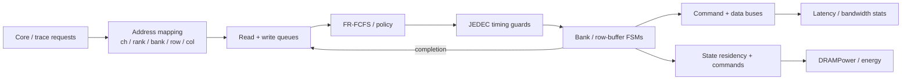

# Dynamic Random-Access Memory (DRAM) Simulators — Timing, Scheduling, and Power

> **First-time reader orientation:** A DRAM simulator applies memory command timing rules to queued requests, tracks banks and open rows, and estimates latency or bandwidth. Some tools also estimate power. A fixed trace can evaluate controller policies, but it cannot reproduce feedback in which a slower memory fills CPU queues and changes the future request stream.

> **Abbreviation key — skim now and return as needed:** central processing unit (CPU); graphics processing unit (GPU); instructions per cycle (IPC); out-of-order (OoO); reorder buffer (ROB);
> high-bandwidth memory (HBM); double data rate (DDR); level-two cache (L2); network on chip (NoC); first come, first served (FCFS);
> reliability, availability, and serviceability (RAS); finite-state machine (FSM); exclusive OR (XOR); input/output (I/O); kilobyte (KB);
> gigabyte (GB).

> **Prerequisites:** [Simulation_Methodology](../../05_Architecture_Foundations_and_Methods/05_Simulation_Methodology/01_Simulation_Methodology.md) (the event engine, trace- vs execution-driven, the queueing backbone in §7), [Memory](../../05_Architecture_Foundations_and_Methods/04_Hardware_Structures/01_Memory_Arrays_and_Technologies.md) (the 1T1C cell, sense amp, and refresh *physics* these tools abstract), [DDR_Controller](../02_Shared_Memory/01_DDR_Controller.md) (Joint Electron Device Engineering Council (JEDEC) timing, row-buffer policies, first-ready, first-come, first-served (FR-FCFS), and bandwidth math).
> **Hands off to:** [Full_Chip_Modeling](../01_System_Modeling/01_Full_Chip_Modeling.md) (how a DRAM model plugs into a perf→power→thermal chip flow), and the gem5 / GPU / accelerator pages that consume a DRAM model as their memory backend.

---

## 0. Why this page exists

For most modern workloads the memory system, not the core, sets performance — so the credibility of a whole study often rests on one component: the DRAM model. A fixed-latency memory ("every access costs 100 ns") has *no queue*, so it cannot show bandwidth saturation and is optimistic by construction ([Simulation_Methodology §7](../../05_Architecture_Foundations_and_Methods/05_Simulation_Methodology/01_Simulation_Methodology.md)). A cycle-level DRAM simulator exists to compute the one thing that model cannot: **achieved bandwidth and access latency as *outputs* of contention** for banks, buses, and the row buffer, under real JEDEC timing and a real scheduler.

**Why a constant cannot work — the error is unbounded, not merely large.** Make the flat model's failure quantitative. The device latency of one read is already a random variable set by state: $t_{CL}$ on a row hit, $t_{RCD}+t_{CL}$ on an empty bank, $t_{RP}+t_{RCD}+t_{CL}$ on a conflict (§4) — a **3× spread** ($14$ vs $42$ ns at DDR5 timings) *before any request queues*. Contention then multiplies that by the queueing factor $1/(1-\rho)$ (§8): at offered load $\rho$ the mean access obeys $\bar L \approx \bar L_{\text{svc}}/(1-\rho)$, which **diverges as $\rho\to1$**. A flat model commits to a single constant $L_0$, so its signed per-request error $L(\text{state},\rho)-L_0$ ranges over $[\,t_{CL}-L_0,\ \infty)$ — no finite $L_0$ bounds it. Concretely, calibrate $L_0$ to the *unloaded* mean $\approx 28$ ns and drive the channel to $\rho=0.85$: the true mean is $28/(1-0.85)=187$ ns, so the flat model under-reports latency by $187/28\approx 6.7\times$, and the gap grows without limit as the workload leans harder on the channel. This is why a flat model's error cannot honestly be quoted as a single "±X %": it is a *function of load* — smallest exactly where memory is idle and does not matter, largest exactly at the saturation where the study is decided. Everything below is the machinery that replaces $L_0$ with the state- and load-dependent $L$ it throws away.

This page is not a second copy of the [DDR_Controller](../02_Shared_Memory/01_DDR_Controller.md) page. That page derives the timing parameters and explains the *hardware* controller; this page explains how four simulators — **Ramulator (1.0/2.0), DRAMSim3, DRAMPower, and USIMM** — turn those same constraints into an *executable state machine* whose statistics you can trust to a known error bar. The division of labor: [Memory](../../05_Architecture_Foundations_and_Methods/04_Hardware_Structures/01_Memory_Arrays_and_Technologies.md) = device physics, [DDR_Controller](../02_Shared_Memory/01_DDR_Controller.md) = the real controller, *this page* = the model of both.

### System view — an address becomes a legal command schedule

The simulator does not assign one fixed latency to a request. It maps the address, queues it, chooses among ready commands, checks every JEDEC timing guard, mutates bank/rank/channel state, and only then records completion and energy.



---

## 1. What a DRAM simulator models — and what it deliberately doesn't

A cycle-level DRAM simulator is a **discrete-event, cycle-approximate** timing model ([Simulation_Methodology §2–3](../../05_Architecture_Foundations_and_Methods/05_Simulation_Methodology/01_Simulation_Methodology.md)). It does **not** simulate charge sharing, sense-amp settling, or bit-line voltages ([Memory §DRAM](../../05_Architecture_Foundations_and_Methods/04_Hardware_Structures/01_Memory_Arrays_and_Technologies.md)) — those are collapsed into *timing constants* (a `tRCD` of 14 ns already contains all the analog physics). What it *does* model, cycle by cycle, is:

1. the **hierarchy** channel → rank → bank-group → bank → row → column, each level a small finite-state machine;
2. the **JEDEC timing constraints** as guards that decide when the next command on each FSM is legal;
3. the **row buffer** (open/closed-page) as a per-bank one-entry cache with destructive read;
4. the **address mapping** physical-address → (channel, rank, bank, row, col);
5. the **request scheduler** (FR-FCFS and kin) that picks, each cycle, which ready command to issue.

The output is not "the latency" — it is a *distribution* of per-request latencies and an achieved bandwidth, both emergent from how those five machines interact under the offered load.

**The per-cycle work is a constraint-satisfaction problem — derive its form.** Collapse the five machines into what the engine evaluates each cycle. A candidate command $C$ (say `RD` to bank $b$) carries one precondition per JEDEC constraint that names it as the *following* command; each is a scalar deadline $\text{next\_allowed}[\text{node}][C]$ that some earlier command wrote (§2–§3). $C$ is **issuable at cycle $t$ iff its FSM state permits it and $t$ has passed every deadline**, so the earliest legal issue time is a single maximum,

$$t_{\text{issue}}(C)=\max\!\Big(t_{\text{state-ready}},\ \max_{k=1}^{K_C}\ \text{next\_allowed}_k[C]\Big),$$

where $K_C$ = number of timing guards constraining $C$, drawn from the ~15 JEDEC parameters $\{t_{RCD},t_{RP},t_{RAS},t_{RC},t_{RRD},t_{FAW},t_{WTR},t_{RTW},t_{WR},t_{CCD\_L},t_{CCD\_S},t_{CL},t_{CWL},t_{RFC},t_{REFI}\}$. Issuing $C$ then **writes those deadlines forward** for every command it constrains (an `ACT` sets $\text{next\_allowed}[b][\text{RD}]{=}t{+}t_{RCD}$, $[b][\text{ACT}]{=}t{+}t_{RC}$, and advances the rank's rolling $t_{FAW}$ window). The whole simulator is that one *max-then-write-forward* rule iterated over the command stream — the [DDR_Controller §1](../02_Shared_Memory/01_DDR_Controller.md) "constraint-satisfaction scheduler over a timed automaton" made executable. **The flat model is the degenerate $K_C=1$ with a constant deadline $t+L_0$**: it discards the $\max$, and with it every interaction the max encodes (a conflict blocked on $t_{RP}$ *and* the command bus *and* $t_{FAW}$ at once). The cost of a memory model is exactly the information in that $\max$.

**A DRAM simulator is, at bottom, a structural realization of a queueing system whose service rate is degraded by row misses, refresh, and bus turnarounds** — §8 makes that precise.

---

## 2. The bank/rank/channel hierarchy as nested state machines

Every simulator here represents the DRAM as a tree of FSMs. Ramulator makes this explicit and general: the device is a **lookup-table-based finite-state machine** where each node (rank, bank-group, bank, row) has a *state* (`Closed`, `Opened`, `Refreshing`, `PowerDown`, …) and, crucially, a **per-node table of "next-earliest-cycle" timestamps**, one entry per command type. DRAMSim3 uses a "generic parameterized DRAM bank model which takes DRAM timing and organization inputs" and instantiates the same tree per protocol.

The core loop each cycle is a **readiness check**, not a computation of latency:

```
command C on bank B is issuable at cycle t  iff
    state(B) permits C                       # FSM transition legal (e.g. RD needs Opened)
    AND t >= next_allowed[node][C]           # every JEDEC timing guard satisfied
    for every node on the path rank→bankgroup→bank
```

When a command *is* issued, the FSM (a) transitions state and (b) **pushes forward** the `next_allowed` timestamps of every command it constrains — an `ACT` sets `next_allowed[bank][RD] = t + tRCD`, `next_allowed[bank][ACT] = t + tRC`, `next_allowed[rank][ACT_4th_ago] += tFAW`, and so on. This is the same "latency is data, not control flow" idea from [Simulation_Methodology §3](../../05_Architecture_Foundations_and_Methods/05_Simulation_Methodology/01_Simulation_Methodology.md): a timing parameter is an *addend* on a scheduled deadline, which is why swapping DDR4→DDR5 is a config change, not a code change. Ramulator 2.0's headline contribution is making that config change *cheap*: DDR4's timing table dropped from **82 lines of C++ to ~32** (a 61% cut) by expressing constraints as string-literal command permutations resolved at compile time with C++20 `consteval`, so there is *no runtime cost* to the extra generality.

**How the FSM turns state into a latency — the timestamp arithmetic.** The three cost cases of §4 are not looked up; they are *computed* as a difference of scheduled timestamps, which is precisely what lets contention lengthen them. Take a `RD` that arrives at cycle $t_a$ and finds bank $b$ holding the *wrong* row (a conflict). The engine resolves the command chain by a recurrence, each step a $\max$ of "as soon as I want it" against "as soon as it is legal":

$$
\begin{aligned}
t_{\text{PRE}} &= \max\!\big(t_a,\ t_{\text{ACT}_{\text{prev}}}+t_{RAS}\big) && (\text{cannot close before the restore deadline})\\
t_{\text{ACT}} &= \max\!\big(t_{\text{PRE}}+t_{RP},\ \text{RRD/FAW guards}\big) && (\text{cannot open before precharge clears})\\
t_{\text{RD}} &= t_{\text{ACT}}+t_{RCD} && (\text{cannot read before the sense latches})\\
t_{\text{data}} &= t_{\text{RD}}+t_{CL} && (\text{column pipeline to the pins})
\end{aligned}
$$

where $t_{\text{ACT}_{\text{prev}}}$ = when the wrong row was opened. The access latency is the emergent $L=t_{\text{data}}-t_a$. When the bank is already restored and idle and nothing contends, every $\max$ takes its first argument and the chain **telescopes** to $L=t_{RP}+t_{RCD}+t_{CL}$ — recovering [DDR_Controller §2.2](../02_Shared_Memory/01_DDR_Controller.md)'s closed form as the *unloaded special case*. The simulator earns its cost in the other case: when the RRD/FAW guard or a busy command bus makes the *second* argument of a $\max$ win, $L$ grows above the closed form by exactly that contention delay — the term no paper model can see. So the 1:2:3 latencies are the floor the sim reproduces on an empty channel; everything it adds on top is contention.

**Bank/rank/channel parallelism = independent FSMs coupled only through the shared buses.** Each bank owns its state and its `next_allowed` table, so $N_b$ banks advance $N_b$ command chains *concurrently* — that is the modeled parallelism. They are not fully independent: every bank on a rank shares **one command bus** (one command per beat, `ACT`s spaced $\ge t_{RRD}$, columns spaced $\ge t_{CCD}$), and every rank on a channel shares **one data bus** (one burst at a time, plus a $t_{WTR}/t_{RTW}$ bubble on a direction change). The engine models exactly this: per-bank state is private, while three shared resources — the command bus, the data bus, and the rank-level $t_{FAW}$ counter — serialize the otherwise-parallel FSMs. This is why bank parallelism *hides* latency but cannot multiply *bandwidth* past the single data bus: overlapping many banks' $t_{RC}$ packs the bus with back-to-back bursts, but the bus still delivers one at a time. *Worked number (the sim reproduces [DDR_Controller §7.2](../02_Shared_Memory/01_DDR_Controller.md)).* One bank streaming conflicts opens a new row every $t_{RC}\approx49$ ns and delivers one $t_{\text{burst}}\approx2.5$ ns burst — bus utilization $\eta_{1\text{bank}}=2.5/49\approx5\%$. To saturate the data bus the scheduler must hold $\lceil t_{RC}/t_{\text{burst}}\rceil=\lceil49/2.5\rceil=20$ conflict chains in flight (Little's law $L=\lambda W$: service window $W=t_{RC}$, demand $\lambda=1/t_{\text{burst}}$, one chain per bank) — exactly why DDR4 gives 16 banks/rank and DDR5 gives 32. Run the sim on random traffic and the 16-bank part tops out near 40–50% while the 32-bank part approaches peak: an output a fixed-latency model, with its single bank-less server, structurally cannot produce.

---

## 3. JEDEC timing constraints as the transition guards

The timing parameters are the guards in §2. The [DDR_Controller §3](../02_Shared_Memory/01_DDR_Controller.md) page *derives* them from the device; here they are simply the numbers the FSM enforces. The load-bearing set (define at first use):

$$t_{RC} = t_{RAS} + t_{RP}$$

where $t_{RCD}$ = ACT→RD/WR (row-to-column) delay; $t_{RP}$ = PRE→ACT (row precharge) delay; $t_{RAS}$ = ACT→PRE minimum (row-active time, the sense amp must fully restore the destroyed row); $t_{RC}$ = ACT→ACT on the *same* bank (row cycle); $t_{RRD}$ = ACT→ACT on *different* banks; $t_{FAW}$ = four-activate window (no more than 4 ACTs to a rank in any rolling $t_{FAW}$, a current-draw limit); $t_{WTR}$ = internal write-to-read turnaround; $t_{WR}$ = write recovery; $t_{RFC}$ = refresh cycle time (the rank is *unavailable* during it); $t_{REFI}$ = average refresh interval (7.8 µs, halved to 3.9 µs above 85 °C).

The simulator enforces each as `next_allowed[node][following] = t_issue + t_param`. Two are structurally interesting because they are **not** a single pairwise deadline:

- **$t_{FAW}$ is a rolling window.** The model keeps a queue of the last four `ACT` timestamps on each rank and blocks a fifth until the oldest is more than $t_{FAW}$ in the past. This is what caps activate-heavy (row-thrashing) streams — you can open banks no faster than $4/t_{FAW}$ regardless of how idle the data bus is.
- **Refresh is a periodic blackout.** Every $t_{REFI}$ the refresh manager injects a `REF`; the rank's banks are all busy for $t_{RFC}$ (which grows with density — hundreds of ns at 16 Gb). Averaged, refresh steals $t_{RFC}/t_{REFI}$ of every rank's time (~3–9%); the simulator models the *bursty* reality, not the average, so it captures the latency spikes of requests that arrive mid-refresh.

**The $t_{FAW}$ window as a bandwidth rate-limiter — derive the cap.** Two guards bound the activate rate and the engine enforces the tighter. Pairwise $t_{RRD}$ spaces consecutive `ACT`s → at most $1/t_{RRD}$ opens/s; the rolling $t_{FAW}$ caps four opens per window → at most $4/t_{FAW}$. The realized ceiling is $\min(1/t_{RRD},\,4/t_{FAW})$. At DDR4-3200 ($t_{RRD\_S}\approx2.5$ ns, $t_{FAW}\approx30$ ns): $1/t_{RRD}=400$ M/s versus $4/t_{FAW}=133$ M/s, so **$t_{FAW}$ binds**, forcing an *average* `ACT` spacing of $30/4=7.5$ ns — $3\times$ wider than $t_{RRD}$ alone would permit. Turn opens into bandwidth: a conflict stream draws one fresh row (hence one BL8 $=64$ B) per `ACT`, so activate-bound traffic is capped at $133\times10^6\ \text{ACT/s}\times64\ \text{B}\approx8.5$ GB/s — **only 33% of the 25.6 GB/s data-bus peak, and independent of how fast that bus runs.** This is "$t_{FAW}$ protects the power grid" ([DDR_Controller §3](../02_Shared_Memory/01_DDR_Controller.md)) rendered in GB/s: the engine keeps a 4-deep queue of `ACT` timestamps per rank and blocks the fifth until the oldest $+\,t_{FAW}$, throttling a row-thrashing kernel to this rate *even with the data bus idle* — a ceiling only a model that carries the rolling window can report.

**The readiness time of a command is the `max` over all its guards** — the whole subtlety of DRAM performance is that these constraints overlap across banks, so the binding one shifts with the access pattern. That `max` is exactly what a fixed-latency model throws away.

---

## 4. Row-buffer management — open vs closed page

A DRAM read is *destructive*: `ACT` copies a whole row (typically 1–2 KB) into the bank's sense-amp latches — the **row buffer** — and every `RD`/`WR` then hits that buffer. The simulator tracks one open-row register per bank and classifies each incoming request ([DDR_Controller §4](../02_Shared_Memory/01_DDR_Controller.md) derives the hit-rate math; don't re-derive it):

| Case | Condition | Commands needed | Latency (read) |
|---|---|---|---|
| **Row hit** | request's row already open | `RD` | $t_{CL}$ |
| **Row empty** | bank precharged (closed) | `ACT`, `RD` | $t_{RCD}+t_{CL}$ |
| **Row conflict** | *different* row open | `PRE`, `ACT`, `RD` | $t_{RP}+t_{RCD}+t_{CL}$ |

where $t_{CL}$ (a.k.a. $t_{CAS}$) = column-access (CAS) latency. A conflict costs roughly **3×** an empty and much more than a hit — so the *page policy* the simulator models is first-order for both latency and energy:

- **Open-page**: leave the row open after an access, betting on spatial locality (next access hits). Great for streaming/row-local patterns; a *conflict* on a mispredicted stream is the worst case.
- **Closed-page (auto-precharge)**: issue `RD`/`WR` with the auto-precharge bit so the bank closes immediately. Every access pays $t_{RCD}$ but never a $t_{RP}$ conflict — better for random, low-locality access (server, GPU-scatter).
- **Adaptive / open-adaptive**: keep the row open only while a hit is queued, else precharge — the policy most real controllers and both Ramulator and DRAMSim3 can model.

The page policy is a config knob; the simulator's job is to *measure* its effect (row-buffer hit rate → effective service rate, §8), not to assume it.

---

## 5. Address mapping — physical → (channel, rank, bank, row, col)

Before any of §2–4 runs, the physical address must be sliced into coordinates. This mapping is a **first-order performance knob**, not bookkeeping: it trades **bank/channel parallelism** against **row-buffer locality**. Put the channel and bank bits *low* (just above the cache-line offset) and consecutive cache lines spray across channels/banks — maximal parallelism, low row-hit rate. Put them *high* and long runs stay in one row — maximal locality, but a hot bank serializes.

Both simulators make the mapping fully programmable. DRAMSim3 exposes "a location mapping function which allows users to input any arbitrary address-bit remapping"; Ramulator implements the address mapper as a swappable component. A representative open-page mapping, low→high bit:

```
[ column | channel | bank | bank_group | rank | row ]
```

Real controllers and these models also **XOR-hash** bank bits with row bits (`bank ^= row_bits`) to break pathological strides that would otherwise hammer one bank — the same permutation-diffusion trick GPUs use on L2 slices and NoCs use on home nodes ([Network_on_Chip](../04_On_Chip_Networks/01_Network_on_Chip.md)). Because the mapping is swappable, the simulator is the tool you use to *choose* it for a workload — a canonical DRAM-simulator study.

---

## 6. The request scheduler — FR-FCFS and its variants

Each cycle the controller model holds a queue of pending requests and must pick one *ready* command to issue. The default across essentially every DRAM simulator is **FR-FCFS — First-Ready, First-Come-First-Served** ([DDR_Controller §7.1](../02_Shared_Memory/01_DDR_Controller.md)):

1. **First-Ready**: among commands whose timing guards (§3) are satisfied *and* whose row is already open (a row hit), pick one — i.e. **prefer row hits**.
2. **FCFS** breaks ties by age (oldest request first).

FR-FCFS is a *reordering* scheduler: it will service a younger row-hit ahead of an older row-conflict because the hit is cheaper, which **raises the row-buffer hit rate and thus the effective bandwidth** (§8). That reordering is the entire reason a scheduler exists, and simulating it is the only way to know the payoff for a given stream.

**Why bandwidth is an *output*, not a dial — the realized-hit-rate derivation.** The scheduler never "sets" bandwidth; it sets the *realized* row-hit rate $h$, and $h$ fixes the effective service rate (§8). The mechanism: at any instant a bank holds one open row, and its queued requests split into would-be *hits* (same row) and *misses* (other rows). Serve a miss first and the `PRE` it forces **demotes every queued hit to a conflict** — which is exactly what arrival-order FCFS does, realizing far less locality than the stream actually contains. FR-FCFS drains all ready hits before closing the row, converting the queue's *available* locality into *realized* hits and driving $h$ toward the window's intrinsic locality. Since per-bank throughput is $1/\bar L(h)$ with $\bar L(h)=h\,t_{CL}+(1-h)(t_{RP}+t_{RCD}+t_{CL})$ linear in $h$ ([DDR_Controller §5](../02_Shared_Memory/01_DDR_Controller.md)), each point of realized $h$ is worth $t_{RP}+t_{RCD}\approx28$ ns of service — so the *same address trace* delivers different bandwidth under different schedulers, and reporting which is the simulator's whole job. That is the operational content of "achieved bandwidth is measured, not assumed": it equals $1/\bar L(h_{\text{realized}})$, and $h_{\text{realized}}$ is a property of the *ordering*, produced by running §6 over the trace — never supplied by the modeler.

Layered on top, the models also handle:

- **Read/write batching** — writes are drained in bursts because each read↔write turnaround costs bus idle ($t_{WTR}$, $t_{RTW}$); the model batches to amortize it, at the cost of latency for reads stuck behind a write drain.
- **Refresh interleave** — postpone/pull-in `REF` within the JEDEC slack window ([DDR_Controller §6](../02_Shared_Memory/01_DDR_Controller.md)) to avoid blocking a hot burst.

Ramulator 2.0 makes the scheduler (and refresh manager, and RowHammer mitigations) a **plugin** on a fixed controller: each plugin gets an `update(cmd, addr)` callback per issued command, so PARA, Graphene, Hydra, TWiCe, and friends "plug into the same baseline controller without changing its code." This is why Ramulator is the vehicle of choice for *new-mechanism* research. USIMM (§10) took the extreme version: contestants wrote **only** a `schedule()` function and the framework guaranteed timing correctness — the cleanest possible statement of "the scheduler is a policy over a fixed timing model."

---

## 7. Driving the model — trace-driven or coupled to a core

A timing model needs a request stream. There are two ways to feed a DRAM simulator, and for DRAM the *addresses and their arrival times* are the faithful stimulus, so trace-driven is sound here in a way it is **not** for a core ([Simulation_Methodology §4](../../05_Architecture_Foundations_and_Methods/05_Simulation_Methodology/01_Simulation_Methodology.md)):

- **Trace-driven (standalone).** A trace of `(cycle, R/W, physical address)` — usually already filtered through the last-level cache — is replayed into the controller. Fast, repeatable, and correct for memory-system studies because the DRAM does not feed back into which addresses exist. This is USIMM's only mode and every tool's default.
- **CPU-coupled (execution-driven).** The DRAM model is a *backend* to a core simulator, and the loop closes: a load's latency stalls the core, which changes *when* the next request arrives, which changes contention. **This feedback is why memory latency and core IPC cannot be studied independently under load.** Ramulator plugs into gem5 and ships a simple built-in out-of-order core (a small [ROB](../../01_CPU_Architecture/03_Out_of_Order_Backend/01_OoO_Execution.md) model) to generate realistic timing without a full CPU sim; DRAMSim3 integrates as the memory backend for **gem5, SST, and zSim**; both are the DRAM tier behind the [gem5](../../01_CPU_Architecture/08_Simulation/01_gem5.md) memory system.

The rule from the methodology page holds exactly: trace-driven is sound *because* the DRAM channel does not feed back into the instruction path — only into *timing*, which a trace with timestamps already carries.

---

## 8. How bandwidth and latency are computed — the queueing intuition

This is the payoff and the part people misread. **Achieved bandwidth is measured, not assumed:**

$$\text{BW}_{\text{achieved}} = \frac{\text{bytes served}}{\text{cycles} / f}, \qquad \bar{L} = \frac{1}{N}\sum_{i=1}^{N} \big(t^{\text{done}}_i - t^{\text{arrive}}_i\big)$$

where $f$ = command-clock frequency, $N$ = requests served, and each request's latency includes **queueing delay + command service**. The simulator gets these by running §2–7; there is no closed form. But the *shape* of the result is pure queueing theory, and it is worth carrying in your head.

Model the channel as a single server. Requests arrive at rate $\lambda$; the channel serves at an **effective** rate $\mu_{\text{eff}}$. Utilization $\rho = \lambda/\mu_{\text{eff}}$, and for an M/M/1-like queue the mean latency is

$$\bar{L} \;\approx\; L_{\text{service}} \cdot \frac{1}{1-\rho},$$

so latency is roughly flat at low load and **runs to the knee as $\rho \to 1$** — exactly the $\sim 1/(1-\rho)$ law of [Simulation_Methodology §7](../../05_Architecture_Foundations_and_Methods/05_Simulation_Methodology/01_Simulation_Methodology.md). The entire value of a cycle-level DRAM model is that it computes the *true* $\mu_{\text{eff}}$, which is **far below the peak data-bus rate** because every non-ideal event steals service time:

$$\mu_{\text{eff}} \;=\; \mu_{\text{peak}} \cdot \underbrace{(1 - o_{\text{refresh}})}_{t_{RFC}/t_{REFI}} \cdot \underbrace{(1 - o_{\text{turnaround}})}_{\text{rd/wr }t_{WTR}} \cdot \underbrace{g(\text{row-hit rate},\ \text{bank parallelism},\ t_{FAW})}_{\text{ACT/PRE overheads}}$$

Read this as: a row *miss* injects $t_{RCD}$ (or a conflict $t_{RP}+t_{RCD}$) of bank-busy time that no data crosses the bus for; $t_{FAW}$ throttles how fast you can open rows; refresh blacks out the rank; bus turnarounds idle the DQ lines. **So the achieved bandwidth of a random-access stream can be 30–60% of peak while a well-mapped streaming pattern reaches 80–90%** — same hardware, different $\mu_{\text{eff}}$, and *only the simulator tells you which you have.* This is also precisely why the FR-FCFS reordering of §6 matters: by lifting the row-hit rate it raises $\mu_{\text{eff}}$, which pushes the latency knee out to higher offered load — the scheduler literally buys you headroom on the $1/(1-\rho)$ curve.

**Worked number — achieved BW at low vs high row-hit rate (the two ends of the claim above).** Fold $h$ through the loss product on a DDR4-3200 channel (peak $25.6$ GB/s; refresh $\rho_{\text{ref}}=4.5\%$, turnaround $\rho_{\text{turn}}=2\%$, residual bank/FAW loss $\eta_{\text{bank}}=0.97$), using the first-order occupancy proxy $\eta_{\text{row}}(h)=t_{CL}/\bar L(h)$ from [DDR_Controller Problem 1](../02_Shared_Memory/01_DDR_Controller.md) with $t_{CL}=14$ ns and conflict $=42$ ns:

- **Random stream, $h=0.15$:** $\bar L=0.15(14)+0.85(42)=37.8$ ns → $\eta_{\text{row}}=14/37.8=0.37$; $\text{BW}=25.6\times0.37\times0.955\times0.98\times0.97\approx 8.6$ GB/s $=\mathbf{34\%}$ of peak.
- **Streaming, $h=0.95$:** $\bar L=0.95(14)+0.05(42)=15.4$ ns → $\eta_{\text{row}}=14/15.4=0.91$; $\text{BW}=25.6\times0.91\times0.955\times0.98\times0.97\approx 21.2$ GB/s $=\mathbf{83\%}$ of peak.

Same silicon and same peak, **$2.4\times$ the delivered bandwidth** purely from the realized hit rate — precisely the "$\sim$30–60% vs $\sim$80–90%" band, now derived rather than asserted. And the scheduler *moves* $h$: an FR-FCFS reordering that lifts a stream from $h=0.2$ to $0.6$ wins $\bar L(0.2)/\bar L(0.6)=36.4/25.2=1.44\times$ per-bank throughput ([DDR_Controller §5](../02_Shared_Memory/01_DDR_Controller.md)) — the payoff of §6 measured on the $1/(1-\rho)$ curve, not modeled.

The auditor's takeaway: **a memory-bound number produced by a fixed-latency model is not credible**, because that model has $\rho \equiv 0$ — it reports $L_{\text{service}}$ flat with load and misses the entire right-hand side of the curve where real systems live.

---

## 9. DRAMPower — energy as Σ(time-in-state × IDD current × voltage)

Performance and energy are separable: DRAMPower consumes a **command trace** (`cycle, command, rank, bank`) — the *same* trace a Ramulator/DRAMSim3 run emits — plus a memory spec, and returns Joules. Its model is the industry-standard **current-based (IDD) method** (Micron's DRAM power methodology, formalized by Chandrasekar et al.). The identity is simply $P = I\cdot V_{DD}$ and $E = P\cdot t$, applied per state and per command. DRAMSim3 embeds the same model to report "power on the fly," and gem5 ships DRAMPower to power its `MemCtrl`.

The **IDD taxonomy** (datasheet currents, each a state or an operation):

| Current | State / operation | Role in the model |
|---|---|---|
| $I_{DD0}$ | one bank ACT→PRE cycle | activation+precharge energy source |
| $I_{DD2N}$ / $I_{DD2P}$ | precharge standby / power-down | background, all banks closed |
| $I_{DD3N}$ / $I_{DD3P}$ | active standby / power-down | background, a row open |
| $I_{DD4R}$ / $I_{DD4W}$ | read / write burst | data-transfer energy |
| $I_{DD5B}$ | burst refresh at $t_{RFC}$ | refresh energy |
| $I_{DD6}$ | self-refresh | low-power retention |

Energy is then **time-in-state × current × voltage**, with the background subtracted out so each command is charged only its *incremental* cost. The canonical decompositions (Micron/DRAMPower form):

$$
\begin{aligned}
E_{\text{ACT+PRE}} &= \Big(I_{DD0} - \big[\,I_{DD3N}\tfrac{t_{RAS}}{t_{RC}} + I_{DD2N}\tfrac{t_{RC}-t_{RAS}}{t_{RC}}\,\big]\Big)\, V_{DD}\, t_{RC}\\[2pt]
E_{\text{RD}} &= (I_{DD4R} - I_{DD3N})\, V_{DD}\, t_{\text{burst}}, \qquad
E_{\text{WR}} = (I_{DD4W} - I_{DD3N})\, V_{DD}\, t_{\text{burst}}\\[2pt]
E_{\text{REF}} &= (I_{DD5B} - I_{DD3N})\, V_{DD}\, t_{RFC}\\[2pt]
E_{\text{bg}} &= V_{DD}\!\!\sum_{s\in\{2N,2P,3N,3P\}}\!\! I_{DD_s}\cdot t_s
\end{aligned}
$$

where $t_{\text{burst}}$ = data-burst duration and $t_s$ = cycles spent in background state $s$ (all four counted from the command trace). Total device energy is the sum over all commands plus background plus I/O and termination power (the last taken from Micron's calculator). **The whole scheme is "count exactly how long the trace kept each bank in each state, and how many of each command it issued, then multiply by the datasheet current" — activity × per-event energy, the same principle as McPAT for logic** ([Full_Chip_Modeling §1.7](../01_System_Modeling/01_Full_Chip_Modeling.md)). Its accuracy is therefore bounded by two things: the datasheet IDD values (vendor-to-vendor spread) and the fidelity of the command trace — which is why coupling DRAMPower to a *good* timing model matters.

**Why each command is charged *incrementally* — derive the subtraction.** The datasheet $I_{DD0}$ is the *average* current over one full `ACT→PRE` cycle of length $t_{RC}$, measured with the rest of the device idle — but during those same $t_{RC}$ ns the bank draws background current *anyway*: active-standby $I_{DD3N}$ while the row is open (for $t_{RAS}$) and precharge-standby $I_{DD2N}$ after it closes (for $t_{RC}-t_{RAS}$). Billing the operation the full $I_{DD0}$ would double-count that background, which $E_{\text{bg}}$ already charges against wall-clock time. So the *incremental* activate energy subtracts the time-weighted background — the bracket in $E_{\text{ACT+PRE}}$ — and identically $E_{\text{RD}}$, $E_{\text{WR}}$, $E_{\text{REF}}$ subtract $I_{DD3N}$ (a row is open during a burst or refresh). The invariant preserved is **no joule counted twice**: total energy $=E_{\text{bg}}(\text{whole run})+\sum_{\text{commands}}E_{\text{incremental}}$, and the two pieces partition the current–time integral exactly.

**Worked number — the per-event energy ladder, and why refresh and activate dominate.** Use illustrative DDR4-3200 ×8 currents at $V_{DD}=1.2$ V ($I_{DD0}=50$, $I_{DD2N}=34$, $I_{DD3N}=44$, $I_{DD4R}=160$, $I_{DD5B}=180$ mA) with $t_{RC}=49$, $t_{RAS}=35$, $t_{RFC}=350$ ns, $t_{\text{burst}}=2.5$ ns; mA × V × ns $=$ pJ:

$$
\begin{aligned}
E_{\text{ACT+PRE}} &= \big(50-[\,44\cdot\tfrac{35}{49}+34\cdot\tfrac{14}{49}\,]\big)\cdot1.2\cdot49 = 8.9\cdot1.2\cdot49 \approx \mathbf{523\ pJ}\\
E_{\text{RD}} &= (160-44)\cdot1.2\cdot2.5 \approx \mathbf{348\ pJ} \quad(\text{per 64 B} \Rightarrow 0.68\ \text{pJ/bit})\\
E_{\text{REF}} &= (180-44)\cdot1.2\cdot350 \approx \mathbf{57{,}100\ pJ} = 57\ \text{nJ}
\end{aligned}
$$

The ladder spans **two orders of magnitude**: one all-bank refresh (57 nJ) costs as much as $\approx110$ activates or $\approx164$ read bursts. Two consequences follow, and together they are why DRAM energy is *not* proportional to bytes moved.

*(i) Refresh is an unconditional floor.* A rank issues $8192$ `REF` per $64$ ms window **whether or not one access occurs**, burning $8192\times57\ \text{nJ}\approx467\ \mu$J per rank per window independent of traffic. Below $\sim\!1$ GB/s of random traffic — where activate energy ($\sim\!10^6\ \text{ACT/window}\times0.52\ \text{nJ}\approx0.52$ mJ) first overtakes it — refresh is the single largest term, and it *worsens* with density ($t_{RFC}\!\uparrow$) and heat ($t_{REFI}$ halves): the [DDR_Controller §6](../02_Shared_Memory/01_DDR_Controller.md) density tax in joules, not just cycles.

*(ii) Activate energy is gated by the row-hit rate — a $2.5\times$ lever.* Since $E_{\text{ACT+PRE}}\approx523>E_{\text{RD}}\approx348$ pJ, a *random* access that pays a full row cycle per read costs $523+348=871$ pJ, $60\%$ of it the activate. A *streaming* access amortizes one `ACT` over the $128$ column hits in an 8 KB row ($8\text{ KB}/64\text{ B}$), collapsing its activate share to $523/128\approx4$ pJ for a total $\approx352$ pJ — **$2.5\times$ cheaper per bit, entirely because open-page locality amortizes the activate away.** So the same row-hit rate that governs latency (§4) and bandwidth (§8) governs *energy*: it decides whether the expensive `ACT` fires once per access or once per 128. Refresh (unconditional) and activate (per-miss) are therefore the two terms that dominate a low-locality workload's DRAM energy — and DRAMPower's verdict swings entirely on the command trace's fidelity, since that trace fixes both the activate count and the time-in-state integral.

---

## 10. The four tools at a glance

| Tool | Paradigm | Standards | Speed (5–10 M reqs) | Validation / niche |
|---|---|---|---|---|
| **Ramulator 1.0** (CAL'15) | cycle-approx, lookup-FSM | DDR3/4, LPDDR3/4, GDDR5, WIO, HBM + academic | ~85 K req/s (random) | fastest of its era; hard to extend |
| **Ramulator 2.0** (CAL'23) | same engine, **modular/plugin** | DDR3/4/5, LPDDR5, HBM2/3, GDDR6 | ~99 K req/s (random), ~191 K (stream) | timing verified vs Micron DDR4 Verilog; the RowHammer/new-standard vehicle |
| **DRAMSim3** (CAL'20) | cycle-accurate, **thermal-capable** | DDR3/4, LPDDR3/4, GDDR5/5X, HBM, HMC | ~20% faster than DRAMSim2, ≥2× others | first validated vs **both** DDR3 *and* DDR4 Verilog; on-line thermal (§below) |
| **DRAMPower** (tukl-msd) | trace-driven **energy** model | DDR2/3/4, LPDDR, WIDE-IO | n/a (post-processes traces) | standard IDD energy engine; embedded in gem5 & DRAMSim3 |
| **USIMM** (MSC'12) | trace-driven, DDR3, ROB core | DDR3 | teaching/competition scale | Memory Scheduling Championship reference |

**What "validated" actually proves — and what it doesn't.** The last column's validation claims have a precise content: the simulator's command stream is replayed against the vendor's **cycle-accurate Verilog golden model** (Micron's DDR4 model for Ramulator 2.0; both DDR3 *and* DDR4 for DRAMSim3) and checked two ways — (a) *legality*, no issued command ever violates a JEDEC guard (the Verilog model asserts if one does), and (b) *timing agreement*, every command lands on the same cycle. Passing (a)+(b) certifies that the $\max$-of-guards engine (§1) is a faithful executable of the JEDEC state machine — it drives *model* error toward zero. It does **not** certify *workload* error: whether the trace, address map, and scheduler you chose represent the real system (the §7 provenance question). So "validated DRAM simulator" means the timing engine is exact; the achieved-BW number it emits is only as good as the stimulus — which is why the tool differences are really *fit to purpose*: Ramulator 2.0 for new-mechanism breadth (plugin scheduler/refresh/RowHammer, §6), DRAMSim3 for the perf→power→**thermal** loop (below), DRAMPower for energy sign-off (§9), USIMM for teaching the scheduler-as-policy (§10a). One JEDEC physics; a different question each answers best.

**DRAMSim3's thermal path** is its distinctive feature: it distributes each command's energy (§9) to physical die locations via an address→location map and solves the compact transient heat equation $C\,\tfrac{d\mathbf{T}}{dt} = P - G\mathbf{T}$ (equivalently $C\dot{\mathbf{T}}+G\mathbf{T}=P$) per epoch — where $\mathbf{T}$ = node-temperature vector (rise over ambient), $P$ = per-node power from §9, and $C,\,G$ = the thermal capacitance and conductance matrices of the RC network; at steady state $\dot{\mathbf{T}}=0$ gives $\mathbf{T}=G^{-1}P$ (temperature rise $\propto$ power). This closes a performance→power→temperature loop *inside* the DRAM model, the memory-side analogue of the chip-level loop in [Full_Chip_Modeling](../01_System_Modeling/01_Full_Chip_Modeling.md). It matters because $t_{REFI}$ *halves* above 85 °C, so temperature feeds back into refresh overhead and thus $\mu_{\text{eff}}$ (§8).

## 10a. USIMM in one paragraph

**USIMM (Utah SImulated Memory Module)** was released for the **Memory Scheduling Championship at ISCA-2012**. It is trace-driven, models DDR3 channels/ranks/banks with real JEDEC timing ($t_{RCD}, t_{RP}, t_{CAS}, t_{WTR}$, refresh), and — its teaching move — puts a **simple out-of-order core with a 128–160-entry [ROB](../../01_CPU_Architecture/03_Out_of_Order_Backend/01_OoO_Execution.md) per core** in front of the memory, so a scheduler's effect on *memory stalls* turns into a *system* metric (execution time), not just an average latency. The framework owns all correctness (DRAM state, timing, the Micron power model); competitors wrote only `schedule()`, choosing from the ready commands USIMM presents each cycle, under a 68 KB storage budget. It reports execution time, Energy-Delay Product, and a Performance-Fairness product. It is small and slow (~12 K req/s) and no longer state-of-the-art, but it remains the cleanest pedagogical model of "a scheduler is a policy over a fixed timing machine," and it seeded much of the scheduling literature Ramulator now hosts as plugins.

---

## Numbers to memorize

| Quantity | Value / form | Why it matters |
|---|---|---|
| Row hit / empty / conflict latency | $t_{CL}$ / $t_{RCD}+t_{CL}$ / $t_{RP}+t_{RCD}+t_{CL}$ | page policy is first-order for latency |
| Row-cycle identity | $t_{RC} = t_{RAS} + t_{RP}$ | the same-bank ACT→ACT floor |
| Four-activate window | ≤ 4 ACTs per rank per $t_{FAW}$ | caps activate-bound (row-thrash) BW |
| Refresh overhead | $t_{RFC}/t_{REFI}$ ≈ 3–9% (worse hot) | steals $\mu_{\text{eff}}$; bursty, not smooth |
| $t_{REFI}$ | 7.8 µs (3.9 µs > 85 °C) | temperature feeds back into BW |
| Achieved BW (random vs stream) | ~30–60% vs ~80–90% of peak | it is an *output*, not a spec |
| Latency-vs-load law | $\bar L \approx L_{\text{svc}}/(1-\rho)$ | why latency explodes near saturation |
| DRAM energy identity | $E=\sum(\text{time-in-state}\times I_{DD}\times V_{DD})$ | activity × per-event energy |
| FR-FCFS payoff | ↑ row-hit rate → ↑ $\mu_{\text{eff}}$ → knee moves right | why the scheduler exists |
| Ramulator 2.0 speed | ~99 K (random) / 191 K (stream) req/s | the working DRAM-sim throughput |
| Flat-model latency error | load-dependent, $\to\infty$ as $\rho\to1$ (~6.7× at $\rho{=}0.85$) | why a constant memory model is not credible (§0) |
| Issue legality | $t_{\text{issue}}=\max$ over ~15 JEDEC guards | the per-cycle constraint-satisfaction problem (§1) |
| Banks to saturate bus | $\lceil t_{RC}/t_{\text{burst}}\rceil\approx20$ | bank parallelism the sim reproduces (§2) |
| $t_{FAW}$ activate-rate cap | $4/t_{FAW}\Rightarrow\sim\!8.5$ GB/s ($\sim$33% of peak) on conflicts | rolling window as a BW rate-limiter (§3) |
| Achieved BW vs hit rate | $h{=}0.15\to$ 34%, $h{=}0.95\to$ 83% of peak | BW is an output of realized $h$ (§6, §8) |
| Per-event energy ladder | REF $\approx$ 57 nJ $\gg$ ACT+PRE $\approx$ 0.52 nJ $>$ RD $\approx$ 0.35 nJ | refresh + activate dominate (§9) |
| Row-hit rate as energy lever | streaming $\approx2.5\times$ cheaper/bit than random | open-page amortizes the activate (§9) |

---

## Cross-references

- **Down the stack:** [Memory](../../05_Architecture_Foundations_and_Methods/04_Hardware_Structures/01_Memory_Arrays_and_Technologies.md) (the 1T1C cell, sense amp, and refresh physics collapsed into these timing constants), [DDR_Controller](../02_Shared_Memory/01_DDR_Controller.md) (§2.2 the three-case FSM latencies this page *computes* as timestamp differences, §3 timing derivations + the $t_{FAW}$ power-grid physics, §4 row-buffer policy math, §5 the $\bar L(h)$ FR-FCFS payoff, §6 the refresh density tax this page re-derives in joules, §7.2 the bank-parallelism Little's law, §7.3 the loaded-latency $1/(1-\rho)$ law — this page *runs* what those sections *derive*), [OoO_Execution](../../01_CPU_Architecture/03_Out_of_Order_Backend/01_OoO_Execution.md) (the ROB whose stalls turn memory latency into system time).
- **Up the stack:** [Simulation_Methodology](../../05_Architecture_Foundations_and_Methods/05_Simulation_Methodology/01_Simulation_Methodology.md) (the event engine §3, trace-vs-execution §4, and the queueing backbone §7 this page instantiates), [gem5](../../01_CPU_Architecture/08_Simulation/01_gem5.md) (which mounts Ramulator/DRAMSim3 as its memory backend), [Full_Chip_Modeling](../01_System_Modeling/01_Full_Chip_Modeling.md) (composing the DRAM model into a perf→power→thermal chip flow; its McPAT §1.7 is the logic-side twin of the §9 activity × per-event-energy method), [Block_Activity_and_Power](../../../02_Power_and_Low_Power/02_Block_Activity_and_Power.md) (the same time-in-state × current accounting applied to logic blocks), [Root Index](../../../Index.md).
- **Sibling:** [GPU_Simulators](../../02_GPU_Architecture/04_Simulation/01_GPU_Simulators.md) (whose GDDR/HBM tier is the same kind of model, wider and hotter).

---

## References

- Kim, Yang, Mutlu. *Ramulator: A Fast and Extensible DRAM Simulator.* IEEE CAL 2015. [[pdf]](https://users.ece.cmu.edu/~omutlu/pub/ramulator_dram_simulator-ieee-cal15.pdf)
- Luo, Olgun, Yağlıkçı, et al. *Ramulator 2.0: A Modern, Modular, and Extensible DRAM Simulator.* IEEE CAL 2023. [[arXiv]](https://arxiv.org/abs/2308.11030) · [[GitHub]](https://github.com/CMU-SAFARI/ramulator2)
- Li, Yang, Reddy, Walker, Jacob. *DRAMsim3: A Cycle-Accurate, Thermal-Capable DRAM Simulator.* IEEE CAL 2020. [[pdf]](https://par.nsf.gov/servlets/purl/10216399) · [[GitHub]](https://github.com/umd-memsys/DRAMsim3)
- Chandrasekar, Weis, Li, et al. *DRAMPower: Open-Source DRAM Power & Energy Estimation Tool.* [[GitHub]](https://github.com/tukl-msd/DRAMPower)
- Micron. *TN-40-07: Calculating Memory Power for DDR4 SDRAM* (the IDD method DRAMPower implements). [[pdf]](https://www.mouser.com/pdfDocs/tn4007_ddr4_power_calculation.pdf)
- Chatterjee, Balasubramonian, et al. *USIMM: the Utah SImulated Memory Module* (Memory Scheduling Championship, ISCA 2012). [[pdf]](https://users.cs.utah.edu/~rajeev/pubs/usimm.pdf)
