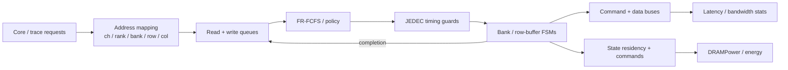
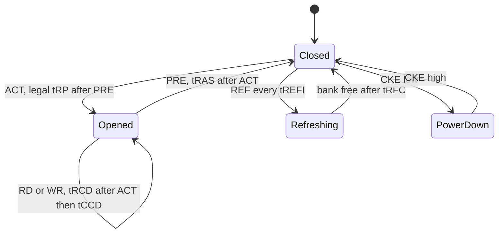
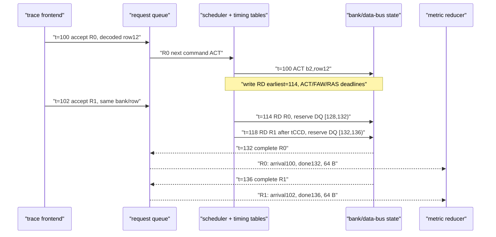

# Dynamic Random-Access Memory (DRAM) Simulators — Timing, Scheduling, and Power

> **First-time reader orientation:** A DRAM simulator applies memory command timing rules to queued requests, tracks banks and open rows, and estimates latency or bandwidth. Some tools also estimate power. A fixed trace can evaluate controller policies, but it cannot reproduce feedback in which a slower memory fills CPU queues and changes the future request stream.

> **Abbreviation key — skim now and return as needed:** central processing unit (CPU); graphics processing unit (GPU); instructions per cycle (IPC); out-of-order (OoO); reorder buffer (ROB);
> high-bandwidth memory (HBM); double data rate (DDR); level-two cache (L2); last-level cache (LLC); translation lookaside buffer (TLB); virtual address (VA); physical address (PA); network on chip (NoC); first come, first served (FCFS);
> reliability, availability, and serviceability (RAS); finite-state machine (FSM); exclusive OR (XOR); input/output (I/O); kilobyte (KB);
> gigabyte (GB).

> **Prerequisites:** [SoC/chiplet simulation methodology](../00_Design_Methodology/03_SoC_Chiplet_Simulation_Methodology_and_Evidence.md) (the discrete-event engine and queueing backbone in §3.1, trace- vs execution-driven in §3), [Memory](../00_Design_Methodology/02_SoC_Chiplet_PPA_and_Physical_Implementation.md) (the 1T1C cell, sense amp, and refresh *physics* these tools abstract), [DDR_Controller](../02_Shared_Memory/01_DDR_Controller.md) (Joint Electron Device Engineering Council (JEDEC) timing, row-buffer policies, first-ready, first-come, first-served (FR-FCFS), and bandwidth math).
> **Hands off to:** [Full_Chip_Modeling](../01_System_Modeling/01_Full_Chip_Modeling.md) (how a DRAM model plugs into a perf→power→thermal chip flow), and the gem5 / GPU / accelerator pages that consume a DRAM model as their memory backend.

---

## 0. Why this page exists

For most modern workloads the memory system, not the core, sets performance — so the credibility of a whole study often rests on one component: the DRAM model. A fixed-latency memory ("every access costs 100 ns") has *no queue*, so it cannot show bandwidth saturation and is optimistic by construction ([SoC/chiplet simulation methodology](../00_Design_Methodology/03_SoC_Chiplet_Simulation_Methodology_and_Evidence.md)). A cycle-level DRAM simulator exists to compute the one thing that model cannot: **achieved bandwidth and access latency as *outputs* of contention** for banks, buses, and the row buffer, under real JEDEC timing and a real scheduler.

**Why a constant cannot work — the error is unbounded, not merely large.** Make the flat model's failure quantitative. The device latency of one read is already a random variable set by state: $t_{CL}$ on a row hit, $t_{RCD}+t_{CL}$ on an empty bank, $t_{RP}+t_{RCD}+t_{CL}$ on a conflict (§4) — a **3× spread** ($14$ vs $42$ ns at DDR5 timings) *before any request queues*. Contention then multiplies that by the queueing factor $1/(1-\rho)$ (§8): at offered load $\rho$ the mean access obeys $\bar L \approx \bar L_{\text{svc}}/(1-\rho)$, which **diverges as $\rho\to1$**. A flat model commits to a single constant $L_0$, so its signed per-request error $L(\text{state},\rho)-L_0$ ranges over $[\,t_{CL}-L_0,\ \infty)$ — no finite $L_0$ bounds it. Concretely, calibrate $L_0$ to the *unloaded* mean $\approx 28$ ns and drive the channel to $\rho=0.85$: the true mean is $28/(1-0.85)=187$ ns, so the flat model under-reports latency by $187/28\approx 6.7\times$, and the gap grows without limit as the workload leans harder on the channel. This is why a flat model's error cannot honestly be quoted as a single "±X %": it is a *function of load* — smallest exactly where memory is idle and does not matter, largest exactly at the saturation where the study is decided. Everything below is the machinery that replaces $L_0$ with the state- and load-dependent $L$ it throws away.

This page is not a second copy of the [DDR_Controller](../02_Shared_Memory/01_DDR_Controller.md) page. That page derives the timing parameters and explains the *hardware* controller; this page explains how four simulators — **Ramulator (1.0/2.0), DRAMSim3, DRAMPower, and USIMM** — turn those same constraints into an *executable state machine* whose statistics you can trust to a known error bar. The division of labor: [Memory](../00_Design_Methodology/02_SoC_Chiplet_PPA_and_Physical_Implementation.md) = device physics, [DDR_Controller](../02_Shared_Memory/01_DDR_Controller.md) = the real controller, *this page* = the model of both.

### System view — an address becomes a legal command schedule

The simulator does not assign one fixed latency to a request. It maps the address, queues it, chooses among ready commands, checks every JEDEC timing guard, mutates bank/rank/channel state, and only then records completion and energy.


```mermaid
flowchart LR
    R["Core / trace requests"] --> A["Address mapping<br/>ch / rank / bank / row / col"]
    A --> Q["Read + write queues"]
    Q --> F["FR-FCFS / policy"]
    F --> G["JEDEC timing guards"]
    G --> B["Bank / row-buffer FSMs"]
    B --> C["Command + data buses"]
    C --> X["Latency / bandwidth stats"]
    B --> P["State residency + commands"]
    P --> E["DRAMPower / energy"]
    B -->|completion| Q
```

---

## 1. What a DRAM simulator models — and what it deliberately doesn't

A cycle-level DRAM simulator is a **discrete-event, cycle-approximate** timing model ([SoC/chiplet simulation methodology](../00_Design_Methodology/03_SoC_Chiplet_Simulation_Methodology_and_Evidence.md)). It does **not** simulate charge sharing, sense-amp settling, or bit-line voltages ([SoC/chiplet DRAM physical implementation](../00_Design_Methodology/02_SoC_Chiplet_PPA_and_Physical_Implementation.md#3-dram-1t1c-sensing-and-refresh)) — those are collapsed into *timing constants* (a `tRCD` of 14 ns already contains all the analog physics). What it *does* model, cycle by cycle, is:

1. the **hierarchy** channel → rank → bank-group → bank → row → column, each level a small finite-state machine;
2. the **JEDEC timing constraints** as guards that decide when the next command on each FSM is legal;
3. the **row buffer** (open/closed-page) as a per-bank one-entry cache with destructive read;
4. the **address mapping** physical-address → (channel, rank, bank, row, col);
5. the **request scheduler** (FR-FCFS and kin) that picks, each cycle, which ready command to issue.

The output is not "the latency" — it is a *distribution* of per-request latencies and an achieved bandwidth, both emergent from how those five machines interact under the offered load.

**The per-cycle work is a constraint-satisfaction problem — derive its form.** Collapse the five machines into what the engine evaluates each cycle. A candidate command $C$ (say `RD` to bank $b$) carries one precondition per JEDEC constraint that names it as the *following* command; each is a scalar deadline $\text{next\_allowed}[\text{node}][C]$ that some earlier command wrote (§2–§3). $C$ is **issuable at cycle $t$ iff its FSM state permits it and $t$ has passed every deadline**, so the earliest legal issue time is a single maximum,

$$t_{\text{issue}}(C)=\max\!\Big(t_{\text{state-ready}},\ \max_{k=1}^{K_C}\ \text{next\_allowed}_k[C]\Big),$$

where $K_C$ = number of timing guards constraining $C$, drawn from the ~15 JEDEC parameters $\{t_{RCD},t_{RP},t_{RAS},t_{RC},t_{RRD},t_{FAW},t_{WTR},t_{RTW},t_{WR},t_{CCD\_L},t_{CCD\_S},t_{CL},t_{CWL},t_{RFC},t_{REFI}\}$. Issuing $C$ then **writes those deadlines forward** for every command it constrains (an `ACT` sets $\text{next\_allowed}[b][\text{RD}]{=}t{+}t_{RCD}$, $[b][\text{ACT}]{=}t{+}t_{RC}$, and advances the rank's rolling $t_{FAW}$ window). The whole simulator is that one *max-then-write-forward* rule iterated over the command stream — the [DDR_Controller §1](../02_Shared_Memory/01_DDR_Controller.md) "constraint-satisfaction scheduler over a timed automaton" made executable. **The flat model is the degenerate $K_C=1$ with a constant deadline $t+L_0$**: it discards the $\max$, and with it every interaction the max encodes (a conflict blocked on $t_{RP}$ *and* the command bus *and* $t_{FAW}$ at once). The cost of a memory model is exactly the information in that $\max$.

**A DRAM simulator is, at bottom, a structural realization of a queueing system whose service rate is degraded by row misses, refresh, and bus turnarounds** — §8 makes that precise.

---

## 2. The bank/rank/channel hierarchy as nested state machines

Every simulator here represents the DRAM as a tree of FSMs. Ramulator makes this explicit and general: the device is a **lookup-table-based finite-state machine** where each node (rank, bank-group, bank, row) has a *state* (`Closed`, `Opened`, `Refreshing`, `PowerDown`, …) and, crucially, a **per-node table of "next-earliest-cycle" timestamps**, one entry per command type. DRAMSim3 uses a "generic parameterized DRAM bank model which takes DRAM timing and organization inputs" and instantiates the same tree per protocol.

A single bank *is* one such FSM — the "Bank / row-buffer FSMs" box of the §0 system view, opened up. Its states, the command that drives each transition, and the JEDEC guard (§3) that decides when the transition becomes *legal*:


```mermaid
stateDiagram-v2
    [*] --> Closed
    Closed --> Opened : ACT, legal tRP after PRE
    Opened --> Opened : RD or WR, tRCD after ACT then tCCD
    Opened --> Closed : PRE, tRAS after ACT
    Closed --> Refreshing : REF every tREFI
    Refreshing --> Closed : bank free after tRFC
    Closed --> PowerDown : CKE low
    PowerDown --> Closed : CKE high
```

Each edge is one command, and the three cost cases of §4 are just *paths* through this graph: a **row hit** is the `Opened` self-loop (pay $t_{CL}$ only); a **row-empty** access is `Closed → Opened →` self-loop (adds $t_{RCD}$); a **row conflict** is the full lap `Opened → Closed → Opened →` self-loop (adds $t_{RP}+t_{RCD}$). Closed-page auto-precharge fuses the read with its `PRE`; `PowerDown` is the idle state whose residency §9 bills for energy. The guard on each edge is exactly what the readiness check below tests.

The core loop each cycle is a **readiness check**, not a computation of latency:

```
command C on bank B is issuable at cycle t  iff
    state(B) permits C                       # FSM transition legal (e.g. RD needs Opened)
    AND t >= next_allowed[node][C]           # every JEDEC timing guard satisfied
    for every node on the path rank→bankgroup→bank
```

When a command *is* issued, the FSM (a) transitions state and (b) **pushes forward** the `next_allowed` timestamps of every command it constrains — an `ACT` sets `next_allowed[bank][RD] = t + tRCD`, `next_allowed[bank][ACT] = t + tRC`, `next_allowed[rank][ACT_4th_ago] += tFAW`, and so on. This is the same "latency is data, not control flow" idea from [SoC/chiplet simulation methodology](../00_Design_Methodology/03_SoC_Chiplet_Simulation_Methodology_and_Evidence.md): a timing parameter is an *addend* on a scheduled deadline, which is why swapping DDR4→DDR5 is a config change, not a code change. Ramulator 2.0's headline contribution is making that config change *cheap*: DDR4's timing table dropped from **82 lines of C++ to ~32** (a 61% cut) by expressing constraints as string-literal command permutations resolved at compile time with C++20 `consteval`, so there is *no runtime cost* to the extra generality.

**How the FSM turns state into a latency — the timestamp arithmetic.** The three cost cases of §4 are not looked up; they are *computed* as a difference of scheduled timestamps, which is precisely what lets contention lengthen them. Take a `RD` that arrives at cycle $t_a$ and finds bank $b$ holding the *wrong* row (a conflict). The engine resolves the command chain by a recurrence, each step a $\max$ of "as soon as I want it" against "as soon as it is legal":

$$
\begin{aligned}
t_{\text{PRE}} &= \max\!\big(t_a,\ t_{\text{ACT}_{\text{prev}}}+t_{RAS}\big) && (\text{cannot close before the restore deadline})\\
t_{\text{ACT}} &= \max\!\big(t_{\text{PRE}}+t_{RP},\ \text{RRD/FAW guards}\big) && (\text{cannot open before precharge clears})\\
t_{\text{RD}} &= t_{\text{ACT}}+t_{RCD} && (\text{cannot read before the sense latches})\\
t_{\text{data}} &= t_{\text{RD}}+t_{CL} && (\text{column pipeline to the pins})
\end{aligned}
$$

where $t_{\text{ACT}_{\text{prev}}}$ = when the wrong row was opened. The access latency is the emergent $L=t_{\text{data}}-t_a$. When the bank is already restored and idle and nothing contends, every $\max$ takes its first argument and the chain **telescopes** to $L=t_{RP}+t_{RCD}+t_{CL}$ — recovering [DDR_Controller §2.2](../02_Shared_Memory/01_DDR_Controller.md)'s closed form as the *unloaded special case*. The simulator earns its cost in the other case: when the RRD/FAW guard or a busy command bus makes the *second* argument of a $\max$ win, $L$ grows above the closed form by exactly that contention delay — the term no paper model can see. So the 1:2:3 latencies are the floor the sim reproduces on an empty channel; everything it adds on top is contention.

**Bank/rank/channel parallelism = independent FSMs coupled only through the shared buses.** Each bank owns its state and its `next_allowed` table, so $N_b$ banks advance $N_b$ command chains *concurrently* — that is the modeled parallelism. They are not fully independent: every bank on a rank shares **one command bus** (one command per beat, `ACT`s spaced $\ge t_{RRD}$, columns spaced $\ge t_{CCD}$), and every rank on a channel shares **one data bus** (one burst at a time, plus a $t_{WTR}/t_{RTW}$ bubble on a direction change). The engine models exactly this: per-bank state is private, while three shared resources — the command bus, the data bus, and the rank-level $t_{FAW}$ counter — serialize the otherwise-parallel FSMs. This is why bank parallelism *hides* latency but cannot multiply *bandwidth* past the single data bus: overlapping many banks' $t_{RC}$ packs the bus with back-to-back bursts, but the bus still delivers one at a time. *Worked number (the sim reproduces [DDR_Controller §7.2](../02_Shared_Memory/01_DDR_Controller.md)).* One bank streaming conflicts opens a new row every $t_{RC}\approx49$ ns and delivers one $t_{\text{burst}}\approx2.5$ ns burst — bus utilization $\eta_{1\text{bank}}=2.5/49\approx5\%$. To saturate the data bus the scheduler must hold $\lceil t_{RC}/t_{\text{burst}}\rceil=\lceil49/2.5\rceil=20$ conflict chains in flight (Little's law $L=\lambda W$: service window $W=t_{RC}$, demand $\lambda=1/t_{\text{burst}}$, one chain per bank) — exactly why DDR4 gives 16 banks/rank and DDR5 gives 32. Run the sim on random traffic and the 16-bank part tops out near 40–50% while the 32-bank part approaches peak: an output a fixed-latency model, with its single bank-less server, structurally cannot produce.

---

## 3. JEDEC timing constraints as the transition guards

The timing parameters are the guards in §2. The [DDR_Controller §3](../02_Shared_Memory/01_DDR_Controller.md) page *derives* them from the device; here they are simply the numbers the FSM enforces. The load-bearing set (define at first use):

$$t_{RC} = t_{RAS} + t_{RP}$$

where $t_{RCD}$ = ACT→RD/WR (row-to-column) delay; $t_{RP}$ = PRE→ACT (row precharge) delay; $t_{RAS}$ = ACT→PRE minimum (row-active time, the sense amp must fully restore the destroyed row); $t_{RC}$ = ACT→ACT on the *same* bank (row cycle); $t_{RRD}$ = ACT→ACT on *different* banks; $t_{FAW}$ = four-activate window (no more than 4 ACTs to a rank in any rolling $t_{FAW}$, a current-draw limit); $t_{WTR}$ = internal write-to-read turnaround; $t_{WR}$ = write recovery; $t_{RFC}$ = refresh cycle time (the rank is *unavailable* during it); $t_{REFI}$ = average refresh interval (7.8 µs, halved to 3.9 µs above 85 °C).

The simulator enforces each as `next_allowed[node][following] = t_issue + t_param`. Two are structurally interesting because they are **not** a single pairwise deadline:

- **$t_{FAW}$ is a rolling window.** The model keeps a queue of the last four `ACT` timestamps on each rank and blocks a fifth until the oldest is more than $t_{FAW}$ in the past. This is what caps activate-heavy (row-thrashing) streams — you can open banks no faster than $4/t_{FAW}$ regardless of how idle the data bus is.
- **Refresh is a periodic blackout.** Every $t_{REFI}$ the refresh manager injects a `REF`; the rank's banks are all busy for $t_{RFC}$ (which grows with density — hundreds of ns at 16 Gb). Averaged, refresh steals $t_{RFC}/t_{REFI}$ of every rank's time (~3–9%); the simulator models the *bursty* reality, not the average, so it captures the latency spikes of requests that arrive mid-refresh.

**The $t_{FAW}$ window as a bandwidth rate-limiter — derive the cap.** Two guards bound the activate rate and the engine enforces the tighter. Pairwise $t_{RRD}$ spaces consecutive `ACT`s → at most $1/t_{RRD}$ opens/s; the rolling $t_{FAW}$ caps four opens per window → at most $4/t_{FAW}$. The realized ceiling is $\min(1/t_{RRD},\,4/t_{FAW})$. At DDR4-3200 ($t_{RRD\_S}\approx2.5$ ns, $t_{FAW}\approx30$ ns): $1/t_{RRD}=400$ M/s versus $4/t_{FAW}=133$ M/s, so **$t_{FAW}$ binds**, forcing an *average* `ACT` spacing of $30/4=7.5$ ns — $3\times$ wider than $t_{RRD}$ alone would permit. Turn opens into bandwidth: a conflict stream draws one fresh row (hence one BL8 $=64$ B) per `ACT`, so activate-bound traffic is capped at $133\times10^6\ \text{ACT/s}\times64\ \text{B}\approx8.5$ GB/s — **only 33% of the 25.6 GB/s data-bus peak, and independent of how fast that bus runs.** This is "$t_{FAW}$ protects the power grid" ([DDR_Controller §3](../02_Shared_Memory/01_DDR_Controller.md)) rendered in GB/s: the engine keeps a 4-deep queue of `ACT` timestamps per rank and blocks the fifth until the oldest $+\,t_{FAW}$, throttling a row-thrashing kernel to this rate *even with the data bus idle* — a ceiling only a model that carries the rolling window can report.

**The readiness time of a command is the `max` over all its guards** — the whole subtlety of DRAM performance is that these constraints overlap across banks, so the binding one shifts with the access pattern. That `max` is exactly what a fixed-latency model throws away.

---

## 4. Row-buffer management — open vs closed page

A DRAM read is *destructive*: `ACT` copies a whole row (typically 1–2 KB) into the bank's sense-amp latches — the **row buffer** — and every `RD`/`WR` then hits that buffer. The simulator tracks one open-row register per bank and classifies each incoming request ([DDR_Controller §4](../02_Shared_Memory/01_DDR_Controller.md) derives the hit-rate math; don't re-derive it):

| Case | Condition | Commands needed | Latency (read) |
|---|---|---|---|
| **Row hit** | request's row already open | `RD` | $t_{CL}$ |
| **Row empty** | bank precharged (closed) | `ACT`, `RD` | $t_{RCD}+t_{CL}$ |
| **Row conflict** | *different* row open | `PRE`, `ACT`, `RD` | $t_{RP}+t_{RCD}+t_{CL}$ |

where $t_{CL}$ (a.k.a. $t_{CAS}$) = column-access (CAS) latency. A conflict costs roughly **3×** an empty and much more than a hit — so the *page policy* the simulator models is first-order for both latency and energy:

- **Open-page**: leave the row open after an access, betting on spatial locality (next access hits). Great for streaming/row-local patterns; a *conflict* on a mispredicted stream is the worst case.
- **Closed-page (auto-precharge)**: issue `RD`/`WR` with the auto-precharge bit so the bank closes immediately. Every access pays $t_{RCD}$ but never a $t_{RP}$ conflict — better for random, low-locality access (server, GPU-scatter).
- **Adaptive / open-adaptive**: keep the row open only while a hit is queued, else precharge — the policy most real controllers and both Ramulator and DRAMSim3 can model.

The page policy is a config knob; the simulator's job is to *measure* its effect (row-buffer hit rate → effective service rate, §8), not to assume it.

---

## 5. Address mapping — physical → (channel, rank, bank, row, col)

Before any of §2–4 runs, the physical address must be sliced into coordinates. This mapping is a **first-order performance knob**, not bookkeeping: it trades **bank/channel parallelism** against **row-buffer locality**. Put the channel and bank bits *low* (just above the cache-line offset) and consecutive cache lines spray across channels/banks — maximal parallelism, low row-hit rate. Put them *high* and long runs stay in one row — maximal locality, but a hot bank serializes.

Both simulators make the mapping fully programmable. DRAMSim3 exposes "a location mapping function which allows users to input any arbitrary address-bit remapping"; Ramulator implements the address mapper as a swappable component. A representative open-page mapping, low→high bit:

```
[ column | channel | bank | bank_group | rank | row ]
```

Real controllers and these models also **XOR-hash** bank bits with row bits (`bank ^= row_bits`) to break pathological strides that would otherwise hammer one bank — the same permutation-diffusion trick GPUs use on L2 slices and NoCs use on home nodes ([Network_on_Chip](../04_On_Chip_Networks/01_Network_on_Chip.md)). Because the mapping is swappable, the simulator is the tool you use to *choose* it for a workload — a canonical DRAM-simulator study.

---

## 6. The request scheduler — FR-FCFS and its variants

Each cycle the controller model holds a queue of pending requests and must pick one *ready* command to issue. The default across essentially every DRAM simulator is **FR-FCFS — First-Ready, First-Come-First-Served** ([DDR_Controller §5](../02_Shared_Memory/01_DDR_Controller.md)):

1. **First-Ready**: among commands whose timing guards (§3) are satisfied *and* whose row is already open (a row hit), pick one — i.e. **prefer row hits**.
2. **FCFS** breaks ties by age (oldest request first).

FR-FCFS is a *reordering* scheduler: it will service a younger row-hit ahead of an older row-conflict because the hit is cheaper, which **raises the row-buffer hit rate and thus the effective bandwidth** (§8). That reordering is the entire reason a scheduler exists, and simulating it is the only way to know the payoff for a given stream.

**Why bandwidth is an *output*, not a dial — the realized-hit-rate derivation.** The scheduler never "sets" bandwidth; it sets the *realized* row-hit rate $h$, and $h$ fixes the effective service rate (§8). The mechanism: at any instant a bank holds one open row, and its queued requests split into would-be *hits* (same row) and *misses* (other rows). Serve a miss first and the `PRE` it forces **demotes every queued hit to a conflict** — which is exactly what arrival-order FCFS does, realizing far less locality than the stream actually contains. FR-FCFS drains all ready hits before closing the row, converting the queue's *available* locality into *realized* hits and driving $h$ toward the window's intrinsic locality. Since per-bank throughput is $1/\bar L(h)$ with $\bar L(h)=h\,t_{CL}+(1-h)(t_{RP}+t_{RCD}+t_{CL})$ linear in $h$ ([DDR_Controller §5](../02_Shared_Memory/01_DDR_Controller.md)), each point of realized $h$ is worth $t_{RP}+t_{RCD}\approx28$ ns of service — so the *same address trace* delivers different bandwidth under different schedulers, and reporting which is the simulator's whole job. That is the operational content of "achieved bandwidth is measured, not assumed": it equals $1/\bar L(h_{\text{realized}})$, and $h_{\text{realized}}$ is a property of the *ordering*, produced by running §6 over the trace — never supplied by the modeler.

Layered on top, the models also handle:

- **Read/write batching** — writes are drained in bursts because each read↔write turnaround costs bus idle ($t_{WTR}$, $t_{RTW}$); the model batches to amortize it, at the cost of latency for reads stuck behind a write drain.
- **Refresh interleave** — postpone/pull-in `REF` within the JEDEC slack window ([DDR_Controller §6](../02_Shared_Memory/01_DDR_Controller.md)) to avoid blocking a hot burst.

Ramulator 2.0 makes the scheduler (and refresh manager, and RowHammer mitigations) a **plugin** on a fixed controller: each plugin gets an `update(cmd, addr)` callback per issued command, so PARA, Graphene, Hydra, TWiCe, and friends "plug into the same baseline controller without changing its code." This is why Ramulator is the vehicle of choice for *new-mechanism* research. USIMM (§10) took the extreme version: contestants wrote **only** a `schedule()` function and the framework guaranteed timing correctness — the cleanest possible statement of "the scheduler is a policy over a fixed timing model."

---

## 7. Driving the model — trace-driven or coupled to a core

A timing model needs a request stream. There are two ways to feed a DRAM simulator, and for DRAM the *addresses and their arrival times* are the faithful stimulus, so trace-driven is sound here in a way it is **not** for a core ([SoC/chiplet simulation methodology](../00_Design_Methodology/03_SoC_Chiplet_Simulation_Methodology_and_Evidence.md)):

- **Trace-driven (standalone).** A trace of `(cycle, read/write, physical address)` — usually already filtered through the last-level cache — is replayed into the controller. It is fast and repeatable for comparing memory policies under a fixed offered stream, but it does not by itself reproduce core throttling when memory timing changes. This is USIMM's primary stimulus style and every standalone tool supports it.
- **CPU-coupled (execution-driven).** The DRAM model is a *backend* to a core simulator, and the loop closes: a load's latency stalls the core, which changes *when* the next request arrives, which changes contention. **This feedback is why memory latency and core IPC cannot be studied independently under load.** Ramulator plugs into gem5 and ships a simple built-in out-of-order core (a small [ROB](../../01_CPU_Architecture/03_Out_of_Order_Backend/01_OoO_Execution.md) model) to generate realistic timing without a full CPU sim; DRAMSim3 integrates as the memory backend for **gem5, SST, and zSim**; both are the DRAM tier behind the [gem5](../../01_CPU_Architecture/08_Simulation/01_gem5.md) memory system.

### 7.1 Where a real DRAM request trace comes from

The full path begins much earlier than the DRAM tool:

~~~text
compiled load/store instruction
  -> dynamic effective virtual address
  -> TLB/page-table translation
  -> physical address
  -> L1 access
  -> private/shared lower-cache access
  -> LLC miss, writeback, prefetch, or coherence request
  -> memory-controller request trace
~~~

A trace captured before the cache hierarchy contains far more requests than DRAM will see. Feeding every CPU load/store directly into Ramulator invents traffic, loses writeback/coherence behavior, and can overstate bandwidth demand by orders of magnitude. A standalone DRAM trace should normally contain requests at the memory-controller boundary: physical block address, read/write type, source/core identity if needed, and an arrival cycle or inter-arrival gap.

Virtual addresses are insufficient unless the trace player reproduces address translation, because DRAM channel/bank/row mapping uses physical bits. Likewise, a read trace alone misses dirty evictions and write-drain phases; a demand-only trace misses prefetch traffic. Record the producer, trace point, cache configuration, address mapping, time unit, line/request size, and whether requests already include coherence and DMA agents.

### 7.2 What standalone replay does each cycle

At trace time $a_i$, the frontend offers request $i$ to the controller. If the finite request queue cannot accept it, the driver must define whether it retries and stalls later arrivals, buffers outside the modeled controller, or drops the request; dropping is almost never correct. Once accepted:

1. address mapping splits the physical address into channel/rank/bank-group/bank/row/column;
2. the request enters a read or write queue;
3. the scheduler searches for a request whose next command is legal now;
4. issuing the command changes bank/row state and future timing guards;
5. read/write data-bus events and completion callbacks are scheduled;
6. completion time $d_i$ is recorded and the queue entry is freed.

The raw outputs are accepted/completed requests, queue occupancy over time, command counts, row hits/conflicts, bank/channel utilization, and each $d_i-a_i$. Bandwidth and latency in §8 are reductions of those primitives.

### 7.3 The exact trace-driven validity boundary

A committed address sequence is often stable for a single-thread deterministic program, so trace replay is excellent for comparing DRAM standards, address mappings, schedulers, refresh, or RowHammer policies under the **same offered request stream**. But arrival timestamps are not automatically faithful after memory timing changes: a slower memory fills core/cache queues, which delays future misses. A fixed trace cannot reproduce that closed-loop throttling.

Therefore:

- use standalone traces for memory-service behavior and controlled offered-load comparisons;
- use a dependency-aware/core wrapper for approximate system slowdown;
- couple to a CPU/GPU/NPU model when the claim is application execution time, IPC, synchronization, or queue-feedback behavior.

The rule is narrower than “DRAM never changes the instruction path”: the address *order* may remain valid while injection *time* does not. State which one the experiment assumes fixed.

### 7.4 One replay, end to end: trace line → command events → final metrics

A concrete two-request replay shows where every reported number comes from. Assume a 1 GHz command clock, an accept-before-schedule frontend, $t_{RCD}=14$ cycles, $t_{CL}=14$, $t_{CCD}=4$, and a four-cycle data burst. Address-map function `M` produces:

~~~text
# arrival  op  physical-address  source  bytes
100        R   PA0               CPU0    64    -> M(PA0)=(ch0,r0,bg0,b2,row12,col0)
102        R   PA1               CPU0    64    -> M(PA1)=(ch0,r0,bg0,b2,row12,col8)
~~~

Bank 2 begins closed. The first line is not converted into “latency = 32” at ingestion; it becomes request record `R0={arrival=100, tuple, op, source, bytes, state=queued}`. The engine then creates and consumes events:


```mermaid
sequenceDiagram
    participant T as "trace frontend"
    participant Q as "request queue"
    participant S as "scheduler + timing tables"
    participant B as "bank/data-bus state"
    participant M as "metric reducer"
    T->>Q: "t=100 accept R0, decoded row12"
    Q->>S: "R0 next command ACT"
    S->>B: "t=100 ACT b2,row12"
    Note over S,B: "write RD earliest=114, ACT/FAW/RAS deadlines"
    T->>Q: "t=102 accept R1, same bank/row"
    S->>B: "t=114 RD R0, reserve DQ [128,132)"
    S->>B: "t=118 RD R1 after tCCD, reserve DQ [132,136)"
    B-->>Q: "t=132 complete R0"
    Q-->>M: "R0: arrival100, done132, 64 B"
    B-->>Q: "t=136 complete R1"
    Q-->>M: "R1: arrival102, done136, 64 B"
```

**From request to events.** At cycle 100 the mapper and finite queue accept `R0`. Because the bank is closed, command preparation selects `ACT`; readiness succeeds, so the event mutates `open_row[b2]=12` and writes future deadlines, notably `next_allowed[b2][RD]=114`. `R1` arrives at 102 and waits against the same state. Cycles 101–113 are not assigned arbitrary idle latency: each readiness check fails with the explicit $t_{RCD}$ guard. At 114 the scheduler issues `RD R0`, records a command event, and reserves DQ cycles 128–131. The next same-group column command is legal at 118, so `RD R1` reserves 132–135. Completion is defined here as the edge after the final beat, producing $d_0=132$ and $d_1=136$. A simulator that defines completion at first beat may emit different absolute latencies; that convention must be declared and used consistently.

**From events to the final report.** The metric reducer never infers activity from peak bandwidth. It reduces the accepted/completed ledger:

$$
L_0=d_0-a_0=32\ \text{cycles},\qquad L_1=d_1-a_1=34\ \text{cycles},\qquad \bar L=33\ \text{cycles}.
$$

The run issued one `ACT` and two `RD` commands, served 128 bytes, realized one initial row miss plus one same-row request, and occupied DQ for eight cycles. If the declared measurement region is `[100,200)` at 1 GHz, achieved bandwidth is

$$
BW=\frac{128\ \text{B}}{100\ \text{cycles}/10^9}=1.28\ \text{GB/s}.
$$

Using only the 36-cycle first-arrival-to-last-completion span would report 3.56 GB/s; neither denominator is universally right, but silently choosing the busy span discards idle demand and inflates application bandwidth. Warm-up and region-of-interest (ROI) boundaries therefore belong to the metric definition. Percentiles are computed from the same $d_i-a_i$ samples, queue delay from acceptance-to-first-command timestamps, and row-hit/command/bus counters from events—not from addresses alone. DRAMPower consumes the ordered command ledger `{ACT@100,RD@114,RD@118}` plus state-residency intervals; it cannot obtain correct activate/background energy from the original two request lines without the command expansion.

**Why the event feature is needed.** A fixed-latency baseline could return both reads 28 ns after arrival, but it would not know that one `ACT` serves both, that $t_{CCD}$ spaces their reads, that their bursts reserve one DQ bus, or which energy commands occurred. The timed bank state, per-command `next_allowed` deadlines, DQ reservation calendar, finite queues, scheduler state, completion event queue, and metric ledger are the minimum control/state that repairs those omissions. Add a competing bank, refresh, or write drain and the same maximum-of-deadlines mechanism extends the schedule rather than changing the metric formulas.

**Replay and cost boundary.** Preserve the input trace hash and trace-point provenance; simulator/code version; complete DRAM organization/timing/address-map and scheduler/refresh configuration; queue sizes and frontend full-queue behavior; clock/unit conversion; initial bank/power state; random seed/tie-breaking; warm-up/ROI/drain rules; and the metric completion convention. A short golden event digest—accepted requests, issued commands with cycle/address tuple, completions—lets another run identify the first divergence before comparing averages. Assert request conservation, no queue overflow/drop, legal state/timing for every command, nonoverlapping DQ reservations, monotonic time, completion after all beats, and exact byte/command counter reductions.

The cost is proportional to simulated time plus the scheduler's search over queued requests; coupled execution also pays the core/cache model and closes injection feedback. Full per-request logs can dwarf the simulation, so retain detailed events for debug windows and stream aggregate counters/histograms elsewhere. Trace replay wins speed and determinism but loses timing feedback when a changed memory delays future requests (§7.3); a final application-runtime claim must move to a coupled model rather than pretending a longer trace fixes that structural loss.

---

## 8. How bandwidth and latency are computed — the queueing intuition

This is the payoff and the part people misread. **Achieved bandwidth is measured, not assumed:**

$$\text{BW}_{\text{achieved}} = \frac{\text{bytes served}}{\text{cycles} / f}, \qquad \bar{L} = \frac{1}{N}\sum_{i=1}^{N} \big(t^{\text{done}}_i - t^{\text{arrive}}_i\big)$$

where $f$ = command-clock frequency, $N$ = requests served, and each request's latency includes **queueing delay + command service**. The simulator gets these by running §2–7; there is no closed form. But the *shape* of the result is pure queueing theory, and it is worth carrying in your head.

Model the channel as a single server. Requests arrive at rate $\lambda$; the channel serves at an **effective** rate $\mu_{\text{eff}}$. Utilization $\rho = \lambda/\mu_{\text{eff}}$, and for an M/M/1-like queue the mean latency is

$$\bar{L} \;\approx\; L_{\text{service}} \cdot \frac{1}{1-\rho},$$

so latency is roughly flat at low load and **runs to the knee as $\rho \to 1$** — exactly the $\sim 1/(1-\rho)$ law of [SoC/chiplet simulation methodology](../00_Design_Methodology/03_SoC_Chiplet_Simulation_Methodology_and_Evidence.md).

**Watch the knee — the flat model's error is a curve, not a constant.** Hold service at the unloaded mean $\bar L_{\text{svc}}\approx 28$ ns (§0) and read $\bar L=\bar L_{\text{svc}}/(1-\rho)$ across offered load; a flat model calibrated to that same idle mean reports 28 ns at *every* load:

| Offered load $\rho$ | Timing model $\bar L = 28/(1-\rho)$ | Flat model | Under-report |
|---|---|---|---|
| 0.30 | 40 ns | 28 ns | 1.4× |
| 0.60 | 70 ns | 28 ns | 2.5× |
| 0.85 | 187 ns | 28 ns | 6.7× |
| 0.95 | 560 ns | 28 ns | 20× |

The two agree while the channel is idle and diverge without bound exactly where a memory-bound study is decided — the §0 error argument, now a curve.

The entire value of a cycle-level DRAM model is that it computes the *true* $\mu_{\text{eff}}$, which is **far below the peak data-bus rate** because every non-ideal event steals service time:

$$\mu_{\text{eff}} \;=\; \mu_{\text{peak}} \cdot \underbrace{(1 - o_{\text{refresh}})}_{t_{RFC}/t_{REFI}} \cdot \underbrace{(1 - o_{\text{turnaround}})}_{\text{rd/wr }t_{WTR}} \cdot \underbrace{g(\text{row-hit rate},\ \text{bank parallelism},\ t_{FAW})}_{\text{ACT/PRE overheads}}$$

Read this as: a row *miss* injects $t_{RCD}$ (or a conflict $t_{RP}+t_{RCD}$) of bank-busy time that no data crosses the bus for; $t_{FAW}$ throttles how fast you can open rows; refresh blacks out the rank; bus turnarounds idle the DQ lines. **So the achieved bandwidth of a random-access stream can be 30–60% of peak while a well-mapped streaming pattern reaches 80–90%** — same hardware, different $\mu_{\text{eff}}$, and *only the simulator tells you which you have.* This is also precisely why the FR-FCFS reordering of §6 matters: by lifting the row-hit rate it raises $\mu_{\text{eff}}$, which pushes the latency knee out to higher offered load — the scheduler literally buys you headroom on the $1/(1-\rho)$ curve.

**Worked number — achieved BW at low vs high row-hit rate (the two ends of the claim above).** Fold $h$ through the loss product on a DDR4-3200 channel (peak $25.6$ GB/s; refresh $\rho_{\text{ref}}=4.5\%$, turnaround $\rho_{\text{turn}}=2\%$, residual bank/FAW loss $\eta_{\text{bank}}=0.97$), using the first-order occupancy proxy $\eta_{\text{row}}(h)=t_{CL}/\bar L(h)$ from [DDR_Controller Problem 1](../02_Shared_Memory/01_DDR_Controller.md) with $t_{CL}=14$ ns and conflict $=42$ ns:

- **Random stream, $h=0.15$:** $\bar L=0.15(14)+0.85(42)=37.8$ ns → $\eta_{\text{row}}=14/37.8=0.37$; $\text{BW}=25.6\times0.37\times0.955\times0.98\times0.97\approx 8.6$ GB/s $=\mathbf{34\%}$ of peak.
- **Streaming, $h=0.95$:** $\bar L=0.95(14)+0.05(42)=15.4$ ns → $\eta_{\text{row}}=14/15.4=0.91$; $\text{BW}=25.6\times0.91\times0.955\times0.98\times0.97\approx 21.2$ GB/s $=\mathbf{83\%}$ of peak.

Same silicon and same peak, **$2.4\times$ the delivered bandwidth** purely from the realized hit rate — precisely the "$\sim$30–60% vs $\sim$80–90%" band, now derived rather than asserted. And the scheduler *moves* $h$: an FR-FCFS reordering that lifts a stream from $h=0.2$ to $0.6$ wins $\bar L(0.2)/\bar L(0.6)=36.4/25.2=1.44\times$ per-bank throughput ([DDR_Controller §5](../02_Shared_Memory/01_DDR_Controller.md)) — the payoff of §6 measured on the $1/(1-\rho)$ curve, not modeled.

The auditor's takeaway: **a memory-bound number produced by a fixed-latency model is not credible**, because that model has $\rho \equiv 0$ — it reports $L_{\text{service}}$ flat with load and misses the entire right-hand side of the curve where real systems live.

---

## 9. DRAMPower — energy as Σ(time-in-state × IDD current × voltage)

Performance and energy are separable: DRAMPower consumes a **command trace** (`cycle, command, rank, bank`) — the *same* trace a Ramulator/DRAMSim3 run emits — plus a memory spec, and returns Joules. Its model is the industry-standard **current-based (IDD) method** (Micron's DRAM power methodology, formalized by Chandrasekar et al.). The identity is simply $P = I\cdot V_{DD}$ and $E = P\cdot t$, applied per state and per command. DRAMSim3 embeds the same model to report "power on the fly," and gem5 ships DRAMPower to power its `MemCtrl`.

The **IDD taxonomy** (datasheet currents, each a state or an operation):

| Current | State / operation | Role in the model |
|---|---|---|
| $I_{DD0}$ | one bank ACT→PRE cycle | activation+precharge energy source |
| $I_{DD2N}$ / $I_{DD2P}$ | precharge standby / power-down | background, all banks closed |
| $I_{DD3N}$ / $I_{DD3P}$ | active standby / power-down | background, a row open |
| $I_{DD4R}$ / $I_{DD4W}$ | read / write burst | data-transfer energy |
| $I_{DD5B}$ | burst refresh at $t_{RFC}$ | refresh energy |
| $I_{DD6}$ | self-refresh | low-power retention |

Energy is then **time-in-state × current × voltage**, with the background subtracted out so each command is charged only its *incremental* cost. The canonical decompositions (Micron/DRAMPower form):

$$
\begin{aligned}
E_{\text{ACT+PRE}} &= \Big(I_{DD0} - \big[\,I_{DD3N}\tfrac{t_{RAS}}{t_{RC}} + I_{DD2N}\tfrac{t_{RC}-t_{RAS}}{t_{RC}}\,\big]\Big)\, V_{DD}\, t_{RC}\\[2pt]
E_{\text{RD}} &= (I_{DD4R} - I_{DD3N})\, V_{DD}\, t_{\text{burst}}, \qquad
E_{\text{WR}} = (I_{DD4W} - I_{DD3N})\, V_{DD}\, t_{\text{burst}}\\[2pt]
E_{\text{REF}} &= (I_{DD5B} - I_{DD3N})\, V_{DD}\, t_{RFC}\\[2pt]
E_{\text{bg}} &= V_{DD}\!\!\sum_{s\in\{2N,2P,3N,3P\}}\!\! I_{DD_s}\cdot t_s
\end{aligned}
$$

where $t_{\text{burst}}$ = data-burst duration and $t_s$ = cycles spent in background state $s$ (all four counted from the command trace). Total device energy is the sum over all commands plus background plus I/O and termination power (the last taken from Micron's calculator). **The whole scheme is "count exactly how long the trace kept each bank in each state, and how many of each command it issued, then multiply by the datasheet current" — activity × per-event energy, the same principle as McPAT for logic** ([Full_Chip_Modeling §1.1](../01_System_Modeling/01_Full_Chip_Modeling.md)). Its accuracy is therefore bounded by two things: the datasheet IDD values (vendor-to-vendor spread) and the fidelity of the command trace — which is why coupling DRAMPower to a *good* timing model matters.

**Why each command is charged *incrementally* — derive the subtraction.** The datasheet $I_{DD0}$ is the *average* current over one full `ACT→PRE` cycle of length $t_{RC}$, measured with the rest of the device idle — but during those same $t_{RC}$ ns the bank draws background current *anyway*: active-standby $I_{DD3N}$ while the row is open (for $t_{RAS}$) and precharge-standby $I_{DD2N}$ after it closes (for $t_{RC}-t_{RAS}$). Billing the operation the full $I_{DD0}$ would double-count that background, which $E_{\text{bg}}$ already charges against wall-clock time. So the *incremental* activate energy subtracts the time-weighted background — the bracket in $E_{\text{ACT+PRE}}$ — and identically $E_{\text{RD}}$, $E_{\text{WR}}$, $E_{\text{REF}}$ subtract $I_{DD3N}$ (a row is open during a burst or refresh). The invariant preserved is **no joule counted twice**: total energy $=E_{\text{bg}}(\text{whole run})+\sum_{\text{commands}}E_{\text{incremental}}$, and the two pieces partition the current–time integral exactly.

**Worked number — the per-event energy ladder, and why refresh and activate dominate.** Use illustrative DDR4-3200 ×8 currents at $V_{DD}=1.2$ V ($I_{DD0}=50$, $I_{DD2N}=34$, $I_{DD3N}=44$, $I_{DD4R}=160$, $I_{DD5B}=180$ mA) with $t_{RC}=49$, $t_{RAS}=35$, $t_{RFC}=350$ ns, $t_{\text{burst}}=2.5$ ns; mA × V × ns $=$ pJ:

$$
\begin{aligned}
E_{\text{ACT+PRE}} &= \big(50-[\,44\cdot\tfrac{35}{49}+34\cdot\tfrac{14}{49}\,]\big)\cdot1.2\cdot49 = 8.9\cdot1.2\cdot49 \approx \mathbf{523\ pJ}\\
E_{\text{RD}} &= (160-44)\cdot1.2\cdot2.5 \approx \mathbf{348\ pJ} \quad(\text{per 64 B} \Rightarrow 0.68\ \text{pJ/bit})\\
E_{\text{REF}} &= (180-44)\cdot1.2\cdot350 \approx \mathbf{57{,}100\ pJ} = 57\ \text{nJ}
\end{aligned}
$$

The ladder spans **two orders of magnitude**: one all-bank refresh (57 nJ) costs as much as $\approx110$ activates or $\approx164$ read bursts. Two consequences follow, and together they are why DRAM energy is *not* proportional to bytes moved.

*(i) Refresh is an unconditional floor.* A rank issues $8192$ `REF` per $64$ ms window **whether or not one access occurs**, burning $8192\times57\ \text{nJ}\approx467\ \mu$J per rank per window independent of traffic. Below $\sim\!1$ GB/s of random traffic — where activate energy ($\sim\!10^6\ \text{ACT/window}\times0.52\ \text{nJ}\approx0.52$ mJ) first overtakes it — refresh is the single largest term, and it *worsens* with density ($t_{RFC}\!\uparrow$) and heat ($t_{REFI}$ halves): the [DDR_Controller §6](../02_Shared_Memory/01_DDR_Controller.md) density tax in joules, not just cycles.

*(ii) Activate energy is gated by the row-hit rate — a $2.5\times$ lever.* Since $E_{\text{ACT+PRE}}\approx523>E_{\text{RD}}\approx348$ pJ, a *random* access that pays a full row cycle per read costs $523+348=871$ pJ, $60\%$ of it the activate. A *streaming* access amortizes one `ACT` over the $128$ column hits in an 8 KB row ($8\text{ KB}/64\text{ B}$), collapsing its activate share to $523/128\approx4$ pJ for a total $\approx352$ pJ — **$2.5\times$ cheaper per bit, entirely because open-page locality amortizes the activate away.** So the same row-hit rate that governs latency (§4) and bandwidth (§8) governs *energy*: it decides whether the expensive `ACT` fires once per access or once per 128. Refresh (unconditional) and activate (per-miss) are therefore the two terms that dominate a low-locality workload's DRAM energy — and DRAMPower's verdict swings entirely on the command trace's fidelity, since that trace fixes both the activate count and the time-in-state integral.

---

## 10. The four tools at a glance

| Tool | Paradigm | Standards | Speed (5–10 M reqs) | Validation / niche |
|---|---|---|---|---|
| **Ramulator 1.0** (CAL'15) | cycle-approx, lookup-FSM | DDR3/4, LPDDR3/4, GDDR5, WIO, HBM + academic | ~85 K req/s (random) | fastest of its era; hard to extend |
| **Ramulator 2.0** (CAL'23) | same engine, **modular/plugin** | DDR3/4/5, LPDDR5, HBM2/3, GDDR6 | ~99 K req/s (random), ~191 K (stream) | timing verified vs Micron DDR4 Verilog; the RowHammer/new-standard vehicle |
| **DRAMSim3** (CAL'20) | cycle-accurate, **thermal-capable** | DDR3/4, LPDDR3/4, GDDR5/5X, HBM, HMC | ~20% faster than DRAMSim2, ≥2× others | first validated vs **both** DDR3 *and* DDR4 Verilog; on-line thermal (§below) |
| **DRAMPower** (tukl-msd) | trace-driven **energy** model | DDR2/3/4, LPDDR, WIDE-IO | n/a (post-processes traces) | standard IDD energy engine; embedded in gem5 & DRAMSim3 |
| **USIMM** (MSC'12) | trace-driven, DDR3, ROB core | DDR3 | teaching/competition scale | Memory Scheduling Championship reference |

**What "validated" actually proves — and what it doesn't.** The last column's validation claims have a precise content: the simulator's command stream is replayed against the vendor's **cycle-accurate Verilog golden model** (Micron's DDR4 model for Ramulator 2.0; both DDR3 *and* DDR4 for DRAMSim3) and checked two ways — (a) *legality*, no issued command ever violates a JEDEC guard (the Verilog model asserts if one does), and (b) *timing agreement*, every command lands on the same cycle. Passing (a)+(b) certifies that the $\max$-of-guards engine (§1) is a faithful executable of the JEDEC state machine — it drives *model* error toward zero. It does **not** certify *workload* error: whether the trace, address map, and scheduler you chose represent the real system (the §7 provenance question). So "validated DRAM simulator" means the timing engine is exact; the achieved-BW number it emits is only as good as the stimulus — which is why the tool differences are really *fit to purpose*: Ramulator 2.0 for new-mechanism breadth (plugin scheduler/refresh/RowHammer, §6), DRAMSim3 for the perf→power→**thermal** loop (below), DRAMPower for energy sign-off (§9), USIMM for teaching the scheduler-as-policy (§10a). One JEDEC physics; a different question each answers best.

**DRAMSim3's thermal path** is its distinctive feature: it distributes each command's energy (§9) to physical die locations via an address→location map and solves the compact transient heat equation $C\,\tfrac{d\mathbf{T}}{dt} = P - G\mathbf{T}$ (equivalently $C\dot{\mathbf{T}}+G\mathbf{T}=P$) per epoch — where $\mathbf{T}$ = node-temperature vector (rise over ambient), $P$ = per-node power from §9, and $C,\,G$ = the thermal capacitance and conductance matrices of the RC network; at steady state $\dot{\mathbf{T}}=0$ gives $\mathbf{T}=G^{-1}P$ (temperature rise $\propto$ power). This closes a performance→power→temperature loop *inside* the DRAM model, the memory-side analogue of the chip-level loop in [Full_Chip_Modeling](../01_System_Modeling/01_Full_Chip_Modeling.md). It matters because $t_{REFI}$ *halves* above 85 °C, so temperature feeds back into refresh overhead and thus $\mu_{\text{eff}}$ (§8).

## 10a. USIMM in one paragraph

**USIMM (Utah SImulated Memory Module)** was released for the **Memory Scheduling Championship at ISCA-2012**. It is trace-driven, models DDR3 channels/ranks/banks with real JEDEC timing ($t_{RCD}, t_{RP}, t_{CAS}, t_{WTR}$, refresh), and — its teaching move — puts a **simple out-of-order core with a 128–160-entry [ROB](../../01_CPU_Architecture/03_Out_of_Order_Backend/01_OoO_Execution.md) per core** in front of the memory, so a scheduler's effect on *memory stalls* turns into a *system* metric (execution time), not just an average latency. The framework owns all correctness (DRAM state, timing, the Micron power model); competitors wrote only `schedule()`, choosing from the ready commands USIMM presents each cycle, under a 68 KB storage budget. It reports execution time, Energy-Delay Product, and a Performance-Fairness product. It is small and slow (~12 K req/s) and no longer state-of-the-art, but it remains the cleanest pedagogical model of "a scheduler is a policy over a fixed timing machine," and it seeded much of the scheduling literature Ramulator now hosts as plugins.

---

## 11. Running one — from clone to a number you can defend

Everything above says what the model *is*. This section is what you execute: getting **DRAMsim3** and **Ramulator 2.0**, what each configuration field does to the answer, what a trace must contain, what the output holds, and how the same model mounts under [gem5](../../01_CPU_Architecture/08_Simulation/01_gem5.md). Two tools, not four — DRAMPower post-processes a command trace (§9) and USIMM is a teaching artifact (§10a). Every number in §11.6 and §12 came from real runs of DRAMsim3 at current `master` with `configs/DDR4_8Gb_x8_3200.ini`.

### 11.1 Getting and building

**DRAMsim3** is plain CMake with vendored dependencies (an INI reader and `fmt`); nothing is fetched from the network.

```bash
git clone https://github.com/umd-memsys/DRAMsim3.git
cd DRAMsim3 && mkdir build && cd build
cmake ..                 # add -DTHERMAL=1 for the thermal solver of §10
make -j8
```

This yields `build/dramsim3main` and `libdramsim3.so` **in the project root, not in `build/`** — which matters when another simulator links against it.

**Ramulator 2.0** is the same shape with a stricter compiler requirement; CMake fetches `yaml-cpp`, `spdlog`, and `argparse` at configure time, so the first build needs network access:

```bash
git clone https://github.com/CMU-SAFARI/ramulator2.git
cd ramulator2 && mkdir build && cd build
cmake .. && make -j
cp ./ramulator2 ../ramulator2      # the README copies the binary to the repo root
```

**Version warning, and it will bite you:** the default branch has moved to **Ramulator 2.1**, which replaced the hand-written YAML with a Python configuration API (`import ramulator`; `ramulator.dram.DDR4(...)`; `ramulator.Simulation(frontend, mem).run()`) and adds a Python ≥ 3.10 requirement. The YAML flow below is Ramulator **2.0**, what the CAL'23 paper and most published Ramulator-2 results used; check out tag `v2.0a` for exactly it. 2.1 still parses YAML, but as a machine-generated export, not a file you hand-edit.

| Symptom | Cause | Fix |
|---|---|---|
| Ramulator: errors on `consteval`, `<concepts>`, `std::span` | compiler not C++20-capable (distro `g++-9`/`g++-11`) | `cmake .. -DCMAKE_CXX_COMPILER=g++-12` (or `clang++-15`) |
| DRAMsim3 `-DTHERMAL=1`: `Could NOT find BLAS`/`OpenMP` | the thermal solver needs both | install a BLAS and an OpenMP compiler, or drop the flag |
| No `libdramsim3.so` at run time | it is emitted to the **repo root** | `LD_LIBRARY_PATH`, or `RPATH` to the repo root |
| Output silently lands in the current directory | the requested output directory did not exist | create it first — DRAMsim3 warns and falls back to `./` |

That last one is the quiet killer in a sweep: forty runs overwrite one `dramsim3.json`, and the analysis script reads the last one forty times.

### 11.2 Configuration anatomy — the DRAMsim3 `.ini`

One INI file, five groups. This is `configs/DDR4_8Gb_x8_3200.ini` — a real 8 Gb ×8 DDR4-3200 device, and the file every number in §12 came from:

```ini
[dram_structure]
protocol = DDR4
bankgroups = 4
banks_per_group = 4
rows = 65536
columns = 1024
device_width = 8
BL = 8

[timing]
tCK = 0.63
AL = 0
CL = 22
CWL = 16
tRCD = 22
tRP = 22
tRAS = 52
tRFC = 560
tREFI = 12480
tRRD_S = 4
tRRD_L = 8
tWTR_S = 4
tWTR_L = 12
tFAW = 34
tWR = 24
tRTP = 12
tCCD_S = 4
tCCD_L = 8
tCKE = 8
tXS = 576
tXP = 10
tRTRS = 1

[power]
VDD = 1.2
IDD0 = 57
IDD2P = 25
IDD2N = 37
IDD3P = 43
IDD3N = 52
IDD4W = 150
IDD4R = 168
IDD5AB = 250
IDD6x = 30

[system]
channel_size = 16384
channels = 1
bus_width = 64
address_mapping = rochrababgco
queue_structure = PER_BANK
refresh_policy = RANK_LEVEL_STAGGERED
row_buf_policy = OPEN_PAGE
cmd_queue_size = 8
trans_queue_size = 32

[other]
epoch_period = 1587301
output_level = 1
```

**Every timing value is in DRAM clock cycles except `tCK`, which is in nanoseconds.** That one convention causes most first-week errors: `tRCD = 22` means $22\times0.63 = 13.9$ ns, and copying `tRCD = 14` from a datasheet's nanosecond column silently builds a device 60% faster than any part that has shipped.

**Derived quantities you never type but must be able to compute:**

$$
\begin{aligned}
\text{request\_size} &= \tfrac{\text{bus\_width}}{8}\times \text{BL} = 64\ \text{B} \Rightarrow \text{shift\_bits}=6, &
\text{banks/rank} &= 4\times4 = 16,\\
\text{row size} &= \tfrac{1024\times 8}{8}\times \tfrac{64}{8} = 8\ \text{KB}, &
\text{rank size} &= 8\ \text{KB}\times 65536\times 16 = 8\ \text{GB},\\
\text{ranks} &= \tfrac{16384\ \text{MB}}{8192\ \text{MB}} = 2, &
\text{peak BW} &= 8\ \text{B}\times\tfrac{2}{0.63\ \text{ns}} = 25.4\ \text{GB/s}.
\end{aligned}
$$

**`ranks` is not a config key** — it is inferred from `channel_size` over the device geometry, and a `channel_size` below one rank makes DRAMsim3 warn and *silently enlarge the channel*, so a run you believed was 4 GB is 8 GB. And this part's peak is 25.4 GB/s, not the nominal 25.6, because `tCK = 0.63` ns is 3175 MT/s: **compute peak from `tCK`, never from the file name.**

| Field | Governs | A wrong value produces |
|---|---|---|
| `protocol` | command set, bank-group rules, refresh model | DDR4 timings under DDR3 drops bank groups — $t_{CCD\_L}$ vanishes and column bandwidth is over-reported |
| `CL`, `tRCD`, `tRP`, `tRAS` | the three-case latencies of §4 | the distribution shifts; a small `tRAS` shrinks `tRC` and inflates single-bank throughput (§12) |
| `tCCD_S` / `tCCD_L` | column spacing across / within a bank group | the *streaming* ceiling: at `tCCD_L = 8`, one 64 B burst per 8 cycles caps one bank group at $64/(8\times0.63) = 12.7$ GB/s — half of peak on a perfectly row-local stream |
| `bankgroups`, `banks_per_group` | how many independent command chains exist | fewer banks lowers saturation; §2's $\lceil t_{RC}/t_{\text{burst}}\rceil\approx20$ is the target |
| `rows`, `columns`, `device_width`, `BL`, `bus_width` | row size, request size, peak, address-field widths | changes *which* address bits are the bank bits — silently changing the experiment in §12 |
| `address_mapping` | the physical→coordinate slice of §5 | **§12 measures a 13.6× bandwidth swing from this field alone** |
| `row_buf_policy` | `OPEN_PAGE` or `CLOSE_PAGE` (§4) | inverts the sign of the locality effect; `CLOSE_PAGE` always pays $t_{RCD}$, never $t_{RP}$ |
| `cmd_queue_size`, `trans_queue_size` | how far ahead the scheduler can see | **the most under-reported confound in DRAM studies** — §12 measures 1.8× on a sequential stream from `trans_queue_size` alone |
| `refresh_policy` | rank-simultaneous / rank-staggered / bank-staggered | simultaneous blacks out every rank at once and exaggerates the latency tail |

DRAMsim3 has no scheduling-policy key: the controller is FR-FCFS (§6) by construction, which is why a scheduler study belongs in Ramulator.

**Reading the `address_mapping` string.** Exactly twelve characters: six two-character fields from `ch`, `ra`, `bg`, `ba`, `ro`, `co`, **most-significant field first**, with bit positions assigned from the right-hand end upward after shifting off the `shift_bits` byte-select bits. For this configuration `rochrababgco` means:

```text
 bit 33 ................................. 18 17  16 15  14 13  12 ......... 6  5 .. 0
[            row  (16 bits)                ][ra][ bank  ][bankgrp][ column (7) ][ byte ]
        ch has zero width here (channels = 1) and occupies no bits
```

The column field is only $\log_2(\text{columns})-\log_2(BL) = 10-3 = 7$ bits, the low three column bits being consumed by the burst. So a 64 B request walks 128 columns — 8 KB, one row — before crossing into the next bank group at bit 13. **Every stride result in §12 follows from that bit table**, which is why writing it out is the first thing to do with a new configuration. DRAMsim3's mapping is a pure bit-slice with no XOR hashing; for §5's `bank ^= row_bits` permutation you must add it, or use a tool that ships one (Ramulator's `MOP4CLXOR`).

### 11.3 Configuration anatomy — the Ramulator 2.0 YAML

Ramulator's configuration is a component *tree*: each node names an interface and the `impl` that realizes it (§11.8), so the file is simultaneously the parameters and the object graph. This is `example_config.yaml` at tag `v2.0a`:

```yaml
Frontend:
  impl: SimpleO3
  clock_ratio: 8
  num_expected_insts: 500000
  traces:
    - example_inst.trace

  Translation:
    impl: RandomTranslation
    max_addr: 2147483648

MemorySystem:
  impl: GenericDRAM
  clock_ratio: 3

  DRAM:
    impl: DDR4
    org:
      preset: DDR4_8Gb_x8
      channel: 1
      rank: 2
    timing:
      preset: DDR4_2400R

  Controller:
    impl: Generic
    Scheduler:
      impl: FRFCFS
    RefreshManager:
      impl: AllBank
    RowPolicy:
      impl: ClosedRowPolicy
      cap: 4
    plugins:

  AddrMapper:
    impl: RoBaRaCoCh
```

- **`Frontend: impl`** — the stimulus generator. `SimpleO3` is a small out-of-order core with an LLC in front of memory (defaults 4 IPC, 128-entry window, 2 MB LLC, 16 MSHRs/core), so it consumes an *instruction* trace and emits a *filtered* request stream; `LoadStoreTrace` and `ReadWriteTrace` replay flat traces with no core model. Picking a flat frontend when you meant `SimpleO3` deletes the cache filter and the window, and you simulate a stream the machine would never emit (§7.1).
- **`clock_ratio` — the field that silently rescales everything.** There are two, and together they give the core:memory frequency ratio ($8{:}3$ here). A wrong value raises no error; it builds a machine whose core is 2.7× off, changing offered load, hence $\rho$, hence every latency through §8's $1/(1-\rho)$. **When a coupled result looks implausible, check this first.**
- **`org: preset`** — `DDR4_8Gb_x8` is an 8 Gb die, ×8 DQ, (1 channel, 1 rank, 4 bank groups, 4 banks/group, $2^{16}$ rows, $2^{10}$ columns). Fields beneath the preset override it. Unlike DRAMsim3, rank count is **explicit, not derived**.
- **`timing: preset`** — the **speed bin**, the field most often set carelessly: `DDR4_2400R` is 2400 MT/s at CL-nRCD-nRP = 16-16-16, `DDR4_3200AA` is 3200 MT/s at 22-22-22. A preset is the vector `rate, nBL, nCL, nRCD, nRP, nRAS, nRC, nWR, nRTP, nCWL, nCCDS, nCCDL, nRRDS, nRRDL, nWTRS, nWTRL, nFAW, nRFC, nREFI, nCS, tCK_ps`; any name in it can be overridden individually beneath the preset, which is how you sweep one constraint (the README sweeps `nRCD` over `[10, 15, 20, 25]`). Setting `rate` while a preset is active is a configuration *error*, since it would leave `tCK` and the cycle-denominated constraints inconsistent.
- **`Controller: impl: Generic`** — the fixed, timing-correct controller; everything policy-shaped hangs off it: `Scheduler` (`FRFCFS`, `BlockingScheduler`, `BLISS`, …), `RefreshManager` (`AllBank`), `RowPolicy` (`OpenRowPolicy` / `ClosedRowPolicy`, whose `cap` bounds consecutive row hits before the row closes anyway — the anti-starvation knob), and `plugins:` (§11.8). Write-drain watermarks (`wr_low_watermark` / `wr_high_watermark`, defaults 0.2 / 0.8) expose §6's batching.
- **`AddrMapper: impl`** — `ChRaBaRoCo`, `RoBaRaCoCh` (the usual default), or `MOP4CLXOR`, the XOR-hashed variant of §5. Ramulator names mappings rather than spelling out bit fields, so §11.2's bit table becomes a one-line lookup — but you still have to write it out to reason about a stride.

Ramulator 2.0 also accepts the whole YAML document **as a command-line string**: a Python driver loads the base file with `yaml.safe_load`, mutates `config["MemorySystem"]["DRAM"]["timing"]["nRCD"]`, and passes the serialized dict as `argv[1]`. No temporary files, and the swept value lives in the driver rather than in forty near-identical configs.

### 11.4 Trace formats — what the file must actually contain

**DRAMsim3's memory trace** is one request per line, whitespace-separated, in the order *address, operation, arrival cycle*:

```text
0x2000D5C0 READ   30
0x1FF96FC0 WRITE  160
0x2000D600 READ   165
```

The address is hexadecimal and **physical**. The operation counts as a write only if it is `WRITE`, `write`, `P_MEM_WR`, or `BOFF`, and **as a read otherwise** — a typo in that field silently becomes a read rather than an error. The third field is the arrival cycle in **memory clock cycles**, and its semantics matter: the driver holds one pending transaction, offers it once the clock reaches `added_cycle`, and if the queue is full retries later while **holding the rest of the trace behind it**. Timestamps are a *lower bound* on injection, not a schedule. Set them all to `0` and you have a closed-loop saturating driver — what §12 wants for a bandwidth question, and what you must not use for a latency question (§11.6). Two synthetic generators need no trace at all: `-s random` (uniform addresses, one third writes, full rate) and `-s stream` (a three-array stream-add with high row locality).

**Ramulator 2.0's three trace forms**, each bound to a frontend:

```text
# SimpleO3  —  <non-memory-instruction count> <load address> [<store address>], decimal
3 20734016
1 20846400
8 20841280 20841280

# LoadStoreTrace  —  LD|ST <address>, hex with 0x or decimal
LD 0x2000D5C0
ST 0x1FF96FC0

# ReadWriteTrace  —  R|W <comma-separated coordinate vector>
R 0,0,1,2,4096,0
```

The `SimpleO3` form matters most, and its first field is what makes it more than a replay: the count of **non-memory instructions before this memory instruction**, so the core consumes the trace at its issue width, fills its window, and stalls when a load's result is needed — how a trace-driven run reproduces *part* of the injection feedback a fixed timestamp cannot (§7.3). `ReadWriteTrace` names the coordinate vector directly and so bypasses the address mapper: a unit-test instrument, not a workload format. **All three frontends wrap to the start of the trace at the end**, so a short trace does not end the run; it becomes a periodic workload with a near-perfect row-hit rate on the second lap.

**Producing a trace from a real program**, in increasing fidelity. `valgrind --tool=lackey --trace-mem=yes ./prog` gives every fetch, load, and store at zero setup and ~100× slowdown, but with **virtual** addresses and **no cache filtering** — the raw top of §7.1's pipeline, needing both repairs below; **Intel Pin**'s `pinatrace` example tool is the same content, faster. **DynamoRIO's `drcachesim`/`drmemtrace`** (`drrun -t drcachesim -offline -- ./prog`) is the useful one, because it can run the stream through a *simulated cache hierarchy* and emit the misses — §7.1's LLC filter done for you, and the difference between the right request count and one that overstates DRAM traffic by an order of magnitude ([Cache_Microarchitecture](../../01_CPU_Architecture/04_Cache_Hierarchy/01_Cache_Microarchitecture.md)). Highest fidelity is **a gem5 memory-trace probe**: a `CommMonitor` on the port between the last-level cache and the memory controller, carrying a `MemTraceProbe` with a `trace_file`. Its output sits exactly at the memory-controller boundary — physical addresses, writebacks, and prefetches included, produced by the machine that will later consume it.

**Trap 1 — virtual addresses where the model expects physical.** Every mapping in §5 slices *physical* bits. Replaying virtual addresses as physical gives the bank and row distribution of the *virtual* layout, nearly contiguous for a large heap: row-hit rate over-estimated and bank conflicts under-estimated, **in the optimistic direction**, by an amount set by the page size and the allocator rather than by anything about the memory system. Two honest repairs: capture physical addresses (a gem5 probe, or a kernel-assisted tracer), or apply an explicit page-granularity translation and *say so* — Ramulator's `RandomTranslation` is exactly this, and randomizing frames is a *conservative* model of a fragmented system, not a neutral one. Feeding virtual addresses through `NoTranslation` and reporting a row-hit rate is never acceptable ([TLB_and_Virtual_Memory](../../01_CPU_Architecture/05_Virtual_Memory/01_TLB_and_Virtual_Memory.md)).

**Trap 2 — timestamps that cannot respond to the change you are studying.** §7.3, operationally. A trace carries arrival cycles captured under *one* memory configuration; change the mapping, the speed bin, or the scheduler and the real machine's future arrivals move, because a slower memory backs up the miss-status registers and the instruction window. A fixed-timestamp trace cannot. The error is directional: **the replay over-states the offered load of whichever configuration you made slower**, exaggerating the queueing term and reporting a worse result than the closed-loop machine would. Three defensible responses, in order of cost: make the load explicitly saturating and report **achieved bandwidth at saturation**, which does not pretend to be application throughput (§12 does this); use a dependency-aware frontend (`SimpleO3`); or couple to a full core model (§11.7) when the claim is runtime or IPC. State which. "We replayed a trace" is not a method; "we replayed a trace at saturation and report achieved bandwidth, not runtime" is.

### 11.5 Running standalone

```bash
mkdir -p run0
./build/dramsim3main configs/DDR4_8Gb_x8_3200.ini -s random -c 200000 -o run0
./build/dramsim3main configs/DDR4_8Gb_x8_3200.ini -c 200000 -t /abs/path/trace.txt -o run1
./ramulator2 -f ./example_config.yaml
```

DRAMsim3's flags are few: the configuration file is a **positional** argument; `-c/--cycles` is the run length **in DRAM clock cycles** (default 100000) and is the *only* termination condition — the run does not stop when the trace ends; `-t/--trace` selects trace mode and overrides `-s/--stream` (`random` or `stream`); `-o/--output-dir` sets the output directory; `-h` prints the list.

Three files land there (prefix `dramsim3`, settable as `output_prefix` in `[other]`): **`dramsim3.txt`**, the human-readable end-of-run report, one line per counter per channel; **`dramsim3.json`**, the same counters as JSON keyed by channel id, containing *strictly more* than the text file (§11.6); and **`dramsim3epoch.json`**, a JSON *array* of per-epoch snapshots, one per `epoch_period` cycles — the time series, and how you separate warm-up from steady state without guessing. `scripts/plot_stats.py` renders either JSON file with matplotlib.

### 11.6 Reading the output — which numbers you may quote

The real end-of-run report from one of §12's runs (mapping `rochrababgco`, 8 KB-stride read trace, 200000 cycles), trimmed to the load-bearing lines:

```text
num_cycles                     =       200000   # Number of DRAM cycles
num_reads_done                 =        35894   # Number of read requests issued
num_writes_done                =            0
num_read_row_hits              =            0   # Number of read row buffer hits
num_act_cmds                   =        35975   # Number of ACT commands
num_pre_cmds                   =        35964   # Number of PRE commands
num_ref_cmds                   =           32   # Number of REF commands
rank_active_cycles.0           =       189211   # Cycles of rank active rank.0
all_bank_idle_cycles.0         =        10789   # Cycles of all banks idle rank.0
read_latency[60-79]            =         3726   # Read request latency (cycles)
read_latency[100-119]          =         6461
read_latency[200-]             =         7613
act_energy                     =  2.41752e+08   # Activation energy
read_energy                    =  1.59904e+08   # Read energy
ref_energy                     =  3.40623e+07   # Refresh energy
act_stb_energy.0               =  9.44541e+07   # Active standby energy rank.0
average_read_latency           =       459.05   # Average read request latency (cycles)
total_energy                   =  6.32332e+08   # Total energy (pJ)
average_power                  =      3161.66   # Average power (mW)
average_bandwidth              =      18.2319   # Average bandwidth
```

**Row hits, misses, conflicts.** `num_read_row_hits = 0` against 35894 reads: **every access was a miss** — §12's whole finding in one line, because the stride steps exactly one row per request. Cross-check `num_act_cmds = 35975 ≈ num_reads_done`: one activate per read is the arithmetic signature of zero locality. The opposite signature, from the sequential run in the same matrix, is 33191 reads against **282** activates — 118 reads per activate, close to the 128 requests an 8 KB row holds. **Always read the ACT count next to the hit count**; they are redundant by construction, and when they disagree your address-map mental model is wrong.

**Bank and rank utilization.** `rank_active_cycles` and `all_bank_idle_cycles` sum to `num_cycles` per rank ($189211+10789=200000$). "Active" means *at least one bank has a row open*, not that the data bus is busy — so a 94.6% active fraction beside a 70% bandwidth number is no contradiction. It is a *power* input (§9), the residency that multiplies $I_{DD3N}$; reading it as utilization is a common and expensive mistake.

**Bandwidth.** `average_bandwidth = 18.23` GB/s is $(\text{reads}+\text{writes})\times\text{request\_size}/(\text{num\_cycles}\times t_{CK}) = 35894\times64\ \text{B}/(200000\times0.63\ \text{ns})$, i.e. 71.8% of this part's 25.4 GB/s peak. The denominator is the **whole run**, idle cycles included — §7.4's measurement-window choice, made for you. Right for a saturating driver; wrong for a bursty trace with long gaps, where it reports the application's average *demand* rather than the memory system's *capability*.

**Latency, and the trap in it.** `average_read_latency = 459.05` cycles $=289$ ns is **not** a device latency and must never be quoted as one: this driver offered requests as fast as the queue accepted them, so it is overwhelmingly queueing delay at $\rho\to1$ (§8) — a property of the *stimulus*. The device contribution shows only at low load. The same configuration with arrivals spaced 400 cycles apart ($\rho\approx0.12$) gives a histogram whose mode is **49 cycles for 93% of requests**, against the closed-form row-empty prediction $t_{RCD}+t_{CL}+\text{BL}/2 = 22+22+4 = 48$ cycles, the extra cycle being the completion convention (§7.4). **That agreement is the check that the timing engine does what §2–§4 say**, and it is the number you may quote as an unloaded latency. The remaining 7% of those sparse requests land at 247, 324, 403, and 483 cycles — arrivals that waited out part of a $t_{RFC}=560$ refresh. Refresh as a *bursty blackout* rather than a smooth 4.5% tax (§3), measured rather than asserted.

**Tail latency, and why you must read the JSON.** The `.txt` report bins read latency into ten buckets and dumps everything past 200 cycles into `read_latency[200-]` — here 7613 of 35894 requests, 21% of the distribution, unresolvable, so no p99 can be computed from it. **The JSON's `read_latency` key holds the full unbucketed histogram**, one entry per distinct latency value, so percentiles are a five-line script: p50 = 141, p95 = 3656, p99 = 4783, max = 5392 cycles. That 34× p50-to-p99 ratio is the signature of a saturated queue, and it is invisible in the text summary.

**Energy, by component.** The energy lines are §9's decomposition, already separated: `act_energy` is $E_{\text{ACT+PRE}}$ (38% of the total here), `read_energy` is $E_{\text{RD}}$ (25%), `ref_energy` is $E_{\text{REF}}$ (5%), and `act_stb_energy` + `pre_stb_energy` are $E_{\text{bg}}$ (30%); `total_energy` is their sum, $6.32\times10^8$ pJ, all in picojoules. Activation dominates because the row-hit rate is zero — §9's lever, measured; the sequential run on the same device spends almost nothing on activates. DRAMsim3 uses the same incremental subtraction §9 derives (`act_energy_inc = VDD*(IDD0*tRC - (IDD3N*tRAS + IDD2N*tRP))*devices`), so "no joule counted twice" holds and the components may be added.

**One unit trap to carry.** `average_power` is `total_energy / num_cycles` — **picojoules per DRAM cycle**, *labeled* mW. It is milliwatts only when $t_{CK}=1$ ns. Here the true average power is $3161.66\ \text{pJ/cycle} \div 0.63\ \text{ns} = 5018$ mW, not 3162. (Two lesser blemishes: `num_writes_done`'s description string reads "Number of read requests issued", a copy-paste artifact; and `num_read_cmds` counts *commands* while `num_reads_done` counts *completed requests*, so they differ by whatever is in flight at the end.)

**Trustworthy versus artifact — the rule.** Command counts, row hit/miss/conflict counts, energy components, and state residencies are properties of the *model*, trustworthy to the fidelity of the timing engine — what "validated against the Verilog model" (§10) certifies. Bandwidth, mean latency, tail latency, and queue occupancy are properties of the *stimulus crossed with* the model. The dividing question: **would this number change if I changed only the driver?** If yes, the driver is part of the claim and must be reported with it.

### 11.7 Coupling to gem5 — and the other DRAM model already in there

DRAMsim3 ships as a gem5 memory controller: a `DRAMsim3` SimObject inheriting `AbstractMemory`, so it attaches to the memory port like any other memory and takes two parameters.

```python
system.mem_ctrls = [DRAMsim3(
    range      = system.mem_ranges[0],
    configFile = "ext/dramsim3/DRAMsim3/configs/DDR4_8Gb_x8_3200.ini",
    filePath   = "ext/dramsim3/DRAMsim3/")]
```

Through the standard configuration scripts this is `--mem-type=DRAMsim3`; gem5's `--mem-type` takes the SimObject *class name*, so the string is case-sensitive, and DRAMsim3's own README shows the lower-case `--mem-type=dramsim3` used by the **forked** gem5 its authors maintain. `filePath` is prepended to `configFile` because DRAMsim3 resolves paths relative to the invocation directory. The hand-off is §7's library boundary: gem5 sends physical addresses and read/write type through the port; DRAMsim3 owns the queue, mapping, scheduler, and timing, and returns a completion callback gem5 turns into a response packet. gem5 ticks it from the memory clock domain, so the domains must be declared consistently — §11.3's `clock_ratio` hazard in another notation.

Ramulator 2.0 attaches as a library: build `libramulator.so`, place it under `gem5/ext/ramulator2/`, add an `SConscript` that puts it on the link line, install the `Ramulator2` SimObject wrapper (shipped under `resources/gem5_wrappers/`), and point `config_path` at your YAML. The step people forget is inside the YAML: **`Frontend: impl` must be the gem5 external-wrapper frontend**, not `SimpleO3`, or two cores generate traffic and the trace frontend fights gem5 for the memory system.

**gem5 already has its own DRAM model, and it is not the same model.** Its internal path is `MemCtrl` (queues, scheduler, write drain) plus `DRAMInterface` (device state machine and JEDEC timing), configured from named device classes — `DDR4_2400_8x8`, `DDR5_6400_4x8`, `HBM_2000_4H_1x64` — each carrying `tRCD`, `tCL`, `tRP`, `tBURST`, `page_policy` (`open`, `open_adaptive`, `close`, `close_adaptive`), `addr_mapping` (`RoRaBaChCo`, `RoRaBaCoCh`, `RoCoRaBaCh`), and `mem_sched_policy` (`fcfs`, `frfcfs`). `--mem-type=DDR4_2400_8x8` uses this model; `--mem-type=DRAMsim3` replaces it wholesale.

Use **gem5's internal `MemCtrl`** when memory is *present but not the subject*: you need a credible, contended, JEDEC-timed backend so IPC is not fantasy, but the study is about the core, the caches, or the interconnect. It is faster, needs no external dependency, and its statistics land in the same `stats.txt`. Use **DRAMsim3 or Ramulator** when memory *is* the subject: a DRAM standard stock gem5 does not model, a scheduler or refresh policy you are proposing, a RowHammer mitigation (§11.8), a thermal-coupled refresh study (§10), or any claim needing the Verilog-validated engine.

**Why they disagree.** Run the same workload through both at nominally the same speed bin and the bandwidth and mean latency differ — commonly by several percent, more under contention. The causes are structural, not bugs: **different queue structure** (gem5 has one read and one write queue per controller with watermark-driven drain; DRAMsim3 has a transaction queue feeding per-bank command queues — and §11.2 flags queue depth as worth up to 1.8×); **different address-mapping defaults** (`RoRaBaChCo` and `rochrababgco` are not the same slice, and §12 measures 13.6× between two mappings); **different refresh modeling**, which moves the height and shape of the tail; **different controller front-end latency**, since gem5 charges an explicit static front-end and back-end pipeline delay on top of device timing; and **different completion conventions**, worth $\text{BL}/2$ cycles per request (§7.4). The rule that follows: **never compare a gem5-internal number against a DRAMsim3 number and call the difference a result.** If you switch memory models mid-study, re-baseline everything, and report model, version, configuration file, and completion convention — the [evidence standard](../../../Research_Depth_and_Evidence_Standard.md)'s simulator-result contract asks for exactly that chain.

### 11.8 Ramulator 2.0's plugin model

Ramulator rather than DRAMsim3 is the vehicle for most new-mechanism papers because of one decision: **the controller is fixed and correct, and a mechanism is a plugin that observes it.** A controller plugin implements `IControllerPlugin` and gets a callback for **every command the controller issues**, carrying the command type and the full address vector (channel, rank, bank group, bank, row, column). From that one hook a mechanism can count activates per row, maintain a frequency table, inject a command, or throttle a requester — without touching the scheduler, the timing tables, or the DRAM state machine, and so without the risk that its "improvement" is really a timing bug. Ramulator 2.0 ships the RowHammer literature on that hook (`para`, `twice`, `graphene`, `blockhammer`, `hydra`, `rrs`, `aqua`, `trr`, `oracle_rh`, `prac`, `rfm_manager`) plus instrumentation useful on its own: `cmd_counter` (per-command-type counts — DRAMPower's input, §9) and `trace_recorder` (the timestamped command trace that feeds §10's Verilog validation).

Adding one is three steps: write a class inheriting both the interface and `Implementation`; put `RAMULATOR_REGISTER_IMPLEMENTATION(IControllerPlugin, MyPlugin, "MyPluginName", "description")` *inside* the class; add the file to `target_sources`. The self-registering factory then builds it whenever a config names `impl: MyPluginName` under `plugins:` — so a sweep over mechanisms is a sweep over strings in a YAML document, with the baseline controller byte-identical in every arm. **That is the property that makes the comparison mean something**, and it is the argument USIMM made in 2012 by letting contestants write only `schedule()` (§10a). One limit: a plugin sees commands *after* the scheduler has chosen them, so a mechanism that must change *which* request is selected has to be a `Scheduler` implementation instead. The hook is an observation point, not a rewrite point — which is why the timing engine stays trustworthy underneath it.

---

## 12. A worked experiment, end to end

A page that describes a tool is worth less than a page that shows a method. This section runs one small question all the way through, with the arithmetic, the controls, and an honest boundary on what was shown. The contract it is written against is the notebook's [Research-Depth and Evidence Standard](../../../Research_Depth_and_Evidence_Standard.md) — §3 (workload, configuration, metric definition, warm-up, window, baseline, limiting resource) and §4 (source stimulus, timing model, region of interest, raw counters, aggregation formulas, validation target, error budget and validity boundary).

### 12.1 The question and the hypothesis

**Question.** *On a stride-heavy read stream, how much achieved bandwidth does the address mapping cost on this DDR4-3200 part?*

That is answerable because one variable is isolated and both sides are measurable. Contrast "is `rochrababgco` a good mapping?", which is not answerable at all — §5 already says the mapping trades parallelism against locality, so goodness is a property of the workload.

**Hypothesis, with a predicted number rather than a direction.** From §11.2's bit table, putting the **bank-group and bank bits immediately above the column field** makes a one-row (8 KB) stride walk across bank groups, engaging many independent command chains (§2). Putting the **row field immediately above the column field** makes the same stride walk rows *within one bank*, serializing every access behind $t_{RC}$. The prediction is §2's single-bank arithmetic:

$$
\text{BW}_{\text{1 bank}} = \frac{\text{request\_size}}{t_{RC}}\Big(1-\tfrac{t_{RFC}}{t_{REFI}}\Big)
= \frac{64\ \text{B}}{74\times0.63\ \text{ns}}\Big(1-\tfrac{560}{12480}\Big) = 1.31\ \text{GB/s},
$$

**5.1% of the 25.4 GB/s peak**, with $t_{RC}=t_{RAS}+t_{RP}=52+22=74$ cycles. The bank-interleaved arm should reach a large multiple of that. If the row-interleaved arm lands near 1.31 and the other does not, the mechanism is confirmed; if the row-interleaved arm is much *faster* than 1.31, the model is finding parallelism the bit table says cannot exist, and the bit table is wrong.

### 12.2 Configuration matrix, and what is held fixed

| Arm | `address_mapping` | Field order, low bits first | Immediately above the column field |
|---|---|---|---|
| **A** (bank-interleaved) | `rochrababgco` | col, bankgroup, bank, rank, row | bank group, at bit 13 |
| **B** (row-interleaved) | `chrabgbaroco` | col, row, bank, bankgroup, rank | row, at bit 13 |

Strides: **64 B** (sequential — the control), **8 KB** (exactly one row), **128 KB** (bit 17, the rank bit under mapping A), **256 KB** (bit 18, a row bit under both). The stride sweep is present so the result is a *curve*, not a point.

**Held fixed across all eight runs**, each being a plausible alternative explanation: the device (`DDR4_8Gb_x8_3200.ini`, 1 channel, 2 ranks derived, 4 bank groups × 4 banks, $t_{CK}=0.63$ ns); the whole `[timing]` and `[power]` block; `row_buf_policy = OPEN_PAGE`; `queue_structure = PER_BANK`; `cmd_queue_size = 8`; `trans_queue_size = 32`; `refresh_policy = RANK_LEVEL_STAGGERED`; FR-FCFS (constant by construction — DRAMsim3 has no scheduler key); 200000 DRAM cycles; the binary; and the trace generator, which emits **300000 read-only requests, all with arrival cycle 0**. Read-only removes §6's write-drain and turnaround terms; arrival cycle 0 makes the driver closed-loop saturating — the §11.4 decision that makes this a *bandwidth-at-saturation* question and disqualifies it as a latency or runtime question. 300000 requests against at most ~47000 served means the trace never wraps, so no arm acquires a perfect row-hit rate on a second lap.

### 12.3 Warm-up and the measurement window

The run starts with every bank precharged, every queue empty, and no refresh pending, so the first requests see an empty machine. Setting `epoch_period = 50000` splits the run into four 31.5 µs epochs in `dramsim3epoch.json`, making the transient visible rather than assumed. For arm A at 8 KB stride:

| Epoch | 0 | 1 | 2 | 3 |
|---|---|---|---|---|
| Bandwidth (GB/s) | 19.31 | 18.06 | 17.78 | 17.78 |
| Reads served | 9503 | 8887 | 8752 | 8752 |

The transient is **8.6% high and lasts about two epochs**; epochs 2 and 3 agree to three significant figures. The measurement window is therefore **epochs 2–3 (cycles 100000–200000)**, and the whole-run average of 18.23 GB/s is an over-estimate of 2.5% against the steady-state 17.78. The arms with no parallelism show no transient at all — they are $t_{RC}$-bound from the first request.

### 12.4 The runs

```bash
# two configs differing in exactly one line
sed 's/address_mapping = rochrababgco/address_mapping = chrabgbaroco/' \
    configs/DDR4_8Gb_x8_3200.ini > mapB.ini
for m in A B; do
  for s in 64 8192 131072 262144; do
    mkdir -p out_${m}_${s}
    ./build/dramsim3main map${m}.ini -c 200000 -t tr_${s}.txt -o out_${m}_${s}
  done
done
```

### 12.5 Results

Bandwidth is the epochs-2–3 mean; percentages are of the 25.4 GB/s peak computed from `tCK` (§11.2); hit-rate and latency columns are whole-run.

| Arm | Stride | Reads served | Row-hit % | ACT cmds | BW (GB/s) | % peak | Mean read latency |
|---|---|---|---|---|---|---|---|
| A | 64 B | 33191 | 99.2 | 282 | 16.88 | 66.5 | 285 cyc (179 ns) |
| A | 8 KB | 35894 | 0.0 | 35975 | **17.78** | **70.0** | 459 cyc (289 ns) |
| A | 128 KB | 5157 | 0.0 | 5167 | 2.61 | 10.3 | 1876 cyc (1182 ns) |
| A | 256 KB | 2576 | 0.0 | 2582 | 1.31 | 5.1 | 3106 cyc (1957 ns) |
| B | 64 B | 22712 | 99.2 | 194 | 11.54 | 45.4 | 377 cyc (237 ns) |
| B | 8 KB | 2576 | 0.0 | 2582 | **1.31** | **5.1** | 3106 cyc (1957 ns) |
| B | 128 KB | 2615 | 0.0 | 2622 | 1.35 | 5.3 | 3071 cyc (1934 ns) |
| B | 256 KB | 2617 | 0.0 | 2622 | 1.31 | 5.2 | 3066 cyc (1932 ns) |

**At an 8 KB stride the two mappings differ by $17.78/1.31 = 13.6\times$ in achieved bandwidth, on identical silicon, identical timing, and an identical request stream.**

### 12.6 Analysis — every row explained by the bit table

**The floor is exactly where it should be.** Four cells report 1.31–1.35 GB/s: A at 256 KB and all three strided B arms. In each, the stride steps a row bit while leaving bank, bank-group, and rank bits unchanged, so the whole stream lands in **one bank** and each access completes a full row cycle. Measured service interval $=200000/2576=77.6$ cycles; predicted $t_{RC}/(1-t_{RFC}/t_{REFI})=74/0.9551=77.5$ cycles — **agreement to 0.2%**, the §2 timestamp recurrence and the §3 refresh duty cycle reproduced simultaneously, and the resulting 5.1% of peak is §2's one-bank bus utilization measured instead of asserted.

**The two-bank case is exactly twice the floor.** Arm A at 128 KB gives 2.61 GB/s $=1.99\times$ the floor. Under mapping A bit 17 is the **rank** bit, so a 128 KB stride alternates ranks while holding bank group and bank fixed: two banks on two independent ranks, each running its own $t_{RC}$ chain. Two chains, twice the floor, no fitted parameter anywhere in that statement.

**The 8 KB case is where the mapping earns its keep.** Under A, bit 13 is the low bank-group bit, so the stride visits bank groups 0–3, then advances the bank field, then the rank field — 32 banks in rotation. At 17.78 GB/s that is $13.6\times$ the floor, near §2's estimate that $\lceil t_{RC}/t_{\text{burst}}\rceil\approx20$ concurrent row-cycle chains are needed to fill the bus; with 32 banks and a 32-entry queue the machine gets most of the way and stalls short of peak on the command bus and $t_{FAW}$ (§3) — hence 70%, not 100%. Under B, bit 13 is a row bit, and the same stride is the one-bank floor.

**The sequential control behaves differently, and that is the interesting part.** At 64 B stride both arms show 99.2% row hits and only ~200–300 activates, yet A delivers 16.88 GB/s against B's 11.54. Neither is row-buffer-limited; both are **column-command-limited**. Within one row every column command hits the same bank group, so $t_{CCD\_L}=8$ applies, capping one bank group at $64\ \text{B}/(8\times0.63\ \text{ns})=12.7$ GB/s — and B's 11.54 is that ceiling less the amortized row change and the 4.5% refresh tax. A exceeds it only because near each 8 KB boundary the transaction queue holds two bank groups at once and column commands interleave at $t_{CCD\_S}=4$. **That makes A's sequential advantage a property of queue depth, not of the mapping** — a confound, which §12.7 measures rather than argues about.

**Energy moves with the same lever.** Arm A at 8 KB spends $6.32\times10^8$ pJ to move 2.30 MB — **34.4 pJ/bit**, activation 38% of it. The one-bank arms spend $2.24\times10^8$ pJ to move 165 KB — **170 pJ/bit**, 72% background residency and 15% refresh. Average power *falls* from 5018 mW to 1781 mW while energy per bit rises **4.9×**: §9's fixed costs are unconditional, so a slow configuration does not save energy, it amortizes the same joules over 14× fewer bytes.

### 12.7 Sanity checks — is the result an artifact?

Five checks, each aimed at one alternative explanation. All were run; none is hypothetical.

1. **Is the timing engine right at all?** Independent of the mapping question, §11.6's sparse-arrival run gives a latency mode of 49 cycles against the closed-form row-empty prediction of 48. The engine reproduces §4's analytic latency where an analytic answer exists.
2. **Is it an alignment artifact of the trace generator?** Repeating both arms at 8 KB stride from a deliberately unaligned base (`0x2ABC1000` instead of `0x10000000`) gives 18.23 and 1.31 GB/s — **identical to three significant figures**. Not alignment.
3. **Is mapping B simply broken, making the comparison unfair?** The important control, because a mapping bad at everything proves nothing about strides. Driving both arms with DRAMsim3's built-in **uniform-random** generator (`-s random`, which by construction has no stride) gives **A = 18.51 and B = 18.85 GB/s** — statistically the same, with B marginally *ahead*. B is a perfectly good mapping; it is bad *for this stride*. That falsification converts the headline from "mapping B is worse" to "the interaction between stride and mapping is worth 13.6×", which is the claim §5 actually makes.
4. **Is it a window-length artifact?** Extending the run 5× to 1000000 cycles gives A = 17.95 and B = 1.31 GB/s: A drifts 1.5% further toward steady state, B does not move.
5. **Is it a queue-depth artifact?** §12.6 flagged the queue as a confound on the sequential arm, so it must be tested on the strided arms too. Sweeping `trans_queue_size` with everything else fixed:

| `trans_queue_size` | 8 | 16 | 32 | 64 |
|---|---|---|---|---|
| A, 64 B stride (GB/s) | 13.41 | 14.42 | 16.88 | 23.85 |
| A, 8 KB stride (GB/s) | — | — | 18.23 | 18.55 |
| B, 8 KB stride (GB/s) | — | — | 1.31 | 1.31 |

The sequential arm moves **1.8× across the sweep**; the strided arms move **≤ 2%**. So the 13.6× headline is queue-insensitive and safe, while the 1.46× sequential gap is *not* a clean statement about address mapping and must not be reported as one. This is the check that separates a result from a coincidence, and the one most often skipped.

### 12.8 What this establishes, and what it does not

**Established.** For this device, this controller configuration, and a saturating read-only stream, achieved bandwidth is a function of the interaction between access stride and address mapping, spanning **5.1% to 70% of peak — a 13.6× range** — with no timing parameter changed. The single-bank floor matches the closed-form $t_{RC}$-plus-refresh prediction to 0.2% and the two-bank case is exactly twice it, so the mechanism is understood, not merely observed. Energy per bit moves 4.9× in the same direction, for §9's reason that refresh and background residency are unconditional. The effect survives base-address, window-length, and queue-depth perturbation, and vanishes under a stride-free control — which rules out "mapping B is just bad."

**Not established, and it would be dishonest to imply otherwise.**

- **Nothing about application runtime.** The driver saturates with fixed timestamps, so §7.3's closed-loop feedback is absent by construction: a real core would slow its injection when memory slowed. 13.6× is a *bandwidth-at-saturation* ratio; the runtime ratio for a real program is smaller and unknown from this data, and needs §11.7's coupled configuration.
- **Nothing about the latency column** — those are queueing delays at $\rho\to1$ (§11.6), properties of the driver.
- **Nothing about real workloads.** A constant stride isolates a mechanism; it is not a program. Real streams mix strides, and their mapping sensitivity is bounded above by this result, not equal to it.
- **Nothing about other parts or controllers.** One device, one bank-group geometry, one queue configuration, one scheduler, one refresh policy — DDR5's 32 banks per rank move the floor, and HBM's many channels move it more. Nor does it say *which* mapping to ship: check 3 shows the two are equivalent on random traffic, so the choice is a workload question, and the honest output is a mapping chosen *for a named workload mix* with the sensitivity curve attached.
- **Nothing verified against silicon.** DRAMsim3's validation (§10) certifies that its command stream is legal and cycle-matched against a vendor Verilog model — that bounds *model* error, not *workload* error.

**The reproducibility packet**, per §7.4's replay list and the evidence standard's simulator-result contract: simulator and commit; the two `.ini` files verbatim (they differ in one line); the trace generator and the resulting file hashes; `-c 200000`; `epoch_period = 50000`; the epochs-2–3 window and the reason for it; the definition of achieved bandwidth as `(reads+writes) × request_size / (num_cycles × tCK)`; the completion convention (last beat); and the counters the conclusion rests on — `num_reads_done`, `num_read_row_hits`, `num_act_cmds`, and the per-epoch series. With those, another reader reproduces the table exactly; without them, the 13.6× is a number on a slide.

---

## Numbers to memorize

| Quantity | Value / form | Why it matters |
|---|---|---|
| Row hit / empty / conflict latency | $t_{CL}$ / $t_{RCD}+t_{CL}$ / $t_{RP}+t_{RCD}+t_{CL}$ | page policy is first-order for latency |
| Row-cycle identity | $t_{RC} = t_{RAS} + t_{RP}$ | the same-bank ACT→ACT floor |
| Four-activate window | ≤ 4 ACTs per rank per $t_{FAW}$ | caps activate-bound (row-thrash) BW |
| Refresh overhead | $t_{RFC}/t_{REFI}$ ≈ 3–9% (worse hot) | steals $\mu_{\text{eff}}$; bursty, not smooth |
| $t_{REFI}$ | 7.8 µs (3.9 µs > 85 °C) | temperature feeds back into BW |
| Achieved BW (random vs stream) | ~30–60% vs ~80–90% of peak | it is an *output*, not a spec |
| Latency-vs-load law | $\bar L \approx L_{\text{svc}}/(1-\rho)$ | why latency explodes near saturation |
| DRAM energy identity | $E=\sum(\text{time-in-state}\times I_{DD}\times V_{DD})$ | activity × per-event energy |
| FR-FCFS payoff | ↑ row-hit rate → ↑ $\mu_{\text{eff}}$ → knee moves right | why the scheduler exists |
| Ramulator 2.0 speed | ~99 K (random) / 191 K (stream) req/s | the working DRAM-sim throughput |
| Flat-model latency error | load-dependent, $\to\infty$ as $\rho\to1$ (~6.7× at $\rho{=}0.85$) | why a constant memory model is not credible (§0) |
| Issue legality | $t_{\text{issue}}=\max$ over ~15 JEDEC guards | the per-cycle constraint-satisfaction problem (§1) |
| Banks to saturate bus | $\lceil t_{RC}/t_{\text{burst}}\rceil\approx20$ | bank parallelism the sim reproduces (§2) |
| $t_{FAW}$ activate-rate cap | $4/t_{FAW}\Rightarrow\sim\!8.5$ GB/s ($\sim$33% of peak) on conflicts | rolling window as a BW rate-limiter (§3) |
| Achieved BW vs hit rate | $h{=}0.15\to$ 34%, $h{=}0.95\to$ 83% of peak | BW is an output of realized $h$ (§6, §8) |
| Per-event energy ladder | REF $\approx$ 57 nJ $\gg$ ACT+PRE $\approx$ 0.52 nJ $>$ RD $\approx$ 0.35 nJ | refresh + activate dominate (§9) |
| Row-hit rate as energy lever | streaming $\approx2.5\times$ cheaper/bit than random | open-page amortizes the activate (§9) |
| Single-bank bandwidth floor | $\text{req}/t_{RC}\approx1.3$ GB/s $\approx5\%$ of peak | what one serialized bank delivers; measured to 0.2% (§12.6) |
| Address-mapping penalty | up to $13.6\times$ achieved BW on a stride-matched stream | the mapping is a first-order knob, not bookkeeping (§12.5) |
| Column-command ceiling | $\text{req}/t_{CCD\_L}\approx12.7$ GB/s within one bank group | a perfectly row-local stream still caps near 50% of peak (§11.2) |
| Unloaded-latency check | histogram mode $=t_{RCD}+t_{CL}+\text{BL}/2$ (49 vs 48 cyc) | the check that the timing engine is faithful (§11.6) |
| Queue depth as a confound | sequential BW moved $1.8\times$ for `trans_queue_size` 8→64 | report queue sizes or the result is not reproducible (§11.2, §12.7) |

---

## Cross-references

- **Down the stack:** [Memory](../00_Design_Methodology/02_SoC_Chiplet_PPA_and_Physical_Implementation.md) (the 1T1C cell, sense amp, and refresh physics collapsed into these timing constants), [DDR_Controller](../02_Shared_Memory/01_DDR_Controller.md) (§2.2 the three-case FSM latencies this page *computes* as timestamp differences, §3 timing derivations + the $t_{FAW}$ power-grid physics, §4 row-buffer policy math, §5 the $\bar L(h)$ FR-FCFS payoff, §6 the refresh density tax this page re-derives in joules, §7.2 the bank-parallelism Little's law, §7.3 the loaded-latency $1/(1-\rho)$ law — this page *runs* what those sections *derive*), [OoO_Execution](../../01_CPU_Architecture/03_Out_of_Order_Backend/01_OoO_Execution.md) (the ROB whose stalls turn memory latency into system time).
- **Up the stack:** [SoC/chiplet simulation methodology](../00_Design_Methodology/03_SoC_Chiplet_Simulation_Methodology_and_Evidence.md) (the discrete-event engine §3.1, trace-vs-execution §3, and the queueing backbone §3.1 this page instantiates), [gem5](../../01_CPU_Architecture/08_Simulation/01_gem5.md) (which mounts Ramulator/DRAMSim3 as its memory backend), [Full_Chip_Modeling](../01_System_Modeling/01_Full_Chip_Modeling.md) (composing the DRAM model into a perf→power→thermal chip flow; its McPAT §1.1 is the logic-side twin of the §9 activity × per-event-energy method), [Block_Activity_and_Power](../../../02_Power_and_Low_Power/02_Block_Activity_and_Power.md) (the same time-in-state × current accounting applied to logic blocks), [Root Index](../../../Index.md).
- **Method and evidence:** [Research-Depth and Evidence Standard](../../../Research_Depth_and_Evidence_Standard.md) (§3 performance-result and §4 simulator-result contracts — the reporting rules §11.6 and §12.8 are written against), [Cache_Microarchitecture](../../01_CPU_Architecture/04_Cache_Hierarchy/01_Cache_Microarchitecture.md) (the last-level-cache filter a DRAM trace must pass through, §11.4), [TLB_and_Virtual_Memory](../../01_CPU_Architecture/05_Virtual_Memory/01_TLB_and_Virtual_Memory.md) (why a virtual-address trace is not a DRAM trace, §11.4).
- **Sibling:** [GPU_Simulators](../../02_GPU_Architecture/04_Simulation/01_GPU_Simulators.md) (whose GDDR/HBM tier is the same kind of model, wider and hotter).

---

## References

- Kim, Yang, Mutlu. *Ramulator: A Fast and Extensible DRAM Simulator.* IEEE CAL 2015. [[pdf]](https://users.ece.cmu.edu/~omutlu/pub/ramulator_dram_simulator-ieee-cal15.pdf)
- Luo, Olgun, Yağlıkçı, et al. *Ramulator 2.0: A Modern, Modular, and Extensible DRAM Simulator.* IEEE CAL 2023. [[arXiv]](https://arxiv.org/abs/2308.11030) · [[GitHub]](https://github.com/CMU-SAFARI/ramulator2)
- Li, Yang, Reddy, Walker, Jacob. *DRAMsim3: A Cycle-Accurate, Thermal-Capable DRAM Simulator.* IEEE CAL 2020. [[pdf]](https://par.nsf.gov/servlets/purl/10216399) · [[GitHub]](https://github.com/umd-memsys/DRAMsim3)
- Chandrasekar, Weis, Li, et al. *DRAMPower: Open-Source DRAM Power & Energy Estimation Tool.* [[GitHub]](https://github.com/tukl-msd/DRAMPower)
- Micron. *TN-40-07: Calculating Memory Power for DDR4 SDRAM* (the IDD method DRAMPower implements). [[pdf]](https://www.mouser.com/pdfDocs/tn4007_ddr4_power_calculation.pdf)
- Chatterjee, Balasubramonian, et al. *USIMM: the Utah SImulated Memory Module* (Memory Scheduling Championship, ISCA 2012). [[pdf]](https://users.cs.utah.edu/~rajeev/pubs/usimm.pdf)

---

[Section Index](00_Index.md) · [Root Index](../../../Index.md)
