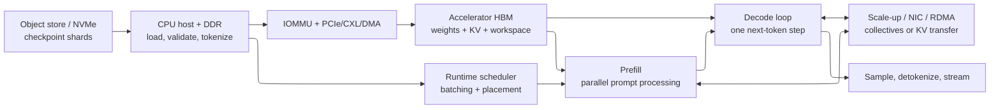
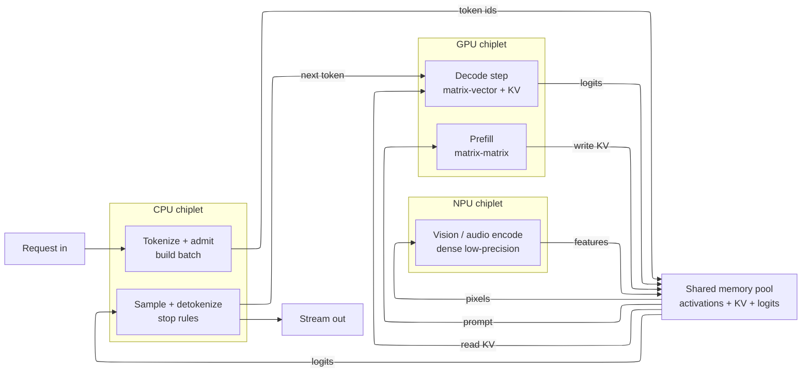

# End-to-End Artificial Intelligence Serving on Systems on Chip and Chiplet Systems

> **First-time-reader orientation:** artificial intelligence (AI) serving is the process of turning an arriving request into model output. Hardware does not receive “a neural network” as one operation. It receives storage reads, memory allocations, graph/runtime commands, many accelerator kernels, synchronization events, collective communications, and finally output tokens or predictions. This chapter follows those events in causal order.
>
> **Abbreviation key — skim now and return as needed:** application programming interface (API); Compute Express Link (CXL); central processing unit (CPU); direct memory access (DMA); graphics processing unit (GPU); high-bandwidth memory (HBM); input/output memory-management unit (IOMMU); key-value (KV) cache; large language model (LLM); mixture of experts (MoE); neural processing unit (NPU); network interface controller (NIC); non-volatile memory express (NVMe); remote direct memory access (RDMA); service-level objective (SLO); system on chip (SoC); time to first token (TTFT); time per output token (TPOT).
>
> **Prerequisites:** [SoC/chiplet workload and performance methods](../00_Design_Methodology/01_SoC_Chiplet_Workloads_Performance_and_DSE.md), [Full-Chip Modeling](../01_System_Modeling/01_Full_Chip_Modeling.md), and one compute-architecture book.

---

## 0. The complete request is the unit of analysis

A kernel benchmark answers “how fast did this operator execute after its data was ready?” A serving-system study asks a larger question:

> From request arrival until the required response is returned, which resources hold the request, which state is created, what work is overlapped, and which queue determines the tail?

For a generative model whose stages are strictly serialized, the visible latency can be decomposed as

$$
T_{request,serial}=T_{front}+T_{queue}+T_{prepare}+T_{prefill}+T_{first\ sample}+T_{stream,1}+
\sum_{i=2}^{N_{out}}\left(T_{decode,i}+T_{sample,i}+T_{stream,i}\right),
$$

where the terms include gateway/tokenization work, scheduler waiting, input preparation, prompt processing, per-token autoregressive decoding, sampling, and first/subsequent response transport. A real implementation may overlap CPU preparation, device execution, collectives, and output emission. Its general latency is therefore the longest weighted path in the measured dependency directed acyclic graph (DAG), not the sum of every profiler duration. The first responsibility of an experiment is to name the timestamp and dependency at every boundary.

Each arrow is a potential queue, copy, translation, synchronization, or failure boundary. “GPU utilization is low” is not a diagnosis until the upstream or downstream arrow responsible for the gap is identified.

---

## 1. Before requests: model provisioning and cold start

### 1.1 A checkpoint is a storage artifact, not executable state

Model weights usually begin as one or more checkpoint shards in local NVMe or remote/object storage. The serving process must:

1. resolve model metadata, tokenizer/configuration, tensor names, shapes, data types, and sharding layout;
2. authenticate and read checkpoint objects;
3. verify checksums/version compatibility;
4. allocate host or device destinations;
5. read, decompress or dequantize if required, and deserialize tensors;
6. transform layouts or fuse/pack weights for target kernels;
7. transfer or directly DMA data into accelerator memory;
8. initialize runtime graphs, memory pools, communication groups, and warm-up kernels.

The cold-start lower bound for a model artifact of size $M_w$ crossing serial resources is

$$
T_{load}\ge \sum_{j\in serial}\left(L_j+\frac{M_j}{B_{j,eff}}\right),
$$

When decompression or repacking changes byte count, each stage must be normalized to one common artifact basis. If the checkpoint basis is $M_w$ bytes and stage $j$ processes $M_j$ bytes at delivered rate $B_{j,eff}$, its checkpoint-equivalent rate (the $M_w$ basis divided by that stage's service time $M_j/B_{j,eff}$) is

$$
R_j=B_{j,eff}\frac{M_w}{M_j}.
$$

A fully pipelined path then approaches the slowest normalized stage after fill:

$$
X_{load,checkpoint}\le \min_j R_j, \qquad
T_{load}\approx T_{fill}+\frac{M_w}{\min_j R_j}.
$$

`B_{j,eff}` is delivered—not advertised—bandwidth after filesystem, protocol, copy, alignment, decompression, and contention losses. If reading storage, parsing on CPU, and DMA to HBM cannot overlap, sum their per-stage service times. If double-buffering overlaps them, use the normalized pipeline model and verify the overlap in a timeline.

### 1.2 Where the bytes travel

The conventional path is storage → kernel page cache or userspace buffer in host dynamic random-access memory (DDR) → accelerator DMA over PCI Express (PCIe) → HBM. Direct-storage mechanisms can remove a CPU bounce copy, but they do not remove storage latency, IOMMU translation, PCIe/NIC limits, device-memory allocation, or format conversion.

For sharded models, each accelerator should ideally read only its owned tensors. Loading the entire checkpoint on every host and discarding unowned shards multiplies storage/network traffic and cold-start time. The checkpoint layout is therefore part of system architecture: it should match tensor/pipeline/expert placement or support efficient range reads.

### 1.3 Weight capacity is necessary but not sufficient

For $P$ parameters stored at $b_w$ bits per parameter,

$$
M_{weights}=\frac{P b_w}{8}+M_{scale}+M_{metadata}.
$$

Device capacity must also reserve KV cache, activation/workspace buffers, communication buffers, runtime graphs, memory fragmentation margin, and reliability features. A model that “fits” by weights alone can fail at the first long-context or high-concurrency request.

---

## 2. Request admission, preprocessing, and placement

### 2.1 CPU work before accelerator work

The host commonly performs network termination, authentication, request parsing, tokenization or feature decoding, prompt-template construction, input validation, request routing, and scheduler bookkeeping. Retrieval-augmented generation can add vector search, document fetch, and prompt assembly. Multimodal requests add image/audio/video decoding and preprocessing, sometimes on CPU and sometimes on an accelerator.

These stages matter when:

- prompts are short and accelerator execution is fast;
- tokenization or media decoding has poor parallelism;
- request rates create CPU lock/contention or allocator pressure;
- NUMA placement puts host buffers far from the accelerator/NIC;
- many small runtime launches and completions burden one host thread;
- output sampling/detokenization serializes the decode loop.

`NUMA` means **non-uniform memory access**: latency and bandwidth depend on which CPU socket owns the memory and I/O device. Pin host threads, memory, NIC queues, and accelerators to a consistent topology before attributing a device bottleneck.

### 2.2 Admission control protects tail latency

An unconstrained scheduler accepts requests faster than the service can complete them; queue length and latency then grow without bound. Admission uses estimates of prompt length, output length, KV capacity, model placement, and current queue state to accept, delay, redirect, or reject work.

The state attached to each request includes:

- input tokens/features and generation parameters;
- model/version/adapter identity;
- priority, deadline, tenant, and SLO class;
- current prefill/decode position;
- allocated KV blocks or other persistent state;
- device and parallel-group placement;
- cancellation/failure status.

The scheduler is an architectural component because it decides the shapes and arrival order seen by the hardware. Changing batch policy changes arithmetic intensity, memory reuse, kernel mix, queueing, and fairness even when the model is identical.

---

## 3. Graph preparation and runtime launch

### 3.1 From framework graph to executable work

Before the first real request—or lazily on first use—the software stack may trace/export the model, specialize shapes, propagate constants, select precision, fuse operators, choose kernel implementations, plan memory, compile device code, and capture reusable command graphs. The output is not one binary operation; it is an execution plan containing kernels, DMA operations, collectives, events, and control decisions.

Dynamic sequence lengths and data-dependent routing complicate specialization. A runtime may maintain several compiled variants, pad to supported shapes, execute generic kernels, recompile, or fall back to CPU/device code. Every fallback must appear in the evidence chain; otherwise reported accelerator utilization can hide substantial host work.

### 3.2 Launch overhead and synchronization

Short kernels can finish in the same order of magnitude as host submission, driver processing, and device scheduling. Command graphs, persistent kernels, fused operators, and device-side scheduling reduce repeated launch cost. However, fusion can increase register/scratchpad pressure, reduce occupancy, duplicate work, or block overlap. The correct question is whether fusion reduces total critical-path time, not whether it reduces kernel count.

Dependencies are expressed through streams/queues, events, barriers, and collective completion. A global synchronization inserted for convenience destroys overlap between compute, DMA, and communication; a missing dependency consumes data before it is valid. Timeline analysis must distinguish useful execution, dependency waiting, resource contention, and an empty device queue.

---

## 4. Prefill: turn the prompt into persistent state

### 4.1 What prefill computes

For an autoregressive Transformer, prefill processes the input sequence in parallel through all layers. Each layer typically performs normalization, projections for queries/keys/values, attention over the prompt, output projection, and feed-forward or MoE computation. It writes key and value tensors for every processed token into the KV cache.

Large prompt matrices make projection and feed-forward operations matrix-matrix multiplications with substantial data reuse. Prefill is therefore often more compute-efficient than single-token decode, though long-context attention and KV writes can become memory or capacity bottlenecks.

### 4.2 Prefill owns TTFT but competes with decode

Time to first token begins at a declared boundary—often request arrival—and ends when the first output token is available or emitted. It includes queueing, preparation, prefill, and first sampling. A long prefill can monopolize compute and delay decode iterations for existing requests. Common policies include:

- prioritize prefills for low queueing/TTFT but risk decode stalls;
- prioritize decode for smooth inter-token latency but delay new requests;
- chunk a long prefill and interleave chunks with decode work;
- place prefill and decode on separate resources.

Chunk size trades launch/scheduling overhead against interference. The mechanism is architectural: it changes kernel shapes, KV-write bursts, DMA/collective schedules, and queue service times.

### 4.3 Multimodal encode before prefill

Vision or audio encoders create embeddings that the language model consumes. The pipeline becomes encode → language-model prefill → decode. The encoder may have different batching, precision, compute/memory balance, and accelerator preference. Treating it as a single “prefill” stage hides an additional queue and motivates encode/prefill/decode placement as three resource classes.

---

## 5. Decode: a recurrent, stateful memory system

### 5.1 One token step

After prefill, each sequence repeats:

1. embed the most recent token;
2. execute all model layers for one new position;
3. read prior keys/values and append the new KV entry;
4. produce vocabulary logits;
5. apply sampling/selection and stopping rules;
6. emit the token or feed it into the next iteration.

The token dependency prevents parallel execution across time for one sequence. Throughput comes from batching many sequences or speculative techniques, not from computing future exact tokens independently.

### 5.2 Why decode stresses memory differently

At small batch, each layer's weight matrix is streamed to perform a matrix-vector or narrow matrix multiplication. Weight reuse is low and HBM bandwidth often bounds throughput. Larger batches reuse weights across more sequences and increase arithmetic intensity, but consume more KV capacity and make each iteration longer. The scheduler trades aggregate tokens/s against per-request TPOT and tail latency.

The KV cache is persistent per-request state. For $L$ layers, $H_{kv}$ key/value heads, head dimension $D_h$, element size $s_{kv}$ bytes, batch/concurrency $B$, and stored sequence length $S$,

$$
M_{KV}=2L H_{kv}D_h s_{kv}\sum_{r=1}^{B}S_r.
$$

The factor two is key plus value. Grouped-query or multi-query attention reduces $H_{kv}$ relative to query-head count. Page/block allocation reduces external fragmentation and enables sharing/copy-on-write, but adds block tables, indirection, and scheduling constraints.

### 5.3 Sampling placement

Logit processing may include temperature scaling, penalties, top-$k$, top-$p$, grammar constraints, beam bookkeeping, and random sampling. Moving logits to CPU every token introduces synchronization and I/O; keeping sampling on device avoids that path but uses accelerator resources and complicates dynamic policies. Measure the chosen placement, especially for small models where sampling can be a visible fraction of TPOT.

---

## 6. Batching, scheduling, and memory ownership

### 6.1 Continuous batching

Static batching waits for a fixed group to finish, so one long sequence strands completed slots. Iteration-level or continuous batching can add/remove sequences between decode iterations. It improves resource occupancy but requires dynamic KV allocation, per-sequence position/state tables, and a scheduler that bounds interference.

The device sees a sequence of batches whose dimensions change over time. Report distributions of active sequences, tokens per iteration, prompt/output lengths, and queue depth; an average batch size cannot reproduce the kernel-shape distribution.

### 6.2 KV block ownership and migration

KV pages may be owned by one accelerator, shared within a parallel group, replicated, transferred to a decode worker, or offloaded to another tier. Ownership determines which agent can update page tables, when a request may migrate, and whether failures lose reconstructible or irreplaceable state.

Offload is profitable only if transfer is hidden or the capacity benefit outweighs access latency. A tiered policy needs:

- placement and eviction rule;
- block size and metadata format;
- transfer engine and path;
- prefetch trigger and deadline;
- consistency/version rule;
- backpressure when the lower tier is saturated;
- recovery behavior when a transfer or worker fails.

---

## 7. Multi-accelerator execution and communication

### 7.1 Parallel groups

Large models or throughput targets use combinations of:

- **data parallelism:** replicas serve different requests; occasional weight/update synchronization for training, little inference communication per token;
- **tensor parallelism:** each layer is partitioned across devices; collectives occur inside many layers;
- **pipeline parallelism:** consecutive layer ranges live on different devices; activation tensors move between stages;
- **expert parallelism:** MoE experts are distributed; token dispatch and return create all-to-all traffic;
- **context/sequence parallelism:** sequence or attention state is partitioned; communication depends on the attention algorithm.

Each choice has a distinct communication cadence. Bytes/s alone is insufficient: many small latency-sensitive collectives behave differently from a few large bandwidth-bound transfers.

### 7.2 Scale-up versus scale-out

On-package or node-local scale-up fabrics generally offer lower latency and higher bandwidth per endpoint than the NIC-based scale-out network. Placement should keep fine-grained, frequent tensor-parallel collectives within the strongest fabric where possible; coarser pipeline or replica traffic can cross slower links.

The effective collective path includes accelerator memory read, DMA/collective engine, fabric serialization/routing, remote memory write/reduction, and synchronization. If traffic crosses PCIe switches, CPU sockets, or NICs unnecessarily, topology—not peak accelerator compute—sets the bound.

### 7.3 RDMA and IOMMU state

RDMA allows a NIC to access registered memory without copying payload through a CPU data path. It still requires address registration/translation, permissions, queue-pair state, completion processing, congestion control, and a reachable peer mapping. Accelerator-direct RDMA further requires correct device-memory registration and topology.

For small messages, fixed software/NIC/fabric latency dominates. For large messages, delivered bandwidth and congestion dominate. Model both:

$$
T_{message}\ge L_{software}+L_{NIC}+L_{fabric}+\frac{M}{B_{effective}}.
$$

### 7.4 Heterogeneous engines on one package

The sections above treated the accelerators as copies of one device. A serving SoC or chiplet package is usually *heterogeneous*: a CPU, one or more NPUs, a GPU, and often media or digital-signal blocks share a common memory pool. The same $T_{message}$ accounting just introduced now governs the handoffs *between engine types*, not only between replicas of one type.

Intuitively the package is a team of specialists passing a single baton. Each engine runs the leg of the request it is fastest at, then leaves its result—a tensor—in shared memory for the next engine to pick up. On a unified-memory SoC that handoff can be a *descriptor* (a pointer plus shape, precision, and layout), so no payload bytes move: the handoff is zero-copy. When the next engine sits on a different chiplet without a shared coherent view of that buffer, the identical logical handoff becomes a real copy across the die-to-die (D2D) link—and for a large tensor the copy, not the compute, can set the stage time.

Placement matters because no single engine is best at every operator. Tokenization, sampling, stop-rule checks, and scheduler control are branch-heavy and latency-bound, which suits the CPU. Dense low-precision matrix multiplies such as vision or audio encode map onto an NPU's systolic arrays. Large, dynamically shaped attention and flexible custom kernels favor the GPU. Pinning every stage to one engine idles the others and serializes work that could pipeline; but moving a tensor to the "better" engine spends D2D bandwidth and latency. Placement is therefore an optimization against movement cost, not a free upgrade.

Every solid arrow into or out of the shared pool is one of those handoffs: a descriptor pass (zero-copy) when producer and consumer share a coherent view of the buffer, or a D2D copy when they do not. The decode loop is the tight cycle GPU → logits → CPU sample → next token → GPU; if sampling runs on the CPU rather than on the device and that per-token hop crosses a chiplet boundary each iteration, its fixed latency lands directly on time per output token.

**Worked placement budget (cross-chiplet round trip).** Suppose the runtime can run one operator—say a fused encode block—two ways. Keep it on the GPU chiplet where the activation already lives at $T_{GPU}=200\ \mu s$, or offload it to a faster NPU chiplet at $T_{NPU}=80\ \mu s$ of compute, which requires shipping the $M=32$ MB activation across the D2D link and returning the result. With effective D2D bandwidth $B_{d2d}=400$ GB/s and a lumped one-way link-plus-setup latency $L_{d2d}=0.5\ \mu s$, one crossing costs

$$
L_{d2d}+\frac{M}{B_{d2d}}=0.5+\frac{32\times10^{6}}{400\times10^{9}}\ \text{s}=0.5+80=80.5\ \mu s,
$$

so the round trip adds $2\times80.5=161\ \mu s$. Single-operator offload then costs $T_{NPU}+161=241\ \mu s$, worse than $T_{GPU}=200\ \mu s$: the copy erases the $120\ \mu s$ compute win, and the "faster" engine loses. Offload pays only when the copy amortizes over several ops that keep the tensor resident on the NPU. For $n$ consecutive resident ops the break-even is

$$
n^{*}=\frac{2\left(L_{d2d}+M/B_{d2d}\right)}{T_{GPU}-T_{NPU}}=\frac{161}{200-80}\approx1.34,
$$

so $n\ge 2$ fused ops make offload win—at $n=2$, offload is $161+2\times80=321\ \mu s$ against $2\times200=400\ \mu s$ on the GPU. The lesson echoes scale-up versus scale-out above: move a tensor to another engine only when the compute saved outweighs the movement, which usually means keeping it resident and fusing a chain rather than round-tripping per operator. (This round trip is two-way because the result returns; the KV handoff of the disaggregation section below is one-way because the state stays with the decode worker.)

---

## 8. Disaggregated prefill and decode

### 8.1 Why separation can help

Prefill favors large compute-efficient prompt matrices and TTFT. Decode favors repeated latency-sensitive iterations, high weight/KV bandwidth, and TPOT. Colocation couples their parallelism and causes interference. Disaggregation gives each phase a separate scheduler and resource configuration.

### 8.2 The state-transfer cost

Decode cannot begin until the prefill worker's KV state is available. With KV payload $M_{KV,prompt}$, path bandwidth $B_{KV}$, fixed transfer latency $L_{KV}$, and any serialization/registration overhead $T_{setup}$,

$$
T_{handoff}\ge T_{setup}+L_{KV}+\frac{M_{KV,prompt}}{B_{KV}}.
$$

Disaggregation wins only if removing interference and independently scaling the phases repays handoff cost, extra memory, failure complexity, and load imbalance. Topology-aware placement matters because a slow cross-rack KV transfer can erase the benefit.

### 8.3 The ownership protocol

A correct transfer requires more than bytes:

1. prefill allocates and writes a versioned KV region;
2. all producing kernels/collectives complete;
3. metadata describing layers, blocks, positions, precision, and layout is finalized;
4. transfer or remote-read permissions are established;
5. decode verifies completion and assumes ownership or read authority;
6. cancellation/failure frees exactly one copy without use-after-free;
7. retries are idempotent or use a new version.

This is a distributed-memory consistency problem. A fast copy with ambiguous ownership is not a valid serving design.

---

## 9. Speculative and conditional execution at system level

Speculative decoding uses a draft mechanism to propose several tokens and a target model to verify them. Accepted tokens reduce the number of expensive target-model iterations; rejected proposals waste draft and verification work. System consequences include:

- two model placements or a combined model with different resource needs;
- additional KV state and rollback/commit semantics;
- variable accepted-token count per iteration;
- changed batch shapes and scheduler fairness;
- a break-even governed by acceptance rate, draft cost, and verification efficiency.

For average proposal length $k$, acceptance count $A\le k$, draft time $T_d$, verification time $T_v(k)$, and ordinary target step time $T_t$, idealized speedup is

$$
S\approx\frac{(E[A]+1)T_t}{T_d+T_v(k)}.
$$

The numerator counts target-equivalent token progress (the $+1$ is the token the target commits from its own verification pass even when every proposed token is rejected). The model must include batching and memory effects; acceptance rate alone does not predict system speedup.

MoE is another conditional workload: routing selects a subset of experts. It reduces arithmetic per token relative to executing every expert but creates load imbalance, metadata, and all-to-all communication. Capacity and tail latency depend on the hottest expert, not average expert load.

---

## 10. Completion, streaming, cancellation, and failure

After device computation, the system may transfer token IDs or logits, detokenize, apply content/policy filters, serialize the response, and stream it to the client. Backpressure from a slow client must not retain scarce accelerator/KV resources indefinitely.

Cancellation is a distributed operation: remove queued work, stop future iterations, wait for in-flight kernels/collectives that cannot be preempted, release KV pages, and suppress late completions. Failure recovery distinguishes:

- **reconstructible state:** weights can reload; prompt KV can be recomputed at latency cost;
- **external state:** request metadata and emitted-token history need durable ownership;
- **in-flight collectives:** all participants must agree on abort/retry;
- **partial output:** retry policy must avoid duplicate or contradictory streams.

Research-quality evaluation includes faults, timeouts, and cancellation under load because they change queue occupancy and resource reclamation.

---

## 11. Trace one request with evidence

For one representative request, collect a correlated trace containing:

| Layer | Required observation |
|---|---|
| gateway/host | arrival, parsing/tokenization, admission, queue entry/exit |
| runtime | batch membership, device placement, KV allocation, launch/event timestamps |
| device | kernel/DMA/collective timeline and device-local counters |
| memory | weights/KV/workspace allocation, HBM/DDR bandwidth and stalls |
| interconnect | message size, route/topology, queueing, retries/congestion |
| output | first-token and per-token emission, cancellation/completion |

Use a shared request identifier and synchronized clocks or an explicit clock-offset model. Without correlation, independent “CPU 40%, GPU 70%, network 20%” dashboards cannot establish causality.

### 11.1 Worked decision: normalize a compressed cold-load pipeline

Suppose a checkpoint contains 70 GB on storage but becomes 140 GB after unpacking and device-specific repacking. Delivered stage rates are:

- storage reads 70 GB at 10 GB/s;
- CPU unpack/repack emits 140 GB at 20 GB/s;
- DMA moves 140 GB at 28 GB/s.

Without overlap, the byte-service lower bound is

$$
T_{serial}\ge\frac{70}{10}+\frac{140}{20}+\frac{140}{28}=7+7+5=19\ \text{s}.
$$

Using the 70-GB checkpoint as the common basis, the three equivalent rates are 10, $20(70/140)=10$, and $28(70/140)=14$ checkpoint-GB/s. A sufficiently chunked and double-buffered implementation therefore approaches

$$
T_{pipeline}\approx T_{fill}+\frac{70}{\min(10,10,14)}
=T_{fill}+7\ \text{s}.
$$

The calculation changes the architecture decision: faster PCIe/DMA cannot improve steady-state load throughput because storage and CPU transformation are tied at the bottleneck. Candidate changes are parallel storage reads, faster/parallel repacking, or storing a device-ready representation. A trace must confirm simultaneous stage activity and bounded buffer occupancy; otherwise the 7-second pipeline estimate is not valid.

---

## 12. Research questions

- How should schedulers jointly optimize TTFT, TPOT, energy, fairness, and model quality under non-stationary arrivals?
- When should KV state be recomputed, compressed, replicated, migrated, or tiered?
- Can host, NIC, and accelerator schedulers expose a common deadline/backpressure contract?
- Which serving phases merit specialized chiplets, memories, or near-memory functions?
- How should accelerator simulators consume realistic dynamic-batching and KV-allocation traces?
- How can disaggregated ownership protocols remain fast while surviving worker and network failure?
- How do speculative, multimodal, agentic, and MoE workloads change the optimal CPU/accelerator/fabric balance?

---

## Cross-references

- [AI workload mapping to SoC, memory, NoC, and chiplets](02_AI_Workload_Mapping_to_SoC_Memory_NoC_and_Chiplets.md) derives placement and communication consequences.
- [AI serving performance analysis](03_AI_Serving_Performance_Analysis_and_Research_Methodology.md) turns this event path into equations and experiments.
- [Host interface, memory visibility, and scheduling](../../03_NPU_Architecture/03_System_Integration/01_Host_Interface_Memory_Visibility_and_Scheduling.md) explains device submission and DMA from the NPU side.
- [QoS, ordering, and I/O coherence](../05_IO_and_Chiplets/01_QoS_Ordering_and_IO_Coherence.md) explains the transport contracts used here.
- [Chiplets, CXL, and die-to-die architecture](../05_IO_and_Chiplets/02_Chiplets_CXL_and_Die_to_Die.md) explains the package boundaries.

---

## References

1. Kwon, W. et al., “Efficient Memory Management for Large Language Model Serving with PagedAttention,” *SOSP*, 2023. https://doi.org/10.1145/3600006.3613165
2. Zhong, Y. et al., “DistServe: Disaggregating Prefill and Decoding for Goodput-optimized Large Language Model Serving,” *OSDI*, 2024. https://www.usenix.org/conference/osdi24/presentation/zhong-yinmin
3. Agrawal, A. et al., “Taming Throughput-Latency Tradeoff in LLM Inference with Sarathi-Serve,” *OSDI*, 2024. https://www.usenix.org/conference/osdi24/presentation/agrawal
4. MLCommons, *MLPerf Inference Rules and Reference Implementations*. https://docs.mlcommons.org/inference/
