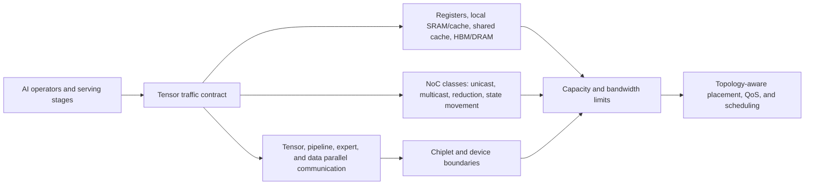

# Artificial Intelligence Workload Mapping to SoC, Memory, NoC, and Chiplets

> **First-time-reader orientation:** an artificial intelligence (AI) operator's arithmetic tells only part of its hardware demand. Its *traffic signature*—which tensor is read, reused, reduced, routed, or retained—determines memory hierarchy, network topology, synchronization, and chiplet boundaries. This chapter maps common AI work to those shared structures.
>
> **Abbreviation key:** central processing unit (CPU); Compute Express Link (CXL); dynamic random-access memory (DRAM); general matrix multiplication (GEMM); general matrix-vector multiplication (GEMV); graphics processing unit (GPU); high-bandwidth memory (HBM); input/output (I/O); input/output memory-management unit (IOMMU); mixture of experts (MoE); neural processing unit (NPU); network interface controller (NIC); network on chip (NoC); quality of service (QoS); register file (RF); remote direct memory access (RDMA); static random-access memory (SRAM); translation lookaside buffer (TLB); Universal Chiplet Interconnect Express (UCIe). Arithmetic intensity is written $I_j$ in equations to avoid overloading “AI.”
>
> **Prerequisites and ownership:** [end-to-end AI serving](01_End_to_End_AI_Serving_on_SoCs_and_Chiplets.md) defines the request stages. This chapter owns the full-chip memory, NoC, I/O, and chiplet placement consequences; device-local CPU, GPU, and NPU execution remains in their respective architecture books.

---

The same arithmetic graph can produce radically different systems because tensor lifetime, locality, collective communication, and placement decide which memory or interconnect roof is exposed.

## 0. Start with a tensor-traffic contract

For every operator or serving stage, write a contract:

$$
W=\langle\text{shapes},\text{precision},\text{operations},\text{bytes by level},
\text{reuse},\text{dependencies},\text{collectives},\text{persistent state}\rangle.
$$

The same matrix multiplication can be compute-bound when large tiles reuse both inputs, HBM-bound during narrow decode, NoC-bound when partial sums move between array tiles, or fabric-bound when tensor parallelism reduces across devices. The contract must therefore name every storage and communication level—not one global arithmetic intensity.

## 1. Operator traffic signatures

| Workload component | Compute shape | Dominant reusable data | Persistent/irregular state | System pressure |
|---|---|---|---|---|
| dense GEMM/convolution | regular multiply-accumulate tiles | weights and activation tiles | little after completion | compute arrays, scratchpad/RF bandwidth, HBM if tiles are narrow |
| decode GEMV/narrow GEMM | small token batch × large weights | weights across concurrent sequences | KV cache grows per request | HBM bandwidth/capacity, scheduler batching |
| attention prefill | sequence × sequence blocks | query/key/value tiles | writes prompt KV | compute + scratchpad capacity + KV write traffic |
| attention decode | one/few queries over long context | query reused; historical KV streamed | read/append KV | HBM capacity/bandwidth and address indirection |
| embedding/recommendation | gathers + reductions | hot rows/cache lines | huge sparse tables | DRAM/CXL capacity, random latency, TLB/IOMMU, network fetch |
| MoE | router + selected expert GEMMs | expert weights for routed tokens | routing metadata and load imbalance | all-to-all, hot-expert capacity, variable work |
| normalization/activation | elementwise/reduction | short-lived vectors | none | memory traffic and launch/fusion overhead |
| sampling | reductions/sort/filter/random | logits | per-request policy/history | synchronization, small-kernel latency, CPU/device boundary |

The architecture question is: **where can each reusable byte remain between its producer and last consumer?** Every eviction to a lower level adds energy, bandwidth, and usually latency.

---

## 2. Hierarchical roofline for a heterogeneous chip

For memory level or link $j$ with delivered bandwidth $B_j$ and traffic $Q_j$, define level-specific intensity

$$
I_j=\frac{O}{Q_j}, \qquad P\le\min\left(P_{compute}, B_1I_1,B_2I_2,\ldots,B_nI_n\right).
$$

`O` is useful operations. Levels can include register file, scratchpad/shared memory, cache, on-chip SRAM, NoC, HBM, DDR/CXL memory, die-to-die link, and network. A kernel can sit above the HBM ridge point but below the NoC ridge point if its tiling eliminates HBM traffic while exchanging partial sums excessively on chip.

Use delivered bandwidth measured under the relevant access pattern. Random embedding reads, synchronized collective bursts, and long sequential weight streams achieve different fractions of the same peak interface.

### 2.1 Capacity creates discontinuities

Roofline is a throughput bound; capacity decides which traffic level exists. If weights plus active KV and workspaces fit in HBM, steady-state execution avoids host memory. Crossing capacity can introduce PCIe/CXL or network traffic and change latency by orders of magnitude. Model capacity constraints before bandwidth:

$$
M_{weights}+M_{KV}+M_{workspace}+M_{comm}+M_{runtime}+M_{margin}\le M_{local}.
$$

Allocation policy determines usable capacity. Fragmentation, fixed reservations, reliability sparing, alignment, and per-tenant isolation reduce the advertised number.

---

## 3. Mapping the memory hierarchy

### 3.1 Weights

Weights are read-only during inference and can be sharded, replicated, quantized, compressed, or cached. Placement choices:

- **replicate:** removes per-layer communication and improves fault/tenant isolation, but multiplies capacity;
- **tensor-shard:** reduces per-device capacity, but creates frequent reductions/gathers;
- **pipeline-shard:** moves activations between layer stages and can suffer pipeline bubbles;
- **expert-shard:** stores different experts and routes tokens to them;
- **tier/offload:** uses HBM as a cache over DDR/CXL/storage, requiring prediction/prefetch or tolerating stalls.

Weight layout must match the compute tile and precision format. Repacking at load time trades cold-start CPU/device work for better steady-state transactions.

### 3.2 Activations and workspaces

Inference activations are often shorter-lived than weights or KV. Fusion and lifetime-aware allocation can keep them in registers/scratchpad or reuse memory buffers. However, an overly fused kernel can exceed register/SRAM capacity, spill to HBM, or reduce occupancy. System memory planning needs the peak overlap of live tensors, not the sum of all graph tensor sizes.

### 3.3 KV cache

KV is request-private, grows with sequence length, and is repeatedly read by decode. Page/block allocation lets non-contiguous physical storage represent a logical sequence and eases continuous batching. System consequences include block-table access, page ownership, migration, copy-on-write for shared prefixes, and eviction/offload.

Prefix caching changes KV from private transient state to reusable shared state. It needs a content/version key, correctness across model/adapters/position encoding, eviction policy, tenant security, and accounting for hit-rate distributions.

### 3.4 Embeddings and retrieval state

Large recommendation tables or retrieval indexes can exceed HBM by far. Accesses are sparse and data-dependent, so sequential bandwidth is the wrong predictor. Relevant mechanisms include cache admission for hot rows, pooled DDR or CXL memory, near-memory reduction, request coalescing, software prefetch, huge pages/TLB reach, and RDMA fetch. Tail latency follows the slowest required row/partition unless requests can tolerate approximation or missing features.

---

## 4. On-chip network mapping

### 4.1 Traffic classes

An AI SoC NoC carries qualitatively different traffic:

- latency-sensitive control, interrupts, and page-table walks;
- sustained weight/activation/KV DMA;
- bursty scratchpad fills and writebacks;
- multicast weights or activations;
- reductions/partial sums;
- cache-coherent CPU traffic;
- best-effort background load, checkpoint, or telemetry traffic.

One undifferentiated queue permits a bulk DMA burst to block a wake/control message. Virtual channels and QoS classes separate dependencies and service policy, but buffers alone do not create bandwidth. Admission and rate control must ensure offered load stays below sustainable capacity.

### 4.2 Multicast and reduction

Broadcasting a weight/activation tile to $N$ compute clients by $N$ unicast copies wastes injection and link bandwidth. Tree multicast replicates only at branches. In-network reduction can combine partial sums before they reach a root, reducing egress traffic. Both introduce ordering, buffering, fault, and numerical-association questions.

Reduction topology affects latency. A balanced tree has $O(\log N)$ stages but may underuse wide rings/links for large messages; a ring pipelines bandwidth efficiently but requires $O(N)$ steps. The chosen algorithm depends on message size, topology, full-/half-duplex links, concurrency, and whether reduce-scatter plus all-gather can overlap compute.

### 4.3 Deadlock and backpressure

AI collectives form synchronized bursts: one blocked participant can hold buffers while waiting for another channel, creating protocol cycles. Separate request/response/collective virtual networks as required by the dependency proof, reserve escape resources, and propagate backpressure to DMA/kernel schedulers. Dropping or indefinitely delaying a flit is not acceptable merely because average bandwidth is sufficient.

---

## 5. Parallelism becomes communication

Let a layer activation contain $A$ bytes and weights $W$ bytes per device before partitioning.

### 5.1 Tensor parallelism

Partitioning matrix dimensions reduces local work and weight capacity but usually needs one or more collective operations per layer. A first-order ring all-reduce volume per participant for payload $M$ over $N$ devices is

$$
V_{ring}=2\frac{N-1}{N}M,
$$

plus $2(N-1)$ communication steps. Bandwidth dominates large $M$; per-step latency dominates small messages. Layer time is bounded by

$$
T_{layer}\ge\max(T_{local\ compute},T_{collective\ exposed})
$$

only to the extent communication truly overlaps independent computation.

### 5.2 Pipeline parallelism

Each stage sends activations to the next. For $K$ stages and $m$ microbatches with balanced stage time $T_s$, an ideal forward pipeline takes roughly

$$
T\approx(K+m-1)T_s,
$$

so utilization is $m/(K+m-1)$. Unequal stage time, communication, bubbles from variable sequences, and decode's small microbatches worsen it.

### 5.3 Expert parallelism

MoE routing sends tokens to selected expert owners and returns results, commonly an all-to-all pattern. If routing probabilities are $p_e$ and $n$ tokens arrive, expert $e$ receives a random load around $np_e$; capacity and tail are governed by the maximum load, not the mean. Load-balancing loss, token dropping/padding, replication of hot experts, and topology-aware routing trade quality, compute, memory, and communication.

### 5.4 Data parallelism

Inference replicas minimize cross-request communication and scale throughput until shared storage, host, NIC, or power limits dominate. Training adds gradient synchronization; optimizer and parameter sharding alter communication and memory. Always specify whether “data parallel” refers to independent inference replicas or synchronized training workers.

---

## 6. Chiplet partition choices for AI

### 6.1 What a chiplet boundary costs

Moving a function across dies replaces local wires with serialization, link-layer protocol, clock-domain crossing, error detection/retry, package routing, and extra energy per bit. Energy, latency, area, power, money, and verification effort have incompatible units; they must not be added without an explicit normalization. Keep a resource ledger for each candidate cut:

| Quantity | First-order model | Unit and required workload basis |
|---|---|---|
| dynamic boundary energy | $E_{boundary}=E_{link/bit}Q_{request}$ | joules/request; $Q_{request}$ is transferred bits per request |
| exposed transfer time | $T_{boundary}=n_L L_{link}+Q_{request}/B_{eff}-T_{hidden}$ | seconds/request on the dependency critical path, lower-bounded by zero |
| static PHY power | $P_{PHY}$ | watts at the declared link state and frequency |
| PHY/controller area | $A_{PHY}$ | mm² per die/process node |
| package/manufacturing cost | $C_{package}$ | currency/package or yield-adjusted currency/good part |
| verification/schedule cost | $C_{verification}$ | engineer-time and schedule-risk estimate |

At a sustained request rate $\lambda_r$, boundary traffic rate is $\lambda_rQ_{request}$ bits/s and dynamic link power is approximately $\lambda_rE_{boundary}$. Reject dominated candidates with a Pareto comparison. If a study needs one scalar objective, write an explicit normalized form such as $J=\sum_k w_k x_k/x_{k,ref}$ and publish the reference values and weights; the result is then a product-policy choice, not a physical law. High-reuse inner loops should normally keep producer, local storage, and consumer on the same die or use an interface dense enough to survive this ledger.

### 6.2 Common AI partition patterns

| Partition | Benefit | Risk / research question |
|---|---|---|
| replicated compute chiplets around HBM/I/O base | scalable compute and reticle/yield benefits | shared memory/fabric hot spots and coherence/ordering complexity |
| separate I/O/NoC die | mature process for PHYs and reusable connectivity | every memory/collective path crosses the die boundary |
| cache/SRAM chiplet | more capacity and reusable memory technology | latency/energy may erase locality; consistency and banking |
| specialized tensor/vector/control chiplets | match operator mix and process | workload imbalance and fine-grained communication |
| scale-up switch chiplet | dense collective connectivity | centralized hot spot, fault domain, power/thermal density |
| disaggregated memory via CXL | capacity pooling and flexible provisioning | access latency/bandwidth/NUMA and unpredictable sharing |

### 6.3 UCIe, CXL, and semantic layers

UCIe standardizes die-to-die physical/link/protocol capabilities for package integration; it does not decide the AI workload's placement or QoS. CXL provides I/O, cache, and memory semantics over compatible links and enables memory expansion/pooling/fabric use cases. A design must choose whether a boundary carries raw/streaming messages, memory transactions, cache-coherent transactions, or a tunneled higher-level protocol.

Semantic richness has cost. Coherence simplifies sharing but adds directory/state/ordering traffic and can be a poor fit for bulk explicitly scheduled tensors. Explicit DMA exposes placement and synchronization to software but can reduce hardware complexity and enable predictable transfers. Hybrid systems commonly use coherent control structures and explicit bulk tensor movement.

---

## 7. Host, IOMMU, NIC, and accelerator composition

### 7.1 Address visibility

An address used by CPU software may be virtual, I/O virtual, host physical, device virtual, or accelerator-local. DMA/RDMA needs pinned/registered pages, translations, permissions, and invalidation. Translation misses can serialize fine-grained access; large pages improve reach but increase allocation/fragmentation constraints.

### 7.2 Ordering and completion

The producer must make data visible before publishing a descriptor or doorbell. The consumer must not reuse/free a buffer before completion. Across coherent and non-coherent domains, this requires explicit fences, cache maintenance where applicable, DMA completion semantics, and ownership states.

### 7.3 Topology-aware placement

Place CPU threads and host buffers near their PCIe/NIC root; place tightly communicating accelerators within strong scale-up groups; align tensor/expert partitions with link topology; avoid routing device-to-device traffic through a remote socket. Topology is part of the experimental configuration, not an incidental deployment detail.

---

## 8. Contention, QoS, and multi-tenancy

AI serving multiplexes requests, models, tenants, DMA engines, and sometimes CPU/coherent agents. Interference appears in:

- HBM channels/banks and memory-controller queues;
- shared caches/TLBs and NoC virtual channels;
- copy/collective engines;
- PCIe/CXL switches and root complexes;
- NIC queues and network links;
- power and thermal budgets.

QoS needs an objective: deadline, minimum bandwidth, weighted fairness, or isolation. Priority without admission can starve lower classes; bandwidth reservation can strand capacity; work-conserving borrowing improves utilization but complicates tail guarantees. Measure per-class service and interference under co-runners, not one workload in isolation.

Security adds address isolation, memory zeroing, firmware trust, DMA permissions, side-channel controls, and safe sharing of prefix/KV/weight caches. Isolation granularity changes usable capacity and communication topology.

---

## 9. Worked mapping decision: does a chiplet cut expose a new roof?

Consider one inference phase with $O=4\times10^{12}$ useful operations. Measured or conservatively modeled traffic is 80 GB at HBM, 160 GB across the NoC, and 20 GB across a die-to-die boundary. Delivered capabilities are 100 TOP/s compute, 2 TB/s HBM, 4 TB/s NoC, and 0.5 TB/s die-to-die. The independent lower bounds are

$$
T_{compute}=\frac{4\times10^{12}}{100\times10^{12}}=40\ \text{ms},
$$

$$
T_{HBM}=\frac{80\ \text{GB}}{2\ \text{TB/s}}=40\ \text{ms},\quad
T_{NoC}=\frac{160\ \text{GB}}{4\ \text{TB/s}}=40\ \text{ms},\quad
T_{D2D}=\frac{20\ \text{GB}}{0.5\ \text{TB/s}}=40\ \text{ms}.
$$

The original mapping is balanced at a 40-ms roofline bound. A proposed chiplet cut leaves arithmetic and local memory unchanged but makes 60 GB cross the die link. Its die-link bound becomes $60/0.5=120$ ms, so ideal phase throughput falls by at least $3\times$. Doubling compute cannot repair it. The design must instead reduce crossing traffic through placement/reuse, raise delivered die-link bandwidth, or justify the latency loss with a different product constraint such as yield or reusable dies.

This result is a bound, not a prediction. Validate the 20/60-GB traffic counts, the access-pattern-specific 0.5-TB/s delivery, and whether some transfer overlaps compute. If 80 ms of the 120-ms transfer is hidden, the exposed die-link contribution returns to 40 ms and the decision changes.

## 10. Claim-to-observable evidence matrix

| Architectural claim | Minimum observables | Conservation or perturbation check |
|---|---|---|
| HBM is the limiting roof | per-controller read/write bytes, channel/bank utilization, queueing and stall cycles | predicted tensor bytes reconcile with controller bytes; change HBM frequency/bandwidth and observe sensitivity |
| NoC backpressure limits the operator | injected/delivered flits by source/destination/class, virtual-channel occupancy, blocked cycles, route | offered and delivered flits conserve after accounting for in-flight buffers; alter placement or traffic class |
| a collective is exposed | collective start/end plus dependency edges, link bytes, per-rank arrival skew | remove/replace the collective or overlap window; do not infer exposure from link utilization alone |
| a die-to-die cut is limiting | die-link payload/protocol bytes, lane utilization, retries, forward-error-correction (FEC) events, clock/power state | payload plus framing/retry overhead reconciles with link counters; sweep link rate or cut traffic |
| remote memory or I/O is limiting | PCIe/CXL/controller bytes, translation misses, DMA queue depth, completion latency | predicted offloaded tensor/page bytes match controller traffic; change placement or residency |
| topology/placement causes imbalance | logical shard map, physical route, per-link/per-rank traffic and completion time | permute placement while holding work constant; inspect whether hot links/ranks move as predicted |

Counters require a declared aggregation window and granularity. Per-link peaks can vanish in a whole-run average, while synchronized collective bursts can be missed by slow telemetry. Calibrate counters with a microbenchmark of known bytes, align clocks across dies/devices, and retain raw traces so derived utilization can be recomputed.

---

## 11. Mapping workflow for a research study

1. **Define workload distributions:** model/operator mix, shapes, precisions, prompt/output/context, sparsity, arrivals, SLOs.
2. **Construct tensor lifetimes:** producer, consumers, size, reuse distance, persistence, mutability.
3. **Map computation:** CPU/GPU/NPU resource and tile/dataflow per operator.
4. **Map storage:** register/SRAM/cache/HBM/DDR/CXL/storage ownership and capacity.
5. **Map communication:** every NoC, die-to-die, scale-up, and network message with size/cadence/dependency.
6. **Check capacity first:** identify modes that spill or require sharding/offload.
7. **Apply hierarchical roofs:** compute and each bandwidth level.
8. **Model contention and queueing:** concurrent tenants/stages and burst synchronization.
9. **Validate with counters/traces:** reconcile bytes and operations at every level.
10. **Sweep designs:** topology, memory, partition, batching, precision, and placement with uncertainty bounds.

---

## Cross-references

- [End-to-end AI serving](01_End_to_End_AI_Serving_on_SoCs_and_Chiplets.md) provides the request stages that generate these traffic signatures.
- [AI serving performance analysis](03_AI_Serving_Performance_Analysis_and_Research_Methodology.md) provides the measurement and queueing methodology.
- [Network on Chip](../04_On_Chip_Networks/01_Network_on_Chip.md) and [routing/flow control/deadlock](../04_On_Chip_Networks/02_Routing_Flow_Control_and_Deadlock.md) develop NoC mechanisms.
- [Chiplets, CXL, and die-to-die](../05_IO_and_Chiplets/02_Chiplets_CXL_and_Die_to_Die.md) develops the general boundary theory.
- [Tensor tiling and data movement](../../03_NPU_Architecture/02_Mapping_and_Memory/01_Tensor_Tiling_and_Data_Movement.md) develops device-local reuse.

---

## References

1. Williams, S., Waterman, A., and Patterson, D., “Roofline: An Insightful Visual Performance Model for Multicore Architectures,” *Communications of the ACM*, 2009. https://escholarship.org/uc/item/5tz795vq
2. Shoeybi, M. et al., “Megatron-LM: Training Multi-Billion Parameter Language Models Using Model Parallelism,” 2019. https://arxiv.org/abs/1909.08053
3. UCIe Consortium, *UCIe Specifications*. https://www.uciexpress.org/specifications
4. Compute Express Link Consortium, *CXL 4.0 Specification*. https://computeexpresslink.org/cxl-specification/
5. Jouppi, N. et al., “In-Datacenter Performance Analysis of a Tensor Processing Unit,” *ISCA*, 2017. https://doi.org/10.1145/3079856.3080246
