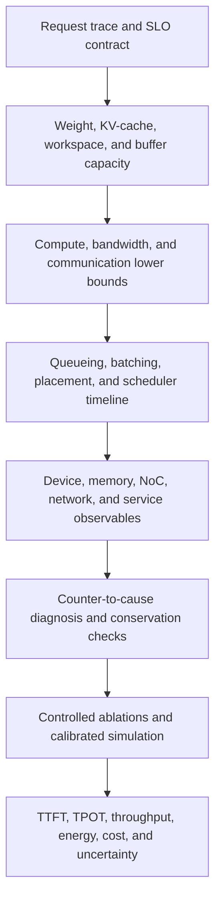

# Artificial Intelligence Serving Performance Analysis and Research Methodology

> **First-time-reader orientation:** artificial intelligence (AI) serving turns requests into model outputs under latency, throughput, quality, energy, and cost constraints. Peak operations/s and peak bandwidth are only component capabilities. A serving result is a statement about a workload distribution, scheduler, software stack, complete system, and latency/quality constraint. This chapter shows how to turn a request trace into defensible performance conclusions.
>
> **Abbreviation key:** high-bandwidth memory (HBM); key-value (KV) cache; network on chip (NoC); quality of service (QoS); requests per second (RPS); service-level objective (SLO); time to first token (TTFT); time per output token (TPOT); total cost of ownership (TCO). Arithmetic intensity is written $I$ rather than “AI” to avoid ambiguity.
>
> **Prerequisites and ownership:** [end-to-end serving](01_End_to_End_AI_Serving_on_SoCs_and_Chiplets.md) defines the event path, and [AI workload mapping](02_AI_Workload_Mapping_to_SoC_Memory_NoC_and_Chiplets.md) derives traffic. This chapter owns full-system metric, queueing, communication, and evidence methodology; device-local counter interpretation remains in the CPU, GPU, and NPU books.

---

An end-to-end result is defensible only when its request definition, capacity feasibility, causal timeline, and hardware/software observables agree.

## 0. Define the metric contract before collecting numbers

For generative serving:

- **TTFT:** request-arrival timestamp to first output token available or emitted—state which.
- **TPOT / inter-token latency:** time between consecutive generated tokens; report distribution and whether the first interval is excluded.
- **end-to-end latency:** arrival to final response completion.
- **throughput:** completed requests/s, input tokens/s, output tokens/s, or total tokens/s—never write “tokens/s” without the numerator definition.
- **goodput:** useful throughput whose requests/tokens meet the stated latency and correctness/quality SLO.
- **tail latency:** a percentile such as p95 or p99 over a declared observation window and population.
- **energy efficiency:** useful work per joule under the same SLO and quality.

For non-generative inference, define query latency, queries/s, batch policy, accuracy/quality target, preprocessing/postprocessing inclusion, and arrival model. MLPerf-style scenarios distinguish offline throughput from server behavior under arrivals; mixing them creates invalid comparisons.

Goodput is the most honest capacity metric:

$$
G(\lambda)=\lambda\Pr\{TTFT\le S_{TTFT},\ TPOT\le S_{TPOT},\ quality\ge Q_{min}\},
$$

where $\lambda$ is offered request rate. Increasing offered load can raise throughput while reducing goodput once queues violate the SLO.

---

## 1. Workload specification is part of the result

Report distributions, correlations, and arrival process for:

- input length, output length, total context, modality/feature sizes;
- model, precision, quantization/calibration, adapter, speculative policy;
- request priority/tenant and SLO;
- arrival process and burstiness;
- prefix sharing/cache hit rate;
- MoE routing/load balance;
- cancellation and failure rate;
- cold versus warm model/KV/cache state.

Prompt and output lengths are often heavy-tailed and correlated. Replacing them with one mean creates unrealistically uniform batches and underestimates head-of-line blocking and KV capacity. Preserve trace distributions or generate a validated synthetic model.

An open-loop load generator issues requests independently of completion and exposes queue saturation. A closed-loop client waits for completion and applies backpressure, which can hide overload. State which model is used.

---

## 2. Capacity model: weights, KV, workspace, and communication

### 2.1 Weight footprint

For $P$ parameters at $b_w$ bits:

$$
M_w=\frac{Pb_w}{8}+M_{quant\ scales}+M_{metadata}+M_{packing}.
$$

Partitioned weight footprint per device depends on tensor/pipeline/expert sharding and replication. Do not divide by device count blindly: embeddings, norms, caches, or experts may be replicated or uneven.

### 2.2 KV footprint

For request $r$ with stored length $S_r$:

$$
M_{KV,r}=2L H_{kv}D_h s_{kv}S_r,
$$

and total resident KV is $\sum_r M_{KV,r}$ plus allocator metadata/internal fragmentation. Prefix sharing subtracts only physically shared blocks; beam/speculative branches may use copy-on-write and later diverge.

The concurrency capacity bound is

$$
B_{max}\le\left\lfloor
\frac{M_{device}-M_w-M_{workspace}-M_{runtime}-M_{margin}}
{E[M_{KV,r}]+M_{request\ overhead}}
\right\rfloor,
$$

but a tail-safe system sizes for the length distribution and fragmentation, not only $E[M_{KV,r}]$.

### 2.3 Communication buffers and transient peaks

Collectives, double-buffered DMA, graph workspaces, compilation variants, and in-flight KV migration all occupy memory. Peak usage follows overlapping lifetimes. Capture allocator traces or build an interval graph; summing nominal steady-state allocations misses transient out-of-memory failures.

---

## 3. Compute and bandwidth lower bounds

### 3.1 Per-stage operation model

For dense Transformer inference, a useful first approximation is that reading/applying weights costs work proportional to parameter count per token, while attention adds context-dependent work. Keep conventions explicit:

- a multiply-add may be counted as one operation or two floating-point operations (FLOPs);
- quantized integer operations and dequantization are not equivalent to floating-point peaks;
- padding, rejected speculative tokens, MoE capacity padding, and recomputation are executed but not all are useful work.

Use operator-derived counts from shapes rather than a memorized `2P` rule when making a research claim.

### 3.2 Roofline per phase

For phase $p$:

$$
T_p\ge\max\left(\frac{O_p}{P_{eff,p}},
\frac{Q_{HBM,p}}{B_{HBM,eff,p}},
\frac{Q_{NoC,p}}{B_{NoC,eff,p}},
\frac{Q_{fabric,p}}{B_{fabric,eff,p}}
\right).
$$

Prefill's larger matrices often raise $O/Q_{HBM}$; decode at small batch often streams weights for little token progress. KV attention can add context-length-dependent HBM bytes. Quantization reduces weight bytes but adds scale/metadata/dequantization work and may change the executable kernel/peak.

### 3.3 Utilization decomposition

Peak-to-observed loss can be factored conceptually:

$$
P_{useful}=P_{peak}\eta_{precision}\eta_{shape}\eta_{occupancy}
\eta_{pipeline}\eta_{memory}\eta_{communication}\eta_{schedule}.
$$

The factors are not strictly independent, so do not multiply guessed percentages as a final answer. Use the factorization to design counter/ablation evidence: shape padding, unit issue activity, stall reasons, memory transactions, communication exposure, and device idle gaps.

---

## 4. Latency decomposition and critical path

### 4.1 Timeline, not summed profiler tables

A flat table that sums all kernel, DMA, and collective durations double-counts overlap. Build a dependency directed acyclic graph (DAG) for one request or iteration. Critical-path length is the longest dependency path; resource utilization is evaluated separately.

For sequential stages:

$$T=\sum_i T_i.$$

For perfectly overlapped independent stages:

$$T\approx\max_i T_i+T_{fill/drain}.$$

Most systems lie between. Measure launch/completion timestamps and dependency edges.

### 4.2 TTFT

$$
TTFT=T_{front}+W_{admit}+T_{prepare}+W_{prefill}+T_{prefill}+T_{first\ sample/emit}.
$$

Separate wait $W$ from service $T$. Faster kernels cannot remove admission or batch-formation queueing; higher batch delay can improve kernel efficiency while worsening TTFT.

### 4.3 TPOT

For output tokens after the first:

$$
TPOT_r\approx\frac{1}{N_r-1}\sum_{i=2}^{N_r}
(W_{iteration,i}+T_{decode,i}+T_{sample,i}+T_{stream,i}).
$$

Report p50/p95/p99 across token intervals and requests. Mean TPOT can hide generation stalls caused by long prefills, collectives, page faults/offload, compaction, or co-tenants.

---

## 5. Queueing and batching

### 5.1 Utilization is nonlinear latency

For an illustrative M/G/1 queue, “M” means memoryless Poisson arrivals, “G” means a general independent and identically distributed service-time distribution, and “1” means one first-come, first-served server. Let arrival rate be $\lambda$, service time be $S$, mean service be $E[S]$, second moment be $E[S^2]$, variance be $E[S^2]-E[S]^2$, and utilization be $\rho=\lambda E[S]$. Under the independence assumptions and stable-load condition $\rho<1$:

$$
E[W_q]=\frac{\lambda E[S^2]}{2(1-\rho)}.
$$

Real serving is not M/G/1: batching couples jobs, service depends on shape/state, priorities exist, and multiple resources form a network. The equation teaches two robust facts: waiting diverges near saturation, and a larger second moment at fixed mean increases waiting. Long prompts and variable decode lengths are architectural problems, not merely noisy measurements.

### 5.2 Batch-size trade-off

Let $b$ be active sequences/tokens in an iteration. Increasing $b$ can:

- improve weight reuse and tensor-unit shape efficiency;
- amortize launch and collective latency;
- consume KV/workspace capacity;
- increase iteration service time and per-request waiting;
- mix incompatible shapes/precisions/tenants;
- increase tail impact of one slow participant.

Sweep batch policy under a fixed arrival trace and SLO. “Maximum tokens/s batch” is not automatically the production optimum.

### 5.3 Chunked prefill

If a prefill of $S$ tokens is split into chunks $c$, the scheduler creates roughly $\lceil S/c\rceil$ opportunities to interleave decode. Smaller $c$ reduces maximum interference but can lower matrix efficiency and add launches. The optimum depends on prompt distribution, decode population, kernel efficiency curve, and SLO weights; it cannot be a universal token count.

---

## 6. Parallelism and communication bounds

### 6.1 Alpha-beta model

For message size $M$:

$$
T_{comm}=\alpha n_{steps}+\beta V+T_{queue}+T_{protocol},
$$

where $\alpha$ is per-step latency, $\beta=1/B_{effective}$, and $V$ is bytes transferred by the algorithm. Add contention and topology; nominal link bandwidth is only a lower-bound input.

### 6.2 Strong-scaling limit

With total compute $C$, serial/host work $T_s$, $N$ accelerators, communication time $T_c(N)$, and an imbalance penalty $T_i(N)$, a safe first lower bound when these components may overlap is

$$
T(N)\ge T_s+\max\left(\frac{C}{NP_{eff}},T_c(N),T_i(N)\right).
$$

If a dependency trace proves that portions $T_{c,exposed}$ and $T_{i,exposed}$ cannot overlap compute or each other, the additive critical-path form is

$$
T(N)\ge T_s+\frac{C}{NP_{eff}}+T_{c,exposed}(N)+T_{i,exposed}(N).
$$

Do not add total communication duration from a profiler table; add only the exposed portion. Adding devices helps until the falling compute term crosses communication, serial work, or imbalance. Report parallel efficiency

$$
E(N)=\frac{T(1)}{N T(N)}
$$

with the same workload and SLO. Weak scaling answers a different question and must be labeled.

### 6.3 Disaggregated prefill/decode break-even

Let colocated phase time/interference cost be $T_{coloc}$, separate service/queue time be $T_{pf}+T_{dc}$ with overlap or independent capacity, and KV handoff $T_{KV}$. Disaggregation improves the target metric only if

$$
\Delta T_{interference}+\Delta T_{allocation} > T_{KV}+T_{extra\ queue}+T_{failure/coordination},
$$

evaluated at the workload's offered load and topology. Compare goodput curves, not one unloaded request.

---

## 7. Energy, power, and cost

Energy per useful output token is

$$
E_{token}=\frac{\int P_{system}(t)dt}{N_{useful\ output\ tokens}},
$$

where system power includes accelerators, CPUs, memory, NICs, storage contribution, cooling/power-delivery allocation as defined, and idle capacity. Rejected speculative work, padding, cache misses, and failed/retried requests consume energy but not useful output.

Cost per useful work can be modeled as

$$
C_{token}=\frac{C_{amortized\ hardware}+C_{energy}+C_{network/storage}+C_{operations}}
{N_{SLO\ compliant\ useful\ tokens}}.
$$

Utilization that violates latency is not useful capacity. Report power caps, clocks, temperature/throttling, and whether energy is measured at chip, board, node, or facility boundary.

---

## 8. Counter-to-cause methodology

### 8.1 Evidence ladder

1. **Application metrics:** request arrivals, queueing, TTFT/TPOT/end-to-end/goodput, lengths, batch membership.
2. **Runtime trace:** graph/kernels/DMA/collectives/events, KV allocation/migration, scheduler decisions.
3. **Device counters:** unit issue/occupancy, stalls, cache/HBM bytes, tensor utilization, copy/collective engines.
4. **Host counters:** CPU time, context switches, allocator, page faults, NUMA/PCIe/NIC locality.
5. **Fabric counters:** bytes/messages, queue occupancy, retries, congestion, link utilization.
6. **Power/thermal:** rail/board/node power, clocks, throttling, temperature.

A causal claim should connect adjacent rungs. Example: high TPOT → long decode iterations → HBM-stall counters → predicted weight/KV bytes match measured HBM bytes → batch/quantization ablation moves the bound as the model predicts.

### 8.2 Conservation checks

Reconcile:

- admitted = completed + canceled + failed + still queued/in flight;
- allocated KV blocks = active + cached + transferring + free/fragmented;
- tensor bytes predicted by shapes approximately match memory/link counters;
- collective participants/messages match group size and algorithm;
- timeline wall time equals busy + wait/idle with overlap handled explicitly;
- energy integrates measured power over the exact benchmark window.

Conservation failures often reveal dropped trace events, wrong scope, sampling gaps, or double counting before they reveal hardware behavior.

---

## 9. Benchmark and experiment design

### 9.1 Reproducibility manifest

Record:

- hardware topology, firmware, power mode, clocks, memory capacity, link state;
- model weights/version, precision, quantization/calibration, tokenizer, adapters;
- framework/compiler/runtime/driver/library versions and build flags;
- kernel selection and graph-capture state;
- parallelism/sharding, batch/scheduler/KV configuration;
- workload trace or generator seed/distributions/arrival model;
- warm-up, measurement duration, repetitions, confidence intervals;
- metric boundary definitions and SLO/quality constraints;
- all co-runners, tenant/isolation, thermal environment.

### 9.2 Warm-up and steady state

Separate:

- cold model load and compilation;
- cache/allocator/kernel autotuning warm-up;
- steady-state serving;
- overload and recovery;
- failure/cancellation scenarios.

Do not discard warm-up merely because it is inconvenient; measure it as a separate product metric when autoscaling/cold start matters.

### 9.3 Tail statistics

Percentile estimates require enough samples and stable windows. Report confidence via repeated runs or bootstrap where appropriate. Time-correlated bursts violate independent-sample assumptions; include time-series/queue plots and use block resampling if estimating uncertainty from correlated observations.

### 9.4 Fair comparisons

Hold model output quality, workload, SLO, topology scope, and metric boundary constant. A lower-precision result is a different point in a quality-performance design space, not a free speedup. A result that excludes tokenization/network cannot be compared directly with an end-to-end result that includes them.

---

## 10. Simulation and modeling for AI-serving architecture

### 10.1 Model boundaries

Choose the least detailed model that preserves the decision:

| Question | Suitable model | Required validation |
|---|---|---|
| batch/SLO capacity | trace-driven queueing + measured phase service curves | replay against production/benchmark arrivals |
| HBM/NoC sizing | analytical traffic + DRAM/NoC timing model | bytes, bank/link utilization, latency distributions |
| kernel/dataflow change | GPU/NPU simulator or cycle model | instruction/operator counts and device counters |
| chiplet/fabric topology | packet/collective model with topology and contention | microbench collective curves and link counters |
| full request path | discrete-event composition of calibrated components | per-stage timelines and end-to-end percentiles |

### 10.2 Dynamic feedback must be represented

Serving policy changes the workload seen by hardware; hardware service time changes batching/queues. A trace captured under one architecture cannot always be replayed unchanged on another. Use closed-loop simulation when completion times affect future batch membership, admission, KV allocation, or routing.

### 10.3 Error budget

Report separate uncertainties for workload sampling, service-curve fit, bandwidth/latency calibration, queue model, power model, and simulator abstraction. Validate intermediate observables, not only final throughput; two wrong components can cancel in one aggregate number.

---

## 11. Worked decision: service variability changes safe offered load

Suppose one serialized scheduling resource has mean service $E[S]=20$ ms and sees $\lambda=40$ requests/s. Its utilization is $\rho=40(0.020)=0.8$, below one but close to the queueing knee.

If service were deterministic, $E[S^2]=(0.020)^2=0.0004\ \text{s}^2$, so the M/G/1 formula gives

$$
E[W_q]=\frac{40(0.0004)}{2(1-0.8)}=0.040\ \text{s},\qquad
E[T]=E[W_q]+E[S]=60\ \text{ms}.
$$

If service instead has an exponential distribution with the same mean, $E[S^2]=2E[S]^2=0.0008\ \text{s}^2$:

$$
E[W_q]=\frac{40(0.0008)}{2(1-0.8)}=0.080\ \text{s},\qquad
E[T]=100\ \text{ms}.
$$

A scheduler that was acceptable under a 75-ms *mean* residence-time target now fails without any change in mean kernel service. The architecture decision is therefore not merely “make the accelerator 5% faster”: reduce long-prompt/decode variability through chunking or class isolation, reserve additional capacity, or lower admitted load. Because a mean does not prove a p95/p99 SLO and real batches violate M/G/1 assumptions, validate the selected policy with the actual arrival/shape trace in a closed-loop discrete-event model and hardware replay.

---

## 12. Research-position depth checklist

A strong architecture study should answer:

1. What exact workload distribution and quality/SLO contract is studied?
2. What are the compute, byte, capacity, and communication equations?
3. Which architecture mechanism should change which observable counter?
4. What is the baseline, and is it tuned fairly?
5. Which variables are controlled, swept, or randomized?
6. What intermediate evidence validates the model?
7. What happens at p95/p99, saturation, and failure—not only the mean?
8. Does the proposal move work/bytes elsewhere rather than eliminate them?
9. What PPA, energy, software, and verification costs accompany performance?
10. Which conclusion generalizes, and which depends on one model/device/runtime?

---

## 13. Open research problems

- joint online control of batch, prefill chunk, parallelism, placement, and DVFS under SLOs;
- KV compression/tiering/recomputation with measurable quality and failure semantics;
- topology-aware MoE and multimodal serving under skewed, changing demand;
- cache/coherence versus explicit-DMA architectures for heterogeneous AI state;
- chiplet partition optimization using real tensor-lifetime and collective traces;
- cross-layer simulation that preserves scheduler/hardware feedback without prohibitive cost;
- verifiable, architecture-neutral goodput and energy benchmarks for agentic workloads;
- hardware support for cancellation, preemption, state migration, and isolation;
- predictable QoS across shared HBM, NoC, PCIe/CXL, and scale-out networks.

---

## Cross-references

- [End-to-end AI serving](01_End_to_End_AI_Serving_on_SoCs_and_Chiplets.md) defines the event path and ownership states.
- [AI workload mapping](02_AI_Workload_Mapping_to_SoC_Memory_NoC_and_Chiplets.md) derives memory/NoC/chiplet traffic.
- [Full-Chip Modeling](../01_System_Modeling/01_Full_Chip_Modeling.md) develops contention, queueing, overlap, DVFS, and thermal fixed points.
- [SoC/chiplet simulation methodology](../00_Design_Methodology/03_SoC_Chiplet_Simulation_Methodology_and_Evidence.md) develops discrete-event engines, trace boundaries, and evidence standards.
- [DRAM Simulators](../06_Simulation/01_DRAM_Simulators.md) explains memory trace generation and timing/power calculation.

---

## References

1. MLCommons, *MLPerf Inference Benchmark Suite and Rules*. https://docs.mlcommons.org/inference/
2. Reddi, V. J. et al., “MLPerf Inference Benchmark,” 2019. https://arxiv.org/abs/1911.02549
3. Kwon, W. et al., “Efficient Memory Management for Large Language Model Serving with PagedAttention,” *SOSP*, 2023.
4. Zhong, Y. et al., “DistServe,” *OSDI*, 2024. https://www.usenix.org/conference/osdi24/presentation/zhong-yinmin
5. Williams, S., Waterman, A., and Patterson, D., “Roofline,” *Communications of the ACM*, 2009.
6. Harchol-Balter, M., *Performance Modeling and Design of Computer Systems*, Cambridge University Press, 2013.
