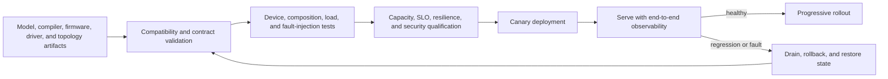

# AI Platform Verification, Operations, and Deployment Blueprint

> **Abbreviation key:** artificial intelligence (AI); central processing unit (CPU); graphics processing unit (GPU); neural processing unit (NPU); service-level objective (SLO); time to first token (TTFT); time per output token (TPOT); key-value (KV) cache; error-correcting code (ECC); continuous integration/continuous deployment (CI/CD).

## 0. Purpose and design ideology

This chapter validates and operates the heterogeneous AI platform as one system. The design ideology is **prove local semantics, then composition, then failure recovery under realistic load**. A device-only benchmark cannot validate placement, storage, networking, state transfer, routing, control reconciliation, or fleet rollout.

## 1. Test architecture and reference boundaries

References include framework/model output, CPU/GPU/NPU execution references, control-plane desired/observed state model, request-state transition model, memory/state ownership scoreboard, collective/transfer simulator, and end-to-end service oracle.

Validation proceeds:

1. artifact/engine compatibility and individual device workers;
2. topology/inventory and placement constraints;
3. control reconciliation, reservations, load/warm/readiness;
4. request routing/admission and local serving;
5. collectives/parallel groups;
6. distributed state transfer and ownership commits;
7. memory/storage/network tiers and backpressure;
8. failures, partition, fencing, recovery;
9. multi-tenant security/fairness;
10. rollout/rollback and capacity under load.

Every scenario records immutable artifacts/configuration, topology, traffic/state distribution, expected transitions and outputs, timing/SLO boundaries, and pass evidence.

## 2. Contract and property tests

Property-test desired-state reconciliation for idempotence, monotonic generations, partial agent failure, stale status, duplicate messages, and controller restart. Placement tests generate topologies/capacities and prove hard constraints, resource conservation, and explainable failure.

Data-plane tests assert one authoritative mutable-state owner, idempotent reservations/transitions, source/destination handoff commit, collective sequence/membership, buffer generations, bounded queues, cancellation, and exactly-once output side effects. Randomize message loss/duplicate/reorder/delay at protocol-permitted boundaries.

Metamorphic AI tests compare coupled/disaggregated execution, device/sharding placements, batching, prefix reuse, and failover/recompute within numerical/quality contract. A placement change may alter reduction order; define expected tolerance/determinism.

## 3. Fault-injection and chaos matrix

Inject artifact corruption, storage slowdown/failure, CPU/GPU/NPU error/reset/ECC, memory exhaustion, IOMMU/protection fault, NoC/link/NIC congestion/down, collective rank hang, state-transfer duplicate/loss/partial copy, agent/controller/router restart, metadata-store partition, worker crash around commit, clock/power/thermal throttle, slow client, and traffic burst.

For each injection record hypothesis, trigger, detector, containment, authoritative state, automatic action, maximum recovery, SLO/user impact, cleanup, and residual verification. Test combinations chosen from dependency graph—such as destination failure plus controller failover—not only independent faults.

Fencing tests prove stale workers/devices cannot write after lease loss/reset/replacement. Health changes do not equal quiescence; use context/group epochs, memory/transport revoke, and hardware reset/drain contracts.

## 4. End-to-end observability model

Use stable identities for deployment/generation, artifact/engine/config, hardware/topology/group/epoch, request/tenant/trace, route/reservation, scheduler/batch, graph/kernel/command, allocation/KV/state version, collective/transfer/commit, and response chunk.

Telemetry layers:

- control: reconcile latency/errors, desired/ready capacity, placement constraints, reservations, artifact stages, rollout/drain;
- service: arrival/admission/reject, queue by phase, batch/profile, TTFT/TPOT/goodput/quality, cancel/waste;
- device: plan/kernel/command, compute/memory/utilization, queues, HBM/DDR, power/thermal/ECC;
- fabric/storage: bytes, queue, latency, retries, paths, collectives, state transfers, load throughput;
- state: KV/prefix/allocation, owner/version/lease, duplicates/migration/eviction/leaks;
- failure/security: epochs/fencing, faults/recovery, quota/auth violations, audit.

Use timestamp synchronization with known uncertainty and causal IDs. Conservation spans layers: desired reservations = applied + pending/failed; admitted requests = terminal + live; bytes/commands/collectives balance; state has one authority; capacity totals reconcile.

## 5. Performance, capacity, and resilience qualification

Workload matrix spans models/versions, phases, shapes/lengths, precision/quality, tenant mix, arrival/burst, cold/warm/cache state, placement/topology, concurrent non-AI traffic, and failure. Measure open-loop saturation and latency distributions.

Capacity envelope includes storage/model-load rate, CPU preprocessing/control, GPU/NPU compute/memory, device capacity/KV/workspace, NoC/scale-up/scale-out, state-transfer, NIC/output, power/thermal, and failure/rollout reserve. Report the active bottleneck and evidence.

Resilience tests remove one failure domain at increasing load and verify admitted-work completion, reroute/recompute, overload containment, and recovery time. A system meeting SLO only with every device healthy has no failure reserve.

## 6. Release and configuration contract

A platform release bundle pins model/tokenizer, per-device compilers/engines/kernels, runtimes/drivers/firmware, control/data-plane services, schemas/APIs, placement/scheduler policies, state/transfer formats, topology requirements, security/provenance, quality/capacity evidence, infrastructure configuration, and rollback/migration paths.

Compatibility is validated across devices and services before placement. Configuration fields have type/unit/bounds/default, scope, version, provenance, and update mode: static, drain-required, epoch-safe, or dynamic. Cross-field validators protect capacity and timeout order. Every request/trace records effective configuration hash.

## 7. Progressive deployment

Progression: offline artifact/device tests → isolated worker group → synthetic smoke → shadow → small canary → topology/failure-domain canaries → increasing traffic/model regimes → full serving. Promotion gates cover correctness/quality, errors, TTFT/TPOT/goodput, capacity/memory, traffic/collectives/state transfer, power/thermal, and control stability.

Existing requests bind to compatible model/engine/state formats. Drain stops new routing, completes/migrates/cancels under policy, commits outputs/state, quiesces transfers/collectives, unloads artifacts, revokes epochs, and releases resources. Rollback preserves previous artifacts/config and validates path before traffic.

For control/data-plane service rollout, preserve protocol version skew. Use expand/contract schema migrations: readers accept old/new, writers introduce new, backfill/verify, then retire old after all consumers update.

## 8. Incident response and recovery

Alert on user SLO/quality plus causal leading indicators: queue age, admission, capacity reserve, placement failure, load/warm, device queue/reset/ECC, traffic/collective/transfer, state ownership/leak, routing affinity, control reconciliation, and security.

Incident snapshot contains recent changes, immutable build/config/topology, desired/observed state, oldest requests/tasks/transfers, reservations/capacity, state ownership/epochs, device/fabric/storage health, logs/traces/counters, traffic distribution, and safe reproducers.

Mitigation order protects correctness: fence corrupt/stale owner; stop harmful admission/prefill/placement; preserve finish/cleanup capacity; disable faulty route/engine/kernel/policy; shed or reroute; drain/reset/recompute; rollback. Verify state authority and output idempotence after recovery before readiness.

Disaster recovery defines artifact/config/control-state backups, multi-region inventory, re-provision/load time, traffic failover, live-state durability policy, client retry/idempotence, security keys, and post-restore validation. Decide explicitly whether live KV is lost, replicated, or reconstructable.

## 9. Security, compliance, and data governance

Test authentication/authorization, tenant/model quotas, signed artifacts/code, secure boot/attestation as required, IOMMU/context isolation, network policy/encryption, secrets, debug/profiler, memory/state zeroization, audit, data classification/retention, and deletion. Trace/log/sample payloads follow the same protection as requests; operational convenience does not authorize content capture.

## 10. Trade-offs and operational invariants

| Choice | Benefit | Cost |
|---|---|---|
| broad end-to-end canary | realism | capacity, privacy, attribution |
| fault injection in production | real dependencies | controlled risk and safeguards |
| durable live state | failover | latency/capacity/consistency |
| recomputation | simpler state | recovery compute and SLO load |
| global telemetry | correlation | scale, cost, access control |

Invariants: only validated compatible generations serve; one authority exists for mutable state; placement/reservation/capacity conserve; rollout/drain/rollback do not reinterpret live state; stale epochs are fenced; admitted work retains finish/cleanup resources; output side effects are idempotent; telemetry and audit can reconstruct causal ownership; security policy persists across every tier/device.

## 11. Operational bring-up completion

The platform is implementation-reconstructable when another team can define artifacts and APIs, place and load heterogeneous groups, run the distributed request/state protocols, validate model and system semantics, qualify SLO capacity and failure reserve, deploy with version skew, trace any request through hardware/software, fence failures, rollback, and recover the service without relying on unnamed framework or orchestration behavior.

---

← [Distributed AI Serving Data Plane](05_Distributed_AI_Serving_Data_Plane_and_State_Implementation_Blueprint.md) · [SoC/Chiplet AI Index](00_Index.md)
