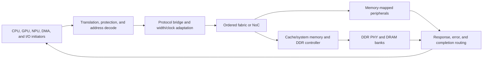
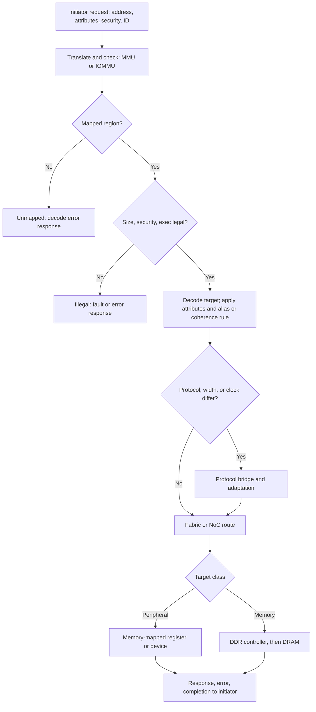

# SoC Address-Map, Protocol, and Memory-Integration Blueprint

> **Abbreviation key:** system on chip (SoC); central processing unit (CPU); graphics processing unit (GPU); neural processing unit (NPU); intellectual property (IP); Advanced eXtensible Interface (AXI); Advanced High-performance Bus (AHB); Advanced Peripheral Bus (APB); double data rate (DDR); dynamic random-access memory (DRAM); error-correcting code (ECC); physical interface (PHY); first-in, first-out queue (FIFO); input-output memory management unit (IOMMU); input/output (I/O).

## 0. Purpose and design ideology

This blueprint turns a collection of CPU, GPU, NPU, memory, and peripheral blocks into one addressable and ordered machine. The design ideology is **contract first, adapters second**: decide global meaning once, then make each endpoint or bridge implement that meaning. A protocol converter that translates signal names but loses ordering, errors, or backpressure is not correct integration.

## 1. System requirements ledger

Start with concurrent use cases, not IP names. For boot, interactive inference, media, storage, networking, idle, and fault/recovery modes, list initiators, targets, traffic rate/burst, latency deadline, ordering/coherence, security context, power state, and error response. Derive worst legal combinations and explicitly state mutually exclusive modes.

Then freeze system-wide constants:

- physical and device-virtual address widths;
- cache-line and coherence granules;
- byte ordering and data widths;
- initiator/source/transaction identifier space;
- security/privilege/virtual-machine attributes;
- clock/reset/power domains;
- interrupt numbering/routing;
- error/poison severity and reporting;
- timebase and performance-counter synchronization;
- feature/version discovery.

Keep these in one reviewed configuration source and generate block-visible artifacts. Duplicated constants drift.

## 2. Memory-map reconstruction

Create a table for every region: base, size, target, aliases, access sizes, cacheability, shareability/coherence, ordering, executable, privilege/security, translation, reset accessibility, power dependency, and behavior for unmapped/illegal access. Check intervals for overlap and address-width truncation.

The table is the static contract; each live transaction resolves against it through the decode decision below, where unmapped or illegal accesses take an explicit error path rather than a silent default. The top-of-page figure shows the standing structure; this one shows the per-transaction path from initiator to target.

Distinguish:

- normal memory, which may be cached, combined, speculated, and reordered according to attributes;
- device memory, where access size/order/side effects matter and speculation may be forbidden;
- configuration/status registers, with field-specific read/write side effects;
- boot/always-on regions, reachable before most domains start;
- peer/chiplet windows, whose locality and failure behavior differ.

An alias must define whether two addresses refer to the same coherent location. Accidental cached and uncached aliases can expose stale data. Memory-map review therefore includes software page attributes and IOMMU mappings, not only decoder RTL.

## 3. Endpoint and transaction contract

For every initiator-target pair, specify address, operation, length/size/burst, data/byte strobes, source/transaction identity, ordering domain, cache/share attributes, protection/security, quality-of-service class, response code, poison, and user metadata. For each channel define ready/valid or credit transfer, payload stability, independent-channel ordering, timeout, retry, cancellation, and reset.

Advanced eXtensible Interface (AXI) has independent address, data, and response channels. A target accepting a write address must retain enough state to associate later data; accepting data first, if allowed by the profile/interconnect, likewise needs buffering. Responses may reorder across IDs but must respect ordering within the relevant ID/domain. State the exact profile rather than saying “AXI compatible.”

Advanced High-performance Bus (AHB) uses a pipelined address/data relationship with more limited outstanding behavior. Advanced Peripheral Bus (APB) is a simple setup/access protocol for low-bandwidth registers. Bridges must translate concurrency and failure, not merely widths.

## 4. Bridge state and correctness

A bridge transaction entry stores upstream ID, address/attributes, burst progress, accepted write beats/byte masks, downstream split/combined operations, downstream IDs, outstanding response count, error/poison, ordering sequence, timeout, and reset epoch. Width conversion maps every byte lane; burst splitting respects boundaries and maximum lengths; clock conversion retains identity across asynchronous storage.

Examples of semantic adaptation:

- AXI-to-APB serializes outstanding operations, performs APB setup/access, and holds later upstream requests without violating response order.
- wide-to-narrow conversion splits beats and combines errors; a partial write needs byte-enable preservation or read-modify-write with atomicity implications.
- cacheable-to-device crossing must not invent speculation or combine accesses with side effects.
- coherent-to-noncoherent DMA requires cache maintenance or an explicit coherent proxy.

Bridge invariants include no accepted byte lost/duplicated, one terminal response per upstream transaction, legal response ordering, no ID reuse while a response is live, and no stale response after reset epoch changes.

## 5. Outstanding IDs, ordering, and backpressure

Partition source IDs by initiator and local transaction index, or maintain a remap table. Size the system ID space for maximum concurrent transactions plus retries and downstream splitting. A remap entry cannot be reclaimed until the final response and all data beats are consumed.

Ordering requires a sequence point. State which transactions may bypass: different IDs, reads versus writes, normal versus device memory, barriers, atomics, and same address. A fence or barrier completes only when all required earlier operations have reached the defined visibility point across buffers and bridges.

Backpressure can form system deadlock. Draw a channel dependency graph: an edge A→B means progress on A may require buffer/service B. Break cycles with separate virtual networks, reserved response/probe/writeback capacity, or strict resource acquisition. Never allow all request buffers to consume storage needed for responses that release those requests.

Queue sizing uses offered rate and service time, then burst analysis. Little’s law $N\approx\lambda L$ provides average occupancy; add headroom for arbitration, refresh, page faults, and correlated masters. Admission should throttle before shared buffers saturate and congestion spreads upstream.

### 5.1 Arbitration and admission policy

State the policy at every shared queue: fixed priority, round-robin, age, weighted share, deadline, or a hybrid. Fixed priority can protect boot/debug or real-time traffic but needs an aging or reserved-service rule for lower classes. Round-robin prevents simple starvation but ignores transaction cost; byte- or credit-based deficit accounting is fairer when bursts differ. Admission limits per initiator keep one master from consuming all IDs or data buffers. The selected policy must name its protected use case, maximum blocking assumption, counters, and workload that loses.

## 6. DDR controller reconstruction

A double data rate (DDR) memory subsystem comprises frontend request queues, address mapping, read/write scheduling, bank/row state, command timing, data-path buffers, refresh/power management, ECC, and a physical interface (PHY).

A request entry stores source/ID, physical address, decoded channel/rank/bank/row/column, read/write, size/byte mask, ordering/QoS, arrival/age/deadline, dependency, data-buffer pointer, ECC/error, and completion. Per-bank state stores open row, timing timestamps or counters, refresh status, power state, and queued requests.

Scheduling must obey timing constraints such as activate-to-read/write, precharge, row-cycle, column-to-column, write-to-read, refresh, and rank/bus turnaround. First-ready first-come first-served improves row hits but can starve row-miss traffic; add age/deadline/fairness limits. Batch writes to reduce bus turnaround, but cap read latency.

Address mapping trades row locality against channel/bank parallelism and security/isolation. A workload with sequential bursts benefits from column bits low in the mapping; adversarial strides can camp on one bank. Validate with the combined initiator trace.

Delivered bandwidth is

$$B_{delivered}=B_{pin}\eta_{commands}\eta_{turnaround}\eta_{refresh}\eta_{balance}\eta_{useful},$$

where each efficiency has a counter-based definition. Peak pin bandwidth alone is not a system guarantee.

ECC flow specifies where check bits live, correction latency, poison propagation, scrub, address/ syndrome capture, interrupt severity, and behavior on partial writes. A partial write may need read-modify-write to generate correct ECC, consuming bandwidth and creating atomicity requirements.

## 7. Clock, reset, and power crossings

For every crossing, record source/destination domains, signal type, rate, data coherence requirement, synchronizer/FIFO/handshake, reset relationship, constraints, and verification. Single control bits can use synchronizers if pulse width and coherency permit; multibit data usually needs handshake or asynchronous FIFO. Gray pointers do not make arbitrary multibit buses coherent.

Power-domain crossings need isolation value/timing, level shifting direction, retention or reinitialization, and quiescence. Before powering a target off:

1. stop admission;
2. drain/cancel transactions according to contract;
3. acknowledge quiescence;
4. isolate outputs;
5. save retained state;
6. gate clock and remove power.

Wake reverses dependencies: valid supply, restore/reinitialize, clock/reset release, protocol credit/identity synchronization, isolation release, then admission. See [Low-Power Architecture](../../../02_Power_and_Low_Power/03_Low_Power_Architecture_and_Domain_Partitioning.md) and [UPF/CPF](../../../02_Power_and_Low_Power/05_UPF_and_CPF_Power_Intent.md).

## 8. Verification and staged build/integration

Generate connectivity/address/attribute checks from the memory-map database. Use protocol assertions at every endpoint and after every bridge. Scoreboard byte values and transaction identities end to end under random backpressure/reordering. Test unmapped/security/device accesses, every burst/width boundary, ID exhaustion, reset mid-transaction, timeout/error, fences/atomics, cache-maintenance/DMA, ECC, refresh, and power transitions.

Integrate in this order:

1. always-on reset/debug, boot memory, and one simple APB register path;
2. one initiator to one SRAM target through the main protocol;
3. width/clock bridges and error paths;
4. DDR with deterministic low concurrency, then many outstanding requests;
5. additional initiators plus ordering/QoS;
6. DMA/IOMMU/coherence boundaries;
7. power-domain quiescence/wake;
8. full concurrent-use-case traffic.

The design is reconstructable when every address has one meaning, every transaction byte/ID has an owner, every ordering point is named, buffer dependencies are proven safe, DDR scheduling is executable, and reset/power cannot strand old identities.

---

Next → [NoC, QoS, I/O, and Chiplet Integration Blueprint](02_NoC_QoS_IO_and_Chiplet_Integration_Blueprint.md)
