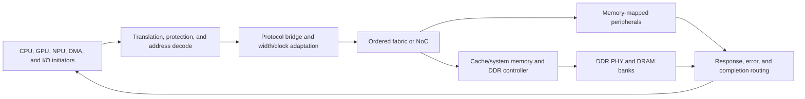
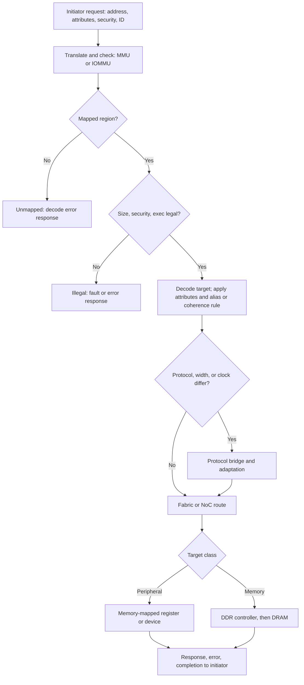
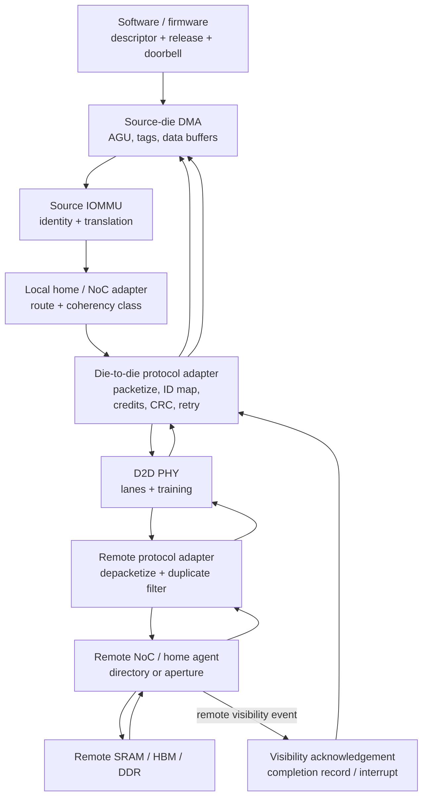

# SoC Address-Map, Protocol, and Memory-Integration Blueprint

> **Abbreviation key:** system on chip (SoC); central processing unit (CPU); graphics processing unit (GPU); neural processing unit (NPU); intellectual property (IP); Advanced eXtensible Interface (AXI); Advanced High-performance Bus (AHB); Advanced Peripheral Bus (APB); double data rate (DDR); dynamic random-access memory (DRAM); error-correcting code (ECC); physical interface (PHY); first-in, first-out queue (FIFO); input-output memory management unit (IOMMU); input/output (I/O).


```mermaid
flowchart LR
    I["CPU, GPU, NPU, DMA, and I/O initiators"] --> MMU["Translation, protection, and address decode"]
    MMU --> BR["Protocol bridge and width/clock adaptation"]
    BR --> FAB["Ordered fabric or NoC"]
    FAB --> PER["Memory-mapped peripherals"]
    FAB --> MC["Cache/system memory and DDR controller"]
    MC --> DRAM["DDR PHY and DRAM banks"]
    PER --> RESP["Response, error, and completion routing"]
    DRAM --> RESP
    RESP --> I
```

## 0. Purpose and design ideology

This blueprint turns a collection of CPU, GPU, NPU, memory, and peripheral blocks into one addressable and ordered machine. The design ideology is **contract first, adapters second**: decide global meaning once, then make each endpoint or bridge implement that meaning. A protocol converter that translates signal names but loses ordering, errors, or backpressure is not correct integration.

## 1. System requirements ledger

Start with concurrent use cases, not IP names. For boot, interactive inference, media, storage, networking, idle, and fault/recovery modes, list initiators, targets, traffic rate/burst, latency deadline, ordering/coherence, security context, power state, and error response. Derive worst legal combinations and explicitly state mutually exclusive modes.

Then freeze system-wide constants:

- physical and device-virtual address widths;
- cache-line and coherence granules;
- byte ordering and data widths;
- initiator/source/transaction identifier space;
- security/privilege/virtual-machine attributes;
- clock/reset/power domains;
- interrupt numbering/routing;
- error/poison severity and reporting;
- timebase and performance-counter synchronization;
- feature/version discovery.

Keep these in one reviewed configuration source and generate block-visible artifacts. Duplicated constants drift.

## 2. Memory-map reconstruction

Create a table for every region: base, size, target, aliases, access sizes, cacheability, shareability/coherence, ordering, executable, privilege/security, translation, reset accessibility, power dependency, and behavior for unmapped/illegal access. Check intervals for overlap and address-width truncation.

The table is the static contract; each live transaction resolves against it through the decode decision below, where unmapped or illegal accesses take an explicit error path rather than a silent default. The top-of-page figure shows the standing structure; this one shows the per-transaction path from initiator to target.


```mermaid
flowchart TD
    A["Initiator request: address, attributes, security, ID"] --> B["Translate and check: MMU or IOMMU"]
    B --> C{"Mapped region?"}
    C -- "No" --> Z["Unmapped: decode error response"]
    C -- "Yes" --> D{"Size, security, exec legal?"}
    D -- "No" --> Y["Illegal: fault or error response"]
    D -- "Yes" --> E["Decode target; apply attributes and alias or coherence rule"]
    E --> F{"Protocol, width, or clock differ?"}
    F -- "Yes" --> G["Protocol bridge and adaptation"]
    F -- "No" --> H["Fabric or NoC route"]
    G --> H
    H --> I{"Target class"}
    I -- "Peripheral" --> J["Memory-mapped register or device"]
    I -- "Memory" --> K["DDR controller, then DRAM"]
    J --> L["Response, error, completion to initiator"]
    K --> L
```

Distinguish:

- normal memory, which may be cached, combined, speculated, and reordered according to attributes;
- device memory, where access size/order/side effects matter and speculation may be forbidden;
- configuration/status registers, with field-specific read/write side effects;
- boot/always-on regions, reachable before most domains start;
- peer/chiplet windows, whose locality and failure behavior differ.

An alias must define whether two addresses refer to the same coherent location. Accidental cached and uncached aliases can expose stale data. Memory-map review therefore includes software page attributes and IOMMU mappings, not only decoder RTL.

## 3. Endpoint and transaction contract

For every initiator-target pair, specify address, operation, length/size/burst, data/byte strobes, source/transaction identity, ordering domain, cache/share attributes, protection/security, quality-of-service class, response code, poison, and user metadata. For each channel define ready/valid or credit transfer, payload stability, independent-channel ordering, timeout, retry, cancellation, and reset.

Advanced eXtensible Interface (AXI) has independent address, data, and response channels. A target accepting a write address must retain enough state to associate later data; accepting data first, if allowed by the profile/interconnect, likewise needs buffering. Responses may reorder across IDs but must respect ordering within the relevant ID/domain. State the exact profile rather than saying “AXI compatible.”

Advanced High-performance Bus (AHB) uses a pipelined address/data relationship with more limited outstanding behavior. Advanced Peripheral Bus (APB) is a simple setup/access protocol for low-bandwidth registers. Bridges must translate concurrency and failure, not merely widths.

## 4. Bridge state and correctness

A bridge transaction entry stores upstream ID, address/attributes, burst progress, accepted write beats/byte masks, downstream split/combined operations, downstream IDs, outstanding response count, error/poison, ordering sequence, timeout, and reset epoch. Width conversion maps every byte lane; burst splitting respects boundaries and maximum lengths; clock conversion retains identity across asynchronous storage.

Examples of semantic adaptation:

- AXI-to-APB serializes outstanding operations, performs APB setup/access, and holds later upstream requests without violating response order.
- wide-to-narrow conversion splits beats and combines errors; a partial write needs byte-enable preservation or read-modify-write with atomicity implications.
- cacheable-to-device crossing must not invent speculation or combine accesses with side effects.
- coherent-to-noncoherent DMA requires cache maintenance or an explicit coherent proxy.

Bridge invariants include no accepted byte lost/duplicated, one terminal response per upstream transaction, legal response ordering, no ID reuse while a response is live, and no stale response after reset epoch changes.

## 5. Outstanding IDs, ordering, and backpressure

Partition source IDs by initiator and local transaction index, or maintain a remap table. Size the system ID space for maximum concurrent transactions plus retries and downstream splitting. A remap entry cannot be reclaimed until the final response and all data beats are consumed.

Ordering requires a sequence point. State which transactions may bypass: different IDs, reads versus writes, normal versus device memory, barriers, atomics, and same address. A fence or barrier completes only when all required earlier operations have reached the defined visibility point across buffers and bridges.

Backpressure can form system deadlock. Draw a channel dependency graph: an edge A→B means progress on A may require buffer/service B. Break cycles with separate virtual networks, reserved response/probe/writeback capacity, or strict resource acquisition. Never allow all request buffers to consume storage needed for responses that release those requests.

Queue sizing uses offered rate and service time, then burst analysis. Little’s law $N\approx\lambda L$ provides average occupancy; add headroom for arbitration, refresh, page faults, and correlated masters. Admission should throttle before shared buffers saturate and congestion spreads upstream.

### 5.1 Arbitration and admission policy

State the policy at every shared queue: fixed priority, round-robin, age, weighted share, deadline, or a hybrid. Fixed priority can protect boot/debug or real-time traffic but needs an aging or reserved-service rule for lower classes. Round-robin prevents simple starvation but ignores transaction cost; byte- or credit-based deficit accounting is fairer when bursts differ. Admission limits per initiator keep one master from consuming all IDs or data buffers. The selected policy must name its protected use case, maximum blocking assumption, counters, and workload that loses.

## 6. Direct memory access engine: from descriptor to visible completion

A direct memory access (DMA) engine is a programmable transaction generator. Software describes movement; hardware fetches the description, generates addresses, issues many reads and writes, absorbs variable latency, and reports completion. The CPU is removed from the **per-byte** loop, not from setup, ownership, protection, and completion.

Do not confuse four related blocks:

| Block | Typical job | Who issues work? | Address pattern |
|---|---|---|---|
| simple register DMA | one contiguous copy/fill | driver writes registers | one-dimensional |
| scatter-gather DMA | linked/ring descriptors | driver/producer posts descriptors | many segments |
| tensor/strided DMA | tile movement and layout transform | kernel, firmware, or command processor | 2D/3D/ND, strides |
| IOMMU | translate/protect device requests | DMA presents an I/O virtual address | not a data mover |

### 6.1 Programmer-visible contract

A minimal channel exposes control, status, descriptor-base/head/tail, interrupt configuration, and fault registers. A production engine normally consumes a descriptor ring so software can queue work without waiting for every transfer.

One representative descriptor is:

```text
source_address
destination_address
x_bytes
y_count, source_y_stride, destination_y_stride
z_count, source_z_stride, destination_z_stride
source/destination address spaces and cache attributes
source/destination requester or process IDs
maximum burst, transfer width, endian/swap/packing mode
interrupt, fence-before, fence-after, coherent/noncoherent mode
next pointer or ring phase bit
software cookie
```

The format must define byte order, alignment, reserved bits, legal zero lengths, maximum counts/strides, address overflow, chaining, and whether a descriptor can cross a page or cache line. Hardware must first copy or otherwise stabilize all fields it uses; rereading a descriptor while software modifies it creates a time-of-check/time-of-use race.

For a producer ring:

1. software writes descriptor contents;
2. software performs the required release/cache-maintenance operation;
3. software updates the tail or writes a doorbell;
4. DMA fetches only entries made visible before that publication;
5. DMA writes completion status/data;
6. DMA performs the specified completion ordering;
7. DMA updates completion head and optionally raises an interrupt;
8. software uses an acquire operation before consuming completion/data.

Head/tail wrap needs either one unused slot, a generation/phase bit, or unbounded counters. Equality alone cannot distinguish empty from full after wrap.

### 6.2 Hardware decomposition


```mermaid
flowchart LR
    SW["Driver / command producer<br/>descriptors + doorbell"] --> CSR["CSR, ring head/tail,<br/>channel and security state"]
    CSR --> DF["Descriptor fetch,<br/>prefetch, validate"]
    DF --> SCH["Channel scheduler<br/>QoS + outstanding limits"]
    SCH --> AGU["1D/2D/3D address generators<br/>boundary and burst splitter"]
    AGU --> XL["IOMMU request +<br/>translation cache"]
    XL --> RI["Read issue table<br/>transaction IDs"]
    RI --> FAB["AXI/CHI/NoC/interconnect"]
    FAB --> RB["Read-return reorder/<br/>data/byte-valid buffers"]
    RB --> CVT["Width, alignment, endian,<br/>pack/unpack, optional transform"]
    CVT --> WI["Write issue +<br/>write-response tracker"]
    WI --> FAB
    WI --> CMP["Completion sequencer<br/>status, interrupt, head"]
    FLT["Fault/timeout/reset controller"] --> DF
    FLT --> RI
    FLT --> WI
    FLT --> CMP
```

The blocks are intentionally decoupled:

- **descriptor frontend:** fetches ahead, validates immutable local copies, and converts commands into internal work records;
- **channel scheduler:** shares read IDs, buffers, and bandwidth among channels without starvation;
- **address-generation units (AGUs):** maintain nested-loop counters and source/destination strides;
- **burst splitter:** respects protocol maximums, alignment, page/4-KiB boundaries where required, target windows, and wrap rules;
- **translation frontend:** attaches device/process identity and caches IOMMU translations;
- **read issue table:** maps fabric IDs to descriptor, offset, length, and retry epoch;
- **data/reorder buffers:** hold returned bytes until the corresponding destination range can be written;
- **write engine:** chooses legal strobes/bursts and tracks write responses;
- **completion engine:** waits for all required descendants and publishes one architectural result.

The DMA must never rely on read responses returning in request order unless the interconnect contract guarantees it. A tag table may accept out-of-order responses and either write each correctly tagged segment immediately or reorder them when transformation/stream semantics require order.

### 6.3 Address generation and burst construction

For a three-dimensional copy, a source byte address can be generated as

$$
A_s(i,j,k)=base_s+i+jS_{sy}+kS_{sz},
$$

with analogous destination strides. Here $i$ spans `x_bytes`, $j<y_count$, and $k<z_count`. Counters increment with carry; at each row/plane boundary the AGU adds the programmed stride. Check the **full widened sum** before truncating to the physical/I/O virtual address width.

At each step:

1. find bytes to the next source alignment/boundary;
2. find bytes to the next destination alignment/boundary;
3. cap by protocol maximum burst and remaining row bytes;
4. choose a common legal chunk;
5. generate byte strobes for the first/last unaligned beats;
6. record exactly which destination bytes the returned data owns.

A width converter needs a byte-valid mask and position metadata. For example, copying 11 bytes from an address offset by 3 into a 128-bit destination beat cannot be implemented by shifting data alone; first/last strobes must ensure neighboring bytes are untouched. If the target lacks byte enables, a read-modify-write is necessary and is not safe against another writer unless atomic exclusion is provided.

### 6.4 Outstanding transactions and buffer sizing

To sustain useful bandwidth $B$ with round-trip latency $L$, at least

$$
N_{bytes,\ outstanding}\ge B L
$$

must be in flight. If each read burst carries $C$ useful bytes, the request count is roughly $\lceil BL/C\rceil$, plus headroom for arbitration and variance. Example: 64 GB/s and 250 ns require about 16 KiB of outstanding read data; eight 256-byte requests are only 2 KiB and cannot cover that latency.

Read and write sides are coupled by finite data buffers. Admission requires space for every accepted read response—even if the destination stalls. Safe approaches reserve return-buffer capacity per read, issue only when credits exist, and release the reservation after the last corresponding write consumes it. Otherwise the DMA can fill memory with reads whose responses have nowhere to go and block the writes required to free space.

Per-channel outstanding caps prevent one long copy from monopolizing all IDs. Weighted or deficit arbitration should charge bytes rather than commands when burst sizes differ.

### 6.5 Completion, visibility, fences, and coherence

Three completion notions are different:

1. **read complete:** source bytes reached the DMA;
2. **write accepted:** destination fabric accepted the write;
3. **architectural transfer complete:** all destination writes reached the contract's visibility point, and status publication is ordered after them.

A completion record or interrupt must use the third. On a posted-write fabric, “write request sent” is too early; the DMA may need write responses, a barrier transaction, or a platform-defined ordering point before publishing completion.

For coherent DMA, transactions participate in the coherence domain and use the correct share/cache attributes. For noncoherent DMA:

- before device reads, software cleans dirty CPU cache lines and orders that maintenance before the doorbell;
- before CPU reads device-written data, software waits for DMA completion, invalidates stale CPU lines as required, then performs an acquire;
- ownership of shared buffers must be explicit so CPU and DMA do not concurrently modify the same cache line.

Descriptor, payload, completion, and MMIO doorbell can each occupy different ordering domains. Specify the entire chain; a device interrupt alone is not automatically a memory fence.

### 6.6 IOMMU, virtualization, and page faults

Each DMA request carries a device/requester ID and, when supported, a process address-space ID. The IOMMU selects a device context, performs one- or two-stage translation and permission checks, and returns physical address plus memory attributes. A DMA-side translation lookaside buffer caches results but must obey IOMMU invalidation generations.

A burst that crosses a page can map to noncontiguous physical pages, so split before or during translation. Do not translate only the first byte and assume physical contiguity.

For a recoverable page fault, the DMA retains enough state to resume exactly:

```text
descriptor identity and immutable copy
source/destination logical offset
nested-loop counters
which reads were issued and which data returned
which writes became visible
translation/request epoch
faulting address, access type, requester/process ID
```

Software may resolve the fault and issue a page-response/resume command. The engine must not duplicate already visible writes on replay. If recoverable faults are unsupported, abort the descriptor at a documented partial-completion boundary and report how many bytes may have changed.

Security checks include descriptor fetches themselves, not just payload. One guest/channel must not alter another's descriptor ring, consume all shared resources, reuse stale translations after reassignment, or receive another channel's completion.

### 6.7 Errors, reset, and partial completion

Define outcomes for descriptor-format error, address overflow, translation/protection fault, read/write error, poison/ECC, timeout, interconnect retry, target reset, and channel abort. For each, specify:

- whether later requests stop;
- whether in-flight writes drain or are discarded;
- exact/upper-bound bytes transferred;
- completion/error record contents;
- interrupt behavior;
- whether and where software may resume.

Copies are generally not transactional: an error can leave a partially updated destination. Software that needs all-or-nothing behavior writes into a private buffer and publishes a pointer/version only after successful completion.

Reset uses epochs. Stop new descriptor admission, decide whether accepted work drains or aborts, consume/reject late responses by old epoch, clear reservations/IDs only when safe, and publish terminal errors if software is expected to recover. Reusing a fabric ID immediately after reset without filtering late responses can corrupt unrelated new work.

### 6.8 Worked descriptor walk

Copy a `64 × 32` byte tile from rows spaced 128 bytes apart to tightly packed rows:

```text
x_bytes = 64
y_count = 32
src_y_stride = 128
dst_y_stride = 64
```

For row `j`, the AGUs generate `src + 128j` and `dst + 64j`. With a legal 64-byte burst and aligned bases, the engine issues one read and one write per row. Up to eight rows may be in flight:

```text
read tag 0 -> descriptor D, row 0 -> data slot 0
...
read tag 7 -> descriptor D, row 7 -> data slot 7
```

If row 3 returns first, tag 3 directs its 64 bytes to the row-3 destination. The engine may issue that write immediately because rows do not overlap, while the completion counter remains incomplete until all 32 write responses/order events close their bits. Only then does it write `D.status=success`, advance the completion head, and signal the interrupt.

### 6.9 DMA verification and observability

Fundamental assertions:

- every accepted source byte maps to exactly one intended destination byte;
- no destination byte outside the descriptor mask is modified;
- no read is issued without reserved return-buffer space;
- IDs/tags are not reused while a response can still arrive;
- completion cannot precede every required write visibility event;
- descriptor and payload accesses pass translation/protection with the right identity;
- abort/reset/retry cannot duplicate a non-idempotent visible write;
- ring head never consumes an unpublished descriptor.

Use randomized alignment, sizes, strides, page/burst/cache-line boundaries, response reordering, backpressure, IOMMU invalidations/faults, coherent/noncoherent modes, errors, aborts, and reset. A byte-addressed scoreboard should model memory before/after and independently predict legal partial completion.

Counters: descriptors/bytes, useful versus fabric bytes, average/tail queue latency, outstanding reads/writes, buffer occupancy/full cycles, burst-size distribution, translation hit/walk/fault, source/destination stalls, reorder occupancy, bandwidth per channel, completion latency, retries/timeouts, and error causes.

### 6.10 SoC and chiplet DMA: crossing a die boundary without losing the contract

The SoC/chiplet case owns the reusable DMA engine of §6, but a die boundary adds another transaction machine between its read/write tables and memory. Three cases must not be conflated:

| Case | Initiator | Destination | What crosses die/package |
|---|---|---|---|
| local SoC DMA | DMA on die A | SRAM/DDR controller on die A | ordinary on-die protocol only |
| chiplet-remote DMA | DMA on die A | SRAM/HBM/controller on die B | tunneled AXI/CHI/CXL-like transactions or a native packet protocol |
| endpoint/RDMA | NIC, peer accelerator, or die B | memory aperture on die A | an external requester transaction; local “DMA” may only be the target-side adapter |

An implementation must name who owns translation, ordering, retry, and final completion in each case. “UCIe link present” describes a physical/protocol transport, not the memory semantics by itself.


```mermaid
flowchart TB
    SW["Software / firmware<br/>descriptor + release + doorbell"]
    DMA["Source-die DMA<br/>AGU, tags, data buffers"]
    IOMMU["Source IOMMU<br/>identity + translation"]
    HNA["Local home / NoC adapter<br/>route + coherency class"]
    TX["Die-to-die protocol adapter<br/>packetize, ID map,<br/>credits, CRC, retry"]
    PHY["D2D PHY<br/>lanes + training"]
    RX["Remote protocol adapter<br/>depacketize + duplicate filter"]
    HNB["Remote NoC / home agent<br/>directory or aperture"]
    MEM["Remote SRAM / HBM / DDR"]
    CMP["Visibility acknowledgement<br/>completion record / interrupt"]

    SW --> DMA --> IOMMU --> HNA --> TX --> PHY --> RX --> HNB --> MEM
    MEM --> HNB --> RX --> PHY --> TX --> DMA
    HNB -->|"remote visibility event"| CMP
    CMP --> TX
    TX --> DMA
```

#### 6.10.1 Address ownership and routing

Choose one of two clean address models:

- **globally routed physical aperture:** system address bits or an address-map table select the destination die and target; the source IOMMU returns a system physical address, and the local NoC routes remote regions to the die-to-die adapter;
- **two-stage translation:** source translation yields a fabric/intermediate address plus destination identity, while a remote agent performs a second protection/translation stage before local memory.

The requester/context identity must survive the bridge even if the remote protocol uses a different field width. A remap-table entry holds at least `(source port, source ID, RID/PASID or security domain, ordering class, destination, remote ID, epoch)`. Never hash identities in a way that permits two live transactions to alias. Descriptor fetch, payload, and completion accesses can route to different dies and each must pass its own protection check.

Remote apertures need explicit attributes: coherent or noncoherent, cacheable or device, atomic capability, shareability domain, allowed burst/byte enables, poison behavior, and whether direct peer access is legal. An address decoder alone does not confer coherence.

#### 6.10.2 Protocol adaptation, splitting, and return storage

The source adapter converts on-die transactions into die-to-die packets/flits. It may split one AXI/CHI burst into several packets and merge packets into a wider link flit. For every child packet it records:

```text
parent DMA transaction and byte range
source protocol ID/order domain
remote transaction ID and packet sequence
destination die/port and route/virtual channel
payload-buffer pointer and byte-valid mask
credit reservation
CRC/replay sequence and link epoch
completion/poison/error state
```

All child responses must fold back into exactly one parent response. If the on-die requester permits 256 outstanding IDs but the link adapter exposes only 64 remote IDs, admission must stop at the remap-table limit; ID reuse before the final response risks delivering old data to new DMA work.

Credit reservation spans both directions. Before accepting a remote read, the design must guarantee storage for the returned data and a path for its response; before injecting a write, it must guarantee the remote side can absorb data or return credits without waiting for a resource held by that same write. Use separate request, response, snoop, and data virtual channels—or reserved escape capacity—to break protocol-dependency cycles.

#### 6.10.3 Coherence and the real remote completion point

There are three common coherence organizations:

1. **one package-wide coherent domain:** remote requests enter a home agent/directory that can snoop or recall dirty copies on either die; the bridge carries request, response, data, and snoop traffic on deadlock-safe virtual networks;
2. **coherent proxy at the boundary:** the source or destination bridge aggregates/cache-proxies a remote region and translates coherence protocol locally; proxy state becomes part of the SWMR invariant and must be reset/invalidation-safe;
3. **noncoherent remote aperture:** software or a higher-level runtime performs cache clean/invalidate and explicit ownership transfer around DMA.

Completion must refer to the consumer's visibility domain:

- **link accepted:** transmitter consumed the last flit;
- **remote adapter accepted:** packet passed CRC/replay and entered the remote NoC;
- **remote target accepted:** SRAM/controller/home agent accepted the write;
- **architecturally visible:** the remote coherence/memory ordering point guarantees the next legal observer can obtain it.

Only the last is safe for a descriptor completion unless the programming contract explicitly promises less. A remote acknowledgement, barrier, or ordered completion packet must travel back before the DMA publishes status. For a source buffer reused immediately after a remote read, the corresponding read completion also proves no requester will fetch more bytes from the old contents.

Atomics and fences cannot be decomposed like ordinary copies. An atomic is legal only if one serialization point owns the entire read-modify-write at the remote home/target. A fence cannot complete while earlier posted writes remain in the D2D replay buffer, remote adapter, NoC, home agent, or memory queue if those stages lie before its defined visibility point.

#### 6.10.4 Retry, poison, link reset, and partial completion

A link-layer retry may retransmit a packet after CRC failure. The receiver needs sequence numbers and a duplicate filter/replay contract so an ordinary read or idempotent write can be repeated safely; a non-idempotent atomic must not execute twice. Separate:

- **link retry:** same transaction, hidden below the memory protocol;
- **protocol retry:** target asks the requester to resend later;
- **DMA descriptor retry:** software-visible work is restarted after a reported fault.

Each level needs a distinct identity/epoch. Collapsing them into one retry bit causes duplicate writes or lost completion.

On link down/retrain:

1. stop new remote admission;
2. preserve or fail every accepted remap-table entry;
3. decide whether transmitted-but-unacknowledged writes may be replayed;
4. poison/abort dependent DMA descriptors at a documented byte boundary;
5. bump the link/DMA epoch before IDs are reused;
6. reject late packets from the old epoch;
7. restore credits and routing before reopening queues.

Poison/ECC information must travel with the exact byte range and appear in the DMA completion; silently converting poisoned read data into a successful remote write corrupts two memories. Since a copy is not transactional, software needing atomic publication writes a private remote buffer and updates a pointer/version only after successful visible completion.

#### 6.10.5 The die-to-die bandwidth-delay product dominates

For remote useful bandwidth $B_R$, round-trip latency $L_R$, and average packet payload $C$,

$$
Q_{\text{remote}}\ge B_RL_R,\qquad
N_{\text{remote}}\ge\left\lceil\frac{B_RL_R}{C}\right\rceil,
$$

and delivered bandwidth is bounded by

$$
B_{\text{DMA,remote}}\le\min\!\left(
B_{\text{source}},
B_{\text{local NoC}},
B_{\text{D2D}}\eta_{\text{packet}},
B_{\text{remote NoC}},
B_{\text{memory}},
\frac{N_{\text{remote}}C}{L_R}
\right).
$$

At 256 GB/s and 800 ns, about 205 kB must be live; with 256-byte payloads the floor is 800 outstanding packets. A 128-entry remote-ID table caps useful throughput near 41 GB/s even if the PHY has 256 GB/s of raw bandwidth. Packet headers, CRC/retry, lane repair, protocol bubbles, and small/unaligned transfers reduce $\eta_{\text{packet}}$, so raw lane rate is never the DMA bandwidth.

Place buffers deliberately. Source-die buffering absorbs link credit stalls but costs long wires and SRAM; destination buffering decouples the remote NoC but consumes D2D credits longer. The safe design reserves end-to-end capacity before issue and measures occupancy at source data buffer, TX replay buffer, RX buffer, remote request queue, and completion-return path.

#### 6.10.6 Chiplet-DMA verification and counters

In addition to §6.9:

- prove every source transaction/byte maps bijectively through split/merge/remap entries to the remote target byte;
- prove source ID, requester/security identity, ordering class, poison, and epoch survive both bridge directions;
- prove link acceptance cannot cause architectural DMA completion before remote visibility;
- inject CRC errors, duplicate packets, dropped credits, lane retrain, protocol retry, remote reset, and old-epoch late responses;
- verify coherent snoop/request/response dependency cycles cannot consume all escape capacity;
- verify atomics execute once at one remote serialization point and fences wait through every posted/replay stage;
- compare local and remote copies against the same byte-addressed scoreboard under arbitrary response reordering and backpressure.

Counters should expose useful bytes versus D2D payload/wire bytes, packet-size distribution, local/remote ID-table occupancy, each credit pool, replay depth/count, CRC/poison, link retrains, virtual-channel stalls, remote visibility latency, and per-destination bandwidth. Those measurements separate a DMA limit from a NoC, adapter, PHY, or remote-memory limit.

## 7. DDR controller reconstruction

A double data rate (DDR) memory subsystem comprises frontend request queues, address mapping, read/write scheduling, bank/row state, command timing, data-path buffers, refresh/power management, ECC, and a physical interface (PHY).

A request entry stores source/ID, physical address, decoded channel/rank/bank/row/column, read/write, size/byte mask, ordering/QoS, arrival/age/deadline, dependency, data-buffer pointer, ECC/error, and completion. Per-bank state stores open row, timing timestamps or counters, refresh status, power state, and queued requests.

Scheduling must obey timing constraints such as activate-to-read/write, precharge, row-cycle, column-to-column, write-to-read, refresh, and rank/bus turnaround. First-ready first-come first-served improves row hits but can starve row-miss traffic; add age/deadline/fairness limits. Batch writes to reduce bus turnaround, but cap read latency.

Address mapping trades row locality against channel/bank parallelism and security/isolation. A workload with sequential bursts benefits from column bits low in the mapping; adversarial strides can camp on one bank. Validate with the combined initiator trace.

Delivered bandwidth is

$$B_{delivered}=B_{pin}\eta_{commands}\eta_{turnaround}\eta_{refresh}\eta_{balance}\eta_{useful},$$

where each efficiency has a counter-based definition. Peak pin bandwidth alone is not a system guarantee.

ECC flow specifies where check bits live, correction latency, poison propagation, scrub, address/ syndrome capture, interrupt severity, and behavior on partial writes. A partial write may need read-modify-write to generate correct ECC, consuming bandwidth and creating atomicity requirements.

## 8. Clock, reset, and power crossings

For every crossing, record source/destination domains, signal type, rate, data coherence requirement, synchronizer/FIFO/handshake, reset relationship, constraints, and verification. Single control bits can use synchronizers if pulse width and coherency permit; multibit data usually needs handshake or asynchronous FIFO. Gray pointers do not make arbitrary multibit buses coherent.

Power-domain crossings need isolation value/timing, level shifting direction, retention or reinitialization, and quiescence. Before powering a target off:

1. stop admission;
2. drain/cancel transactions according to contract;
3. acknowledge quiescence;
4. isolate outputs;
5. save retained state;
6. gate clock and remove power.

Wake reverses dependencies: valid supply, restore/reinitialize, clock/reset release, protocol credit/identity synchronization, isolation release, then admission. See [Low-Power Architecture](../../../02_Power_and_Low_Power/03_Low_Power_Architecture_and_Domain_Partitioning.md) and [UPF/CPF](../../../02_Power_and_Low_Power/05_UPF_and_CPF_Power_Intent.md).

## 9. Verification and staged build/integration

Generate connectivity/address/attribute checks from the memory-map database. Use protocol assertions at every endpoint and after every bridge. Scoreboard byte values and transaction identities end to end under random backpressure/reordering. Test unmapped/security/device accesses, every burst/width boundary, ID exhaustion, reset mid-transaction, timeout/error, fences/atomics, cache-maintenance/DMA, ECC, refresh, and power transitions.

Integrate in this order:

1. always-on reset/debug, boot memory, and one simple APB register path;
2. one initiator to one SRAM target through the main protocol;
3. width/clock bridges and error paths;
4. DDR with deterministic low concurrency, then many outstanding requests;
5. additional initiators plus ordering/QoS;
6. DMA/IOMMU/coherence boundaries;
7. power-domain quiescence/wake;
8. full concurrent-use-case traffic.

The design is reconstructable when every address has one meaning, every transaction byte/ID has an owner, every ordering point is named, buffer dependencies are proven safe, DDR scheduling is executable, and reset/power cannot strand old identities.

## References

1. Arm, [AMBA AXI and ACE Protocol Specification](https://developer.arm.com/documentation/ihi0022/latest/) — channels, bursts, IDs, responses, ordering, and atomic/coherent attributes.
2. RISC-V International, [RISC-V IOMMU Architecture Specification](https://docs.riscv.org/reference/iommu/) — device/process contexts, translation, invalidation, fault and page-request queues, and hardware integration guidance.
3. Arm, [CoreLink DMA-330 DMA Controller Technical Reference Manual](https://developer.arm.com/documentation/ddi0424/latest/) — a concrete multichannel programmable DMA architecture.
4. UCIe Consortium, [UCIe Specifications](https://www.uciexpress.org/specifications) — standardized package-level die-to-die physical, adapter/protocol, software, and compliance layers; the transport boundary used for the chiplet-DMA adaptation in §6.10.

---

Next → [NoC, QoS, I/O, and Chiplet Integration Blueprint](02_NoC_QoS_IO_and_Chiplet_Integration_Blueprint.md)
