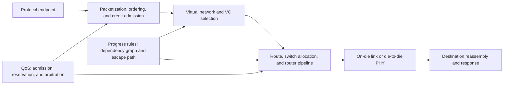
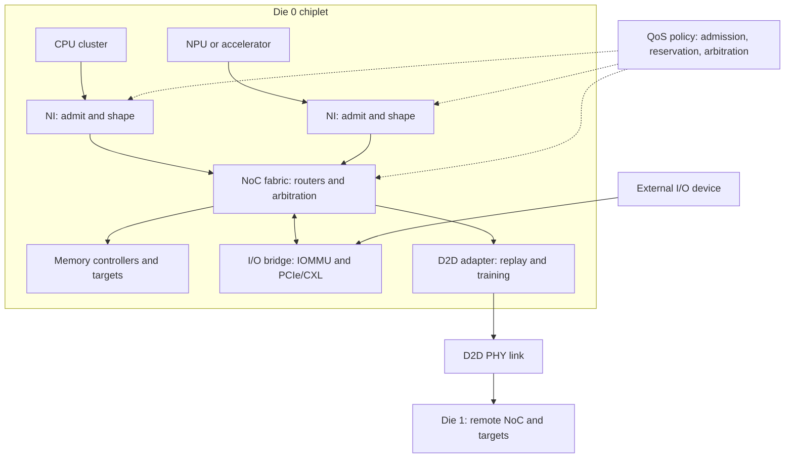

# SoC NoC, QoS, I/O, and Chiplet-Integration Blueprint

> **Abbreviation key:** system on chip (SoC); network on chip (NoC); virtual channel (VC); quality of service (QoS); input/output (I/O); input-output memory management unit (IOMMU); Compute Express Link (CXL); Universal Chiplet Interconnect Express (UCIe); forward error correction (FEC); physical interface (PHY).

## 0. Purpose and design ideology

A network on chip (NoC) transports transactions among endpoints while chiplet and I/O links extend transport across different clock, power, trust, and failure domains. The design ideology is **make progress structural and performance policy explicit**. Correctness must not depend on average traffic being low; quality of service (QoS) must not be a priority bit with no admission or bandwidth model.

The sections below detail one mechanism each; they compose into a single integrated interconnect. The map below shows how: network interfaces admit and shape endpoint traffic, a router fabric transports and arbitrates it, I/O bridges attach external devices through translation, and die-to-die links extend the fabric to another chiplet—while QoS regulates admission and arbitration throughout. The top-of-page diagram traces one packet's path through these blocks; this one shows how the blocks are wired together.

## 1. Traffic and endpoint contract

Build a traffic-class table. For each request, response, write data, probe, acknowledgement, interrupt, page-fault, debug, and real-time stream, record packet size, source/destination set, injection rate/burst, latency/deadline, ordering, loss/retry, security, and dependency on other classes.

A network-interface packet contains destination or route, source, transaction ID, class/virtual network, ordering sequence, address/operation/attributes, length/byte mask, payload, poison/error, and epoch. The interface packetizes protocol channels, allocates credits, reassembles responses, and maps errors. It must not create a network transaction until required end-to-end resources can safely accept it, or it must retain rollback state.

## 2. Router and link reconstruction

A wormhole or virtual-channel router contains input link receivers, per-input/per-virtual-channel buffers, route computation, virtual-channel allocator, switch allocator, crossbar, output credits, and output link pipeline. A packet is divided into flow-control digits (flits). The head flit selects route and reserves downstream state; body/tail follow.

Per virtual channel store buffer read/write pointers/count, packet/route metadata, allocated downstream virtual channel, head/body/tail state, age/QoS, and error. Per output store downstream credits and arbitration state. Credit conservation is fundamental:

$$credits_{available}+flits_{in\ flight}+slots_{occupied}=buffer\ capacity$$

under the chosen accounting boundary.

A cycle path may be buffer write → route calculation → virtual-channel allocation → switch allocation → crossbar → link. Pipeline boundaries depend on clock/wire length. Speculative allocation can combine stages when the desired output is likely free, but requires a fallback if allocation loses.

## 3. Topology, routing, and bandwidth sizing

Choose mesh, ring, tree, crossbar, hierarchical, or custom topology from physical placement and traffic matrix. A crossbar has low hop count but wiring/arbitration scale poorly; a mesh has local wires and scalable replication but multiple hops and bisection limits.

For a link of $w$ payload bits at frequency $f$ with protocol utilization $\eta$, one-direction bandwidth is $B=wf\eta$. Compare offered traffic on each cut with cut capacity, not only endpoint injection. For traffic matrix $D_{sd}$ and routing indicator $R_{sd,l}$, offered bytes on link $l$ are

$$L_l=\sum_{s,d}D_{sd}R_{sd,l}.$$

Require headroom for bursts, responses, errors, and uncertainty. Average link utilization near 100% creates unbounded queueing; design targets depend on latency/SLO and traffic variability.

Deterministic dimension-order routing is simple to analyze but can imbalance traffic. Adaptive routing uses alternative paths based on congestion but needs safe escape channels and can reorder packets. Ordered protocol domains may need destination reordering or pinned routes.

## 4. Deadlock, livelock, and starvation

Construct a channel-dependency graph. Each virtual channel or buffer class is a node; an edge indicates holding one resource while requesting another. A cycle permits deadlock. Break cycles by routing restrictions, separate virtual networks, ordered virtual-channel classes, or an acyclic escape route.

Protocol deadlock extends beyond routers. A cache request may wait for a probe response while probe packets wait behind requests. Reserve distinct progress resources end to end. Network-level deadlock freedom cannot compensate for an endpoint buffer cycle.

Adaptive routing also needs livelock prevention—limit deflections or guarantee escape progress. Arbitration needs starvation bounds through age promotion, deficit accounting, or maximum service gaps. State the fairness assumption used by liveness proofs.

## 5. QoS as admission plus service

QoS has three layers:

1. **admission/shaping:** token bucket, outstanding cap, or bandwidth reservation limits offered load;
2. **classification:** traffic maps to priority/latency/bandwidth domains;
3. **service:** weighted round-robin, deficit round-robin, strict priority with aging, deadline, or time-division schedules allocate contested links/targets.

A token bucket with rate $r$ and depth $b$ permits long-term rate $r$ and burst $b$. Downstream queues must accommodate the aggregate permitted bursts or admission domains must coordinate. Strict priority gives low high-class latency but can starve background traffic; weighted policies provide shares only when all bottlenecks honor the same class and endpoints do not reclassify.

Measure latency distribution per class decomposed into source wait, network-interface wait, router queue, serialization, destination wait, and response. A NoC priority cannot fix a saturated DDR bank or blocked target.

## 6. IOMMU and I/O integration

An input-output memory management unit (IOMMU) maps device-visible addresses to physical memory and enforces per-process/device access. The I/O transaction carries requester/process identity, access type, ordering/atomic attributes, and address-translation-service state. Translation caches, page walkers, invalidation, fault queues, and replay need the same generations and progress reservations as CPU/NPU translation.

For PCI Express or Compute Express Link (CXL), define which protocol semantics terminate at the controller and which propagate into the SoC: posted/non-posted/completion traffic, ordering, coherency, memory/device/cache roles, atomics, errors, hot reset, link down, and poison. A bridge must preserve the strongest required ordering while avoiding unnecessary global serialization.

I/O coherence requires a named home/serialization point and device cache-maintenance/fence semantics. Noncoherent devices require software cache maintenance and explicit ownership transfer. Do not mix these modes per page without a consistent attribute path.

## 7. Chiplet and die-to-die link

A chiplet boundary needs logical protocol adapter, packet/replay layer, link training, lane/physical layer, clocking, power management, test, security, and package assumptions. Universal Chiplet Interconnect Express (UCIe) is one possible standard boundary; the implementation still chooses protocol profile, width, rate, lanes, repair, and power states.

Link state includes training phase, negotiated width/rate, lane map/repair, sequence numbers, replay buffer, acknowledgement, cyclic-redundancy-check status, retry count, timeout, credit state, power state, and epoch. Error detection may trigger replay; forward error correction (FEC) trades latency/area/power for corrected error rate. Define the residual-error and link-failure response.

Usable link bandwidth is

$$B_{useful}=N_{lanes}R_{lane}\eta_{encoding}\eta_{packet}\eta_{retry},$$

and latency includes adapters, serialization, pipeline, flight, retiming, retry/FEC, and remote NoC/target. A die split saves yield/reticle constraints but turns local wires into energy-intensive serialized traffic. Partition high-bandwidth, fine-grained, latency-sensitive loops carefully.

Reset/failure is distributed. On one die reset, stop injection, quiesce or terminate outstanding transactions, exchange epochs, retrain/reinitialize credits, invalidate stale remote state as required, and report lost work. Link-down behavior must not leave coherence ownership on an unreachable die without a system recovery strategy.

## 8. Physical, package, and thermal consequences

Topology follows floorplan. Place routers near endpoint clusters, pipeline long global links, and budget clock-domain crossings. Buffer memories and crossbars contribute area/leakage; link toggles and wide data paths dominate dynamic power. Congestion can force detours that invalidate latency assumptions.

Chiplet PHYs consume die edge, bumps, package routes, clocks, and power delivery. Simultaneous switching and thermal hot spots affect sustainable rate. Include package loss/crosstalk, lane repair, manufacturing test, known-good-die strategy, and link margin in architecture trade-offs.

## 9. Verification, counters, and staged build

Network invariants include: no flit is created, lost, duplicated, or reordered beyond its declared domain; input/output buffer bounds and credits are conserved; a packet retains one route/transaction identity through reassembly; escape routing remains reachable; error/replay never exposes a corrupt packet as valid; reset epochs reject old traffic; and every admitted packet eventually ejects or reports a terminal error under the stated fairness and link assumptions.

Formally or exhaustively check route legality, credit conservation, buffer bounds, packet integrity, ordering, escape reachability, and arbitration progress on tractable configurations. Random traffic covers all source/destination/class combinations, bursts, hot spots, backpressure, errors, clock ratios, power changes, lane failure, retraining, reset epochs, and I/O faults. Compose protocol and network scoreboards so a packet-correct network cannot hide a transaction-order bug.

Counters include offered/admitted bytes, source throttle, per-VC occupancy/full, hop/queue/serialization latency, allocator loss, link utilization, cut imbalance, class service/share/starvation age, endpoint backpressure, retries/FEC/errors, width/rate/power state, IOMMU hit/walk/fault, and transaction timeout.

Build:

1. one router/network interface and packet integrity;
2. a small deterministic-routing topology with credit proof;
3. separate progress virtual networks and protocol traffic;
4. endpoint QoS plus admission under overload;
5. clock/power crossings and resets;
6. IOMMU and I/O protocol bridges;
7. one die-to-die link with training/replay;
8. full topology, adaptive routes, lane repair, and failure recovery.

The layer is reconstructable when routes, buffers, credits, dependencies, service policies, translation, remote ordering, link errors, epochs, and physical limits are all explicit.

---

← [Address/Protocol/Memory Blueprint](01_Address_Map_Protocols_and_Memory_Integration_Blueprint.md) · next → [Full-Chip Verification and Bring-up](03_Full_Chip_Integration_Verification_and_Bringup_Blueprint.md)
