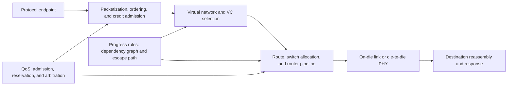
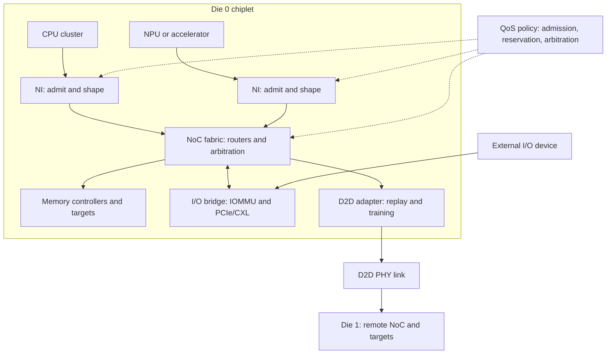
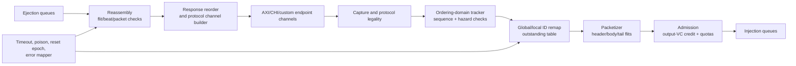
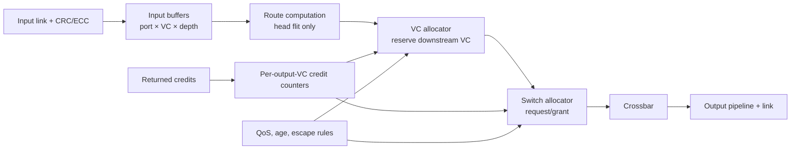

# SoC NoC, QoS, I/O, and Chiplet-Integration Blueprint

> **Abbreviation key:** system on chip (SoC); network on chip (NoC); virtual channel (VC); quality of service (QoS); input/output (I/O); input-output memory management unit (IOMMU); Compute Express Link (CXL); Universal Chiplet Interconnect Express (UCIe); forward error correction (FEC); physical interface (PHY).


```mermaid
flowchart LR
    E["Protocol endpoint"] --> NI["Packetization, ordering, and credit admission"]
    NI --> VC["Virtual network and VC selection"]
    VC --> R["Route, switch allocation, and router pipeline"]
    R --> LINK["On-die link or die-to-die PHY"]
    LINK --> DST["Destination reassembly and response"]
    Q["QoS: admission, reservation, and arbitration"] --> NI
    Q --> R
    P["Progress rules: dependency graph and escape path"] --> VC
    P --> R
```

## 0. Purpose and design ideology

A network on chip (NoC) transports transactions among endpoints while chiplet and I/O links extend transport across different clock, power, trust, and failure domains. The design ideology is **make progress structural and performance policy explicit**. Correctness must not depend on average traffic being low; quality of service (QoS) must not be a priority bit with no admission or bandwidth model.

The sections below detail one mechanism each; they compose into a single integrated interconnect. The map below shows how: network interfaces admit and shape endpoint traffic, a router fabric transports and arbitrates it, I/O bridges attach external devices through translation, and die-to-die links extend the fabric to another chiplet—while QoS regulates admission and arbitration throughout. The top-of-page diagram traces one packet's path through these blocks; this one shows how the blocks are wired together.


```mermaid
flowchart TB
    subgraph D0["Die 0 chiplet"]
        CPU["CPU cluster"] --> NIa["NI: admit and shape"]
        NPU["NPU or accelerator"] --> NIb["NI: admit and shape"]
        NIa --> FAB["NoC fabric: routers and arbitration"]
        NIb --> FAB
        FAB --> MC["Memory controllers and targets"]
        FAB <--> IOB["I/O bridge: IOMMU and PCIe/CXL"]
        FAB --> D2Da["D2D adapter: replay and training"]
    end
    DEV["External I/O device"] --> IOB
    D2Da --> PHY["D2D PHY link"]
    PHY --> D1["Die 1: remote NoC and targets"]
    QOS["QoS policy: admission, reservation, arbitration"] -.-> NIa
    QOS -.-> NIb
    QOS -.-> FAB
```

## 1. Traffic and endpoint contract

An endpoint speaks a transaction protocol such as AXI or CHI; a router speaks packets and flits. The **network interface (NI)** is the semantic boundary between them. Build a traffic-class table before choosing topology:

| Class | Example producer → consumer | Carries data? | May wait for | Must make progress despite |
|---|---|---:|---|---|
| request | core/DMA → cache home | sometimes | response/data | unrelated requests |
| response | target/home → requester | sometimes | requester buffer | request congestion |
| write data | requester → target/home | yes | write response | read traffic |
| probe/snoop | home → cache | no | probe response | requests awaiting those probes |
| probe response/writeback | cache → home | maybe | acknowledgement | probe traffic |
| interrupt/fault | device/IOMMU → CPU | small | service queue | bulk data |

For every class record packet size, source/destination set, injection rate and burst, latency/deadline, ordering, loss/retry, security, and dependencies. Classes that depend on each other must not form a cycle through finite buffers.

### 1.1 Network-interface microarchitecture


```mermaid
flowchart LR
    EP["AXI/CHI/custom endpoint channels"] --> CAP["Capture and protocol legality"]
    CAP --> ORD["Ordering-domain tracker<br/>sequence + hazard checks"]
    ORD --> ID["Global/local ID remap<br/>outstanding table"]
    ID --> PKT["Packetizer<br/>header/body/tail flits"]
    PKT --> ADM["Admission<br/>output-VC credit + quotas"]
    ADM --> INJ["Injection queues"]
    EJ["Ejection queues"] --> RASM["Reassembly<br/>flit/beat/packet checks"]
    RASM --> REO["Response reorder<br/>and protocol channel builder"]
    REO --> EP
    ERR["Timeout, poison, reset epoch,<br/>error mapper"] --> ID
    ERR --> RASM
```

An NI outstanding entry typically stores:

```text
endpoint/source ID and global NoC transaction ID
address, operation, size, byte mask, attributes
ordering domain and sequence number
expected packet/flit/beat counts
destination and selected virtual network/VC
response destination/buffer reservation
split-child completion bitmap and accumulated error
timeout, retry, poison, and reset epoch
```

The NI must reconcile protocol channels that are independent on the endpoint but combined in the network. For an AXI write, address and data can arrive independently; packetization begins only when enough metadata/data is present or the NI reserves state to accept the remainder without deadlock. A wide endpoint beat may become multiple flits; several narrow beats may share a flit, but byte strobes and beat boundaries remain reconstructable.

Admission is an architectural operation, not just `ready = !full`. Before accepting a transaction that cannot be replayed, reserve the outstanding entry, packet storage, destination/response resources required by the contract, and a legal virtual channel. Otherwise a half-accepted transaction can hold one protocol resource while waiting indefinitely for another.

### 1.2 Packet and flit format

A packet has a head flit, zero or more body flits, and a tail indication. A head commonly includes:

```text
destination/home or route
source and return route
transaction ID
virtual network/traffic class
operation and response expectation
address, size, byte enables, memory/security attributes
ordering domain/sequence
packet length
poison/error and reset epoch
header integrity code
```

Payload flits carry data plus per-flit integrity and byte validity. The tail releases packet-held routing state and may carry end-to-end error detection. The exact format must budget future encodings and define behavior for malformed length, illegal destination, unsupported operation, and integrity failure. A router should not interpret endpoint fields it does not need; minimizing route-critical header bits reduces decode and wire cost.

Fragmentation and reassembly need a rule for interleaving. Wormhole routing normally prevents another packet from using the same allocated VC until the tail, while virtual cut-through may buffer a full packet downstream. If multiple packets with one transaction ID may interleave, add subpacket/beat sequence fields and sufficient reassembly storage.

## 2. Router and link reconstruction

A wormhole/virtual-channel router has five conceptual stages:

1. **input/link receive:** check link framing/integrity and write the flit into the selected input VC;
2. **route computation (RC):** head flit produces a legal output-port set;
3. **virtual-channel allocation (VA):** reserve one downstream VC with space/progress rights;
4. **switch allocation (SA):** choose at most one winning input for each output this cycle;
5. **crossbar/link transmit (ST/LT):** move the flit and account for the downstream slot.


```mermaid
flowchart LR
    LI["Input link + CRC/ECC"] --> BUF["Input buffers<br/>port × VC × depth"]
    BUF --> RC["Route computation<br/>head flit only"]
    RC --> VA["VC allocator<br/>reserve downstream VC"]
    VA --> SA["Switch allocator<br/>request/grant"]
    SA --> XB["Crossbar"]
    XB --> REG["Output pipeline + link"]
    CR["Returned credits"] --> VCST["Per-output-VC credit counters"]
    VCST --> VA
    VCST --> SA
    AGE["QoS, age, escape rules"] --> VA
    AGE --> SA
```

Per input VC store buffer read/write pointers/count, packet/route metadata, allocated downstream VC, head/body/tail state, age/QoS, and error. Per output VC store downstream credit count, reservation owner, and arbitration state. The tail flit releases the downstream-VC reservation after it advances according to the chosen timing convention.

### 2.1 Credit flow control cycle by cycle

If a downstream VC has depth four, its upstream credit counter initializes to four only after both ends agree on the current reset epoch. Sending a flit decrements credit; freeing the corresponding downstream slot eventually returns one credit. Credit conservation is fundamental:

$$credits_{available}+flits_{in\ flight}+slots_{occupied}=buffer\ capacity$$

under the chosen accounting boundary.

Never return a credit when a flit merely moves from link into the input buffer; return it when that input slot is actually reusable. Define whether link/output registers belong inside the accounting boundary. Duplicate credit creates buffer overflow; lost credit causes permanent throughput loss or deadlock.

Ready/valid flow control can replace explicit credits across a short local link, but a pipelined long link still needs enough elastic storage to cover backpressure latency. If the receiver can signal stop only after $L_{bp}$ cycles at one flit/cycle, it needs at least $L_{bp}$ slots beyond the point at which it asserts stop.

### 2.2 Allocation and arbitration

RC can be deterministic (`east until x matches, then north/south`) or return several adaptive candidates. VA arbitrates head flits for downstream VCs; SA arbitrates ready flits for the physical crossbar output. They are separate because several virtual flows share one physical link.

A separable allocator first chooses among VCs on each input and then among inputs for each output. It is cheaper than a global maximum matching but may leave transfers unused. Round-robin prevents simple starvation only if a requester that loses remains visible and the pointer update rule is fair. Add age promotion or a maximum wait guarantee for bounded-latency classes.

Body flits normally reuse the route/VC selected by the head. A malformed or lost tail would leak that reservation, so link integrity, timeout, and reset recovery must explicitly release or reconstruct it.

### 2.3 Pipeline timing and bypass

A logical cycle path may be buffer write → RC → VA → SA → crossbar → link. Physical pipeline cuts depend on wire length, clock target, and SRAM/register implementation; there is no universal “four cycles per hop.” Common optimizations:

- look-ahead routing computes the next router's output before arrival;
- speculative VA/SA requests the switch while assuming a free downstream VC, with a non-speculative retry on loss;
- empty-buffer bypass forwards a flit without an SRAM write/read;
- express links skip routers on frequent long paths;
- input speedup permits more than one flit per input per cycle at greater crossbar/allocator cost.

Every bypass must preserve the same credit, arbitration, error, and ordering rules as the base path. Verification should be able to disable optimizations and compare packet traces.

### 2.4 Worked one-packet walk

Assume packet `P` has head `H`, one data body `B`, and tail `T`:

| Cycle | Router action |
|---:|---|
| 0 | link receiver checks `H`, writes input VC2 |
| 1 | RC selects east; VA requests east VC1 |
| 2 | east VC1 granted; SA requests east crossbar output |
| 3 | `H` crosses, output credit 4→3; route reservation remains |
| 4 | `B` crosses, credit 3→2 |
| 5 | `T` crosses, credit 2→1; reservation releases |
| later | three returned credits restore capacity as slots free |

This table is one illustrative pipeline, not a fixed latency requirement. With bypass, stages may collapse; under contention, VA or SA can repeat for many cycles.

## 3. Topology, routing, and bandwidth sizing

Choose mesh, ring, tree, crossbar, hierarchical, or custom topology from physical placement and traffic matrix. A crossbar has low hop count but wiring/arbitration scale poorly; a mesh has local wires and scalable replication but multiple hops and bisection limits.

For a link of $w$ payload bits at frequency $f$ with protocol utilization $\eta$, one-direction bandwidth is $B=wf\eta$. Compare offered traffic on each cut with cut capacity, not only endpoint injection. For traffic matrix $D_{sd}$ and routing indicator $R_{sd,l}$, offered bytes on link $l$ are

$$L_l=\sum_{s,d}D_{sd}R_{sd,l}.$$

Require headroom for bursts, responses, errors, and uncertainty. Average link utilization near 100% creates unbounded queueing; design targets depend on latency/SLO and traffic variability.

Deterministic dimension-order routing is simple to analyze but can imbalance traffic. Adaptive routing uses alternative paths based on congestion but needs safe escape channels and can reorder packets. Ordered protocol domains may need destination reordering or pinned routes.

### 3.1 Topology is a floorplan and traffic decision

- **crossbar:** one hop and simple semantics for a few endpoints, but input/output muxing and global wires scale poorly;
- **ring:** compact ports and local wiring, but distant traffic consumes several links and one saturated cut limits the ring;
- **mesh:** repeated local routers and physically regular links, but latency and bisection grow with dimensions;
- **tree/fat tree:** natural aggregation and high root bandwidth if provisioned, but common ancestors are contention/failure points;
- **hierarchical hybrid:** local crossbars/rings feed a global mesh/tree, matching clustered floorplans at the cost of boundary queues and another arbitration level.

Create a source–destination demand matrix separately for reads, writes, responses, probes, and multicast. Map each demand through candidate routes, sum link and router-port load, then place the topology over real macro locations. An abstract low-hop topology can lose after placement if its links cross SRAM macros or require repeated pipeline stages.

For a packet with $F$ flits traversing $H$ hops on a link carrying one flit per cycle, an unloaded wormhole estimate is

$$
L \approx L_{NI,src}+H L_{head-hop}+(F-1)+L_{NI,dst},
$$

because the head pays routing/pipeline per hop while body flits follow as a stream. Contention adds queueing at every allocator and target; serialization adds $F-1$. Measure all three rather than quoting one “NoC latency.”

### 3.2 Address routing, table routing, and errors

Address-based routing can decode high address bits into a home/target and then route by coordinates. Table routing supports remap, repair, partitioning, and chiplets but needs protected configuration, version/epoch handling, and a safe boot route. Source routing moves route bits into the packet, simplifying intermediate routers at header cost.

Illegal destinations must terminate with an error or route to a controlled error agent; silently dropping a transaction strands an outstanding entry forever. Routing tables should update only after old traffic is quiesced or carry an epoch so packets cannot switch maps mid-flight.

### 3.3 Multicast, broadcast, and coherence traffic

Coherence probes, TLB invalidations, barriers, and interrupts may be one-to-many. Replicating at the source injects $N$ packets and overloads shared links. In-network multicast replicates only where paths diverge, but a branch must not consume one output while blocking forever on another.

Two implementation choices are:

- reserve all required branch outputs before the head advances, which is simple but increases head-of-line blocking;
- let branches advance independently while retaining per-branch completion state, which needs more buffering and duplicate/error accounting.

An acknowledgement tree can aggregate responses only when protocol semantics permit it. Data-bearing or error-distinct responses generally need identity preserved.

## 4. Deadlock, livelock, and starvation

Construct a channel-dependency graph. Each virtual channel or buffer class is a node; an edge indicates holding one resource while requesting another. A cycle permits deadlock. Break cycles by routing restrictions, separate virtual networks, ordered virtual-channel classes, or an acyclic escape route.

Protocol deadlock extends beyond routers. A cache request may wait for a probe response while probe packets wait behind requests. Reserve distinct progress resources end to end. Network-level deadlock freedom cannot compensate for an endpoint buffer cycle.

Adaptive routing also needs livelock prevention—limit deflections or guarantee escape progress. Arbitration needs starvation bounds through age promotion, deficit accounting, or maximum service gaps. State the fairness assumption used by liveness proofs.

### 4.1 Build the dependency graph across the whole transaction

Suppose a miss request occupies `ReqVC`, the home cannot answer until it sends probes on `ProbeVC`, and a cache's probe response needs `RespVC`. Then record:

```text
ReqVC/home entry -> ProbeVC
ProbeVC/cache probe entry -> RespVC
RespVC -> requester ejection capacity
```

Now add finite target queues, write-data buffers, DMA return buffers, and bridges. A cycle anywhere in this extended graph is a system deadlock even when every router route is deadlock-free. Typical repairs are:

- separate request, response, probe, and writeback virtual networks;
- reserve ejection and target slots before injection;
- forbid a controller from holding one shared buffer while requesting another in the reverse order;
- provide an acyclic escape VC whose routing and arbitration guarantee progress;
- reserve at least one response/probe slot that requests cannot consume.

Virtual channels do not automatically remove deadlock. They remove a dependency only when traffic mapping and resource acquisition make the resulting channel graph acyclic.

### 4.2 Head-of-line blocking and endpoint backpressure

One FIFO containing packets for several outputs can block a ready packet behind a stalled head. Per-VC buffers reduce but do not eliminate this; virtual-output queues or more VCs trade area for independence. At ejection, one slow endpoint must not block unrelated destinations or critical responses.

Timeout is not a proof of progress. It is a recovery mechanism after a liveness contract failed. Define what a timed-out packet owns, how its late response is rejected by epoch/ID, and whether aborting it can safely release all dependent protocol state.

## 5. QoS as admission plus service

QoS has three layers:

1. **admission/shaping:** token bucket, outstanding cap, or bandwidth reservation limits offered load;
2. **classification:** traffic maps to priority/latency/bandwidth domains;
3. **service:** weighted round-robin, deficit round-robin, strict priority with aging, deadline, or time-division schedules allocate contested links/targets.

A token bucket with rate $r$ and depth $b$ permits long-term rate $r$ and burst $b$. Downstream queues must accommodate the aggregate permitted bursts or admission domains must coordinate. Strict priority gives low high-class latency but can starve background traffic; weighted policies provide shares only when all bottlenecks honor the same class and endpoints do not reclassify.

Measure latency distribution per class decomposed into source wait, network-interface wait, router queue, serialization, destination wait, and response. A NoC priority cannot fix a saturated DDR bank or blocked target.

### 5.1 Ordering across a packetized interconnect

The network can preserve, relax, or reconstruct order:

- **pinned route + one VC:** packets from one source/domain cannot overtake in the network;
- **sequence/reorder at destination:** adaptive routes may overtake, but the destination releases operations in sequence;
- **per-address serialization at a home:** requests to one coherence granule serialize there while unrelated addresses remain independent;
- **barrier/fence transaction:** a named ordering point acknowledges only after selected prior traffic is ordered;
- **response reordering at the source NI:** restores endpoint-protocol rules when targets complete out of order.

Do not impose total order on all traffic. Assign an ordering domain/ID and state which pairs may bypass. A DMA completion, CPU fence, device doorbell, and coherent atomic may all depend on the same fabric, so their end-to-end ordering points must agree with the CPU/DMA chapters.

For an atomic executed at a home node, the request packet reaches an atomic queue, obtains the per-line serialization point, updates the line exactly once, and returns a response. Retries must distinguish “not executed” from “executed, response lost.” For fences, an NI may inject a barrier only after all selected prior packets were admitted and then wait for acknowledgements from the required destination/domain.

### 5.2 QoS implementation checks

At each allocator, specify:

- arbitration unit—packet, flit, byte, or time slot;
- weight/credit update rule;
- whether an allocated packet can monopolize the link until tail;
- maximum packet size and therefore maximum non-preemptive blocking;
- age promotion and absolute starvation bound;
- reservation versus work-conserving use of unused bandwidth;
- interaction with escape/progress VCs, which must not be starved by QoS.

End-to-end bandwidth reservation fails if only routers implement it while the source NI, destination ejection queue, IOMMU, cache home, or DDR scheduler uses incompatible priority. Validate QoS with adversarial traffic that saturates both a network cut and the final target.

## 6. IOMMU and I/O integration

An input-output memory management unit (IOMMU) maps device-visible addresses to physical memory and enforces per-process/device access. The I/O transaction carries requester/process identity, access type, ordering/atomic attributes, and address-translation-service state. Translation caches, page walkers, invalidation, fault queues, and replay need the same generations and progress reservations as CPU/NPU translation.

For PCI Express or Compute Express Link (CXL), define which protocol semantics terminate at the controller and which propagate into the SoC: posted/non-posted/completion traffic, ordering, coherency, memory/device/cache roles, atomics, errors, hot reset, link down, and poison. A bridge must preserve the strongest required ordering while avoiding unnecessary global serialization.

I/O coherence requires a named home/serialization point and device cache-maintenance/fence semantics. Noncoherent devices require software cache maintenance and explicit ownership transfer. Do not mix these modes per page without a consistent attribute path.

## 7. Chiplet and die-to-die link

A chiplet boundary needs logical protocol adapter, packet/replay layer, link training, lane/physical layer, clocking, power management, test, security, and package assumptions. Universal Chiplet Interconnect Express (UCIe) is one possible standard boundary; the implementation still chooses protocol profile, width, rate, lanes, repair, and power states.

Link state includes training phase, negotiated width/rate, lane map/repair, sequence numbers, replay buffer, acknowledgement, cyclic-redundancy-check status, retry count, timeout, credit state, power state, and epoch. Error detection may trigger replay; forward error correction (FEC) trades latency/area/power for corrected error rate. Define the residual-error and link-failure response.

Usable link bandwidth is

$$B_{useful}=N_{lanes}R_{lane}\eta_{encoding}\eta_{packet}\eta_{retry},$$

and latency includes adapters, serialization, pipeline, flight, retiming, retry/FEC, and remote NoC/target. A die split saves yield/reticle constraints but turns local wires into energy-intensive serialized traffic. Partition high-bandwidth, fine-grained, latency-sensitive loops carefully.

Reset/failure is distributed. On one die reset, stop injection, quiesce or terminate outstanding transactions, exchange epochs, retrain/reinitialize credits, invalidate stale remote state as required, and report lost work. Link-down behavior must not leave coherence ownership on an unreachable die without a system recovery strategy.

## 8. Physical, package, and thermal consequences

Topology follows floorplan. Place routers near endpoint clusters, pipeline long global links, and budget clock-domain crossings. Buffer memories and crossbars contribute area/leakage; link toggles and wide data paths dominate dynamic power. Congestion can force detours that invalidate latency assumptions.

Chiplet PHYs consume die edge, bumps, package routes, clocks, and power delivery. Simultaneous switching and thermal hot spots affect sustainable rate. Include package loss/crosstalk, lane repair, manufacturing test, known-good-die strategy, and link margin in architecture trade-offs.

## 9. Verification, counters, and staged build

Network invariants include: no flit is created, lost, duplicated, or reordered beyond its declared domain; input/output buffer bounds and credits are conserved; a packet retains one route/transaction identity through reassembly; escape routing remains reachable; error/replay never exposes a corrupt packet as valid; reset epochs reject old traffic; and every admitted packet eventually ejects or reports a terminal error under the stated fairness and link assumptions.

Formally or exhaustively check route legality, credit conservation, buffer bounds, packet integrity, ordering, escape reachability, and arbitration progress on tractable configurations. Random traffic covers all source/destination/class combinations, bursts, hot spots, backpressure, errors, clock ratios, power changes, lane failure, retraining, reset epochs, and I/O faults. Compose protocol and network scoreboards so a packet-correct network cannot hide a transaction-order bug.

Representative router assertions are:

```text
0 <= credit[port][vc] <= DEPTH
send(port,vc) -> credit_before(port,vc) > 0
onehot_or_zero(crossbar_grants_for_each_output)
body_or_tail(input,vc) -> downstream_vc_is_reserved
tail_sent(input,vc) -> eventually reservation_released
accepted_flit(tag,epoch) -> eventually forwarded/ejected/error
no output flit unless a matching valid input flit won
escape-VC packet requests only channels lower in the dependency order
```

End-to-end scoreboards key on source, transaction ID, packet/beat sequence, and epoch. Inject a unique payload pattern per byte so duplicated, lost, misrouted, or incorrectly reassembled data is visible. Formal liveness proofs require explicit assumptions—downstream eventually returns credits, links eventually operate, and fair arbiters eventually grant a continuously eligible request.

Verification should progress through:

1. single router with all ports looped back, exhaustive legal head/body/tail and credit state;
2. two routers with arbitrary backpressure and credit/link latency;
3. smallest topology that can form each routing dependency;
4. protocol NIs with request/response/probe causal traffic;
5. saturation, hot-spot, multicast, adaptive-route, and QoS tests;
6. IOMMU/target stalls, power/clock boundaries, reset, error/replay, and link repair;
7. full-chip traces plus adversarial synthetic traffic.

Counters include offered/admitted bytes, source throttle, per-VC occupancy/full, hop/queue/serialization latency, allocator loss, link utilization, cut imbalance, class service/share/starvation age, endpoint backpressure, retries/FEC/errors, width/rate/power state, IOMMU hit/walk/fault, and transaction timeout.

Build:

1. one router/network interface and packet integrity;
2. a small deterministic-routing topology with credit proof;
3. separate progress virtual networks and protocol traffic;
4. endpoint QoS plus admission under overload;
5. clock/power crossings and resets;
6. IOMMU and I/O protocol bridges;
7. one die-to-die link with training/replay;
8. full topology, adaptive routes, lane repair, and failure recovery.

The layer is reconstructable when routes, buffers, credits, dependencies, service policies, translation, remote ordering, link errors, epochs, and physical limits are all explicit.

## References

1. W. J. Dally and B. Towles, *Principles and Practices of Interconnection Networks*, Morgan Kaufmann, 2004.
2. J. Duato, S. Yalamanchili, and L. Ni, *Interconnection Networks: An Engineering Approach*, Morgan Kaufmann, 2003.
3. Arm, [AMBA CHI Architecture Specification](https://developer.arm.com/documentation/ihi0050/latest/) — packetized coherent request/response/data/snoop channels, node roles, credits, ordering, and progress.
4. RISC-V International, [RISC-V IOMMU Architecture Specification](https://docs.riscv.org/reference/iommu/) — I/O translation and queue/interface requirements at the fabric boundary.

---

← [Address/Protocol/Memory Blueprint](01_Address_Map_Protocols_and_Memory_Integration_Blueprint.md) · next → [Full-Chip Verification and Bring-up](03_Full_Chip_Integration_Verification_and_Bringup_Blueprint.md)
