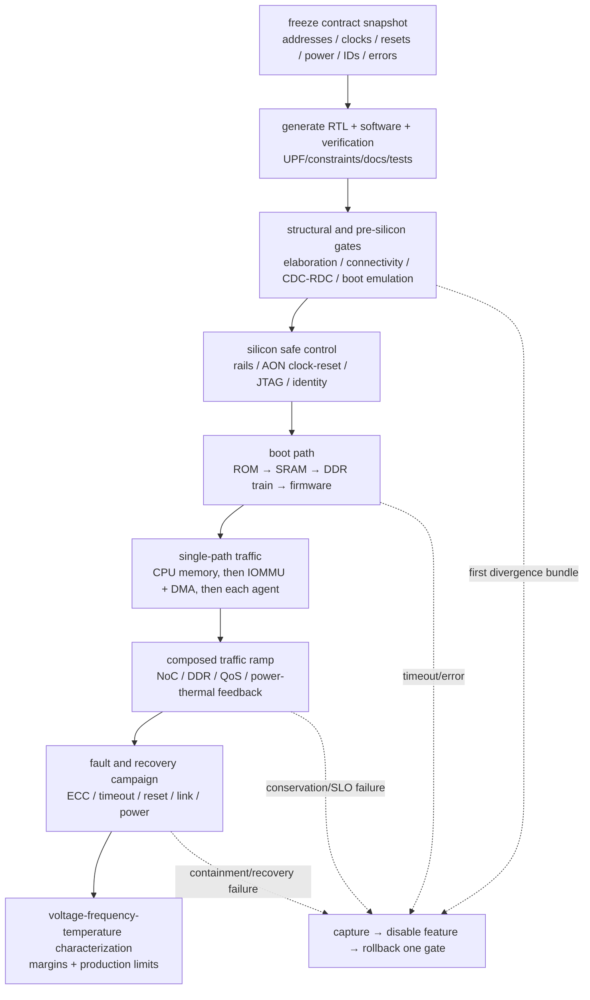

# Full-Chip Integration, Verification, and Bring-up Blueprint

> **Abbreviation key:** system on chip (SoC); central processing unit (CPU); graphics processing unit (GPU); neural processing unit (NPU); artificial intelligence (AI); double data rate (DDR); network on chip (NoC); quality of service (QoS); input-output memory management unit (IOMMU); service-level objective (SLO); Unified Power Format (UPF); Common Power Format (CPF); clock-domain crossing (CDC); reset-domain crossing (RDC); error-correcting code (ECC); Joint Test Action Group debug (JTAG); read-only memory (ROM); serializer/deserializer (SerDes).

## 0. Purpose and design ideology

Full-chip integration is where locally correct blocks encounter incompatible assumptions. A CPU may expect probes during debug halt; an accelerator may power down with DMA outstanding; a bridge may drop an error attribute; firmware may program an address before its target clock exists. The full-chip design ideology is **generate shared truth, verify composed behavior, and bring up by dependency order**.

The deliverable is not merely a top-level connection diagram. It is a system specification linking product modes to addresses, protocols, clocks, resets, power, security, interrupts, performance, error handling, software, verification, physical budgets, and first-silicon gates.

## 1. Full-chip contract database

Maintain machine-readable or otherwise single-source reviewed tables for:

- block instances, versions, features, and ownership;
- address regions and attributes;
- initiator/target/source/transaction identifiers;
- protocol profiles, widths, and outstanding limits;
- interrupt sources, routes, priorities, trigger types, and wake ability;
- clock definitions, generated clocks, frequency modes, and crossings;
- reset sources, sequencing, synchronizers, and retained/cleared state;
- power/voltage domains, supply states, isolation, level shifting, retention, and quiescence;
- security/firewall permissions and debug lifecycle;
- error sources, severity, containment, reporting, and recovery;
- performance events and timestamp domains;
- pins, package/chiplet links, memory channels, and boot straps.

Generate software headers/device description, RTL parameters, verification connectivity, power intent, static constraints, documentation, and tests from this source where practical. At minimum, automate consistency checks so the same address or interrupt cannot acquire two meanings.

## 2. Boot dependency graph

Write boot as a dependency graph rather than a firmware list:

~~~mermaid
flowchart TD
    PWR["always-on supply stable"] --> AONCLK["always-on clock/reset"]
    AONCLK --> DBG["debug + boot straps + identity"]
    AONCLK --> MEM["boot memory path"]
    MEM --> CPU["boot CPU fetch"]
    CPU --> DRAM["DDR PHY training + controller"]
    CPU --> SEC["security / firewalls / IOMMU roots"]
    DRAM --> FW["firmware + runtime load"]
    SEC --> DEV["GPU/NPU/I/O domains"]
    FW --> DEV
    DEV --> OS["OS / services / workloads"]
~~~

For each node state entry condition, action, success evidence, timeout, retry, fallback, and next dependencies. Boot ROM must reach only always-on or already-enabled targets. DDR training failure needs diagnostic status and a defined fallback/recovery; otherwise first failure appears as a CPU fetch hang.

Power-up and reset-release sequence follows isolation and clock dependencies. Protocol credits and link epochs initialize only after both endpoints agree. Firmware must not enable an initiator before its target/firewall/error route is ready.

## 3. Composed verification ladder

Full-chip invariants connect otherwise separate plans: address decoding has exactly one legal target or one defined error target; security attributes cannot be weakened by a bridge; accepted transactions have one terminal response; identifier and credit conservation holds across adapters; reset/power epochs reject stale traffic; coherence has at most one writer; every enabled domain has a progress/error path to always-on control; and software-visible configuration matches the implemented feature set.

### 3.1 Generated structural checks

Verify address decode uniqueness/completeness, connectivity, widths/attributes, interrupt routing, clock/reset/power-domain crossings, isolation/level shifters/retention, tie-offs, protocol adapters, and test/debug access. Compare implementation against the same contract database used by software.

### 3.2 Interface and subsystem verification

Bind protocol assertions at initiator, bridge, network interface, and target. Compose CPU cluster plus memory, accelerator plus DMA/IOMMU, I/O plus coherency boundary, and chiplet endpoint plus remote model. Randomize downstream delay, channel reordering, errors, reset, and power transitions.

### 3.3 Full-chip traffic and software

Use scenario tests that run realistic concurrent agents: CPU boot while display/network traffic runs; GPU/NPU serving with DDR pressure; DMA with CPU cache sharing; storage/network faults; thermal/power throttling; device reset while other agents continue. A full-chip test is valuable when it exercises interactions absent from block tests, not when it repeats one register read through more gates.

Run boot ROM, firmware, operating system, drivers, diagnostics, and representative applications on simulation/emulation. Preserve transaction and architectural scoreboards where speed allows; use assertions, watchdogs, and end-state checks for long runs.

### 3.4 Formal and static composition

Use formal connectivity for addresses/interrupts/security, protocol properties for finite endpoints, deadlock dependency checks, and information-flow/security assertions on critical boundaries. Clock-domain crossing (CDC) and reset-domain crossing (RDC) analysis need functional constraints and waiver evidence. Low-power verification checks power-state legality and isolation/retention sequences against Unified Power Format (UPF) or Common Power Format (CPF) intent.

## 4. System performance reconstruction

For each product use case, create a resource-demand matrix. Rows are workloads/agents; columns are CPU, GPU/NPU, cache, NoC cuts, DDR channels/banks, I/O/chiplet links, power, and thermal limits. Enter rate, burst, deadline, and overlap. Analyze concurrent—not isolated—demand.

End-to-end latency decomposes across software queue, initiator, translation, interconnect, target queue/service, response, and synchronization. Collect timestamped IDs at boundaries to measure each term. Throughput is limited by the most heavily demanded resource after protocol/imbalance efficiency.

For shared resource $j$, require sustainable utilization

$$U_j=\sum_i\lambda_iD_{ij}<U_{target,j},$$

where $\lambda_i$ is workload rate and $D_{ij}$ resource demand per unit work. $U_{target}$ is below one and chosen from burst/tail-latency requirements. If $U_j$ approaches one, queueing delay grows sharply. Validate demand with counters for admitted work and physical traffic.

Service-level objectives (SLOs) require tail analysis. Replay, refresh, thermal throttle, page fault, link retry, interrupt interference, and synchronization create long tails. Report percentiles and worst bounded service where required; average bandwidth cannot establish an interactive deadline.

## 5. Power and thermal closure

Define legal system power states and transitions, not independent block states. A use case specifies active domains, frequency/voltage, retained state, wake sources, latency, and maximum power/temperature. Power-state transitions reserve energy/current and communication capacity; simultaneous domain wake can cause droop.

System power is time-varying:

$$P(t)=\sum_k P_k(activity_k(t),V_k(t),f_k(t),T_k(t))+P_{package/IO}(t).$$

Temperature feeds leakage and frequency; power delivery imposes current and droop limits. Simulate representative phase traces and throttling policy. A design meeting block thermal design power separately can violate package limit when blocks coincide.

Verify clock gating, dynamic voltage/frequency scaling, power gating, isolation, level shifting, retention, always-on logic, and UPF/CPF intent through RTL, gate, and physical signoff. Architecture must budget wake latency and retained capacity; later power-intent syntax cannot invent a safe quiescence protocol.

## 6. Error containment and recovery

Create an error matrix: source, detector, contained scope, data validity/poison, logging, interrupt, retry, reset level, software action, and persistence. Include SRAM/DRAM ECC, parity, protocol timeout, NoC/bridge error, translation/protection fault, watchdog, thermal/droop alarm, PHY/link error, security violation, and firmware assertion.

First-error capture records source, address/transaction/context, syndrome, timestamp, and surrounding state. Subsequent errors should not overwrite the cause unless an explicit queue exists. Propagate poison with identity so consumers do not silently use corrupted data.

Recovery granularity may be transaction retry, queue reset, block reset, power-domain reset, die retrain, or full system reset. Before local reset, prevent new traffic, drain/cancel, reclaim coherent ownership, invalidate translations/state as needed, change epoch, and notify dependents. If local recovery cannot preserve correctness, specify escalation instead of hoping the block restarts.

## 7. Observability and debug fabric

Design a secure path to always-on identity/status, reset cause, clock/power state, boot milestone, error registers, trace routers, performance counters, and block snapshots. Trace must avoid becoming a deadlock dependency or unacceptable side channel. Use triggers, filters, compression, and access control.

Cross-layer correlation requires a global or synchronized timestamp plus transaction/context identifiers. Useful probes mark initiator acceptance, translation completion, NoC injection/ejection, target service, response, command completion, and software event. Bandwidth-limited trace can sample, but first-error and watchdog snapshots should preserve the oldest blocked work and queue/credit state.

Counters state units, scope, speculative/committed boundary, multiplexing, overflow, clock/power behavior, and reset. For each product metric, document the exact raw counters/formula and a conservation check.

## 8. Physical and signoff feedback

Integration reviews floorplan, macro/PHY placement, NoC routes, clock roots, power grid, thermal hot spots, CDC locations, scan/test, and package escape. Long links require pipeline stages; those stages change latency, buffers, protocol timeouts, and simulator parameters. Memory/SerDes PHY placement constrains topology.

Run static timing analysis across modes/corners, CDC/RDC, lint, low-power checks, formal/equivalence, design-for-test and automatic-test-pattern-generation coverage, memory self-test/repair, physical verification, signal integrity, electromigration/IR drop, thermal, and package/link margin. Waivers need owner, rationale, evidence, risk, and expiration/version.

Performance and physical models are versioned together. If placement changes a NoC hop or memory clock ratio, rerun the affected workload/SLO analysis.

## 9. First-silicon bring-up gates

1. **Board/package safety:** continuity, shorts, rails/current limits, straps, clocks, reset.
2. **Always-on access:** scan/JTAG or debug, identity, reset cause, sensors, fuses.
3. **Clock/reset/power domains:** enable one at a time; verify frequency, isolation, retention, current.
4. **Boot path:** ROM fetch, SRAM, serial console, exception/debug trace.
5. **DDR:** PHY training, low-rate patterns, ECC, address/bank/rank sweeps, then speed/traffic.
6. **NoC/protocol:** endpoint walking tests, all routes/widths, errors, saturation, QoS.
7. **Compute agents:** CPU cores, then GPU/NPU diagnostic modes, caches/translation/coherence.
8. **I/O/chiplets:** link training, lane/rate sweeps, retries/errors, IOMMU, DMA/coherence.
9. **Power/thermal:** idle states, wake, dynamic frequency/voltage, simultaneous activity, sensors/throttle.
10. **Software/workloads:** firmware/OS/drivers, stress and AI-serving paths, long reliability.
11. **Characterization:** voltage-frequency-temperature shmoo, power, timing margins, error rates, yield/repair.

Each gate defines instruments, safe limits, expected evidence, timeout, rollback, and data capture. Feature-disable switches and low-concurrency diagnostic modes isolate layers. Do not enable automatic power management or maximum outstanding traffic until the basic path is observable.

### 9.1 One staged run: generated truth → boot → traffic → fault → characterized system

An ad hoc bring-up often jumps from “rails are up” to “try to boot Linux.” When it hangs, hundreds of assumptions changed at once: address map, clock/reset, DDR, firewall, interrupts, coherence, firmware, and power management. The repair is a **monotonic evidence ladder**: each stage enables one new dependency, proves it with an independent observation, and preserves a rollback configuration. No later feature is allowed to hide an earlier failure.

**Gate 0 — freeze and generate the experiment.** Select contract revision `C204`, RTL/build revision, firmware image, package/board revision, fuse/strap profile, and tool versions. Generate address decoders/constants, interrupt routes, software headers/device description, verification register/address models, UPF/CPF bindings, static constraints, and walking/fault tests from that snapshot. Semantic generation checks prove decode uniqueness/completeness, identifier widths, interrupt ownership, legal clock/reset/power crossings, and error-route reachability. The firmware image embeds the expected contract/build identity; silicon exposes its implemented identity through always-on registers. A mismatch stops bring-up before any functional test—software compiled for a different address map cannot produce meaningful evidence.

**Gate 1 — prove safe controllability with no functional traffic.** Apply current-limited rails in dependency order, verify static current and power-good, establish the always-on clock/reset, and read immutable identity/reset-cause through JTAG or another always-on debug path. Hold switchable domains reset/isolated. Evidence is external rail/clock measurement plus two independent digital reads; a current excursion, absent clock, or identity mismatch rolls back to rails-off/reset-asserted. The state enabling this gate is intentionally tiny: always-on reset controller, straps/fuses, debug transport, milestone/error registers, and a watchdog clock.

**Gate 2 — walk the boot dependency graph.** Release the boot CPU at a slow known clock. ROM writes milestone `ROM_ENTRY`, tests a small SRAM window, validates its image, and establishes an exception/serial/JTAG path before touching DDR. Firmware then powers and resets the memory domain, trains the PHY at a conservative rate, records per-lane training margins, runs address/data/ECC patterns, and only then enables cached execution and loads later firmware. Every wait has a timeout and first-error capture `{milestone, PC, target address, clock/reset/power state, error syndrome}`. If DDR fails, remain in SRAM diagnostic mode rather than turning a training problem into an instruction-fetch hang.

**Gate 3 — introduce exactly one transaction path at a time.** First run CPU uncached and cached memory walks while correlating initiator acceptance, NoC route, DDR command, response, and data. Then configure one IOMMU context and run one DMA descriptor from SRAM/DDR to a checked destination: descriptor issue → translation → NoC → memory → completion write → interrupt. Keep outstanding depth one, QoS neutral, one clock mode, power management disabled, and other agents reset. Endpoint walking tests cover each decode target/default error, interrupt, bridge width, and route before performance is attempted. Transaction/byte/credit conservation and a software reference buffer provide pass evidence.

**Gate 4 — ramp composition, not just frequency.** Enable GPU/NPU/I/O agents one at a time at low injection, then run declared concurrency points (for example 25%, 50%, 75% of modeled sustainable NoC/DDR load) before saturation stress. At each point compare demand-matrix predictions with accepted/completed work, queue/credit high-water marks, NoC cut and DDR utilization, row-hit/turnaround/refresh losses, latency percentiles, QoS shares/deadlines, power rails, temperature, and throttling. Only after static clocks pass does the run enable dynamic voltage/frequency scaling, power gating, and full outstanding depth. If enabling one feature changes an older single-path checksum or conservation invariant, return to the last passing composition and replay with boundary trace triggers.

**Gate 5 — fault the healthy path at named lifecycle points.** Inject faults only after the corresponding normal transaction is observable. For the DMA path, inject an IOMMU permission fault before NoC admission, a NoC timeout while the request is live, correctable and uncorrectable memory ECC on data return, interrupt loss, domain reset with work outstanding, and chiplet/link corruption or retrain if present. Each injection has an expected detector, first-error record, poison/data-valid meaning, containment scope, terminal transaction result, retry bound, reset/epoch change, reclaimed resources, and software notification. Then immediately rerun the healthy transaction to prove recovery, not merely error detection. A local retry that completes twice, a reset that leaks credits/ownership, or a fault log overwritten by secondary errors fails the gate even if the system eventually reboots.

**Gate 6 — characterize only after correctness and recovery are stable.** Sweep voltage, frequency, temperature, lane/rate, memory timing modes, and activity combinations with production-like telemetry. Derive safe operating tables and error-rate/margin distributions from repeated points, not a single “boots at” result. Automatic governors and repair policies are validated against those tables and against transient workloads. Characterization cannot repair a missing ordering rule or uncontained fault; it establishes the operating envelope of the already-correct system.

The ladder is enabled by persistent **bring-up control state**: contract/build identity, monotonic boot milestone, reset/power/link epochs, feature-disable and diagnostic-rate controls, per-stage watchdog deadlines, transaction/credit/ownership snapshots, first-error capture, trace trigger/filter state, and safe fallback boot image. These structures cost always-on area, routing, trace SRAM/bandwidth, firmware complexity, verification time, and possible security exposure; access control and production lock-down are part of their architecture. Removing them saves a small amount of PPA but converts first divergence into an unlocalizable board reset—a losing trade during both validation and field RAS.

**Replay bundle and sign-off invariant.** Every run stores contract/generator inputs and output hashes, RTL/netlist/firmware/tool versions, board/lot/unit identity, straps/fuses, test and random seed, stage controls, rail/clock/temperature traces, ordered boot milestones, first error, synchronized transaction trace window, raw counters with units, and pass/fail formulas. Replaying the same pre-silicon configuration must reproduce boundary events; replaying on silicon should reproduce the same milestone and architectural outcome within declared analog/performance tolerance. Assert at all gates: generated consumers agree with `C204`; a milestone cannot advance before its dependencies; disabled/isolated domains receive no accepted traffic; every accepted transaction has one terminal success/error; IDs/credits/ownership are conserved across reset epochs; fault injection reaches the declared detector and containment scope; recovery returns resources before re-enable; and no SLO/power/thermal result is signed off without the raw evidence that reconstructs it.

## 10. Tapeout readiness and reconstruction checklist

A full-chip architecture is ready for implementation/tapeout review when:

- global constants and maps have one source and all consumers are checked;
- boot and power transitions have dependency graphs and failure paths;
- every interface carries ordering, security, errors, backpressure, reset, and epoch semantics;
- end-to-end buffer/channel dependencies have a progress argument;
- concurrent use cases fit bandwidth, latency/SLO, power, thermal, and capacity budgets with margin;
- structural, protocol, memory, coherence, security, low-power, fault, and software tests have owners/coverage;
- physical changes feed back into performance and timeout assumptions;
- observability can find first divergence or oldest blocked transaction;
- first-silicon gates and safe rollback modes exist before tapeout;
- residual risks are quantified experiments with owners, not undocumented assumptions.

---

← [NoC/QoS/I/O/Chiplet Blueprint](02_NoC_QoS_IO_and_Chiplet_Integration_Blueprint.md) · [SoC/Chiplet Blueprint Index](00_Index.md)
