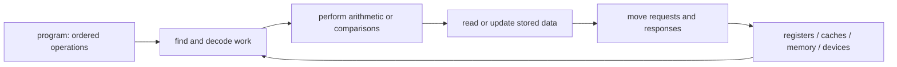

# Architecture Primer — A First Map of the Machine

> **First-time reader orientation:** This page assumes only that you know a computer runs programs. It introduces the vocabulary used by every later chapter. When an abbreviation first appears, the full phrase is written first and the abbreviation follows in parentheses—for example, **central processing unit (CPU)**. Later pages repeat important expansions so they can also be read independently.
> **Prerequisites:** none beyond basic arithmetic and curiosity about how software becomes hardware activity.
> **Hands off to:** [Central processing unit (CPU) Architecture](../../01_CPU_Architecture/00_Index.md), [Graphics processing unit (GPU) Architecture](../../02_GPU_Architecture/00_Index.md), [Neural processing unit (NPU) Architecture](../../03_NPU_Architecture/00_Index.md), [System-on-chip (SoC) and Chiplet Architecture](../../04_SoC_and_Chiplet_Architecture/00_Index.md), and [Performance Analysis](../02_Performance_Analysis/00_Index.md).

---

## 0. Why this page exists

Hardware writing often becomes inaccessible by compressing an entire mechanism into an abbreviation. A sentence such as “the out-of-order (OoO) core misses in the translation lookaside buffer (TLB), allocates a miss status holding register (MSHR), and sends an Advanced eXtensible Interface (AXI) request through the network on chip (NoC)” may be precise yet still overload a new reader with five unfamiliar mechanisms. The missing piece is not intelligence; it is a map.

The map begins with one idea: **a chip is a collection of state-holding structures connected by paths that move requests and data**. Registers, queues, caches, and memories hold state. Pipelines, buses, and networks move work. Control logic decides when a movement is legal. Performance problems arise when a required structure is empty, full, busy, too far away, or waiting for another event.

## 1. Architecture, instruction set, microarchitecture, and implementation

These four layers answer different questions:

| Layer | Plain-language question | Example |
|---|---|---|
| **System architecture** | What major agents and memories exist, and how do they cooperate? | four CPU cores, one GPU, shared memory, and an I/O fabric |
| **Instruction set architecture (ISA)** | What operations and visible state does software rely on? | integer add, load, store, registers, exceptions, and memory-order rules |
| **Microarchitecture** | What hidden machinery implements that contract? | a six-wide out-of-order pipeline with a 256-entry reorder buffer |
| **Physical implementation** | How are those structures realized as gates, wires, memories, clocks, and layout? | static random-access memory (SRAM) macros, standard cells, clock trees, and routed metal |

Software must not depend on most microarchitectural details. Two processors can implement the same ISA with different pipelines and still run the same binary. The ISA says *what must be true*; the microarchitecture chooses *how to make it true efficiently*.

## 2. Time: clock, latency, throughput, and utilization

A synchronous chip uses a **clock** to divide time into cycles. Frequency is cycles per second: a 2 gigahertz (GHz) clock produces two billion cycles each second, so one cycle is $1/(2\times10^9)=0.5$ nanoseconds (ns).

- **Latency** is the time from starting one operation to receiving its result.
- **Throughput** is how many operations complete per unit time once the machine is busy.
- **Initiation interval (II)** is the number of cycles between starting successive operations.
- **Utilization** is the fraction of available capacity doing useful work.

A four-stage pipeline may have four-cycle latency but accept one new item every cycle. After filling, its throughput is one item per cycle. Confusing latency with throughput is one of the most common architecture mistakes.

## 3. Parallelism: doing more than one thing at a time

Different machines exploit different kinds of parallelism:

- **Instruction-level parallelism (ILP):** independent instructions from one thread execute together.
- **Thread-level parallelism (TLP):** multiple software threads run together.
- **Data-level parallelism (DLP):** one operation applies to many data elements.
- **Memory-level parallelism (MLP):** multiple memory accesses are outstanding together.

A CPU often spends silicon discovering ILP dynamically. A graphics processing unit (GPU) relies on many ready threads and DLP. A neural processing unit (NPU) maps regular tensor loops onto arrays of multiply-accumulate units. None is universally “faster”; each is efficient for a different shape of work.

## 4. State, requests, queues, and backpressure

A **request** asks another block to do something: read an address, write data, translate an address, or invalidate a cache copy. The destination eventually returns a **response**. A request that has been accepted but not completed is **outstanding**.

Queues decouple a producer from a consumer. If a consumer can accept four entries and all four are occupied, it applies **backpressure**: a signal or protocol rule that makes the producer stop. Backpressure is not an error; it is how a finite machine remains lossless. It becomes a performance problem when queues remain full and useful work cannot enter.

**Ordering** answers which requests may pass one another. **Flow control** ensures storage exists before data moves. **Arbitration** chooses among requesters competing for one resource. **Quality of service (QoS)** adds policy such as bandwidth shares or latency priority.

## 5. Compute, memory, and interconnect

Nearly every architecture decomposes into three interacting resources:

1. **Compute** performs arithmetic, logical operations, comparisons, and address generation.
2. **Memory** stores instructions, data, translations, and control state.
3. **Interconnect** transports requests, data, and completion information.

The slowest required resource limits the whole workload. More arithmetic units do not help a bandwidth-limited kernel. A larger cache does not help if the working set streams once with no reuse. A fast memory does not help if the machine cannot keep enough requests outstanding.

## 6. Cache basics before cache terminology

A cache is a small, fast memory that keeps copies of recently used data from a larger, slower memory. It works because programs show **locality**: recently accessed data or nearby addresses are likely to be used again.

- A **cache line** is the fixed-size block copied between levels, commonly 64 bytes (B).
- A **hit** finds the requested line in the cache; a **miss** must fetch it from elsewhere.
- A **set** is a group of candidate storage locations selected by address bits.
- A **way** is one candidate location within that set.
- **Associativity** is the number of ways per set.
- A **dirty** line contains a newer value than lower memory and must be written back before replacement.

Level 1 (L1) is closest to a core; level 2 (L2) is usually larger and slower; a last-level cache (LLC) is the final on-chip cache before main memory. These names describe position, not a universal size or latency.

## 7. Translation, coherence, and consistency are different problems

**Virtual memory** lets software use virtual addresses while hardware and the operating system map them to physical storage. A translation lookaside buffer (TLB) caches recent mappings. On a TLB miss, a page-table walker reads mapping structures in memory.

**Cache coherence** keeps multiple cached copies of the *same address* compatible. Its core rule is commonly summarized as single-writer, multiple-reader: at most one cache may have write permission while any number may hold readable clean copies.

**Memory consistency** defines the legal order in which processors may observe accesses to *different addresses*. A machine can be coherent and still allow surprising cross-address observations. Fences and atomic operations constrain those observations when software synchronizes.

## 8. The four chip-architecture books

- A **central processing unit (CPU)** is optimized for low-latency control-heavy code and general software compatibility.
- A **graphics processing unit (GPU)** is optimized for throughput across many similar threads and wide data-parallel operations.
- A **neural processing unit (NPU)** is optimized for tensor operations, explicit data reuse, and dense or structured-sparse arithmetic.
- A **system on chip (SoC)** composes processors, accelerators, memory controllers, peripherals, and fabrics into one product. A **chiplet** divides that system across multiple dies in one package.

The folders follow those ownership boundaries. CPU cache coherence is therefore taught inside CPU Architecture; high-bandwidth memory is taught inside GPU Architecture; and shared buses, on-chip networks, double data rate (DDR) memory, input/output (I/O) policy, and chiplets are taught inside SoC and Chiplet Architecture.

## 9. Power, performance, and area

Power, performance, and area (PPA) are coupled:

- **Performance** includes latency, throughput, and service-level behavior.
- **Power** is energy consumed per unit time; **energy** is the total work-dependent cost.
- **Area** is silicon footprint, which influences cost, wire length, leakage, and yield.

Widening a machine may raise peak throughput while increasing area, wire delay, and power enough to lower achievable frequency. Architecture is the practice of choosing a balanced point under real workload and product constraints—not maximizing one number in isolation.

## 10. Models, simulation, and evidence

A **model** deliberately omits detail to answer a question. An analytical equation is fast but coarse. A trace-driven simulator replays recorded behavior but misses feedback that would change the trace. An execution-driven simulator generates behavior as timing changes, but costs far more host time. Register-transfer level (RTL) simulation executes the actual hardware description and is slower still.

Every reported number needs four labels: workload, configuration, measurement interval, and uncertainty. “Instructions per cycle (IPC) improved 8%” is incomplete unless the reader knows which program, which warm-up, which baseline, and whether the difference exceeds experimental error.

## 11. Units and scaling prefixes

| Symbol | Meaning | Common trap |
|---|---|---|
| b / B | bit / byte; 1 B = 8 b | mixing link rate in bits with payload in bytes |
| k, M, G | thousand, million, billion in rates | memory capacities may instead use powers of two |
| KiB, MiB, GiB | kibibyte, mebibyte, gibibyte: $2^{10}$, $2^{20}$, $2^{30}$ bytes | writing kilobyte (KB) when the calculation assumes KiB |
| ns, µs, ms | nanosecond, microsecond, millisecond | forgetting a 1,000× boundary |
| GB/s | gigabytes per second | peak interface rate is not useful delivered bandwidth |
| pJ/op | picojoules per operation | the definition of “operation” must be stated |

## 12. Core abbreviation glossary

| Full phrase and abbreviation | Plain-language meaning |
|---|---|
| arithmetic logic unit (ALU) | integer arithmetic and logic hardware |
| average memory access time (AMAT) | weighted average latency across cache/memory outcomes |
| cycles per instruction (CPI) / instructions per cycle (IPC) | inverse-style measures of CPU execution rate |
| direct memory access (DMA) | a device moves memory without a CPU copying each word |
| dynamic random-access memory (DRAM) | dense main memory that must be refreshed |
| high-bandwidth memory (HBM) | stacked memory with many package wires |
| instruction set architecture (ISA) | software-visible machine contract |
| input-output memory management unit (IOMMU) | address translation and protection for devices |
| miss status holding register (MSHR) | tracks an outstanding cache miss and its dependents |
| network on chip (NoC) | packet network connecting blocks within a chip |
| power, performance, and area (PPA) | coupled architecture objectives |
| reorder buffer (ROB) | tracks speculative instructions until in-order retirement |
| static random-access memory (SRAM) | fast on-chip memory that holds data while powered |
| translation lookaside buffer (TLB) | cache of virtual-to-physical address mappings |

## 13. Numbers to remember

- 1 GHz means a 1 ns clock period; 2 GHz means 0.5 ns.
- A 64 B line transferred on a 16 B-wide path needs at least four data beats.
- A queue with service rate below arrival rate grows until backpressure stops the source.
- Peak throughput equals resources × operations per resource per cycle × frequency, but achieved throughput also includes utilization.
- A 100 ns memory access spans 200 cycles at 2 GHz, which is why caches and parallel outstanding requests matter.

## 14. Worked example — following one load

Suppose a 2 GHz CPU executes a load. Address generation takes one cycle. The TLB hits in one cycle, and the L1 cache misses after three cycles. An L2 hit returns 14 cycles later. Ignoring overlap, the result arrives after $1+1+3+14=19$ cycles, or $19\times0.5=9.5$ ns.

Now identify the structures and contracts: the load queue holds the unfinished instruction; the TLB supplies a physical address; an MSHR records the L1 miss; the interconnect carries the request; L2 supplies a cache line; and the CPU forwards the requested bytes to the waiting instruction. Later chapters expand each mechanism, but the same request/state/queue/backpressure map remains valid.

## Cross-references

- **Choose a chip family:** [CPU](../../01_CPU_Architecture/00_Index.md), [GPU](../../02_GPU_Architecture/00_Index.md), [NPU](../../03_NPU_Architecture/00_Index.md), or [SoC and Chiplet](../../04_SoC_and_Chiplet_Architecture/00_Index.md).
- **Learn how decisions are measured:** [Performance Modeling and Design-Space Exploration](../02_Performance_Analysis/01_Performance_Modeling_and_DSE.md), [Early PPA Estimation](../03_PPA_Estimation/01_Early_PPA_Estimation_and_Uncertainty.md), and [Simulation Methodology](../05_Simulation_Methodology/01_Simulation_Methodology.md).
- **Learn the circuits beneath architecture:** [CMOS Fundamentals](../../../00_Fundamentals/01_CMOS_Fundamentals.md) and [Memory Arrays and Technologies](../04_Hardware_Structures/01_Memory_Arrays_and_Technologies.md).

## References

1. J. Hennessy and D. Patterson, *Computer Architecture: A Quantitative Approach*, 6th ed.
2. D. Patterson and J. Hennessy, *Computer Organization and Design: The Hardware/Software Interface*.
3. W. Stallings, *Computer Organization and Architecture*.
4. S. Harris and D. Harris, *Digital Design and Computer Architecture*.

---

**Navigation:** [Reader Foundations index](00_Index.md) · [Architecture book](../../00_Index.md) · next → [CPU Architecture](../../01_CPU_Architecture/00_Index.md)
