# Workload Characterization and Sampling — Making the Benchmark Represent the Product

> **First-time reader orientation:** A workload is more than a program name: it includes input, software stack, concurrency, warm-up state, and the product metric being optimized. Sampling chooses representative execution intervals so experiments finish sooner. A sample is adequate when it preserves the architecture decision—not merely when its average instructions per cycle looks similar.

> **Abbreviation key — skim now and return as needed:** central processing unit (CPU); graphics processing unit (GPU); neural processing unit (NPU); power, performance, and area (PPA); instructions per cycle (IPC);
> cycles per instruction (CPI); instruction-level parallelism (ILP); memory-level parallelism (MLP); misses per thousand instructions (MPKI); design-space exploration (DSE);
> translation lookaside buffer (TLB); dynamic random-access memory (DRAM); level-one cache (L1); level-two cache (L2); last-level cache (LLC);
> tera operations per second (TOPS); service-level objective (SLO).

> **Prerequisites:** [Performance Modeling and DSE](01_Performance_Modeling_and_DSE.md) §1–§3 (model fidelity and CPI/roofline decomposition), basic statistics, and the distinction between latency and throughput.
> **Hands off to:** [Simulation Methodology](../05_Simulation_Methodology/01_Simulation_Methodology.md) (experiment execution), [Early PPA Estimation](../03_PPA_Estimation/01_Early_PPA_Estimation_and_Uncertainty.md) (propagating workload uncertainty into design confidence), and every architecture chapter whose parameters are chosen from the resulting demand vector.

---

## 0. Why this page exists

A simulator can be cycle-accurate and still answer the wrong question. Architecture results are conditional on a **workload contract**: program, input, software stack, concurrency, service-level objective, warm-up state, and aggregation rule. If any of those differ from the product, another decimal place of simulator precision is worthless.

Workload characterization converts a long, heterogeneous execution into a small set of weighted behaviors. The central artifact is not “IPC for benchmark X”; it is a demand vector:

$$
\mathbf{x}=[\text{branch MPKI},\ \text{L1/L2/LLC MPKI},\ \text{MLP},\ \text{ILP},\ \text{bytes/op},\ \text{reuse distance},\ \text{working set},\ \text{tail-latency sensitivity}].
$$

```mermaid
flowchart LR
    Product["Product use cases\nlatency, throughput, power"] --> Contract["Workload contract\nsoftware + inputs + SLO"]
    Contract --> Trace["Counters / traces / phases"]
    Trace --> Features["Behavior vectors"]
    Features --> Cluster["Cluster + select\nrepresentative regions"]
    Cluster --> Sim["Warm, measure, repeat"]
    Sim --> Aggregate["Weighted result\n+ confidence interval"]
    Aggregate --> Decision["Architecture decision"]
```

The page owns that complete chain: representativeness, phase selection, warm-up, weighting, statistical confidence, and the failure modes that make benchmark numbers lie.

## Before the details: the workload is part of the specification

An architecture result is conditional on what runs. Program binary, input data, libraries, operating-system behavior, concurrency, service target, and initial machine state can all change instruction mix and memory behavior. A benchmark name without those conditions is not a reproducible workload contract.

Long executions often contain phases: initialization, steady compute, memory-intensive intervals, synchronization, and cleanup. Sampling selects shorter representative intervals and assigns weights so their combined measurements approximate the product behavior. Warm-up establishes cache, translation, predictor, and network state before measurement. Confidence intervals describe uncertainty from interval selection and run-to-run variation.

**Beginner checkpoint:** decide what decision the experiment must preserve. A sample can match average instructions per cycle yet reverse the ranking of two cache designs because it misses footprint or memory-level-parallelism phases. Validate the feature distribution and the design ranking, not one headline metric.

## 1. Start from the product question, not from a famous suite

Three products can run the same program and require three different experiments:

| Product question | Correct metric | Load model | Common wrong substitute |
|---|---|---|---|
| interactive client | p95/p99 response time under a power envelope | arrivals with bursts and background work | single-thread geomean IPC |
| batch throughput | jobs/s or time-to-solution | saturated queue, declared batch size | unloaded latency |
| cloud service | throughput while meeting tail SLO | open-loop arrivals, multi-tenant interference | closed-loop maximum throughput |
| embedded inference | deadline miss rate and energy/inference | real sensor cadence | peak TOPS |
| server CPU | per-thread speed and socket throughput | single-copy and rate modes | one mode reported as both |

Write the contract before collecting a trace:

1. **Unit of work:** instruction, request, frame, token, graph, or job.
2. **Correctness/quality floor:** exact output, accuracy, numerical tolerance, or application score.
3. **Arrival process:** fixed batch, closed loop, or open-loop requests.
4. **Concurrency:** threads, processes, virtual machines, accelerator streams, and co-runners.
5. **Steady-state definition:** cache warmth, JIT state, model weights, allocator state, and thermal operating point.
6. **Metric and aggregation:** arithmetic mean, weighted mean, geometric mean, tail percentile, or deadline success.

A benchmark suite is evidence only when those six fields match the intended product closely enough.

## 2. Characterize behavior, not names

Two applications with different source code can stress the same machine structures. Conversely, two inputs to one binary can be architecturally different. The features should therefore describe demand:

### 2.1 Compute and control

- instruction mix by execution port or operation class;
- basic-block size and instruction-cache footprint;
- conditional, indirect, and return branch frequency plus MPKI;
- dependency-chain depth, issue-ready width, and exposed ILP;
- scalar, vector, matrix, cryptographic, and transcendental fractions.

### 2.2 Memory and translation

- load/store intensity, global and per-level MPKI;
- reuse-distance or stack-distance distribution rather than one miss rate;
- row-buffer locality, read/write mix, and burst length;
- independent misses in flight (MLP), not merely miss count;
- page footprint, TLB MPKI, page-walk depth, and huge-page eligibility;
- sharing degree, invalidations, ownership transfers, and false sharing.

### 2.3 Parallel and service behavior

- synchronization frequency and lock hold time;
- scaling curve across thread counts;
- producer/consumer burstiness and queue depth;
- request-size and inter-arrival distributions;
- phase duration and transition frequency;
- sensitivity of p99 latency to utilization.

Normalize features before clustering. Euclidean distance on raw counters lets a large-valued byte count drown out a small but decisive branch-MPKI difference. A common transformation is

$$
z_{i,j}=\frac{x_{i,j}-\mu_j}{\sigma_j},
$$

with log transforms for heavy-tailed positive features. The feature list must follow the design question: include TLB behavior for a translation study, coherence events for a multicore study, and tensor shapes for an NPU study.

## 3. Phase behavior: execution is not stationary

Programs move through initialization, parsing, compilation, steady compute, garbage collection, communication, and teardown. Averaging counters across all of them can synthesize a behavior that never occurs.

Divide execution into fixed instruction or time intervals, form one feature vector per interval, then cluster similar vectors. For interval $i$ with dynamic weight $w_i$, selecting representative $r(c)$ for each cluster $c$ gives

$$
\hat{M}=\sum_c W_c M_{r(c)},\qquad W_c=\sum_{i\in c}w_i,\qquad \sum_c W_c=1.
$$

The weights must correspond to the product metric. Instruction weights are reasonable for CPI; request weights are needed for per-request latency; wall-time weights are needed for power and thermal residency. Mixing them silently changes the question.

### 3.1 Selection techniques

| Technique | Strength | Failure mode |
|---|---|---|
| SimPoint-style basic-block vectors | captures code-phase similarity cheaply | memory behavior may differ within similar code |
| hardware-counter clustering | directly observes structure demand | counter availability and multiplexing bias |
| random sampling | simple statistical interpretation | wastes samples on redundant common phases |
| systematic periodic sampling | easy to reproduce | aliases with periodic program behavior |
| application-semantic regions | maps to real requests/iterations | needs workload knowledge and instrumentation |

Use a holdout: select regions with one feature set, then test whether they reproduce metrics not used in selection. A subset chosen on instruction mix but failing to reproduce LLC MPKI is not representative for a cache study.

## 4. Warm-up is architectural state reconstruction

A detailed region starts with hidden state: cache tags/data, predictor tables, TLBs, page tables, coherence directories, DRAM rows, prefetch streams, operating-system queues, and accelerator scratchpads. Zeroing them creates a cold-start workload that the product may never see.

Warm-up choices form a fidelity ladder:

1. **Full fast-forward:** execute functionally or with a fast timing model until the region.
2. **Checkpoint restore:** restore architectural and selected microarchitectural state.
3. **Trace-derived warming:** replay addresses/branches without timing.
4. **Measured prelude:** simulate a fixed interval before collecting statistics.
5. **Analytical correction:** estimate cold bias only when state cannot be recreated.

Choose the warm-up length using convergence rather than folklore. For metric $m(t)$ in successive windows, declare warm when

$$
\left|\frac{m(t)-m(t-1)}{m(t-1)}\right|<\epsilon
$$

for several windows and for all stateful metrics relevant to the experiment. IPC alone may stabilize while LLC occupancy or DRAM row locality is still moving.

## 5. Sampling error, model error, and workload error are different

Repeated samples estimate stochastic variation, not systematic bias. Separate the error budget:

$$
e_{total}\approx e_{workload}+e_{sampling}+e_{model}+e_{calibration}+e_{implementation}.
$$

- **Workload error:** product traffic differs from the benchmark.
- **Sampling error:** chosen regions do not reproduce the full execution.
- **Model error:** simulator omits or abstracts relevant mechanisms.
- **Calibration error:** parameters do not match the target.
- **Implementation error:** bugs, counter misuse, nondeterminism, or configuration drift.

For $n$ independent observations with sample standard deviation $s$, the mean's approximate 95% interval is

$$
\bar{x}\pm t_{0.975,n-1}\frac{s}{\sqrt{n}}.
$$

Architecture samples are often correlated and non-normal. Use block bootstrapping for time-correlated regions and report per-workload distributions rather than hiding them behind a suite mean. A narrow confidence interval around a biased workload remains wrong.

## 6. Aggregation: the arithmetic encodes the claim

| Aggregation | Appropriate claim | Trap |
|---|---|---|
| arithmetic mean | expected absolute metric under equal-probability cases | dominated by scale differences |
| weighted arithmetic mean | portfolio average with explicit occurrence weights | weights become product policy |
| geometric mean of speedups | multiplicative normalized improvement across workloads | says little about absolute time or tails |
| harmonic mean | average rate under equal work | easily misapplied to arbitrary IPC values |
| percentile | service-level tail | needs enough independent requests and declared estimator |
| max / worst case | hard bound or deadline analysis | pathological input may not be product-relevant |

Always retain the per-workload table. A +5% geomean built from +40% on one easy workload and regressions on nine product-critical workloads is a bad design disguised as one number.

## 7. A defensible reduction workflow

1. Collect interval features across the full workload portfolio.
2. Remove counters not reproducible across platforms or not relevant to the decision.
3. Normalize and cluster; sweep cluster count rather than picking it visually.
4. Select medoids—real intervals nearest cluster centers—rather than synthetic centroids.
5. Validate the subset on holdout metrics and full-run rankings.
6. Restore/warm state and confirm convergence.
7. Run multiple seeds where arbitration, replacement, or traffic is stochastic.
8. Aggregate with explicit weights and show sensitivity to plausible alternative weights.
9. Preserve configuration, software hashes, traces/checkpoints, and raw results.

A useful acceptance test is **rank stability**: if design A beats B on the reduced set, the same ordering should hold on validation runs. Estimate both absolute error and the probability of reversing a design decision.

## 8. Numbers to remember

- A 95% interval shrinks as $1/\sqrt{n}$; halving its width takes roughly **4×** as many independent samples.
- Tail metrics need far more observations than means; a p99 estimate is built from only the highest 1% of requests.
- One global MPKI cannot represent phase-local bursts, MLP, or miss service time.
- Warm-up state includes predictors, TLBs, directories, DRAM rows, and software queues—not only caches.
- Geometric means are appropriate for normalized ratios, not arbitrary absolute quantities.
- Report the workload contract and per-workload results alongside any aggregate.

## 9. Worked design review

### Problem 1 — sample count

Ten independent regions give a speedup mean of 1.08 with sample standard deviation 0.04. Using $t\approx2.26$,

$$
CI_{95}\approx1.08\pm2.26\frac{0.04}{\sqrt{10}}=1.08\pm0.029.
$$

The interval includes improvements from about 5.1% to 10.9%. If the area cost needs at least 8% performance, this evidence does not close the decision.

### Problem 2 — phase weighting

A service spends 70% of requests in phase A and 30% in B. A cache change saves 2 ms in A but costs 5 ms in B. The request-weighted change is

$$
0.7(-2)+0.3(5)=+0.1\ \text{ms},
$$

a regression, even though the common phase improves. If B contains the largest requests, its tail impact may be worse than the mean implies.

### Problem 3 — representative but not discriminating

Two designs differ only in TLB reach. A subset selected on opcode mix reproduces IPC for the baseline but contains no high-page-footprint region. It is representative of *code mix* and useless for the design question. Add translation features, re-cluster, and validate ranking against full-run TLB MPKI.

## Cross-references

- **Model and execute:** [Performance Modeling and DSE](01_Performance_Modeling_and_DSE.md), [Simulation Methodology](../05_Simulation_Methodology/01_Simulation_Methodology.md), and [gem5](../../01_CPU_Architecture/08_Simulation/01_gem5.md).
- **Propagate confidence:** [Early PPA Estimation and Uncertainty](../03_PPA_Estimation/01_Early_PPA_Estimation_and_Uncertainty.md) and [Full-Chip Modeling](../../04_SoC_and_Chiplet_Architecture/01_System_Modeling/01_Full_Chip_Modeling.md).
- **Domain features:** [GPU Architecture](../../02_GPU_Architecture/01_Core_Architecture/01_GPU_Architecture.md), [NPU Accelerators](../../03_NPU_Architecture/01_Compute_Dataflows/01_NPU_Accelerators.md), and [Cache Microarchitecture](../../01_CPU_Architecture/04_Cache_Hierarchy/01_Cache_Microarchitecture.md).

## References

1. Standard Performance Evaluation Corporation, [SPEC CPU run rules](https://www.spec.org/cpu2026/docs/runrules.html).
2. MLCommons, [MLPerf Inference rules](https://github.com/mlcommons/inference_policies/blob/master/inference_rules.adoc).
3. T. Sherwood et al., “Automatically Characterizing Large Scale Program Behavior,” ASPLOS 2002 (SimPoint).
4. J. Haskins and K. Skadron, “Memory Reference Reuse Latency: Accelerated Warmup for Sampled Microarchitecture Simulation,” ISPASS 2003.
5. R. Jain, *The Art of Computer Systems Performance Analysis*, Wiley, 1991.

---

**Navigation:** [Performance Analysis index](00_Index.md) · [Architecture + PPA index](../../00_Index.md)
