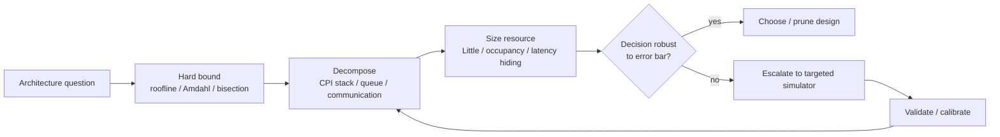

# Analytical Models — Closed-Form Counterparts to Simulators

> **First-time reader orientation:** An analytical model uses equations or compact algorithms to expose bounds, bottlenecks, and sensitivities without simulating every event. It is usually faster and easier to inspect than a cycle model, but it represents contention and feedback more coarsely. Use it first, then escalate only when competing designs remain indistinguishable within its error.

> **Abbreviation key — skim now and return as needed:** central processing unit (CPU); graphics processing unit (GPU); neural processing unit (NPU); instructions per cycle (IPC); cycles per instruction (CPI);
> instruction-level parallelism (ILP); memory-level parallelism (MLP); design-space exploration (DSE); out-of-order (OoO); reorder buffer (ROB);
> miss status holding register (MSHR); single instruction, multiple data (SIMD); dynamic random-access memory (DRAM); double data rate (DDR); level-one cache (L1);
> level-two cache (L2); last-level cache (LLC); network on chip (NoC); Advanced eXtensible Interface (AXI); Advanced High-performance Bus (AHB);
> Advanced Peripheral Bus (APB); AXI Coherency Extensions (ACE); Coherent Hub Interface (CHI); first come, first served (FCFS); operating system (OS);
> fused multiply-add (FMA); floating-point operation (FLOP); million instructions per second (MIPS); tera floating-point operations per second (TFLOP); non-uniform memory access (NUMA);
> kilobyte (KB); gigabyte (GB); terabyte (TB).

> **Prerequisites:** [Simulation_Methodology](01_Simulation_Methodology.md) (why a closed-form is the top rung of the fidelity ladder), [Performance_Modeling_and_DSE](../02_Performance_Analysis/01_Performance_Modeling_and_DSE.md) (the CPI stack §2.1, Amdahl §2.2, roofline §2.3/§9.3, occupancy/Little §9.1 — **this page extends those kernels, it does not repeat them**).
> **Hands off to:** [gem5](../../01_CPU_Architecture/08_Simulation/01_gem5.md) and the other per-tool pages — the executable models you escalate to when the closed form stops distinguishing your choices.

---

## 0. Why this page exists

Every simulator in this folder is an *executable* model; each has a **closed-form dual** that returns the answer on a whiteboard, to ~10–20%, in the time it takes to divide two numbers — and, more valuably, tells you **which knob is live before you spend a CPU-week simulating.** The [Performance_Modeling_and_DSE](../02_Performance_Analysis/01_Performance_Modeling_and_DSE.md) page introduced the working kernels (CPI stack, Amdahl, roofline, occupancy). This page is their **rigorous back**: the ceilings and cache-aware form of roofline, the full mechanistic CPI equation behind the interval model, Amdahl's missing *contention* term, and the **queueing spine** (Little + M/M/1) that every contention model in a simulator is secretly a structural realization of. The organizing claim: **analytical models bound, decompose, and size; simulators only tell you the same thing more slowly and more accurately.** Knowing the dual is what lets you *read* a simulator's output instead of merely collecting it.

### System view — use equations to decide what deserves simulation

The analytical layer is a decision funnel: bound the answer, decompose the gap, size the live resource, and escalate only when close alternatives depend on interactions the closed form omits.

---

## 1. What the analytical layer is for — bound, decompose, size, escalate

Analytical models do three jobs a simulator also does, but instantly:

1. **Bound** — roofline: you *cannot* beat $\min(\text{compute},\ \text{bandwidth})$, whatever the microarchitecture.
2. **Decompose** — the CPI stack / interval model: *which* term (branch, I-fetch, LLC-miss) dominates, so you know where a mm² buys performance.
3. **Size** — Little's law / queueing: how much concurrency hides a given latency, and where a shared resource saturates.

And they answer a fourth question the simulator cannot: **when do I even need the simulator?** The escalation rule from [Simulation_Methodology §2/§4](01_Simulation_Methodology.md) is that a fast model is sound *as long as the effect you are studying does not feed back into the instruction path and the contention is not itself the object of study.* Roofline is enough to rule a kernel memory-bound; you escalate to gem5 only when reordering, prefetch interaction, path effects, or the exact shape of a contention curve is the thing you are measuring (§7).

---

## 2. Roofline — the throughput bound (extends [DSE §2.3](../02_Performance_Analysis/01_Performance_Modeling_and_DSE.md))

The per-kernel GPU treatment and the DSE *application* live on the [DSE §2.3](../02_Performance_Analysis/01_Performance_Modeling_and_DSE.md) page; this page carries the **rigorous bound**, its tightness condition, and the cache-aware form.

Attainable performance is
$$P \;=\; \min\!\big(\pi,\ \beta \cdot I\big),$$
where $\pi$ = peak compute rate (FLOP/s), $\beta$ = peak bandwidth (byte/s), and $I$ = **arithmetic (operational) intensity** in FLOP/byte. The **ridge point**
$$I^{*} \;=\; \pi/\beta$$
is the intensity at which the two roofs meet: $I<I^{*}$ is bandwidth-bound (on the slanted $\beta I$ roof), $I>I^{*}$ is compute-bound (on the flat $\pi$ roof).

**Derivation — the two-resource critical-path bound.** A kernel issues $F$ useful FLOPs and moves $Q$ bytes across the bottleneck interface, so its intensity is the single ratio $I=F/Q$ — the two *extensive* counts collapse to one *intensive* scalar, which is why an entire kernel becomes one point on a 1-D axis. Two engines run it **concurrently**: compute retires FLOPs at peak $\pi$, the memory port delivers bytes at peak $\beta$. In isolation each needs $t_{\text{cmp}}=F/\pi$ and $t_{\text{mem}}=Q/\beta$; since neither can finish before doing its own share *at its own peak*, **any** schedule obeys the critical-path lower bound
$$t\ \ge\ \max\!\big(t_{\text{cmp}},\,t_{\text{mem}}\big)=\max\!\Big(\tfrac{F}{\pi},\,\tfrac{Q}{\beta}\Big).$$
Divide the work by it, using $\max(a,b)^{-1}=\min(a^{-1},b^{-1})$ for $a,b>0$:
$$P=\frac{F}{t}\ \le\ \frac{F}{\max(F/\pi,\ Q/\beta)}=\min\!\Big(\pi,\ \tfrac{F}{Q}\beta\Big)=\min(\pi,\ \beta I).$$
**Tightness.** Equality needs the two engines *perfectly overlapped* — every byte staged before the FLOP that consumes it — so the idle engine's time hides entirely under the busy one; that is exactly the double-buffer / prefetch precondition of [Full_Chip §2.3](../../04_SoC_and_Chiplet_Architecture/01_System_Modeling/01_Full_Chip_Modeling.md). When overlap fails, $t$ slides toward $t_{\text{cmp}}+t_{\text{mem}}$ and the real point sits *below* the roof. So $\min(\pi,\beta I)$ is the **overlapped ceiling**, never a promise — which is why the §2 caveat below is load-bearing. Setting the two arms equal, $\pi=\beta I$, re-derives the ridge $I^\star=\pi/\beta$, the intensity where the binding term switches; doubling $\beta$ slides it left (rescuing memory-bound kernels), doubling $\pi$ slides it right.

Everything an architect adds to this:

- **Ceilings (sub-roofs).** The flat roof $\pi$ is only reachable with full in-core parallelism: drop FMA, SIMD/vectorization, or ILP and you sit on a **lower horizontal ceiling**. The slanted roof $\beta$ is only reachable with prefetching and NUMA-aware placement; without them you sit on a **lower diagonal ceiling**. The *gap between a kernel's measured point and the relevant sub-roof names the specific optimization it needs* — this is roofline's real diagnostic value, not the top roof.
- **Hierarchical / cache-aware roofline.** Measure $I$ against traffic *at each level* — a DRAM roofline ($I_\text{DRAM}=\text{FLOP}/\text{DRAM bytes}$), an L2 roofline, etc. A kernel can be DRAM-compute-bound but L2-bandwidth-bound; the level whose point is lowest is the true bottleneck. Formally the bound becomes a **min over the compute roof and every memory level**, $P\le\min\!\big(\pi,\ \min_\ell \beta_\ell I_\ell\big)$, with $I_\ell=F/Q_\ell$ the intensity against level-$\ell$ traffic $Q_\ell$ and $\beta_\ell$ that level's bandwidth. The levels disagree on the verdict because caching filters *traffic* unequally from *bandwidth*: $Q_{\text{L1}}\!\ge\!Q_{\text{L2}}\!\ge\!Q_{\text{DRAM}}$ (each level absorbs some of the next's traffic) while $\beta_{\text{L1}}\!\ge\!\beta_{\text{L2}}\!\ge\!\beta_{\text{DRAM}}$ — so which $\beta_\ell I_\ell$ is smallest is not fixed, and reading only the DRAM roof can hide an on-chip-bandwidth wall. This is the analytical shadow of the memory hierarchy a simulator models level by level.
- **What roofline cannot see — the crucial caveat.** Roofline is a **throughput ceiling that silently assumes enough ILP/MLP to saturate the bottleneck resource.** It says nothing about whether you can *reach* the roof at your actual concurrency. A latency-bound kernel with too few outstanding misses lands far *below* the memory roof with no roofline explanation — because the missing piece is **Little's law** (§5): reaching the $\beta$ roof requires $\beta\times L$ bytes in flight. **Roofline sets the ceiling; interval (ILP) and Little (MLP) decide attainment.** Treating the roof as a prediction rather than a bound is the model's most common misuse.

**Worked number — where a kernel sits, and why one roof lies.** Machine: $\pi=60$ TFLOP/s, DRAM $\beta_{\text{DRAM}}=2$ TB/s (ridge $I^{*}_{\text{DRAM}}=30$ FLOP/byte), on-chip $\beta_{\text{L2}}=10$ TB/s (ridge $I^{*}_{\text{L2}}=6$ FLOP/byte). A blocked kernel does $F=40$ GFLOP, pulling $Q_{\text{DRAM}}=1$ GB from DRAM (good outer reuse) but churning $Q_{\text{L2}}=10$ GB through L2 (tiles refetch from L2). Its two intensities are $I_{\text{DRAM}}=40/1=40$ and $I_{\text{L2}}=40/10=4$ FLOP/byte. Read the roofs:

- **DRAM roof:** $\min(\pi,\ \beta_{\text{DRAM}} I_{\text{DRAM}})=\min(60,\ 2{\times}40{=}80)=60$ TFLOP/s. Since $I_{\text{DRAM}}=40>30$, at the DRAM level the kernel looks **compute-bound** — "you're fine."
- **L2 roof:** $\min(\pi,\ \beta_{\text{L2}} I_{\text{L2}})=\min(60,\ 10{\times}4{=}40)=40$ TFLOP/s. Since $I_{\text{L2}}=4<6$, at L2 it is **bandwidth-bound**.

The true attainable is the lowest, $\min(60,80,40)=\mathbf{40}$ TFLOP/s, set by **L2 bandwidth** — 33% below what the single-level DRAM roofline promised. The one-roof reading would send you to optimize compute (useless); the hierarchical roofline names the live lever — raise $I_{\text{L2}}$ by blocking for L2 reuse, or widen on-chip bandwidth. (This is the per-kernel roofline of [DSE §2.3/§9.3](../02_Performance_Analysis/01_Performance_Modeling_and_DSE.md) applied *per memory level*.)

---

## 3. The interval / mechanistic model — core CPI in closed form

This is the analytical dual of gem5's O3 timing model ([gem5 §3](../../01_CPU_Architecture/08_Simulation/01_gem5.md)) and the rigorous version of the CPI stack ([DSE §2.1](../02_Performance_Analysis/01_Performance_Modeling_and_DSE.md)). **Interval analysis** (Karkhanis–Smith 2004; formalized by Eyerman, Eeckhout, Karkhanis & Smith 2009) observes that a balanced out-of-order core issues at close to its **dispatch width $D$** during steady intervals, and that performance is set by **miss events that punctuate those intervals** — each punches a characterizable hole in the issue rate. Summing the per-event CPI increments (superposition) reproduces full-simulation CPI to within a few percent.

**Derivation — base issue rate plus a superposed sum of interval penalties.** Watch the dispatch (issue) stage on a timeline. Between miss events a balanced OoO core keeps its window full and dispatches at its **width $D$** every cycle (the *balanced* assumption: enough ILP in the window to feed all $D$ ports), so $N$ instructions cost a base $N/D$ cycles — base $\text{CPI}=1/D$. A **miss event** — a branch mispredict, an I-cache miss, or a long-latency LLC/DRAM load — punctures that smooth stream and opens an **interval**: dispatch collapses toward zero, the event is serviced, and dispatch then **ramps back** to $D$. Because full-rate dispatch resumes on both sides of each interval, the intervals are (to first order) **disjoint and independent**, so their lost-cycle penalties **superpose** — total cycles are the base plus one term per event class:
$$C_{\text{total}}=\underbrace{\frac{N}{D}}_{\text{base (width-limited)}}+\sum_{\text{classes }x} m_x\,c_x^{\text{pen}},$$
where $m_x$ = events of class $x$ and $c_x^{\text{pen}}$ = the cycles that class's interval costs. That superposition *is* interval analysis: it converts a coupled per-cycle timing problem into an accounting sum, and its few-percent accuracy is the empirical claim that intervals really are near-independent. Each $c_x^{\text{pen}}$ is then read off the interval's **geometry**, which the full equation makes explicit:

The mechanistic total-cycle equation:

$$C_{\text{total}}=\underbrace{\frac{N}{D}}_{\text{steady issue}}+\underbrace{\frac{D-1}{2D}\big(m_{iL1}+m_{iL2}+m_{br}+m_{dL2}\big)}_{\text{issue-ramp after each refill}}+\underbrace{m_{iL1}c_{iL1}+m_{iL2}c_{L2}}_{\text{I-fetch misses}}+\underbrace{m_{br}\,(c_{dr}+c_{fe})}_{\text{branch mispredicts}}+\underbrace{m_{dL2}(W)\,c_{L2}}_{\text{long-latency loads}}$$

where $N$ = dynamic instruction count; $D$ = dispatch width; $m_{iL1},m_{iL2},m_{br},m_{dL2}$ = counts of L1/L2 I-cache misses, branch mispredicts, and last-level data misses; $c_{iL1},c_{L2}$ = the corresponding miss latencies; $c_{fe}$ = front-end pipeline depth; $c_{dr}$ = the **window-drain (branch-resolution) time**; and $m_{dL2}(W)$ = the count of long-latency load misses that *cannot* be overlapped within a window of $W$ in-flight instructions. The middle term is the **issue-ramp** penalty: after each front-end refill the window is empty and dispatch climbs roughly linearly from $1$ back to $D$, so the triangular shortfall averages $\approx\frac{D-1}{2D}$ lost cycles per refill event — a first-order constant (like the systolic $2D$ fill/drain), meant to rank, not to sign off. Two structural insights fall out — the same two the O3 simulator would take a CPU-hour to show:

- **Front-end misses (branch mispredict, I-cache miss) — why the penalty *exceeds* pipeline depth.** A mispredicted branch is not even detected until it *executes*, and it executes only once it reaches the resolving edge of the window — so the back end must first **drain** ($c_{dr}$, the window-drain / branch-resolution time) and only then does the front end **refill** the $c_{fe}$-deep pipeline on the correct path. Penalty $=c_{dr}+c_{fe}>c_{fe}$; the drain $c_{dr}$ is exactly what a whiteboard "penalty = pipeline depth" forgets. (An I-cache miss has the same shape, with the miss latency in place of $c_{dr}$.)
- **Back-end misses (long-latency LLC loads) — bounded by the ROB, overlapped by MLP.** When a long-latency load blocks retirement, the ROB fills behind it; dispatch continues only until the ROB is full ($\approx W$ instructions), then stalls for the *residual* latency. The decisive consequence: **any independent miss issued before the ROB filled overlaps for free** — a burst of $k$ independent misses under one ROB-fill costs ~one latency $c_{L2}$, not $k$. So the effective serialized count is $m_{dL2}(W)$, the number of miss *clusters* that do **not** fit in a window of $W$, and the window is the exact knob: it bounds the overlap, $\text{MLP}=\min\!\big(W/(\text{insns per miss}),\ \text{available independent misses}\big)$, hence bounds the memory penalty. This is why enlarging the ROB/MSHRs helps memory-bound code — up to the point where $W$ already covers the available independent misses — and it is [DSE §2.1](../02_Performance_Analysis/01_Performance_Modeling_and_DSE.md)'s $p^{\text{exposed}}=p^{\text{raw}}/\text{MLP}$ made mechanistic.

Accuracy is **~7% mean vs a width-4 O3 simulation** — good enough to rank pipeline-depth, width, and cache choices analytically, then confirm the survivors in gem5. The interval model is the closed-form dual of **two** executable models: gem5's structural **O3** is this equation made cycle-by-cycle (roughly 10% more accurate), and **Sniper** is this equation made the *timing engine itself* — "interval simulation" advances a fast functional stream and charges exactly these per-event penalties instead of stepping a pipeline every cycle, which is why Sniper runs at ~1–2 MIPS/core and ~10–20% error ([Other_Architecture_Simulators §2](../06_Tool_Landscape/01_Other_Architecture_Simulators.md)). The interval model is why you can reason about a core without running one.

**Worked number — a width-4 CPI, and the MLP that halves it.** Take $D=4$ (base $\text{CPI}=1/4=0.25$) and per-instruction event rates: branch mispredicts $m_{br}=0.004$ at penalty $c_{dr}+c_{fe}=8+12=20$ cyc; I-cache (L2) misses $m_{iL2}=0.001$ at $c_{L2}=100$ cyc; long-latency loads with **raw** rate $0.006$ at $c_{L2}=100$ cyc but $\text{MLP}\approx3$ so effective $m_{dL2}(W)=0.002$; and a refill-ramp over the $m_{br}+m_{iL2}+m_{dL2}=0.007$ refill events at $\frac{D-1}{2D}=\frac38$:
$$\text{CPI}=0.25+\underbrace{0.004\cdot20}_{0.080}+\underbrace{0.001\cdot100}_{0.100}+\underbrace{0.002\cdot100}_{0.200}+\underbrace{0.375\cdot0.007}_{0.003}=0.63\ \Rightarrow\ \text{IPC}=1.58.$$
Two lessons drop out. **(i) The drain is not optional:** pricing the branch at the naive "pipeline depth $=12$" instead of $c_{dr}+c_{fe}=20$ undercounts its term $0.080\to0.048$ — a 40% error on the branch bar. **(ii) The window earns its area:** without MLP the load term would be the raw $0.006\cdot100=0.60$, giving $\text{CPI}=1.03$ (IPC $0.97$); the window's $3\times$ overlap recovers $0.40$ CPI, a **1.6× IPC swing** from one parameter — the same over-count the raw CPI stack makes ([DSE §2.1](../02_Performance_Analysis/01_Performance_Modeling_and_DSE.md)), here corrected by the mechanistic $m_{dL2}(W)$.

---

## 4. Amdahl, Gustafson, and the contention term Amdahl omits (USL)

**Amdahl — derivation.** Normalize the single-worker runtime to $1$ and split it into a **parallelizable** fraction $p$ and a serial remainder $1-p$. On $N$ workers the serial part is unchanged and the parallel part divides perfectly (the optimistic best case), so $T(N)=(1-p)+p/N$ and
$$S(N)=\frac{T(1)}{T(N)}=\frac{1}{(1-p)+p/N}\ \xrightarrow{N\to\infty}\ \frac{1}{1-p}.$$
The ceiling is set by the **serial residue** $1-p$ alone: at $p=0.95$ even infinite workers give only $1/0.05=20\times$. (Full sensitivity — $dS_\infty/dp=S_\infty^2$, the last-percent-of-serial lever — is [DSE §2.2](../02_Performance_Analysis/01_Performance_Modeling_and_DSE.md).)

**Gustafson — the scaled-speedup counterpoint.** Amdahl pins the *problem size*; Gustafson notes a bigger machine is used to run a *bigger* problem in the same wall-time (weak scaling). If a run on $N$ workers spends fraction $1-p$ serial and $p$ parallel of its *own* wall-time, the same work on one worker would take the serial part unchanged plus the parallel part $N\times$ longer, a **scaled speedup**
$$S_{\text{scaled}}(N)=(1-p)+pN,$$
**linear and uncapped** in $N$. Same $p$, opposite verdict — Amdahl asks "how much faster is *this fixed job*?" while Gustafson asks "how much more work in the *same time*?" You choose by whether the size is pinned (strong scaling → Amdahl) or grows with the machine (weak scaling → Gustafson, the regime data-parallel training rides).

Amdahl's blind spot is that it assumes the parallel part scales *perfectly*: it has **no term for contention** (serialized access to a shared resource) or **coherency** (keeping shared data consistent). Real multicore silicon has both, and they bend the curve *down*. **Gunther's Universal Scalability Law (USL)** adds exactly those two terms (here $\sigma,\kappa$ — *not* the roofline bandwidth $\beta$ of §2):

$$S(N)=\frac{N}{1+\sigma\,(N-1)+\kappa\,N(N-1)},$$

where $N$ = degree of parallelism (cores/threads), $\sigma$ = **contention/serialization** coefficient (the Amdahl-like serial cost, $\sigma\leftrightarrow 1-p$), and $\kappa$ = **coherency/crosstalk** coefficient. The growth *orders* encode the physics: $\sigma(N-1)$ is **linear** — a shared queue serves one at a time, so the wait grows with the number waiting — while $\kappa N(N-1)$ is **quadratic**, counting the $\binom{N}{2}$ **pairs** that must be kept mutually consistent (all-pairs coherence traffic). Setting $\kappa=0$ recovers Amdahl (as $N\to\infty$, $S\to1/\sigma$, the serial ceiling).

**Deriving the retrograde peak.** With any $\kappa>0$ the quadratic term eventually wins and adding workers makes the workload *slower*. Write $D(N)=1+\sigma(N-1)+\kappa N(N-1)$; then $S=N/D$ and
$$\frac{dS}{dN}=\frac{D-N\,D'}{D^2},\qquad D'=\sigma+\kappa(2N-1),$$
and the numerator collapses — the constant and linear pieces cancel — to $D-ND'=(1-\sigma)-\kappa N^2$, zero at
$$N^{\star}=\sqrt{\frac{1-\sigma}{\kappa}}.$$
Below $N^\star$ the numerator's $N$ outruns the denominator (speedup rises); above it the $\kappa N^2$ coherency cost dominates and throughput **retrogrades**. This is the quantitative reason a chip has an *optimal* core count, not an unbounded one — and Amdahl ($\kappa=0$, $N^\star\to\infty$) cannot even express it: it saturates but never falls.

**Worked number.** Take $\sigma=0.08$ (8% contention), $\kappa=0.001$ (0.1% coherency). Peak at $N^\star=\sqrt{(1-0.08)/0.001}=\sqrt{920}\approx30$ cores, where $S(30)=\dfrac{30}{1+0.08\cdot29+0.001\cdot30\cdot29}=\dfrac{30}{4.19}=7.2\times$. Double to $N=64$ and it **regresses** to $S(64)=\dfrac{64}{1+0.08\cdot63+0.001\cdot64\cdot63}=\dfrac{64}{10.07}=6.4\times$ — more than double the cores, *less* speedup, the excess eaten by the $O(N^2)$ term. Past $N^\star$ the only fixes are lowering $\kappa$ (larger private caches, NUCA, relaxed consistency) or $\sigma$ (less sharing) — attacking the *coefficients*, never $N$. (For contrast on the same parallelism: Amdahl at $p=0.95$ ceils at $20\times$, while Gustafson at $N=64$ gives $0.05+0.95\cdot64=60.9\times$ — three models, three verdicts.) [Full_Chip §4.2](../../04_SoC_and_Chiplet_Architecture/01_System_Modeling/01_Full_Chip_Modeling.md) derives this same peak and works the CPU-cluster instance with these very coefficients.

For silicon this is not academic: $\kappa$ is the **coherence traffic and shared-cache/NoC crosstalk** ([ACE_and_CHI](../../01_CPU_Architecture/06_Coherence_and_Consistency/03_ACE_and_CHI.md), [Network_on_Chip](../../04_SoC_and_Chiplet_Architecture/04_On_Chip_Networks/01_Network_on_Chip.md)) that a naive Amdahl estimate misses, and it is *why* adding cores past $N^{\star}$ makes a workload slower. When you need the actual coherence traffic that sets $\kappa$, that is the escalation to gem5 **Ruby** ([gem5 §4](../../01_CPU_Architecture/08_Simulation/01_gem5.md)).

---

## 5. Little's law and M/M/1 — the backbone of every contention model

[Simulation_Methodology §7](01_Simulation_Methodology.md) states that every credible memory/NoC simulator is, at bottom, a structural realization of the queueing curve. This is that spine, made rigorous — the single most reused piece of analysis in the whole notebook.

**Little's law** (distribution-free, needs only stationarity):
$$L=\lambda\,W,$$
where $L$ = mean number of items in the system, $\lambda$ = arrival/throughput rate, $W$ = mean time in system.

**Derivation — the area argument (why it is distribution-free).** Let $n(t)$ be the number in the system at time $t$ and watch a long window $[0,T]$. Compute the area $\int_0^T n(t)\,dt$ two ways. *Vertically* (sum over time): it is $T$ times the time-average population, $\to T\cdot L$. *Horizontally* (sum over items): each item paints a unit-height strip as wide as its own time-in-system, so the area is $\sum_i W_i$; if $A$ items pass through in $T$ that is $A\overline W\to A\cdot W$. Equate the two counts: $TL=AW$, so $L=(A/T)\,W=\lambda W$ with $\lambda=A/T$. **Nothing was assumed** about the arrival or service distribution, the number of servers, or the queue discipline — only that the time-averages converge (stationarity). That distribution-freedom is why one law sizes GPU warps, MSHRs, and reorder buffers alike.

It has two readings an architect uses constantly:

- **Latency hiding / sizing concurrency** (the GPU-occupancy result of [DSE §9.1](../02_Performance_Analysis/01_Performance_Modeling_and_DSE.md)): to keep a unit busy through a latency $L_\text{lat}$ at throughput $\lambda$, you need $L=\lambda L_\text{lat}$ operations *in flight*. Too few → the unit stalls with peak throughput untouched.
- **Sizing the memory system** (the same law, memory units): to sustain bandwidth $\beta$ at memory latency $L_\text{mem}$, you need $\beta\times L_\text{mem}$ bytes outstanding — the **latency–bandwidth product**. In requests: $\text{MSHRs}\gtrsim \beta L_\text{mem}/\text{line}$. **This is the exact quantity roofline (§2) assumes you have** when it draws you on the bandwidth roof; if your MLP is below it, you fall off the roof.

**M/M/1** (Poisson arrivals, exponential service, one server) puts numbers on saturation.

**Derivation — from the birth–death chain.** Memoryless arrivals (rate $\lambda$) and service (rate $\mu$) make the population a **birth–death** Markov chain. In steady state the probability flux across the boundary between states $n$ and $n{+}1$ balances, $\lambda p_n=\mu p_{n+1}$, so $p_{n+1}=\rho\,p_n$ with $\rho=\lambda/\mu$; normalizing $\sum_n p_n=1$ (geometric series) gives $p_n=(1-\rho)\rho^n$. The mean population is
$$L=\sum_{n\ge0}n(1-\rho)\rho^n=(1-\rho)\frac{\rho}{(1-\rho)^2}=\frac{\rho}{1-\rho},$$
and **Little's law converts population to time**, $W=L/\lambda$. With $T_0=1/\mu$ the unloaded service time:
$$W=\frac{1}{\mu-\lambda}=\frac{1/\mu}{1-\rho}=\frac{T_0}{1-\rho},\qquad W_q=W-T_0=\frac{\rho}{\mu(1-\rho)},\qquad L=\frac{\rho}{1-\rho}.$$
The **wait alone** $W_q=\frac{\rho}{1-\rho}T_0$ diverges as $\rho\to1$ because draining a backlog needs a run of shorter-than-average inter-arrival gaps, and such runs get exponentially rarer as arrivals approach capacity. ([Full_Chip §2.2](../../04_SoC_and_Chiplet_Architecture/01_System_Modeling/01_Full_Chip_Modeling.md) runs the same chain at the DRAM channel.)

The $\dfrac{1}{1-\rho}$ factor **is the knee**: latency is roughly flat at low load and runs to infinity as $\rho\to 1$. This is why memory and NoC latency explode near saturation, and why a simulator that reports latency *flat* with load has no real queue and is optimistic ([Simulation_Methodology §3](01_Simulation_Methodology.md)).

**Variability matters — M/G/1 (Pollaczek–Khinchine), derived.** Real service times are not exponential, and the wait scales with their **variance**. An arriving customer waits for the **residual** service of the job already in progress plus the full service of everyone queued ahead; the mean-value accounting of that is $W_q=\lambda\,\mathbb E[S^2]/(2(1-\rho))$ — the arrival is more likely to land inside a *long* service (the inspection paradox), which is what promotes $\mathbb E[S]$ to the second moment $\mathbb E[S^2]$. Substituting $\mathbb E[S^2]=\sigma_S^2+T_0^2=(1+C_v^2)T_0^2$ and $\lambda T_0=\rho$ gives the **Pollaczek–Khinchine** form
$$W_q=\frac{\lambda(1+C_v^2)T_0^2}{2(1-\rho)}=\frac{\rho}{1-\rho}\cdot\frac{1+C_v^2}{2}\cdot T_0,$$
where $C_v=\sigma_S/T_0$ = coefficient of variation of service time, $\sigma_S$ = service-time std-dev, and $T_0=1/\mu$. Exponential service ($C_v=1$) recovers M/M/1's $\frac{\rho}{1-\rho}T_0$; **deterministic** service ($C_v=0$, M/D/1) **halves the queueing wait** to $\frac{\rho}{2(1-\rho)}T_0$; bursty service ($C_v>1$) is worse. So M/M/1 *upper*-bounds and M/D/1 *lower*-bounds the real queue, which sits between and near-deterministic. This is the analytical reason **DRAM and NoC schedulers exist**: first-ready, first-come, first-served (FR-FCFS) row-buffer reordering and NoC arbitration *reduce effective service variance* ($C_v$), buying back queueing latency without adding bandwidth ([DDR_Controller](../../04_SoC_and_Chiplet_Architecture/02_Shared_Memory/01_DDR_Controller.md), [Network_on_Chip](../../04_SoC_and_Chiplet_Architecture/04_On_Chip_Networks/01_Network_on_Chip.md)). Any credible memory/interconnect model is a structural realization of these three equations; recognizing them is how you audit one.

**Worked number — the knee, and the concurrency it demands.** A shared channel has unloaded service $T_0=80$ ns. Response time $W$ and the M/D/1 comparison:

| $\rho$ | M/M/1 $W=T_0/(1-\rho)$ | M/D/1 $W=T_0\big(1+\tfrac{\rho}{2(1-\rho)}\big)$ | in-flight $L=\rho/(1-\rho)$ |
|---|---|---|---|
| 0.60 | $80/0.40=200$ ns ($2.5\times$) | $140$ ns ($1.75\times$) | $1.5$ reqs |
| 0.90 | $80/0.10=800$ ns ($10\times$) | $440$ ns ($5.5\times$) | $9$ reqs |

Pushing load from 60% to 90% — only $1.5\times$ more offered traffic — inflates M/M/1 latency **4×** ($200\to800$ ns) while bandwidth climbs just $60\%\to90\%$ of peak: **the last third of a resource's bandwidth is bought with a 4× latency cliff.** The Little's-law column closes the loop with roofline (§2): to *run* the channel at $\rho=0.9$ you must sustain $L=9$ outstanding requests ($\ge9$ MSHRs, or nine warps' worth of misses); supply fewer and you never reach the 90% point — you fall off the bandwidth roof the roofline *assumed* you could hit. Deterministic service (an FR-FCFS controller regularizing row-hits, $C_v\to0$) roughly halves the queue at every $\rho$ — latency bought back without adding bandwidth. (Cross-check: [Full_Chip §2.2](../../04_SoC_and_Chiplet_Architecture/01_System_Modeling/01_Full_Chip_Modeling.md) works the same $T_0=80$ ns channel at chip scale.)

---

## 6. LogCA / LogGP — the offload and communication cost model

Roofline and interval assume the work is already where it runs. The **"is it worth offloading to the accelerator, and at what data size?"** question needs a communication-aware model. The lineage is **LogP** (Culler et al. 1993: **L**atency, **o**verhead, **g**ap = $1/\text{bandwidth}$ for small messages, **P**rocessors) and **LogGP** (Alexandrov et al. 1995), which adds **G** = gap *per byte* for long messages, so a $k$-byte transfer costs $\approx o + (k-1)G + L + o$.

**Deriving the message cost.** The LogP costs are disjoint stages along a message's path, so they **add**. The sender spends **overhead $o$** occupying the CPU to inject; the network carries the message with **latency $L$** (wire + routers, overlappable with other work); the receiver spends another **$o$** to accept it. Back-to-back sends are throttled by the **gap $g\ge o$** — the minimum injection spacing ($g=1/\text{message-rate}$). LogGP's **$G$ = gap per byte** streams the body at one byte per $G$, so after the first byte $(k-1)$ more cost $(k-1)G$. Summing the stages,
$$T_{\text{msg}}(k)=\underbrace{o}_{\text{inject}}+\underbrace{(k-1)G}_{\text{body @ }1/G\text{ B/s}}+\underbrace{L}_{\text{flight}}+\underbrace{o}_{\text{receive}},$$
a fixed $2o+L$ plus a per-byte $G$ — a **communication roofline**: latency-bound ($\approx 2o+L$) for small $k$, bandwidth-bound ($\approx kG$) for large $k$, crossing at $k\approx (2o+L)/G$. Here $1/G$ is the asymptotic link bandwidth, the exact analogue of roofline's $\beta$ (§2).

**LogCA** (Altaf & Wood, ISCA 2017) specializes this to host↔accelerator offload with five parameters: **L** (interface latency, host→accelerator), **o** (host setup overhead), **g** (granularity = offloaded bytes), **C** (computational index, host cycles/byte), and **A** (peak acceleration). The speedup as a function of granularity is

$$\text{Speedup}(g)=\frac{C\,g^{\beta}}{o+L+\dfrac{C\,g^{\beta}}{A}},$$

with $\beta$ the algorithm's complexity exponent ($\beta=1$ linear, $>1$ super-linear; distinct from the roofline bandwidth $\beta$ of §2). The decisive result is the **break-even granularity** — the smallest offload that even breaks even —

$$g_1=\frac{A}{A-1}\left(\frac{o+L}{C}\right)^{1/\beta},$$

which is set by the **interface cost $(o+L)$**, and is *essentially independent of $A$* for large $A$. The architect's takeaway: **a faster accelerator does not lower the size at which offload pays — the interface does.** A 100× engine behind a high-overhead bus is worthless for small tiles; you must either amortize over large $g$ or cut $(o+L)$. This is the analytical dual of the accelerator/offload cost that shows up in [AHB_AXI_APB](../../04_SoC_and_Chiplet_Architecture/03_Transaction_Protocols/01_AHB_AXI_APB.md)/[ACE_and_CHI](../../01_CPU_Architecture/06_Coherence_and_Consistency/03_ACE_and_CHI.md) and in the NPU dataflow models of [DSE §10](../02_Performance_Analysis/01_Performance_Modeling_and_DSE.md).

**The offload break-even, derived — a roofline of dispatch.** Reduce the decision to comparing wall-times for $n$ bytes. The **host** does the work at $C$ (time per byte): $T_{\text{host}}=Cn$. **Offloading** pays the interface $o+L$, streams the operands at the link gap $G$, then runs the same work on an engine $A\times$ faster: $T_{\text{off}}=(o+L)+Gn+Cn/A$. Offload wins iff $T_{\text{off}}<T_{\text{host}}$:
$$(o+L)+Gn+\frac{Cn}{A}<Cn\ \Longleftrightarrow\ n>n_1=\frac{o+L}{\,C\frac{A-1}{A}-G\,}.$$
Below $n_1$ the fixed interface $o+L$ dominates and offload **loses**; above it the compute saving $Cn(1-1/A)$ amortizes the transfer and offload **wins** — a roofline knee with $n_1$ the ridge. Two limits sharpen it. With the link not the bottleneck ($G\to0$), $n_1=\frac{A}{A-1}\frac{o+L}{C}$ — exactly LogCA's $g_1$ (at $\beta=1$). For a **fast** engine ($A\to\infty$), $\frac{A}{A-1}\to1$ so $n_1\to\frac{o+L}{C}$, **independent of $A$**. The dispatch has *its own two roofs*, like §2: a **compute roof** $A$ (the engine's speedup) and a **bandwidth roof** $C/G$ (the rate the link can feed it), and the achievable speedup is capped at $A_{\text{eff}}=1/(1/A+G/C)<A$ — even an infinitely fast accelerator cannot beat the link's $C/G$. Reaching half of the peak acceleration needs $n_{A/2}=(A-1)\,n_1$: breaking even is cheap, but *cashing in* the acceleration needs tiles $\sim\!A\times$ larger.

**Worked number.** A GPU-style offload: interface $o+L=6.5\ \mu\text{s}=6500$ ns, link $16$ GB/s so $G=0.0625$ ns/byte, host rate $C=20$ ns/byte, engine $A=30$. Break-even $n_1=6500/(20\cdot\tfrac{29}{30}-0.0625)=6500/19.27\approx\mathbf{337}$ bytes. The **interface** sets it: the $G\to0$ value is $\tfrac{30}{29}\cdot\tfrac{6500}{20}=336$ B and the $A\to\infty$ value is $6500/20=325$ B — a $10\times$ faster engine ($A{:}30\to300$) moves break-even by **<3%** ($337\to\sim327$ B). Meanwhile the link caps the payoff: $A_{\text{eff}}=1/(1/30+0.0625/20)=27.4\times<30$, and even $A\to\infty$ tops out at $C/G=320\times$ — the dispatch bandwidth roof. To reach half-peak ($\sim13.7\times$) you need $n_{A/2}=29\cdot337\approx9.8$ KB tiles — breaking even is cheap; cashing in the full engine is not.

---

## 7. When analytical suffices, and when you must escalate

The discipline is the escalation rule of [Simulation_Methodology §2/§4](01_Simulation_Methodology.md): **use the fastest model that distinguishes the choices in front of you; go cycle-level only when contention, reordering, or path/timing-feedback *is* the effect you are measuring.**

| Question | Analytical tool | It suffices when… | Escalate to (why) |
|---|---|---|---|
| Compute- or memory-bound? | Roofline (§2) | there is ample ILP/MLP to reach the roof | gem5 Timing/O3 or a GPU sim — *low-concurrency / latency-bound* regimes fall off the roof |
| Which stall dominates core CPI? | Interval (§3) | miss events are roughly independent | gem5 **O3** — complex prefetch overlap, data-dependent paths, wrong-path pollution |
| Parallel ceiling / core count? | Amdahl + USL (§4) | $\sigma,\kappa$ are stable and measurable | gem5 **Ruby** — you need the *actual* coherence traffic that sets $\kappa$ |
| Memory/NoC saturation latency? | Little + M/M/1 (§5) | traffic is near-Poisson, one bottleneck | Ramulator/DRAMSim3, Garnet — bursty/structured traffic, scheduler reordering |
| Is offload worth it, at what size? | LogCA/LogGP (§6) | the interface is uncontended | gem5 **FS** — shared-interface contention, driver/OS cost |

The failure mode in both directions is real: **trusting an analytical *ceiling* as a *prediction*** (roofline attainment without checking MLP) over-promises; **cycle-simulating a question a closed form already answers** wastes a CPU-week and, worse, hides the mechanism the equation would have made obvious. The mature workflow is **prune analytically, then cycle-simulate the survivors** — the DSE recipe of [DSE §5](../02_Performance_Analysis/01_Performance_Modeling_and_DSE.md).

---

## 8. Numbers to memorize

| Quantity | Value / form | Why it matters |
|---|---|---|
| Roofline bound | $\min(\pi,\ \beta I)$ (overlapped ceiling) | critical-path max of two concurrent engines |
| Ridge point | $I^{*}=\pi/\beta$ | the compute- vs memory-bound boundary |
| Hierarchical roofline | $\min(\pi,\ \min_\ell \beta_\ell I_\ell)$ | the lowest level-roof is the true bottleneck |
| Roofline attainment | needs $\beta\times L$ bytes in flight | roof is a bound, not a prediction (Little) |
| Interval CPI | $C=N/D+\sum m_x c_x$ | core performance in closed form |
| Interval accuracy | ~7% vs width-4 O3 | good enough to rank, then confirm |
| Branch penalty | $c_{fe}+c_{dr}$ (> pipeline depth) | the drain term whiteboards forget |
| Amdahl ceiling | $1/(1-p)$ | serial fraction dominates |
| Gustafson scaled speedup | $(1-p)+pN$ (linear, uncapped) | weak scaling vs Amdahl's strong scaling |
| USL peak | $N^{\star}=\sqrt{(1-\sigma)/\kappa}$ | retrograde beyond it — more cores, less speedup |
| Little's law | $L=\lambda W$ (distribution-free) | concurrency to hide any latency (area argument) |
| M/M/1 response | $\bar T=T_0/(1-\rho)$ | latency explodes near saturation (birth–death) |
| M/D/1 half-variance | $W_q=\dfrac{\rho}{2(1-\rho)}T_0$ | deterministic service ⇒ half the M/M/1 wait |
| M/G/1 variance | $W_q\propto \dfrac{1+C_v^2}{2}$ | why schedulers cut $C_v$, not just add BW |
| LogGP message cost | $2o+L+(k{-}1)G$ | latency- vs bandwidth-bound at $k\approx(2o+L)/G$ |
| Offload break-even | $n_1=\dfrac{o+L}{C\frac{A-1}{A}-G}\to\dfrac{o+L}{C}$ | set by *interface*, ~indep. of $A$; cap $A_{\text{eff}}=\dfrac{1}{1/A+G/C}$ |

---

## Cross-references

- **Down the stack:** [Performance_Modeling_and_DSE](../02_Performance_Analysis/01_Performance_Modeling_and_DSE.md) (the working kernels this page makes rigorous — CPI stack, Amdahl, roofline, occupancy), [OoO_Execution](../../01_CPU_Architecture/03_Out_of_Order_Backend/01_OoO_Execution.md) (the ROB/window structures the interval model abstracts), [Memory](../04_Hardware_Structures/01_Memory_Arrays_and_Technologies.md) / [DDR_Controller](../../04_SoC_and_Chiplet_Architecture/02_Shared_Memory/01_DDR_Controller.md) & [Network_on_Chip](../../04_SoC_and_Chiplet_Architecture/04_On_Chip_Networks/01_Network_on_Chip.md) (the queues M/M/1 abstracts; the schedulers that cut $C_v$), [ACE_and_CHI](../../01_CPU_Architecture/06_Coherence_and_Consistency/03_ACE_and_CHI.md) (the coherence traffic behind the USL $\kappa$ term).
- **Up the stack (where these models are *applied*):** [Simulation_Methodology](01_Simulation_Methodology.md) (the fidelity ladder these models top, and the escalation rule), [Full_Chip_Modeling](../../04_SoC_and_Chiplet_Architecture/01_System_Modeling/01_Full_Chip_Modeling.md) (these leaf models composed into a chip — the M/M/1–M/D/1 queue of §5 at the DRAM channel is its §2.2, and the USL peak of §4 is its §4.2), [Performance_Modeling_and_DSE](../02_Performance_Analysis/01_Performance_Modeling_and_DSE.md) (roofline *applied* per-kernel §2.3/§9.3 and per-operator §10; Amdahl/Gustafson §2.2).
- **Sibling (this folder):** [gem5](../../01_CPU_Architecture/08_Simulation/01_gem5.md) — the executable form of the interval (O3), queueing (Ruby/memory), and roofline (DSE) models here; [Other_Architecture_Simulators §2](../06_Tool_Landscape/01_Other_Architecture_Simulators.md) — **Sniper**, the interval model of §3 made the timing engine itself; escalate to either per §7.

---

## References

- S. Williams, A. Waterman, D. Patterson, "Roofline: An Insightful Visual Performance Model for Multicore Architectures," *CACM*, 2009 — [PDF](https://people.eecs.berkeley.edu/~kubitron/cs252/handouts/papers/RooflineVyNoYellow.pdf).
- T. Karkhanis, J. E. Smith, "A First-Order Superscalar Processor Model," *ISCA*, 2004 — [retrospective PDF](https://sites.coecis.cornell.edu/isca50retrospective/files/2023/06/KARKHANIS_2004_FIRST.pdf).
- S. Eyerman, L. Eeckhout, T. Karkhanis, J. E. Smith, "A Mechanistic Performance Model for Superscalar Out-of-Order Processors," *ACM TOCS*, 2009 — [ACM](https://dl.acm.org/doi/10.1145/1534909.1534910).
- G. Amdahl, "Validity of the Single-Processor Approach…," *AFIPS*, 1967.
- N. J. Gunther, *Guerrilla Capacity Planning* (Universal Scalability Law) — [perfdynamics.com](https://www.perfdynamics.com/Manifesto/USLscalability.html).
- J. D. C. Little, "A Proof for the Queuing Formula $L=\lambda W$," *Operations Research*, 1961; L. Kleinrock, *Queueing Systems*, 1975 (M/M/1, M/G/1 Pollaczek–Khinchine).
- M. S. B. Altaf, D. A. Wood, "LogCA: A High-Level Performance Model for Hardware Accelerators," *ISCA*, 2017 — [PDF](https://research.cs.wisc.edu/multifacet/papers/isca17_logca.pdf).
- A. Alexandrov et al., "LogGP: Incorporating Long Messages into the LogP Model," *SPAA*, 1995; D. Culler et al., "LogP: Towards a Realistic Model of Parallel Computation," *PPoPP*, 1993.
