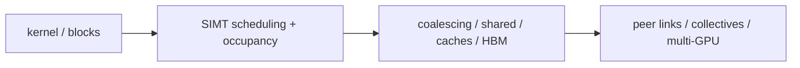

# Part 5 · Architecture › GPU

The GPU section separates the resident-warp execution machine, its transaction-heavy memory hierarchy, and the point where multiple devices become one communication-limited system.

## Subdomains

| Subdomain | Chapters | Boundary it owns |
|---|---:|---|
| [Core Architecture](01_Core_Architecture/00_Index.md) | 2 | SIMT execution, residency, scoreboarding and issue |
| [Memory System](02_Memory_System/00_Index.md) | 1 | lane coalescing through shared memory, caches, translation and HBM |
| [Scale-Up](03_Scale_Up/00_Index.md) | 1 | topology, collectives, remote memory and communication overlap |

## Chapter map

| Chapter | Primary ownership |
|---|---|
| [GPU Architecture](01_Core_Architecture/01_GPU_Architecture.md) | throughput-machine overview, SM organization, divergence and occupancy |
| [SIMT Scheduling and Occupancy](01_Core_Architecture/02_SIMT_Scheduling_and_Occupancy.md) | resource admission, ready/eligible warps, scoreboards, schedulers and barriers |
| [Coalescing, Caches, and Shared Memory](02_Memory_System/01_Coalescing_Caches_and_Shared_Memory.md) | sector formation, bank conflicts, MSHRs, translation and memory partitions |
| [Multi-GPU Interconnect and Execution](03_Scale_Up/01_Multi_GPU_Interconnect_and_Execution.md) | topology matrices, collectives, parallel decomposition, peer memory and scaling |

## Reading paths

- **Single GPU:** overview → SIMT scheduling → memory system → HBM.
- **Kernel bottleneck:** occupancy/eligibility counters → coalescing/banks → HBM/partition balance.
- **Scale training/HPC:** single-device roofs → multi-GPU decomposition/collectives → chiplet/off-node fabric.

---

⬅ [Interconnect](../04_Interconnect/00_Index.md) · [Architecture Contents](../00_Index.md) · next ➡ [NPU](../06_NPU/00_Index.md)
