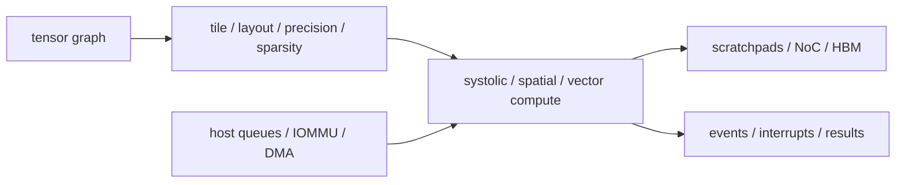

# Part 6 · Architecture › NPU

The NPU section is split into compute dataflow, compiler-controlled movement/compression, and the system-agent machinery required to deploy the accelerator.

## Subdomains

| Subdomain | Chapters | Boundary it owns |
|---|---:|---|
| [Compute Dataflows](01_Compute_Dataflows/00_Index.md) | 2 | PE array, spatial/temporal loop mapping and utilization |
| [Mapping and Memory](02_Mapping_and_Memory/00_Index.md) | 2 | tiling/fusion/layout plus sparse/narrow data representation |
| [System Integration](03_System_Integration/00_Index.md) | 1 | command/DMA/coherence/scheduling/virtualization/reset contract |

## Chapter map

| Chapter | Primary ownership |
|---|---|
| [NPU Accelerators](01_Compute_Dataflows/01_NPU_Accelerators.md) | accelerator overview, systolic arrays, dataflow, scratchpads and roofline |
| [Systolic, Spatial, and Vector Dataflows](01_Compute_Dataflows/02_Systolic_Spatial_and_Vector_Dataflows.md) | loop-to-PE mapping, multicast/reduction, shape/fill utilization and precision |
| [Tensor Tiling and Data Movement](02_Mapping_and_Memory/01_Tensor_Tiling_and_Data_Movement.md) | hierarchy factors, buffer constraints, traffic accounting, fusion and mapping search |
| [Sparsity, Quantization, and Compression](02_Mapping_and_Memory/02_Sparsity_Quantization_and_Compression.md) | numerical contract, metadata, zero skipping, load balance and decode |
| [Host Interface, Coherence, and Scheduling](03_System_Integration/01_Host_Interface_Coherence_and_Scheduling.md) | descriptors, doorbells, DMA/IOMMU, dependencies, preemption, RAS and firmware |

## Reading paths

- **Design an NPU:** overview → dataflows → tiling/movement → sparsity/precision → integration.
- **Explain lost TOPS:** shape/fill utilization → hierarchy traffic → sparse load balance → DMA/host stalls.
- **Deploy safely:** integration → IOMMU → coherence/consistency → QoS/I/O fabric.

---

⬅ [GPU](../05_GPU/00_Index.md) · [Architecture Contents](../00_Index.md) · next ➡ [Simulators](../07_Simulators/00_Index.md)
