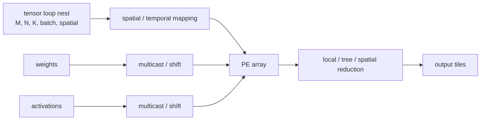

# Systolic, Spatial, and Vector Dataflows — Choosing What Moves Through Space and Time

> **Prerequisites:** [NPU Accelerators](01_NPU_Accelerators.md) (systolic/dataflow overview), [SMT, SIMD, and Vector Execution](../../02_CPU/01_Core_Foundations/03_SMT_SIMD_and_Vector_Execution.md), and linear algebra notation.
> **Hands off to:** [Tensor Tiling and Data Movement](../02_Mapping_and_Memory/01_Tensor_Tiling_and_Data_Movement.md) for concrete schedules and [Sparsity, Quantization, and Compression](../02_Mapping_and_Memory/02_Sparsity_Quantization_and_Compression.md) for irregular/narrow data.

---

## 0. Why this page exists

An NPU's arithmetic units are rarely the differentiator by themselves. The decisive choice is how tensor-loop iterations map onto processing elements (PEs), which operands remain stationary, which multicast, which accumulate locally, and how boundary traffic scales.



Dataflow is a reuse contract: each operand movement should feed enough operations to amortize its energy and bandwidth.

## 1. Start from the loop nest

Matrix multiplication $C_{mn}=\sum_k A_{mk}B_{kn}$ is the canonical three-loop computation:

```text
for m in M
  for n in N
    for k in K
      C[m,n] += A[m,k] * B[k,n]
```

Convolution expands this with batch, output/input channel, and spatial/filter loops. Any loop can be:

- **spatially unrolled** across PEs/lanes;
- **temporally iterated** on one PE;
- **tiled** at a memory hierarchy level;
- **reordered** subject to dependencies;
- **reduced** locally, across an interconnect, or in memory.

A mapping is the assignment of every loop dimension at every spatial/memory level. Labels like “weight stationary” summarize one consequence; they do not fully specify the mapping.

## 2. Systolic execution

In a systolic array, operands move rhythmically between neighboring PEs while partial results accumulate. Local communication replaces repeated global-buffer reads.

For an $R\times C$ array multiplying an $M\times K$ tile by $K\times N$:

- array rows often map $M$;
- columns map $N$;
- time maps $K$;
- activations shift across one dimension;
- weights shift across the other;
- outputs/partial sums remain or drain.

Ideal full-tile latency for a basic 2D wavefront is approximately

$$
T\approx K+R+C-2
$$

cycles for fill, compute wave, and drain, depending on exact interface/pipeline. Utilization is useful MACs divided by $RC\times T$ MAC slots.

Small or skinny matrices underfill dimensions. Mapping several independent tiles/batches across subarrays improves utilization but requires partitionable distribution/reduction and buffer capacity.

## 3. Stationary dataflows

### Output stationary (OS)

Each PE holds one or several partial sums while activations/weights stream. It minimizes high-precision partial-sum movement, attractive because accumulators are wider than operands. It needs efficient operand multicast/shift and final output drain.

### Weight stationary (WS)

Weights remain in PE-local storage; activations stream and partial sums move/reduce. It benefits inference or batched reuse of a weight tile, but weight reloads hurt small batches or dynamic models.

### Input/activation stationary

Activations stay while weights/partial sums move, useful when activation reuse dominates or weights change frequently.

### Row stationary / hybrid

Maps a convolution row/primitive to PEs to exploit weight, activation, and partial-sum reuse together. It is a family of mappings rather than one fixed layout.

Traffic energy is

$$
E_{data}=\sum_{operand\ o}\sum_{level\ l}N_{o,l}E_{access,l}.
$$

The best stationary choice minimizes high-level accesses under actual tensor shape and buffer constraints, not a universal rule.

## 4. Spatial arrays versus vector engines

| Dimension | Spatial/systolic array | Vector/SIMD engine |
|---|---|---|
| control | distributed/static schedule | centralized instruction issue |
| communication | PE-neighbor/multicast/reduction network | register file + cross-lane network |
| regular dense efficiency | very high | high but more operand movement/control |
| irregular ops/control | underutilized or requires fallback | more flexible |
| precision/shape changes | may fragment array | configurable lane/vector operations |
| compiler burden | spatial mapping and tile schedule | vectorization and instruction schedule |

Many NPUs combine matrix arrays with vector/scalar units for activation functions, normalization, reductions, data transforms, sparse gather/scatter, and control. The handoff between them can dominate if intermediates spill to a global buffer.

## 5. PE and local storage design

A PE may contain:

- one or several multipliers/MACs;
- accumulator registers or SRAM;
- operand registers/FIFOs;
- forwarding/multicast endpoints;
- zero/metadata logic;
- precision modes and lane grouping;
- local control and status.

Accumulator width must cover sum growth. For signed integer products of widths $b_a,b_w$ and $K$ terms, conservative magnitude needs roughly

$$
b_{acc}\gtrsim b_a+b_w+\lceil\log_2K\rceil
$$

bits plus sign/guard/saturation policy. Narrow input multipliers do not imply narrow accumulators or output networks.

Local storage amortizes network/global accesses but consumes area and can limit array tiling. Banking/ports must match operand arrival and result drain rates.

## 6. Distribution and reduction networks

Operand delivery patterns:

- unicast for unique elements;
- row/column multicast for reused operands;
- shift/systolic nearest-neighbor forwarding;
- broadcast trees;
- scatter/gather for sparse/indexed data.

Partial sums reduce through:

- PE-local temporal accumulation;
- linear chain;
- tree network ($O(\log P)$ depth);
- hierarchical cluster reduction;
- global-buffer read-modify-write.

The network must sustain required fanout without replicating source reads. If one activation feeds $F$ PEs, source bandwidth can be one word/cycle with multicast, but link/receiver energy still scales with distribution distance/fanout.

Multicast and reduction create backpressure: one slow branch can stall a lockstep tree unless buffered/decoupled. Systolic timing assumes balanced paths; physical skew/pipeline stages must preserve alignment.

## 7. Utilization losses

Total array efficiency decomposes:

$$
\eta=\eta_{shape}\eta_{fill/drain}\eta_{data}\eta_{sparse}\eta_{pipeline}\eta_{sync}.
$$

- **shape:** tensor dimensions do not fill array/subarray;
- **fill/drain:** wavefront startup and output drain;
- **data:** buffers/network/HBM cannot supply operands;
- **sparse:** irregular nonzeros unbalance PEs;
- **pipeline:** unsupported ops or dependencies bubble units;
- **sync:** tiles/subarrays wait at barriers/reductions.

For $M,N$ mapped to $R,C$, basic shape efficiency is

$$
\eta_{shape}=\frac{MN}{\lceil M/R\rceil R\cdot\lceil N/C\rceil C}.
$$

Array aspect ratio should follow workload shape distribution, not only one benchmark's square GEMMs. Reconfigurable subarrays trade mux/control/network cost for shape adaptability.

## 8. Precision reconfiguration

Bit-parallel units may pack multiple narrow operations into one wide multiplier/datapath; bit-serial units trade cycles for precision. Reconfiguration choices:

- fixed MAC lanes with several supported formats;
- split wide multiplier into independent narrow lanes;
- bit-serial/bit-sliced computation;
- shared exponent/block floating point;
- mixed input and accumulator precision.

Peak operations often count narrow packed modes. Compare energy, accumulator bandwidth, conversion overhead, and workload accuracy at the same numerical contract.

## 9. Pipeline and control

A spatial schedule is mostly static but still needs:

- tile/loop counters and address generators;
- buffer-ready/credit handshakes;
- multicast/reduction configuration;
- double-buffer phases;
- exception/error handling;
- synchronization between matrix/vector/DMA engines;
- predication for boundaries and sparsity.

Decoupled access/execute lets DMA fill the next tile while the array computes. Queues absorb latency variation; tags/epochs prevent a reset or fault from mixing tiles.

## 10. Mapping irregular operators

Depthwise convolution, small-batch GEMV, attention softmax, normalization, embeddings, and sparse expert routing stress different units.

- GEMV has low weight reuse and skinny dimensions; bandwidth/vector execution may dominate.
- Depthwise convolution lacks cross-channel reduction; large matrix arrays underfill.
- Attention includes GEMMs plus softmax/reduction and changing sequence dimensions.
- Embeddings are random memory gathers with little arithmetic.
- Elementwise ops need vector bandwidth and fusion to avoid round trips.

An NPU needs either flexible compute paths or graph fusion that keeps unsupported work near the array. Peak dense GEMM utilization is not a proxy for end-to-end model performance.

## 11. Verification and counters

Invariants:

- each logical loop iteration maps to exactly one required operation;
- reduction includes each term exactly once and uses defined order/rounding;
- boundary masks suppress padded work from architectural outputs;
- buffer phase does not overwrite live data;
- multicast delivers to exactly the configured destinations;
- precision/overflow/saturation behavior matches the ISA/compiler contract;
- reset/fault cannot mix partial sums from different commands.

Counters:

- active/total MAC slots by shape/fill/data/sparse cause;
- local/global/HBM accesses per operand;
- multicast fanout and network stalls;
- accumulator spills and reduction traffic;
- tile dimensions and subarray partition;
- matrix/vector/scalar engine utilization and handoff bytes;
- precision-mode residency and conversions.

## 12. Numbers to remember

- Dataflow maps every loop across space, time, and memory hierarchy; stationary labels are summaries.
- Systolic latency includes fill and drain, which dominate small tiles.
- Shape efficiency is useful tensor elements divided by padded array slots.
- Partial sums are wider than inputs and often worth keeping stationary.
- Multicast reduces source bandwidth but not all distribution energy.
- Dense peak TOPS does not predict irregular/elementwise/embedding performance.

## 13. Worked problems

### Problem 1 — systolic utilization

A $64\times64$ array computes a $48\times96$ output tile with $K=128$. Two column passes are needed. Useful MACs are $48\times96\times128$. Available MAC slots ignoring overlap are $2\times64\times64\times(128+64+64-2)$. Utilization is about

$$
\frac{589{,}824}{2\times4096\times254}\approx28.3\%.
$$

The simple estimate exposes both padding and fill/drain loss; batching/subarray partitioning can improve it.

### Problem 2 — accumulator width

Signed INT8×INT8 products summed across $K=1024$ need roughly $8+8+10=26$ bits plus sign/guard policy. A 32-bit accumulator is reasonable; accumulating directly into INT8 is not.

### Problem 3 — multicast value

One activation is reused across 64 PEs. Without multicast, global buffer performs 64 reads; with one read and a distribution tree, global accesses drop 64×, though tree links/receivers still switch. The energy saving depends on global-read versus network-hop energy.

## Cross-references

- **Overview/mapping:** [NPU Accelerators](01_NPU_Accelerators.md), [Tensor Tiling and Data Movement](../02_Mapping_and_Memory/01_Tensor_Tiling_and_Data_Movement.md).
- **Compression:** [Sparsity, Quantization, and Compression](../02_Mapping_and_Memory/02_Sparsity_Quantization_and_Compression.md).
- **Relatives/simulation:** [GPU Architecture](../../05_GPU/01_Core_Architecture/01_GPU_Architecture.md), [Accelerator and NPU Simulators](../../07_Simulators/04_Accelerator_Simulation/02_Accelerator_and_NPU_Simulators.md).

## References

1. N. Jouppi et al., [“In-Datacenter Performance Analysis of a Tensor Processing Unit,”](https://www.cs.cmu.edu/~18742/papers/Jouppi2017.pdf) ISCA 2017.
2. Y.-H. Chen et al., “Eyeriss: An Energy-Efficient Reconfigurable Accelerator for Deep Convolutional Neural Networks,” JSSC 2017.
3. H. Kung, “Why Systolic Architectures?” *Computer*, 1982.
4. A. Parashar et al., “Timeloop: A Systematic Approach to DNN Accelerator Evaluation,” ISPASS 2019.
5. H. Kwon et al., “MAESTRO: A Data-Centric Approach to Understand Reuse, Performance, and Hardware Cost of DNN Mappings,” IEEE Micro 2020.

---

**Navigation:** [Compute Dataflows index](00_Index.md) · [NPU index](../00_Index.md)
