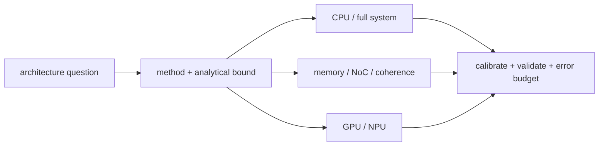

# Part 7 · Architecture › Simulators

Simulation is organized by question and modeled subsystem rather than by a flat tool catalog.

## Subdomains

| Subdomain | Chapters | Use it for |
|---|---:|---|
| [Methodology](01_Methodology/00_Index.md) | 2 | fidelity selection, experiments, analytical bounds and error budgets |
| [CPU and System](02_CPU_and_System/00_Index.md) | 1 | execution-driven core, OS and platform simulation |
| [Memory and Interconnect](03_Memory_and_Interconnect/00_Index.md) | 2 | DRAM and coupled NoC/coherence timing |
| [Accelerator Simulation](04_Accelerator_Simulation/00_Index.md) | 2 | GPU timing and NPU mapping/energy/cycle models |
| [Specialized Simulators](05_Specialized_Simulators/00_Index.md) | 1 | manycore, neuromorphic, datacenter, chiplet and ecosystem tools |

## Chapter map

| Chapter | Primary ownership |
|---|---|
| [Simulation Methodology](01_Methodology/01_Simulation_Methodology.md) | event engines, fidelity/speed, workload execution, warm-up and validation |
| [Analytical Models](01_Methodology/02_Analytical_Models.md) | roofline, interval, queueing, scaling and communication bounds |
| [gem5](02_CPU_and_System/01_gem5.md) | SE/FS, CPU models, classic/Ruby memory, checkpoints and statistics |
| [DRAM Simulators](03_Memory_and_Interconnect/01_DRAM_Simulators.md) | bank/channel state, timing constraints, scheduling and power |
| [NoC and Coherence Simulation](03_Memory_and_Interconnect/02_NoC_and_Coherence_Simulation.md) | finite protocol/network resources, synthetic versus coupled traffic and validation |
| [GPU Simulators](04_Accelerator_Simulation/01_GPU_Simulators.md) | SIMT, coalescing, HBM, tensor pipelines and trace/execution trade-offs |
| [Accelerator and NPU Simulators](04_Accelerator_Simulation/02_Accelerator_and_NPU_Simulators.md) | Timeloop/Accelergy, MAESTRO, SCALE-Sim and graph-scale tools |
| [Other Architecture Simulators](05_Specialized_Simulators/01_Other_Architecture_Simulators.md) | manycore, NoC, CIM, datacenter, chiplet and RISC-V catalog |

## Reading paths

- **Any study:** analytical bound → methodology → domain tool → validation/error budget.
- **CPU/coherence:** methodology → gem5/Ruby → NoC/coherence simulation.
- **NPU:** roofline → mapping simulator → cycle validation → full-chip composition.

---

⬅ [NPU](../06_NPU/00_Index.md) · [Architecture Contents](../00_Index.md) · [Root Index](../../Index.md)
