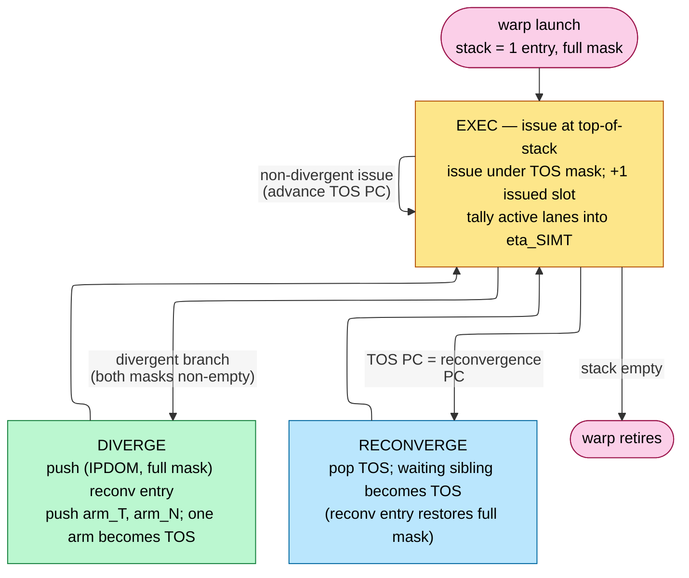

# GPU Simulators — GPGPU-Sim and Accel-Sim

> **Prerequisites:** [Simulation_Methodology](../01_Methodology/01_Simulation_Methodology.md) (execution- vs trace-driven §4, the event engine §3, ROI/warm-up/sampling §5), [Performance_Modeling_and_DSE §9](../../01_Modeling/01_Performance_Analysis/01_Performance_Modeling_and_DSE.md) (the GPU roofline/occupancy model these tools make executable).
> **Hands off to:** [Full_Chip_Modeling §3](../../01_Modeling/02_System_and_PPA/01_Full_Chip_Modeling.md) (GPU as a chip in the perf→power→thermal ladder), and the companion **AI-infra notebook** ([silicon-to-serving](https://github.com/Wty2003328/silicon-to-serving)) for GPU *microarchitecture* depth (SM internals, warp execution, tensor cores) that this page cites but does not re-derive.

---

## 0. Why this page exists

A GPU number — "1.9 IPC," "achieved 82% of HBM peak," "230 W" — is only as trustworthy as the model that produced it, and GPUs stress the modeling problem harder than CPUs: performance is a *throughput* emergent property of thousands of warps contending for L1/L2/HBM and an on-chip crossbar, not a per-instruction latency ([Performance_Modeling_and_DSE §9](../../01_Modeling/01_Performance_Analysis/01_Performance_Modeling_and_DSE.md)). This page explains the two open simulators that dominate architecture research — **GPGPU-Sim** (the execution-driven original) and **Accel-Sim** (the modern trace-driven framework that wraps GPGPU-Sim as its timing model) — at the level of *how the model works and how a CUDA kernel becomes an IPC/bandwidth number*, with the validation story that says whether to believe it (Accel-Sim lands within **~15% of real silicon** on cycles).

The scope line, per the [brief's](../../01_Modeling/02_System_and_PPA/01_Full_Chip_Modeling.md) cross-link discipline: **microarchitecture depth (what an SM *is*) lives in the companion AI-infra notebook; this page is about the *simulator* — its paradigm, its timing model, and how it turns a workload into a validated statistic.**

---

## 1. Two simulators, two paradigms

| | **GPGPU-Sim 3.x/4.0** | **Accel-Sim** (ISCA 2020) |
|---|---|---|
| Front-end | **execution-driven**: functionally executes the kernel | **trace-driven** (SASS) *or* execution-driven (PTX) |
| ISA modeled | **PTX** (virtual ISA) or **PTXPlus** (≈SASS for GT200) | **SASS** machine ISA, via an ISA-independent IR |
| Timing model | its own SIMT-core model | **wraps GPGPU-Sim 4.0** as the timing back-end |
| Power | **GPUWattch** | **AccelWattch** |
| Validated to | GT200, Fermi (≈98% correlation, PTXPlus) | Kepler→Turing (**15% cycle MAE**, 1.00 corr on Volta); Ampere configs shipped |

The relationship is the key fact: **Accel-Sim is not a new timing model — it is a new *front-end and validation harness* around GPGPU-Sim's timing core.** GPGPU-Sim answers "run this CUDA and time it"; Accel-Sim answers "replay this *real SASS trace* — including closed-source cuBLAS/cuDNN kernels — through a tuned, silicon-validated version of that same timing core." Sections 2–3 describe the shared timing model; §5 is the paradigm trade-off that motivated Accel-Sim.

---

## 2. The SIMT core timing model

The heart of both tools is the **SIMT core** (GPGPU-Sim calls it a *shader core*; it models one NVIDIA SM). It executes **warps** — lock-stepped groups of 32 threads — through a pipeline whose stages are the load-bearing structures (mechanism, not signal list):

- **Fetch / decode.** A round-robin arbiter reads the I-cache into a per-warp **instruction buffer** (I-Buffer, ~2 entries/warp). The model tracks I-cache misses like any cache.
- **Warp scheduler.** Each cycle a scheduler picks a *ready* warp to issue from (round-robin LRR, greedy-then-oldest **GTO**, or two-level). Multiple schedulers per core. Accel-Sim's **sub-core model** (Volta+) gives each scheduler its **own register-file slice and execution units** — a partitioned SM, which is why post-Volta occupancy and issue behavior only match hardware under the sub-core model.
- **Scoreboard.** Tracks pending register writes to enforce **RAW/WAW** hazards: a warp is *not ready* to issue if its operands are still in flight. This is how the model serializes dependent instructions without a full OoO window — GPUs hide latency with *other warps*, not reordering within one.
- **SIMT stack (divergence).** Per-warp stack that handles branch divergence via **post-dominator reconvergence**: on a divergent branch it pushes entries `(target PC, active mask, reconvergence PC)` and executes each path with a reduced active mask, re-merging at the immediate post-dominator. **Divergence directly lowers throughput** because masked-off lanes do no work — and the model counts exactly that.
- **Operand collector.** Models the register file as **single-ported banks** with an arbiter that spaces accesses to avoid bank conflicts — a real throughput limiter the naive "registers are free" model misses.
- **Execution units.** Separate pipelines — SP/INT (ALU), SFU (transcendental), LD/ST, and **Tensor Cores** (§4) — each with a configured latency and initiation interval. The units and their counts come from a config file (per-GPU).
- **Writeback** frees scoreboard entries and wakes dependent warps.

**The point of this model is the same as an OoO core model's ([OoO_Execution](../../02_CPU/03_Out_of_Order_Backend/01_OoO_Execution.md)): throughput is set by whichever structure saturates first** — not enough eligible warps (low occupancy)? scheduler starved on scoreboard stalls? operand-collector bank conflicts? execution-unit initiation-interval limited? The simulator tells you *which*, which is the whole reason to run it over a roofline estimate.

### 2.1 How the model advances one warp per cycle — the scheduler loop, derived

The whole timing model reduces to a per-cycle decision the event engine ([Simulation_Methodology §3](../01_Methodology/01_Simulation_Methodology.md)) repeats for every scheduler on every SM. Each cycle the scheduler holds a set of resident warps $\mathcal W$; it computes the *ready* subset and picks one:

$$\mathcal R \;=\; \big\{\,w\in\mathcal W \;:\; \text{scoreboard}(w)=\text{clear}\ \wedge\ \text{I-Buffer}(w)\ \text{filled}\ \wedge\ \neg\,\text{barrier}(w)\,\big\}, \qquad w^\star=\text{policy}(\mathcal R)$$

where $\mathcal R$ = issue-eligible warps and $\text{policy}$ is **GTO** (greedy-then-oldest: keep issuing $w^\star$ from the previous cycle until it stalls, then take the oldest ready warp) or **LRR** (loose round-robin: rotate). The two policies are not cosmetic: GTO preserves a single warp's L1/row-buffer locality (fewer cache/DRAM-row conflicts) at the cost of clustering that warp's misses, while LRR spreads issue evenly; the model reproduces the measured few-percent IPC gap between them because it schedules event-by-event, not from a closed form. If $\mathcal R=\varnothing$ the **issue slot goes idle for that cycle** — and that single idle-slot event is where every latency-hiding number is born.

Three per-instruction accountings turn one issued warp-instruction into memory/compute events, each the executable form of a [GPU_Architecture](../../05_GPU/01_Core_Architecture/01_GPU_Architecture.md) derivation:

- **Divergence → active-mask serialization.** On a branch that splits the warp, the SIMT stack ([GPU_Architecture §3](../../05_GPU/01_Core_Architecture/01_GPU_Architecture.md)) makes the model issue the taken arm under its reduced mask and *then* the not-taken arm under the complementary mask — two issue slots for one source branch. The model tallies active lanes per issued instruction and reports $\eta_{\text{SIMT}}=\overline{\text{active}}/32$; because it bills *one full issue slot per masked instruction*, a balanced if-else of arms $\ell_T,\ell_N$ costs $\ell_T+\ell_N$ issued slots to deliver $\max(\ell_T,\ell_N)$-worth of MIMD work — the $\eta=\tfrac12$ of [GPU_Architecture §3](../../05_GPU/01_Core_Architecture/01_GPU_Architecture.md), *measured*, not assumed.
- **Coalescing → transaction count.** At an LD/ST the model reads the warp's 32 active byte addresses (from the SASS trace or the functional pass) and emits the distinct-sector count $N_{\text{txn}}=\big|\{\lfloor a_i/G\rfloor\}\big|$ ([GPU_Architecture §6](../../05_GPU/01_Core_Architecture/01_GPU_Architecture.md)) as separate cache-access events — this is §3's coalescer, and it is what makes achieved bandwidth an output.
- **Scoreboard → dependence latency.** Issuing a load marks its destination registers pending and schedules the writeback event at `now + L_mem`; until it fires the warp is filtered out of $\mathcal R$. This is the $(L,II,P)$ cost model of [Simulation_Methodology §6](../01_Methodology/01_Simulation_Methodology.md) applied to a warp: the load's latency $L$ decides when the warp re-enters $\mathcal R$, the unit's initiation interval $II$ decides when the *next* warp can issue to that unit.

### 2.2 Little's law, executed cycle-by-cycle — where occupancy becomes idle slots

The model never evaluates the occupancy formula; it *realizes* it. [GPU_Architecture §1, §7](../../05_GPU/01_Core_Architecture/01_GPU_Architecture.md) shows that hiding a memory latency $L_{\text{mem}}$ at one issue/cycle needs $W_{\text{needed}}=\lceil L_{\text{mem}}/(t_{\text{issue}}\,k)\rceil$ resident warps (Little's law, with $k$ = independent memory ops a warp keeps in flight before it must wait). Run the §2.1 loop with fewer warps than that and the arithmetic is forced: each of $W_{\text{res}}$ warps issues, then sits on the scoreboard for $L_{\text{mem}}$ cycles, so at most $W_{\text{res}}$ of every $W_{\text{needed}}$ cycles find a ready warp and the rest are **idle issue slots**. The sustained issue rate the model reports is therefore

$$\phi \;=\; \frac{\text{cycles with}\ \mathcal R\neq\varnothing}{\text{total cycles}} \;=\; \min\!\Big(1,\ \frac{W_{\text{res}}}{W_{\text{needed}}}\Big),$$

the exact fill factor of [GPU_Architecture §7](../../05_GPU/01_Core_Architecture/01_GPU_Architecture.md) — but *measured* as the idle-slot fraction, not stipulated. This is why the simulator earns its cost over the roofline: it does not assume latency is hidden, it counts the cycles on which it was not.

*Worked number — register pressure leaks latency, counted slot by slot.* A kernel at 64 registers/thread is register-capped to $W_{\text{res}}=32$ resident warps on a 64-slot SM (the occupancy min of [GPU_Architecture §7](../../05_GPU/01_Core_Architecture/01_GPU_Architecture.md)). With $L_{\text{mem}}=400$ cyc and per-warp memory parallelism $k=6$, demand is $W_{\text{needed}}=\lceil400/6\rceil=67$ warps. The scheduler loop then finds a ready warp on only $\phi=32/67\approx48\%$ of cycles: the timing model literally stamps ~52% of issue slots idle and its per-warp stall counter attributes them to *long-scoreboard (memory) stalls* — the same counter Accel-Sim exports 1:1 to Nsight (§6). Recompiling to 32 registers/thread lifts $W_{\text{res}}$ to 64, so $\phi=\min(1,64/67)\approx0.96$ and the idle slots nearly vanish. The IPC the tool prints ($\approx\phi\times$ peak issue) *is* Little's law observed over $10^6$ cycles, which is exactly what a static occupancy calculator ([Performance_Modeling_and_DSE §9.1](../../01_Modeling/01_Performance_Analysis/01_Performance_Modeling_and_DSE.md)) cannot give you: the calculator says "50% occupancy," the simulator says "48% of the memory latency was exposed and here are the cycles."

### 2.3 The reconvergence stack, stepped — how the simulator turns divergence into a number

§2.1 charged *one issued slot per masked instruction*; **which** mask the model issues under, cycle after cycle, is decided by a small state machine over the per-warp **SIMT reconvergence stack**. [GPU_Architecture §3](../../05_GPU/01_Core_Architecture/01_GPU_Architecture.md) derives what that stack must *hold* — a triple `(next-PC, active-mask, reconvergence-PC)` per entry — from the three jobs a divergent branch imposes. The simulator's dual job is purely mechanical: **advance the stack by one transition on the warp it schedules**, and the issued-slot tally this produces *is* the $\eta_{\text{SIMT}}$ it reports (§2.1, §6). Reading the transitions off the stack invariant — *the top-of-stack (TOS) entry is the path now executing; every entry below is a path still owed execution before its reconvergence point* — there are exactly three:

1. **Issue (TOS).** Fetch at the TOS PC, issue under the TOS mask, advance the TOS PC. This bills **one issued slot no matter how many lanes the mask has on** — the mechanical reason a 3-active-lane instruction costs the same slot as a 32-active one, so divergence lands in $\eta_{\text{SIMT}}$ and is never smuggled into IPC (§6).
2. **Diverge.** When an issued branch leaves *both* a taken and a not-taken mask non-empty, replace the current entry with a reconvergence entry `(IPDOM, pre-split mask)` and the two path entries `(target_T, mask_T, IPDOM)`, `(target_N, mask_N, IPDOM)`. One arm becomes the new TOS; **the other waits below it — serialized, not run concurrently**, which is the entire cost.
3. **Reconverge.** When the TOS PC reaches its stored reconvergence-PC, pop; the sibling waiting below resumes, and when the stack unwinds to the reconvergence entry the full mask is restored and SIMD width returns.

**The count falls straight out of the transitions.** One un-nested if-else of arm lengths $\ell_T,\ell_N$ takes $\ell_T$ Issue transitions down one arm and $\ell_N$ down the other before the two Reconverge pops — $\ell_T+\ell_N$ issued slots to deliver $\max(\ell_T,\ell_N)$ of MIMD-equivalent work, the $\eta_{\text{SIMT}}=\tfrac12$ of a balanced split (§2.1). Because a Diverge nested *inside* an arm pushes a fresh pair onto a stack that already carries waiting entries, the losses **compose multiplicatively**: $d$ balanced levels serialize $2^{d}$ leaf paths, each issued in full, so the region bills $\sim 2^{d}\times$ its convergent slot count and

$$\eta_{\text{SIMT}} \;=\; 2^{-d} \qquad(d\ \text{balanced nesting levels}),$$

the stack meanwhile holding one waiting-sibling entry plus one reconvergence marker per un-reconverged level — depth **linear** in $d$, the small per-warp stack SRAM of [GPU_Architecture §3](../../05_GPU/01_Core_Architecture/01_GPU_Architecture.md). *Worked number — a two-deep nest, counted slot by slot.* A warp hits an outer balanced branch; each arm is itself a balanced branch, and every one of the four leaf paths is $\ell=5$ instructions. The stack serializes all four leaves, so the model's issue accumulator advances $4\ell=20$ slots while each lane retires only its own $\ell=5$ instructions of useful work: $\eta_{\text{SIMT}}=\tfrac{32\cdot5}{20\cdot32}=\tfrac14=2^{-2}$ — a $4\times$ throughput loss the model *counts* (and attributes to divergence in its per-warp breakdown), not one it assumes. Predicating the innermost branch — masked straight-line code, no second inner arm issued — collapses one level and recovers $2\times$ ($\eta_{\text{SIMT}}:\tfrac14\to\tfrac12$), which is exactly why the compiler predicates short arms ([GPU_Architecture §3](../../05_GPU/01_Core_Architecture/01_GPU_Architecture.md)). This state machine is also *why* a committed SASS trace is a faithful stimulus for divergence (§5.1): the active masks are recorded per warp-instruction, so replay steps the very same stack the hardware did.

---

## 3. Coalescing and the cache / HBM / interconnect contention layer

Memory is where GPU performance is usually won or lost, and where the "achieved bandwidth" number is *born* (as an output of contention, exactly like the [DRAM page §8](../03_Memory_and_Interconnect/01_DRAM_Simulators.md)):

- **Coalescer.** A warp's 32 per-lane addresses are merged into the fewest memory transactions. GPGPU-Sim (GT200 era) coalesces at half-warp granularity; **Accel-Sim models a sub-warp, sectored coalescer on 32-byte sectors**, matching the sector structure reverse-engineered on Pascal/Volta/Turing. A perfectly coalesced access touches one line; a scattered one explodes into many transactions — the model counts the *post-coalescer* access count, which is what actually hits the caches.
- **L1 / L2.** Both sectored (32 B sectors within 128 B lines) with MSHRs bounding outstanding misses. Accel-Sim adds an **adaptive, streaming L1** and an **IPOLY-hashed L2** that scatters addresses across L2 slices to avoid *partition camping* (a few hot slices serializing traffic) — the GPU cousin of the DRAM bank-hashing in [DRAM_Simulators §5](../03_Memory_and_Interconnect/01_DRAM_Simulators.md). Write-back + write-allocate with sub-sector write merging to conserve DRAM bandwidth.
- **Interconnect.** GPGPU-Sim routes SM↔L2-slice traffic through **BookSim** (a detailed virtual-channel NoC simulator; separate request/response networks to avoid protocol deadlock); Accel-Sim uses a configurable crossbar with set flit size and bandwidth. **This is the contention layer** — the shared resource where two SMs' memory streams serialize (the [Network_on_Chip](../../04_Interconnect/02_Network_on_Chip/01_Network_on_Chip.md) theory, in-package).
- **DRAM (GDDR/HBM).** A cycle-level GDDR/HBM controller with row buffers, JEDEC-style timing, and FIFO or FR-FCFS scheduling — the same kind of model as the [DRAM_Simulators](../03_Memory_and_Interconnect/01_DRAM_Simulators.md) page, just wider and hotter. Achieved HBM bandwidth is an *output* of this stack.

The queueing intuition from [Simulation_Methodology §7](../01_Methodology/01_Simulation_Methodology.md) applies at every one of these shared resources: latency stays flat until utilization nears saturation, then climbs as $\sim 1/(1-\rho)$. **Accel-Sim's tuning of this layer is exactly what closed the accuracy gap** — it reaches ~82% of theoretical HBM bandwidth and ~85% of L1 bandwidth on microbenchmarks, versus GPGPU-Sim 3.x's ~62% and ~33%, because the older coalescer/cache/interconnect models under-delivered bytes.

### 3.1 Why contention is an *output*, not a formula

There is no "contention term" anywhere in the code. Each shared server — an L2 slice, a crossbar port, a DRAM bank — is modeled as a stream of *service events* ([Simulation_Methodology §3](../01_Methodology/01_Simulation_Methodology.md)): the slice grants one access per cycle, the bank accepts one access per row-cycle $t_{RC}$ on a row miss. When two SMs' post-coalesce transactions target the same L2 slice, the second's grant event is scheduled *after* the first's, and the gap between arrival and grant is queueing delay that no one typed. Model one contended stage as M/M/1: with offered load $\lambda$ and service rate $\mu$, utilization $\rho=\lambda/\mu$ and mean residence

$$W \;=\; \frac{1/\mu}{1-\rho}\qquad(\text{service time }1/\mu\text{ amplified by }1/(1-\rho)),$$

so latency is flat at low load and diverges at the saturation knee — *emergent* from serializing grant events. *Worked number:* an L2 slice serving $\mu=1$ access/cycle under $\rho=0.9$ offered load (a hot slice several SMs pound) inflates each access from 1 to $1/(1-0.9)=10$ cycles of residence — a 10× stall the modeler never wrote. Push $\rho$ to 0.95 and it is 20 cycles: the $1/(1-\rho)$ wall is why L2-slice hashing (IPOLY) to *lower* each slice's $\rho$ is an accuracy-critical model feature, not a detail.

### 3.2 The MSHR bound — Little's law on the miss side

Miss concurrency is capped by the **MSHRs** (miss-status/handling registers), and the cap is Little's law again, now on the memory side. A cache with $N_{\text{MSHR}}$ registers can hold at most that many misses outstanding; each occupies its register for the round-trip latency $L$ before the fill frees it. In-flight $=\text{rate}\times L$ (Little), and in-flight $\le N_{\text{MSHR}}$, so the **sustainable miss throughput is structurally ceilinged**:

$$\lambda_{\text{miss}} \;\le\; \frac{N_{\text{MSHR}}}{L}\quad\text{(misses/cycle)},$$

where $N_{\text{MSHR}}$ = outstanding-miss slots, $L$ = miss round-trip (cycles). Beyond it the cache back-pressures, the LSU stalls, and warps pile onto the scoreboard — a stall the roofline cannot see because it has no MSHR. *Worked number:* an L1 with $N_{\text{MSHR}}=32$ and a 300-cycle L2/HBM round-trip sustains at most $32/300\approx0.11$ misses/cycle. At a 32-byte sector per miss and a 1.4 GHz SM that is $0.11\times32\times1.4\times10^9\approx4.8$ GB/s of *miss* bandwidth per SM from MSHRs alone — so a streaming kernel whose per-SM demand exceeds this is MSHR-throttled *before* HBM is even the limit, and the only fixes are more MSHRs or more reuse (fewer misses). This is precisely the kind of ceiling that makes a cycle model necessary: it is invisible to $\min(\pi,\,\beta I)$.

### 3.3 Why the shared tiers set the accuracy — the min-over-ceilings argument

Achieved bandwidth is the minimum over a *chain* of finite-rate servers ([Simulation_Methodology §7](../01_Methodology/01_Simulation_Methodology.md)): the coalescer output feeds the L1, whose miss stream feeds the crossbar, whose traffic feeds the L2 slices, whose miss stream feeds the DRAM banks at ceiling $B\cdot\text{burst}/t_{RC}$. The delivered rate is

$$B_{\text{achieved}} \;=\; \min\big(B_{\text{L1}},\ B_{\text{xbar}},\ B_{\text{L2}},\ B_{\text{DRAM}}\big),$$

and the *slowest contended stage* sets it. The decisive fact is **which stages are shared**: L1 and the register file are per-SM (their contention is one SM's own traffic), but the crossbar, the L2 slices, and the HBM channels are a *single pool serving all ~130 SMs*, so cross-SM contention concentrates there — that is where $\rho\to1$ and the $1/(1-\rho)$ knee actually bites. A model can be sloppy about per-SM L1 timing and still rank kernels; get the crossbar/L2/DRAM arbitration wrong and every memory-bound number is wrong. This is why Accel-Sim's re-tuning targeted exactly this layer — the sub-warp sectored coalescer (fewer, fuller transactions into L1), the IPOLY L2 hash (lower per-slice $\rho$), and a calibrated crossbar — and why that retuning is what moved achieved HBM from 62% to 82% of peak: the older models left bytes on the table at the *shared* stages, so they under-delivered bandwidth and mis-timed every memory-bound kernel.

---

## 4. Tensor Core modeling

Tensor Cores (the matrix-multiply-accumulate units behind modern GEMM/AI throughput) are modeled as **execution units with a matrix-op latency and initiation interval**, at two levels of fidelity:

- **PTX / execution-driven**: the abstract **WMMA** (warp matrix-multiply-accumulate) instruction — one coarse op the timing model charges a latency for.
- **SASS / trace-driven**: the fine-grained **HMMA** instructions the compiler actually emits (Accel-Sim ships Volta/Turing ISA defs; a Turing config models, e.g., 8 HMMA tensor pipes/SM). This captures the real instruction count and issue pattern.

**The charge, derived.** A tensor op is just another op-class in the $(L,II,P)$ cost model of [Simulation_Methodology §6](../01_Methodology/01_Simulation_Methodology.md): a latency $L$ until the accumulate result is ready and an initiation interval $II$ before the pipe accepts the next MMA. What makes it special is the FLOP it retires per issue slot. A warp-level $m\times n\times k$ MMA performs $2mnk$ FLOP (a multiply and an add per output element, over the $k$-reduction) in *one* issued instruction, so the throughput the model charges is

$$\text{FLOP/cycle} \;=\; \frac{2mnk}{II}\times(\text{tensor pipes}),$$

where $m,n,k$ = MMA tile dims, $II$ = issue interval, and the pipe count is the per-SM parallelism. *Worked number (dims real, $II$ illustrative):* an abstract WMMA at $16\times16\times16$ is $2\cdot16^3=8192$ FLOP in one slot; at an illustrative $II=8$ cycles that is $1024$ FLOP/cycle/pipe — against a single FP32 lane's $2$ FLOP/cycle (one FMA), a **512× density per issue slot**, which is exactly why one tensor instruction can amortize away the front-end cost that §2 spends on ordinary warps ([GPU_Architecture §4](../../05_GPU/01_Core_Architecture/01_GPU_Architecture.md)). The model needs nothing more than $(L,II)$ per MMA shape to fold tensor throughput into the same §2 scoreboard/issue loop.

**Why the *abstract* op can beat the *fine* one — error localization.** The paper notes the coarse WMMA sometimes matches hardware better than the fine-grained HMMA stream for certain tile sizes, which looks paradoxical until you count where the error lives. The abstract path charges *one* $(L,II)$ for the whole warp-matrix op, absorbing the real hardware decomposition into a single calibrated constant — one op, one error. The fine path issues the $n$ real HMMA sub-ops and must get each sub-op's latency, issue interval, *and* inter-sub-op dependence right; if each carries a small timing error $\delta$, they accumulate over the $n$ sub-ops — in the worst (correlated) case as $n\delta$, at best as $\sqrt n\,\delta$ ([Simulation_Methodology §8](../01_Methodology/01_Simulation_Methodology.md), composed error). So "closer to the metal" trades one calibrated bias for many small errors that can sum past it: *fidelity of form* is not the same as *accuracy of number*, and the crossover depends on how well the sub-op constants were fit. **Deep Tensor-Core / systolic modeling and the AI-kernel view belong to the companion AI-infra notebook**; here the point is only *how the simulator accounts for them* — as configured EU latency/throughput driving the same §2 pipeline.

---

## 5. Trace-driven vs execution-driven — Accel-Sim's key design point

This is the pivotal trade-off ([Simulation_Methodology §4](../01_Methodology/01_Simulation_Methodology.md)), and Accel-Sim's central bet.

**Execution-driven (GPGPU-Sim, PTX).** The simulator functionally executes the kernel, so it has real data values and control flow, and can model anything data-dependent (divergence on computed values, atomics, inter-block synchronization). But it simulates the **virtual ISA (PTX)** with its naive infinite-register model — *not* the machine code that actually runs — so it misses real register allocation, instruction scheduling, and compiler optimization, and it **cannot run closed-source kernels** (cuBLAS/cuDNN) at all.

**Trace-driven (Accel-Sim, SASS).** Instrument a *real* execution once with **NVBit** and record a per-warp SASS trace: PC, active mask, register operands, execution-unit assignment, and memory addresses. Replay that into the timing model. This:

1. captures the **actual machine ISA** — real register allocation, scheduling, and optimizations the PTX model fabricates away;
2. runs **closed-source, hand-tuned libraries** (cuDNN, cuBLAS, CUTLASS) that have no open PTX to execute;
3. is **~4.3× faster** (≈12.5 K warp-instructions/s) because it skips functional emulation of every scalar thread;
4. is portable via an **ISA-independent IR** with 1:1 SASS correspondence, so a new GPU generation is an "ISA-def file" (opcode→EU map) rather than a rewrite.

The cost — the standard trace-driven caveat — is a **frozen path**: a SASS trace captured on one GPU cannot reveal wrong-path or data-dependent behavior for a *different* configuration, and timing-dependent effects (spin-waits, some atomics/synchronization) are not faithfully re-timed. **The rule holds exactly as in the methodology page: trace-driven SASS is sound because a kernel's instruction/address stream is a faithful stimulus for the *timing* model, and it is the only way to reach real compiler output and closed-source libraries — but keep PTX execution-driven mode for studies where timing feeds back into which instructions run.** Traces are large (6.2 TB per GPU generation for the validation suite), tamed to ~317 GB by **base+stride compression** of the regular address/register streams.

### 5.1 Why trace-driven is *safer* for a GPU than for an OoO CPU

[Simulation_Methodology §4](../01_Methodology/01_Simulation_Methodology.md) writes the executed stream as a function of the microarchitecture, $\Pi(\mu)$: replaying a frozen trace $\Pi(\mu_0)$ into a timing model of $\mu_1$ is correct **iff $\Pi(\mu_1)=\Pi(\mu_0)$**, i.e. iff the path is $\mu$-independent. For an OoO CPU the dangerous term is *wrong-path*: the branch predictor is part of $\mu$, and a committed-only trace omits the $\phi_{\text{wp}}=b(1-a)W_{\text{wp}}$ speculative instructions ([Simulation_Methodology §4](../01_Methodology/01_Simulation_Methodology.md)) that pollute caches and contend for ports — a 30%-extra-fetch distortion on branchy, hard-to-predict code.

**A GPU has essentially none of that term.** The SIMT machine does not speculate past a divergent branch — the reconvergence stack *serializes both real arms under masks* ([GPU_Architecture §3](../../05_GPU/01_Core_Architecture/01_GPU_Architecture.md)); there is no predicted path to be wrong about and squash. So the wrong-path overhead the CPU caveat is built around is

$$\phi_{\text{wp}}^{\text{GPU}} \;\approx\; 0 \qquad\text{vs the CPU's } \phi_{\text{wp}}\approx 0.30,$$

and the committed SASS instruction/address stream is very nearly the *entire* stimulus the timing model needs. This is the deep reason Accel-Sim could go trace-driven and *still* validate to 1.00 correlation where trace-driven OoO-CPU studies would not: the path-dependence that disqualifies traces for core-µarch CPU work is structurally absent on a GPU. The residual $\mu$-dependence is only the timing-fed-back class the page already flagged — atomics whose contention outcome depends on relative timing, spin-waits, and inter-block synchronization — a small, nameable set, not the pervasive wrong-path of a speculative core. That is the precise, quantified boundary behind "keep PTX execution-driven mode for studies where timing feeds back into which instructions run."

### 5.2 The PTX tax and the 4.3× speedup, derived

**Why PTX is a rung less accurate — instruction-count fidelity gates cycle fidelity.** PTX is the *virtual* ISA: an infinite-register, pre-allocation, pre-scheduling form. The real SASS the hardware runs differs by register allocation, spills, instruction scheduling, and machine idioms, so the two have *different dynamic instruction counts and different memory-access patterns*. Since cycles are accumulated by summing per-instruction charges over the executed stream (§6), timing the *wrong* stream caps accuracy no matter how good the per-op model is: if the instruction count is off by $\Delta_I$, the cycle count inherits a systematic error tracking $\Delta_I$. The validation bears this out exactly — on Volta, GPGPU-Sim 3.x's PTX path mis-counts dynamic instructions by **27%** and lands at **94% cycle error**, while Accel-Sim's SASS path holds instruction count to **1%** and cycle error to **15%** (§8). The ~19-point MAE gap between PTX (34%) and SASS (15%) execution-driven runs *is* the virtual-ISA tax, and its root is that you cannot time instructions the real machine never executed.

**Why ~4.3× faster.** The speedup is an $i_{\text{ev}}$ argument from the slowdown identity $S\approx w=i_{\text{ev}}\cdot n_{\text{ev}}$ ([Simulation_Methodology §2.1](../01_Methodology/01_Simulation_Methodology.md), host instructions per event × events per cycle). Execution-driven mode must *functionally emulate every scalar thread* — compute 32 lanes' worth of ALU results per warp-instruction to produce the values that drive addresses and divergence — which is a large $i_{\text{ev}}$. Trace-driven mode already has those addresses and masks recorded, so it skips functional emulation entirely and only advances the timing model: a much smaller $i_{\text{ev}}$ per warp-instruction. The recorded ~4.3× (≈12.5 K warp-instructions/s) is the ratio of the two $w$'s — you pay once, at trace-capture time on real silicon, to avoid re-emulating every thread on every replay, which is also what makes iterating the *timing model* against a fixed workload cheap.

---

## 6. How a CUDA kernel or SASS trace becomes IPC and achieved bandwidth

The stat pipeline, end to end, and *how each number is computed* ([Simulation_Methodology §5](../01_Methodology/01_Simulation_Methodology.md)):

**Execution-driven (GPGPU-Sim).** `nvcc` compiles CUDA/OpenCL to PTX+SASS in the fat binary → GPGPU-Sim extracts PTX (or `cuobjdump`'s SASS, optionally converted to PTXPlus) → a **functional** pass executes threads to produce correct state and the dynamic instruction stream → that same stream drives the **timing** pass, accumulating cycles through the §2–3 model.

**Trace-driven (Accel-Sim).** NVBit records the SASS trace on real hardware → the trace front-end feeds warp-instructions into GPGPU-Sim 4.0's timing model → cycles accumulate identically.

Either way, the reported statistics are computed as:

$$\text{IPC} = \frac{\text{warp-instructions executed}}{\text{cycles}}, \qquad \text{BW}_{\text{achieved}} = \frac{\text{bytes moved (post-coalesce)}}{\text{cycles}/f}, \qquad \text{occupancy} = \frac{\overline{\text{active warps}}}{\text{warps}_{\max}/\text{SM}}$$

where $f$ = core clock and *warp-instructions* (machine-instruction count) is used for cross-simulator fairness. Each numerator is an accumulator the §2–§3 event loop increments: a warp-instruction on every issue, post-coalesce bytes on every transaction (§3), a running active-warp average sampled per cycle.

*Worked numbers — the three statistics for one SM's stream.* Suppose one SM retires $2.00\times10^{9}$ warp-instructions over $1.05\times10^{9}$ cycles: $\text{IPC}=2.00/1.05\approx\mathbf{1.9}$ (the "1.9 IPC" of §0, now sourced; $\le n_{\text{sched}}$, next paragraph). If over those cycles its coalescer sent $4.8\times10^{8}$ 32-byte sectors to HBM $=15.4$ GB, then at $f=1.4$ GHz the run is $1.05\times10^{9}/1.4\times10^{9}=0.75$ s and $\text{BW}_{\text{achieved}}=15.4/0.75\approx\mathbf{20.5\ GB/s}$ for this SM — $\times\,132$ SMs $\approx2.7$ TB/s, i.e. **~81% of a 3.35 TB/s HBM3 part**, the "achieved fraction of peak" of §3 as an *output* of contention, not an input. If the per-cycle active-warp average is $48$ against $W_{\max}=64$, occupancy $=48/64=\mathbf{75\%}$. All three fall out of the same accumulators, which is why they are mutually consistent rather than three separate estimates.

**Why warp-instructions, and the clean bound they carry.** Counting *warp*-instructions (one per issue slot) rather than *thread*-instructions (× active lanes) makes IPC a pure issue-rate metric: it caps at the scheduler count, $\text{IPC}_{\text{warp}}\le n_{\text{sched}}$ per SM (four sub-core schedulers → IPC ≤ 4/SM), independent of warp width and undistorted by divergence — a warp that issues with 3 active lanes still counts as one instruction, so divergence shows up in $\eta_{\text{SIMT}}$ (§2.1), *not* smuggled into IPC. The caveat this exposes: because PTX and SASS have *different* instruction counts (§5.2), IPC is not comparable across the two front-ends — the honest cross-mode comparison is **cycles** (or wall-time at fixed $f$), whose denominator-free form is what §8 validates. Accel-Sim deliberately emits counters with **1:1 correspondence to NVIDIA profiler (nvprof/Nsight) counters** — L1/L2 reads, hits, hit rates, DRAM read/write counts, per-unit stalls — so validation is a *counter-by-counter* comparison against silicon, not a single-number hand-wave. As always, the honest report attaches an ROI, warm-up, and (for sampled runs) a confidence interval ([Simulation_Methodology §5](../01_Methodology/01_Simulation_Methodology.md)).

---

## 7. Power — GPUWattch and AccelWattch

Power reuses the perf model's **activity counts** and multiplies by **per-event energy** — the same activity×energy principle as McPAT/DRAMPower ([Full_Chip_Modeling §1.7](../../01_Modeling/02_System_and_PPA/01_Full_Chip_Modeling.md)):

$$P_{\text{dyn}} = \sum_i a_i \cdot \frac{E_i}{T_{\text{elapsed}}}, \qquad P_{\text{total}} = \underbrace{\beta C f^3}_{\text{dynamic, DVFS}} + \underbrace{\tau f}_{\text{static}} + \underbrace{P_{\text{const}}}_{\text{fans/aux}}$$

where $a_i$ = accesses to component $i$ (from the timing sim), $E_i$ = energy per access, $T_{\text{elapsed}}$ = runtime, and $f$ = clock.

**The rollup, derived.** Dynamic energy is additive over events by construction: each access to component $i$ dissipates $E_i$ (the switched charge $\alpha C_i V^2$ of that structure), so the total switching energy of a run is $\sum_i a_i E_i$ and dividing by the runtime gives power — the same activity×energy identity McPAT uses for CPUs ([Full_Chip_Modeling §1.7](../../01_Modeling/02_System_and_PPA/01_Full_Chip_Modeling.md)), here summed over GPU-specific structures (RF banks, L1/L2 sectors, FP/INT/SFU/tensor pipes, LSU/coalescer, crossbar, HBM). *Worked number (illustrative energies):* say a kernel-second records $a_{\text{RF}}=3\times10^{12}$ register accesses at $E_{\text{RF}}=2$ pJ, $a_{\text{L2}}=4\times10^{11}$ at $30$ pJ, and $a_{\text{HBM}}=6\times10^{10}$ at $400$ pJ. Then $P_{\text{dyn}}=(3\times10^{12}\cdot2+4\times10^{11}\cdot30+6\times10^{10}\cdot400)\times10^{-12}\,\text{W}=6+12+24=\mathbf{42\ W}$ from those three components — and note HBM, at 2% of the *accesses* of the RF, is 57% of *this* subtotal, the pJ/byte ladder of [GPU_Architecture §8](../../05_GPU/01_Core_Architecture/01_GPU_Architecture.md) making the memory term dominate exactly as it dominates energy on real parts.

**The DVFS form, derived.** Dynamic power per structure is $\alpha C V^2 f$; along the DVFS operating curve the supply must rise with frequency to meet timing, $V\propto f$, so $V^2 f\propto f^3$ — the cubic $\beta C f^3$ term ([GPU_Architecture §8](../../05_GPU/01_Core_Architecture/01_GPU_Architecture.md), [Performance_Modeling_and_DSE §6](../../01_Modeling/01_Performance_Analysis/01_Performance_Modeling_and_DSE.md)). Leakage is $\propto V$ (times a temperature factor), and on the same curve $V\propto f$, so static tracks $\tau f$; $P_{\text{const}}$ is the voltage/frequency-independent floor (I/O, some analog, fans). *Worked number:* clocking a Boost step from 1.0 to 1.4 GHz multiplies the dynamic term by $1.4^3\approx2.7\times$ while the static term grows only $1.4\times$ — which is precisely why a power-capped GPU trades a little clock for a lot of headroom (the DVFS loop of [GPU_Architecture §8](../../05_GPU/01_Core_Architecture/01_GPU_Architecture.md)).

**Why it *needs* the timing model's activity.** The $a_i$ are the one input a power model cannot invent: how many L2 reads *actually* happened after coalescing and caching, how many tensor-pipe issues, how many DRAM row activations — all are outputs of the §2–§3 contention model, not of the source code. A pure roofline estimate of $a_i$ would inherit the roofline's blindness to contention and mis-apportion energy. So power accuracy is *floored by* activity accuracy: to first order the relative power error composes as $\sigma_P\approx\sqrt{\sigma_{\text{activity}}^2+\sigma_{\text{energy}}^2}$ ([Simulation_Methodology §8](../01_Methodology/01_Simulation_Methodology.md)), and you cannot get power right on wrong activity counts. This is the mechanism behind the GPUWattch→AccelWattch jump below: it is not only better per-event energies, it is that AccelWattch draws activity from a timing model whose counts are validated (L2-reads 0.03 NRMSE, §8) instead of GPGPU-Sim 3.x's (2.67 NRMSE) — the "SIM" modes are only as good as the timing sim feeding them, which is why AccelWattch also offers HW-counter and HYBRID modes to source $a_i$ from silicon when the timing model is the weak link.

- **GPUWattch** (integrated in GPGPU-Sim) was the original; it is badly miscalibrated for modern parts — **219% MAPE on Volta** — largely because it mis-modeled constant/static power under DVFS.
- **AccelWattch** (MICRO 2021) fixes this with an explicit **constant + static + dynamic** decomposition (including chip-/SM-/lane-level power-gating for leakage) and the cubic-in-$f$ DVFS form above. Its 22 dynamic-component energies are fit by quadratic programming over 102 microbenchmarks. It runs in four modes — **SASS-SIM, PTX-SIM, HW (hardware counters only), and HYBRID** — so you can power a component from counters even without a full timing model.
- **Validation (Volta GV100):** AccelWattch SASS-SIM reaches **9.2% ± 3.1% MAPE**, Pearson $r$ ≈ 0.83–0.91 across 26 kernels — a **22–24× accuracy gain over GPUWattch** — and transfers to unseen architectures at 11% (Pascal TITAN X) and 13% (Turing RTX 2060S) MAPE.

---

## 8. Supported GPUs and the validation story

The reason to trust an Accel-Sim number is its **counter-level correlation to real silicon**:

| Config | Cycle MAE | Correlation | Note |
|---|---|---|---|
| Volta (Quadro V100), **SASS trace** | **15%** | **1.00** | the headline result |
| Volta, PTX execution-driven | 34% | 0.98 | virtual ISA costs accuracy |
| GPGPU-Sim 3.x (prior art) | **94%** | — | Accel-Sim cuts cycle error 79 pp |
| Deepbench (closed-source cuDNN/cuBLAS) | 33% | 0.95 | texture/local-load modeling gaps |

Per-metric on Volta the agreement is tight: dynamic **instruction count 1% MAE** (vs 27% for GPGPU-Sim 3.x), L2-reads 0.03 NRMSE (vs 2.67), DRAM-reads 0.92 NRMSE (vs 5.69) — i.e. it gets not just cycles but the *component activity* that drives power. **Generations:** the ISCA 2020 paper validates **Kepler (TITAN), Pascal (TITAN X), Volta (V100), Turing (RTX 2060)**; the framework has since shipped tuned/tested **Ampere** configs (SM80 A100, SM86 RTX 3070) and is the standard vehicle for Volta-through-Ampere-class studies.

### 8.1 What "15% MAE, 1.00 correlation" means — and why *both* numbers matter

Define the two figures of merit. Over $K$ validation kernels, $\text{MAE}=\frac1K\sum_k |c_k^{\text{sim}}-c_k^{\text{hw}}|/c_k^{\text{hw}}$ is the mean *absolute* relative cycle error; the Pearson $r$ of the $(c^{\text{sim}},c^{\text{hw}})$ pairs measures how *linearly* the two track. The reason to report both is the [Simulation_Methodology §8](../01_Methodology/01_Simulation_Methodology.md) split of error into a **systematic** part (a consistent distortion) and a **random** part (per-config scatter), because they act on different axes:

- **Systematic error cancels in ranking.** If the model is a near-constant multiple of hardware, $c^{\text{sim}}\approx\kappa\,c^{\text{hw}}$, then $r=1$ *exactly* and every pairwise ranking is preserved — $c_A^{\text{sim}}>c_B^{\text{sim}}\iff c_A^{\text{hw}}>c_B^{\text{hw}}$ — while the MAE reads $|\kappa-1|$. A uniformly-15%-high model therefore has **zero ranking error**. Accel-Sim's $r\approx1.00$ says its 15% is almost purely this cancelling kind, which is why it *ranks configurations essentially perfectly even where it is 15% off in absolute cycles* — the property DSE actually needs ([Performance_Modeling_and_DSE §5](../../01_Modeling/01_Performance_Analysis/01_Performance_Modeling_and_DSE.md)).
- **Random error sets the resolution limit.** The scatter around the trend line, SD $s$, is what mis-orders close configs: two designs a true $\Delta$ apart are distinguishable at 95% only if $\Delta>2.8\,s$ ([Simulation_Methodology §8](../01_Methodology/01_Simulation_Methodology.md)). With $r\to1$, $s\to0$ and the model resolves arbitrarily close designs; a hypothetical "5% MAE but $r=0.9$" model has *larger* $s$ and cannot separate a 6%-apart pair. This is the precise sense in which **15%-off-but-$r{=}1.00$ beats 5%-off-but-$r{=}0.9$** for architecture work — the headline is the correlation, not the MAE.

### 8.2 Where the 15% comes from — the structural residual, and how errors compose

Calibration (Accel-Sim's per-generation tuning of latencies, the coalescer, the L2 hash, the crossbar) drives out *parameter* error; what remains is **structural** — the error of the model's *form*, which no amount of fitting removes ([Simulation_Methodology §8](../01_Methodology/01_Simulation_Methodology.md)). The 15% is that structural floor for the tuned Volta-SASS config, and you can see its sources directly in the table: the un-modeled texture/local-load paths and the abstracted crossbar are what push closed-source Deepbench to 33%. The other rows decompose against this floor:

- **PTX 34% = ~15% structural + ~19% virtual-ISA tax.** The execution-driven PTX run shares the same timing core, so its extra ~19 points over SASS are the instruction-count/allocation error of §5.2 — a *different* error source stacked on the same structural residual.
- **GPGPU-Sim 3.x 94%** is dominated by *both* an untuned contention layer (which under-delivered bandwidth, §3) and a 27% instruction-count error (§5.2) — parameter error Accel-Sim's calibration removed, taking cycle error from 94% to 15% (a 79-point drop).

The floor is consistent with methodology's generic "calibrated ≈ 20–30%," and slightly better because it is validated *per target generation* rather than once. Finally, the 15% is a *perf* number; a full perf→power study composes it with AccelWattch's ±9% (§7). If the two errors are independent they add in quadrature to $\sqrt{0.15^2+0.09^2}\approx\mathbf{17.5\%}$; if they share a common bias (a technology-knob or activity-count error feeding both) they add linearly to $\approx24\%$ ([Simulation_Methodology §8](../01_Methodology/01_Simulation_Methodology.md)) — which is exactly why the perf and power models are co-validated against the same silicon rather than trusted separately.

---

## Numbers to memorize

| Quantity | Value | Why it matters |
|---|---|---|
| Warp width | 32 threads (SIMT lock-step) | the unit the timing model advances |
| Latency-hiding fill factor (measured) | $\phi=\min(1,\,W_{\text{res}}/W_{\text{needed}})$ | idle-issue-slot fraction = exposed latency; Little's law observed (§2.2) |
| SIMT efficiency (counted) | $\eta_{\text{SIMT}}=\overline{\text{active}}/32$ per issued inst | divergence serialized as masks; not smuggled into IPC (§2.1) |
| Divergence nesting | $\eta_{\text{SIMT}}=2^{-d}$ ($d$ balanced levels) | stack serializes $2^{d}$ leaf paths, one slot each (§2.3) |
| Coalescer output | $N_{\text{txn}}=\lvert\{\lfloor a_i/G\rfloor\}\rvert$, $G{=}32$ B | post-coalesce sector count is what hits caches (§2.1, §3) |
| MSHR miss-throughput ceiling | $\lambda_{\text{miss}}\le N_{\text{MSHR}}/L$ | structural cap the roofline can't see (§3.2) |
| Shared-tier queueing knee | $W=(1/\mu)/(1-\rho)$ | L2/xbar/DRAM contention emerges, un-typed (§3.1) |
| GPU wrong-path overhead | $\phi_{\text{wp}}^{\text{GPU}}\approx 0$ (CPU: $0.30$) | why trace-driven SASS is safe for GPUs (§5.1) |
| Tensor-op issue density | $2mnk/II$ FLOP/cycle | one slot amortizes ~$10^{2\text{–}3}$× a scalar lane (§4) |
| Accel-Sim cycle accuracy (Volta SASS) | **15% MAE, 1.00 corr** | the "trust to ~15%" headline |
| Correlation vs MAE | $r{=}1.00\Rightarrow$ systematic error cancels in ranking | 15%-off still ranks configs perfectly (§8.1) |
| PTX vs SASS accuracy (Volta) | 34% vs 15% MAE | ~19 pp virtual-ISA tax (inst-count error, §5.2) |
| GPGPU-Sim 3.x → Accel-Sim | 94% → 15% cycle error | 79 pp; parameter error calibration removed (§8.2) |
| Trace-driven speedup | ~4.3× (≈12.5 K warp-inst/s) | skips scalar functional emulation (§5.2) |
| Achieved BW (Accel-Sim vs GPGPU-Sim 3.x) | HBM 82% vs 62%, L1 85% vs 33% | contention layer is the accuracy lever (§3.3) |
| AccelWattch power (Volta SASS-SIM) | **9.2% MAPE** (GPUWattch: 219%) | activity×energy; floored by activity accuracy (§7) |
| Composed perf→power error | $\sqrt{0.15^2+0.09^2}\approx17.5\%$ (indep.) | co-validate the loop; linear if correlated (§8.2) |
| IPC definition | warp-instructions / cycles ($\le n_{\text{sched}}$/SM) | machine-inst count, for fairness (§6) |
| Validated generations | Kepler→Turing (paper); Ampere (configs) | the coverage envelope |

---

## Cross-references

- **The hardware this simulates:** [GPU_Architecture](../../05_GPU/01_Core_Architecture/01_GPU_Architecture.md) — the page derives what this one makes *executable*: Little's-law latency-hiding and the fill factor $\phi$ ([§1, §7](../../05_GPU/01_Core_Architecture/01_GPU_Architecture.md) → §2.2 here), SIMT divergence efficiency $\eta_{\text{SIMT}}$ ([§3](../../05_GPU/01_Core_Architecture/01_GPU_Architecture.md) → §2.1, and the reconvergence-stack state machine that *produces* it, §2.3), the coalescer and sectored access $N_{\text{txn}},\varepsilon$ ([§6](../../05_GPU/01_Core_Architecture/01_GPU_Architecture.md) → §2.1, §3), and the below-roof $\phi\cdot\min(\eta_{\text{SIMT}}\pi,\varepsilon\beta I)$ occupancy/roofline model ([§7](../../05_GPU/01_Core_Architecture/01_GPU_Architecture.md)).
- **Down the stack:** [DRAM_Simulators](../03_Memory_and_Interconnect/01_DRAM_Simulators.md) (the GDDR/HBM tier behind the GPU memory system — same model, wider), [Network_on_Chip](../../04_Interconnect/02_Network_on_Chip/01_Network_on_Chip.md) (the SM↔L2 interconnect/BookSim contention layer), [OoO_Execution](../../02_CPU/03_Out_of_Order_Backend/01_OoO_Execution.md) (the "which structure saturates first" framing, borrowed for warps).
- **Up the stack:** [Simulation_Methodology](../01_Methodology/01_Simulation_Methodology.md) (the machinery this page instantiates for GPUs: the $(L,II,P)$ cost model §6 → §2.1, the event engine and emergent contention §3 → §3.1, execution-vs-trace path-dependence §4 → §5.1, workload→number §5 → §6, the error budget §8 → §8), [Performance_Modeling_and_DSE §9](../../01_Modeling/01_Performance_Analysis/01_Performance_Modeling_and_DSE.md) (the GPU roofline/occupancy model this makes executable) and [§11 NeuSim](../../01_Modeling/01_Performance_Analysis/01_Performance_Modeling_and_DSE.md) (the operator-level NPU analogue), [Full_Chip_Modeling §3](../../01_Modeling/02_System_and_PPA/01_Full_Chip_Modeling.md) (GPU in the chip-level perf→power→thermal ladder), [Root Index](../../../Index.md).
- **Companion notebook:** GPU **microarchitecture** depth — SM internals, warp execution, Tensor Cores, CUDA kernels — lives in the AI-infra notebook, [silicon-to-serving](https://github.com/Wty2003328/silicon-to-serving); this page deliberately models the *simulator*, not the silicon.

---

## References

- Bakhoda, Yuan, Fung, Wong, Aamodt. *Analyzing CUDA Workloads Using a Detailed GPU Simulator* (GPGPU-Sim). ISPASS 2009. [[project]](http://gpgpu-sim.org/)
- GPGPU-Sim manual (SIMT core, memory model, PTXPlus). [[manual]](http://gpgpu-sim.org/manual/index.php/Main_Page)
- Leng et al. *GPUWattch: Enabling Energy Optimizations in GPGPUs.* ISCA 2013.
- Khairy, Shen, Aamodt, Rogers. *Accel-Sim: An Extensible Simulation Framework for Validated GPU Modeling.* ISCA 2020. [[pdf]](https://mkhairy.github.io/Docs/Accel-Sim.pdf) · [[site]](https://accel-sim.github.io/) · [[GitHub]](https://github.com/accel-sim/accel-sim-framework)
- Kandiah, Peverelle, Khairy, et al. *AccelWattch: A Power Modeling Framework for Modern GPUs.* MICRO 2021. [[pdf]](https://paragon.cs.northwestern.edu/papers/2021-MICRO-AccelWattch-Kandiah.pdf)
