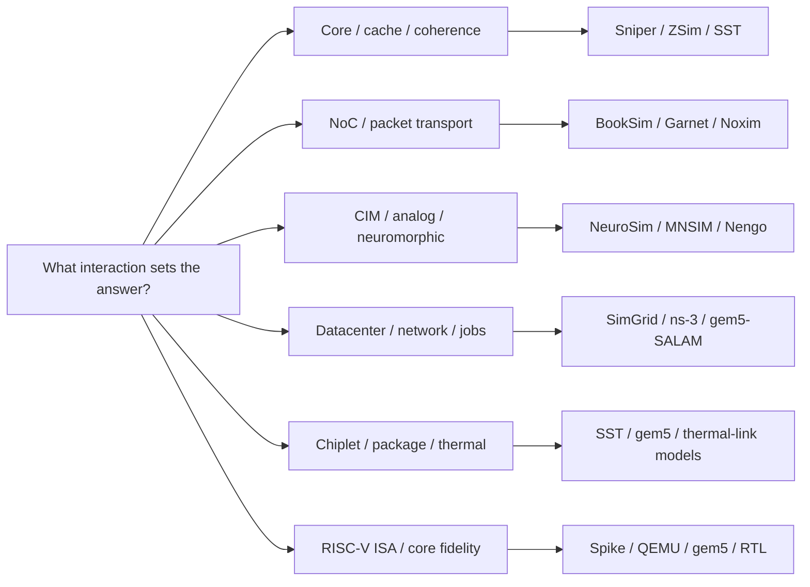

# Other Architecture Simulators — A Surveyed Catalog

> **Prerequisites:** [Simulation_Methodology](01_Simulation_Methodology.md) (the paradigm vocabulary — functional/timing/physical, the fidelity ladder, the discrete-event engine, trace- vs execution-driven — that every tool below instantiates).
> **Hands off to:** [Full_Chip_Modeling](../01_Modeling/02_Full_Chip_Modeling.md) (composing these into a chip/system model with the perf→power→thermal loop and the tool map).

---

## 0. Why this page exists

The gem5 / DRAM / GPU / accelerator pages in this folder cover the tools an architect reaches for most, but the field is wider: manycore-CPU studies, on-chip networks, compute-in-memory, datacenter fabrics, chiplet integration, and RISC-V core bring-up each have their own established simulators, built at different rungs of the fidelity ladder for different reasons. This page is a **surveyed catalog** — one table plus short conceptual notes per category — that places each tool in the [Simulation_Methodology](01_Simulation_Methodology.md) taxonomy (which paradigm, what it models, what it is blind to) and says *when* to use it. It is deliberately breadth-first: the goal is to know what exists, what class it belongs to, and therefore how far to trust its numbers, not to re-derive the mechanisms already covered on the methodology page.

### System view — choose the simulator by the interaction under test

The tool taxonomy follows the dominant state and feedback loop: instruction windows for many-core CPUs, flits and credits for networks, charge/spikes for emerging compute, packets/jobs for datacenters, and thermal/link coupling for chiplets.

---

## 1. The catalog

Read a row as *"this tool is a [paradigm] model of [what], reach for it when [job]."* The **paradigm** column uses the vocabulary of [Simulation_Methodology §1–4](01_Simulation_Methodology.md): *functional* (correctness only), *analytical/mechanistic* (closed-form), *event-driven cycle-approximate*, *cycle-accurate*, *RTL*; and *trace-* vs *execution-driven*.

| Tool | Category | Paradigm | What it models | When to use |
|---|---|---|---|---|
| **Sniper** | Manycore CPU | Analytical **interval** core in an event-driven multicore engine; execution-driven (Pin) | x86 multicore: interval core model, cache hierarchy, coherence, NoC; McPAT power | Fast, reasonably accurate **manycore** studies where you need trends over 10s–100s of cores without cycle-accurate cost |
| **ZSim** | Manycore CPU | Event-driven cycle-approximate; **DBT** (Pin); **bound-weave** parallel; execution-driven | OoO x86 cores, caches, coherence at **1000-core** scale (user-level) | Thousand-core / large-cache-hierarchy DSE where simulation speed is the binding constraint |
| **MARSSx86** | Manycore CPU | Cycle-accurate, **full-system** (PTLsim OoO + QEMU); execution-driven | Cycle-accurate x86 core + memory, boots a real OS | Full-system x86 studies needing OS effects (largely superseded by gem5-x86, but historically the reference) |
| **BookSim 2.0** | NoC / interconnect | Cycle-accurate, standalone; synthetic-traffic or trace-driven | Topology, routing, VC flow control, allocators, router pipeline; latency-throughput curves | Pure **network** studies: comparing topologies/routers under synthetic load, isolated from a core model |
| **Garnet (3.0 / HeteroGarnet)** | NoC / interconnect | Cycle-accurate, **inside gem5-Ruby**; execution-driven | Detailed router microarchitecture carrying **real coherence traffic**; heterogeneous/clocked links | NoC studies that must see the *actual* coherence/message traffic of a running workload |
| **DSENT** | NoC / interconnect | Analytical **energy/area** model (not timing) | Per-component NoC energy & area (electrical + photonic) from technology + activity | The **power overlay** for BookSim/Garnet — pJ/flit-hop, not cycles |
| **DNN+NeuroSim** | Compute-in-memory | Analytical **circuit-level** (macro models, not event-driven) | ReRAM/SRAM/FeFET CIM: device→array→PE→tile→chip area/latency/energy + inference accuracy with device non-idealities | Evaluating a **CIM** accelerator's PPA *and* accuracy across device technologies and nodes |
| **NeuroXplorer / SANA-FE** | Neuromorphic | Event-driven (spike-driven) architecture models | Mapping SNNs onto tiled, NoC-connected neuromorphic chips; spike traffic, energy, latency | Architecture-level **neuromorphic** DSE (distinct from neuroscience SNN sims like NEST/Brian) |
| **SST** | Datacenter / HPC | **Parallel discrete-event (PDES)**, MPI-scalable; component/link/event | Whole HPC systems: network (Merlin), MPI motifs (Ember), memory (memHierarchy, Miranda), CPU (Vanadis), DRAM backends | **Scale-out** system co-design — millions of components across hundreds of CPUs |
| **ns-3** | Datacenter / network | Discrete-event, **packet-level**; execution/trace-driven | Full network stacks: TCP/IP, wireless, datacenter fabrics, congestion control | Network-protocol and datacenter-**fabric** studies (packets, not cycles) |
| **OMNeT++** | Datacenter / network | Component-based discrete-event framework (+ INET) | General DES; with INET, full network models; also buses/queues | A general **DES framework** when you build the model; networks via INET |
| **CHIPSIM** | Chiplet / 2.5D-3D | Event-driven **co-simulation** (perf + power + transient thermal) | Chiplet DNN systems: compute chiplets + **Network-on-Interposer** contention/pipelining, µs-granularity power → transient thermal | **Chiplet/NoI** architecture DSE where communication and thermal transients dominate |
| **HotSpot** | Thermal (all) | Analytical **compact RC thermal** solve (steady + transient) | Temperature map from floorplan + power map; grid/block model | The **thermal** stage co-simulated with any perf/power tool ([Full_Chip §2.5](../01_Modeling/02_Full_Chip_Modeling.md)); 3D-ICE/PACT for 2.5D/3D |
| **Spike** | RISC-V core | **Functional** golden ISA model | Architectural state of RV binaries (no timing) | The **reference** for correctness / co-simulation tandem-checking against RTL |
| **Dromajo** | RISC-V core | Functional, built for **RTL co-simulation** | RV64GC state + commit log, checkpoint/restore, fast-forward | Co-verifying a core (BOOM/other) against a golden trace; long-run checkpoints |
| **BOOM / Rocket (Verilator)** | RISC-V core | **RTL** (cycle-exact) | The actual Chisel-generated core, gate-for-gate | Golden timing/power for a specific RISC-V core (slow; the signoff-ish rung) |
| **gem5 (RISC-V)** | RISC-V core | Functional (Atomic) + event-driven cycle-approximate (O3) | RV cores + full memory system, SE or FS mode | Microarchitecture **exploration** of a RISC-V design before/without RTL |

The rest of the page is the "conceptual note per category" the table abbreviates.

---

## 2. Manycore / CPU — the speed-vs-fidelity split, made for many cores

The core-simulation ideas of [Simulation_Methodology §6](01_Simulation_Methodology.md) (in-order vs O3 timing, the interval/mechanistic dual) reappear here, but the binding constraint changes: at 100–1000 cores, an event-driven O3 model per core is too slow, so these tools each make a different speed bet.

- **Sniper** (Ghent, Carlson/Heirman/Eeckhout, SC 2011) is the **interval model** ([Simulation_Methodology §6](01_Simulation_Methodology.md), Karkhanis–Smith) made into a parallel multicore simulator. Instead of stepping a pipeline, it treats *miss events* (branch mispredicts, cache/TLB misses, serialization) as the things that punch holes in a smooth issue stream, and computes the CPI *between* misses analytically; it keeps a per-core instruction window (a proxy ROB) so it still captures memory-level parallelism — overlapping misses — the effect a naive analytical model misses. The payoff is ~1–2 MIPS/core with parallel host threads and ~10–20% accuracy, i.e. **the mechanistic rung's error bar at close to functional-emulation speed**, which is exactly right for multicore *trend* studies. It ships with McPAT for power. A newer "instruction-window-centric" core model trades some speed for more detail when the interval abstraction is too coarse.

**The interval model derived — why it computes CPI per-miss, not per-cycle.** Start from the ideal the model perturbs: a balanced out-of-order core of dispatch width $W$ with enough ILP to keep issuing sustains $\text{IPC}\to W$, i.e. a floor $\text{CPI}_{\text{base}}=1/W$. Execution departs from that floor only at **miss events** — branch mispredicts, long-latency (LLC/TLB) misses, serialization — each of which opens an *interval* where the issue rate collapses and then re-ramps. By the same linearity-of-expectation accounting as [Performance_Modeling_and_DSE §2.1](../01_Modeling/01_Performance_Modeling_and_DSE.md), the expected per-instruction cycle charge sums:

$$\text{CPI} \;=\; \text{CPI}_{\text{base}} \;+\; \sum_{m} f_m\,c_m, \qquad \text{CPI}_{\text{base}}=\tfrac1W,$$

where $f_m$ = events of class $m$ per instruction and $c_m$ = the interval penalty (cycles) that class charges. Each penalty is read straight off the interval's geometry:

- **Branch mispredict.** The interval is the time to detect the bad branch, squash the wrong path, and refill the front end, so $c_{\text{br}}\approx L_{\text{front}}$, the fetch-to-resolve pipeline depth (the window re-ramps behind it) — a handful to ~15 cycles, and *independent of memory latency*.
- **Long-latency miss.** When the missing load reaches the ROB head, dispatch keeps filling the window for $\sim\!\text{ROB}/W$ cycles of overlap, then stalls until data returns: an isolated penalty $c_{\text{mem}}\approx L_{\text{mem}}-\text{ROB}/W\approx L_{\text{mem}}$. Independent misses caught in the *same* window drain under **one** interval — memory-level parallelism — so the *exposed* penalty is $c_{\text{mem}}\approx L_{\text{mem}}/\text{MLP}$, exactly the $p^{\text{raw}}/\text{MLP}$ correction of §2.1. Sniper keeps a proxy ROB precisely so it can *count* the overlapping misses and thus **measure** MLP — the one quantity the whiteboard interval model of §2.1 must guess, and the reason the tool is ~10% tighter than the closed form.

**Why this is fast — the per-miss vs per-cycle count.** A cycle-accurate model does timing work *every simulated cycle*, touching its $M$ modeled structures: $\sim\!\text{CPI}\times M$ structure-updates per instruction. The interval model does timing work *only at miss events*: $\sim\!\sum_m f_m$ penalty computations per instruction, plus an $O(1)$ functional step (fast Pin JIT). The ratio of timing computations is $\text{CPI}/\sum_m f_m$, large because misses are rare.

*Worked number.* Take $W=4$ ($\text{CPI}_{\text{base}}=0.25$); branches $f_{\text{br}}=0.20\times(1-0.95)=0.01$/instr at $c_{\text{br}}=8$; LLC misses $f_{\text{mem}}=0.005$/instr at $L_{\text{mem}}=200$, $\text{MLP}=4$ so $c_{\text{mem}}=50$. Then

$$\text{CPI}=0.25+\underbrace{0.01\cdot8}_{0.08}+\underbrace{0.005\cdot50}_{0.25}=0.58\quad(\text{IPC}=1.72),$$

while miss events total $\sum_m f_m=0.015$/instr. The interval model does $0.015$ timing computations per instruction against the cycle model's $0.58$ cycle-steps — $\mathbf{\approx 39\times}$ fewer timing updates (each far cheaper than a full-structure cycle walk). That gap is why Sniper sustains $\sim\!1$–$2$ MIPS/core against a validated cycle-accurate model's $\sim\!0.03$ MIPS ([Simulation_Methodology §2.1](01_Simulation_Methodology.md)) — a $\sim\!30$–$70\times$ per-core throughput win — and it then *parallelizes across cores* on host threads, compounding the advantage at the scale (100s of cores) where cycle-accurate is hopeless. **Where it stops being valid:** the flat $\text{CPI}_{\text{base}}=1/W$ assumes between-miss ILP actually fills the width; on long dependence chains (issue starved by data hazards, not misses) the interval abstraction over-predicts issue, which is exactly when the "instruction-window-centric" core model earns its extra cost.

- **ZSim** (MIT/Stanford, Sanchez & Kozyrakis, ISCA 2013) makes the opposite bet: keep a genuine event-driven OoO core model but *parallelize aggressively* to reach 1000 cores. Its trick is **bound-weave** two-phase parallelization. In the **bound** phase, all cores run in parallel on the host using Pin-based dynamic binary translation ([Simulation_Methodology §4](01_Simulation_Methodology.md), execution-driven) with *approximate* memory latencies, gathering per-core access traces; in the **weave** phase, those traces are replayed over a short interval to resolve the true contention and interleaving — also in parallel. This sidesteps the classic parallel-simulation hazard (the shared event queue serializes) by confining cross-core interaction to the bounded weave window. Validated within ~10% of a real Westmere on average, at aggregate speeds far beyond a serial O3 model. It is user-level (syscall emulation, no OS), which is the deliberate cost of that speed.

- **MARSSx86** (Patel et al.) is the **cycle-accurate, full-system** x86 point: it bolts the PTLsim out-of-order model onto QEMU for functional/OS support, so it boots a real operating system and times it. It is the heaviest and slowest of the three and has been largely superseded by gem5's x86 support, but it anchors the top of this category's ladder — when you genuinely need OS-in-the-loop x86 timing, this is the class of tool.

**The selection rule** is the §2 fidelity rule specialized for core count: Sniper for the most cores and the fastest turnaround at trend-level accuracy; ZSim when you still want an explicit OoO model at thousand-core scale; MARSSx86/gem5-FS when OS effects must be in the timing.

---

## 3. NoC / interconnect — cycle-accurate transport, and a separate energy model

On-chip networks are where the queueing law of [Simulation_Methodology §7](01_Simulation_Methodology.md) ($\text{latency}\sim 1/(1-\rho)$) is the whole story, so their simulators are built to produce **latency-throughput curves** — latency flat at low load, then a knee as offered load $\rho$ approaches saturation. The router-microarchitecture and topology math these tools evaluate is the subject of [Network_on_Chip](../04_Interconnect/03_Network_on_Chip.md); here they are as *simulators*:

- **BookSim 2.0** (Stanford, Jiang et al., ISPASS 2013) is the standalone, **cycle-accurate** NoC reference. You give it a topology (mesh, torus, flattened butterfly, …), a routing algorithm, a virtual-channel flow-control and allocator configuration, and a *synthetic traffic pattern* (uniform-random, transpose, hotspot) or an injected trace; it steps the router pipeline flit by flit and reports the latency-throughput curve and where saturation sets in. Being standalone and traffic-driven makes it ideal for studying the network *in isolation* — the address/traffic stream is a faithful stimulus for a network the same way it is for a DRAM channel ([Simulation_Methodology §4](01_Simulation_Methodology.md), trace-driven is sound when the studied thing does not feed back into the instruction path).

- **Garnet** (Georgia Tech; Garnet 2.0, then **HeteroGarnet/Garnet 3.0**, 2020) is the cycle-accurate NoC that lives **inside gem5's Ruby** coherence subsystem, so it carries the *real* coherence message traffic of an executing workload rather than a synthetic pattern — execution-driven transport. HeteroGarnet adds heterogeneous and independently-clocked links (useful for chiplet/2.5D links). Use Garnet when the interconnect study must reflect the actual read/snoop/writeback mix a program generates; use BookSim when you want a controlled synthetic sweep.

- **DSENT** (MIT, Sun et al., NOCS 2012) is **not a timing simulator at all** — it is the *energy and area* model that overlays one. It computes per-component NoC energy (buffers, crossbars, links; electrical *and* photonic) from technology parameters and activity, yielding the pJ/flit-hop figure that a BookSim or Garnet activity count multiplies against. It is the NoC entry in the "timing tool vs power tool" distinction the [Full_Chip_Modeling tool map](../01_Modeling/02_Full_Chip_Modeling.md) insists on: Garnet gives latency-under-load, DSENT gives energy — never conflate them.

**What makes a NoC simulator fast — and the two curves it must reproduce.** The speed trick is to **decouple the network from any core**: BookSim injects flits according to a *statistical traffic process* (uniform-random, transpose, hotspot) rather than executing a workload, so it pays $O(\text{flits})$, not $O(\text{instructions})$, and models transport at *flit* granularity, not gates. That decoupling is *sound* by the trace-driven argument of [Simulation_Methodology §4](01_Simulation_Methodology.md): the network does not feed back into the instruction path, so the traffic stream is a faithful stimulus (the same reason a DRAM channel is safely trace-driven). What the simulator then produces is precisely the pair of numbers derived closed-form in [Network_on_Chip §6](../04_Interconnect/03_Network_on_Chip.md) — the **zero-load latency** $T_0=\bar h\,(t_r+t_w)+L_{\text{pkt}}/b$ and the **saturation throughput** $\Theta_{\text{sat}}=\min(2B_b/N,\ \eta_{\text{alloc}}C_{\text{link}})$, with the M/D/1 queue $W=\tfrac{\rho}{2(1-\rho)}t_s$ interpolating the knee between them (where $\bar h$ = mean hops, $t_r,t_w$ = router/wire delay, $L_{\text{pkt}}/b$ = serialization, $B_b$ = bisection, $N$ = nodes, $\eta_{\text{alloc}}$ = allocator matching efficiency, $\rho$ = link utilization). The simulator is a *structural realization of that queueing curve* — it **measures** where the $1/(1-\rho)$ pole sits and what the separable allocator's $\eta_{\text{alloc}}\approx1-1/e$ (single-pass) climbs to under iSLIP, rather than assuming them. It is also where the deadlock theorem of [Network_on_Chip §4](../04_Interconnect/03_Network_on_Chip.md) becomes *observable*: configure a routing function whose channel-dependency graph carries a cycle and simulated throughput collapses to zero — the empirical face of Dally–Seitz's acyclic-CDG proof — while Garnet, carrying *real* coherence traffic inside Ruby, can additionally surface the message-class (protocol) deadlock that synthetic BookSim traffic never generates. *Worked number:* an $8\times8$ mesh has $\bar h=\tfrac{2(63)}{24}=5.25$ hops, so at $t_r=3,\ t_w=1,\ L_{\text{pkt}}/b=5$ the simulator reports $T_0=5.25(4)+5\approx26$ cycles zero-load and saturates near the bisection bound $2B_b/N$ — numbers the closed form predicts and the cycle-accurate run confirms to within its allocator model.

**DSENT's energy model derived — pJ/flit-hop from wire RC and SERDES.** A flit crossing one hop dissipates in three places: buffer write + read (SRAM), the crossbar, and the **link** — and the link is the *physical* term, the charge–discharge of the wire capacitance. Per bit over a link of length $\ell$,

$$E_{\text{bit}} \;=\; C_{\text{wire}}\,\ell\,V^2, \qquad E_{\text{flit-hop}} \;=\; \underbrace{E_{\text{buf}}}_{\text{SRAM}} + \underbrace{E_{\text{xbar}}}_{\text{switch}} + \underbrace{w_{\text{flit}}\,C_{\text{wire}}\,\ell\,V^2}_{\text{link (wire)}},$$

where $C_{\text{wire}}\approx0.15$–$0.25$ pF/mm (intermediate/global metal), $V$ = signal swing, $w_{\text{flit}}$ = flit width in bits. DSENT computes each term from technology + activity, and for long or off-chip links it swaps the simple RC wire for a **SERDES** model (serializer, equalizer, clock recovery), costing $\sim\!1$–$5$ pJ/bit against a short on-chip wire's $\sim\!0.1$ pJ/bit. *Worked number:* a $1$ mm link, $C_{\text{wire}}=0.2$ pF/mm, $V=0.8$ V gives $E_{\text{bit}}=0.2\text{p}\times0.64=0.128$ pJ/bit; a $128$-bit flit spends $128\times0.128\approx16.4$ pJ on the wire alone, and with a few pJ of buffer + crossbar, $\sim\!20$ pJ/flit-hop. Total fabric energy is then $(\text{flit-hops counted by BookSim/Garnet})\times(\text{pJ/flit-hop from DSENT})$ — the identical *activity $\times$ per-event-energy* pattern McPAT uses for CPUs ([Full_Chip_Modeling §1.5](../01_Modeling/02_Full_Chip_Modeling.md)). This is the sharp statement of "never conflate": Garnet supplies the flit-hop **count** (a timing/activity output), DSENT supplies the **joules** per flit-hop (a physical model) — two tools, one product.

---

## 4. Compute-in-memory & neuromorphic — modeling analog physics and spikes

This category departs from the digital-timing paradigm entirely, because the device physics *is* the computation.

- **DNN+NeuroSim** (Georgia Tech, Shimeng Yu group; **V1.4**, 2024) is the standard benchmarking framework for **compute-in-memory (CIM)** accelerators — the crossbar substrate covered device-side in [Memory §11](../03_Memory/03_Memory.md). Its paradigm is **analytical circuit-level**: a hierarchy of *macro models* (device → synaptic array → PE → tile → chip) calibrated to circuit simulation rather than a discrete-event engine. A PyTorch wrapper captures a network's per-layer activity and feeds a C++ estimation engine that reports area, latency, energy, and leakage for the mapped hardware — but its distinguishing output is **inference accuracy under device non-idealities**: conductance variation, stuck-at faults, limited ON/OFF ratio, and ADC (analog-to-digital converter) quantization all degrade the analog dot-product, so PPA and *accuracy* must be co-reported. V1.4 extends technology support toward the 1 nm node (nanosheet/CFET devices) and adds digital-CIM alongside analog. This is the tool when the question is "what is the PPA *and* the accuracy of this ReRAM/SRAM CIM design," a trade no digital simulator expresses. Circuit-level results are validated against SPICE-class macro characterization rather than against a cycle count.

**The analog crossbar MVM derived — one matrix–vector product by Ohm + Kirchhoff.** The device physics *is* the arithmetic. Lay the weight matrix on a crossbar: $N$ input rows (wordlines) driven by voltages $V_i$ (a DAC converts input $x_i\!\to\!V_i$), $M$ output columns (bitlines), and at each crosspoint $(i,j)$ a device — ReRAM/memristor conductance, or an SRAM cell — of conductance $G_{ij}$ encoding the weight. **Ohm's law** makes each crosspoint a multiplier, injecting current $I_{ij}=V_i\,G_{ij}$ into column $j$; **Kirchhoff's current law** at the (virtual-grounded) column sums them:

$$I_j \;=\; \sum_{i=1}^{N} V_i\,G_{ij}\qquad(j=1\ldots M),$$

which is the dot product of the input vector with weight-column $j$. Drive all $N$ rows at once and sense all $M$ columns at once and the entire matrix–vector product $\mathbf I=\mathbf G^{\!\top}\mathbf V$ falls out in **one analog settle** — $O(1)$ time regardless of $N,M$, using $O(NM)$ devices (where $V_i$ = row drive voltage, $G_{ij}$ = crosspoint conductance = weight, $I_j$ = column output current). That physical parallelism is the whole speed story: a digital $O(NM)$-MAC operation becomes a single $\sim\!10$ ns settle. *Worked number:* a $128\times128$ tile performs $128^2=16{,}384$ MACs per settle, so at $\sim\!10$ ns that is $\sim\!1.6$ TMAC/s per tile, and at $\sim\!1$ fJ/MAC the analog core burns only $\sim\!16$ pJ per MVM.

**Why it is nonetheless precision-limited — the periphery and the non-idealities dominate.** The analog result must be converted at both ends — a **DAC** per row and, expensively, an **ADC** per column — and the ADC is the cost center: it takes $40$–$60\%$ of tile area and its energy swamps the compute. *Worked number:* $128$ column ADCs at $8$-bit, $\sim\!0.2$ pJ/conversion, cost $128\times0.2=25.6$ pJ per MVM — already **more than the $\sim\!16$ pJ of compute it digitizes** — and bit-serial multi-bit inputs fire the ADC once per input bit, multiplying that further, which is why effective output precision pins near $\sim\!3$–$4$ bits. Two analog non-idealities then corrupt the ideal Kirchhoff sum:

- **IR-drop.** Wordlines and bitlines have finite resistance, so far crosspoints see a drooped drive and the summing column is not a perfect virtual ground — the sum turns position-dependent and sub-linear. *Worked number (illustrative):* an all-ON column of $128$ cells at $R_{\text{on}}=20\ \text{k}\Omega$ ($G_{\text{on}}=50\ \mu\text{S}$), $V_{\text{read}}=0.2$ V, sources $I=128\times(0.2\times50\,\mu\text{S})=1.28$ mA; a bitline of $\sim\!2\ \Omega$/cell ($\sim\!256\ \Omega$ end-to-end) drops $\approx I\cdot R_{\text{line}}/2\approx0.16$ V — *comparable to the $0.2$ V drive itself*, which is precisely why arrays cap the summation dimension at $\sim\!128$–$256$ rows.
- **Device variation.** Programmed conductance is $G_{ij}=G_{\text{target}}(1+\delta)$ with $\delta$ from write imprecision, cycle-to-cycle noise, and conductance drift, injecting error into every partial product.

Because these degrade the *result*, not just the timing, NeuroSim's distinguishing output is **inference accuracy**: its PyTorch wrapper injects the variation, IR-drop, and ADC quantization into the network and measures the accuracy drop — the PPA-*and*-accuracy trade no digital simulator expresses. The one-line summary of the whole family: analog MVM is fast and energy-cheap because the sum is a single Kirchhoff settle at $\sim\!$fJ/MAC, but the signal is a small current riding on IR-drop, variation, and quantization noise, and the ADC that must resolve it costs more than the compute — so you buy $10$–$100\times$ energy/throughput and pay it back in precision ($\sim\!3$–$4$ bits).

- **Neuromorphic** architecture simulators — e.g. **NeuroXplorer** (Drexel) and **SANA-FE** (UT Austin) — model spiking neural networks (SNNs) mapped onto *tiled, NoC-connected* neuromorphic chips (Loihi/TrueNorth-class): they are **spike-event-driven**, tracking spike traffic across the on-chip network to estimate energy and latency of a placement. Keep two things distinct: these are *hardware-architecture* simulators, unlike neuroscience SNN simulators (NEST, Brian) that model biological dynamics functionally with no hardware, and unlike vendor SDK/functional stacks (e.g. Intel Lava for Loihi). For a digital notebook this is a "know it exists and what class it is" entry rather than a primary tool.

---

## 5. Datacenter & network — parallel discrete-event at system scale

When the unit of study grows from a chip to a rack or a cluster, one host thread cannot hold the model, so these tools are built on **parallel discrete-event simulation (PDES)** — the §3 engine, sharded across many hosts with a conservative/optimistic synchronization protocol keeping the distributed event queues causally consistent.

- **SST — the Structural Simulation Toolkit** (Sandia/NTESS) is the HPC-scale framework: a PDES core (MPI-parallel, scaling to *millions* of components across hundreds of CPUs) plus a library of interchangeable **elements** connected by *links* that exchange timed *events*. The libraries cover a whole system — **Merlin** (network/interconnect), **Ember** (MPI communication *motifs* — skeleton traffic that reproduces an HPC app's messaging without running it), **memHierarchy** and **Miranda** (caches and a memory-access generator), **Vanadis** (a CPU core), and DRAM back-ends (DRAMSim3, Ramulator). The modular element/link/event structure is the §3 discrete-event engine turned into a component framework, and its purpose is **scale-out co-design**: interconnect, memory, and compute of a supercomputer together, at a fidelity you dial per component.

**Conservative vs optimistic PDES — the synchronization derivation.** Sharding the event queue across $P$ hosts breaks the single-queue time-ordered invariant of [Simulation_Methodology §3](01_Simulation_Methodology.md): a logical process (LP) at local virtual time $t$ must not process its next event if a *straggler* with timestamp $<t$ could still arrive from a neighbor. Two protocols keep the distributed queues causally consistent, trading synchronization against speculation.

**Conservative (Chandy–Misra–Bryant).** Advance only when it is *provably* safe. The enabling quantity is **lookahead** $L$ — the minimum simulated-time delay from an LP's input to any output it produces (physically a link's latency: a flit cannot cross a channel in zero time). An LP that has heard from every input up to time $\tau$ may safely process all local events up to $\tau+L$, because nothing earlier can now appear. Work thus proceeds in **windows of width $\sim\!L$**, and cyclic waiting is broken by *null messages* carrying the promise "nothing from me before $t+L$." SST is conservative *by construction*: every SST link must declare a latency, and that latency **is** the lookahead the algorithm consumes — which is exactly why a zero-latency SST link is illegal. The speedup follows the lookahead-to-event-density ratio. In a window of sim-time $L$ an LP processes $W_{\text{ev}}=L\,r$ events ($r$ = local event rate, events per unit sim-time), each costing wall-time $t_{\text{ev}}$, then pays one synchronization $t_{\text{sync}}$; parallel efficiency is

$$\eta \;=\; \frac{L\,r\,t_{\text{ev}}}{L\,r\,t_{\text{ev}}+t_{\text{sync}}} \;=\; \frac{1}{1+\dfrac{t_{\text{sync}}}{L\,r\,t_{\text{ev}}}}\;\xrightarrow[L\ \text{large}]{}\;1,$$

where $L$ = lookahead, $r$ = event rate, $t_{\text{ev}}$ = wall-time per event, $t_{\text{sync}}$ = wall-time per synchronization. So **speedup $\propto$ lookahead**: a fabric with fat link latencies parallelizes well; tight near-zero-lookahead coupling forces a sync per event ($\eta\to\tfrac12$ and worse). *Worked number:* $L\,r=20$ events/window and $t_{\text{sync}}=4\,t_{\text{ev}}$ give $\eta=1/(1+4/20)=0.83$; on $P=64$ hosts that is $\approx53\times$. Halve the lookahead ($L\,r=10$) and $\eta=0.71\Rightarrow46\times$ — the same model, slower, purely from less lookahead.

**Optimistic (Time Warp).** Process events greedily, assuming no straggler; when one arrives, **roll back** — restore state from a periodic checkpoint and re-execute — and emit *anti-messages* to cancel any outputs wrongly sent (rollback can cascade). **Global Virtual Time**, $\text{GVT}=\min$ over all LPs of their local time and all in-flight message stamps, is the commit horizon: nothing can ever roll back below it, so state older than GVT is reclaimed (fossil collection) and external I/O is committed there. Time Warp needs *no* lookahead, so it extracts parallelism conservative cannot ($L\to0$), but pays state-saving plus wasted rolled-back work. Its useful fraction is $\text{committed}/(\text{committed}+\text{rolled-back})$; at 20% rollback plus ~20% checkpoint overhead only $\sim\!0.65$ of the work counts — so optimism wins only where lookahead is too small for conservatism to move at all.

**The ceiling both share — the critical path.** No protocol beats the **critical path** of the event graph: the longest chain of causally dependent events, each of which must finish before the next can start. If total event work is $W_{\text{tot}}$ and the critical path is $W_{\text{cp}}$, then

$$\text{speedup}\;\le\;\frac{W_{\text{tot}}}{W_{\text{cp}}},$$

independent of $P$ — the PDES form of the Amdahl ceiling ([Performance_Modeling_and_DSE §2.2](../01_Modeling/01_Performance_Modeling_and_DSE.md)), with the critical path playing the serial residue. *Worked number:* a model whose critical path is 5% of its event work is capped at $20\times$ no matter how many hosts; combined with the conservative $\eta=0.83$ window above, the real speedup is $\min(64\cdot0.83,\ 20)=20\times$, and every host past $\sim\!24$ is wasted. This is why SST's scaling is quoted in *components*, not raw core-count: the win needs a model with abundant lookahead **and** a shallow critical path relative to its size.

- **ns-3** is the open-source, **packet-level** discrete-event network simulator: full TCP/IP and wireless stacks, congestion-control algorithms, and datacenter fabric models, where each packet is an event. It answers fabric- and protocol-level questions (incast, ECN, load balancing) that a cycle-level on-chip NoC tool (§3) is the wrong scale for.

- **OMNeT++** is a general **component-based DES framework** (not a network simulator per se); with the **INET** framework it becomes a full network simulator, and it is also used for buses, storage, and queueing systems. Choose it when you are *building* a custom system model and want a mature DES kernel and GUI; choose ns-3 when you want batteries-included network protocol models.

The through-line: at datacenter scale the paradigm is always discrete-event; what differs is the *component library* and the *synchronization* that lets it run in parallel.

---

## 6. Chiplet / 2.5D-3D — where communication and heat become the model

Disaggregating a monolithic die into chiplets on an interposer moves the bottleneck from on-die logic to the **die-to-die interconnect** and to **thermal coupling** between stacked/adjacent dies, so this category's tools are inherently *co-simulations* of performance, power, and thermal — the coupled loop of [Full_Chip_Modeling §3](../01_Modeling/02_Full_Chip_Modeling.md), specialized to a package.

- **CHIPSIM** (Pfromm et al., 2025, [arXiv:2510.25958](https://arxiv.org/abs/2510.25958)) is a co-simulation framework for **DNN execution on chiplet-based systems**. It concurrently models compute chiplets *and* the **Network-on-Interposer (NoI)** — capturing inter-chiplet network contention and pipelining that per-chiplet models miss — and profiles chiplet and NoI power at *microsecond* granularity to drive **transient** thermal analysis. Modeling communication and heat *together* (rather than perf then power then thermal in isolation) is the point: the paper reports large accuracy improvements over decoupled approaches precisely because the transient interaction is where chiplet designs live. Reach for it (or its class) when the design question is chiplet count/placement and NoI topology under a thermal budget.

- **HotSpot** (Virginia, Skadron et al.) is the thermal engine underneath most of this: a **compact RC thermal-network** solver that takes a floorplan and a per-block power map and returns steady-state and transient temperatures ($\tau_\theta = R_\theta C_\theta$; die time-constant ~ms, heatsink ~s — [Full_Chip §2.5](../01_Modeling/02_Full_Chip_Modeling.md)). It is the standard thermal stage co-simulated with any perf/power tool; **3D-ICE, PACT, and MFIT** extend the same compact-model idea to 2.5D/3D stacks with inter-layer conduction and microfluidic cooling. Thermal is not a paradigm of its own so much as the *physical* question ([Simulation_Methodology §1](01_Simulation_Methodology.md)) overlaid on the activity a timing tool produced.

**The RC thermal grid derived — $C\dot{\mathbf T}=\mathbf P-G\mathbf T$.** Discretize the floorplan into $n$ cells (one per block, or a finer mesh). Each cell $i$ carries a power $P_i$ (from the power map a timing+power tool produced), a thermal capacitance $C_i$ to ambient (the mass that must be heated, J/°C), lateral thermal resistances $R_{ij}$ to its neighbors (in-plane conduction), and a vertical resistance $R_{i,\text{amb}}$ to the heat sink. Conservation of energy at node $i$ — power in equals heat stored plus heat conducted out — is the heat-balance ODE (the multi-node generalization of the single lump in [Full_Chip_Modeling §2.5](../01_Modeling/02_Full_Chip_Modeling.md)):

$$C_i\frac{dT_i}{dt} \;=\; P_i \;-\; \sum_{j}\frac{T_i-T_j}{R_{ij}} \;-\; \frac{T_i-T_{\text{amb}}}{R_{i,\text{amb}}}.$$

Stack all $n$ nodes (temperatures measured as a rise above ambient) and it is exactly the modified-nodal-analysis form of an RC network — which is why HotSpot literally *builds the electrical-analog resistor–capacitor circuit and solves it*:

$$C\,\dot{\mathbf T} \;=\; \mathbf P - G\,\mathbf T,$$

where $C=\operatorname{diag}(C_i)$ (thermal capacitances, J/°C), $G$ = the thermal-conductance matrix — the resistor-network Laplacian with $G_{ii}=\sum(\text{conductances at }i)$ and $G_{ij}=-1/R_{ij}$ — $\mathbf P$ = power vector (W), $\mathbf T$ = temperature-rise vector (°C). **Steady state** sets $\dot{\mathbf T}=0$:

$$\mathbf T = G^{-1}\mathbf P,$$

and $G^{-1}$ is the thermal-*resistance* matrix: its off-diagonal $(G^{-1})_{ij}$ is the **coupling** — how much block $j$'s power heats block $i$ — the spatial effect a single-node $R_\theta$ cannot see. The **transient** is the linear system $\dot{\mathbf T}=C^{-1}(\mathbf P-G\mathbf T)$, whose modes are the eigenvalues of $C^{-1}G$: the slowest (heatsink/package) is $\sim\!$seconds, the fastest (die) is $\sim\!$ms — the two-timescale picture of Full_Chip §2.5, now resolved per block. The **speed technique** is that $G$ is sparse and banded (each cell touches only its neighbors), so the steady solve is one sparse linear solve and a coarse per-block network of tens–hundreds of nodes fixes the temperature map to a few °C — cheap enough to sit inside the perf→power→thermal loop at ~ms granularity. That "compact model" abstraction is why HotSpot is a *stage you co-simulate* rather than an offline finite-element job.

*Worked number — coupling two blocks.* A hot core dissipating $P_1=20$ W sits beside an *idle* block ($P_2=0$); lateral resistance $R_{12}=5$ °C/W, each block to ambient $R_{\text{amb}}=2$ °C/W. Then the node conductances give $G=\begin{pmatrix}0.7&-0.2\\-0.2&0.7\end{pmatrix}$ °C⁻¹·W (diagonal $\tfrac1{R_{\text{amb}}}+\tfrac1{R_{12}}=0.5+0.2$, off-diagonal $-\tfrac1{R_{12}}=-0.2$), $\det G=0.45$, and $\mathbf T=G^{-1}\mathbf P$ gives

$$T_1=\frac{0.7\cdot20}{0.45}=31.1\ \text{°C},\qquad T_2=\frac{0.2\cdot20}{0.45}=8.9\ \text{°C above ambient}.$$

The idle block runs $8.9$ °C hot *purely from its neighbor* (coupling $(G^{-1})_{21}=0.2/0.45=0.44$ °C/W) — a single-node model would report it at ambient. That off-diagonal heat spreading is what the grid buys over the lumped $R_\theta$ of Full_Chip §2.5, and it is why a floorplan's *placement* — which hot blocks abut which — changes peak temperature at fixed total power.

---

## 7. RISC-V cores — the four rungs of the ladder in one ecosystem

RISC-V is the cleanest place to see all four fidelity rungs of [Simulation_Methodology §2](01_Simulation_Methodology.md) coexisting for one ISA, because the open ecosystem provides a tool at each rung and *uses them together* in a verification/exploration flow.

- **Spike** (`riscv-isa-sim`, RISC-V International) is the **functional golden model**: it executes RV binaries so that architectural state ends up correct, with *no timing*. Its role is to be *right* — it is the reference against which everything else is checked, and the canonical partner for **tandem co-simulation**, where a core's RTL commit log is compared instruction-by-instruction against Spike's to catch functional bugs ([Simulation_Methodology §1](01_Simulation_Methodology.md), the functional question).

- **Dromajo** (CHIPS Alliance / riscv-boom) is a functional RV64GC emulator engineered specifically for **RTL co-simulation** at scale: it supports checkpoint/restore and fast-forward so you can boot to a region of interest, then run the RTL in *lockstep* against Dromajo's golden trace for long workloads. Same functional rung as Spike, tuned for the co-verification job.

- **BOOM / Rocket under Verilator** is the **RTL rung**: the actual Chisel-generated core, compiled by Verilator into a cycle-exact software model (part of the Chipyard flow). It *is* the design — golden timing and, with power tools, golden energy — at RTL-simulation cost (the RTL rung of §2, KHz–low-MHz; quantified per-core below). This is where a specific core's real IPC comes from.

- **gem5 (RISC-V)** is the **exploration rung**: functional `AtomicSimpleCPU` for fast bring-up and the event-driven cycle-approximate `O3CPU` for microarchitecture studies, with the full gem5 memory system, in SE or FS mode. Use it to explore a RISC-V design's microarchitecture *before* (or without) writing RTL — the same role gem5 plays for any ISA, detailed on the gem5 page in this folder.

**The golden-model equivalence check, derived — why per-instruction, and why it is minimal.** A functional model is an *oracle* because the ISA defines a deterministic transition $\text{state}'=f(\text{state},\text{instr})$ on architectural state alone. Co-simulation (tandem / DiffTest) runs the DUT (the RTL) and the golden model in lock-step and, after **every committed instruction**, asserts equality of *architectural* state — retired register file, PC, and committed memory writes:

$$\big(\text{regs},\ \text{PC},\ \text{mem}\big)_{\text{DUT}} \;=\; \big(\text{regs},\ \text{PC},\ \text{mem}\big)_{\text{golden}}\quad\text{after each retire.}$$

The DUT is correct **iff** its committed-state trajectory equals the golden trajectory; checking at *commit* granularity is the tightest test that **localizes** a bug to the single offending instruction — a final-state-only comparison detects a divergence but cannot say where it began, whereas per-retire comparison flags the exact instruction that first diverged. It is also *minimal*: you compare only architectural (committed) state, never microarchitectural state, because only the former is defined by the ISA — speculative and pipeline state legitimately differ between a golden model and any real microarchitecture. This is why Spike is *the reference* and Dromajo is Spike's role re-engineered for long lock-step runs.

**Verilator's rung, quantified.** From the slowdown identity $S=wf/R_h$ of [Simulation_Methodology §2.1](01_Simulation_Methodology.md) (where $w$ = host instructions per simulated step, $f$ = target clock, $R_h$ = host retirement rate), the rungs of this one ISA span six orders of magnitude in $w$: Spike/Dromajo are *functional*, $w\sim1$–$10$ host-instr/target-instr, so $\sim\!10$–$100$ MIPS; gem5-O3 is *cycle-approximate*, $\sim\!0.1$–$1$ MIPS; Verilator is *RTL*. Verilator compiles the Chisel-generated netlist to a **2-state, cycle-based** C++ model and is the *fastest RTL* simulator (often $10$–$100\times$ a 4-state event-driven commercial simulator on cycle-based runs) — yet still the *slowest absolute* rung, because it evaluates the toggling combinational cone of a $10^5$–$10^6$-gate core every cycle: with $w\sim10^3$–$10^5$ host-ops per simulated cycle, $\Theta=R_h/w\approx 3{\times}10^9/(10^3\text{–}10^5)\approx 30\ \text{KHz–}3\ \text{MHz}$ — a $\sim\!10^3$–$10^4\times$ slowdown against a GHz target for a *small* core, rising to the methodology ladder's $10^6$–$10^7\times$ for a *full-chip*, net-by-net RTL sim. That is the price of "it *is* the gates."

*Worked number — why Dromajo has checkpoints.* Lock-step co-simulation runs at the speed of the **slower** partner, so Verilator-RTL at $\sim\!100$ KHz tandem-checked against Spike at $\sim\!100$ MIPS runs at $\sim\!0.1$ MIPS — the golden model is essentially free. Co-verifying a $\sim\!10^{11}$-instruction Linux boot at $0.1$ MIPS is $10^6$ s $\approx$ **12 days**; this is exactly why Dromajo adds checkpoint/restore and fast-forward — boot *functionally* (100 MIPS, minutes) to a checkpoint at the region of interest, then lock-step the RTL only across the window that matters. The "long-run checkpoint" bullet in the table is that arithmetic.

The lesson is the ladder itself: **you do not pick one RISC-V simulator, you use the whole ladder** — Spike/Dromajo to be *correct*, gem5 to *explore*, Verilator-on-RTL to be *exact* — matching each question to the cheapest rung that can answer it.

---

## Numbers to memorize

| Quantity | Value | Why it matters |
|---|---|---|
| Sniper (interval) speed / error | ~1–2 MIPS/core, ~10–20% | mechanistic-rung accuracy at near-functional speed → manycore trends |
| ZSim scale / validation | ~1000 cores, ~10% vs Westmere | bound-weave parallelism buys scale without abandoning an OoO model |
| NoC latency law | $\sim 1/(1-\rho)$ | why BookSim/Garnet output a latency-throughput *knee* |
| DSENT is energy, not timing | pJ/flit-hop | never conflate the NoC timing tool with its power model |
| CIM must co-report accuracy | PPA **and** inference accuracy | analog non-idealities (variation, ADC) degrade the dot-product |
| SST scale | millions of components, 100s of CPUs (PDES) | datacenter/HPC co-design needs parallel discrete-event |
| Thermal time constants | die ~ms, heatsink ~s | why chiplet/3D tools need *transient* (not just steady) thermal |
| RISC-V ladder | Spike (functional) → gem5 (cycle-approx) → Verilator-RTL (exact) | use the whole ladder, cheapest rung per question |
| Interval-model CPI | $\text{CPI}_{\text{base}}+\sum_m f_m c_m$; timing per-**miss**, not per-cycle | ~30–70× over cycle-accurate, then ×cores (§2) |
| Interval penalty split | $c_{\text{br}}\!\approx\!L_{\text{front}}$; $c_{\text{mem}}\!\approx\!L_{\text{mem}}/\text{MLP}$ | proxy ROB *measures* the MLP the closed form guesses (§2) |
| NoC sim = two numbers | $T_0=\bar h(t_r{+}t_w){+}L_{\text{pkt}}/b$; $\Theta_{\text{sat}}=\min(2B_b/N,\ \eta_{\text{alloc}}C_{\text{link}})$ | the closed-form curve BookSim/Garnet measures (§3) |
| DSENT link energy | $E_{\text{bit}}=C_{\text{wire}}\ell V^2$ (~0.1 pJ/bit·mm wire; ~1–5 pJ/bit SERDES) | count (Garnet) × joules (DSENT) = fabric energy (§3) |
| Crossbar MVM | $I_j=\sum_i V_i G_{ij}$ (Ohm+Kirchhoff), one $O(1)$ settle | ~1 fJ/MAC, ~1.6 TMAC/s per 128² tile (§4) |
| CIM precision wall | ADC energy $>$ analog compute; IR-drop caps ~128–256 rows | ~3–4 effective bits; why accuracy is co-reported (§4) |
| Conservative PDES | speedup $\propto$ lookahead $L$; $\eta=1/(1+t_{\text{sync}}/L r t_{\text{ev}})$ | an SST link's latency *is* its lookahead (§5) |
| Optimistic PDES | Time-Warp rollback + anti-messages; GVT = commit horizon | no lookahead, pays rollback waste (§5) |
| PDES ceiling | speedup $\le W_{\text{tot}}/W_{\text{cp}}$ (critical path) | Amdahl for parallel simulation (§5) |
| HotSpot RC grid | $C\dot{\mathbf T}=\mathbf P-G\mathbf T$; steady $\mathbf T=G^{-1}\mathbf P$ | off-diagonal $G^{-1}$ = block-to-block thermal coupling (§6) |
| Golden co-sim (DiffTest) | per-retire architectural-state equality | localizes a bug to the offending instruction (§7) |
| Verilator rung | compiled 2-state cycle-exact, ~KHz–MHz (~$10^3$–$10^4\times$ a small core) | fastest RTL, slowest absolute; co-sim runs at RTL speed (§7) |

---

## Cross-references

- **Down the stack:** [Simulation_Methodology](01_Simulation_Methodology.md) (the paradigm/ladder/trace-vs-execution vocabulary this catalog classifies against, and the §2.1 slowdown identity + §3 time-ordered-event invariant the Sniper/PDES/Verilator derivations invoke), [Network_on_Chip](../04_Interconnect/03_Network_on_Chip.md) (router microarchitecture, topology math, the §4 deadlock theorem, and the §6 zero-load-latency/saturation curve the NoC simulators reproduce), [Memory §11](../03_Memory/03_Memory.md) (the compute-in-memory crossbar — Ohm+Kirchhoff bitline sum — NeuroSim models), [OoO_Execution](../02_CPU/03_OoO_Execution.md) (the OoO structures — ROB, window, MLP — Sniper/ZSim/gem5 abstract).
- **Up the stack:** [Full_Chip_Modeling](../01_Modeling/02_Full_Chip_Modeling.md) (the perf→power→thermal co-simulation loop and tool map these fit into; §2.5 thermal — the single-node $R_\theta$ HotSpot's grid generalizes — and §3 co-modeling), [Performance_Modeling_and_DSE](../01_Modeling/01_Performance_Modeling_and_DSE.md) (the fidelity ladder and DSE these tools serve, and the §2.1 interval/MLP CPI stack and §2.2 Amdahl ceiling the Sniper and PDES derivations build on).
- **Sibling pages (this folder):** [Accelerator_and_NPU_Simulators](05_Accelerator_and_NPU_Simulators.md) (DNN/NPU tools — where NeuroSim's CIM and CHIPSIM's DNN-on-chiplet context connect), and the gem5 / DRAM / GPU per-tool pages.

## References

- T. E. Carlson, W. Heirman, L. Eeckhout, "Sniper: Exploring the Level of Abstraction for Scalable and Accurate Parallel Multi-Core Simulation," SC 2011 — [snipersim.org](https://snipersim.org/w/The_Sniper_Multi-Core_Simulator), [Interval Simulation](https://snipersim.org/w/Interval_Simulation).
- D. Sanchez, C. Kozyrakis, "ZSim: Fast and Accurate Microarchitectural Simulation of Thousand-Core Systems," ISCA 2013 — [paper PDF](https://people.csail.mit.edu/sanchez/papers/2013.zsim.isca.pdf).
- A. Patel et al., "MARSSx86: A Full System Simulator for x86 CPUs," DAC 2011.
- N. Jiang et al., "A Detailed and Flexible Cycle-Accurate Network-on-Chip Simulator (BookSim 2.0)," ISPASS 2013.
- N. Agarwal et al., "GARNET: A Detailed On-Chip Network Model inside a Full-System Simulator," ISPASS 2009; HeteroGarnet — [gem5.org HeteroGarnet](https://www.gem5.org/documentation/general_docs/ruby/heterogarnet/).
- C. Sun et al., "DSENT — A Tool Connecting Emerging Photonics with Electronics for Opto-Electronic NoC Modeling," NOCS 2012.
- X. Peng et al., "DNN+NeuroSim V1.4," Georgia Tech — [github.com/neurosim/DNN_NeuroSim_V1.4](https://github.com/neurosim/DNN_NeuroSim_V1.4); "NeuroSim Simulator for CIM: Validation and Benchmark," Frontiers in AI 2021.
- A. Balaji et al., "NeuroXplorer 1.0: An Extensible Framework for Architectural Exploration with Spiking Neural Networks," [arXiv:2105.01795](https://arxiv.org/abs/2105.01795); "SANA-FE," IEEE TCAD 2025.
- A. F. Rodrigues et al., "The Structural Simulation Toolkit (SST)," Sandia — [sst-simulator.org](http://sst-simulator.org/sst-docs), [github.com/sstsimulator/sst-core](https://github.com/sstsimulator/sst-core).
- ns-3 — [nsnam.org](https://www.nsnam.org/); OMNeT++ / INET — [omnetpp.org](https://omnetpp.org/).
- L. Pfromm et al., "CHIPSIM: A Co-Simulation Framework for Deep Learning on Chiplet-Based Systems," 2025 — [arXiv:2510.25958](https://arxiv.org/abs/2510.25958), [github.com/LukasPfromm/CHIPSIM](https://github.com/LukasPfromm/CHIPSIM).
- W. Huang et al., "HotSpot: A Compact Thermal Modeling Methodology," IEEE TVLSI 2006; 3D-ICE, PACT, MFIT for 2.5D/3D extensions.
- Spike (`riscv-isa-sim`) — [github.com/riscv-software-src/riscv-isa-sim](https://github.com/riscv-software-src/riscv-isa-sim); Dromajo — [github.com/chipsalliance/dromajo](https://github.com/chipsalliance/dromajo); BOOM/Rocket + Verilator via [Chipyard](https://chipyard.readthedocs.io/).
