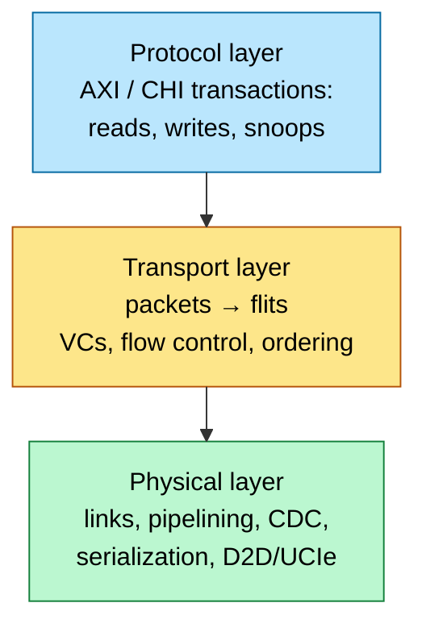
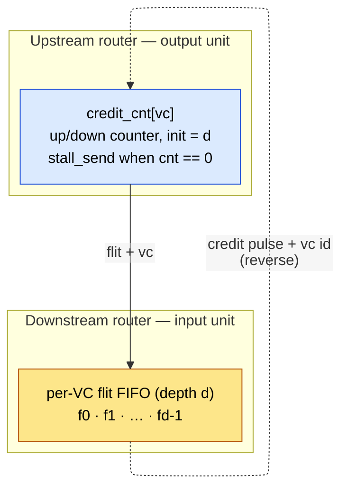
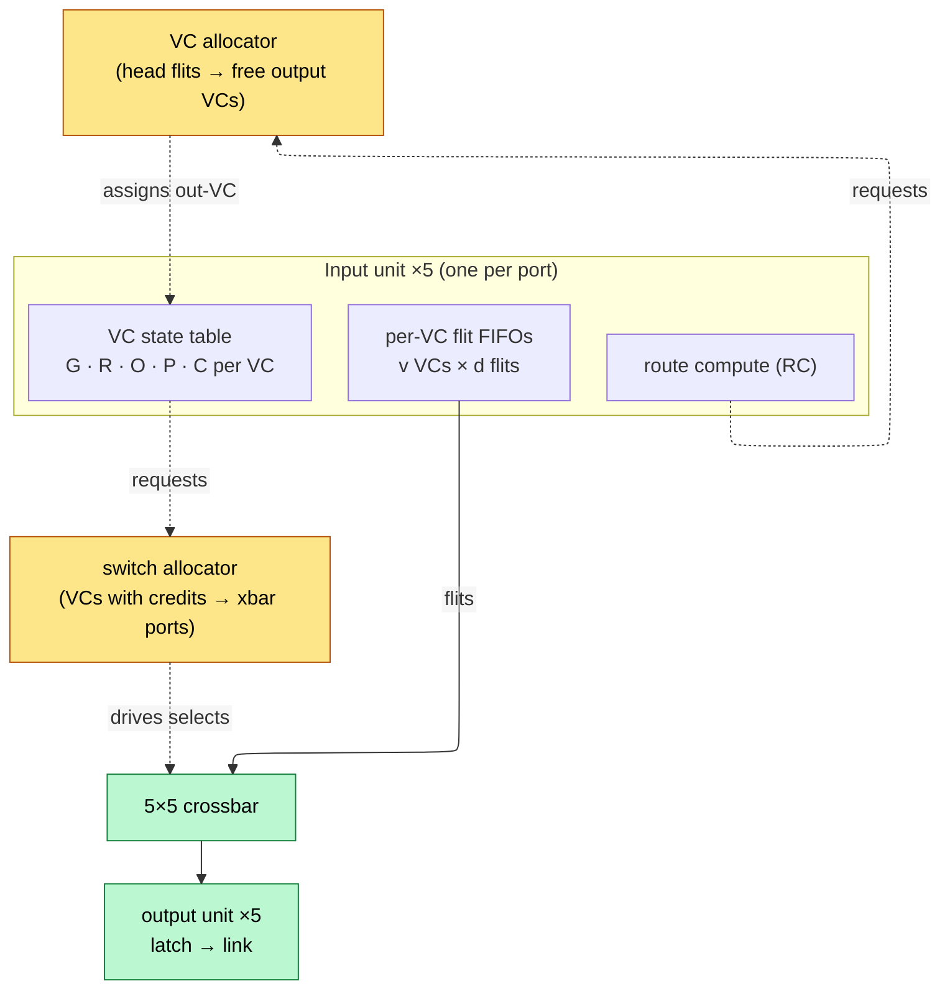
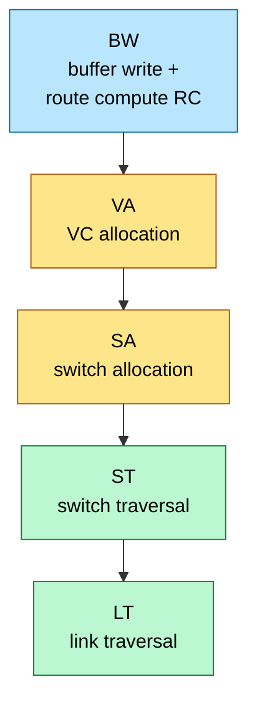
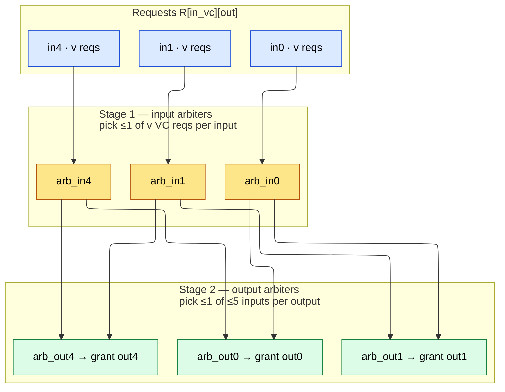

# Network-on-Chip (NoC) — Topology, Routing, Flow Control, Router Microarchitecture

> Prerequisites: [AHB_AXI_APB](11_AHB_AXI_APB.md) (what the NoC replaces), [ACE_and_CHI](12_ACE_and_CHI.md) (the protocol that rides on it), [Memory](09_Memory.md) (FIFOs/SRAM used in routers).

---

## 0. Why this page exists

Beyond ~10–16 agents, shared buses and full crossbars stop scaling: bus bandwidth is constant while demand grows linearly, and crossbar area grows as $O(n^2)$ with wire delay making a chip-spanning monolithic switch untimeable. The answer — packetize transactions and route them hop-by-hop over a network of small routers — is now the backbone of every large SoC (Arm CMN mesh in server CPUs, hashed-ring/mesh fabrics in GPUs, the 2D mesh that *is* the compute fabric in Tenstorrent/Cerebras-class AI chips, and die-to-die extensions over UCIe). Interviews probe NoC at three depths: topology math (bisection bandwidth, diameter), correctness (deadlock theory — the only part with real theorems), and router microarchitecture (the 4–5 stage pipeline and where the cycles go). This page covers all three plus the protocol layer (CHI-over-mesh) that SoC interviews actually care about.

---

## 1. The layered view

- A CHI `ReadNoSnp` becomes a **packet**; the packet is segmented into **flits** (flow-control units, e.g., 256 bit); a flit may cross a narrow link as several **phits** (physical transfer units).
- Network Interface Units (NIUs/bridges) translate AXI/CHI ↔ packets at every agent. The fabric itself is protocol-agnostic transport.

---

## 2. Topology

### 2.1 Metrics

For $N$ nodes: **degree** (links per router — area/power), **diameter** (max hop count — worst latency), **average distance** $\bar{h}$ (typical latency), **bisection bandwidth** $B_b$ (min total link bandwidth crossing any cut that halves the network — the throughput ceiling for uniform-random traffic).

Uniform-random throughput bound per node:

$$
\Theta_{\max} = \frac{2\,B_b}{N}
$$

(half of all traffic crosses the bisection on average).

### 2.2 Standard on-chip topologies

| Topology | Degree | Diameter | Bisection ($N$ nodes, link BW $b$) | Notes |
|---|---|---|---|---|
| Bus | – | 1 | $b$ (constant!) | dies beyond ~8–16 agents |
| Crossbar | $N$ | 1 | $Nb/2$ | $O(N^2)$ area; fine ≤ ~16 ports |
| Ring | 2 | $N/2$ | $2b$ | cheap; GPUs/Apple fabric tiers; latency grows linearly |
| 2D Mesh $k{\times}k$ | 3–4 | $2(k{-}1)$ | $k \cdot b$ | the SoC default (CMN, AI tiles); edge asymmetry |
| 2D Torus | 4 | $k$ | $2k \cdot b$ | wraparound halves diameter; long wrap wires → folded layout |
| Flattened butterfly / hierarchical star+mesh | high | ~2–3 | high | latency-optimized, costly routers |

2D mesh wins on-chip because links map to physical adjacency (short, repeatable wires), routers stay 5-port (N/S/E/W/Local), and the floorplan tiles.

### 2.3 Concentration and hierarchy

Real SoCs attach $c$ agents per router (concentration) and mix fabrics: a coherent CHI mesh for CPU/L3/memory, ring or crossbar sub-fabrics for peripheral clusters bridged in, and dedicated wide point-to-point paths for DMA-heavy accelerators. "One flat mesh" is a textbook simplification.

---

## 3. Flow control

### 3.1 Buffering disciplines

| Scheme | Unit buffered | Latency per hop | Buffer need | Used |
|---|---|---|---|---|
| Store-and-forward | whole packet | serialization × hops | packet-sized | off-chip networks |
| Virtual cut-through | packet (advance on header) | ~router delay | packet-sized | some NoCs |
| **Wormhole** | flit | ~router delay | few flits | **on-chip default** |

Wormhole: the packet snakes across multiple routers simultaneously; only a few flit buffers per port. The cost: a blocked head flit leaves the packet's *body occupying channels across several routers* → head-of-line blocking and the raw material of deadlock.

### 3.2 Virtual channels (VCs)

Multiple flit-buffer sets (VCs) share one physical link, arbitrated per cycle. VCs serve three distinct purposes — interviewers like asking for all three:

1. **HoL-blocking relief / throughput**: a blocked packet on VC0 doesn't idle the link if VC1 has traffic (typ. +20–40% saturation throughput for 2–4 VCs).
2. **Deadlock avoidance**: escape VCs / dateline VCs break cyclic channel dependencies (§5).
3. **Traffic classes / protocol separation**: REQ vs RSP vs SNP must not block each other (§6).

### 3.3 Credit-based flow control

Upstream keeps a credit counter per VC = free downstream flit slots; sending a flit decrements, downstream freeing a slot returns a credit. For full-rate streaming, buffer depth must cover the **credit round-trip**:

$$
D_{\min} = \lceil t_{\text{crt}} \rceil = t_{\text{flit→down}} + t_{\text{credit→up}} + t_{\text{pipe}}
$$

With a 3-cycle credit loop, < 3 buffers per VC throttles the link even with zero contention — the standard "why is my link at 60% utilization" bug. (Same reasoning as AXI outstanding-transaction sizing in [AHB_AXI_APB](11_AHB_AXI_APB.md).)

**The credit-counter circuit (per output VC).** The hardware is one small up/down counter per downstream VC, sitting in the upstream router's output unit:

Sending a flit on VC *v* does `credit_cnt[v]--` and stalls if the count would go below zero (no grant). When the downstream router frees a slot it pulses a credit plus the VC id back upstream and `credit_cnt[v]++`. The counter is initialised to *d*, the downstream FIFO depth for that VC.

So "credits" are not a bus — they are a per-VC count of *known-free downstream slots*. The switch allocator (§4) is only allowed to request an output for an input VC whose `credit_cnt > 0`; this is what makes backpressure lossless without ever dropping a flit. The reverse credit wire carries just a VC id (⌈log₂ v⌉ bits) per freed slot, which is why credit return is cheap but still costs the round-trip latency the formula above captures.

---

## 4. Router microarchitecture

### 4.0 The router datapath — what's actually inside the box

A virtual-channel (VC) router is five things: **input units** (one per port, each holding the per-VC flit buffers and the per-VC control state), a **VC allocator**, a **switch allocator**, the **crossbar**, and **output units**. A 5-port (N/S/E/W/Local) router:

**The input unit is where the structure lives.** Each input VC carries a small state record — the canonical Dally five fields (G, R, O, P, C):

| Field | Name | What it holds | Written by |
|---|---|---|---|
| **G** | Global state | `Idle → Routing → VC-Alloc → Active → (tail) Idle` | the per-VC FSM |
| **R** | Route | chosen **output port** for this packet | RC stage |
| **O** | Output VC | the **downstream VC** this packet won | VA stage |
| **P** | Pointer | read/write pointers into the flit FIFO | buffer logic |
| **C** | Credit | free-slot count for the assigned output VC (§3.3) | credit counter |

A head flit walks G from *Routing* (RC fills **R**) to *VC-Alloc* (VA fills **O**) to *Active*; body/tail flits inherit **R/O** and just stream through SA→ST each cycle; the tail flit returns G to *Idle* and frees the output VC. This five-field record per VC, replicated `v` VCs × 5 ports, **is** the router's control state — the equivalent of the power-gating section's retention-FF state table.

**Flit / packet format.** A packet is segmented into flits; only the head carries routing info, which is why RC/VA are head-only:

| Flit | Fields |
|---|---|
| HEAD | `type=HEAD` · VCID · dst_x,dst_y (or precomputed route) · length · payload |
| BODY | `type=BODY` · VCID · payload |
| TAIL | `type=TAIL` · VCID · payload (frees VC) |

The `type` field is 2–3 bits and VCID is ⌈log₂ v⌉ bits. The reverse sideband carries a credit return `{ valid, VCID }` = ⌈log₂ v⌉+1 bits per cycle.

`type` lets the router know when to run RC/VA (head) vs. inherit state (body), and when to release the VC (tail). `VCID` selects which input-VC FIFO the flit lands in. Everything else is payload the fabric never inspects.

### 4.1 Canonical 4/5-stage pipeline

- **RC (route compute):** head flit only — pick output port from destination coordinates.
- **VA (VC allocation):** head flit only — win a free VC on the chosen output. Allocator matches requests (input VCs) to resources (output VCs).
- **SA (switch allocation):** every flit, every cycle — win a crossbar timeslot. Two-stage separable allocator typical: per-input arbiter picks one VC, per-output arbiter picks one input (round-robin for fairness).
- **ST/LT:** traverse crossbar, then the wire (1+ cycles; long links get pipelined with relay flops or elastic buffers).

Per-hop latency = 2–4 router cycles + link cycles. Mesh corner-to-corner on a 8×8 at 3-cycle routers ≈ 14 hops × 4 ≈ 56 cycles zero-load — why placement of memory controllers and hashing matter.

### 4.1B The allocators — a bipartite-matching problem in hardware

VA and SA are the cycles-eaters and the part interviewers push on, because both are the same problem: **match a set of requesters to a set of resources, ≤1 each, fairly, in one cycle.** VA matches head flits to free *output VCs*; SA matches input VCs that hold a flit *and* have credits to *crossbar output ports*. Optimal bipartite matching is too slow for a single cycle, so routers use a **separable allocator** — two back-to-back stages of cheap arbiters:

A grant requires winning both stages, so one input VC drives one crossbar input to one output this cycle; losers retry next cycle (their request state persists).

Two structural details that matter:

- **Each small arbiter is a round-robin or matrix arbiter.** A **matrix arbiter** gives strong fairness in a tiny cell: an `n×n` bit matrix `w[i][j] = "i has priority over j"`. Requester `i` is granted iff no higher-priority requester `j` also asks (`w[j][i]=1 ∧ req[j]`); after `i` wins, row `i` is cleared and column `i` set, dropping `i` to *lowest* priority. That update is the entire fairness mechanism — O(n²) bits, one gate level. Round-robin is the cheaper approximation (a rotating priority pointer).
- **Separable ≠ optimal.** Because the two stages decide independently, a separable allocator can leave a feasible match unmade (input A and B both pick output X in stage 1; one is wasted even if the loser could have used a free output Y). **iSLIP** recovers most of the loss by *iterating* request→grant→accept a few times per cycle and only advancing round-robin pointers on a final accept. Effect: matching efficiency climbs from ~63% (single-pass, random traffic) toward ~100% with 3–4 iterations — directly visible as saturation-throughput gain.

**VA vs SA, concretely.** VA runs **once per packet** (head flit only) and assigns the output VC **O**; it is the scarcer resource (only free VCs qualify) and the usual deadlock-relevant allocation (escape-VC rules from §5 are enforced here). SA runs **every cycle for every flit** and is the throughput-critical path — which is why production routers **speculate** SA in parallel with VA (§4.2) and fall back only on a VA miss.

### 4.2 Latency-reduction techniques

- **Lookahead routing (RC@N-1):** compute hop $k{+}1$'s output port at hop $k$, removing RC from the critical path.
- **Speculative SA:** request switch in parallel with VA, squash on VA fail → 2-stage router common in production.
- **Bypass / express channels:** flits travelling straight through an idle router skip stages (1-cycle hop best case); physical express links skip routers entirely (mesh → "mesh + express" hybrid).

### 4.3 Buffer sizing reality

Input buffers are the dominant router area/power (SRAM/flop FIFOs per port × per VC — see [Memory](09_Memory.md)). Typical: 4–8 flits/VC, 2–8 VCs/port, 256–512 b flits → a 5-port router ≈ 40–160 Kb of buffering. Power: NoC ≈ 5–15% of SoC dynamic power in agent-heavy designs; ~50%+ of it in buffers and links.

---

## 5. Routing and deadlock — the part with theorems

### 5.1 Routing classes

- **Deterministic / dimension-order (DOR/XY):** route fully in X, then Y. Simple, in-order per src-dst pair, load-oblivious — hotspots happen.
- **Oblivious (Valiant):** route via random intermediate node — perfectly balances *any* traffic at 2× hop cost; the basis of adversarial-traffic guarantees.
- **Adaptive:** choose among productive (minimal adaptive) or all (fully adaptive) ports based on local congestion (credit counts). Better load balance; must re-prove deadlock freedom; breaks in-order delivery (protocol layer must tolerate or use per-flow ordering).

### 5.2 Deadlock theory

Model channels as nodes of a **channel dependency graph (CDG)**: edge $c_i \to c_j$ if a packet can hold $c_i$ while waiting for $c_j$. **Dally–Seitz:** a routing function is deadlock-free iff its CDG is acyclic (for the resources it can wait on).

- **XY on a mesh:** turns from Y back to X are forbidden → all dependency cycles need a "down-then-across-then-up" turn that never exists → acyclic → deadlock-free. This is the exam answer for *why XY is safe*.
- **Turn model:** of the 8 turns in a 2D mesh, forbidding 2 carefully chosen turns (West-First, North-Last, Negative-First) leaves partially-adaptive deadlock-free routing.
- **Torus wraparound** re-introduces cycles even under DOR → **dateline VCs**: crossing the dateline forces a switch from VC0→VC1; the VC ordering breaks the cycle.
- **Escape VC:** fully adaptive routing on VCs 1..n with one VC0 routed by a provably-acyclic function (XY); any blocked packet can always drain via VC0 → deadlock-free overall (Duato's protocol).

**Livelock** (packet forever deflected, never delivered): only a risk for non-minimal adaptive/deflection routing — bound misroutes or use age-based priority escalation.

### 5.3 Protocol (message-dependent) deadlock

Even an acyclic-CDG fabric deadlocks if a *request* blocks the channel that its own *response* needs: agent A's req queue full of reqs whose resps are stuck behind A's own outbound reqs → cycle through the endpoints. Cure: **independent virtual networks (VNs)** per message class with independent buffering, and endpoints guaranteed to sink responses. CHI mandates exactly this — **REQ / RSP / SNP / DAT** ride separate VNs ([ACE_and_CHI](12_ACE_and_CHI.md)); AXI's 5 channels are the same idea at bus scale. The rule of thumb: *fabric-level VCs solve routing deadlock; per-message-class VNs solve protocol deadlock; you need both.*

---

## 6. The coherent mesh in practice (Arm CMN-class)

Server/infra SoCs (Neoverse CMN-600/700/S3-class meshes) put coherence *on* the mesh:

- **RN-F** (fully coherent requesters: CPU clusters), **HN-F** (home nodes: slices of the system cache + snoop filter/directory + point of coherence), **SN-F** (subordinate memory controllers), plus RN-I/HN-I for IO.
- Physical addresses are **hash-interleaved across HN-Fs** → uniform load on home nodes, no single coherence bottleneck (same trick as GPU L2-slice/memory-channel hashing — see ai_infra [GPU_Architecture](../../ai_infra/L3_Microarchitecture/GPU_Architecture.md)).
- A coherent read: RN-F → (REQ VN) → its address's HN-F → snoop filter lookup → either DAT from system-cache slice, snoop to an owning RN-F (SNP VN), or fetch from SN-F; data returns possibly **direct-to-requester (DCT/DMT)** skipping the home hop on the data path.
- QoS: per-source priority fields, age-based escalation at routers, and regulator counters at injection points (rate-limit a misbehaving accelerator before it floods the mesh).

AI-accelerator NoCs (Tenstorrent-style) differ in kind: software-scheduled, **multicast-capable** (one weight tile → row of cores), bandwidth-optimized over latency, often *not* hardware-coherent — the NoC is the dataflow fabric, with explicit DMA as the programming model.

---

## 7. Physical design of the fabric

- **Link pipelining:** mesh links at 1–2 mm route in 1 cycle at SoC clocks; longer or cross-die links need pipeline flops (adds hops' worth of latency) or **elastic buffers** (pipeline flops with backpressure = distributed FIFO).
- **CDC:** multi-clock SoCs put async FIFOs at NIU boundaries or run the whole fabric on one mesochronous grid ([Async_Design_and_CDC](../03_Frontend_RTL_and_Verification/06_Async_Design_and_CDC.md)).
- **Width/serialization:** 512-bit data flits common near memory; narrow regions serialize (1 flit = 2–4 phits) trading bandwidth for routing congestion relief.
- **Die-to-die:** UCIe/proprietary D2D PHYs carry the same flit protocol across chiplets (CHI C2C, AXI-over-D2D) — the NoC becomes a *package-scale* network; add ~5–20 ns and a serdes-style PHY per crossing ([IC_Packaging](../07_Manufacturing_and_Bringup/02_IC_Packaging.md)).
- **Floorplan coupling:** router placement = tile placement; bisection wires must physically exist across the die middle — a mesh's $k \cdot b$ bisection is also a *routing-resource* statement ([Physical_Design](../05_Backend_Physical_Design/01_Physical_Design.md)).

---

## 8. Performance modeling

**Zero-load latency:**

$$
T_0 = \bar{h}\,(t_r + t_w) + \frac{L_{\text{pkt}}}{b}
$$

($\bar{h}$ avg hops, $t_r$ router delay, $t_w$ wire delay, last term = serialization). 

**Saturation:** queueing delay explodes as offered load → min(allocator efficiency × link capacity, bisection bound). Engineering rule: provision so links run ≤ 60–70% sustained; latency–throughput curves hockey-stick past that (M/D/1 intuition: delay $\propto \rho/(1-\rho)$).

**Worked mini-example** (the classic): 8×8 mesh, 256-bit links @ 2 GHz, uniform random. Bisection = 8 links × 64 GB/s = 512 GB/s; per-node throughput bound = 2×512/64 = **16 GB/s** — note how much lower than one link's 64 GB/s. Uniform-random is bisection-limited, which is why real SoCs hash addresses (spread hotspots) and place high-traffic agents (memory controllers) to shorten $\bar h$ for the dominant flows.

---

## 9. Numbers to memorize

| Quantity | Value | Why |
|---|---|---|
| Mesh $k{\times}k$ bisection | $k$ links | throughput ceiling |
| Torus vs mesh diameter | $k$ vs $2(k{-}1)$ | wraparound halves it |
| Uniform-random per-node bound | $2B_b/N$ | half of traffic crosses bisection |
| Router pipeline | 2–4 stages (BW/RC, VA, SA, ST) + LT | per-hop cost |
| Input-VC control state | G·R·O·P·C (5 fields) | the router's state, replicated v×5 |
| Separable allocator efficiency | ~63% single-pass → ~100% w/ iSLIP 3–4 iters | matching quality = saturation throughput |
| Per-hop latency | ~2–4 cyc router + 1–2 cyc link | corner-to-corner estimates |
| VC count typical | 2–8/port (+ separate VNs per msg class) | HoL + deadlock + classes |
| Credit-loop buffer floor | ≥ round-trip cycles | full-rate streaming |
| Wormhole buffer/VC | 4–8 flits | vs packet-sized VCT buffers |
| NoC share of SoC power | ~5–15% | buffers + links dominate |
| Link utilization target | ≤ 60–70% sustained | hockey-stick beyond |
| XY deadlock-free proof | forbidden Y→X turns ⇒ acyclic CDG | Dally–Seitz |
| CHI message classes | REQ/RSP/SNP/DAT VNs | protocol deadlock cure |

---

## 10. Worked problems

**Problem 1 — size the mesh.** 64-core accelerator, each core sustains 8 GB/s of uniform-random traffic. Links are 32 B wide. Find the minimum link clock for an 8×8 mesh.

*Solution.* Demand: per-node bound must be ≥ 8 GB/s → $2B_b/64 \ge 8$ → $B_b \ge 256$ GB/s. Bisection = 8 links → 32 GB/s per link → at 32 B/cycle, $f \ge 1$ GHz. Add the ≤ 70%-utilization rule: $f \ge 1/0.7 \approx 1.43$ GHz. Answer: ~1.4–1.5 GHz, or widen links/double bisection (torus) to relax it.

**Problem 2 — credit-loop stall.** A link runs flit-per-cycle; downstream buffer 4 flits/VC; credit return path = 2-cycle flit pipe + 3-cycle credit pipe + 1-cycle update = 6-cycle loop. Sustained single-VC bandwidth?

*Solution.* With $D=4 < t_{crt}=6$: utilization = $D/t_{crt} = 4/6 = 67\%$. Each credit "orbits" 6 cycles, only 4 exist. Fix: 6+ buffers/VC (or more VCs sharing the physical link so other VCs fill the gaps).

**Problem 3 — prove it deadlocks.** Minimal-adaptive routing on a mesh, single VC, packets may wait on either productive port. Construct a deadlock and name two fixes.

*Solution.* Four packets forming a cycle: A at (1,1)→(2,2) holding east-channel waiting north; B at (2,1)→(1,2) holding north waiting west; C at (2,2)→(1,1) holding west waiting south; D at (1,2)→(2,1) holding south waiting east. Each holds the channel the previous one wants — CDG cycle, all turns legal under "any productive port" → deadlock. Fixes: (a) escape VC routed XY (Duato) — blocked packets drain via the acyclic VC; (b) restrict turns (West-First) so the cycle's turn set becomes illegal. (c — also accepted) dateline VCs if torus.

**Problem 4 — protocol deadlock at the NIU.** A DMA master's NIU shares one VC for its outbound reads and its inbound write-responses... explain the hang when 16 outstanding reads meet a full response path.

*Solution.* Reads occupy the shared VC/buffers end-to-end; responses can't enter the NIU because the same buffers are full of reads that won't retire until *their* responses return — a request-response cycle through the endpoint, not the fabric. CDG of the fabric alone is acyclic; the dependency closes through the master's transaction table. Fix: separate VN (or at minimum dedicated buffers + guaranteed-sink) for responses; bound outstanding reads below the response-path capacity. This is exactly why CHI separates REQ and RSP/DAT networks.

**Problem 5 — why the router won't close timing / where a cycle went.** A 5-port, 4-VC router is specified as a single-cycle (1-stage) router but fails timing; synthesis points at the switch-allocator path. Explain the critical path and give two structural fixes that *don't* drop to a slower clock.

*Solution.* In a 1-stage router the same cycle must do: read request bits from all 5×4=20 input VCs → **stage-1 input arbiters** (20→5) → **stage-2 output arbiters** (5→5, with matrix-arbiter priority lookup) → decode grants into crossbar selects → flit traverses the 5×5 crossbar. The serial arbiter→arbiter→crossbar chain is the long path. Fixes: (a) **speculative SA** — run SA in parallel with VA / pre-compute stage-1 from registered request vectors so only stage-2+crossbar is in the active cycle (the standard 2-stage→effective-1-stage trick); (b) **lookahead/precomputed selects** — pipeline the allocation so grants are registered and only crossbar traversal + link is combinational this cycle; (c) cheaper arbiter (round-robin pointer instead of full matrix arbiter) trades a little fairness for a shorter path. The interview point: the allocators, not the crossbar wires, are usually the router's critical path.

---

## Cross-references

- Protocol layer above: [ACE_and_CHI](12_ACE_and_CHI.md), [AHB_AXI_APB](11_AHB_AXI_APB.md).
- Components: [Memory](09_Memory.md) (FIFOs, SRAM buffers), [Async_Design_and_CDC](../03_Frontend_RTL_and_Verification/06_Async_Design_and_CDC.md) (CDC at NIUs).
- Implementation: [Physical_Design](../05_Backend_Physical_Design/01_Physical_Design.md) (link pipelining, floorplan), [IC_Packaging](../07_Manufacturing_and_Bringup/02_IC_Packaging.md) (UCIe die-to-die).
- System-scale analogues: ai_infra [Networking_and_Interconnect](../../ai_infra/L4_Systems_and_Interconnects/Networking_and_Interconnect.md) (same theory, bigger wires), [Specialty_Accelerators](../../ai_infra/L3_Microarchitecture/Specialty_Accelerators.md) (Tenstorrent NoC-as-fabric).
