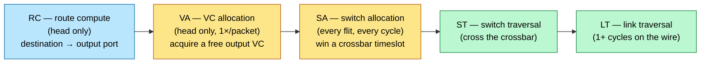

# Network-on-Chip — Why On-Chip Communication Becomes a Network

> **Prerequisites:** [AHB_AXI_APB](11_AHB_AXI_APB.md) (the bus and crossbar the NoC replaces), [ACE_and_CHI](12_ACE_and_CHI.md) (the coherence protocol that rides on it), [Memory](09_Memory.md) (the SRAM/FIFO buffers a router is built from).
> **Hands off to:** [GPU_Architecture](15_GPU_Architecture.md) (the SM↔L2 fabric), [Physical_Design](../05_Backend_Physical_Design/01_Physical_Design.md) (link pipelining and floorplan coupling), [IC_Packaging](../07_Manufacturing_and_Bringup/02_IC_Packaging.md) (UCIe die-to-die extension).

---

## 0. Why this page exists

On-chip communication is a shared resource, and every way of sharing it is one point on a single trade curve of **bandwidth vs latency vs area**. A **bus** shares one wire — cheap, low-bandwidth, and it *actively slows down* as you add agents. A **crossbar** gives everyone a private path — full bandwidth and one-hop latency, but $O(N^2)$ area and a clock that collapses past a few dozen ports. A **network** is the deliberate middle: cut the one shared medium into many short links and *route* traffic hop-by-hop across small routers. The single idea the whole page turns on:

> You scale on-chip bandwidth not by making the shared wire faster, but by cutting it into many short wires and scheduling packets across them — buying $O(N)$ cost and a bisection you can *choose* by topology, at the price of latency (hops) and three new correctness problems.

Those three problems are the three design axes, and every real fabric — Arm's CMN mesh in Neoverse servers, the hashed rings in GPUs, the 2-D mesh that *is* the compute fabric in Tenstorrent/Cerebras AI chips, die-to-die extensions over UCIe — is a point in this space:

- **Topology** — how routers connect. Sets diameter (the latency floor) and bisection bandwidth (the throughput ceiling) at a wire cost (§1–2).
- **Flow control** — how the scarce buffers and links are shared *losslessly* when packets arrive faster than they drain (§3).
- **Routing** — which path each packet takes, and the *proof* it can never deadlock (§4).

Interviews probe NoC at exactly three depths, and they map onto these axes: topology math (bisection, diameter), deadlock theory (the only part with real theorems), and router microarchitecture (where the cycles go). The router pipeline (§5), latency-under-load (§6), the coherent mesh (§7), and physical design (§8) are those three axes made concrete.

---

## 1. Why a bus and a crossbar both stop scaling

Everything starts from one invariant: **bisection bandwidth** $B_b$ — the total link bandwidth across the worst-case cut that splits the nodes into two equal halves. For uniform-random traffic half of every node's traffic must cross that cut, so bisection is the hard throughput ceiling. Interconnect scaling is entirely a statement about how bisection, latency, and cost grow with node count $N$.

**The bus fails on two axes at once.** One shared medium: diameter 1, but bisection $=b$ (a single link), *independent of $N$*.

- *Bandwidth* — per-node throughput is $b/N$, collapsing as $1/N$. Every agent added divides the same pie.
- *Electrical* — the shared wire gains capacitance with every tap ($C_{bus}\!\propto\!N$) and length with the floorplan ($\ell\!\propto\!\sqrt{A}$). Since wire delay grows as $RC$ (doubling length $\to 4\times$ delay — [CMOS_Fundamentals](../00_Fundamentals/01_CMOS_Fundamentals.md)), the achievable bus clock *falls* as $N$ rises, so $b$ itself shrinks.

A bus does not merely fail to scale — it slows down as it grows, which is why shared buses die beyond **~8–16 agents**.

**The crossbar buys full bandwidth at quadratic cost.** Give every input a dedicated path to every output: diameter 1, bisection $Nb/2$ — ideal. The price is quadratic on two independent axes:

$$
A_{xbar} \sim N^2 \cdot w \ \ (\text{crosspoints}\times\text{link width}), \qquad t_{xbar} \sim \ell_{xbar} \sim N
$$

An $N\times N$ crossbar is $N$ input buses crossing $N$ output buses — $N^2$ crosspoints — and its physical span grows linearly with $N$, so wire delay across it grows with $N$ (RC makes it worse). Result: ideal throughput, but $O(N^2)$ area and a clock that falls with $N$ → **untimeable** past a few dozen ports. The crossbar survives *inside* a router (a $5\times5$ switch is cheap) and is hopeless as a chip-wide fabric — fine ≤ ~16 ports, dead well before 64.

**The escape is a network.** Replace the one big switch with *many small* ones: a graph of degree-$d$ routers joined by short links, each router $O(1)$ area, each link a short wire between physical neighbours. Cost drops to $O(N)$ routers and $O(N)$ short wires, and the clock stays high because no wire spans the die. You pay with two new costs — **latency** (a packet now crosses several hops, up to the diameter) and **correctness** (you must route packets, share buffers, and *prove no deadlock*). The rest of the page is spending those two costs wisely.

A network is measured by four numbers, and every topology decision trades among them:

| Symbol | Metric | Sets |
|---|---|---|
| $d$ | **degree** (links per router) | router area / power |
| $D$ | **diameter** (max hop count) | worst-case latency |
| $\bar{h}$ | **average distance** (mean hops) | typical latency |
| $B_b$ | **bisection width** (links across the halving cut) | throughput ceiling |

and the master throughput bound, for $N$ nodes each injecting at rate $\Theta$ under uniform-random traffic:

$$
\Theta_{\max} = \frac{2\,B_b}{N}
$$

where $B_b$ = bisection bandwidth, $N$ = node count. The derivation is one line: total offered traffic is $N\Theta$, on average half of it ($N\Theta/2$) crosses the bisection, and that must be $\le B_b$ — so $\Theta \le 2B_b/N$. Bisection, not link speed, is what a topology must grow.

---

## 2. Topology: the diameter–bisection–cost trade

A topology is a single choice trading three quantities that cannot all be optimized — **diameter** (latency), **bisection** (throughput), and **degree/wire-length** (cost). The math for the canonical families ($N$ nodes, $k=\sqrt{N}$ for a square mesh/torus, link bandwidth $b$):

| Topology | Degree | Diameter | Bisection | Where / why |
|---|---|---|---|---|
| Bus | – | 1 | $b$ (constant!) | dies beyond ~8–16 agents |
| Crossbar | $N$ | 1 | $Nb/2$ | $O(N^2)$ area; fine ≤ ~16 ports |
| Ring | 2 | $N/2$ | $2b$ | cheapest; latency grows *linearly* — a hierarchy tier |
| 2-D mesh $k{\times}k$ | 3–4 | $2(k{-}1)$ | $k\,b$ | **the SoC default**; edge asymmetry |
| 2-D torus | 4 | $k$ | $2k\,b$ | wraparound halves diameter; long wrap wires → folded |
| Fat-tree / flattened butterfly | high | $\sim\!\log N$ | high | low diameter, costly high-radix routers |

Read the table as a trade, not a menu: the ring minimizes degree and dies on latency; the crossbar minimizes latency and dies on area; the fat-tree minimizes diameter and pays in router radix and wiring. The mesh sits at the knee — and *why* it sits there is a physical argument, not a graph one.

**Why the mesh wins on a 2-D die — the bisection-wire argument.** The die is planar: any cut across the middle of a side-$S$ square exposes only $O(S)=O(\sqrt{N})$ wire tracks per metal layer. A topology whose bisection is $B_b$ needs $B_b$ wires to *physically* cross that cut. The mesh's bisection is exactly $k=\sqrt{N}$ — it is **bisection-matched** to the tracks a planar substrate offers. A crossbar or fat-tree wants bisection $\propto N$: that many wires cannot cross a $\sqrt{N}$-track cut without exploding into extra metal layers or long detours — the same $O(N^2)$ wire wall that killed the monolithic crossbar. So on 2-D silicon the mesh is close to the richest topology whose bisection wires actually *fit*, at minimal degree (5-port: N/S/E/W/Local), with every link a short neighbour-to-neighbour wire that tiles and repeats. That is why it is the on-chip default (Arm CMN, AI compute tiles) and why exotic low-diameter topologies appear on-die only in *concentrated* or *hierarchical* form.

- **Torus** — wraparound edges halve diameter ($k$ vs $2(k{-}1)$) and double bisection ($2k$) at the same degree 4, but the wrap wires span the whole die. The cure is **folding** (interleave nodes so every link, wrap included, is length-2), which is why a torus is a layout decision as much as a topology one.
- **Ring** — the degree-2 floor. Diameter $N/2$ means latency grows linearly, so rings serve small counts or become a *tier* of a hierarchy (Apple's fabric, GPU L2 rings, peripheral sub-fabrics bridged into a mesh).

**Concentration and hierarchy.** Real SoCs never ship "one flat mesh." They attach $c$ agents per router (**concentration** — amortizes router cost and shortens $\bar{h}$) and *mix* fabrics: a coherent CHI mesh for CPU/LLC/memory, rings or crossbars for peripheral clusters bridged in, and wide point-to-point paths for DMA-heavy accelerators. The topology table is the vocabulary; the product is a composition.

---

## 3. Flow control: sharing buffers without dropping flits

Flow control is the policy for sharing two scarce resources — **channels** (links) and **buffers** — among more packets than they can hold, *losslessly*: on-chip there is no retransmit budget, so a dropped flit is a dropped transaction. The entire design is a derivation from one question — *how much must I buffer at each hop?* — and the answer collapses the router's dominant cost.

**Three granularities.** A transaction (a CHI `ReadNoSnp`) becomes a **packet**; a packet is cut into **flits** (flow-control units — the granularity buffers and credits are counted in, e.g. 256–512 bit); a flit crosses a narrow link as one or more **phits** (physical transfer units = the wire width). Only the *head* flit carries the route; body and tail flits inherit it. That single fact is why routing and VC allocation are **head-only** work (§5). Network Interface Units (NIUs) translate AXI/CHI ↔ packets at every agent; the fabric itself is protocol-agnostic transport.

**The buffering ladder.** Three disciplines differ only in *when* a hop forwards and *how much* it must buffer:

| Discipline | Forwards when | Buffer / hop | Latency | Where |
|---|---|---|---|---|
| Store-and-forward | whole packet arrived | **packet** | $\Sigma$ serialization $\times$ hops | off-chip (long links amortize) |
| Virtual cut-through | head arrived, if it can absorb the whole packet | **packet** | ~router delay | some NoCs |
| **Wormhole** | head arrived, per-flit | **a few flits** | ~router delay | **on-chip default** |

The latency contrast *is* the derivation:

$$
T_{SAF} \approx h\Big(t_r + \tfrac{L_{pkt}}{b}\Big), \qquad T_{worm} \approx h\,t_r + \tfrac{L_{pkt}}{b}
$$

where $h$ = hops, $t_r$ = per-router delay, $L_{pkt}$ = packet size, $b$ = link bandwidth. Store-and-forward serializes the *whole packet at every hop* (the $L_{pkt}/b$ term multiplies by $h$); wormhole serializes once and pipelines the packet across hops (that term is paid a single time). Because a router is mostly buffer SRAM (§5), wormhole's collapse from packet-sized to **4–8 flits** per buffer — a 10–50× cut — is what lets the fabric fit in budget. That is why wormhole is the on-chip default and store-and-forward stays off-chip.

**Wormhole's disease: head-of-line blocking.** A wormhole packet whose head is blocked leaves its body *occupying channels across several routers at once*. Any other packet needing one of those physical links is stuck behind it — even if its own path is entirely clear. One blocked packet idles links it is not even using. This head-of-line (HoL) blocking is the direct motivation for virtual channels, and the raw material of deadlock (§4).

**Virtual channels: decoupling buffer ownership from link ownership.** Give each physical link several independent flit-buffer queues — virtual channels (VCs) — and arbitrate which VC drives the wire *per cycle*. A blocked packet now parks its body in *its* VC's buffers while another VC keeps the physical link busy. VCs break the identification of "holding a buffer" with "holding the link" that caused HoL blocking — and that one mechanism buys three distinct things interviewers like to enumerate:

1. **Throughput / HoL relief** — a blocked VC no longer idles the link; 2–4 VCs typically recover **+20–40 %** saturation throughput.
2. **Deadlock avoidance** — escape / dateline VCs break cyclic channel dependencies (§4). A *correctness* use, not performance.
3. **Traffic-class separation** — REQ / RSP / SNP / DAT must not block each other (§7); separate VCs (virtual networks) keep classes independent.

**Credit-based flow control — the concept.** Backpressure must be lossless: upstream may send a flit only when it *knows* a downstream slot is free. The mechanism is a running per-VC count of known-free slots — decrement on send, increment when the downstream returns a credit for a drained flit — so no flit is ever launched at a full buffer and none is dropped. The only subtlety is sizing: to stream at full rate a VC's buffer must cover the **credit round-trip**, or the sender exhausts its credits before the first one returns:

$$
D_{\min} = \lceil t_{crt}\rceil = t_{\text{flit}\to\text{down}} + t_{\text{credit}\to\text{up}} + t_{\text{update}}
$$

where $D_{\min}$ = buffers per VC for full throughput and $t_{crt}$ = credit round-trip (its three terms are the flit-forward, credit-return, and counter-update latencies). Under-buffer and the link throttles with *zero* contention — sustained utilization is $D/t_{crt}$, so a 3-cycle loop with 2 buffers caps a link at 67 % for no reason but under-provisioning (the classic "why is my link at 60 %" bug). This is the same **bandwidth-delay product** that sizes AXI outstanding transactions ([AHB_AXI_APB](11_AHB_AXI_APB.md)) and the ROB ([OoO_Execution](05_OoO_Execution.md)): buffer $\ge$ rate $\times$ round-trip, or the pipe runs dry.

---

## 4. Routing and deadlock — the part with theorems

Routing chooses each packet's path; the theorem is that *some* path-choice policies can wedge the network into a permanent standstill, and deadlock-freedom is a **provable graph property**, not something you test into existence.

**Routing classes — a trade of load-balance vs simplicity vs ordering vs proof-burden.**

- **Deterministic / dimension-order (XY, DOR):** route all of X, then all of Y. Simple, in-order per src–dst pair, load-oblivious (hotspots on adversarial traffic), and provably deadlock-free with zero extra hardware.
- **Oblivious (Valiant):** route via a *random* intermediate node — balances *any* traffic pattern at 2× average hops; the basis of worst-case throughput guarantees.
- **Adaptive:** choose among productive (minimal-adaptive) or all (fully-adaptive) output ports by local congestion (credit counts). Best load balance, but it must *re-prove* deadlock freedom and it breaks in-order delivery (the protocol layer must tolerate reordering or carry per-flow order).

**Deadlock as cyclic resource dependence — the theory.** Deadlock needs the classic four conditions: mutual exclusion, hold-and-wait, no preemption, circular wait. A wormhole packet holds its buffers/channels exclusively, waits while holding them, and cannot be preempted (you may not drop it) — so three of the four are structural and permanent. The **only** removable condition is *circular wait*. Formalize it as the **channel dependency graph (CDG)**: a node per channel, and an edge $c_i \to c_j$ whenever a packet can hold $c_i$ while requesting $c_j$.

> **Dally–Seitz theorem.** A routing function is deadlock-free **iff** its channel dependency graph is acyclic (over the resources packets can wait on).

Deadlock avoidance is then a family of *proofs* that the CDG has no cycle:

- **XY on a mesh (the exam answer).** XY forbids any turn from a Y (column) channel back to an X (row) channel. Every possible cycle in a mesh requires at least one such Y→X turn; forbidding them makes the CDG acyclic → deadlock-free, at zero hardware cost. This is *why* the default fabric routes XY.
- **Turn model.** Of the 8 turns in a 2-D mesh, forbidding just 2 well-chosen turns (West-First, North-Last, Negative-First) breaks all cycles while leaving *partial adaptivity* — more path diversity than XY at the same free proof.
- **Torus dateline VCs.** Wraparound edges re-introduce cycles even under DOR. Fix: pick a "dateline" on each ring; a packet crossing it must switch VC0 → VC1. The VC index then strictly increases around any ring traversal, so no cycle can close → acyclic. Cost: one extra VC, no bandwidth.
- **Escape VC (Duato's protocol).** Route adaptively on VCs 1..n, but keep one VC0 that always follows a provably-acyclic function (e.g. XY). Any packet that would deadlock in the adaptive set can always *drain* via the acyclic escape VC → the whole network is deadlock-free while retaining adaptivity. This is the standard high-performance recipe.

**Livelock** (a packet endlessly deflected, never delivered) is a *different* failure and only threatens non-minimal adaptive/deflection routing; bound the misroutes or escalate priority by packet age.

**Protocol (message-dependent) deadlock — the cycle that closes outside the fabric.** Even a provably-acyclic fabric CDG deadlocks if a *request* holds the buffers its own *response* must traverse: an agent's inbound queue jams with requests whose responses are stuck behind those same agents' outbound requests. The cycle closes through the **endpoints' transaction tables**, not through any channel — so no amount of fabric VC discipline can see it. Cure: give each message class an **independent virtual network (VN)** — independent buffers end to end — and guarantee endpoints always *sink* responses. CHI mandates exactly this: **REQ / RSP / SNP / DAT** ride separate VNs ([ACE_and_CHI](12_ACE_and_CHI.md)); AXI's five channels are the same idea at bus scale. The rule that ties §3–4 together:

> **Fabric VCs solve routing deadlock; per-message-class VNs solve protocol deadlock; a coherent SoC needs both.**

---

## 5. The router pipeline as a concept

Strip away the datapath and a router does exactly three logical jobs to each flit — the pipeline stages *are* those jobs, nothing more:

1. **Route** — where does the head go next? (destination → output port)
2. **Allocate** — win the scarce shared resources on that port: first a downstream **VC** (so a buffer exists to land in), then a **crossbar timeslot** (so the switch will carry it).
3. **Traverse** — cross the crossbar (switch traversal), then the wire (link traversal).

Because only the head flit carries the route, jobs 1–2 are **head-only, once per packet**; body and tail flits inherit the head's port and VC and only re-contend for the crossbar each cycle. That gives the canonical 4/5-stage pipeline:

**Why allocation is the hard part — bipartite matching in one cycle.** VA and SA are the same abstract problem: *match a set of requesters to a set of ≤1-capacity resources, fairly, within a single cycle.* VA matches waiting head flits to free output VCs (the scarcer resource — and where the deadlock rules of §4, e.g. escape-VC eligibility, are enforced); SA matches input VCs that *both* hold a flit and have downstream credits to crossbar output ports (the throughput-critical stage, run every cycle). Optimal bipartite matching is too slow for one clock, so routers use a **separable allocator** — two back-to-back passes of cheap per-input then per-output arbiters. The catch is that a greedy two-pass allocator *leaves feasible matches unmade* (two inputs pick one output in pass 1; one is wasted even though a second output sat idle), so matching efficiency is only **~63 %** single-pass on random traffic. **iSLIP** recovers it by *iterating* request→grant→accept a few times per cycle, climbing toward **~100 %** at 3–4 iterations — and since matching efficiency *is* delivered throughput, that gain shows up directly on the saturation curve (§6). The concept to carry away: **the allocators, not the crossbar wires, are the router's throughput bottleneck and usually its critical path.**

**Collapsing the pipeline.** A naive router is 4–5 stages per hop; production routers hide most of them off the critical path:

- **Lookahead routing** — compute hop $k{+}1$'s output port at hop $k$, so RC never sits in a flit's own critical path.
- **Speculative SA** — request the crossbar *in parallel* with VA and squash on a VA miss; turns a 3-stage router into an effective 2-stage one in the common case.
- **Bypass / express channels** — a flit going straight through an idle router skips allocation (1-cycle hop); physical express links skip routers entirely (mesh → "mesh + express" hybrid).

Per-hop latency lands at **2–4 router cycles + 1–2 link cycles**. Corner-to-corner on an 8×8 mesh is ~14 hops; at ~4 cyc/hop that is **~56 cycles zero-load** — which is exactly why memory-controller placement and address hashing (§7) matter more to real latency than shaving a router cycle.

**Buffer sizing is the router.** Input buffers dominate router area and power: $v$ VCs $\times$ $d$ flits $\times$ port, at 256–512-bit flits, gives a 5-port router **~40–160 Kb** of SRAM/flops ([Memory](09_Memory.md)). NoC power is **~5–15 %** of SoC dynamic power in agent-heavy designs, and *over half of it* is buffers and links — so the whole buffer-shrinking chain (wormhole → few flits/VC → credit-sized depth, §3) is not a detail, it is the reason the fabric fits in budget.

---

## 6. Latency under load

A fabric has two regimes: a flat **zero-load** latency set by hop count, and a **congested** regime where queueing delay diverges as offered load nears saturation. Designers live in the flat region and provision to stay there.

**Zero-load latency** — best case, no contention:

$$
T_0 = \bar{h}\,(t_r + t_w) + \frac{L_{pkt}}{b}
$$

where $\bar{h}$ = average hops, $t_r$ = per-router delay, $t_w$ = per-link wire delay, and $L_{pkt}/b$ = serialization of the packet onto the link (head-to-tail time). Two levers only: cut $\bar{h}$ (topology, placement, concentration) or cut $t_r$ (pipeline collapse, §5).

**Congestion — why the curve hockey-sticks.** Model a link as a queue with utilization $\rho$ = offered load / capacity. Deterministic flit service (M/D/1) gives a mean waiting time

$$
W \approx \frac{\rho}{2(1-\rho)}\,t_s
$$

where $t_s$ = flit service time and $\rho$ = link utilization. $W$ is small and flat while $\rho$ is low, then *diverges* as $\rho \to 1$: the $1/(1-\rho)$ pole is the hockey-stick. End-to-end latency is $T_0 + \sum_{\text{hops}} W$; it hugs $T_0$ until the busiest link on the path approaches saturation, then explodes. The **saturation throughput** is the smaller of two ceilings:

$$
\Theta_{sat} = \min\Big(\underbrace{2B_b/N}_{\text{bisection}},\ \underbrace{\eta_{alloc}\cdot C_{link}}_{\text{allocator}}\Big)
$$

where $B_b$ = bisection, $N$ = nodes, $\eta_{alloc}$ = allocator matching efficiency (§5, ~0.63 → ~1.0 with iSLIP), $C_{link}$ = raw link capacity. The engineering rule falls straight out of the pole: **provision so links run ≤ 60–70 % sustained** — past that, the $\rho/(1-\rho)$ term makes tail latency unpredictable.

**Worked bisection example** (the classic): 8×8 mesh, 256-bit links @ 2 GHz → 64 GB/s per link. Bisection $= 8$ links $= 512$ GB/s; per-node uniform-random bound $= 2\times512/64 = $ **16 GB/s** — four times *below* one link's 64 GB/s. Uniform-random traffic is bisection-limited, which is why real SoCs **hash addresses** (spread hotspots evenly across the bisection) and **place** high-traffic agents (memory controllers) to shorten $\bar{h}$ for the dominant flows.

---

## 7. The coherent mesh in practice (Arm CMN-class)

Server and infrastructure SoCs (Arm Neoverse CMN-600/700/S3-class meshes; Graviton, Neoverse N1/V1/V2) put *coherence on the mesh* — the fabric is not just transport, it is the point of coherence:

- **Node types.** **RN-F** (fully-coherent requesters — CPU clusters), **HN-F** (home nodes — a slice of the system-level cache + snoop filter/directory + point of coherence), **SN-F** (subordinate memory controllers), plus RN-I / HN-I for IO.
- **Address hash-interleave across HN-Fs** — every physical address maps by hash to one home node, spreading coherence load uniformly so no single directory becomes a bottleneck (the same trick as GPU L2-slice and DRAM-channel hashing — [GPU_Architecture](15_GPU_Architecture.md), [DDR_Controller](10_DDR_Controller.md)).
- **A coherent read.** RN-F →(REQ VN)→ the address's HN-F → snoop-filter lookup → data from the SLC slice, *or* a snoop to an owning RN-F (SNP VN), *or* a fetch from SN-F; data can return **direct-to-requester (DCT/DMT)**, skipping the home hop on the return path to cut latency.
- **QoS.** Per-source priority fields, age-based escalation at routers, and injection-point regulator counters (rate-limit a runaway accelerator before it floods the mesh).

**AI-accelerator NoCs differ in kind.** Tenstorrent/Cerebras-class fabrics are software-scheduled, **multicast-capable** (one weight tile → a whole row of cores), bandwidth-optimized over latency, and often *not* hardware-coherent — the NoC *is* the dataflow fabric, with explicit DMA as the programming model rather than a coherence protocol. Same topology math (§2), opposite correctness contract.

---

## 8. Physical design of the fabric

The fabric's parameters are ultimately *wire* statements:

- **Link pipelining.** A 1–2 mm mesh link routes in ~1 cycle at SoC clocks; longer or cross-die links need pipeline flops (adding hops of latency) or **elastic buffers** (pipeline flops with backpressure = a distributed FIFO).
- **CDC.** Multi-clock SoCs put async FIFOs at NIU boundaries or run the fabric on one mesochronous grid ([Async_Design_and_CDC](../03_Frontend_RTL_and_Verification/06_Async_Design_and_CDC.md)).
- **Width / serialization.** 512-bit flits near memory; narrow regions serialize (1 flit = 2–4 phits), trading bandwidth for routing-congestion relief.
- **Die-to-die.** UCIe / proprietary D2D PHYs carry the *same* flit protocol across chiplets (CHI-C2C, AXI-over-D2D) — the NoC becomes a package-scale network at ~5–20 ns and a serdes-class PHY per crossing ([IC_Packaging](../07_Manufacturing_and_Bringup/02_IC_Packaging.md)).
- **Floorplan coupling.** Router placement *is* tile placement, and a mesh's $k\,b$ bisection is also a *routing-resource* claim — those bisection wires must physically exist across the die middle ([Physical_Design](../05_Backend_Physical_Design/01_Physical_Design.md)). §2's bisection-wire argument is a floorplan constraint, not just a graph metric.

---

## 9. Numbers to memorize

| Quantity | Value | Why |
|---|---|---|
| Bus scaling ceiling | ~8–16 agents | bisection $=b$ constant, and clock falls with $N$ (§1) |
| Crossbar cost | $O(N^2)$ area, clock $\propto 1/N$ | fine ≤ ~16 ports, untimeable past ~dozens (§1) |
| Mesh $k{\times}k$ bisection | $k$ links | throughput ceiling; matches $\sqrt{N}$ die tracks (§2) |
| Torus vs mesh diameter | $k$ vs $2(k{-}1)$ | wraparound halves it (§2) |
| Uniform-random per-node bound | $2B_b/N$ | half of traffic crosses the bisection (§1) |
| Router's 3 logical jobs | route · allocate · traverse | derive the RC/VA/SA/ST/LT pipeline (§5) |
| Router pipeline | 2–4 stages + LT | RC(head), VA(head), SA(every flit), ST, LT (§5) |
| Separable allocator efficiency | ~63 % single-pass → ~100 % w/ iSLIP 3–4 iters | matching quality = saturation throughput (§5) |
| Per-hop latency | ~2–4 cyc router + 1–2 cyc link | corner-to-corner estimates (§5) |
| VC count typical | 2–8 / port (+ separate VNs per msg class) | HoL relief + deadlock + classes (§3) |
| Credit-loop buffer floor | $\ge$ round-trip cycles | full-rate streaming, bandwidth-delay product (§3) |
| Wormhole buffer / VC | 4–8 flits | vs packet-sized store-and-forward / VCT (§3) |
| NoC share of SoC power | ~5–15 % | buffers + links dominate (§5) |
| Link utilization target | ≤ 60–70 % sustained | $\rho/(1-\rho)$ hockey-stick beyond (§6) |
| XY deadlock-free proof | forbidden Y→X turns ⇒ acyclic CDG | Dally–Seitz (§4) |
| CHI message classes | REQ / RSP / SNP / DAT VNs | protocol-deadlock cure (§4, §7) |

---

## 10. Worked problems

**1 — Size the mesh (bisection).** A 64-core accelerator, each core sustaining 8 GB/s of uniform-random traffic, links 32 B wide. Minimum link clock for an 8×8 mesh?

*Solution.* The per-node bound must cover demand: $2B_b/64 \ge 8 \Rightarrow B_b \ge 256$ GB/s. Bisection $=8$ links $\Rightarrow$ each $\ge 32$ GB/s $\Rightarrow$ at 32 B/cycle, $f \ge 1$ GHz. Add the ≤70 %-utilization rule (§6): $f \ge 1/0.7 \approx 1.43$ GHz. Answer: **~1.4–1.5 GHz**, or widen links / go torus (double bisection) to relax it. Note the design was *bisection*-bound long before any single link was.

**2 — Credit-loop stall (bandwidth-delay product).** A link runs flit-per-cycle; downstream buffer 4 flits/VC; credit return = 2-cycle flit pipe + 3-cycle credit pipe + 1-cycle update = 6-cycle loop. Sustained single-VC bandwidth?

*Solution.* With $D=4 < t_{crt}=6$: utilization $= D/t_{crt} = 4/6 = $ **67 %**. Each credit "orbits" 6 cycles but only 4 exist, so the sender stalls 2 of every 6 cycles. Fix: **6+ buffers/VC**, or more VCs sharing the physical link so others fill the gap (§3).

**3 — Prove it deadlocks.** Minimal-adaptive routing on a mesh, single VC, packets may wait on either productive port. Construct a deadlock; name two fixes.

*Solution.* Four packets forming a cycle: A at (1,1)→(2,2) holds the east channel waiting north; B at (2,1)→(1,2) holds north waiting west; C at (2,2)→(1,1) holds west waiting south; D at (1,2)→(2,1) holds south waiting east. Each holds the channel the previous one wants — a CDG cycle, every turn legal under "any productive port" → deadlock. Fixes: (a) **escape VC routed XY** (Duato) — blocked packets always drain via the acyclic VC0; (b) **restrict turns** (West-First) so the cycle's turn set becomes illegal; (c) dateline VCs if it is actually a torus (§4).

**4 — Protocol deadlock at the NIU.** A DMA master's NIU shares one VC for its outbound reads and its inbound write-responses. Explain the hang when 16 outstanding reads meet a full response path.

*Solution.* Reads occupy the shared VC/buffers end to end; responses cannot enter the NIU because the same buffers are full of reads that will not retire until *their* responses return — a request→response cycle **through the endpoint**, not the fabric. The fabric CDG alone is acyclic; the cycle closes through the master's transaction table. Fix: a **separate VN** (or at minimum dedicated buffers + guaranteed sink) for responses, and bound outstanding reads below the response-path capacity. This is precisely why CHI separates REQ from RSP/DAT (§4, §7).

**5 — Where did the cycle go? (the allocator is the critical path).** A 5-port, 4-VC router specified as single-cycle fails timing, and synthesis points at the switch-allocator path. Explain conceptually, and give two structural fixes that *don't* just lower the clock.

*Solution.* In a 1-stage router the same cycle must chain **input arbitration → output arbitration → crossbar traversal**: the two separable-allocator passes are serial, and each pass is a fan-in of priority logic. That arbiter→arbiter→crossbar chain — *not* the crossbar wires — is the long path, which is the general rule (§5): allocators dominate router timing. Fixes without slowing the clock: (a) **speculative SA** — run SA in parallel with VA and register the request vectors, so only the second arbiter pass + crossbar is combinational this cycle (the standard 2-stage → effective-1-stage trick); (b) **pipeline the allocation** — precompute and register grants so only crossbar + link traversal is combinational; (c) a cheaper arbiter (round-robin pointer instead of a full matrix arbiter) trades a little fairness for a shorter path.

---

## Cross-references

- **Down the stack (what the fabric is built from):** [Memory](09_Memory.md) (the FIFO/SRAM buffers that dominate router area, §5), [CMOS_Fundamentals](../00_Fundamentals/01_CMOS_Fundamentals.md) (the wire RC delay that makes the bus slow and the crossbar untimeable, §1), [Async_Design_and_CDC](../03_Frontend_RTL_and_Verification/06_Async_Design_and_CDC.md) (async FIFOs at NIU clock crossings, §8), [Physical_Design](../05_Backend_Physical_Design/01_Physical_Design.md) (link pipelining, floorplan coupling, the bisection-as-routing-resource claim of §2/§8), [IC_Packaging](../07_Manufacturing_and_Bringup/02_IC_Packaging.md) (UCIe die-to-die, §8).
- **Up the stack (what rides on it):** [ACE_and_CHI](12_ACE_and_CHI.md) (the coherence protocol and its REQ/RSP/SNP/DAT VNs, §4/§7), [AHB_AXI_APB](11_AHB_AXI_APB.md) (the bus/crossbar the NoC replaces and its five-channel outstanding model, §1/§3), [GPU_Architecture](15_GPU_Architecture.md) (the SM↔L2 mesh/crossbar and slice hashing, §7), [Performance_Modeling_and_DSE](01_Performance_Modeling_and_DSE.md) (where the latency-under-load and bisection models feed design-space exploration, §6).
- **Adjacent / system-scale:** [DDR_Controller](10_DDR_Controller.md) (channel hashing, the same load-spreading trick as HN-F interleave), datacenter interconnect (same deadlock/queueing theory, bigger wires), and Tenstorrent/Cerebras NoC-as-fabric (companion AI-infra material).

---

## References

1. Dally, W.J. and Towles, B., *Principles and Practices of Interconnection Networks*, Morgan Kaufmann, 2004. The standard text — topology metrics, flow control, router microarchitecture.
2. Dally, W.J. and Seitz, C.L., "Deadlock-Free Message Routing in Multiprocessor Interconnection Networks," *IEEE Trans. Computers*, C-36(5), 1987. The acyclic-CDG theorem of §4.
3. Duato, J., "A New Theory of Deadlock-Free Adaptive Routing in Wormhole Networks," *IEEE TPDS*, 4(12), 1993. The escape-VC protocol.
4. Glass, C.J. and Ni, L.M., "The Turn Model for Adaptive Routing," *ISCA*, 1992. The forbidden-turn construction of §4.
5. Peh, L.-S. and Dally, W.J., "A Delay Model and Speculative Architecture for Pipelined Routers," *HPCA*, 2001. The speculative-SA pipeline of §5.
6. McKeown, N., "The iSLIP Scheduling Algorithm for Input-Queued Switches," *IEEE/ACM Trans. Networking*, 7(2), 1999. The iterative separable allocator of §5.
7. Kim, J., Dally, W.J., Towles, B., and Gupta, A.K., "Microarchitecture of a High-Radix Router," *ISCA*, 2005; and "Flattened Butterfly," *ISCA*, 2007. High-radix / low-diameter on-chip topologies.
8. Arm, *CoreLink CMN-600 / CMN-700 Coherent Mesh Network Technical Reference Manual*. The CHI-on-mesh node types and hashing of §7.
