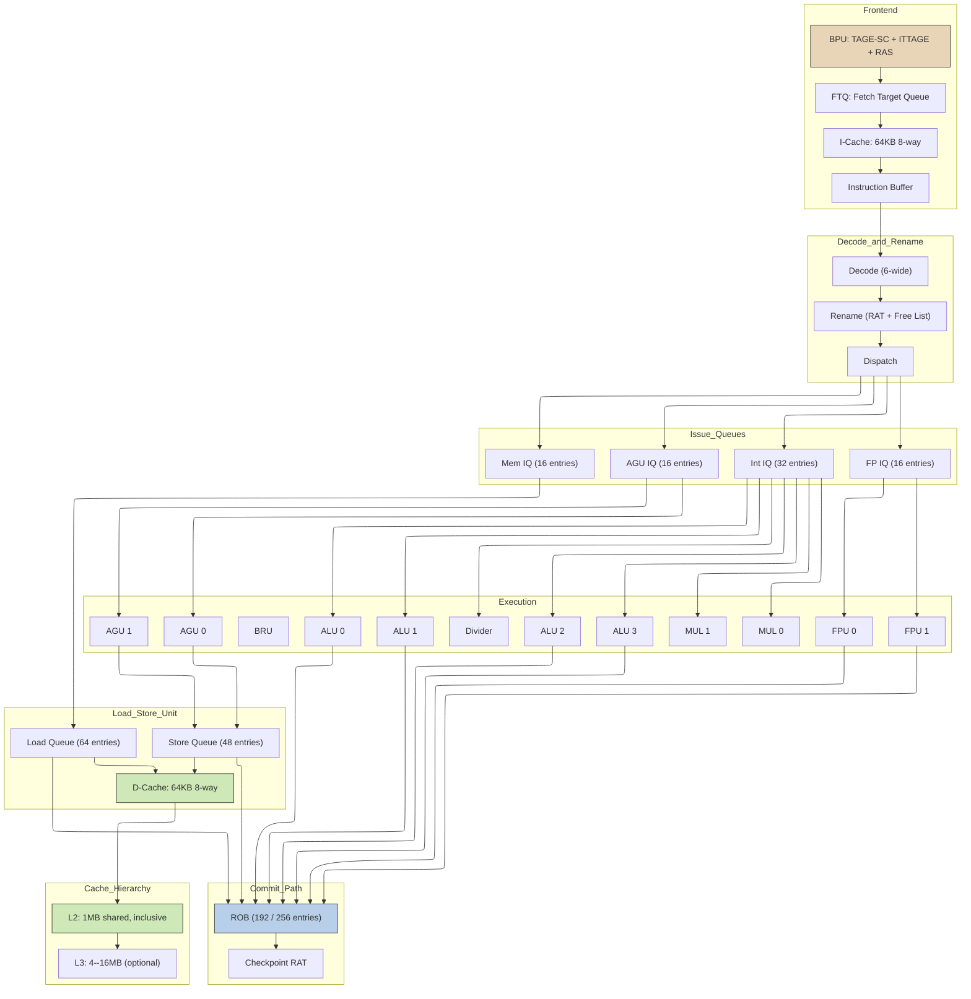
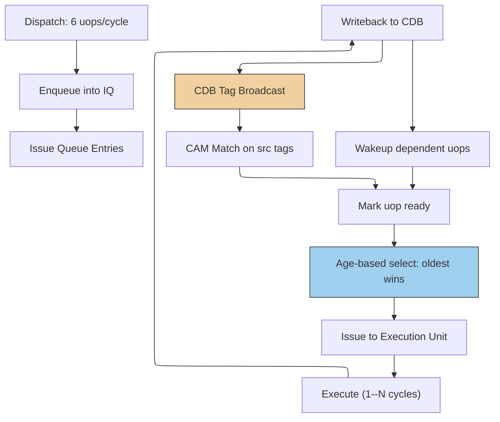
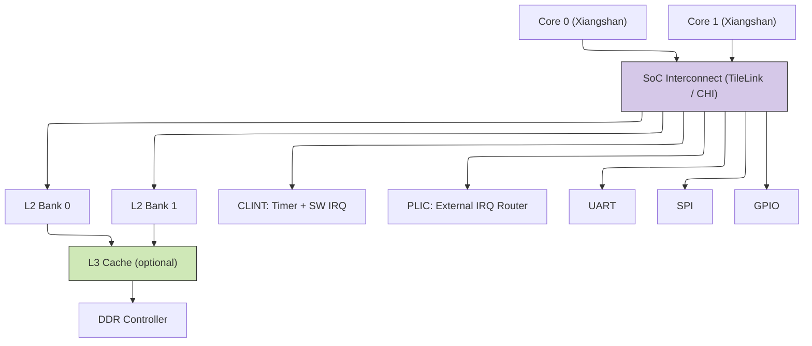

# Xiangshan (香山) — Open-Source RISC-V OoO Processor Case Study

| Field | Value |
|---|---|
| **Prerequisites** | [RISC-V ISA](04_RISC_V_ISA.md), [OoO Execution](05_OoO_Execution.md), [Cache Microarchitecture](07_Cache_Microarchitecture.md), [Branch Prediction](06_Branch_Prediction_Deep_Dive.md) |
| **Hands-off-to** | [TileLink and SoC Interconnect](11_AHB_AXI_APB.md), [Chisel HDL Methodology](../Index.md) |
| **Difficulty** | Advanced |
| **Scope** | Full microarchitecture deep-dive of an open-source superscalar OoO RISC-V core |

---

## 0 — Why This Page Exists

Modern out-of-order processor design has long been the province of proprietary,
closely-guarded RTL. Xiangshan (香山) breaks that mold: it is a **fully
open-source, server-class RISC-V 64-bit processor** written in Chisel, developed
at the Institute of Computing Technology (ICT) / University of Chinese Academy of
Sciences (UCAS). Studying Xiangshan provides a rare, complete view of how a
contemporary superscalar core is actually built -- from frontend branch prediction
through backend commit, from cache hierarchy to SoC integration.

This page dissects Xiangshan as a **case study of modern OoO CPU design**. Every
major subsystem is covered with enough detail to reason about microarchitectural
trade-offs, sizing calculations, and interview-style design problems.

---

## 1 — Project Overview

### 1.1 Origin and Goals

| Attribute | Detail |
|---|---|
| **Institution** | Institute of Computing Technology, Chinese Academy of Sciences (ICT, CAS); Beijing Institute of Open Source Chip (BOSC) |
| **License** | Mulan PSL v2 (permissive, BSD-like) |
| **ISA** | RV64GCBK (64-bit RISC-V with G extension, compressed, bit-manipulation, V vector) |
| **HDL** | Chisel 3.x (Scala-based hardware construction language) |
| **Target performance** | ARM Cortex-A76 / A78 class |
| **Target frequency** | 1.0--1.5 GHz (TSMC 28nm), 2.0+ GHz on advanced nodes |
| **Repository** | [github.com/OpenXiangShan/XiangShan](https://github.com/OpenXiangShan/XiangShan) |

### 1.2 Generations

| Codename | Chinese | Branch | Key Features |
|---|---|---|---|
| **Yanqihu** | 雁栖湖 | `yanqihu` | First stable microarchitecture (2020). 6-wide, 6-stage pipeline, baseline OoO. |
| **Nanhu** | 南湖 | `nanhu` | Second generation. Refined frontend (TAGE-SC BPU), improved LSU, 192-entry ROB. |
| **Kunminghu** | 昆明湖 | `master` / `kunminghu-v3` | Current generation. 256-entry ROB, vector extension (V), CHI-based L2, enhanced prefetch, wider dispatch. |
| **Kunminghu v2** | 昆明湖v2 | `kunminghu-v2` | Refined Kunminghu with CHI Issue B/C support, improved OoO pipeline tuning, enhanced vector unit throughput. |

Each generation is a **clean microarchitectural iteration**: the ISA stays the
same but pipeline depth, queue sizes, predictor structures, and cache parameters
evolve. Unless stated otherwise, quantitative figures in this page refer to
**Nanhu** with Kunminghu deltas noted where relevant.

### 1.3 Design Philosophy

1. **Agile development**: Chisel enables rapid RTL iteration; the team targets
   month-scale design--verify--tapeout cycles.
2. **Parameterized RTL**: Issue width, ROB size, cache capacity, and predictor
   sizes are configurable Scala parameters.
3. **Toolchain co-design**: Xiangshan ships with custom verification
   (DiffTest co-simulation), performance validation, and debugging frameworks.

---

## 2 — Microarchitecture Overview

### 2.1 Pipeline Stages

The Xiangshan pipeline is a **6-wide superscalar out-of-order design** organized
into a conceptual flow of:

$$
\text{Fetch} \;\to\; \text{Decode} \;\to\; \text{Rename} \;\to\; \text{Dispatch} \;\to\; \text{Issue} \;\to\; \text{Execute} \;\to\; \text{Writeback} \;\to\; \text{Commit}
$$

Physical pipeline stages (simplified):

| Stage | Name | Latency | Function |
|---|---|---|---|
| S0--S1 | IF0 / IF1 | 2 cycles | I-Cache access, fetch 8 instructions |
| S2 | IBuf | 1 cycle | Instruction buffer, pre-decode |
| S3 | Decode | 1 cycle | RVC expansion, instruction fusion, full decode |
| S4 | Rename | 1 cycle | RAT lookup, physical register allocation |
| S5 | Dispatch | 1 cycle | Route uops to issue queues |
| S6+ | Issue (wakeup+select) | 0--N cycles | Wait in issue queue until operands ready |
| S7 | Execute | 1--N cycles | ALU, FPU, AGU, BRU, multiply, divide |
| S8 | Writeback | 1 cycle | Broadcast result on CDB |
| S9 | Commit | 1 cycle | ROB commit, in-order graduation |

### 2.2 Block Diagram



### 2.3 Data Flow Summary

1. **Frontend** predicts and fetches up to 8 instructions/cycle into the
   instruction buffer.
2. **Decode** expands RVC, fuses instruction pairs, and produces 6 uops/cycle.
3. **Rename** maps architectural registers to physical registers, checkpoints
   the RAT on branches.
4. **Dispatch** routes uops to distributed issue queues.
5. **Issue queues** perform wakeup (tag broadcast) and selection (age-based
   arbitration).
6. **Execution units** produce results broadcast on the Common Data Bus (CDB).
7. **LSU** handles memory operations with store forwarding and memory
   disambiguation.
8. **ROB** commits uops in-order, writing back stores to D-cache at commit.

---

## 3 — Frontend

### 3.1 Fetch Target Queue (FTQ)

The FTQ decouples the branch predictor from the instruction cache. Each FTQ
entry contains:

- Predicted fetch PC (start address of the fetch block)
- Predicted fall-through address
- Branch prediction metadata (TAGE provider indices, RAS pointer)
- Starting instruction offset within the fetch block

The FTQ holds typically **32--64 entries** and feeds the I-Cache with one fetch
request per cycle. When the backend detects a mispredict, the FTQ is flushed
and repopulated from the corrected PC.

### 3.2 Branch Prediction Unit (BPU)

Xiangshan employs a **multi-component hybrid predictor** organized in two
stages: a fast preliminary predictor and a more accurate main predictor.

| Component | Target | Structure | Accuracy |
|---|---|---|---|
| **FTB** (Fetch Target Buffer) | Next fetch target | Tagged table of fall-through and target addresses | -- |
| **TAGE** (TAgged GEometric) | Conditional branches | Multiple tag tables with geometric history lengths (4--16 tables) | ~97% |
| **SC** (Statistical Corrector) | Override TAGE on low-confidence | Per-branch saturating counters | +0.5% over TAGE alone |
| **ITTAGE** | Indirect jumps/calls | Same structure as TAGE but predicts target address | ~95% |
| **RAS** (Return Address Stack) | Function returns | 16--32 entry stack | ~99% |

**Prediction flow:**

1. FTB provides a preliminary next-PC prediction within the same cycle.
2. TAGE-SC provides a refined conditional-direction prediction in the next
   cycle, overriding FTB if necessary.
3. ITTAGE predicts indirect branch targets.
4. RAS predicts return addresses (pop on `ret`).

Total BPU latency: **1--2 cycles** from PC to confirmed prediction, pipelined
so that a new prediction starts every cycle.

### 3.3 Instruction Cache (I-Cache)

| Parameter | Value |
|---|---|
| **Capacity** | 64 KB |
| **Associativity** | 8-way set-associative |
| **Line size** | 64 B |
| **Indexing** | VIPT (Virtually Indexed, Physically Tagged) |
| **Hit latency** | 2 cycles (pipelined) |
| **MSHRs** | 32 |
| **Prefetcher** | Stream prefetcher (next-line + stride) |
| **Refill policy** | Critical-word-first, forward to fetch immediately |
| **Replacement** | PLRU (Pseudo-LRU) |

**VIPT sizing note:** With 64 B lines and 8 ways, the number of sets is:

$$
\text{sets} = \frac{64\,\text{KB}}{8 \times 64\,\text{B}} = 128\,\text{sets}
$$

Index bits: $\lceil \log_2 128 \rceil = 7$ bits. Offset bits: $\lceil \log_2 64 \rceil = 6$.
Total: $7 + 6 = 13$ bits. With 4 KB pages ($\text{offset} = 12$ bits), the
index extends 1 bit into the page number -- this is handled by the tag comparison
after TLB translation.

**Fetch bandwidth:** Up to 8 instructions (32 bytes, matching a half-cache-line)
per cycle on a hit.

### 3.4 Pre-Decoder

Between the I-Cache and the instruction buffer, a **pre-decoder** identifies:
- Branch instructions (for early mispredict detection)
- RVC (compressed) instruction boundaries
- Instruction length (16-bit or 32-bit)

This enables the frontend to deliver aligned instruction streams to the decode
stage without waiting for full decode.

---

## 4 — Decode and Rename

### 4.1 Decode (6-Wide)

The decode stage processes up to 6 instructions per cycle:

1. **RVC expansion**: Compressed 16-bit instructions are expanded to their
   32-bit equivalents.
2. **Instruction fusion**: Common instruction pairs are merged into single uops:
   - `auipc + addi` $\to$ single immediate-offset uop
   - `shift-left + add` $\to$ scaled-address uop
   - `xori + sltiu` $\to$ range-check uop
3. **Uop generation**: Each decoded instruction produces 1--2 uops (complex
   instructions like `lr/d`, atomics, or vector ops may produce more).
4. **Instruction classification**: Uop is tagged with its target issue queue
   (integer, float, memory, or address generation).

### 4.2 Rename

The rename stage maps **architectural registers** (x0--x31, f0--f31) to
**physical registers** from a unified pool.

| Parameter | Integer | Floating-Point |
|---|---|---|
| **Architectural registers** | 32 (x0--x31) | 32 (f0--f31) |
| **Physical registers** | 128 | 96 |
| **Free list initial size** | $128 - 32 = 96$ | $96 - 32 = 64$ |

**Rename table (RAT) structure:**

$$
\text{RAT}[i] = p_j \quad \text{where } p_j \in \{0, \ldots, 127\}
$$

Each entry stores a $\lceil \log_2 128 \rceil = 7$-bit physical register index.

**Checkpoint-based recovery:**

On every branch, the current RAT state is **snapshot** (checkpointed). The
checkpoint stores the 32 architectural-to-physical mappings for the integer
register file (and separately for FP). On a mispredict:

1. The ROB identifies the mispredicted branch.
2. The checkpoint corresponding to that branch is restored.
3. All younger uops in the ROB and issue queues are flushed.
4. Physical registers freed by the flush are returned to the free list.

Checkpoint count: typically **32--48** entries, covering the expected number of
in-flight branches.

### 4.3 Free List Management

The free list is implemented as a **bitmap** of available physical registers:

$$
\text{FreeList}[p] = \begin{cases} 1 & \text{if physical register } p \text{ is unallocated} \\ 0 & \text{otherwise} \end{cases}
$$

Allocation: scan the bitmap for the next free register (priority encoder).
Deallocation: set the bit when an old physical register is released at ROB commit
(after the committing instruction's destination is no longer needed by any
in-flight reader).

---

## 5 — Issue (Dispatch and Wakeup-Select)

### 5.1 Dispatch

After rename, uops are dispatched to one of four distributed issue queues:

| Queue | Entries | Target Units |
|---|---|---|
| **Integer IQ** | 32 | ALU, MUL, DIV, BRU |
| **Float IQ** | 16 | FPU (FADD, FMUL, FDIV, FMA) |
| **Memory IQ** | 16 | Load/Store pipeline |
| **Address Generation IQ** | 16 | AGU (address computation) |

Dispatch width: **6 uops/cycle** total across all queues (subject to queue
availability and back-pressure).

### 5.2 Wakeup

When an execution unit produces a result, the physical register tag is broadcast
on the **Common Data Bus (CDB)**. Each issue queue entry compares its pending
source operand tags against the broadcast tag using a **content-addressable
memory (CAM)** match:

$$
\text{ready}_i = \bigwedge_{k \in \{src1, src2\}} \left( \text{srcTag}_{i,k} \in \{\text{CDB tags}\} \right)
$$

Once both sources are ready, the uop becomes **eligible for selection**.

### 5.3 Select (Age-Based Arbitration)

Among ready uops, the **oldest** instruction wins issue. Age tracking uses a
matrix or timestamp scheme:

- Each entry maintains an age counter or age matrix bit.
- Select logic performs a **priority-encoded arbitration** favoring the oldest
  ready entry.
- This minimizes head-of-line blocking and improves instruction throughput.

Issue width: up to **6 uops/cycle** total, distributed across execution units
(subject to port conflicts).

### 5.4 Issue Queue Flow



---

## 6 — Execution Units

### 6.1 Integer Execution

| Unit | Count | Latency | Pipelined | Function |
|---|---|---|---|---|
| ALU | 4 | 1 cycle | Yes | Add, sub, logic, shift, compare |
| Multiplier | 2 | 3 cycles | Yes | Booth-encoded radix-4, Wallace tree, 64-bit product |
| Divider | 1 | 8--64 cycles | No (iterative) | Non-restoring or SRT division |
| Branch unit | (in ALU) | 1 cycle | Yes | Compare and resolve |

**Multiplier detail:** Booth radix-4 encoding produces partial products in one
cycle, a Wallace tree compresses them in the second cycle, and the final CPA
(carry-propagate adder) produces the result in the third cycle.

### 6.2 Floating-Point Execution

| Unit | Count | Operations | Latency |
|---|---|---|---|
| FPU 0 | 1 | FADD, FSUB, FMIN, FMAX | 3 cycles |
| FPU 1 | 1 | FMUL, FMA (fused multiply-add) | 4 cycles (FMA: 5 cycles) |
| Shared | -- | FDIV, FSQRT | 12--24 cycles (iterative) |

Both FPUs share a common writeback port. FMA operations use a single uop in
Xiangshan (the fusion is native, not decomposed).

### 6.3 Address Generation and Branch Resolution

- **2 AGUs**: Compute effective addresses for loads and stores using
  $\text{addr} = \text{base} + \text{offset}$.
- **Branch resolution**: Performed within integer ALUs. The branch condition is
  evaluated and compared against the prediction. A mispredict triggers:

$$
\text{Mispredict penalty} \approx 6\text{--}8 \text{ cycles (frontend flush + redirect)}
$$

The penalty includes:
1. Detecting the mispredict in the execute stage (1 cycle).
2. Communicating the correct target to the BPU and FTQ (1--2 cycles).
3. Flushing the pipeline and refilling from the correct PC (4--5 cycles).

---

## 7 — Load-Store Unit

### 7.1 Structure

The LSU is one of the most complex subsystems in Xiangshan. It must support:

- Out-of-order load execution (loads can bypass older stores).
- Precise memory ordering (detect and recover from ordering violations).
- Store forwarding (loads can read data from pending stores).
- Atomic and memory-ordering instruction support.

### 7.2 Load Queue and Store Queue

| Structure | Entries | Allocation | Execution | Commit |
|---|---|---|---|---|
| **Load Queue (LQ)** | 64 | In-order at dispatch | Out-of-order | In-order at ROB commit |
| **Store Queue (SQ)** | 48 | In-order at dispatch | Address + data out-of-order | Data written to D-cache at ROB commit |

Loads are allocated an LQ entry at dispatch. The load address is computed by
the AGU, then the D-cache is accessed. If the address matches a pending
(younger or uncommitted) store, data is forwarded from the SQ.

Stores are allocated an SQ entry at dispatch. The store address is computed by
the AGU, and store data is written to the SQ. The actual write to the D-cache
happens only when the store reaches the head of the ROB and commits.

### 7.3 Store Forwarding

When a load executes, it searches the SQ for matching addresses:

```ascii-graph
Load at LQ[8], addr = 0x1000
  Check SQ entries newer than LQ[8]:
    SQ[5]: addr = 0x1000  --> MATCH (same address)
    SQ[6]: addr = 0x1004  --> NO MATCH (different address)
  Forward data from SQ[5] to LQ[8]
```

The search walks SQ entries from the load's position backward (in program order)
and forwards data from the **most recent matching store**. This ensures the load
observes the correct memory value.

### 7.4 Memory Disambiguation

Loads are allowed to execute **before older stores have resolved their
addresses**. This is critical for performance but introduces a correctness risk:
if an older store later resolves to the same address as an already-executed
load, the load read stale data.

**Store-set predictor:** Xiangshan uses a store-set based predictor that tracks
which loads and stores have historically conflicted. If a load is predicted to
be independent of all pending stores, it is allowed to execute speculatively.
If the prediction is wrong:

1. A **memory ordering violation** is detected when the store resolves.
2. The load (and all younger instructions) are **replayed** from the ROB.
3. The store-set predictor is updated.

Replay penalty: approximately **10--15 cycles** (flush and re-execute).

### 7.5 LSU Pipeline

The LSU pipeline for a load instruction:

| Stage | Action | Latency |
|---|---|---|
| AGU | Compute virtual address | 1 cycle |
| DTLB | Translate virtual to physical | 1 cycle (hit) |
| SQ search | Check for store forwarding match | 1 cycle (parallel with DTLB) |
| D-Cache access | Read data from L1 D$ | 2--3 cycles |
| Forward mux | Select forwarded or cache data | 1 cycle |
| **Total (L1 hit)** | | **3 cycles (fast path)** |

---

## 8 — ROB and Commit

### 8.1 Reorder Buffer

| Parameter | Nanhu | Kunminghu |
|---|---|---|
| **ROB entries** | 192 | 256 |
| **Commit width** | 6 uops/cycle | 6 uops/cycle |
| **Checkpoint RAT entries** | 32--48 | 48--64 |

Each ROB entry stores:
- Architectural destination register number
- Physical destination register (old and new)
- Exception code
- Completed flag
- Branch prediction checkpoint index (for branches)

### 8.2 Commit Operation

Commit proceeds in-order from the head of the ROB:

1. Check if the next 6 entries at the ROB head are all **completed** (no
   exceptions, no pending memory ordering violations).
2. For each committing instruction:
   - If it is a **register write**: release the old physical register to the
     free list.
   - If it is a **store**: signal the SQ to write the store data to the D-cache.
   - If it is a **branch**: no additional action (already resolved).
   - If it has an **exception**: truncate commit, raise exception to the trap
     handler.
3. Advance the ROB head pointer.

### 8.3 Branch Recovery

On a branch mispredict detected in the execute stage:

1. Identify the mispredicted branch's ROB entry.
2. Restore the RAT from the checkpoint taken when that branch was renamed.
3. Flush all ROB entries younger than the mispredicted branch.
4. Flush all issue queue entries younger than the branch.
5. Flush the LQ and SQ entries younger than the branch.
6. Redirect the frontend to the correct target PC.
7. Release physical registers allocated by the flushed instructions back to the
   free list.

Total recovery time: **6--8 cycles** from mispredict detection to the first
correct instruction entering decode.

---

## 9 — Cache Hierarchy

### 9.1 L1 Instruction Cache

| Parameter | Value |
|---|---|
| Capacity | 64 KB |
| Associativity | 8-way |
| Line size | 64 B |
| Hit latency | 2 cycles |
| MSHRs | 32 |
| Replacement | PLRU |
| Prefetcher | Stream + next-line |
| TLB | 32-entry I-TLB (fully associative) |

### 9.2 L1 Data Cache

| Parameter | Value |
|---|---|
| Capacity | 64 KB |
| Associativity | 8-way |
| Line size | 64 B |
| Hit latency | 3 cycles |
| Write policy | Write-back, write-allocate |
| MSHRs | 16 |
| Replacement | PLRU |
| TLB | 32-entry D-TLB (fully associative) |
| Amo/Atomic support | LR/SC, AMO instructions |

**D-Cache access pipeline:**

$$
\text{VA} \xrightarrow{\text{DTLB}} \text{PA} \xrightarrow{\text{tag check + data read}} \text{data}
$$

Tag store and data store are accessed in parallel (virtually indexed). Tag
comparison happens in parallel with data SRAM read to minimize latency.

### 9.3 L2 Cache

| Parameter | Nanhu | Kunminghu |
|---|---|---|
| **Capacity** | 1 MB | 1--2 MB |
| **Associativity** | 8-way | 8-way |
| **Line size** | 64 B | 64 B |
| **Inclusion** | Inclusive of L1 | Inclusive of L1 |
| **Hit latency** | 10--15 cycles | 10--15 cycles |
| **Coherence** | MESI directory | MESI directory |
| **Interconnect** | TileLink | CHI Issue B/C (Coherent Hub Interface) |

The L2 is a **non-blocking cache** with multiple MSHRs supporting concurrent
miss handling. It maintains inclusion over the private L1 caches using a
**directory-based MESI protocol**:

- Each L2 line tracks which L1 caches hold a copy (sharers vector).
- On a write, the L2 sends invalidation messages to all sharers.
- On a read miss, the L2 allocates the line and responds with data.

### 9.4 L3 Cache (Optional)

| Parameter | Value |
|---|---|
| Capacity | 4--16 MB (configurable) |
| Associativity | 16-way |
| Line size | 64 B |
| Shared | Yes (multi-core) |

The L3 is optional and not present in all Xiangshan configurations. When present,
it serves as a shared last-level cache (LLC) connected via the SoC interconnect.

### 9.5 Cache Prefetching

Xiangshan employs multiple prefetcher types:

| Level | Prefetcher | Strategy |
|---|---|---|
| I-Cache | Stream prefetcher | Fetch next sequential cache line |
| D-Cache L1 | Stride prefetcher | Detect constant-stride access patterns |
| L2 | Stream + Stride + BOP | Best-Offset Prefetching: dynamically select optimal prefetch offset |

**BOP (Best-Offset Prefetching):** A recent advance that tracks the prefetch
offset (how many lines ahead to prefetch) that maximizes L2 hit rate. It
periodically evaluates multiple offsets and selects the one producing the most
useful prefetches.

---

## 10 — Uncore and SoC Integration

### 10.1 SoC Interconnect

Xiangshan uses a **TileLink-based** interconnect (Nanhu) or **CHI-based**
(Kunminghu) to connect cores, caches, and peripherals.



### 10.2 RISC-V Standard Peripherals

| Peripheral | Function | Interface |
|---|---|---|
| **CLINT** (Core Local Interruptor) | Per-hart timer interrupts (`mtimer`), software interrupts (`msip`) | TileLink MMIO |
| **PLIC** (Platform-Level Interrupt Controller) | External interrupt routing, priority, threshold, claim/complete | TileLink MMIO |
| **UART** | Serial console I/O | TileLink MMIO |
| **SPI** | SPI flash / peripheral controller | TileLink MMIO |
| **GPIO** | General-purpose I/O pins | TileLink MMIO |

### 10.3 Memory Map (Typical)

| Address Range | Device |
|---|---|
| `0x8000_0000` -- `0xFFFF_FFFF` | DRAM |
| `0x3800_0000` -- `0x3800_FFFF` | CLINT |
| `0x3C00_0000` -- `0x3FFF_FFFF` | PLIC |
| `0x4000_0000` -- `0x4000_FFFF` | UART, SPI, GPIO |

---

## 11 — Performance

### 11.1 SPEC CPU2006 Results (Estimated)

| Configuration | IPC (avg) | Frequency | Node |
|---|---|---|---|
| **Nanhu** | 2.5--3.0 | 1.0--1.5 GHz | TSMC 28nm |
| **Kunminghu (target)** | 3.5+ | 2.0+ GHz | Advanced node |
| ARM Cortex-A76 (reference) | ~3.5 | 2.8+ GHz | TSMC 7nm |
| ARM Cortex-A78 (reference) | ~3.8 | 3.0+ GHz | TSMC 5nm |

### 11.2 Performance Gap Analysis

The performance gap between Xiangshan Nanhu and ARM Cortex-A76 has two
components:

$$
\text{Perf}_{\text{relative}} = \frac{\text{IPC} \times \text{Freq}}{\text{IPC}_{\text{ref}} \times \text{Freq}_{\text{ref}}}
$$

For Nanhu vs. A76:

$$
\frac{2.8 \times 1.2}{3.5 \times 2.8} = \frac{3.36}{9.8} \approx 0.34
$$

This means Nanhu achieves roughly 34% of the A76 performance at the IPC level,
with the remainder of the gap attributable to frequency (process node) and
microarchitectural tuning. The Kunminghu generation targets closing this gap
through:

- Wider issue (improved wakeup-select logic)
- Larger ROB (256 entries) for more in-flight instructions
- Better branch prediction (larger TAGE tables)
- Enhanced prefetching
- Advanced process node for higher frequency

### 11.3 Key Microbenchmarks

| Benchmark | Nanhu IPC | Notes |
|---|---|---|
| CoreMark | ~3.5 | Small working set, fits in L1 |
| SPEC INT 2006 (avg) | ~2.5 | Branch-heavy, irregular access |
| SPEC FP 2006 (avg) | ~2.8 | More regular, better predictability |
| Stream (triad) | Limited by L2 bandwidth | ~10 GB/s at 1.2 GHz |

---

## 12 — RTL Structure and Design Methodology

### 12.1 Chisel Code Organization

```verilog
XiangShan/
  src/main/scala/xiangshan/
    frontend/           # BPU, FTQ, ICache, IBuf
    backend/
      decode/           # Decode stage
      rename/           # Rename, RAT, FreeList
      dispatch/         # Dispatch to issue queues
      issue/            # Issue queues (Scheduler, IQ entries)
      exu/              # Execution units (ALU, FPU, MDU, AGU, BRU)
      rob/              # ROB, commit logic
    memblock/
      lsu/              # Load/Store unit, LQ, SQ
      dcache/           # L1 D-Cache
    uncore/
      huancun/          # L2 Cache (separate submodule)
      soc/              # SoC interconnect, peripherals
```

### 12.2 Parameterization

Xiangshan's key parameters are exposed as Chisel `Config` values:

```scala
// Simplified example of parameterization
new Config((site, here, up) => {
  case DecodeWidth          => 6
  case RenameWidth          => 6
  case CommitWidth          => 6
  case RobSize              => 192  // or 256 for Kunminghu
  case IntPregSize          => 128
  case FpPregSize           => 96
  case IntIQSize            => 32
  case FpIQSize             => 16
  case MemIQSize            => 16
  case L2Size               => 1024 // KB
})
```

This allows instantiating different configurations (minimal, default, aggressive)
from the same RTL source.

### 12.3 Verification Framework

Xiangshan uses **DiffTest**: a co-simulation framework that runs the Xiangshan
RTL alongside a reference ISA simulator (NEMU) in lockstep. Every committed
instruction is compared against the reference:

- Architectural register state
- Memory writes
- PC progression

Any discrepancy triggers an immediate error with a full trace, enabling rapid
debug.

---

## 13 — Numbers to Memorize

| Parameter | Value | Notes |
|---|---|---|
| Pipeline stages (frontend) | 2 (IF0, IF1) | I-Cache pipelined access |
| Pipeline stages (backend) | 4--6 (decode through commit) | Issue is variable-latency |
| Dispatch / Decode width | 6 uops/cycle | |
| Commit width | 6 uops/cycle | |
| ROB entries (Nanhu) | 192 | 256 in Kunminghu |
| ROB entries (Kunminghu) | 256 | |
| Integer physical registers | 128 | |
| FP physical registers | 96 | |
| Int IQ entries | 32 | |
| FP IQ entries | 16 | |
| Mem IQ entries | 16 | |
| AGU IQ entries | 16 | |
| LQ entries | 64 | |
| SQ entries | 48 | |
| L1 I$ size | 64 KB, 8-way, 64B line | 2-cycle hit |
| L1 D$ size | 64 KB, 8-way, 64B line | 3-cycle hit |
| L1 I$ MSHRs | 32 | |
| L1 D$ MSHRs | 16 | |
| L2 size | 1 MB, 8-way, inclusive | 10--15 cycle hit |
| BPU type | TAGE-SC + ITTAGE + RAS | |
| Mispredict penalty | 6--8 cycles | |
| Branch mispredict rate | ~3% (TAGE-SC) | On SPEC INT |
| Target frequency | 1.0--1.5 GHz (28nm) | 2.0+ GHz on advanced node |
| SPEC CPU2006 IPC (Nanhu) | 2.5--3.0 | |

---

## 14 — References

1. **Xiangshan GitHub Repository.** OpenXiangShan/XiangShan.
   [github.com/OpenXiangShan/XiangShan](https://github.com/OpenXiangShan/XiangShan)

2. **Xiangshan Design Documentation.**
   [docs.xiangshan.cc/projects/design](https://docs.xiangshan.cc/projects/design/)

3. X. Ge et al., "Towards Developing High Performance RISC-V Processors Using
   Agile Methodology," *MICRO 2022*. Awarded all three artifact evaluation badges.

4. A. Seznec, "TAGE-SC-L Branch Predictors," *JILP Branch Prediction
   Championship*, 2014.

5. A. Seznec, "The Inner Most Iteration of the ITTAGE Indirect Branch
   Predictor," *JILP*, 2011.

6. M. Maynard et al., "Best-Offset Hardware Prefetching," *HPCA 2015*.

7. D. A. Patterson and J. L. Hennessy, *Computer Architecture: A Quantitative
   Approach*, 6th ed., Morgan Kaufmann, 2017.

8. K. Asanovic et al., *The RISC-V Instruction Set Manual, Volume I: User-Level
   ISA, Document Version 20191213*, RISC-V Foundation, 2019.

9. RISC-V Privileged Architecture Specification, Version 1.12-draft.

10. TileLink Specification, Version 1.8. SiFive.

---

## 15 — Kunminghu v2 and Recent Developments

### 16.1 CHI Issue B/C Support

Kunminghu v2 migrated the L2-cache interconnect from CHI Issue A to **CHI Issue B/C**, bringing several protocol-level improvements:

| Feature | CHI Issue A | CHI Issue B/C |
|---|---|---|
| **Snoop filter** | Optional | Enhanced snoop filter with reduced false-positive invalidates |
| **Stash requests** | Not supported | RN can push dirty data to HN proactively (reduces snoop latency) |
| **Directory encoding** | Basic sharer vector | Compact encoding + Partial cache-line state tracking |
| **Retry mechanism** | Simple PCrdGrant | Improved credit-based retry with explicit credit return |
| **Endianness** | Little-endian only | Bi-endian data handling on DAT channel |
| **Data poisoning** | Not supported | Poison bit per 64B chunk marks corrupted data (RAS) |

The CHI Issue B/C migration required changes in the Huancun L2 submodule: new REQ opcodes (StashOnceSepData, StashOnceShared), updated SNP response handling, and a revised directory format. The benefit is reduced coherence latency on multi-core workloads: stash hints allow a core to proactively push shared-dirty lines toward the home node, cutting the critical path on subsequent ReadUnique requests by 2-3 hops.

### 16.2 Improved Out-of-Order Pipeline (Kunminghu v2)

Kunminghu v2 refines several microarchitectural parameters over the initial Kunminghu:

| Parameter | Kunminghu v1 | Kunminghu v2 |
|---|---|---|
| **ROB entries** | 256 | 256 (unchanged) |
| **Integer IQ** | 32 | 40 (wider scheduling window) |
| **FP IQ** | 16 | 24 |
| **Load queue** | 64 | 80 (more in-flight loads) |
| **Store queue** | 48 | 64 |
| **L2 MSHRs** | 16 | 24 (more concurrent misses) |
| **Prefetch depth** | Stream + BOP | Stream + BOP + STRIDE (per-page stride detector) |
| **TAGE tables** | 4-tagged tables | 6-tagged tables (improved conditional prediction) |
| **Vector unit** | Basic V-extension | Pipelined VFPU with 4-element SIMD per cycle |

The larger issue queues and LQ/SQ improve IPC on memory-intensive SPEC benchmarks by an estimated 8-12%. The expanded TAGE tables push branch prediction accuracy from ~97.0% to ~97.5% on SPEC INT 2006, reducing the mispredict penalty from 6-8 cycles amortized over ~33 instructions (3% mispredict rate) to ~50 instructions.

### 16.3 Tapeout Status

| Generation | Node | Tapeout | Frequency Achieved | Notes |
|---|---|---|---|---|
| Yanqihu | TSMC 28nm | 2021 | ~1.0 GHz | First silicon, validated on FPGA co-sim |
| Nanhu | TSMC 28nm | 2022 | ~1.2 GHz | Stable silicon, SPEC CPU2006 running |
| Kunminghu | TSMC 7nm-equivalent | 2023 | ~1.8 GHz | Advanced node tapeout, V extension |
| Kunminghu v2 | Advanced node | 2024 | ~2.0+ GHz (target) | Refined pipeline, CHI B/C |

Xiangshan has been fabricated on both 28nm and more advanced process nodes through multi-project wafer (MPW) runs and dedicated tapeouts. The project maintains an agile cadence of roughly one major tapeout per year.

### 16.4 Xiangshan in Research and Education

Xiangshan has become a foundational platform for computer architecture research and education in China:

- **University courses:** ICT/UCAS uses Xiangshan as the primary teaching platform for graduate-level processor design courses. Tsinghua University, Peking University, Zhejiang University, and University of Science and Technology of China (USTC) have adopted Xiangshan RTL in advanced computer architecture curricula.
- **Chip design competitions:** Xiangshan serves as the baseline platform for the "China Computer Society (CCF) Chip Design Competition," where student teams propose and implement microarchitectural improvements (e.g., new prefetchers, better branch predictors, custom accelerators) and validate them on the DiffTest co-simulation framework.
- **Research vehicle:** Academic papers have used Xiangshan as an open-source evaluation platform for novel prefetching algorithms, cache coherence extensions (CHI protocol enhancements), and security features (pointer authentication, PMP enhancements). The open RTL eliminates the need for proprietary cycle-accurate simulators.
- **BOSC ecosystem:** The Beijing Institute of Open Source Chip (BOSC) provides documentation, tutorial labs, and cloud-based FPGA emulation environments for Xiangshan, lowering the barrier for students without local FPGA boards.

---

## Navigation

| Direction | Link |
|---|---|
| **Previous** | [Branch Prediction Deep Dive](06_Branch_Prediction_Deep_Dive.md) |
| **Next** | [TileLink and SoC Interconnect](11_AHB_AXI_APB.md) |
| **Up** | [CPU Architecture](03_CPU_Architecture.md) |
| **Related** | [RISC-V ISA](04_RISC_V_ISA.md) | [OoO Execution](05_OoO_Execution.md) | [Cache Microarchitecture](07_Cache_Microarchitecture.md) |
