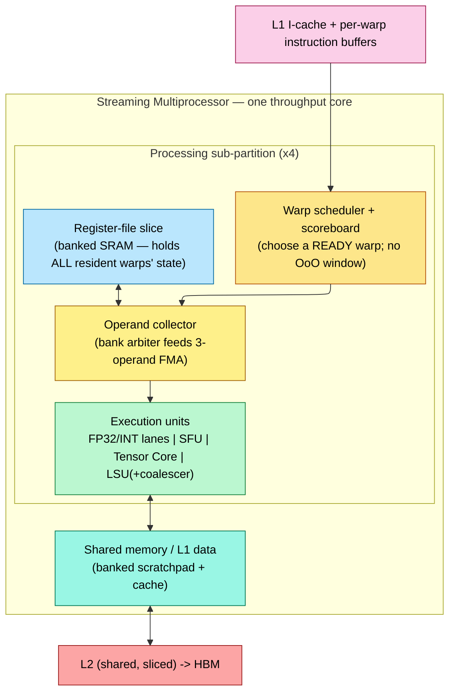

# GPU Architecture — The Throughput Machine and the Streaming Multiprocessor

> **Prerequisites:** [OoO_Execution](05_OoO_Execution.md) (the latency-hiding machine this page is defined *against* — the "which structure saturates first" framing and the ROB "derive what it must hold" method), [Cache_Microarchitecture](07_Cache_Microarchitecture.md) (MSHRs, sectored lines, banking), [Memory](09_Memory.md) (banked / multi-ported SRAM and register-file arrays), [Performance_Modeling_and_DSE §9](01_Performance_Modeling_and_DSE.md) (the roofline / occupancy model).
> **Hands off to:** [Full_Chip_Modeling §4.3](02_Full_Chip_Modeling.md) (GPU power/occupancy modeling — the HBM-bandwidth knee and the power-cap/DVFS loop), [06_Simulators/04_GPU_Simulators.md](06_Simulators/04_GPU_Simulators.md) (how a GPU is *simulated* — GPGPU-Sim / Accel-Sim), and the companion **AI-infra notebook** [silicon-to-serving](https://github.com/Wty2003328/silicon-to-serving) for vendor-microarchitecture depth ([Hopper/Blackwell SM](https://github.com/Wty2003328/silicon-to-serving/blob/main/L3_Microarchitecture/02_GPU_Architecture.md), [Blackwell](https://github.com/Wty2003328/silicon-to-serving/blob/main/L3_Microarchitecture/04_Blackwell_Architecture.md), tensor-core ISA) and CUDA-kernel programming ([L5 CUDA](https://github.com/Wty2003328/silicon-to-serving/blob/main/L5_Kernels_and_Programming/01_CUDA_Programming.md)).

---

## 0. Why this page exists

Everything else in this folder describes a **latency machine**: a CPU core spends most of its transistors — rename, ROB, issue queue, branch predictor, big caches ([OoO_Execution](05_OoO_Execution.md)) — buying down the time to finish *one* instruction stream. A GPU inverts the objective. It assumes it will *never* make a single thread fast, and instead makes the *aggregate* fast by keeping thousands of independent threads in flight so that whenever one stalls on memory, another is ready to issue. That single change of goal — **throughput per watt and per mm², not single-thread latency** — is what forces every structural difference: the warp, the SIMT stack, the enormous banked register file, the coalescer, the occupancy limits, the low clock.

This page takes the notebook's hardware-design lens ("*what must this block do or hold, and why — then what does that cost*", the method used for the ROB in [OoO_Execution §3](05_OoO_Execution.md)) and applies it to the GPU. It deliberately does **not** re-derive vendor microarchitecture (the Hopper/Blackwell SM, tensor-core MMA dataflow, `wgmma`/`tcgen05`, TMEM, TMA) or CUDA programming — those live in the companion AI-infra notebook and are cross-linked, not duplicated. The goal here is the *why*: given "hide latency with parallelism, not speculation," derive the machine.

---

## 1. Throughput, not latency — why the machine is shaped differently

Start from the constraint that decides everything. A DRAM access on a modern part costs several hundred core cycles (§7). A latency machine hides that gap with an out-of-order window: fetch far ahead, rename away false dependencies, and let ~100–300 in-flight instructions overlap the miss. But the window is bounded by the ROB/PRF/LSQ, and each extra slot costs quadratic port area and a longer wakeup path — the ILP you can buy this way saturates around a few instructions per cycle ([OoO_Execution §2.3, §3.2](05_OoO_Execution.md)).

**The throughput machine hides the same latency with a completely different resource: independent threads.** The amount of concurrency you must keep in flight to hide a latency at a target rate is a form of Little's law:

$$N_{\text{in-flight}} \;=\; \lambda \cdot L$$

where $\lambda$ = the rate at which the machine wants to *issue* the latency-bound operation (e.g. memory instructions/cycle) and $L$ = the latency being hidden (cycles). To hide a 400-cycle miss while issuing a memory op every few cycles, you need on the order of *hundreds* of independent operations queued — far more than one thread's ROB holds, but trivially available if you have thousands of resident threads. So the design answer is **massive multithreading**: hold so many threads' state on-chip that the scheduler always finds a ready one.

Two hardware arguments say this is the *cheaper* way to buy performance when the work is abundant and parallel:

- **Amortized control (why SIMT, §2).** A scalar OoO core pays its whole front end — fetch, decode, predict, rename, schedule — *per instruction stream*. If 32 threads are executing the same instruction, running them as one **warp** amortizes one fetch/decode/schedule over 32 lanes, spending the transistors on datapath and register state instead of 32 copies of control.
- **Diminishing returns on a single core (why many small cores).** Single-thread performance scales roughly as **Pollack's rule** — $\text{perf} \propto \sqrt{\text{area}}$ — because extra area goes into ever-deeper speculation. So doubling a core's area buys ~1.4× on one thread but ~2× if spent as *two* throughput cores running independent work. When the workload is thousands of independent lanes (graphics fragments, GEMM tiles, batched tokens), the many-small-cores design wins decisively on throughput per mm² and per watt.

The result is a machine of **many simple SIMT cores** (Streaming Multiprocessors, §4), each holding many warps, each warp lock-stepping 32 lanes — no rename, no ROB, no speculation past a branch, and a scoreboard instead of an issue window. It is optimal exactly when the work is abundant and data-parallel, and it is *terrible* at a single latency-bound serial thread — which is why real systems pair a CPU (latency) with a GPU (throughput). The rest of this page is the consequences of that one trade.

---

## 2. SIMT — amortizing the front end over 32 lanes

The **warp** (NVIDIA: 32 threads; AMD wavefront: 32 or 64) is the load-bearing design decision. One instruction is fetched, decoded, and scheduled *once* and executed on 32 datapath lanes in lock-step — Single-Instruction, Multiple-Thread. SIMT is *not* the same bargain as SIMD:

- **SIMD** (a CPU vector unit, [CPU_Architecture](03_CPU_Architecture.md)) exposes the vector *width to the programmer/compiler*: you write a 512-bit operation and are responsible for masking, alignment, and remainder loops.
- **SIMT** exposes a *scalar thread* programming model; the hardware groups threads into warps and lock-steps them. Each lane has its **own registers and its own memory address**, so lanes can follow data-dependent addresses and (with a cost, §3) data-dependent control flow. This is what makes GPUs pleasant to program relative to hand-vectorized SIMD, and it is a *hardware* choice: the SM builds per-lane register addressing and per-lane address generation into the datapath.

From "one instruction drives 32 lanes," derive what the hardware must hold for each warp:

1. **A single PC** (pre-Volta) or a convergence-optimized set of per-thread PCs (Volta+, §3) — the warp advances through the program together.
2. **An active mask** — 32 bits saying which lanes participate in this instruction (lanes are masked off at warp edges and under divergence).
3. **The full register state of every lane, for every resident warp at once** — because the whole latency-hiding scheme (§1) depends on switching warps for free, which is only possible if no context ever has to be saved/restored (§4, §5).

That third item is the expensive one and the reason the register file dominates the SM. Everything in §4–§5 follows from it.

---

## 3. Warp divergence and reconvergence — the hardware cost of the SIMT bargain

SIMT promises a scalar programming model, but the hardware issues *one* instruction per warp per cycle. So the moment a branch sends some lanes one way and the rest another, the machine faces a problem it must solve in hardware. Derive the mechanism the way we derived the ROB's fields ([OoO_Execution §3](05_OoO_Execution.md)) — from the jobs it must do:

1. **It must remember which lanes go which way.** A divergent branch splits the 32-bit active mask into a *taken* subset and a *not-taken* subset. Both subsets have work to do, but only one instruction can issue at a time — so the hardware must **serialize the paths**, executing one subset under a reduced mask while the other waits.
2. **It must know where the paths rejoin, so it can stop serializing.** Left alone, once-diverged lanes would run separate paths forever and the 32× throughput collapses permanently. Hardware picks the **immediate post-dominator (IPDOM)** of the branch — the first instruction *every* path must reach — as the reconvergence point, and re-merges the full mask there.
3. **It must nest correctly**, because a branch inside a branch splits an already-reduced mask.

The structure that satisfies all three is a **per-warp SIMT reconvergence stack**. Each entry is a triple `(next-PC, active-mask, reconvergence-PC)`. On a divergent branch the hardware pushes the two path entries plus the reconvergence entry; it executes each path with its reduced mask; when a path's PC hits the reconvergence-PC it pops, and when the stack unwinds to the reconvergence entry the full mask is restored. This is a genuine hardware block — a small stack SRAM per warp plus the mask-manipulation datapath — and it is what a GPU has *instead of* a branch predictor and misprediction-recovery machinery.

**The cost is throughput, and it is quantifiable.** While a warp runs a divergent region, masked-off lanes do no useful work, so the SIMT execution efficiency is

$$\eta_{\text{SIMT}} \;=\; \frac{\overline{\text{active lanes per issued instruction}}}{32}$$

A fully divergent 32-way branch (e.g. a `switch` on `threadIdx`) drops $\eta$ toward $1/32 \approx 3\%$ — the hardware still issues 32-wide but 31 lanes are dark. This is *the* first-order GPU performance rule and it is a direct consequence of amortizing one front end over 32 lanes: you save the control, you pay it back whenever the lanes disagree. Memory divergence (lanes wanting scattered addresses) is the same pathology one level down, and its hardware answer is the coalescer (§6).

**How often is that cost paid? Almost always, for a data-dependent branch.** Model each lane as taking the branch independently with probability $p$; the warp stays convergent only if all 32 lanes agree, so it diverges with probability

$$P_{\text{div}} \;=\; 1 - p^{32} - (1-p)^{32}$$

which is unforgiving: even a lightly-taken branch ($p=0.1$) diverges a warp **~97 %** of the time ($0.9^{32}\approx 0.034$), and a balanced one ($p=0.5$) essentially always. A data-dependent branch *inside* a warp is the common case, not the corner case — which is why hoisting branches to be uniform across a warp is a first-order rule, not a micro-optimization. Once split into a taken side of length $\ell_T$ and a not-taken side $\ell_N$ that run back-to-back, the region's efficiency is $\eta = (q\,\ell_T + (1-q)\,\ell_N)/(\ell_T+\ell_N)$ for a taken fraction $q$ — exactly $1/2$ for any balanced if-else, and multiplied down again by every *nested* level of divergence. The reconvergence stack bounds the damage (paths are guaranteed to re-merge at the IPDOM) but cannot erase it.

**Volta's Independent Thread Scheduling (ITS)** changed the *bookkeeping*, not the physics. Volta and later give each thread its own PC and call stack and let the scheduler interleave diverged sub-groups (so lanes on opposite sides of a branch can make forward progress and even communicate, fixing a class of starvation/deadlock bugs in fine-grained sync). But diverged paths still *execute serially* — ITS improves flexibility and correctness, not the $\eta_{\text{SIMT}}$ ceiling. The trade-off is more per-thread convergence-tracking state (per-thread PCs, a convergence optimizer) for programmability. The programmer-side lesson (keep control flow uniform within a warp) belongs to the companion's [CUDA-optimization page](https://github.com/Wty2003328/silicon-to-serving/blob/main/L5_Kernels_and_Programming/02_CUDA_Optimization.md); the hardware lesson is that reconvergence is a *paid-for* structure.

---

## 4. The Streaming Multiprocessor as a hardware block

The SM (AMD: Compute Unit) is the GPU's core — one throughput engine. Do not memorize its parts; *derive* them from the jobs §1–§3 hand it, exactly as the ROB's fields fell out of its three jobs:

1. **Keep enough independent warps resident to hide memory latency (§1).** ⇒ **warp slots** (a hardware cap on resident warps) and — the killer requirement — a **register file large enough to hold the live registers of *every* resident warp simultaneously**, so a warp switch is a pointer change with **zero save/restore** (§5). This is the opposite of a CPU, which context-switches by spilling registers to memory.
2. **Every cycle, pick a ready warp and issue it (§1, §3).** ⇒ **warp scheduler(s)** plus a **scoreboard** that marks a warp ineligible while its next instruction's source registers are still pending (a long-latency load in flight). No rename, no ROB — dependence is enforced by *not scheduling* a warp until its operands land, and latency is hidden by issuing *other* warps meanwhile.
3. **Feed wide datapaths with 3-operand instructions without a prohibitively multi-ported RF.** ⇒ a **banked register file + operand collector** (§5).
4. **Execute the actual instruction mix.** ⇒ **execution units**: FP32/INT ALU lanes (the "CUDA cores"), **SFUs** for transcendentals (`sin`, `exp`, `rsqrt`), **Load/Store Units** with the coalescer (§6), and **Tensor Cores** — dense matrix-multiply-accumulate (MMA) engines that amortize one issue slot over hundreds of thousands of FLOPs (the reason a GPU hits >100 TFLOPS/SM; their *internal* datapath and ISA are the companion's subject).
5. **Supply operands with on-chip reuse and lane-to-lane sharing.** ⇒ a **shared-memory / L1 pool**: a banked SRAM that is *part* software-managed scratchpad (explicit reuse, tiling) and *part* hardware cache.

Modern SMs partition items 2–4 into **processing sub-partitions** (typically 4), each with its own scheduler, RF slice, and execution lanes, so scheduling and operand delivery stay local and scale by replication rather than by ever-wider shared structures. Conceptually:

The unifying idea, and the reason to read the SM this way: **an SM is a machine that converts *resident parallelism* into *sustained issue*, and its throughput is set by whichever resource runs out first** — warp slots, registers, shared memory, an execution-unit's initiation interval, or memory bandwidth. That is the same "which structure saturates first" diagnosis as the OoO core ([OoO_Execution](05_OoO_Execution.md)) and exactly what a GPU timing simulator reports ([GPU_Simulators §2](06_Simulators/04_GPU_Simulators.md)). Vendor-specific counts (128 FP32/SM, 4 fourth-gen tensor cores/SM on Hopper, etc.) and the full annotated SM diagram are in the companion's [GPU_Architecture](https://github.com/Wty2003328/silicon-to-serving/blob/main/L3_Microarchitecture/02_GPU_Architecture.md).

---

## 5. The register file and operand delivery — the SM's defining structure

The SM's largest and most characteristic SRAM is not a cache — it is the **register file**. A datacenter-class SM holds **256 KB of registers (65,536 × 32-bit)**, *bigger than its L1*. That inversion is the whole point of §1: the RF must hold **all resident threads' registers at once** so that switching warps costs nothing. Size it: with $W_{\max}$ resident warps of 32 lanes each using $r_t$ registers per thread,

$$R_{\text{needed}} \;=\; W_{\max}\cdot 32 \cdot r_t \quad(\times 4\,\text{B})$$

where $W_{\max}$ = hardware warp-slot cap (e.g. 64), $r_t$ = registers/thread. At 64 warps × 32 lanes × 32 registers × 4 B = 256 KB — which is exactly why the file is that big. The zero-cost context switch that makes latency-hiding work is *bought* with this SRAM.

You cannot build a 256 KB SRAM with enough true ports to feed 32 lanes × 3 operands (FMA: $a\cdot b+c$) every cycle — a true multi-ported array's area grows as $O(\text{ports}^2)$ ([Memory](09_Memory.md) on multi-port SRAM). So the RF is built from **many single-ported banks** (4-byte interleaved, ~32 banks), and an **operand collector** arbitrates bank accesses across cycles to assemble each instruction's operands. When two operands a warp needs live in the same bank, they **bank-conflict** and serialize — a real, if second-order, throughput limiter that good register allocation avoids. This is the same area-vs-bandwidth trade as the CPU PRF ([OoO_Execution §2.3](05_OoO_Execution.md)), pushed to an extreme by the 32-wide, all-threads-resident requirement.

The consequence that ripples upward: **registers-per-thread is a hard cap on how many warps can be resident**, hence on how much latency the SM can hide. A kernel that uses 64 registers/thread can keep at most half the warps of one that uses 32 — this is the register term of the occupancy limit in §7, and it is why "register pressure" is a first-order GPU tuning knob.

---

## 6. Memory coalescing — why it exists and the hardware that does it

Section 3 was control divergence; this is its memory twin. A single warp LD/ST presents **32 independent byte addresses** (SIMT gives every lane its own address, §2). But DRAM and caches do not move bytes — they move **fixed-granularity blocks**: GPUs transact global memory in **32-byte sectors**, four of which make a 128-byte L1 line. If the hardware naively issued one transaction per lane, a warp load would cost up to 32 transactions and waste most of the bytes fetched.

**The coalescer** — a hardware unit in the Load/Store Unit — exists to prevent that. It inspects the 32 active per-lane addresses *at issue time* and merges them into the **minimum set of aligned sector transactions** that covers them:

$$N_{\text{txn}} \;=\; \Big|\big\{\ \lfloor a_i / G \rfloor \;:\; i \in \text{active lanes}\ \big\}\Big|$$

where $a_i$ = byte address of lane $i$ and $G$ = transaction granularity (32 B). Best case — 32 lanes read 32 consecutive 4-byte words — the addresses fall in one or a few sectors and the warp is served in the fewest transactions (a 128-byte line = 4 sectors, fully utilized). Worst case — a scattered/strided pattern — every lane lands in a different sector and $N_{\text{txn}}$ explodes toward 32, so the warp fetches up to 32× the bytes it uses and effective bandwidth collapses by the same factor.

Formalized, this is the memory analogue of $\eta_{\text{SIMT}}$ (§3): with $n_a$ active lanes each consuming $w$ bytes, the fraction of moved bytes actually used is

$$\varepsilon \;=\; \frac{n_a\,w}{N_{\text{txn}}\cdot G}$$

which is **1** for a stride-1 float warp ($32\times4 / (4\times32)$) and as low as **1/8** when each lane lands in its own 32-byte sector to use 4 bytes ($32\times4 / (32\times32)$). Coalescing is thus the same "keep the 32 lanes in agreement" discipline as branch convergence, moved from the control plane to the address plane — and the two efficiencies multiply (§10).

Why is this *hardware* and not a compiler job? Because the addresses are generally **data-dependent and known only at runtime** (`a[idx[i]]`), so only the LSU, at issue, can see the actual address vector and decide the transaction set. The design cost is the address-compare/merge logic and the sector-tracking in the LSU — modest silicon that turns the difference between 1 and 32 transactions. The *programmer's* half of this contract (lay out data so consecutive lanes touch consecutive addresses) is the companion's [CUDA-optimization](https://github.com/Wty2003328/silicon-to-serving/blob/main/L5_Kernels_and_Programming/02_CUDA_Optimization.md) topic; the *hardware's* half — the sectored line and the coalescer — is the reason it matters. It is the exact analogue at the SM boundary of the row-buffer/burst structure that a DRAM controller exploits ([DDR_Controller](10_DDR_Controller.md)), and simulators model the *post-coalesce* access count as what actually hits the caches ([GPU_Simulators §3](06_Simulators/04_GPU_Simulators.md)).

---

## 7. The memory hierarchy and occupancy — resource-limited concurrency

A GPU's hierarchy is shaped, like everything else, by throughput. From the lane outward:

- **Registers** (§5) — per-thread, the only truly cheap operand.
- **Shared memory / L1** — a per-SM banked SRAM, split (configurably, up to ~228 KB as shared memory on Hopper-class parts out of a 256 KB structure) between a **software-managed scratchpad** (explicit reuse/tiling — the programmer stages a tile once and reuses it, saving HBM traffic) and a **hardware L1 cache**. The scratchpad half is a GPU-specific idea: because the compiler/programmer knows the reuse pattern of a GEMM tile, an *addressed* SRAM beats a cache that would thrash.
- **L2** — one **shared, sliced/banked** cache across all SMs (tens of MB), address-hashed across slices to avoid a few hot slices serializing traffic (partition camping), the on-die analogue of DRAM bank-hashing ([DDR_Controller](10_DDR_Controller.md)); traffic to it crosses the on-chip crossbar/NoC ([Network_on_Chip](13_Network_on_Chip.md)).
- **HBM** — stacked DRAM behind many controllers, delivering **multi-TB/s** of bandwidth that is a **single pool shared by every SM**. It is the first-class resource of the whole design, and the reason the memory hierarchy exists at all is to keep as much traffic as possible *off* it.

**Occupancy** ties this back to §1. It is the ratio of resident warps to the hardware maximum, and it is *capped by whichever per-SM resource runs out first*:

$$\text{warps}_{\text{resident}} = \min\!\Big(\underbrace{\big\lfloor \tfrac{R_{\max}}{32\,r_t}\big\rfloor}_{\text{registers}},\; \underbrace{\big\lfloor \tfrac{S_{\max}}{s_b}\big\rfloor\cdot w_b}_{\text{shared memory}},\; \underbrace{W_{\max}}_{\text{warp slots}},\; \underbrace{B_{\max}\cdot w_b}_{\text{block slots}}\Big), \qquad \text{occupancy} = \frac{\text{warps}_{\text{resident}}}{W_{\max}}$$

where $R_{\max}$ = registers/SM, $r_t$ = registers/thread, $S_{\max}$ = shared memory/SM, $s_b$ = shared memory/block, $w_b$ = warps/block, $W_{\max}$ = warp-slot cap (e.g. 64 = 2048 threads), $B_{\max}$ = resident-block cap. **This is the concrete "which resource saturates first" of §4**: registers (§5), shared memory, or slots — spend too much of any one per thread/block and resident parallelism, hence latency-hiding, drops.

The subtlety that closes the loop with the roofline ([Performance_Modeling_and_DSE §9](01_Performance_Modeling_and_DSE.md)): **occupancy is a *ceiling on latency-hiding, not throughput itself.*** By Little's law (§1) you need enough resident warps to cover memory latency — but *past* that point, more warps buy nothing, because performance is then set by whether you are left or right of the roofline knee:

$$\text{Perf} = \min\!\big(\text{Peak FLOP/s},\; I \cdot B_{\text{HBM}}\big), \qquad I^\star = \frac{\text{Peak FLOP/s}}{B_{\text{HBM}}}$$

where $I$ = arithmetic intensity (useful FLOP per byte moved from HBM) and $I^\star$ = the knee. Right of the knee (low reuse) the kernel is **HBM-bound** and *every* SM stalls on the same shared pool — adding occupancy or SMs only adds contention, the collapse quantified in [Full_Chip_Modeling §4.3](02_Full_Chip_Modeling.md). Left of it, you are compute-bound and want the tensor cores busy. This is why "maximize occupancy" is a rule of thumb, not a law: you need *enough* to hide latency and *reuse* (via shared memory) to move the knee — not the last few percent of warps.

---

## 8. Clocking and power at throughput — why wide-and-slow wins

A GPU runs at **~1–2 GHz**; a CPU core at **3–5+ GHz**. That is a *deliberate* design choice, and it falls straight out of the power model. Dynamic power is

$$P_{\text{dyn}} = \alpha\,C\,V^2 f, \qquad \text{and since } V \text{ must rise with } f \text{ to meet timing},\; P_{\text{dyn}} \sim f^{3}$$

where $\alpha$ = activity factor, $C$ = switched capacitance, $V$ = supply voltage, $f$ = clock. Now hold *throughput* fixed. Throughput is roughly $T \approx N_{\text{lanes}} \cdot f$. A latency machine has few lanes and buys performance with high $f$ — paying cubically. A throughput machine buys the same $T$ with **many lanes at low $f$**, paying only *linearly* in lane count (area) while each lane sits at an efficient low-voltage point. For a workload that offers thousands of independent lanes, **wide-and-slow is dramatically better perf-per-watt than narrow-and-fast** — which is the entire economic case for the GPU. Concretely, at fixed throughput the energy per operation scales as $V^2 \propto f^2$, so a lane clocked at ~1.5 GHz spends on the order of $(1.5/4.5)^2 \approx 1/9$ the switching energy of a 4.5 GHz CPU lane doing the same work — *before* counting the front-end control SIMT already amortized away (§2). Two multiplicative wins from one choice. The low clock also relaxes the timing pressure that forces a CPU to spend area on deep pipelines and speculative recovery.

The flip side is **power density**: an SM is almost all active datapath and register SRAM, so a full die is a very dense, very hot power source. That makes the GPU a **power- and thermal-capped** device: board power is limited (`nvidia-smi -pl`), and a Boost/DVFS controller continuously picks the highest clock such that $P \le P_{\text{cap}}$ and $T \le T_{\text{limit}}$. A compute-heavy (tensor-core) phase raises current and the controller *lowers* the clock to stay under the cap; a memory-bound phase draws less core power and may clock *up* (which does not help, since HBM is the bottleneck). Modeling that perf↔power↔thermal loop correctly — rather than quoting peak-TFLOPS × peak-clock × all-SMs — is the job of [Full_Chip_Modeling §3, §4.3](02_Full_Chip_Modeling.md).

Finally, **data-movement energy is the real budget.** Reading an operand from the register file costs a fraction of a pJ; from shared memory a bit more; from L2 more; from **HBM ~1–2 orders of magnitude more per byte** than on-chip, and off-package (NVLink/PCIe) more still ([Full_Chip_Modeling §4.3](02_Full_Chip_Modeling.md) gives representative pJ/bit). So the memory hierarchy of §7 exists **as much to save energy as to save time**: every byte kept in the register file or shared-memory scratchpad instead of HBM is both faster *and* cheaper, and at throughput scale the energy term dominates the design.

---

## 9. Numbers to memorize

| Quantity | Value | Why it matters |
|---|---|---|
| Warp width | 32 threads (SIMT lock-step) | the unit of fetch/schedule; the divergence granularity |
| Concurrency to hide latency | $N=\lambda L$ (Little's law) | why GPUs need *thousands* of resident threads, not an ROB |
| Single-thread scaling | $\text{perf}\propto\sqrt{\text{area}}$ (Pollack) | why many small cores beat one big OoO core for parallel work |
| SIMT efficiency | $\eta=\overline{\text{active lanes}}/32$ | full 32-way divergence $\to \sim 3\%$ throughput |
| Register file / SM | 256 KB (65,536 × 32-bit) | holds *all* resident warps $\to$ zero-cost warp switch |
| Combined L1 / shared mem / SM | ~256 KB (up to ~228 KB as smem, Hopper) | the reuse pool that keeps traffic off HBM |
| Resident warps / SM (cap) | up to 64 (= 2048 threads) | the warp-slot term of occupancy |
| Global memory transaction | 32-byte sector (128-byte = 4 sectors) | the coalescer's granularity; 1 vs 32 transactions |
| Occupancy | $\min$(registers, smem, warp slots, blocks) | resource-limited latency-hiding ceiling |
| Roofline knee | $I^\star=\text{Peak}/B_{\text{HBM}}$ | left = compute-bound, right = HBM-bound |
| GPU clock | ~1–2 GHz (vs CPU 3–5 GHz) | wide-and-slow: $P\sim f^3$, so throughput/W wins low |
| H100 (Hopper) | 132 SMs, 80 GB HBM3 @ >3 TB/s, 700 W, 80 B tr. | the datacenter reference part |
| B200 (Blackwell) | dual-die (208 B tr.), 192 GB HBM3e @ 8 TB/s, 5th-gen TC | the 2025–26 frontier; FP4 for AI throughput |

---

## 10. Worked problems

**1 — Occupancy is a *min*, and registers usually bind it (§5, §7).** An SM has $R_{\max}=65{,}536$ registers and $W_{\max}=64$ warp slots (2048 threads). A kernel compiles to $r_t=64$ registers/thread, so the register term caps residency at $\lfloor 65{,}536/(32\times 64)\rfloor = 32$ warps → occupancy $=32/64=50\%$: registers bind well before the slot cap. Recompiling to $r_t=32$ doubles the cap to $\lfloor 65{,}536/1024\rfloor=64$ warps $=100\%$. This is why registers/thread (`__launch_bounds__` / `maxrregcount`) is the highest-leverage occupancy knob — the file is fixed, so every register a thread holds is subtracted directly from latency-hiding depth (§5).

**2 — How many warps actually hide the latency (Little's law, §1, §7).** A warp that issues one global load and then waits $L\approx 400$ cycles contributes only $\approx 1/400$ instr/cycle, so feeding a scheduler that wants 1 instr/cycle from stalled warps alone would need ~400 of them — six times the 64-slot cap. Slots alone cannot hide DRAM. The escape is *per-warp* parallelism: if each warp keeps $k\approx 6$ independent instructions (ILP) or several loads (MLP) in flight before it must wait, the requirement falls to $\approx 400/6 \approx 67$ warps ≈ the cap. So $\lambda L$ is met by *slots × per-warp parallelism together* — the precise reason "just raise occupancy" is only half the story (§7).

**3 — Which side of the roofline, and why $B_{\text{HBM}}$ keeps growing (§7).** An H100-class part: FP16 tensor peak $\approx 990$ TFLOP/s, HBM3 $\approx 3.35$ TB/s → knee $I^\star = 990/3.35 \approx 295$ FLOP/byte. A fused-attention kernel at $I\approx 200$ sits *left* of the knee (compute-bound) — spend effort on tensor-core utilization, not more warps. A vector-add at $I\approx 0.1$ FLOP/byte sits far *right*: it can reach only $0.1\times 3.35 \approx 0.34$ TFLOP/s, ~0.03 % of peak, and no amount of occupancy helps — only raising $I$ by shared-memory reuse does. This is also why each generation lifts $B_{\text{HBM}}$ (H100 3.35 → B200 8 TB/s) and adds low-precision formats (FP4): both pull the knee so more kernels land on the compute side.

**4 — The two first-order penalties multiply (§3, §6).** A kernel branches on `data[i]` (≈ 50 % of lanes taken, equal-length arms) and reads `src[idx[i]]` through an indirection. Divergence gives $\eta_{\text{SIMT}}\approx 1/2$; the scatter gives coalescing efficiency $\varepsilon\approx 1/8$ (each lane in its own sector). They compose to effective throughput $\approx \tfrac12\times\tfrac18 = 1/16$ of peak. Because the two factors are independent, hoisting the branch and coalescing the access each recover their factor on their own — which is why *uniform control flow* and *coalesced access* are the two rules every GPU kernel is tuned against first.

---

## Cross-references

- **Down the stack:** [Memory](09_Memory.md) (the banked / multi-ported SRAM and register-file arrays the RF and shared memory are built from), [Cache_Microarchitecture](07_Cache_Microarchitecture.md) (MSHRs and sectored lines behind L1/L2), [DDR_Controller](10_DDR_Controller.md) (the HBM/GDDR device and controller behind the bandwidth pool), [Network_on_Chip](13_Network_on_Chip.md) (the SM↔L2 crossbar/mesh contention layer).
- **Up / across the stack:** [OoO_Execution](05_OoO_Execution.md) (the latency machine this is defined against, and the "derive what it must hold / which structure saturates first" method borrowed here), [Performance_Modeling_and_DSE §9](01_Performance_Modeling_and_DSE.md) (the roofline/occupancy model), [Full_Chip_Modeling §4.3](02_Full_Chip_Modeling.md) (**GPU power/occupancy modeling** — the HBM knee under the power-cap/DVFS loop; SM→GPC→chip roll-up in §4.1), [06_Simulators/04_GPU_Simulators.md](06_Simulators/04_GPU_Simulators.md) (**how a GPU is simulated** — GPGPU-Sim/Accel-Sim SIMT-core timing, coalescer, occupancy), [Root Index](../Index.md).
- **Companion notebook (AI-infra, not duplicated here):** vendor microarchitecture and kernels live in [silicon-to-serving](https://github.com/Wty2003328/silicon-to-serving) — [L3 GPU_Architecture](https://github.com/Wty2003328/silicon-to-serving/blob/main/L3_Microarchitecture/02_GPU_Architecture.md) (the annotated Hopper/Blackwell SM, tensor cores, TMA/TMEM), [L3 Blackwell](https://github.com/Wty2003328/silicon-to-serving/blob/main/L3_Microarchitecture/04_Blackwell_Architecture.md) (FP4/MX, 5th-gen TC, NV-HBI), [L3 ISA_and_Execution_Model](https://github.com/Wty2003328/silicon-to-serving/blob/main/L3_Microarchitecture/01_ISA_and_Execution_Model.md) (PTX vs SASS, warp semantics), and the [L5 kernel pages](https://github.com/Wty2003328/silicon-to-serving/blob/main/L5_Kernels_and_Programming/01_CUDA_Programming.md) — [CUDA optimization](https://github.com/Wty2003328/silicon-to-serving/blob/main/L5_Kernels_and_Programming/02_CUDA_Optimization.md) (coalescing, bank conflicts, occupancy tuning) and [tensor-core programming](https://github.com/Wty2003328/silicon-to-serving/blob/main/L5_Kernels_and_Programming/03_Tensor_Core_Programming.md) (WMMA→`wgmma`→`tcgen05`).

---

## References

- Lindholm, Nickolls, Oberman, Montrym. *NVIDIA Tesla: A Unified Graphics and Computing Architecture.* IEEE Micro, 2008. (The origin of SIMT and the warp.)
- Fung, Sham, Yuan, Aamodt. *Dynamic Warp Formation and Scheduling for Efficient GPU Control Flow.* MICRO 2007. (Divergence, the reconvergence stack, IPDOM.)
- NVIDIA. *NVIDIA H100 Tensor Core GPU Architecture* (Hopper whitepaper) and *NVIDIA Hopper Architecture In-Depth.* 2022. [[blog]](https://developer.nvidia.com/blog/nvidia-hopper-architecture-in-depth/) — 132 SMs, 128 FP32/SM, 256 KB RF/SM, 256 KB L1+smem/SM, 50 MB L2, 80 GB HBM3 @ >3 TB/s, 700 W.
- NVIDIA. *NVIDIA Tesla V100 GPU Architecture* (Volta whitepaper), 2017. (Independent Thread Scheduling: per-thread PC and reconvergence.)
- NVIDIA. *CUDA C++ Programming Guide* — SIMT architecture, independent thread scheduling, coalesced global-memory access (32-byte sectors). [[docs]](https://docs.nvidia.com/cuda/cuda-programming-guide/)
- Xu, Sun, et al. *Microbenchmarking NVIDIA's Blackwell Architecture: An In-Depth Architectural Analysis.* arXiv:2512.02189, 2025. [[html]](https://arxiv.org/html/2512.02189v1) — dual-die 208 B transistors, 192 GB HBM3e, TMEM 256 KB/SM, 5th-gen tensor cores (`tcgen05`), measured FP4/FP8 throughput.
- Modal. *GPU Glossary — Memory Coalescing*, and Cornell Virtual Workshop, *Understanding GPU Architecture — SIMT and Warps.* [[coalescing]](https://modal.com/gpu-glossary/perf/memory-coalescing) · [[SIMT]](https://cvw.cac.cornell.edu/gpu-architecture/gpu-characteristics/simt_warp)
- Hennessy & Patterson. *Computer Architecture: A Quantitative Approach*, 6th ed. (Ch. 4, data-level parallelism and GPUs; the throughput-vs-latency and Pollack's-rule framing.)
