# ACE and CHI -- AMBA Coherence Extensions Beyond AXI

> **Prerequisites:** [AHB_AXI_APB.md](AHB_AXI_APB.md) (AXI4 channels and handshake rules),
> [CPU_Architecture.md](CPU_Architecture.md) (MESI protocol, cache hierarchy),
> [Memory.md](Memory.md) (SRAM/DRAM timing)
>
> **Hands-off to:** SoC interconnect design, ARM Neoverse subsystem, NoC topology

---

## 0. Why This Page Exists

AXI4 gives you five independent channels, outstanding transactions, out-of-order
completion, and burst support. What it does **not** give you is any mechanism for
keeping caches coherent across multiple masters. When two CPU cores both cache
address `0x8000_1000` and one of them writes to it, AXI4 has no built-in way to
invalidate or update the other copy.

This page covers two AMBA extensions that solve that problem:

- **ACE** (AXI Coherence Extensions, AMBA 4) -- adds snoop channels on top of
  AXI4 for bus-based snooping coherence. Targets 2--8 core mobile SoCs
  (Cortex-A55/A78 clusters).
- **CHI** (Coherent Hub Interface, AMBA 5) -- a clean-sheet packet-based
  coherent interconnect with directory-based coherence. Targets 8--128+ core
  server SoCs (Neoverse N1/V1/V2, Graviton).

Understanding both is essential for system-level interview questions and for
reading ARM reference manuals.

---

## 1. The Coherence Problem in Multi-Core SoCs

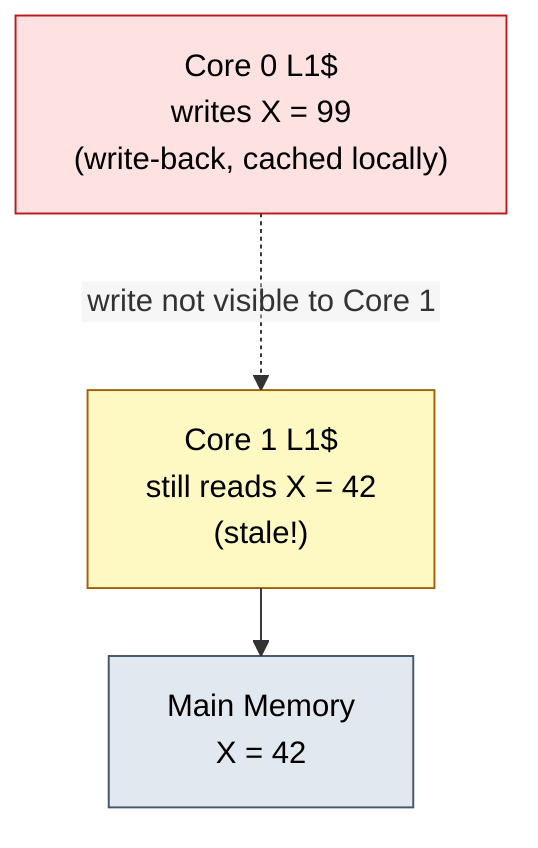

**Solutions**

1. Software — cache-maintenance instructions (clean, invalidate): slow, error-prone, not scalable.
2. Hardware — snooping protocol on the interconnect: transparent to software, the whole point of ACE/CHI.

---

## 2. ACE (AXI Coherence Extensions)

### 2.1 What ACE Adds to AXI4

ACE retains all five AXI4 channels (AW, W, B, AR, R) and adds three snoop
channels plus two acknowledgment signals:

| Channel | Full Name            | Direction              | Purpose                                        |
|---------|----------------------|------------------------|------------------------------------------------|
| AC      | Snoop Address        | Interconnect -> Master | Address to snoop in the master's cache          |
| CR      | Snoop Response       | Master -> Interconnect | Response: Hit, Miss, Data, Shared, Clean, etc.  |
| CD      | Snoop Data           | Master -> Interconnect | Cache line data returned on a snoop hit         |
| RACK    | Read Acknowledge     | Master -> Interconnect | Confirms master has consumed read data           |
| WACK    | Write Acknowledge    | Master -> Interconnect | Confirms master has consumed write response      |

```ascii-graph
ACE Master (e.g., CPU core with L1$)

  AW, W, B  -->  (write channels, same as AXI4)
  AR, R     -->  (read channels, same as AXI4)
  AC        <--  (interconnect snoops this master)
  CR, CD    -->  (master responds to snoop)
  RACK      -->  (acknowledge read data received)
  WACK      -->  (acknowledge write response received)

The interconnect acts as a snoop filter and coherence manager.
It forwards AC snoops to all (or a subset of) ACE masters when
any master issues a coherence transaction.
```

### 2.2 ACE-Lite (IO Coherence)

ACE-Lite provides one-way coherence: an IO master (DMA, GPU) can participate
in coherence **without** being snooped. It has no AC/CR/CD channels.

ACE-Lite master indicates shareability on each transaction:
ARCACHE/AWCACHE encode cacheability and shareability attributes.
The interconnect performs snooping of full ACE masters on behalf of
the ACE-Lite master, ensuring the IO device sees coherent data.

**Use cases:**
   - DMA engine reading/writing shared memory
   - GPU reading textures that the CPU may have modified
   - Network processor accessing shared packet buffers

**ACE-Lite master requirements:**
   - No cache of its own (or cache that does not need snooping)
   - Correctly marks shareability domain on every transaction

### 2.3 Shareability Domains

ACE defines four shareability domains, carried in AxCACHE and AxDOMAIN:

| Domain           | AxDOMAIN | Meaning                                                      |
|------------------|----------|--------------------------------------------------------------|
| Non-shareable    | 00       | Only this master accesses this address. No snooping needed.  |
| Inner Shareable  | 10       | Shared within an inner domain (e.g., CPU cluster).           |
| Outer Shareable  | 11       | Shared across inner and outer domains (e.g., multiple clusters). |
| System           | (N/A)    | Shared across the entire system.                             |

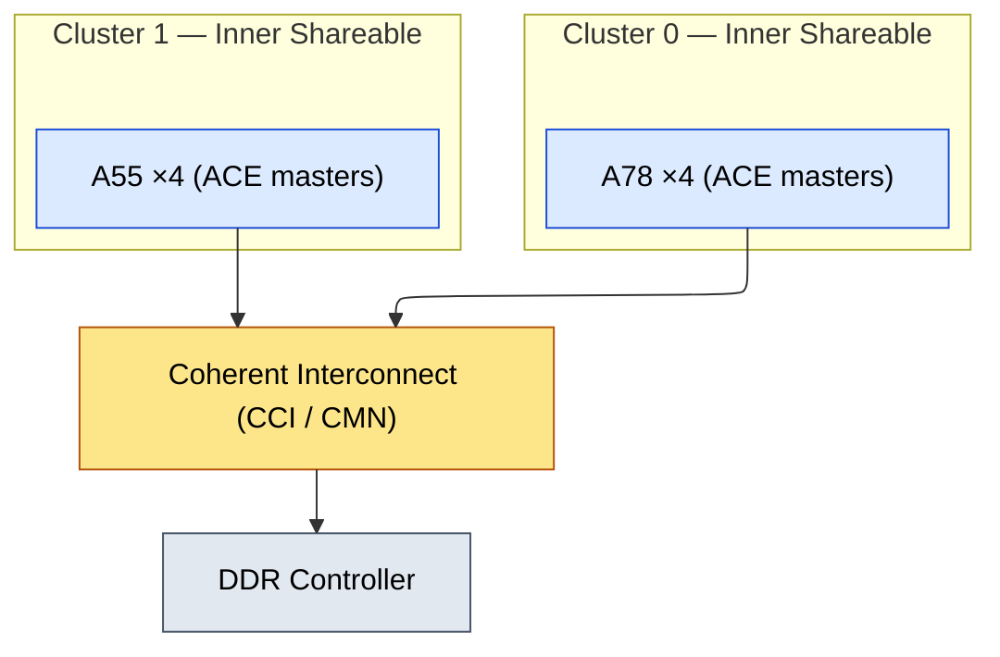

- **Inner Shareable** — data coherent only within one cluster
- **Outer Shareable** — data coherent across both clusters
- **Non-shareable** — private to one core (e.g., stack, TLB)

### 2.4 Barrier Transactions

ACE carries barrier semantics as first-class transactions:

| Barrier | Full Name                  | Effect                                                   |
|---------|----------------------------|----------------------------------------------------------|
| DMB     | Data Memory Barrier        | All explicit memory accesses before DMB complete before any after |
| DSB     | Data Synchronization Barrier | Like DMB, but also waits for cache maintenance and TLB ops |
| Read/Write Barrier | Per-transaction | AxBAR signals indicate barrier ordering requirements |

```verilog
Why barriers on the bus?

  CPU executes:  STR [X], DMB, STR [Y]
  Without barrier: writes may be reordered by the interconnect
    -> another core sees [Y] updated but [X] stale
  With DMB: the interconnect ensures STR [X] reaches its
    destination before STR [Y] is issued
  This is the hardware mechanism behind ARM's DMB/DSB instructions.
```

---

## 3. ACE Transactions -- Detailed

### 3.1 Transaction Types and Cache State Model

ACE uses MOESI-style coherence states. Each transaction type maps to a
specific MESI state transition:

| Transaction   | Purpose                                               | MESI Transition       |
|---------------|-------------------------------------------------------|-----------------------|
| ReadShared    | Read a line, willing to share with others             | I -> S or I -> E      |
| ReadClean     | Read a line, will not modify (need clean copy)        | I -> S                |
| ReadUnique    | Read a line exclusively, will modify                  | I -> M, others S->I   |
| ReadOnce      | One-time read, no caching                            | I -> I (no allocation)|
| MakeUnique    | Get exclusive ownership without data (full-line write)| others S/E->I         |
| CleanUnique   | Get exclusive ownership, dirty data written back      | others S/E/M->I       |
| CleanShared   | Ensure other copies are cleaned (written back)        | others M->S, E->S     |
| CleanInvalid  | Ensure other copies are invalidated                   | others S/E/M->I       |
| Evict         | Write back and invalidate a local line                | M -> I (writeback)    |

### 3.2 ReadShared Transaction Flow

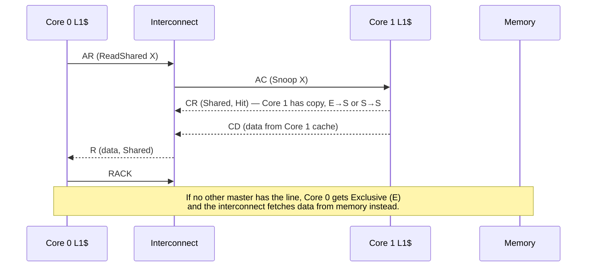

### 3.3 ReadUnique Transaction Flow (Before Write)

```mermaid
%%{init: {"flowchart": {"defaultRenderer": "elk", "nodeSpacing": 60, "rankSpacing": 60, "htmlLabels": false}}}%%
sequenceDiagram
    participant C0 as Core 0 L1$
    participant IC as Interconnect
    participant C1 as Core 1 L1$
    participant M as Memory
    C0->>IC: AR (ReadUnique X)
    IC->>C1: AC (Snoop X)
    C1-->>IC: CR (Data, Dirty) — Core 1 had M copy: M→I
    C1-->>IC: CD (cache line)
    IC-->>C0: R (data, Unique)
    C0->>IC: RACK
    Note over C0,M: Core 0 now has Unique/Modified; Core 1's copy invalidated.<br/>Dirty data was passed via CD (cache-to-cache).
```

### 3.4 MakeUnique and CleanUnique

```verilog
MakeUnique (full-line write -- core will overwrite all bytes):
  Core 0 sends MakeUnique -> Interconnect sends AC to all other masters
  Other masters invalidate their copies (CR = PassDirty if they had M)
  No data transfer needed (core will overwrite everything)
  Core 0 gets Unique/Modified state

CleanUnique (partial write -- core needs current data before modifying):
  Core 0 sends CleanUnique -> Interconnect sends AC to all other masters
  If another master has dirty data: CD returns the dirty line
  Other masters transition to Invalid
  Core 0 gets the data + Unique/Modified state

Why two variants?
  MakeUnique saves bandwidth: no need to fetch the current line contents
  if the core will overwrite every byte. Common for memset/memcpy.
  CleanUnique is needed for RMW: core modifies some bytes, needs rest.
```

---

## 4. ACE Coherence Protocol -- Complete Trace Example

### 4.1 Three-Core Trace: ReadShared, ReadShared, ReadUnique

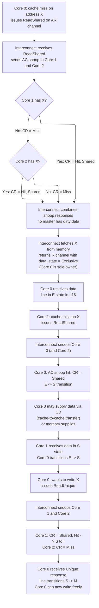

### 4.2 Channel Activity Timing Diagram

```verilog
Cycle:    1     2     3     4     5     6     7     8     9    10    11

--- ReadShared X (Core 0) ---
AR(C0):  |RS X |
              |AC X |      to C1
              |AC X |      to C2
                        |CR Miss|   from C1
                        |CR Miss|   from C2
                              |R data S|    from memory
                                     |RACK|

--- ReadShared X (Core 1) ---           (Core 0 has E -> will share)
                                     |AR RS X|  from C1
                                          |AC X| to C0
                                               |CR Hit S| from C0
                                               |CD data | from C0
                                                  |R data S| to C1
                                                         |RACK|

--- ReadUnique X (Core 0) ---
                                                         |AR RU X|
                                                            |AC X| to C1
                                                            |AC X| to C2
                                                                 |CR Hit| C1
                                                                 |CR Miss|C2
                                                                   |R data U|
                                                                        |RACK|
```

---

## 5. CHI (AMBA 5 Coherent Hub Interface)

### 5.1 Why CHI Replaces ACE for Large Systems

```verilog
ACE limitation: bus-based snooping.
  Every coherence transaction broadcasts an AC snoop to ALL masters.
  With N masters, snoop bandwidth = O(N) per transaction.
  Total snoop bandwidth = O(N * traffic_per_master) = O(N^2).
  Practical limit: ~4-8 ACE masters before snoop traffic saturates the bus.

CHI solution: packet-based, directory-assisted coherence.
  A Home Node (HN) maintains a directory (or snoop filter) tracking
  which Request Nodes (RN) hold each cache line.
  On a coherence request, HN sends targeted snoops only to nodes that
  may have the line. Unnecessary snoops are eliminated.
  Snoop bandwidth = O(K) where K = number of actual sharers (typically 1-3).
  Scales to 64-128+ cores.
```

### 5.2 CHI Component Model

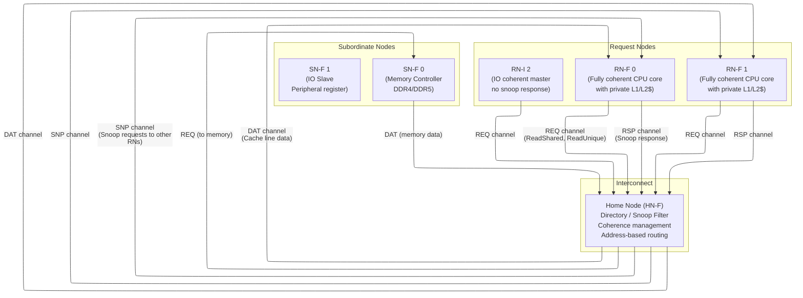

| Component | Full Name           | Role                                                     |
|-----------|---------------------|----------------------------------------------------------|
| RN-F      | Request Node, Full  | Fully coherent master (CPU core with cache). Can be snooped. |
| RN-I      | Request Node, IO    | IO-coherent master (DMA, GPU). No cache, cannot be snooped. |
| HN-F      | Home Node, Full     | Coherence manager. Holds directory/snoop filter. Routes requests. |
| HN-I      | Home Node, IO       | Non-coherent home for IO transactions.                   |
| SN-F      | Subordinate Node    | Memory controller or downstream slave.                    |
| SF        | Snoop Filter        | Tracks which RNs hold each line. Reduces unnecessary snoops. |

### 5.3 CHI Channels

CHI uses four logical channels, each with dedicated credit-based flow control:

| Channel | Direction         | Purpose                                          | Key Fields                       |
|---------|-------------------|--------------------------------------------------|----------------------------------|
| REQ     | RN -> HN          | Coherence request (read, write, evict)           | SrcID, TgtID, Opcode, Addr, Size |
| SNP     | HN -> RN          | Snoop request to other caches                    | SrcID, TgtID, Opcode, Addr       |
| RSP     | RN -> HN, HN -> RN | Responses (acknowledgments, snoop responses)    | SrcID, TgtID, Opcode, Resp       |
| DAT     | SN -> HN, HN -> RN | Data transfer (cache lines, write data)          | SrcID, TgtID, Data, BE, CC       |

```text
A "flit" (flow control unit) is one packet on a channel.
CHI packets are wider than AXI signals (typically 128-256 bits per flit)
and carry all fields in a single cycle (single-flit packets for most ops).

Flow control is credit-based (not valid/ready like AXI). The receiver
allocates credits to the sender at link init. Each flit consumes one
credit. The sender may only transmit when it has credits available.
The receiver returns credits after consuming the flit. See Section 5.7
for full details.

Note: CHI Issue A used valid/ready (TXREQFLITV/TXREQFLITREADY, etc.)
but this was replaced by credit-based flow control from Issue B onward.
```

### 5.4 CHI Transaction Types

| Opcode           | Type    | Meaning                                              |
|------------------|---------|------------------------------------------------------|
| ReadShared       | Request | Read line, shared state (like ACE ReadShared)        |
| ReadUnique       | Request | Read line, exclusive for writing                     |
| ReadOnce         | Request | One-time read, no allocation in requestor's cache    |
| CleanUnique      | Request | Get exclusive ownership, need current data           |
| MakeUnique       | Request | Get exclusive ownership, no data needed              |
| Evict            | Request | Write back and invalidate a line from cache          |
| WriteBack        | Request | Write dirty data back to memory/home                 |
| WriteEvictFull   | Request | Write + evict (combined writeback and invalidate)    |
| SnpShared        | Snoop   | Snoop for shared state, requestor wants to share     |
| SnpUnique        | Snoop   | Snoop for unique state, requestor wants exclusive    |
| SnpInv           | Snoop   | Invalidate: just invalidate, no data return needed   |
| SnpData          | Snoop   | Return data if cached (for cache-to-cache transfer)  |

### 5.5 CHI Transaction Flow -- ReadShared

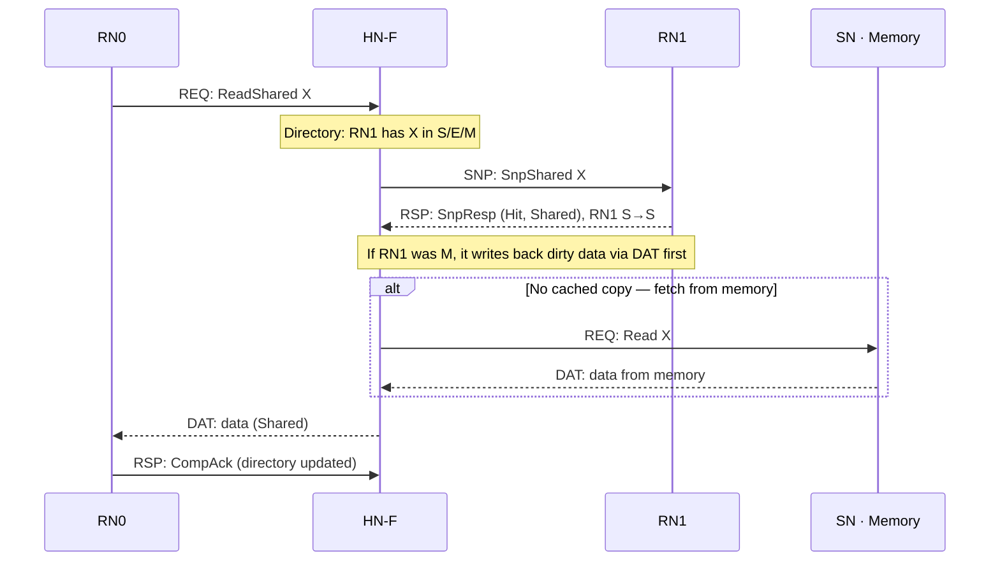

### 5.6 CHI Transaction Flow -- ReadUnique (Write Miss)

```mermaid
%%{init: {"flowchart": {"defaultRenderer": "elk", "nodeSpacing": 60, "rankSpacing": 60, "htmlLabels": false}}}%%
sequenceDiagram
    participant RN0
    participant HNF as HN-F
    participant RN1
    participant SN as SN · Memory
    RN0->>HNF: REQ: ReadUnique X
    Note over HNF: Directory: X shared in RN1 (S state)
    HNF->>RN1: SNP: SnpUnique X
    RN1-->>HNF: RSP: SnpResp (I) — invalidate local copy, RN1 S→I
    Note over HNF: No dirty data (S, not M) — fetch from memory
    HNF->>SN: REQ: Read X
    SN-->>HNF: DAT: data
    HNF-->>RN0: DAT: data (Unique), directory RN0=Unique
    RN0->>HNF: RSP: CompAck
    Note over RN1,SN: If RN1 had M: returns dirty via DAT (cache-to-cache);<br/>HN-F forwards to RN0 and writes back — no separate memory read.
```

### 5.7 CHI Credit-Based Flow Control

CHI uses credit-based flow control instead of AXI-style valid/ready
handshakes. This is a fundamental architectural difference with important
implications for latency, buffering, and deadlock avoidance.

```text
Why credits instead of valid/ready?

  AXI valid/ready: sender and sender must both be ready in the same cycle.
  If the receiver stalls (READY=0), the sender is blocked on that channel.
  This works fine on a shared bus where both sides are clocked together.

  CHI: connects nodes across a NoC (Network-on-Chip) with multiple hops.
  The sender and receiver are not on the same bus segment. Propagating
  a READY signal back through multiple router hops adds latency and
  requires per-hop stall buffers. Credits decouple the sender from
  receiver timing: the sender can transmit whenever it has credits,
  without waiting for a round-trip signal.

  Credit model:
    1. At link initialization, receiver tells sender: "you have N credits"
    2. Sender decrements its credit count for each flit transmitted
    3. Receiver processes the flit and sends a credit return message
    4. Sender increments its credit count on credit return

  This is a sliding-window protocol with window size = credit count.
```

**Credit Types and Typical Values:**

| Credit Signal       | Channel | Meaning                                         | Typical RN-F Allocation |
|---------------------|---------|-------------------------------------------------|-------------------------|
| TXDATFLIT (send)    | DAT     | Sender transmits a data flit (consumes credit)  | --                      |
| RXDATFLIT (receive) | DAT     | Receiver gets a data flit                       | --                      |
| TXDATLCRDV          | DAT     | Credit return: receiver returns a DAT credit     | --                      |
| TXREQFLIT (send)    | REQ     | Sender transmits a request flit                  | --                      |
| RXREQFLIT (receive) | REQ     | Receiver gets a request flit                     | --                      |
| TXREQLCRDV          | REQ     | Credit return: receiver returns a REQ credit     | --                      |

```verilog
Typical credit allocations for an RN-F (CPU core):

  REQ credits (from RN-F to HN-F):  2-4 credits
    - Limits how many outstanding requests the core can have
      before the HN-F's request buffer fills up
    - 4 credits means 4 REQ flits in flight before backpressure

  RSP credits (from RN-F to HN-F):  2-4 credits
    - For snoop responses and acknowledgments going back to HN-F

  DAT credits (from RN-F to HN-F):  4-8 credits
    - For write-back data, snoop data responses
    - More DAT credits because data flits are larger and
      take longer to drain through the NoC

  SNP credits (from HN-F to RN-F):  2-4 credits
    - How many snoops the HN-F can send to this RN-F
    - Must be large enough to avoid starving the coherence protocol

  Total per RN-F link: ~12-20 credits across all channels
```

**Credit Starvation and Deadlock:**

```python
Credit starvation scenario:
  1. RN-F has 4 DAT credits, sends 4 write-back data flits to HN-F
  2. HN-F is congested processing snoops, doesn't drain DAT buffer
  3. HN-F doesn't return credits (LCRDV) because it hasn't consumed
     the flits yet
  4. RN-F has 0 DAT credits -> cannot send any more data
  5. If RN-F needs to send data to make forward progress (e.g., snoop
     response that the HN-F is waiting for), deadlock can occur

Deadlock prevention in CHI:
  - Protocol-level deadlock freedom: CHI defines a message dependency
    graph. Messages are partitioned into independent classes that
    cannot block each other. REQ/RSP/DAT/SNP each have separate
    credit pools and virtual channels.
  - Separate credit pools per channel prevent a flood on one channel
    from starving another.
  - The interconnect must guarantee that credit returns are never
    blocked by data flits (they travel in a separate class).
  - Implementation rule: the receiver must return credits promptly.
    The spec requires that a credit is returned within a bounded
    number of cycles after the flit is consumed.

  Deadlock freedom is ensured by the CHI protocol layer specification,
  not by individual node implementations. ARM mandates a specific
  message dependency ordering that eliminates circular wait.
```

**Comparison with AXI Ready/Valid:**

| Property              | AXI Ready/Valid                  | CHI Credit-Based                    |
|-----------------------|----------------------------------|-------------------------------------|
| Backpressure signal   | READY per channel, same cycle    | Credit return, separate message     |
| Sender knows state    | Immediately (combinational)      | Lagged (credit return latency)      |
| Multi-hop support     | Poor (READY must propagate back) | Natural (credits are messages)      |
| Buffer sizing         | Implicit (stall until READY)     | Explicit (credit count = buffer depth) |
| deadlock avoidance    | Simpler (per-channel stall)      | Requires protocol-level guarantees  |
| Typical credit count  | N/A (no credits)                 | 4-8 per channel per link            |
| Throughput impact     | Full throughput when both ready  | Full throughput while credits > 0   |

### 5.8 CHI Retry Mechanism

When an HN-F cannot immediately service a request (directory entry busy,
MSHR full, resource contention), it does not simply stall the requester.
Instead, it actively sends back a **RetryAck**, telling the requester to
hold off and retry later. This prevents head-of-line blocking in the
interconnect.

```text
Why retry instead of stalling?

  In AXI: if a slave is busy, it holds READY=0 on the AW/AR channel.
  The master is stuck. No other transaction from that master can pass
  the blocked one (for the same ID). This is head-of-line blocking.

  In CHI: the HN-F has a limited number of MSHRs (transaction tracking
  entries) and directory ports. With 64+ RN-Fs all issuing requests,
  contention is common. If the HN-F just stopped accepting flits
  (stopped returning credits), ALL RN-Fs would be blocked, even those
  whose requests could be served.

  Retry solves this:
    1. HN-F accepts the REQ flit (consumes a credit)
    2. HN-F immediately sends RetryAck back to the RN-F
    3. HN-F's REQ buffer is freed for other requests
    4. RN-F retries the request later when resources are available
```

**Retry Flow:**

```text
Step 1: RN-F sends a request
  RN0 -> HN:  REQ {Opcode=ReadShared, Addr=X, SrcID=RN0, TgtID=HN0,
                DBID=unassigned, ReturnNID=RN0}
  HN receives the REQ, allocates an MSHR entry... but all MSHRs are full.

Step 2: HN sends RetryAck
  HN -> RN0:  RSP {Opcode=RetryAck, TgtID=RN0, SrcID=HN0,
                     RetryPCrdType=1 (credit type to return)}

  RetryAck contains:
    - The credit type that the RN-F must return before retrying
    - No DBID is allocated (the request was not accepted)

Step 3: RN-F returns a Protocol Credit (PCrdReturn)
  RN0 -> HN:  RSP {Opcode=PCrdReturn, SrcID=RN0, PCrdType=1}

  This is the "I'm ready to retry" signal. The RN-F returns the
  specific protocol credit that was indicated in the RetryAck.

Step 4: HN sends PCrdGrant (when resources are available)
  HN -> RN0:  RSP {Opcode=PCrdGrant, TgtID=RN0, PCrdType=1}

  "Resources are now available, you may retry your request."

Step 5: RN-F re-sends the original request
  RN0 -> HN:  REQ {Opcode=ReadShared, Addr=X, ...}
  This time the HN-F has resources and processes the request normally.
```

**Retry Ordering Guarantees:**

**CHI guarantees about retry ordering:**

1. Once an RN-F receives PCrdGrant, it MUST retry the same request
(same opcode, address, size). It cannot substitute a different request.

2. The retried request must be the oldest pending request of that
credit type at the RN-F. This prevents starvation.

3. An HN-F may issue multiple RetryAcks to the same RN-F if
resources remain unavailable. The RN-F must not retry until
it receives PCrdGrant.

4. PCrdGrant is sent in order per RN-F. The HN-F will not skip
ahead to a different RN-F's retry indefinitely (fairness).

5. The RN-F must not send any new requests of the same credit
type between RetryAck and PCrdGrant. This prevents the retry
queue from growing unboundedly.

**Credit types for retry:**
   - PCrdType values correspond to different resource classes
   - (e.g., request MSHRs, snoop MSHRs, data buffers)
   - This allows the HN-F to manage contention per resource type

**Comparison with AXI:**

| Property              | AXI Stall                        | CHI Retry                          |
|-----------------------|----------------------------------|-------------------------------------|
| Blocking scope        | Blocks entire master port        | Only the specific credit type       |
| Other transactions    | Blocked (head-of-line)           | Can proceed (different credit type) |
| Interconnect impact   | Buffer fills up, backpressure    | Buffer freed immediately            |
| Latency penalty       | Until slave is ready             | Round-trip of RetryAck + PCrdReturn + PCrdGrant |
| Complexity            | Simple (just wait)               | Complex (credit tracking, ordering) |
| Scalability           | Poor for many masters            | Designed for 64+ nodes              |

### 5.9 DCT (Direct Cache Transfer) / Direct Data Transfer

In a standard CHI transaction, data flows through the HN-F (Home Node)
even when the data is available in another RN-F's cache. DCT allows
data to be sent directly from one RN-F to another without going through
the HN-F or memory, reducing latency and interconnect bandwidth.

```verilog
Standard path (non-DCT):
  RN0 wants cache line X, RN1 has X in Modified state
  RN1 -> HN-F -> SN-F (writeback to memory)
  SN-F -> HN-F -> RN0 (read from memory)
  Latency: 2 interconnect traversals + memory access

DCT path:
  RN0 wants cache line X, RN1 has X in Modified state
  HN-F sends snoop to RN1, RN1 forwards data directly to RN0
  RN1 -> RN0 (direct data transfer, bypassing HN-F and memory)
  Latency: 1 snoop + 1 direct data transfer
```

**How DCT Works in the Protocol:**

```text
Step 1: RN0 sends request
  RN0 -> HN:  REQ {Opcode=ReadShared, Addr=X, SrcID=RN0}

Step 2: HN checks directory, finds RN1 has X in Modified state
  HN -> RN1:  SNP {Opcode=SnpSharedFwd, Addr=X, TgtID=RN1,
                     FwdNID=RN0}
  FwdNID tells RN1 to forward data directly to RN0 (not back to HN).

Step 3: RN1 responds with forwarded data
  RN1 -> HN:  RSP {Opcode=SnpRespFwded, SrcID=RN1,
                     FwdState=Shared, Resp=Data}
  "I am forwarding the data directly to the requester."

  RN1 -> RN0: DAT {Opcode=SnpRespDataPtl, Data=X_cache_line,
                     FwdNID=RN0, DBID=non-zero}
  The data goes directly from RN1 to RN0. The non-zero DBID
  indicates this is a DCT transfer, not a normal response.

Step 4: RN0 receives data
  RN0 gets the cache line directly from RN1.
  RN0 -> HN:  RSP {Opcode=CompAck, SrcID=RN0}
  "I received the data, transaction complete."

Key protocol signals for DCT:
  - SnpSharedFwd / SnpUniqueFwd: snoop opcodes that tell the target
    RN-F to forward data to a third party (not back to the HN)
  - FwdNID in the snoop: identifies where to send the data
  - SnpRespFwded: tells HN that data was forwarded directly
  - Non-zero DBID in the forwarded DAT: DCT indicator
```

**Snoop Filter Implications:**

```text
The Snoop Filter (SF) in the HN-F must track ownership even during DCT:

  1. Before DCT: SF shows RN1 has X in Modified state
  2. After DCT: SF must be updated to show:
     - RN1 no longer has X in Modified (downgraded to Shared or Invalid)
     - RN0 now has X (in Shared or Unique state depending on opcode)
  3. The SF update happens when the HN-F receives SnpRespFwded from RN1.
     The HN-F knows data was forwarded and updates the directory.

  Critical invariant: the SF must never lose track of who has the data.
  Even though the data bypasses the HN-F, the coherence metadata
  still flows through the HN-F via the SnpRespFwded response.

  Without proper SF tracking:
    - A subsequent ReadUnique to RN0 would not be snooped
    - The line could be in two caches without the HN knowing
    - Coherence violation -> silent data corruption
```

**When DCT Is Used:**

| Scenario                         | DCT Used? | Reason                                      |
|----------------------------------|-----------|---------------------------------------------|
| RN1 has M, RN0 wants Shared     | Yes       | Avoid memory round-trip, fastest path       |
| RN1 has E/S, RN0 wants Shared   | Yes       | Cache-to-cache faster than memory           |
| RN1 has M, RN0 wants Unique     | Yes       | Dirty data forwarded directly               |
| No cached copy (memory only)    | No        | No RN-F to forward from                    |
| Write-back eviction              | No        | Data goes to memory, not another cache      |
| RN-I (IO coherent) requester    | No        | RN-I cannot receive SNP/DAT directly        |

**DCT vs Non-DCT Comparison:**

```verilog
Metric                  Non-DCT                    DCT
--------------------    -----------------------    --------------------------
Latency (typical)       40-80 ns                   15-30 ns
                        (memory read +              (one snoop + direct
                         2 NoC hops)                 data transfer)
Interconnect traffic    Data traverses HN-F twice  Data bypasses HN-F
                        (in from RN1, out to RN0)   (direct RN1 -> RN0)
Memory bandwidth        Consumed (read + optional   Not consumed
                        writeback)                  (data stays in cache)
HN-F buffer usage       Data buffered in HN-F       HN-F only tracks metadata
Power                   Higher (memory access)      Lower (SRAM-to-SRAM only)

DCT savings estimate for a 64-core server:
  - Cache-to-cache sharing rate: ~20-30% of coherence misses
  - DCT eliminates ~50% of memory bandwidth for those misses
  - Net memory bandwidth saving: ~10-15% of total coherence traffic
  - Latency improvement: 2-3x for cache-hot data
```

---

## 6. ACE vs CHI -- Architecture Comparison

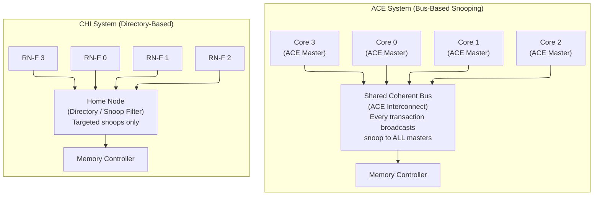

| Property              | ACE                              | CHI                                 |
|-----------------------|----------------------------------|-------------------------------------|
| AMBA version          | AMBA 4                           | AMBA 5                              |
| Coherence method      | Bus-based broadcast snoop        | Directory + targeted snoop          |
| Interface style       | Channel-based (like AXI4)        | Packet-based (flits)                |
| Additional channels   | AC, CR, CD (3 snoop) + RACK/WACK | REQ, SNP, RSP, DAT (4 channels)    |
| Snoop scope           | All masters, every transaction   | Only sharers identified by directory|
| Scalability (cores)   | 2--8 (practical limit ~8)        | 8--128+                             |
| Bandwidth scaling     | O(N) per transaction (snoop all) | O(K) per transaction (K = sharers)  |
| Typical topology      | Shared bus / crossbar            | Ring, mesh, NoC                     |
| Latency (typical)     | 2--4 cycles snoop round-trip     | 3--6 hops (depends on topology)     |
| Area / complexity     | Lower (simpler interconnect)     | Higher (directory storage, routing) |
| Typical silicon       | Cortex-A78/A55 cluster           | Neoverse N1/V1/V2, Graviton        |
| SoC examples          | Snapdragon 8 Gen 3, Dimensity    | Altra, Graviton3, Cobalt-100        |

---

## 7. TrustZone in AXI/ACE

### 7.1 Security Attributes on the Bus

ARM TrustZone partitions the system into Secure and Non-secure worlds.
The security attribute is carried on the bus:

```verilog
AxPROT[1] (NS bit):
  0 = Secure access
  1 = Non-secure access

Write path:  AWPROT[1] = NS attribute for write address
Read path:   ARPROT[1] = NS attribute for read address
```

### 7.2 TrustZone Controller (TZC)

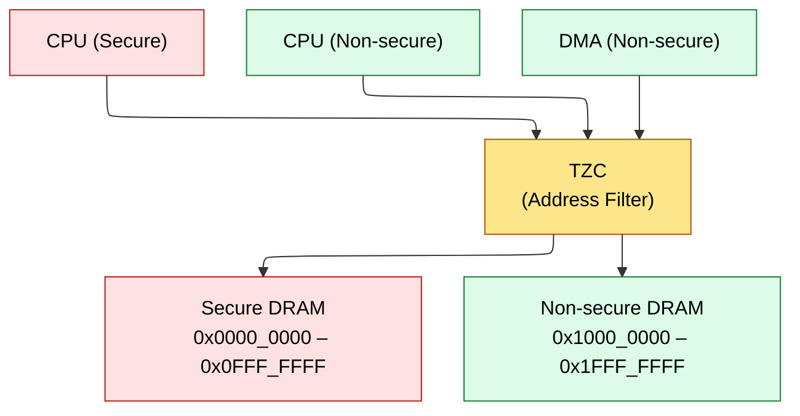

**TZC rules**

1. Secure master (`AWPROT[1]=0`) can access all memory regions.
2. Non-secure master (`AWPROT[1]=1`) can access only Non-secure regions.
3. Non-secure access to a Secure region returns `SLVERR` (access denied).
4. TZC-400 supports up to 9 regions, each configurable as Secure or Non-secure.

Signal path for a DMA read of Secure memory: DMA engine drives `ARPROT[1]=1` → interconnect → TZC checks the address against the region map → address falls in a Secure region → TZC blocks the access and returns `DECERR`, so the DMA gets a bus error.

### 7.3 TrustZone Across ACE/CHI

**In ACE:**
   - AC snoop carries AxPROT. A Non-secure snoop cannot interrogate
   - Secure cache lines. The interconnect filters based on security domain.

**In CHI:**
   - Each flit carries an NS (Non-secure) bit in the opcode fields.
   - The Home Node checks security attributes before responding.
   - A Non-secure RN cannot receive data belonging to a Secure address range.
   - The HN-F enforces isolation -- no software involvement needed.

---

## 8. AXI ATOP (Atomic Operations, AXI5)

### 8.1 Motivation

- **Without ATOP** — atomic increment at address X
1. CPU reads X (AR channel)
2. CPU computes X + 1
3. CPU writes X + 1 (AW + W + B channels)
- **Total** — 2 round-trips, ~4-8 bus transactions
- **Problem** — between step 1 and step 3, another master might modify X

- **With ATOP** — atomic increment at address X
4. CPU sends AtomicStore with ADD opcode on AW channel + W channel
5. Slave reads X, computes X + 1, writes back, returns old value (optional)
- **Total** — 1 round-trip, atomicity guaranteed by the slave

### 8.2 ATOP Operations

| Category      | Operations                                         | Return Data? |
|---------------|----------------------------------------------------|--------------|
| AtomicLoad    | ADD, CLR, EOR, SET, SMAX, SMIN, UMAX, UMIN        | Yes (old value) |
| AtomicStore   | ADD, CLR, EOR, SET, SMAX, SMIN, UMAX, UMIN        | No           |
| AtomicSwap    | SWAP (write new value, return old)                 | Yes          |
| AtomicCompare | CAS (compare and swap: match -> swap, else return) | Yes          |

```verilog
AxATOP signal (2 bits on AW channel):
  00 = Normal (non-atomic) transaction
  01 = AtomicStore (no data returned on R channel)
  10 = AtomicLoad (data returned on R channel)
  11 = AtomicCompare (data returned on R channel)

Key constraint: ATOP transactions must be to Device or Normal Non-cacheable
memory, OR the interconnect must handle them coherently.

Use cases:
  - Lock-free queues: atomic increment of head/tail pointer
  - Reference counting: atomic increment/decrement
  - Compare-and-swap: lock acquisition, mutex implementation
  - Statistics counters: atomic increment in network processors
```

### 8.3 ATOP vs Exclusive Access

```verilog
Exclusive Access (LDREX/STREX, AXI4):
  Two separate transactions. Software manages the retry loop.
  Works with any AXI4 slave.
  Latency: 2 round-trips (read + write).
  Failure mode: STREX fails (BRESP=OKAY), software retries.

ATOP (AXI5):
  Single transaction. Hardware manages atomicity at the slave.
  Requires ATOP-capable slave.
  Latency: 1 round-trip.
  Failure mode: none (always succeeds, atomicity in hardware).

For SoC design:
  Use ATOP when the slave supports it (faster, simpler).
  Fall back to exclusive access for legacy AXI4 slaves.
  ARMv8.1-A mandates LSE (Large System Extensions) atomics which map to ATOP.
```

---

## 9. Numbers to Memorize

| Parameter                                  | Value                           | Notes                                  |
|--------------------------------------------|---------------------------------|----------------------------------------|
| AXI4 max burst length                      | 256 beats (AXI4), 16 (AXI3)    | Per transaction; unlimited outstanding with different IDs |
| AXI4 data width options                    | 32, 64, 128, 256, 512, 1024    | Powers of 2 from 32 to 1024 bits       |
| ACE additional channels                    | 3 (AC, CR, CD) + 2 (RACK, WACK)| On top of AXI4's 5 channels            |
| ACE max practical core count               | ~8                              | Snoop bandwidth scales O(N^2)          |
| ACE snoop latency (typical)                | 2--4 cycles                     | AC -> CR/CD round-trip                  |
| ACE snoop response types                   | Shared, Clean, Data             | CR channel encodes hit/miss + state    |
| ACE cache line size (typical)              | 64 bytes                        | Matches ARM L1$ line size              |
| ACE/CHI typical frequency range            | 800 MHz -- 2 GHz                | Interconnect fabric clock; cores run faster |
| CHI channels                               | 4 (REQ, SNP, RSP, DAT)         | Credit-based flow control (Issue B+)   |
| CHI link width (typical data)              | 128 bits + sidebands            | Sidebands: valid, poison, parity, etc. |
| CHI flit types                             | REQ, RSP, SNP, DAT             | Each has dedicated credit pool         |
| CHI max core count                         | 64--128+                        | Directory scales better than snoop     |
| CHI flit width (typical)                   | 128--256 bits                   | Wider than AXI signal groups           |
| CHI hop latency (mesh, typical)            | 2--3 cycles per hop             | Depends on topology and router depth   |
| CHI credits per RN-F (typical)             | 4-8 DAT, 2-4 REQ, 2-4 RSP      | Per-channel, per-link allocation       |
| Directory entry size (per line, 64-core)   | ~70 bits                        | 64-bit sharer vector + 3b state + valid; no tag (indexed by addr) |
| Snoop filter entry size (4-core)           | ~24 bits                        | 4-bit sharer + 20-bit tag (partial)    |
| TrustZone TZC-400 max regions              | 9                               | Configurable Secure/Non-secure         |
| TrustZone NS bit position                  | AxPROT[1]                       | 0=Secure, 1=Non-secure                 |
| ATOP operation count                       | 16                              | 8 AtomicLoad + 8 AtomicStore variants  |
| AXI5 AxATOP width                          | 2 bits                          | 00=Normal, 01=Store, 10=Load, 11=CAS   |
| DMB/DSB barrier cost (typical)             | 10--50 cycles                   | Depends on outstanding traffic         |

---

## 9a. CHI Issue E -- Coherent Chiplet Interconnect

### CHI Issue E Enhancements

CHI Issue E (the latest revision as of 2025) introduces features specifically targeting **coherent chiplet-to-chiplet interconnect**, where multiple dies in a package communicate coherently through die-to-die (D2D) links such as UCIe (Universal Chiplet Interconnect Express).

| Feature | CHI Issue C | CHI Issue E |
|---|---|---|
| **Target topology** | Single-die mesh/ring | Multi-die chiplet fabric |
| **Snoop filtering** | Per-node snoop filter | Distributed snoop filter with cross-die invalidation optimization |
| **Cache stashing** | Optional | Enhanced stash with hint-based push (proactive dirty-data migration) |
| **Retry and credit** | PCrdGrant-based retry | Extended credit model with per-die credit pools |
| **Data return path** | DAT channel only | DAT + optional direct D2D data bypass (reduces hop count) |
| **Endianness** | Little-endian | Bi-endian data payload support |
| **Poison / Data error** | Not supported | Per-64B poison marker on DAT channel for RAS |
| **Coherent coherency between dies** | Via HN-F proxy | Direct RN-F to RN-F snoops across D2D links |
| **Ordered write** | Optional | Mandatory ordered-write observation for persistent memory |

**Why chiplet coherence needs CHI Issue E:**

In a chiplet system, each die may contain CPU cores (RN-F nodes) and a slice of the shared LLC (HN-F nodes). When a core on die 0 reads data that is dirty in a core on die 1's private cache, the coherence transaction must traverse the D2D link. CHI Issue E optimizes this path:

```verilog
Without Issue E:
  RN-F (die 0) -> HN-F (die 0) -> HN-F (die 1) -> RN-F (die 1) -> HN-F (die 1) -> HN-F (die 0) -> RN-F (die 0)
  Latency: 4 D2D link crossings

With Issue E (direct cross-die snoop):
  RN-F (die 0) -> HN-F (die 0) -> RN-F (die 1) -> HN-F (die 0) -> RN-F (die 0)
  Latency: 2 D2D link crossings (if directory on die 0 tracks die 1's sharers)
```

This reduces cross-die coherence latency by 40-60% in the common case of two-die chiplet configurations.

### D2D Link Integration with CHI

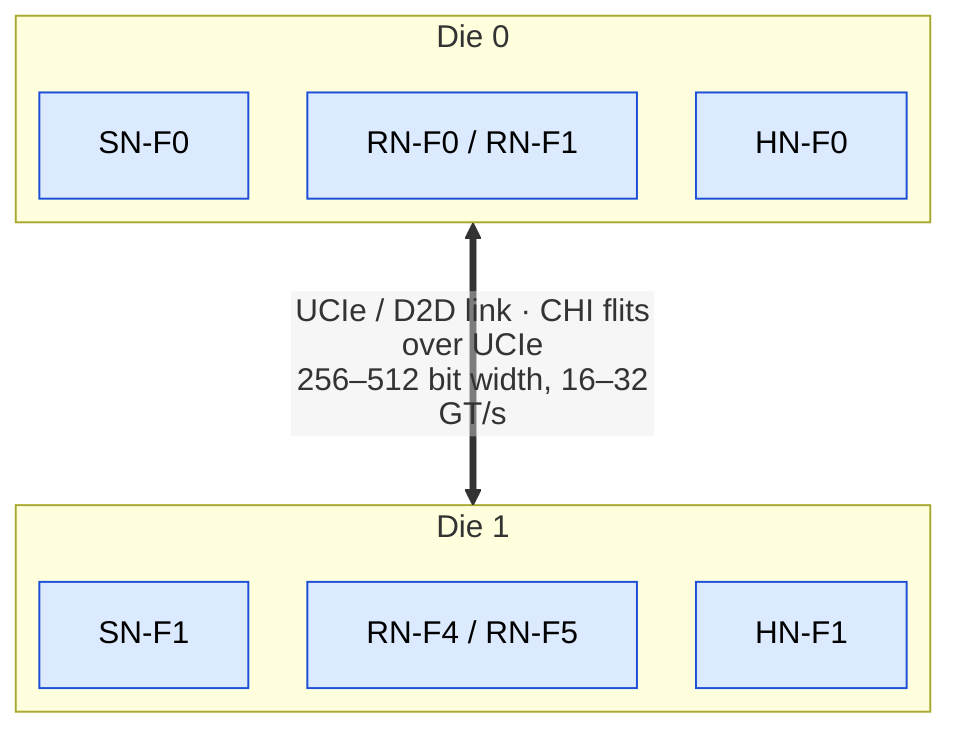

CHI packets are encapsulated in UCIe flits: REQ ≈ 128 bits (opcode, src/tgt ID, addr, size), SNP ≈ 96 bits, RSP ≈ 64 bits, DAT ≈ 256+ bits (payload + BE + CC + poison). Bandwidth: UCIe 256-bit × 16 GT/s = 64 GB/s per direction (matched to PCIe 6.0 ×4); UCIe 512-bit × 32 GT/s = 256 GB/s per direction (high-performance chiplets).

The CHI-to-UCIe adapter must handle: flit packing/unpacking, credit management across the D2D link, link-level retry (UCIe CRC + replay), and protocol-level flow control mapping between CHI valid/ready and UCIe credits.

---

## 9b. CXL Cache Coherence Integration with CHI

### CXL.cache and CHI Coexistence

CXL.cache allows an accelerator (CXL Type-1 or Type-2 device) to participate in the host's coherence domain. When the host interconnect uses CHI, the CXL.cache protocol must be bridged to CHI transactions at the system-level interconnect.

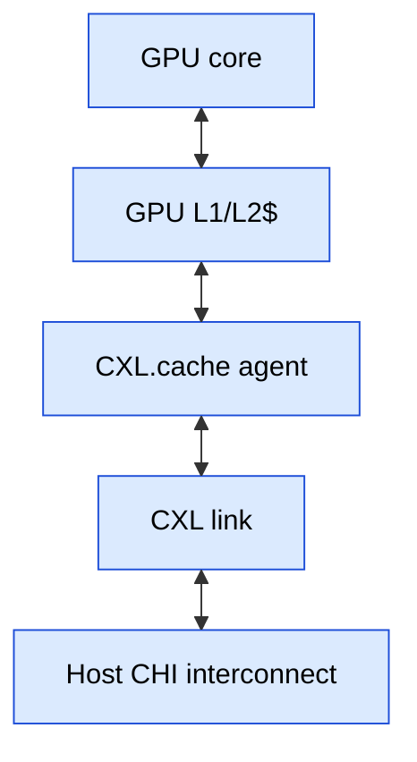

CXL.cache operations map onto CHI:

| CXL.cache op | CHI mapping |
|---|---|
| SnpData | SNP: SnpShared |
| SnpInv | SNP: SnpUnique / SnpInv |
| RdShared | REQ: ReadShared |
| RdUnique | REQ: ReadUnique |
| ClnFull / WB | REQ: WriteBackFull / Evict |
| DataPull | REQ: ReadNoSnp (non-coherent read) |

**Coherence flow example: CXL GPU reads host memory**

```verilog
1. GPU misses in local cache -> CXL.cache issues RdShared to host
2. CXL-to-CHI bridge translates RdShared -> CHI REQ ReadShared
3. CHI HN-F checks directory: line is in S state on CPU core 0
4. HN-F sends SNP SnpShared to CPU core 0
5. CPU core 0 responds: RSP Shared (keeps its copy)
6. HN-F fetches data from memory (or cache-to-cache from CPU core 0)
7. HN-F sends DAT to CXL-to-CHI bridge
8. Bridge translates DAT -> CXL.cache Data response
9. GPU receives data in Shared state

Key insight: The CXL device appears as just another RN-F in the CHI
coherence domain. The directory at the HN-F tracks CXL device sharers
exactly like CPU core sharers. No software intervention is needed.
```

**CXL Type-3 (memory expansion) and CHI:**

CXL.mem (Type-3) extends the host's physical address space with device-attached memory. From the CHI interconnect's perspective, a CXL Type-3 device appears as a **remote SN-F (Subordinate Node)**: the HN-F routes memory requests to the CXL-attached memory via the CXL.mem protocol. The HN-F maintains coherence for lines cached in local CPU caches, issuing snoops as needed before responding to memory requests from the CXL device (back-invalidation flow).

---

## 9c. PCIe 6.0 and 7.0 Overview

### PCIe 6.0: PAM-4 Signaling and FLIT Mode

PCIe 6.0 (ratified 2022) represents the most significant PHY change in PCIe history, moving from NRZ (Non-Return-to-Zero) to **PAM-4 (Pulse Amplitude Modulation, 4 levels)** signaling.

| Parameter | PCIe 5.0 | PCIe 6.0 | PCIe 7.0 (spec announced) |
|---|---|---|---|
| Data rate | 32 GT/s | 64 GT/s | 128 GT/s |
| Signaling | NRZ (2-level) | PAM-4 (4-level) | PAM-4 |
| Encoding | 128b/130b | FLIT mode (no encoding overhead) | FLIT mode |
| Bandwidth per lane | ~4 GB/s (duplex) | ~8 GB/s (duplex) | ~16 GB/s (duplex) |
| x16 bandwidth | ~64 GB/s | ~128 GB/s | ~256 GB/s |
| FEC | None | Light-weight FEC (3-bit CRC + retry) | Enhanced FEC |
| Per-lane voltage levels | 2 (0, 1) | 4 (00, 01, 10, 11) | 4 |
| BER target | 1e-12 | 1e-6 (with FEC correcting to 1e-12 equivalent) | 1e-6 (with FEC) |

**PAM-4 encoding:** Each UI (Unit Interval) carries 2 bits instead of 1:

```ascii-graph
NRZ (PCIe 5.0):
  Signal level: 0 or 1  --> 1 bit per UI
  At 32 GT/s: 32 Gbps per lane per direction

PAM-4 (PCIe 6.0):
  Signal levels: 00, 01, 10, 11  --> 2 bits per UI
  At 64 GT/s: 128 Gbps per lane per direction (raw)
  After FLIT overhead: ~121 Gbps usable = ~8 GB/s net per direction
```

**FLIT mode (PCIe 6.0):**

PCIe 6.0 replaces the 128b/130b encoding with FLIT (Flow Control Unit) mode:

**FLIT structure:**
   - 236 bytes payload + 6 bytes CRC + 4 bytes FEC = 246 bytes total
   - Overhead: (6 + 4) / 246 = 4.1% (vs 128b/130b = 1.5%)
   - But: no per-packet disparity or skip requirements, better efficiency at
   - the transaction level due to no scrambling synchronization overhead.

FEC: 3-bit Gray-coded FEC corrects 1-bit errors per FLIT
Retry: if FEC fails (multi-bit error), receiver requests FLIT retransmit
This is lighter-weight than Ethernet FEC (which uses Reed-Solomon)

FLIT mode is MANDATORY in PCIe 6.0: all transactions must use FLIT encoding.
NRZ mode is still supported for backward compatibility (PCIe 1.0-5.0 fallback).

**Forward Error Correction (FEC) detail:**

```verilog
PCIe 6.0 uses a lightweight FEC + CRC scheme:
  CRC-6: detects errors in the FLIT
  FEC-3: corrects single-bit errors within the FLIT

  Error handling flow:
    1. Receiver computes CRC on received FLIT
    2. If CRC passes: accept FLIT (no error or FEC-correctable error)
    3. If CRC fails: attempt FEC correction (1-bit)
    4. If FEC corrects: accept FLIT
    5. If FEC cannot correct (multi-bit error): request retransmit

  Retransmit latency: ~1-2 us (one RTT across the link)
  Target: retransmit rate < 1e-12 (essentially never in normal operation)
```

### PCIe 7.0

PCIe 7.0 doubles the data rate again to 128 GT/s, maintaining PAM-4 signaling with tighter eye margins and improved equalization. The spec targets 2025-2026 ratification.

- **Enhanced FEC:** More robust error correction for the smaller eye opening at 128 GT/s.
- **Improved CXL integration:** PCIe 7.0 PHY serves as the transport for CXL 3.1, which runs CXL.cache, CXL.mem, and CXL.io protocols over the same link.

### Interview Significance

PCIe 6.0/7.0 are directly relevant to DDR controller and system interconnect design because:
1. CXL Type-3 memory expanders use PCIe 6.0/7.0 PHY, so understanding the link's bandwidth, latency, and error characteristics is essential for sizing memory expansion pools.
2. The 128 GB/s x16 bandwidth of PCIe 6.0 approaches the bandwidth of a single DDR5 channel, making CXL-attached memory competitive for bandwidth-intensive workloads.
3. PAM-4 signaling and FEC introduce a new error model: transient multi-bit errors are possible on the link, requiring end-to-end data integrity (CRC + retry) that adds latency variability.

---

## 9d. CXL 3.0/3.1 Detailed Protocol

### CXL Protocol Stack

CXL runs three protocols over a single PCIe/CXL link:

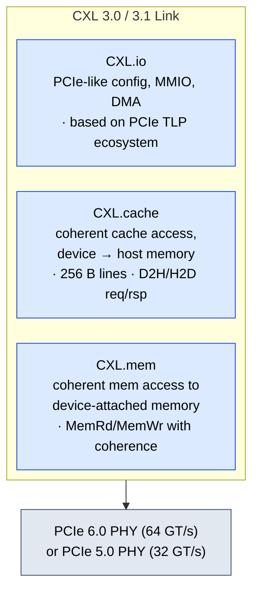

### CXL Device Types

| Type | CXL.io | CXL.cache | CXL.mem | Example |
|---|---|---|---|---|
| **Type 1** | Yes | Yes | No | Smart NIC, AI accelerator (cache-coherent access to host memory, no device memory exposed) |
| **Type 2** | Yes | Yes | Yes | GPU with local HBM (cache-coherent bidirectional: GPU caches host memory, host caches GPU HBM) |
| **Type 3** | Yes | No | Yes | Memory expander (DDR5/E3.S DIMMs, no device-side cache, purely memory target) |

### CXL 3.0 Fabric Topology

CXL 3.0 introduces **fabric switching**, enabling multi-level topologies beyond the simple tree of CXL 1.1/2.0:

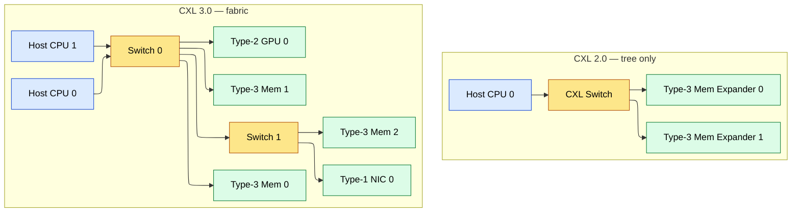

Multiple hosts can share Type-3 memory pools via the fabric. A fabric manager (software agent) configures routing, access permissions, and bandwidth allocation across the fabric.

### CXL 3.1 Enhancements over CXL 3.0

- **Bandwidth allocation:** Per-device, per-host bandwidth limits and guarantees at the fabric switch level. Prevents one host from monopolizing a shared memory pool.
- **Enhanced telemetry:** Standardized performance counters for latency, bandwidth, error rates per device and per link, enabling fabric-wide monitoring.
- **Memory error handling:** CXL.mem adds error injection and detection capabilities for validation, plus graceful degradation when a Type-3 device reports uncorrectable errors.
- **Enhanced coherency engine:** Improved handling of multi-host sharing scenarios with reduced false sharing and more efficient directory-based tracking.

### CXL.cache Protocol Operations

**CXL.cache Device-to-Host (D2H) requests:**
   - RdShared:   Device requests shared (read-only) access to a host cache line
   - RdUnique:   Device requests exclusive (read-write) access to a host cache line
   - RdOwn:      Device wants ownership (exclusive, data from host or memory)
   - ClnFull:    Device writes back a clean line (no data, just surrender ownership)
   - ClnInv:     Device invalidates its copy (no write-back)
   - DirtyWB:    Device writes back dirty data to host
   - RdCurr:     Device reads current value without changing coherence state

**CXL.cache Host-to-Device (H2D) snoops:**
   - SnpData:    Host asks device to return data if cached (for another reader)
   - SnpInv:     Host asks device to invalidate its copy (for exclusive access)
   - SnpCur:     Host asks device for current state (coherence query)

**CXL.cache Data Response:**
   - Data:       Device returns cache line data to host
   - DataInv:    Device returns data and invalidates its copy

### Memory Pooling with CXL 3.0/3.1

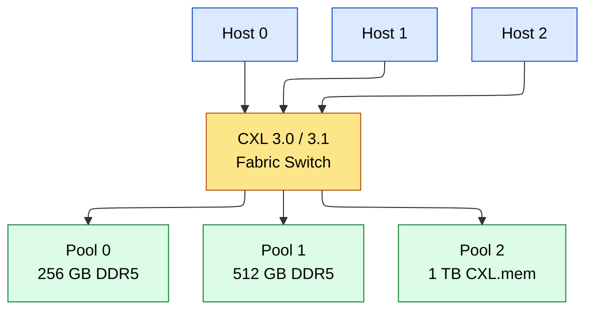

Fabric manager assigns memory regions: Host 0 → Pool 0 (256 GB) + 128 GB of Pool 1 = 384 GB; Host 1 → 256 GB of Pool 1 + 256 GB of Pool 2 = 512 GB; Host 2 → 768 GB of Pool 2. Dynamic reassignment: when Host 2 is idle, Pool 2 can be reassigned to Host 0 for a batch job with no reboot — the OS sees CXL-attached memory as a separate NUMA node.

---

## 10. References

1. ARM IHI 0022E -- AMBA AXI and ACE Protocol Specification (AXI3, AXI4, ACE, ACE-Lite)
2. ARM IHI 0050C -- AMBA 5 CHI Architecture Specification (Issue C)
3. ARM DDI 0595 -- Cortex-A78 Technical Reference Manual (ACE master interface)
4. ARM DDI 0600 -- Neoverse N1 Technical Reference Manual (CHI RN-F interface)
5. ARM DDI 0491 -- CoreLink CCI-500 Coherent Interconnect (ACE interconnect)
6. ARM DDI 0606 -- CoreLink CMN-600 Coherent Mesh Network (CHI interconnect)
7. ARM ARMv8-A Architecture Reference Manual -- DMB, DSB, cache maintenance
8. Hennessy & Patterson, "Computer Architecture: A Quantitative Approach," 6th ed., Chapter 5 (Memory Consistency)

---

## 11. Navigation

| Direction       | Link                                                    |
|-----------------|---------------------------------------------------------|
| Prerequisite    | [AHB_AXI_APB.md](AHB_AXI_APB.md)                     |
| Prerequisite    | [CPU_Architecture.md](CPU_Architecture.md)            |
| Prerequisite    | [Memory.md](Memory.md)                                |
| Related         | [../Implementation/STA.md](../06_Signoff/STA.md)    |
| Back to Index   | [../Index.md](../Index.md)                              |
