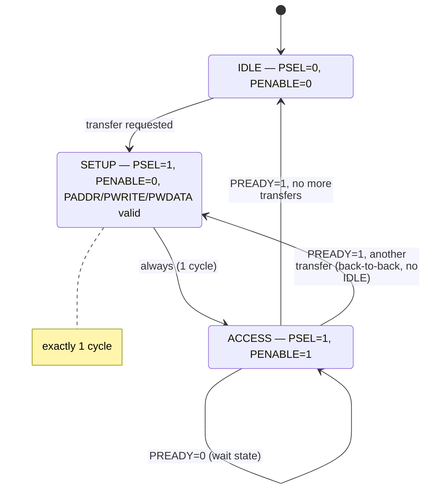
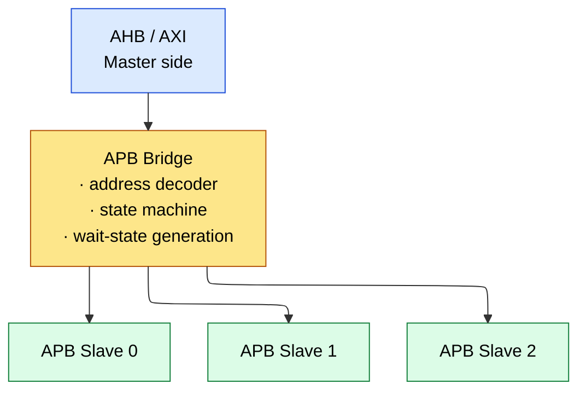
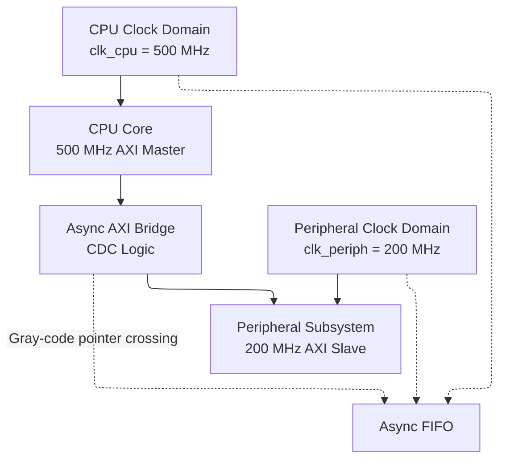
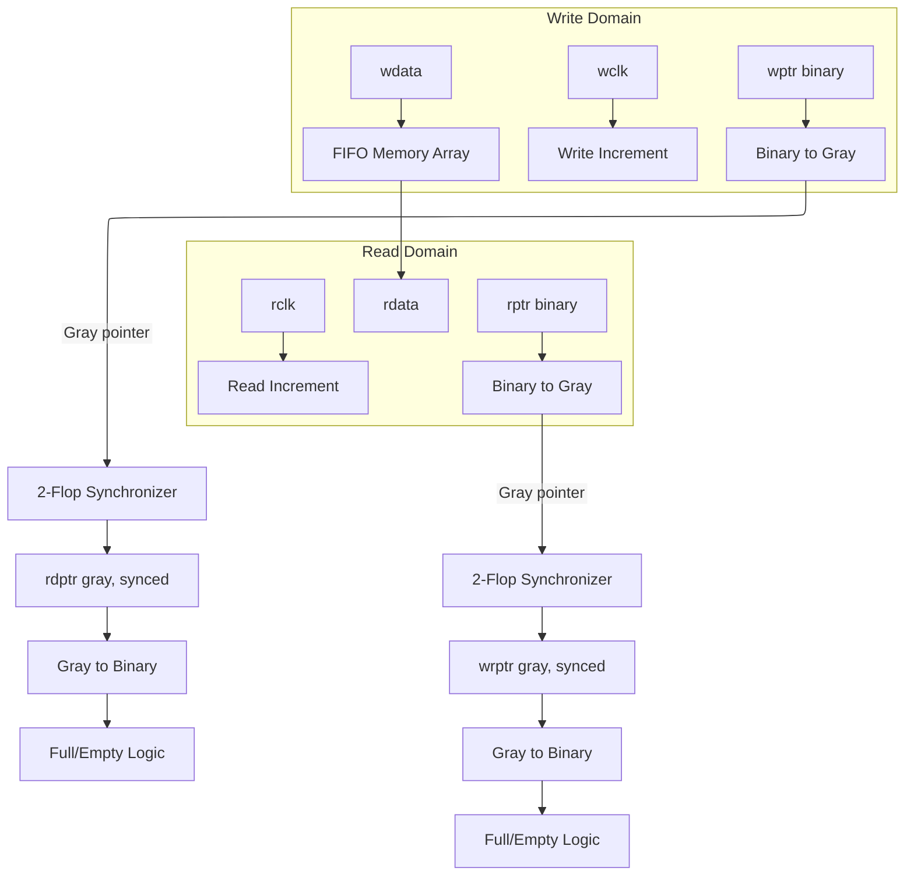
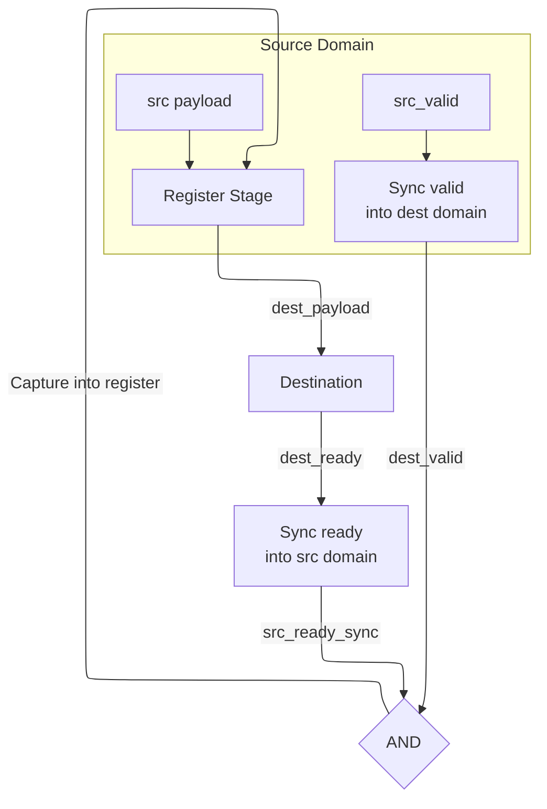

# AMBA Bus Protocols: APB, AHB, and AXI -- The Complete Interview Bible

## Table of Contents
1. AMBA Protocol Overview
2. APB -- Deep Dive with State Machine and Waveforms
3. AHB -- Pipelining, Bursts, and Arbitration
4. AXI4 -- Complete Protocol Specification
5. AXI Outstanding and Interleaving
6. AXI4-Lite
7. AXI4-Stream
8. Interconnect and Crossbar Design
9. Bus Bridge Design (AXI-to-APB, AHB-to-AXI)
10. Performance Analysis and Bandwidth Calculations
11. Interview Q&A (20+ Questions)
12. Clock Domain Crossing for AXI Bridges
13. TrustZone Security Attributes
14. AXI Atomic Operations (ATOP)

---

## 1. AMBA Protocol Overview

| Protocol    | Version | Channels | Pipelining    | Burst  | Outstanding | OoO | Use Case                |
|-------------|---------|----------|---------------|--------|-------------|-----|-------------------------|
| APB         | AMBA 3/4| 1        | None          | No     | No          | No  | Config registers, UART  |
| AHB         | AMBA 2/3| 1        | Addr-pipeline | Yes    | No          | No  | SRAM, DMA (legacy)      |
| AHB-Lite    | AMBA 3  | 1        | Addr-pipeline | Yes    | No          | No  | Single-master subsystem |
| AXI4        | AMBA 4  | 5        | Full          | Yes    | Yes         | Yes | DDR, GPU, high-perf     |
| AXI4-Lite   | AMBA 4  | 5        | Full          | No     | Optional    | No  | Simple register I/F     |
| AXI4-Stream | AMBA 4  | 1        | N/A           | N/A    | N/A         | N/A | Video, DSP, networking  |
| ACE         | AMBA 4  | 5+snoop  | Full          | Yes    | Yes         | Yes | Coherent multi-core     |
| CHI         | AMBA 5  | Channels | Full          | Yes    | Yes         | Yes | Scalable coherent NoC   |

---

## 2. APB (Advanced Peripheral Bus) -- Deep Dive

### 2.1 Complete Signal List

| Signal      | Width | Direction       | Description                                |
|-------------|-------|-----------------|---------------------------------------------|
| PCLK        | 1     | Clock           | Bus clock                                   |
| PRESETn     | 1     | Reset           | Active-low reset                             |
| PADDR       | 32    | Master->Slave   | Address bus                                  |
| PPROT       | 3     | Master->Slave   | Protection (APB4): [2]=instruction, [1]=nonsecure, [0]=privileged |
| PSEL        | 1     | Decoder->Slave  | Slave select (one per slave)                 |
| PENABLE     | 1     | Master->Slave   | Enable (2nd phase indicator)                 |
| PWRITE      | 1     | Master->Slave   | 1=write, 0=read                              |
| PWDATA      | 32    | Master->Slave   | Write data                                   |
| PSTRB       | 4     | Master->Slave   | Write strobes (APB4): byte enables            |
| PRDATA      | 32    | Slave->Master   | Read data                                    |
| PREADY      | 1     | Slave->Master   | Ready (can insert wait states when low)       |
| PSLVERR     | 1     | Slave->Master   | Transfer error                                |

### 2.2 APB State Machine (Complete)



### 2.3 APB Waveforms

**Write without wait states:**

```wavedrom
{ "config": { "hscale": 2 },
  "signal": [
  { "name": "PCLK",    "wave": "p..." },
  { "name": "PSEL",    "wave": "0110" },
  { "name": "PENABLE", "wave": "0010" },
  { "name": "PADDR",   "wave": "x=.x", "data": ["ADDR"] },
  { "name": "PWRITE",  "wave": "0110" },
  { "name": "PWDATA",  "wave": "x=.x", "data": ["DATA"] },
  { "name": "PREADY",  "wave": "1..." },
  {},
  { "name": "State",   "wave": "====", "data": ["IDLE","SETUP","ACCESS","IDLE"] }
], "head": { "text": "APB write — slave always ready (no wait states)" } }
```

**Read with 2 wait states:**

```wavedrom
{ "config": { "hscale": 2 },
  "signal": [
  { "name": "PCLK",    "wave": "p....." },
  { "name": "PSEL",    "wave": "011110" },
  { "name": "PENABLE", "wave": "001110" },
  { "name": "PADDR",   "wave": "x=...x", "data": ["ADDR"] },
  { "name": "PWRITE",  "wave": "0....." },
  { "name": "PRDATA",  "wave": "x...=x", "data": ["DATA"] },
  { "name": "PREADY",  "wave": "000010" },
  {},
  { "name": "State",   "wave": "===..=", "data": ["IDLE","SETUP","ACCESS","IDLE"] }
], "head": { "text": "APB read with 2 wait states (PREADY low until slave ready)" } }
```

### 2.3.1 APB Signal Timing — PSEL/PENABLE/PWRITE/PREADY Relationship

The APB protocol's timing is defined by four key signals. Understanding their exact
relationship is critical for both bridge design and interview questions.

**Signal rules (strict, from AMBA spec):**
```text
1. PSEL:    Asserted by the address decoder when a transfer targets this slave.
            PSEL must be stable before PENABLE rises (setup in SETUP phase).
            Deasserted only after the transfer completes (PREADY=1 in ACCESS).

2. PENABLE: Always transitions 0->1 exactly one cycle after PSEL is asserted.
            The SETUP->ACCESS transition is unconditional and takes exactly 1 cycle.
            PENABLE stays high during any wait states (PREADY=0 extends ACCESS).
            PENABLE deasserts only when the transfer completes.

3. PWRITE:  Must be valid during SETUP and ACCESS phases.
            Indicates direction: 1=write (PWDATA driven), 0=read (PRDATA expected).
            Must not change during a transfer (stable from SETUP through ACCESS).

4. PREADY:  Driven by the slave. Only sampled when PENABLE=1 (ACCESS phase).
            PREADY=1: transfer completes this cycle.
            PREADY=0: slave inserts a wait state; all signals held stable.
            PREADY may be combinational (depends on PENABLE for timing closure) or
            registered (adds 1 cycle latency but breaks critical path).
```

**Timing diagram — all four signals for a write with 1 wait state:**

```wavedrom
{ "config": { "hscale": 2 },
  "signal": [
  { "name": "PCLK",    "wave": "p...." },
  { "name": "PSEL",    "wave": "01110" },
  { "name": "PENABLE", "wave": "00110" },
  { "name": "PWRITE",  "wave": "01110" },
  { "name": "PADDR",   "wave": "x=..x", "data": ["ADDR"] },
  { "name": "PWDATA",  "wave": "x=..x", "data": ["DATA"] },
  { "name": "PREADY",  "wave": "00010" },
  {},
  { "name": "State",   "wave": "===.=", "data": ["IDLE","SETUP","ACCESS","IDLE"] }
], "head": { "text": "APB write with 1 wait state" } }
```

Key points: `PADDR`/`PWDATA` stay valid from SETUP through ACCESS (held during the wait state); `PENABLE` is high for the whole ACCESS phase; `PREADY` is only sampled when `PENABLE=1`.

**Common interview question: Can PREADY be combinational from PENABLE?**
```verilog
Answer: Yes, but with caution.

Legal: PREADY = PENABLE  (slave always ready when in ACCESS phase)
  This is the simplest slave: no wait states, PREADY tied to PENABLE.
  Transfer always completes in 2 cycles.

Legal: PREADY = 1  (slave always ready, regardless of PENABLE)
  Also valid. PREADY is not sampled until PENABLE=1 anyway.
  Used by simple register files with fixed read/write timing.

NOT legal: PREADY depends on PSEL without PENABLE
  The spec requires PREADY to be stable and meaningful only during ACCESS.
  A slave that deasserts PREADY when PSEL=0 and PENABLE=0 (IDLE) is legal
  (PREADY is a "don't care" in IDLE/SETUP) but the master must not sample it.

Timing hazard: If PREADY is combinational from PENABLE and PREADY feeds back
  into logic that generates PENABLE, a combinational loop forms. This is why
  most real slaves register PREADY (adding 1 wait state but breaking the loop).
```

**Write with PSLVERR:**

`PSLVERR` is sampled on the same rising `PCLK` edge as `PREADY` (when `PENABLE=1` and `PREADY=1`). It flags a failed transfer (e.g. write to a read-only register, access to an undefined address). Both assert on the same cycle; the master decides how to handle it (ignore, retry, interrupt) — APB does not define error recovery.

```wavedrom
{ "signal": [
  { "name": "PSLVERR", "wave": "001100" },
  { "name": "PREADY",  "wave": "001100" }
], "head": { "text": "PSLVERR asserted together with PREADY on a failed transfer" } }
```

### 2.4 APB Detailed Handshake Protocol

The APB protocol uses exactly three signals for flow control: `PSEL`, `PENABLE`, and
`PREADY`. The `PWRITE` signal determines direction. Understanding the exact timing
relationship is critical for bridge design and interview questions.

**Signal behavior across phases:**
```text
Phase      PSEL  PENABLE  PWRITE  PADDR  PWDATA/PRDATA  PREADY
-----------------------------------------------------------------------
IDLE       0     0        X       X      X               X
SETUP      1     0        valid   valid  valid (if W)    X (not sampled)
ACCESS     1     1        valid   valid  valid (if W)    sampled
ACCESS(ws) 1     1        valid   valid  valid (if W)    0 (wait)
COMPLETE   1     1        valid   valid  valid           1 (transfer done)
```

**Critical timing rule: PSEL and PENABLE must NEVER be asserted simultaneously
unless in the ACCESS phase.** The transition from SETUP to ACCESS is always exactly
one cycle (PENABLE goes high on the clock edge following SETUP). Only PREADY can
extend the ACCESS phase.

**Data validity rules:**
- Write data (`PWDATA`) must be stable during SETUP and ACCESS phases.
- Read data (`PRDATA`) is sampled on the rising clock edge when `PENABLE=1` and `PREADY=1`.
- `PSLVERR` is sampled alongside `PREADY` -- it is only valid when `PENABLE=1 && PREADY=1`.

**Back-to-back transfers (no IDLE cycle between):**

```wavedrom
{ "config": { "hscale": 2 },
  "signal": [
  { "name": "PCLK",    "wave": "p......" },
  { "name": "PSEL",    "wave": "0111111" },
  { "name": "PENABLE", "wave": "0010101" },
  { "name": "PADDR",   "wave": "x=.=.=.", "data": ["A0","A1","A2"] },
  { "name": "PWRITE",  "wave": "0111111" },
  { "name": "PWDATA",  "wave": "x=.=.=.", "data": ["D0","D1","D2"] },
  { "name": "PREADY",  "wave": "1......" }
], "head": { "text": "Back-to-back APB — PENABLE staircase, PSEL stays high (PADDR/PWDATA show the 3 transfers)" } }
```

`PENABLE` pulses high for exactly one cycle per transfer (during ACCESS), then drops for the next SETUP; `PSEL` stays high across the whole back-to-back sequence.

### 2.5 APB Bridge Design (from AXI/AHB)



The bridge: (1) accepts an AHB/AXI transaction (address phase); (2) decodes the address to select the appropriate `PSEL`; (3) drives `PADDR`, `PWRITE`, `PWDATA` in the SETUP phase; (4) asserts `PENABLE` in the ACCESS phase; (5) waits for `PREADY` from the slave; (6) returns `HRDATA`/`RDATA` and `HRESP`/`BRESP` to the master side; (7) if the AXI side issues a burst, the bridge generates multiple APB transfers.

---

## 3. AHB (Advanced High-Performance Bus) -- Deep Dive

### 3.1 Complete Signal List

| Signal       | Width | Direction       | Description                                  |
|--------------|-------|-----------------|----------------------------------------------|
| HCLK         | 1     | Clock           | Bus clock                                    |
| HRESETn      | 1     | Reset           | Active-low reset                              |
| HADDR        | 32    | Master->Slave   | Address bus                                   |
| HTRANS       | 2     | Master->Slave   | Transfer type                                 |
| HWRITE       | 1     | Master->Slave   | 1=write, 0=read                               |
| HSIZE        | 3     | Master->Slave   | Transfer size (2^HSIZE bytes)                 |
| HBURST       | 3     | Master->Slave   | Burst type                                    |
| HPROT        | 4     | Master->Slave   | Protection control                            |
| HWDATA       | 32    | Master->Slave   | Write data (data phase)                       |
| HRDATA       | 32    | Slave->Master   | Read data (data phase)                        |
| HREADY       | 1     | Slave->Master   | Ready (transfers/wait)                        |
| HRESP        | 2     | Slave->Master   | Response (OKAY/ERROR/RETRY/SPLIT)             |
| HSELx        | 1     | Decoder->Slave  | Slave select                                  |
| HMASTLOCK    | 1     | Master->Slave   | Locked access                                 |
| HMASTER      | 4     | Arbiter->Slave  | Master number                                 |
| HBUSREQ      | 1     | Master->Arbiter | Bus request                                   |
| HLOCK        | 1     | Master->Arbiter | Locked transfer request                       |
| HGRANT       | 1     | Arbiter->Master | Bus grant                                     |

### 3.2 HTRANS Encoding -- Detailed

| HTRANS[1:0] | Name   | Description                                                |
|-------------|--------|------------------------------------------------------------|
| 00          | IDLE   | No transfer. Master is idle or waiting. Slave ignores.      |
| 01          | BUSY   | Master is in a burst but cannot continue this cycle. Slave must wait. Address and control are meaningless. Does NOT end the burst. |
| 10          | NONSEQ | First transfer of a burst, or a single transfer. New address/control. Not related to previous transfer. |
| 11          | SEQ    | Continuation of a burst. Address = previous + size. Control same as NONSEQ. |

### 3.3 AHB Pipelining -- Detailed Waveform
```text
The key to AHB performance: address phase of transfer N+1 overlaps
with data phase of transfer N.

Cycle                     :       1       2       3       4       5       6
HADDR                     :     [A0]    [A1]    [A2]    [A3]
HTRANS                    :    [NONSEQ][SEQ]   [SEQ]   [SEQ]
HWDATA                    :            [D0]    [D1]    [D2]    [D3]
HREADY                    :      1       1       1       1       1

Transfer 0                : Address in cycle 1, Data in cycle 2
Transfer 1                : Address in cycle 2, Data in cycle 3
Transfer 2                : Address in cycle 3, Data in cycle 4
Transfer 3                : Address in cycle 4, Data in cycle 5

Effective bandwidth       : 1 transfer per clock cycle (after initial 1-cycle latency)
Without pipelining (APB-style): 2 cycles per transfer -> half the bandwidth
```

**With wait states:**
```text
Cycle    :       1       2       3       4       5       6       7
HADDR    :     [A0]    [A1]    [A1]    [A2]    [A3]
HTRANS   :    [NONSEQ][SEQ]   [SEQ]   [SEQ]   [SEQ]
HWDATA   :            [D0]    [D0]    [D1]    [D2]    [D3]
HREADY   :      1       0       1       1       1       1

Cycle 2-3: HREADY                                        = 0, slave inserts wait state.
  - Master HOLDS address A1, data D0 (must remain stable!)
  - All pipeline stages stall
  - Slave completes the slow operation in cycle 3 (HREADY = 1)
```

### 3.4 Burst Types -- Address Calculation Examples

**HSIZE encoding:**

| HSIZE | Size    | Bytes |
|-------|---------|-------|
| 000   | Byte    | 1     |
| 001   | Halfword| 2     |
| 010   | Word    | 4     |
| 011   | Dword   | 8     |

**INCR4 burst (4-beat incrementing) with HSIZE=010 (word), start address 0x1000:**
```text
Beat 0: Address = 0x1000  (NONSEQ)
Beat 1: Address = 0x1004  (SEQ)  (+4 bytes)
Beat 2: Address = 0x1008  (SEQ)  (+4 bytes)
Beat 3: Address = 0x100C  (SEQ)  (+4 bytes)
```

**WRAP4 burst with HSIZE=010 (word), start address 0x1004:**

Wrap boundary: aligned to (burst_length * size) = 4 * 4 = 16 bytes
- **Wrap boundary** = `0x1000 (start address rounded down to 16-byte boundary)`
Wrap range: 0x1000 to 0x100F

Beat 0: Address = 0x1004  (NONSEQ) -- start here (critical word first)
Beat 1: Address = 0x1008  (SEQ)
Beat 2: Address = 0x100C  (SEQ)
Beat 3: Address = 0x1000  (SEQ)  -- WRAPS back to boundary start!

Use case: Cache line fill starting from the critical word.
CPU needs word at 0x1004, but cache line is 16 bytes (0x1000-0x100F).
WRAP4 fetches 0x1004 first (CPU can proceed immediately),
then fills the rest of the line (0x1008, 0x100C, 0x1000).

**WRAP8 burst with HSIZE=010 (word), start address 0x1014:**
```text
Wrap size     = 8 * 4 = 32 bytes
Wrap boundary = 0x1000 (aligned to 32-byte boundary)
Wrap range: 0x1000 to 0x101F

Beat 0    : 0x1014  (NONSEQ)
Beat 1    : 0x1018  (SEQ)
Beat 2    : 0x101C  (SEQ)
Beat 3    : 0x1000  (SEQ) -- WRAP!
Beat 4    : 0x1004  (SEQ)
Beat 5    : 0x1008  (SEQ)
Beat 6    : 0x100C  (SEQ)
Beat 7    : 0x1010  (SEQ)
```

### 3.5 Split and Retry -- Why They Exist

**Problem:** A slow slave (e.g., external flash controller) takes 100 cycles to respond. During this time, the bus is blocked -- no other master can use it. This wastes bus bandwidth.

**RETRY response:**
```text
Cycle      :    1      2      3      4      5      ...
HADDR      :   [A0]
HTRANS     :  [NONSEQ]
HREADY     :    1      0      1      <- 2-cycle error response
HRESP      :            [RETRY][RETRY] <- Must be 2 cycles!

After RETRY:
  - Master must retry the same transfer
  - Arbiter may re-grant the bus to a different master first
  - Original master retries when re-granted
```

**SPLIT response:**

Same as RETRY, but the slave tells the arbiter:
"I will signal you (via HSPLIT) when I'm ready for this master."

**The arbiter:**
   1. Records which master was split
2. Grants bus to other masters
3. When slave signals HSPLIT for the original master, re-grants to it

Advantage over RETRY: The split master doesn't keep retrying and wasting
bus cycles. The arbiter only re-grants when the slave is actually ready.

### 3.6 AHB-Lite Simplification

**AHB-Lite removes:**
   - HBUSREQ, HGRANT, HLOCK (no arbitration, single master)
   - SPLIT/RETRY (HRESP is 1-bit: 0=OKAY, 1=ERROR)
   - HMASTER (only one master)

AHB-Lite is the most widely used AHB variant in modern SoCs.
Each subsystem typically has one AHB-Lite master with multiple slaves.

### 3.7 AHB Default Slave

Required by the spec: A default slave responds to accesses directed at
unmapped address regions. It returns an ERROR response to prevent bus hangs.

**Without a default slave:**
   - Access to unmapped address -> no slave drives HREADY -> bus hangs forever

**Default slave implementation:**
   - Selected when no other slave is selected (decoder generates default HSEL)
   - Always returns HREADY=1 and HRESP=ERROR
   - Very simple (2-3 gates)

---

## 4. AXI4 -- Complete Protocol Specification

### 4.1 Five Independent Channels with All Signals

**Write Address Channel (AW):**

| Signal    | Width       | Description                                    |
|-----------|-------------|------------------------------------------------|
| AWID      | ID_WIDTH    | Write transaction ID                           |
| AWADDR    | ADDR_WIDTH  | Write start address                            |
| AWLEN     | 8           | Burst length - 1 (0=1 beat, 255=256 beats)    |
| AWSIZE    | 3           | Bytes per beat = 2^AWSIZE                      |
| AWBURST   | 2           | Burst type: FIXED(00), INCR(01), WRAP(10)      |
| AWLOCK    | 1           | Lock type: normal(0), exclusive(1)              |
| AWCACHE   | 4           | Cache attributes (bufferable, cacheable, etc.)  |
| AWPROT    | 3           | Protection: [2]instr, [1]nonsecure, [0]priv     |
| AWQOS     | 4           | Quality of Service (0=lowest, 15=highest)       |
| AWREGION  | 4           | Region identifier                               |
| AWUSER    | USER_WIDTH  | User-defined signals                            |
| AWVALID   | 1           | Address valid                                   |
| AWREADY   | 1           | Slave ready to accept address                   |

**Write Data Channel (W):**

| Signal    | Width       | Description                                    |
|-----------|-------------|------------------------------------------------|
| WDATA     | DATA_WIDTH  | Write data (32, 64, 128, 256, 512, 1024 bits) |
| WSTRB     | DATA_W/8    | Write byte strobes (1 bit per byte)            |
| WLAST     | 1           | Last beat of write burst                       |
| WUSER     | USER_WIDTH  | User-defined signals                           |
| WVALID    | 1           | Data valid                                     |
| WREADY    | 1           | Slave ready to accept data                     |

**Write Response Channel (B):**

| Signal    | Width       | Description                                    |
|-----------|-------------|------------------------------------------------|
| BID       | ID_WIDTH    | Write response ID (matches AWID)               |
| BRESP     | 2           | Response: OKAY(00), EXOKAY(01), SLVERR(10), DECERR(11) |
| BUSER     | USER_WIDTH  | User-defined                                   |
| BVALID    | 1           | Response valid                                 |
| BREADY    | 1           | Master ready to accept response                |

**Read Address Channel (AR):**

| Signal    | Width       | Description                                    |
|-----------|-------------|------------------------------------------------|
| ARID      | ID_WIDTH    | Read transaction ID                            |
| ARADDR    | ADDR_WIDTH  | Read start address                             |
| ARLEN     | 8           | Burst length - 1                               |
| ARSIZE    | 3           | Bytes per beat = 2^ARSIZE                      |
| ARBURST   | 2           | Burst type                                     |
| ARLOCK    | 1           | Lock type                                      |
| ARCACHE   | 4           | Cache attributes                               |
| ARPROT    | 3           | Protection                                     |
| ARQOS     | 4           | QoS                                            |
| ARREGION  | 4           | Region identifier                              |
| ARUSER    | USER_WIDTH  | User-defined                                   |
| ARVALID   | 1           | Address valid                                  |
| ARREADY   | 1           | Slave ready                                    |

**Read Data Channel (R):**

| Signal    | Width       | Description                                    |
|-----------|-------------|------------------------------------------------|
| RID       | ID_WIDTH    | Read data ID (matches ARID)                    |
| RDATA     | DATA_WIDTH  | Read data                                      |
| RRESP     | 2           | Response per beat                              |
| RLAST     | 1           | Last beat of read burst                        |
| RUSER     | USER_WIDTH  | User-defined                                   |
| RVALID    | 1           | Data valid                                     |
| RREADY    | 1           | Master ready to accept data                    |

### 4.2 Handshake Rules -- Critical for Correct Implementation

**Rule 1: VALID must NOT depend on READY.**

```ascii-graph
The source must assert VALID when it has data/address to send,
REGARDLESS of whether READY is asserted. VALID cannot wait for READY.

VALID ────────────────>  (asserted independently)
                         Transfer happens here
READY ────────────────>  (may or may not be asserted)
         ^
         |
    Both high on rising clock edge = transfer complete
```

**Why this rule exists:** If VALID waits for READY, and READY waits for VALID, you get a deadlock. The spec breaks the circular dependency by requiring VALID to go first.

**Rule 2: READY MAY depend on VALID.**

**This is allowed:**
   - Slave sees VALID=1 -> asserts READY=1 on the same cycle
   - Transfer completes in 1 cycle (zero-wait-state)

But this creates a combinational path from VALID to READY,
which can be a timing issue. Many slave implementations
register READY to break this path (at the cost of 1 cycle latency).

**Rule 3: Once VALID is asserted, it must stay asserted until handshake completes.**

```wavedrom
{ "signal": [
  { "name": "VALID", "wave": "011110" },
  { "name": "READY", "wave": "000110" },
  { "name": "DATA",  "wave": "x=...x", "data": ["data"] }
], "head": { "text": "AXI handshake — data stable while VALID high; transfer when VALID & READY both high" } }
```

`VALID` cannot go low before `READY` goes high. Signal values (`AWADDR`, `WDATA`, …) must remain stable while `VALID` is high and `READY` is low.

### 4.3 VALID/READY Timing Diagrams

**Case 1: VALID before READY (most common)**

```wavedrom
{ "signal": [
  { "name": "VALID", "wave": "01110" },
  { "name": "READY", "wave": "00110" },
  { "name": "DATA",  "wave": "x=..x", "data": ["data"] }
], "head": { "text": "VALID asserted first; transfer completes when READY also high (cycle 3)" } }
```

**Case 2: READY before VALID**

```wavedrom
{ "signal": [
  { "name": "READY", "wave": "1111" },
  { "name": "VALID", "wave": "0110" },
  { "name": "DATA",  "wave": "x=.x", "data": ["D"] }
], "head": { "text": "Slave always ready — transfer the moment VALID asserts" } }
```

**Case 3: Simultaneous**

```wavedrom
{ "signal": [
  { "name": "VALID", "wave": "010" },
  { "name": "READY", "wave": "010" },
  { "name": "DATA",  "wave": "x=x", "data": ["D"] }
], "head": { "text": "VALID & READY same cycle — single-cycle transfer" } }
```

### 4.4 Ordering Model

**Write ordering rules:**
- Write data must follow write addresses in the SAME ORDER (AXI4: no write interleaving).
- Write responses (B channel) for transactions with the SAME ID must return in order.
- Write responses with DIFFERENT IDs may return in any order.

**Read ordering rules:**
- Read data for transactions with the SAME ID must return in order.
- Read data with DIFFERENT IDs may return in any order (out-of-order).
- Each read data beat has an RID to identify which transaction it belongs to.

**Read-Write ordering:**
- There is NO ordering guarantee between reads and writes (even with the same ID).
- If ordering is needed, the master must wait for the write response before issuing the read (or vice versa).
- Memory barriers in software (e.g., DMB on ARM) enforce this at the system level.

### 4.5 Burst Address Calculation

**INCR burst:**
```text
Address_N          = Start_Address + N * Number_Bytes

where Number_Bytes = 2^AXSIZE

Example : ARADDR   = 0x1000, ARSIZE=3 (8 bytes), ARLEN=3 (4 beats)
  Beat 0: 0x1000
  Beat 1: 0x1008
  Beat 2: 0x1010
  Beat 3: 0x1018
```

**WRAP burst:**
```text
Step 1      : Calculate number of bytes per beat: Number_Bytes = 2^AXSIZE
Step 2      : Calculate total burst size: Burst_Length         = AXLEN + 1
Step 3      : Calculate wrap boundary:
  Wrap_Boundary                                                = (INT(Start_Address / (Number_Bytes * Burst_Length))) * Number_Bytes * Burst_Length

Step 4      : Calculate addresses:
  If Address_N < Wrap_Boundary + (Number_Bytes * Burst_Length):
    Address_N                                                  = Start_Address + N * Number_Bytes
  Else      :
    Address_N wraps to Wrap_Boundary

Example     : ARADDR                                           = 0x34, ARSIZE=2 (4 bytes), ARLEN=3 (4 beats, WRAP4)
  Number_Bytes                                                 = 4
  Burst_Length                                                 = 4
  Wrap size                                                    = 4 * 4 = 16 bytes
  Wrap_Boundary                                                = INT(0x34 / 16) * 16 = INT(3.25) * 16 = 3 * 16 = 0x30
  Wrap range: 0x30 to 0x3F

  Beat 0    : 0x34  (start)
  Beat 1    : 0x38  (+4)
  Beat 2    : 0x3C  (+4)
  Beat 3    : 0x30  (WRAP! back to boundary)
```

### 4.6 Narrow Transfers and Byte Strobes (WSTRB)

A narrow transfer occurs when AWSIZE < data bus width.
```text
Example: 32-bit write on a 64-bit data bus (AWSIZE = 2, bus=64 bits)

WSTRB for 64-bit bus                              = 8 bits (1 per byte lane)

Beat at address 0x1000 (lower 4 bytes of 64-bit lane):
  WSTRB                                           = 8'b0000_1111  (bytes 0-3 active, bytes 4-7 inactive)
  WDATA                                           = {32'hXXXX_XXXX, 32'h12345678}

Beat at address 0x1004 (upper 4 bytes):
  WSTRB                                           = 8'b1111_0000  (bytes 4-7 active, bytes 0-3 inactive)
  WDATA                                           = {32'hDEADBEEF, 32'hXXXX_XXXX}

The slave uses WSTRB to determine which bytes to write.
```

#### AXI Narrow Transfer — Cycle-by-Cycle on 128-bit Bus

```verilog
Scenario: Master writes 32 bits (AWSIZE=2) to a 128-bit (16-byte) slave bus.
INCR4 burst starting at address 0x1000.

Byte lanes on 128-bit bus:
  Lane  0: addr[3:0] = 0x0   Lane  4: addr[3:0] = 0x4
  Lane  1: addr[3:0] = 0x1   Lane  5: addr[3:0] = 0x5
  Lane  2: addr[3:0] = 0x2   Lane  6: addr[3:0] = 0x6
  Lane  3: addr[3:0] = 0x3   Lane  7: addr[3:0] = 0x7
  Lane  8: addr[3:0] = 0x8   Lane 12: addr[3:0] = 0xC
  Lane  9: addr[3:0] = 0x9   Lane 13: addr[3:0] = 0xD
  Lane 10: addr[3:0] = 0xA   Lane 14: addr[3:0] = 0xE
  Lane 11: addr[3:0] = 0xB   Lane 15: addr[3:0] = 0xF

Beat 0: Address = 0x1000 (narrow, 4 bytes at offset 0x0)
  Only lanes 0-3 carry valid data:
  WSTRB = 16'h000F (bits [3:0] = 1)
  WDATA[31:0] = write_data, WDATA[127:32] = don't care

Beat 1: Address = 0x1004 (4 bytes at offset 0x4)
  Only lanes 4-7 carry valid data:
  WSTRB = 16'h00F0 (bits [7:4] = 1)
  WDATA[63:32] = write_data, rest = don't care

Beat 2: Address = 0x1008 (4 bytes at offset 0x8)
  Only lanes 8-11 carry valid data:
  WSTRB = 16'h0F00 (bits [11:8] = 1)

Beat 3: Address = 0x100C (4 bytes at offset 0xC)
  Only lanes 12-15 carry valid data:
  WSTRB = 16'hF000 (bits [15:12] = 1)

Total: 4 beats x 4 bytes = 16 bytes transferred across 128-bit bus.
Without narrow transfers, the master would need 4 separate single-beat transactions.
With INCR4 narrow burst, the single AW channel transaction covers all 4 beats.
```

#### AXI Unaligned Transfer — Detailed Example

```verilog
Scenario: Write 16 bytes starting at unaligned address 0x1003 on a 64-bit (8-byte) bus.
AWSIZE=3 (8 bytes per beat), ARLEN=2 (3 beats), INCR burst.

The AXI spec requires the master to:
  1. Calculate each beat address as Start + N * 2^AWSIZE (aligned to bus width)
  2. Use WSTRB to indicate which byte lanes are actually valid

Beat 0: Calculated address = 0x1000 (bus-aligned from 0x1003 rounded down)
  Start at 0x1003 = byte lane 3 within this 8-byte aligned beat
  Valid bytes: lanes 3,4,5,6,7 (5 bytes: 0x1003 through 0x1007)
  WSTRB = 8'hF8 (bits [7:3] = 1, bits [2:0] = 0 for invalid)
  WDATA = {32'hXXXX_XXXX, 8'hXX, byte@0x1003, byte@0x1004, byte@0x1005,
            byte@0x1006, byte@0x1007}

Beat 1: Address = 0x1008 (next 8-byte aligned boundary)
  All 8 bytes valid: WSTRB = 8'hFF
  WDATA = bytes 0x1008 through 0x100F

Beat 2: Address = 0x1010
  Remaining 3 bytes: 0x1010, 0x1011, 0x1012
  WSTRB = 8'h07 (bits [2:0] = 1, rest = 0)
  WDATA = {byte@0x1010, byte@0x1011, byte@0x1012, 40'hXXXXXX}

Total data: 5 + 8 + 3 = 16 bytes across 3 beats (correct).
WSTRB ensures only the intended bytes are written; unused lanes are ignored by the slave.
```

#### Unaligned Address Handling

When the start address is not aligned to AWSIZE, the first beat may have fewer
valid bytes than AWSIZE would suggest. The spec requires that the address of each
beat is calculated as if the burst were fully aligned, and WSTRB indicates which
bytes are valid:

```text
Example: INCR4 write burst, AWSIZE=3 (8 bytes/beat), 64-bit bus,
         unaligned start address 0x1004

The data bus is 64 bits (8 bytes), aligned to 8-byte boundaries.
Address 0x1004 is NOT aligned to 8 bytes (0x1004 % 8 = 4).

Beat 0: Address = 0x1004 (unaligned start)
  WSTRB = 8'b1111_1000  (bytes 4-7 are at positions 0-3 of this beat?
  No -- let's recalculate properly)

  For a 64-bit bus, byte lanes are:
    Lane 0: address bits [2:0] = 000
    Lane 1: address bits [2:0] = 001
    ...
    Lane 7: address bits [2:0] = 111

  Beat 0 covers address range 0x1000-0x1007 (8 bytes aligned to bus width)
  But the transfer starts at 0x1004, so only bytes at 0x1004-0x1007 are valid:
    Lane 0 (0x1000): invalid -> WSTRB[0] = 0
    Lane 1 (0x1001): invalid -> WSTRB[1] = 0
    Lane 2 (0x1002): invalid -> WSTRB[2] = 0
    Lane 3 (0x1003): invalid -> WSTRB[3] = 0
    Lane 4 (0x1004): VALID   -> WSTRB[4] = 1
    Lane 5 (0x1005): VALID   -> WSTRB[5] = 1
    Lane 6 (0x1006): VALID   -> WSTRB[6] = 1
    Lane 7 (0x1007): VALID   -> WSTRB[7] = 1
  WSTRB = 8'b1111_0000

Beat 1: Address = 0x100C (next aligned address after 0x1004 + 8)
  All 8 bytes valid: WSTRB = 8'b1111_1111

Beat 2: Address = 0x1014
  All 8 bytes valid: WSTRB = 8'b1111_1111

Beat 3: Address = 0x101C
  All 8 bytes valid: WSTRB = 8'b1111_1111
```

#### WSTRB for WRAP Bursts with Unaligned Start

```verilog
WRAP4 burst, AWSIZE=3 (8 bytes), ARADDR=0x1004, 64-bit bus:
  Wrap boundary = 0x1000 (aligned to 4 * 8 = 32 bytes)
  Wrap range: 0x1000-0x101F

Beat 0: 0x1004, WSTRB = 8'b1111_0000 (first 4 bytes skipped)
Beat 1: 0x100C, WSTRB = 8'b1111_1111
Beat 2: 0x1014, WSTRB = 8'b1111_1111
Beat 3: 0x101C, WSTRB = 8'b1111_1111
  Note: bytes 0x1000-0x1003 are NOT transferred (outside start-to-end range)
```

### 4.7 Complete AXI4 Transaction Walkthrough with Timing Diagram

This section shows a full write burst and read burst on a 64-bit AXI4 bus at 200 MHz,
with all five channels and exact cycle-by-cycle behavior.

#### Write Burst: INCR4, 64-bit data, start address 0x1000

```verilog
AW Channel:
  AWADDR=0x1000, AWLEN=3 (4 beats), AWSIZE=3 (8 B/beat),
  AWBURST=01 (INCR), AWID=0, AWVALID, AWQOS=0x8

W Channel:
  WDATA[63:0], WSTRB=8'hFF, WLAST (on last beat)

B Channel:
  BID=0, BRESP=00 (OKAY)

Timing (clock cycles):

CLK:     |  1  |  2  |  3  |  4  |  5  |  6  |  7  |  8  |  9  | 10  |
         -------------------------------------------------------------------
AWVALID: |  1  |  1  |  1  |     |     |     |     |     |     |     |
AWREADY: |  0  |  0  |  1  |     |     |     |     |     |     |     |
AWADDR:  |1000 |1000 |1000 |     |     |     |     |     |     |     |
         |     |     | ^   |     |     |     |     |     |     |     |
         |     |     | AW  |     |     |     |     |     |     |     |
         |     |     |hand |shake|     |     |     |     |     |     |

WVALID:  |     |  1  |  1  |  1  |  1  |  1  |     |     |     |     |
WREADY:  |     |  0  |  1  |  1  |  0  |  1  |     |     |     |     |
WDATA:   |     | D0  | D0  | D1  | D2  | D2  |     |     |     |     |
WSTRB:   |     | FF  | FF  | FF  | FF  | FF  |     |     |     |     |
WLAST:   |     |  0  |  0  |  0  |  0  |  1  |     |     |     |     |
         |     |     | ^   | ^   |     | ^   |     |     |     |     |
         |     |     | W0  | W1  |     | W2  |     |     |     |     |
         |     |     |     |     | wait|     |     |     |     |     |

Note: W2 wait state (WREADY=0 at cycle 4). WVALID stays high (cannot deassert).
      W2 transfers at cycle 5 when WREADY goes high.

Wait -- let me redo with proper beat tracking:

CLK:     |  1  |  2  |  3  |  4  |  5  |  6  |  7  |  8  |  9  | 10  |
         -------------------------------------------------------------------
AWVALID: |  1  |  1  |     |     |     |     |     |     |     |     |
AWREADY: |  0  |  1  |     |     |     |     |     |     |     |     |
AWADDR:  |1000 |1000 |     |     |     |     |     |     |     |     |
         |     |  ^AW |hske |     |     |     |     |     |     |     |

WVALID:  |     |  1  |  1  |  1  |  1  |     |     |     |     |     |
WREADY:  |     |  1  |  1  |  0  |  1  |     |     |     |     |     |
WDATA:   |     | D0  | D1  | D2  | D2  |     |     |     |     |     |
WSTRB:   |     | FF  | FF  | FF  | FF  |     |     |     |     |     |
WLAST:   |     |  0  |  0  |  0  |  1  |     |     |     |     |     |
         |     | ^W0 | ^W1 | wait| ^W3 |     |     |     |     |     |
         |     |     |     |(W2) |(last|     |     |     |     |     |

Wait: cycle 4 has WREADY=0. WVALID stays high, data stable.
      W2 transfers at cycle 5.

Actually -- the slave inserted a wait state for beat 2 (cycle 4).
  W0 transfers at cycle 2 (both VALID and READY high)
  W1 transfers at cycle 3
  W2: WVALID=1 but WREADY=0 at cycle 4 -> wait state
  W2 transfers at cycle 5 (WREADY goes high)
  W3 (WLAST=1) would need another cycle:

CLK:     |  1  |  2  |  3  |  4  |  5  |  6  |  7  |  8  |  9  | 10  |
         -------------------------------------------------------------------
AWVALID: |  1  |  1  |     |     |     |     |     |     |     |     |
AWREADY: |  0  |  1  |     |     |     |     |     |     |     |     |

WVALID:  |     |  1  |  1  |  1  |  1  |  1  |     |     |     |     |
WREADY:  |     |  1  |  1  |  0  |  1  |  1  |     |     |     |     |
WDATA:   |     | D0  | D1  | D2  | D2  | D3  |     |     |     |     |
WSTRB:   |     | FF  | FF  | FF  | FF  | FF  |     |     |     |     |
WLAST:   |     |  0  |  0  |  0  |  0  |  1  |     |     |     |     |
         |     | ^W0 | ^W1 |stall| ^W2 | ^W3 |     |     |     |     |

BVALID:  |     |     |     |     |     |     |  1  |  1  |     |     |
BREADY:  |     |     |     |     |     |     |  0  |  1  |     |     |
BRESP:   |     |     |     |     |     |     | 00  | 00  |     |     |
         |     |     |     |     |     |     |wait | ^B  |     |     |

Summary:
  AW handshake: cycle 2 (1 wait state on AW)
  W0 handshake: cycle 2
  W1 handshake: cycle 3
  W2 handshake: cycle 5 (1 wait state on W at cycle 4)
  W3 handshake: cycle 6 (last beat)
  B handshake:  cycle 8 (1 wait state on B at cycle 7)
  Total: 8 cycles for 4-beat write burst (32 bytes) with 3 wait states
```

#### Read Burst: INCR4, 64-bit data, start address 0x2000

```verilog
AR Channel:
  ARADDR=0x2000, ARLEN=3, ARSIZE=3, ARBURST=01, ARID=1

R Channel:
  RDATA[63:0], RRESP=00, RLAST (on last beat)

CLK:     |  1  |  2  |  3  |  4  |  5  |  6  |  7  |  8  |  9  | 10  |
         -------------------------------------------------------------------
ARVALID: |  1  |     |     |     |     |     |     |     |     |     |
ARREADY: |  1  |     |     |     |     |     |     |     |     |     |
ARADDR:  |2000 |     |     |     |     |     |     |     |     |     |
         | ^AR |     |     |     |     |     |     |     |     |     |
         |hske |     |     |     |     |     |     |     |     |     |

RVALID:  |     |     |  1  |  1  |  1  |  1  |     |     |     |     |
RREADY:  |     |     |  1  |  1  |  1  |  1  |     |     |     |     |
RDATA:   |     |     | D0  | D1  | D2  | D3  |     |     |     |     |
RRESP:   |     |     | 00  | 00  | 00  | 00  |     |     |     |     |
RLAST:   |     |     |  0  |  0  |  0  |  1  |     |     |     |     |
RID:     |     |     |  1  |  1  |  1  |  1  |     |     |     |     |
         |     |     | ^R0 | ^R1 | ^R2 | ^R3 |     |     |     |     |

Summary:
  AR handshake: cycle 1 (zero wait states)
  R0-3: cycles 3-6 (2-cycle read latency, zero wait states on R)
  Total: 6 cycles for 4-beat read burst (32 bytes), no wait states

  Read latency from AR handshake to first R data: 2 cycles (cycles 1 to 3)
  This represents the slave's internal access time (2 clock cycles at 200 MHz = 10 ns)
```

### 4.7 Exclusive Access (Atomic Operations)

Exclusive access implements atomic read-modify-write operations (like CAS, LL/SC):

```text
Step 1: Exclusive Read
  ARLOCK = 1 (exclusive)
  Master reads address X -> gets value V
  Slave/monitor records: "Master M has exclusive access to address X"

Step 2: Exclusive Write
  AWLOCK = 1 (exclusive)
  Master writes new value to address X
  Slave checks: "Does Master M still have exclusive access to X?"
    YES: Write succeeds, BRESP = EXOKAY (01)
    NO:  Write fails (another master wrote X), BRESP = OKAY (00)
         Master must retry the entire read-modify-write sequence

This is the hardware mechanism behind:
  - ARM LDREX/STREX instructions
  - Atomic compare-and-swap
  - Spinlock implementation
```

### 4.8 AXI QoS (Quality of Service)

```verilog
AxQOS[3:0]: 4-bit priority signal
  0x0 = Lowest priority
  0xF = Highest priority

Used by interconnect arbiters:
  When two masters compete for the same slave, the one with higher QoS wins.

Typical assignments:
  Display controller: QoS = 0xC (high, must not be starved -> screen tearing)
  CPU data:           QoS = 0x8 (medium-high)
  CPU instruction:    QoS = 0x6 (medium)
  DMA background:     QoS = 0x2 (low)
  Debug/trace:        QoS = 0x0 (lowest)

Dynamic QoS: Some masters adjust QoS based on buffer fill level:
  If display FIFO is nearly empty -> raise QoS to 0xF (urgent!)
  If display FIFO is full -> lower QoS to 0x4 (not urgent)
```

#### AXI QoS Arbitration — Worked Example

```verilog
Scenario: 3 masters competing for a shared DDR controller through an AXI interconnect.

Request queue (arrival order):
  M0: AWADDR=0x1000, AWQOS=0x4 (DMA, background copy)
  M1: ARADDR=0x2000, ARQOS=0xC (display controller, scanline read)
  M2: ARADDR=0x3000, ARQOS=0x8 (CPU data cache miss)

Arbiter selects by QoS (highest first):
  Slot 1: M1 (QoS=0xC) -> display read dispatched to DDR
  Slot 2: M2 (QoS=0x8) -> CPU read dispatched
  Slot 3: M0 (QoS=0x4) -> DMA write dispatched last

Dynamic QoS adjustment (display controller):
  Display has a 4-scanline FIFO. At 1920x1080 @60Hz:
    Scanline time = 1/60/1080 = 15.4 us
    Data per scanline = 1920 * 4 bytes (RGBX) = 7680 bytes
    Bandwidth needed = 7680 / 15.4 us = 499 MB/s

  FIFO fill levels and QoS adjustment:
    FIFO > 75% full:  ARQOS = 0x4 (plenty of data, yield to others)
    FIFO 25-75%:      ARQOS = 0x8 (normal)
    FIFO < 25%:       ARQOS = 0xF (URGENT! About to underflow!)
    FIFO = 0 (underflow): screen tears -- must NEVER happen

  This dynamic adjustment gives other masters bandwidth when the display
  doesn't need it, but guarantees display gets priority when it's critical.
```

---

## 5. AXI Outstanding and Interleaving

### 5.1 Outstanding Transactions -- Timing Diagram

```verilog
Without outstanding (1 at a time):
Cycle:  1  2  3  4  5  6  7  8  9  10 11 12 13 14 15 16
AR:    [A0]                     [A1]                     [A2]
R:              [D0][D0][D0][D0]        [D1][D1][D1][D1]

Total: 16 cycles for 3 reads (4-beat bursts, 4-cycle latency)

With 3 outstanding:
Cycle:  1  2  3  4  5  6  7  8  9  10 11 12
AR:    [A0][A1][A2]
R:              [D0][D0][D0][D0][D1][D1][D1][D1][D2][D2][D2][D2]

Total: 12 cycles for 3 reads (latency of first hidden by subsequent addresses)
```

**Throughput improvement:** Outstanding transactions hide the address-to-data latency. The bus stays busy while waiting for slow memory responses. For DDR with 10-cycle latency:

```verilog
Without outstanding: Efficiency = burst_length / (burst_length + latency)
  = 4 / (4 + 10) = 28.6%

With 3 outstanding: Efficiency = 3 * burst_length / (3 * burst_length + latency)
  = 12 / (12 + 10) = 54.5%

With 8 outstanding: Efficiency = 32 / (32 + 10) = 76.2%
```

### 5.2 Out-of-Order Completion with Different IDs

```verilog
Master issues (all 1-beat reads for simplicity):
  Read A0 (ID=0) -> to fast SRAM (2-cycle latency)
  Read A1 (ID=1) -> to slow DDR (10-cycle latency)
  Read A2 (ID=0) -> to fast SRAM (2-cycle latency)
  Read A3 (ID=2) -> to medium flash (5-cycle latency)

Without OoO (strict in-order):
Cycle:  1    2    3    12   13   15   20
AR:    [A0] [A1] [A2]                 [A3]
R:               [D0]          [D1]        [D2] .... [D3]
  D1 blocks D2 even though D2 is ready!

With OoO:
Cycle:  1    2    3    4    5    8    12
AR:    [A0] [A1] [A2] [A3]
R:               [D0]      [D2][D3]       [D1]
  D0 (ID=0) returns first (fast SRAM)
  D2 (ID=0) returns next (same ID, must be after D0 -- and it is)
  D3 (ID=2) returns (different ID, can be before D1)
  D1 (ID=1) returns last (slow DDR)

Ordering maintained:
  ID=0: D0 before D2 (correct)
  ID=1: D1 alone (correct)
  ID=2: D3 alone (correct)
  Cross-ID: no ordering required
```

### 5.3 Write Interleaving (AXI3 Only, Removed in AXI4)

```verilog
AXI3 allowed write data from different transactions to interleave on
the W channel, identified by WID:

Cycle:  1    2    3    4    5    6
AW:    [A0,ID=0] [A1,ID=1]
W:     [D0a,WID=0] [D1a,WID=1] [D0b,WID=0] [D1b,WID=1]

D0a and D0b belong to transaction 0 (interleaved with transaction 1)

AXI4 removed this:
  - WID signal removed
  - Write data must follow same order as write addresses
  - Simplifies slave and interconnect significantly
  - Rarely used in practice (complex, error-prone)
```

---

## 6. AXI4-Lite

### 6.1 Removed Signals (vs AXI4 Full)

| Removed | Reason |
|---------|--------|
| AxID    | No transaction IDs (single outstanding implied) |
| AxLEN   | Always 0 (single beat, no burst) |
| AxSIZE  | Always full data width |
| AxBURST | Always INCR (doesn't matter with 1 beat) |
| AxLOCK  | No exclusive access |
| AxCACHE | No cache attributes |
| AxQOS   | No QoS |
| AxREGION| No region |
| WID     | Removed (same as AXI4) |
| WLAST   | Always 1 (single beat) |
| RLAST   | Always 1 (single beat) |

### 6.2 Retained Signals

- **AW channel** — AWADDR, AWPROT, AWVALID, AWREADY
- **W  channel** — WDATA, WSTRB, WVALID, WREADY
- **B  channel** — BRESP, BVALID, BREADY
- **AR channel** — ARADDR, ARPROT, ARVALID, ARREADY
- **R  channel** — RDATA, RRESP, RVALID, RREADY

### 6.3 When to Use AXI4-Lite

- Control/status register interfaces (CSR) for IP blocks
- Configuration registers (written once or infrequently)
- Simple peripherals (UART, SPI, GPIO, timer)
- Any interface where burst and outstanding are not needed
- Reduces gate count of slave by 50-70% vs full AXI4

---

## 7. AXI4-Stream

### 7.1 Complete Signal List

| Signal  | Width      | Direction     | Description                                |
|---------|------------|---------------|--------------------------------------------|
| TVALID  | 1          | Source->Sink  | Data valid                                 |
| TREADY  | 1          | Sink->Source  | Sink ready (backpressure)                  |
| TDATA   | DATA_WIDTH | Source->Sink  | Data payload                               |
| TSTRB   | DATA_W/8   | Source->Sink  | Byte qualifier (position vs data)          |
| TKEEP   | DATA_W/8   | Source->Sink  | Byte qualifier (null vs valid)             |
| TLAST   | 1          | Source->Sink  | End of packet/frame                        |
| TID     | ID_WIDTH   | Source->Sink  | Stream identifier                          |
| TDEST   | DEST_WIDTH | Source->Sink  | Destination routing info                   |
| TUSER   | USER_WIDTH | Source->Sink  | User-defined sideband                      |

### 7.2 TKEEP and TSTRB Semantics

```verilog
TKEEP[i] | TSTRB[i] | Meaning
---------|----------|--------
    1    |    1     | Data byte: valid data at this position
    1    |    0     | Position byte: valid position, but data may be invalid
    0    |    0     | Null byte: not part of the transfer (padding)
    0    |    1     | Reserved (not used)
```

### 7.3 Packet-Based Transfers

```ascii-graph
Source ──TDATA/TVALID──> Sink

Packet 1:
  TDATA: [H1][H2][P1][P2][P3][P4]
  TLAST:   0   0   0   0   0   1      <- TLAST marks end of packet
  TKEEP: 0xFF for all beats

Packet 2:
  TDATA: [H1][H2][P1]
  TLAST:   0   0   1
  TKEEP:  FF  FF  0F    <- Last beat only has 4 valid bytes (partial beat)
```

### 7.4 AXI-Stream FIFO (Simple Implementation)

```verilog
module axis_fifo #(
    parameter DATA_W = 64,
    parameter DEPTH  = 16
)(
    input  wire                aclk,
    input  wire                aresetn,

    // Slave interface (input)
    input  wire [DATA_W-1:0]   s_tdata,
    input  wire                s_tvalid,
    output wire                s_tready,
    input  wire                s_tlast,
    input  wire [DATA_W/8-1:0] s_tkeep,

    // Master interface (output)
    output wire [DATA_W-1:0]   m_tdata,
    output wire                m_tvalid,
    input  wire                m_tready,
    output wire                m_tlast,
    output wire [DATA_W/8-1:0] m_tkeep
);

    localparam AW = $clog2(DEPTH);
    localparam TOTAL_W = DATA_W + 1 + DATA_W/8;  // data + last + keep

    reg [TOTAL_W-1:0] mem [0:DEPTH-1];
    reg [AW:0] wr_ptr, rd_ptr;

    wire [AW:0] count = wr_ptr - rd_ptr;
    wire full  = (count == DEPTH);
    wire empty = (count == 0);

    // Write
    always @(posedge aclk or negedge aresetn) begin
        if (!aresetn)
            wr_ptr <= 0;
        else if (s_tvalid && s_tready) begin
            mem[wr_ptr[AW-1:0]] <= {s_tkeep, s_tlast, s_tdata};
            wr_ptr <= wr_ptr + 1;
        end
    end

    // Read
    always @(posedge aclk or negedge aresetn) begin
        if (!aresetn)
            rd_ptr <= 0;
        else if (m_tvalid && m_tready)
            rd_ptr <= rd_ptr + 1;
    end

    wire [TOTAL_W-1:0] rd_word = mem[rd_ptr[AW-1:0]];

    assign s_tready = !full;
    assign m_tvalid = !empty;
    assign m_tdata  = rd_word[DATA_W-1:0];
    assign m_tlast  = rd_word[DATA_W];
    assign m_tkeep  = rd_word[TOTAL_W-1:DATA_W+1];

endmodule
```

---

## 8. Interconnect and Crossbar Design

### 8.1 Topologies Comparison

| Topology    | Concurrent Paths | Latency   | Area         | Scalability | Use Case          |
|-------------|-----------------|-----------|--------------|-------------|-------------------|
| Shared bus  | 1               | 1 arb     | O(M+S)       | Poor        | Legacy, simple    |
| Crossbar    | min(M,S)        | 1 arb     | O(M*S)       | Moderate    | SoC interconnect  |
| Ring        | Depends         | O(N/2)    | O(N)         | Good        | Network-on-Chip   |
| Mesh/NoC    | Many            | O(sqrt(N))| O(N)         | Excellent   | Many-core, GPU    |

### 8.2 Crossbar Arbitration Schemes

**Round-Robin:**

```verilog
Cycle 1: Grant to Master 0
Cycle 2: Grant to Master 1
Cycle 3: Grant to Master 2
Cycle 4: Grant to Master 0 (wrap)

Fair: every master gets equal share
No starvation
Simple implementation (rotating priority register)
May not be optimal for real-time masters (no priority)
```

**Fixed Priority:**

```verilog
Master 0 > Master 1 > Master 2 > Master 3

Master 0 always wins if it has a request.
Simple, lowest latency for high-priority master.
Can starve low-priority masters!
Not suitable unless high-priority traffic is bursty (not sustained).
```

**Weighted Round-Robin:**

```verilog
Master 0: weight 4 (gets 4 out of 8 slots)
Master 1: weight 2 (gets 2 out of 8 slots)
Master 2: weight 1
Master 3: weight 1

Schedule: M0, M0, M1, M0, M0, M2, M1, M3, repeat

Combines fairness with differentiated service.
Used in most commercial interconnects.
```

### 8.3 Address Decoding

```verilog
Address map example:
  0x0000_0000 - 0x0FFF_FFFF: DDR Controller (Slave 0)
  0x1000_0000 - 0x1000_FFFF: SRAM (Slave 1)
  0x2000_0000 - 0x2000_0FFF: UART (Slave 2, via APB bridge)
  0x2000_1000 - 0x2000_1FFF: SPI (Slave 3, via APB bridge)
  0x3000_0000 - 0x3FFF_FFFF: GPU (Slave 4)

Decoder logic:
  assign sel_ddr  = (ARADDR[31:28] == 4'h0);
  assign sel_sram = (ARADDR[31:16] == 16'h1000);
  assign sel_uart = (ARADDR[31:12] == 20'h20000);
  assign sel_spi  = (ARADDR[31:12] == 20'h20001);
  assign sel_gpu  = (ARADDR[31:28] == 4'h3);
  assign sel_default = ~(sel_ddr | sel_sram | sel_uart | sel_spi | sel_gpu);
```

### 8.4 ID Width Expansion in Interconnect

```text
Master 0 issues: AWID = 4'b0101
Master 1 issues: AWID = 4'b0101

If both reach the same slave, the slave sees two transactions with the
same ID and must return responses in order -> conflict!

Solution: Interconnect prepends master ID bits:
  Master 0's transaction: AWID at slave = {2'b00, 4'b0101} = 6'b00_0101
  Master 1's transaction: AWID at slave = {2'b01, 4'b0101} = 6'b01_0101

Now they have different IDs at the slave, so responses can be independent.
The interconnect strips the prepended bits when routing responses back.

ID width at slave = ID_WIDTH + log2(num_masters)
```

---

## 9. Bus Bridge Design

### 9.1 AXI-to-APB Bridge -- Detailed Design

**Challenge:** AXI supports burst, outstanding, and is high-frequency. APB is 2-cycle per transfer, single-outstanding, and low-frequency.

```verilog
module axi2apb_bridge #(
    parameter ADDR_W = 32,
    parameter DATA_W = 32
)(
    // AXI Slave interface
    input  wire             ACLK,
    input  wire             ARESETn,
    // AW channel
    input  wire [ADDR_W-1:0] AWADDR,
    input  wire [7:0]       AWLEN,
    input  wire             AWVALID,
    output reg              AWREADY,
    // W channel
    input  wire [DATA_W-1:0] WDATA,
    input  wire [DATA_W/8-1:0] WSTRB,
    input  wire             WLAST,
    input  wire             WVALID,
    output reg              WREADY,
    // B channel
    output reg  [1:0]       BRESP,
    output reg              BVALID,
    input  wire             BREADY,
    // AR channel
    input  wire [ADDR_W-1:0] ARADDR,
    input  wire [7:0]       ARLEN,
    input  wire             ARVALID,
    output reg              ARREADY,
    // R channel
    output reg  [DATA_W-1:0] RDATA,
    output reg  [1:0]       RRESP,
    output reg              RLAST,
    output reg              RVALID,
    input  wire             RREADY,

    // APB Master interface
    output reg  [ADDR_W-1:0] PADDR,
    output reg              PSEL,
    output reg              PENABLE,
    output reg              PWRITE,
    output reg  [DATA_W-1:0] PWDATA,
    output reg  [DATA_W/8-1:0] PSTRB,
    input  wire [DATA_W-1:0] PRDATA,
    input  wire             PREADY,
    input  wire             PSLVERR
);

    // State machine
    localparam S_IDLE    = 3'd0;
    localparam S_WR_SETUP = 3'd1;
    localparam S_WR_ACCESS= 3'd2;
    localparam S_WR_RESP = 3'd3;
    localparam S_RD_SETUP = 3'd4;
    localparam S_RD_ACCESS= 3'd5;
    localparam S_RD_RESP = 3'd6;

    reg [2:0] state;
    reg [ADDR_W-1:0] addr_reg;
    reg [7:0] beat_cnt;
    reg [7:0] burst_len;
    reg is_write;
    reg [1:0] resp_accum;  // Accumulate worst error across burst

    always @(posedge ACLK or negedge ARESETn) begin
        if (!ARESETn) begin
            state     <= S_IDLE;
            AWREADY   <= 1'b0;
            WREADY    <= 1'b0;
            BVALID    <= 1'b0;
            ARREADY   <= 1'b0;
            RVALID    <= 1'b0;
            PSEL      <= 1'b0;
            PENABLE   <= 1'b0;
            beat_cnt  <= 0;
            resp_accum<= 2'b00;
        end else begin
            // Default deassertions
            AWREADY <= 1'b0;
            WREADY  <= 1'b0;
            ARREADY <= 1'b0;

            case (state)
                S_IDLE: begin
                    if (BVALID && BREADY) BVALID <= 1'b0;
                    if (RVALID && RREADY) RVALID <= 1'b0;

                    if (AWVALID && WVALID) begin
                        // Write takes priority (or use arbiter)
                        AWREADY   <= 1'b1;
                        WREADY    <= 1'b1;
                        addr_reg  <= AWADDR;
                        burst_len <= AWLEN;
                        beat_cnt  <= 0;
                        is_write  <= 1'b1;
                        resp_accum<= 2'b00;
                        // Setup APB write
                        PADDR     <= AWADDR;
                        PWDATA    <= WDATA;
                        PSTRB     <= WSTRB;
                        PWRITE    <= 1'b1;
                        PSEL      <= 1'b1;
                        PENABLE   <= 1'b0;
                        state     <= S_WR_SETUP;
                    end else if (ARVALID) begin
                        ARREADY   <= 1'b1;
                        addr_reg  <= ARADDR;
                        burst_len <= ARLEN;
                        beat_cnt  <= 0;
                        is_write  <= 1'b0;
                        resp_accum<= 2'b00;
                        // Setup APB read
                        PADDR     <= ARADDR;
                        PWRITE    <= 1'b0;
                        PSEL      <= 1'b1;
                        PENABLE   <= 1'b0;
                        state     <= S_RD_SETUP;
                    end
                end

                S_WR_SETUP: begin
                    PENABLE <= 1'b1;
                    state   <= S_WR_ACCESS;
                end

                S_WR_ACCESS: begin
                    if (PREADY) begin
                        if (PSLVERR) resp_accum <= 2'b10;  // SLVERR
                        PSEL    <= 1'b0;
                        PENABLE <= 1'b0;
                        if (beat_cnt == burst_len) begin
                            // Last beat done, send write response
                            BRESP  <= resp_accum | (PSLVERR ? 2'b10 : 2'b00);
                            BVALID <= 1'b1;
                            state  <= S_IDLE;
                        end else begin
                            // More beats: need next WDATA
                            beat_cnt <= beat_cnt + 1;
                            addr_reg <= addr_reg + (DATA_W/8);
                            WREADY   <= 1'b1;
                            state    <= S_WR_RESP;
                        end
                    end
                end

                S_WR_RESP: begin
                    if (WVALID) begin
                        WREADY  <= 1'b0;
                        PADDR   <= addr_reg;
                        PWDATA  <= WDATA;
                        PSTRB   <= WSTRB;
                        PWRITE  <= 1'b1;
                        PSEL    <= 1'b1;
                        PENABLE <= 1'b0;
                        state   <= S_WR_SETUP;
                    end
                end

                S_RD_SETUP: begin
                    PENABLE <= 1'b1;
                    state   <= S_RD_ACCESS;
                end

                S_RD_ACCESS: begin
                    if (PREADY) begin
                        RDATA  <= PRDATA;
                        RRESP  <= PSLVERR ? 2'b10 : 2'b00;
                        RLAST  <= (beat_cnt == burst_len);
                        RVALID <= 1'b1;
                        PSEL   <= 1'b0;
                        PENABLE<= 1'b0;
                        state  <= S_RD_RESP;
                    end
                end

                S_RD_RESP: begin
                    if (RVALID && RREADY) begin
                        RVALID <= 1'b0;
                        if (beat_cnt == burst_len) begin
                            state <= S_IDLE;
                        end else begin
                            beat_cnt <= beat_cnt + 1;
                            addr_reg <= addr_reg + (DATA_W/8);
                            PADDR    <= addr_reg + (DATA_W/8);
                            PWRITE   <= 1'b0;
                            PSEL     <= 1'b1;
                            PENABLE  <= 1'b0;
                            state    <= S_RD_SETUP;
                        end
                    end
                end
            endcase
        end
    end

endmodule
```

### 9.2 AHB-to-AXI Bridge Mapping

| AHB Feature          | AXI Mapping                                 |
|----------------------|---------------------------------------------|
| HTRANS NONSEQ       | New AXI burst (AW/AR channel transaction)    |
| HTRANS SEQ          | Subsequent beats in same AXI burst            |
| HTRANS BUSY         | No AXI equivalent (bridge absorbs the gap)    |
| HBURST SINGLE       | AXLEN=0, AXBURST=INCR                         |
| HBURST INCR4        | AXLEN=3, AXBURST=INCR                         |
| HBURST WRAP4        | AXLEN=3, AXBURST=WRAP                         |
| HBURST INCR (undef) | Bridge must determine length (buffer or look-ahead) |
| HSIZE               | Maps directly to AXSIZE                        |
| HREADY=0 wait       | AXI backpressure via READY deassertion         |
| HRESP ERROR         | BRESP/RRESP = SLVERR                           |
| HRESP RETRY/SPLIT   | No AXI equivalent (bridge retries internally)  |

**Key challenge:** AHB INCR bursts have undefined length. The bridge must either:
1. Buffer the entire burst, then issue a single AXI transaction (high latency).
2. Use look-ahead: watch HTRANS for the next beat to determine burst continuation.
3. Break into multiple AXI single-beat transactions (inefficient but safe).

---

## 10. Performance Analysis and Bandwidth Calculations

### 10.1 Theoretical Maximum Bandwidth

```verilog
Bandwidth = Data_Width * Frequency / 8  (bytes/second)

AXI4, 64-bit data, 200 MHz:
  BW_max = 64 * 200M / 8 = 1.6 GB/s

AXI4, 128-bit data, 500 MHz:
  BW_max = 128 * 500M / 8 = 8.0 GB/s

AHB, 32-bit data, 100 MHz:
  BW_max = 32 * 100M / 8 = 400 MB/s (pipelined)
  BW_max = 32 * 100M / 8 / 2 = 200 MB/s (without pipelining, APB-style)

APB, 32-bit data, 50 MHz:
  BW_max = 32 * 50M / 8 / 2 = 100 MB/s (2 cycles per transfer)
```

### 10.2 Effective Bandwidth with Burst

```verilog
AXI4, 64-bit data, 200 MHz, burst length 16 (INCR16):
  Per burst: 16 * 8 = 128 bytes
  Burst time: 16 cycles (data) + 1 cycle (address) = 17 cycles (ideal)
  Effective BW = 128 bytes / (17 * 5ns) = 128 / 85ns = 1.506 GB/s
  Efficiency = 1.506 / 1.6 = 94.1%

AXI4, 64-bit data, 200 MHz, burst length 1 (single):
  Per transfer: 8 bytes
  Transfer time: 1 cycle (data) + 1 cycle (address) = 2 cycles
  Effective BW = 8 bytes / (2 * 5ns) = 800 MB/s
  Efficiency = 800 / 1600 = 50%  (address overhead kills bandwidth!)

Lesson: Use long bursts for high bandwidth.
```

### 10.3 Bandwidth with Outstanding Transactions (DDR example)

DDR4 controller: 64-bit data, 200 MHz AXI, 40-cycle read latency

**Without outstanding:**
   - Read: 40 cycles wait + 16 cycles data = 56 cycles per 128-byte burst
   - BW = 128 / (56 * 5ns) = 457 MB/s  (28.6% of peak)

**With 4 outstanding reads:**
   - Read pipeline: issue 4 addresses, then data streams back-to-back
   - Average: ~16 cycles per burst (after pipeline fill)
   - BW = 128 / (16 * 5ns) = 1.6 GB/s  (~100% of peak, after initial latency)

Outstanding transactions are ESSENTIAL for DDR performance!

### 10.4 Bandwidth for Dual-Channel DDR4-3200

```verilog
DDR4-3200: 3200 MT/s (megatransfers per second)
Bus width: 64 bits = 8 bytes per transfer
Peak bandwidth per channel: 3200M * 8 = 25.6 GB/s
Dual channel: 51.2 GB/s peak

AXI interconnect to DDR controller:
  AXI clock: 800 MHz, 256-bit data path
  AXI peak: 256/8 * 800M = 25.6 GB/s per AXI port

To saturate dual-channel DDR4-3200, need two AXI ports or
one wider port (512-bit) or higher frequency.
```

---

## 11. Interview Questions & Answers

### Q1: What are the main differences between APB, AHB, and AXI?

**A:** APB is non-pipelined, 2-cycle minimum per transfer, for low-bandwidth peripherals. AHB is address-pipelined (address phase overlaps previous data phase, achieving 1 transfer/cycle), supports bursts, and has a single shared bus. AXI4 has 5 independent channels (2 for writes, 2 for reads, 1 for write response), supporting simultaneous read+write, outstanding transactions (multiple in-flight), out-of-order completion (via IDs), and bursts up to 256 beats. Complexity and throughput increase from APB to AHB to AXI.

### Q2: Explain AXI's VALID/READY handshake rules and why they prevent deadlock.

**A:** The critical rule: VALID must NOT depend on READY (the source asserts VALID when it has data, regardless of the sink's state). READY MAY depend on VALID. This breaks the potential circular dependency: if both waited for each other, neither would assert and the bus would deadlock. Transfer occurs on the clock edge when both VALID and READY are high. Additionally, once VALID is asserted, it must remain high until the handshake completes (no dropping data). The signal payload must also remain stable while VALID is high and READY is low.

### Q3: Calculate the bandwidth of an AXI4 64-bit interface at 200MHz with burst length 16.

**A:** Peak bandwidth = 64b/8 * 200M = 1.6 GB/s. With INCR16 bursts: each burst transfers 16*8=128 bytes, taking 16 data cycles + 1 address cycle = 17 cycles. Effective BW = 128/(17*5ns) = 1.506 GB/s = 94.1% efficiency. With single-beat transfers: 8 bytes per 2 cycles (addr+data) = 800 MB/s = 50% efficiency. With 4 outstanding INCR16 reads and 40-cycle DDR latency: after pipeline fill, the data channel stays saturated at 1.6 GB/s. Outstanding transactions are essential for high-latency memories.

### Q4: Explain WRAP burst with a numerical address calculation.

**A:** WRAP bursts increment and wrap at a boundary. Formula: Wrap_Boundary = floor(Start_Addr / (burst_len * bytes_per_beat)) * burst_len * bytes_per_beat. Example: ARADDR=0x34, ARSIZE=2 (4B), ARLEN=3 (4 beats). Wrap size = 4*4 = 16B. Boundary = floor(0x34/16)*16 = 0x30. Range: 0x30-0x3F. Beats: 0x34, 0x38, 0x3C, 0x30 (wraps). Use case: cache line fill starting at the critical word (the CPU needs 0x34 immediately, then the rest of the line fills around it).

### Q5: What are outstanding transactions and how do they improve throughput?

**A:** Outstanding transactions allow the master to issue multiple addresses before receiving responses. Without outstanding: the master waits for each response before issuing the next address, leaving the bus idle during memory latency. With N outstanding: N addresses can be in flight simultaneously, hiding latency by overlapping memory access with address issue. For DDR with 40-cycle latency and 16-beat bursts: without outstanding, efficiency = 16/(16+40) = 28.6%. With 4 outstanding: data pipeline fills after initial latency, achieving near-100% data channel utilization. The max outstanding depth is a design parameter of the master and interconnect.

### Q6: How does out-of-order completion work? Give an example.

**A:** Each transaction has an ID (AxID). Transactions with DIFFERENT IDs may complete in any order. Same-ID transactions must complete in order. Example: Master issues Read A (ID=0, to slow DDR), Read B (ID=1, to fast SRAM), Read C (ID=0, to SRAM). Response order can be: B first (ID=1, fast), then A (ID=0, slow), then C (ID=0, after A -- same ID ordering preserved). The master uses the returned RID/BID to match responses to requests. This prevents fast slaves from being blocked behind slow ones, improving overall bus utilization.

### Q7: Explain AHB pipelining. Why does HREADY affect both current and next transfer?

**A:** AHB overlaps the address phase of transfer N+1 with the data phase of transfer N. When HREADY=0, the slave is not done with the current data phase, so: (1) the current data phase extends (data not ready yet); (2) the next address phase is also stalled (the slave can't accept a new address while processing the current one). The master must hold HADDR, HTRANS, and other address-phase signals stable when HREADY=0. This creates a synchronized pipeline stall. The single HREADY signal controls both phases simultaneously, which is simpler than AXI's per-channel flow control but limits concurrency.

### Q8: Why was write interleaving removed in AXI4?

**A:** AXI3's write interleaving allowed write data from different transactions (identified by WID) to interleave on the W channel. This was: (1) Extremely complex to implement in slaves (need per-ID write buffers and arbitration); (2) Rarely used in practice (most masters don't interleave writes); (3) Error-prone (mismatch between AW and W ordering causes data corruption); (4) Added significant gate count. AXI4 requires write data to follow the same order as write addresses, removes WID entirely, and dramatically simplifies slave design. For use cases that need write interleaving, the interconnect can re-order transactions externally.

### Q9: Design an AXI-to-APB bridge. What are the key challenges?

**A:** The bridge is an AXI slave and APB master. Key challenges: (1) AXI bursts vs APB single-beat: the bridge must break AXI bursts into individual APB 2-cycle transfers, tracking beat count and generating incremented addresses; (2) AXI outstanding vs APB single-outstanding: the bridge can only process one APB transfer at a time, so it must backpressure the AXI side; (3) Error accumulation: if any APB beat returns PSLVERR, the bridge must propagate error via BRESP/RRESP; (4) Clock domain crossing: if AXI and APB are on different clocks, the bridge needs synchronizers; (5) Write response: the bridge must wait for ALL APB beats to complete before sending BRESP on the B channel.

### Q10: What is AXI exclusive access and how does it implement atomic operations?

**A:** Exclusive access provides hardware support for atomic read-modify-write. The master performs an exclusive read (ARLOCK=1) to get the current value. An exclusive monitor at the slave (or interconnect) records the access. The master computes the new value and performs an exclusive write (AWLOCK=1). The monitor checks if any other master has written to the same address since the exclusive read. If not, the write succeeds (BRESP=EXOKAY). If another write occurred, the write fails (BRESP=OKAY, normal), and the master must retry the entire sequence. This implements the LL/SC (Load-Linked/Store-Conditional) primitive used for spinlocks, semaphores, and atomic operations.

### Q11: How does AXI ID width expansion work in an interconnect?

**A:** When multiple masters connect to the same slave through an interconnect, their ID spaces may overlap (e.g., both use ID=5). The interconnect prepends master-identification bits to the ID. If master 0 sends AWID=4'b0101 and master 1 sends AWID=4'b0101, the slave sees AWID=6'b00_0101 and AWID=6'b01_0101 respectively (different IDs, independent ordering). On the response path, the interconnect strips the prepended bits before routing to the master. This ensures: (1) the slave sees all transactions with unique IDs; (2) OoO completion works correctly; (3) the master's ID space is preserved. Width at slave = master_ID_width + log2(num_masters).

### Q12: Compare crossbar and shared bus interconnect architectures.

**A:** Shared bus: one transaction at a time, all masters and slaves on the same bus, arbiter selects one master per cycle. Bandwidth = 1 * data_width * freq. Simple, low area, O(M+S) wires. Crossbar: parallel paths between any master-slave pair (up to min(M,S) simultaneous transactions). Bandwidth = min(M,S) * data_width * freq. Area = O(M*S) MUXes and arbiters. A 4-master/4-slave crossbar can achieve 4x the bandwidth of a shared bus. The trade-off is area: a 16x16 crossbar has 256 crosspoints and 16 arbiters. Modern SoCs use partial crossbar (common paths share resources) or NoC (mesh routing) to balance area and bandwidth.

### Q13: What is a default slave and why is it needed?

**A:** The default slave handles accesses to unmapped address regions. Without it, if a master accesses an address that no slave recognizes, no slave drives HREADY (AHB) or asserts any response (AXI), causing the bus to hang indefinitely. The default slave always responds with an error (HRESP=ERROR on AHB, RRESP/BRESP=DECERR on AXI) and completes the transaction. It's automatically selected by the address decoder when no other slave matches. Every bus system must include one.

### Q14: Explain narrow transfers in AXI. How does WSTRB work?

**A:** A narrow transfer occurs when AWSIZE < the data bus width. For example, a 32-bit write on a 64-bit bus (AWSIZE=2, bus=64b). WSTRB has one bit per byte lane (8 bits for 64-bit bus). Only the byte lanes with WSTRB=1 are written. For a 32-bit write to address 0x1000 (lower word): WSTRB=8'b0000_1111 (low 4 bytes active). For address 0x1004 (upper word): WSTRB=8'b1111_0000 (high 4 bytes active). The slave must use WSTRB to determine which bytes to update, NOT the address alone. WSTRB also enables unaligned writes and sparse byte updates.

### Q15: How does AXI4-Stream differ from AXI4? When do you use it?

**A:** AXI4-Stream has NO address channel -- it's for unidirectional data streaming. One TVALID/TREADY data channel with TLAST (end of packet), TKEEP/TSTRB (byte qualifiers), TID (stream ID), TDEST (routing). Use it for: video pixel streams, DSP filter chains, DMA data paths, network packet processing, any point-to-point data flow where addresses are irrelevant. AXI4 is for memory-mapped access (read/write to specific addresses). AXI4-Stream can achieve 100% data channel utilization (no address overhead) making it ideal for high-throughput datapaths.

### Q16: Explain AHB split/retry. When is split better than retry?

**A:** Both handle slow slaves. RETRY: slave returns a 2-cycle error response, master immediately retries. Simple but the master keeps requesting the bus, wasting cycles polling. SPLIT: slave returns a 2-cycle error response AND tells the arbiter to remove this master from the pending list. The slave signals HSPLIT when ready, and the arbiter re-grants. Split is better when: the slave latency is long and unpredictable (external memory, interrupt-driven devices). Retry is simpler but wastes bus bandwidth with repeated failed attempts. In practice, AHB-Lite (most common variant) removes split/retry entirely.

### Q17: How do you choose between AXI4-Lite and AXI4 for an IP interface?

**A:** Use AXI4-Lite for simple register interfaces where: (1) only single-beat access is needed (no burst); (2) low bandwidth is sufficient (configuration, status); (3) no outstanding or OoO is needed; (4) gate count is a concern (AXI4-Lite slave is 50-70% smaller). Use full AXI4 when: (1) burst access is needed (DMA, memory controllers); (2) high bandwidth is required; (3) multiple outstanding transactions improve performance; (4) OoO completion is beneficial (multi-port slaves). Many SoCs use AXI4-Lite for all peripheral CSR blocks and AXI4 for memory-mapped high-performance paths, connected through an AXI4-to-AXI4-Lite bridge where needed.

### Q18: What is the AXI ordering model for reads and writes?

**A:** Within the same ID: reads are ordered, writes are ordered, but there is NO ordering between reads and writes. Cross-ID: no ordering at all. This means a read issued after a write (same address, same ID) may return STALE data if the write hasn't been committed yet. The master must explicitly wait for the write response (B channel) before issuing the read if it needs to see the updated value. At the system level, memory barriers (DMB on ARM) enforce ordering by preventing the CPU from issuing new transactions until previous ones complete.

### Q19: How does QoS work in practice? Give a real scenario.

**A:** A display controller reading frame buffer data must never stall (causes visible tearing). It has a line buffer that holds 1-2 scan lines. The display reads one line while displaying another. If the line buffer runs empty, the display shows garbage. Solution: display master sets AxQOS=0xC (high). CPU sets AxQOS=0x8. DMA sets AxQOS=0x4. When display and CPU both request DDR access, the interconnect's QoS-aware arbiter prioritizes the display. Advanced: dynamic QoS -- the display monitors its line buffer fill level. If fill < 25%, raise QoS to 0xF (urgent). If fill > 75%, lower QoS to 0x4 (not urgent, share bandwidth with others). This prevents both starvation and over-allocation.

### Q20: What signal integrity concerns exist in high-frequency AXI interfaces?

**A:** At 500MHz+ AXI: (1) The VALID-to-READY combinational path (if READY depends on VALID) creates a long timing path across the interconnect -- insert register slices to break timing. Register slices add 1 cycle latency but enable higher frequency. (2) Wide data buses (512-bit) have high capacitance and crosstalk -- careful routing with shielding. (3) ID width expansion increases wire count -- consider ID remapping to keep widths manageable. (4) AXI protocol bridges (clock/width conversion) must handle handshake timing carefully across clock domains. (5) For chiplet or die-to-die AXI (e.g., UCIe), serialization and retiming add significant complexity.

---

## 12. Clock Domain Crossing for AXI Bridges

### 12.1 The Problem

In a typical SoC, a 500 MHz CPU core issues AXI transactions that must reach a 200 MHz peripheral subsystem. The master and slave operate in different clock domains. Directly connecting AXI signals across domains causes metastability: a signal sampled near its transition edge may resolve to an unpredictable voltage level, corrupting data or locking up the handshake state machines.



### 12.2 Async FIFO Between Domains

The standard technique for crossing multi-bit data between clock domains is an asynchronous (async) FIFO. Data is written in the source clock domain and read in the destination clock domain.

**Gray code pointer crossing.** The write pointer increments in the source domain. To pass it safely into the destination domain, the pointer is converted to Gray code (only one bit changes per increment). Each Gray-coded pointer bit is synchronized through a two-flop synchronizer in the opposite domain:

$$
\text{Gray}(n) = n \oplus \lfloor n / 2 \rfloor
$$

Because only one bit toggles per increment, a synchronizer capturing the pointer mid-transition will resolve to either the current or previous value -- never an invalid intermediate state.



### 12.3 Two-Flop Synchronizer and MTBF

Each bit of the Gray-coded pointer passes through a two-flop synchronizer:

```verilog
clk_dest domain:
  flop1: sampled from clk_src domain (may be metastable)
  flop2: resolves metastability with one additional clock cycle

Output of flop2 is stable with very high probability.
```

The mean time between failures (MTBF) quantifies reliability:

$$
\text{MTBF} = \frac{e^{t_s / \tau}}{W \cdot f_{\text{src}} \cdot f_{\text{dest}}}
$$

Where $t_s$ is the available settling time (one destination clock period minus setup/hold), $\tau$ and $W$ are technology-dependent metastability constants, $f_{\text{src}}$ is the source clock frequency, and $f_{\text{dest}}$ is the destination clock frequency.

For a 500 MHz to 200 MHz crossing in a 7 nm process:

$$
t_s = 5.0\,\text{ns} - 0.05\,\text{ns} \approx 5.0\,\text{ns}
$$

$$
\text{MTBF} \approx \frac{e^{5.0 / 0.02}}{10^{-7} \cdot 5 \times 10^8 \cdot 2 \times 10^8} \approx 10^{25}\,\text{years}
$$

This is why a two-flop synchronizer is sufficient for most SoC clock crossings. A three-flop synchronizer is only needed when $t_s$ is extremely short (very high-frequency domains with tight setup margins).

### 12.4 AXI Register Slice with Handshake Synchronizers

An AXI register slice inserts a pipeline register stage on each channel. When combined with async handshake synchronizers, it becomes a clock domain crossing bridge:



For a full AXI channel crossing, the pattern repeats for all five channels (AW, W, B, AR, R). Each channel has its own async FIFO or handshake synchronizer. The key insight: VALID and data cross from source to destination domain; READY crosses from destination back to source domain.

### 12.5 AXI Data Width Conversion: Downsizer Bridge

A 128-bit master connected to a 32-bit slave requires a downsizer bridge. A single 128-bit beat produces four 32-bit beats on the narrow side.

```verilog
Master side (128-bit):       Slave side (32-bit):
  AWADDR = 0x1000, AWLEN=3    AWADDR = 0x1000, AWLEN=15
  WDATA[127:0], WSTRB[15:0]   Beat 0: WDATA[31:0],  WSTRB[3:0],  AWADDR=0x1000
                                Beat 1: WDATA[63:32], WSTRB[7:4],  AWADDR=0x1004
                                Beat 2: WDATA[95:64], WSTRB[11:8], AWADDR=0x1008
                                Beat 3: WDATA[127:96],WSTRB[15:12],AWADDR=0x100C

The bridge:
  - Accepts one 128-bit write beat
  - Issues 4 sequential 32-bit write beats on the narrow side
  - Generates incremented addresses
  - Narrows WSTRB accordingly
  - Accumulates errors from all sub-beats into a single BRESP
  - For reads: collects 4 x 32-bit beats and assembles into 128-bit RDATA
```

### 12.6 Verilog Module: Async AXI Bridge

```verilog
module axi_async_bridge #(
    parameter ADDR_W  = 32,
    parameter DATA_W  = 64,
    parameter ID_W    = 4,
    parameter USER_W  = 8,
    parameter FIFO_DEPTH = 16       // must be power of 2
)(
    // Source clock domain (fast side)
    input  wire                      s_aclk,
    input  wire                      s_aresetn,

    // Slave interface (source domain)
    input  wire [ID_W-1:0]           s_awid,
    input  wire [ADDR_W-1:0]         s_awaddr,
    input  wire [7:0]                s_awlen,
    input  wire [2:0]                s_awsize,
    input  wire [1:0]                s_awburst,
    input  wire [3:0]                s_awcache,
    input  wire [2:0]                s_awprot,
    input  wire [3:0]                s_awqos,
    input  wire                      s_awvalid,
    output wire                      s_awready,

    input  wire [DATA_W-1:0]         s_wdata,
    input  wire [DATA_W/8-1:0]       s_wstrb,
    input  wire                      s_wlast,
    input  wire                      s_wvalid,
    output wire                      s_wready,

    output wire [ID_W-1:0]           s_bid,
    output wire [1:0]                s_bresp,
    output wire                      s_bvalid,
    input  wire                      s_bready,

    input  wire [ID_W-1:0]           s_arid,
    input  wire [ADDR_W-1:0]         s_araddr,
    input  wire [7:0]                s_arlen,
    input  wire [2:0]                s_arsize,
    input  wire [1:0]                s_arburst,
    input  wire                      s_arvalid,
    output wire                      s_arready,

    output wire [ID_W-1:0]           s_rid,
    output wire [DATA_W-1:0]         s_rdata,
    output wire [1:0]                s_rresp,
    output wire                      s_rlast,
    output wire                      s_rvalid,
    input  wire                      s_rready,

    // Destination clock domain (slow side)
    input  wire                      d_aclk,
    input  wire                      d_aresetn,

    // Master interface (destination domain)
    output wire [ID_W-1:0]           m_awid,
    output wire [ADDR_W-1:0]         m_awaddr,
    output wire [7:0]                m_awlen,
    output wire [2:0]                m_awsize,
    output wire [1:0]                m_awburst,
    output wire                      m_awvalid,
    input  wire                      m_awready,

    output wire [DATA_W-1:0]         m_wdata,
    output wire [DATA_W/8-1:0]       m_wstrb,
    output wire                      m_wlast,
    output wire                      m_wvalid,
    input  wire                      m_wready,

    input  wire [ID_W-1:0]           m_bid,
    input  wire [1:0]                m_bresp,
    input  wire                      m_bvalid,
    output wire                      m_bready,

    output wire [ID_W-1:0]           m_arid,
    output wire [ADDR_W-1:0]         m_araddr,
    output wire [7:0]                m_arlen,
    output wire [2:0]                m_arsize,
    output wire [1:0]                m_arburst,
    output wire                      m_arvalid,
    input  wire                      m_arready,

    input  wire [ID_W-1:0]           m_rid,
    input  wire [DATA_W-1:0]         m_rdata,
    input  wire [1:0]                m_rresp,
    input  wire                      m_rlast,
    input  wire                      m_rvalid,
    output wire                      m_rready
);

    // Each channel instantiates an async FIFO:
    //   AW channel FIFO: carries {awid, awaddr, awlen, awsize, awburst, awcache, awprot, awqos}
    //   W  channel FIFO: carries {wdata, wstrb, wlast}
    //   B  channel FIFO: carries {bid, bresp}         (reverse direction: dest -> src)
    //   AR channel FIFO: carries {arid, araddr, arlen, arsize, arburst}
    //   R  channel FIFO: carries {rid, rdata, rresp, rlast}  (reverse direction: dest -> src)
    //
    // READY signals derive from FIFO full/empty status.
    // VALID signals derive from FIFO push/pop logic.
    // FIFO pointers cross domains via Gray code + two-flop synchronizers.

    // Implementation uses parameterized async FIFO IP or hand-written Gray-code FIFOs.
    // Each FIFO's write side runs in the source clock domain,
    // read side runs in the destination clock domain.

endmodule
```

---

## 13. TrustZone Security Attributes

### 13.1 AxPROT Signal Encoding

ARM TrustZone partitions the system into a Secure world and a Non-secure world. The partitioning is enforced through the AxPROT signal that accompanies every AXI transaction.

| AxPROT Bit | Name          | 0 (Deasserted)      | 1 (Asserted)        |
|------------|---------------|----------------------|---------------------|
| [0]        | Privilege     | Privileged access    | Unprivileged access |
| [1]        | Security      | Secure access        | Non-secure access   |
| [2]        | Data/Instr    | Data access          | Instruction access  |

**ARPROT** applies to read address transactions. **AWPROT** applies to write address transactions. These are separate signals, so a single master can issue both secure reads and non-secure writes if its security state changes.

```mermaid
%%{init: {"flowchart": {"defaultRenderer": "elk", "nodeSpacing": 60, "rankSpacing": 60, "htmlLabels": false}}}%%
flowchart TD
    MASTER[AXI Master] -->|AxPROT[1]=0<br>Secure Transaction| INTERCONNECT[AXI Interconnect]
    MASTER2[AXI Master] -->|AxPROT[1]=1<br>Non-secure Transaction| INTERCONNECT
    INTERCONNECT -->|Filter by AxPROT| TZC[TrustZone Controller]
    TZC -->|Secure region access<br>granted or denied| DRAM[DRAM]
    INTERCONNECT -->|Non-secure peripheral<br>access granted| PERIPH[Peripheral Slave]
    INTERCONNECT -->|Secure-only peripheral<br>access denied if NS| SEC_PERIPH[Secure Peripheral]
```

### 13.2 Secure vs Non-secure Masters

A secure master (AxPROT[1] = 0) runs code in the Secure world. It can access both secure and non-secure address regions:

```verilog
Secure master:
  - Can issue AxPROT[1]=0 (secure) transactions -> access secure peripherals, secure DRAM
  - Can issue AxPROT[1]=1 (non-secure) transactions -> access non-secure peripherals, normal DRAM
  - Dynamically switches between secure and non-secure mode based on software execution state

Non-secure master (AxPROT[1] = 1 always):
  - Can ONLY issue AxPROT[1]=1 transactions
  - Hardware prevents this master from ever asserting AxPROT[1]=0
  - Any attempt to access a secure-address region returns SLVERR or DECERR
```

### 13.3 TrustZone Controller (TZC)

The TZC sits between the AXI interconnect and DRAM. It acts as a security firewall:

TZC configuration (programmed by secure firmware at boot):
Region 0: 0x0000_0000 - 0x0FFF_FFFF  -> Secure-only
Region 1: 0x1000_0000 - 0x2FFF_FFFF  -> Non-secure
Region 2: 0x3000_0000 - 0x3FFF_FFFF  -> Secure-only
Region 3: 0x4000_0000 - 0x7FFF_FFFF  -> Both secure and non-secure

**Filtering rules:**
   - Transaction with AxPROT[1]=1 (non-secure) to Region 0 -> DENIED (SLVERR)
   - Transaction with AxPROT[1]=0 (secure)    to Region 0 -> GRANTED
   - Transaction with AxPROT[1]=1 (non-secure) to Region 1 -> GRANTED
   - Transaction with AxPROT[1]=0 (secure)    to Region 1 -> GRANTED

The TZC checks AxPROT[1] against its region table on every transaction. A denied transaction triggers a BRESP/RRESP = SLVERR and raises a security violation interrupt to the secure interrupt controller.

```mermaid
%%{init: {"flowchart": {"defaultRenderer": "elk", "nodeSpacing": 60, "rankSpacing": 60, "htmlLabels": false}}}%%
flowchart TD
    AXI_TXN[Incoming AXI Transaction<br>with AxPROT] --> CHECK_ADDR{Address matches<br>which TZC region?}
    CHECK_ADDR -->|Region marked<br>Secure-only| CHECK_NS{AxPROT[1] == ?}
    CHECK_NS -->|AxPROT[1]=0 Secure| GRANT[Grant Access<br>Pass to DRAM]
    CHECK_NS -->|AxPROT[1]=1 Non-secure| DENY[Deny Access<br>Return SLVERR<br>Raise IRQ]
    CHECK_ADDR -->|Region marked<br>Non-secure| GRANT2[Grant Access]
    CHECK_ADDR -->|No matching region| DENY2[Deny Access<br>Return DECERR]
```

### 13.4 Use Case: Secure Boot and Rich OS

```verilog
Boot sequence:
  1. ROM (secure) executes first -> verifies bootloader signature
  2. Secure bootloader runs in Secure world (AxPROT[1]=0)
     - Initializes TZC region map
     - Locks secure peripherals (crypto engine, OTP key storage)
     - Sets up secure monitor (ARM TrustZone monitor mode / EL3)
  3. Rich OS (Linux, Android) boots in Non-secure world (AxPROT[1]=1)
     - Cannot read secure DRAM regions
     - Cannot access secure peripherals
     - Cannot read OTP/encryption keys
  4. Secure services (payment, DRM, biometric) run in Secure world
     - Rich OS requests service via SMC (Secure Monitor Call)
     - Monitor transitions CPU to secure state, changes AxPROT[1]=0
     - Service completes, monitor returns to non-secure state
```

### 13.5 Debug Security

Debug access is also partitioned by TrustZone:

```verilog
Debug authentication levels:
  Level 0: No debug access (production device, fuses blown)
  Level 1: Non-secure debug only (can debug rich OS, not secure world)
  Level 2: Secure debug requires authentication token
           - External debugger must present a signed certificate
           - Token is validated by a debug authentication module
           - Grants access to secure memory and registers
  Level 3: Full debug access (development only, never shipped)

SP (Security Policy) block controls:
  - JTAG/SWD access filtered by authentication level
  - Trace outputs filtered (secure world traces suppressed on production devices)
  - Breakpoint and watchpoint access restricted by security state
```

---

## 14. AXI Region Identifiers

### 14.1 ARREGION / AWREGION (4 bits)

Each AXI address channel carries a 4-bit Region identifier (`ARREGION` for reads,
`AWREGION` for writes). The region field allows a single slave to expose up to 16
independent address spaces without requiring the master to know the full decoded address.

**Key properties:**

- The region value is a hint from the interconnect to the slave -- it does NOT modify the
  address. The slave sees both the full address (`AxADDR`) and the region index.
- A slave that decodes region must use the region index to select its internal address map.
  A slave that ignores region treats all accesses through a single unified address space.
- The interconnect is responsible for driving `AxREGION` based on the system address map.

### 14.2 Use Case: PCIe Address Space Mapping

PCIe devices expose multiple independent address spaces (Memory, I/O, Configuration,
Message) through a single AXI slave interface. Region identifiers map naturally:

```text
PCIe TLP Type          AXI Region   AXI Address Space
-------------------------------------------------------
Memory Read/Write      0x0          Memory-mapped BAR space
I/O Read/Write         0x1          I/O BAR space (legacy)
Configuration Type 0   0x2          Config space (local bus)
Configuration Type 1   0x3          Config space (hierarchical)
Message                0x4          Message TLPs
Message (Vendor)       0x5          Vendor-specific messages

Without regions:
  The PCIe bridge must decode address ranges within a contiguous address map
  to distinguish Memory vs I/O vs Config. This wastes address space and requires
  the CPU to use different address windows for each space.

With regions:
  CPU issues a single address (e.g., 0x1000) with AxREGION = 2 for config space.
  The PCIe bridge uses AxREGION to construct the correct TLP type, and AxADDR
  as the offset within that TLP type's address space.
  No address aliasing or window management needed.
```

### 14.3 Region vs Address Decoding

Scenario: An AXI interconnect with one slave port serving a complex peripheral.

**Without regions:**
   - Interconnect decodes address:
   - 0x0000_0000 - 0x0FFF_FFFF -> Slave 0, Data registers
   - 0x1000_0000 - 0x1FFF_FFFF -> Slave 0, Control registers
   - 0x2000_0000 - 0x2FFF_FFFF -> Slave 0, DMA descriptors
   - Slave 0 sees three non-contiguous address windows and must internally
   - decode which subsystem is targeted based on the full address.

**With regions:**
   - Interconnect routes ALL three address ranges to Slave 0 with:
   - AxREGION = 0 for Data registers
   - AxREGION = 1 for Control registers
   - AxREGION = 2 for DMA descriptors
   - Slave 0 uses AxREGION to index a register bank select, no address decoding.
   - Simpler slave design, lower latency.

### 14.4 Implementation Notes

```text
1. AxREGION is driven by the interconnect, not the master. Masters typically
   tie AxREGION = 0 (or leave it unconnected).

2. Slaves that do not support regions must ignore AxREGION and treat all
   accesses through a single address space. This is backward compatible.

3. The region index can change between beats of a burst. Each beat of an
   INCR burst may have a different AxREGION if the interconnect remaps
   the address. However, for most practical designs, AxREGION is constant
   within a burst.

4. In PCIe root complexes, the region field is typically used to encode
   the TLP type. The AXI-to-PCIe bridge examines AxREGION to determine
   whether to generate a Memory Read TLP, a Config Read TLP, etc.
```

---

## 15. AXI5 New Features vs AXI4

### 15.1 Summary of AXI5 Additions

| Feature | AXI4 | AXI5 | Benefit |
|---------|------|------|---------|
| AtomicLoad (ADD, CLR, EOR, SET, MAX, MIN) | Not supported | AxATOP[5:0] | Single-round-trip atomic RMW |
| AtomicStore (ADD, CLR, EOR, SET) | Not supported | AxATOP[5]=1, no R data | Atomic without return data |
| AtomicSwap | Not supported | AxATOP = 0x10 | Unconditional swap |
| AtomicCompare (CAS) | Not supported | AxATOP = 0x14 | Lock-free data structures |
| Posted writes | Not supported (B channel always required) | Optional (AxATOP can suppress B) | Lower latency for fire-and-forget |
| Multiple outstanding atomics | N/A | Up to design depth | Higher concurrency |
| Enhanced exclusive access | AxLOCK only | AxLOCK retained + ATOP | Backward compatible |
| WSTRB on reads | Not supported | ARSIDEBAND (optional) | Partial read masks |

#### AXI5 vs AXI4 Atomic Operations — Detailed Comparison

```verilog
AXI4 mechanism: Exclusive access (ARLOCK/AWLOCK)
  1. Master issues exclusive read (ARLOCK=1) -> gets value V
  2. Master computes new value locally (ADD, XOR, etc.)
  3. Master issues exclusive write (AWLOCK=1) with computed value
  4. Slave's exclusive monitor checks: was V overwritten by another master?
     If no: write succeeds, BRESP = EXOKAY
     If yes: write fails, BRESP = OKAY, master retries from step 1

  Round trips per operation: 2 (read + write)
  Under contention: retries multiply cost (p_retry * 2 additional round trips)
  Master-side computation: ALL atomic logic is in the master (CPU core)

AXI5 mechanism: Atomic operations (AxATOP)
  1. Master issues single write with AxATOP encoding the operation
  2. Slave performs read-modify-write internally:
     old_value = memory[AWADDR]
     new_value = old_value <op> WDATA  (op = ADD, CLR, EOR, SET, MAX, MIN, SWAP, CAS)
     memory[AWADDR] = new_value
  3. For AtomicLoad: R channel returns old_value
     For AtomicStore: B channel acknowledges (no data return)
     For AtomicSwap: R channel returns old_value
     For AtomicCompare: R channel returns old_value, write only if match

  Round trips per operation: 1
  Under contention: serialization at slave, no retries needed
  Master-side computation: NONE (all done at slave)

Latency comparison for atomic counter increment:
  AXI4 exclusive: 2 * t_round_trip + t_CPU_compute + p_retry * 2 * t_round_trip
  AXI5 ATOP:     1 * t_round_trip

  For DDR with 80 ns round trip, no contention:
    AXI4: 160 ns + 2 ns (CPU ADD) = 162 ns
    AXI5: 80 ns (2x faster)

  Under 50% contention (p_retry = 0.5):
    AXI4: 160 + 0.5*160 = 240 ns average (with retries)
    AXI5: 80 ns (no retries, slave serializes)

  Under 90% contention (p_retry = 0.9):
    AXI4: 160 + 0.9*160 = 304 ns average (many retries)
    AXI5: 80 ns (still 1 round trip, serialized at slave)
    ATOP is 3-4x faster under high contention.
```

### 15.2 Posted Writes in Detail

In AXI4, every write transaction must receive a B channel response confirming completion.
For some writes (e.g., flushing a write buffer to memory, writing to a FIFO), the master
does not need confirmation -- it just wants the data to arrive eventually.

AXI5 allows a master to indicate that a write does not require a B channel response
(this is encoded via the ATOP mechanism for AtomicStore operations, where only a B
response is generated and no R channel data). For non-atomic posted writes, the
interconnect can optionally suppress B channel responses for designated transactions.

**Impact on ordering:** Posted writes relax the ordering guarantee. The master must not
assume the write has reached its final destination until a subsequent non-posted
transaction to the same address completes. This is similar to PCIe posted writes
(write transactions that do not generate a completion TLP).

### 15.3 AtomicLoad Operations -- Worked Example

```verilog
Scenario: 4 cores share a counter at address 0x5000. Each core increments it once.

AXI4 (exclusive access):
  Core 0: LDREX 0x5000 -> reads 0
           ADD R1, R0, #1 -> computes 1
           STREX 0x5000, R1 -> BRESP=EXOKAY (success), memory = 1
  Core 1: LDREX 0x5000 -> reads 1
           ADD R1, R0, #1 -> computes 2
           STREX 0x5000, R1 -> BRESP=EXOKAY, memory = 2
  Total: 4 round trips (2 per core), no contention

AXI5 (AtomicLoad ADD):
  Core 0: ATOMIC_ADD 0x5000, value=1 -> R data = 0 (old value), memory = 1
  Core 1: ATOMIC_ADD 0x5000, value=1 -> R data = 1 (old value), memory = 2
  Total: 2 round trips (1 per core), simpler master logic

Under contention (all 4 cores issue simultaneously):
  AXI4 exclusive: likely 2-3 retries per core, 8-12 round trips total
  AXI5 ATOP: serializes at the slave, 4 round trips, no retries
  ATOP is 2-3x faster under contention
```

---

## 16. AXI Atomic Operations (ATOP)

### 16.1 Overview: ATOP in AXI5

AXI5 introduces atomic operations via the AxATOP signal, eliminating the need for the two-phase exclusive access pattern (LDREX + STREX). A single AXI transaction can perform a read-modify-write at the target slave in one round trip.

```mermaid
%%{init: {"flowchart": {"defaultRenderer": "elk", "nodeSpacing": 60, "rankSpacing": 60, "htmlLabels": false}}}%%
flowchart TD
    A[AXI5 Master<br>issues AxATOP != 0] --> B{ATOP Type?}
    B -->|AtomicLoad<br>AxATOP[5]=0| C[Slave reads old value<br>Modifies per operation<br>Returns old data on R channel]
    B -->|AtomicStore<br>AxATOP[5]=1, AxATOP[0]=0| D[Slave reads value<br>Modifies per operation<br>Writes back new value<br>No data return]
    B -->|AtomicSwap<br>AxATOP=0x10| E[Slave writes WDATA<br>Returns old value on R channel]
    B -->|AtomicCompare<br>AxATOP=0x14| F{Stored value ==<br>compare value?}
    F -->|Yes| G[Write WDATA<br>Return old value]
    F -->|No| H[No write<br>Return old value]
    C --> I[Response on R channel]
    D --> J[Response on B channel only]
    E --> I
    G --> I
    H --> I
```

### 16.2 ATOP Operation Categories

**AtomicLoad operations** (AxATOP[5] = 0): read the target location, apply an operation, write the result back, and return the original value on the R channel.

| AxATOP[5:0] | Operation | Description |
|-------------|-----------|-------------|
| 0x00        | AtomicLoad ADD | Return old value, write (old + WDATA) |
| 0x01        | AtomicLoad CLR | Return old value, write (old AND NOT WDATA) |
| 0x02        | AtomicLoad EOR | Return old value, write (old XOR WDATA) |
| 0x03        | AtomicLoad SET | Return old value, write (old OR WDATA) |
| 0x04        | AtomicLoad SMAX | Return old value, write max(old, WDATA) signed |
| 0x05        | AtomicLoad SMIN | Return old value, write min(old, WDATA) signed |
| 0x06        | AtomicLoad UMAX | Return old value, write max(old, WDATA) unsigned |
| 0x07        | AtomicLoad UMIN | Return old value, write min(old, WDATA) unsigned |

**AtomicStore operations** (AxATOP[5] = 1, AxATOP[0] = 0): read, modify, write back, but do NOT return data. Only a B channel response is generated.

| AxATOP[5:0] | Operation | Description |
|-------------|-----------|-------------|
| 0x10        | AtomicSwap | Write WDATA to location, return old value on R channel |
| 0x14        | AtomicCompare | CAS: if stored == compare value, write WDATA; return old value |
| 0x20        | AtomicStore ADD | Write (old + WDATA), no data return |
| 0x21        | AtomicStore CLR | Write (old AND NOT WDATA), no data return |
| 0x22        | AtomicStore EOR | Write (old XOR WDATA), no data return |
| 0x23        | AtomicStore SET | Write (old OR WDATA), no data return |

### 16.3 Advantage Over AXI4 Exclusive Access

**AXI4 exclusive access (LDREX + STREX):**
   - Phase 1: Exclusive read (ARLOCK=1) -> returns value V     [1 round trip]
   - Master computes new value locally
   - Phase 2: Exclusive write (AWLOCK=1) -> BRESP=EXOKAY/OKAY [1 round trip]
   - Total: 2 round trips, plus master-side computation between them
   - If EXOKAY fails (another writer intervened), must retry BOTH phases

**AXI5 ATOP (single transaction):**
   - Phase 1: Write with AxATOP -> slave performs operation internally -> response
   - Total: 1 round trip
   - No retry loop needed: the operation is indivisible at the slave

Latency comparison for a counter increment at DDR:

$$
T_{\text{exclusive}} = 2 \times t_{\text{round\_trip}} + t_{\text{compute}} + p_{\text{retry}} \times 2 \times t_{\text{round\_trip}}
$$

$$
T_{\text{ATOP}} = 1 \times t_{\text{round\_trip}}
$$

Where $p_{\text{retry}}$ is the probability of exclusive access failure under contention. Under high contention (many cores), $p_{\text{retry}}$ approaches 1.0, making ATOP significantly faster.

### 16.4 AtomicCompare (CAS) Detail

The compare-and-swap operation is the foundation of lock-free data structures:

```verilog
AtomicCompare (AxATOP = 0x14):
  W channel carries two values:
    WDATA = new value to write if comparison succeeds
    Additional compare value (convention: upper bits of a wider WDATA,
    or a separate sideband signal depending on implementation)

  At the slave:
    old_value = memory[AWADDR]
    if (old_value == compare_value) then
        memory[AWADDR] = WDATA    // write new value
    end if
    R channel returns old_value   // master checks: if old == compare, CAS succeeded

  This is the hardware primitive for:
    - Lock-free stacks and queues
    - RC11 memory model atomic operations
    - Linux kernel atomic_cmpxchg()
```

### 16.5 Restrictions and Compatibility

**ATOP is only defined in AXI5 (AMBA 5):**
   - AXI4-Lite: does NOT support ATOP (no AxATOP signal)
   - AXI4-Stream: not applicable (no address/data write model)
   - AXI4: no AxATOP signal; must use exclusive access (AxLOCK) instead
   - AXI5: full support

Interconnect behavior with mixed AXI4/AXI5:
- If an AXI5 master issues AxATOP != 0 to an AXI4 slave:
   - The interconnect must either:
   - (a) Return SLVERR (ATOP not supported at this slave)
   - (b) Convert ATOP to an internal exclusive access sequence (complex)

- Best practice: only issue ATOP to known AXI5-capable slaves.
   - Use a discovery mechanism or static system configuration to identify
   - which slaves support ATOP.

- AxATOP signal defaults to 0 for AXI4 masters, ensuring backward
   - compatibility. An AXI4 master connected to an AXI5 interconnect
   - simply never asserts AxATOP.

### 16.6 ATOP and Transaction Ordering

```text
An ATOP transaction has special ordering implications:

  1. An AtomicLoad/AtomicSwap/AtomicCompare uses BOTH the AW channel
     (to send address and operation) AND the R channel (to return data).
     This means it occupies both a write and a read "slot" simultaneously.

  2. The transaction ID on AW and R must match (same AxID == RID).

  3. Ordering rules:
     - ATOP transactions are ordered with respect to other writes
       with the same ID (same as normal write ordering).
     - The R channel response is ordered with respect to other
       reads with the same ID.
     - No ordering guarantee between ATOP and normal reads of the
       same address unless they share the same ID.

  4. A slave must not merge or combine ATOP transactions:
     each must execute as an indivisible operation.

  5. Outstanding depth consideration: an ATOP consumes one outstanding
     entry on both the write and read sides of the master's tracking logic.
     Master must account for this when managing outstanding limits.
```
