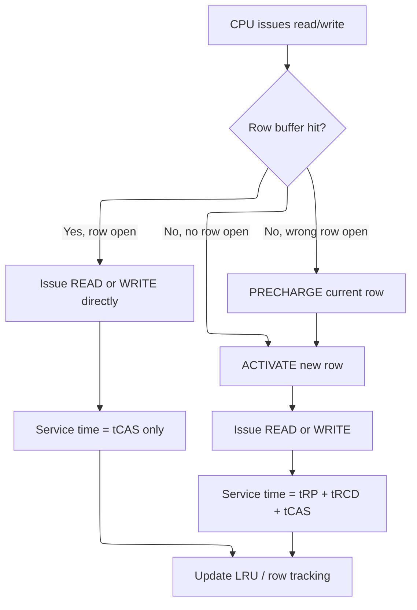
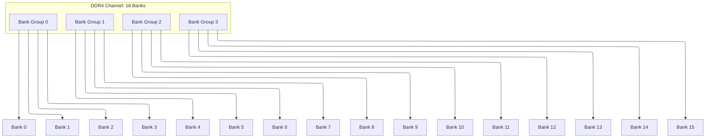
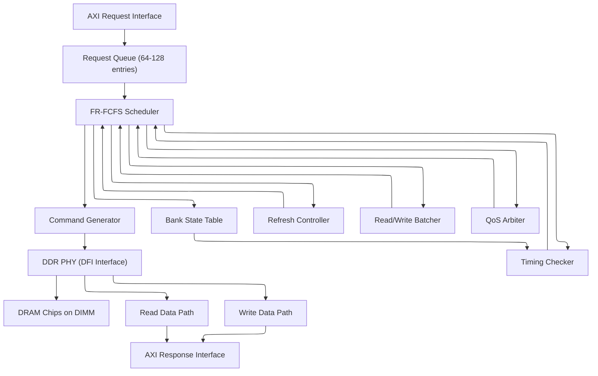
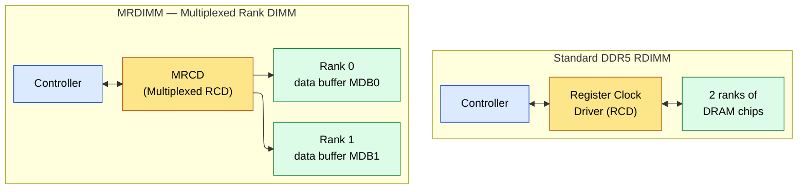
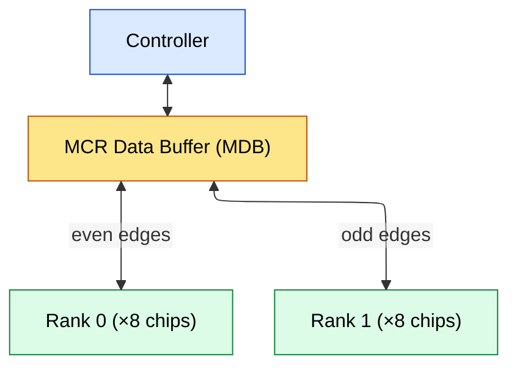
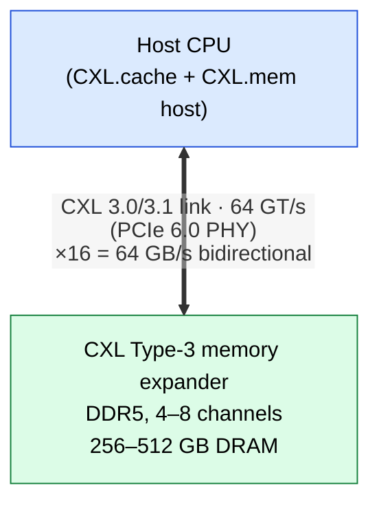

# DDR Memory Controller -- From Protocol to Scheduler

> **Prerequisites:** [Memory.md](Memory.md) (DRAM cell, sense amplifiers, refresh),
> [../Fundamentals/CMOS_Fundamentals.md](../00_Fundamentals/CMOS_Fundamentals.md) (signal integrity, timing),
> Cache_Microarchitecture.md (understanding of row buffer as cache analogy)
>
> **Hands-off to:** [AHB_AXI_APB.md](AHB_AXI_APB.md) (AXI bus that connects to the controller),
> [CPU_Architecture.md](CPU_Architecture.md) (memory stalls, OoO interaction)

---

## 0. Why This Page Exists

A DDR memory controller is the bridge between the processor's cache hierarchy (which speaks
AXI or a similar bus protocol) and the DDR DRAM chips on the DIMM. Every read miss that
leaves L3 cache must traverse this controller. Understanding the controller is essential
because:

- DDR timing constraints (tRCD, tRP, tRAS) are the dominant source of memory latency.
- The scheduler inside the controller determines whether a request hits an open row (fast)
  or must open a new one (slow), directly affecting effective bandwidth.
- Refresh overhead grows with density; at 16 Gb and above, refresh steals 5-8% of all
  bandwidth and introduces unpredictable latency spikes.
- DDR5 introduces dual subchannels and same-bank refresh, fundamentally changing how
  controllers must be architected.

This page walks through the DDR interface, timing parameters, scheduling algorithms, and
ends with worked interview problems of the kind asked at NVIDIA, AMD, Google, and Apple
for memory subsystem and DDR controller design roles.

---

## 1. DDR Interface Signals

### 1.1 Command and Address Bus

DDR uses a shared command/address bus that is sampled on both edges of the clock.
Commands are encoded by the combination of several control pins:

| Signal | Direction | Function |
|--------|-----------|----------|
| CS_n   | Controller -> DRAM | Chip Select (active low). Must be asserted for any command. |
| RAS_n  | Controller -> DRAM | Row Address Strobe (active low). Low for ACTIVATE. |
| CAS_n  | Controller -> DRAM | Column Address Strobe (active low). Low for READ/WRITE. |
| WE_n   | Controller -> DRAM | Write Enable (active low). Low for WRITE. |
| CKE    | Controller -> DRAM | Clock Enable. High for normal operation, controls power-down. |
| ACT_n  | Controller -> DRAM | DDR4/5 ACTIVATE pin (separate encoding to distinguish ACT from MRS). |

**Command encoding by pin combination (DDR4):**

```text
CS_n  ACT_n  RAS_n  CAS_n  WE_n  | Command
---------------------------------------------
 0      0      X      X      X   | ACTIVATE
 0      1      0      0      1   | READ
 0      1      0      1      0   | WRITE
 0      1      0      1      1   | PRECHARGE (all or single bank)
 0      1      1      0      0   | REFRESH (all bank)
 0      1      1      0      1   | MODE REGISTER SET (MRS)
 0      1      1      1      0   | ZQ calibration
 0      1      1      1      1   | NOP
 1      X      X      X      X   | DESELECT (no operation)
```

The address bus A[17:0] (or A[13:0] on smaller densities) carries the row address during
ACTIVATE and the column address during READ/WRITE. Bank address bits BA[1:0] and bank
group bits BG[1:0] select the target bank.

### 1.2 Data Bus

| Signal | Width | Direction | Function |
|--------|-------|-----------|----------|
| DQ     | 8 per byte lane | Bidirectional | Data bus. 64-bit DIMM = 8 byte lanes = 64 DQ lines. |
| DQS    | 1 per byte lane | Bidirectional | Data Strobe. Source-synchronous clock for data capture. |
| DM     | 1 per byte lane | Write only | Data Mask. DM=1 means do not write that byte. |
| TDQS_n | 1 per byte lane | Optional | Termination Data Strobe (DDR3/4, for signal integrity). |

**DQS is the critical signal.** During writes, the controller drives DQS edge-aligned with
DQ. During reads, the DRAM drives DQS edge-aligned with DQ, and the controller uses a
delay-locked loop (DLL) to center the capture clock within the data eye.

**Per-byte-lane structure (x8 device):**

```text
DQ[7:0] ---- data bits for byte lane 0
DQS_t   ---- differential strobe positive
DQS_c   ---- differential strobe negative
DM_n    ---- data mask for byte lane 0

A 72-bit DIMM (64 data + 8 ECC):
  9 x8 devices, each contributing 8 DQ + 1 DQS pair + 1 DM
  = 72 DQ + 9 DQS pairs + 9 DM signals
```

### 1.3 Clock and Training

| Signal | Function |
|--------|----------|
| CK/CK_n | Differential clock. All commands sampled on rising edge of CK. |
| RESET_n | Asynchronous reset (DDR4/5 only; DDR3 uses ODT for some functions). |
| ODT | On-Die Termination. DRAM enables internal termination resistor. |
| ZQ | Calibration pin for output driver and ODT impedance. |

**Read leveling:** The controller adjusts per-byte-lane delay to center DQS within the DQ
eye during reads. Because each byte lane can have different flight time from the DRAM to
the controller (due to trace length mismatch on the PCB), each lane needs independent
delay calibration.

**Write leveling:** The controller adjusts the DQS launch time relative to CK so that DQS
arrives at the DRAM aligned with the clock, meeting setup/hold at the DRAM's receiver.

```text
DDR4-3200 data eye (per byte lane):
  UI (Unit Interval) = 1/3200 MHz = 312.5 ps
  Total eye width    ~250 ps (after jitter and ISI)
  Setup time         ~80 ps
  Hold time          ~80 ps
  Margin             ~90 ps on each side

Training aligns DQS capture to the center of this 250 ps eye.
At DDR5-6400, UI = 156 ps -- margin shrinks to ~40 ps.
```

### 1.4 DDR4 vs DDR5 Interface Comparison

| Feature | DDR4 | DDR5 |
|---------|------|------|
| Data bus per DIMM | 72-bit (64+8 ECC) single channel | 2 x 40-bit (32+8 ECC) subchannels |
| Subchannel independence | N/A | Each subchannel operates independently |
| Max data rate | 3200 MT/s (JEDEC), 4000+ (OC) | 6400 MT/s (JEDEC), 8000+ (OC) |
| Bank groups | 4 | 8 (4 per subchannel) |
| Banks per group | 4 | 4 |
| Burst length | 8 (BL8) or 4 (OTF) | 8 (BL8) or 16 (BL16) |
| Refresh modes | All-bank, per-bank | All-bank, same-bank (SBR) |
| Power management | PMIC on motherboard | PMIC on DIMM |
| Command/address bus width | 20-bit (A[17:0] + BA + BG) | Increased for more banks |
| DFE | No | Yes (Decision Feedback Equalization) |

**DDR5 dual subchannel is the biggest architectural change.** A single DDR5 DIMM presents
two independent 32-bit data paths to the controller. This doubles the number of banks
available for parallel scheduling without increasing the per-channel data bus width. The
controller can issue commands to both subchannels simultaneously (subject to C/A bus
contention, since they share the command bus on most DIMM configurations).

---

### 1.5 DFI (DDR PHY Interface)

The DFI protocol connects the DDR controller to the PHY (physical layer). It defines signals for clock, command/address, write data, read data, and training control. This boundary is where controller timing ends and analog PHY timing begins.

**Key signal groups:**

| Signal Group | Direction | Function |
|-------------|-----------|----------|
| dfi_address, dfi_cs_n, dfi_cke | Controller -> PHY | Command/address forwarding |
| dfi_wrdata_en, dfi_wrdata | Controller -> PHY | Write data path enable + data |
| dfi_rddata_en, dfi_rddata | PHY -> Controller | Read data path enable + data |
| dfi_ctrlupd_req/ack | Both | PHY update handshake |

**DFI timing:** The controller sends commands with a programmable latency (DFI frequency ratio). The PHY handles signal integrity (ODT, drive strength, termination). The DFI frequency ratio accommodates cases where the controller and PHY run at different clock frequencies (e.g., controller at 1/2 or 1/4 the PHY frequency).

**Why it matters:** Debugging DDR issues often requires tracing across the DFI boundary. The controller issues a READ command on DFI; the PHY translates this to DRAM-specific timing. If read data returns corrupted, the question is whether the controller sent the wrong timing, the PHY misaligned the capture point, or the DRAM itself produced bad data.

---

## 2. DDR Commands in Detail

### 2.1 ACTIVATE (ACT)

Opens a row in a specific bank. The row address is provided on the address bus.

1. **CS_n=0, ACT_n=0, A[17:0]=row_addr, BA[1:0]=bank, BG[1:0]=bank_group**

After ACTIVATE:
- The wordline for the selected row goes high
- All bitlines in that bank develop differential voltage (charge sharing)
- Sense amplifiers latch the row data
- The row is now "open" and columns can be read/written
- The bank must wait tRCD before accepting a READ or WRITE command

### 2.2 READ

Reads one or more columns from the currently open row.

```text
Cycle 0:  CS_n    = 0, ACT_n=1, RAS_n=0, CAS_n=0, WE_n=1
          A[17:0] = column_addr (lower bits), BA=bank, BG=bank_group
          A10     = 0 (don't auto-precharge) or A10=1 (auto-precharge after read)

Data appears on DQ after CAS Latency (CL) clock cycles:
  DDR4-3200 CL22: data appears 22 clock cycles after READ command
  At 1600 MHz clock: 22 * 0.625 ns = 13.75 ns from READ to first data

Burst length 8 (BL8): 8 data transfers on both clock edges = 4 clock cycles
  Total data: 8 transfers * 8 bytes                        = 64 bytes per READ command
```

### 2.3 WRITE

Writes data to one or more columns in the currently open row.

```text
Cycle 0:  CS_n    = 0, ACT_n=1, RAS_n=0, CAS_n=1, WE_n=0
          A[17:0] = column_addr, BA=bank, BG=bank_group

Write latency is typically CL-1 or CWL (CAS Write Latency).
  DDR4-3200 CWL16: data must be driven 16 clock cycles after WRITE command

The DQS strobe must be driven by the controller edge-aligned with DQ.
DM_n per byte lane: DM_n=1 masks that byte (not written).
```

### 2.4 PRECHARGE (PRE)

Closes the open row in a bank, preparing it for a new ACTIVATE.

Cycle 0:  CS_n=0, ACT_n=1, RAS_n=0, CAS_n=1, WE_n=1
A10=0, BA=bank (single bank precharge)
A10=1 (precharge ALL banks)

**After PRECHARGE:**
   - Bitlines are equalized back to VDD/2
   - Sense amplifiers are turned off
   - The row is closed (data is destroyed unless restored by sense amp write-back)
   - Must wait tRP before next ACTIVATE to the same bank

### 2.5 REFRESH (REF)

Refreshes charge in DRAM cells to prevent data loss from leakage.

**All-bank refresh:**
   - CS_n=0, ACT_n=1, RAS_n=1, CAS_n=0, WE_n=0, A10=1
   - All banks must be precharged (idle) before REFRESH
   - Duration: tRFC (typically 350 ns for 8 Gb, 550 ns for 16 Gb DDR4)
   - During tRFC, NO commands can be issued to any bank

**Per-bank refresh (DDR4 only):**
   - A10=0, BA=bank
   - Only the specified bank is unavailable; other banks can serve requests

Refresh rate: 8192 refresh commands per tREFW (64 ms)
tREFI = 64 ms / 8192 = 7.8 us average interval between refreshes

### 2.6 Mode Register Set (MRS)

Configures DRAM operating parameters: CAS latency, burst length, write recovery,
read/write training modes, DLL settings, and more. DDR4 has 7 mode registers (MR0-MR6),
DDR5 extends to MR0-MR7 plus additional control registers.

---

## 2.7 DRAM Initialization Sequence (DDR4)

After power-on or reset, the DDR controller must initialize the DRAM through a strict sequence before normal operation can begin.

1. **Apply stable power and clock.** Wait $t_{\text{INIT1}}$ (minimum stable power time).
2. **Deassert RESET_n.** Wait $t_{\text{INIT3}}$ (500 $\mu$s).
3. **Assert CKE high.** Wait $t_{\text{INIT5}}$.
4. **Issue MRS commands** to configure mode registers:
   - MR0: burst length, CAS latency, read burst type
   - MR1: DLL enable, output drive strength, ODT
   - MR2: CRC, write leveling
   - MR3: MPR (Multi-Purpose Register)
   - MR4: $t_{\text{REFI}}$ mode
   - MR5: CA parity latency
   - MR6: $t_{\text{CCD\_L}}$, VrefDQ training
5. **Issue ZQCL** (ZQ Calibration Long). Wait $t_{\text{ZQinit}}$ (640 $\mu$s).
6. **Perform read/write training** (write leveling, read leveling -- see below).
7. **Transition to normal operation.**

The entire initialization sequence takes 1--10 ms depending on the training algorithms used. During this time, the memory controller cannot service any requests.

### Read/Write Training Algorithms

**Write leveling:** Adjust the DQS delay per byte lane so that DQS edges align with the clock at the DRAM. The controller sweeps DQS delay; the DRAM reports alignment via a feedback mode register. This compensates for PCB trace length differences between CK and DQS.

**Read leveling:** Adjust the DQS capture delay per byte lane to center the sampling point in the data eye. The controller sweeps delay, finds the left and right edges of the eye, then sets the delay to the midpoint.

**MPR training:** DDR4's dedicated Multi-Purpose Register provides a known training pattern (e.g., a repeating 0101... sequence). This enables eye-width measurement without normal traffic, giving more accurate calibration.

**Typical training time:** 5--50 ms per channel, depending on algorithm and board complexity. More sophisticated algorithms (sweeping both edges, measuring eye height as well as width) take longer but produce more robust timing margins.

---

## 3. Timing Parameters with Derivations

### 3.1 Core Timing Parameters

**tRCD (RAS-to-CAS Delay):** Time from ACTIVATE to when the bank can accept a READ or
WRITE. This is the time for the wordline to fully assert, charge sharing to occur on
all bitlines, and the sense amplifiers to fully latch the row data.

```text
tRCD = t_wordline_assert + t_charge_sharing + t_sense_amp_latch

Typical: 12-18 ns (DDR4-3200: ~13.75 ns = 22 tCK at 1600 MHz)
```

**tCL (CAS Latency):** Number of clock cycles from READ command to first data appearing
on DQ. This includes column decode, sense amplifier output driver, and data path to pins.

```text
tCL (CAS Latency, in clock cycles):
  DDR4-3200 CL22: 22 tCK = 13.75 ns
  DDR5-5600 CL30: 30 tCK = 10.71 ns

Note: tCL is specified in clock cycles (tCK), not nanoseconds.
  The actual latency in ns depends on the clock frequency.
  DDR5 has lower ns latency despite higher CL in tCK (faster clock).
```

**tRP (Row Precharge Time):** Time from PRECHARGE to when the bank can accept a new
ACTIVATE. This is the time to equalize bitlines and de-assert the wordline.

```text
tRP = t_bitline_equalize + t_wordline_deassert

Typical: 12-18 ns (same ballpark as tRCD)
```

**tRAS (Row Active Time):** Minimum time a row must remain active (from ACTIVATE to
PRECHARGE). Ensures sense amplifiers have enough time to fully restore cell charge.

```text
tRAS > t_sense_restore_min

Typical: 28-40 ns
```

**tRC (Row Cycle Time):** Minimum time between two ACTIVATE commands to the SAME bank.

```text
tRC = tRAS + tRP

Derivation: ACT(row A) -> wait tRAS -> PRE(row A) -> wait tRP -> ACT(row B)
Total time from first ACT to second ACT on the same bank: tRAS + tRP = tRC

Typical: 45-55 ns
```

**tCCD (Column-to-Column Delay):** Minimum time between two column commands (READ or
WRITE) to the same bank group or different bank groups.

```text
tCCD_L (Long, same bank group): 8 tCK (DDR4), 8 tCK (DDR5)
tCCD_S (Short, different bank group): 4 tCK (DDR4), 4 tCK (DDR5)

Purpose: limits column command rate to what the internal DRAM core can sustain.
Same bank group is slower because the internal data path is shared within a BG.
```

**tFAW (Four Activate Window):** No more than 4 ACTIVATE commands in any tFAW window.

```text
tFAW typical: 16-40 ns
Sliding window constraint: 4 ACTs in tFAW ns, then must wait.

Purpose: limits peak current from VDD supply during row activation.
Each ACT charges ~8K bitlines simultaneously (~10 mA per ACT).
4 simultaneous ACTs = ~40 mA spike on VDD.
```

**tRRD (Row-to-Row Delay):** Minimum time between ACTIVATE commands to different banks.

```text
tRRD_L (same bank group): ~6 ns
tRRD_S (different bank group): ~4 ns

Purpose: stagger ACTIVATE commands to spread current draw over time.
```

#### Complete Timing Diagram: ACT -> READ -> PRE -> ACT on the Same Bank

```ascii-graph
DDR4-3200 (tCK = 0.625 ns), Bank 0
tRCD = 13.75 ns (22 tCK), tCL = 13.75 ns (22 tCK), tRP = 13.75 ns (22 tCK)
tRAS = 35 ns (56 tCK), tRC = 48.75 ns (78 tCK)

                |<--- tRCD (22 tCK) --->|<-- tCL (22 tCK) -->|
                |                        |                     |
Time (tCK):  0  2  4  ...  20  22  24  ...  42  44  46  ...  54  56  58  ...  76  78
             |                       |                        |                   |        |
CMD:         ACT                     READ                     ---                 PRE      ACT
             B0,row5                 B0,col10                                     B0       B0,row7

DQ:          ----                    ---------<D0,D0,D0,D0,D0,D0,D0,D0>-----------
                                                             ^                   
                                                    Data appears at tCK = 22+22 = 44
                                                    BL8: 8 transfers over 4 tCK

Constraints verified:
  ACT -> READ:   22 - 0  = 22 tCK >= tRCD(22)    ✓  row must be open tRCD before READ
  ACT -> PRE:    56 - 0  = 56 tCK >= tRAS(56)    ✓  row active at least tRAS
  PRE -> ACT:    78 - 56 = 22 tCK >= tRP(22)      ✓  bank precharged tRP before new ACT
  ACT -> ACT:    78 - 0  = 78 tCK >= tRC(78)      ✓  same-bank cycle time = tRAS + tRP

  Data return:   tCK 44 to 48 (4 tCK for BL8 at DDR)

Total time for one read of row5 + precharge + activate row7:
  78 tCK = 48.75 ns

If row7 were already open (row hit), the PRE and second ACT are not needed:
  ACT -> READ -> data = 0 + 22 + 22 + 4 = 48 tCK = 30 ns

Row miss penalty: 48.75 - 30 = 18.75 ns (the PRE+ACT overhead)

Summary of labeled intervals:
  tRCD = ACT to READ delay (row opens, sense amps latch)
  tCL  = READ to first data (column decode + data path to pins)
  tRP  = PRE to next ACT (bitline equalization + wordline deassert)
  tRAS = minimum ACT to PRE (sense amp restore cell charge)
  tRC  = minimum ACT to ACT on same bank = tRAS + tRP
```

### 3.2 Refresh Timing

**tRFC (Refresh Cycle Time):** Duration of an all-bank refresh operation.

```text
tRFC scales with DRAM density (more rows = more time to refresh):

| Density | tRFC (ns) | tREFI (us) | Refresh overhead |
|---------|-----------|------------|------------------|
| 4 Gb    | 260       | 7.8        | 260/7800 = 3.3%  |
| 8 Gb    | 350       | 7.8        | 350/7800 = 4.5%  |
| 16 Gb   | 550       | 7.8        | 550/7800 = 7.1%  |
| 24 Gb   | 650       | 7.8        | 650/7800 = 8.3%  |

tREFI = 64 ms / 8192 = 7.8125 us (average interval between refresh commands)
```

The refresh overhead is calculated as: a refresh command must be issued every 7.8 us
on average, and each refresh blocks all banks for tRFC. So the fraction of time the
DRAM is unavailable is tRFC / tREFI.

### 3.3 Bank-Level Timing Constraints

**tRRD (Row-to-Row Delay):** Minimum time between ACTIVATE commands to DIFFERENT banks.

```text
tRRD_L (same bank group, DDR4): ~6 ns  (Long, more restrictive)
tRRD_S (diff bank group, DDR4): ~4 ns  (Short, less restrictive)

Purpose: limit current spikes. Each ACTIVATE draws a surge of current
to charge all bitlines. Staggering ACTIVATEs spreads the current draw.
```

**tFAW (Four Activate Window):** No more than 4 ACTIVATE commands may be issued within
any window of tFAW duration.

tFAW typical: 16-40 ns (scales with density and data rate)

**This is a sliding window constraint:**
   - If ACT_0, ACT_1, ACT_2, ACT_3 are issued at times t0, t1, t2, t3,
   - then ACT_4 cannot be issued until t0 + tFAW.

Purpose: limits peak current draw from the power supply.
4 simultaneous ACTIVATEs could draw > 1A peak on the VDD supply.

### 3.4 Timing Diagram: Interleaved Bank Access

```text
Timing: ACT bank0 row5 -> READ bank0 col10 -> ACT bank1 row3 -> READ bank1 col20

                |<-- tRCD -->|            |<-- tRCD -->|
Cycle:  0   5   10  13.75  15  16  17   22  25.75  28  30
        |    |    |       |   |   |    |   |      |   |
CMD:    ACT  ---  READ    --- |   ACT  --- READ   --- ---
        B0,R5      B0,C10     |   B1,R3     B1,C20
                              |
                        tRRD_S >= 4ns (ACT_B0 to ACT_B1)
                        Check: |16 - 0| = 16ns > tRRD_S (OK)

DQ:     ---- ----------<D0,D0,D0,D0>----<D1,D1,D1,D1>
                       ^                   ^
                  CL=22 cycles        CL=22 cycles
                  after READ_B0       after READ_B1

Key constraints satisfied:
  tRCD:  ACT_B0 at t=0, READ_B0 at t=13.75ns (13.75 > tRCD=13.75) OK
  tRRD_S: ACT_B0 at t=0, ACT_B1 at t=16ns (16 > tRRD_S=4ns) OK
  tFAW:  Only 2 activates in any tFAW window (4 max) OK
  Data bus: READ_B0 data ends before READ_B1 data begins (no collision)
```

---

## 4. Row Buffer Management

### 4.1 The Row Buffer as a Cache

Each DRAM bank has a single row buffer (the sense amplifier array) that holds the
currently open row. This is analogous to a fully-associative cache with exactly one entry
per bank.



### 4.2 Row Buffer Policies

**Open-page policy:** Keep the row open after an access, hoping subsequent accesses
hit the same row (spatial locality within the row, which is typically 8 KB).

**Advantages:**
   - Row hits have zero extra latency (just tCAS)
   - Great for sequential/streaming access patterns
   - Simple implementation: don't issue PRECHARGE after every access

**Disadvantages:**
   - If next access is to a DIFFERENT row in the same bank, must
   - pay tRP (precharge) + tRCD (activate) = ~30 ns penalty
   - Wastes energy keeping the row buffer powered
   - Worse for random access patterns

Typical row buffer hit rate: 40-60% for server workloads
30-40% for random client workloads

**Close-page policy:** Automatically precharge the row after each access.

```text
Advantages:
  - Every access starts from a clean state (no row open)
  - Predictable latency: always tRCD + tCAS (no tRP wait, bank is pre-precharged)
  - Better for random access patterns

Disadvantages:
  - Even consecutive accesses to the same row pay tRCD every time
  - Higher energy per access (repeated sense amp activation)
  - Reduced throughput for streaming workloads
```

**Adaptive policy (most modern controllers):**

#### Open-Page vs Close-Page — Hit Rate Modeling with Numerical Examples

```text
Access latency model:
  Row hit:   tCAS = 13.75 ns (DDR4-3200)
  Row miss:  tRP + tRCD + tCAS = 13.75 + 13.75 + 13.75 = 41.25 ns
  Row empty: tRCD + tCAS = 13.75 + 13.75 = 27.5 ns (no precharge needed)

Scenario 1: Sequential access to 8 KB row (128 cache lines of 64 B)
  Open-page:  first access = row miss (27.5 ns), next 127 = row hits (13.75 ns each)
  Close-page: every access = row empty (27.5 ns)
  Open-page avg: (27.5 + 127*13.75) / 128 = 13.86 ns -> 99.2% hit rate
  Close-page avg: 27.5 ns -> 0% hit rate (by definition)
  Open-page wins by 2x for sequential access.

Scenario 2: Random access to 16 different rows in the same bank
  Open-page:  P(hit) = 1/16 = 6.25% (only hit if same row as last access)
  Close-page: P(hit) = 0%
  Open-page avg: 0.0625*13.75 + 0.9375*41.25 = 39.53 ns
  Close-page avg: 27.5 ns (always row empty, no tRP needed)
  Close-page wins by 30%! (open-page wastes time on mispredicted row hits)

Scenario 3: Strided access with stride = 256 B (4 cache lines)
  Row size = 8 KB = 128 cache lines
  Lines per row before row change: 128/4 = 32 hits, then miss
  Open-page hit rate: 31/32 = 96.9%
  Open-page avg: 0.969*13.75 + 0.031*41.25 = 14.6 ns
  Close-page avg: 27.5 ns
  Open-page wins.

Break-even hit rate where open-page = close-page:
  h*13.75 + (1-h)*41.25 = 27.5
  13.75h + 41.25 - 41.25h = 27.5
  -27.5h = -13.75
  h = 0.50

  If hit rate > 50%: open-page is faster.
  If hit rate < 50%: close-page is faster.
  At exactly 50%: equal.
```

**Practical hit rates by workload:**

| Workload | Access Pattern | Row Hit Rate | Best Policy |
|----------|---------------|-------------|-------------|
| memcpy / streaming | Sequential, unit stride | >95% | Open-page |
| Matrix multiply (row-major) | Sequential within row | >90% | Open-page |
| Database index scan | Semi-random, some locality | 40-60% | Adaptive |
| Graph traversal (BFS) | Random, no locality | 10-25% | Close-page |
| Pointer chasing (linked list) | Fully random | <10% | Close-page |
| Mixed (server) | Combination of above | 30-50% | Adaptive |

**Track per-bank access history:**
   - If the last N accesses to a bank all hit the same row -> keep open
   - If the last access was a miss -> precharge after a timeout

**Timeout-based:**
   - After serving a request, start a timer
   - If no new request to the same bank/row arrives within timeout -> PRECHARGE
   - If a request arrives -> serve it (hit) and reset timer

**Threshold-based:**
   - Count consecutive row hits in the current open row
   - If count > threshold: high locality detected, keep open
   - If count == 0 (miss): precharge immediately (close-page behavior)

#### Row Buffer Hit Rate Modeling

```text
For a workload with uniform random access to B banks, R rows per bank,
and a working set of W rows:

If W <= R (working set fits in one row per bank):
  P(hit) ≈ 1 - (1/B) for each access after warmup
  (High hit rate: most accesses go to the already-open row)

If W >> R (working set much larger than rows per bank):
  P(hit) ≈ 1/W (each access equally likely to hit any row)
  Open-page: P(hit) ≈ 1/W ≈ 0 for large W
  Close-page: P(hit) = 0 by definition

For streaming access (sequential cache lines within the same row):
  Row size = 8 KB, cache line = 64 B
  Lines per row = 8192 / 64 = 128 consecutive hits before row change
  P(hit) = 127/128 ≈ 99.2%

For strided access with stride S bytes:
  If S <= row_size: P(hit) = row_size / S (until row boundary)
  If S > row_size:  P(hit) = 0 (every access is a new row)

Average access time model:
  t_avg = P(hit) * tCAS + (1 - P(hit)) * (tRP + tRCD + tCAS)

Numerical (DDR4-3200):
  P(hit) = 0.50: t_avg = 0.5*13.75 + 0.5*(13.75+13.75+13.75) = 27.5 ns
  P(hit) = 0.00: t_avg = 41.25 ns (always miss)
  P(hit) = 0.99: t_avg = 13.89 ns (almost always hit)

Break-even hit rate where open-page beats close-page:
  tCAS < (tRP + tRCD + tCAS) always
  So open-page always wins if P(hit) > 0
  But open-page wastes energy at P(hit) < ~10%
```

---

## 5. Bank-Level Parallelism

### 5.1 Bank and Bank Group Structure



**Why bank groups exist:** Starting with DDR4, the internal DRAM core cannot keep up with
the external data rate. Bank groups allow the controller to issue commands to banks in
different groups with shorter timing (tCCD_S) than banks within the same group (tCCD_L).

```text
tCCD_S (short, different bank group): ~4 clock cycles between column commands
tCCD_L (long, same bank group):       ~8 clock cycles between column commands

This means back-to-back READs to different bank groups can pipeline more tightly
than reads within the same bank group.
```

### 5.2 Interleaving

Cache-line interleaving maps consecutive cache lines to different banks (and bank groups)
so that multiple requests can be served in parallel.

```text
Address mapping (example for DDR4, 64-byte cache lines, 16 banks):

  Physical Address bits:
  [63:28] Channel select (for multi-channel)
  [27:24] Rank select
  [23:20] Bank Group [1:0] + Bank [1:0]  <- interleaved at cache line granularity
  [19:6]  Row address
  [5:3]   Column address (within row, 64B line = 8 column addresses at BL8)
  [2:0]   Byte offset within cache line

For sequential accesses to addresses 0x0000, 0x0040, 0x0080, 0x00C0, ...:
  Each consecutive cache line goes to a different bank
  All 16 banks can be active simultaneously
  Controller can pipeline ACTIVATEs and READs across banks
  Peak bandwidth requires all banks to be kept busy
```

### 5.3 DDR5 Subchannel Architecture

**DDR5 DIMM (single-rank, x8 devices):**

Subchannel A (40-bit):                Subchannel B (40-bit):
BG[0:3] x 4 banks each              BG[0:3] x 4 banks each
= 16 banks total                     = 16 banks total
Data: DQ[31:0] + ECC[7:0]           Data: DQ[31:0] + ECC[7:0]

Total per DIMM: 32 banks (2x16), 64 data bits + 16 ECC bits

**Advantage over DDR4 single channel:**
   - 2x more banks available for scheduling
   - Independent command streams (controller can issue to both subchannels)
   - Higher scheduling flexibility for FR-FCFS

Constraint: C/A bus is shared between subchannels on standard DIMMs.
Only one command per clock cycle, so the controller must alternate
between subchannel A and B on the shared command bus.
Some designs use dual-C/A DIMMs to eliminate this bottleneck.

---

## 6. Refresh Scheduling

### 6.1 Refresh Timing Model

**Refresh parameters:**
   - tREFW = 64 ms       (refresh window)
   - 8192 refresh commands must be issued within tREFW
   - tREFI = 64ms / 8192 = 7.8125 us (average interval)
   - tRFC = 350 ns (8 Gb DDR4) or 550 ns (16 Gb DDR4)

- **Refresh overhead** = `tRFC / tREFI`

**For 8 Gb DDR4:**
   - Overhead = 350 ns / 7812.5 ns = 4.48%
   - During each tRFC, ALL banks are idle -> 350 ns of dead time

**For 16 Gb DDR4:**
   - Overhead = 550 ns / 7812.5 ns = 7.04%
   - Getting worse with each generation!

### 6.2 Refresh Scheduling Strategies

**Postponed refresh:** The controller can delay a refresh by up to 8x tREFI (for DDR4)
to serve pending requests. The delayed refreshes must be made up later.

```text
Normal schedule: REF at t=7.8, 15.6, 23.4, ... us
Postponed:       REF delayed to serve pending reads
                 Accumulated debt: up to 8 REF commands can be postponed
                 Must issue them before tREFW expires

Risk: If too many refreshes are postponed, a "refresh storm" occurs near
the end of the 64 ms window, causing a burst of long latency spikes.
```

**Sneak refresh:** When the request queue is empty, issue a refresh early (ahead of
schedule). This fills idle time and reduces the chance of refresh storms later.

```text
if (request_queue_empty && refresh_pending_within_window) {
    issue_refresh();
    // No performance impact: no requests are delayed
}
```

**Per-bank refresh (DDR4):** Refresh one bank at a time instead of all banks.

**All-bank refresh:**
   - All 16 banks blocked for tRFC = 350 ns
   - Other requests must wait

**Per-bank refresh:**
   - Bank 0 refreshed: only bank 0 blocked for tRFC_pb (~140 ns)
   - Banks 1-15 can still serve requests!
   - 16 per-bank refreshes needed to cover all banks
   - tREFI_pb = 7.8 us / 16 = 488 ns

Per-bank refresh overhead: 140 ns / 488 ns = 28.7% for the single bank,
but other 15 banks are free -> system-level overhead is much lower.

**Same-bank refresh (DDR5):** Refresh the same bank number across all bank groups
simultaneously.

```text
Same-bank refresh (SBR):
  Refresh bank 0 of BG0, BG1, BG2, BG3 simultaneously
  Other banks (1, 2, 3) in each BG can still serve requests
  Fewer total refresh commands needed vs per-bank
  tRFC_sb ~ 200-300 ns (shorter than all-bank tRFC)
```

---

## 7. Scheduling Algorithm

### 7.1 FR-FCFS (First Ready, First Come First Served)

FR-FCFS is the standard DDR scheduling algorithm used in virtually all modern controllers.

**Priority ordering:**

1. REFRESH (highest priority, if refresh is due)
2. WRITE (if write buffer exceeds threshold, drain writes)
3. ROW HIT (read or write to the currently open row in a bank)
4. OLDEST ready request (first come, first served among ready commands)

**Why row hits are prioritized:**
   - Row hit latency:  ~13.75 ns (tCAS only)
   - Row miss latency: ~44 ns    (tRP + tRCD + tCAS)
   - A row hit is 3x faster -> prioritize to maximize throughput

### 7.2 Read-Write Batching

Switching between reads and writes on the data bus incurs a turnaround penalty
(bus reversal, DLL re-sync). The controller batches reads and writes to minimize
switches.

```text
Read from DDR:
  data0
  data1
  data2
  ...
  Read-to-Write turnaround (tRTW) = CL - CWL + burst_length + guard_band
  ...
  Write to DDR:
  dataA
  dataB

Typical tRTW: ~5-10 ns.
During this time, the data bus is idle.
```

**Strategy:**
   - Accumulate writes in a write buffer (typically 32-64 entries)
   - When write buffer fill level exceeds threshold (e.g., 75%) -> drain writes
   - During write draining, reads are queued (starved temporarily)
   - After write buffer drains below low threshold -> switch back to reads
   - This minimizes read-write switches to ~1 per batch

### 7.3 Quality of Service (QoS)

In a system with multiple requestors (CPU, GPU, DMA, display controller), the scheduler
must ensure critical traffic is not starved.

```text
QoS levels (typical):
  QoS 3 (Critical):  Display controller, real-time DMA
    -> Guaranteed bandwidth, max latency bound
    -> Can preempt lower-QoS requests

  QoS 2 (High):      CPU data cache misses
    -> High priority in FR-FCFS, but not real-time guaranteed

  QoS 1 (Medium):    GPU texture fetches
    -> Best-effort with bandwidth allocation

  QoS 0 (Low):       Background DMA, prefetch
    -> Lowest priority, can be preempted

Implementation:
  - Each request carries a QoS tag (from AXI AxQOS or internal priority)
  - Scheduler selects highest-QoS ready request first
  - Bandwidth regulator: track per-QoS bandwidth consumed, throttle
    low-QoS traffic if it exceeds allocation
  - Latency regulator: if a QoS 3 request waits > threshold, force-schedule it
```

### 7.4 Controller Microarchitecture Block Diagram



---

## 8. Bandwidth Calculation

### 8.1 Peak Bandwidth

```text
Peak bandwidth = frequency x transfers_per_clock x bus_width / 8 (for bytes)
               = 1600 MHz x 2 (DDR) x 64 bits / 8
               = 25.6 GB/s
```
```text
DDR5-5600: 5600 MT/s x 8 bytes = 44,800 MB/s = 44.8 GB/s

Note: DDR5 has 2 subchannels of 4 bytes each, so:
  DDR5-5600: 5600 MT/s x (4 + 4) bytes = 44.8 GB/s (same total)
```

### 8.2 Effective Bandwidth

```text
Effective BW = Peak BW
             x (1 - refresh_overhead)
             x (1 - tFAW_overhead)
             x row_buffer_hit_rate
             x (1 - read_write_switch_overhead)

Numerical example: DDR4-3200 single channel
  Peak:                  25.6 GB/s
  Refresh overhead:      4.5% -> 0.955
  tFAW overhead:         ~3%  -> 0.97
  Row buffer hit rate:   50% of accesses hit, 50% miss
    Hit time:  tCAS              = 13.75 ns  (transfer 64 bytes)
    Miss time: tRP + tRCD + tCAS = 13.75 + 13.75 + 13.75 = 41.25 ns
    Average access time          = 0.5*13.75 + 0.5*41.25 = 27.5 ns
    Ideal hit-only time          = 13.75 ns
    Row buffer efficiency        = 13.75 / 27.5 = 0.50
  Read/write switch:     ~2%   -> 0.98

Effective BW = 25.6 x 0.955 x 0.97 x 0.50 x 0.98
             = 25.6 x 0.453
             = 11.6 GB/s (about 45% efficiency)

Typical real-world efficiency: 40-60% of peak
```

### 8.3 DDR5 Bandwidth Implications

```text
DDR5-5600 dual-channel system:
  Peak per channel: 44.8 GB/s
  Dual channel:     89.6 GB/s peak

  But with 2 subchannels per DIMM, the controller has 32 banks
  (vs 16 for DDR4) to schedule across. More banks -> better
  bank-level parallelism                          -> higher effective utilization.

  DDR5 BL16 mode: 16 transfers per READ = 128 bytes per command
  (vs DDR4 BL8: 64 bytes per command)
  Fewer commands needed for the same data -> less command bus overhead.
```

---

## 9. ECC in DRAM

### 9.1 SECDED ECC (Industry Standard)

SECDED = Single Error Correction, Double Error Detection.

```text
Hamming code for 64-bit data:
  Data bits:       64
  Check bits:       8  (log2(72) rounded up, with overall parity)
  Total code word: 72 bits per 64-bit word

  Syndrome decoding:
    Syndrome                        = 0:           no error
    Syndrome                        = power of 2:  single-bit error in check bit (correctable)
    Syndrome                        = other:       single-bit error in data bit (correctable)
    Overall parity error + Syndrome = 0: double-bit error (detectable, NOT correctable)

ECC DIMM: 72-bit bus (64 data + 8 ECC) implemented as 9 x8 devices
```

### 9.2 Chipkill

SECDED can correct 1-bit errors within a 72-bit word. But if an entire DRAM chip fails
(a "chip kill"), every word has 8 bit errors -- far beyond SECDED's capability.

Chipkill solution: spread each ECC code word across multiple chips
so that a single chip failure affects at most 1 bit per code word.

**Implementation (AMD, IBM, Intel variants):**
   - Use 36 x4 chips instead of 9 x8 chips
   - Each x4 chip contributes 4 bits to a 144-bit wide code word
   - One chip failure -> 4 bits corrupted in 4 different 72-bit code words
   - Each code word has at most 1 corrupted bit -> SECDED can correct

Or: use Reed-Solomon coding across x4 chips
- Correct up to 4 symbols (4 nibbles = 16 bits) per code word
   - Tolerates complete failure of up to 4 x4 chips

### 9.3 On-Die ECC (DDR5)

DDR5 adds internal ECC within each DRAM chip, independent of the system-level ECC
on the controller side.

**On-die ECC purpose:**
   - Protect against single-bit errors caused by radiation, charge leakage,
   - or manufacturing defects WITHIN the DRAM chip
   - Each 128-bit internal word has 8 bits of on-die ECC
   - Error correction happens transparently before data leaves the chip

Why both on-die AND system-level ECC?
- On-die ECC: corrects internal single-bit errors before they propagate
   - System ECC: corrects errors on the bus, multi-bit chip failures
   - They are independent layers; neither makes the other redundant

Analogy: on-die ECC is like CRC on an Ethernet cable (corrects bit errors
on the link). System ECC is like TCP checksum (end-to-end protection).

---

## 10. DDR5 Changes in Detail

### 10.1 Dual Independent Subchannels

```text
DDR4 DIMM:
  1x 72-bit channel (64 data + 8 ECC)
  Controller sees one 72-bit port

DDR5 DIMM:
  2x 40-bit subchannels (32 data + 8 ECC each)
  Controller sees two independent 40-bit ports
  Each subchannel has its own:
    - Bank state machine (16 banks in 4 bank groups)
    - Row buffer per bank
    - Timing constraints
    - Refresh scheduling

Impact on controller design:
  - Must track 2x the bank states (32 total per DIMM)
  - Scheduler has 2x the banks to exploit for parallelism
  - C/A bus arbitration between subchannels (if shared C/A)
  - Separate read/write data paths for each subchannel
```

#### DDR5 Dual Subchannel — Scheduler Impact

```text
With 32 banks (2x16), the FR-FCFS scheduler can keep more requests in flight:

DDR4 scheduling example (16 banks, open-page):
  Banks 0-15: B0=row5 open, B1=row2 open, B2-B15=idle
  Pending: READ B0 col10 (hit), READ B2 row8 (miss), WRITE B3 row1 (miss)
  Schedule: B0 hit (tCAS), then B2 miss (tRP+tRCD+tCAS), then B3 miss

DDR5 scheduling example (32 banks across 2 subchannels):
  Subchannel A (B0-B15): B0=row5, B2=row3, B4-B7 idle, B8-B15 idle
  Subchannel B (B16-B31): B16=row7, B18=row1, rest idle
  Pending: READ B0 col10 (hit, subch A), READ B16 col20 (hit, subch B)
  Schedule: Both can issue READ simultaneously (different subchannels!)
  Effective throughput: 2x for row-hit requests

The key advantage: two independent row buffers mean two simultaneous row hits.
DDR4 can only hit one row per bank at a time. DDR5 can hit two (one per subchannel).

Command bus contention:
  Standard DIMMs share the C/A bus between subchannels.
  Only one command per clock cycle. Controller must time-multiplex:
    Cycle 0: ACT subchannel A
    Cycle 1: READ subchannel B
    Cycle 2: NOP (timing wait)
    Cycle 3: READ subchannel A
  Premium DIMMs with dual C/A buses eliminate this bottleneck.
```

### 10.2 Decision Feedback Equalization (DFE)

```text
At DDR5 speeds (4400-6400+ MT/s), the data eye is extremely narrow.
Traditional CTLE (Continuous-Time Linear Equalization) is insufficient.

DFE adds a feedback path that subtracts the effect of previously received bits:

  y[n] = x[n] - sum(a[k] * y[n-k], k=1..N)

where:
  x[n] = received signal (with ISI distortion)
  y[n] = equalized output
  a[k] = DFE tap coefficients (trained during calibration)

DFE is implemented in the DDR5 PHY (receiver side).
Requires per-lane training (DDR5 read/write training is more complex than DDR4).
```

### 10.3 DDR5 Same-Bank Refresh (SBR) -- Detailed

DDR5 introduces **Same-Bank Refresh (SBR)**, which refreshes the same bank number
across all bank groups simultaneously. This is fundamentally different from DDR4's
all-bank refresh (which blocks ALL banks).

**DDR5 bank structure (per subchannel):**
   - 4 bank groups (BG0-BG3), 4 banks each = 16 banks

**Same-Bank Refresh:**
   - Refreshes bank 0 of BG0, BG1, BG2, BG3 at the same time
   - Banks 1, 2, 3 in each BG remain available for normal access

tRFC_sb (same-bank refresh time): ~200-300 ns
Compare: tRFC (all-bank): ~450-550 ns

Refresh scheduling:
16 SBR commands needed per refresh cycle (one per bank number: 0-3 x 4 BGs)
But each SBR covers 4 banks (one per BG), so only 4 SBR rounds needed
for bank 0, then 4 for bank 1, etc.

Effective overhead:
4 bank numbers x tRFC_sb per bank / tREFI
= 4 x 250 ns / 7812 ns = 12.8% for the specific bank being refreshed
But 3/4 of banks remain available, so system-level overhead is much lower.

Impact on controller:
- Must track which bank number is being refreshed
   - Cannot issue commands to bank N of ANY bank group during SBR of bank N
   - Can issue commands to banks 0, 1, 2, 3 of the non-refreshing bank numbers
   - Requires more complex bank state tracking (per-bank-number state machine)

### 10.4 DDR5 On-Die ECC -- Detailed

```verilog
DDR5 adds internal ECC within each DRAM chip (not visible to the controller):

  Internal word: 128 data bits + 8 ECC bits per 136-bit internal code word
  The 8-bit ECC uses a modified Hamming code (SECDED for the internal word)

  Write path:
    Controller sends 32-bit data word (x4 device sends 4 bits per DQ per burst)
    DRAM chip internally computes 8-bit ECC from the 128-bit accumulated word
    Stores 136 bits (128 data + 8 ECC) in the cell array

  Read path:
    DRAM reads 136 bits from cell array
    Internally checks ECC, corrects single-bit errors
    Sends corrected 32-bit data word to controller (ECC bits NOT sent)
    Controller sees only clean data (or detects multi-bit failure via sideband)

  Why on-die ECC does NOT replace system-level ECC:
    - On-die ECC protects against cell-level failures (charge loss, fabrication)
    - System ECC protects against chip-level failures (entire DRAM chip dies)
    - On-die ECC cannot correct an entire chip failure (all 4 or 8 bits corrupted)
    - They are complementary, not redundant

  Area overhead:
    ~6.25% extra cell area (8 ECC bits per 128 data bits)
    Plus ECC computation logic (~0.5% of die area)
    Total die area increase: ~7% (justified by yield improvement at smaller nodes)

  Latency impact:
    Write: +1-2 ns (ECC computation before writing to array)
    Read:  +1-2 ns (ECC check after reading from array)
    Mostly hidden by pipelining in the DRAM chip
```

### 10.3 PMIC on DIMM

```text
DDR4: PMIC on motherboard, shared across all DIMMs
  - Power delivery must be routed from motherboard VRM to each DIMM slot
  - Limited per-DIMM power management granularity

DDR5: PMIC (Power Management IC) on each DIMM
  - 12V input from motherboard
  - PMIC generates VDD (1.1V) and VPP (1.8V) locally on the DIMM
  - Per-DIMM power management: throttle, power-down per rank
  - Simplifies motherboard design (one 12V rail instead of 1.1V precision rail)
  - Enables finer-grained power states for energy-efficient operation
```

### 10.4 Higher Density Chips

```text
DDR5 supports 16 Gb and 24 Gb chips (vs DDR4 max 16 Gb):

  16 Gb, x8: 2 GB per chip, 16 GB per rank (8 chips x 2 GB)
  24 Gb, x8: 3 GB per chip, 24 GB per rank

  Dual-rank DDR5 DIMM with 24 Gb chips: 48 GB per DIMM
  Quad-rank (3DS) DDR5: 96+ GB per DIMM

Impact on refresh:
T = 85C: tREFW = 32 ms -> tREFI = 3.9 us
T = 95C: tREFW = 16 ms -> tREFI = 1.95 us

Refresh overhead doubles (8.9%) and quadruples (17.8%)!
A hot DIMM loses almost 20% of its performance just to refresh.
```

Same-bank refresh (SBR) becomes critical to maintain usable bandwidth.

---

## 10.5 LPDDR4/LPDDR5/LPDDR5X Detailed Comparison

LPDDR (Low-Power DDR) targets mobile and embedded systems where power efficiency is paramount. LPDDR uses lower voltage (1.1 V for LPDDR4, 1.05 V for LPDDR5) and smaller I/O swings compared to standard DDR.

**Key differences from standard DDR:**

- **Bidirectional DQ bus:** LPDDR uses a shared read/write data path at the command level (not separate read/write data paths). This halves the pin count but requires careful bus turnaround scheduling.
- **Separate CA (command/address) bus:** LPDDR4/5 has a dedicated CA bus shared between the two channels, reducing pin count compared to the full-width command bus in DDR4/5.
- **LPDDR5 DVFS:** The DRAM can switch between two operating frequencies (e.g., 3200 and 6400 Mbps) without full re-initialization, using DVFSC (DVFS Set-C) commands. This enables rapid power-performance adaptation.
- **Bank group architecture:** LPDDR5 supports 8 banks in BG mode, 16 banks in 16B mode. More banks provide more bank-level parallelism, allowing the controller to keep more requests in flight.

### LPDDR5 WCK Clock (Double Data Rate Clock)

LPDDR5 introduces a separate WCK (Write Clock) that runs at 2x the command clock:

```verilog
CK (command clock):  used for command/address sampling
WCK (write clock):   used for data synchronization, runs at 2x CK frequency

LPDDR5-6400:
  CK = 1600 MHz (command clock)
  WCK = 3200 MHz (data clock)
  Data rate = 6400 MT/s (DDR on WCK = 2 x WCK_freq)

Why WCK matters:
  - Separate clock allows independent frequency scaling
  - WCK can be disabled during idle periods (power saving)
  - WCK training is separate from CK training (simpler calibration)

WCK-to-CK ratio:
  LPDDR5:  WCK/CK = 2:1 or 4:1 (configurable)
  LPDDR5X: WCK/CK = 4:1 standard (higher data rates require more internal pipelining)
```

#### LPDDR5X WCK Training — Detailed Sequence

WCK training aligns the WCK clock at the DRAM receiver:

1. Controller sends WCK toggle pattern (alternating 0/1 on WCK).
2. DRAM samples WCK at multiple delay taps using an internal delay line.
3. DRAM reports which tap gives the best alignment (via mode register readback).
4. Controller adjusts WCK delay to center the sampling point.

**WCK frequency ratio training (LPDDR5X):**
   - At 4:1 ratio, the DRAM internally divides WCK by 4 to recover the data phase.
   - Training determines the correct phase relationship between WCK and CK.
   - This is more complex than DDR5's DQS training because WCK is a continuous
   - clock (not a strobe that toggles only during data bursts).

**Power advantage of WCK gating:**
   - During idle periods, WCK is driven to a static level (no toggling).
   - WCK driver power = C_load * V_swing^2 * f_WCK
   - At 3200 MHz with 5 pF load and 0.4V swing: ~25 mW per pin
   - Gating WCK saves this power during idle (30-50% of DRAM I/O power).
   - DDR5 DQS toggles on every burst, consuming power even at low utilization.

#### LPDDR5X Masked Writes (Write-X) — Detailed Operation

**Standard DDR5 WRITE:**
   - Controller issues WRITE with full burst data.
   - All bytes in the burst are written to the selected columns.
   - To update a single byte: must READ the row, modify in controller, WRITE back.
   - Cost: 1 READ + 1 WRITE = 2 commands for a partial update.

**LPDDR5X Write-X (Masked Write):**
   - Controller issues WRITE with data + byte mask (DBI pins repurposed).
   - DRAM internally reads the current column value.
   - DRAM merges: for each byte, if mask=1, keep existing value; if mask=0, write new.
   - DRAM writes the merged result back.
   - Cost: 1 command for a partial update.

**Signal mapping during Write-X:**
   - DQ[7:0]:  new data (driven by controller)
   - DM[7:0]:  byte mask (0=write new data, 1=keep existing)

Example: Update bytes 2-3 of an 8-byte column, keep bytes 0-1 and 4-7:
DQ = [XX, XX, 0x42, 0x85, XX, XX, XX, XX]
DM = [ 1,   1,   0,     0,     1,   1,   1,   1  ]
Result in DRAM: bytes 0-1 unchanged, bytes 2-3 = 0x42, 0x85, bytes 4-7 unchanged.

Use case: GPU rendering partially updating a framebuffer pixel.
Without Write-X: 50% of writes to framebuffer are partial (only alpha channel changed).
Each partial write needs read-modify-write: 2x the bandwidth.
With Write-X: 1x bandwidth, 50% reduction in DRAM bus utilization for this workload.

#### LPDDR5X DBI (Data Bus Inversion) — Power Saving Detail

DBI reduces I/O power by minimizing the number of transitions on the DQ bus:

Write DBI (controller -> DRAM):
For each byte of write data:
Count number of '0' bits.
If count > 4 (more zeros than ones): invert the byte, set DBI_n=0.
If count <= 4: send as-is, set DBI_n=1.
DRAM receives: if DBI_n=0, invert the byte back before writing.

Read DBI (DRAM -> controller):
Same logic applied by the DRAM before transmitting.
Controller checks DBI_n and inverts if needed.

**Power saving analysis (per byte lane):**
   - Without DBI: average 4 transitions per byte (50% of 8 bits toggle).
   - With DBI:    average 3 transitions per byte (at most 4 zeros, after inversion).

I/O dynamic power per pin: P = C * V_swing^2 * f * transition_rate
LPDDR5X at 8533 MT/s, 5 pF load, 0.3V swing:
Without DBI: P = 5e-12 * 0.09 * 4266e6 * 0.5 = 0.96 mW/pin
With DBI:    P = 5e-12 * 0.09 * 4266e6 * 0.375 = 0.72 mW/pin
Saving: 0.24 mW/pin * 16 pins (x16 device) = 3.84 mW per device

For a 4-device LPDDR5X package: ~15 mW savings from DBI alone.
Combined with WCK gating and lower VDD (0.9V vs 1.1V for DDR5):
LPDDR5X total I/O power: ~60-80 mW per channel
DDR5 total I/O power: ~120-180 mW per channel
LPDDR5X uses ~50% less I/O power at equivalent data rates.

### LPDDR5X Specific Features

```verilog
LPDDR5X extends LPDDR5 with higher data rates (up to 8533 MT/s) and
improved power efficiency:

1. Variable Refresh (VR):
   - Standard refresh: 8192 commands per 64 ms (fixed rate)
   - Variable refresh: refresh rate adjusted based on temperature
     At low temperature (< 45C): refresh rate can be reduced by 2-4x
     At high temperature (> 85C): refresh rate increased (standard rate)
   - Saves power at room temperature (most mobile devices operate here)

2. Write-X (Masked Write):
   - Allows partial byte writes within a burst without read-modify-write
   - DM (Data Mask) pins indicate which bytes to write and which to skip
   - Eliminates the need for the controller to read the row first
   - Saves one READ + one WRITE per partial update (huge for mobile workloads
     with frequent small updates like UI rendering)

3. Read/Write DBI (Data Bus Inversion):
   - DBI reduces power consumption on the DQ bus by inverting data when
     it would reduce the number of bit transitions
   - Write DBI: if > 50% of bits in a byte are '0', invert the byte and
     set the DBI flag. Fewer '0' bits = less current on the bus.
   - Read DBI: same principle on read data. DRAM can invert before sending.
   - Power saving: 10-20% reduction in I/O power (significant in mobile)

4. Adaptive Refresh Management:
   - Monitors row access patterns for RowHammer protection
   - Implements targeted refresh for frequently accessed rows
   - Managed internally by the DRAM (less controller overhead)

5. How LPDDR Achieves Lower Power Than Standard DDR:

   | Source | LPDDR5 Advantage | Power Saving |
   |--------|-------------------|-------------|
   | Voltage | 1.05 V vs 1.1 V (DDR5) | ~10% dynamic power |
   | I/O swing | Smaller voltage swing on DQ | ~15-20% I/O power |
   | DVFS | Frequency scaling without re-init | 40-60% at low freq |
   | WCK gating | Disable WCK during idle | ~30% idle power |
   | DBI | Data bus inversion | ~10-20% I/O power |
   | CA bus sharing | Shared CA between channels | Fewer pins, less capacitance |
   | No ODT | Simpler termination | Less static power |

   Combined: LPDDR5 uses 30-50% less power than DDR5 at equivalent data rates,
   but with narrower channels (16-bit vs 32-bit subchannel) and lower peak bandwidth.
```

**LPDDR4/5/5X vs DDR4/5 comparison:**

| Attribute | DDR5 | LPDDR5 | LPDDR5X |
|-----------|------|---------|---------|
| Voltage | 1.1 V | 1.05 V | 0.9-1.05 V (DVFS) |
| Max data rate | 6400+ MT/s | 6400 MT/s | 8533 MT/s |
| Channel width | 2 x 32-bit | 2 x 16-bit | 2 x 16-bit |
| Banks | 32 (16 per subchannel) | 16 per channel (8 BG or 16B mode) | 16 per channel |
| DVFS | No | Yes (DVFSC) | Yes (enhanced) |
| WCK clock | No | Yes (2:1 or 4:1) | Yes (4:1) |
| Write-X | No | No | Yes |
| DBI | Optional | Read + Write | Read + Write |
| Target | Servers, desktops | Mobile, embedded | Mobile, AI/ML edge |

---

## Numbers to Memorize

| Parameter | DDR4-3200 | DDR5-5600 | Notes |
|-----------|-----------|-----------|-------|
| Data rate (MT/s) | 3200 | 5600 | Transfers per second per pin |
| Clock frequency (MHz) | 1600 | 2800 | MT/s / 2 (DDR = both edges) |
| Peak BW per channel (GB/s) | 25.6 | 44.8 | MT/s x bus_width_bytes |
| Bus width (bits) | 72 (64+8 ECC) | 2x40 (2x(32+8 ECC)) | DDR5 splits into 2 subchannels |
| Banks total | 16 | 32 (16 per subchannel) | DDR5 has 2x more banks |
| Bank groups | 4 | 8 (4 per subchannel) | |
| tRCD (ns) | 13.75 | 12.86 | ACT to READ/WRITE |
| tRP (ns) | 13.75 | 12.86 | PRE to ACT |
| tRAS (ns) | 35 | 32 | ACT to PRE minimum |
| tRC (ns) | 48.75 | 45.71 | tRAS + tRP |
| tRFC 8Gb (ns) | 350 | 290 | Refresh cycle time |
| tRFC 16Gb (ns) | 550 | 450 | Scales with density |
| tREFI (us) | 7.8125 | 7.8125 | 64ms / 8192 |
| tFAW (ns) | 30 | 21 | 4-activate window |
| tRRD_S (ns) | 4 | 3 | ACT to ACT, different BG |
| tRRD_L (ns) | 6 | 5 | ACT to ACT, same BG |
| tCCD_S (tCK) | 4 | 4 | Col to col, different BG |
| tCCD_L (tCK) | 8 | 8 | Col to col, same BG |
| CAS Latency (CL) | 22 | 30 | In clock cycles |
| CAS Latency (ns) | 13.75 | 10.71 | Absolute time |
| Burst length | 8 | 8 or 16 | DDR5 adds BL16 |
| Refresh overhead (8Gb) | 4.5% | 3.7% | tRFC / tREFI |
| Typical row buffer hit rate | 30-60% | 30-60% | Workload dependent |

---

## 10a. DDR5 Server Extensions: MRDIMM and MCR

### MRDIMM (Multiplexed Rank DIMM)

MRDIMM is a JEDEC-standardized extension for DDR5 that addresses the bandwidth gap between standard DIMMs and HBM in server platforms. It introduces a **multiplexing register (MRCD/MDB)** on the DIMM that aggregates data from multiple ranks and presents a wider logical interface to the memory controller.



The standard RDIMM data bus is 2 × 40-bit subchannels (80-bit with ECC). In an MRDIMM the **MDB** (Multiplexed Data Buffer) sits between the RCD and the DRAM chips; it buffers and re-times data so the DRAM cores can run at a different frequency than the external bus (external bus at 1.5× or 2× the core). The MDB multiplexes data from two ranks onto the same bus, effectively doubling the controller-visible data rate without doubling DRAM core speed.

**MRDIMM signaling and timing:**

| Parameter | DDR5 RDIMM | DDR5 MRDIMM |
|---|---|---|
| DRAM core data rate | 5600 MT/s | 5600 MT/s (core) |
| Effective data rate to controller | 5600 MT/s | 8800 MT/s (1.5x multiplexing) |
| Data buffers per DIMM | 0 (RCD only) | 10 MDB chips (1 per byte lane x 2 subchannels) |
| Latency overhead | Baseline | +5-10 ns (MDB buffering and re-timing) |
| Max DIMM capacity | 128 GB | 256 GB (dual-rank with high-density chips) |

**Controller implications:**

- The controller must support MRDIMM-specific mode registers (MR25-MR34 for MDB configuration, training, and calibration).
- Training is more complex: per-MDB write/read leveling, DFE tuning for the multiplexed data path, and separate PHY calibration for core vs. external clock domains.
- Scheduling sees higher bank-level parallelism because two physical ranks appear as a single logical rank with 2x the banks, but the MDB serialization introduces additional timing constraints (tMDB, multiplexed data buffer turnaround time).

### MCR (Multiplexed Combined Rank) DDR5

MCR DIMMs are Micron's implementation of multiplexed-rank technology (closely related to MRDIMM). MCR stacks two ranks behind a data-buffer chip that time-division multiplexes their data onto the external bus at 2x the per-rank data rate.



The MCR buffer alternates ranks on successive clock edges (even → Rank 0, odd → Rank 1), giving 2× the bandwidth of a single-rank DIMM at the same DRAM core frequency — e.g. a DDR5-5600 core yields an MCR-11200 effective rate to the controller.

**MCR vs MRDIMM:**

| Feature | MCR DIMM | MRDIMM |
|---|---|---|
| Standard | Vendor-specific (Micron) | JEDEC standardized |
| Multiplexing ratio | 2x | 1.5x or 2x |
| Target data rate | DDR5-8800 to DDR5-12800 | DDR5-8800 to DDR5-12800 |
| DIMM capacity | 128 GB (2 ranks x 64 GB) | 128-256 GB |
| Primary market | High-bandwidth servers | High-bandwidth servers |

Both MRDIMM and MCR target the same problem: extracting more bandwidth from the DDR5 DIMM form factor without requiring faster DRAM cores. The controller design must account for the multiplexing buffer's latency, training complexity, and per-buffer timing constraints.

---

## 10b. CXL 3.0/3.1 Type-3 Memory Expansion

### CXL Type-3 Devices for Memory Expansion

CXL (Compute Express Link) Type-3 devices provide **coherent memory expansion** -- allowing a server to attach additional DRAM (or persistent memory) via the PCIe/CXL interface, appearing as system-manageable memory rather than I/O-mapped storage.



The Type-3 device exposes its attached DRAM as coherent memory via CXL.mem, so the host CPU accesses it with near-local latency (cache-coherent reads and writes).

**CXL 3.0/3.1 Type-3 protocol stack:**

| Layer | Function | Notes |
|---|---|---|
| CXL.io | PCIe-compatible I/O, enumeration, configuration | PCIe 6.0 FLIT mode, 64 GT/s |
| CXL.cache | Host-initiated cache-coherent access to device memory | Bidirectional, 256-byte cache lines |
| CXL.mem | Device-attached memory access from host | MemRd/MemWr, coherent with host caches |

**CXL 3.0 key features over CXL 2.0:**

| Feature | CXL 2.0 | CXL 3.0 | CXL 3.1 |
|---|---|---|---|
| Max link speed | 32 GT/s (PCIe 5.0) | 64 GT/s (PCIe 6.0) | 64 GT/s |
| Fabric switching | Single-level fanout | Multi-level fabric switching | Multi-level + enhanced telemetry |
| Memory pooling | Single-level pooling | Multi-level pooling, global fabric attached memory (GFAM) | GFAM + bandwidth allocation |
| Coherence mode | Back-invalidation only | Back-inv + HDM-D (Host-managed Device Memory - Decoded) | HDM-D + enhanced coherency engine |
| Topology | Tree only | Tree, Mesh, Star (fabric) | Fabric + peer-to-peer |
| Memory sharing | No | Limited (via fabric manager) | Enhanced multi-host sharing |
| Telemetry | Basic | Bandwidth/latency monitoring | Per-device health, thermal, error stats |

**Controller design impact:**

- The DDR controller inside a CXL Type-3 expander is architecturally similar to a standard DDR5 controller but operates as a **CXL.mem target** rather than being directly behind a CPU's memory bus.
- The CXL.mem protocol adds a coherence layer: the controller must handle back-invalidation requests from the host (when another agent modifies shared memory), manage HDM-D decoded address ranges, and respond to MemRd/MemWr with appropriate latency tracking.
- **Memory pooling:** In a CXL 3.0/3.1 fabric, a pool of Type-3 devices can be dynamically allocated to different hosts via a fabric manager. The DDR controller in each Type-3 device must support dynamic reconfiguration of the address map (which host "owns" which address range) without requiring a reboot.

### Bandwidth and Latency Considerations

```verilog
Typical CXL 3.0 Type-3 memory expansion (x16 link):

  Link bandwidth: 64 GB/s bidirectional (64 GT/s x 16 lanes / 8 bits/byte)
  DDR5-5600 x 4 channels behind expander: 4 x 44.8 = 179.2 GB/s peak
  Bottleneck: CXL link (64 GB/s < 179.2 GB/s)

  Access latency:
    Local DDR5: ~80-100 ns
    CXL Type-3: ~150-250 ns (DDR5 access + CXL link traversal + protocol overhead)
    Breakdown: ~80 ns DDR5 + ~30 ns CXL link RTT + ~40 ns protocol processing

  Implication: CXL-attached memory is 2-3x higher latency than local DRAM.
  OS should place hot data locally, warm/cold data on CXL-attached memory.
  NUMA-aware page migration policies are critical for performance.
```

---

## 10c. LPDDR5X for Mobile and Edge AI

### LPDDR5X Overview

LPDDR5X is an extension of LPDDR5 that increases data rates from 6400 MT/s to 8533 MT/s (and beyond in OC), targeting mobile SoCs (smartphones, tablets) and emerging edge-AI platforms.

| Parameter | LPDDR5 | LPDDR5X |
|---|---|---|
| Max data rate | 6400 MT/s | 8533 MT/s (JEDEC), 9600+ MT/s (OC) |
| VDD | 1.05 V (core) | 0.9 V (core, reduced from LPDDR5) |
| VDDQ | 0.5 V (I/O) | 0.35 V (I/O, LP4-compat signaling option) |
| Prefetch | 16n | 16n |
| Bank groups | 8 (16 banks) | 8 (16 banks) |
| Command rate | Dual command per clock | Dual command per clock + enhanced command efficiency |
| DFE | No | Yes (transmitter-side pre-emphasis + RX DFE) |
| Target use case | Smartphones (2021-2023) | Flagship phones, edge AI, automotive |

**LPDDR5X low-power features critical for mobile:**

```verilog
DVFS (Dynamic Voltage and Frequency Scaling):
  LPDDR5X supports fine-grained DVFS with multiple operating points:
    8533 MT/s: VDD = 0.9V, VDDQ = 0.35V
    6400 MT/s: VDD = 0.8V, VDDQ = 0.30V
    3200 MT/s: VDD = 0.6V, VDDQ = 0.25V
    Deep sleep: VDD retained, clock gated, < 1 mW standby

  Transition between data rates: ~2-5 us (fast DVFS, critical for mobile
  workloads that burst between idle and active).
```

**Edge AI implications:**

- **Bandwidth for on-device inference:** A large language model (LLM) inference on a mobile NPU requires 50-100 GB/s of memory bandwidth for parameter loading. LPDDR5X-8533 on a 4-byte (32-bit) channel provides 34.1 GB/s; a quad-channel mobile SoC provides 136.4 GB/s, sufficient for 7B-parameter models at ~10 tokens/s.
- **Thermal constraints:** LPDDR5X reduces VDD by 14% over LPDDR5, lowering power density. The lower VDDQ (0.35V vs 0.50V) cuts I/O power by approximately 30% at the same data rate.
- **Controller adaptations:** The LPDDR5X controller must handle LPDDR-specific features not present in standard DDR5: DVFS state machine, clock-stop mode entry/exit, partial-array self-refresh (only refresh rows in use, saving refresh power by 30-50%), and enhanced write-data-mask (DM) for sparse updates common in AI weight patching.

---

## 11. References

1. **JEDEC Standard JESD79-4B** -- DDR4 SDRAM Specification (2017)
2. **JEDEC Standard JESD79-5** -- DDR5 SDRAM Specification (2020)
3. **DFI 4.0 Specification** -- DDR PHY Interface protocol between controller and PHY
4. Kim et al., "FR-FCFS: A DRAM Scheduling Policy for Improving Row Buffer Hit Rate"
   (ISPASS 2010) -- foundational FR-FCFS paper
5. Mukundan et al., "Understanding and Improving Latency in DRAM Devices"
   (ISCA 2013) -- comprehensive timing analysis
6. Liu et al., "RAIDR: Retention-Aware Intelligent DRAM Refresh" (ISCA 2012) --
   refresh optimization
7. JEDEC Standard JESD79-5A -- DDR5 SDRAM Specification with SBR and DFE details
8. Ghosh and Lee, "Smart Refresh: An Enhanced Memory Controller Design for Reducing
   Energy in Conventional and 3D Die-Stacked DRAMs" (MICRO 2007)

---

## Navigation

- **Previous:** [Memory.md](Memory.md) -- DRAM cell design, sense amplifiers, SRAM
- **Next:** [AHB_AXI_APB.md](AHB_AXI_APB.md) -- AXI bus protocol connecting to the DDR controller
- **Up:** [../Fundamentals/CMOS_Fundamentals.md](../00_Fundamentals/CMOS_Fundamentals.md) -- transistor-level foundations
- **Related:** [CPU_Architecture.md](CPU_Architecture.md) -- how memory latency affects CPU pipeline performance
