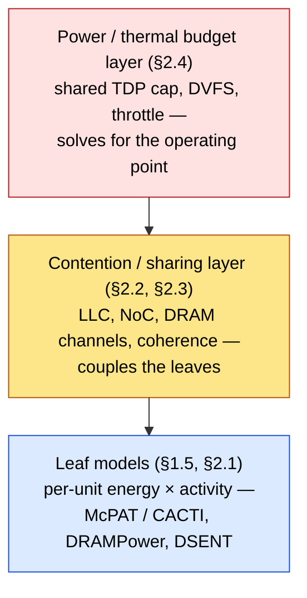
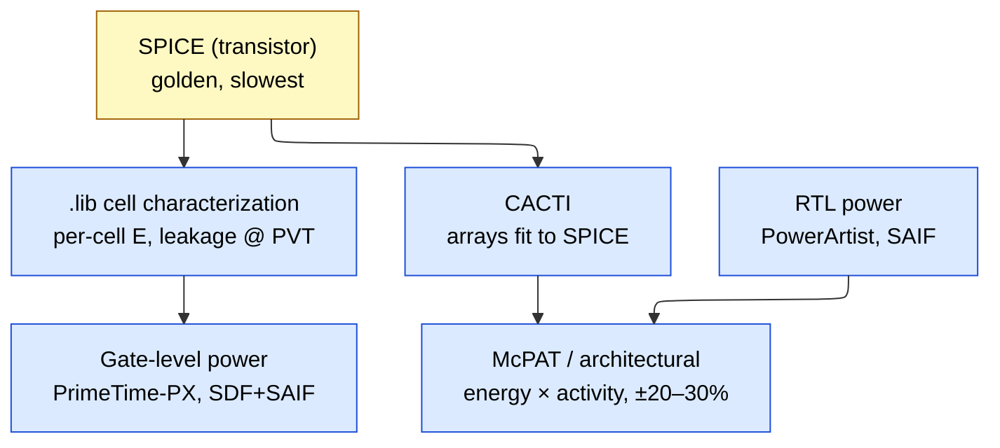
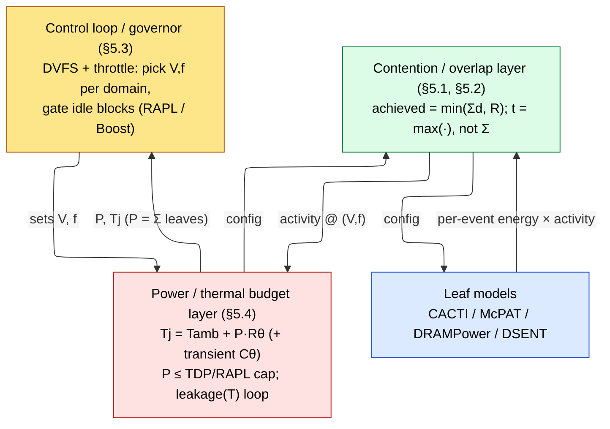

# Full-Chip Power + Performance Modeling

> **Stage:** 01 · Architecture & PPA — the *systematic, hierarchical* model that composes leaf blocks into a **full chip** and answers SoC-level power+performance questions **before RTL**.
> **Prerequisites:** [Performance_Modeling_and_DSE](Performance_Modeling_and_DSE.md) (fidelity ladder, CPI stack, roofline), [Block_Activity_and_Power](../02_Power_and_Low_Power/Block_Activity_and_Power.md) (per-block $P=\alpha C V^2 f + P_{leak}$, mode/power matrix, McPAT/CACTI bottom-up), [CPU_Architecture](CPU_Architecture.md), [Memory](Memory.md).
> **Hands off to:** later §§ on GPU/NPU chips, package/thermal budgeting, and shared-TDP turbo governance.

---

## Table of Contents

- [0. Why a full-chip model (not one-block-at-a-time)](#0-why-a-full-chip-model-not-one-block-at-a-time)
- [1. Composition methodology](#1-composition-methodology)
  - [1.1 The hierarchy and the roll-up](#11-the-hierarchy-and-the-roll-up)
  - [1.2 Bottom-up vs top-down](#12-bottom-up-vs-top-down)
  - [1.3 The calibration chain](#13-the-calibration-chain)
  - [1.4 Validation: per-block vs full-chip error](#14-validation-per-block-vs-full-chip-error)
  - [1.5 Example: McPAT composes one core](#15-example-mcpat-composes-one-core)
  - [1.6 The two cross-cutting layers](#16-the-two-cross-cutting-layers)
- [2. CPU: single core → cluster → SoC(+DDR)](#2-cpu-single-core--cluster--socddr)
  - [2.1 Single core](#21-single-core-per-unit-poweru-from-the-cpi-stack)
  - [2.2 Cluster (multicore)](#22-cluster-multicore-contention-coherence-noc)
  - [2.3 SoC with DDR](#23-soc-with-ddr-uncore--memory-system)
  - [2.4 Full CPU-chip roll-up](#24-full-cpu-chip-roll-up)
- [3. GPU: CUDA core/SM → GPC → full GPU](#3-gpu-cuda-coresm--gpc--full-gpu)
  - [3.1 SM: warps, cores, occupancy → activity → power](#31-sm-warps-cores-occupancy--activity--power)
  - [3.2 GPC (SM cluster)](#32-gpc-sm-cluster)
  - [3.3 Full GPU: L2, shared HBM, NVLink, power cap](#33-full-gpu-l2-shared-hbm-nvlink-power-cap)
- [4. NPU: PE/MAC → systolic array → core → chip → pod](#4-npu-pemac--systolic-array--core--chip--pod)
  - [4.1 PE/MAC → array](#41-pemac--array)
  - [4.2 NPU core: SA + vector unit + SRAM + DMA (double-buffering)](#42-npu-core-sa--vector-unit--sram--dma-double-buffering)
  - [4.3 Chip: multi-core + HBM + ICI](#43-chip-multi-core--hbm--ici)
  - [4.4 Pod: multi-chip torus + collectives](#44-pod-multi-chip-torus--collectives)
- [5. Component interaction & coupling — the layer that makes it a chip model](#5-component-interaction--coupling--the-layer-that-makes-it-a-chip-model)
  - [5.1 Shared-resource contention (memory BW / LLC / NoC)](#51-shared-resource-contention-memory-bw--llc--noc)
  - [5.2 Compute / memory / comm overlap](#52-compute--memory--comm-overlap)
  - [5.3 Power budgeting & DVFS coupling](#53-power-budgeting--dvfs-coupling)
  - [5.4 Thermal coupling & throttling](#54-thermal-coupling--throttling)
  - [5.5 Why perf and power must be CO-modeled](#55-why-perf-and-power-must-be-co-modeled)
- [6. Numbers to remember + tool map](#6-numbers-to-remember--tool-map)
  - [6.1 Numbers to remember](#61-numbers-to-remember)
  - [6.2 Tool map: modeling layer × perf / power / thermal](#62-tool-map-modeling-layer--perf--power--thermal)

---

## 0. Why a full-chip model (not one-block-at-a-time)

The shallow instinct is: model the CPU core, model the cache, model the DRAM — then declare the chip understood. That is wrong, and an auditor will catch it, because **a chip is a system, not a bag of blocks**. Three things emerge only at the full-chip level and are invisible in any single leaf model:

1. **Contention / sharing.** The LLC, the NoC, and the DRAM channels are *shared*. A core's memory-CPI is not a property of the core — it depends on how many *other* cores are hammering the same LLC and channel. Sum eight cores' standalone numbers and you overstate throughput and understate memory stalls, often by 1.5–2×.
2. **Power/thermal budgeting.** Peak power of every block summed exceeds what the package can dissipate ($\sum P_{block,max} \gg \text{TDP}$). The chip runs under a *shared* budget: turbo, DVFS, and throttling continuously re-allocate a fixed watt budget. Standalone models never see the cap.
3. **Perf–power coupling.** They are not two separate models. Frequency sets both IPC-limited throughput *and* $V^2 f$ dynamic power; a thermal cap lowers $f$, which lowers achieved BW, which changes activity, which changes power. You must **co-model** perf and power in one loop — solve for the operating point where power ≤ budget *and* the resulting $f$ produces the assumed activity.

So a full-chip model has three parts, not one:

**A full-chip model is defined by the questions it must answer** — none of which a leaf model can: *What is SoC power at TDP? What sustained clock survives the thermal cap? What memory bandwidth is actually achieved once N cores contend?* If your model cannot answer these, it is a pile of leaf models, not a chip model. The rest of this page builds the two upper layers on top of the leaf models the sibling pages already gave you.

---

## 1. Composition methodology

### 1.1 The hierarchy and the roll-up

You compose strictly bottom-up through named levels, and the roll-up rule at each level is *sum of children + the glue that only exists at this level*:

| Level | Contents | New cost that appears here |
|---|---|---|
| **Leaf** | one array/unit (SRAM bank, ALU, FPU, register file, router) | energy/access × access rate; leakage |
| **Block** | a core, a cache slice, one MC | pipeline glue, local clock tree |
| **Cluster** | N cores + shared LLC + local NoC | coherence + interconnect + LLC sharing |
| **Chip** | clusters + full uncore (NoC, MC, PHY, PCIe, PMU) | global clock/NoC, uncore floor |
| **Package** | chip + VRM + PDN + board | VRM loss, PDN/IR loss, on-package DRAM/HBM |

The chip-level identity every roll-up must satisfy:

$$P_{chip} = \sum_i P_{block,i} + P_{uncore} + P_{PDN/VRM}$$

where $P_{uncore}$ (NoC + MC + PHY + PMU + I/O) is *not* an idle floor you can neglect — on server parts it is 20–40% of socket power (basis: measured uncore/package RAPL split on Intel Xeon / AMD EPYC class parts), and $P_{PDN/VRM}$ is the delivery loss: $P_{VRM,loss}=P_{load}(1/\eta-1)$ at efficiency $\eta\approx0.85$–$0.92$, plus PDN $I^2R$ (link [Signal_Integrity_Reliability](../05_Backend_Physical_Design/Signal_Integrity_Reliability.md)).

**Timing/perf rolls up differently from power.** Power is additive (Watts sum); performance is *bottleneck-limited* (the slowest shared resource caps throughput, per roofline). Never sum latencies — compose them through the contention layer (§2.2–2.3).

### 1.2 Bottom-up vs top-down

Two composition directions, used at opposite ends of the project:

| | **Bottom-up** (pre-silicon) | **Top-down** (post-silicon) |
|---|---|---|
| Direction | leaf energy × activity → chip | measured chip power → decomposed to blocks |
| Tools | McPAT, Accelergy/Timeloop, CACTI | RAPL/on-die telemetry + **power proxies** (fitted activity-counter models) |
| Data | architectural event counts | real silicon current + performance counters |
| Accuracy | ±20–30% (calibrated McPAT) | ~3–5% per block (fitted proxy) |
| Use | DSE, budgeting before RTL | attribution, DVFS governors on real chip |

Bottom-up **composes energy × activity** analytically (this page's focus). Top-down **decomposes a measured number** via power proxies — a regression of block power onto activity counters, then attributed back (see [Block_Activity_and_Power §10](../02_Power_and_Low_Power/Block_Activity_and_Power.md)). Mature flows run both and reconcile: the proxy is *trained* against the bottom-up model and *validated* against silicon.

---

### 1.3 The calibration chain

Every architectural number is only trustworthy because it is anchored, level by level, to a lower-fidelity-but-more-accurate reference. The chain runs from transistor SPICE up to the architectural model, each level calibrating the one above:

| Level | Tool | Accuracy vs silicon | Speed |
|---|---|---|---|
| Transistor | SPICE | golden (≈1–2%) | slowest |
| Cell library | Liberty `.lib` characterization | ~2–3% | one-time |
| Gate + parasitics | PrimeTime-PX (SDF+SAIF) | ~5–10% | slow |
| RTL | PowerArtist / Joules (SAIF/FSDB) | ~10–20% | medium |
| Architectural | McPAT / Accelergy | ~20–30% *calibrated* (≫ un-cal) | instant |

The architectural model is fast enough for DSE precisely *because* it inherits its per-event energies from CACTI-fit arrays and characterized cells — it does not re-derive physics, it composes pre-computed energies against activity. This is the whole game: **push the physics down, keep the composition up.** (Accuracy figures corroborated by [Block_Activity_and_Power §2.2 ladder](../02_Power_and_Low_Power/Block_Activity_and_Power.md).)

### 1.4 Validation: per-block vs full-chip error

Auditors fixate on this because it decides whether the roll-up is trustworthy. Two error classes behave oppositely:

- **Random (uncorrelated) per-block error** partially *cancels* on summation. If N blocks each carry independent error $\sigma$, the chip-total relative error scales as $\sim\sigma/\sqrt{N}$ — a fleet of ±25% blocks can roll up to a ±8–10% chip total.
- **Systematic (correlated) error** *accumulates*. A consistent 15% activity-overestimate in every block (e.g. from continuous-testbench SAIF, per [Block_Activity_and_Power §2.2](../02_Power_and_Low_Power/Block_Activity_and_Power.md)) stays 15% at the chip. These are the dangerous ones — they do not wash out.

| Validation target | Typical acceptance band |
|---|---|
| Per-block, calibrated | ±10–20% |
| Full-chip total, calibrated | ±10–15% |
| Full-chip *un*-calibrated | ±30% or worse |
| Relative (design A vs B, same model) | tightest — errors are common-mode |

**Rule:** trust the model most for *relative* comparisons (common-mode error cancels), least for *absolute* watts. Validate absolute totals against at least one silicon or gate-level anchor before quoting a number to a thermal team.

---

### 1.5 Example: McPAT composes one core

Concretely, how does McPAT turn a config + activity counts into core Watts? It maps the µarch onto four primitive circuit structures — **arrays, hierarchical wires, complex logic, clocking** — then composes.

**Step 1 — leaf energies (arrays via CACTI).** For each SRAM-like structure (L1-D, RF, ROB, issue queue, BTB), McPAT's internal CACTI module returns a per-access energy from the array's organization (rows × cols, banking, tech node), e.g. an L1-D read $\approx$ tens of fJ/bit → ~10–20 pJ per 64B access at 7nm (basis: CACTI-class array estimates; order-of-magnitude). Logic units (ALU/FPU) get energies from analytical/empirical per-op models.

**Step 2 — activity from the CPI stack.** The performance model supplies event counts: instructions, L1 accesses, RF reads/writes, issue-queue insertions, FPU ops, branch lookups. These come straight from the [CPI stack](Performance_Modeling_and_DSE.md) counters.

**Step 3 — compose:**

$$P_{core} = \sum_{u \in \text{units}} \big(E_u \cdot A_u \cdot f\big) + P_{clock} + \sum_u P_{leak,u}$$

where $E_u$ = per-event energy (Step 1), $A_u$ = events/cycle (Step 2), $f$ = clock. The clock tree ($P_{clock}$) is often 30–40% of core dynamic power (per [Block_Activity_and_Power §14](../02_Power_and_Low_Power/Block_Activity_and_Power.md)). Leakage is $V\cdot I_{leak}$ scaled by area and temperature.

The point: **no new physics at the core level** — McPAT sums CACTI array energies and per-unit op energies weighted by activity, then adds clocking and leakage. That is exactly the leaf→block roll-up of §1.1, made concrete.

### 1.6 The two cross-cutting layers

Two concerns are threaded through *every* architecture on this page (CPU here; GPU/NPU later), so name them once:

- **Contention/sharing layer** — converts standalone leaf behavior into shared behavior: effective LLC MPKI under co-runners, NoC latency-under-load, DRAM channel queueing. It is *the* reason full-chip ≠ Σ leaves for performance. Threaded through §2.2 (LLC/NoC/coherence) and §2.3 (DRAM channel).
- **Power/thermal budget layer** — imposes the shared TDP cap and solves for the operating point (which $f$/$V$ per domain keeps $P\le\text{TDP}$). Threaded through §2.4 and expanded in the later budgeting §.

Keep both in view at each sub-level below: *theory → worked example → component-interaction* is the fixed template, and the "interaction" step is always one of these two layers biting.

---

## 2. CPU: single core → cluster → SoC(+DDR)

The flagship worked chip. We climb the hierarchy of §1.1, and at each sub-level apply the fixed template: **theory → worked example → component-interaction** (the interaction being a §1.6 layer biting).

### 2.1 Single core: per-unit power/perf from the CPI stack

**Theory.** A core is a small full-chip: sum per-unit energy × activity (§1.5). The units and their activity drivers:

| Unit | Activity driver | Notes |
|---|---|---|
| Fetch / I-cache | insts fetched, I-miss rate | fetch runs ahead → high duty |
| Decode | insts decoded | width-limited |
| Rename / RAT | insts renamed | CAM/RAM writes |
| Issue queue / scheduler | insts issued, wakeup CAM | superlinear in window size |
| ALU / branch | integer op mix | cheap per-op |
| FPU / SIMD | FP/vector op mix | large E/op; often dominant in HPC |
| LSU / L1-D | loads+stores, L1 accesses | array energy (§1.5) |

Activity comes from the [CPI stack](Performance_Modeling_and_DSE.md): the same counters that build memory-CPI and branch-CPI also drive the energy sum.

**Example — attribute a core's Watts to units.** Take a 3 GHz OoO core at ~4 W core dynamic (illustrative, 7nm-class). A representative attribution for an integer-heavy phase:

| Unit group | Share | Basis |
|---|---|---|
| Clock tree | ~30% | [Block_Activity §14](../02_Power_and_Low_Power/Block_Activity_and_Power.md) |
| Fetch+I$ / branch | ~15% | high fetch duty |
| Rename+IQ+ROB (OoO glue) | ~20% | CAM/wakeup-heavy |
| ALU/AGU | ~10% | cheap ops |
| LSU + L1-D | ~15% | array accesses |
| FPU/SIMD | ~10% (≫ in FP phase) | large E/op, idle-gated when unused |

The lesson mirrors [Performance_Modeling §2.1](Performance_Modeling_and_DSE.md): spend area/power where the *stack* says the work is. In an FP phase the FPU can dominate; in a memory-bound phase the front-end idles and LSU/L1 rise.

**Interaction — unit clock/power gating.** Because activity is *phasic*, unused units are clock-gated (kill $\alpha C V^2 f$ dynamic) or power-gated (kill leakage too, at a wake-latency cost). The FPU during integer code, the vector unit during scalar code: gating turns the "~10% FPU" line above into ~0 dynamic. This couples perf and power — the governor decides gating from activity counters ([Block_Activity §9, DPM](../02_Power_and_Low_Power/Block_Activity_and_Power.md)), and a mis-predicted wake costs both energy and latency.

---

### 2.2 Cluster (multicore): contention, coherence, NoC

**Theory.** N cores + a shared LLC on a NoC. Three system effects appear that no single-core model has:

1. **Shared-LLC contention.** Co-runners evict each other's lines, so *effective* LLC miss rate rises with the number of active cores. Effective per-core MPKI grows, and via the CPI stack memory-CPI grows: $\text{CPI}_{mem}=m_{mem}\cdot p_{mem}$ with $m_{mem}$ (misses/inst) climbing as capacity is split N ways. Cross-link [Cache_Microarchitecture](Cache_Microarchitecture.md).
2. **Coherence traffic energy.** Keeping caches coherent costs messages: snoops, invalidates, writebacks. Under MESI/MOESI a store to a Shared line triggers invalidations to sharers; a miss to a Modified line elsewhere triggers a writeback/forward. Each transaction is NoC flits + tag/directory lookups → energy. Directory protocols (CHI, [ACE_and_CHI](ACE_and_CHI.md)) send point-to-point messages to known sharers; snoop/broadcast protocols flood — directory wins on energy at high core counts, snoop wins on latency/simplicity at low counts.
3. **NoC latency-under-load.** Router latency is not fixed: queueing delay rises sharply as injection approaches saturation. A ring has $O(N)$ average hops; a mesh $O(\sqrt N)$. Energy per transfer:

$$E_{NoC} = \text{flits} \times \text{hops} \times E_{flit\text{-}hop}$$

where $E_{flit\text{-}hop}$ (router buffer-write + crossbar + link) comes from **Orion/DSENT** and is roughly traffic-pattern-independent for a given router (order ~a few pJ/flit-hop at advanced nodes; use DSENT for the node-specific value). Latency, by contrast, is load-dependent.

**Example — 8-core ring, memory-heavy phase.** All 8 cores stream (low reuse). Standalone, each shows (say) memory-CPI 0.8. Shared:
- LLC effective capacity per core drops ~8×; effective MPKI roughly doubles for streaming workloads → memory-CPI climbs toward ~1.5 (illustrative; measure with gem5-Ruby).
- Coherence: mostly cold misses here, so writeback/fill traffic dominates over invalidations; still, every fill crosses the ring.
- NoC energy: ring average ~$N/4=2$ hops; 8 cores × high miss rate × (flits/miss) × 2 hops × $E_{flit\text{-}hop}$ — NoC energy rises with the *product* of miss rate and hop count, so a memory-heavy phase is also a NoC-energy-heavy phase.

**Interaction — sub-linear scaling.** Two forces suppress N× speedup: **Amdahl** (serial fraction, [Performance_Modeling §2.2](Performance_Modeling_and_DSE.md)) *and* **contention** (LLC + NoC + DRAM). Combined:

$$\text{Speedup}(N) = \frac{1}{(1-p) + p/N + C(N)}$$

where $C(N)$ is the contention term that *grows* with N (queueing, shared-capacity loss). This is why an 8-core cluster on a memory-heavy phase might deliver ~4–5× not 8×, while a cache-fitting compute phase approaches Amdahl's ceiling. **Tools:** gem5-Ruby (coherence + NoC timing) + Orion/DSENT (NoC energy); the Ruby model *is* the contention layer of §1.6 made executable.

The auditor's checkpoint: a cluster model that reports 8× throughput and per-core standalone memory-CPI has *no contention layer* and is wrong.

---

### 2.3 SoC with DDR: uncore + memory system

**Theory — the uncore is not an idle floor.** Wrap the cluster in the uncore: LLC, global NoC, memory controller (MC), DRAM PHY, PCIe, PMU. On server parts this is 20–40% of socket power (§1.1) and *scales with activity* — the PHY and MC burn more under high BW, not a constant.

**The MC + DDR/LPDDR model** is the centerpiece. Performance and power are modeled by *different* tools (a key auditor distinction):

- **Performance** (latency, achieved BW, scheduling): **Ramulator / DRAMSim3** — cycle-level, model banks/ranks, timing, FR-FCFS.
- **Energy**: **DRAMPower** — integrates time spent in each state × the datasheet **IDD** current.

*Bandwidth roofline.* Peak channel BW = bus width × data rate; *achieved* BW is capped by bank/rank parallelism, row-buffer locality, and refresh. **Bank/rank parallelism**: while one bank does its $t_{RCD}/t_{RP}$ latency, others serve — enough independent banks hide latency and approach peak. **Row-buffer** outcomes drive both latency and BW:

| Access outcome | Latency | Cost |
|---|---|---|
| Row-buffer **hit** (open row) | $t_{CAS}$ only | cheapest |
| **Miss** (bank idle, closed) | $t_{RCD}+t_{CAS}$ | activate first |
| **Conflict** (wrong row open) | $t_{RP}+t_{RCD}+t_{CAS}$ | precharge + activate |

**FR-FCFS** scheduling reorders to prioritize row-hits (first-ready), maximizing row-buffer hit rate and BW. Key timings: $t_{RCD}$ (activate→CAS), $t_{RP}$ (precharge), $t_{RAS}$ (activate→precharge min), $t_{RC}=t_{RAS}+t_{RP}$, $t_{CAS}/\text{CL}$. **Refresh:** a REF every $t_{REFI}$ (≈7.8 µs DDR4; ≈3.9 µs DDR5) blocks the rank for $t_{RFC}$ (~350 ns DDR4; ~295–410 ns DDR5, density-dependent). Refresh BW loss $\approx t_{RFC}/t_{REFI}$: **~4–5% on DDR4** (~350 ns / 7.8 µs) but **~8–10% on DDR5** (~295–410 ns / 3.9 µs — tREFI halved while tRFC held), and it worsens further at high density.

*Read/write turnaround:* switching bus direction costs $t_{WTR}/t_{RTW}$ bubbles, so mixed R/W streams lose BW vs. batched same-direction bursts.

*DRAM power from IDD states* (DRAMPower method): total energy = Σ (time in state × IDD × $V_{DD}$), by state:

| IDD | State | When |
|---|---|---|
| **IDD0** | active-precharge cycle (ACT+PRE over $t_{RC}$) | activation energy |
| **IDD2N** | precharge standby (no row open) | idle banks |
| **IDD3N** | active standby (row open) | open banks |
| **IDD4R / IDD4W** | burst read / write | data movement |
| **IDD5 (IDD5B)** | refresh (continuous @ $t_{RFC}$) | refresh floor |

DRAMPower subtracts background (IDD2N/IDD3N) from IDD0 to isolate ACT/PRE energy, then adds read/write burst energy and refresh — exactly the "time × current per state" integral.

**Example — a DDR5/LPDDR5 channel.** Sweep bank-conflict / row-buffer-hit rate:
- High row-buffer-hit (e.g. 80%, streaming, good FR-FCFS + address interleave): achieved BW → ~80–90% of peak.
- Low hit / conflict-heavy (random access): activates dominate, achieved BW can fall to ~40–50% of peak — the *same* channel, half the BW, purely from access pattern.
- Refresh overhead: ~8–10% off the top on DDR5 (tREFI 3.9 µs), regardless of access pattern.
- Channel power: dominated by IDD4R/W under load; IDD3N + IDD5 set the floor when idle. A busy DDR5 channel is a real fraction of SoC power (order ~watts), not negligible.

**Tools:** Ramulator/DRAMSim3 (achieved BW, latency) + DRAMPower (IDD energy). See [DDR_Controller](DDR_Controller.md) and [Memory](Memory.md) for the controller/device detail.

**Interaction — BW is a shared resource → per-core collapse.** The channel is shared across *all* cores. As cores contend, the MC queue saturates; per FR-FCFS the aggregate stays near peak but *per-core* BW divides and *per-request latency* balloons (queueing). So a core that saw 20 GB/s standalone may see 5 GB/s under 8-core load — the DRAM analogue of the LLC/NoC contention in §2.2, and the reason memory-CPI in the cluster model *must* be driven by the contended channel, not the standalone one.

---

### 2.4 Full CPU-chip roll-up

Now close the identity of §1.1 for the whole CPU chip:

$$P_{chip} = \underbrace{\sum_i P_{core,i}}_{\S 2.1\text{-}2.2} + \underbrace{P_{uncore}}_{\S 2.3\text{ (LLC,NoC,MC,PHY,PCIe,PMU)}} + \underbrace{P_{PDN/VRM}}_{\text{delivery}}$$

- **Cores**: per-unit sums (§2.1) at each core's operating point, contention-corrected (§2.2).
- **Uncore**: activity-scaled, not a floor (§2.3).
- **Package/rail power**: VRM loss $P_{VRM,loss}=P_{load}(1/\eta-1)$, $\eta\approx0.85$–$0.92$ (so ~9–18% of delivered power is lost in the regulator); PDN $I^2R$/IR-drop (link [Signal_Integrity_Reliability](../05_Backend_Physical_Design/Signal_Integrity_Reliability.md)). These sit *outside* the die-power sum and are routinely forgotten by shallow models.

**Mode-power matrix** (the deliverable, like [Block_Activity §2.1](../02_Power_and_Low_Power/Block_Activity_and_Power.md)):

|  | Idle | Active (all-core, base f) | Turbo (few-core, high f) |
|---|---|---|---|
| Cores | low | Σ per-unit @ base V,f | fewer cores @ high V,f |
| Uncore | floor | activity-scaled | high (BW-bound) |
| VRM+PDN loss | ~η | ~η | ~η (higher abs. loss) |
| TOTAL | <TDP | ≈ TDP (sustained) | ≈ TDP, redistributed |

**Shared-TDP turbo interaction (flagged, handed off).** Turbo is the §1.6 budget layer biting: the package has a *fixed* watt/thermal budget, so raising a few cores' $f$/$V$ (cubic-ish power cost) is only possible by keeping others idle/gated — the chip *redistributes* a fixed budget rather than adding to it. Sustained all-core clock is the frequency at which $\sum P = \text{TDP}$; burst turbo exploits thermal capacitance above TDP for milliseconds (link [Block_Activity §Pmax vs TDP](../02_Power_and_Low_Power/Block_Activity_and_Power.md)). The *solving-for-operating-point* mechanics (DVFS control loop, per-domain allocation, thermal RC) are the subject of the dedicated **power-budgeting §** in a later pass — here we only flag that the roll-up total is not a free sum but a **budget-constrained** one.

---

## 3. GPU: CUDA core/SM → GPC → full GPU

The GPU re-runs the §1.1 hierarchy with a *throughput* rather than latency philosophy: thousands of threads, wide SIMT lanes, and memory bandwidth as the first-class shared resource. The levels map cleanly — **SM ≈ core**, **GPC ≈ cluster**, **full GPU ≈ SoC** — and the same §1.6 layers bite: contention (L2, HBM) and the budget layer (power cap → clock throttle). We keep the fixed template **theory → worked example → component-interaction** at each level, and cross-link µarch detail to [GPU_Architecture](../../ai_infra/L3_Microarchitecture/GPU_Architecture.md), the occupancy/roofline model to [Performance_Modeling_and_DSE §9](Performance_Modeling_and_DSE.md), and per-arch power to [Block_Activity_and_Power §11](../02_Power_and_Low_Power/Block_Activity_and_Power.md).

### 3.1 SM: warps, cores, occupancy → activity → power

**Theory.** The Streaming Multiprocessor (SM) is the GPU's compute block: warp schedulers (typically 4 sub-partitions), CUDA cores (FP32/INT lanes), tensor cores (MMA units), a large register file (256 KB/SM class), and a shared-memory/L1 pool (~128–228 KB/SM class). Unlike a CPU core that hides latency with OoO speculation, an SM hides it with **thread-level parallelism**: many resident warps, and on a stall the scheduler switches to a ready warp for free (zero-cycle context — the RF holds all warps' state at once).

**Occupancy** is the ratio of resident (active) warps to the hardware maximum (e.g. 48–64 warps/SM). It is *capped by whichever resource runs out first* — registers/thread, shared-mem/block, or the warp-slot limit — and it quantifies available TLP (basis: [GPU_Architecture](../../ai_infra/L3_Microarchitecture/GPU_Architecture.md); occupancy definition per NVIDIA/Accel-Sim literature). The occupancy → activity → power chain:

$$P_{SM} = \underbrace{E_{op}\cdot \text{IPC}_{eff}\cdot f}_{\text{compute dynamic}} + \underbrace{E_{RF}\cdot A_{RF}\cdot f + E_{L1/smem}\cdot A_{mem}\cdot f}_{\text{data movement}} + P_{clock} + P_{leak}$$

where the effective issue rate $\text{IPC}_{eff}$ — and thus activity $A$ — is set by how well occupancy hides latency. Occupancy is a *ceiling on activity, not activity itself*: high occupancy enables high issue rate only if warps are actually eligible (not all blocked on the same long-latency miss).

**Example — per-SM Watts from active-warp fraction.** Take an SM budgeted at ~15–20 W dynamic at full tilt (illustrative, datacenter-GPU class, ~1.4 GHz; basis: [Block_Activity_and_Power §11](../02_Power_and_Low_Power/Block_Activity_and_Power.md) per-arch power + total-board-power/SM-count sanity check). Two phases at the *same* occupancy:

| Phase | Eligible-warp fraction | $\text{IPC}_{eff}$ | Dominant energy | Per-SM dynamic |
|---|---|---|---|---|
| Compute-bound (tensor-core GEMM) | high (warps keep issuing) | near-peak | MMA + RF reads | high (~full budget) |
| Memory-bound (streaming, low reuse) | low (warps stall on HBM) | fraction of peak | L1/smem + LSU + idle stall | lower dynamic, but *no faster* |

Same occupancy, very different activity and power: occupancy is necessary but not sufficient. A kernel can be 100% occupant and still issue-starved because every warp is blocked on the *same* saturated memory system (§3.3).

**Interaction — warp scheduling hides latency, not power.** The seductive error is "TLP hides the stall, so it's free." Latency hiding is free in *time* (a switch fills the bubble) but **not in energy**: the RF that holds all resident warps' contexts is large and burns leakage + access energy proportional to occupancy, and every issued instruction from a switched-in warp costs its full $E_{op}$. Worse, high occupancy raises *simultaneous* activity across lanes → higher peak current → the power-cap layer (§3.3) responds by lowering clock. So chasing occupancy for latency hiding can *raise* per-SM power to the point the whole GPU throttles — a perf/power coupling identical in spirit to CPU turbo (§2.4). **Tools:** GPGPU-Sim/Accel-Sim (SIMT timing, occupancy, memory) + GPUWattch/AccelWattch (activity → Watts), the GPU analogue of gem5+McPAT.

---

### 3.2 GPC (SM cluster)

**Theory.** The Graphics Processing Cluster groups several SMs (e.g. ~12–18 SMs/GPC, ~7–8 GPCs per large die) with shared fixed-function and cache glue: a raster engine (graphics path), an L1.5/L2-slice access point, and — critically for modeling — a **per-GPC clock/rail region** that lets the chip clock or gate GPCs semi-independently. It is the direct analogue of the CPU cluster (§2.2): the aggregation level where per-SM sums acquire *shared glue* and the first sharing effects appear.

**Example — GPC roll-up.** Sum the SMs of §3.1 at their operating point, then add the GPC glue:

$$P_{GPC} = \sum_{i \in \text{SMs}} P_{SM,i} + P_{raster} + P_{L1.5/xbar} + P_{GPC\text{-}clock}$$

For a compute (non-graphics) workload the raster path is idle-gated → near-zero, and the GPC line is dominated by its SMs plus the crossbar carrying their L2 traffic. The GPC clock domain means a partially-populated GPC (some SMs gated after a work-imbalanced launch) can drop its regional clock, saving the clock-tree share (~30–40% of dynamic, per §1.5 / [Block_Activity §14](../02_Power_and_Low_Power/Block_Activity_and_Power.md)).

**Interaction — intra-GPC crossbar + clock-domain sharing.** The SMs in a GPC share the path to L2; if several stream simultaneously, the crossbar/L1.5 queues and per-SM effective L2 latency rises — a miniature of the L2 contention that dominates at full-GPU scale (§3.3). And because the GPC is one clock domain, one hot SM can force the whole GPC's clock down (thermal/power locality), coupling neighbors' performance. This is the §1.6 budget layer acting at cluster granularity, before the chip-wide cap of §3.3.

---

### 3.3 Full GPU: L2, shared HBM, NVLink, power cap

**Theory — the whole die is bandwidth-shared.** Wrap the GPCs in the uncore: a large **shared L2** (banked, sliced across the die), the **HBM stack(s)** behind the memory controllers, NVLink/NVSwitch for multi-GPU, and the chip-wide power/clock management. Two shared resources dominate the model, exactly as DRAM did for the CPU (§2.3):

1. **L2 contention.** L2 is shared by *all* SMs across *all* GPCs. Its effective per-SM hit rate falls as more SMs contend for capacity and bank ports — the GPU analogue of LLC contention (§2.2). Misses spill to HBM.
2. **HBM bandwidth shared across all SMs.** This is the crux. HBM peak $B_{HBM}$ (e.g. ~2–3.35 TB/s HBM2e/HBM3 class; basis: published stack BW) is a *single shared pool*. Achieved bandwidth is

$$B_{achieved} = \min\!\Big(\textstyle\sum_i \text{demand}_i,\; B_{HBM}\Big)$$

Below the knee, every SM gets its demand; above it, the pool is capped and **per-SM effective BW collapses to $B_{HBM}/N_{active}$** while latency balloons via MC queueing. This is the roofline *knee* ([Performance_Modeling_and_DSE §9](Performance_Modeling_and_DSE.md)): kernels left of the knee are compute-bound, right of it memory-bound, and *adding SMs past the knee adds no throughput* — it only adds contention and power.

The chip-power identity mirrors §2.4:

$$P_{GPU} = \sum_j P_{GPC,j} + \underbrace{P_{L2} + P_{MC/HBM\text{-}PHY} + P_{NVLink} + P_{PMU}}_{\text{uncore}} + P_{PDN/VRM}$$

**HBM and NVLink energy/byte** are real uncore lines, not floors. Data-movement energy (order of magnitude, published-basis): **HBM3 ≈ 0.29 pJ/bit** at the interface; **NVLink ≈ 1.3 pJ/bit** (~5× more efficient than PCIe Gen5, ≈ 6–7 pJ/bit) — so a multi-GPU AllReduce moving terabytes over NVLink is a quantifiable, non-trivial energy term, and on-package HBM traffic, while cheaper per bit, is enormous in volume. (Basis: NVIDIA/WikiChip figures; treat as order-of-magnitude.)

**Example — N SMs oversubscribe HBM.** A large GEMM streaming operand tiles: suppose per-SM demand is 30 GB/s and $B_{HBM}=3$ TB/s. The knee is at $N^\star = 3000/30 = 100$ active SMs. On a ~130-SM die, all-SM streaming pushes $\sum \text{demand} = 3.9$ TB/s $> B_{HBM}$: achieved saturates at 3 TB/s, per-SM effective BW collapses from 30 → ~23 GB/s, and every SM's memory-CPI rises together. The kernel is now **memory-bound**: more occupancy (§3.1) buys nothing because all warps stall on the same capped pool — the GPU version of the §2.3 per-core BW collapse, scaled to hundreds of consumers.

**Interaction — BW sharing × power-cap clock throttle (two layers at once).** The full GPU is where *both* §1.6 layers bite simultaneously:

- *Contention layer:* HBM/L2 sharing collapses per-SM BW (above).
- *Budget layer:* the board runs under a **power cap** (`nvidia-smi -pl <watts>`) and a thermal limit. GPU Boost continuously chooses the highest clock such that $P \le \text{cap}$ *and* $T \le T_{limit}$; when a compute-heavy phase raises current, Boost *lowers* the clock to stay under the cap. Lowering $f$ lowers both throughput and (cubically-ish) power — the operating-point solve of §2.4, now on the GPU.

These *interact*: a memory-bound phase (SMs stalling on capped HBM) draws *less* core power, so Boost may *raise* the clock — which does not help, because the bottleneck is HBM, not compute. Conversely a compute-bound tensor-core phase hits the power cap and throttles clock, lowering the very compute rate that defined it. A correct full-GPU model must co-solve BW-sharing *and* the power-capped clock in one loop; reporting peak TFLOPs × peak clock × all SMs is the auditor's red flag (it ignores both layers). **Tools:** GPGPU-Sim/Accel-Sim (SM/L2/HBM timing, contention) + GPUWattch/AccelWattch (activity → power), driving a power-cap/DVFS loop; roofline knee per [Performance_Modeling_and_DSE §9](Performance_Modeling_and_DSE.md), per-arch power per [Block_Activity_and_Power §11](../02_Power_and_Low_Power/Block_Activity_and_Power.md), DPM/clock-gating per [Block_Activity_and_Power §9](../02_Power_and_Low_Power/Block_Activity_and_Power.md).

---

## 4. NPU: PE/MAC → systolic array → core → chip → pod

The NPU (TPU-class dataflow accelerator) climbs one level higher than CPU/GPU because AI systems are *multi-chip*: **PE/MAC → systolic array → NPU core → chip → pod**. The philosophy inverts the GPU's: instead of many latency-hiding threads, a **deterministic dataflow** streams operands through a fixed array, and the whole game is *overlap* — keep the array fed. The §1.6 layers still bite (HBM/ICI contention; power gating as the budget layer), and the fixed template holds. Cross-link the systolic model to [Performance_Modeling_and_DSE §10](Performance_Modeling_and_DSE.md), the dataflow taxonomy to [Systolic_Arrays_and_Dataflow](../../ai_infra/L2_Digital_Design_for_AI/Systolic_Arrays_and_Dataflow.md), the chip to [Google_TPU](../../ai_infra/L3_Microarchitecture/Google_TPU.md), and HBM detail to [HBM_Deep_Dive](../../ai_infra/L1_Packaging_and_Memory/HBM_Deep_Dive.md).

### 4.1 PE/MAC → array

**Theory.** The leaf is a **MAC** (multiply-accumulate): a multiplier + adder + a few registers, often INT8/BF16/FP8. Its energy $E_{MAC}$ is a per-op leaf energy exactly like a CPU FPU op (§2.1) — order tens of fJ for INT8 MACs at advanced nodes, rising with precision (basis: Accelergy/CACTI-class op energies; order-of-magnitude). A **systolic array** tiles $R\times C$ PEs; operands flow rhythmically, and each PE does one MAC/cycle at steady state. The array's *timing* (fill/drain, utilization vs mapping) is derived in [Performance_Modeling_and_DSE §10](Performance_Modeling_and_DSE.md) — **we reference it rather than re-derive**: an $R\times C$ array on an $M\times K\times N$ GEMM has fill+drain overhead $\sim(R+C)$ cycles amortized over the tile, so utilization $\to 1$ only when the matrix is large relative to the array.

**Example — array power from utilization.** For an $R\times C$ array at clock $f$ and utilization $\eta$ (fraction of PEs doing useful MACs, from the §10 fill/drain model):

$$P_{array} = \underbrace{R\,C\,\eta\,E_{MAC}\,f}_{\text{useful compute}} + \underbrace{R\,C\,(E_{reg}+E_{fwd})\,f}_{\text{operand forwarding, paid even when idle-ish}} + P_{clock} + P_{leak}$$

A 128×128 INT8 array (16,384 PEs) at ~1 GHz and $\eta=0.8$ delivers $\approx 16384\times0.8\times2\times10^9 \approx 26$ TOPS (2 ops/MAC), the compute term scaling with $\eta$ while the forwarding/clock/leak terms are paid regardless — so a *poorly mapped* GEMM ($\eta$ low) wastes the fixed terms and tanks TOPS/W.

**Interaction — PE/tile power gating as fine-grained DPM (ReGate).** The leakage/fixed terms are the target of fine-grained DPM. Studies find **30–72% of NPU energy is static** (leakage) due to weak power management (basis: ReGate, MICRO 2025, arXiv:2508.02536). **ReGate** exploits the array's *deterministic* dataflow to power-gate PEs *cycle-accurately* following the wavefront — a PE gates the moment its useful work passes — and idle-detects ICI/HBM controllers. This is the §1.6 budget layer at PE granularity: because the schedule is known ahead of time (unlike a CPU's data-dependent stalls), gating can be predicted with near-zero mis-wake cost, unlike the speculative CPU gating of §2.1.

---

### 4.2 NPU core: SA + vector unit + SRAM + DMA (double-buffering)

**Theory — the core is an overlap machine.** An NPU core wraps the systolic array with: a **vector/scalar unit** (VU — for activations, softmax, normalization, elementwise; the SA does only GEMM/conv), a large **on-chip SRAM / unified buffer** (staging operands and results, ~10s of MB class), and **DMA engines** moving data HBM↔SRAM. The core's throughput is *not* the sum of its parts' times — it is set by **double-buffering / async-DMA overlap**. With SRAM split into two buffers, the DMA fills buffer B (next tile's weights/activations) *while* the SA computes on buffer A:

$$t_{tile} = \max\big(t_{compute},\ t_{DMA}\big)\quad\text{(overlapped)}\qquad\text{NOT}\qquad t_{tile}=t_{compute}+t_{DMA}\ \text{(serial)}$$

This is the single most important NPU-modeling fact. Which term dominates classifies the tile:

| Regime | Dominant term | Bottleneck |
|---|---|---|
| **SA-bound** (compute-bound) | $t_{compute}$ (MAC-limited) | array too small / precision high |
| **VU-bound** | vector-unit time | too much elementwise vs GEMM |
| **HBM-bound** (DMA-bound) | $t_{DMA}=\text{bytes}/B_{HBM}$ | low arithmetic intensity |

(Basis: SCALE-Sim double-buffered SRAM model; ONNXim double-buffered tile scheduling — all buffers double-buffered to overlap movement with compute.)

**Example — a transformer FFN tile.** An FFN projects $d\to 4d$: a GEMM tile of, say, $128\times128$ output using a $128\times128$ INT8 array. Compute: the tile's MACs at $\eta\!\approx\!1$ take $t_{compute}\approx (K + \text{fill})$ cycles. Weight-DMA: the weight sub-tile is $128\times128$ bytes (INT8) $=16$ KB; at $B_{HBM}=1.2$ TB/s that streams in $t_{DMA}\approx 16\text{KB}/1.2\text{TB/s}\approx 13$ ns. If $t_{compute}$ (say ~90 ns for $K$=128 @ ~1.4 GHz) $> t_{DMA}$, the tile is **SA-bound** and DMA is fully hidden → the array never starves. But for a *memory-thin* op (e.g. a skinny GEMM or the attention $QK^\top$ with low reuse), weights/activations reload per tile: $t_{DMA}$ grows past $t_{compute}$ and the tile flips **HBM-bound** — the array sits idle waiting for buffer B, and $t_{tile}=t_{DMA}$. Arithmetic intensity (FLOPs/byte) decides the flip, exactly the roofline of [Performance_Modeling_and_DSE §9-10](Performance_Modeling_and_DSE.md).

**Interaction — overlap hides memory *only if* double-buffered *and* BW suffices.** The $\max()$ is conditional on two things: (1) SRAM must be **double-buffered** (enough capacity for two tiles — if the unified buffer holds only one tile, DMA and compute serialize back to the *sum*, and throughput halves); (2) HBM BW must be high enough that $t_{DMA}\le t_{compute}$. If either fails, overlap collapses and the core is HBM-bound. So the VU, SA, SRAM sizing, and DMA BW are *co-designed*: an array too fast for its SRAM/DMA is starved silicon. **Tools:** SCALE-Sim (cycle-accurate SA + double-buffered SRAM + DRAM BW), ONNXim/NeuSim (multi-core tile scheduling).

---

### 4.3 Chip: multi-core + HBM + ICI

**Theory.** A modern NPU chip packs multiple cores/tiles (e.g. 2 TensorCores/chip on TPU-class parts, more on tiled designs), the shared **HBM** stacks, an on-chip interconnect linking cores to HBM and to each other, and the **ICI** (Inter-Chip Interconnect) ports for pod-scale scaling. The composition mirrors the CPU SoC (§2.3) and GPU (§3.3): sum the cores, add the shared memory/interconnect uncore.

**Example — chip roll-up and HBM sharing.**

$$P_{chip} = \sum_c P_{core,c} + P_{on\text{-}chip\text{-}interconnect} + P_{HBM\text{-}PHY} + P_{ICI\text{-}PHY} + P_{PDN/VRM}$$

The performance coupling is **HBM BW shared across cores**, identical to the CPU DRAM channel (§2.3) and GPU HBM (§3.3): with $C$ cores each demanding DMA bandwidth, achieved $=\min(\sum_c \text{demand}_c, B_{HBM})$. Two cores that were each HBM-bound standalone (§4.2) do *not* both get full BW — they split it, so *both* slow down and the per-core $t_{DMA}$ in the §4.2 $\max()$ grows, flipping tiles that were SA-bound into HBM-bound.

**Interaction — contention re-writes the per-core regime.** The §4.2 SA/VU/HBM classification is *not* a per-core constant: it depends on how many sibling cores contend for HBM *right now*. A core mapped as compute-bound in isolation becomes memory-bound under a co-running neighbor that saturates HBM — the NPU version of the CPU's contended-vs-standalone memory-CPI (§2.3). The on-chip interconnect adds its own queueing (like the GPU L2 crossbar, §3.2). A chip model that classifies tiles from standalone BW has no contention layer and overstates throughput. **Tools:** NeuSim / ONNXim (multi-core NPU, shared HBM + interconnect timing).

---

### 4.4 Pod: multi-chip torus + collectives

**Theory — the pod is a network, and the network is the bottleneck.** A pod wires hundreds–thousands of chips into a **torus** via ICI links: 2D torus (each chip to 4 neighbors — TPU v2/v3/v5e class) or **3D torus** (6 neighbors, e.g. 4×4×4 = 64-chip cubes on TPU v4+; basis: Google Cloud TPU docs). The torus is chosen because it has bounded degree and short diameter, and it maps naturally onto **collectives** — chiefly **AllReduce** for gradient/activation synchronization in distributed training and tensor-parallel inference. Ring-AllReduce runtime (bandwidth-optimal, Patarasuk 2009):

$$t_{AllReduce} \approx \underbrace{\frac{2(N-1)}{N}\cdot\frac{S}{B_{link}}}_{\text{bandwidth term}} + \underbrace{2(N-1)\,\ell}_{\text{latency term}}$$

where $N$ = chips in the ring, $S$ = payload bytes (e.g. model/gradient shard), $B_{link}$ = per-link ICI bandwidth, $\ell$ = per-hop latency. The $\frac{2(N-1)}{N}$ factor comes from the two phases (scatter-reduce + all-gather), each $N-1$ steps moving $S/N$ per step; as $N\to\infty$ the bandwidth term $\to 2S/B_{link}$ — **independent of $N$** (the point of ring-AllReduce). The latency term, however, grows linearly in $N$ — so at large $N$ or small $S$, latency dominates and the ring is inefficient (motivating tree/hierarchical collectives). (Basis: Patarasuk & Yuan 2009; standard DDP derivation.)

**Example — 256-chip pod, AllReduce vs per-step compute.** Take $N=256$, a gradient shard $S=256$ MB (bf16, large-model class), and $B_{link}=1.2$ TB/s bidirectional ICI (TPU-v4 class; basis: Google Cloud figures). Bandwidth term: $\frac{2\cdot255}{256}\cdot\frac{256\text{ MB}}{1.2\text{ TB/s}} \approx 1.99\times 213\,\mu s \approx 425\,\mu s$. If the per-step compute (forward+backward of the microbatch) is, say, ~5 ms, then AllReduce (~0.43 ms) is easily hidden — **compute-bound**, good scaling. But shrink the compute (smaller batch, or a larger $N$ inflating the latency term $2(N-1)\ell$) and AllReduce time approaches or exceeds compute → **comm-bound**, and scaling efficiency falls. The crossover is the pod-scale roofline: $t_{compute}$ vs $t_{comm}$.

**Interaction — overlap comm with compute; ICI contention.** The saving grace is **communication/computation overlap**: gradients of layer $L$ can AllReduce *while* layer $L{-}1$ still computes (backward pass), so the effective step time is $\max(t_{compute}, t_{comm})$ — the *same overlap principle* as the on-chip double-buffering of §4.2, now at pod scale. Overlap works only if (1) the schedule interleaves independent comm and compute, and (2) ICI links aren't already saturated by *other* traffic (tensor/pipeline-parallel messages contending with the AllReduce on the shared torus links — the pod-scale contention layer). ICI link contention and torus bisection bandwidth cap how much comm can truly overlap; a naive model assuming free overlap overstates scaling. This ties directly to the ai_infra **Collectives / Parallelism** pages. **Tools:** NeuSim (multi-chip), SCALE-Sim (per-chip feeding the pod model); topology/BW per [Google_TPU](../../ai_infra/L3_Microarchitecture/Google_TPU.md).

---

## 5. Component interaction & coupling — the layer that makes it a chip model

§§2–4 climbed three hierarchies (CPU, GPU, NPU) and repeatedly hit the *same* two forces — contention and the power/thermal budget (§1.6). This section extracts them into their **architecture-independent form**: the coupling layer that turns a bag of calibrated leaf models into a chip model. Everything below is the machinery §1.6 promised, and it is what the notebook was missing.

The one-line thesis: **full-chip ≠ Σ leaves**, and the gap is exactly this layer. Power sums; performance bottlenecks; both are re-shaped by a shared budget solved in a control loop.

### 5.1 Shared-resource contention (memory BW / LLC / NoC)

**The general model.** Every shared resource — a DRAM/HBM channel, an LLC/L2, a NoC link, an ICI port — has a finite **capacity** $R$ and serves $N$ contending clients each with **demand** $d_i$. Two regimes, split at the saturation knee $\sum_i d_i = R$:

$$\text{achieved throughput} = \min\!\Big(\textstyle\sum_i d_i,\ R\Big)$$

- **Below the knee** ($\sum d_i < R$): every client gets its demand; the resource is *not* the bottleneck; latency $\approx$ unloaded service time.
- **Above the knee** ($\sum d_i > R$): aggregate throughput saturates at $R$, per-client share collapses toward $R/N$ (under fair arbitration), and — critically — **latency does not stay flat, it balloons.**

**Queueing degradation past saturation.** The $\min()$ captures *throughput* but hides the *latency* penalty, which is where naive models lie. Treat the resource as a queue with utilization $\rho = \sum d_i / R$. For an M/M/1-like server the mean latency diverges as

$$L \approx \frac{L_{service}}{1-\rho}\qquad(\rho \to 1 \Rightarrow L \to \infty)$$

So as offered load approaches capacity, latency blows up *super-linearly* well before throughput flatlines — a channel at $\rho=0.9$ already carries ~10× the unloaded queueing delay. This is why "achieved BW = 90% of peak" and "latency is fine" are not the same statement: the last 10% of BW is bought with a latency cliff. (Basis: standard queueing theory; the M/M/1 form is illustrative — real MCs are FR-FCFS with finite queues, but the $1/(1-\rho)$ blow-up is qualitatively universal.)

**Fair-share / arbitration** decides *who* loses BW past the knee. Round-robin/age-based arbiters split near-equally ($R/N$); priority or QoS arbiters (e.g. an MC that favors latency-critical cores, or a NoC with VC priorities) protect one client at others' expense. The arbitration policy is therefore part of the contention model — the same saturated resource yields very different per-client outcomes under RR vs strict-priority.

**This ties together every earlier example.** The three architectures were the same equation with different labels:

| Where | Resource $R$ | Clients $N$ | Section |
|---|---|---|---|
| CPU cluster | shared LLC capacity + ports | co-running cores | §2.2 (LLC eviction, MPKI↑) |
| CPU SoC | DDR channel BW | cores via MC queue | §2.3 (per-core 20→5 GB/s) |
| CPU/GPU | NoC / L2 crossbar link | cores / SMs | §2.2, §3.2 (latency-under-load) |
| GPU chip | HBM BW pool | active SMs | §3.3 ($B_{HBM}/N_{active}$ collapse) |
| NPU chip / pod | HBM BW / ICI link | cores / chips | §4.3, §4.4 (tile regime flip; comm-bound) |

In each, standalone leaf numbers ($d_i$ measured alone) overstate throughput and understate latency once composed, because they miss $\rho\to 1$. **A model with no contention layer reports $\sum d_i$ and is wrong by the queueing gap** — the auditor's first probe at every level. Contention is *the* reason performance does not roll up additively (§1.1), and it must be evaluated at the *contended* operating point, never the standalone one.

**Tools:** the contention layer is what a cycle-level shared-resource simulator *is* — gem5-Ruby (coherence + NoC + MC queueing), Ramulator/DRAMSim3 (channel/bank contention), GPGPU-Sim/Accel-Sim (L2/HBM sharing), NeuSim/ONNXim (multi-core HBM + interconnect). See DSENT/Orion for the NoC energy per contended flit.

### 5.2 Compute / memory / comm overlap

**The general model.** A chip does compute, memory movement, and (at pod scale) communication *concurrently* when the hardware and schedule allow it. The step time is then the **max**, not the sum, of the phase times:

$$t_{step} = \max\big(t_{compute},\ t_{mem},\ t_{comm}\big)\qquad\text{(fully overlapped)}$$

$$t_{step} = t_{compute} + t_{mem} + t_{comm}\qquad\text{(fully serial — the degraded case)}$$

Real designs live between these bounds; the *degree* of overlap is a first-class model parameter, not a given. Overlap is what makes the bottleneck resource — and only it — set performance (the roofline made dynamic): if $t_{mem}$ dominates and is hidden under $t_{compute}$, you are compute-bound and memory is free; if not, the times add and everything is slower.

**Overlap is conditional.** The $\max()$ holds *only when* the movement is decoupled from the consumption:

- **Double-buffering** (NPU §4.2): DMA fills buffer B while the array computes on A. Requires SRAM for *two* tiles; with one tile, DMA and compute serialize → the sum, and throughput halves.
- **Async DMA / prefetch** (CPU, GPU): loads issued far ahead of use hide memory latency behind compute — provided the prefetch distance covers the latency and the MSHRs/queues don't fill.
- **Comm/compute overlap** (pod §4.4): AllReduce layer $L$ while computing layer $L{-}1$; requires an interleaved schedule and spare ICI BW.

**Degradation toward the sum.** When a precondition fails, $t_{step}$ slides from $\max$ toward $\Sigma$: single-buffered SRAM, insufficient prefetch distance, MSHR/queue exhaustion, or a saturated shared resource (§5.1 — if $t_{mem}$ itself grows because BW collapsed, even perfect overlap can't hide it). The model must therefore ask *both* "is it overlapped?" *and* "is the hidden term still smaller after contention?"

**Little's Law — latency hiding quantified.** How much concurrency is needed to hide latency and keep the bottleneck resource busy? Little's Law gives the required in-flight work:

$$\text{concurrency needed} = \text{throughput} \times \text{latency}$$

To saturate a memory system of latency $L$ delivering bandwidth $B$ (bytes/s), you need $B\times L$ **bytes in flight** (the bandwidth-delay product). Too few outstanding requests (too few MSHRs, too little prefetch, too low GPU occupancy — §3.1) and the pipe runs dry: you're latency-bound, not bandwidth-bound, even below the §5.1 knee. This is *the* unifying principle behind CPU MLP/MSHRs, GPU occupancy/TLP, and NPU double-buffer depth — all three are mechanisms to hold enough in-flight work ($B{\cdot}L$) to keep the bottleneck resource saturated and thus keep the $\max()$ (not the sum) in force.

**Interaction with §5.1.** Overlap and contention pull against each other: more outstanding requests (to satisfy Little's Law) raise the offered load $\sum d_i$, pushing the shared resource toward $\rho\to1$ where per-request latency $L$ itself grows — which then *demands even more* in-flight work. The sweet spot is enough concurrency to hide latency but not so much that queueing latency explodes. **Tools:** any cycle-level timing sim (gem5, Accel-Sim, SCALE-Sim, NeuSim) resolves the overlap by construction; the roofline knee ([Performance_Modeling_and_DSE §9](Performance_Modeling_and_DSE.md)) is its static shadow.

### 5.3 Power budgeting & DVFS coupling

**A shared TDP means V/f is *allocated*, not fixed.** The package can dissipate a fixed budget (TDP / a RAPL PL1). The sum of every block at its peak V/f *exceeds* that budget ($\sum P_{block,max}\gg\text{TDP}$, §0). Therefore the per-core / per-domain operating point $(V,f)$ is not a datasheet constant — it is **continuously allocated** by a power manager so that $\sum P \le \text{budget}$. Frequency is an *output* of the budget solve, not an input.

**The mechanisms (all the same idea):**

| Mechanism | Vendor | What it does |
|---|---|---|
| **Turbo Boost** | Intel | raises few-core $f$ above base while others idle, until $\sum P=$ budget |
| **Precision Boost / PBO** | AMD | opportunistic $f$ up to power/thermal/current limits |
| **GPU Boost** | NVIDIA | highest clock s.t. $P\le$ cap *and* $T\le T_{limit}$ (`nvidia-smi -pl`) |
| **RAPL** | Intel | HW enforces PL1 (sustained, $\tau\sim$ tens of s) & PL2 (burst, $\tau\sim$ ms); throttles $f$ if the running-average power exceeds the limit |
| **per-domain DVFS backoff** | all | each voltage/clock domain drops V/f independently when its slice of the budget is exceeded |

(Basis: Intel RAPL PL1/PL2 + $\tau$ time-window model; NVIDIA GPU Boost power/thermal cap; AMD PBO — vendor docs / public descriptions.)

**Perf ⇄ power coupling.** Because $P_{dyn}\propto V^2 f$ and, on the voltage/frequency curve, higher $f$ needs higher $V$, dynamic power grows roughly **cubically** with frequency ($P\sim f^3$ over the DVFS range). So a small $f$ cut buys a large power cut — and conversely, the *achievable performance is a function of the power budget*: raise the budget, the manager raises $f$, throughput rises until some other limit (contention §5.1, or thermal §5.4) binds. Perf and power are not two models; they are one operating-point solve (§5.5).

**The control loop.** The manager runs a closed loop at ms granularity: *measure* power (RAPL counters / on-die current sense) and temperature → *compare* to budget/limit → *actuate* V/f (and gating) → repeat. PL2 lets the running average exceed PL1 for a window $\tau$ (exploiting thermal capacitance, §5.4) before falling back to PL1 — the reason burst clock > sustained clock. This is a governor, and it *is* the budget layer of §1.6 made executable.

**Race-to-idle vs pace-to-deadline** — two opposite budget strategies:

- **Race-to-idle:** run at max $f$, finish the work fast, then drop to a deep low-power/idle state. Wins when idle (leakage-dominated) power is very low and there is a long idle tail to amortize the wake — the higher active power is paid briefly. This is the break-even calculus of dynamic power management ([Block_Activity_and_Power §9](../02_Power_and_Low_Power/Block_Activity_and_Power.md)): race-to-idle pays off only when $E_{saved by idling} > E_{extra to run fast} + E_{transition}$.
- **Pace-to-deadline:** run at the *lowest* $f$ that still meets the deadline, exploiting $P\sim f^3$ so that stretching the work to fill the time cuts energy super-linearly. Wins when there is a hard deadline and idle power is *not* negligible (leakage would burn during the idle tail anyway).

Which wins depends on the leakage fraction and the transition cost — exactly the DPM break-even of [Block_Activity_and_Power §9](../02_Power_and_Low_Power/Block_Activity_and_Power.md). On leaky advanced nodes (high static power) race-to-idle is increasingly favored; on low-leakage or deadline-bound workloads, pace-to-deadline.

### 5.4 Thermal coupling & throttling

**The steady-state thermal model** is Ohm's law for heat: power is the "current," temperature rise the "voltage," thermal resistance the "resistance":

$$T_j = T_{amb} + P\cdot R_{\theta ja}$$

where $T_j$ = junction temperature, $T_{amb}$ = ambient, $P$ = dissipated power, $R_{\theta ja}$ = junction-to-ambient thermal resistance (°C/W), the *series* sum of die→case ($R_{\theta jc}$), TIM, and heatsink→air ($R_{\theta ca}$). Package $R_{\theta ja}$ ranges roughly from **~0.1–0.5 °C/W** for a big server part under a large heatsink to **>10–50 °C/W** for a small package with poor cooling (basis: package/thermal datasheets; order-of-magnitude — the exact value is the cooling solution's, not the die's). This single equation says: at fixed cooling, $T_j$ rises *linearly* with power, so power *is* temperature.

**The transient model** adds thermal capacitance $C_\theta$ (the mass that must be heated). A first-order RC gives the exponential approach to steady state:

$$T_j(t) = T_{\infty} + (T_0 - T_{\infty})\,e^{-t/\tau_\theta},\qquad \tau_\theta = R_\theta C_\theta$$

The **thermal time constant** $\tau_\theta = R_\theta C_\theta$ sets how fast temperature responds: the tiny **die** heats in **~ms** (small $C_\theta$), while the **heatsink/package** has $\tau_\theta$ of **~seconds to tens of seconds** (large $C_\theta$). This span is *why* burst > sustained performance: for a few ms the die can dissipate above steady-state TDP because the heatsink hasn't warmed yet — exactly the thermal headroom RAPL PL2 / Turbo exploit (§5.3). The package $\tau_\theta$ dominates the trajectory to steady state.

**Throttling: sustained clock < peak clock.** When $T_j$ reaches $T_{j,max}$ (commonly ~95–105 °C for logic; the throttle/$T_{limit}$ trip point), the governor (§5.3) cuts $f$/$V$ to force $P$ down until $T_j\le T_{j,max}$. So the **sustained** clock is the frequency at which $T_j$ settles *at* $T_{j,max}$ — necessarily $\le$ the peak/burst clock that the die can hit before the package warms up. A workload's clock therefore traces: high burst clock (ms, riding die $C_\theta$) → decay as the heatsink warms ($\tau_\theta$ seconds) → steady sustained clock at the thermal cap. **Reporting peak clock as if sustained is the auditor's red flag** — the same error as ignoring the power budget (§5.3), because thermal *is* a budget expressed in °C.

**Leakage–temperature positive feedback.** Subthreshold leakage current rises *exponentially* with temperature, so leakage power climbs steeply as the die heats — roughly **doubling every ~10 °C** in the relevant range (basis: subthreshold-leakage temperature-dependence literature; order-of-magnitude). This closes a positive-feedback loop:

$$T_j\uparrow \;\Rightarrow\; P_{leak}\uparrow \;\Rightarrow\; P_{total}\uparrow \;\Rightarrow\; T_j\uparrow$$

Usually the loop is *stable* (cooling removes heat faster than leakage adds it) and just inflates steady-state $T_j$ and leakage — which is why leakage must be modeled at the *operating* temperature, not 25 °C. But if the loop gain exceeds 1 (weak cooling, high $R_\theta$, leaky node, high $V$), it becomes **thermal runaway**: temperature and leakage diverge until the part hits $T_{j,max}$ and hard-throttles or trips protection (basis: FinFET thermal-runaway analyses, e.g. leakage-driven runaway at high leakage + typical package $R_\theta$). This makes the thermal and leakage models *mutually coupled* — you cannot solve one without the other, and it is the deepest reason perf/power/thermal are one co-model (§5.5).

**Interaction — sustained vs burst is the whole story.** Contention (§5.1) caps *bandwidth*, the power budget (§5.3) caps *watts*, and thermal caps *sustained watts over $\tau_\theta$*. All three re-shape the operating point; thermal is the one that makes a benchmark's first second look great and its tenth second look ordinary. **Tools:** **HotSpot** — the standard compact/RC thermal model (grid + package RC network, static + transient); coupled to a performance simulator it becomes thermal-aware (e.g. HotSpot+Sniper = HotSniper; CoMeT for 2.5D/3D). HotSpot consumes a per-block power map (from McPAT/GPUWattch/etc.) and a floorplan → per-block $T_j(t)$.

### 5.5 Why perf and power must be CO-modeled

Pull §5.1–§5.4 together. A performance number depends on the clock $f$; $f$ is set by the power budget (§5.3) and the thermal cap (§5.4); the power drawn depends on the activity, which depends on the *achieved* performance after contention (§5.1) and overlap (§5.2); and leakage — a power term — depends on temperature, which depends on power (§5.4). Every arrow points at every other. **There is no "compute performance first, then estimate power" — it is one fixed-point solve.**

The full-chip model is therefore four parts wired in a loop, not one:

Perf and power must be co-modelled because they form a loop: the governor sets `(V,f)`, the power/thermal layer turns activity into `P` and `Tj`, and the contention layer turns leaf energies into achieved throughput and activity. Control flows down; computed quantities flow back up.

The solve: pick $(V,f)$ → leaves emit activity → contention/overlap turn activity into achieved performance *and* the true activity counts → those give $P$ → $P$ gives $T_j$ (with the leakage-$T$ loop) → the governor checks $P\le$ budget and $T_j\le T_{j,max}$, adjusts $(V,f)$, and iterates to a **self-consistent operating point**. Only then is a perf *or* power number meaningful.

This is why a leaf-only model (§0) is not a chip model: it has the bottom box and none of the three above it. **Cross-links:** the governor's gate/wake decisions and the race-to-idle break-even are the DPM of [Block_Activity_and_Power §9](../02_Power_and_Low_Power/Block_Activity_and_Power.md); the per-block power maps feeding the thermal layer are [Block_Activity_and_Power §11–14](../02_Power_and_Low_Power/Block_Activity_and_Power.md); the achieved-performance side is the roofline/DSE of [Performance_Modeling_and_DSE §9–11](Performance_Modeling_and_DSE.md).

---

## 6. Numbers to remember + tool map

### 6.1 Numbers to remember

Order-of-magnitude anchors for back-of-envelope full-chip sanity checks. **State the basis; these are public-literature ballparks, not any specific silicon — use vendor/tool numbers for a real quote.**

| Quantity | Value | Basis / note |
|---|---|---|
| Uncore share of socket power | **~20–40%** | server RAPL package/uncore split; scales with BW, not a floor (§1.1, §2.3) |
| VRM efficiency $\eta$ | **~0.85–0.92** | delivery loss $P(1/\eta-1)$ ⇒ ~9–18% lost in regulator (§2.4) |
| DRAM refresh BW loss | **~4–5% DDR4, ~8–10% DDR5** | $t_{RFC}/t_{REFI}$ (~350 ns / 7.8 µs DDR4; ~295–410 ns / 3.9 µs DDR5); worse at high density (§2.3) |
| Clock-tree share of core dynamic | **~30–40%** | McPAT / [Block_Activity §14](../02_Power_and_Low_Power/Block_Activity_and_Power.md) (§1.5) |
| HBM3 interface energy | **~0.29 pJ/bit** | NVIDIA/WikiChip class figure; order-of-mag (§3.3) |
| NVLink energy | **~1.3 pJ/bit** | ~5× more efficient than PCIe Gen5 (§3.3) |
| PCIe Gen5 energy | **~6–7 pJ/bit** | published; the multi-GPU comm baseline (§3.3) |
| NoC energy | **~a few pJ/flit-hop** | DSENT/Orion, node-dependent (§2.2) |
| NPU static (leakage) fraction | **~30–72%** | ReGate, MICRO 2025 (arXiv:2508.02536) (§4.1) |
| Junction-to-ambient $R_{\theta ja}$ | **~0.1–0.5 °C/W** (server+heatsink) to **>10 °C/W** (small pkg) | package/cooling datasheets; it's the cooling's number (§5.4) |
| Leakage vs temperature | **~2× per +10 °C** | subthreshold-leakage $T$-dependence; drives runaway loop (§5.4) |
| Die vs package thermal time constant | **~ms (die) vs ~s (heatsink)** | $\tau_\theta=R_\theta C_\theta$; enables burst > sustained (§5.4) |
| Ring-AllReduce bandwidth factor | **$2(N-1)/N \to 2$** | Patarasuk 2009; per-link cost $\to 2S/B_{link}$ (§4.4) |
| Multicore speedup (mem-heavy) | **~4–5× on 8 cores** | Amdahl + contention $C(N)$, not 8× (§2.2) |

### 6.2 Tool map: modeling layer × perf / power / thermal

The full-chip model is a *pipeline of tools*: a performance/timing tool emits activity, a power tool turns activity into a per-block power map, and a thermal tool turns the power map + floorplan into temperatures — which feed back to the governor (§5.5). Read a row as "at this layer, use these three."

| Modeling layer | Performance / timing | Power / energy | Thermal |
|---|---|---|---|
| **Leaf (arrays, cells)** | — (analytical) | **CACTI** (SRAM/array E), Accelergy | (feeds up) |
| **Block / core (CPU)** | **gem5** (cycle/CPI), Sniper | **McPAT** (energy × activity) | HotSpot (per-block map) |
| **DRAM channel** | **Ramulator**, DRAMSim3 (BW, latency) | **DRAMPower** (IDD × time) | HotSpot (DRAM layer) |
| **NoC / interconnect** | gem5-Ruby (latency-under-load) | **DSENT**, Orion (pJ/flit-hop) | HotSpot |
| **GPU (SM→chip)** | **GPGPU-Sim / Accel-Sim** (SIMT, L2, HBM) | **GPUWattch / AccelWattch** | HotSpot |
| **NPU (PE→chip)** | **SCALE-Sim** (SA + double-buffer), ONNXim | Accelergy/Timeloop, NeuSim power | HotSpot |
| **NPU pod (multi-chip)** | **NeuSim** (multi-chip, ICI, collectives) | NeuSim / composed per-chip | system-level |
| **Thermal (all)** | (consumes power map) | (consumes power map) | **HotSpot** (RC grid, static+transient); HotSniper, CoMeT (2.5D/3D) |
| **DSE / orchestration** | roofline + fidelity ladder ([Perf_Modeling §9–11](Performance_Modeling_and_DSE.md)) | budget solve (§5.3) | budget solve (§5.4) |

The columns are *different tools on purpose* (§2.3's auditor distinction): Ramulator gives BW, DRAMPower gives energy — never conflate a timing tool with a power tool. The rightmost thermal column is the layer §5.4 adds; HotSpot is the standard, consuming the power column's output plus a floorplan. For a full co-modeled DSE loop, an orchestration layer (e.g. Ray-driven NeuSim sweeps) drives the perf→power→thermal→governor fixed point of §5.5 across a design space.

---

> **Where this connects.** This page is the *composition + coupling* spine: leaf energies come from [Block_Activity_and_Power](../02_Power_and_Low_Power/Block_Activity_and_Power.md) (bottom-up McPAT/CACTI, per-arch power, DPM/§9), achieved performance from [Performance_Modeling_and_DSE](Performance_Modeling_and_DSE.md) (roofline, CPI stack, systolic/occupancy models), and the contention/budget/thermal layers here are what make them one chip model instead of a bag of blocks. The governor closes the loop (§5.5).
