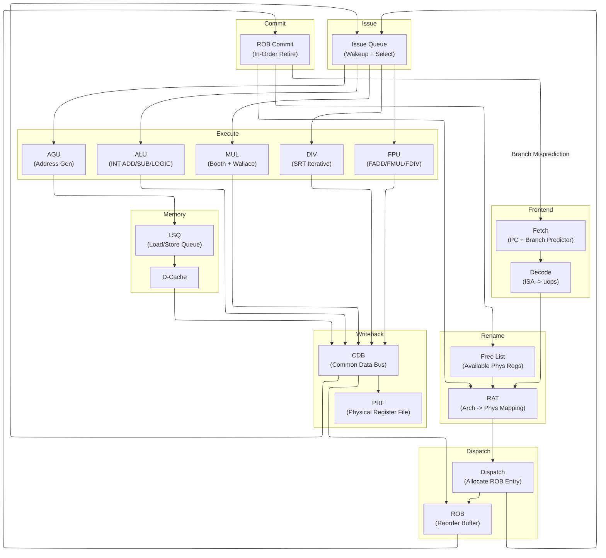
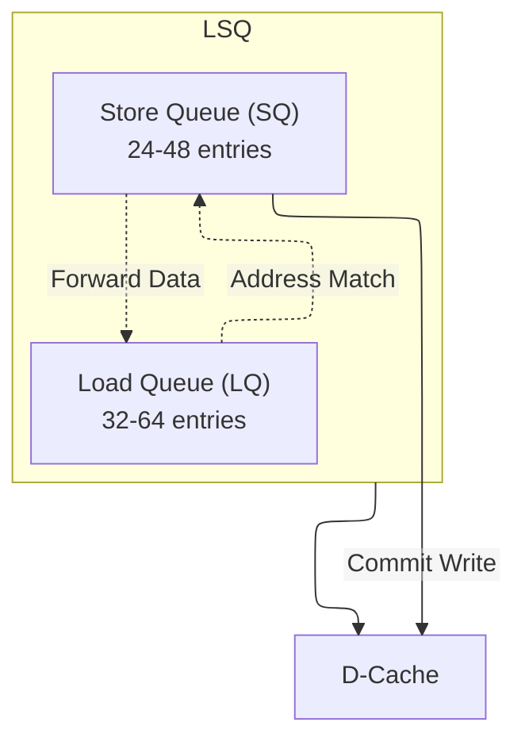
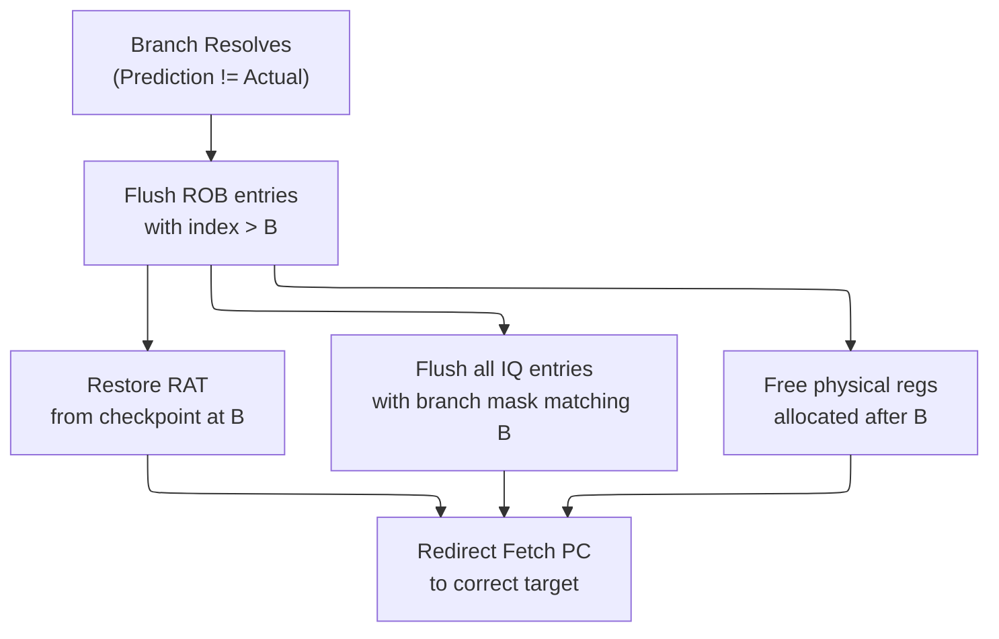

# Out-of-Order Execution — Datapath Design Deep Dive

> **Prerequisites:** [CPU_Architecture](CPU_Architecture.md), [../Fundamentals/Adders](../00_Fundamentals/Adders.md), [RISC_V_ISA](RISC_V_ISA.md).
> **Hands off to:** [Branch_Prediction_Deep_Dive](Branch_Prediction_Deep_Dive.md), [Cache_Microarchitecture](Cache_Microarchitecture.md), [Xiangshan_CPU_Design](Xiangshan_CPU_Design.md).

---

## 0. Why this page exists

Every modern high-performance CPU uses out-of-order (OoO) execution to extract instruction-level parallelism (ILP) beyond what the compiler can statically schedule. The core insight is simple: instructions need not retire in the order the program wrote them, as long as the *architectural state* updates as if they did. The machinery that makes this possible -- register renaming, reorder buffers, issue queues, load-store queues, and common data buses -- is the subject of this page.

By the end you should be able to sketch a complete OoO datapath from fetch to commit, explain every data structure, trace a misprediction recovery sequence, and reason about the area/power/performance tradeoffs that real designers face.

---

## 1. The OoO Pipeline — Full Block Diagram

The diagram below shows a canonical 4-wide out-of-order pipeline. Data flows left to right; control feedback (branch redirects, CDB wakeup) flows right to left.



**Key feedback paths:**

| Path | Purpose |
|------|---------|
| CDB -> IQ | Wakeup: mark source operands as ready |
| CDB -> ROB | Mark instruction as completed |
| COMMIT -> RAT | Retire: arch register now points to phys register |
| COMMIT -> FREELIST | Free old physical register that was overwritten |
| COMMIT -> FETCH | Redirect PC on branch misprediction |

**Pipeline stages and typical latency (cycles):**

| Stage | Cycles | Notes |
|-------|--------|-------|
| Fetch | 1-2 | I-cache hit; branch predictor in critical path |
| Decode | 1 | ISA instructions to micro-ops |
| Rename | 1 | RAT lookup + free list allocation |
| Dispatch | 1 | ROB + IQ allocation |
| Issue (wait) | 0-N | Until all operands ready |
| Execute | 1-40 | Depends on operation type |
| Writeback | 1 | CDB broadcast |
| Commit | 1 | 4-8 instructions per cycle |

---

## 2. Register Renaming

### 2.1 The Problem Renaming Solves

A RISC-V processor has 32 architectural registers ($x_0$--$x_{31}$). When two instructions write the same arch register but to independent values, the second write creates a **Write-After-Write (WAW)** hazard that forces the second instruction to wait. Similarly, a **Write-After-Read (WAR)** hazard occurs when a later instruction wants to write a register that an earlier instruction has not yet read. Both are *false* (name) dependencies -- they arise from the scarcity of arch register names, not from any true data flow.

Renaming eliminates WAW and WAR by giving every new destination a fresh physical register tag. Only **Read-After-Write (RAW)** -- the true data dependency -- remains.

### 2.2 Register Alias Table (RAT)

The RAT is a lookup table with one entry per architectural register. Each entry holds the physical register tag currently mapped to that arch register.

```verilog
RAT layout (32 entries, one per arch reg):
  arch_reg | phys_tag
  ---------+----------
  x0       | p0       (x0 is hardwired to p0 = 0)
  x1       | p47
  x2       | p12
  ...
  x31      | p103
```

**Rename operation per instruction:**

1. Read RAT entries for source operands: $src_a \leftarrow \text{RAT}[rs1]$, $src_b \leftarrow \text{RAT}[rs2]$.
2. Allocate a free physical register for the destination: $dst_{phys} \leftarrow \text{FreeList.pop()}$.
3. Record the *old* mapping: $dst_{old} \leftarrow \text{RAT}[rd]$.
4. Update RAT: $\text{RAT}[rd] \leftarrow dst_{phys}$.
5. Pass $\{opcode,\ src_a,\ src_b,\ dst_{phys},\ dst_{old}\}$ downstream to dispatch.

When the instruction commits (in-order), $dst_{old}$ is returned to the free list because the arch register no longer references it.

### 2.3 Physical Register File (PRF)

The PRF holds the actual 64-bit values. A typical design uses 128 physical registers for a machine with 32 arch registers and a 128-entry ROB. The PRF has:

- **Read ports:** $2W$ read ports for $W$-wide issue (each instruction reads up to 2 sources).
- **Write ports:** $W$ write ports (one per executing instruction per cycle).
- **Bypass:** The CDB feeds write ports directly; read ports may also source from the bypass network for zero-latency forwarding.

Area scales as $O(W^2 \times N_{phys})$ for a crossbar-connected PRF. This is one reason issue width rarely exceeds 6.

### 2.4 Free List

The free list tracks which physical registers are available for allocation. Implementation options:

| Style | Mechanism | Recovery |
|-------|-----------|----------|
| Bitmap | 128-bit vector, 1 = free | Clear bits on alloc, set bits on free |
| Head/tail FIFO | Circular queue of tags | Move head on alloc, tail on free |
| Stack | LIFO push/pop | Pop on alloc, push on free |

A bitmap is most common because it supports $O(1)$ allocation (priority encoder finds lowest free bit) and $O(1)$ deallocation (set bit).

### 2.5 Physical Register Recycling / Reclamation

Knowing **when** to free a physical register is one of the most subtle correctness
issues in an OoO core. Free too early and a consumer reads garbage; free too late
and the free list runs dry, stalling dispatch.

**When is a physical register safe to free?**

A physical register $P_k$ can be returned to the free list when **all** of the
following conditions hold:

1. $P_k$ is no longer the active mapping in the frontend RAT for any architectural
   register. (A newer instruction has renamed the same arch reg to a different $P_j$.)
2. $P_k$ is no longer the committed mapping in the commit RAT. (The instruction that
   made $P_k$ the committed mapping for some arch reg has been superseded by a newer
   commit.)
3. No in-flight instruction still references $P_k$ as a source operand.

Condition 3 is the hard one. Even after $P_k$ is no longer in any RAT, an instruction
dispatched earlier may have $P_k$ as `src_tag_0` and is still waiting in the issue
queue for its other source operand.

**"Last consumer" tracking mechanism:**

There are two common approaches:

```text
Approach 1: ROB-based recycling (most common)

  When instruction I commits and its phys_dst_old = P_k:
    P_k is safe to free ONLY IF no younger (still-in-flight) instruction
    reads P_k as a source.

  Implementation: Each physical register has a "reference count" or "live bit."
    - On rename: ref_count[P_src] += 1 for each source operand
    - On issue (read from PRF): ref_count[P_src] -= 1
    - On commit of the instruction that overwrote P_k:
      if ref_count[P_k] == 0: free P_k
      else: defer free until ref_count reaches 0

  Simpler variant: just wait for commit of the next instruction that writes the
  same arch register. By the time I_commit+1 commits, all consumers of I_commit's
  old mapping have long since read their values.

  This is the approach used in MIPS R10000 and most modern cores:
    At commit of instruction I with phys_dst = P_new, phys_dst_old = P_old:
      Free P_old unconditionally.
      Correct because: any instruction that reads P_old must be OLDER than I
      (I was the last writer of that arch reg). All older instructions have
      already committed, and their consumers have already read P_old.

Approach 2: Counter-based recycling

  Each physical register has a 3-bit counter initialized to 0.
    - On rename as source: counter++
    - On wakeup + issue (source consumed): counter--
    - On commit of the overwriting instruction: if counter == 0, free; else
      mark "pending free" and free when counter reaches 0

  This handles the rare case where a long-latency consumer has not yet issued
  when the overwriter commits.
```

**How incorrect recycling leads to wrong values:**

```verilog
Scenario: P_k freed too early

  I1: ADD x1, x2, x3   -> phys_dst = P_k     (new mapping for x1)
  I2: SUB x4, x1, x5   -> src1 = P_k         (reads x1 = P_k)
  I3: XOR x1, x6, x7   -> phys_dst = P_m     (overwrites x1 mapping)

  If P_k is freed at I3's rename (before I2 issues):
    - I2's IQ entry still has src_tag_0 = P_k
    - P_k is allocated to a new instruction: MUL x9, x10, x11 -> phys_dst = P_k
    - MUL writes P_k with its result
    - I2 wakes up, reads P_k from PRF -> gets MUL's result, not ADD's!
    - WRONG VALUE -> silent data corruption

  Correct behavior: P_k is freed only when I3 commits, at which point I2 has
  long since read P_k (I2 committed before I3 in program order).
```

**Register recycling timeline -- concrete cycle-by-cycle example:**

```verilog
Initial state: RAT[x1] = P5, FreeList = {P20, P21, P22, ...}

Cycle 0 (rename):
  I1: ADD x1, x2, x3  -> phys_dst = P20 (from free list)
     RAT[x1] = P20 (old mapping P5 saved in ROB entry for I1)
  I2: SUB x4, x1, x5  -> reads P20 for x1 (bypassed from I1 rename)
     I2's IQ entry: src_tag = P20

Cycle 1 (issue + execute):
  I1 issues to ALU, produces result -> P20 = 42

Cycle 2 (writeback):
  CDB broadcasts P20=42. IQ wakes up I2 (src_tag match). I2 issues.
  I2 reads P20 from PRF -> gets 42 (correct!)
  I2 produces result -> P22 = 42 - x5

Cycle 3 (commit I1):
  ROB commits I1:
    commit_RAT[x1] = P20  (architectural state updated)
    Free P5 (I1's phys_dst_old = P5 returned to free list)
    -- P5 was the OLD mapping of x1, now nobody reads it
    -- P20 is the current committed mapping, NOT freed

  Why P5 is safe to free: any instruction that reads P5 must be older than I1
  (it was the mapping before I1). All older instructions have already committed
  and their consumers have already read P5.

  At this point: FreeList = {P5, P21, P23, ...}

Cycle 4 (rename I3):
  I3: XOR x1, x6, x7  -> phys_dst = P23 (from free list)
     RAT[x1] = P23 (old mapping P20 saved in ROB entry for I3)

Cycle 5+ (I3 executes, produces result)

Cycle 6 (commit I3):
  Free P20 (I3's phys_dst_old = P20 returned to free list)
  -- Now P20 is safe because I2 already read it in cycle 2
  -- and I2 committed in cycle 5 (before I3 in program order)

  At this point: FreeList = {P5, P20, P21, P24, ...}

Key invariant: a physical register is freed exactly when the instruction that
OVERWROTE its architectural mapping commits. This guarantees all consumers of
the old physical register have already completed and read the value.
```

### 2.6 Checkpoint-Based Recovery vs ROB-Walk Recovery

When a branch misprediction is detected, the processor must restore the rename
table and free list to the state before the branch. Two approaches exist:

**Checkpoint-based recovery (used in Intel, AMD, ARM high-performance cores):**

```verilog
Mechanism:
  On branch rename:
    1. Snapshot the entire frontend RAT (32 entries x 7 bits = 224 bits)
    2. Store snapshot in a checkpoint register indexed by branch ID
    3. Each checkpoint also saves the free-list head pointer

  On misprediction at branch B:
    1. Copy checkpoint[B] back to the active frontend RAT: 1 cycle
    2. Restore free-list head from checkpoint
    3. Invalidate all checkpoints younger than B
    4. Flush IQ, LSQ, and ROB entries after B

  Storage cost:
    16 checkpoints x 224 bits = 3.5 KB (SRAM)
    Copy-on-write optimization: store only changed entries, ~50 bits per checkpoint

  Recovery time: 1 cycle for RAT restore + pipeline refill latency
```

**ROB-walk recovery (used in area-constrained designs, early MIPS R10000):**

```verilog
Mechanism:
  Each ROB entry stores the old physical mapping (phys_dst_old) at rename time.

  On misprediction at ROB index B:
    1. Walk ROB from tail backwards to B:
       for i = tail-1 down to B+1:
         RAT[ROB[i].arch_dst] = ROB[i].phys_dst_old   // undo the rename
         FreeList.push(ROB[i].phys_dst)                // free speculative phys reg
    2. Takes (tail - B) cycles

  Storage cost: 0 extra (phys_dst_old already in ROB entry)

  Recovery time: O(N_ROB) cycles in the worst case
    For a 128-entry ROB with 15 wrong-path instructions: 15 cycles
    For a 256-entry ROB with 50 wrong-path instructions: 50 cycles
```

**Comparison:**

| Metric | Checkpoint | ROB-walk |
|--------|-----------|----------|
| Recovery latency | 1 cycle (RAT) + pipeline refill | O(wrong-path instructions) + pipeline refill |
| Area | 3.5 KB for 16 checkpoints | 0 extra |
| Power | Write 224 bits per checkpoint on branch rename | Read/write ROB entries during walk |
| Correctness risk | Must snapshot *every* branch (or limit checkpoint depth) | Always correct (walks actual history) |
| Used in | Intel Golden Cove, AMD Zen 4, ARM Cortex-X4 | Area-constrained embedded cores |

**Why checkpoints win in high-performance cores:** The difference between 1-cycle and
15-cycle recovery is 14 cycles of fetch starvation. At 4 instructions/cycle, that is
56 lost instruction slots. For a core running at 3% MPKI (mispredictions per 1000
instructions), the extra recovery cost adds:

$$
\frac{3}{1000} \times 14 \text{ cycles} = 0.042 \text{ CPI penalty (ROB-walk extra cost)}
$$

versus near-zero for checkpoints. At high frequency this is significant.

**Fallback for checkpoint exhaustion:** If more branches are in-flight than the
checkpoint depth (e.g., 20 branches but only 16 checkpoints), the core must either
(1) stall dispatch until a branch resolves and frees a checkpoint, or (2) fall back
to ROB-walk for the excess branches. Most implementations choose (1) -- stalling
dispatch is simpler and the checkpoint depth is sized to make this rare.

### 2.7 Rename Bandwidth

A 4-wide machine must rename 4 instructions per cycle. This requires:

- 8 RAT read ports (2 sources per instruction) or a multi-cycle RAT.
- 4 free-list allocations per cycle.
- 4 RAT write ports for destinations.
- Handling of intra-group dependencies: if instruction $i+1$ reads a register that instruction $i$ writes, the rename logic must forward $dst_{phys}$ of instruction $i$ directly as the source of instruction $i+1$ (bypass within the rename group).

Typical rename bandwidth: 4-6 instructions per cycle in modern designs (2020s).

---

## 3. Reorder Buffer (ROB)

The ROB is the data structure that enforces in-order retirement while allowing out-of-order execution. It is a circular buffer with two pointers:

- **Tail pointer:** Points to the next free slot. Increments when instructions are dispatched.
- **Head pointer:** Points to the oldest uncommitted instruction. Increments when instructions retire.

### 3.1 ROB Entry Fields

Each ROB entry contains:

| Field | Width | Purpose |
|-------|-------|---------|
| `valid` | 1 bit | Entry is occupied |
| `completed` | 1 bit | Execution finished, result written to PRF |
| `pc` | 39-64 bits | Program counter of this instruction |
| `arch_dst` | 5 bits | Architectural destination register |
| `phys_dst` | 7 bits | Physical destination register tag |
| `phys_dst_old` | 7 bits | Previous physical register for this arch reg |
| `exception` | 8-16 bits | Exception code (0 = none) |
| `branch_mask` | 8-16 bits | Which checkpoints are active for this entry |
| `is_branch` | 1 bit | Entry is a branch |
| `is_store` | 1 bit | Entry is a store (triggers SQ commit) |
| `store_data` | 64 bits | Store data (or pointer to SQ entry) |
| `ldst_addr` | 64 bits | Load/store virtual address |

Total per entry: approximately 200-250 bits. A 128-entry ROB therefore occupies 3-4 KB of SRAM.

### 3.2 ROB Operations

**Allocate (dispatch):**
1. Write instruction metadata into ROB[tail].
2. Set `valid = 1`, `completed = 0`.
3. `tail = (tail + 1) % N_ROB`.
4. If `tail == head`, the ROB is full and dispatch must stall.

**Complete (writeback via CDB):**
1. CDB broadcasts `phys_tag` of completed instruction.
2. ROB entry with matching `phys_dst` sets `completed = 1`.
3. Exception code is recorded if the instruction faulted.

**Commit (retire):**
1. Check ROB[head]. If `completed == 1` and `exception == 0`:
   - Update arch RAT: `arch_RAT[arch_dst] = phys_dst`.
   - Free old mapping: add `phys_dst_old` to free list.
   - If `is_store == 1`: commit store to D-cache.
   - `head = (head + 1) % N_ROB`.
2. Repeat for up to `commit_width` (4-8) entries per cycle.
3. If `exception != 0`: trigger precise exception, flush pipeline.

### 3.3 ROB Sizing Tradeoffs

| ROB Size | IPC Impact | Area (128-bit entries) | Typical Use |
|----------|-----------|----------------------|-------------|
| 32 | Low (frequent stalls) | ~1 KB | Embedded, low-power |
| 64 | Moderate | ~2 KB | Mid-range mobile |
| 128 | Good ILP extraction | ~4 KB | High-performance desktop |
| 256 | Diminishing returns | ~8 KB | Server / HPC |
| 512 | Marginal gain | ~16 KB | Research, extreme ILP |

The sweet spot for most 2020s cores is 128-256 entries. Beyond 256, diminishing returns set in because the program's inherent ILP window is limited by branch mispredictions and cache misses.

---

## 4. Issue Queue (IQ)

The issue queue (also called the reservation station in some texts) holds instructions that have been renamed and dispatched but are waiting for source operands to become ready. Once all operands are ready, the issue queue selects the instruction for execution.

### 4.1 Issue Queue Entry

| Field | Width | Purpose |
|-------|-------|---------|
| `valid` | 1 bit | Entry is occupied |
| `opcode` | 6-10 bits | Operation to perform |
| `src_tag_0` | 7 bits | Physical register tag for source 1 |
| `src_tag_1` | 7 bits | Physical register tag for source 2 |
| `src_rdy_0` | 1 bit | Source 1 data ready |
| `src_rdy_1` | 1 bit | Source 2 data ready |
| `dst_tag` | 7 bits | Physical register tag for result |
| `imm` | 12-20 bits | Immediate value |
| `age` | 7 bits | Age counter for oldest-first selection |
| `rob_idx` | 7 bits | ROB index for result writeback |

### 4.2 Wakeup -- CAM-Based Tag Broadcast and Comparison

Wakeup is the process of marking source operands as ready when a producing
instruction writes its result onto the Common Data Bus (CDB).

**CAM-based wake-up mechanism:**

Each IQ entry stores source operand tags (`src_tag_0`, `src_tag_1`, optionally
`src_tag_2`). Each entry contains a dynamic CAM cell per source that compares
the stored tag against all CDB broadcast tags simultaneously.

```verilog
CAM cell operation (per source operand per IQ entry):

  Stored tag: src_tag_i[6:0]    (7-bit physical register tag)
  CDB broadcast: cdb_tag[6:0]   (one per CDB line, up to W lines)

  match_i = (src_tag_i == cdb_tag_0) OR (src_tag_i == cdb_tag_1)
            OR ... OR (src_tag_i == cdb_tag_{W-1})

  Implementation: XOR each bit, NOR the results -> match line

  On match: src_rdy_i := 1
```

For a 64-entry IQ with 4 CDB lines and 2 source operands per entry:

- **Total CAM comparisons per cycle** = `64 entries * 2 sources * 4 CDB lines = 512`

Each comparison is a 7-bit XOR + 7-input NOR + OR across CDB lines:
XOR delay:  ~1.5 FO4 per bit (dynamic CMOS match line)
NOR delay:  ~1 FO4 (dynamic NOR of mismatch lines)
OR across CDB: ~0.5 FO4

Total CAM comparison delay: ~3 FO4

**Wake-up timing budget (at 3 GHz, ~12 FO4 per cycle):**

```verilog
  CDB tag broadcast driver:     ~1.5 FO4 (wire fanout to N entries)
  CAM tag comparison:           ~3.0 FO4 (dynamic match-line discharge)
  Ready OR reduction:           ~1.0 FO4 (combine src_rdy_0, src_rdy_1)
  Select arbiter input prep:    ~0.5 FO4 (drive ready vector to select)

  Total wakeup:                 ~6.0 FO4  (half the cycle budget)
```

**Speculative wake-up for back-to-back dependent instructions:**

When instruction $A$ produces result $P_k$ and issues in cycle $T$, instruction $B$
which depends on $P_k$ can be woken up at the end of cycle $T$ and issue in cycle
$T+1$ only if the wakeup-select loop closes in one cycle. But what if $A$ is a
multi-cycle operation (e.g., a 3-cycle multiplier)?

```text
Cycle T:     MUL issues. Result will be available at end of cycle T+2.
Cycle T+1:   Consumer of MUL's result should be woken up...
             but result isn't ready yet!

Solution: Speculative wake-up (latency-aware scheduling)

  - When MUL issues, the issue logic records that the result will be
    available at cycle T + latency. A "speculative completion event" is
    scheduled for cycle T + latency - 1 (one cycle before result arrival).

  - At cycle T + latency - 1: the dependent instruction's source operand
    is marked ready (woken up speculatively).

  - At cycle T + latency: the dependent instruction issues, and MUL's
    result is available on the CDB in the same cycle.

  - If MUL completes on schedule: zero bubbles between dependent
    instructions (back-to-back issue despite multi-cycle latency).

  - If MUL is delayed (e.g., cache miss on a load turns into a longer
    latency than predicted): speculatively issued consumers are cancelled
    and re-issued when the result actually arrives.

  - Implementation: each IQ entry stores a per-source "expected ready
    cycle" counter, decremented each cycle. When it reaches zero, the
    source is speculatively marked ready.
```

This technique hides the wakeup latency for multi-cycle operations. The risk is
wasted energy on misspeculated wake-ups, but the IPC benefit outweighs the cost.

**Speculative wake-up cancellation on pipeline flushes:**

When a branch misprediction or memory ordering violation causes a pipeline flush,
any instructions that were speculatively woken up for future cycles must be
cancelled. This requires clearing the "expected ready cycle" counters in the IQ
for all entries younger than the flushing instruction. The implementation uses the
same branch mask mechanism that tracks which IQ entries belong to which
speculative branch: on a flush, all IQ entries whose branch mask includes the
mispredicted branch are invalidated in a single cycle (parallel valid-bit clear).
Entries with expected-ready-cycle counters that have not yet fired are simply
discarded -- the counters are not decremented further because the entries are now
invalid. This is one reason the IQ valid bit is checked early in the CAM match
path: invalid entries should not consume match-line energy on subsequent CDB
broadcasts.

### 4.3 Selection -- Oldest-First Arbiter with Leading-Zero Detector

When multiple instructions are ready, the selection logic picks which ones to issue.
The most common policy is **oldest-first** (age-based), which maximizes IPC by
prioritizing instructions that have been waiting longest and are most likely to be
on the critical path.

**Leading-zero detector (LZD) implementation:**

The ready vector is a bitmask where bit $i$ is set if IQ entry $i$ is fully ready
(all source operands available). Since IQ entries are ordered by age (entry 0 =
oldest), finding the oldest ready entry is equivalent to finding the first set bit
-- a leading-one search, implemented as a leading-zero detector on the inverted
vector.

**Ready vector (8-entry IQ example):**
   - ready = [0, 1, 0, 0, 1, 1, 0, 1]   (entries 1, 4, 5, 7 are ready)

**Leading-one search (oldest ready):**
   - First 1 at position 1 -> select entry 1

**For W-wide issue, repeat with masking:**
   1. grant_0 = leading_one(ready) = entry 1
2. ready' = ready & ~(1 << 1) = [0, 0, 0, 0, 1, 1, 0, 1]
3. grant_1 = leading_one(ready') = entry 4
4. Check resource availability for each grant (execution port matching)

**LZD implementation (priority encoder):**
   - Dynamic CMOS: precharge, then evaluate from LSB (oldest) to MSB (youngest)
   - First match discharges the evaluate chain -> grant signal

Delay: O(log N) using a tree-structured priority encoder
For N=64: ~2-3 FO4 for the tree + ~0.5 FO4 for resource check

**Select arbiter with resource constraint checking:**

The select logic must also respect execution unit availability:

```verilog
Select for W=4 issue, resources: 3 ALU, 1 MUL, 2 AGU, 1 DIV:

  For each ready entry:
    1. Classify by opcode type (ALU, MUL, AGU, DIV)
    2. Count available ports per type
    3. Grant = leading_one(ready & can_issue)
       where can_issue[i] = ready[i] & port_available[type[i]]

  Arbiter pseudocode:
    for grant_slot in 0..W-1:
      for each ready entry (oldest first):
        if port_count[entry.type] > 0:
          grant(entry)
          port_count[entry.type] -= 1
          mark entry as issued
          break
```

**Wake-up -> Select critical path:**

```ascii-graph
Full wake-up + select timing (FO4 breakdown at 3 GHz):

  CDB tag broadcast:         1.5 FO4
  CAM tag comparison:        3.0 FO4
  Ready OR reduction:        1.0 FO4
  LZD priority encode:       2.0 FO4
  Resource mask + grant:     1.0 FO4
  Grant wire to IQ entry:    0.5 FO4
  ─────────────────────────────────
  Total:                     9.0 FO4  (out of ~12 FO4 budget)

  Remaining for clock skew + setup + latch overhead: ~3 FO4

  This is why wake-up + select is the frequency-limiting loop.
  Increasing IQ size beyond 64 entries pushes the CAM and LZD
  delays past the budget.
```

Alternative policies:
- **Round-robin:** Simpler but lower IPC.
- **Critical-path-aware:** Prioritize instructions on the critical dependency chain.
- **Resource-aware:** Consider execution unit availability (combined with oldest-first
  as shown above).

### 4.4 Unified vs. Distributed Issue Queues

| Design | Description | Pros | Cons |
|--------|-------------|------|------|
| Unified | Single IQ for all instruction types | Better ILP extraction (any ready instruction can issue) | Large CAM, high power, long wires |
| Distributed | Separate IQs for INT, FP, MEM | Smaller CAMs, lower power, shorter wakeup | Load balancing challenges, fragmentation |

Most high-performance designs use distributed queues (e.g., separate integer, floating-point, and memory issue queues) but may share a unified queue within each domain.

### 4.5 IQ Sizing and Power

The issue queue is one of the most power-hungry structures in an OoO core because every entry performs a CAM comparison against every CDB line every cycle.

$$P_{IQ} \propto N_{entries} \times N_{CDB} \times f_{clock}$$

For a 64-entry IQ with 4 CDB lines at 4 GHz:
$$P_{IQ} \approx 64 \times 4 \times 4 \times 10^9 \times E_{CAM\_compare}$$

Where $E_{CAM\_compare}$ is the energy per CAM cell comparison (~1-5 fJ in 7 nm). This yields roughly 1-5 W just for the IQ CAM -- a significant fraction of a core's power budget.

Techniques to reduce IQ power:
- **Sleep entries:** Disable CAM matching for entries whose operands are already ready.
- **Compaction:** Remove invalid entries to reduce CAM comparisons.
- **Banking:** Split the IQ into banks, only wake up the relevant bank.

---

## 5. Load-Store Queue (LSQ)

The LSQ enforces memory ordering -- it ensures that loads and stores appear to execute in program order with respect to their addresses, even though they may execute out of order internally.

### 5.1 Structure

The LSQ is split into two sub-queues:



**Load Queue (LQ) entry:**

| Field | Width | Purpose |
|-------|-------|---------|
| `valid` | 1 bit | Entry is occupied |
| `addr` | 64 bits | Virtual address of load |
| `data` | 64 bits | Loaded data |
| `rob_idx` | 7 bits | Link to ROB entry |
| `completed` | 1 bit | Load has returned data |

**Store Queue (SQ) entry:**

| Field | Width | Purpose |
|-------|-------|---------|
| `valid` | 1 bit | Entry is occupied |
| `addr` | 64 bits | Virtual address of store |
| `data` | 64 bits | Data to store |
| `rob_idx` | 7 bits | Link to ROB entry |
| `committed` | 1 bit | Store has written to D-cache |

### 5.2 Store Forwarding

When a load executes and its address matches an older (by program order) uncommitted store in the SQ, the load can receive the store's data directly without accessing the D-cache. This is called **store forwarding**.

**Forwarding logic:**
1. Load computes its address via AGU.
2. Compare load address against all SQ entries that are older (lower SQ index) and have valid addresses.
3. If exactly one match: forward SQ data to the load.
4. If multiple matches: forward from the *most recent* (youngest older) store.
5. If no match: access D-cache normally.

**Partial overlap:** If the store writes 4 bytes at address $A$ and the load reads 8 bytes starting at $A-4$, the load needs bytes from both the SQ entry and the D-cache. This is called a partial overlap and requires a merge operation. Some designs simply stall the load until the store commits.

### 5.3 Load Bypassing

A load may execute *before* an older store if their addresses are guaranteed to be different. This is **load bypassing** and is critical for ILP -- without it, every load would have to wait for all prior stores to compute their addresses.

**Conservative approach:** Stall the load until all prior stores have computed their addresses. Safe but limits ILP.

**Aggressive approach:** Allow the load to execute speculatively. If a later store writes to the same address, the load was incorrect and must be re-executed (squash and replay).

### 5.4 Memory Disambiguation

Memory disambiguation predicts whether a load and an older store alias (access the same address). The most common mechanism is the **store-set predictor**:

1. Each load instruction has an associated "store set" -- a set of stores it has previously conflicted with.
2. When a load is issued, if any store in its store set is still in the SQ without a known address, the load is stalled.
3. If no stores in the set are pending, the load issues speculatively.
4. On a misprediction (load got wrong data), the store set is updated and the load pipeline is flushed.

Store-set predictors achieve >95% accuracy on typical workloads and are used in Intel Core, AMD Zen, and ARM Cortex designs.

### 5.5 Store Commit

Stores never write to the D-cache until they reach the head of the ROB and commit. This ensures precise exceptions: if an instruction between the store and the head raises an exception, the store has not yet modified memory and the machine state can be rolled back cleanly.

**Commit sequence:**
1. ROB head entry has `is_store = 1` and `completed = 1`.
2. SQ entry is marked `committed`.
3. Store data and address are written to the D-cache.
4. SQ entry is freed.
5. ROB head advances.

If the D-cache misses, the store buffer holds the data until the cache line is filled. Store buffers are typically 8-16 entries deep.

---

## 6. Branch Misprediction Recovery

Branch mispredictions are the single largest performance limiter in an OoO processor. Every misprediction wastes all work done on the wrong path and incurs a recovery penalty.

### 6.1 Detection

A branch instruction is resolved in the Execute stage when its condition (taken/not-taken) and target address are computed. The resolved outcome is compared against the prediction made during Fetch:

- **Correct prediction:** No action needed. The branch entry in the ROB is marked completed.
- **Misprediction:** Trigger recovery.

### 6.2 Recovery Sequence

When a misprediction is detected at ROB index $B$:



**Detailed steps:**

1. **Flush ROB:** Set `valid = 0` for all entries from `B+1` to `tail`. Set `tail = B + 1` (modulo $N_{ROB}$).
2. **Restore RAT:** Copy the checkpointed RAT (taken at branch rename time) back to the active RAT. With copy-on-write, this means activating the shadow RAT for checkpoint $B$.
3. **Free speculative physical registers:** All physical registers allocated after the branch are returned to the free list. This can be done by walking the freed ROB entries and collecting their `phys_dst` tags, or by maintaining a separate "speculative free list" that is rolled back.
4. **Flush IQ:** Invalidate all IQ entries whose branch mask includes the mispredicted branch.
5. **Flush LSQ:** Invalidate all LQ and SQ entries allocated after the branch.
6. **Redirect fetch:** Set the PC to the correct target address (taken target or PC+4 for not-taken).

### 6.3 Penalty

The misprediction penalty is the number of cycles between the branch entering the pipeline and the recovery being complete. This depends on where in the pipeline the branch resolves.

| Resolution Point | Typical Penalty | Example |
|-----------------|-----------------|---------|
| Execute (ALU) | 8-15 cycles | Integer conditional branch |
| Memory (L1 hit) | 15-25 cycles | Indirect branch via memory |
| Memory (L2 miss) | 25-100+ cycles | Unpredictable indirect branch |

**Mitigation strategies:**
- **Earlier resolution:** Move branch condition evaluation earlier in the pipeline (e.g., into the Issue stage).
- **Branch order prediction:** Predict which branch will resolve first and prioritize it.
- **Fast redirect:** Dedicated bypass path from Execute to Fetch that avoids going through the ROB.

The effective IPC impact of mispredictions is:

$$\text{IPC}_{eff} = \frac{\text{IPC}_{ideal}}{1 + \text{MPKI} \times \text{Penalty} / 1000}$$

Where MPKI = Mispredictions Per Kilo Instructions. A typical high-performance core with MPKI = 10 and a 15-cycle penalty loses roughly 13% of its ideal IPC.

---

## 7. Execution Units -- Detailed Design

### 7.1 Integer ALU

The ALU handles all integer arithmetic and logic operations: ADD, SUB, AND, OR, XOR, SLT, SLTU, shifts.

- **Latency:** 1 cycle.
- **Throughput:** 1 result per cycle per ALU.
- **Implementation:** Carry-lookahead adder (CLA) or Kogge-Stone adder for 64-bit addition in a single cycle. See [../Fundamentals/Adders](../00_Fundamentals/Adders.md) for adder design details.
- **Count:** 2-4 ALUs in a typical 4-wide core to handle the mix of ALU operations and address generation.

**Fast adder tree for condition flags (SLT, SLTU, branch comparison):**

The ALU computes comparison results as a byproduct of subtraction. For `SLT rd, rs1, rs2`
(set if less than, signed), the result is 1 if `rs1 - rs2` produces a negative result
in signed arithmetic:

```verilog
SLT flag computation:
  {Carry_out, Sum} = rs1 + ~rs2 + 1   (subtraction via two's complement)

  For signed comparison:
    result = (rs1[63] XOR rs2[63]) ? rs1[63] : Sum[63]
    -- If signs differ: negative rs1 means rs1 < rs2
    -- If signs agree: sign of difference determines ordering

  For unsigned comparison (SLTU):
    result = ~Carry_out
    -- Carry_out = 1 means no borrow, rs1 >= rs2

  For branch comparison (BEQ):
    result = (rs1 XOR rs2 == 0)
    -- Zero detect across all 64 bits: NOR of XOR outputs

  Implementation: The adder's carry tree produces all bits simultaneously.
  The flag logic taps off the carry-out and sign bits with ~2 gate levels
  of additional delay after the adder settles.
```

**Shift/rotate unit:**

Barrel shifter implemented as a log-stage multiplexer network:

```verilog
64-bit barrel shifter:
  Stage 1: shift by 0 or 32 positions (MUX, select = shamt[5])
  Stage 2: shift by 0 or 16 positions (MUX, select = shamt[4])
  Stage 3: shift by 0 or 8  positions (MUX, select = shamt[3])
  Stage 4: shift by 0 or 4  positions (MUX, select = shamt[2])
  Stage 5: shift by 0 or 2  positions (MUX, select = shamt[1])
  Stage 6: shift by 0 or 1  positions (MUX, select = shamt[0])

  Delay: 6 stages of 2:1 MUX ~ 3 FO4 total
  Fits easily within the 1-cycle EX budget alongside the adder.
```

**Bypassing between ALUs:**

In a multi-ALU design, each ALU's result is immediately available on the result bus
for the next cycle. Cross-ALU bypass occurs through the CDB: all ALUs write to the
CDB, and the issue queue CAM picks up the tags for dependent instructions.

### 7.2 Integer Multiplier -- Booth + Wallace Tree + CPA Pipeline

- **Algorithm:** Modified Booth encoding (radix-4) + Wallace tree compressor + CPA (carry-propagate adder).
- **Latency:** 3-5 cycles.
- **Throughput:** Pipelined; can accept a new multiply every 1-2 cycles.
- **RISC-V M extension:** Produces both `mul` (lower 64 bits) and `mulh` (upper 64 bits) results.

**Stage 1: Modified Booth encoding (radix-4)**

Booth encoding examines overlapping groups of 3 bits of the multiplier $Y$ to
determine the multiplicand multiple (0, +X, -X, +2X, -2X) for each partial product:

```ascii-graph
Booth recoding table (radix-4):
  Y[i+1:i-1]  |  Action     |  Partial Product
  -----------  |  ---------- |  ---------------
    0 0 0      |  0 * X      |  0
    0 0 1      |  +1 * X     |  X
    0 1 0      |  +1 * X     |  X
    0 1 1      |  +2 * X     |  X << 1
    1 0 0      |  -2 * X     |  -(X << 1)
    1 0 1      |  -1 * X     |  -X
    1 1 0      |  -1 * X     |  -X
    1 1 1      |  0 * X      |  0

For a 64-bit multiplier Y:
  Modified Booth radix-4 examines overlapping triplets of Y bits:
    Triplet 0:  Y[1], Y[0], 0       (implicit 0 below LSB)
    Triplet 1:  Y[3], Y[2], Y[1]
    Triplet 2:  Y[5], Y[4], Y[3]
    ...
    Triplet 31: Y[63], Y[62], Y[61]

  Number of partial products = 64/2 = 32

  Sign extension handling adds 1 correction term in some implementations,
  giving an effective count of 32 or 33 depending on the sign-extension
  scheme (Baugh-Wooley vs sign-inject). The widely used "sign-inject"
  method keeps exactly 32 partial products by augmenting each PP with a
  leading sign bit and adding a single constant correction term during the
  compression tree. After compression, the final result is 128 bits wide
  for a 64x64 multiply.
```

**Stage 2: Wallace tree compressor**

The Wallace tree reduces 32 partial products to 2 vectors (sum and carry) through
a cascade of (3:2) carry-save adders (full adders) and (4:2) compressors:

```verilog
Wallace tree reduction stages (32 PPs):
  At each stage, group inputs into sets of 3 and apply a (3:2) CSA.
  Leftover 1 or 2 inputs pass through unmodified.

  Stage 0: 32 partial products
  Stage 1: 10 CSAs reduce 30 -> 20, plus 2 pass-through -> 22 vectors
  Stage 2:  7 CSAs reduce 21 -> 14, plus 1 pass-through -> 15 vectors
  Stage 3:  5 CSAs reduce 15 -> 10 vectors
  Stage 4:  3 CSAs reduce  9 ->  6, plus 1 pass-through ->  7 vectors
  Stage 5:  2 CSAs reduce  6 ->  4, plus 1 pass-through ->  5 vectors
  Stage 6:  1 CSA  reduces  3 ->  2, plus 2 pass-through ->  4 vectors
  Stage 7:  1 x (4:2) compressor reduces 4 -> 2 vectors (sum + carry)

  Total stages: 7 (using pure (3:2) CSAs) or 6 (mixing (4:2) compressors
  at stages with 4+ inputs). Modern designs use (4:2) compressors throughout
  to reduce stage count.

  Each (3:2) CSA delay: ~1.5 FO4 (XOR + MUX)
  Each (4:2) compressor delay: ~2.0 FO4 (two CSA levels in one gate)
  Total compressor delay: ~9-12 FO4 -> pipelined into 2-3 stages

Dadda tree alternative:
  Uses fewer CSAs by only reducing to the minimum needed at each stage
  (never reducing below Dadda's sequence: 2, 3, 4, 6, 9, 13, 19, 28, 42...).
  Produces fewer total CSAs and identical depth as Wallace, but the final
  CPA is wider. Most modern synthesizable designs use Dadda for smaller area.
```

**Stage 3: Carry-propagate adder (CPA)**

The final sum and carry vectors are added using a fast 128-bit adder (Kogge-Stone
or Han-Carlson) to produce the 128-bit product:

**CPA for 128-bit result:**
   - Kogge-Stone adder: O(log N) stages, N=128 -> 7 stages of prefix computation
   - Delay: ~6-8 FO4 for the carry prefix tree + ~2 FO4 for sum generation

For a 64-bit lower result (MUL instruction): only the lower 64 bits of the
CPA are needed, saving ~50% of the adder area.

For a 128-bit full result (MULH instruction): full CPA required.

**Pipeline example (3-cycle multiplier):**

```verilog
  Cycle 1: Booth encode + first 3 stages of Wallace tree
  Cycle 2: Remaining Wallace tree stages + partial CPA
  Cycle 3: Final CPA + result register

  Bypass: The multiplier result is available on the CDB at the end of cycle 3.
  A dependent instruction can issue in cycle 4 with speculative wake-up
  (woken at end of cycle 2 to be ready for cycle 4 issue).
```

### 7.3 Integer Divider -- SRT Radix-4 and Newton-Raphson

- **Latency:** 10-40 cycles depending on operand size and algorithm radix.
- **Throughput:** Not pipelined (blocking). Only one division in flight at a time.
- **Implementation note:** Division is rare (~1% of dynamic instructions), so optimizing it has minimal IPC impact.

**SRT radix-4 divider:**

SRT (Sweeney-Robertson-Tocher) division generates 2 quotient bits per iteration,
converging in $\lceil 64/2 \rceil = 32$ iterations for a 64-bit dividend:

```text
SRT radix-4 iteration:
  Input:  Partial remainder r_j (64 bits), divisor d
  Output: 2 quotient bits q_{j+1}, new partial remainder r_{j+1}

  Each iteration:
    1. r_j is left-shifted by 2 bits: r_j' = r_j << 2
    2. Quotient digit q_{j+1} is selected from {-2, -1, 0, 1, 2}
       using a lookup table (PD plot / Robertson diagram) indexed by
       the top ~4 bits of r_j' and d.
    3. New partial remainder:
       r_{j+1} = r_j' - q_{j+1} * d

  Iteration count: ceil(N/2) for N-bit operands = 32 iterations for 64-bit
  Each iteration: 1 CPA (subtract q*d from shifted remainder) ~ 1 cycle
  Total latency: 32 cycles for 64-bit, 16 for 32-bit operands

  Radix-8 variant: 3 quotient bits per iteration, ceil(64/3) = 22 iterations
  but more complex quotient selection (7 values: -3..+3).
```

**SRT radix-4 quotient selection lookup table (PD plot):**

The quotient digit is selected by inspecting the top 4--6 bits of the shifted partial
remainder and the top 4--5 bits of the divisor. The following table shows a simplified
version for normalized divisors ($d \in [0.5, 1.0)$ in fractional representation):

```ascii-graph
Partial  |  Divisor d (top 4 bits, fractional)
Remainder|  0.5000  0.6250  0.7500  0.8750  1.0000
r_j' top |
---------+-------------------------------------------
  -2.0   |  -2      -2      -2      -2      -2
  -1.5   |  -2      -2      -1      -1      -1
  -1.0   |  -1      -1      -1      -1      -1
  -0.5   |  -1      -1       0       0       0
   0.0   |   0       0       0       0       0
  +0.5   |   0       0       0      +1      +1
  +1.0   |  +1      +1      +1      +1      +1
  +1.5   |  +1      +1      +2      +2      +2
  +2.0   |  +2      +2      +2      +2      +2

  The overlap regions (where two values are valid) provide redundancy that
  ensures correctness even with truncated remainder/divisor bits. The overlap
  is the key property of SRT: it allows quotient selection using only the top
  few bits, avoiding a full-width comparison.

  Hardware: the lookup table is implemented as a small PLA or ROM:
    Inputs: r_j'[63:58] (6 bits), d[55:52] (4 bits) = 10-bit address
    Outputs: q_{j+1} in {-2,-1,0,+1,+2}, encoded as 3-bit signed
    Size: 1024 entries x 3 bits = 3072 bits (trivial)
    Delay: ~2 FO4 (PLA AND-OR plane)

  On-the-fly quotient conversion:
    The quotient is accumulated in a redundant representation (two registers,
    Q and Q-1) to avoid a carry-propagate addition on every iteration:
      If q = +2: Q_j     = (Q_{j-1} << 2)     + 2
                 Q_j - 1 = (Q_{j-1} - 1) << 2  + 3
      If q = +1: Q_j     = (Q_{j-1} << 2)     + 1
                 Q_j - 1 = (Q_{j-1} - 1) << 2  + 2
      If q =  0: Q_j     = (Q_{j-1} << 2)     + 0
                 Q_j - 1 = (Q_{j-1} - 1) << 2  + 1
      If q = -1: Q_j     = (Q_{j-1} << 2)     - 1  (i.e., +3 in 2's complement)
                 Q_j - 1 = (Q_{j-1} - 1) << 2  + 0
      If q = -2: similar

    After all iterations, a single CPA produces the final quotient from Q and Q-1.
```

**SRT radix-4 worked example (8-bit division, simplified):**

```verilog
Compute 57 / 7 (dividend = 57 = 0b00111001, divisor = 7 = 0b00000111)

Normalize: d = 7/8 = 0.875 (fractional)
Initial partial remainder: r_0 = 57/8 = 7.125 (fractional, shifted left 2)

Iteration 1:
  r_0' = 7.125 << 2 = 28.5
  Top bits of r_0' = ~3.56 (in half-units)
  d ~ 0.875
  Lookup: q_1 = +2
  r_1 = 28.5 - 2*7 = 14.5

Iteration 2:
  r_1' = 14.5 << 2 = 58.0
  Top bits ~ 7.25
  Lookup: q_2 = +2
  r_2 = 58.0 - 2*7 = 44.0

  ... (continues for ceil(8/2) = 4 iterations total)

Final quotient Q = +8 (57 / 7 = 8 remainder 1)
The redundant Q and Q-1 registers are resolved by a final CPA.
```

**Newton-Raphson reciprocal approximation (used for FP division):**

```text
To compute Q = N/D:
  1. Compute R = 1/D (reciprocal) using Newton-Raphson:
     R_{i+1} = R_i * (2 - D * R_i)

     Each iteration doubles the number of correct bits.
     Starting from a lookup table (R_0 from a 256-entry table, ~8 bits accurate):
       After 1 iteration: 16 bits accurate
       After 2 iterations: 32 bits accurate
       After 3 iterations: 64 bits accurate (double precision)

     Each iteration requires 2 multiplications + 1 subtraction.

  2. Compute Q = N * R

  Total for double-precision: 3 iterations * (2 FMUL + 1 FSUB) + 1 final FMUL
    = 7 FP operations, pipelined at ~15-20 cycles total latency.

  Not used for integer division because:
    - Rounding error in the reciprocal makes exact integer quotient difficult
    - The remainder recovery step (N - Q*D) adds complexity
    - SRT is simpler and sufficient for rare integer divides
```

**Bypassing between execution units:**

The CDB serves as the universal bypass network between all execution units. When a
multiplier or divider completes, its result tag is broadcast on the CDB. Any IQ
entry waiting for that tag wakes up. For same-unit bypass (back-to-back multiplies),
the multiplier's pipeline register can forward directly to the Booth encoder input
in the next cycle, avoiding the round-trip through the CDB and PRF:

**Same-unit bypass:**
   - MUL issues at cycle T -> result available end of cycle T+2
   - Dependent MUL can issue at cycle T+3 (CDB wake-up in T+2, select in T+3)
   - With internal bypass: the dependent MUL receives its source from the
   - multiplier's output register directly, without waiting for CDB broadcast.

**Cross-unit bypass:**
   - ALU produces result at end of cycle T
   - Dependent MUL needs it as source -> CDB broadcast at T, MUL issues at T+1
   - No extra bypass path needed; the CDB handles all cross-unit forwarding.

### 7.4 Floating-Point Unit (FPU)

| Operation | Latency | Throughput | Notes |
|-----------|---------|------------|-------|
| FADD/FSUB | 3 cycles | 1/cycle | Multi-path adder with leading-zero anticipation |
| FMUL | 4-5 cycles | 1/cycle | Booth + Wallace, similar to integer but with normalization |
| FDIV/FSQRT | 12-24 cycles | 1 per 12-24 cycles | SRT or Goldschmidt iterative |
| FMA (fused multiply-add) | 5-6 cycles | 1/cycle | Combined multiply-add without intermediate rounding |
| FCVT (convert) | 2-3 cycles | 1/cycle | INT<->FP conversion |

The FPU typically has its own dedicated issue queue and register file (32 physical FP registers, renamed separately from integer registers in RISC-V since F registers are a separate architectural namespace).

### 7.5 Address Generation Unit (AGU)

The AGU computes effective addresses for loads and stores:

$$\text{addr} = \text{base} + \text{offset}$$

or

$$\text{addr} = \text{base} + \text{index} \times \text{scale} + \text{displacement}$$

- **Latency:** 1 cycle (a simple adder, often shared with an ALU).
- **Throughput:** 2 per cycle (to support 2 memory operations per cycle).
- **Virtual vs. physical:** The AGU produces a virtual address. Translation to a physical address (via TLB) happens in parallel with or after AGU computation.

### 7.6 Latency / Throughput Summary for a 4-Wide Core

| Unit | Count | Latency | Throughput | Pipelined |
|------|-------|---------|------------|-----------|
| ALU | 3-4 | 1 | 1/each/cycle | Yes |
| MUL | 1-2 | 3-5 | 1/1-2 cycles | Yes |
| DIV | 1 | 10-40 | 1/N cycles | No |
| FPU (FMA) | 1-2 | 5-6 | 1/cycle | Yes |
| FDIV | 1 | 12-24 | 1/N cycles | No |
| AGU | 2 | 1 | 2/cycle | Yes |

**Total execution resource bandwidth:** A 4-wide core can issue up to 4-6 micro-ops per cycle across all units. The dispatch/issue logic must respect resource availability when selecting ready instructions.

---

## 8. Simultaneous Multithreading (SMT)

SMT (called Hyper-Threading by Intel) allows a single OoO core to execute instructions from multiple threads simultaneously, sharing most datapath resources while maintaining separate architectural state for each thread.

### 8.1 What is Shared vs. Replicated


| Resource | Sharing Model | Rationale |
|----------|--------------|-----------|
| ROB | Partitioned (half per thread) | Each thread needs its own in-order retirement |
| IQ | Shared or partitioned | Shared gives better utilization but requires thread ID per entry |
| PRF | Shared | Registers are already tagged; thread ID distinguishes them |
| RAT | Replicated | Each thread has independent arch-to-phys mappings |
| PC / Fetch state | Replicated | Independent fetch streams |
| Execution units | Shared | Issued instructions from either thread use available units |
| Branch predictor | Shared | Predictions tagged by thread ID or global history per thread |
| L1/L2 caches | Shared | Thread data coexists in cache sets |

### 8.2 SMT Performance

SMT improves throughput by filling issue slots that would otherwise be idle when one thread stalls (cache miss, branch misprediction, dependency chain).

$$\text{Speedup}_{SMT} = \frac{\text{IPC}_{T0} + \text{IPC}_{T1}}{\text{IPC}_{single}}$$

Typical speedup ranges:
- **2-thread SMT:** 1.3x - 1.7x throughput over single-thread.
- **4-thread SMT:** 1.5x - 2.2x throughput (diminishing returns due to resource contention).
- **8-thread SMT:** 1.6x - 2.5x throughput (rare in practice; used in some IBM POWER designs).

The speedup is limited because both threads compete for the same execution resources, cache space, and memory bandwidth.

### 8.3 Thread Scheduling Policies

| Policy | Mechanism | Pros | Cons |
|--------|-----------|------|------|
| Round-robin | Alternate fetch/issue between threads each cycle | Fair, simple | Does not prioritize the thread with higher ILP |
| I-count | Favor the thread with fewer instructions in the pipeline | Reduces resource pressure, improves fairness | More complex hardware |
| Speculation-aware | Deprioritize thread after misprediction | Higher throughput by focusing on the "good" thread | Starvation risk |

Most implementations use a combination: round-robin at fetch with I-count gated issue (a thread that fills its IQ partition is temporarily deprioritized).

---

## 9. Exception and Interrupt Handling

### 9.1 Precise Exceptions via the ROB

The ROB guarantees **precise exceptions**: when an exception occurs, the architectural state reflects exactly the state as if all instructions before the excepting instruction had completed and none after had executed.

**Mechanism:**
1. An instruction detects an exception during execution (e.g., divide by zero, page fault, invalid opcode).
2. The exception code is recorded in the ROB entry (field `exception`).
3. The instruction is marked `completed = 1` (the exception *result* is known, even if the instruction did not produce a value).
4. The instruction waits in the ROB until it reaches the head.
5. At commit time, the ROB sees `exception != 0` and triggers the exception handler instead of normal retirement.
6. All ROB entries after the excepting instruction are flushed.
7. The architectural RAT is already correct because only instructions before the exception have committed.

This design means exceptions are handled *lazily* -- they are detected early but acted upon late (at commit). The advantage is simplicity: no special fast-flush logic is needed for exceptions; the normal commit path handles them.

### 9.2 Synchronous vs. Asynchronous Exceptions

| Type | Examples | Timing | Detection |
|------|----------|--------|-----------|
| Synchronous (trap) | ECALL, EBREAK, invalid opcode, page fault, misaligned access | Caused by a specific instruction | Recorded in ROB at execute |
| Asynchronous (interrupt) | Timer interrupt, external I/O interrupt, inter-processor interrupt | Can occur between any two instructions | Sampled between commits |

**Handling asynchronous interrupts:** The processor samples the interrupt line between ROB commits. If an interrupt is pending and the pipeline is not in a critical section, the next instruction to commit is treated as if it raised a synchronous exception. Some designs insert a "trampoline" instruction at the head of the ROB.

### 9.3 RISC-V Exception Handling

When an exception is taken in RISC-V:

1. **Save PC:** $\text{mepc}$ (or $\text{sepc}$ for S-mode) $\leftarrow$ PC of excepting instruction.
2. **Save cause:** $\text{mcause}$ (or $\text{scause}$) $\leftarrow$ exception code.
3. **Save value:** $\text{mtval}$ (or $\text{stval}$) $\leftarrow$ faulting address or instruction.
4. **Set mode:** Change privilege to M-mode (or S-mode).
5. **Disable interrupts:** $\text{mstatus.MIE} \leftarrow 0$.
6. **Jump to handler:** $\text{PC} \leftarrow \text{mtvec}$ (or $\text{stvec}$).

**Return from handler:** Execute `MRET` (or `SRET`):
1. $\text{PC} \leftarrow \text{mepc}$.
2. Restore privilege mode.
3. $\text{mstatus.MIE} \leftarrow \text{mstatus.MPIE}$.

The OoO datapath handles this by flushing the entire pipeline (same mechanism as a branch misprediction, but initiated from the commit stage) and redirecting fetch to the trap vector.

---

## 10. Numbers to Memorize

These are the typical parameters for a modern high-performance 4-wide OoO core (circa 2020s):

| Parameter | Typical Value | Range |
|-----------|--------------|-------|
| ROB entries | 128 | 64 - 256 |
| Issue queue (total, all queues) | 64 | 32 - 128 |
| Physical registers (INT) | 128 | 80 - 160 |
| Physical registers (FP) | 96 | 64 - 128 |
| Load queue entries | 48 | 32 - 64 |
| Store queue entries | 32 | 24 - 48 |
| Rename width | 4 | 4 - 6 |
| Dispatch width | 4 | 4 - 6 |
| Issue width | 4-6 | 4 - 8 |
| Commit width | 4-8 | 4 - 8 |
| Branch misprediction penalty | 12 cycles | 8 - 20 |
| L1 D-cache load-use latency | 4 cycles | 3 - 5 |
| Branch predictor accuracy | 97% | 95% - 99.5% |
| Checkpoint depth | 8-16 | 4 - 32 |
| Pipeline depth (frontend to commit) | 15 stages | 10 - 20 |
| Clock frequency | 3-5 GHz | 2 - 6 |
| Core die area | 5-15 mm^2 | 3 - 25 |
| Core power (TDP) | 15-50 W | 5 - 100 |

**Memory bandwidth hierarchy:**

| Level | Latency | Bandwidth |
|-------|---------|-----------|
| PRF read | 1 cycle (bypass) | Unlimited (port-limited) |
| L1 D-cache | 3-4 cycles | 2 loads/cycle |
| L2 cache | 10-15 cycles | 1 load/cycle |
| L3 cache | 30-50 cycles | Shared across cores |
| DRAM | 100-300 cycles | 50-100 GB/s |

---

## 11. Worked Problems

### Problem 1: Rename + Wakeup Trace

**Trace the following instruction sequence through rename and issue queue wakeup. Assume RAT starts with x1=p1, x2=p2, x3=p3, x4=p4, x5=p5, x6=p6, x7=p7, x8=p8. Free list = {p9, p10, p11, p12, ...}.**

```verilog
I1: ADD  x1, x2, x3    // x1 = x2 + x3
I2: MUL  x4, x1, x5    // x4 = x1 * x5
I3: ADD  x6, x7, x8    // x6 = x7 + x8
I4: SW   x4, 0(x6)     // mem[x6] = x4
```

**Rename (all 4 in one cycle):**

| Instr | rd | rs1 | rs2 | phys_dst | phys_src1 | phys_src2 | phys_dst_old | Ready? |
|-------|----|-----|-----|----------|-----------|-----------|-------------|--------|
| I1 | x1 | x2 | x3 | p9 | p2 | p3 | p1 | srcs ready |
| I2 | x4 | x1 | x5 | p10 | **p9** (bypassed from I1) | p5 | p4 | src1 NOT ready (waits for p9) |
| I3 | x6 | x7 | x8 | p11 | p7 | p8 | p6 | srcs ready |
| I4 | -- | x4 | x6 | -- | **p10** (bypassed from I2) | **p11** (bypassed from I3) | -- | srcs NOT ready (waits for p10, p11) |

Note: Intra-group bypassing in the rename stage forwards the new physical destination of I1 (p9) as the source for I2's x1, and similarly p10 for I4's x4, p11 for I4's x6.

**Issue Queue state after dispatch:**

| Entry | Opcode | src1 | rdy1 | src2 | rdy2 | dst |
|-------|--------|------|------|------|------|-----|
| 0 | ADD | p2 | 1 | p3 | 1 | p9 |
| 1 | MUL | p9 | 0 | p5 | 1 | p10 |
| 2 | ADD | p7 | 1 | p8 | 1 | p11 |
| 3 | SW | p10 | 0 | p11 | 0 | -- |

**Cycle-by-cycle execution:**

| Cycle | Event |
|-------|-------|
| 1 | IQ entries 0 and 2 are fully ready. Select oldest: issue I1 (ADD) and I3 (ADD) to ALUs. |
| 2 | I1 completes: CDB broadcasts p9. IQ entry 1: src1=p9 matches, rdy1 := 1. I3 completes: CDB broadcasts p11. IQ entry 3: src2=p11 matches, rdy2 := 1. |
| 3 | IQ entry 1 (MUL) now fully ready. Issue to multiplier. Entry 3 still waits for p10. |
| 3+4+5 | MUL executes (3-cycle latency). |
| 6 | I2 (MUL) completes: CDB broadcasts p10. IQ entry 3: src1=p10 matches, rdy1 := 1. Now fully ready. |
| 7 | Issue I4 (SW). AGU computes address, SQ entry is activated. |

**Total cycles from dispatch to SW issue: 7.** If the MUL were 1 cycle (like an ADD), it would be only 3 cycles -- showing how long-latency operations create bottlenecks on dependent chains.

---

### Problem 2: ROB Circular Buffer Arithmetic

**Given a 128-entry ROB. After some execution, head = 45, tail = 100. How many entries are occupied?**

The number of occupied entries in a circular buffer:

$$N_{occupied} = (tail - head) \mod N_{ROB} = (100 - 45) \mod 128 = 55$$

**If 8 instructions commit in one cycle and 4 new instructions are dispatched, what are the new head and tail?**

$$head_{new} = (head + commit\_width) \mod N_{ROB} = (45 + 8) \mod 128 = 53$$
$$tail_{new} = (tail + dispatch\_width) \mod N_{ROB} = (100 + 4) \mod 128 = 104$$

$$N_{occupied,new} = (104 - 53) \mod 128 = 51$$

**Is the ROB full?** The ROB is full when $(tail + 1) \mod N_{ROB} == head$. Here $(104 + 1) \mod 128 = 105 \neq 53$, so no.

**What is the maximum number of instructions that can commit without dispatching?**

$$N_{max\_commit} = N_{occupied} = 51$$

(but limited by commit width per cycle, so it takes $\lceil 51 / 8 \rceil = 7$ cycles).

---

### Problem 3: Misprediction Recovery

**A branch at ROB index 10 mispredicts. Current tail = 25. ROB has 64 entries. Checkpoint at index 10 saved: RAT[x5] = p20, RAT[x7] = p35 (only these changed since the branch). Free list currently has: {p50, p51, ...}. Physical registers allocated for ROB entries 11-25 are: p100 through p114.**

**Step 1: Flush ROB entries 11-25.**
- Set valid = 0 for entries 11, 12, ..., 25 (15 entries).
- New tail = 11 (= branch index + 1).

**Step 2: Restore RAT from checkpoint.**
- The checkpoint recorded that only x5 and x7 changed since the branch.
- Restore: RAT[x5] = p20, RAT[x7] = p35.
- All other RAT entries are already correct (they were not overwritten after the branch, or the overwriting instructions have already been flushed and their mappings undone).

**Step 3: Free speculative physical registers.**
- Physical registers p100 through p114 (15 registers) were allocated for the wrong-path instructions.
- Add all of them back to the free list: FreeList = {p100, p101, ..., p114, p50, p51, ...}.

**Step 4: Flush IQ.**
- All IQ entries tagged with the branch mask corresponding to ROB index 10 are invalidated.

**Step 5: Redirect fetch.**
- Set PC to the correct branch target (e.g., if the branch was predicted taken but is actually not-taken, PC = branch_PC + 4).

**Cycles for recovery:** Approximately 2-3 cycles for the flush and RAT restore, then the fetch pipeline must refill (8-15 cycles depending on pipeline depth). Total penalty: ~10-18 cycles.

---

### Problem 4: LSQ Store Forwarding

**Given the following memory operations in program order:**

```verilog
I1: SW   x5, 100(x0)    // store WORD at addr 100, data = x5 = 0xDEADBEEF
I2: SW   x6, 104(x0)    // store WORD at addr 104, data = x6 = 0xCAFEBABE
I3: LW   x7, 100(x0)    // load WORD from addr 100
I4: LH   x8, 102(x0)    // load HALF from addr 102
I5: LW   x9, 104(x0)    // load WORD from addr 104
```

**SQ state after I1 and I2 execute (addresses and data known):**

| SQ Entry | Addr | Size | Data | Committed |
|----------|------|------|------|-----------|
| 0 (I1) | 100 | WORD | 0xDEADBEEF | No |
| 1 (I2) | 104 | WORD | 0xCAFEBABE | No |

**I3 (LW from addr 100):**
- Search SQ for older entries matching addr 100.
- SQ[0] matches (addr = 100, WORD). Forward data to load: x7 = 0xDEADBEEF.

**I4 (LH from addr 102):**
- Search SQ for older entries matching addr 102.
- SQ[0] covers bytes 100-103. SQ[1] covers bytes 104-107.
- The load reads bytes 102-103, which are part of SQ[0]'s store (WORD at 100 covers bytes 100, 101, 102, 103).
- Bytes 102-103 of 0xDEADBEEF: 0xBEEF (big-endian) or 0xDEAD (little-endian). For a little-endian machine: the WORD at addr 100 is stored as EF BE AD DE, so bytes 102-103 are AD DE. The half-word at addr 102 is 0xDEAD.
- Forward from SQ[0], extract the relevant bytes: x8 = 0xDEAD.

**I5 (LW from addr 104):**
- Search SQ for older entries matching addr 104.
- SQ[1] matches (addr = 104, WORD). Forward data: x9 = 0xCAFEBABE.
- SQ[0] does not overlap (addr 100, WORD covers 100-103, no overlap with 104-107).

**Key insight:** Store forwarding must handle sub-word and partial overlaps correctly. The address comparison must be range-based, not just equality.

---

### Problem 5: Issue Queue Wakeup-Select for 4-Entry IQ

**Design a 4-entry IQ with wakeup and select logic. Show the state after each cycle.**

**Initial state (all 4 instructions dispatched this cycle):**

| Entry | Opcode | src1 | rdy1 | src2 | rdy2 | dst | Age (0=oldest) |
|-------|--------|------|------|------|------|-----|-----------------|
| 0 | ADD | p5 | 1 | p6 | 1 | p20 | 0 |
| 1 | MUL | p20 | 0 | p7 | 1 | p21 | 1 |
| 2 | ADD | p8 | 1 | p9 | 1 | p22 | 2 |
| 3 | SUB | p22 | 0 | p5 | 1 | p23 | 3 |

**Assumptions:** 2-wide issue. ALU = 1 cycle. MUL = 3 cycles. One ALU, one multiplier.

**Cycle 0 (select):**

Ready instructions: Entry 0 (ADD, both srcs ready, age 0) and Entry 2 (ADD, both srcs ready, age 2).

Select oldest 2 ready: Issue Entry 0 to ALU and Entry 2 to ALU. But we only have 1 ALU. So issue Entry 0 to ALU. Entry 2 is also ready but there is no second ALU. However, assume we have 2 ALUs for this example.

Issue: Entry 0 (ADD -> ALU0) and Entry 2 (ADD -> ALU1).

**Cycle 1 (wakeup):**

ALU0 produces p20. ALU1 produces p22.

CAM match: Entry 1 src1=p20 -> rdy1 := 1. Entry 3 src1=p22 -> rdy1 := 1.

| Entry | Opcode | src1 | rdy1 | src2 | rdy2 | dst | Age |
|-------|--------|------|------|------|------|-----|-----|
| 1 | MUL | p20 | **1** | p7 | 1 | p21 | 1 |
| 3 | SUB | p22 | **1** | p5 | 1 | p23 | 3 |

Both entries are now fully ready. Select oldest: Entry 1 (age 1) to multiplier, Entry 3 (age 3) to ALU.

Issue: Entry 1 (MUL) and Entry 3 (SUB).

**Cycle 2 (wakeup):**

ALU produces p23 (from SUB). No one in IQ is waiting for p23. MUL is still executing (needs 3 cycles total, 2 remaining).

IQ is now empty. MUL will complete at Cycle 4.

**Cycle 4 (MUL completes):**

CDB broadcasts p21. No IQ entries to wake up. The result is written to the PRF and the ROB entry for the MUL is marked completed.

**Total execution span: 5 cycles** (dispatch at cycle 0, last result at cycle 4) for 4 instructions with a data dependency chain (I0 -> I1 -> I2 -> I3 partially, but I3 only depends on I2, not I1).

---

## 12. Wake-up / Select Critical Path

The wake-up-select loop is the **frequency-limiting path** in a modern OoO processor. After an instruction completes and broadcasts its result on the CDB, the wake-up logic must scan every entry in the issue queue to find instructions whose source operands are now ready. Then the select logic chooses which ready instructions to issue. Both steps must complete in a single cycle at the target frequency -- and the cycle time budget is razor-thin.

### 12.1 Wake-up Complexity

For an issue queue with $N$ entries, each CDB completion event requires checking every entry's source tags against the broadcast tag. Each entry holds up to 3 source operands (two registers plus a predicate or condition in some ISAs), so a single completion event triggers $N \times S$ associative comparisons where $S$ is the number of source operands per entry:

$$C_{wakeup} = N \times S$$

This is an $O(N)$ associative comparison per completion event, done in a single cycle. With $N = 128$ and $S = 3$: **384 comparisons per completion event**. On a 4-wide machine with 4 CDB lines, the wake-up logic performs up to $4 \times 384 = 1536$ CAM comparisons per cycle. Each comparison is a tag match against a 7-bit physical register identifier, implemented as a dynamic CMOS CAM cell with a matched-line discharge.

The energy cost compounds quickly. At 3 GHz with 4 CDB lines, a 128-entry IQ with 3 source operands per entry dissipates:

$$P_{wakeup} \approx 1536 \times 3 \times 10^9 \times E_{CAM} \approx 1\text{--}3 \text{ W}$$

where $E_{CAM} \approx 1\text{--}5$ fJ per 7-bit tag comparison in 7 nm. Wake-up alone can consume 5--10% of a core's total power budget.

### 12.2 Select Complexity

From $R$ ready instructions, the select logic chooses up to $W$ (issue width, typically 4--8) to issue. This requires priority encoding or arbitration -- an $O(R)$ scan from oldest to youngest. The select logic must also respect resource constraints: execution port availability (only 2 ALUs available this cycle? only 1 multiplier?), structural hazards (divide unit busy?), and in some designs, critical-path-aware heuristics. A naive implementation uses a cascading chain of $R$-input priority encoders, one per issue slot. A faster implementation uses a parallel prefix network.

The select logic must resolve all grants in a single cycle. For a 128-entry IQ with $W = 6$, the worst case requires scanning all 128 entries, selecting the 6 oldest ready, checking that execution ports exist for each selected instruction's opcode type, and driving the grant signals -- all within approximately 200--300 ps.

### 12.3 Critical Path Analysis

The loop from **instruction completion $\to$ wake-up $\to$ select $\to$ issue $\to$ execution $\to$ completion** must close in one cycle at the target frequency. At 3 GHz, a single cycle is approximately 333 ps, or roughly **12 FO4 inverter delays** in a modern process. The wake-up and select logic consume **6--8 FO4** of this budget:

| Component | FO4 Delay | Notes |
|-----------|-----------|-------|
| CDB tag broadcast | 1--2 | Wire delay across IQ width |
| CAM tag comparison | 2--3 | Dynamic CAM match-line discharge |
| Ready OR reduction | 1 | Combine per-source ready bits |
| Select arbitration | 2--3 | Priority encode from $R$ ready entries |

This leaves only 4--6 FO4 for everything else in the cycle: clock skew, setup/hold time, latch overhead, and wire flight time from the IQ to the execution units. The wake-up-select pair is therefore the dominant determinant of achievable clock frequency in an OoO core.

### 12.4 Techniques to Reduce Critical Path

**(a) Clustered issue queues.** Split the IQ into smaller banks (e.g., two 32-entry queues instead of one 64-entry queue). Wake-up scans $N/2$ entries per bank, reducing CAM delay by roughly $\sqrt{2}\times$. The tradeoff is that dependent instructions may land in different clusters, requiring inter-cluster bypass (adds 1 cycle of latency for cross-cluster dependences).

**(b) Speculative wake-up.** Assume a long-latency instruction (e.g., a load) will complete on a predicted cycle. Wake up consumers speculatively. If the load misses in cache and the prediction was wrong, the speculatively woken instructions are reissued. This decouples the critical path from worst-case latency at the cost of wasted energy on misspeculated wake-ups.

**(c) Pre-computed readiness (CAM-based IQ).** Each IQ entry maintains a count of unready source operands. The CAM match decrements the counter; when it reaches zero, the entry signals ready to the select logic. This replaces the per-source ready-bit OR tree with a simple counter check, slightly reducing the select path delay.

### 12.5 Design Point Example

Consider a concrete design point: a 4-wide OoO core targeting 3 GHz in 5 nm, with a unified 64-entry IQ.

| Parameter | Value |
|-----------|-------|
| IQ entries ($N$) | 64 |
| CDB lines | 4 |
| Source operands per entry ($S$) | 2 |
| Issue width ($W$) | 4 |
| CAM comparisons per cycle | $4 \times 64 \times 2 = 512$ |
| FO4 budget (3 GHz) | ~12 |
| Wake-up + select FO4 | ~7 |
| Remaining for latch/skew/wire | ~5 |

This design is at the edge of feasibility. Increasing $N$ to 128 pushes the CAM comparison delay past the FO4 budget unless the IQ is split into clustered banks. This is precisely why the Intel P-cores (Raptor Cove / Redwood Cove) use distributed INT/FP/MEM issue queues of 20--30 entries each rather than a single unified queue.

---

## 13. Value Prediction

Even with perfect branch prediction, **true data dependencies** (RAW hazards) limit extractable ILP. A load instruction whose address depends on a long-latency L2 miss stalls every instruction that consumes its result. Value prediction breaks this dependency chain by guessing the result before it is computed, allowing dependent instructions to execute speculatively.

### 13.1 Predictor Taxonomy

**Last-value predictor.** Predicts the next result equals the last result produced by that static instruction. Implementation: a direct-mapped table indexed by PC, storing the last result value. Accuracy: **~50--60%** for integer workloads. Area: ~2--4 KB for a 1024-entry table with 64-bit values.

**Stride predictor.** Tracks the difference (stride) between consecutive results for each static instruction and predicts $\text{next} = \text{last} + \text{stride}$. Implementation: table indexed by PC, storing last value (64 bits) and stride (64 bits) plus a confidence counter (2 bits). Accuracy: **~70--80%**. Captures loop induction variables and array traversals that the last-value predictor misses.

**Context-based predictor (FCM -- Finite Context Method).** Uses a value history (sequence of recent results) to index a prediction table, analogous to branch prediction's gshare using branch history. A typical design uses a 4--8 element value history hashed with the PC to index a 4096-entry table. Accuracy: **~80--95%** for integer workloads, but requires large tables (8--16 KB) and suffers from cold-start effects on context switches.

A hybrid predictor combining stride and FCM (analogous to tournament branch predictors) can reach **~90--95%** accuracy on SPEC INT benchmarks but at 16--32 KB of storage -- comparable to an L1 cache way.

### 13.2 Confidence Estimation and Recovery

Each prediction carries a **confidence score** (typically a 2-bit saturating counter). Only high-confidence predictions trigger speculative execution; low-confidence predictions fall back to normal in-order dependency wait. This filters the most damaging mispredictions.

**Misprediction recovery** mirrors branch misprediction: flush the pipeline from the mispredicted instruction onward, restore the RAT from a checkpoint, and re-fetch. The key difference is frequency: **~5--20% of value predictions are wrong** even with confidence filtering, compared to ~1--5% for a good branch predictor. Recovery cost is therefore higher in aggregate. Each value misprediction wastes roughly the same pipeline flush cost as a branch misprediction (12--18 cycles on a modern core), but occurs 2--5x more often than branch mispredictions when confidence thresholds are set aggressively.

To limit damage, most proposals restrict value prediction to a subset of instruction types: loads (most impactful, since cache misses amplify the stall), ALU results that feed long dependency chains, and occasionally address computations. Predicting every instruction's result is neither necessary nor practical.

### 13.3 Current Industry Status

As of 2025, **no major commercial CPU deploys value prediction in production**. Research studies consistently show **5--15% IPC improvement for integer workloads** but **<2% for FP/SIMD** workloads (which already exploit data-level parallelism). Apple and Qualcomm have published patents exploring value prediction, suggesting active investigation. The cost-benefit tradeoff -- large prediction tables (8--32 KB), complex misprediction recovery, and non-trivial power consumption -- has not yet justified deployment.

### 13.4 Why This Matters

Value prediction questions distinguish senior- and staff-level architecture candidates. It demonstrates depth beyond the standard OoO pipeline knowledge (renaming, issue queues, branch prediction) and shows awareness of the fundamental ILP ceiling: even with infinite issue width, perfect branch prediction, and perfect caches, true data dependencies bound performance. Value prediction is one of the few proposed mechanisms to break through this ceiling.

---

## 14. Real-World OoO Core Examples

### 14.1 Intel Golden Cove (12th Gen Alder Lake P-Core)

Golden Cove is Intel's high-performance core (2021). It represents the state
of the art in x86 OoO design:

| Parameter | Value | Notes |
|-----------|-------|-------|
| Decode width | 6 uops/cycle | 6-wide x86 decode (variable-length ISA makes this costly) |
| MOP cache (DSB) | 4K uops, 8-way | Bypasses decode for frequently executed code; delivers up to 8 uops/cycle |
| Rename width | 6 uops/cycle | From DSB or decode path |
| ROB entries | 512 | Largest in any x86 core at launch |
| Physical registers (INT) | ~280 | Renamed from 16 x86 GPRs (RAX--R15) |
| Physical registers (FP/SIMX) | ~224 | AVX-512 mask and vector registers |
| Issue width | 6 uops/cycle (10 ports) | Port 0--9: mixed INT/FP/SIMD/load/store |
| INT ALUs | 4 | Ports 0, 1, 5, 6 |
| FP/SIMD units | 3 FMA (2 x 512-bit, 1 x 256-bit) | AVX-512 support |
| Load/Store Queue | 128 LSQ entries | 2 loads + 1 store per cycle |
| Load-use latency (L1D) | 4 cycles | 48 KB L1D, 12-way |
| Branch predictor | TAGE-based (TAGE-SC-L variant) | ~99% accuracy on SPEC INT |
| L2 cache | 1.25 MB, private | 17-cycle hit latency |
| Clock frequency | Up to 5.2 GHz (single-core boost) | Intel 7 process (10nm ESF) |
| SMT | 2 threads | Hyper-Threading with dynamic resource sharing |

**Key OoO design choices:**

1. **Unified scheduler (not distributed):** A single 128-entry unified
   scheduler feeds all 10 execution ports. This simplifies wakeup logic but
   increases CAM power. The unified scheduler is a departure from earlier
   Intel designs (Sunny Cove used distributed schedulers).

2. **Dedicated address-generation units (AGU):** 3 AGUs (ports 2, 3, 7)
   compute load/store addresses independently from the ALU datapath, allowing
   up to 3 memory operations per cycle (2 loads + 1 store).

3. **Store-to-load forwarding:** A dedicated store-forwarding network checks
   the 128-entry store queue against incoming loads. Forwarding latency is
   1 cycle for exact-match stores, 3--5 cycles for partial overlaps.

4. **ROB size rationale:** 512 entries was chosen to cover the memory
   parallelism window for server workloads: at 100 ns DRAM latency and 4 GHz
   clock, a core can have ~400 loads in flight. The ROB must be large enough
   to keep independent instructions flowing while those loads complete.

### 14.2 AMD Zen 4 (Ryzen 7000, EPYC Genoa)

Zen 4 (2022) is AMD's high-performance core on TSMC 5nm:

| Parameter | Value | Notes |
|-----------|-------|-------|
| Decode width | 4 uops/cycle (up to 8 from op cache) | Dual decode path |
| Op cache | 4K uops, 8-way | Similar to Intel DSB but smaller |
| Rename width | 6 uops/cycle | From either decode or op-cache path |
| ROB entries | 320 | Smaller than Golden Cove but higher IPC/clock efficiency |
| Physical registers (INT) | 224 | 192 GPR + 32 for special purpose |
| Physical registers (FP) | 192 | AVX-512 capable |
| Issue width | 6 uops/cycle | Distributed schedulers (INT, FP, AGU, MEM) |
| INT ALUs | 4 | 4x 64-bit ALUs |
| FP/SIMD units | 2 x 256-bit FMA (or 1 x 512-bit fused) | AVX-512 support added in Zen 4 |
| Load queue | 80 entries | 2 loads per cycle |
| Store queue | 64 entries | 1 store per cycle |
| Load-use latency (L1D) | 4 cycles | 32 KB L1D, 8-way |
| Branch predictor | Perceptron-based with TAGE elements | ~98.5% accuracy on SPEC INT |
| L2 cache | 1 MB, private | 12--14 cycle hit latency |
| Clock frequency | Up to 5.7 GHz (single-core boost) | TSMC N5 |
| SMT | 2 threads | Dynamic partitioning |

**Key OoO design choices:**

1. **Distributed schedulers:** Zen 4 uses separate issue queues for integer
   (64 entries), FP (44 entries), and address-generation (48 entries). This
   reduces CAM power compared to Golden Cove's unified scheduler but requires
   careful load balancing between queues.

2. **Integer multiply:** Radix-4 Booth + Wallace tree, 3-cycle latency. The
   multiply unit is pipelined and can accept a new operation every cycle.

3. **Store-forward optimization:** Zen 4 added a fast-path for store-to-load
   forwarding when the store address and data are both known. The forwarding
   check happens in the load pipeline stage, avoiding a replay.

4. **Prefetch integration:** The L1 data prefetcher is integrated with the LSQ.
   Prefetch requests are issued from the load queue, sharing the AGU bandwidth
   with demand loads. This means aggressive prefetching can compete with demand
   accesses for the 2 load ports.

### 14.3 Comparison Table

| Feature | Intel Golden Cove | AMD Zen 4 |
|---------|-------------------|-----------|
| ROB | 512 | 320 |
| Decode width | 6 (or 8 from DSB) | 4 (or 8 from op cache) |
| Scheduler type | Unified (128 entries) | Distributed (64+44+48) |
| INT ALUs | 4 | 4 |
| FP FMA units | 3 (AVX-512) | 2 (AVX-512) |
| L1D size | 48 KB | 32 KB |
| L2 size | 1.25 MB | 1 MB |
| Max clock | 5.2 GHz | 5.7 GHz |
| Process | Intel 7 (10nm) | TSMC N5 |
| Die area (core) | ~15 mm^2 | ~10 mm^2 |

Both cores demonstrate the same fundamental tradeoff: larger OoO windows (ROB,
IQ, PRF) extract more ILP but consume more area and power. Golden Cove bets on
a larger window and unified scheduling; Zen 4 bets on higher clock frequency
and distributed scheduling.

---

## References

1. Hennessy, J.L. and Patterson, D.A., *Computer Architecture: A Quantitative Approach*, 6th Edition, Morgan Kaufmann, 2017. Chapters 2-3 cover ILP and OoO execution in depth.
2. Sima, D., "The Design Space of Register Renaming Techniques," *IEEE Micro*, Vol. 20, No. 5, 2000.
3. Kessler, R.E., "The Alpha 21264 Microprocessor," *IEEE Micro*, Vol. 19, No. 2, 1999. A classic description of a high-frequency OoO design with distributed issue queues.
4. Sohi, G.S. and Vajapeyam, S., "Instruction Issue Logic for High-Performance, Interruptible Pipelined Processors," *ISCA*, 1987. Foundational paper on ROB-based OoO design.
5. Chrysos, G.Z. and Emer, J.S., "Memory Dependence Prediction Using Store Sets," *ISCA*, 1998. The store-set predictor paper.
6. Tullsen, D.M., Eggers, S.J., and Levy, H.M., "Simultaneous Multithreading: A Hardware and Software Model," *ISCA*, 1995. Original SMT paper.
7. RISC-V International, *The RISC-V Instruction Set Manual*, Volume I: Unprivileged Architecture, Document Version 20240411, 2024.

---

## Navigation

**Up:** [../Index.md](../Index.md) | **Next:** [Branch_Prediction_Deep_Dive](Branch_Prediction_Deep_Dive.md) | **See also:** [CPU_Architecture](CPU_Architecture.md), [Cache_Microarchitecture](Cache_Microarchitecture.md), [Xiangshan_CPU_Design](Xiangshan_CPU_Design.md)
