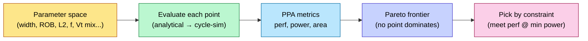

# Performance Modeling and Design-Space Exploration

> **Stage:** 01 · Architecture & PPA — the *performance* half of PPA, done **before any RTL exists**.
> **Prerequisites:** [Chip_Design_Flow_Overview](../Chip_Design_Flow_Overview.md), [CPU_Architecture](CPU_Architecture.md), [Memory](Memory.md). **Hands off to:** the µarch spec that [RTL_Design_Methodology](../03_Frontend_RTL_and_Verification/RTL_Design_Methodology.md) implements.

---

## 0. Why this page exists

Before a line of RTL is written, you must answer: *will this microarchitecture hit the performance target inside the power and area budget?* You cannot answer that by building it — RTL is months of work, and silicon is a year. You answer it with **models**: abstractions that trade accuracy for speed so you can evaluate hundreds of design points cheaply. Getting this stage wrong is the single most expensive mistake in chip design, because every later stage faithfully implements whatever the architecture committed to. This page covers the modeling ladder (analytical → trace → cycle-accurate → RTL), how to drive design-space exploration (DSE), and how PPA tradeoffs are actually made.

---

## 1. The modeling-fidelity ladder

Every model picks a point on the **speed ↔ accuracy** curve. You move *down* the ladder as the design firms up.

| Model | Fidelity | Speed | What it captures | Tool/example |
|---|---|---|---|---|
| **Analytical / spreadsheet** | ±30–50% | instant | first-order: Amdahl, roofline, CPI stack, area = Σ blocks | Excel, closed-form |
| **Trace-driven** | ±15–25% | very fast | cache/branch/BW behavior on real address/branch traces | DineroIV, custom cache sim |
| **Cycle-approximate** | ±10–15% | fast (MIPS) | event-driven, abstracted pipeline | gem5 (AtomicSimple), Sniper |
| **Cycle-accurate** | ±5% | slow (KIPS) | full pipeline timing, contention | gem5 (O3CPU), SystemC TLM-timed |
| **RTL / emulation** | golden | very slow | the actual design | Verilator, [emulation](../03_Frontend_RTL_and_Verification/Gate_Level_Sim_and_Emulation.md) |

**Rule:** use the *fastest model that can distinguish the choices you're deciding between*. Comparing two cache sizes? Trace-driven. Comparing two issue-width/pipeline-depth points? Cycle-approximate. Validating the final µarch? Cycle-accurate.

---

## 2. Analytical models — the back-of-envelope that decides the most

### 2.1 The CPI stack
Performance = $\text{IPC} \times f$. Build CPI additively from a base plus stall components:

$$\text{CPI} = \text{CPI}_{\text{base}} + \underbrace{m_{\text{L1}}\,p_{\text{L1}} + m_{\text{L2}}\,p_{\text{L2}} + m_{\text{mem}}\,p_{\text{mem}}}_{\text{memory}} + \underbrace{b\,(1-a)\,p_{\text{mispred}}}_{\text{branch}}$$

where $m_x$ = misses per instruction at level $x$, $p_x$ = penalty cycles, $b$ = branch fraction, $a$ = predictor accuracy. This one equation tells you *which stall dominates* and therefore *what to spend area on*. If memory CPI swamps branch CPI, a fancier predictor is wasted silicon.

### 2.2 Amdahl and the parallel ceiling
$$\text{Speedup} = \frac{1}{(1-p) + p/N}$$
The serial fraction $p$ caps everything — at $p=0.9$, infinite cores give only 10×. This is *why* accelerators co-design the algorithm, not just the hardware.

### 2.3 Roofline (the AI-era PPA lens)
Attainable perf $= \min(\pi,\ \beta \cdot I)$ where $\pi$=peak FLOPS, $\beta$=bandwidth, $I$=arithmetic intensity. The ridge point $\pi/\beta$ tells you whether a workload is compute- or memory-bound *before* you size anything. (Full treatment in ai_infra [Memory_Hierarchy_and_Roofline](../../ai_infra/L3_Microarchitecture/Memory_Hierarchy_and_Roofline.md).)

### 2.4 Worked example — issue width vs. frequency
A 4-wide core at 3 GHz vs. a 2-wide core at 4 GHz. Suppose the 4-wide sustains IPC 1.8, the 2-wide IPC 1.2 (better clock came from a shorter pipeline that hurts IPC via more mispredict exposure).
- 4-wide: $1.8 \times 3 = 5.4$ BIPS. 2-wide: $1.2 \times 4 = 4.8$ BIPS.
- But power $\propto$ width × f × V², and the 4-wide needs more area. The *decision* is BIPS/W and BIPS/mm², not BIPS. This is DSE in one example.

---

## 3. Cycle-level simulation (gem5 and friends)

When the spreadsheet can't resolve a choice (contention, reordering, prefetcher interaction), you simulate.

- **gem5** is the academic/industry standard: configurable CPU models (`AtomicSimpleCPU` for fast functional, `O3CPU` for out-of-order cycle-accurate), a flexible memory system (Ruby/classic), and full-system or syscall-emulation modes. You model your µarch as a config, run benchmark traces, and read out IPC, MPKI, occupancy.
- **Sampling** makes long workloads tractable: **SimPoint** clusters program phases and simulates one representative per cluster; **SMARTS** does statistically-rigorous interval sampling. You simulate ~1% of instructions and extrapolate with bounded error — without it, a single SPEC run is weeks.
- **Validation** is the catch: an unvalidated cycle "accurate" model can be 30% off. You calibrate against a known reference (silicon or RTL) on a few kernels before trusting it for DSE.

```
gem5 O3 config knobs that matter most for DSE:
  --cpu-clock, --issue-width, --rob-size, --num-iqs (issue queue)
  --l1d_size/--l1i_size/--l2_size, --l1d_assoc, cacheline
  branch predictor type + table sizes
  --mem-type (DDR4/5/HBM), num channels  -> caps sustained BW
```

---

## 4. SystemC / TLM — system-level and pre-RTL HW/SW co-design

For SoCs (not just a core), **SystemC** with **TLM-2.0** models the *system*: CPUs, DMA, accelerators, NoC, memory, all as transaction-level modules. Two coding styles:
- **Loosely-timed (LT)** — blocking transactions, temporal decoupling; fast enough to **boot the OS and run firmware** on a virtual platform months before RTL. This is how software teams start early.
- **Approximately-timed (AT)** — non-blocking, models arbitration/contention/latency phases; used for **performance** estimation of the interconnect and memory system.

The deliverable is a **virtual platform**: software develops against it, and architecture gets early bandwidth/latency numbers for the bus and memory ([AHB_AXI_APB](AHB_AXI_APB.md), [DDR_Controller](DDR_Controller.md)).

---

## 5. Design-space exploration (DSE)

DSE = searching the parameter space (cache sizes, widths, depths, #cores, NoC topology) for the Pareto-optimal PPA points.



- The space is combinatorial; you can't brute-force it at cycle-accurate fidelity. The practical recipe: **prune analytically** (kill obviously-bad points), then **cycle-simulate the survivors**, optionally guided by Bayesian optimization / ML surrogates to sample the space efficiently.
- The output is a **Pareto frontier**: the set of points where you can't improve one metric without hurting another. The architect then picks by the *binding constraint* — "minimum power that still meets 5.4 BIPS," or "max perf under 2 W and 10 mm²."

---

## 6. PPA tradeoffs — how the three axes actually trade

| Lever | Performance | Power | Area | Note |
|---|---|---|---|---|
| ↑ Frequency | + | ++ (V² then thermal) | ~0 | hits the [power](../02_Power_and_Low_Power/Power_Fundamentals.md) wall fast |
| ↑ Issue width / OoO depth | + (diminishing) | + | ++ | superscalar returns saturate |
| ↑ Cache size | + (until working set fits) | + (leakage) | ++ | the classic area sink |
| Pipeline deeper | + f, − IPC (mispredict) | + | + | net perf is non-monotonic |
| Specialize (accelerator) | +++ on target | −− (energy/op) | + | the AI-chip bet |
| Parallelize (more cores) | + (Amdahl-capped) | + | ++ | only if the workload scales |

The architect's job is to spend each mm² and each mW where the **CPI stack / roofline** says the bottleneck is — never uniformly.

---

## 7. Numbers to memorize

| Quantity | Value | Why |
|---|---|---|
| Analytical model error | ±30–50% | good for *ranking*, not signoff |
| Cycle-accurate error (validated) | ~5% | the architecture commit point |
| gem5 O3 speed | ~0.1–1 MIPS | why sampling exists |
| SimPoint coverage | ~1% of instrs simulated | bounded-error extrapolation |
| Amdahl at p=0.9 | 10× ceiling | serial fraction dominates |
| Superscalar IPC reality | ~1–2 sustained (general code) | width has diminishing returns |
| TLM-LT use | boots OS pre-RTL | early SW + virtual platform |

---

## 8. Worked problem

**Q.** Architecture proposes doubling L2 from 1 MB to 2 MB. Trace-driven sim shows L2 MPKI drops 12 → 7. L2 penalty is 12 cyc, mem penalty 200 cyc, and the extra MB adds 1.5 mm² and 60 mW leakage. The core runs at IPC 1.5, 3 GHz. Is it worth it?

*Solution.* Memory-CPI improvement: the 5 fewer misses/1000-instr that now hit L2 instead of memory save $(200-12)=188$ cyc each → $\Delta\text{CPI} = 5/1000 \times 188 = 0.94$ cyc/instr saved... but only the fraction that *would have gone to memory* counts — assume those 5 MPKI were memory accesses: ΔCPI ≈ 0.94. New CPI = (1/1.5) − 0.94 = 0.67 − 0.94 < 0, which is impossible — so the assumption is wrong: not all 5 saved misses were full memory misses, and base CPI already hides some under OoO. The lesson: **plug it into the CPI stack with realistic memory-level parallelism**, don't multiply MPKI by raw latency. Re-run with the cycle model; if perf gain >~3–5% for +1.5 mm²/+60 mW it's likely worth it, judged on BIPS/W and BIPS/mm² against the Pareto frontier.

---

## 9. GPU performance modeling — throughput, occupancy, per-kernel roofline

Everything above is CPU-centric: the metric is **latency of one stream** (CPI, IPC). A GPU is a **throughput** machine — thousands of threads hide latency instead of avoiding it — so the model changes. The unit of analysis is the **kernel**, and the bottleneck is almost always *occupancy* or *memory* rather than per-instruction stalls. (µarch detail: ai_infra [GPU_Architecture](../../ai_infra/L3_Microarchitecture/GPU_Architecture.md).)

### 9.1 Occupancy and latency hiding
Threads are grouped into **warps** (32 lanes, SIMT); a streaming multiprocessor (SM) round-robins ready warps to hide memory and pipeline latency. **Occupancy** = active warps / max warps per SM, capped by whichever resource runs out first:

$$\text{occupancy} = \frac{\min\!\left(\underbrace{\tfrac{\text{regs}_{\max}}{32\cdot\text{regs/thread}}}_{\text{reg-limited warps}},\ \underbrace{\left\lfloor\tfrac{\text{smem}_{\max}}{\text{smem/block}}\right\rfloor\cdot\tfrac{\text{warps}}{\text{block}}}_{\text{smem-limited warps}},\ W_{\max}\right)}{W_{\max}}$$

(each term is expressed as *warps per SM* — registers are budgeted per 32-thread warp, shared memory per resident block — and hardware also caps resident blocks/SM.)

To hide a memory latency $L$ at issue throughput, **Little's Law** sets the warps you need: $\text{warps} \gtrsim L \times \text{issue-rate}$. Too few warps → the SM stalls with no ready work even though peak FLOPS is untouched. The lever is register/shared-memory pressure, not clock.

### 9.2 Memory coalescing
The DRAM/L2 sees **memory transactions**, not threads. When the 32 threads of a warp touch one aligned cache line, the access **coalesces** into one transaction; strided/scattered access fans out into many, multiplying effective traffic and collapsing achieved bandwidth. Coalescing efficiency = requested bytes / transferred bytes is a first-order multiplier on $\beta$ in the roofline — a strided kernel can be 8–32× off peak BW with no compute change.

### 9.3 Per-kernel roofline and simulators
Apply roofline (§2.3) **per kernel**, with $I$ = FLOPs / bytes *after* coalescing and cache effects. A GEMM kernel sits near the compute roof; an element-wise or LayerNorm kernel is far left (memory-bound) — they need opposite optimizations, so you never roofline "the GPU," you roofline each kernel.

| Tool | What it is | Fidelity |
|---|---|---|
| **GPGPU-Sim 4.x** | detailed cycle-level SM/memory model; integrated **GPUWattch** energy | cycle-level |
| **Accel-Sim** | trace-driven frontend: NVBit captures real **SASS** traces → ISA-independent IR → GPGPU-Sim perf model; **Correlator** validates vs. hardware counters, **Tuner** auto-generates configs | validated, trace-driven |
| **NVIDIA Nsight Compute** | on-silicon profiler: occupancy, achieved BW, warp-stall reasons — the *measurement* you validate models against | hardware |

Accel-Sim's value is **validation**: it correlates simulated stats against real Volta/Ampere/Hopper counters, so a DSE on a future config inherits trust from the calibrated baseline.

### 9.4 Worked example — occupancy-bound vs. memory-bound kernel
SM allows 64 warps (2048 threads), 64K registers, 96 KB shared memory. A kernel uses **64 registers/thread** and 256-thread blocks.

- Register-limited warps: $65536 / (64 \times 32) = 32$ warps (one warp = 32 threads → $64\times32=2048$ regs/warp; $65536/2048=32$). Occupancy $= 32/64 = 50\%$.
- Drop to 32 registers/thread (recompute, spill less) → 64 warps → **100% occupancy**, doubling latency-hiding capacity — but if the kernel is *memory-bound*, higher occupancy buys nothing once BW saturates.
- Roofline check: GEMM tile at $I=40$ FLOP/byte on a 2 TB/s, 60 TFLOP/s part has ridge $\pi/\beta = 30$. Since $40>30$ → compute-bound → fix occupancy/instruction mix. An element-wise kernel at $I=0.25$ is hopelessly memory-bound → fuse it to raise $I$, occupancy is irrelevant. **The model tells you which knob is live before you touch a line of CUDA.**

---

## 10. NPU / accelerator performance modeling — systolic arrays, dataflow, tiling

An NPU/TPU replaces the warp-scheduler abstraction entirely: the workhorse is a **systolic array (SA)** of $D\times D$ MAC PEs streaming a tiled GEMM, plus a SIMD **vector unit (VU)** for non-GEMM ops and an SRAM/HBM hierarchy. Performance modeling becomes a **loop-nest + utilization** problem, not an IPC problem. (Background: ai_infra [Systolic_Arrays_and_Dataflow](../../ai_infra/L2_Digital_Design_for_AI/Systolic_Arrays_and_Dataflow.md), [Google_TPU](../../ai_infra/L3_Microarchitecture/Google_TPU.md).)

### 10.1 Systolic-array cycle and utilization model
A $D\times D$ array computing $C_{M\times N} = A_{M\times K}\,B_{K\times N}$, tiled into $T_m\times T_n$ output tiles with the $K$ dimension streamed. For one tile (weight- or output-stationary), the array must **fill** and **drain** the pipeline around the $K$ useful cycles:

$$\text{cycles}_{\text{tile}} \approx K + 2D \quad(\text{fill + drain} \approx 2D)$$

The $2D$ is a first-order stand-in: an exact $D\times D$ wavefront model gives fill + drain $= (D-1)+(D-1) = 2D-2 \approx 2D$; some formulations bill only a single $\approx D$-cycle latency when fill and drain overlap across back-to-back tiles. Use it to *rank* mappings and expose the fill/drain penalty, not for cycle-exact signoff.

$$\text{cycles}_{\text{total}} \approx \left\lceil\frac{M}{D}\right\rceil\left\lceil\frac{N}{D}\right\rceil\,(K + 2D)$$

**Utilization** = useful MACs / (capacity × cycles):

$$U = \frac{M\,N\,K}{D^2 \times \text{cycles}_{\text{total}}} \;=\; \frac{1}{\underbrace{\left\lceil M/D\right\rceil D / M \cdot \left\lceil N/D\right\rceil D / N}_{\text{edge-tile quantization}}}\times\underbrace{\frac{K}{K+2D}}_{\text{fill/drain amortization}}$$

Two losses fall straight out: **edge quantization** (small/odd $M,N$ don't fill the array — pad waste) and **fill/drain** (small $K$ can't amortize the $2D$ pipeline latency). Both push you toward large, array-aligned tiles.

### 10.2 Dataflow taxonomy
*Which* tensor stays resident in the PEs sets reuse, SRAM traffic, and which dimension amortizes the pipeline:

| Dataflow | Stationary operand | Reuse maximized | Typical fit |
|---|---|---|---|
| **Weight-stationary (WS)** | weights held in PEs | weight reuse across the batch / activation stream | TPU-style GEMM, many activations per weight load |
| **Output-stationary (OS)** | partial sums accumulate in place | psum reuse (no psum read-modify-write to SRAM) | deep reduction — large $K$ amortized in-place |
| **Row-stationary (RS)** | a 1-D row of the convolution mapped into a PE (Eyeriss) | balances weight/act/psum reuse across all three | CNNs, low data-movement energy |

The choice changes the *energy* (data movement) more than raw cycles — Eyeriss's row-stationary was shown 1.4×–2.5× more energy-efficient than the other dataflows the paper evaluated on AlexNet (a scoped, workload-specific result, not a proof of global optimality).

### 10.3 Tiling / loop nest and the bottleneck classes
The mapper picks tile sizes ($T_m,T_n,T_k$) so each tile's operands fit in SRAM, then orders the loop nest. The **roofline still rules**, but per operator with three bottleneck classes specific to this architecture:

- **SA-bound** — the GEMM saturates the MAC array; you are at the compute roof. Fix: bigger array, more SAs, higher $U$.
- **VU-bound** — softmax / LayerNorm / activation on the vector unit is the critical path (common in attention). Fix: more VU lanes, fuse into GEMM epilogue.
- **HBM-bound** — operand/weight traffic exceeds HBM bandwidth (memory-bound operators, low arithmetic intensity, KV-cache reads). Fix: bigger tiles for reuse, more HBM BW, quantization.

### 10.4 Tools
| Tool | Models | Output |
|---|---|---|
| **SCALE-Sim (v2/v3)** | cycle-accurate systolic array; array size/aspect, SRAM, dataflow, BW; v3 adds multi-core, sparsity, **Ramulator** DRAM, Accelergy energy | cycles, SRAM/DRAM traffic, utilization, stalls |
| **Timeloop** | exhaustive/heuristic **mapper**: searches loop-nest tilings over a hardware template, reports best mapping + per-level access counts | optimal mapping, MACs, data movement |
| **Accelergy** | plugs into Timeloop: per-component **energy** from access counts × an energy reference table (CACTI/plug-ins) | energy/op, breakdown by component |

Timeloop+Accelergy is the standard *mapping-and-energy* loop; SCALE-Sim is the standard *cycle-accurate* systolic model. Together they cover the same "perf + energy" span that gem5+McPAT covers for CPUs.

### 10.5 Worked example — GEMM on a 128×128 array
Map $C = A B$ with $M=512, N=512, K=256$ onto $D=128$ (WS).

- Tiles: $\lceil 512/128\rceil \times \lceil 512/128\rceil = 4\times4 = 16$ output tiles, each $128\times128$.
- Per-tile cycles $\approx K + 2D = 256 + 256 = 512$. Total $\approx 16 \times 512 = 8192$ cycles.
- Useful MACs $= MNK = 512\cdot512\cdot256 = 6.71\times10^7$. Capacity·cycles $= D^2\times8192 = 16384\times8192 = 1.34\times10^8$.
- **Utilization** $U = 6.71\times10^7 / 1.34\times10^8 = \mathbf{50\%}$ — and the cause is explicit: $M,N$ tile cleanly (no edge loss), so the entire $50\%$ is **fill/drain**: $K/(K+2D)=256/512=0.5$. Doubling $K$ to 512 lifts $U$ to $512/768 = 67\%$; tiling the $K$ loop deeper (streaming a longer reduction per array load) is the lever. At 1 GHz this kernel is $8192$ ns and **SA-bound**; if a fused softmax afterward took $>8192$ cycles on the VU, the operator flips **VU-bound** and the array sizing is wasted.

---

## 11. Worked example — building an industrial operator-level simulator (NeuSim)

This is the capstone: **how you turn the analytical models of §9–10 into an industrial DSE tool.** [NeuSim](https://github.com/platformxlab/NeuSim) (UIUC PlatformX lab; backs the Neu10/MICRO'24, V10/ISCA'23 perf papers and ReGate/MICRO'25 power-gating paper) is an open-source NPU simulator that does exactly the perf → power → carbon → SLO loop, config-driven, at design-space scale.

### 11.1 Component models — one model per block
NeuSim models each NPU component the §10 abstraction names, and reports **per-operator** statistics so bottleneck class is a direct output, not a hand calculation:

| Component | Modeled quantity | Maps to |
|---|---|---|
| **Systolic array (SA)** | GEMM cycles, FLOPS, utilization | §10.1 SA-bound |
| **Vector unit (VU)** | SIMD op time for non-GEMM | §10.3 VU-bound |
| **On-chip SRAM** | capacity, reuse, DMA staging | tiling / §10.3 |
| **HBM** | bandwidth, memory traffic | §10.3 HBM-bound |
| **ICI (inter-chip interconnect)** | RDMA / AllReduce BW across a pod (2D/3D torus) | multi-chip parallelism |

For **each tensor operator** it reports execution time, FLOPS, and memory traffic, and **classifies SA-/VU-/HBM-bound** — the §10.3 taxonomy emitted automatically.

### 11.2 The four-stage flow
NeuSim deliberately separates concerns into four scripts, each consuming the previous stage's output (modular, so you can re-run power without re-running perf):

```
run_sim.py                      → per-operator PERFORMANCE (cycles, FLOPS, traffic, bound-class) → CSV/JSON
energy_operator_analysis_main.py → POWER/ENERGY per component (static + dynamic), reads perf CSVs
carbon_analysis_main.py          → CARBON = embodied + operational, from energy × carbon-intensity × duty cycle
slo_analysis_main.py             → SLO: pick configs meeting a target (e.g. inference request latency)
```

This is the accelerator analogue of "gem5 → McPAT → power/thermal → does-it-meet-spec," but operator-level and carbon-aware.

### 11.3 Config-driven DSE at scale
The whole design space is **three config directories**, swept combinatorially — this is §5 (DSE / Pareto) realized for NPUs:

- `configs/chips/` — # of SAs, # of VUs, core frequency, HBM bandwidth, SRAM size (the **hardware** axis).
- `configs/models/` — model graph + parallelism (LLMs Llama/DeepSeek, DLRM, DiT-XL, GLIGEN).
- `configs/systems/` — datacenter PUE, carbon intensity (the **carbon** axis).

`run_sim.py` sweeps **#chips × batch size × NPU version × parallelism config** (tensor/pipeline/data/expert parallelism, TP/PP/DP/EP), and **Ray** auto-parallelizes the millions of simulation jobs across machines — the practical answer to "the space is combinatorial, you can't brute-force cycle-accurate" (§5). The output is a Pareto set the `slo_analysis` stage filters to the most cost-/carbon-efficient config meeting the SLO.

### 11.4 Advanced knobs — power gating and DVFS
NeuSim models two power/efficiency levers per component (the ReGate contribution), exposed as the `--power_gating_strategy` flag:
- **Power gating** — `NoPG` / `Ideal` (instruction-temporal, PE/ALU-spatial granularity, max savings) / `Full` (Ideal + real wake-up delay & non-zero gated-power factor); plus sensitivity sweeps over $V_{th}$ and wake-up delay.
- **DVFS** — voltage/frequency scaling to trade performance for power/energy.

These let the architect explore perf-vs-power-vs-energy tradeoffs the static roofline can't see (leakage during idle bubbles between operators). Power-side modeling detail: [Block_Activity_and_Power](../02_Power_and_Low_Power/Block_Activity_and_Power.md).

### 11.5 Extending it to a new model or architecture
The pattern to learn (it generalizes to any in-house simulator):
- **New model** → add a config in `configs/models/` for a variant (layers/hidden dim), or implement a new **model generator** class in `neusim/npusim/frontend/` that emits the op graph, reusing library operators (GEMM, Conv, LayerNorm) in `neusim/npusim/backend/npusim_lib.py`.
- **New chip / architecture** → add a `configs/chips/*.json` (e.g. `tpuv7.json` → `--versions=7`); deeper changes (a new component, a different dataflow) extend the backend component models.
- **New power policy** → edit `get_power_gating_config()` in `neusim/configs/power_gating/PowerGatingConfig.py`.

The lesson for an architect: an industrial DSE tool is **(component perf models) + (energy/carbon overlay) + (a config-swept, distributed search)**. NeuSim is a clean reference for all three — the §2 analytical kernels become the per-component models, §5 DSE becomes the Ray sweep, and §6 PPA tradeoffs become the SLO/carbon Pareto filter.

---

## Cross-references
- Implements into: [RTL_Design_Methodology](../03_Frontend_RTL_and_Verification/RTL_Design_Methodology.md).
- Power half of PPA: [Power_Fundamentals](../02_Power_and_Low_Power/Power_Fundamentals.md), [Block_Activity_and_Power](../02_Power_and_Low_Power/Block_Activity_and_Power.md).
- Microarchitecture detail: [CPU_Architecture](CPU_Architecture.md), [OoO_Execution](OoO_Execution.md), [Cache_Microarchitecture](Cache_Microarchitecture.md).
- Accelerator µarch (GPU/NPU perf modeling, §9–11): ai_infra [GPU_Architecture](../../ai_infra/L3_Microarchitecture/GPU_Architecture.md), [Google_TPU](../../ai_infra/L3_Microarchitecture/Google_TPU.md), [Systolic_Arrays_and_Dataflow](../../ai_infra/L2_Digital_Design_for_AI/Systolic_Arrays_and_Dataflow.md).
- Systems analogue: ai_infra [Memory_Hierarchy_and_Roofline](../../ai_infra/L3_Microarchitecture/Memory_Hierarchy_and_Roofline.md).
