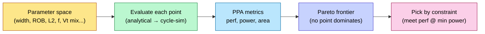

# Performance Modeling and Design-Space Exploration

> **Stage:** 01 · Architecture & PPA — the *performance* half of PPA, done **before any RTL exists**.
> **Prerequisites:** [Chip_Design_Flow_Overview](../Chip_Design_Flow_Overview.md), [CPU_Architecture](CPU_Architecture.md), [Memory](Memory.md). **Hands off to:** the µarch spec that [RTL_Design_Methodology](../03_Frontend_RTL_and_Verification/RTL_Design_Methodology.md) implements.

---

## 0. Why this page exists

Before a line of RTL is written, you must answer: *will this microarchitecture hit the performance target inside the power and area budget?* You cannot answer that by building it — RTL is months of work, and silicon is a year. You answer it with **models**: abstractions that trade accuracy for speed so you can evaluate hundreds of design points cheaply. Getting this stage wrong is the single most expensive mistake in chip design, because every later stage faithfully implements whatever the architecture committed to. This page covers the modeling ladder (analytical → trace → cycle-accurate → RTL), how to drive design-space exploration (DSE), and how PPA tradeoffs are actually made.

---

## 1. The modeling-fidelity ladder

Every model picks a point on the **speed ↔ accuracy** curve. You move *down* the ladder as the design firms up.

| Model | Fidelity | Speed | What it captures | Tool/example |
|---|---|---|---|---|
| **Analytical / spreadsheet** | ±30–50% | instant | first-order: Amdahl, roofline, CPI stack, area = Σ blocks | Excel, closed-form |
| **Trace-driven** | ±15–25% | very fast | cache/branch/BW behavior on real address/branch traces | DineroIV, custom cache sim |
| **Cycle-approximate** | ±10–15% | fast (MIPS) | event-driven, abstracted pipeline | gem5 (AtomicSimple), Sniper |
| **Cycle-accurate** | ±5% | slow (KIPS) | full pipeline timing, contention | gem5 (O3CPU), SystemC TLM-timed |
| **RTL / emulation** | golden | very slow | the actual design | Verilator, [emulation](../03_Frontend_RTL_and_Verification/Gate_Level_Sim_and_Emulation.md) |

**Rule:** use the *fastest model that can distinguish the choices you're deciding between*. Comparing two cache sizes? Trace-driven. Comparing two issue-width/pipeline-depth points? Cycle-approximate. Validating the final µarch? Cycle-accurate.

---

## 2. Analytical models — the back-of-envelope that decides the most

### 2.1 The CPI stack
Performance = $\text{IPC} \times f$. Build CPI additively from a base plus stall components:

$$\text{CPI} = \text{CPI}_{\text{base}} + \underbrace{m_{\text{L1}}\,p_{\text{L1}} + m_{\text{L2}}\,p_{\text{L2}} + m_{\text{mem}}\,p_{\text{mem}}}_{\text{memory}} + \underbrace{b\,(1-a)\,p_{\text{mispred}}}_{\text{branch}}$$

where $m_x$ = misses per instruction at level $x$, $p_x$ = penalty cycles, $b$ = branch fraction, $a$ = predictor accuracy. This one equation tells you *which stall dominates* and therefore *what to spend area on*. If memory CPI swamps branch CPI, a fancier predictor is wasted silicon.

### 2.2 Amdahl and the parallel ceiling
$$\text{Speedup} = \frac{1}{(1-p) + p/N}$$
The serial fraction $p$ caps everything — at $p=0.9$, infinite cores give only 10×. This is *why* accelerators co-design the algorithm, not just the hardware.

### 2.3 Roofline (the AI-era PPA lens)
Attainable perf $= \min(\pi,\ \beta \cdot I)$ where $\pi$=peak FLOPS, $\beta$=bandwidth, $I$=arithmetic intensity. The ridge point $\pi/\beta$ tells you whether a workload is compute- or memory-bound *before* you size anything. (Full treatment in ai_infra [Memory_Hierarchy_and_Roofline](../../ai_infra/L3_Microarchitecture/Memory_Hierarchy_and_Roofline.md).)

### 2.4 Worked example — issue width vs. frequency
A 4-wide core at 3 GHz vs. a 2-wide core at 4 GHz. Suppose the 4-wide sustains IPC 1.8, the 2-wide IPC 1.2 (better clock came from a shorter pipeline that hurts IPC via more mispredict exposure).
- 4-wide: $1.8 \times 3 = 5.4$ BIPS. 2-wide: $1.2 \times 4 = 4.8$ BIPS.
- But power $\propto$ width × f × V², and the 4-wide needs more area. The *decision* is BIPS/W and BIPS/mm², not BIPS. This is DSE in one example.

---

## 3. Cycle-level simulation (gem5 and friends)

When the spreadsheet can't resolve a choice (contention, reordering, prefetcher interaction), you simulate.

- **gem5** is the academic/industry standard: configurable CPU models (`AtomicSimpleCPU` for fast functional, `O3CPU` for out-of-order cycle-accurate), a flexible memory system (Ruby/classic), and full-system or syscall-emulation modes. You model your µarch as a config, run benchmark traces, and read out IPC, MPKI, occupancy.
- **Sampling** makes long workloads tractable: **SimPoint** clusters program phases and simulates one representative per cluster; **SMARTS** does statistically-rigorous interval sampling. You simulate ~1% of instructions and extrapolate with bounded error — without it, a single SPEC run is weeks.
- **Validation** is the catch: an unvalidated cycle "accurate" model can be 30% off. You calibrate against a known reference (silicon or RTL) on a few kernels before trusting it for DSE.

```
gem5 O3 config knobs that matter most for DSE:
  --cpu-clock, --issue-width, --rob-size, --num-iqs (issue queue)
  --l1d_size/--l1i_size/--l2_size, --l1d_assoc, cacheline
  branch predictor type + table sizes
  --mem-type (DDR4/5/HBM), num channels  -> caps sustained BW
```

---

## 4. SystemC / TLM — system-level and pre-RTL HW/SW co-design

For SoCs (not just a core), **SystemC** with **TLM-2.0** models the *system*: CPUs, DMA, accelerators, NoC, memory, all as transaction-level modules. Two coding styles:
- **Loosely-timed (LT)** — blocking transactions, temporal decoupling; fast enough to **boot the OS and run firmware** on a virtual platform months before RTL. This is how software teams start early.
- **Approximately-timed (AT)** — non-blocking, models arbitration/contention/latency phases; used for **performance** estimation of the interconnect and memory system.

The deliverable is a **virtual platform**: software develops against it, and architecture gets early bandwidth/latency numbers for the bus and memory ([AHB_AXI_APB](AHB_AXI_APB.md), [DDR_Controller](DDR_Controller.md)).

---

## 5. Design-space exploration (DSE)

DSE = searching the parameter space (cache sizes, widths, depths, #cores, NoC topology) for the Pareto-optimal PPA points.



- The space is combinatorial; you can't brute-force it at cycle-accurate fidelity. The practical recipe: **prune analytically** (kill obviously-bad points), then **cycle-simulate the survivors**, optionally guided by Bayesian optimization / ML surrogates to sample the space efficiently.
- The output is a **Pareto frontier**: the set of points where you can't improve one metric without hurting another. The architect then picks by the *binding constraint* — "minimum power that still meets 5.4 BIPS," or "max perf under 2 W and 10 mm²."

---

## 6. PPA tradeoffs — how the three axes actually trade

| Lever | Performance | Power | Area | Note |
|---|---|---|---|---|
| ↑ Frequency | + | ++ (V² then thermal) | ~0 | hits the [power](../02_Power_and_Low_Power/Power_Fundamentals.md) wall fast |
| ↑ Issue width / OoO depth | + (diminishing) | + | ++ | superscalar returns saturate |
| ↑ Cache size | + (until working set fits) | + (leakage) | ++ | the classic area sink |
| Pipeline deeper | + f, − IPC (mispredict) | + | + | net perf is non-monotonic |
| Specialize (accelerator) | +++ on target | −− (energy/op) | + | the AI-chip bet |
| Parallelize (more cores) | + (Amdahl-capped) | + | ++ | only if the workload scales |

The architect's job is to spend each mm² and each mW where the **CPI stack / roofline** says the bottleneck is — never uniformly.

---

## 7. Numbers to memorize

| Quantity | Value | Why |
|---|---|---|
| Analytical model error | ±30–50% | good for *ranking*, not signoff |
| Cycle-accurate error (validated) | ~5% | the architecture commit point |
| gem5 O3 speed | ~0.1–1 MIPS | why sampling exists |
| SimPoint coverage | ~1% of instrs simulated | bounded-error extrapolation |
| Amdahl at p=0.9 | 10× ceiling | serial fraction dominates |
| Superscalar IPC reality | ~1–2 sustained (general code) | width has diminishing returns |
| TLM-LT use | boots OS pre-RTL | early SW + virtual platform |

---

## 8. Worked problem

**Q.** Architecture proposes doubling L2 from 1 MB to 2 MB. Trace-driven sim shows L2 MPKI drops 12 → 7. L2 penalty is 12 cyc, mem penalty 200 cyc, and the extra MB adds 1.5 mm² and 60 mW leakage. The core runs at IPC 1.5, 3 GHz. Is it worth it?

*Solution.* Memory-CPI improvement: the 5 fewer misses/1000-instr that now hit L2 instead of memory save $(200-12)=188$ cyc each → $\Delta\text{CPI} = 5/1000 \times 188 = 0.94$ cyc/instr saved... but only the fraction that *would have gone to memory* counts — assume those 5 MPKI were memory accesses: ΔCPI ≈ 0.94. New CPI = (1/1.5) − 0.94 = 0.67 − 0.94 < 0, which is impossible — so the assumption is wrong: not all 5 saved misses were full memory misses, and base CPI already hides some under OoO. The lesson: **plug it into the CPI stack with realistic memory-level parallelism**, don't multiply MPKI by raw latency. Re-run with the cycle model; if perf gain >~3–5% for +1.5 mm²/+60 mW it's likely worth it, judged on BIPS/W and BIPS/mm² against the Pareto frontier.

---

## Cross-references
- Implements into: [RTL_Design_Methodology](../03_Frontend_RTL_and_Verification/RTL_Design_Methodology.md).
- Power half of PPA: [Power_Fundamentals](../02_Power_and_Low_Power/Power_Fundamentals.md), [Block_Activity_and_Power](../02_Power_and_Low_Power/Block_Activity_and_Power.md).
- Microarchitecture detail: [CPU_Architecture](CPU_Architecture.md), [OoO_Execution](OoO_Execution.md), [Cache_Microarchitecture](Cache_Microarchitecture.md).
- Systems analogue: ai_infra [Memory_Hierarchy_and_Roofline](../../ai_infra/L3_Microarchitecture/Memory_Hierarchy_and_Roofline.md).
