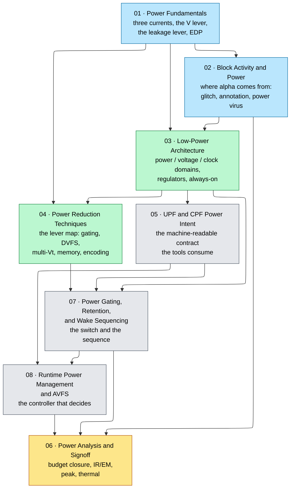

# 02 · Power and Low-Power — Folder Index

*Cross-cutting track: power is budgeted from workloads, partitioned at architecture, captured as power intent, implemented in synthesis/backend, and verified through signoff.*

This is the first of the two cross-cutting tracks — the other is [08 · Cross-Cutting Engineering](../08_Cross_Cutting_Engineering/00_Index.md). Nothing in this folder is a stage in the flow. Power is decided at architecture, spent in RTL, built in the backend, and proved at signoff, and a decision taken in any one of those places constrains all the others. That is why the eight pages are numbered as a track rather than distributed into the stage folders that consume them.

The track answers five questions in order, and each one is unanswerable without the previous:

- **Where does the power actually go, and which term does a proposal move?** — the physics and the budget (01).
- **Where does the switching activity in that budget come from?** — the workload, and how it becomes a number you can defend (02).
- **What may turn off together, share a voltage, or share a clock?** — the partition, which is an architecture decision (03).
- **Which mechanism attacks which term, and what does each cost?** — the lever map and its implementations (04, 05, 07, 08).
- **How is any of it proved rather than asserted?** — signoff (06).

The arrows are dependency, not schedule. The three that people most often reverse are worth naming. **03 precedes 07 and 08** because a switch fabric and a controller can only be built for boundaries that already exist — deciding to gate a block is an architecture decision, and building the gate is not. **07 precedes 08** because the controller's timing budget is made of the sequence's numbers: a policy that does not know the wake latency cannot decide whether sleeping is worth it. And **02 precedes 06** because signoff annotates activity rather than inventing it; a peak-power number with no workload behind it is not evidence.

## Pages

| # | Page | Coverage | Read it when |
|---|------|----------|---|
| 01 | [Power Fundamentals](01_Power_Fundamentals.md) | The three ceilings — thermal, delivery, energy — and why power is the binding constraint; the $P=\alpha C V_{DD}^2 f + V_{DD}I_{leak}$ split with the short-circuit term derived rather than quoted; the four leakage mechanisms including GIDL, the stack effect, subthreshold swing, and the leakage–temperature law; a worked clock-tree budget; $V_{DD}$ as the master lever and the near-cubic DVFS law; energy per op, the minimum-energy point, EDP and $ED^2$; frequency versus parallelism and why computing went wide; the four-lever reduction map | You are about to claim something "saves power" and need to say which term it moves, or you need a defensible watt figure for a block |
| 02 | [Block Activity and Power](02_Block_Activity_and_Power.md) | What the activity factor $\alpha$ actually is; vectored versus vectorless, and probability propagation through logic; why temporal and spatial correlation make the estimate hard; glitch power quantified rather than mentioned; component decomposition from $\alpha$ to block power; the architectural → RTL → gate → SPICE fidelity ladder; the occupancy-to-$\alpha$ conversion the whole flow rests on; VCD, FSDB, and SAIF annotation mechanics and their coverage question; power-virus construction as a method rather than advice; the on-die power proxy that estimates activity after tape-out | Someone asks where your $\alpha$ came from, or a power number in your report has no workload behind it |
| 03 | [Low-Power Architecture and Domain Partitioning](03_Low_Power_Architecture_and_Domain_Partitioning.md) | Why power, voltage, and clock domains are three different questions; the inputs that must exist before a boundary is drawn; power-domain and voltage-domain partition strategy with their cost models evaluated numerically instead of described; the regulator section — LDO, buck, switched-capacitor, and integrated voltage regulator, with what each costs and when it is the wrong choice; clock-gating partition; the domain signature that co-partitions the axes; a repeatable workflow and a worked SoC partition; power-aware DFT as a partition constraint; failure patterns and the architecture handoff checklist | You are drawing block boundaries and "what may turn off together" has not yet been answered |
| 04 | [Power Reduction Techniques](04_Power_Reduction_Techniques.md) | The reduction map: five terms and the levers that move each; clock gating and data gating; DVFS as a lever on $V_{DD}^2 f$; power gating as the map entry whose circuit now lives in 07; multi-$V_t$ and body bias against busy leakage; memory as the densest, idlest, leakiest structure — where a read's energy goes, what banking buys, and what each sleep mode costs to leave; bus and operand encoding against capacitance and activity; the residency spectrum and how the levers interact | You have a power gap to close and need to know which lever attacks which term, at what cost, and which two cancel each other |
| 05 | [UPF/CPF Power-Intent Flow](05_UPF_and_CPF_Power_Intent.md) | Power intent as a specification orthogonal to function; power domains and supply sets; isolation, level shifting, and retention each derived from the corruption it prevents; the power state table as the artifact that collapses the state explosion into a verification contract; UPF versus CPF as a choice of one governed source of truth; the end-to-end flow from architecture to signoff; §10 is the UPF language itself as a working file, read line by line; simulation semantics and where an X comes from; successive refinement and the Liberty side; a CPF walkthrough and a failure catalogue | You must hand a power architecture to tools, or read a UPF file somebody else wrote and trace an X back to a missing strategy |
| 06 | [Power Analysis and Signoff](06_Power_Analysis_and_Signoff.md) | What signoff must prove and why the accuracy ladder exists; average versus peak, vectored versus vectorless; top-down budget allocation and bottom-up closure; peak power, the simultaneous-switching factor, and regulator sizing; power integrity as one impedance problem; static IR drop as the resistive floor and dynamic IR drop as the transient that actually fails silicon; decap tiers and their time constants; electromigration and the Blech length; voltage-aware STA where integrity meets timing; corners and the margin-versus-pessimism trade; thermal with an RC model, $di/dt$, and backside power; power-aware DFT, capture IR drop, and the test-mode number that costs yield | You have to sign something — or explain why a block that passed timing fails at speed on real silicon |
| 07 | [Power Gating, Retention, and Wake Sequencing](07_Power_Gating_Retention_and_Wake_Sequencing.md) | Switch topology — header, footer, MTCMOS — and the virtual rail it creates; sizing the switch fabric from a droop budget; fine-grain versus coarse-grain; switch placement; rush current and the two-stage daisy-chained turn-on; break-even residency in both its energy and latency forms; retention-flop topologies and what the checkpoint policy should actually retain; the always-on domain and always-on routing; isolation cells and how a clamp value is chosen rather than defaulted; level shifters at gated boundaries; the complete power-down and power-up sequences edge by edge; what gating does to characterization, STA, CTS, IR/EM, and DFT; a failure catalogue of what reaches silicon | A block in your design is going to be switched off, and something has to come back correctly and on time |
| 08 | [Runtime Power Management and AVFS](08_Runtime_Power_Management_and_Adaptive_Voltage_Frequency.md) | The power-management unit as hardware, with every interface named; power state machines and the power state table as the FSM must obey it; the quiescence handshake derived from first principles and mapped onto AMBA Q-Channel and P-Channel; what clock and reset do *inside* a transition; the software interface — ACPI C- and P-states, Arm PSCI, Linux `cpuidle`; DVFS as a control loop, with governors; race-to-idle versus crawl-to-deadline and the worked interior optimum that is neither; AVS and AVFS as guardband recovery, in millivolts and watts; droop and adaptive clocking; thermal management; granularity and the multi-agent problem; telemetry; verifying power sequences | The mechanisms all exist and nothing is deciding when to use them — or a part inside its power budget throttles anyway |

## Reading routes

- **"I write RTL and want the power habits":** 01 §§1–2 → 02 §§1–2 and §5 (what a glitch costs) → 04 §2 (clock and data gating) → 03 §5. This is the shortest route to writing RTL whose power cost you can defend, and it is deliberately four partial pages rather than four whole ones.
- **"I am drawing the power architecture":** 01 §§3–4 → 03 in full → 04 §§1, 3, 5–6 → 05 §§1–6. 03 is the spine here; everything else is either the physics it prices with or the contract it hands off.
- **"I am implementing a power-gated block":** 07 in full → 05 §§2–5 and §10 for the language that declares it → 06 §§5–8 for the droop and electromigration proofs the switch fabric has to survive.
- **"I own the controller, or the hardware/firmware boundary":** 08 §§2–6 → 07 §12 for the sequence the controller drives and how long it takes → 05 §6 for the state table the FSM must stay inside. The contract between 07 and 08 is stated explicitly at 07 §12.4.
- **"I have to sign off power":** 02 §9 (annotation, and its coverage question) → 06 in full → 07 §13 for what gating did to your corner list → 06 §12 with 03 §9 for the test-mode number.
- **"I just need one number for a budget":** 01 §2 and §5 → 02 §§6–8 → 06 §3. Stop there; the rest of the track is about earning the number rather than producing it.

---

⬅ prev [01 · Architecture and PPA](../01_Architecture_and_PPA/00_Index.md) · [Root Index](../Index.md) · [Flow Overview](../Chip_Design_Flow_Overview.md) · next ➡ [03 · Frontend RTL and Verification](../03_Frontend_RTL_and_Verification/00_Index.md)
