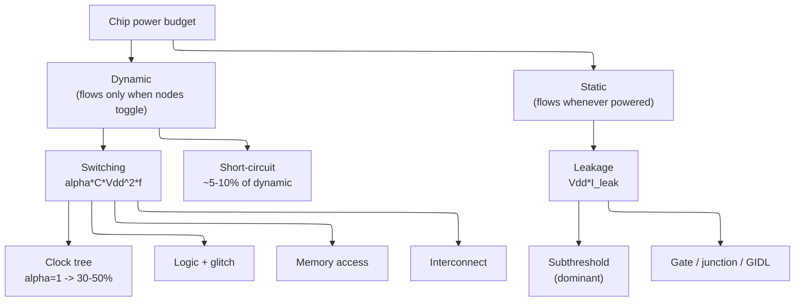

# Power Fundamentals — Where a Chip's Power Goes, and the Levers That Move It

> **Prerequisites:** [CMOS_Fundamentals](../00_Fundamentals/01_CMOS_Fundamentals.md) — this page *assumes* its §4 (the transistor-level derivation of the three powers and the energy–delay knee), §1.3 (subthreshold conduction and the 60 mV/dec wall), §13 (the leakage family), and §4.5 (Dennard). We take those results as given and reason one level up, at the chip/budget scale.
> **Hands off to:** [Power_Reduction_Techniques](03_Power_Reduction_Techniques.md) (the flow that *spends* these levers), [Block_Activity_and_Power](02_Block_Activity_and_Power.md) (per-block/per-mode modelling), [UPF_Power_Intent](04_UPF_Power_Intent.md) (encoding the intent), [Power_Analysis_and_Signoff](05_Power_Analysis_and_Signoff.md) (measuring it).

---

## 0. Why this page exists

A modern chip is not compute-limited or area-limited — it is **power-limited, from three directions at once**: you can only pull so many watts off a die (thermal), push so much current through the package and grid (delivery), and draw so much energy from a battery or a datacenter budget (energy). Every one of those is a hard ceiling, and every architectural decision — a wider core, a bigger cache, a higher clock, a second thread — is really a decision about how to *spend a fixed power/energy budget*. That is what "the power wall" means as an engineering statement: since roughly 2005, power, not transistors, has been the scarce resource.

The transistor-level question — *why* switching a node costs $\tfrac12 CV^2$, *why* the switch leaks, *why* the energy–delay product has a minimum — is answered in [CMOS_Fundamentals §4](../00_Fundamentals/01_CMOS_Fundamentals.md). This page starts where that ends and asks the **budget** questions a senior engineer actually has to answer:

- Where does the power physically go across a real chip's blocks, and why is the clock the first thing you attack?
- What are the fundamental levers — $V_{DD}$, $f$, activity $\alpha$, capacitance $C$, $V_{th}$, and parallelism — and where is the *knee* on each?
- Why does the same physics land a phone at 5 W of many slow cores and a server at 250 W of few fast ones, and why did both eventually go wide?

The organising idea is that all of power reduces to **one equation with a small number of knobs**, and every technique in the rest of the track is an attack on one term of it. Understand which term each knob moves, and the whole low-power flow becomes derivable rather than memorised.

---

## 1. Why power is the binding constraint: three ceilings

Power is not one limit but three, and they bind at different times and care about different metrics. Confusing them is the classic mistake — a design can be comfortably inside its battery budget yet trip its delivery ceiling on a single peak, or meet peak delivery yet cook itself in thermal steady state.

**Thermal — a power-*density* ceiling.** Heat must leave through a cooling solution whose capacity is fixed, so what binds is watts per unit area, not total watts. The ceilings are stark and set the whole product class:

| Cooling class | Power-density ceiling | Practical total | Product |
|---|---|---|---|
| Passive (no fan) | ~5 W/cm² | ~2–8 W | phone, wearable, IoT |
| Forced air (laptop) | ~30 W/cm² | ~15–65 W | laptop, thin client |
| Forced air (desktop) | ~80 W/cm² | ~65–250 W | desktop, workstation |
| Liquid | ~200 W/cm² | ~300–700 W | server, HPC, GPU |

Cross a thermal ceiling and two things bite back exponentially: **leakage rises ~2× per 10 °C** (§4), which is *positive feedback* — hotter → leakier → hotter, the **thermal-runaway** loop — and reliability wear-out (electromigration, hot-carrier injection, NBTI) accelerates. This is why the thermal budget is enforced at the *hottest* junction corner, not the average.

**Delivery — a peak-current and $di/dt$ ceiling.** The power-delivery network (PDN) — board VRM, package, on-die grid — has finite resistance and inductance, so a current surge droops the on-die voltage ($IR$ drop) and rings it ($L\,di/dt$). Two consequences: **peak power, not average, sizes the PDN and the decoupling**, and a voltage droop under a sudden all-cores-active event can violate timing unless the design either budgets guard-band voltage (which costs $V^2$ power everywhere, always) or throttles. Backside power delivery (Intel PowerVia, TSMC/Samsung at 2 nm — see [CMOS §8](../00_Fundamentals/01_CMOS_Fundamentals.md)) is fundamentally a delivery-ceiling fix: it cuts $IR$ drop ~30–50 % by moving the grid off the signal layers.

**Energy — a battery / TCO ceiling.** For anything mobile the currency is **energy per task** (joules to decode a frame, run an inference), because that sets battery life; for a datacenter it is energy per useful op, because that sets the electricity bill and the cooling opex that often exceeds it. Crucially, energy is the *time-integral* of power, so it is moved by different knobs than instantaneous power — a slower, lower-voltage design can burn *more* time but *less* energy (§3).

These three ceilings are why the metrics below are not interchangeable; each serves a different ceiling, and a power spec must state which:

| Metric | Serves which ceiling | Set by |
|---|---|---|
| Average power | thermal steady-state, battery | workload-averaged $\alpha C V^2 f$ + leakage |
| Peak power / $di/dt$ | delivery, IR-drop integrity | worst-case simultaneous activity |
| Power density (W/mm²) | hotspot, thermal runaway | local activity × local $C$, floorplan |
| Energy per op (pJ/op) | battery life, datacenter TCO | $\alpha C V^2$ **per useful result** |
| Leakage / standby power | always-on domains, sleep battery | $V_{DD} I_{leak}$ at temperature |

---

## 2. Where the power goes: three currents, and the block budget

### 2.1 The taxonomy, from what draws current and when

A powered chip draws current in exactly three ways, and the clean way to derive the taxonomy is to ask **when** each flows:

- **Dynamic (switching) current** flows *only when a node toggles*, to charge or discharge its capacitance. It is the current that pays for computation, and it is zero for a node that never switches. Aggregated over a clock this is $\alpha C V_{DD}^2 f$.
- **Short-circuit current** flows *only during an input edge*, in the brief instant both the pull-up and pull-down networks conduct and momentarily short $V_{DD}$ to ground. It rides on switching activity but is a small tax on it.
- **Leakage (static) current** flows *whenever the block is powered, switching or not*, because a real transistor never fully turns off ([CMOS §1.3](../00_Fundamentals/01_CMOS_Fundamentals.md)). It is the current of an idle chip.

That "when" axis *is* the taxonomy, and it gives the master equation this whole track builds on — stated here as the budget-level starting point; its per-transition $\tfrac12 CV^2$ origin is derived at the transistor level in [CMOS §4.2–4.3](../00_Fundamentals/01_CMOS_Fundamentals.md):

$$
P_{total}=\underbrace{\alpha\,C\,V_{DD}^2\,f}_{\text{switching}}\;+\;\underbrace{P_{sc}}_{\text{short-circuit}}\;+\;\underbrace{V_{DD}\,I_{leak}}_{\text{leakage}}
$$

where $\alpha$ = **activity factor** (average power-consuming transitions per node per cycle, ~0.05–0.15 for random logic), $C$ = total switched capacitance (gate + wire + diffusion), $V_{DD}$ = supply, $f$ = clock frequency, $P_{sc}$ = short-circuit power (typically 5–10 % of dynamic, →0 for sharp edges and vanishes once $V_{DD}<2V_{th}$), $I_{leak}$ = total leakage current (subthreshold-dominant; the full family is in [CMOS §13](../00_Fundamentals/01_CMOS_Fundamentals.md)).

The single most useful rearrangement is **energy per operation**, because it is what the battery and the datacenter actually pay:

$$
E_{op}=\frac{P_{dyn}}{f}=\alpha\,C\,V_{DD}^2
$$

Read it and stop: **energy per op depends on voltage and capacitance, not on frequency.** Running slower does not save energy per op — only lowering $V_{DD}$, $C$, or wasted activity $\alpha$ does. That one fact is the seed of every trade-off on this page (§3–§5).

### 2.2 The dynamic budget across blocks

The abstract $\alpha C V_{DD}^2 f$ hides a very uneven distribution across a chip, and knowing the distribution is what tells you *where to spend engineering effort*. Two structural facts dominate.

**The clock tree is the single largest dynamic consumer — 30–50 % of dynamic power — because its activity factor is pinned at $\alpha=1$.** Every other node toggles a fraction of cycles; the clock toggles *every* cycle, by definition, and it fans out to every flip-flop in the design through a heavily buffered, high-capacitance H-tree. Nothing else in the chip has both maximal activity and maximal fan-out. This is precisely why **clock gating is the first and highest-leverage dynamic technique** (§6): it drives the clock's local $\alpha$ to zero wherever a block is idle, attacking the biggest term directly.

**Everything else is set by real activity, and some of that activity is waste.** Combinational logic runs at $\alpha\approx0.05$–0.15, but a chunk of its switching is **glitch power** — spurious transitions when unbalanced path delays make a node toggle several times before settling. In an unoptimised datapath glitch can be **15–30 % of logic switching**, worst in deep reconvergent structures like multiplier/adder trees where a single input change ripples through many arrival times. Glitch is "activity you computed but did not want," and it is attacked by path balancing, retiming, and pipelining (the details live in [Block_Activity_and_Power](02_Block_Activity_and_Power.md)). Memory contributes **access energy** (charging long, high-capacitance bitlines and wordlines every read/write — often the dominant per-op cost in SRAM-heavy or register-file-heavy blocks) plus a large *leakage* term from the array (§4). Interconnect is a growing share as wires stop scaling ([CMOS §8.4](../00_Fundamentals/01_CMOS_Fundamentals.md)): long buses and NoC links move real charge over real distance.

The energy-per-op spread across these is enormous and drives architecture directly: a 64-bit integer add is ~0.1–1 pJ, a floating-point FMA a few pJ, an 8 KB SRAM read tens of pJ, and a **DRAM access ~100× a compute op** (Horowitz's ISSCC-2014 framing). When a data movement costs 100× the arithmetic it feeds, the efficient architecture is the one that *moves data least* — which is the entire thesis behind register files, cache hierarchies, and the local-SRAM dataflow of accelerators ([NPU_Accelerators](../01_Architecture_and_PPA/16_NPU_Accelerators.md)).

### 2.3 The dynamic ↔ leakage crossover

Dynamic and leakage are spent on completely different axes — dynamic is proportional to *activity*, leakage is proportional to *area × time × temperature* — so their *ratio* shifts with node, temperature, and workload, and where it crosses is a budgeting decision, not a physics constant.

**Across nodes, leakage grew from a rounding error to a co-equal term.** As $V_{th}$ stopped scaling to keep leakage bounded (the 60 mV/dec wall, [CMOS §1.3](../00_Fundamentals/01_CMOS_Fundamentals.md)), each generation's transistors leaked more relative to their dynamic draw, FinFET clawed some back, but transistor *count* kept climbing:

| Component | ~65 nm | ~7 nm FinFET | Trend |
|---|---|---|---|
| Switching | 60–70 % | 40–50 % | shrinking fraction |
| Short-circuit | 5–10 % | 5–10 % | roughly stable |
| Leakage | 20–30 % | 40–50 % | rose until FinFET, then flat-high |

**Across temperature, the crossover moves within a single chip.** Dynamic power is nearly temperature-flat; leakage roughly **doubles every 10–12 °C** (§4). So a block that is 70 % dynamic at 25 °C can be leakage-dominated at 105 °C — which is why leakage signoff runs at the *hot* corner and why the thermal-runaway loop of §1 exists at all.

**Across activity, the crossover defines when to power-gate.** As a block idles, its dynamic term falls toward zero while leakage holds constant, so **standby power is pure leakage** and standby battery life is set entirely by it. Below some activity threshold a block leaks more than it computes, and the correct response is not to gate its clock (which leaves leakage untouched) but to **cut its rail entirely** — power gating (§6). The whole reason there are two different "off" techniques is that they attack the two different currents.

---

## 3. The voltage lever: why $V_{DD}$ is the master knob, and DVFS is ~cubic

### 3.1 One knob moves two terms — and their product is a cube

$V_{DD}$ is the strongest lever in low-power design because it appears in the dynamic term *squared* while every other knob is linear. But its true power comes from a second effect: lowering $V_{DD}$ also **lowers the maximum frequency the logic can run at**, so on a real chip voltage and frequency are not independent — they move together along the DVFS curve, and the two effects compound.

Take the two results from [CMOS §4](../00_Fundamentals/01_CMOS_Fundamentals.md) as given. Energy per op and max frequency:

$$
E_{op}\propto C\,V_{DD}^2, \qquad f_{max}\propto\frac{1}{t_p}\propto\frac{(V_{DD}-V_{th})^{\alpha}}{V_{DD}}
$$

where $t_p\propto C V_{DD}/(V_{DD}-V_{th})^{\alpha}$ is the gate delay, $\alpha\approx1.3$ is the velocity-saturation exponent ([CMOS §4.1](../00_Fundamentals/01_CMOS_Fundamentals.md)), and **overdrive** $V_{DD}-V_{th}$ is what actually buys speed. Because a DVFS operating point runs at $f\approx f_{max}(V_{DD})$, substitute:

$$
P_{dyn}=\alpha\,C\,V_{DD}^2\,f \;\propto\; V_{DD}^2\cdot\frac{(V_{DD}-V_{th})^{\alpha}}{V_{DD}} \;=\; V_{DD}\,(V_{DD}-V_{th})^{\alpha}
$$

Over the practical DVFS window the overdrive tracks the supply closely enough that $f\propto V_{DD}$ empirically, and the relation collapses to the rule every architect carries:

$$
\boxed{\,P_{dyn}\propto V_{DD}^2\,f \quad\text{with}\quad f\propto V_{DD}\ \Longrightarrow\ P\propto f^{3}\,}
$$

**Power runs as the cube of frequency across the DVFS range.** This is the quantitative heart of the "chase the last 10 % of clock and pay disproportionately" behaviour: the top of the V/f curve is where you are pushing $V_{DD}$ hard just to hold frequency, so a 10 % clock bump can cost ~33 % power. It runs both ways — **halving frequency-and-voltage cuts power ~8× while only doubling runtime, a net ~4× energy win** — which is exactly why DVFS throttles down aggressively under a thermal or battery cap. Near threshold the approximation *understates* the benefit: as $V_{DD}\to V_{th}$ the overdrive $(V_{DD}-V_{th})^{\alpha}$ collapses, so frequency falls *faster* than voltage and the low end of the curve is even more energy-favourable than the cube suggests (§3.2). The hard floor on $V_{DD}$ is not power but **noise-margin and regeneration collapse** at ~0.3–0.5 V ([CMOS §3.2](../00_Fundamentals/01_CMOS_Fundamentals.md)) and SRAM read-margin failure ([CMOS §12.4](../00_Fundamentals/01_CMOS_Fundamentals.md)).

### 3.2 Energy per op and the minimum-energy point

If energy per op is $\propto V_{DD}^2$, why not scale $V_{DD}$ to the floor for every workload? Because leakage sets a lower bound. Total energy per op has two parts, and lowering voltage moves them in *opposite* directions:

$$
E_{op}=\underbrace{\alpha C V_{DD}^2}_{\text{dynamic}\,\downarrow}\;+\;\underbrace{V_{DD}\,I_{leak}\cdot t_{op}}_{\text{leakage}\,\uparrow},\qquad t_{op}\propto\frac{V_{DD}}{(V_{DD}-V_{th})^{\alpha}}
$$

As $V_{DD}$ drops the dynamic part falls quadratically, but the clock slows, so each op *takes longer* and the block **leaks for more time per op** — the leakage-energy term rises. Their sum has a genuine minimum, the **minimum-energy point (MEP)**, derived at the transistor level in [CMOS §4.4](../00_Fundamentals/01_CMOS_Fundamentals.md) and sitting near threshold, typically **~0.3–0.4 V**.

This is the whole rationale for **near-threshold computing (NTC)**: run at $V_{DD}\approx0.4$–0.6 V, a few $\times V_T$ above $V_{th}$, for **~5–10× better energy per op at roughly a third to a half the frequency**. It is the right operating point wherever throughput-per-watt beats latency — wake-word engines, always-on sensor hubs, IoT, and the efficiency cores of a big.LITTLE cluster. The frequency loss is real, which is why NTC is paired with parallelism (§5): recover throughput by going wide at low voltage rather than fast at high voltage. The MEP is bounded below by the same margin and SRAM-collapse floors as §3.1, which is why nobody ships logic at 0.2 V.

---

## 4. The leakage lever: $V_{th}$ flavours, temperature, and the standby budget

Leakage is the other lever, and it is governed by a *different* variable — $V_{th}$ — through an exponential, which makes it both powerful and dangerous. The subthreshold current, taken from [CMOS §1.3/§13](../00_Fundamentals/01_CMOS_Fundamentals.md):

$$
I_{leak}\propto \exp\!\left(-\frac{V_{th}}{n\,kT/q}\right)\equiv 10^{-V_{th}/S},\qquad S=\frac{kT}{q}\ln 10\,(1+C_{dep}/C_{ox})
$$

where $V_{th}$ = threshold voltage, $S$ = subthreshold swing (~70–80 mV/dec, ideal floor 60 at 300 K), $n$ = body factor, $kT/q$ = thermal voltage (26 mV at 27 °C). The exponential is the entire story: at $S=70$ mV/dec, **every 70 mV of $V_{th}$ is a 10× change in leakage** — but also a change in speed, because overdrive $V_{DD}-V_{th}$ falls as $V_{th}$ rises (§3.1). That is the fundamental **$V_{th}$ / performance / leakage triangle**: you cannot lower $V_{th}$ for speed without paying exponentially in leakage, and you cannot raise it to save leakage without losing speed.

The architectural response is to **not pick one $V_{th}$**. Standard-cell libraries ship in **multi-$V_t$ flavours — LVT (fast, leaky), SVT, HVT (slow, low-leak)** — and synthesis places them cell-by-cell: LVT only on the few timing-critical paths, HVT on the vast majority that have timing slack. Because leakage is exponential in $V_{th}$, swapping the ~80–90 % of non-critical cells to HVT can cut block leakage several-fold at zero frequency cost. **Body biasing** reaches the same knob electrically (reverse bias raises $V_{th}$ to save standby leakage; forward bias lowers it for a speed burst), and its effectiveness has faded on FinFET/GAA where the body is nearly isolated — a real generational trade-off documented in [Power_Reduction_Techniques](03_Power_Reduction_Techniques.md).

Two budget facts make leakage a first-class worry rather than a footnote:

- **Temperature: leakage ~doubles every 10–12 °C.** Both mechanisms push the same way — $kT/q$ widens the Boltzmann tail and $V_{th}$ itself falls ~1–2 mV/°C with heat. A block at 10 nA/µm at 25 °C is ~40× leakier at 85 °C. This forces leakage signoff at the **hot corner** and couples directly into the thermal-runaway loop of §1.
- **Standby is all leakage.** When activity → 0 the only current left is $I_{leak}$, so idle/sleep battery life is a pure leakage number. Clock gating does nothing for it (the rail is still up); only **power gating** — inserting header/footer sleep transistors to cut the rail — removes it, at the cost of state loss (hence retention flops) and wake-up latency. The leakage of an *always-on* domain is an irreducible budget line, which is why those domains are kept tiny and HVT.

---

## 5. Frequency vs parallelism: the power wall and why computing went wide

### 5.1 The energy argument: wider-and-slower beats faster-and-hotter

Suppose you need to double a workload's throughput. There are two pure ways, and the $V^2$/cubic physics of §3 makes them wildly unequal.

**Path A — go faster.** Push one unit to $2f$. But $f_{max}$ is voltage-bound, so hitting $2f$ requires raising $V_{DD}$, and by the cube law $P\propto f^3$: **~2× throughput costs ~8× power.** Energy per op *rises* (you raised $V_{DD}$, and $E_{op}\propto V_{DD}^2$).

**Path B — go wide.** Put down two units at the *same* $(V_{DD},f)$. Throughput doubles (if the work is parallel); power is **2×**, linear; energy per op is *unchanged*. Better still, spend the parallelism to go **wide-and-slow**: two units at reduced $(V_{DD},f)$ can match one fast unit's throughput while each sits deep in the efficient part of the $V^2$ curve, so total power *drops*. Formally, at fixed throughput $T=N\cdot f$, power is

$$
P\propto N\cdot V_{DD}^2\,f \;\;\text{with}\;\; f=\frac{T}{N},\ V_{DD}\!\downarrow\text{ as }f\!\downarrow \;\Longrightarrow\; P \text{ falls as } N\uparrow
$$

— spreading a fixed throughput across more, slower, lower-voltage units trades **area (linear) for energy (super-linear savings)**. This is the founding result of low-power design (Chandrakasan–Brodersen, 1992) and the reason GPUs and NPUs are thousands of slow lanes rather than a few fast ones, and the reason phones use many efficiency cores near threshold (§3.2).

The limits are equally important, or you would build an infinitely wide chip: **Amdahl's serial fraction** caps the speedup parallelism can extract, **area and cost** scale with $N$, and — decisively at advanced nodes — **you cannot power all the width at once** (§5.2).

### 5.2 Dennard's end, the power wall, and dark silicon

The reason this became *the* organising constraint of the field is a specific historical break, derived in [CMOS §4.5](../00_Fundamentals/01_CMOS_Fundamentals.md) and used here as the causal capstone. For thirty years **Dennard scaling** held power density constant: shrink dimensions and voltage together by $\kappa$, and $P/A$ stayed flat while frequency rose. It **ended ~2005 when $V_{th}$ (and therefore $V_{DD}$) stopped scaling** at the 60 mV/dec leakage wall — $V_{DD}$ crept from ~1.2 V to only ~0.75 V over the next fifteen years instead of halving each generation.

With transistors still shrinking but voltage frozen, power *density* began to climb — the **power wall** — and three architectural consequences followed directly, and they are the "why" behind this entire notebook track:

1. **Single-thread frequency stalled at 3–5 GHz.** The delay improvement of §3.1 was still there to cash in, but cashing it in means raising $V_{DD}$, and the cube law made that thermally impossible. Frequency has not meaningfully moved in twenty years. ([Performance_Modeling](../01_Architecture_and_PPA/01_Performance_Modeling_and_DSE.md) treats this as the "frequency lever hits the power wall, $P\sim f^3$" row of its DSE table.)
2. **The industry pivoted to parallelism** — multicore, wide SIMD, and specialised accelerators — because §5.1 says that is the *only* energy-efficient way to spend a growing transistor budget once frequency is capped.
3. **Dark silicon became a first-class constraint.** If a chip cannot power all its transistors within the thermal ceiling, a growing fraction must stay dark at any instant:

| Node | Fraction that must stay off at peak |
|---|---|
| 45 nm | ~30 % |
| 16 nm FinFET | ~40 % |
| 7 nm FinFET | ~50 % |
| 3 nm GAA | ~55–60 % |

The Apple-class SoC makes it concrete: fully activating a ~5 nm phone SoC would draw ~30–50 W against a ~5–8 W passive-thermal ceiling (§1), so only the cores and accelerators a task actually needs are ever powered. Dark silicon is *why* modern SoCs are heterogeneous forests of power-gated, DVFS-managed, near-threshold-capable blocks rather than one big uniform core — the physics of §3–§4 dictating the floorplan.

---

## 6. The reduction map: four levers, and what each attacks

Every power-reduction technique in existence is an attack on one term of $P_{total}=\alpha C V_{DD}^2 f + V_{DD}I_{leak}$, and the discipline is matching the technique to the term — clock gating does nothing for leakage; power gating does nothing for a busy block's dynamic; DVFS touches both but is bounded by latency and margin. This table is the map from lever to term; the *how* (flow, UPF, corner cases) is [Power_Reduction_Techniques](03_Power_Reduction_Techniques.md).

| Lever | Term attacked | Mechanism | Costs / bounds |
|---|---|---|---|
| **Activity reduction** | $\alpha$ | operand isolation, data gating, glitch reduction (path balance / retime) | logic/verification effort; bounded by real work |
| **Clock gating** | $\alpha$ on the clock ($\to$ the 30–50 % term) | stop the clock to idle flops/blocks | detection logic, a few cycles; leakage untouched |
| **Voltage / DVFS** | $V_{DD}^2$ (and $f$) | scale supply+frequency with demand; $V_{DD}$ islands | margin floor ~0.3–0.5 V, transition latency, $L\,di/dt$ |
| **Capacitance** | $C$ | shorter wires, smaller cells, less data movement | area/placement; floorplan-limited |
| **Power gating** | $V_{DD}I_{leak}$ | cut the rail on idle blocks (sleep transistors) | state loss → retention flops, wake latency, area |
| **Multi-$V_t$ / body bias** | $I_{leak}$ (exponential in $V_{th}$) | HVT off-critical, LVT on-critical; RBB/FBB | speed↔leakage per path; body bias weak on FinFET |

The framework for a new design falls straight out of the taxonomy: attribute power to **dynamic (~40–60 % at modern nodes)** — of which the clock tree is 30–50 %, glitch 5–15 %, short-circuit 5–10 % — and **leakage (~40–50 %)**, subthreshold-dominant and worst at the hot corner; then reach for the lever that moves the biggest attributable term you can afford to move. Clock and voltage first (they move the largest dynamic terms cheaply), multi-$V_t$ next (free leakage), power gating where duty cycle justifies the retention overhead.

---

## Numbers to memorize

| Quantity | Value | Why it matters |
|---|---|---|
| Energy per op | $\alpha C V_{DD}^2$ | **independent of $f$** — only $V$, $C$, $\alpha$ save energy |
| Dynamic : leakage (≤7 nm) | ~40–60 % : 40–50 % | leakage is now a co-equal budget term |
| Switching share, 65 → 7 nm | 60–70 % → 40–50 % | shrinking dynamic fraction |
| Leakage share, 65 → 7 nm | 20–30 % → 40–50 % | rises until FinFET reins it in |
| Clock-tree share of dynamic | 30–50 % | $\alpha=1$ on every clock node → **gate it first** |
| Glitch power | 15–30 % unopt, 5–15 % optimised | path balancing / retiming |
| Short-circuit power | ~5–10 % of dynamic | sharp edges; →0 when $V_{DD}<2V_{th}$ |
| **DVFS power law** | $P\propto V_{DD}^2 f$, and $P\propto f^{3}$ over the range | the cube: last 10 % of clock is ~33 % more power |
| Leakage vs temperature | ~**2× per 10–12 °C** | thermal-runaway risk; sign off hot |
| $V_{th}$ swing on leakage | ~**10× per 70–80 mV** ($=S$) | multi-$V_t$ leverage is exponential |
| Near-threshold win | ~5–10× energy at ~⅓–½ $f$ | run wide-and-slow at MEP ~0.3–0.4 V |
| $V_{DD}$ floor (margin) | ~0.3–0.5 V | regeneration/SRAM collapse, not power |
| Cooling ceilings | ~5 / 30–80 / 200 W/cm² (passive / air / liquid) | sets the product class and TDP |
| Dark-silicon fraction | ~30 % (45 nm) → ~50–60 % (3 nm) | can't power all transistors → heterogeneity |
| DRAM access energy | ~100× a compute op | move data least; the accelerator thesis |

**The one-liner:** power reduces to $\alpha C V^2 f + V I_{leak}$; $V$ is the master knob (dynamic quadratic, DVFS cubic), leakage is exponential in $V_{th}$ and temperature, and since Dennard ended (~2005) the only efficient way to spend more transistors is **wide-and-slow**, not fast-and-hot.

---

## Cross-references

- **Down the stack (the physics this page assumes):** [CMOS_Fundamentals](../00_Fundamentals/01_CMOS_Fundamentals.md) — §4 derives the three powers and the energy–delay/MEP knee at the transistor level, §1.3 the subthreshold current and 60 mV/dec wall, §13 the full leakage family (gate/junction/GIDL), §4.5 Dennard scaling and its end, §8 FinFET/GAA and backside power delivery, §3.2 the noise-margin floor that bounds $V_{DD}$.
- **Up the stack (what spends these levers):** [Power_Reduction_Techniques](03_Power_Reduction_Techniques.md) (clock/power gating, DVFS, multi-$V_t$, body bias — the *how* of §6), [Block_Activity_and_Power](02_Block_Activity_and_Power.md) (per-block/per-mode activity and glitch modelling behind §2.2), [UPF_Power_Intent](04_UPF_Power_Intent.md) (encoding domains, retention, isolation), [Power_Analysis_and_Signoff](05_Power_Analysis_and_Signoff.md) (measuring average/peak/IR/thermal against the §1 ceilings).
- **Adjacent (where the budget meets architecture):** [Performance_Modeling_and_DSE](../01_Architecture_and_PPA/01_Performance_Modeling_and_DSE.md) (the power half of PPA and the $P\sim f^3$ DVFS lever), [Full_Chip_Modeling](../01_Architecture_and_PPA/02_Full_Chip_Modeling.md) (composing DVFS/thermal across a chip), [OoO_Execution](../01_Architecture_and_PPA/05_OoO_Execution.md) (the wakeup/RF power that made the scheduler the $\sim W^2$ hot spot), [GPU_Architecture](../01_Architecture_and_PPA/15_GPU_Architecture.md) & [NPU_Accelerators](../01_Architecture_and_PPA/16_NPU_Accelerators.md) (the wide-and-slow / data-movement thesis of §5.1 and §2.2), [Memory](../01_Architecture_and_PPA/09_Memory.md) (SRAM access and array-leakage budgets).

---

## References

1. Chandrakasan, A., Sheng, S., and Brodersen, R., "Low-Power CMOS Digital Design," *IEEE JSSC*, 27(4), 1992. The voltage-scaling and parallelism (wide-and-slow) argument of §3/§5.1.
2. Horowitz, M., "Computing's Energy Problem (and what we can do about it)," *ISSCC*, 2014. Energy-per-op accounting and the data-movement cost of §2.2.
3. Dennard, R. et al., "Design of Ion-Implanted MOSFETs with Very Small Physical Dimensions," *IEEE JSSC*, 9(5), 1974. Constant-field scaling (§5.2).
4. Esmaeilzadeh, H. et al., "Dark Silicon and the End of Multicore Scaling," *ISCA*, 2011. The dark-silicon limit of §5.2.
5. Dreslinski, R. et al., "Near-Threshold Computing: Reclaiming Moore's Law Through Energy Efficient Integrated Circuits," *Proc. IEEE*, 98(2), 2010. The MEP and NTC operating point of §3.2.
6. Rabaey, J., Chandrakasan, A., and Nikolić, B., *Digital Integrated Circuits: A Design Perspective*, 2nd ed., Prentice Hall, 2003. The power taxonomy and activity factor of §2.
