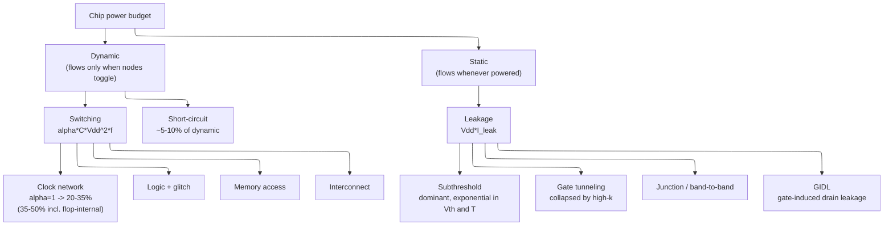
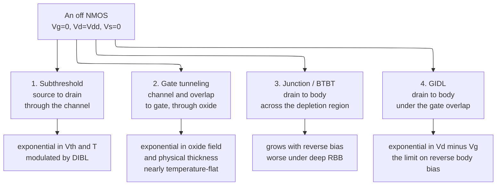
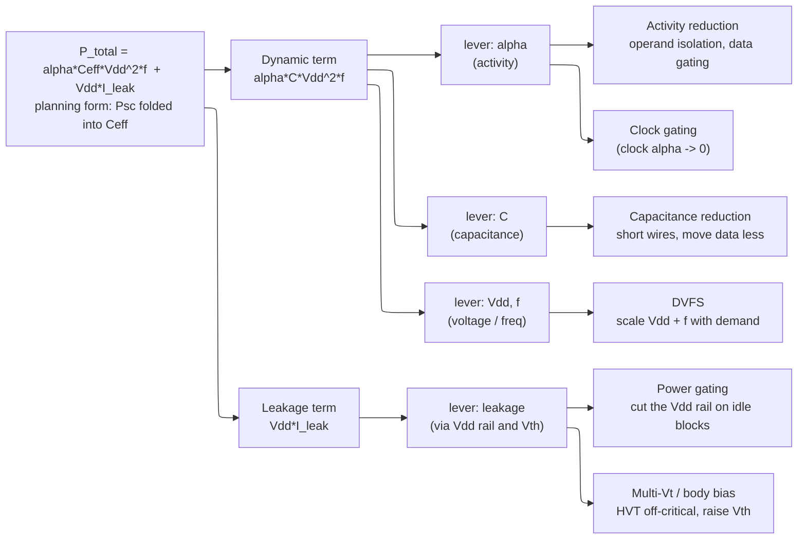

# Power Fundamentals — Where a Chip's Power Goes, and the Levers That Move It

> **Prerequisites:** [CMOS_Fundamentals](../00_Fundamentals/01_CMOS_Fundamentals.md) — this page *assumes* its §4 (the transistor-level derivation of the three powers and the energy–delay knee), §1.3 (subthreshold conduction and the 60 mV/dec wall), §13 (the leakage family), and §4.5 (Dennard). We take those results as given and reason one level up, at the chip/budget scale.
> **Hands off to:** [Block Activity and Power](02_Block_Activity_and_Power.md) (per-block/per-mode modeling), [Low-Power Architecture](03_Low_Power_Architecture_and_Domain_Partitioning.md) (partitioning power, voltage, clock, and reset domains), [Power Reduction Techniques](04_Power_Reduction_Techniques.md) (the mechanisms that spend these levers), [UPF/CPF Power Intent](05_UPF_and_CPF_Power_Intent.md) (encoding the architecture), [Power Analysis and Signoff](06_Power_Analysis_and_Signoff.md) (measuring it), [Power Gating, Retention and Wake Sequencing](07_Power_Gating_Retention_and_Wake_Sequencing.md) (the circuit that cuts the leakage term of §4), [Runtime Power Management and AVFS](08_Runtime_Power_Management_and_Adaptive_Voltage_Frequency.md) (the controller that walks the V/f curve of §3 at run time).

---

## 0. Why this page exists

A modern chip is not compute-limited or area-limited — it is **power-limited, from three directions at once**: you can only pull so many watts off a die (thermal), push so much current through the package and grid (delivery), and draw so much energy from a battery or a datacenter budget (energy). Every one of those is a hard ceiling, and every architectural decision — a wider core, a bigger cache, a higher clock, a second thread — is really a decision about how to *spend a fixed power/energy budget*. That is what "the power wall" means as an engineering statement: since roughly 2005, power, not transistors, has been the scarce resource.

The transistor-level questions — *why* switching a node costs $\tfrac12 CV^2$, *why* the switch leaks — are answered in [CMOS_Fundamentals §4](../00_Fundamentals/01_CMOS_Fundamentals.md). This page starts where that ends and asks the **budget** questions a senior engineer actually has to answer:

- Where does the power physically go across a real chip's blocks, and why is the clock the first thing you attack (§2.2–§2.3)?
- What are the fundamental levers — $V_{DD}$, $f$, activity $\alpha$, capacitance $C$, $V_{th}$, and parallelism — and where is the *knee* on each (§3–§5)?
- Why does the energy–delay product have a minimum, and why does a phone optimize a *different* function of energy and delay than a server (§3.3)?
- Why does the same physics land a phone at 5 W of many slow cores and a server at 250 W of few fast ones, and why did both eventually go wide (§5)?

A warning about notation before we start. The symbol $\alpha$ is unfortunately standard for **two different things** in this field: the **activity factor** (§2.1) and the **velocity-saturation exponent** of the alpha-power delay model (§3.1). Both appear on this page because both appear in every paper and every tool manual. Activity is dimensionless and lies in $[0,1]$; the delay exponent is a fixed constant $\approx1.3$. Where confusion is possible the text names which one it means.

The organising idea is that all of power reduces to **one equation with a small number of knobs**, and every technique in the rest of the track is an attack on one term of it. Understand which term each knob moves, and the whole low-power flow becomes derivable rather than memorised.

---

## 1. Why power is the binding constraint: three ceilings

Power is not one limit but three, and they bind at different times and care about different metrics. Confusing them is the classic mistake — a design can be comfortably inside its battery budget yet trip its delivery ceiling on a single peak, or meet peak delivery yet cook itself in thermal steady state.

**Thermal — a power-*density* ceiling.** Heat must leave through a cooling solution whose capacity is fixed, so what binds is watts per unit area, not total watts. The ceilings are stark and set the whole product class:

| Cooling class | Power-density ceiling | Practical total | Product |
|---|---|---|---|
| Passive (no fan) | ~5 W/cm² | ~2–8 W | phone, wearable, IoT (internet-of-things) node |
| Forced air (laptop) | ~30 W/cm² | ~15–65 W | laptop, thin client |
| Forced air (desktop) | ~80 W/cm² | ~65–250 W | desktop, workstation |
| Liquid | ~200 W/cm² | ~300–700 W | server, HPC (high-performance computing), GPU |

The total-watts column is the **TDP (thermal design power)** — the sustained power the cooling solution is designed to remove, and therefore the number the whole power budget is written against. Cross a thermal ceiling and two things bite back exponentially: **leakage rises 2× per 10 °C** (§4.2), which is *positive feedback* — hotter → leakier → hotter, the **thermal-runaway** loop, quantified as a loop gain in §4.2 — and reliability wear-out (electromigration, hot-carrier injection, NBTI — negative-bias temperature instability) accelerates. This is why the thermal budget is enforced at the *hottest* junction corner, not the average.

**Delivery — a peak-current and $di/dt$ ceiling.** The power-delivery network (PDN) — board VRM (voltage-regulator module), package, on-die grid — has finite resistance and inductance, so a current surge droops the on-die voltage ($IR$ drop) and rings it ($L\,di/dt$). Two consequences: **peak power, not average, sizes the PDN and the decoupling**, and a voltage droop under a sudden all-cores-active event can violate timing unless the design either budgets guard-band voltage (which costs $V^2$ power everywhere, always) or throttles. Backside power delivery (Intel PowerVia, TSMC/Samsung at 2 nm — see [CMOS §8](../00_Fundamentals/01_CMOS_Fundamentals.md)) is fundamentally a delivery-ceiling fix: it cuts $IR$ drop ~30–50 % by moving the grid off the signal layers.

**Put one number on the delivery ceiling, because "watts" hides how brutal it is.** Power is delivered at the *core* voltage, and core voltages are now well under a volt, so the current is enormous:

$$
I_{avg}=\frac{P}{V_{DD}}=\frac{250\ \text{W}}{0.80\ \text{V}}=\mathbf{312\ A}
$$

Three consequences fall straight out of that one division. First, **bump and grid sizing**: a controlled-collapse-chip-connection (C4) bump is electromigration-limited to roughly 200–400 mA, so the core rail alone needs $312/0.25\approx\mathbf{1250}$ power bumps — which is why the bump map, not the signal count, often sets package pitch ([IC_Packaging](../07_Manufacturing_and_Bringup/02_IC_Packaging.md)). Second, **$IR$ budget**: holding droop to 5 % of 0.80 V = 40 mV across 312 A means the entire path from package to the farthest transistor must present under $40\,\text{mV}/312\,\text{A}=128\ \mu\Omega$, which is why power planning spends whole upper metal layers on a grid ([Floorplanning_and_Power_Planning](../05_Backend_Physical_Design/03_Floorplanning_and_Power_Planning.md)). Third, **$di/dt$**: releasing clock gates across all cores at once can slew a 100 A step in ~10 ns, i.e. $10^{10}$ A/s, and across just 10 pH of effective package-plus-grid loop inductance that is

$$
\Delta V = L\frac{di}{dt} = 10\ \text{pH}\times10^{10}\ \text{A/s} = \mathbf{100\ mV}
$$

— 12.5 % of the rail from inductance alone, before any resistive term. That droop is why sudden wake-ups are *rate-limited* rather than instantaneous. The impedance model that turns this into a target $Z(f)$ curve, the decoupling-capacitor sizing that flattens it, and the droop→delay sensitivity (a 50 mV droop from 0.9 V costs **≈5.8 %** delay by the same alpha-power model this page uses in §3.1) belong to [Power_Analysis_and_Signoff](06_Power_Analysis_and_Signoff.md); the staged wake-up that keeps $di/dt$ inside the envelope belongs to [Power_Gating_and_Wake_Sequencing](07_Power_Gating_Retention_and_Wake_Sequencing.md).

**Energy — a battery / TCO (total cost of ownership) ceiling.** For anything mobile the currency is **energy per task** (joules to decode a frame, run an inference), because that sets battery life; for a datacenter it is energy per useful op, because that sets the electricity bill and the cooling opex that often exceeds it. Crucially, energy is the *time-integral* of power, so it is moved by different knobs than instantaneous power — a slower, lower-voltage design can burn *more* time but *less* energy (§3).

These three ceilings are why the metrics below are not interchangeable; each serves a different ceiling, and a power spec must state which:

| Metric | Serves which ceiling | Set by |
|---|---|---|
| Average power | thermal steady-state, battery | workload-averaged $\alpha C V^2 f$ + leakage |
| Peak power / $di/dt$ | delivery, IR-drop integrity | worst-case simultaneous activity |
| Power density (W/mm²) | hotspot, thermal runaway | local activity × local $C$, floorplan |
| Energy per op (pJ/op) | battery life, datacenter TCO | $\alpha C V^2$ **per useful result** |
| Leakage / standby power | always-on domains, sleep battery | $V_{DD} I_{leak}$ at temperature |

---

## 2. Where the power goes: three currents, and the block budget

### 2.1 The taxonomy, from what draws current and when

A powered chip draws current in exactly three ways, and the clean way to derive the taxonomy is to ask **when** each flows:

- **Dynamic (switching) current** flows *only when a node toggles*, to charge or discharge its capacitance. It is the current that pays for computation, and it is zero for a node that never switches. Aggregated over a clock this is $\alpha C V_{DD}^2 f$.
- **Short-circuit current** flows *only during an input edge*, in the brief instant both the pull-up and pull-down networks conduct and momentarily short $V_{DD}$ to ground. It rides on switching activity but is a small tax on it.
- **Leakage (static) current** flows *whenever the block is powered, switching or not*, because a real transistor never fully turns off ([CMOS §1.3](../00_Fundamentals/01_CMOS_Fundamentals.md)). It is the current of an idle chip.

That "when" axis *is* the taxonomy, and it gives the master equation this whole track builds on — stated here as the budget-level starting point; its per-transition $\tfrac12 CV^2$ origin is derived at the transistor level in [CMOS §4.2–4.3](../00_Fundamentals/01_CMOS_Fundamentals.md):

$$
P_{total}=\underbrace{\alpha\,C\,V_{DD}^2\,f}_{\text{switching}}\;+\;\underbrace{P_{sc}}_{\text{short-circuit}}\;+\;\underbrace{V_{DD}\,I_{leak}}_{\text{leakage}}
$$

where $\alpha$ = **activity factor**, $C$ = total switched capacitance (gate + wire + diffusion), $V_{DD}$ = supply, $f$ = clock frequency, $P_{sc}$ = short-circuit power (5–10 % of dynamic at library-legal slew, derived in §2.4, and exactly zero once $V_{DD}<2V_{th}$), $I_{leak}$ = total leakage current (subthreshold-dominant; the four mechanisms are built in §4.3).

**Define the activity factor once, and always name its population.** $\alpha$ is the **average number of power-consuming transitions per node per clock cycle** — that is, charge/discharge *cycles*, so a node that goes $0\!\to\!1\!\to\!0$ once per clock has $\alpha=1$ and costs $CV_{DD}^2$ per clock, not $\tfrac12CV_{DD}^2$. A quoted range is meaningless without the population it was measured over, and the three common populations differ by an order of magnitude:

| Population | Typical $\alpha$ | Why |
|---|---|---|
| Average net in **random control logic** | 0.05–0.15 | most nets are deep in decode/enable trees and rarely flip |
| **Datapath nets under uncorrelated data** | 0.15–0.35 | low-order bits of an adder or multiplier approach a coin flip per cycle |
| A **clock** net | 1.0 | one full charge/discharge every cycle, by construction |

Quoting "$\alpha\approx0.2$" without saying *which* population is the single most common way a power estimate goes wrong by 2× before any tool has run. How these are actually measured — vectored simulation, vectorless propagation, and the toggle-count formats behind them — is [Block_Activity_and_Power](02_Block_Activity_and_Power.md)'s subject.


```mermaid
%%{init: {"flowchart": {"defaultRenderer": "elk", "nodeSpacing": 55, "rankSpacing": 55, "htmlLabels": false}}}%%
flowchart TD
    P["Chip power budget"] --> DYN["Dynamic<br/>(flows only when nodes toggle)"]
    P --> STAT["Static<br/>(flows whenever powered)"]
    DYN --> SW["Switching<br/>alpha*C*Vdd^2*f"]
    DYN --> SC["Short-circuit<br/>~5-10% of dynamic"]
    STAT --> LEAK["Leakage<br/>Vdd*I_leak"]
    SW --> CLK["Clock network<br/>alpha=1  ->  20-35%<br/>(35-50% incl. flop-internal)"]
    SW --> LOGIC["Logic + glitch"]
    SW --> MEM["Memory access"]
    SW --> WIRE["Interconnect"]
    LEAK --> SUB["Subthreshold<br/>dominant, exponential in Vth and T"]
    LEAK --> GATE["Gate tunneling<br/>collapsed by high-k"]
    LEAK --> BTBT["Junction / band-to-band"]
    LEAK --> GIDL["GIDL<br/>gate-induced drain leakage"]
```

The figure's contract is the "when" axis: every arrow out of `P` is a *time* distinction, not a physical one. Trace one node through it — a flip-flop's Q output in an idle block. Its switching term is zero (it does not toggle), its short-circuit term is zero (there is no input edge to create an overlap window), and its leakage term is unchanged from the busy case, because leakage does not know whether the block is working. That trace is the whole reason clock gating and power gating are *different techniques with different payoffs*: clock gating removes the two left branches and nothing else. The trade-off the figure hides is that the four leakage children have completely different bias and temperature dependences, so "reduce leakage" is not one action — §4.3 separates them.

The single most useful rearrangement is **energy per operation**, because it is what the battery and the datacenter actually pay:

$$
E_{op}=\frac{P_{dyn}}{f}=\alpha\,C\,V_{DD}^2
$$

Read it and stop: **energy per op depends on voltage and capacitance, not on frequency.** Running slower does not save energy per op — only lowering $V_{DD}$, $C$, or wasted activity $\alpha$ does. That one fact is the seed of every trade-off on this page (§3–§5).

### 2.2 The dynamic budget across blocks

The abstract $\alpha C V_{DD}^2 f$ hides a very uneven distribution across a chip, and knowing the distribution is what tells you *where to spend engineering effort*. Two structural facts dominate.

**The clock is the single largest dynamic consumer — because its activity factor is pinned at $\alpha=1$.** Two figures circulate and they measure different things: the **clock network itself** (buffers, clock wire, and the flop clock-pin capacitance it drives) is **20–35 %** of block dynamic power, while **clock-related power** — that network *plus* the internal clock inverters inside every flip-flop — is **35–50 %**. Quote whichever you mean; most disagreements about "how big is the clock" are this distinction going unstated ([Clock Tree Synthesis §11](../05_Backend_Physical_Design/05_Clock_Tree_Synthesis.md)). Every other node toggles a fraction of cycles; the clock toggles *every* cycle, by definition, and it fans out to every flip-flop in the design through a heavily buffered, high-capacitance H-tree. Nothing else in the chip has both maximal activity and maximal fan-out. This is precisely why **clock gating is the first and highest-leverage dynamic technique** (§6): it drives the clock's local $\alpha$ to zero wherever a block is idle, attacking the biggest term directly.

**Everything else is set by real activity, and some of that activity is waste.** Random control logic runs at $\alpha\approx0.05$–0.15 and datapath nets at 0.15–0.35, but a chunk of that switching is **glitch power** — spurious transitions when unbalanced path delays make a node toggle several times before settling. Stated consistently as a **fraction of total dynamic power**, glitch is **20–40 % in unoptimized arithmetic/datapath-heavy blocks** (ripple structures, unbalanced multiplier trees, where a single input change ripples through many different arrival times), **5–15 % in typical mixed control-plus-datapath logic**, and **under 10 % after path balancing and operand isolation**. Glitch is "activity you computed but did not want," and it is attacked by path balancing, retiming, and pipelining (the measurement and the optimization both live in [Block_Activity_and_Power](02_Block_Activity_and_Power.md)). Memory contributes **access energy** — charging long, high-capacitance bitlines and wordlines on every read/write, often the dominant per-op cost in SRAM (static random-access memory)-heavy or register-file-heavy blocks — plus a large *leakage* term from the array (§4). Interconnect is a growing share as wires stop scaling ([CMOS §8.4](../00_Fundamentals/01_CMOS_Fundamentals.md)): long buses and NoC (network-on-chip) links move real charge over real distance.

The energy-per-op spread across these is enormous and drives architecture directly: a 64-bit integer add is ~0.1–1 pJ, a floating-point FMA (fused multiply-add) a few pJ, an 8 KB SRAM read tens of pJ, and a **DRAM (dynamic random-access memory) access ~100× a compute op** (Horowitz's ISSCC-2014 framing). When a data movement costs 100× the arithmetic it feeds, the efficient architecture is the one that *moves data least* — which is the entire thesis behind register files, cache hierarchies, and the local-SRAM dataflow of accelerators ([NPU_Accelerators](../01_Architecture_and_PPA/03_NPU_Architecture/01_Compute_Dataflows/01_NPU_Accelerators.md)).

### 2.3 A clock-tree budget, computed rather than quoted

"The clock is 20–35 % of dynamic power" is repeated everywhere in this notebook and in the literature, and a percentage with no arithmetic behind it is a number you cannot defend in a review. So build one from capacitances. It takes four inputs and produces both canonical figures — and, more usefully, it shows *where they come from*.

**The block.** A mid-size control-plus-datapath block on a 7 nm-class process:

| Parameter | Value |
|---|---|
| Flip-flops $N_{FF}$ | 40,000 |
| Combinational cells | ~320,000 (8 per flop) |
| $V_{DD}$ | 0.75 V |
| $f$ | 1.5 GHz |
| Flop clock-pin capacitance $C_{ck/FF}$ | 0.8 fF |
| Flop *internal* clock capacitance (the two clock inverters and the latch pass gates they drive) | 1.6 fF |
| Clock buffers + clock wire | 48 pF total, of which ~20 pF sits **below** the gating points and ~28 pF in the always-on trunk **above** them |

Start with the conversion constant, because it makes every later line one multiplication. For a node that toggles once per cycle ($\alpha=1$),

$$
P = C\,V_{DD}^2\,f = C\times(0.75\ \text{V})^2\times1.5\times10^9\ \text{s}^{-1} = C\times8.44\times10^{8}
$$

so **1 pF of clock capacitance costs 0.844 mW** at this operating point. Now sum the clock capacitance:

$$
C_{pins}=40{,}000\times0.8\ \text{fF}=32\ \text{pF},\qquad C_{tree\ wire+buf}=48\ \text{pF},\qquad C_{FF\ internal}=40{,}000\times1.6\ \text{fF}=64\ \text{pF}
$$

**Ungated**, every one of those toggles every cycle:

- Clock tree proper (pins + buffers + wire) $=32+48=80$ pF → $80\times0.844=\mathbf{67.5\ mW}$
- Flop-internal clock $=64$ pF → $\mathbf{54.0\ mW}$
- Clock-related total $=144$ pF → $\mathbf{121.5\ mW}$

Against that, the data side. Take 320,000 combinational nets at an average 1.4 fF each (input pins plus a short local wire) $=448$ pF raw, switching at $\alpha=0.09$ → 40.3 pF effective → 34.0 mW. Add the 40,000 flop Q outputs, 1.5 fF each at $\alpha=0.08$ → 4.8 pF → 4.1 mW. Add 25 mW of SRAM access energy and 10 mW of block-level interconnect. Data-side total: **73 mW**.

$$
\text{ungated dynamic}=121.5+73=194.5\ \text{mW}\quad\Longrightarrow\quad \text{clock-related}=\frac{121.5}{194.5}=\mathbf{62\ \%}
$$

**That 62 % is the number that explains why clock gating is not optional.** It is also *not* the number the canon quotes, and the difference is the entire point: the published 20–35 % / 35–50 % figures are measured on designs that are *already* clock-gated.

**Now gate it.** Suppose the block's flops are enabled on 30 % of cycles on average (a realistic figure for a pipeline with stall logic and mode-dependent datapaths). The trunk above the gating points still toggles every cycle; everything below stops when its enable is low:

- Always-on trunk: 28 pF → 23.6 mW
- Gated leaf tree + pins: $(32+20)\times0.30=15.6$ pF → 13.2 mW
- Gated flop-internal: $64\times0.30=19.2$ pF → 16.2 mW

$$
P_{tree}=23.6+13.2=\mathbf{36.8\ mW},\qquad P_{clock\text{-}related}=36.8+16.2=\mathbf{53.0\ mW}
$$

$$
\text{gated dynamic}=53.0+73=126\ \text{mW}\ \Longrightarrow\ \frac{P_{tree}}{P_{dyn}}=\frac{36.8}{126}=\mathbf{29\ \%},\qquad \frac{P_{clock\text{-}related}}{P_{dyn}}=\frac{53.0}{126}=\mathbf{42\ \%}
$$

Both canonical figures fall out, in band, from four capacitances and an enable rate: **29 % for the tree proper, 42 % including the flop-internal clock**. Three further readings are worth extracting:

1. **Clock gating saved $194.5-126=68.5$ mW, 35 % of the block's dynamic power**, for the cost of ~1,250 integrated clock-gating cells. No other single technique on this page moves that much for that little.
2. **The always-on trunk (23.6 mW) is now 64 % of the remaining tree power.** Leaf-level gating cannot touch it, which is exactly why coarse-grained clock-domain shutdown and full power gating exist above it ([Power_Reduction_Techniques](04_Power_Reduction_Techniques.md), [Power_Gating_and_Wake_Sequencing](07_Power_Gating_Retention_and_Wake_Sequencing.md)).
3. **The flop-internal clock is 31 % of clock-related power and is invisible in a clock-tree report**, because it lives inside the cell model. That is the whole reason the canon insists on two figures with the denominator named.

The gate itself must be glitch-free, and that requirement is cycle-accurate, so it is worth seeing on a waveform:

```wavedrom
{ "signal": [
  { "name": "clk",        "wave": "p........" },
  { "name": "enable",     "wave": "0.1..0...", "node": "..a..b..." },
  { "name": "en_latched", "wave": "0..1..0..", "node": "...c..d.." },
  { "name": "gclk",       "wave": "0..p..0.." },
  { "name": "FF clk pin", "wave": "0..p..0.." }
 ],
 "edge": ["a~>c enable sampled on the low phase", "b~>d released on the low phase"],
 "head": {"text": "integrated clock gating: the enable is latched transparent-low, so gclk never chops a pulse"}
}
```

The contract of the waveform is that `gclk` contains only *whole* clock pulses. Trace the hazard it prevents: if `enable` were ANDed with `clk` directly and rose mid-high-phase, `gclk` would emit a runt pulse — a clock edge too narrow to meet the flop's minimum pulse width, which either fails to capture or captures metastably. Latching the enable on the **low phase** means it can only change while `clk` is low, so every `gclk` pulse is full width. The cost is the latch: an integrated clock-gating cell (ICG) is a transparent-low latch of ~8–12 transistors plus an AND plus a scan/test override, roughly **16–24 transistors, about 1–1.5× the area of a D flip-flop** — not a trivial cell, which is why gating granularity is an engineering choice (worked in Problem 2). The technique itself, its RTL inference rules, and its test implications belong to [Power_Reduction_Techniques](04_Power_Reduction_Techniques.md).

### 2.4 Short-circuit power, derived — and why `max_transition` exists

The middle term of the master equation is usually dismissed in one parenthetical ("5–10 % of dynamic, ignore it"), which is unsatisfying for two reasons: the reader has no way to check the 5–10 %, and the term is the physical reason a synthesis constraint they *will* meet exists. So derive it.

```tikz
\usepackage{circuitikz}
\begin{document}
\begin{circuitikz}[american,thick,scale=0.95,transform shape]
  \draw (0,3.0) node[vcc]{$V_{DD}$}
        (0,2.4) node[pmos,anchor=S](P){}
        (P.S) -- (0,3.0)
        (P.D) -- (0,1.5) coordinate(Y)
        (0,0.6) node[nmos,anchor=S,yscale=-1](N){}
        (N.D) -- (Y)
        (N.S) -- (0,0) node[ground]{};
  \draw (P.G) -- (-1.2,2.4)
        (N.G) -- (-1.2,0.6)
        (-1.2,0.6) -- (-1.2,2.4)
        (-1.2,1.5) -- (-2.3,1.5) node[left,align=right]{$V_{in}$\\ramp of\\length $\tau$};
  \draw (Y) -- (1.1,1.5) node[right]{$V_{out}$};
  \draw[red,very thick,->] (0,2.95) -- (0,2.45);
  \draw[red,very thick,->] (0,0.55) -- (0,0.05);
  \node[right,red] at (0.12,2.75) {$I_{sc}$};
  \node[right,red] at (0.12,0.28) {$I_{sc}$};
  \node[right,align=left] at (0.7,2.4) {conducts while\\$V_{in}<V_{DD}-|V_{thp}|$};
  \node[right,align=left] at (0.7,0.6) {conducts while\\$V_{in}>V_{thn}$};
\end{circuitikz}
\end{document}
```

The figure's contract: during a *finite* input ramp there is a window in which **both** the pull-up and the pull-down satisfy their conduction conditions, and a current flows from $V_{DD}$ to ground that never reaches the load. Trace an input rising from 0 to $V_{DD}=0.75$ V with $V_{thn}=|V_{thp}|=0.25$ V. Below 0.25 V only the PMOS conducts; above 0.50 V only the NMOS conducts; between them — a window $V_{DD}-2V_{th}=0.25$ V wide, i.e. one third of the ramp — both are on. That window is the whole phenomenon, and the figure already tells you the trade-off: the window's *width in volts* is fixed by the thresholds, but the *time* spent in it is set by how fast the input moves.

**The derivation (Veendrick, 1984).** Take a symmetric inverter ($\beta_n=\beta_p\equiv\beta$, $V_{thn}=|V_{thp}|\equiv V_{th}$) with an input ramp $V_{in}(t)=(V_{DD}/\tau)\,t$ and — the worst case — no load, so the output snaps and the conducting device stays in saturation with $I=\tfrac{\beta}{2}(V_{in}-V_{th})^2$. For the first half of the window the NMOS is the current-limiting device. Change the integration variable with $dt=(\tau/V_{DD})\,dV$:

$$
Q_{half}=\int I\,dt=\frac{\beta}{2}\cdot\frac{\tau}{V_{DD}}\int_{V_{th}}^{V_{DD}/2}(V-V_{th})^2\,dV
=\frac{\beta\tau}{6V_{DD}}\left(\frac{V_{DD}-2V_{th}}{2}\right)^{3}
=\frac{\beta\,\tau\,(V_{DD}-2V_{th})^3}{48\,V_{DD}}
$$

The second half is the mirror image with the PMOS limiting, so double it; multiply by $V_{DD}$ for energy; and note a full clock cycle contains **two** input transitions (rise and fall):

$$
E_{sc}^{cycle}=2\times V_{DD}\times 2Q_{half}=\frac{\beta\,\tau}{12}(V_{DD}-2V_{th})^3
\qquad\Longrightarrow\qquad
\boxed{\;P_{sc}=\frac{\beta}{12}\,(V_{DD}-2V_{th})^{3}\,\frac{\tau}{T}\;}
$$

with $T=1/f$ the clock period and $\beta=\mu C_{ox}(W/L)$ the transistor gain factor. Three properties of that expression carry all the engineering.

**Property 1 — it vanishes identically once $V_{DD}<2V_{th}$.** This is not the cubic term becoming small; it is the conduction window ceasing to *exist*. The NMOS needs $V_{in}>V_{th}$ to conduct and the PMOS needs $V_{in}<V_{DD}-V_{th}$; if $V_{DD}-V_{th}<V_{th}$ there is no input voltage satisfying both, so at no instant of any ramp, of any slope, do both devices conduct. The formula's cube would go negative, which is the algebra's way of saying "clamp to zero." Consequence: at the near-threshold operating points of §3.2 — 0.40–0.50 V against a 0.25–0.30 V threshold — **the short-circuit term of the master equation is exactly zero**, and near-threshold analyses that drop it are not approximating, they are correct.

**Property 2 — it is linear in slew and independent of frequency (as a fraction).** Divide by the same cell's switching power $P_{sw}=C_LV_{DD}^2f$:

$$
\frac{P_{sc}}{P_{sw}}=\frac{\beta\,(V_{DD}-2V_{th})^3\,\tau}{12\,C_L\,V_{DD}^2}
$$

Both terms carry one factor of $f$, so **the ratio depends on input slew and load, not on clock speed**. Slowing the clock does not improve the short-circuit fraction; sharpening the edge does.

**Property 3 — heavier load *reduces* the fraction.** $C_L$ is in the denominator: a big load holds the output near its old rail during the input ramp, so the "off-going" device stays in a low-current region. The classic design rule follows — **keep the input transition time no slower than the output transition time**, and $P_{sc}$ stays in the few-percent range.

**Work a number.** A 7 nm-class X1 inverter: $V_{DD}=0.75$ V, $V_{th}=0.25$ V, $C_L=1.5$ fF, $f=1.5$ GHz ($T=667$ ps). Get $\beta$ from the cell's saturation drive current, $I_{on}=\tfrac{\beta}{2}(V_{DD}-V_{th})^2$; with $I_{on}=80\ \mu$A,

$$
\beta=\frac{2I_{on}}{(V_{DD}-V_{th})^2}=\frac{2\times80\ \mu\text{A}}{(0.50\ \text{V})^2}=0.64\ \text{mA/V}^2
$$

With a well-constrained $\tau=20$ ps:

$$
P_{sc}=\frac{0.64\times10^{-3}}{12}\times(0.25)^3\times\frac{20\ \text{ps}}{667\ \text{ps}}
=5.33\times10^{-5}\times1.5625\times10^{-2}\times0.030=\mathbf{25\ nW}
$$

against $P_{sw}=C_LV_{DD}^2f=1.5\ \text{fF}\times0.5625\times1.5\ \text{GHz}=1{,}266$ nW — a ratio of **2.0 %**. Sweep the slew and the design rule appears:

| Input slew $\tau$ | $P_{sc}$ | $P_{sc}/P_{sw}$ |
|---|---|---|
| 10 ps | 13 nW | 1.0 % |
| 20 ps (well constrained) | 25 nW | 2.0 % |
| 40 ps | 50 nW | 4.0 % |
| 80 ps (near a typical limit) | 100 nW | 7.9 % |
| 160 ps | 200 nW | 15.8 % |
| 320 ps (violating) | 400 nW | 31.6 % |

**This table is why `set_max_transition` exists.** A synthesis and signoff constraint that caps every net's slew ([Constraints_SDC](../04_Synthesis/02_Constraints_SDC.md)) is usually explained by *delay* accuracy — a cell characterized over a slew range gives nonsense outside it ([Standard_Cell_Libraries](../04_Synthesis/03_Standard_Cell_Libraries_and_Characterization.md)) — and by noise immunity. The power argument is independent and equally hard: **the short-circuit fraction is proportional to slew, so a design that meets a 80 ps `max_transition` keeps $P_{sc}$ near 8 %, and a design with a long tail of 300 ps nets is burning ~30 % of those cells' switching power on current that never charges anything.** The canonical "5–10 % of dynamic" is not a law of nature; it is a statement about a design that met its transition constraint.

Two practical footnotes. First, planning models often **fold $P_{sc}$ into an effective capacitance**, $C_{eff}=C_L(1+k)$ with $k\approx0.05$–0.10, so a two-term equation can be used in spreadsheets; that is legitimate as long as it is stated, because it hides the slew dependence just derived. Second, the derivation assumed no load, which is why it is a worst case; characterized `.lib` internal-power tables capture the loaded reality per cell per slew, and that is what a real power tool integrates ([Power_Analysis_and_Signoff](06_Power_Analysis_and_Signoff.md)).

### 2.5 The dynamic ↔ leakage crossover

Dynamic and leakage are spent on completely different axes — dynamic is proportional to *activity*, leakage is proportional to *area × time × temperature* — so their *ratio* shifts with node, temperature, and workload, and where it crosses is a budgeting decision, not a physics constant.

**Across nodes, leakage grew from a rounding error to a co-equal term.** As $V_{th}$ stopped scaling to keep leakage bounded (the 60 mV/dec wall, [CMOS §1.3](../00_Fundamentals/01_CMOS_Fundamentals.md)), each generation's transistors leaked more relative to their dynamic draw, FinFET clawed some back, but transistor *count* kept climbing:

| Component | ~65 nm | ~7 nm FinFET | Trend |
|---|---|---|---|
| Switching | 60–70 % | 40–50 % | shrinking fraction |
| Short-circuit | 5–10 % | 5–10 % | roughly stable |
| Leakage | 20–30 % | 40–50 % | rose until FinFET, then flat-high |

**Across temperature, the crossover moves within a single chip.** Dynamic power is nearly temperature-flat; leakage **doubles every 10 °C** (derived, not asserted, in §4.2). So a block that is 70 % dynamic at 25 °C can be leakage-dominated at 105 °C: that 80 °C span is 8 doublings by the rule of thumb (~250×), or ~190× by the more careful calculation of §4.2, which accounts for the doubling constant widening as the die heats. Either figure swamps a 70 % dynamic share completely, which is why leakage signoff runs at the *hot* corner and why the thermal-runaway loop of §1 exists at all.

**Across activity, the crossover defines when to power-gate.** As a block idles, its dynamic term falls toward zero while leakage holds constant, so **standby power is pure leakage** and standby battery life is set entirely by it. Below some activity threshold a block leaks more than it computes, and the correct response is not to gate its clock (which leaves leakage untouched) but to **cut its rail entirely** — power gating (§6). The whole reason there are two different "off" techniques is that they attack the two different currents.

---

## 3. The voltage lever: why $V_{DD}$ is the master knob, and DVFS is ~cubic

### 3.1 One knob moves two terms — and their product is a cube

$V_{DD}$ is the strongest lever in low-power design because it appears in the dynamic term *squared* while every other knob is linear. But its true power comes from a second effect: lowering $V_{DD}$ also **lowers the maximum frequency the logic can run at**, so on a real chip voltage and frequency are not independent — they move together along the **DVFS (dynamic voltage and frequency scaling)** curve, and the two effects compound.

Take the two results from [CMOS §4](../00_Fundamentals/01_CMOS_Fundamentals.md) as given. Energy per op and max frequency:

$$
E_{op}\propto C\,V_{DD}^2, \qquad f_{max}\propto\frac{1}{t_p}\propto\frac{(V_{DD}-V_{th})^{\alpha}}{V_{DD}}
$$

where $t_p\propto C V_{DD}/(V_{DD}-V_{th})^{\alpha}$ is the gate delay, $\alpha\approx1.3$ is the velocity-saturation exponent ([CMOS §4.1](../00_Fundamentals/01_CMOS_Fundamentals.md)), and **overdrive** $V_{DD}-V_{th}$ is what actually buys speed. Because a DVFS operating point runs at $f\approx f_{max}(V_{DD})$, substitute:

$$
P_{dyn}=\alpha\,C\,V_{DD}^2\,f \;\propto\; V_{DD}^2\cdot\frac{(V_{DD}-V_{th})^{\alpha}}{V_{DD}} \;=\; V_{DD}\,(V_{DD}-V_{th})^{\alpha}
$$

Over the *upper* part of the DVFS window — roughly 0.7 V to nominal on this device, the range in which production parts spend nearly all their time — the overdrive tracks the supply closely enough that $f\propto V_{DD}$ empirically, and the relation collapses to the rule every architect carries:

$$
\boxed{\,P_{dyn}\propto V_{DD}^2\,f \quad\text{with}\quad f\propto V_{DD}\ \Longrightarrow\ P\propto f^{3}\,}
$$

**Power runs as roughly the cube of frequency across the useful DVFS range.** This is the quantitative heart of the "chase the last 10 % of clock and pay disproportionately" behaviour: the top of the V/f curve is where you are pushing $V_{DD}$ hard just to hold frequency, so a 10 % clock bump can cost ~33 % power. It runs both ways — **halving frequency-and-voltage cuts power ~8× while only doubling runtime, a net ~4× energy win** — which is exactly why DVFS throttles down aggressively under a thermal or battery cap. The word "roughly" is load-bearing, and the table below says exactly how rough. The hard floor on $V_{DD}$ is not power but **noise-margin and regeneration collapse** at ~0.3–0.5 V ([CMOS §3.2](../00_Fundamentals/01_CMOS_Fundamentals.md)) and SRAM read-margin failure ([CMOS §12.4](../00_Fundamentals/01_CMOS_Fundamentals.md)).

**Put real numbers in it.** Take a modern node ($V_{th}\approx0.3$ V, velocity-saturation exponent $\alpha\approx1.3$) and drop $V_{DD}$ from 1.0 V to 0.8 V — a 20 % voltage trim. The delay model says how much clock you keep:

- $f_{max}\propto(V_{DD}-V_{th})^{1.3}/V_{DD}$: the overdrive falls $0.7\to0.5$, so $f$ drops to only **0.81×** — almost exactly the voltage ratio, which is *why* $f\propto V_{DD}$ holds empirically over this window.
- $P_{dyn}=V_{DD}^2\,f$: $0.80^2\times0.81\approx$ **0.52×**.

A 20 % voltage cut **halves the power** for only ~20 % less clock — and the bare cube $0.8^3=0.51$ lands in the same place. Sweep the whole range, and print the error the cube law is making at each point:

```python
Vth, a = 0.3, 1.3                       # threshold, velocity-saturation exponent
fmax = lambda V: (V - Vth)**a / V       # alpha-power delay model: f_max(Vdd)
P    = lambda V: V**2 * fmax(V)         # P ~ Vdd^2 * f, evaluated at f = fmax
f0, P0 = fmax(1.0), P(1.0)
for V in (1.0, 0.9, 0.8, 0.7, 0.6, 0.5):
    p, c = P(V)/P0, V**3
    print(f"V={V:.1f}  f/f0={fmax(V)/f0:.3f}  P/P0={p:.3f}  V^3={c:.3f}"
          f"  cube error={100*(c-p)/p:+.1f}%")
# V=1.0  f/f0=1.000  P/P0=1.000  V^3=1.000  cube error= +0.0%
# V=0.9  f/f0=0.909  P/P0=0.737  V^3=0.729  cube error= -1.0%
# V=0.8  f/f0=0.807  P/P0=0.517  V^3=0.512  cube error= -0.9%
# V=0.7  f/f0=0.690  P/P0=0.338  V^3=0.343  cube error= +1.4%
# V=0.6  f/f0=0.554  P/P0=0.199  V^3=0.216  cube error= +8.3%
# V=0.5  f/f0=0.392  P/P0=0.098  V^3=0.125  cube error=+27.4%
```

**Read the last column, not the first two.** The cube law is a *local* approximation, and the table says where it is safe: within ~2 % from 1.0 V down to 0.7 V (it is exact, referenced to 1.0 V, at $V_{DD}\approx0.75$ V), then **~8 % off at 0.6 V and 27 % off at 0.5 V**. Below about 0.6 V the cube law is no longer a usable model — it *overstates the power* a low-voltage operating point actually draws, so a governor that budgets by $V^3$ leaves real headroom on the table, and an architect who compares near-threshold designs with it gets the wrong ranking.

**Why it breaks, in the page's own terms.** Everything is in the $f_{max}$ column. Take logarithms of $P\propto V_{DD}(V_{DD}-V_{th})^{\alpha}$ and differentiate:

$$
\frac{d\ln P}{d\ln V_{DD}}=1+\frac{\alpha\,V_{DD}}{V_{DD}-V_{th}}
$$

This is the *local* exponent — the true power of $V_{DD}$ the design is obeying right now. With $\alpha=1.3,\ V_{th}=0.3$ V:

| $V_{DD}$ | local exponent | reading |
|---|---|---|
| 1.00 V | 2.86 | slightly *sub*-cubic — power falls a little slower than $V^3$ |
| 0.86 V | 3.00 | the one voltage where the cube law is locally exact |
| 0.70 V | 3.28 | drifting super-cubic |
| 0.60 V | 3.60 | the 8 % error |
| 0.50 V | 4.25 | closer to a *fourth* power than a cube |

The mechanism is the one this page already established: speed is bought with **overdrive** $V_{DD}-V_{th}$, not with $V_{DD}$. Near nominal, a 10 % cut in $V_{DD}$ is roughly a 10 % cut in overdrive, so $f\propto V_{DD}$ and $P=V^2f\propto V^3$. As $V_{DD}$ approaches $V_{th}$ the same 10 % cut in $V_{DD}$ is a much larger *fractional* cut in overdrive — at 0.5 V, removing 50 mV removes 25 % of the 0.2 V of overdrive — so **frequency falls faster than voltage**, and $P=V_{DD}^2f$ therefore falls faster than $V_{DD}^3$. The error is one-signed and grows monotonically as you approach threshold.

Two consequences worth carrying forward. First, the low end of the curve is *better* than the cube suggests, which is a point in favor of near-threshold operation (§3.2) — but it must be computed, not assumed. Second, the voltage at which the cube law is locally exact, 0.86 V here, is not a coincidence: it is precisely the voltage that minimizes $ED^2$ (§3.3), because "$P\propto V^3$" and "$f\propto V$" and "$ED^2$ stationary" are the same statement written three ways.

### 3.2 Energy per op and the minimum-energy point

If energy per op is $\propto V_{DD}^2$, why not scale $V_{DD}$ to the floor for every workload? Because leakage sets a lower bound. Total energy per op has two parts, and lowering voltage moves them in *opposite* directions:

$$
E_{op}=\underbrace{\alpha C V_{DD}^2}_{\text{dynamic}\,\downarrow}\;+\;\underbrace{V_{DD}\,I_{leak}\cdot t_{op}}_{\text{leakage}\,\uparrow},\qquad t_{op}\propto\frac{V_{DD}}{(V_{DD}-V_{th})^{\alpha}}
$$

As $V_{DD}$ drops the dynamic part falls quadratically, but the clock slows, so each op *takes longer* and the block **leaks for more time per op** — the leakage-energy term rises. Their sum has a genuine minimum, the **minimum-energy point (MEP)**, derived at the transistor level in [CMOS §4.4](../00_Fundamentals/01_CMOS_Fundamentals.md) and sitting near threshold, typically **~0.3–0.4 V**.

**See the valley.** Normalise the dynamic weight to 1, give leakage a small coefficient, and treat $I_{leak}$ as roughly flat in $V_{DD}$, so the leakage-energy term collapses to $E_{leak}\propto V_{DD}^2/(V_{DD}-V_{th})^{1.3}$. Tabulating both terms as $V_{DD}$ falls (arbitrary units — the *shape* is the point, $V_{th}=0.3$ V):

| $V_{DD}$ | $E_{dyn}\propto V_{DD}^2$ | $E_{leak}$ (↑ as $V_{DD}\!\downarrow$) | $E_{total}$ | $E_{total}$ vs 0.80 V | $f$ vs 0.80 V |
|---|---|---|---|---|---|
| 1.20 (a 65 nm-era nominal) | 1.44 | 0.05 | 1.49 | 2.16× worse | 1.43× |
| 1.10 | 1.21 | 0.05 | 1.26 | 1.83× worse | 1.34× |
| 0.80 (a modern nominal) | 0.64 | 0.05 | 0.69 | 1.00× | 1.00× |
| 0.60 | 0.36 | 0.06 | 0.42 | 1.64× better | 0.686× |
| 0.50 | 0.25 | 0.06 | 0.31 | 2.23× better | 0.486× |
| **0.40 (MEP)** | 0.16 | 0.10 | **0.26** | **2.64× better** | **0.247×** |
| 0.35 | 0.12 | 0.19 | 0.31 | 2.20× better | 0.115× |

Coming down from nominal, dropping $V_{DD}$ collapses the dynamic term far faster than leakage grows, so total energy *falls*. Push *below* the MEP and each op takes so long (the delay's $(V_{DD}-V_{th})^{1.3}$ denominator collapsing toward zero) that accumulated leakage energy overtakes the still-shrinking dynamic term, and $E_{total}$ climbs *back up* (0.26 → 0.31 from 0.40 to 0.35 V) while the clock falls by a further 53 %. That U-shaped floor is the MEP: you scale voltage down *to* it, not past it.

**State the baseline or the number is meaningless.** The literature's headline for near-threshold operation is "5–10× better energy per op," and this table's own answer is 2.64×. Both are right; they are measured against different nominal voltages, and the ratio is roughly quadratic in that choice:

- **Against a 0.80 V modern nominal: 2.6×.** This is the number that matters for a chip whose high-performance mode already runs at 0.75–0.85 V — most current mobile and embedded silicon. It is the number this page's table computes.
- **Against a 1.1–1.2 V nominal: 4.8–5.7×.** This is the low end of the classic band and corresponds to a 65–90 nm-era supply.
- **Against a ~1.6 V nominal: 10.0×.** This is the top of the classic band and is a 180 nm-era supply — which is exactly the era in which the near-threshold measurements that produced the folklore were taken.

So the "5–10×" figure is not wrong, it is *dated*: the reason near-threshold operation looks less spectacular today is that nominal $V_{DD}$ already fell most of the way toward threshold, and the design took that win once already. Whenever a paper or a datasheet quotes an energy-efficiency multiple, the first question is always *"against what supply?"*

**And be equally precise about the speed you give up.** Near-threshold computing runs at $V_{DD}\approx0.4$–0.6 V, a few thermal voltages above $V_{th}$. The frequency cost is *not* uniform across that window — it is the same overdrive collapse that broke the cube law in §3.1, and the last column of the table above prices it against a 0.80 V reference:

- at 0.60 V: **0.69×** the clock — the "roughly two thirds" end of the window;
- at 0.50 V: **0.49×** — about half;
- at the 0.40 V MEP: **0.247×** — about **a quarter**, not "a third to a half."

Against a 1.1 V nominal the MEP is 0.185×, under a fifth. The rule to carry: **the deeper into near-threshold you go, the more the frequency loss accelerates relative to the energy win** — energy per op improves quadratically at best while frequency collapses super-linearly, which is precisely why the MEP is a *minimum* and not an asymptote.

This is the whole rationale for **near-threshold computing (NTC)**, and it is the right operating point wherever throughput-per-watt beats latency — wake-word engines, always-on sensor hubs, IoT nodes, and the efficiency cores of a big.LITTLE cluster. The frequency loss is real, which is why NTC is always paired with parallelism (§5.1): at the 0.40 V MEP you need $1/0.247\approx\mathbf{4}$ units running in parallel to match one 0.80 V unit's throughput, and those four units together deliver it at $0.26/0.69=0.38\times$ the energy per op — **a 2.6× power reduction at equal throughput, for 4× the area.** That single trade, area for energy, is the founding argument of §5.1, and it is why the MEP matters to architects and not only to circuit designers. The MEP is bounded below by the same margin and SRAM-collapse floors as §3.1, which is why nobody ships logic at 0.2 V.

### 3.3 EDP and $ED^2$: the metric that arbitrates when power cannot

§3.2 ended with a problem it did not solve. Energy per op is minimized at the MEP, ~0.40 V — and no server, no phone application processor, and no GPU runs there. If minimum energy were the goal, every chip would sit at threshold. Something else is being optimized, and naming it correctly is the difference between a defensible architectural decision and an argument.

**The failure of raw power as a metric.** Power alone ranks designs by *how little they do*. A block that is clock-gated off draws almost nothing and computes nothing; it wins on watts and loses on everything else. Energy per op is better — it normalizes out time — but it still ignores latency entirely, so it ranks a design that takes a week per op ahead of one that takes a microsecond, provided the joules are lower. Real products care about both, in a ratio that depends on the product.

**Define the family.** For a given operation let $E$ be the energy it costs and $D$ the time it takes. The metrics used in practice are the members of a one-parameter family:

$$
\text{minimize } E\,D^{\,k}\qquad k=0,1,2,\ldots
$$

- $k=0$: **energy per op**. Equivalent to maximizing performance-per-watt, since $E=P/f$ at one op per cycle. The phone's metric.
- $k=1$: the **EDP (energy–delay product)**, $E\cdot D=P/f^2$. Equivalent to maximizing $\text{perf}^2/\text{W}$. A balanced metric, common for mobile SoCs that still have latency-sensitive foreground work.
- $k=2$: **$ED^2$**, $E\cdot D^2=P/f^3$. Equivalent to maximizing $\text{perf}^3/\text{W}$. The datacenter/high-performance metric.

Each is just "$\text{perf}^{k+1}$ per watt," so $k$ is a plain statement of *how many times more you value speed than joules*.

**Why each has a different optimal voltage — and where.** Substitute the two results of §3.1, $E\propto V_{DD}^2$ and $D\propto V_{DD}/(V_{DD}-V_{th})^{\alpha}$:

$$
E\,D^{\,k}\;\propto\;\frac{V_{DD}^{\,2+k}}{(V_{DD}-V_{th})^{\alpha k}}
$$

Take logs and differentiate — the algebra is two lines and the result is a closed form:

$$
\frac{d}{d\ln V}\ln(ED^k)=(2+k)-\frac{\alpha k\,V_{DD}}{V_{DD}-V_{th}}=0
\qquad\Longrightarrow\qquad
\boxed{\;V^{*}_{k}=\frac{(2+k)\,V_{th}}{\,2+k-\alpha k\,}\;}
$$

With the track's constants $\alpha=1.3$ and $V_{th}=0.3$ V:

| Metric | $k$ | $V^{*}$ | Who optimizes it | What that voltage means |
|---|---|---|---|---|
| Energy per op | 0 | $\to V_{th}$ (0.40 V with leakage, §3.2) | wearable, sensor hub, wake-word engine | run at the MEP, recover throughput with width |
| EDP | 1 | **0.53 V** | mobile SoC (system-on-chip) efficiency cluster | near-threshold but not at the floor |
| $ED^2$ | 2 | **0.86 V** | server CPU, GPU, high-performance core | *this is why nominal supplies are ~0.75–0.9 V* |
| $ED^3$ | 3 | **1.36 V** | overclocked desktop, benchmark bin | speed at almost any energy cost |

The $k=0$ row is a consistency check on the whole model: with no leakage the energy-optimal voltage would be $V_{th}$ itself, and it is leakage energy — the term §3.2 added — that lifts the true optimum to a finite 0.40 V. And notice what the $ED^2$ row is telling you: **the industry's nominal supply voltages are not an accident of process technology; they sit approximately where $ED^2$ is minimized for a velocity-saturated device.** A formula with two constants in it predicts the number on the datasheet.

The formula also states its own limit. $V^*_k$ is finite only while $2+k>\alpha k$, i.e. $k<2/(\alpha-1)=6.7$ for $\alpha=1.3$. Beyond that the model says "more voltage is always better," which is the model failing: it contains no reliability, no thermal ceiling, and no oxide field limit. Those are §1's ceilings, and they are what actually stops the voltage climbing.

**Why $ED^2$ specifically is the design-comparison metric.** Because it is the metric DVFS *cannot game*. Along the DVFS curve $P\propto f^3$ (§3.1), so $ED^2=P/f^3$ is constant — moving the operating point up or down the same design's V/f curve does not change $ED^2$. Evaluate it and see how flat it is:

| $V_{DD}$ | 0.60 | 0.75 | 0.80 | 0.86 | 0.90 | 1.00 | 1.20 |
|---|---|---|---|---|---|---|---|
| $ED^2$ (normalized to its minimum) | 1.201 | 1.021 | 1.005 | **1.000** | 1.002 | 1.023 | 1.104 |

Over the entire 0.75–1.00 V range — a 33 % swing in supply and a 45 % swing in frequency — $ED^2$ moves by **2.4 %**. It is, to that accuracy, a property of the *design* and not of the operating point. That is exactly what you want from a metric used to compare two microarchitectures: it cannot be improved by turning a voltage knob, so an improvement in $ED^2$ is real work. (This invariance is exact in the long-channel limit $D\propto1/V$, which is Martin's original $Et^2$ argument; with $\alpha=1.3$ and finite $V_{th}$ it is approximate, and the table quantifies the approximation.) Energy alone has the opposite property — it is *maximally* sensitive to the voltage knob — which is why "we cut energy 30 %" is a meaningless claim unless the frequency is stated alongside it.

**The arbitration, worked.** Here is a decision a raw power number cannot make. A block must be implemented; the same function, three ways, all at 7 nm, all with an Amdahl serial fraction of 40 %:

- **S (serial/fast):** 1 unit at 0.90 V.
- **M (mid):** 2 units at 0.65 V, 1.25× the energy per op from the extra hardware and the split/merge logic.
- **P (parallel/slow):** 4 units at 0.45 V, 1.6× the energy per op from the same overheads, now larger.

Delay per op is $d(V)\times(s+(1-s)/N)$ with $s=0.40$, and $d(V)=V/(V-0.3)^{1.3}$; energy per op is (overhead) $\times V^2$. Normalizing everything to design S:

| Design | $V_{DD}$ | units | $E$ | $D$ | $P=E/D$ | EDP | $ED^2$ |
|---|---|---|---|---|---|---|---|
| **S** | 0.90 V | 1 | 1.000 | 1.000 | 1.000 | 1.000 | 1.000 |
| **M** | 0.65 V | 2 | 0.652 | 1.019 | 0.640 | **0.664** | **0.677** |
| **P** | 0.45 V | 4 | **0.400** | 1.667 | **0.240** | 0.667 | 1.112 |

Now read the columns against each other, because they disagree:

- **Raw power picks P by a factor of 4.2×.** It is also the answer that would lose the design, because P is 67 % slower per op; the power saving is mostly bought by doing less work per second.
- **Energy per op picks P (2.5× better than S).** For a battery-powered device running a fixed, non-latency-sensitive job — encode this buffer, then sleep — P really is correct. The phone is right.
- **EDP is nearly a tie between M and P** (0.664 vs 0.667), which is the honest answer at $k=1$: at one-to-one weighting, buying delay with energy at that rate is a wash.
- **$ED^2$ picks M, and ranks P *worst of the three* — below even S.** For a server whose SLA (service-level agreement) is expressed in latency percentiles and whose throughput scales with clock, P's 67 % latency regression is not compensated by 2.5× the energy efficiency. The datacenter is also right.

Same three designs, same physics, four defensible rankings, and the *only* thing that selects among them is stating $k$ — that is, stating how the product converts seconds into joules. This is the reason a power spec that says only "must be under 2 W" is an incomplete spec: it does not say what the watts are being spent to achieve. The runtime side of this — governors that move $k$ implicitly by choosing operating points per workload phase — is [Runtime_Power_Management_and_AVFS](08_Runtime_Power_Management_and_Adaptive_Voltage_Frequency.md); the architectural exploration that generates candidates like S/M/P is [SoC/chiplet DSE](../01_Architecture_and_PPA/04_SoC_and_Chiplet_Architecture/00_Design_Methodology/01_SoC_Chiplet_Workloads_Performance_and_DSE.md).

---

## 4. The leakage lever: $V_{th}$ flavours, temperature, and the standby budget

Leakage is the other lever, and it is governed by a *different* variable — $V_{th}$ — through an exponential, which makes it both powerful and dangerous.

### 4.1 Subthreshold conduction and the swing, evaluated

The dominant leakage mechanism is **subthreshold conduction**: with $V_{GS}=0$ the channel is not empty, only weakly inverted, and carriers with enough thermal energy to surmount the source–channel barrier diffuse across. Taking the standard form from [CMOS §1.3/§13](../00_Fundamentals/01_CMOS_Fundamentals.md):

$$
I_{sub}=I_0\,10^{\,(V_{GS}-V_{th})/S},\qquad
S=n\,\frac{kT}{q}\ln 10,\qquad
n=1+\frac{C_{dep}+C_{it}}{C_{ox}}
$$

$S$ is the **subthreshold swing**: the gate voltage change needed to move the drain current by one decade. $n$ is the **body factor**, and its physical content is a capacitive divider — the gate voltage divides between the oxide capacitance $C_{ox}$ (which it *wants* to control) and the depletion capacitance $C_{dep}$ plus interface-trap capacitance $C_{it}$ (which steal control). Only the fraction $C_{ox}/(C_{ox}+C_{dep}+C_{it})=1/n$ of the applied gate voltage actually reaches the channel surface potential.

**The formula is printed everywhere and almost never evaluated. Evaluate it.** At $T=300$ K,

$$
\frac{kT}{q}=\frac{1.381\times10^{-23}\ \text{J/K}\times300\ \text{K}}{1.602\times10^{-19}\ \text{C}}=25.9\ \text{mV}
$$

$$
S_{ideal}=1\times25.9\ \text{mV}\times\ln 10=25.9\times2.303=\mathbf{59.5\ mV/decade}
$$

**That 59.5 mV/decade is the famous "60 mV/dec" limit, and note what it contains: only $k$, $T$, and $q$.** No process parameter appears. It is a statement about the Boltzmann distribution of carrier energies, not about silicon, so no amount of process engineering moves it — which is precisely why sub-60 mV/dec research devices (tunnel FETs, negative-capacitance FETs) have to abandon thermionic injection altogether. It is also why $S$ *rises* with temperature, at 0.198 mV/dec per kelvin: 59.5 at 300 K, 71.1 at 85 °C, 79.0 at 125 °C. Half of §4.2's answer is already visible here.

Real devices are worse than ideal by exactly the factor $n$, and $n$ is where device architecture enters:

| Device architecture | $C_{dep}/C_{ox}$ | $n$ | $S$ at 300 K | Why |
|---|---|---|---|---|
| Bulk planar (≥28 nm) | 0.2–0.35 | 1.20–1.35 | **71–80 mV/dec** | one gate, a thick depletion region under it that the drain also controls |
| FinFET | 0.05–0.15 | 1.05–1.15 | **62–68 mV/dec** | gate wraps three sides; the fin is thin enough to be fully depleted |
| GAA (gate-all-around) nanosheet | 0.02–0.08 | 1.02–1.08 | **61–64 mV/dec** | gate wraps all four sides; nothing else has electrostatic access |

This is the real reason the industry paid for FinFET and then for gate-all-around, and it is worth stating as an inequality rather than a slogan: **the fin and the nanosheet exist to push $n$ toward 1**, because $n$ multiplies the swing, the swing sets the leakage decades per volt, and the leakage decades per volt set how low $V_{th}$ — and therefore $V_{DD}$ — can go. A device with $S=80$ mV/dec needs 80 mV of extra $V_{th}$ to buy each decade of leakage reduction; one with $S=62$ needs only 62 mV, and that 18 mV per decade is 18 mV of overdrive returned to speed at the same leakage. Measured swings at operating drain bias are ~5–10 mV/dec worse than these numbers because DIBL — drain-induced barrier lowering, built in §4.3 — degrades the effective swing.

**The exponential is the entire story.** At $S=75$ mV/dec, **every 75 mV of $V_{th}$ is a 10× change in leakage.** Turn that into the number a synthesis tool acts on: a multi-$V_t$ library step of 50 mV changes leakage by

$$
10^{50/75}=10^{0.667}=\mathbf{4.6\times}
$$

which is the middle of the canonical **3–5× per ~50 mV $V_{th}$ step** — the entire quantitative basis of multi-$V_t$ optimization (§4.5). But the same 50 mV is also a change in speed, because overdrive $V_{DD}-V_{th}$ falls as $V_{th}$ rises (§3.1), and at a 0.75 V supply that step costs **15–20 % delay**, not "a few percent." That is the fundamental **$V_{th}$ / performance / leakage triangle**: you cannot lower $V_{th}$ for speed without paying exponentially in leakage, and you cannot raise it to save leakage without losing a serious fraction of your speed. The whole art is that the leakage benefit is *exponential* while the delay cost is *polynomial*, so the trade is worth taking wherever there is slack and nowhere else.

### 4.2 Where "2× per 10 °C" comes from

Every page in this track uses the constant **2× per 10 °C**, and it is usually presented as a fact to memorize. It is not a fact; it is a consequence of §4.1 plus one device parameter, and deriving it takes four lines. Doing so also settles what the constant's *domain of validity* is, which matters because the same rule extrapolated to 125 °C gives a visibly wrong answer.

Start from §4.1 and substitute $S=n(kT/q)\ln10$ into $I_{sub}\propto10^{-V_{th}/S}$. The $\ln 10$ cancels and the expression becomes bare Boltzmann:

$$
\ln I_{sub}=\ln I_0-\frac{V_{th}\ln 10}{S}=\ln I_0-\frac{q\,V_{th}(T)}{n\,k\,T}
$$

Now note that **temperature enters twice, and both times in the same direction**:

1. **$T$ in the denominator.** Hotter carriers, wider Boltzmann tail, smaller exponent — the swing $S$ widens as computed in §4.1.
2. **$V_{th}$ falls with temperature**, at $dV_{th}/dT\approx-1.5$ mV/°C (the band gap narrows and the Fermi potential shifts). This is the *larger* of the two effects.

Put numbers in. Take an SVT (standard-$V_t$) device with $V_{th}=0.35$ V at 25 °C, $n=1.25$ (so $S=73.9$ mV/dec at 25 °C — inside the 70–80 band of §4.1), and $dV_{th}/dT=-1.5$ mV/°C. The exponent $x(T)=qV_{th}(T)/nkT$ at the two temperatures:

$$
x(25\,^\circ\text{C})=\frac{0.350\ \text{V}}{1.25\times25.69\ \text{mV}}=10.90,
\qquad
x(85\,^\circ\text{C})=\frac{0.350-0.060\times1.5\ \text{V}}{1.25\times30.86\ \text{mV}}=\frac{0.260}{0.03858}=6.74
$$

$$
\frac{I(85\,^\circ\text{C})}{I(25\,^\circ\text{C})}=e^{\,10.90-6.74}=e^{4.16}=\mathbf{64\times}
$$

**The canonical number falls out of the physics, exactly.** And since $64=2^6$ over a 60 °C span, the doubling constant is $60/6=\mathbf{10.0\ ^\circ C}$ — also exactly canonical. Neither number was assumed; both are consequences of $S=n kT/q\ln10$ and $dV_{th}/dT=-1.5$ mV/°C.

Two refinements are worth knowing, because they explain why the literature is inconsistent about this constant.

**The doubling constant is not actually constant.** Differentiate the exponent properly:

$$
\frac{d\ln I}{dT}=\frac{q}{nkT}\left(\frac{V_{th}}{T}-\frac{dV_{th}}{dT}\right)
$$

Both bracketed terms shrink as $T$ rises ($V_{th}/T$ falls because $V_{th}$ falls and $T$ grows; the prefactor $q/nkT$ falls as $1/T$). Evaluating: at 25 °C the local rate is $0.083\ \text{K}^{-1}$, a doubling every **8.3 °C**; at 85 °C it is $0.058\ \text{K}^{-1}$, a doubling every **12.0 °C**. **That is where the "10–12 °C" you see in some references comes from — it is the same physics quoted at a different temperature.** Averaged across the 25→85 °C span that signoff actually cares about, it is exactly 10.0 °C, which is why this track standardizes on 10 °C and quotes 64× for 25→85 °C. Extrapolating 2×/10 °C past 85 °C over-predicts: the rule gives $2^8=256\times$ at 105 °C where the integrated calculation gives ~191×.

| $T$ | $V_{th}$ | $S$ | $I/I(25\,^\circ\text{C})$ | 2×/10 °C rule |
|---|---|---|---|---|
| 25 °C | 350 mV | 73.9 mV/dec | 1× | 1× |
| 45 °C | 320 mV | 78.9 mV/dec | 4.8× | 4× |
| 65 °C | 290 mV | 83.9 mV/dec | 18.8× | 16× |
| 85 °C | 260 mV | 88.8 mV/dec | **64×** | **64×** |
| 105 °C | 230 mV | 93.8 mV/dec | 191× | 256× |
| 125 °C | 200 mV | 98.8 mV/dec | 510× | 1024× |

**The prefactor almost cancels itself.** $I_0\propto\mu C_{ox}(n-1)(kT/q)^2$ carries its own temperature dependence: the $(kT/q)^2$ factor rises by $(358/298)^2=1.44\times$ from 25 to 85 °C, while mobility falls roughly as $T^{-1.5}$, i.e. $0.76\times$. Their product is $1.10$ — a 10 % correction sitting on top of a 64× exponential, and well inside the uncertainty on $dV_{th}/dT$ (which is only known to $\pm0.5$ mV/°C for a given process). This is why the exponent is the whole story and the prefactor is routinely dropped.

**Now close the loop that §1 opened.** Leakage rising with temperature is *positive feedback*: leakage heats the die, the hotter die leaks more. Whether that runs away is a loop-gain question, and it has a clean criterion. With junction-to-ambient thermal resistance $\theta_{JA}$ (°C/W),

$$
G=\theta_{JA}\cdot\frac{dP_{leak}}{dT}
$$

and the system is stable only for $G<1$; any injected power raises the junction temperature not by $\theta_{JA}$ but by $\theta_{JA}/(1-G)$. Take a part dissipating 20 W of leakage at 85 °C with $\theta_{JA}=0.5$ °C/W: $dP_{leak}/dT=20\times0.058=1.16$ W/°C, so $G=0.5\times1.16=0.58$ — stable, but with a thermal gain of $1/(1-0.58)=2.4\times$, meaning every extra watt of dynamic power heats the junction 2.4× more than the datasheet $\theta_{JA}$ suggests. Push $\theta_{JA}$ above $1/1.16=0.86$ °C/W — a fan failure, a dried-out thermal interface, a blocked vent — and $G>1$: thermal runaway, which in practice means the part destroys itself in seconds unless a thermal sensor throttles it first. **This is why thermal throttling is a safety mechanism and not a performance feature**, and why the policy that implements it is treated as a control loop with stability requirements ([Runtime_Power_Management_and_AVFS](08_Runtime_Power_Management_and_Adaptive_Voltage_Frequency.md)); the sensors, the thermal model and the signoff corners are [Power_Analysis_and_Signoff](06_Power_Analysis_and_Signoff.md).

### 4.3 The leakage family: four mechanisms, not one

Calling all of it "leakage" is a modeling convenience that fails the moment you try to *reduce* it, because the four mechanisms respond to completely different actions. Reverse body bias cuts one and grows two. A thinner oxide grows one and helps another. Cooling the die cuts one and barely touches the rest. Here is the family, each with its own bias dependence, temperature behavior, and era of relevance.


```mermaid
%%{init: {"flowchart": {"defaultRenderer": "elk", "nodeSpacing": 55, "rankSpacing": 55, "htmlLabels": false}}}%%
flowchart TD
    OFF["An off NMOS<br/>Vg=0, Vd=Vdd, Vs=0"] --> I1["1. Subthreshold<br/>source to drain<br/>through the channel"]
    OFF --> I2["2. Gate tunneling<br/>channel and overlap<br/>to gate, through oxide"]
    OFF --> I3["3. Junction / BTBT<br/>drain to body<br/>across the depletion region"]
    OFF --> I4["4. GIDL<br/>drain to body<br/>under the gate overlap"]
    I1 --> M1["exponential in Vth and T<br/>modulated by DIBL"]
    I2 --> M2["exponential in oxide field<br/>and physical thickness<br/>nearly temperature-flat"]
    I3 --> M3["grows with reverse bias<br/>worse under deep RBB"]
    I4 --> M4["exponential in Vd minus Vg<br/>the limit on reverse body bias"]
```

The figure's contract: all four currents are measured on the *same* device in the *same* off state, and they add. Trace a 7 nm device at 0.75 V and 85 °C and the sum is dominated by mechanism 1 — subthreshold is typically 80–95 % of the total. Trace the same device at −40 °C and the picture inverts: subthreshold has fallen by three orders of magnitude while mechanisms 2 and 4, being tunneling processes, have barely moved, so they now dominate. The trade-off the figure illustrates is the one §4.5 has to navigate: **every action that raises $V_{th}$ to suppress mechanism 1 raises a field somewhere that grows mechanism 3 or 4.**

**1 — Subthreshold ($I_{sub}$), the dominant term.** Derived in §4.1. Bias dependence:

$$
I_{sub}=I_0\,10^{(V_{GS}-V_{th0}+\eta V_{DS})/S}\left(1-e^{-qV_{DS}/kT}\right)
$$

The last factor saturates once $V_{DS}$ exceeds ~3 thermal voltages (≈75 mV), which is why an off device at 0.1 V of drain bias leaks nearly as much as one at 0.75 V — *nearly*, but not quite, and the difference is the $\eta$ term, which matters enough to get its own paragraph below. Dominant: everywhere, at every node, in the powered-idle state, and overwhelmingly so at the hot corner.

**DIBL (drain-induced barrier lowering), $\eta$ — not a current, a modulation.** In a long channel the source–channel barrier is the gate's business alone. As the channel shortens, the drain's depletion region reaches far enough that the drain's field lowers that barrier too, so the effective threshold falls linearly with drain bias: $V_{th}=V_{th0}-\eta V_{DS}$. The **DIBL coefficient** $\eta$ is a direct measure of how badly the drain has intruded on the gate's territory:

| Architecture | $\eta$ | Leakage penalty at $V_{DS}=V_{DD}=0.8$ V, $S=75$ |
|---|---|---|
| Planar bulk, 90–65 nm | 100–150 mV/V | $10^{0.8\times0.1/0.075}\approx11\times$ |
| FinFET | 20–50 mV/V | ~1.5–3× |
| GAA nanosheet | 10–30 mV/V | ~1.3–2× |

So on a planar node an *off* device sitting at full drain bias leaks an order of magnitude more than the same device with its drain near ground. Hold on to that sentence — it is the entire stack effect (§4.4), and it is why $V_{th}$ roll-off with drain bias, usually filed under "short-channel effects that ruin things," turns out to be the mechanism behind one of the few free leakage savings in the toolbox.

**2 — Gate leakage ($I_{gate}$), the mechanism that was solved.** Carriers tunnel *through* the gate dielectric — direct tunneling for oxides under ~3 nm — giving a current from channel and overlap regions to the gate. Bias dependence: exponential in the oxide field, so exponential in $V_{GS}$; and, decisively, **exponential in the physical oxide thickness**, roughly a factor of 10 for every 0.2–0.3 nm removed. Temperature dependence: essentially none, because tunneling is not a thermally activated process — which makes gate leakage the one family member that does *not* double every 10 °C, and therefore the one that dominates cold-corner standby measurements.

At 90 and 65 nm with $\text{SiO}_2$ at 1.2–1.4 nm, gate leakage reached 20–30 % of total leakage and was extrapolated to *exceed* subthreshold at 45 nm — a genuine end-of-scaling projection. The repair was **HKMG (high-κ metal gate)**, introduced by Intel at 45 nm in 2007: replace $\text{SiO}_2$ ($\kappa=3.9$) with a hafnium-based dielectric ($\kappa\approx20$–25). Because gate control depends on capacitance and capacitance depends on $\kappa/t$, the same **EOT (equivalent oxide thickness)** can be achieved with a physical film ~2.5–3× thicker. Tunneling being exponential in *physical* thickness, gate leakage fell by **one to two orders of magnitude at constant EOT**. This is the cleanest example in the whole field of a materials change bought purely to break an exponential, and it is why gate leakage stopped being a headline term after 45 nm — see [Fabrication_Process](../07_Manufacturing_and_Bringup/01_Fabrication_Process.md). One property survives: gate leakage flows when $V_{GS}$ is *high*, i.e. in devices that are ON, so unlike subthreshold it is not helped by stacking, by input-vector choice, or by raising $V_{th}$. Only cutting the rail removes it.

**3 — Junction and band-to-band tunneling (BTBT) leakage.** Every source and drain forms a reverse-biased p-n junction with the body, and reverse-biased junctions pass current two ways. The ordinary reverse saturation current is small but scales with $n_i^2$ and therefore roughly doubles every 8–10 °C. The part that matters at modern nodes is **band-to-band tunneling**: halo and pocket implants make both sides of the junction heavily doped, so the depletion region is thin and the field across it exceeds $10^6$ V/cm, and valence-band electrons on the p side tunnel directly into conduction-band states on the n side. Bias dependence: grows steeply (exponentially in the field) with **reverse bias**, i.e. with $V_{DD}$ and with any applied body bias. Temperature dependence: weak for the tunneling part. Dominant: under deep reverse body bias, and in high-retention structures like DRAM cells where a junction has to hold charge for milliseconds.

**4 — GIDL (gate-induced drain leakage), the term that limits body biasing.** This is the mechanism [Power_Reduction_Techniques](04_Power_Reduction_Techniques.md) leans on when it says deep reverse body bias eventually stops helping, so it is worth building properly rather than naming.

Consider the gate–drain *overlap* region: the sliver of n+ drain that sits directly under the gate. In an off device the gate is at 0 V and the drain is at $V_{DD}$, so the oxide in that sliver sees a potential difference $V_{DG}=V_D-V_G$ with the *gate negative relative to the drain*. That polarity is exactly wrong for an n-type surface: it pushes the n+ drain surface into **deep depletion**. As $V_{DG}$ grows the bands at that surface bend further, and once the band bending exceeds the silicon band gap ($E_g=1.12$ eV, i.e. roughly $V_{DG}\gtrsim1.2$ V for typical dielectrics) the valence band at the surface rises above the conduction band a short distance away — and electrons **tunnel band-to-band within the drain itself**. The electrons are swept into the drain; the holes are swept into the body. The net effect is a **drain-to-body current in a device whose channel is fully off**, with the standard field-driven form

$$
I_{GIDL}\propto E_s\,\exp\!\left(-\frac{B}{E_s}\right),\qquad E_s\approx\frac{V_{DG}-1.2\ \text{V}}{3\,t_{ox}}
$$

Four consequences follow, and they are all load-bearing somewhere in this notebook:

- **GIDL is exponential in $V_{DG}$, so it is exponential in anything that makes the gate more negative relative to the drain.** Holding a wordline or a clock gate at a *negative* voltage to suppress subthreshold conduction — a real and otherwise attractive technique — runs directly into it.
- **GIDL grows with reverse body bias.** Pulling the body to $-V_{BB}$ raises $V_{th}$ (suppressing mechanism 1 exponentially) but simultaneously deepens the drain-to-body reverse bias to $V_{DD}+V_{BB}$, which increases both the junction field of mechanism 3 and the surface field of mechanism 4. Total leakage vs body bias is therefore **U-shaped**: it falls, reaches a minimum, and climbs. On a bulk planar node the optimum sits around **−0.3 to −0.5 V**, and it grows shallower at advanced nodes because thinner oxides and heavier halo doping raise the fields that drive mechanisms 3 and 4 at any given bias. That U-shape is the quantitative content of "deep reverse body bias eventually grows GIDL faster than it cuts subthreshold," and the reader can now evaluate the claim rather than accept it.
- **GIDL is nearly temperature-independent**, so its share of total leakage is largest at the cold corner — where a designer hunting standby current is most likely to be measuring.
- **GIDL sets DRAM retention time** and is a first-order concern in any circuit that must hold charge on a node for a long time.

**Which mechanism dominates when.** The state of the device, not only the node, decides:

| State | Dominant mechanism | Consequence for the designer |
|---|---|---|
| Powered, idle, hot corner | subthreshold, 80–95 % of total | multi-$V_t$ and power gating are the levers |
| Powered, idle, cold corner | GIDL and gate tunneling gain share | do not size standby budgets from a hot-corner ratio alone |
| Actively switching | gate tunneling flows in the ON devices | untouched by stacking or by $V_{th}$ choice |
| Under deep reverse body bias | junction/BTBT and GIDL | the U-shaped curve; there is an optimum bias |
| Power-gated (rail cut) | only the sleep transistor's own off-current | the reason power gating beats every other leakage lever |

### 4.4 The stack effect: two off devices leak far less than one

DIBL was introduced above as a defect. It is also, uniquely, a mechanism you can exploit — and the resulting technique underpins sleep-transistor design, high-$V_t$ stack forcing, and standby input-vector control. Because three different pages need it, it gets derived once, here.

```tikz
\usepackage{circuitikz}
\begin{document}
\begin{circuitikz}[american,thick,scale=0.95,transform shape]
  \draw (0,3.4) node[vcc]{$V_{DD}$} -- (0,2.8);
  \path (0,2.8) node[nmos,anchor=D](M0){};
  \draw (M0.G) -- ++(-0.9,0) node[left]{$0$};
  \draw (M0.S) -- (0,0.2) node[ground]{};
  \node[align=center] at (0,-1.0) {one off device\\$V_{DS}=V_{DD}$\\leaks $I_{off}$};
  \draw (5,3.4) node[vcc]{$V_{DD}$} -- (5,2.8);
  \path (5,2.8) node[nmos,anchor=D](M2){};
  \draw (M2.G) -- ++(-0.9,0) node[left]{$0$};
  \draw (M2.S) -- ++(0,-0.25) coordinate(VM);
  \path (VM) node[nmos,anchor=D](M1){};
  \draw (M1.G) -- ++(-0.9,0) node[left]{$0$};
  \draw (M1.S) -- (5,0.2) node[ground]{};
  \draw (VM) -- ++(1.2,0) node[right,align=left]{$V_M$: floats up\\to 20--100 mV};
  \node[align=center] at (5,-1.0) {two off devices in series\\leaks $I_{off}/2$ to $I_{off}/10$};
\end{circuitikz}
\end{document}
```

The figure's contract: both circuits have every gate at 0 V and $V_{DD}$ across the whole string, so both are "fully off," and a naive model — leakage is a per-device constant — predicts the stack leaks the same as the single device, or perhaps half of it from the series resistance. Trace the intermediate node instead. Nothing holds $V_M$ anywhere; it floats to whatever voltage makes the two devices pass the same current. It settles at a small positive value, and that small positive value does three things to the *upper* device at once:

1. **$V_{GS2}=-V_M$** — the upper device is now biased *below* its off point, and subthreshold current is exponential in $V_{GS}$;
2. **$V_{BS2}=-V_M$** — its source is above its body, so the body effect raises $V_{th2}$ by $\gamma(\sqrt{2\phi_F+V_M}-\sqrt{2\phi_F})$;
3. **$V_{DS2}=V_{DD}-V_M$** — less drain bias, so less DIBL, so a higher $V_{th2}$ again.

All three push the same way, and the node self-consistently finds the point where they balance. **The stack effect is negative feedback that a single device does not have.**

**Solve for $V_M$.** Use the §4.3 model, and for $V_{DS}\gg kT/q$ drop the saturating factor:

$$
I_1=I_0\,10^{(-V_{th0}+\eta V_M)/S}
\qquad\text{(lower device: }V_{GS}=0,\ V_{DS}=V_M\text{)}
$$
$$
I_2=I_0\,10^{(-V_M-V_{th0}+\eta(V_{DD}-V_M))/S}
\qquad\text{(upper device: }V_{GS}=-V_M,\ V_{DS}=V_{DD}-V_M\text{)}
$$

Series connection forces $I_1=I_2$, so the exponents are equal:

$$
\eta V_M=-V_M+\eta V_{DD}-\eta V_M
\qquad\Longrightarrow\qquad
\boxed{\;V_M=\frac{\eta\,V_{DD}}{1+2\eta}\;}
$$

and the stack's current, which is just $I_1$, compared against a single off device sitting at the full $V_{DD}$:

$$
\frac{I_{single}}{I_{stack}}=10^{\;\eta\,(V_{DD}-V_M)/S}
$$

**Evaluate it on two processes.** With $V_{DD}=0.8$ V:

| Process | $\eta$ | $S$ | $V_M$ | Stack benefit |
|---|---|---|---|---|
| Bulk planar | 100 mV/V | 75 mV/dec | 67 mV | $10^{0.978}=\mathbf{9.5\times}$ |
| FinFET | 30 mV/V | 65 mV/dec | 23 mV | $10^{0.359}=\mathbf{2.3\times}$ |

**There is the canonical 2–10× range, and now it has a mechanism attached: the stack effect is worth exactly as much as the process's DIBL coefficient.** It was a large, free win on planar bulk and it is a modest one on FinFET and GAA — the same electrostatic improvement that made those devices desirable took most of the stack effect away with it. Two corrections to the simple result, in opposite directions: on a bulk process the body effect adds roughly another 1.5× (at $\gamma=0.4\ \text{V}^{1/2}$ and $2\phi_F=0.8$ V, $V_M=67$ mV raises $V_{th2}$ by ~15 mV), pushing planar toward the top of the range; and even with $\eta\to0$ a residual ~2× survives from the $(1-e^{-qV_{DS}/kT})$ factor that the derivation dropped, which is what puts a floor under the FinFET number.

**Where the result gets spent.** Four places, and they are all just this derivation applied:

- **Natural stacks in ordinary logic.** A 2-input NAND has two series NMOS. With both inputs at 0 it is a stack; with one input at 1 it is a single off device. **The same cell leaks 2–10× differently depending on its input state** — which is why gate-level leakage analysis must weight cells by *state probability* and not merely count them ([Block_Activity_and_Power](02_Block_Activity_and_Power.md), [Power_Analysis_and_Signoff](06_Power_Analysis_and_Signoff.md)).
- **Input-vector control for standby.** If leakage is state-dependent, some input vector minimizes it. Searching for a good vector and driving it during sleep buys typically **10–30 % of block leakage** for the cost of the scan/force logic that applies it — the cheapest leakage technique that does not touch the rail.
- **Sleep transistors.** A header or footer in series with the block's own off devices creates a stack the block did not have. Part of the reason power gating outperforms the sleep transistor's own $I_{off}$ is this multiplication — the mechanism is stated here so [Power_Gating_and_Wake_Sequencing](07_Power_Gating_Retention_and_Wake_Sequencing.md) can size the switch without re-deriving it.
- **Stack forcing.** Deliberately replacing a single wide device with two series devices on paths with slack: leakage down 2–10×, on-current roughly halved so delay up 20–40 %, area up. It competes with the HVT swap of §4.5 and generally loses on the same paths, but it stacks *with* it.

### 4.5 Multi-$V_t$, body bias, and the standby budget

The architectural response to the triangle of §4.1 is to **not pick one $V_{th}$**. Standard-cell libraries ship in **multi-$V_t$ flavours — LVT (low-$V_t$: fast, leaky), SVT (standard-$V_t$), HVT (high-$V_t$: slow, low-leak)**, often with an ULVT (ultra-low-$V_t$) tier as well — and synthesis places them cell-by-cell: LVT only on the few timing-critical paths, HVT on the vast majority that have timing slack. The economics were computed in §4.1: a ~50 mV step is **3–5× in leakage** and **15–20 % in delay**, so on any path with more than 20 % slack the swap is free money and on any path with less it is a timing violation. A typical converged mix is roughly 60 % HVT / 28 % SVT / 10 % LVT / 1–3 % ULVT, and because the exponent runs the other way for the fast cells, **that ~11 % of LVT+ULVT cells carries 65–75 % of the block's total leakage** — which is why leakage recovery ECOs hunt the fast cells specifically. **Body biasing** reaches the same knob electrically (reverse bias raises $V_{th}$ to save standby leakage; forward bias lowers it for a speed burst), bounded above by the GIDL/BTBT U-curve of §4.3 and bounded in relevance by FinFET/GAA, where the body is nearly isolated so the knob barely connects — a real generational trade-off documented in [Power_Reduction_Techniques](04_Power_Reduction_Techniques.md).

Two budget facts make leakage a first-class worry rather than a footnote:

- **Temperature: leakage doubles every 10 °C**, derived in §4.2. A block leaking 10 mW at 25 °C leaks **64×** that — 640 mW — at 85 °C, against a dynamic term that barely moved. This forces leakage signoff at the **hot corner** and couples directly into the thermal-runaway loop of §1 and §4.2.
- **Standby is all leakage.** When activity → 0 the only current left is $I_{leak}$, so idle/sleep battery life is a pure leakage number. Clock gating does nothing for it (the rail is still up); only **power gating** — inserting header/footer sleep transistors to cut the rail — removes it, at the cost of state loss (hence retention flops) and wake-up latency, all of which is [Power_Gating_and_Wake_Sequencing](07_Power_Gating_Retention_and_Wake_Sequencing.md)'s subject. The leakage of an *always-on* domain is an irreducible budget line, which is why those domains are kept tiny and HVT.

---

## 5. Frequency vs parallelism: the power wall and why computing went wide

### 5.1 The energy argument: wider-and-slower beats faster-and-hotter

Suppose you need to double a workload's throughput. There are two pure ways, and the $V^2$/cubic physics of §3 makes them wildly unequal.

**Path A — go faster.** Push one unit to $2f$. But $f_{max}$ is voltage-bound, so hitting $2f$ requires raising $V_{DD}$, and by the cube law $P\propto f^3$: **~2× throughput costs ~8× power.** Energy per op *rises* (you raised $V_{DD}$, and $E_{op}\propto V_{DD}^2$).

**Path B — go wide.** Put down two units at the *same* $(V_{DD},f)$. Throughput doubles (if the work is parallel); power is **2×**, linear; energy per op is *unchanged*. Better still, spend the parallelism to go **wide-and-slow**: two units at reduced $(V_{DD},f)$ can match one fast unit's throughput while each sits deep in the efficient part of the $V^2$ curve, so total power *drops*. Formally, at fixed throughput $T=N\cdot f$, power is

$$
P\propto N\cdot V_{DD}^2\,f \;\;\text{with}\;\; f=\frac{T}{N},\ V_{DD}\!\downarrow\text{ as }f\!\downarrow \;\Longrightarrow\; P \text{ falls as } N\uparrow
$$

— spreading a fixed throughput across more, slower, lower-voltage units trades **area (linear) for energy (super-linear savings)**. This is the founding result of low-power design (Chandrakasan–Brodersen, 1992) and the reason GPUs and NPUs are thousands of slow lanes rather than a few fast ones, and the reason phones use many efficiency cores near threshold (§3.2).

The limits are equally important, or you would build an infinitely wide chip: **Amdahl's serial fraction** caps the speedup parallelism can extract, **area and cost** scale with $N$, and — decisively at advanced nodes — **you cannot power all the width at once** (§5.2).

### 5.2 Dennard's end, the power wall, and dark silicon

The reason this became *the* organising constraint of the field is a specific historical break, derived in [CMOS §4.5](../00_Fundamentals/01_CMOS_Fundamentals.md) and used here as the causal capstone. For thirty years **Dennard scaling** held power density constant: shrink dimensions and voltage together by $\kappa$, and $P/A$ stayed flat while frequency rose. It **ended ~2005 when $V_{th}$ (and therefore $V_{DD}$) stopped scaling** at the 60 mV/dec leakage wall — $V_{DD}$ crept from ~1.2 V to only ~0.75 V over the next fifteen years instead of halving each generation.

With transistors still shrinking but voltage frozen, power *density* began to climb — the **power wall** — and three architectural consequences followed directly, and they are the "why" behind this entire notebook track:

1. **Single-thread frequency stalled at 3–5 GHz.** The delay improvement of §3.1 was still there to cash in, but cashing it in means raising $V_{DD}$, and the cube law made that thermally impossible. Frequency has not meaningfully moved in twenty years. [SoC/chiplet PPA and Physical Implementation](../01_Architecture_and_PPA/04_SoC_and_Chiplet_Architecture/00_Design_Methodology/02_SoC_Chiplet_PPA_and_Physical_Implementation.md) turns that wall into clock, voltage, thermal, and power-delivery constraints.
2. **The industry pivoted to parallelism** — multicore, wide SIMD, and specialised accelerators — because §5.1 says that is the *only* energy-efficient way to spend a growing transistor budget once frequency is capped.
3. **Dark silicon became a first-class constraint.** If a chip cannot power all its transistors within the thermal ceiling, a growing fraction must stay dark at any instant — the transistors are all fabricated and paid for, but the thermal budget can only "light up" a fraction of them at once:

| Node | Dark fraction: must stay off at peak | Therefore powerable |
|---|---|---|
| 45 nm | ~30 % | ~70 % |
| 16 nm FinFET | ~40 % | ~60 % |
| 7 nm FinFET | ~50 % | ~50 % |
| 5 nm | ~52–55 % | ~45–48 % |
| 3 nm GAA | ~55–60 % | ~40–45 % |

**Read that table's definition carefully, because two different quantities travel under the name "dark silicon" and mixing them produces numbers that cannot both be true.**

**Quantity 1 — the ITRS-style dark fraction (what the table above measures).** Hold the die area fixed, hold the TDP fixed, fill the die with *identical* logic, and run all of it at nominal $V/f$. The dark fraction is the share that must be unpowered to stay under the ceiling. It is a pure scaling result: it comes from transistor density growing faster than $V_{DD}^2$ falls, and nothing about it depends on what the transistors are for. Applied to a 5 nm phone SoC with the ~5–8 W passive ceiling of §1, a ~52–55 % dark fraction means the die could draw

$$
\frac{5\ \text{W}}{0.48}\ \text{to}\ \frac{8\ \text{W}}{0.45}\;=\;\mathbf{10\ \text{to}\ 18\ W}
$$

if every transistor on it switched at nominal. That is the number consistent with the table, and it is roughly a **2×** over-provisioning.

**Quantity 2 — a mobile SoC's utilization ratio.** Sum every block's *datasheet peak*: CPU cluster at maximum boost, GPU at maximum, NPU at maximum, image signal processor, two video codecs, modem, several DSPs, the display pipeline. That sum for a flagship phone SoC is **~30–50 W** against the same 5–8 W ceiling — a ratio of **4–10×**, which would imply 75–90 % "dark." It is a real and useful number, but it is *not* the same measurement, and it is not primarily a thermal-denial number. Most of that surplus is **deliberate specialization**: the video encoder and the NPU were never intended to run simultaneously at peak, and each exists precisely because running its workload on a general-purpose core would cost far more energy. Blocks in this category are dark by **architecture**, not by **budget**.

Stating both cleanly:

| Quantity | Definition | 5 nm phone SoC | What it is caused by |
|---|---|---|---|
| **Dark-silicon fraction** | fixed die, fixed TDP, homogeneous logic, all at nominal $V/f$ | ~52–55 % dark → 10–18 W if fully lit | end of Dennard scaling; a physics result |
| **Utilization ratio** | sum of all heterogeneous blocks' datasheet peaks ÷ ceiling | 4–10× → 30–50 W of "peaks" | deliberate over-provisioning of specialized accelerators |
| **Dim silicon** | blocks that *do* run, but below nominal $V/f$ or at low duty cycle | most of the die, most of the time | DVFS and duty-cycling as the practical response |

The two quantities compose rather than compete: the dark-silicon result says you may light roughly half a homogeneous die, and the response of the industry was to stop building homogeneous dies — to spend the transistors that cannot all be powered on *specialized* units that each do one job at 10–100× the energy efficiency of a general core, accept that most are idle, and power only the ones a task needs. That is why "dark silicon" and "heterogeneous SoC" are two descriptions of the same decision. It is also why the notebook's floorplans are forests of power-gated, DVFS-managed, near-threshold-capable blocks rather than one big uniform core — the physics of §3–§4 dictating the floorplan, and the domain partitioning that implements it living in [Low_Power_Architecture](03_Low_Power_Architecture_and_Domain_Partitioning.md).

---

## 6. The reduction map: four levers, and what each attacks

Every power-reduction technique in existence is an attack on one term of the master equation, and the discipline is matching the technique to the term — clock gating does nothing for leakage; power gating does nothing for a busy block's dynamic; DVFS touches both but is bounded by latency and margin. For the map below the equation is written in its **two-term planning form**, $P_{total}\approx\alpha C_{eff}V_{DD}^2f+V_{DD}I_{leak}$, in which the short-circuit term of §2.4 has been folded into an effective capacitance $C_{eff}=C(1+k)$, $k\approx0.05$–0.10. That folding is legitimate here because no lever in the table attacks $P_{sc}$ *directly* — the lever that does is the transition constraint of §2.4, which is a synthesis constraint rather than a power technique. Wherever the short-circuit term is being reasoned about rather than budgeted, use the three-term form of §2.1. This table is the map from lever to term; the *how* (flow, UPF — unified power format, corner cases) is [Power_Reduction_Techniques](04_Power_Reduction_Techniques.md).

The map has a natural tree shape — the master equation, its four levers (one per multiplicand, plus leakage), and the technique that spends each — with the mechanism and cost/bound detail in the table just below:


```mermaid
%%{init: {"flowchart": {"defaultRenderer": "elk", "nodeSpacing": 45, "rankSpacing": 60, "htmlLabels": false}}}%%
flowchart LR
    EQ["P_total = alpha*Ceff*Vdd^2*f  +  Vdd*I_leak<br/>planning form: Psc folded into Ceff"]
    EQ --> DYN["Dynamic term<br/>alpha*C*Vdd^2*f"]
    EQ --> LK["Leakage term<br/>Vdd*I_leak"]
    DYN --> A["lever: alpha<br/>(activity)"]
    DYN --> Cc["lever: C<br/>(capacitance)"]
    DYN --> Vv["lever: Vdd, f<br/>(voltage / freq)"]
    LK  --> LKN["lever: leakage<br/>(via Vdd rail and Vth)"]
    A    --> T1["Activity reduction<br/>operand isolation, data gating"]
    A    --> T2["Clock gating<br/>(clock alpha -> 0)"]
    Cc   --> T3["Capacitance reduction<br/>short wires, move data less"]
    Vv   --> T4["DVFS<br/>scale Vdd + f with demand"]
    LKN  --> T5["Power gating<br/>cut the Vdd rail on idle blocks"]
    LKN  --> T6["Multi-Vt / body bias<br/>HVT off-critical, raise Vth"]
```

| Lever | Term attacked | Mechanism | Costs / bounds |
|---|---|---|---|
| **Activity reduction** | $\alpha$ | operand isolation, data gating, glitch reduction (path balance / retime) | logic/verification effort; bounded by real work |
| **Clock gating** | $\alpha$ on the clock ($\to$ the 35–50 % clock-related term) | stop the clock to idle flops/blocks | detection logic, a few cycles; leakage untouched |
| **Voltage / DVFS** | $V_{DD}^2$ (and $f$) | scale supply+frequency with demand; $V_{DD}$ islands | margin floor ~0.3–0.5 V, transition latency, $L\,di/dt$ |
| **Capacitance** | $C$ | shorter wires, smaller cells, less data movement | area/placement; floorplan-limited |
| **Power gating** | $V_{DD}I_{leak}$ | cut the rail on idle blocks (sleep transistors) | state loss → retention flops, wake latency, area |
| **Multi-$V_t$ / body bias** | $I_{leak}$ (exponential in $V_{th}$) | HVT off-critical, LVT on-critical; RBB (reverse body bias) / FBB (forward body bias) | 3–5× leakage per 50 mV step against 15–20 % delay (§4.1); RBB bounded by the GIDL U-curve (§4.3); body bias weak on FinFET |
| **Stacking** | $I_{leak}$ (via DIBL, §4.4) | forced stacks, input-vector control in standby | 2–10× depending on $\eta$; 20–40 % delay for forced stacks |

The framework for a new design falls straight out of the taxonomy: attribute power to **dynamic (~50–60 % at modern nodes)** — of which the clock network is 20–35 % (35–50 % counting the flop-internal clock, §2.3), glitch 5–15 % for typical mixed logic and 20–40 % for unoptimized datapath (§2.2), short-circuit 5–10 % at library-legal slew (§2.4) — and **leakage (~40–50 %)**, subthreshold-dominant and worst at the hot corner (§4); then reach for the lever that moves the biggest attributable term you can afford to move. Clock and voltage first (they move the largest dynamic terms cheaply), multi-$V_t$ next (exponential benefit, polynomial cost), power gating where duty cycle justifies the retention overhead.

---

## Numbers to memorize

| Quantity | Value | Why it matters |
|---|---|---|
| Master equation | $\alpha C V_{DD}^2f+P_{sc}+V_{DD}I_{leak}$ | three terms; fold $P_{sc}$ into $C_{eff}$ only when you say so (§2.1, §6) |
| Energy per op | $\alpha C V_{DD}^2$ | **independent of $f$** — only $V$, $C$, $\alpha$ save energy (§2.1) |
| Activity factor $\alpha$ | 0.05–0.15 random control logic; 0.15–0.35 datapath; 1.0 clock | always name the population, or the estimate is 2× wrong (§2.1) |
| Dynamic : leakage | ~50–60 % : 40–50 % at ≤7 nm; switching fell 60–70 % → 40–50 % and leakage rose 20–30 % → 40–50 % from 65 nm | the crossover that made leakage a co-equal budget term (§2.5) |
| Clock tree proper | **20–35 %** of dynamic — 29 % in the worked budget | $\alpha=1$ on every clock node → gate it first (§2.3) |
| Clock including flop-internal inverters | **35–50 %** of dynamic — 42 % in the worked budget | the flop-internal share is invisible in a CTS report (§2.3) |
| Clock before any gating | ~60 % of dynamic | the number that makes clock gating mandatory (§2.3) |
| Clock power constant, 0.75 V / 1.5 GHz | 1 pF of clock cap = **0.844 mW** | turns a capacitance extraction into a budget in one multiply (§2.3) |
| Glitch power (of dynamic) | **20–40 %** unoptimized datapath, **5–15 %** typical mixed, **<10 %** after balancing | one denominator only: fraction of dynamic (§2.2) |
| Short-circuit power | $P_{sc}=\frac{\beta}{12}(V_{DD}-2V_{th})^3\frac{\tau}{T}$; 5–10 % of dynamic at legal slew | ∝ input slew, independent of $f$; **exactly 0 when $V_{DD}<2V_{th}$** (§2.4) |
| Slew sensitivity of $P_{sc}$ | ~1 % of switching per 10 ps of input slew | the power reason `max_transition` exists (§2.4) |
| **DVFS cube law and its error** | $P\propto f^3$ within 2 % over 0.7–1.0 V, **+8 % off at 0.6 V, +27 % at 0.5 V**; the 1.0 → 0.8 V step gives $f\!\to\!0.81\times$, $P\!\to\!0.52\times$ | a local approximation, not a law; never use it near threshold (§3.1) |
| Local power exponent | $d\ln P/d\ln V=1+\alpha V/(V-V_{th})$ = 2.86 at 1.0 V, 3.00 at 0.86 V, 4.25 at 0.5 V | the one number that says whether the cube law applies (§3.1) |
| Minimum-energy point | ~0.3–0.4 V; **2.6× better than 0.8 V**, ~5× better than 1.1–1.2 V | always state the baseline supply (§3.2) |
| Frequency at the MEP | **0.247×** of the 0.8 V point (0.49× at 0.5 V, 0.69× at 0.6 V) | ~4 parallel units to recover throughput (§3.2) |
| $ED^k$ optimal supply | $V^*=\frac{(2+k)V_{th}}{2+k-\alpha k}$: 0.53 V (EDP), **0.86 V ($ED^2$)**, 1.36 V ($ED^3$); $ED^2$ itself is flat to 2.4 % over 0.75–1.0 V | predicts nominal supplies, and DVFS cannot game it → it measures the *design* (§3.3) |
| Subthreshold swing | ideal $\frac{kT}{q}\ln10=$ **59.5 mV/dec** at 300 K; $\times n$ → 71–80 planar, 62–68 FinFET, 61–64 GAA | contains only $k$, $T$, $q$ — no process fixes it (§4.1) |
| $V_{th}$ step on leakage | 10× per $S$ (~75 mV); a 50 mV multi-$V_t$ step = **3–5×** leakage for **15–20 %** delay | exponential benefit, polynomial cost (§4.1, §4.5) |
| Leakage vs temperature | **2× per 10 °C**; 25 → 85 °C = **64×**. Locally 8.3 °C/doubling at 25 °C widening to 12.0 °C at 85 °C | derived, not asserted; sign off hot, and do not extrapolate the rule past 85 °C (§4.2) |
| Thermal loop gain | $G=\theta_{JA}\,dP_{leak}/dT$; runaway at $G\ge1$, amplification $1/(1-G)$ | throttling is a safety mechanism (§4.2) |
| DIBL coefficient $\eta$ | 100–150 mV/V planar, 20–50 FinFET, 10–30 GAA | sets both the off-state penalty and the stack benefit (§4.3) |
| Stack effect | **2–10×** ($10^{\eta(V_{DD}-V_M)/S}$): ~9.5× planar, ~2.3× FinFET | behind sleep transistors, forced stacks, input-vector control (§4.4) |
| $V_{DD}$ floor (margin) | ~0.3–0.5 V | regeneration and SRAM read-margin collapse, not power (§3.2) |
| Cooling ceilings | ~5 (passive) / **30** (laptop air) / **80** (desktop air) / **200** (liquid) W/cm² | sets the product class and the TDP (§1) |
| PDN scale | 250 W at 0.80 V = **312 A**, ~1250 C4 bumps, 10 pH × $10^{10}$ A/s = **100 mV** droop | why peak, not average, sizes delivery (§1) |
| Dark silicon vs utilization | dark fraction ~30 % (45 nm) → ~55–60 % (3 nm) at **fixed die, fixed TDP, all at nominal**; the SoC utilization ratio of 4–10× is a **different** quantity | one is a scaling result, the other is deliberate specialization (§5.2) |
| DRAM access energy | ~100× a compute op | move data least; the accelerator thesis (§2.2) |

**The one-liner:** power reduces to $\alpha C V^2 f + P_{sc} + V I_{leak}$; $V$ is the master knob (energy quadratic, power locally cubic in $f$ but only near nominal), leakage is exponential in $V_{th}$ and doubles every 10 °C, the metric that arbitrates between them is $ED^k$ with $k$ set by the product, and since Dennard ended (~2005) the only efficient way to spend more transistors is **wide-and-slow**, not fast-and-hot.

---

## Worked problems

**1 — Meeting a thermal cap: DVFS versus clock throttling.**

*A block runs at $V_{DD}=0.90$ V and $f=2.0$ GHz, dissipating 400 mW dynamic and 120 mW leakage at 85 °C. A thermal event requires the block to drop below 350 mW. (a) Find a DVFS operating point that meets the cap. (b) Compare against simply throttling the clock at fixed voltage. (c) What happens to energy per op? Use $V_{th}=0.30$ V, $\alpha=1.3$, DIBL $\eta=50$ mV/V, $S=75$ mV/dec.*

**(a)** Try $V_{DD}=0.78$ V. Frequency first, from the alpha-power model of §3.1:

$$
\frac{f(0.78)}{f(0.90)}=\frac{(0.48)^{1.3}/0.78}{(0.60)^{1.3}/0.90}=\frac{0.3852/0.78}{0.5149/0.90}=\frac{0.4938}{0.5721}=0.863
\quad\Rightarrow\quad f=1.73\ \text{GHz}
$$

Dynamic power scales as $V^2f$:

$$
P_{dyn}=400\ \text{mW}\times\left(\tfrac{0.78}{0.90}\right)^2\times0.863=400\times0.7511\times0.863=\mathbf{259\ mW}
$$

Leakage scales two ways — the explicit $V_{DD}$ in $P=V_{DD}I_{leak}$, and DIBL lowering $V_{th}$ less at lower drain bias (§4.3):

$$
P_{leak}=120\ \text{mW}\times\underbrace{\tfrac{0.78}{0.90}}_{0.867}\times\underbrace{10^{-\eta\Delta V/S}}_{10^{-0.05\times0.12/0.075}=0.832}=120\times0.721=\mathbf{86.5\ mW}
$$

Total $=259+86.5=\mathbf{346\ mW}$, inside the 350 mW cap. **Cost: 13.7 % of frequency for 33.5 % of power.**

**(b)** Clock throttling alone leaves $V_{DD}$ at 0.90 V, so leakage stays at 120 mW and the entire cut must come from dynamic: $P_{dyn}\le350-120=230$ mW, i.e. $f/f_0=230/400=0.575$, so $f=1.15$ GHz — a **42.5 %** performance loss. **DVFS delivers the same power cap for one third of the performance loss**, because it attacks $V^2$ and $f$ simultaneously and also claws back leakage, while throttling attacks $f$ alone and does nothing to the leakage term.

**(c)** Energy per op is $E=P/f$. Dynamic energy per op falls by the voltage ratio squared, $(0.78/0.90)^2=0.751$, i.e. **−24.9 %**; including leakage energy, $E/E_0=(346/520)/0.863=0.770$, i.e. **−23.0 %**. Under clock throttling, dynamic energy per op is *unchanged* (§2.1: $E_{op}=\alpha CV^2$ has no $f$ in it) and leakage energy per op actually *rises* 74 %, because the same leakage current is integrated over a longer op. Throttling is strictly worse on every axis except implementation cost — which is exactly why it survives as the emergency fallback when the voltage regulator cannot slew fast enough.

**2 — Clock-gating granularity: how many flops per ICG?**

*Using the block of §2.3 (40,000 flops, 0.75 V, 1.5 GHz): the gateable clock capacitance per flop is 0.8 fF of clock pin + 0.5 fF of leaf tree share + 1.6 fF of flop-internal clock = 2.9 fF. An ICG adds ~2.5 fF of always-on clock capacitance of its own. Flops are enabled 30 % of cycles. (a) Derive the break-even group size. (b) Evaluate it here and for a block idle only 5 % of the time. (c) If power break-even is so easy, what actually sets the industry-standard 32–64 flops per ICG?*

**(a)** Per group of $N$ flops, per cycle, in units of $V_{DD}^2f$:

$$
\text{saved}=N\,C_{gated/FF}\,p_{idle},\qquad \text{spent}=C_{ICG}
$$

$$
\Longrightarrow\quad N_{min}=\frac{C_{ICG}}{C_{gated/FF}\;p_{idle}}
$$

**(b)** With $p_{idle}=0.70$: $N_{min}=2.5/(2.9\times0.70)=\mathbf{1.23}$ flops. Gating a *pair* of flops already pays. With a much busier block, $p_{idle}=0.05$: $N_{min}=2.5/(2.9\times0.05)=\mathbf{17.2}$ flops — still well below the usual granularity. Sanity-check the block total: 40,000/32 = 1,250 ICGs $\times$ 2.5 fF = 3.1 pF of always-on capacitance = 2.6 mW, against the 68.5 mW gross saving computed in §2.3, so the **net saving is 65.9 mW** and the overhead is 3.9 % of the benefit.

**(c)** Not power. Three other costs set the granularity: **area** (1,250 ICGs at ~1–1.5× a flop each is a few percent of the flop area, and at $N=2$ it would be 20,000 ICGs, i.e. half again as many sequential cells as flops); **clock tree quality** (every ICG is a new branch point with its own insertion delay, and 20,000 unbalanced branches wreck skew — see [Clock_Tree_Synthesis](../05_Backend_Physical_Design/05_Clock_Tree_Synthesis.md)); and **enable routing plus test** (each ICG needs its enable routed to it and a scan-enable override, so ATPG — automatic test pattern generation — and the whole test mode must be aware of it). The power argument says "gate everything"; the physical and test arguments say "gate in groups of 32–64," and the latter wins.

**3 — Leakage at temperature, and is the part thermally stable?**

*A block leaks 12 mW at 25 °C and 0.75 V. The chip has 25 equivalent blocks. Package $\theta_{JA}=0.5$ °C/W. (a) Leakage at 85 °C and 105 °C. (b) Is the thermal feedback loop stable at 85 °C, and by how much does it amplify? (c) You drop the rail 50 mV as an emergency measure — how much leakage does that save, and what does it cost?*

**(a)** From §4.2, 25 → 85 °C is 64×: $12\ \text{mW}\times64=\mathbf{768\ mW}$ per block. At 105 °C the rule of thumb gives $2^8=256\times\to3.07$ W, while the integrated calculation of §4.2 gives 191× $\to$ **2.29 W**; use the latter and note the rule of thumb is 34 % pessimistic there.

**(b)** Chip leakage at 85 °C $=25\times0.768=19.2$ W. The local rate at 85 °C is $0.0577\ ^\circ\text{C}^{-1}$ (§4.2), so

$$
\frac{dP_{leak}}{dT}=19.2\times0.0577=1.11\ \text{W}/^\circ\text{C},
\qquad
G=\theta_{JA}\frac{dP_{leak}}{dT}=0.5\times1.11=\mathbf{0.55}
$$

$G<1$, so the loop is **stable** — but the amplification is $1/(1-G)=\mathbf{2.2\times}$: every watt of extra dynamic power raises the junction by $0.5\times2.2=1.1$ °C, not the 0.5 °C the package datasheet implies. The runaway threshold is $\theta_{JA}\ge1/1.11=0.90$ °C/W, so a fan failure or a dried thermal interface that not quite doubles $\theta_{JA}$ takes this part unstable. This is why $\theta_{JA}$ margin is a *reliability* requirement.

**(c)** Leakage falls by the explicit $V_{DD}$ factor and by DIBL: $(0.70/0.75)\times10^{-0.05\times0.05/0.075}=0.933\times0.926=0.864$, a **13.6 %** leakage cut. The cost, from the alpha-power model at this lower supply:

$$
\frac{f(0.70)}{f(0.75)}=\frac{(0.40)^{1.3}/0.70}{(0.45)^{1.3}/0.75}=\frac{0.4341}{0.4722}=0.919
\quad\Rightarrow\quad \textbf{+8.8 \% delay}
$$

Note that the same 50 mV cost only 5.8 % delay from 0.90 V (§1) — **the delay sensitivity to voltage worsens as you scale down**, because the fractional loss of overdrive grows, which is the §3.1 mechanism again. The compensating benefit is that dynamic power falls too, by $V^2f=0.871\times0.919=0.80$, a 20 % dynamic cut. So the emergency rail drop buys 20 % of the dynamic term and 13.6 % of the leakage term for 8.8 % of the clock — a worse exchange rate than the DVFS point of Problem 1, precisely because 0.75 V is already deeper into the curve where the local exponent is larger.

**4 — Sizing a transition constraint from the short-circuit budget.**

*A 7 nm-class inverter: $\beta=0.64$ mA/V², $V_{DD}=0.75$ V, $V_{th}=0.25$ V, $C_L=1.5$ fF, $f=1.5$ GHz. (a) What input slew keeps short-circuit power under 8 % of switching power? (b) A physical-design engineer proposes running the same block at 750 MHz to "save the short-circuit power." Evaluate. (c) The same cell is instantiated in a near-threshold domain at 0.45 V. What is $P_{sc}$?*

**(a)** From §2.4, $\dfrac{P_{sc}}{P_{sw}}=\dfrac{\beta(V_{DD}-2V_{th})^3\tau}{12\,C_L\,V_{DD}^2}$. Solve for $\tau$:

$$
\tau=\frac{0.08\times12\times C_LV_{DD}^2}{\beta(V_{DD}-2V_{th})^3}
=\frac{0.08\times12\times1.5\times10^{-15}\times0.5625}{0.64\times10^{-3}\times(0.25)^3}
=\frac{8.10\times10^{-16}}{1.00\times10^{-5}}=\mathbf{81\ ps}
$$

So an ~80 ps `max_transition` is exactly the constraint that buys an 8 % short-circuit budget for this cell. It is worth noticing that this is the same order as the constraint a library sets for *delay-model validity* — the two arguments happen to converge, which is why one number serves both.

**(b)** It does nothing. $P_{sc}\propto\tau f$ and $P_{sw}\propto f$, so halving $f$ halves both and the **ratio is unchanged at 8 %** (§2.4, Property 2). Worse, if the frequency drop is accompanied by relaxed buffering — the usual reason a slower block ends up with weaker drivers — $\tau$ grows and the fraction goes *up*. Frequency is not a lever on short-circuit power; slew is.

**(c)** $2V_{th}=0.50$ V $>0.45$ V, so no input voltage exists at which both devices conduct: $P_{sc}=\mathbf{0}$, exactly, not approximately (§2.4, Property 1). Near-threshold domains genuinely have a two-term power equation.

**5 — Three implementations, four rankings: which one ships?**

*From §3.3: S = 1 unit at 0.90 V; M = 2 units at 0.65 V with 1.25× energy overhead; P = 4 units at 0.45 V with 1.6× overhead. Serial fraction 40 %. Normalized to S: $E$ = 1.000 / 0.652 / 0.400; $D$ = 1.000 / 1.019 / 1.667. (a) Compute $P$, EDP and $ED^2$. (b) Which ships in a smartwatch always-on sensor hub, which in a cloud inference server, and why? (c) The server team says "P uses 4.2× less power, take it." Rebut in one sentence.*

**(a)**

$$
P=\frac{E}{D}:\quad 1.000,\;\frac{0.652}{1.019}=0.640,\;\frac{0.400}{1.667}=0.240
$$
$$
EDP=E\!\cdot\!D:\quad 1.000,\;0.664,\;0.667
\qquad
ED^2=E\!\cdot\!D^2:\quad 1.000,\;\mathbf{0.677},\;1.112
$$

**(b)** The **smartwatch takes P.** Its workload is "wake, process one buffer, sleep"; the deadline is milliseconds away and irrelevant, so $k=0$ and the metric is energy per op, where P wins by 2.5×. The **server takes M.** Its metric is $ED^2$ ($\text{perf}^3/\text{W}$), because query latency is in the service-level agreement and throughput scales with clock; on $ED^2$, M wins and **P is the worst of the three — worse even than the high-voltage serial design S** — because a 67 % latency regression is not paid for by 2.5× the efficiency. Same three designs, opposite answers, and the only thing that changed is the exponent $k$ that the product implies.

**(c)** *"P uses 4.2× less power mostly because it computes 40 % more slowly per operation; at equal delivered throughput its advantage shrinks to 2.5×, and on the $\text{perf}^3\!/\text{W}$ metric our SLA actually implies, it is the worst option on the table."*

---

## Cross-references

- **Down the stack (the physics this page assumes):** [CMOS_Fundamentals](../00_Fundamentals/01_CMOS_Fundamentals.md) — §4 derives the three powers and the energy–delay/MEP knee at the transistor level, §1.3 the subthreshold current and 60 mV/dec wall, §13 the leakage family this page rebuilds mechanism-by-mechanism in §4.3, §4.5 Dennard scaling and its end, §8 FinFET/GAA and backside power delivery, §3.2 the noise-margin floor that bounds $V_{DD}$. [Fabrication_Process](../07_Manufacturing_and_Bringup/01_Fabrication_Process.md) for HKMG and the fin/nanosheet electrostatics behind §4.1's body factor; [IC_Packaging](../07_Manufacturing_and_Bringup/02_IC_Packaging.md) for the bump and $\theta_{JA}$ numbers §1 and §4.2 use.
- **Up the stack (what spends these levers):** [Block Activity and Power](02_Block_Activity_and_Power.md) (per-block/per-mode activity, glitch measurement, and the state probabilities §4.4 shows leakage needs), [Low-Power Architecture](03_Low_Power_Architecture_and_Domain_Partitioning.md) (choosing power/voltage/clock/reset domains from those modes — the practical answer to §5.2's dark silicon), [Power Reduction Techniques](04_Power_Reduction_Techniques.md) (clock gating, multi-$V_t$, body bias, encoding — the *how* of §6, and the page whose reverse-body-bias limit §4.3 supplies the mechanism for), [UPF/CPF Power Intent](05_UPF_and_CPF_Power_Intent.md) (encoding domains, states, retention, and isolation), [Power Analysis and Signoff](06_Power_Analysis_and_Signoff.md) (measuring average/peak/IR/thermal against the §1 ceilings, and the PDN impedance model §1 deliberately does not duplicate), [Power Gating, Retention and Wake Sequencing](07_Power_Gating_Retention_and_Wake_Sequencing.md) (the switch that removes the §4 leakage term, sized with the stack effect of §4.4), [Runtime Power Management and AVFS](08_Runtime_Power_Management_and_Adaptive_Voltage_Frequency.md) (the controller that walks the §3 V/f curve and closes the §4.2 thermal loop).
- **Sideways (where these numbers are enforced):** [Constraints_SDC](../04_Synthesis/02_Constraints_SDC.md) and [Standard_Cell_Libraries](../04_Synthesis/03_Standard_Cell_Libraries_and_Characterization.md) (`max_transition`, the constraint §2.4 gives a power justification for, and the `.lib` internal-power tables that model it), [Clock_Tree_Synthesis](../05_Backend_Physical_Design/05_Clock_Tree_Synthesis.md) (the tree whose capacitance §2.3 budgets), [Floorplanning_and_Power_Planning](../05_Backend_Physical_Design/03_Floorplanning_and_Power_Planning.md) (the grid that carries §1's 312 A), [STA](../06_Signoff/01_STA.md) (where the voltage-to-delay sensitivity of §3.1 becomes a margin).
- **Adjacent (where the budget meets architecture):** [SoC/chiplet PPA and Physical Implementation](../01_Architecture_and_PPA/04_SoC_and_Chiplet_Architecture/00_Design_Methodology/02_SoC_Chiplet_PPA_and_Physical_Implementation.md) (clock, voltage, thermal, SRAM, memory, and package budgets), [SoC/chiplet DSE](../01_Architecture_and_PPA/04_SoC_and_Chiplet_Architecture/00_Design_Methodology/01_SoC_Chiplet_Workloads_Performance_and_DSE.md) (generating the design candidates §3.3 ranks), [Full_Chip_Modeling](../01_Architecture_and_PPA/04_SoC_and_Chiplet_Architecture/01_System_Modeling/01_Full_Chip_Modeling.md) (composing DVFS/thermal across a chip), [OoO_Execution](../01_Architecture_and_PPA/01_CPU_Architecture/03_Out_of_Order_Backend/01_OoO_Execution.md) (the wakeup/RF power that made the scheduler the $\sim W^2$ hot spot), [GPU_Architecture](../01_Architecture_and_PPA/02_GPU_Architecture/01_Core_Architecture/01_GPU_Architecture.md) & [NPU_Accelerators](../01_Architecture_and_PPA/03_NPU_Architecture/01_Compute_Dataflows/01_NPU_Accelerators.md) (the wide-and-slow / data-movement thesis of §5.1 and §2.2).
- **Section index:** [00_Index](00_Index.md).

---

## References

1. Chandrakasan, A., Sheng, S., and Brodersen, R., "Low-Power CMOS Digital Design," *IEEE JSSC*, 27(4), 1992. The voltage-scaling and parallelism (wide-and-slow) argument of §3/§5.1.
2. Horowitz, M., "Computing's Energy Problem (and what we can do about it)," *ISSCC*, 2014. Energy-per-op accounting and the data-movement cost of §2.2.
3. Dennard, R. et al., "Design of Ion-Implanted MOSFETs with Very Small Physical Dimensions," *IEEE JSSC*, 9(5), 1974. Constant-field scaling (§5.2).
4. Esmaeilzadeh, H. et al., "Dark Silicon and the End of Multicore Scaling," *ISCA*, 2011. The dark-silicon limit of §5.2.
5. Dreslinski, R. et al., "Near-Threshold Computing: Reclaiming Moore's Law Through Energy Efficient Integrated Circuits," *Proc. IEEE*, 98(2), 2010. The MEP and NTC operating point of §3.2.
6. Rabaey, J., Chandrakasan, A., and Nikolić, B., *Digital Integrated Circuits: A Design Perspective*, 2nd ed., Prentice Hall, 2003. The power taxonomy and activity factor of §2, and the stack-effect and body-effect treatment behind §4.4.
7. Veendrick, H., "Short-Circuit Dissipation of Static CMOS Circuitry and its Impact on the Design of Buffer Circuits," *IEEE JSSC*, 19(4), 1984. The $P_{sc}$ derivation and the $\tau/T$ scaling of §2.4.
8. Sakurai, T., and Newton, A. R., "Alpha-Power Law MOSFET Model and its Applications to CMOS Inverter Delay and Other Formulas," *IEEE JSSC*, 25(2), 1990. The velocity-saturated delay model used throughout §3 and the worked problems.
9. Roy, K., Mukhopadhyay, S., and Mahmoodi-Meimand, H., "Leakage Current Mechanisms and Leakage Reduction Techniques in Deep-Submicrometer CMOS Circuits," *Proc. IEEE*, 91(2), 2003. The four leakage mechanisms, DIBL, GIDL, and the stack effect of §4.3–§4.4.
10. Martin, A. J., Nyström, M., and Pénzes, P., "$ET^2$: A Metric for Time and Energy Efficiency of Computation," in *Power-Aware Computing*, Kluwer, 2002. The voltage-invariance argument for $ED^2$ in §3.3.
11. Mistry, K. et al., "A 45nm Logic Technology with High-k+Metal Gate Transistors," *IEDM*, 2007. The high-κ metal gate result that collapsed gate leakage in §4.3.
12. Taur, Y., and Ning, T., *Fundamentals of Modern VLSI Devices*, 2nd ed., Cambridge University Press, 2009. The subthreshold swing, body factor, and temperature dependence derived in §4.1–§4.2.

---

[Section Index](00_Index.md) · [Root Index](../Index.md) · next ➡ [Block Activity and Power](02_Block_Activity_and_Power.md)
