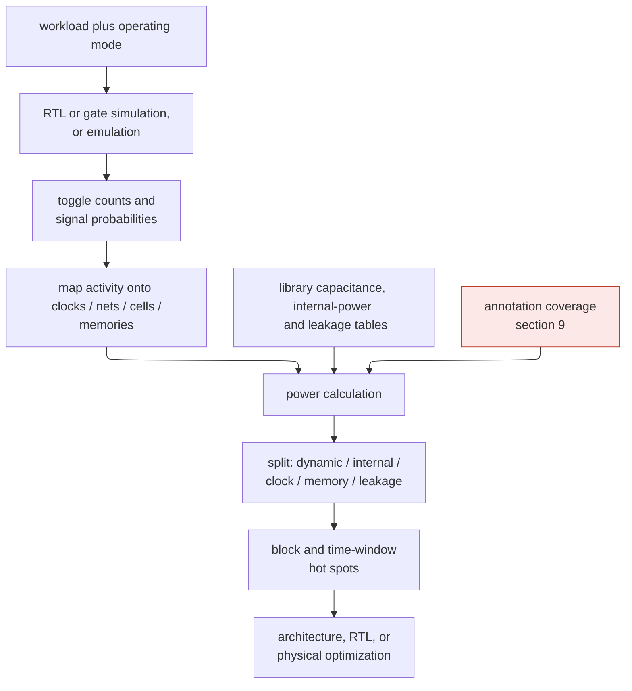
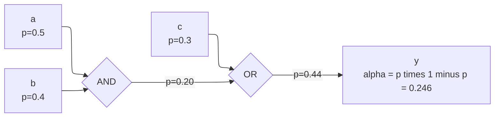
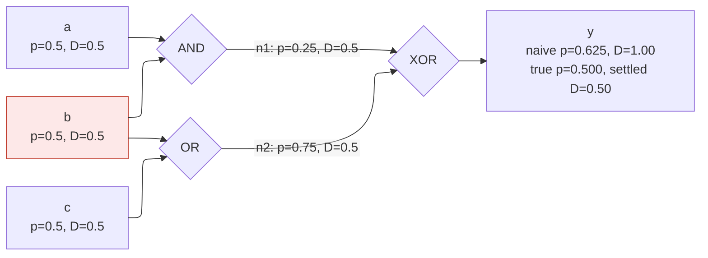
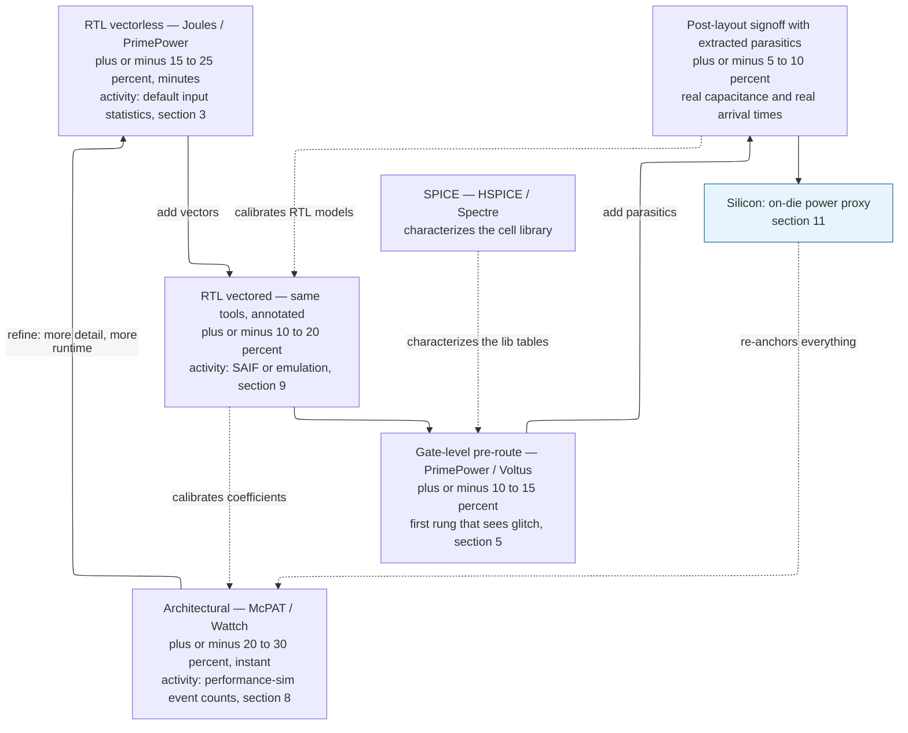
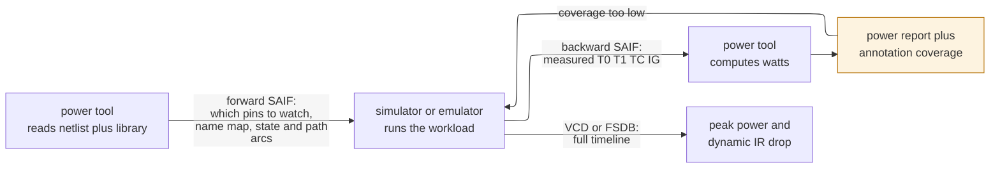

# Block Activity and Power — Estimating the One Term You Can't Read Off the Schematic

> **Prerequisites:** [CMOS_Fundamentals](../00_Fundamentals/01_CMOS_Fundamentals.md) §4 (the $\tfrac12 CV^2$ dissipated per transition, the three powers), [Power_Fundamentals](01_Power_Fundamentals.md) (the total-power equation and the system budget these estimates feed), [Logic_Building_Blocks](../00_Fundamentals/02_Logic_Building_Blocks.md) (gate-level structure and the notion of a logic cone that §3 propagates statistics through).
> **Hands off to:** [Low-Power Architecture](03_Low_Power_Architecture_and_Domain_Partitioning.md) (using per-mode activity/residency to choose domain boundaries), [Power Reduction Techniques](04_Power_Reduction_Techniques.md) (what to do about a high-activity net, and the *mitigation* of the glitch this page measures), [Power Analysis and Signoff](06_Power_Analysis_and_Signoff.md) (the signoff coverage criteria and the peak-activity vectors of §10 that drive dynamic IR-drop analysis), [Runtime Power Management](08_Runtime_Power_Management_and_Adaptive_Voltage_Frequency.md) (consumes the on-die power proxy of §11 as its control-loop input), [Full-Chip Modeling](../01_Architecture_and_PPA/04_SoC_and_Chiplet_Architecture/01_System_Modeling/01_Full_Chip_Modeling.md) (composing block power into a chip).

---

## 0. Why this page exists

Dynamic power is $P_{dyn} = \alpha\, C\, V^2 f$, and three of its four factors are already sitting in the design database. The capacitance $C$ comes from the netlist plus parasitic extraction; the voltage $V$ and frequency $f$ come from the operating point you chose. The fourth factor — $\alpha$, how often each node actually toggles — is a property of the **data flowing through the logic**, not of the logic itself. You cannot read it off the schematic. The identical multiplier burns an order of magnitude more power at 50 % activity than at 5 %, and nothing in its gate-level structure tells you which it will be.

So block-power estimation is, almost in its entirety, **activity estimation**: predicting $\alpha$ for every node, on a workload that resembles the one the chip will really run, *before there is silicon to measure*. Two families of methods fall out of that single need, and they sit at opposite ends of one accuracy-vs-cost axis:

- **Vectored (simulation-driven).** Drive the design with representative input *vectors*, simulate, and count the toggles. Empirical and accurate — but only for the workload you actually ran, and slow.
- **Vectorless (probabilistic).** Assign statistics — a signal probability and a toggle rate — to the primary inputs, and *propagate* them analytically through the logic. No vectors, fast, input-independent — but it must assume the inputs are independent, and real data is not.

Everything below is either a point on that vectored↔vectorless axis or a reason the estimate is hard: the probability algebra of propagation (§3), the correlation that breaks it (§4), glitch power that a zero-delay model cannot even see (§5), and the fidelity ladder from architectural models to gate-level signoff (§7). Sections §8–§11 then walk that ladder rung by rung and answer, for each one, *where the activity physically comes from*: the occupancy-to-$\alpha$ conversion that feeds the architectural rung (§8), the switching-activity file formats and the annotation-coverage metric that feed the RTL and gate rungs (§9), the adversarial power-virus vector that feeds the peak-power rung (§10), and the on-die event-weighted proxy that measures activity in silicon and re-calibrates everything above it (§11).

This page owns *how $\alpha$ is obtained and turned into watts* — including glitch **measurement** and the annotation mechanics. The physics of the $CV^2$ per transition lives in [CMOS_Fundamentals §4](../00_Fundamentals/01_CMOS_Fundamentals.md); the chip-level budget these watts feed lives in [Power_Fundamentals](01_Power_Fundamentals.md); everything you *do* about a bad number — clock gating, operand isolation, path balancing — lives in [Power_Reduction_Techniques](04_Power_Reduction_Techniques.md).



**The contract of this figure.** Everything on the left branch is *structure* and comes from the design database; everything on the top branch is *activity* and comes from a workload. Power is the product, and the two branches have completely different failure modes. Trace one net through it: a 64-bit multiplier output bit has a capacitance the extractor knows to within a few percent, and an activity the tool knows only as well as the stimulus that produced it — so a 2× error in the final number almost never comes from the left branch. The red node is the reason: annotation coverage decides what fraction of the nets got a *measured* activity at all, and it gates the credibility of the watts more tightly than any library or parasitic input does (§9.4). The trade-off the figure illustrates is that the top branch is the expensive one — a longer, more realistic workload is the only thing that improves it, and simulation time is the currency.

---

## 1. What the activity factor actually is

Before estimating $\alpha$ you have to be precise about what it counts, because two different numbers get called "activity" and they differ by a factor of two.

- **Signal probability** $p$ — the long-run fraction of cycles a node holds logic 1. A static property of the value.
- **Activity factor** $\alpha$ — the *expected number of energy-drawing transitions per clock*. Only the $0\!\to\!1$ transition pulls charge from the supply (it charges the load cap; the $1\!\to\!0$ edge dumps that charge to ground and draws nothing further). Over a full up-then-down cycle the node dissipates $CV^2$, so the $\alpha$ in $P=\alpha C V^2 f$ is the probability of a $0\!\to\!1$ transition per cycle, $\alpha \in [0,1]$.

For a **temporally independent** (memoryless) node — one whose value each cycle is an independent coin flip — the two are tied together:

$$
\alpha \;=\; P(0\!\to\!1) \;=\; \underbrace{(1-p)}_{\text{was }0}\;\underbrace{p}_{\text{now }1} \;=\; p\,(1-p), \qquad \alpha_{\max}=0.25 \ \text{ at } p=0.5
$$

where $p$ = signal probability. The product form is just two independent events lining up: to charge on this edge the node had to sit at 0 last cycle *and* land on 1 this one. This is why "random data" sits at $\alpha \approx 0.25$: uniformly random bits have $p=0.5$ and toggle a quarter of the time on the charging edge. The **toggle rate** that simulators report counts *both* edges and is therefore $2\alpha$; a clock has $\alpha=1$ (one rising edge every cycle) but a toggle rate of 2. Keeping this convention straight is the first thing a power estimate can get quietly wrong — the tool hands you toggle counts, but the equation wants $0\!\to\!1$ charging events.

Activity spans two orders of magnitude across a chip, and the ladder itself is the intuition:

A range for $\alpha$ is meaningless unless you name the **population** it is drawn from, because the populations differ by more than the ranges do. These are four different populations, not four opinions about one number:

| Population | Typical $\alpha$ | Why |
|---|---|---|
| Clock net | $1.0$ | one charging edge every cycle, by definition |
| **Datapath nets under uncorrelated data** | $0.15$–$0.35$ | scattered around the $p(1-p)=0.25$ memoryless ceiling; above $0.25$ means glitch (§5) |
| Datapath nets under real, correlated data | $0.05$–$0.15$ | sign bits, zero bytes, slow-moving MSBs (most significant bits) |
| **Average net in random control logic** | $0.05$–$0.15$ | mostly stable between events, with bursts |
| Config / CSR (control and status register) net | $<0.01$ | written once, then static — prime clock-gating target |

The gap between "uncorrelated data" and "real data" is not noise; it is **correlation** (§4), and it is exactly the gap a vectorless estimator has to model or else over-count. Note also that $\alpha > 0.25$ on a data net is not an ordinary high number — $0.25$ is the ceiling of $p(1-p)$, so anything above it is *by definition* extra transitions the settled logic values do not account for. That is the single cheapest glitch detector you have, and §5 and §9.3 both use it.

Two subtleties already visible in the table — that clock nets dominate because $\alpha=1$ meets the largest capacitance on the die (§6), and that low-$\alpha$ config nets are where clock gating pays — are the payoff of getting activity right.

**The bridge this page is about.** Architecture teams describe a block by its *utilization* or *occupancy* — the fraction of cycles it issues an instruction, accepts a transaction, or fires a MAC (multiply-accumulate operation). Power teams need $\alpha$. The block's power model is the translator between them, and mapping occupancy to per-net activity is the single hardest, most valuable step in the whole flow. Everything else is bookkeeping around that conversion. **§8 works that conversion end to end**, including the assumption in it that usually breaks.

---

## 2. Two ways to get $\alpha$: vectored vs vectorless

The dichotomy of §0 is the field's fundamental fork, and each side is the other's weakness turned inside out. Intuitively, **vectored** *measures* — run representative stimulus and count what actually toggled, like metering a house while its real appliances run — while **vectorless** *predicts* — hand the logic input statistics and let algebra propagate them, like estimating that same bill from appliance ratings and usage habits without switching anything on.

| | **Vectored** (simulation-driven) | **Vectorless** (probabilistic) |
|---|---|---|
| Input | representative stimulus (tests, traces, software) | signal probability + toggle rate on primary inputs |
| Mechanism | simulate, record every net's toggles into a **VCD** (value change dump) or **SAIF** (switching activity interchange format) file — §9 | propagate probabilities through the netlist (§3) |
| Correlation | captured *for free* — it is implicit in the vectors | must be modeled explicitly, or assumed away |
| Accuracy | high *on the workload run* | typically $10$–$20\%$ worse when correlation matters |
| Cost | expensive: simulation is slow, few cycles | cheap: one pass over the graph, seconds |
| Blind spot | **coverage** — only sees the vectors you chose | **correlation** — independence assumption (§4) |
| Used when | signoff, workload-specific power, peak vectors | early "is any node pathological?" screening, untestable blocks, coverage backfill |

Neither is a superset of the other, so real flows use both: vectorless to sweep the whole design cheaply and flag hot nets that no test happens to exercise, vectored to pin down the number that matters on a workload that matters. Where a given activity source lands on the one accuracy ladder of §7 is set by how realistic the stimulus is, and the mapping is worth memorizing because engineers routinely quote a *tool's* accuracy when what they actually have is a *stimulus's* accuracy:

| Activity source | Rung of the §7 ladder it puts you on | Accuracy vs silicon | Why |
|---|---|---|---|
| Analytical / spreadsheet utilization | architectural | $\pm 20$–$30\%$, and unbounded if un-calibrated | a guess per sub-block from a performance model (§8) |
| Architectural-simulator event counts | architectural | $\pm 20$–$30\%$ | per-block events $\times$ energy-per-event, no real toggles |
| Vectorless defaults propagated on RTL | RTL, vectorless | $\pm 15$–$25\%$ | no stimulus at all; correlation assumed away (§4) |
| RTL simulation, short directed tests | RTL, vectored — but poorly *covered* | $\pm 15$–$25\%$ | real toggles, but seconds of activity, and the wrong seconds |
| RTL/gate activity from **emulation** | RTL, vectored with good annotation | $\pm 10$–$20\%$ | real software: boot, a game frame, an inference pass |
| SDF (standard delay format) gate simulation, pre-route | gate-level, pre-route | $\pm 10$–$15\%$ | toggles *and* timing, so glitch is visible (§5) |
| Gate simulation with extracted parasitics, real windows | post-layout signoff | $\pm 5$–$10\%$ | real capacitance *and* real arrival times |

The jump from short tests to emulation is the one that surprises people: a directed testbench keeps a block continuously busy and so **systematically over-estimates** $\alpha$ while **under-estimating** idle and clock-gated residency. Real software has phases — an operating-system timer tick that keeps a "mostly idle" cluster at 30 % clock activity, a driver bug that never lets a block reach its low-power state — and only long windows see them. Note that the two RTL rows carry the same error bar for different reasons: the vectorless row is limited by the independence assumption, the short-directed-test row by representativeness. Adding a second directed test fixes neither.

**The worst case is also a vectored question.** Signoff needs not the *average* $\alpha$ but the *peak*, to size the power grid against dynamic IR drop. That peak is found with an adversarial **power-virus** vector — synthetic stimulus that maximizes $\alpha$ everywhere at once (all lanes computing, maximum-toggle data patterns). It is the vectored *upper* bound, in contrast to the average-activity estimate the battery-life model wants; the two live at opposite ends of the same vectored method, and the grid must survive the burst even though cooling only has to handle the average. **§10 builds one**, because "run a power virus" is advice, not a method.

### 2.1 The statistics of a finite window

A vectored estimate is a *measurement over a finite sample*, so it carries sampling error, and that error is the mathematical form of the "coverage" blind spot. Treat a node's $0\!\to\!1$ events over $N$ cycles as Bernoulli with rate $\alpha$; the natural estimator $\hat\alpha = (\text{count})/N$ then has

$$
\operatorname{Var}[\hat\alpha] \approx \frac{\alpha(1-\alpha)}{N}, \qquad
\frac{\text{SE}[\hat\alpha]}{\alpha} \approx \sqrt{\frac{1-\alpha}{\alpha\,N}}
$$

where $N$ = simulated cycles, $\alpha$ = true activity, SE = standard error. The relative error scales as $1/\sqrt{\alpha N}$, so **rare-toggling nets are the expensive ones**: a control net at $\alpha=10^{-3}$ needs on the order of $10^5$–$10^6$ cycles just to pin its activity to $\pm 10\%$, which a microsecond directed test cannot supply. This is the quantitative reason low-activity control and configuration logic is estimated badly by short simulation and why emulation (billions of cycles) exists — not to average a busy datapath more finely, but to *see the tail* at all.

Sampling variance is the optimistic half of the story; the pessimistic half is **representativeness**. Even an infinite window of the *wrong* workload converges to the wrong $\alpha$, and the phase-to-phase swing between workloads dwarfs the within-workload noise. Hence the discipline of choosing power-representative windows (the SimPoint idea) rather than simply simulating longer: a well-placed $10\,\mu s$ window beats a poorly-placed millisecond.

---

## 3. Vectorless in theory: propagating probabilities through logic

Vectorless estimation earns its speed by never simulating a vector — it computes each internal node's statistics directly from the inputs'. Given each primary input's signal probability, and *assuming the inputs are independent*, probability flows through the Boolean operators by a small algebra:

$$
\begin{aligned}
\text{NOT: } & p_y = 1-p_a &
\text{AND: } & p_y = p_a\,p_b \\
\text{OR: } & p_y = 1-(1-p_a)(1-p_b) &
\text{XOR: } & p_y = p_a + p_b - 2p_a p_b
\end{aligned}
$$

where $p_a,p_b$ = input signal probabilities, $p_y$ = output. One topological pass yields $p$ at every node; feeding each $p$ into $\alpha = p(1-p)$ gives a first activity estimate.

**Worked example — one pass through a 2-level cone.** Take $y=(a\wedge b)\vee c$ with independent inputs $p_a=0.5,\ p_b=0.4,\ p_c=0.3$. Sweep in topological order: the AND gives $p_n=p_a p_b=0.20$; the OR gives $p_y=1-(1-p_n)(1-p_c)=1-(0.80)(0.70)=0.44$; and $\alpha_y=p_y(1-p_y)=0.246$, a hair under the $0.25$ random-data ceiling. Because $n$ (built from $a,b$) and $c$ never reconverge, the product rule is *exact* here — the instant two inputs share a source, §4 applies.



**The contract of this figure.** Each edge carries a single number — the signal probability of the net it labels — and each gate node is a rule from the algebra above that turns its incoming numbers into one outgoing number. Trace it: $0.5$ and $0.4$ enter the AND, $0.5\times0.4=0.20$ leaves it; $0.20$ and $0.3$ enter the OR, $1-(0.8)(0.7)=0.44$ leaves it. The figure is a *tree* — no net appears twice on the way to $y$ — and that is precisely the condition under which every rule it uses is exact. §3.1 draws the same picture with one input feeding two branches, and every number in it becomes wrong.

The mechanism is exactly that traversal, and the whole gate library is a handful of one-liners:

```python
def p_and(pa, pb): return pa * pb
def p_or(pa, pb):  return 1 - (1 - pa) * (1 - pb)
def p_xor(pa, pb): return pa + pb - 2 * pa * pb

# 2-level cone:  y = (a AND b) OR c,  inputs independent
p_n = p_and(0.5, 0.4)        # a AND b -> 0.20
p_y = p_or(p_n, 0.3)         # n OR c  -> 0.44
alpha_y = p_y * (1 - p_y)    # p(1-p)  -> 0.2464
print(round(p_n, 4), round(p_y, 4), round(alpha_y, 4))  # 0.2 0.44 0.2464
```

That last step secretly re-assumes temporal independence, so the rigorous formulation works in **transition density** instead of re-deriving $\alpha$ from $p$. Najm's result propagates activity through a gate via the *Boolean difference*: node $y$ can only toggle when it is *sensitive* to an input that toggled, and it is sensitive to $x_i$ exactly when $\partial y/\partial x_i = y|_{x_i=1}\oplus y|_{x_i=0}$ is true. For independent inputs,

$$
D(y) \;=\; \sum_i P\!\left(\frac{\partial y}{\partial x_i}\right) D(x_i)
$$

where $D(\cdot)$ = transition density (transitions per unit time) and $P(\partial y/\partial x_i)$ = signal probability of the Boolean difference (the fraction of the time $y$ is sensitive to $x_i$). The formula makes the character of each gate quantitative:

- **XOR** ($y=a\oplus b$): $\partial y/\partial a \equiv 1$ — $y$ flips *whenever either input flips*, so $D(y)=D(a)+D(b)$. XOR **passes all activity through**, which is why adders, LFSRs (linear-feedback shift registers), and crypto datapaths are activity hot-spots.
- **AND** ($y=ab$): $\partial y/\partial a = b$, so $D(y)=p_b\,D(a)+p_a\,D(b)$. AND **attenuates** activity by the probability the *other* input is enabling — an AND with a mostly-0 input is a natural activity filter, the mechanism operand isolation and clock gating exploit.

This is the whole theoretical spine of vectorless estimation: a single graph traversal, gate rules that either pass or attenuate density, and one load-bearing assumption — input independence — that §3.1 is about to break on a circuit small enough to check by hand.

### 3.1 Propagating through a real cone: where the estimate breaks

Two gates and no reconvergence is the case the algebra was designed for. Real logic is neither. Take the smallest circuit that has the property every real cone has — one input reaching the output by **two different paths** — and push all three estimators through it.

$$
n_1 = a \wedge b, \qquad n_2 = b \vee c, \qquad y = n_1 \oplus n_2, \qquad p_a=p_b=p_c=0.5,\ \ D_a=D_b=D_c=0.5
$$

where $D$ = transitions per cycle (so each input is a fair coin flipped afresh every cycle: $p=0.5 \Rightarrow D=2p(1-p)=0.5$). The signal $b$ **reconverges**: it reaches $y$ through the AND and again through the OR.



**The contract of this figure.** It is the §3 figure with one edge added — $b$ now leaves its node twice. Every number downstream of that fork is computed by a rule that assumed the two things being combined were independent, and the two things being combined both contain $b$. Trace it and watch the error appear exactly at the XOR, not before: $p_{n_1}=0.25$ and $p_{n_2}=0.75$ are both individually correct, and $p_y = p_{n_1}+p_{n_2}-2p_{n_1}p_{n_2} = 1.0-0.375 = 0.625$ is wrong.

**Step 1 — the exact answer, by enumeration.** Eight equally likely input assignments $(a,b,c)$:

| $a\,b\,c$ | $n_1$ | $n_2$ | $y$ | | $a\,b\,c$ | $n_1$ | $n_2$ | $y$ |
|---|---|---|---|---|---|---|---|---|
| 000 | 0 | 0 | **0** | | 100 | 0 | 0 | **0** |
| 001 | 0 | 1 | **1** | | 101 | 0 | 1 | **1** |
| 010 | 0 | 1 | **1** | | 110 | 1 | 1 | **0** |
| 011 | 0 | 1 | **1** | | 111 | 1 | 1 | **0** |

Four ones out of eight, so $p_y = 0.5$ exactly, against the propagated $0.625$ — a **+25 % relative error on $p$**. Simplifying confirms it: for $b=0$, $y = c$; for $b=1$, $y = \bar a$. So $y = \bar b c \vee b \bar a$, which is 1 in exactly half the rows.

**Step 2 — the error in $p$ hides, and then does not.** Feeding both into $\alpha=p(1-p)$ gives $0.625\times0.375 = 0.2344$ against the true $0.5\times0.5=0.25$: only $-6.2\%$. That is not luck — $p(1-p)$ is flat at its maximum, so a $p$ error *near 0.5* is largely absorbed. Move the same 0.125 error to $p=0.9$: $0.9\times0.1 = 0.09$ against $0.775\times0.225=0.174$, a **$-48\%$** error. **The independence assumption is forgiving on balanced nets and brutal on skewed ones** — and skewed nets are exactly the enables, valids, and mode bits that gate the biggest clouds.

**Step 3 — now the catastrophic case, from the same two gates.** Keep $n_1$ and $n_2$ and build $y_2 = n_1 \wedge \overline{n_2}$ instead. Propagation says $p_{y_2} = p_{n_1}(1-p_{n_2}) = 0.25\times0.25 = 0.0625$ and $\alpha_{y_2}=0.0625\times0.9375=0.0586$. The truth: $n_1=1$ requires $b=1$, and $b=1$ forces $n_2=1$, so $y_2 \equiv 0$ — a **constant net**, zero activity, zero power. The estimator has invented switching on a wire that never switches. This is the textbook $a \wedge \bar a$ trap wearing two gates of disguise, and it is the reason a vectorless report full of small non-zero activities on control logic must never be read as "these nets are all a little bit busy."

**Step 4 — the same failure in transition density, which is the number that becomes watts.** Propagate $D$ naively: $D(n_1)=p_b D_a + p_a D_b = 0.5(0.5)+0.5(0.5)=0.5$; $D(n_2)=(1-p_c)D_b+(1-p_b)D_c = 0.5(0.5)+0.5(0.5)=0.5$; the XOR passes everything, so $D(y) = 0.5+0.5 = \mathbf{1.00}$.

Now apply the same Boolean-difference formula but *directly from the primary inputs*, which is legitimate because $a,b,c$ genuinely are independent:

$$
\frac{\partial y}{\partial a} = b,\qquad \frac{\partial y}{\partial c} = \bar b, \qquad \frac{\partial y}{\partial b} = y|_{b=1}\oplus y|_{b=0} = \bar a \oplus c
$$

each with probability $0.5$, so $D(y) = 0.5(0.5)+0.5(0.5)+0.5(0.5) = \mathbf{0.75}$. The two-stage traversal over-counted by $1.00/0.75 - 1 = \mathbf{+33\%}$, and the mechanism is visible in the algebra: the traversal charged $b$'s density once through $n_1$ and once through $n_2$, but when both XOR inputs move on the *same* event they partially cancel.

**Step 5 — and a third number, which is the one a SAIF file would report.** Because $y$'s value each cycle is a function of fresh i.i.d. inputs, $y$ is itself memoryless with $p_y=0.5$, so its *settled* toggle rate is $2p_y(1-p_y) = \mathbf{0.50}$. Three defensible numbers for one net:

| Number | Value | What it means |
|---|---|---|
| Naive two-stage propagation | $1.00$ | wrong: double-counts the reconverging signal |
| Boolean difference from primary inputs | $0.75$ | correct *continuous-time* density: counts glitches, because arrivals are assumed distinct |
| Settled toggle rate | $0.50$ | what a zero-delay simulation records: no glitches at all |

The $0.75$ versus $0.50$ gap is not an error — **it is the glitch**, and this tiny circuit predicts it exactly. Najm's density is a continuous-time measure in which two input transitions never coincide, so when $a$ and $b$ both flip in the same cycle with any skew between them, the XOR really does produce two output transitions. Both flip together with probability $0.25$; exactly one flips with probability $0.5$. Expected transitions with skew $= 0.5(1)+0.25(2) = 1.00$ for a plain XOR, against $0.5(1)+0.25(0)=0.50$ settled — the XOR's transitions are **50 % glitch** under fully separated arrivals. §5 turns that observation into picoseconds and percentages of block power.

The practical reading of all five steps: naive propagation is exact on trees, over-counts on reconvergence, can invent activity on constant nets, and — even when done exactly — answers a *different question* (with-glitch) from the one a zero-delay simulation answers (without-glitch). §4 is about repairing the reconvergence half of that.

---

## 4. Why the estimate is hard: temporal and spatial correlation

Both the memoryless model $\alpha=p(1-p)$ and the propagation algebra of §3 assume signals are independent — of their own past, and of each other. Real signals are neither, and the two failures have names.

**Temporal correlation — a signal remembers its last value.** Real data has runs. A sign bit stays 0 through a long stretch of positive numbers; the MSBs of an up-counter almost never move while the LSB toggles every cycle. Such a signal can have $p=0.5$ yet an $\alpha$ far *below* the memoryless $0.25$, because "was 0, is 0" is the common case. The memoryless model, which assumes each cycle is an independent coin flip, systematically **over-estimates** the activity of slow-moving data and **under-estimates** bit-flipping counters. The fix is to characterize a signal by both $p$ and $\alpha$ independently (which SAIF does, recording time-at-1 *and* toggle count) rather than deriving one from the other.

**Spatial correlation — signals share a source.** The product rule $p_y=p_a p_b$ is exact only when $a$ and $b$ are independent. At **reconvergent fanout** — where one signal fans out, passes through different logic, and meets itself downstream — they are not, and the error can be large. The textbook trap is $y = a \wedge \bar a$: the true answer is $p_y=0$, but blind propagation gives $p_a(1-p_a)$, a spurious activity out of thin air. Buses are correlated the same way (adjacent bits of an address move together), so treating them as independent nets mis-estimates the whole datapath.

These two effects *are* the accuracy gap in the §2 table. A vectored simulation gets correlation for free — it is baked into the vectors, so the toggles it counts are the real, correlated ones. A vectorless estimator has to model correlation explicitly or accept the error, and modeling it *fully* is as expensive as the simulation it was trying to avoid. That is the fundamental reason vectorless is *fast but approximate* and vectored is *accurate but expensive* — not an implementation detail, but the independence assumption meeting real data.

### 4.1 The three repairs, what each costs, and when to skip all of them

"Model the correlation" is three distinct algorithms with three distinct cost curves. Each one buys back a strictly larger class of dependency than the one before it, and each one costs more than the last. Run them on the §3.1 cone, where the exact answer ($p_y=0.5$, $D_y=0.75$) is known.

**Repair 1 — pairwise correlation coefficients.** Carry, alongside each net's probability, a correction factor for each *pair* of nets that might meet downstream:

$$
\rho_{uv} \;\equiv\; \frac{P(u \wedge v)}{p_u\,p_v}, \qquad\text{so}\qquad P(u\wedge v) = \rho_{uv}\,p_u\,p_v
$$

where $\rho=1$ means independent, $\rho>1$ positively correlated, $\rho<1$ negatively. On the §3.1 cone: $n_1=1$ implies $b=1$ implies $n_2=1$, so $P(n_1\wedge n_2) = P(n_1) = 0.25$ and $\rho_{n_1 n_2} = 0.25/(0.25\times0.75) = 1.333$. Feed that into the corrected XOR rule $p_y = p_{n_1}+p_{n_2}-2P(n_1\wedge n_2) = 0.25+0.75-0.50 = 0.50$ — **exact**, recovered by carrying one extra number.

*Mechanism:* propagate $\rho$ through the gate rules the same way you propagate $p$, using the fanin cones' shared-input sets to decide which pairs need a coefficient at all. *Cost:* memory and runtime grow as $O(k^2)$ in the number of nets $k$ that must be tracked jointly, versus $O(k)$ for plain propagation; tools bound $k$ by only tracking pairs inside a reconvergent region. *Selection boundary:* pairwise is **exact when each reconvergent region has one reconverging pair**, and degrades as soon as a signal reconverges through three or more paths — a carry-lookahead adder's group-propagate signals are the standard counterexample, where three-way and four-way joint probabilities are all different from the product of the pairwise ones. Typical result on real logic: pairwise removes roughly half to two-thirds of the reconvergence error and leaves the rest.

**Repair 2 — supergates.** A **supergate** for node $y$ is the smallest sub-circuit that contains all of $y$'s reconvergent fanout: cut the fanin cone at a frontier of signals that are mutually independent, and treat everything between that frontier and $y$ as **one single gate of $w$ inputs**, evaluated exactly. The concept comes from testability analysis (Seth and Agrawal's PREDICT), where the identical problem — propagating a probability through reconvergence — appears.

*Mechanism:* identify the frontier by walking backward from $y$ until every signal in the cut has disjoint support, then enumerate all $2^w$ assignments of the frontier and sum the probability of the ones that make $y$ true. For §3.1 the frontier is $\{a,b,c\}$, $w=3$, and the enumeration is literally the eight-row table above — the supergate method *is* what you did by hand. *Cost:* $O(2^w)$ per supergate, so it is exact and it is exponential. Production tools cap $w$ at roughly 10–16 inputs (1 k–65 k rows), which covers most control cones and no datapath cone. Beyond the cap they cut the frontier anyway and revert to independence across the cut, which reintroduces exactly the error you were paying to remove — so a supergate limit is not a runtime knob, it is an accuracy cliff. *Selection boundary:* excellent for the narrow, deeply reconvergent control logic where pairwise fails and where $2^w$ is affordable; useless on a 64-bit multiplier.

**Repair 3 — BDD-based exact evaluation.** A **BDD** (binary decision diagram) is a canonical directed acyclic graph representation of a Boolean function in which every path from root to leaf tests each variable at most once, in a fixed order, with identical sub-graphs shared. Its value here is that signal probability falls out of one bottom-up pass with memoization, using the Shannon expansion at each node:

$$
P(f) \;=\; p_x\,P(f|_{x=1}) \;+\; (1-p_x)\,P(f|_{x=0})
$$

*Mechanism:* build the BDD for $y$ over the primary inputs, then evaluate the recurrence once per BDD node, caching results. Because sharing collapses the $2^w$ enumeration into $|BDD|$ nodes, this is **exact at $O(|BDD|)$ rather than $O(2^w)$** — the supergate answer without the exponential enumeration. The Boolean differences $\partial y/\partial x_i$ needed for transition density are themselves BDD operations, so the same structure delivers $D$ as well as $p$.

*Cost:* BDD size is exquisitely sensitive to variable order, and for some functions no order helps. The decisive result is Bryant's: the BDD for the middle output bit of an $n\times n$ integer multiplier is **provably exponential in $n$ for every variable order**. So the technique is exact and cheap on control logic, adders, and comparators, and it explodes on precisely the multiplier arrays that dominate datapath power. That is not an implementation weakness to be engineered around; it is a theorem. *Selection boundary:* use BDDs on cones under a few dozen support variables where you need a trustworthy number (clock-gating enables, mode decoders, address comparators); do not attempt them on arithmetic arrays.

**When the correlation is small enough to ignore — the case that governs most of the design.** All three repairs cost runtime, and the honest question is when plain independence is good enough. Three conditions make it so:

1. **Tree-structured cones.** No reconvergence, no error, exactly. A surprising fraction of glue logic qualifies.
2. **Long, dissimilar reconvergent paths.** When the two paths from a shared source to the meeting point each mix in many other independent signals, the two copies decorrelate on the way, and $\rho \to 1$ on its own. Reconvergence over one or two levels is dangerous; reconvergence over ten is usually not.
3. **Skew-free nets.** As §3.1 step 2 showed, the error in $\alpha$ is second-order in the error in $p$ when $p \approx 0.5$. It is the *skewed* nets where an error in $p$ turns into a large error in $\alpha$.

And then the quantitative screen that actually decides it, which is about *capacitance*, not nets:

$$
\varepsilon_{block} \;\approx\; \phi_{rc}\;\times\;\varepsilon_{net}
$$

where $\phi_{rc}$ = fraction of the block's switched capacitance that sits on reconvergent nets and $\varepsilon_{net}$ = the per-net relative error from assuming independence. With the §3.1 error of $33\%$ on a cone holding $8\%$ of the block's switched capacitance, the block-level error is $0.08\times0.33 = 2.7\%$ — invisible, and the right decision is to skip all three repairs. Take the same $33\%$ into a block that is $60\%$ arithmetic, and it is $20\%$ — the entire accuracy budget of the RTL rung, spent on one assumption. **This is why the independence assumption survives in control-dominated designs and fails in datapath-dominated ones**, and why the production answer is neither pure vectorless nor pure vectored but the hybrid of §9: propagate everywhere, and *annotate* the arithmetic.

---

## 5. Glitch power: the activity a zero-delay model cannot see

Everything so far counted *functional* transitions — one per node per cycle at most. Real gates also produce **glitches**: spurious extra transitions within a single cycle. Intuitively a glitch is a gate *changing its mind mid-cycle*: its inputs arrive at slightly different times, so for a moment it computes on stale data, drives a wrong value, then corrects when the late input lands — and the supply pays for each needless swing even though the settled logic value never moved. It is the classic logic **hazard**, now priced in joules.

The size of the effect depends entirely on what kind of logic you are looking at, so quote it with the population named, exactly as with $\alpha$ in §1. Always as a fraction of **dynamic power**:

| Block character | Glitch share of dynamic power |
|---|---|
| Unoptimized, arithmetic- or datapath-heavy (ripple structures, unbalanced multiplier trees) | **20–40 %** |
| Typical mixed control-plus-datapath logic | **5–15 %** |
| After path balancing and operand isolation | **under 10 %** |

Two things follow immediately. First, glitch is a *block* property, not a net property — an individual unbalanced adder output bit can easily be 50–60 % glitch (Worked problem 1) while the block containing it sits at 25 %, and quoting the net number as if it were the block number is the most common way this figure gets inflated. Second, the top of the range is not a fact of nature: it is a fact about *unbalanced arrival times*, and §5.4 shows the arithmetic that carries an arrival profile to each of those three rows. This page owns **measuring** the number; [Power_Reduction_Techniques](04_Power_Reduction_Techniques.md) owns moving it (§5.6).

### 5.1 The mechanism, in picoseconds

A gate whose inputs derive from a common source receives them with a time spread $\Delta t$ set by path-delay imbalance. If $\Delta t$ exceeds the gate's **inertial delay** $\tau$ — the minimum input-pulse width the cell will reproduce, which for a CMOS cell is approximately its own propagation delay — the output pulses to a wrong value and back before settling. Concrete values at a modern FinFET node, and they are the numbers that decide whether a glitch exists at all:

| Quantity | Typical value | Consequence |
|---|---|---|
| $\tau$, mid-strength inverter or NAND2 driving a few loads | **10–30 ps** | pulses narrower than this do not reach the rail |
| $\tau$, complex cell (AOI/OAI, full adder, wide MUX) | **30–60 ps** | complex gates are natural glitch filters |
| $\Delta t$ from one stage of unbalanced logic | 20–60 ps | comparable to $\tau$ — the whole question is marginal, per node |
| $\Delta t$ across a 32-stage ripple carry | 500–1000 ps | vastly greater than $\tau$ — every front resolves |

```wavedrom
{ "signal": [
  {"name": "a (early)",        "wave": "01........"},
  {"name": "b (late, +80 ps)", "wave": "0....1...."},
  {"name": "y = a XOR b",      "wave": "0.1...0...", "node": "..p...q..."},
  {},
  {"name": "b2 (late, +20 ps)","wave": "0.1......."},
  {"name": "y2 = a XOR b2",    "wave": "0.10......", "node": "..rs......"}
 ],
 "edge": ["p<->q 80 ps full-swing glitch", "r<->s 20 ps, below tau, attenuated"],
 "head": {"text": "one XOR, two skews: the inertial-delay threshold decides whether a glitch is paid in full"},
 "foot": {"text": "one character = 20 ps; cell inertial delay tau = 30 ps"}
}
```

**The contract of this figure.** Both halves show the identical gate driven by the identical logical change — $a$ and $b$ both rise, so $y$ must end where it started — and differ only in the *arrival skew*. In the top half the 80 ps skew is far wider than $\tau=30$ ps, the output reaches the rail, and the supply delivers a full charge and then throws it away. In the bottom half the 20 ps skew is below $\tau$, and this is the part that is usually stated wrongly: **the pulse is not free, it is discounted.** Charging a node from 0 to some peak $V_x$ and letting it fall back draws $Q = C V_x$ from the supply at potential $V_{DD}$, so the energy is

$$E_{glitch} = C\,V_x\,V_{DD} \;=\; \left(\tfrac{V_x}{V_{DD}}\right) C\,V_{DD}^{2}$$

where $V_x$ = the peak the partial pulse actually reaches. The cost falls **linearly** with attenuation, not quadratically: a pulse that only makes it to $0.6\,V_{DD}$ still burns 60 % of a full glitch. This is why signoff power reports split glitches into *transparent* (full-swing) and *filtered* (partial-swing) categories and charge for both, and why "the pulse got filtered" is never the same statement as "the pulse was free."

### 5.2 How many glitches: the front-counting bound

The useful question is not *whether* a node glitches but *how many times*, because that number multiplies straight into power. Two independent ceilings apply, and the real count is the smaller of them.

**Ceiling 1 — topology.** A node can only change when one of its inputs changes, so the number of times it can change is bounded by the number of distinct upstream transition *fronts* that reach it, which is bounded by its logic depth $d$. Induction makes this exact on a chain. For a ripple-carry adder with $c_{k+1} = a_k b_k + c_k(a_k \oplus b_k)$: $c_k$'s only inputs are $a_{k-1}, b_{k-1}$ (which change once, at the clock edge) and $c_{k-1}$. If $c_{k-1}$ can change at most $k-1$ times, $c_k$ can change at most $k$ times. Base case $c_1 \le 1$. Therefore:

$$n_{trans}(c_k) \le k, \qquad n_{trans}(s_k) \le k+1$$

since the sum bit $s_k = a_k \oplus b_k \oplus c_k$ can also move once on its own operands. Summing over an $N$-bit adder gives a total transition bound of $\sum_{k=0}^{N-1}(k+1) = N(N+1)/2$ against at most $N$ functional transitions — **glitch transitions grow quadratically with adder width while useful ones grow linearly.** For $N=32$ that is 528 versus 32.

**Ceiling 2 — inertial filtering.** Fronts that arrive closer together than $\tau$ merge into one output transition. If the arrival window at a node has total width $W$ (last arrival minus first), at most $\lfloor W/\tau \rfloor$ boundaries inside it can be resolved. Combining:

$$
\boxed{\;n_{trans} \;\le\; 1 + \min\!\left(d,\ \left\lfloor \frac{W}{\tau} \right\rfloor\right)\;}
$$

where $d$ = number of distinct upstream fronts (bounded by logic depth), $W$ = arrival-time window width at the node, $\tau$ = the cell's inertial delay. This one inequality contains both mitigations and their costs, which is why it is worth memorizing: **shrink $W$** (path balancing — restructure so all inputs arrive together) or **grow $\tau$** (use a slower, smaller, or more complex cell). Growing $\tau$ costs delay directly, which is why it is only ever applied to non-critical glitchy cones. Shrinking $W$ costs area and a restructuring pass.

It also explains the scaling trend that surprises people: glitch power's share has *risen* with each process node. Scaling makes cells faster, so $\tau$ falls; wire-delay spread within a cone does not fall as fast, so $W$ holds up. The ratio $W/\tau$ climbs, each node filters less, and $n_{trans}$ climbs with it.

**Expected, not worst-case.** The bound above is realized only if every front actually flips the node. The probability that it does is exactly the Boolean-difference probability of §3: $E[n_{trans}] = \sum_j P(\partial y/\partial x_j)$ over the resolvable fronts. For an XOR-dominated carry chain that probability is 1 (an XOR is always sensitive), which is why arithmetic is the worst case. For an AND/OR tree it is $p_{other} \approx 0.5$, halving the count. And for random operands the ripple rarely runs the full length: the expected longest carry-propagation chain in $N$-bit addition is $\approx \log_2 N$ (the Burks–Goldstine–von Neumann result, the same one that motivates carry-lookahead in the first place), so for $N=32$ the *expected* front count per bit is around 5, not 31. The realistic glitch amplification for a ripple-carry adder under random data therefore lands near $1.5$–$2.5\times$, not $16\times$.

### 5.3 Worked: a 4-bit ripple-carry adder, transition by transition

Take a 4-bit ripple-carry adder with a carry-stage delay of 40 ps and a 2-input XOR delay of 25 ps, and change the operands from $0000+0000$ to $1111+0001$. The result is $10000_2$: every sum bit ends at 0 and the carry-out ends at 1.

```wavedrom
{ "signal": [
  {"name": "operands A+B", "wave": "34...........", "data": ["0+0", "15+1"]},
  {},
  {"name": "c1", "wave": "0..1........."},
  {"name": "c2", "wave": "0....1......."},
  {"name": "c3", "wave": "0......1....."},
  {"name": "c4 = cout", "wave": "0........1..."},
  {},
  {"name": "s0", "wave": "0............"},
  {"name": "s1", "wave": "0.1.0........", "node": "..a.b"},
  {"name": "s2", "wave": "0.1...0......", "node": "..c..d"},
  {"name": "s3", "wave": "0.1.....0....", "node": "..e...f"}
 ],
 "edge": ["a<->b 40 ps", "c<->d 80 ps", "e<->f 120 ps"],
 "head": {"text": "4-bit ripple carry, 0000+0000 to 1111+0001: carry stage 40 ps, XOR 25 ps"},
 "foot": {"text": "one character = 20 ps; s1, s2, s3 each rise and fall and end where they started"}
}
```

**The contract of this figure.** Every waveform is the real value of a real net; nothing is idealized except that the operand bits are drawn as arriving together. Trace $s_1$. Its operands are $a_1 = 1$, $b_1 = 0$, so $a_1 \oplus b_1$ becomes 1 at 25 ps and $s_1$ rises — correctly, given what $s_1$ knows so far, because the carry into it is still the *previous cycle's* 0. At 40 ps the real carry $c_1$ arrives as a 1, and 25 ps later $s_1$ falls back to 0, which is its correct final value. $s_1$ made two transitions and moved nowhere. $s_2$ and $s_3$ do the same thing with progressively later corrections, because their carries arrive at 80 ps and 120 ps.

Count it. Useful transitions: $c_1, c_2, c_3, c_4$ each go $0\to1$ once, and all four sum bits end at 0 where they started — so **4 useful, and the entire sum bus contributes zero net logical change**. Spurious transitions: $s_1$, $s_2$, $s_3$ each move twice — **6 spurious**. Of the 10 transitions on this vector, 6 are glitch, and the glitch is 60 % of the transitions and $\approx 60\%$ of this vector's switched capacitance if all the nets carry comparable load.

Now apply §5.1's threshold to the *pulse widths*, which the edge annotations give: $s_1$'s glitch is 40 ps wide, $s_2$'s is 80 ps, $s_3$'s is 120 ps. Against $\tau = 30$ ps all three survive at full swing. Against a slower cell with $\tau = 50$ ps, $s_1$'s 40 ps pulse is attenuated — it reaches perhaps $0.7\,V_{DD}$ and costs $0.7\,CV_{DD}^2$ instead of $1.0$ — while $s_2$ and $s_3$ are untouched. That is the whole quantitative content of "filtering helps at the head of the chain and not at the tail," and it is why cell downsizing is a weak glitch lever on deep structures.

And note what $s_0$ does: nothing, because both of its operand bits change at the same instant. Give $b_0$ 20 ps of extra routing delay and $s_0$ produces a 20 ps pulse of its own. **Glitch on the first stage is created by wire skew; glitch on later stages is created by logic depth.** They need different repairs.

### 5.4 From an arrival profile to the canonical percentage

Define the **glitch amplification factor** of a set of nets as the ratio of all transitions to the functionally necessary ones:

$$G \;\equiv\; \frac{\text{total transitions per cycle}}{\text{settled transitions per cycle}} \;=\; \frac{\alpha_{total}}{\alpha_{settled}}, \qquad G \ge 1$$

$G=1$ is glitch-free; the §5.3 adder's sum bus is at $G = \infty$ on that particular vector (6 transitions, 0 settled ones) and around $1.5$–$2.5$ averaged over random operands. Now split a block's *functional* switched capacitance into a fraction $\phi$ in the deep arithmetic cones (amplification $G_a$) and $1-\phi$ elsewhere (amplification $G_o$, near 1). Total dynamic power scales with $\phi G_a + (1-\phi)G_o$, of which the excess over the settled count is the glitch:

$$
\frac{P_{glitch}}{P_{dyn}} \;=\; \frac{\phi\,(G_a-1) \;+\; (1-\phi)(G_o-1)}{\phi\,G_a \;+\; (1-\phi)\,G_o}
$$

where $\phi$ = fraction of functional switched capacitance in the glitchy cones. Two inputs, and both of them are measurable: $\phi$ from the netlist and the parasitic extraction, $G$ from comparing an SDF-annotated gate simulation against a zero-delay one on the same vectors (§5.5). Run the three canonical cases:

| Block | $\phi$ | $G_a$ | $G_o$ | $P_{glitch}/P_{dyn}$ | Canonical band |
|---|---|---|---|---|---|
| Unoptimized multiplier-heavy datapath | $0.60$ | $2.0$ | $1.0$ | $\dfrac{0.60}{1.60} = 37.5\%$ | 20–40 % ✓ |
| Ripple adder inside a mixed block | $0.30$ | $2.0$ | $1.1$ | $\dfrac{0.37}{1.37} = 27.0\%$ | 20–40 % ✓ |
| Typical control-plus-datapath | $0.25$ | $1.5$ | $1.05$ | $\dfrac{0.163}{1.16} = 14.0\%$ | 5–15 % ✓ |
| After path balancing and operand isolation | $0.35$ | $1.2$ | $1.02$ | $\dfrac{0.083}{1.09} = 7.6\%$ | under 10 % ✓ |

The last row is the one that shows what the two repairs actually do, and they act on *different variables*. Path balancing lowers $G_a$ — it shortens $W$ at every node in the cone, so fewer fronts resolve. Operand isolation lowers the *effective* $\phi$ — the cone still has its bad $G_a$, but it only sees changing inputs on the cycles its result is used. Neither one touches the other's variable, which is why a design that applies only one of them typically lands at 12–18 % rather than under 10 %.

### 5.5 Why a zero-delay simulation sees none of this

RTL simulation is not merely *inaccurate* about glitches — it is structurally incapable of representing one, and the reason is in the event scheduler. An `always_comb` block with no delay annotation evaluates in **delta cycles**: zero simulation time elapses between the input change and the output change, and if the output changes several times as different inputs propagate, all of those changes happen at the *same* simulation timestamp. The VCD writer records the value of a net at each *timestamp*, so every intermediate value is overwritten by the final one before anything is written. The dump contains one transition where the silicon has three. SAIF's toggle count, derived from the same event stream, is therefore exactly the settled count: $G = 1$ **by construction**, not by measurement.

This is why an RTL power number is a **glitch-free lower bound** and why the gap between the RTL and gate-level estimates on a datapath block is not "tool noise" — it is a physical term that the RTL model does not contain. Three ways to get a real number, in increasing cost:

- **Unit-delay simulation** gives every gate the same delay. It produces *some* glitches, and it produces the wrong ones: uniform delay is the definition of a balanced path, so it systematically under-counts exactly the imbalance that causes glitch. Useful for finding hazard *bugs*, useless for power.
- **SDF-back-annotated gate-level simulation** reads per-instance, per-arc delays from a standard delay format file produced by timing analysis, so each gate's inputs arrive at the times the silicon will produce. This is the only path that sees glitch fully, and it is slow: gate-level simulation runs $10^2$–$10^4\times$ slower than RTL and the traces are enormous ([Gate_Level_Sim_and_Emulation](../03_Frontend_RTL_and_Verification/13_Gate_Level_Sim_and_Emulation.md)). Its pulse handling is a *setting*, not a physical law: simulators expose pulse-rejection and pulse-to-X thresholds — typically expressed as percentages of the arc delay — that decide whether a sub-$\tau$ pulse is dropped, propagated, or turned into an X. Set them wrong and your glitch power moves by tens of percent without any change to the design. Record them alongside the result.
- **Vectorless with timing.** Propagate arrival-time *windows* statistically through the timing graph and estimate the expected number of resolvable fronts per node from §5.2's bound, with no vectors at all. This is the "glitch mode" in RTL and gate power tools. It inherits the timing analyzer's window widths, which already include OCV (on-chip variation) derating, so it tends to *over*-state $W$ and therefore glitch — a useful direction to err for signoff, a misleading one for optimization.

Because the whole effect is timing, glitch power is fundamentally a **post-layout** number: before routing, $W$ is a guess. This is the mechanical reason the §7 ladder's biggest single accuracy step is the last one.

### 5.6 Who owns the repair

This page owns *measuring* glitch: the front-counting bound (§5.2), the $G$ arithmetic (§5.4), the simulation setup that makes it visible (§5.5), and the $\alpha > 0.25$ screen and the SAIF `IG` field that flag it in a real report (§9.3). **Mitigation belongs to [Power_Reduction_Techniques](04_Power_Reduction_Techniques.md)** — §2.4 there develops operand isolation (including its timing cost and the width-versus-activity break-even), and its treatment of path balancing and retiming covers the restructuring that lowers $G_a$. The topology choice that lowers $G_a$ most — replacing a ripple carry with a logarithmic-depth adder — is developed in [Adders_and_Multipliers](../00_Fundamentals/03_Adders_and_Multipliers.md), and Worked problem 3 prices it. The device-level view of a single switching event, including the short-circuit current that flows while both transistors conduct, is in [Power_Fundamentals §2.4](01_Power_Fundamentals.md).

---

## 6. From $\alpha$ to block power: component decomposition

The `sum over nets` picture of $P_{block}$ is conceptually right but is never evaluated net-by-net above gate level. Instead a block is broken into a handful of **component primitives**, each with its own model and — the reason this section belongs here — its own *source* for the three inputs $C$, $\alpha$, and leakage. This is exactly how McPAT and Wattch decompose a block architecturally and how PrimePower/Joules decompose it at RTL.

$$
P_{\text{comp}} = \underbrace{\alpha\,C_{\text{eff}}\,V^2 f}_{\text{or } E_{\text{op}}\times(\text{access rate})} + \underbrace{N_{\text{dev}}\,I_{\text{leak}}(V_t,V,T)\,V}_{\text{static}}
$$

where $C_{\text{eff}}$ = effective switched capacitance (gate + wire), $E_{\text{op}}$ = characterized energy per access, $I_{\text{leak}}$ = per-device leakage. The inputs come from different places for different primitives:

| Component | Dynamic model | Where $\alpha$ (activity) comes from |
|---|---|---|
| Combinational logic | $\alpha\,C_{\text{eff}}V^2 f$ per net, *including glitch* $CV^2$ | net annotation (SAIF) or vectorless propagation (§3) |
| **Flip-flop + clock tree** | clock-pin $CV^2$ **every cycle** ($\alpha_{\text{clk}}=1$) + data-path $CV^2$ at $\alpha_{\text{data}}$ | clock-gating efficiency (CGE) from activity; **clock tree dominates** |
| **SRAM / cache** | per-access read/write energy (**CACTI**: decoder + wordline + bitline + sense-amp) $\times$ access rate | access rate from perf sim or SAIF; leakage/retention often exceeds dynamic |
| Interconnect / wire | $\alpha\,C_{\text{wire}}V^2 f$; long global wires dominate | net annotation or per-mm cap density |
| I/O / PHY | energy per transition, often fixed mW/Gbps per lane | lane utilization from datasheet/IP characterization |

Two primitives concentrate the power, and both are structural rather than workload-driven — which is why they are the first levers:

- **The clock tree is the headline, and it must be quoted as two numbers.** Its net toggles every cycle by construction ($\alpha=1$) and it carries the largest fanout and total capacitance on the die — CTS (clock tree synthesis) buffers, the H-tree wiring, and every flip-flop clock pin. Two different quantities circulate under the same name, and the distinction is the whole point: the **clock tree proper** (buffers plus clock wire, *not* counting the load inside each flop) is **20–35 % of dynamic power**, while **clock-related power including each flop's internal clock inverters** is **35–50 % of dynamic power**. Both are higher in flop-dense, low-logic-depth blocks. Say which one you mean every time; most disagreements about "how big is the clock" are this distinction going unstated ([Power_Fundamentals §2.3](01_Power_Fundamentals.md) owns the derivation, [Clock_Tree_Synthesis](../05_Backend_Physical_Design/05_Clock_Tree_Synthesis.md) owns the structure). This is the whole reason clock gating is the first-line dynamic-power lever ([Power_Reduction_Techniques §2](04_Power_Reduction_Techniques.md)): killing one node's clock removes its single biggest per-cycle energy term, guaranteed, independent of data.
- **Memory arrays concentrate the rest.** [CACTI](https://en.wikipedia.org/wiki/CACTI) is the standard analytical model for array access energy — given (capacity, ports, banks, node) it sums decoder, wordline, **bitline** (the dominant term: precharge and discharge of long bitlines), sense-amp, and H-tree energy. In large arrays *leakage* and, in retention modes, retention power often exceed dynamic, which is why last-level caches are aggressively power-gated or held at low $V$ when idle.

Everything else in the block is combinational logic and wires, whose power the earlier sections were about estimating.

---

## 7. The fidelity ladder: architectural → RTL → gate → SPICE

Because activity gets more real and structure gets more detailed as a design firms up, power estimation is a ladder you descend over the project, trading runtime for fidelity—the same choice made when selecting the [SoC/chiplet simulation boundary](../01_Architecture_and_PPA/04_SoC_and_Chiplet_Architecture/00_Design_Methodology/03_SoC_Chiplet_Simulation_Methodology_and_Evidence.md#0-choose-the-model-boundary-from-the-system-claim). Each rung needs both a *structural* model (what is instantiated) and an *activity* source (this whole page).

There is **one ladder, and it is keyed to the design stage** — not to the tool. Tool names are examples attached to a stage; a vendor's marketing number for "RTL power accuracy" is meaningless without the stage and the activity source that produced it.

| Stage | Accuracy vs silicon |
|---|---|
| Architectural / spreadsheet | $\pm 20$–$30\%$ |
| RTL, vectorless | $\pm 15$–$25\%$ |
| RTL, vectored with good annotation | $\pm 10$–$20\%$ |
| Gate-level, pre-route | $\pm 10$–$15\%$ |
| Post-layout signoff with extracted parasitics | $\pm 5$–$10\%$ |

Attaching the usual tools and activity sources to those stages:

| Stage | Example tools | Speed | Activity source |
|---|---|---|---|
| **Architectural** | McPAT, Wattch (plus CACTI for arrays) | instant | event counts from a performance simulator such as gem5 or Sniper — *not* real toggles; converted to $\alpha$ by §8 |
| **RTL, vectorless** | PrimePower RTL, Joules, PowerArtist | minutes | default input statistics propagated by §3 |
| **RTL, vectored** | the same tools, annotated | minutes–hours | RTL-simulation SAIF or FSDB, or emulation activity (§9) |
| **Gate-level, pre-route** | PrimePower, Voltus | hours | SDF-annotated gate simulation — the first rung that sees glitch (§5) |
| **Post-layout signoff** | the same tools, with extracted parasitics | hours–days | SDF plus extracted $C$: real arrival times *and* real capacitance |
| *(reference)* **SPICE** | HSPICE, Spectre | impractical above small blocks | actual transient waveforms; characterizes the library the rungs above consume |

Three properties of this ladder are worth stating explicitly because they get assumed wrongly. The two RTL rows differ by **the activity input alone** — same tool, same netlist, 5–10 points of accuracy. The gate-level rows differ by **parasitics alone**, and that step is the largest single improvement available, because both wire capacitance and arrival-time windows (hence glitch, §5.5) become real at the same moment. And SPICE is not the top of a ladder you climb during a project; it is the *characterization* of the cell library that every rung above consumes ([Standard_Cell_Libraries_and_Characterization](../04_Synthesis/03_Standard_Cell_Libraries_and_Characterization.md)).

The ladder runs *both* directions, and that is the whole point: you **descend** it as the design firms up — more structure, more real activity, more runtime per data point — while each rung is **calibrated upward** by the one below it.



**The contract of this figure.** Solid arrows are the *project timeline* — you move down them as the design firms up. Dashed arrows are the *calibration chain* — they point from the more trustworthy rung to the less trustworthy one, and they carry coefficients, not power numbers. Trace one quantity: SPICE produces the internal-power and leakage tables in the `.lib`; gate-level signoff consumes them and produces a block wattage; the ratio between that wattage and the RTL tool's estimate on the same vectors becomes an RTL scaling coefficient; the ratio between that and the architectural model's per-event energy becomes an architectural coefficient. Each hop loses information, which is why the loop back from silicon (the blue node, §11) is worth so much: it re-anchors the *top* of the chain directly, skipping every intermediate hop and every one of their accumulated biases. The trade-off the figure illustrates is that no rung is trustworthy in isolation — an un-calibrated architectural model has no measurement anywhere beneath it.

Two things about this ladder carry the design decisions:

**Why shift left.** Discovering a power bust at gate-level signoff is a schedule disaster, so the industry runs RTL power from the moment RTL exists — its $\pm 10$–$20\%$ accuracy with good annotation is enough to *trend* and to catch architecture-level regressions even though it cannot sign off. Mature teams run RTL power on fixed workload snippets at every RTL drop with a per-block budget, so a merge that drops clock-gating efficiency from 78 % to 60 % is flagged like a failing test. The vendor tool you use matters far less than feeding it *realistic activity*: moving from the vectorless row to the vectored row is a bigger accuracy gain than any tool switch, and it costs a simulation, not a license.

**The calibration chain.** Each rung is anchored by the one below it. SPICE characterizes the `.lib` energy and leakage tables; those feed gate-level signoff; gate-level results calibrate the RTL-power models; RTL and silicon results calibrate the architectural coefficients. An un-calibrated McPAT run can be $2\times$ off — the same trap as an un-validated cycle-accurate performance model — because a bottom-up architectural model is a stack of assumptions with no measurement holding it down. The chain continues past tape-out: in silicon the same weighted-activity idea reappears as an on-die **power proxy** ($\hat P = w_0 + \sum_i w_i\,\text{event}_i$, weights fit against measured power), closing the loop by feeding real activity back to re-anchor the models. **§11 builds that proxy** — event selection, weight fitting, accuracy, and the handoff to the runtime governor.

The mechanics of the activity files themselves — the SAIF field structure, forward versus backward annotation, VCD and FSDB capture, and the annotation-coverage metric that gates the credibility of the watts — are **§9 of this page**. The signoff *criteria* built on top of them (the coverage threshold, per-hierarchy reading, test-mode power) are [Power_Analysis_and_Signoff §2.2](06_Power_Analysis_and_Signoff.md). Composing these per-block estimates into a full chip, with the contention and DVFS (dynamic voltage and frequency scaling) budget layers that make it more than a sum, is [Full_Chip_Modeling](../01_Architecture_and_PPA/04_SoC_and_Chiplet_Architecture/01_System_Modeling/01_Full_Chip_Modeling.md).

---

## 8. From occupancy to $\alpha$: the conversion the whole flow rests on

§1 called this the single hardest, most valuable step in the flow and then moved on. Here it is, worked. The setting is the top rung of the §7 ladder: a performance model has produced numbers about *events* — instructions per cycle, transactions per second, MAC issue rate, cache accesses — and a power model needs a number about *nets*. Nothing in the performance model knows about nets, and nothing in the netlist knows about the workload. The conversion is where the two meet, and it is where most of the error in an architectural power estimate is created.

### 8.1 The conversion, in five steps

$$
\bar\alpha \;=\; \underbrace{\alpha_{active}}_{\text{step 2}}\Big[\underbrace{U}_{\text{step 1}} \;+\; \big(1-U\big)\,\underbrace{\kappa}_{\text{step 3}}\Big], \qquad P \;=\; \bar\alpha\;\underbrace{C_{tot}}_{\text{step 4}}\;V^2 f
$$

where $U$ = unit occupancy (fraction of cycles the unit is issued work), $\alpha_{active}$ = average per-net activity *during* an active cycle, $\kappa$ = the fraction of that activity that persists on idle cycles, $C_{tot}$ = total switched capacitance of the unit's combinational nets, and $\bar\alpha$ = the workload-average activity the power equation wants.

1. **Occupancy from the performance model.** Divide the event rate by the structural capacity. This is arithmetic and it is the easy step.
2. **Conditional activity, given the unit is busy.** This is a *measurement*, not a derivation — it is data-dependent and it includes glitch (§5). One short vectored run of the unit in isolation, with representative operands, produces it. Deriving it instead ("assume random data, so $\alpha=0.25$") is the shortcut that puts a datapath estimate 2× off, because real operands are correlated (§4) and because unbalanced arithmetic pushes the number the *other* way (§5).
3. **Idle-cycle leakage of activity, $\kappa$.** What the unit's nets do on the cycles it is *not* doing useful work. This is the step that has no counterpart anywhere in the performance model, and §8.3 is about why it is the one that breaks.
4. **Switched capacitance.** Nets $\times$ average per-net capacitance, or an area-scaled estimate before there is a netlist. Available from synthesis to within 10–20 % long before layout.
5. **Multiply.** And keep clock and memory separate, because their activity does not come from $U$ at all (§6).

### 8.2 Worked: a four-wide integer execution cluster

A performance model reports, on the workload of interest: **IPC** (instructions per cycle) of $1.8$, of which **42 %** are integer ALU operations. The cluster has **4 ALUs**, runs at **2.5 GHz** at **0.75 V**, and synthesis reports **120,000** combinational nets in the four ALUs plus **3,200** flip-flops in their pipeline registers.

**Step 1 — occupancy.**

$$
U \;=\; \frac{\text{IPC}\times f_{ALU}}{n_{ALU}} \;=\; \frac{1.8 \times 0.42}{4} \;=\; \frac{0.756}{4} \;=\; 0.189
$$

Each ALU is issued an operation on **18.9 %** of cycles. Note what this number already is not: it is a time-average over the whole run, and it is per-ALU only because the scheduler balances them, which it does not always do.

**Step 2 — conditional activity.** A short gate-level run of one ALU driven with operand traces captured from the same workload gives an average per-net activity, over active cycles, of $\alpha_{active} = 0.19$. That is below the $0.25$ uncorrelated ceiling despite including glitch, because real integer operands are heavily correlated — small values, sign extension, repeated addresses.

**Step 3 — the idle cycles.** Two extreme assumptions, both defensible on paper:

- The ALU inputs are held by operand-isolation gates whenever `valid` is low, so nothing moves: $\kappa = 0$.
- The ALU inputs come straight off a shared bypass network that is switching for the *other* three ALUs, so the cloud evaluates garbage every cycle: $\kappa \approx 1$.

Real designs sit between. Take $\kappa = 0.5$ — the operand registers are shared and toggle, but a couple of pipeline stages downstream are gated.

**Step 4 — blend.**

$$
\bar\alpha_{\kappa=0.5} = 0.19\big[0.189 + 0.811(0.5)\big] = 0.19 \times 0.5945 = 0.1130
$$
$$
\bar\alpha_{\kappa=0} = 0.19 \times 0.189 = 0.0359
$$

**Step 5 — watts.** With 120,000 nets at an average $1.6$ fF per net (cell input pins plus local wire), $C_{tot} = 192$ pF, and

$$
C_{tot}V^2 f = 192\ \text{pF} \times (0.75)^2 \times 2.5\ \text{GHz} = 192\times10^{-12}\times0.5625\times2.5\times10^{9} = 0.270\ \text{W}
$$

so the combinational power is $0.1130 \times 0.270 = \mathbf{30.5\ mW}$ un-isolated, and $0.0359 \times 0.270 = \mathbf{9.7\ mW}$ isolated. **A 3.1× spread**, produced entirely by a parameter the performance model does not contain.

**And the clock, which does not come from $U$ at all.** 3,200 flops at $3.0$ fF of clock-pin plus local-tree capacitance each is $9.6$ pF at $\alpha=1$:

$$P_{clk,\ \text{ungated}} = 9.6\ \text{pF} \times 0.5625 \times 2.5\ \text{GHz} = 13.5\ \text{mW}$$

The tempting move is to assume clock gating removes the idle fraction, giving $13.5 \times 0.189 = 2.6$ mW. It does not, because gating granularity is coarser than issue granularity — one integrated clock-gating cell covers a whole pipeline stage, and it stays on if *any* flop under it needs the clock. Measured clock-gating efficiency (CGE) is typically 60–90 % of the ideal. At CGE $=0.7$ the clock is actually off for $0.811 \times 0.7 = 0.568$ of cycles:

$$P_{clk} = 13.5 \times (1 - 0.568) = \mathbf{5.8\ mW}$$

**Block total:** $30.5 + 13.5 = 44.0$ mW with neither technique, $9.7 + 5.8 = 15.5$ mW with both — a 2.8× range around a single, correct occupancy number.

### 8.3 The assumption ledger, and which entry usually breaks

Every step above hid an assumption. Write them down, because an architectural power number without this list attached is not auditable:

| # | Assumption | Reality | Direction of error |
|---|---|---|---|
| 1 | Occupancy is uniform across the unit's nets | a shift-and-add path idles while the adder runs; a Booth encoder toggles for both | over-estimates the idle sub-blocks |
| 2 | **Idle cycles are quiet ($\kappa=0$)** | **operands keep moving unless something stops them** | **under-estimates, by up to $1/U$** |
| 3 | Per-net capacitance is uniform | a handful of global nets carry 10–50× the average | under-estimates if the busy nets are the long ones |
| 4 | Glitch amplification is the same busy and idle | glitch scales with the depth actually exercised | under-estimates busy-cycle power |
| 5 | Clock-gating efficiency equals $1-U$ | gating granularity is coarser than issue granularity | under-estimates clock power |
| 6 | The time-average occupancy is the right input | power is linear in $\alpha$, so averaging is valid for *energy* — and invalid for peak, thermal, and anything that changes operating point | under-estimates peak |

**Entry 2 is the one that breaks**, and it breaks in the specific way that makes it hard to catch: it is an *implementation* property that the architectural model has no vocabulary for. Two RTL implementations of the same microarchitecture, with identical occupancy in every performance simulation, differ by 3× in combinational power. Nothing upstream of the RTL can tell you which one you are going to get, so the honest architectural model carries $\kappa$ as an explicit, per-unit, *measured* coefficient with a stated default — and flags the estimate as unvalidated until someone measures it.

Entry 6 deserves one more sentence because it is the subtlest. Averaging occupancy before converting to power is legitimate for total energy precisely because $P$ is linear in $\alpha$. It is *not* legitimate for anything nonlinear: a workload that is 60 % of the time at $U=0.30$ and 40 % at $U=0.02$ has the same mean $U=0.19$ as our example, but its peak power tracks the 0.30 phase, its junction temperature tracks a low-pass-filtered version of the phase sequence, and if the governor changes operating point between the phases then even the *energy* stops being linear in the average. Convert phase by phase, then average the watts — never average the occupancy and convert once.

### 8.4 What an architectural power coefficient actually is

This is the whole reason the calibration arrows in §7 point the way they do. When McPAT or an in-house spreadsheet says "this unit costs $E_{op}$ joules per operation," that coefficient is exactly $\alpha_{active}\,C_{tot}\,V^2 \times [\,U + (1-U)\kappa\,]/U$ collapsed into one number — steps 2, 3, and 4 of §8.1 pre-multiplied together, measured once on a real implementation, and then reused. It is a *measurement wearing a model's clothes*. That has two consequences worth internalizing: an architectural model is only as good as the implementation it was calibrated against, so a coefficient measured on the previous generation's ALU is wrong by whatever the ALU's operand-isolation strategy changed; and re-deriving the coefficient from a *new* gate-level run is a few hours of work that removes the largest error term in the entire architectural estimate. Teams that do this routinely hold $\pm 20$–$30\%$; teams that do not are the ones who find McPAT $2\times$ off.

---

## 9. Activity annotation in practice: VCD, FSDB, SAIF, and coverage

This page owns activity annotation, so here are the mechanics. They matter more than they look: the file format decides which questions you can ask, the annotation direction decides how much of the library's power model the tool can use, and the coverage number decides whether the watts mean anything at all.

### 9.1 Two formats, because there are two questions

| | **VCD / FSDB** (time-resolved) | **SAIF** (aggregated) |
|---|---|---|
| What it stores | every value change, with a timestamp | per net: total time at each value, plus a toggle count |
| Size, 1 ms of a 500 k-instance block | gigabytes (VCD) to hundreds of megabytes (FSDB) | a few megabytes |
| Answers | peak power, the current waveform $i(t)$, $di/dt$, time-windowed hot spots | average power over the window, and nothing else |
| Needed for | dynamic IR-drop and $di/dt$ signoff ([Power_Analysis_and_Signoff §6](06_Power_Analysis_and_Signoff.md)) | thermal, battery life, per-block budgets |

**VCD** (value change dump) is the IEEE 1364 ASCII format: a header declaring a scope hierarchy and one-character-per-signal identifier codes, then a stream of `#<time>` markers followed by the new values of whatever changed. It is complete, lossless, textual, and enormous — a wide bus at high activity generates a line per bit per change. **FSDB** (fast signal database) and its equivalents from other vendors store identical information in a compressed binary form with a time index, so a tool can seek directly to the window it wants without parsing everything before it; expect 10–50× smaller and random access. The choice between them is purely engineering: same information, different cost.

**SAIF** (switching activity interchange format) throws the timeline away and keeps sums. That is not a lossy version of VCD; it is a different measurement, and it is the right one for average power because average power genuinely does not depend on *when* the toggles happened. The size collapse is what makes it usable: you can carry SAIF for a whole chip over a millisecond of emulated software, and you cannot carry VCD for that.

### 9.2 The SAIF file, field by field

```text
(SAIFILE
  (SAIFVERSION "2.0")
  (DIRECTION "backward")
  (DESIGN)
  (DATE "Tue Mar 11 09:14:02 2025")
  (VENDOR "sim")
  (DIVIDER /)
  (TIMESCALE 1 ps)
  (DURATION 100000.0)
  (INSTANCE top
    (INSTANCE u_alu
      (NET
        (sum[0]
          (T0 41230) (T1 58770) (TX 0) (TZ 0)
          (TC 184) (IG 61)
        )
        (valid
          (T0 81000) (T1 19000) (TX 0) (TZ 0)
          (TC 76) (IG 0)
        )
      )
    )
  )
)
```

| Field | Meaning | What it is for |
|---|---|---|
| `DURATION` | length of the measurement window, in `TIMESCALE` units | the denominator for every probability |
| `DIRECTION` | `backward` (measured, sim $\to$ tool) or `forward` (requested, tool $\to$ sim) | §9.4 |
| `T0`, `T1` | total time the net held 0 and 1 | static probability $p = T1/\text{DURATION}$ |
| `TX`, `TZ` | time at unknown and at high impedance | a nonzero `TX` on a functional net is a bug, not a statistic |
| `TC` | **toggle count** — *both* edges | activity: $\alpha = TC/(2 N_{cyc})$ |
| `IG` | inertial-glitch count: transitions the simulator classified as glitches under its pulse-filtering settings | the direct glitch measurement of §5, per net |

Two traps live in this table. `T0+T1+TX+TZ` must equal `DURATION`; when it does not, the net was not monitored for the whole window and its statistics are a partial measurement being read as a complete one. And `TC` counts **both edges**, so the factor of two from §1 is not a pedantic distinction — it is a field in a file, and dividing by the wrong thing doubles your power number.

### 9.3 Reading one net

Take `sum[0]` above, with the block clocked at 2 GHz. The window is $100{,}000$ ps $=100$ ns, so $N_{cyc} = 200$ cycles.

$$
p = \frac{T1}{\text{DURATION}} = \frac{58{,}770}{100{,}000} = 0.588, \qquad
\alpha = \frac{TC}{2N_{cyc}} = \frac{184}{400} = 0.460
$$

Now the screen from §1. The memoryless prediction from that $p$ is $\alpha_{settled}\le p(1-p) = 0.588\times0.412 = 0.242$, and the measurement is $0.460$ — **nearly twice the ceiling**. That is arithmetically impossible for settled values, so the excess is glitch, and the glitch amplification is

$$G = \frac{0.460}{0.242} = 1.90 \quad\Rightarrow\quad \frac{G-1}{G} = 47\%\ \text{of this net's transitions are glitch}$$

The `IG` field corroborates it directly: 61 of the 184 transitions were classified as glitches by the simulator's pulse filter, and the remainder includes the wide pulses the filter did not classify as such. Compare `valid` in the same file: $p = 0.19$, $\alpha = 76/400 = 0.19$, and $p(1-p) = 0.154$ — close to memoryless, `IG` zero, exactly what a control net should look like. **Two lines of arithmetic per net separate "this block is busy" from "this block is glitching," and they need no tool.**

### 9.4 Forward and backward annotation

The word "annotation" covers two flows that run in opposite directions and do completely different jobs.



**The contract of this figure.** The loop runs left to right and then back. Trace a single net: the power tool emits a forward SAIF naming `u_alu/sum[0]` and the flip-flop pins whose *state* it needs; the simulator monitors exactly those and nothing else, which is what makes a millisecond-long emulation dump affordable; the backward SAIF returns that net's `T0/T1/TC/IG`; the tool computes its watts and reports whether it — and every other net — was actually covered. The orange node is a gate, not an output: a coverage number below the threshold sends you back around the loop with a different or longer stimulus, and shipping a power number without going back is the failure this whole section exists to prevent.

**Backward annotation** is the one everyone means: the simulator has run, the SAIF contains measured statistics, and the power tool reads them onto the netlist. `DIRECTION` is `backward`.

**Forward annotation** goes the other way and is skipped far too often. The power tool, which has the netlist and the library, writes a SAIF *before* the simulation that says what the simulation should produce:

- **Which objects to monitor.** Dumping everything is what makes traces unaffordable; dumping the pins the power tool will actually query is often a 10× runtime and 100× size saving.
- **The RTL-to-gate name map.** Synthesis renames things — flattening removes hierarchy levels, ungrouping merges them, registers gain `_reg` suffixes, buses get bit-blasted, and optimized-away nets simply vanish. A forward SAIF (or a companion name-map file) carries the correspondence so that a backward SAIF written against RTL names can be applied to a gate netlist. Name mismatch is the single largest source of low coverage in practice, and it produces a *silent* failure: the tool does not error, it just defaults the nets it could not match.
- **State- and path-dependent pin lists.** A cell's internal-power table in the `.lib` is often indexed by which input caused the transition and what the other inputs were doing — state-dependent and path-dependent arcs. Resolving them needs the *pin-level* activity and the sequential elements' state, not just the net toggle count. Without forward annotation the tool averages over those arcs, which is a quiet few-percent error on every cell in the design.

The flow, in the shape every vendor's version of it takes:

```tcl
# 1. before simulation: ask for what will be needed
read_verilog  netlist.v
link_design   u_alu
write_saif    -output fwd.saif -target_instance u_alu

# 2. in the simulator: monitor only that, then write measured activity
#    (SystemVerilog side, inside the testbench)
#      $set_toggle_region(tb.dut.u_alu);
#      $read_saif ("fwd.saif");
#      $toggle_start(); ... run workload ... $toggle_stop();
#      $toggle_report("bwd.saif", 1e-12, "tb.dut.u_alu");

# 3. back in the power tool: annotate, then always read the coverage
read_saif     -input bwd.saif -instance tb/dut/u_alu -strip_path tb/dut
report_activity_annotation -verbose      ;# the number that gates everything
report_power  -hierarchy -levels 3
```

The third command is the one to build a habit around. Running `report_power` without reading the annotation report is how a 40 %-covered block becomes a signed-off wattage.

### 9.5 Annotation coverage: the metric that gates the watts

The most important number attached to a power result is not the watts. It is the **annotation coverage**: the fraction of the design whose activity was *measured* rather than defaulted or inferred. And "fraction of the design" is where it gets interesting, because tools report at least three different coverage numbers and they are not interchangeable:

| Coverage metric | Definition | Why it misleads |
|---|---|---|
| Net coverage | annotated nets / total nets | counts a 1 fF local net and a 3 pF clock spine equally |
| Pin coverage | annotated leaf-cell pins / total pins | closer to what the calculation needs, still unweighted |
| **Capacitance-weighted coverage** | annotated switched capacitance / total | **the only one that predicts the error in the watts** |

A design can be 90 % net-covered and 45 % capacitance-covered at the same time, and the two numbers tell opposite stories. The reason is systematic rather than accidental: the nets that fail to annotate are disproportionately the *large* ones — clock spines whose generated clocks were not in the dumped scope, macro and hard-IP pins with no visibility inside, wide buses that got bit-blasted under different names, and scan and test structures held static in functional mode. Always ask which coverage number you are being shown.

**What the tool does with an un-annotated net**, in the order it tries them:

1. **Propagate** from annotated drivers using §3's algebra. Where this applies, the un-annotated region silently reverts from a measurement to a *vectorless estimate*, inheriting every error in §4 — the number does not look any different in the report.
2. **Apply a default.** Typically a default toggle rate (order 0.1–0.2 toggles per cycle) and a default static probability of 0.5, set by a command like `set_switching_activity -toggle_rate 0.1 -static_probability 0.5`.
3. **Special-case clocks.** Clock nets get $\alpha=1$ by rule, which is right when the clock really runs and wrong by a large margin for a clock that is gated off most of the time.

The failure mode that follows is specific and worth recognizing on sight. **An un-annotated clock-gating enable defaults to "enabled."** The whole branch under it is then charged full clock power, so the block that appears to be your power problem is frequently the block with the worst annotation. Power estimates from low-coverage runs are usually *high*, not low, and the instinct that "we probably missed some activity so the real number is worse" is backwards.

**What a low coverage number actually means, quantitatively.** It does not mean "$\pm(100-\text{coverage})\%$". It means that fraction of the switched capacitance carries the *vectorless* error bar instead of the measured one, plus an unknown bias from the default. Take a block reported at 100 mW with 70 % capacitance-weighted coverage, where the annotated nets average a 0.15 toggle rate and the defaults were left at 0.2:

$$
P \propto \underbrace{0.70\times0.15}_{0.105} + \underbrace{0.30\times0.20}_{0.060} = 0.165
$$

so the defaulted 30 % of the capacitance is producing $0.060/0.165 = 36\%$ of the reported power — **the defaults are louder than their share of the design.** If those nets truly toggle at 0.05 (they are behind a gated enable), their real contribution is $36.4 \times (0.05/0.20) = 9.1$ mW rather than 36.4 mW, and the true block power is $63.6+9.1 = 72.7$ mW. The reported 100 mW is a **38 % over-estimate produced by one default value**, and no amount of parasitic or library accuracy would have touched it.

**The repair is cheap and specific: annotate the control nets first.** Enables, valids, mode bits, and clock-gating enable pins are a tiny fraction of the nets and they *determine* the activity of everything downstream, which propagation (mechanism 1 above) will then compute correctly. Annotating 200 enable pins can move capacitance-weighted coverage from 70 % to 90 % for a few extra minutes of dump, whereas annotating 200,000 datapath nets moves it much less. The signoff *criteria* built on top of this metric — the threshold to sign off at, why the aggregate number hides a badly-covered critical block, and why test-mode power is a separate number entirely — belong to [Power_Analysis_and_Signoff §2.2](06_Power_Analysis_and_Signoff.md).

---

## 10. Power-virus construction: manufacturing the worst case

§2 said the peak is found with an adversarial vector and left it there. "Run a power virus" is advice, not a method; this section is the method. The object is a stimulus that maximizes instantaneous switched capacitance, because that — not the average — is what sizes the power grid, the package, and the regulator, and what the dynamic IR-drop analysis of [Power_Analysis_and_Signoff §6](06_Power_Analysis_and_Signoff.md) must be run against.

First, the vocabulary. **TDP** (thermal design power) is a *sustained* number: the power the cooling solution is designed to remove indefinitely, and therefore the number a thermal model consumes. Peak power is an *instantaneous* number and is routinely 2–3× TDP for a few microseconds. A design that sizes the power delivery network to TDP fails on the first burst; a design that sizes the cooling to peak ships a heatsink nobody needed. They are different questions with different stimulus.

### 10.1 The optimization problem, and why it is hard

Formally, over input-vector sequences $V$:

$$
\max_{V}\;\; \sum_{i \in \text{nets}} C_i\,t_i(V,\Delta) \qquad\text{subject to } V \text{ being reachable}
$$

where $t_i$ = transitions on net $i$ in the window and $\Delta$ = the delay model (glitches count, so the objective depends on timing). Four things make this hard, and each one shapes how real power viruses are actually built:

1. **The search space is exponential and the objective is expensive.** For a combinational block, you are choosing an input *pair* out of $2^{2n}$; maximum-power estimation of this form is NP-hard. Worse, each candidate's objective needs a power evaluation, and an accurate one is a gate-level simulation. So the search must run on a cheap proxy (a switched-capacitance count, or a hardware counter model — §11) and validate only the top few candidates expensively.
2. **Reachability.** For a sequential block you cannot apply the maximizing vector; you must *drive the design into the state* that produces it through its actual inputs — a bounded model-checking or ATPG (automatic test pattern generation) problem layered on top of the maximization. At chip level this becomes "write a program that does it," which is why power viruses are usually programs.
3. **The maximum is a narrow spike.** Random or workload-derived stimulus typically reaches only 50–60 % of the true peak. The peak is not somewhere in the middle of the distribution you would sample by accident.
4. **The window is part of the question.** Different window lengths have different maximizers (§10.5), so there is no single answer to "the peak."

### 10.2 Layer one: per-unit maximum-toggle patterns

Every unit has a known worst pattern, derived from its structure rather than searched for. This is the layer you can do by hand:

| Unit | Maximum-toggle pattern | Why it is the worst |
|---|---|---|
| Adder | alternate operands `0x5555...` / `0xAAAA...` with a carry-in flip | every bit flips *and* every stage is in propagate mode, so the carry ripples the full width — maximum functional toggles **and** maximum glitch depth (§5.2) |
| Multiplier | operands maximizing partial-product density, alternating sign | fills the carry-save tree; unbalanced arrival times make the tree glitch at its worst |
| SRAM | alternating all-zeros / all-ones writes to the same row, then row-thrash across banks | maximum bitline swing on every column, plus maximum wordline and sense-amp activity per access |
| Bus / interconnect | alternate `0x00` / `0xFF`, with neighbors in anti-phase | maximum self *and* coupling capacitance switched; the anti-phase neighbor is the Miller-factor worst case |
| Register file | write all ports every cycle to distinct rows with inverted data | maximum decoder plus bitline plus bypass-network activity |
| Clock domain | disable every gating condition | takes the 20–35 % clock term to its ceiling |
| Flip-flops | data toggling every cycle | $\alpha_{data}=1$, the maximum of the term §6 pairs with the clock term |

These patterns are also the right *unit tests* for a power model, because their answers are analytically known: an adder driven by the `0x5555`/`0xAAAA` pattern should show $\alpha$ near 1 on the sum bus with heavy `IG`, and a model that reports 0.25 has a bug.

### 10.3 Layer two: the simultaneous-switching factor

The chip's peak is emphatically **not** the sum of the units' peaks, because the units cannot all be at their individual maxima in the same cycle: issue width limits how many can start, shared ports and register-file bandwidth limit how many can proceed, and blocks in different clock domains do not align. Define

$$
\text{SSF} \;=\; \frac{P_{peak,\ \text{measured together}}}{\sum_i P_{peak,i\ \text{alone}}}
$$

| Design style | Typical SSF | Why |
|---|---|---|
| Heterogeneous SoC across clock domains | 0.4–0.6 | the blocks are not even synchronous with each other |
| CPU core | **0.6–0.8** | structural hazards and issue width prevent every unit from peaking together |
| Regular array: NPU MAC grid, GPU shader array | 0.85–0.95 | the units are *designed* to run in lockstep, which is exactly what removes the limiter |

The arithmetic matters because both errors are expensive. Twelve units each peaking at 0.9 W alone sum to 10.8 W. At SSF $=0.7$ the real peak is $\mathbf{7.6\ W}$, while the workload average is, say, 3.2 W. Size the grid for 10.8 W and you have spent routing tracks and decap area on 3.2 W of headroom that is physically unreachable; size it for 3.2 W and the first burst browns out the block. Note also the uncomfortable implication of the third row: the regular arrays that make power *predictable* are the ones with the least natural peak suppression, so an NPU or GPU peak really is close to the sum, and the grid must be built for it.

### 10.4 Layer three: the search

With the per-unit patterns as building blocks and SSF as the thing to maximize, the actual construction is a search over a *parameterized synthetic workload* rather than over vectors:

1. **Parameterize.** Instruction mix (fractions per functional-unit class), dependency distance (short dependencies serialize and lower activity; long ones fill the machine), memory footprint and access stride (control cache-hit rate, hence array and interconnect activity), branch predictability, vector width, and loop body length.
2. **Evaluate cheaply.** Score each candidate with a fast proxy — estimated switched capacitance from an RTL-power run, or, on real silicon, the on-die power estimate of §11 read from a counter.
3. **Hill-climb or evolve.** Gradient-free search (simulated annealing, genetic algorithms) over the parameter vector, because the objective is not differentiable and the parameters interact. This is how published stress-benchmark generators work.
4. **Validate expensively.** Take the top handful of candidates to gate-level simulation with SDF, and only that number goes into signoff.

The output is a short kernel, usually a few hundred instructions in a loop, that reproducibly reaches 90 %+ of the analytic maximum — good enough to size the grid, and cheap enough to re-run every time the design changes.

### 10.5 Three peaks, at three timescales

There is no single peak because the power delivery network responds differently at different frequencies, so the vector that hurts most depends on how long a window you integrate over:

| Window | What it stresses | The maximizing stimulus |
|---|---|---|
| 1 cycle to ~5 ns | on-die decap and the first droop | the single worst cycle: maximum simultaneous switching |
| ~50–500 ns | package inductance and the mid-frequency resonance | **alternating** bursts of maximum activity and full clock-gated idle, tuned to the resonant frequency |
| ~1 µs–1 ms | regulator response and the current limit | sustained maximum, long enough that the regulator's loop must catch up |
| ~1 ms–1 s | package and heatsink thermal | sustained maximum with no idle windows |

The second row is the one people miss. A *constant* maximum-power stimulus is not the worst case for droop: a square wave of activity at the PDN's (power delivery network's) resonant frequency — typically tens to a couple of hundred megahertz — excites the anti-resonance and produces a larger voltage excursion than steady maximum current does. Building that stimulus means constructing a virus that can be *clock-gated on and off* at a controlled rate, which is a different program from the one that maximizes sustained power. The impedance mechanism behind this belongs to [Power_Analysis_and_Signoff §4](06_Power_Analysis_and_Signoff.md); the stimulus construction belongs here.

### 10.6 What consumes the result

Three downstream users, each taking a different part:

- **Dynamic IR-drop signoff** takes the time-resolved VCD/FSDB from the worst window and computes the per-instance current waveform against the extracted grid ([Power_Analysis_and_Signoff §6](06_Power_Analysis_and_Signoff.md)).
- **Grid, package, and regulator sizing** take the windowed maxima of §10.5, each at its own timescale.
- **Runtime power limits** take the measured peak as the number the on-chip limiter must be able to detect and throttle against; a virus that the limiter cannot catch in time is a functional bug in the power-management hardware, not a stress test ([Runtime_Power_Management §11](08_Runtime_Power_Management_and_Adaptive_Voltage_Frequency.md)). The same virus is the acceptance test for [power-gating wake sequencing](07_Power_Gating_Retention_and_Wake_Sequencing.md), where the worst rush-current event and the worst activity burst can coincide.

---

## 11. The on-die power proxy: activity estimation after tape-out

Every method above estimates activity *before* silicon. Once there is silicon, the same problem reappears in a harder form: a running chip must know its own power, continuously, with no simulator, no netlist, and a hardware budget of a few thousand gates. The answer is the same idea as every architectural power model, implemented in registers:

$$
\hat P \;=\; \underbrace{w_0(T,\ \text{leakage class})}_{\text{static}} \;+\; \sum_i w_i \cdot e_i
$$

where $e_i$ = the rate of hardware event $i$ over the sampling interval and $w_i$ = a fitted energy-per-event coefficient. This closes the loop that §7's figure draws: the proxy measures activity in the field and re-anchors the coefficients at the top of the ladder.

### 11.1 Choosing the events

A counter earns a place in the sum only if it satisfies three conditions, and most candidate counters fail at least one:

1. **It is causally tied to switched capacitance.** "Instructions retired" is a poor term on an out-of-order machine because the work that burned the energy — speculation, replays, flushed work — never retires. "Micro-operations issued per port" is a good term because each issue physically activates a known unit.
2. **It is cheap in hardware.** The counter must exist anyway or cost a handful of flops, and it must be readable without disturbing what it measures (page 08 §13.4 develops the observer effect).
3. **It is not collinear with the others.** Two counters that move together across all real workloads carry one piece of information between them, and the fit cannot tell them apart.

A representative set for a CPU core, 8–20 terms, which is the typical size:

| Event | What it stands in for | Note |
|---|---|---|
| Micro-ops issued, per port | integer, branch, load, store, and vector unit activity | split per port: a 512-bit fused multiply-add can be worth 8× a scalar operation |
| L1 data-cache accesses | array plus bitline energy in the closest, busiest array | separate reads and writes: write energy differs |
| L2 / last-level-cache accesses | large-array energy, much higher per access | rare but expensive — a good non-collinear term |
| Memory transactions issued | interconnect plus PHY activity attributable to this core | crosses a clock domain, so it needs its own weight |
| Branch mispredictions | flush plus refill activity that no other counter sees | a pure "wasted work" term |
| Clock-gate enable cycles per domain | how much of the clock tree actually ran | directly measures the 20–35 % term of §6 |
| Floating-point / vector operations, by width | the widest datapaths, which dominate the peak | the term with the largest single weight |

### 11.2 Fitting the weights

The fit is ordinary linear regression against measured power over a training set:

$$
\min_{w}\ \sum_{k \in \text{training runs}} \Big(w_0 + \sum_i w_i e_{i,k} - P_k\Big)^2
$$

Three practical constraints turn this from a textbook exercise into something that works on unseen software:

- **Non-negativity.** Energy per event cannot be negative. Unconstrained least squares will happily produce negative weights that fit the training noise and then produce absurd estimates on new code. Solve it as **NNLS** (non-negative least squares) instead of OLS (ordinary least squares).
- **Collinearity.** On ordinary code, micro-ops issued and L1 accesses correlate at $r>0.9$; the normal equations become ill-conditioned and the fit assigns two enormous weights that cancel. Ridge regression (an $L_2$ penalty on $w$) or explicit orthogonalization is standard, and the diagnostic is the condition number of the design matrix, not the training error — a collinear fit has excellent training error.
- **Corner coverage in the training set.** The model interpolates well and extrapolates terribly, so the training set must *span* the activity space rather than sample a typical workload: an all-FMA kernel, an all-load streaming kernel, a pointer-chasing kernel that is almost entirely stalled, a branch-mispredict torture loop, an idle loop, and the §10 virus at the top corner. Ten well-chosen kernels beat a hundred applications.

```python
import numpy as np
from scipy.optimize import nnls

# E: one row per training kernel, one column per event rate, plus a bias column.
# P: measured package power for each kernel, in watts.
E = np.column_stack([np.ones(len(P)), uops_per_cyc, l1_acc, llc_acc,
                     mem_txn, mispred, fma_ops, clk_on_frac])

w, resid = nnls(E, P)                 # non-negative energy-per-event weights
P_hat    = E @ w
err      = (P_hat - P) / P
print("cond(E) =", np.linalg.cond(E))            # collinearity diagnostic
print("max |err| = %.1f%%" % (100 * np.abs(err).max()))
```

Read the condition number before the error. A condition number above roughly $10^3$ means the weights are not individually meaningful even when $\hat P$ is accurate, which matters because the weights are also the thing you want to feed back into the architectural model (§8.4).

### 11.3 The static term is not a constant

$w_0$ is written as a constant in the equation and is not one. Leakage doubles roughly every 10 °C ([Power_Fundamentals](01_Power_Fundamentals.md) owns that derivation) and varies 3–5× part to part from process spread, so a fixed $w_0$ is wrong by more than the entire dynamic estimate at a hot corner. Real implementations compute it as a small lookup on two inputs: the on-die temperature sensor reading, and a per-part **leakage class** measured at wafer test and burned into fuses. Only the dynamic part is the weighted event sum. A proxy that omits the temperature term will report a chip getting *more* efficient as it heats up, because dynamic activity falls under thermal throttling while the leakage it is not counting rises.

### 11.4 Accuracy, and where it stops working

Typical accuracy against a real power measurement is **5–15 %** inside the trained region — the same band as post-layout signoff, which is worth pausing on: a few thousand gates of counters and a fitted linear model do as well as a full gate-level analysis, *provided the workload resembles the training set*. Outside it the model is a linear extrapolation with no physics in it, and the error is unbounded. Three consequences follow:

- **The proxy is much better at relative changes than at absolute values.** A 10 % rise in $\hat P$ is trustworthy even when the absolute number is 12 % off, because the bias is common to both readings. This is exactly what a control loop needs, and it is why proxies are good enough to govern with ([Runtime_Power_Management §13](08_Runtime_Power_Management_and_Adaptive_Voltage_Frequency.md)).
- **Sampling rate is bounded by the loop it feeds, not by the model.** Sustained power limits average over seconds, burst limits over milliseconds, and current limits over tens of microseconds; the proxy must be readable fast enough for the fastest of those and infrequently enough not to disturb idle states.
- **Some parts also carry true current sensing** — a sense device in an on-die regulator, or the external regulator's own telemetry — which is more accurate and much coarser in both time and spatial resolution. The two are complements: the sensor calibrates the proxy, and the proxy provides the resolution the sensor cannot.

### 11.5 Closing both loops

Forward, into the running chip: $\hat P$ is the input to every power-capping loop, and page 08 owns what the governor does with it. Backward, into the next design: the fitted weights $w_i$ *are* per-event energies measured on real silicon under real workloads, which is precisely the quantity §8.4 said an architectural power coefficient secretly is. Feeding them back replaces a coefficient derived through the whole error-accumulating calibration chain of §7 with one measured directly — which is why the dashed arrow from silicon in that figure skips every intermediate rung. A team that ships a chip without extracting its proxy weights has thrown away the best-calibrated activity data it will ever have.

The other thing to know about the proxy is that it is a **side channel**: fine-grained power readings correlate with the data being processed, and unprivileged access to them has been shown to leak cryptographic keys. The access-control and quantization mitigations that followed are developed in [Runtime_Power_Management §13](08_Runtime_Power_Management_and_Adaptive_Voltage_Frequency.md); design the telemetry with an explicit answer to who may read it and at what resolution.

---

## Numbers to memorize

| Quantity | Value | Why (section) |
|---|---|---|
| Activity factor definition | $\alpha=P(0\!\to\!1)=p(1-p)$, memoryless | §1 |
| Memoryless ceiling on a data net | $\alpha_{\max}=0.25$ at $p=0.5$; **above it means glitch** | §1, §9.3 |
| $\alpha$, datapath nets under uncorrelated data | $0.15$–$0.35$ | §1 |
| $\alpha$, average net in random control logic | $0.05$–$0.15$ | §1 |
| $\alpha$, clock net | $1.0$ (one charging edge per cycle) | §1, §6 |
| Toggle rate vs $\alpha$ | toggle rate $=2\alpha$; SAIF `TC` counts both edges, so $\alpha = TC/(2N_{cyc})$ | §1, §9.2 |
| **Clock tree proper**, share of dynamic power | **$20$–$35\%$** — buffers plus clock wire, not counting in-cell clock load | §6 |
| **Clock-related power including flop-internal clock inverters** | **$35$–$50\%$** of dynamic power — state which one you mean | §6 |
| Glitch share, unoptimized arithmetic/datapath-heavy block | **$20$–$40\%$** of dynamic power | §5 |
| Glitch share, typical mixed control-plus-datapath | **$5$–$15\%$** of dynamic power | §5 |
| Glitch share after path balancing and operand isolation | **under $10\%$** of dynamic power | §5, §5.4 |
| Inertial delay $\tau$ (glitch-filtering threshold) | $10$–$30$ ps simple cell, $30$–$60$ ps complex cell | §5.1 |
| Cost of a filtered glitch | $E = (V_x/V_{DD})\,CV_{DD}^2$ — falls **linearly**, not quadratically | §5.1 |
| Glitch count bound at a node | $n \le 1 + \min(d,\ \lfloor W/\tau\rfloor)$ | §5.2 |
| Ripple-carry transition growth | $N(N+1)/2$ worst case vs $N$ functional — quadratic in width | §5.2 |
| Expected longest carry chain, $N$-bit add | $\approx \log_2 N$ (5 for 32 bits) — why real $G\approx1.5$–$2.5$, not 16 | §5.2 |
| Accuracy: architectural / spreadsheet | $\pm 20$–$30\%$ | §7 |
| Accuracy: RTL, vectorless | $\pm 15$–$25\%$ | §7 |
| Accuracy: RTL, vectored with good annotation | $\pm 10$–$20\%$ | §7 |
| Accuracy: gate-level, pre-route | $\pm 10$–$15\%$ | §7 |
| Accuracy: post-layout signoff with extracted parasitics | $\pm 5$–$10\%$ | §7 |
| Finite-window relative error | $\propto \sqrt{(1-\alpha)/(\alpha N)}$ — rare nets are the expensive ones | §2.1 |
| Emulation vs simulation scale | $10^{9}$+ cycles vs $10^{5}$–$10^{6}$ | §2 |
| Density through XOR / AND | XOR passes 100 %; AND attenuates by the enabling input's $p$ | §3 |
| Annotation coverage to insist on | capacitance-weighted, **not** net-weighted; low coverage usually reads **high**, not low | §9.5 |
| Clock-gating efficiency vs ideal | $60$–$90\%$ of $(1-U)$ — granularity is coarser than issue | §8.2 |
| Simultaneous-switching factor | $0.6$–$0.8$ CPU core; $0.85$–$0.95$ regular array; $0.4$–$0.6$ heterogeneous SoC | §10.3 |
| Peak vs TDP | peak is routinely $2$–$3\times$ TDP for microseconds | §10 |
| On-die power-proxy accuracy | $5$–$15\%$ in the trained region, unbounded outside it | §11.4 |

---

## Worked problems

**1 — From a SAIF line to watts, and the two traps on the way.** A 64-bit global result bus is annotated from a SAIF file with `TIMESCALE 1 ps`, `DURATION 200000`, and, averaged over the 64 nets, `T1 = 96000` and `TC = 285`. The block runs at 1.25 GHz at 0.8 V. Each bus net is a 2 mm global wire at 0.2 fF/µm. Find the bus's dynamic power, and state how much of it is glitch.

*Solution.* The window is $200{,}000$ ps $= 200$ ns, so $N_{cyc} = 200\ \text{ns}\times1.25\ \text{GHz} = 250$ cycles.

$$p = \frac{96{,}000}{200{,}000} = 0.480, \qquad \text{toggle rate} = \frac{285}{250} = 1.14, \qquad \alpha = \frac{1.14}{2} = 0.570$$

Capacitance: $2\ \text{mm}\times0.2\ \text{fF/µm} = 400$ fF per net, so $C_{tot} = 64\times400\ \text{fF} = 25.6$ pF, and

$$C_{tot}V^2f = 25.6\ \text{pF}\times0.64\times1.25\ \text{GHz} = 20.48\ \text{mW}\ \text{per unit }\alpha$$
$$P = 0.570\times20.48 = \mathbf{11.7\ mW}$$

*Trap one, the factor of two.* Feeding the toggle rate $1.14$ straight into $\alpha C V^2 f$ gives $23.4$ mW — exactly $2\times$ too high, because `TC` counts both edges and only the rising one draws charge.

*Trap two, and it is the interesting one.* The memoryless ceiling implied by $p=0.48$ is $p(1-p) = 0.2496$, and the measurement is $0.570$ — $2.28\times$ the ceiling, which settled logic values cannot produce. So $G = 0.570/0.2496 = 2.28$ and the glitch share of *this net* is $(G-1)/G = 56\%$: the glitch-free counterfactual is $0.2496\times20.48 = 5.1$ mW, so $11.7 - 5.1 = 6.6$ mW is spurious switching. Report it as a net-level number, not a block-level one — the canonical 20–40 % band in §5 is a *block* figure, and quoting this 56 % as if it were the block's glitch share is how that number gets inflated in the literature.

---

**2 — What reconvergence costs, and whether to pay to fix it.** For $n_1 = a\wedge b$, $n_2 = b\vee c$, $y = n_1 \oplus n_2$ with $p_a=p_b=p_c=0.5$ and $D_a=D_b=D_c=0.5$: give the propagated and the true $p_y$ and $D_y$; correct the estimate with one pairwise coefficient; then decide whether a tool should bother, if this cone holds 8 % of a block's switched capacitance and the alternative is a supergate over a 20-input frontier.

*Solution.* Propagation: $p_{n_1}=0.25$, $p_{n_2}=0.75$, $p_y = 0.25+0.75-2(0.1875) = 0.625$. Truth, by enumeration (§3.1): $y = \bar b c \vee b\bar a$, so $p_y = 0.5$. Error $+25\%$.

Density: propagated $D(n_1)=D(n_2)=0.5$ and the XOR passes both, giving $D_y = 1.00$. From primary inputs, $\partial y/\partial a = b$, $\partial y/\partial c = \bar b$, $\partial y/\partial b = \bar a\oplus c$, each of probability $0.5$, so $D_y = 3(0.5)(0.5) = 0.75$ — the traversal over-counts by $33\%$ because it charged $b$'s density through both branches. The settled toggle rate, which is what a zero-delay simulation would report, is $2p_y(1-p_y) = 0.50$; the $0.75$ versus $0.50$ gap is the glitch, not an error.

Pairwise repair: $n_1=1\Rightarrow b=1\Rightarrow n_2=1$, so $P(n_1\wedge n_2)=P(n_1)=0.25$ and $\rho = 0.25/(0.25\times0.75) = 1.333$. The corrected XOR rule gives $p_y = 0.25+0.75-2(0.25) = 0.500$ — exact, for the cost of one stored number.

Decision: at $\phi_{rc}=0.08$ and $\varepsilon_{net}=33\%$ the block-level error is $0.08\times0.33 = \mathbf{2.7\%}$ — far inside the $\pm15$–$25\%$ error bar of the vectorless rung, so it is not worth a runtime. A 20-input supergate would cost $2^{20} \approx 1.05$ million enumerations to buy back 2.7 %, and it would exceed most tools' frontier cap anyway, silently reverting to independence across the cut. The decision flips only when the reconvergent cones hold most of the capacitance: at $\phi_{rc}=0.60$ the same per-net error is $20\%$ at block level — the entire accuracy budget — and the right response is not a bigger supergate but *annotation* (§9), which gets correlation for free.

---

**3 — Glitch budget of a 32-bit adder, and what the topology is really worth.** A 32-bit ripple-carry adder runs at 1 GHz with a 25 ps carry-stage delay and cells of inertial delay $\tau=30$ ps. (a) Bound its worst-case transition count topologically, then with filtering. (b) What does doubling $\tau$ buy, and what does it cost? (c) Under random operands the adder's amplification is $G_a=2.0$; if it holds 30 % of a block's functional switched capacitance and the rest of the block runs at $G_o=1.1$, what is the block's glitch share? (d) Replacing it with a logarithmic-depth Kogge–Stone adder gives $G_a=1.25$ but raises the adder's switched capacitance by 40 %. What is the real power saving?

*Solution.* **(a)** Topological bound: $c_k$ can move at most $k$ times and $s_k$ at most $k+1$ (§5.2), so the sum bus is bounded by $\sum_{k=0}^{31}(k+1) = 32\times33/2 = 528$ transitions against at most 32 functional ones, $G_{\max}=16.5$. Filtering: fronts at bit $k$ span $25k$ ps and merge below $\tau=30$ ps, so at most $\lfloor 25k/30\rfloor = \lfloor 0.833k\rfloor$ of them resolve. Summing $1+\lfloor 0.833k\rfloor$ over $k=0..31$ gives $32 + 400 = 432$, so $G = 13.5$. **Inertial filtering removed only 18 %** — the carry-stage delay is close to $\tau$, so most fronts are still separable.

**(b)** With $\tau = 60$ ps, the resolvable count is $\lfloor 25k/60\rfloor = \lfloor 0.417k\rfloor$, summing to $32+192 = 224$, so $G = 7.0$: **doubling the inertial delay nearly halves the glitch count**, a far stronger lever than the first doubling suggested. The cost is that the carry stage is now roughly twice as slow, taking the adder from $32\times25 = 800$ ps to $1600$ ps — past the clock period. So this lever exists only for cones with slack, which is exactly why it is applied by a post-route optimization pass on non-critical paths and never by the designer up front.

**(c)** With $\phi = 0.30$, $G_a = 2.0$, $G_o = 1.1$:

$$\frac{P_{glitch}}{P_{dyn}} = \frac{0.30(1.0)+0.70(0.1)}{0.30(2.0)+0.70(1.1)} = \frac{0.370}{1.370} = \mathbf{27.0\%}$$

squarely in the canonical 20–40 % band for an arithmetic-heavy block.

**(d)** The naive comparison ignores area. With $G_a = 1.25$ at unchanged capacitance the total scales as $0.30(1.25)+0.77 = 1.145$ against $1.370$, a 16.4 % saving. But the adder's functional capacitance rises 40 %, so its share becomes $0.30\times1.4 = 0.42$ and the total is $0.42(1.25)+0.70(1.1) = 0.525+0.770 = 1.295$:

$$\frac{1.295}{1.370} = 0.945 \quad\Rightarrow\quad \textbf{5.5\% less block dynamic power}$$

with a glitch share of $[0.42(0.25)+0.07]/1.295 = 13.5\%$. **Two-thirds of the topology's glitch win is eaten by its own area.** The honest conclusion is the one an interviewer is looking for: choose Kogge–Stone for *delay*, and treat the glitch reduction as a welcome side effect rather than the justification. If power is the actual goal, operand isolation on the existing ripple adder costs almost no area and attacks $\phi$ instead of $G_a$.

---

**4 — Occupancy to watts on a MAC array, with sparsity.** An architectural model reports 62 % utilization of a $128\times128$ INT8 MAC array on a convolution layer, at 1 GHz and 0.75 V. The weights are 40 % zeros and the post-activation inputs are 55 % zeros. Each MAC has about 1,100 combinational nets averaging 0.9 fF, plus 24 pipeline flops averaging 2.5 fF of clock-pin and local-tree capacitance. Per-net activity during a genuine nonzero multiply is $\alpha_{active}=0.25$. Compare the block power with and without zero-operand gating, and say what the architectural model could have told you.

*Solution.* Fraction of issued MACs that are genuinely nonzero on both operands: $s = 0.60\times0.45 = 0.27$. Without gating, a MAC presented with a zero operand still evaluates on the *other* operand's changes; take $\kappa=0.5$ for that residual activity, and $\kappa=0$ with gating.

$$\frac{\bar\alpha}{\alpha_{active}} \;=\; U\big[s + (1-s)\kappa\big] = 0.62\big[0.27+0.73(0.5)\big] = 0.62\times0.635 = 0.394$$
$$\frac{\bar\alpha}{\alpha_{active}}\bigg|_{\kappa=0} = 0.62\times0.27 = 0.167$$

so $\bar\alpha = 0.0984$ and $0.0419$ respectively. Combinational capacitance: $16{,}384$ MACs $\times\,1100\times0.9\ \text{fF} = 16.22$ nF, and

$$C V^2 f = 16.22\ \text{nF}\times0.5625\times1\ \text{GHz} = 9.12\ \text{W per unit }\alpha$$
$$P_{comb} = 0.0984\times9.12 = \mathbf{0.898\ W} \quad\text{vs}\quad 0.0419\times9.12 = \mathbf{0.382\ W}$$

a $2.35\times$ difference from a parameter the architectural model does not represent. **Now add the clock**, which does not scale with $U$ at all: $16{,}384\times24 = 393{,}216$ flops $\times\,2.5$ fF $= 0.983$ nF at $\alpha=1$, giving $0.983\ \text{nF}\times0.5625\times1\ \text{GHz} = 0.553$ W. Block totals are $1.451$ W and $0.935$ W — the operand-gating advantage compresses from $2.35\times$ to $1.55\times$.

That compression is the second lesson and it generalizes: **a large fixed clock term dilutes every activity-side saving**, which is why operand gating and clock gating are always deployed together rather than as alternatives. And the first lesson is the answer to the question: the architectural model reported one utilization number, correctly, for two implementations whose block power differs by 55 %. It could have told you nothing about this. Only a per-unit measured $\kappa$ — the coefficient of §8.4 — carries the information, and it has to be measured on the RTL.

---

**5 — Coverage forensics: why the estimate was high.** A block is signed off at 148 mW from a run reporting 74 % capacitance-weighted annotation coverage, with annotated nets averaging a 0.11 toggle rate and un-annotated nets left at the tool default of 0.20. Silicon measures 119 mW on the same workload. Find where the 29 mW came from and propose the cheapest repair.

*Solution.* Power splits in proportion to (capacitance share $\times$ toggle rate):

$$\text{annotated} \propto 0.74\times0.11 = 0.0814, \qquad \text{defaulted} \propto 0.26\times0.20 = 0.0520$$

Total $0.1334$, so the defaulted nets are $0.0520/0.1334 = 39\%$ of the reported power — **26 % of the capacitance producing 39 % of the watts.** In milliwatts: $90.3$ mW annotated, $57.7$ mW defaulted.

The annotated slice is a measurement, so put the entire $148-119 = 29$ mW discrepancy on the defaulted slice. Its true contribution is $57.7-29 = 28.7$ mW, implying a true toggle rate of $0.20\times(28.7/57.7) = 0.0995$ — the default was **2× the truth**. That signature identifies the nets without looking at them: they are behind clock-gating enables or valid qualifiers that are off roughly half the time, and the default treated them as freely toggling. This is the direction low coverage errs, and it is worth saying again because the intuition runs the other way: **low coverage usually reads high.**

Cheapest repair: annotate the enable and valid nets, not the datapath. A few hundred integrated-clock-gating enable pins and pipeline `valid` signals is a trivial addition to the dumped scope, and propagation (§9.5) then computes the downstream datapath activity correctly from them. Suppose that lifts capacitance-weighted coverage from 74 % to 91 %, with the newly covered 17 % annotating at its true $\approx0.10$ and the residual 9 % still at the default:

$$P \propto 0.74(0.11) + 0.17(0.10) + 0.09(0.20) = 0.0814+0.0170+0.0180 = 0.1164$$

against a true $0.74(0.11)+0.26(0.0995) = 0.1073$, so the new estimate is $119\times(0.1164/0.1073) = \mathbf{129\ mW}$ — the error falls from $+24\%$ to $+8\%$ for a few minutes of extra simulation and no change to the design. The general rule: **annotate control before datapath**, because propagation is correct downstream of a correct enable and catastrophic downstream of a defaulted one.

---

## Cross-references

- **Down the stack (the physics these estimates rest on):** [CMOS_Fundamentals §4](../00_Fundamentals/01_CMOS_Fundamentals.md) (the $\tfrac12 CV^2$ dissipated per transition and the leakage that sets the static term), [Power_Fundamentals](01_Power_Fundamentals.md) (the switching-power derivation §2, the short-circuit derivation §2.4, the clock-tree budget §2.3, and the total-power equation this page supplies the $\alpha$ for), [Logic_Building_Blocks](../00_Fundamentals/02_Logic_Building_Blocks.md) and [Adders_and_Multipliers](../00_Fundamentals/03_Adders_and_Multipliers.md) (the structures whose depth and path imbalance set the glitch amplification of §5), [Standard_Cell_Libraries_and_Characterization](../04_Synthesis/03_Standard_Cell_Libraries_and_Characterization.md) (the `.lib` internal-power and leakage tables the activity is multiplied against, and the state- and path-dependent arcs forward annotation resolves).
- **Up the stack (what consumes the estimate):** [Low-Power Architecture](03_Low_Power_Architecture_and_Domain_Partitioning.md) (uses mode residency and activity correlation to justify power, voltage, and clock partitions), [Power Reduction Techniques](04_Power_Reduction_Techniques.md) (clock gating, operand isolation, and path balancing — the *mitigation* of the high-$\alpha$ nets and the glitch this page measures), [Power Analysis and Signoff](06_Power_Analysis_and_Signoff.md) (the signoff coverage criteria built on §9, and the peak-activity vectors of §10 that drive dynamic IR-drop analysis), [Power Gating and Wake Sequencing](07_Power_Gating_Retention_and_Wake_Sequencing.md) (uses per-mode activity and idle residency to justify a switch and its rush-current budget), [Runtime Power Management](08_Runtime_Power_Management_and_Adaptive_Voltage_Frequency.md) (consumes the §11 power proxy as its control-loop input and returns field telemetry that re-calibrates it), [Full-Chip Modeling](../01_Architecture_and_PPA/04_SoC_and_Chiplet_Architecture/01_System_Modeling/01_Full_Chip_Modeling.md) (composes per-block $\alpha C V^2 f$ into a chip with contention and dynamic voltage and frequency scaling layers).
- **Adjacent:** [Gate_Level_Sim_and_Emulation](../03_Frontend_RTL_and_Verification/13_Gate_Level_Sim_and_Emulation.md) (the SDF-annotated simulation and the emulation capacity that §5.5 and §9 depend on), [Clock_Tree_Synthesis](../05_Backend_Physical_Design/05_Clock_Tree_Synthesis.md) (the structure behind the clock term of §6), [DFT_and_ATPG](../06_Signoff/02_DFT_and_ATPG.md) (scan-shift activity, which is a separate power number with separate vectors), [SoC/chiplet simulation methodology](../01_Architecture_and_PPA/04_SoC_and_Chiplet_Architecture/00_Design_Methodology/03_SoC_Chiplet_Simulation_Methodology_and_Evidence.md) (the fidelity ladder and evidence chain whose event counts and utilization §8 turns into $\alpha$).

---

## References

1. Rabaey, J.M., Chandrakasan, A., and Nikolić, B., *Digital Integrated Circuits: A Design Perspective*, 2nd ed., Prentice Hall, 2003. The $\alpha C V^2 f$ model and the $p(1-p)$ activity result.
2. Najm, F.N., "Transition Density: A New Measure of Activity in Digital Circuits," *IEEE TCAD*, 12(2), 1993. The Boolean-difference density propagation of §3.
3. Najm, F.N., "A Survey of Power Estimation Techniques in VLSI Circuits," *IEEE TVLSI*, 2(4), 1994. The vectored-vs-vectorless taxonomy and the correlation problem of §4.
4. Li, S. et al., "McPAT: An Integrated Power, Area, and Timing Modeling Framework for Multicore Architectures," *MICRO*, 2009. The architectural component decomposition of §6–§7 and the per-event energy coefficients of §8.4.
5. Muralimanohar, N., Balasubramonian, R., and Jouppi, N.P., "CACTI 6.0: A Tool to Model Large Caches," HP Labs, 2009. The array access-energy model of §6.
6. Marculescu, R., Marculescu, D., and Pedram, M., "Probabilistic Modeling of Dependencies During Switching Activity Analysis," *IEEE TCAD*, 17(2), 1998. The pairwise and higher-order correlation repairs of §4.1.
7. Seth, S.C., Pan, L., and Agrawal, V.D., "PREDICT — Probabilistic Estimation of Digital Circuit Testability," *FTCS*, 1985. The origin of the supergate construction used in §4.1.
8. Bryant, R.E., "Graph-Based Algorithms for Boolean Function Manipulation," *IEEE Transactions on Computers*, C-35(8), 1986, and "On the Complexity of VLSI Implementations and Graph Representations of Boolean Functions with Application to Integer Multiplication," *IEEE Transactions on Computers*, 40(2), 1991. BDD probability evaluation, and the proof that multiplier BDDs are exponential for every variable order — the cost boundary in §4.1.
9. Shen, A., Ghosh, A., Devadas, S., and Keutzer, K., "On Average Power Dissipation and Random Pattern Testability of CMOS Combinational Logic Networks," *ICCAD*, 1992. Transition counting under a real delay model, the basis of §5.2.
10. Burks, A.W., Goldstine, H.H., and von Neumann, J., *Preliminary Discussion of the Logical Design of an Electronic Computing Instrument*, Institute for Advanced Study, 1946. The expected longest carry-propagation length $\approx\log_2 N$ used in §5.2.
11. Weste, N.H.E. and Harris, D.M., *CMOS VLSI Design: A Circuits and Systems Perspective*, 4th ed., Addison-Wesley, 2010. Inertial delay, pulse rejection, and the activity-factor ranges of §1 and §5.1.
12. Synopsys, *Power Compiler User Guide*. The SAIF file structure, the `T0`/`T1`/`TC`/`IG` fields, forward and backward annotation, and the annotation-coverage report of §9.
13. IEEE Std 1364, *IEEE Standard for Verilog Hardware Description Language*. The value change dump (VCD) format and its `$dumpvars`/timestamped-change semantics referenced in §9.1 and §5.5.
14. David, H., Gorbatov, E., Hanebutte, U.R., Khanna, R., and Le, C., "RAPL: Memory Power Estimation and Capping," *ISLPED*, 2010. A production instance of the event-weighted on-die power proxy built in §11.

---

⬅ prev [Power Fundamentals](01_Power_Fundamentals.md) · [Section Index](00_Index.md) · [Root Index](../Index.md) · next ➡ [Low-Power Architecture](03_Low_Power_Architecture_and_Domain_Partitioning.md)
